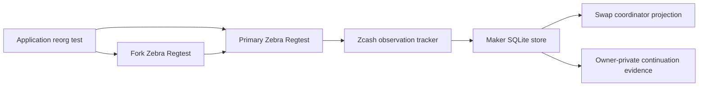
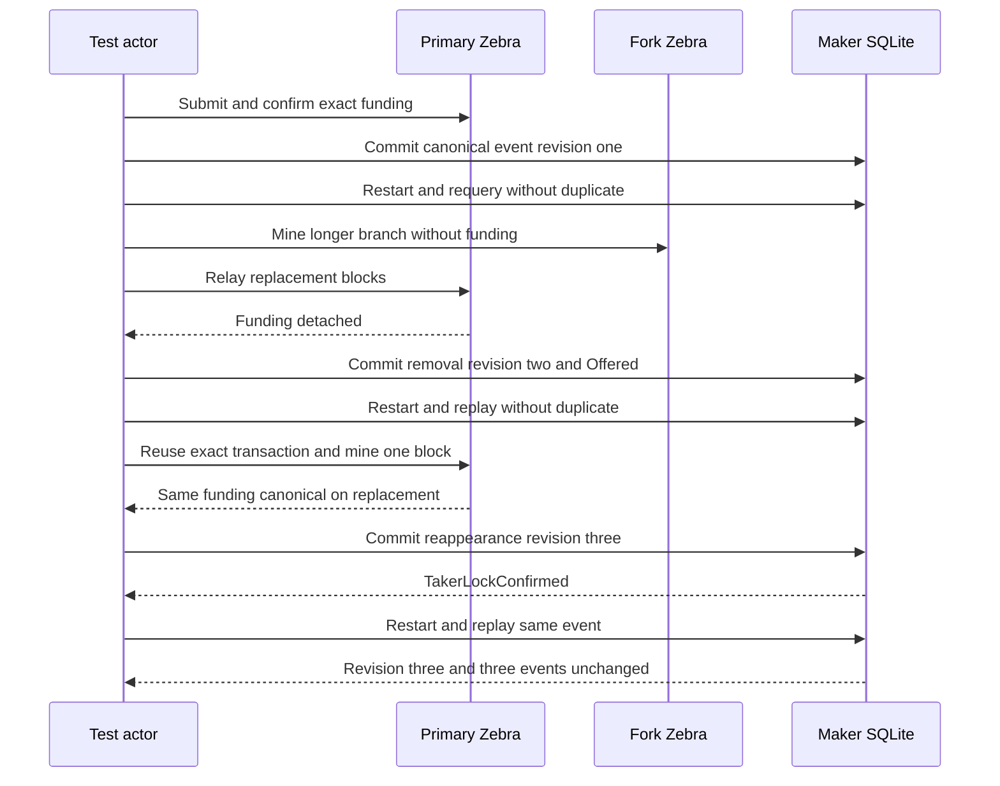

# ADR 0202: Resume ZEC application after canonical reappearance

Status: Accepted for exact pushed-source local-node replay

## Context

ADR 0201 proves that Zebra and the ZEC SDK select one canonical spend after a
competing-fork replacement. The existing Maker runtime test also persisted a
real funding removal and survived restart, but stopped in `Offered`. M7 R1
needs evidence that the application can safely resume when the identical
agreement-pinned funding transaction becomes canonical again.

## Decision

Extend the existing two-Zebra `zebra_runtime_restart` test rather than create a
new simulator. After the longer fork removes the funding transaction, restart
the real schema-22 Maker SQLite store, replay its canonical/removal journal,
and require the exact transaction either to remain in Zebra's mempool or be
rebroadcast byte-identically. Mine one replacement-branch block, validate the
same agreement-bound output from fresh RPC evidence, and apply its canonical
reappearance at expected revision 2.

The store must atomically advance to revision 3 and phase
`TakerLockConfirmed`, preserving the immutable funding transaction ID. A final
restart and identical event replay must report `was_replay`, retain revision
3, and leave exactly three journal events. Optional owner-private evidence is
selected by `M7_ZEBRA_APPLICATION_REORG_EVIDENCE`, created once with mode
`0600`, and excludes endpoints, raw bytes, credentials, paths, and process
identities.

## Atomicity and evidence scope

The funding observation event and swap projection are one SQLite transaction,
so a crash cannot expose the re-mined chain fact without the corresponding
phase or vice versa. Revision CAS makes removal and restoration monotonic, and
the immutable agreement binding prevents a different transaction or output
from substituting for the original lock. No Maker dependent lock exists in
this pre-dependent schedule, so reverting to `Offered` suppresses progress
until the exact funding reappears; resumption restores only the previously
authorized first-lock state.

This is real Zebra plus application-store continuation, not a full daemon/Chat
journey and not a post-second-lock replacement policy. It does not prove LEZ
rollback, cross-pair reorganization behavior, fee pressure, public networks,
or immunity to a future reorganization. Those remain separate M7 work.

## Consequences

- The test covers canonical funding, restart, real detach, removal projection,
  restart, exact re-mining, resumption, and idempotent replay in one run.
- Runtime resources are two isolated Zebra 5.2.0 Regtest containers, dynamic
  loopback RPCs, deterministic local outputs, and one run-owned SQLite store.
  No public peer, RPC, faucet, funds, or deployment participates.
- Cold image/dependency acquisition can use pinned external registries;
  runtime variance is local Docker, ports, CPU, disk, and scheduling only.
- Exact cleanup stays scoped to the runner's Compose project and owned image.
- No external security review or security-completion claim is part of this ADR.
