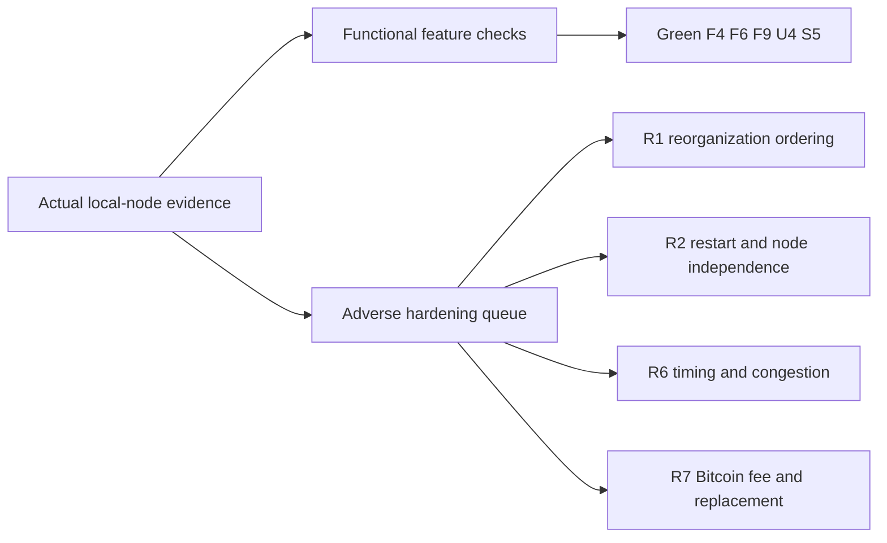
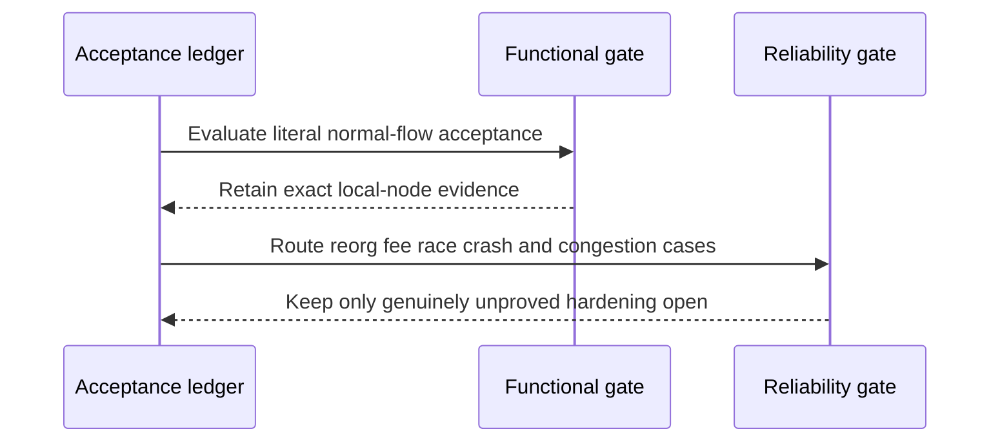

# ADR 0203: Separate functional acceptance from reliability hardening

Status: Accepted

## Context

The M7 ledger had begun to hold F4, F6, F9, U4, and S5 open for reorganization,
fee-pressure, congestion, cutoff-race, crash-seam, and adverse-schedule work.
RFP-003 specifies those concerns separately under R1, R2, R6, and R7. Keeping
the same work open in both sections obscures what the actual local-node user
flows already prove and makes the functional boundary a moving target.

This decision changes classification only. It does not remove a test, weaken a
runtime invariant, claim public-network behavior, or claim future-reorg
immunity.

## Decision

Close a functionality or user-journey row when its literal feature and normal
role-correct local-node paths are reproducibly demonstrated. Track adverse
continuation only in the corresponding Reliability row:

| Functional row | Local-functional evidence | Remaining reliability owner |
|---|---|---|
| F4 | Both actual ZEC claim directions, ordered two-lock refund, reverse first-lock refund, and enforced LEZ-before-ZEC ordering/margin profile | R1 and R6 |
| F6 | Actual claim/refund/punishment outcomes, mutually exclusive terminal branches, durable one-attempt effects, and replay without duplicate sends | R1, R2, R6, and R7 |
| F9 | Headless Maker configuration, pricing, advertisement, execution, monitoring, service lifecycle, and all-pair Claim/Refund CLI routes | R2 and the pair-specific R rows |
| U4 | Taker discovery, initiation, receipt-bound monitoring, Claim/Refund services, and actual BTC/XMR/ZEC journeys | R1, R2, R6, and R7 |
| S5 | A runnable reference integration exists for BTC, XMR, and ZEC through the same application surface | The still-open F, R, and D rows |

F3 is now GREEN because exact pushed run `m7xmrconc-d8efb7ca` retains the
literal XMR concurrency role E2E. It composes the process-level two-application
overlap with one private LEZ v0.2 and official Monero Regtest topology; ADRs
0204 and 0206 bind the checked evidence and distinct Taker authority.

## Atomicity and scope

Atomic swaps do not use a distributed database transaction across chains.
Their atomicity is conditional: immutable agreement terms, role-specific
spend paths, ordered timelocks, finality gates, persist-before-effect journals,
exact transaction identities, mutually exclusive terminal branches, and
observe-before-resend recovery ensure either the cooperative claim path or the
safe recovery path remains available. The retained pair certificates prove
those paths on deterministic local nodes. R1, R2, R6, and R7 remain the honest
place for future-fork, process-failure, clock, congestion, and Bitcoin fee
stress.

GW-M4-003 remains an upstream production disposition: the XMR punishment path
is an intentional COMIT economic-safety outcome, not a literal two-leg refund.
Per project policy, that Logos/RFP wording discrepancy is reported but does not
block local functional certification.

No public RPC, faucet, public funds, peer, or public deployment is newly used
or claimed by this decision. No external security review or security
completion is claimed.
