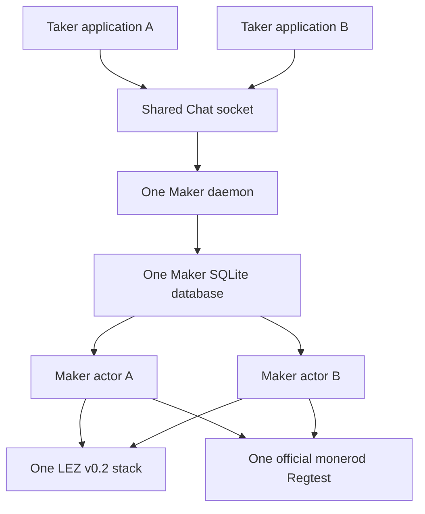
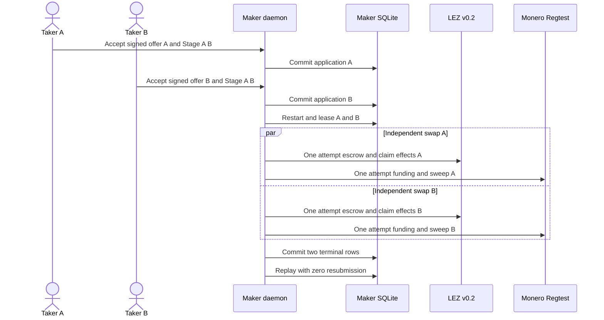
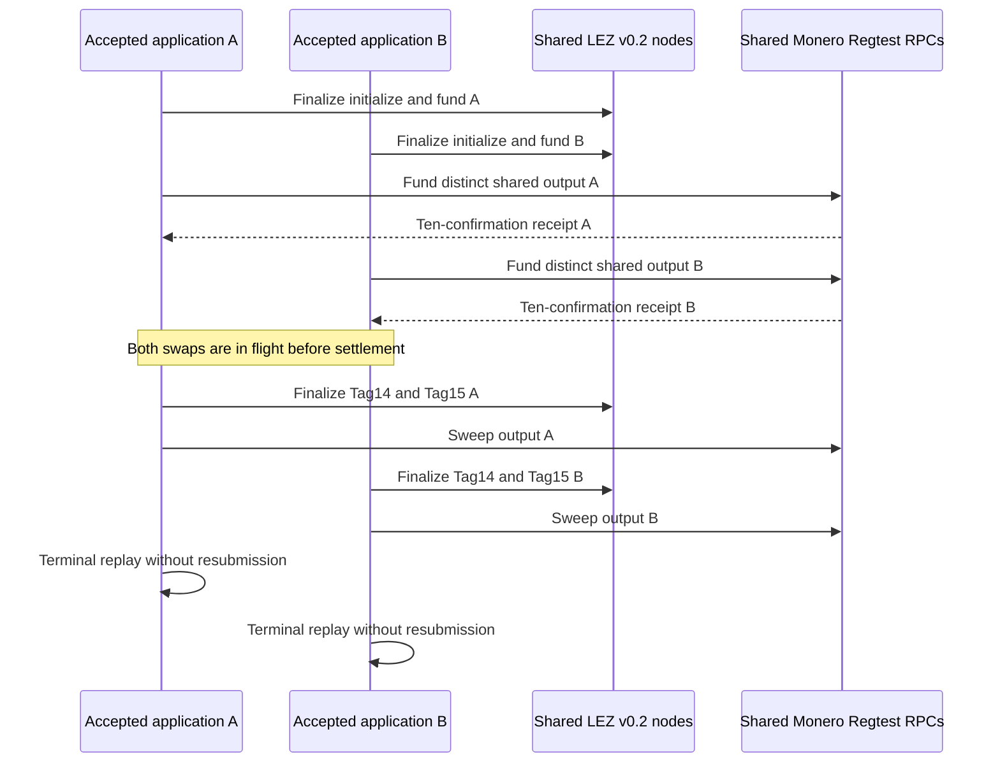

# ADR 0204: Run two XMR applications through one daemon

Status: Accepted for implementation; dual semantic source path GREEN

## Context

F3 literally requires an XMR concurrency role E2E. ADR 0200 proves that two
accepted XMR rows can overlap, restart, and terminalize independently in one
real Maker daemon and SQLite database, but deliberately uses non-chain marker
actors. Separate actual-node XMR certificates prove Claim, Refund, Punish, and
restart paths one swap at a time. Neither result alone proves the required
joined boundary.

Running two independent top-level harnesses would not exercise the shared
application or chain topology users actually encounter. The concurrency mode
therefore belongs inside the existing actual XMR runner.

## Decision

Add a fail-closed `M7_XMR_ACCEPTED_CONCURRENCY=1` mode selected only by
`run-m7-xmr-accepted-concurrency-poc.sh`. It fixes application mode, the
LEZ-first direction, semantic Claim, and two accepted swaps. It is mutually
exclusive with the single-swap crash, losing-branch, Refund, and Punish modes.

The implementation will retain one Maker daemon, database, Delivery
directory, Chat socket, LEZ v0.2 topology, deployed program, and official
Monero Regtest daemon. Each swap retains a distinct authenticated offer,
reservation, agreement, Stage A/B material, Maker/Taker journal, actor store,
Monero output, LEZ escrow, and terminal evidence packet. Both applications
must be accepted before either actor is activated, and both swaps must be in
flight before settlement begins.

## Atomicity and evidence scope

Each swap is conditionally atomic on its own immutable terms and ordered
claim/recovery paths; the two swaps are not atomic with each other. Distinct
authority and journals prevent one application from spending or replaying the
other. Persist-before-effect and observe-before-resend rules remain per swap.
The concurrency certificate must not claim a distributed transaction or
future-reorganization immunity.

The source contract is GREEN. F3 remains open until a clean pushed-source run
retains two authenticated acceptances, actual effects on the one shared node
topology, terminal replay, sanitized evidence, and exact scoped cleanup.

The first implementation slice adds paired owner-private inputs to the existing
agreement helper. Agreement B copies the exact Maker agreement key and Monero
view key used by agreement A, which is the identity the one Chat daemon
authenticates. Fresh entropy still produces agreement B's Maker claim/refund
keys, DLEQ share, Taker identity, and all role journals. The paired inputs fail
before output creation when only one is supplied. Strict Clippy, all eight
provisioning tests, the helper contract, and the shared-daemon process
regression are GREEN.

The second source slice now creates offer/reservation/agreement B, validates a
distinct swap and Stage A/B, provisions two Maker actor rows in one registry,
starts two daemon workers, and accepts both Taker applications through the one
Chat socket. One restart reconciles both Delivery offers; Delivery-free exact
replay must preserve both receipts, four role journals, four actor roots, and
both typed Blocked projections before Tag13 activation. Existing M4/M5 source
contracts remain GREEN. This is not yet the actual-node F3 certificate.

The third source slice gives agreement B its own Tag13 state and typed handoff,
two role-bound sidecars, neutral-wallet funding/verification receipt, prepared
Tag14 state, receipt-v2 Taker effect authority, finalized Tag14 and Tag15,
Monero claim sweep, cross-chain binding, and terminal replay. These components
share the same LEZ sequencer/indexer/program and the same official Monero
daemon/wallet RPC topology as agreement A. The runner orders both finalized
LEZ escrows and both confirmed Monero outputs before invoking either Tag14.
It then settles A and B independently and verifies that terminal receipt
replay leaves all four one-shot Tag15/Monero submission files byte-identical.
The focused source contract and the pre-existing M4/M5 compatibility contracts
are GREEN. A clean pushed-source Docker replay is still required before F3 is
closed.

The first clean replay from `b57891a` proved both authenticated applications,
both finalized LEZ Tag13 escrows, and swap A's confirmed Monero output. Swap B
then failed before transaction identity because the shared Maker wallet RPC
had not refreshed after swap A mined ten confirmation blocks; its spendable
change view was stale. Exact cleanup passed and no settlement began. The fix
refreshes that funding wallet from the configured restore height before each
one-shot transfer. Refresh is observation-only: it neither submits nor retries
a transaction. The focused RED ordering contract, both funding-binary tests,
formatting, and M4/M5 compatibility gates are GREEN.

Replay `m7xmrconc-f2a4869a` then proved both finalized Tag13 escrows and both
distinct ten-confirmation Monero outputs. It failed before Tag14 because the
neutral view-wallet RPC had swap B open when swap A's release preparation
observed its output. Exact cleanup again passed. Release preparation is now
ordered beside the matching open view wallet: observe and prepare A after A's
confirmed output, then fund/verify and prepare B. Preparation writes only
local durable state and submits no chain effect. Both Tag14 activations remain
strictly after both confirmed outputs, preserving the in-flight-before-
settlement requirement. The focused ordering/daemon regression and existing
M4/M5 contracts are GREEN.

Runtime external resources are empty: only isolated literal-loopback LEZ v0.2
and official Monero 0.18.5.1 Regtest services with deterministic local funds
participate. No public RPC, peer, faucet, public funds, or public deployment is
used. No external security review or security-completion claim is part of this
decision.

Replay `m7xmrconc-4d4f13aa` proved the corrected ordering through two accepted
applications, two finalized Tag13 escrows, both distinct confirmed Monero
outputs, both matching release preparations, and admitted Tag14 A. Its
read-only exact-finality child then repeatedly exceeded the generic 30-second
process bound while still verifying local finalized blocks. No submission was
retried. The run was stopped at that bounded observation seam and exact cleanup
passed. ADR 0205 gives only this observer a 120-second bound; mutation and
preflight remain at 30 seconds. Fresh pushed-source replay is required.
