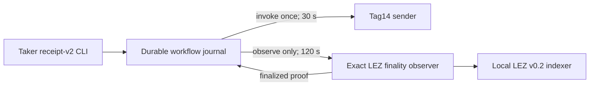
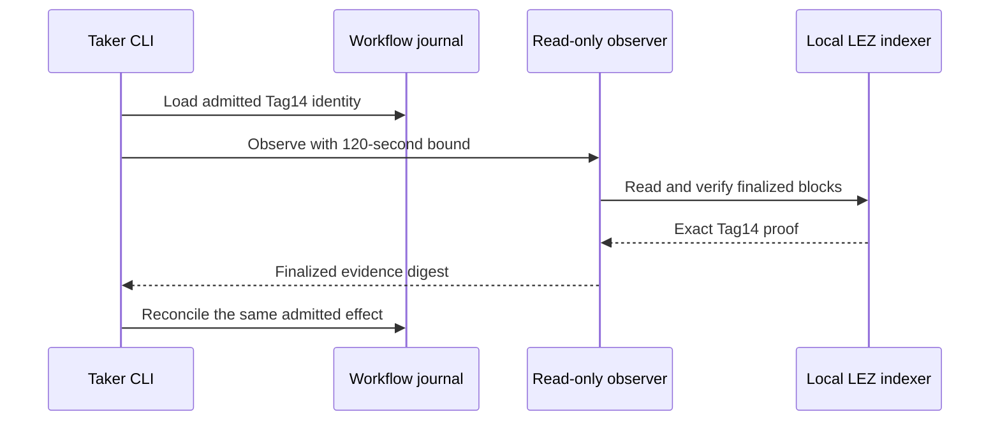

# ADR 0205: Bound exact XMR finality observation separately

Status: Accepted; focused regression GREEN, actual-node replay pending

## Context

Clean run `m7xmrconc-4d4f13aa` admitted two applications, finalized both Tag13
escrows, confirmed both distinct Monero outputs, prepared each release beside
its matching open view wallet, and admitted swap A Tag14. The subsequent
receipt-v2 command repeatedly produced no result because its child exact LEZ
observer exceeded the generic 30-second effect-process timeout. The observer
was still consuming CPU while verifying finalized block proofs and was killed
at the same bound on each attempt. No retry submitted a chain effect.

The exact cleanup trap then removed every run-owned process, port, container,
network, volume, image, and ephemeral path; the foreign sentinel survived and
no broad cleanup ran.

## Decision

Keep mutation and preflight children at 30 seconds. Give only the read-only
exact-finality observer a named 120-second completion bound. The bound is four
times the previous value and remains finite; an expiry still fails closed and
does not change the workflow journal or authorize a resend.

## Atomicity and scope

This does not enlarge an authorization window and does not add a submission
retry. Persist-before-effect and observe-before-reconcile remain unchanged.
It only allows a valid local proof computation to finish. The swap remains
conditionally atomic under the documented LEZ and Monero finality assumptions;
no distributed transaction or future-reorganization immunity is claimed.

Runtime resources remain one isolated loopback LEZ v0.2 stack and one official
Monero 0.18.5.1 Regtest topology. No public RPC, peer, faucet, public funds, or
public deployment participates. This is functional QA, not a security review.

## Verification

`test-m7-xmr-accepted-concurrency-contract.sh` first failed because the named
bound was absent, then passed after the implementation changed only the
read-only observer. The shared-daemon process regression completed two
accepted XMR applications across restart in 38.97 seconds. A fresh clean
actual-node replay is still required before F3 closure.
