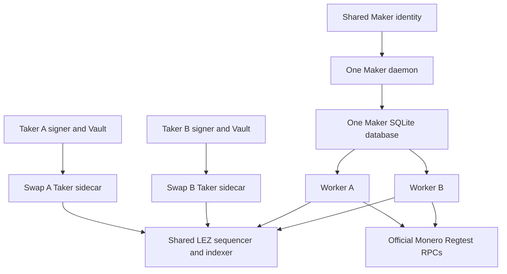
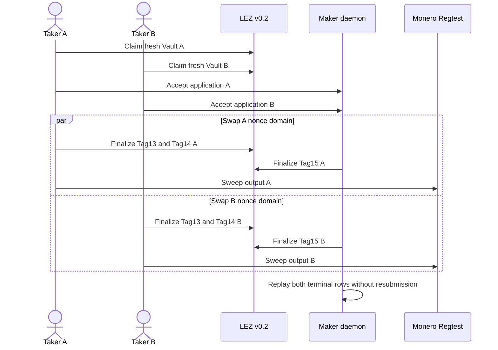

# ADR 0206: Give concurrent Takers distinct LEZ identities

Status: Accepted and actual-node certified for M7 functional F3

## Context

Run `m7xmrconc-6567322a` reached two accepted applications, two finalized
Tag13 escrows, two confirmed Monero outputs, and two prepared releases. Tag14
A was admitted by the sequencer but never appeared in either sequencer or
indexer while the finalized tip advanced beyond the complete scan window.
Read-only observer attempts completed, so increasing their timeout did not fix
the missing chain effect.

The harness had modeled two users with separate application and sidecar state
but one Taker LEZ signer. Independent sidecars therefore prepared against one
account nonce without a shared nonce coordinator. This was not the user
topology F3 is intended to emulate.

## Decision

In accepted-concurrency mode, provision `taker-b` as a third fresh LEZ genesis
actor with allocation 300000 and a separate derived Vault. Onboard it with one
finalized Vault Claim using protocol role `taker`, but keep its label, signer,
state directory, evidence, and nonce domain distinct. Swap A remains bound to
Taker A; swap B agreement, Tag13, and Taker sidecar bind only to Taker B.

One Maker identity, daemon, database, Delivery directory, Chat socket, LEZ
Bedrock/sequencer/indexer stack, deployed escrow program, monerod, and wallet
RPC topology remain shared. The optional third actor is absent from ordinary
M4/M5 runs, whose exact two-actor contracts remain unchanged.

## Atomicity and evidence scope

The change does not make the two swaps one transaction. It restores per-user
authority isolation: each Taker serializes its own ordered LEZ effects through
one signer and nonce domain, and neither Taker can consume the other's Vault,
escrow, journal, or Monero output. Each swap retains its existing conditional
atomicity argument: LEZ claim disclosure is accepted only after the committed
Monero lock, and the corresponding Monero sweep uses only that swap's
finalized claim material. Persist-before-effect and observe-before-resend rules
remain per swap. No distributed-commit or future-reorganization immunity is
claimed.

Runtime resources are isolated literal-loopback LEZ v0.2 and official Monero
0.18.5.1 Regtest services with local genesis and Regtest funds. No public RPC,
peer, faucet, public funds, or public deployment participates. External review
is outside this functional QA decision.

## Verification

The focused contract began RED because the second identity, genesis actor,
Vault Claim, agreement owner, Tag13 signer, and Taker sidecar binding were
absent. It is GREEN only when each primary and secondary function is checked
individually, preventing a swapped-authority false positive. Existing default
two-actor stack and onboarding contracts remain GREEN. Exact pushed run
`m7xmrconc-d8efb7ca` completed both swaps, terminal replay, sanitized evidence,
and exact cleanup; its checked certificate closes F3.
