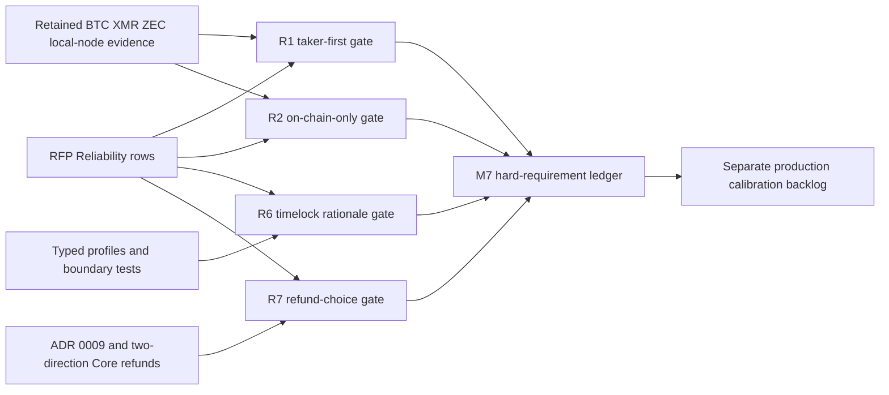
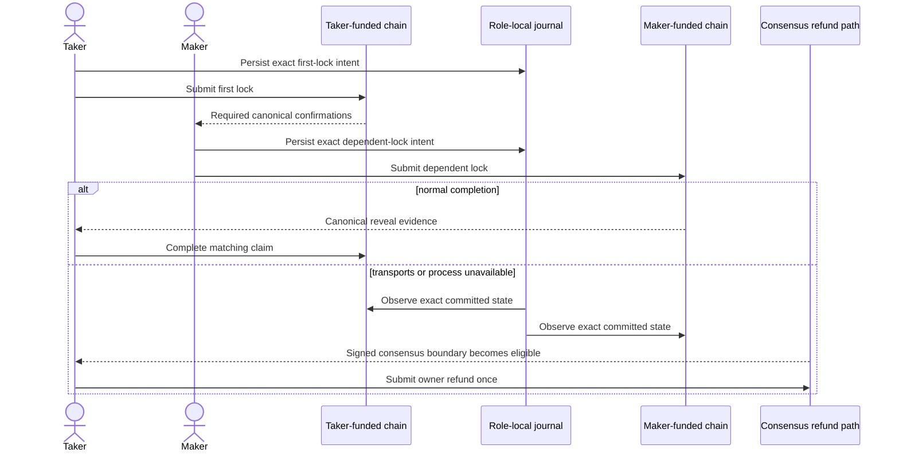

# ADR 0207: Certify literal reliability acceptance separately from production calibration

Status: Accepted for private-local functional M7 certification

## Context

The live RFP defines four remaining repository-owned Reliability duties more
narrowly than the accumulated production-hardening backlog:

- R1 requires Taker-first ordering and blocks the Maker lock until the Taker
  transaction is confirmed;
- R2 requires an in-progress swap to complete or recover from local state and
  chain nodes without Delivery, Chat, or another off-chain channel;
- R6 requires timelock parameters to account for per-chain block-time variance,
  congestion, and clock drift, with choices and rationale documented; and
- R7 requires the selected Bitcoin refund construction and its trade-off to be
  justified. The additional loss, corruption, fixed-fee, and protocol-ordering
  mitigation inventory is conditional on choosing the pre-signed construction.

The repository had kept these rows open for broader public-network calibration,
every possible process seam, future-reorganization immunity, and fee-bump
machinery. Those remain valuable production work, but they are not literal
missing acceptance work for these four rows. Cybersecurity assessment and
external review are outside this functional decision.

## Decision

Add one executable aggregate gate per Reliability row. Each gate consumes
existing CI-pinned contracts and retained actual-node evidence; it cannot turn
an unverified prose claim green.

R1 is GREEN at the private-local functional boundary. Actual Bitcoin, Monero,
and Zcash role flows demonstrate that the direction-derived Taker lock occurs
first and that the Maker effect waits for the required canonical observation.
The Zcash application reorg certificate additionally proves a detached first
lock returns to `Offered` and the dependent Maker lock remains absent until the
same transaction is canonical again.

R2 is GREEN at the private-local functional boundary. Both Bitcoin directions
complete from persisted role state with no post-lock Delivery/Chat
configuration. XMR Claim and Refund process-kill certificates recover through
the original local journals and local nodes without resubmission. ZEC Claim
recovers an accepted first-lock transaction after both owner processes are
killed and transports are removed; ZEC Refund reaches terminal state with the
Maker absent and only the owner Taker service plus local nodes.

R6 is GREEN at the documented private-local profile boundary. The named profile
documents confirmation depths, recovery horizons, per-chain clock domains, and
explicit observation, reorg, inclusion, congestion, drift, and reaction
budgets. Typed construction rejects zero/short/overflowing or cross-domain
margins. Actual local refund certificates exercise the signed boundaries. The
profile explicitly does not claim a finite proof-of-work worst case or audited
mainnet calibration.

R7 is GREEN for the selected Taproot script-path construction. ADR 0009 chooses
a consensus-enforced CSV tapleaf and contrasts it with a pre-signed key-path
refund: the selected branch is visible, but recovery does not depend on
retaining one setup-time transaction, its fixed fee, or protocol-only timelock
ordering. Both directions have actual Bitcoin Core refund spends of the exact
funding outpoint, paired LEZ refunds, mutually exclusive Claim absence, and
zero-effect terminal replay. A generic RBF/CPFP mechanism is not a condition
the RFP attaches to the selected script-path option.

## Atomicity and limits

The aggregate gates do not invent a distributed transaction. Conditional
atomicity still comes from immutable per-swap terms, Taker-first admission,
canonical confirmation gates, role-local persist-before-effect journals,
observe-before-resend recovery, and ordered consensus deadlines. Reorg evidence
demonstrates withdrawal and exact reappearance before the dependent effect;
it does not promise immunity to every future fork. Timelock rationale states
assumptions and failure response; it does not convert nominal block cadence
into a guaranteed maximum. Script-path CSV protects refund eligibility in
Bitcoin consensus but does not guarantee prompt inclusion during an unbounded
fee market outage.

All runtime certificates use isolated literal-loopback nodes, deterministic
local genesis or Regtest outputs, and no public RPC, peer, faucet, public funds,
or public deployment. Public calibration, value-at-risk tuning, operational fee
policy, and external review remain production-release work and are not claimed
by the M7 functional tag.
