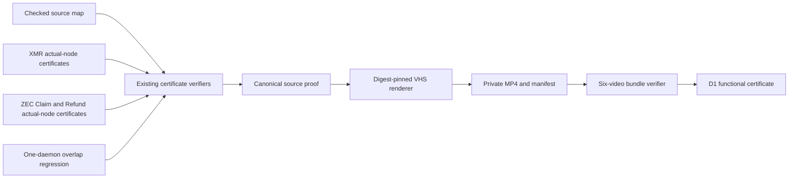
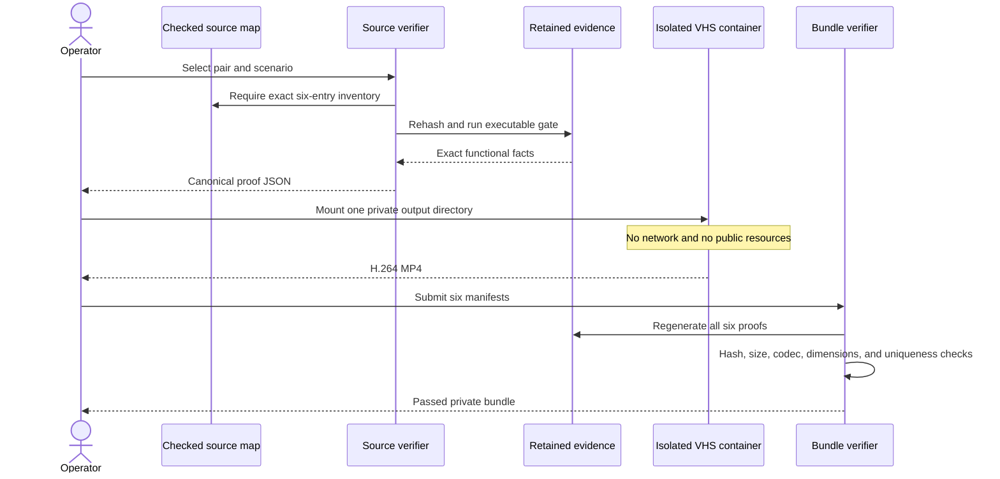

# ADR 0208: Bind private M7 demos to retained actual-node evidence

Status: Accepted for M7 functional D1 certification

## Context

D1 requires happy, refund/timeout, and concurrent demo videos for both XMR-LEZ
and ZEC-LEZ. Rerunning six expensive chain journeys solely while a screen
recorder is active would make the result less reproducible and would couple
presentation to terminal timing. A video is also not evidence by itself.

The repository already retains checked actual-node certificates for all XMR
scenarios and both ZEC terminal scenarios. It has one real-daemon multi-pair
overlap regression for scheduler and state isolation, but no single joined
two-ZEC actual-node concurrency run. That distinction must survive rendering.

## Decision

Use a checked source map as the only input to a deterministic video renderer.
Every entry binds its evidence files by SHA-256 and invokes their existing
executable verifier. The renderer creates private mode-0600 proof,
walkthrough, script, tape, MP4, and manifest artifacts beneath a mode-0700
directory. A digest-pinned VHS container receives only that directory, has no
network, and uses a unique exact container name.

XMR happy, refund, and concurrent videos and ZEC happy and refund videos use
joined actual-node certificates. ZEC concurrent uses the honest layered model:
the real daemon regression proves overlapping actor scheduling and isolated
state, while separately bound actual-node Claim and Refund certificates prove
ZEC chain effects. Its manifest fixes
`joined_actual_node_concurrency=false`; neither the video nor bundle may
represent it as one joined concurrent chain run.

## Atomicity interpretation

The videos explain conditional atomicity; they do not create it. Each happy
case binds the order in which a canonical first lock, dependent lock, reveal,
and follower claim occurred. Each refund case binds the absence of the
dependent or revealing action and the consensus recovery route. Concurrent
swaps are individually conditionally atomic and isolated from each other; the
pair of swaps is not one distributed atomic transaction. For layered ZEC
concurrency, only scheduler/state isolation is a concurrency claim.

All demonstrated networks are private local nodes. No public RPC, public peer,
faucet, public funds, or public deployment is used, so external network
availability cannot make video generation flaky. The renderer does not rerun
chains and does not handle private keys. Cybersecurity assessment and the
independent S12/S13 review remain outside this functional decision.

## Consequences

- A reviewer can regenerate each proof and detect evidence, source-map, video,
  or manifest tampering.
- The six MP4 files remain private and ignored; a sanitized checked certificate
  can publish only hashes, sizes, durations, and the explicit evidence limits.
- Replacing local nodes with public endpoints remains a configuration and
  deployment concern, not a hidden prerequisite of D1.
