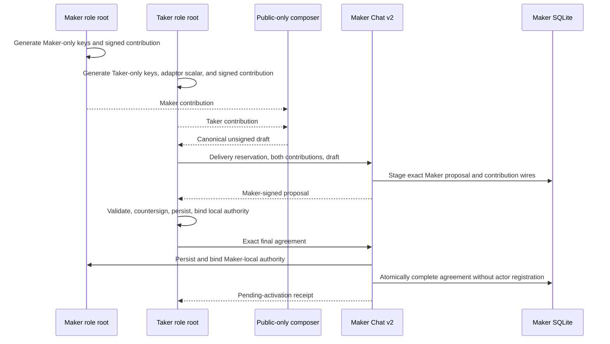

# ADR 0209: Bind BTC Chat to independent role contributions

- Status: Accepted for the pre-effect application boundary
- Date: 2026-08-25
- Milestone: production-shaped BTC PoC hardening

## Context

The original BTC application PoC obtains an unsigned draft and both role-fixed
actor templates from `btc-local-poc-provision`. Its agreement is cryptographically
real, but the provisioning command is a fixture authority: one process can see
or derive material for both participants before Chat begins. That is useful for
deterministic chain tests and must remain reproducible, but it is not an honest
operational model for independent Maker and Taker installations.

The replacement boundary must preserve the existing canonical agreement wire,
Delivery offer reservation, durable one-winner store, and SDK validation while
ensuring that each installation creates only its own secrets. Countersigning is
also not sufficient authority to fund Bitcoin, prepare refunds, or submit a
public effect; those remain explicit later ceremonies.

## Decision

Add a `btc-role-preflight` command and contribution-bound Chat schema v2. Each
role independently bootstraps an agreement signing key, refund key, successful
claim destination, and funding key; only the Taker creates the adaptor scalar.
It emits a signed, secret-free contribution binding the role, direction,
Delivery pre-session identity, Bitcoin policy, LEZ chain/program identity,
participant identity, funding key, role entropy, and expiry. Neither bootstrap
accepts a peer root or creates peer-private material.

An offline composer consumes the exact Maker and Taker contribution wires plus
explicit observed chain facts and recovery policy. It derives the joint swap
ID, fixed-order `MuSig2` aggregate key, direction-correct funder/refund key,
P2TR output, cooperative claim, LEZ depositor/claimant, and canonical unsigned
agreement draft. It has no private-key input and uses create-new output.

`btc_chat_propose_v2` authenticates Delivery, requires the daemon's exact local
Maker contribution, validates both contribution proofs and the draft, signs
only as Maker with deterministic BIP-340 signing so the same request can
reconstruct the exact proposal bytes, and durably stages the exact two
contribution wires. The Taker validates the proposal and countersigns with its
own role key. `btc_chat_complete_v2` first persists and binds the exact final
wire to the Maker role root, then atomically stores the final agreement,
coordinator, offer consumption, and replay result without registering a fixture
actor. The Taker likewise persists the agreement and peer contribution in its
own root before completion. Once a role root has durably accepted the exact
binding before expiry, its exact retries are accepted after contribution
expiry; changed bytes or cross-wired identities fail closed.



## Operator sequence

The JSON specs are strict owner-private inputs. Paths below must be normalized,
absolute, mode 0700 directories or mode 0600 files as applicable.

```bash
cargo run --locked -p btc-role-preflight -- bootstrap \
  --spec-file "$MAKER_SPEC" --output-root "$MAKER_ROLE"
cargo run --locked -p btc-role-preflight -- bootstrap \
  --spec-file "$TAKER_SPEC" --output-root "$TAKER_ROLE"
cargo run --locked -p btc-role-preflight -- compose-draft \
  --spec-file "$CHAIN_FACTS" \
  --maker-contribution-file "$MAKER_ROLE/contribution.borsh" \
  --taker-contribution-file "$TAKER_ROLE/contribution.borsh" \
  --output-root "$DRAFT_ROOT"
```

Start `lez-maker-daemon` with its ordinary Delivery/database/socket arguments,
`--btc-maker-signing-key-file "$MAKER_ROLE/private/agreement.key"`, and
`--btc-maker-role-root "$MAKER_ROLE"`; do not provide BTC actor templates for
this v2 boundary. Accept with `lez-taker` using the ordinary selected offer,
reservation, Delivery, Chat, amount, direction, time, and agreement-output
arguments plus:

```bash
--unsigned-draft-file "$DRAFT_ROOT/unsigned-draft.borsh" \
--maker-contribution-file "$MAKER_ROLE/contribution.borsh" \
--taker-contribution-file "$TAKER_ROLE/contribution.borsh" \
--btc-role-root "$TAKER_ROLE" \
--taker-signing-key-file "$TAKER_ROLE/private/agreement.key"
```

Successful schema-v2 output says `ready_for_public_effects:false` and
`fixture_actor_authority_used:false`. Both role roots then contain the exact
peer contribution, final agreement, and a binding receipt; no actor bundle or
acceptance receipt is created.

## Atomicity, replay, and failure boundary

Role-root persistence precedes the Maker database completion deliberately. If
the database transaction fails, a safely bound but inactive agreement remains
and the exact request can retry; if role binding fails, the database cannot
complete. SQLite completion remains one local transaction for final agreement,
coordinator, consumed offer, negotiation state, and request replay. There is no
distributed transaction across the two filesystems, Bitcoin, and LEZ.

Within each role root, the inactive `agreement-binding.json` receipt is the
acceptance linearization point and is published only after full in-memory
validation. The peer contribution and agreement artifacts follow. A crash can
therefore leave only a safe inactive prefix; an exact restart treats the
receipt as durable acceptance and repairs missing exact artifacts even after
the contribution TTL, while a conflicting retry fails closed. Chat carries the
Maker receipt's original acceptance time into the SQLite transaction, so a
crash after Maker binding but before database commit remains exactly retryable
after expiry; a peer that never reached Maker binding before expiry gains no
such exception.

The binding receipt records the original fresh acceptance time. Restart replay
revalidates all immutable fields and exact bytes but does not reinterpret a
previously accepted agreement as invalid merely because the contribution TTL
has since elapsed. A changed peer contribution, final wire, local private
counterpart, role, direction, chain identity, or stored byte is a conflict.

## Consequences and remaining gate

- The countersigned agreement path no longer depends on fixture actor configs
  or a process that possesses both roles' private authority.
- `btc-local-poc-provision` remains the deterministic legacy fixture path for
  existing chain-corridor regression; Chat v1 remains compatible with it.
- The v2 result is intentionally pending activation. A separate post-agreement
  ceremony must create and validate exact refund presignature journals, freeze
  lock effects, authorize funding with the role-owned funding key, and only
  then register runnable role actors.
- This decision proves role separation, transcript binding, durable acceptance,
  and replay. By itself it does not prove Bitcoin/LEZ submission, finality,
  claim, refund, a public network, or production deployment.
