# ADR 0211: Discover signed offers over Logos Delivery

- Status: accepted for the Basecamp PoC
- Date: 2026-08-26
- Scope: broadcast order-book discovery and competing negotiation admission

## Context

ADR 0210 moved private negotiation messages to Logos Chat but deliberately left
offer discovery on the signed run-local filesystem adapter. That meant a real
Basecamp installation still needed shared storage and a manually transcribed
Maker Chat address before it could start the otherwise real peer flow.

Chat direct/group conversations are not a public order-book primitive. The
pinned Delivery module already exposes content-topic subscribe/send/events and
shares Chat's node, so the Maker can broadcast an advisory offer projection
without creating another network identity or node.

## Decision

Use exact topic `/lez-atomic-swaps/1/offers/json`. The Maker app asks the owner
daemon for a bounded signed snapshot and sends each canonical byte string
through `delivery_module.send`. The snapshot is cursor-paged below a 48 KiB
payload budget so every owner-RPC response remains inside the daemon's 64 KiB
transport bound. It refreshes every 10 seconds. Each entry has a 30-second
signed lease, so three missed refreshes remove it from an app-lifetime Taker
index without requiring Delivery history queries.

The announcement signature uses the existing Maker protocol identity key and covers:

- the exact nested signed immutable offer envelope;
- Maker public identity and current app-lifetime Chat address;
- durable offer revision and `active`, `reserved`, `consumed`, `withdrawn`, or
  `expired` projection;
- announcement and exclusive lease times.

The Taker gateway verifies canonical encoding, both signatures, low-S ECDSA,
bounds, times, identity equality, immutable offer validation, and monotonic
`(revision, announcement time)` ordering before indexing. The key is
`(Maker identity, offer ID)`, so different Makers may use the same local ID.
Non-active signed updates remain briefly visible as unavailable and can never
be replaced by a later active replay. Selecting an active entry resolves the
signed Chat address and creates the direct conversation automatically. The
exact announcement bytes also cross the unprivileged UI as a public proof and
are refreshed from the selected live index entry when the user confirms, then
verified again by the Taker owner service at admission. Reviewed terms remain
pinned by the expected envelope digest, route, Maker identity, and exact quote.
Thus a normal review can outlive the original 30-second proof without weakening
freshness; a failed refresh stops initiation instead of falling back to the
browse-time proof. The production Basecamp initiate path does not re-read the
legacy filesystem offer index.

The Delivery timestamp and network path are advisory. Trusted local time
applies the lease; the nested signed offer digest remains the agreement
commitment; and the Maker SQLite store remains the only reservation authority.

```mermaid
flowchart LR
    MakerStore["Maker SQLite<br/>authoritative offer state"] --> Snapshot["Signed, leased<br/>offer projection"]
    Snapshot -->|broadcast topic| Delivery["Logos Delivery"]
    Delivery --> Verify["Taker verifies<br/>signatures, lease, revision"]
    Verify --> Index["Bounded app-lifetime<br/>offer index"]
    Index -->|selected Chat address| Chat["Private Logos Chat<br/>negotiation"]
    Chat --> Reserve["Maker staging transaction"]
    Reserve -->|one winner| MakerStore
    Reserve -->|conflict| Loser["Explicit unavailable result"]
    MakerStore -->|newer reserved/consumed projection| Snapshot
```

## Conflict semantics

Several Takers can receive the same active rebroadcast and begin concurrently.
The Maker gateway keeps up to 32 peer-isolated conversations and keys in-flight
and replay state by `(conversation ID, frame ID)`. Responses carry their exact
conversation in the outbox, so identical frames/results from different Takers
cannot be deduplicated across peers. A temporarily unsendable head is moved
behind other conversations, and an unwind guard always releases its in-flight
key, preventing one failed peer from permanently blocking the other Maker
sessions.

The pair-specific Maker staging transaction uses SQLite `IMMEDIATE`, checks
revision/state, inserts the negotiation, and conditionally transitions the
offer from active to reserved. Exactly one request commits revision 2. A loser
gets explicit code `-32018` for unavailable/expired/reservation conflict (or
the existing stale-revision conflict), never a successful proposal. Its Taker
index suppresses that offer immediately. The next signed reserved/consumed
rebroadcast converges every listening Taker; an already-committed winner keeps
its private Chat session and completes through durable replay rules.
If a broad conflict response leaves an offer Active, the next strictly newer
signed Active rebroadcast clears that local marker; a fresh Active insert after
lease expiry also clears it.
Browsing a different Maker never resets an existing Taker session
automatically; switching peers requires the explicit idle-only reset control.

## Consequences, bounds, and lifetime

Announcements are at most 32 KiB and Chat addresses at most 1 KiB, so one
standard-Base64 record always fits the 48 KiB snapshot payload budget. Each page
contains at most 128 retryable unexpired records. A bounded sweep keeps its
cursor across event-loop turns, skips a malformed/temporarily unsendable record
without starving later records, and retries omissions on the next complete
sweep, so a large live set reaches the lexicographic tail without monopolizing
the Qt event loop.

Taker indexes hold at most 1,024 entries with at most 128 per Maker, list
responses return at most 16 newest matching entries, and Maker sessions number
at most 32. A full index does not evict a still-live signed ordering state to
admit an unrelated key: existing keys may advance, new keys fail closed, and
lease expiry frees capacity. This prevents a later Sybil burst from resurrecting
an evicted stale Active state. Without an admitted identity set, first-arrival
capacity occupation remains an explicit permissionless-PoC availability limit.
Complete historical rows are never rebroadcast, so lifetime offer count cannot
disable discovery. No reservation ID, swap ID, private role material, or chain
secret appears in the broadcast.

Indexes, addresses, conversations, and announcements live only while the apps
and their gateways live. A clean shutdown does not need a reliable withdrawal:
lease expiry removes a crashed Maker, while an explicit signed state update
for reservation or consumption removes an offer sooner; withdrawal and expiry
converge at the active lease boundary. Durable offers, negotiations, agreements,
and actors remain in SQLite/role stores.

## Offline verification

Codec/index tests transfer the exact production announcement bytes through the
owner-local gateway API, cover address/signature tampering, lease expiry,
active-to-reserved convergence, late active replay suppression, correlated loser
marker clearing, 140-record snapshot paging, bounded list projection, and two
Maker conversations. Snapshot and gateway clocks are injectable only through
explicit test seams, removing the 30-second wall-clock flake window. Existing
one-winner store concurrency tests remain authoritative for reservation
linearization. All process tests use Unix sockets/local nodes,
`CARGO_NET_OFFLINE=true`, and a task-owned container with `--network none`.

The filesystem Delivery adapter remains available only for legacy CLI fixtures,
prepared private-material custody, and deterministic offline tests. Basecamp's
production offer-list call reads the signed in-memory Delivery index and its
initiation call supplies the same signed live proof to the owner service.
