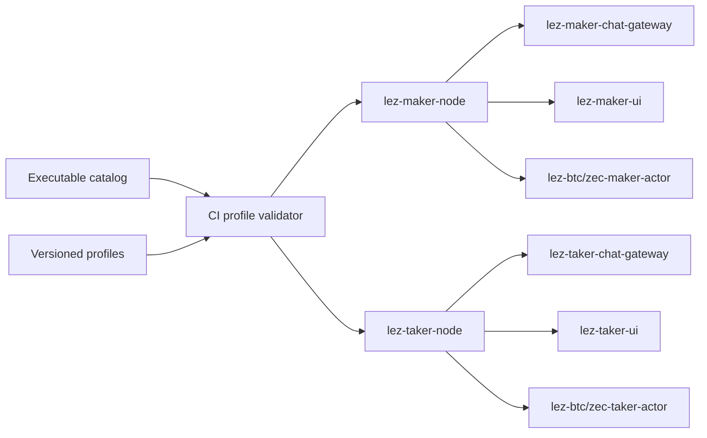

# ADR 0212: Version runtime components and use role-symmetric public names

## Status

Accepted.

## Decision

Supported compositions are data, not an implication derived from every Cargo
target. `deploy/profiles/*.json` owns component lifecycle, executable, socket,
state, credential, identity, dependency, health, verification, and nonclaim
facts. `deploy/executables.json` classifies every host binary and guest/fuzz
target. CI compares that catalog with Cargo metadata.

Public role components use `lez-<role>-<kind>` and pair authorities use
`lez-<pair>-<role>-<kind>`. Maker and Taker Nodes share the strict
`NodeConfigV1` envelope, `--config`, `--socket`, and `--ready-file` startup
contract. Their CLIs share the owner-socket health and fixed systemd
start/stop controls. Role-fixed Chat and pair actor targets reject an explicit
opposite role. The Unix-only development relay is a separate `lez-chat-relay`
target and cannot be mistaken for a role endpoint.

The same contract extends through source ownership and packaging. Shared
transport and configuration contracts live in `lez-node-common`; Maker and
Taker authority and binaries live in separate `lez-maker-node` and
`lez-taker-node` crates. `images/maker-node` and `images/taker-node` contain
only their own role's binaries and directories. This continues through
`lez-maker-ui`/`lez-taker-ui` Basecamp outputs and launchers,
`lez-maker-node.service`/`lez-taker-node.service`, `/run/lez/{maker,taker}`,
`/var/lib/lez/{maker,taker}`, and paired install/config artifacts.
`deploy/role-symmetry.json` is the checked mapping.

## Authority and threat-model delta

The local BTC controller loses Docker authority. A separate local-demo launcher
accepts only schema-one status, run, approval, wait, and evidence jobs; it is
the sole Compose component mounting `/var/run/docker.sock`. Taker initialization
loses the Maker state mount and consumes only a validated compressed public
Delivery identity. These changes reduce the E5 local-process and B3 role-
separation attack surfaces without changing chain or signing protocols.

## Keys and intentional asymmetry

Symmetry never grants one role the other role's keys. The Maker owns the
offer-signing Delivery key and pair-specific Maker actor authority. The
discovery-only Taker Node owns no private swap key before admission; admitted
Taker actor keys remain in its role-local state, while its Chat/Delivery
identity stays with its role-local UI/gateway. Taker setup receives only the
Maker public Delivery identity. Profile manifests must explain every
role-specific credential instead of adding an unused mirror secret.

## Migration

There is no legacy executable compatibility surface. Runtime consumers, tests,
packaging, and UI launchers use the canonical names and role-owned packages
directly.
