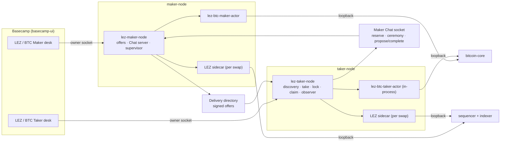

# ADR 0213 — The Nodes own the BTC↔LEZ lifecycle

Status: proposed, 2026-09-03. Supersedes the demo plane described in
`deployment-components-and-rpcs.md` (controller, launcher, runner on the user
path). Builds on ADR 0130 (Taker health contract), 0210 (Chat negotiation),
0211 (Delivery discovery), 0034 (actor activation gate), 0044 (presigned BTC
recovery).

## Context

Today the deployed Maker Node and Taker Node serve offers, discovery, prices
and health. Every transaction of a swap is sent by the reference actors inside
the external runner, which starts its own private Maker application and Taker
CLI per swap, drives the two-party MuSig2/adaptor pre-signing ceremony by
passing JSON files between the roles' `lez-adaptor-role-runner` invocations,
provisions both actors from fixture material, and walks the four gates. The
Basecamp desks reach that pipeline through `btc-demo-controller` and
`btc-demo-launcher`. Section "gap table" of the 2026-09-03 desk survey lists
21 desk features served only by the controller; the Node-side BTC lifecycle
does not exist (`taker_health` reports Bitcoin as `owner_cli_or_demo`).

The intended end state: a Taker runs Basecamp plus its Taker Node, a Maker
runs its Maker Node, they meet over Logos Delivery and Chat, and their own
actors settle on both chains. Nothing else sits on the user path.

Constraint from the operator: everything stays local for now (Bitcoin regtest,
the standing LEZ v0.2 devnet), and network selection is configuration only.

## Decisions

1. **The Nodes spawn the actors; the actors send the transactions.** This
   keeps ADRs 0031/0034/0139: no Node process ever holds a chain-signing key
   for a step; the Maker's supervisor and a new Taker supervisor spawn one-shot
   actors on sealed descriptors, as the Maker does today.
2. **The pre-signing ceremony becomes a Node-to-Node protocol over Chat.** The
   runner's `run_signing_ceremony` (reserve → accept-commitment →
   reveal-nonce → accept-nonce-sign → accept-peer-partial, once per leg) is
   the one piece of the swap that has no Node-side equivalent. It becomes
   typed Chat methods (`btc_ceremony_*_v1`) carried over the existing
   gateways, each role keeping its own signer journal. Without this, a Taker
   Node cannot take an offer it did not pre-arrange with the Maker.
3. **One transport, chosen by configuration.** Node-to-Node messages use the
   role chat gateways. Locally the two gateways are joined by the
   `lez-chat-relay local-relay` dev relay; elsewhere by Logos Delivery. The
   Node configuration names the gateway socket only; which network sits
   behind it is the gateway's concern.
4. **The desks talk only to their Node.** Every controller method gains a Node
   equivalent (offers with a wallet dimension, take, the four gates, swap
   views with turn, progress and effects, evidence). The controller,
   launcher, their sockets and the Docker-socket mount leave the compose
   file. The runner remains the CI certification lane.
5. **Networks are data, not enums.** One `ChainProfile` per chain (Bitcoin:
   network, RPC route, credentials, confirmation policy, fee policy, CSV
   delay; LEZ: endpoints, chain and channel identity, finality depth, program
   IDs) replaces the three disagreeing enums (`CoreConnectivityPolicy`,
   `BitcoinConnectivity`, `RuntimeCompatibility` pins). Regtest and the local
   devnet are one profile file each.
6. **Reorg and eviction are observed on Bitcoin the way ZEC already does.**
   The coordinator's `LockReorged` phases exist; the BTC actor's observation
   loop starts feeding them.
7. **Fees: policy now, bump later.** Confirmation depth, CSV delay, cross-chain
   margin and the fee amount become profile-driven inputs at agreement time.
   Fee bumping after signing needs an agreement-schema change (presigned fee
   ladder or anchor output) and gets its own ADR; it is not attempted here.
8. **Signing boundaries first, remote signer second.** Each signing operation
   moves behind a role-local trait (`BitcoinSwapSigner` over the eight
   adaptor operations, `AgreementSigner` for the Maker's Schnorr signature,
   the existing LEZ prepare/complete pair, the existing ZEC traits). The
   default implementation is the file-key signer used today; a remote signer
   over an owner-only socket is a second implementation, per
   `WALLET_REMOTE_SIGNING_RESEARCH.md`. Presigned refunds stay local and
   durable regardless of the signer.
9. **Maker and Taker are different principals.** Different uids, no shared
   socket volumes, no shared Delivery directory, the Maker identity pinned
   on the Taker side; both gateways packaged for compose and systemd.

## Stage 1 — Nodes settle the swap

S1.1 `btc-reference-actor`: public, deserializable `ActorStatusProjectionV1`
  for Bitcoin (phase, revision, next action, chain, last effect) so Nodes can
  gate without parsing free text; `Activate` becomes callable from a Node.
S1.2 Taker Node: `btc_taker_accept` moves from the CLI into the library; the
  lifecycle methods dispatch on the swap's pair; BTC registers
  `initiate/monitor/claim/refund` plus `taker_swap_gate_v1` (lock/claim by
  name) on a per-swap registry; a Taker actor supervisor spawns
  `lez-btc-taker-actor` on FD 196/197 like the Maker's; the capability model
  gains per-pair, per-method entries.
S1.3 Ceremony over Chat. The survey of 2026-09-03 fixed the shape: the
  agreement body already binds the Bitcoin funding outpoint and the LEZ claim
  message hash, so those facts must exist before the draft, and every
  ceremony round needs a full session context. The Taker-initiated
  request/response sequence, all methods idempotent on the Maker's replay
  table and the role-local journals, is:
  1. `btc_reserve_v1` (reservation id, direction, Taker contribution, plan):
     the Maker bootstraps a per-reservation role root (agreement key = its
     offer-bound MuSig2 key, fresh refund/claim/funding keys) and answers
     with its contribution plus the facts only it holds: the Bitcoin funding
     outpoint and anchor height when it funds Bitcoin, and the LEZ claim
     message hash its sidecar prepared when it claims LEZ.
  2. The LEZ claimant prepares its witnessed claim once, before the draft,
     against a nonzero placeholder funding id: the sidecar's claim message
     binds the escrow accounts, the claimant and the authority nonce, never
     the terms hash or the funding id, and the prepared claim carries no
     funding id, so that result is also the actor's prepared claim. The LEZ
     escrow is planned only under the bound agreement (its transaction binds
     the terms hash), and the sidecar holds one active escrow and one active
     claim per process, so nothing is prepared against planning terms.
  3. `btc_chat_propose_v2` / `btc_chat_complete_v2` unchanged: the Taker
     composes the draft in-process (`compose_agreement_draft`) and both roles
     bind the countersigned agreement.
  4. `btc_ceremony_reserve_v1`: two fresh session ids, the Taker's prepared
     claim when it is the LEZ claimant (its message hash must equal the
     agreement's), and the Taker's nonce commitments for both legs; the
     Maker plans its escrow under the agreement when it deposits LEZ and
     answers with its commitments (and its own prepared claim when it is
     the claimant).
  5. `btc_ceremony_nonce_v1`: the Taker's public nonces; the Maker verifies
     them against the commitments, reveals its nonces and returns its
     partial signatures (both nonces are fixed by then).
  6. `btc_ceremony_partial_v1`: the Taker's partials; the Maker verifies,
     aggregates and returns its presignatures; the Taker requires byte
     equality with its own. Each Node then synthesizes a schema-6 actor
     config from its role root (journals, prepared claim, hex copies of the
     refund key and adaptor scalar, LEZ lock material) and activates.
  The ceremony itself runs on `CeremonySeat` (in-process, journal-backed;
  the CLI is a wrapper). The Bitcoin funder builds and signs the funding
  transaction from its own Bitcoin Core wallet and broadcasts it as its lock
  effect (`taker_swap_lock_v1`); the refund is presigned by the actor from
  the role root's key (ADR 0044).
  Each Node spawns one LEZ role sidecar per swap (loopback port, capability,
  state directory and log under the swap directory; bridge run id
  `swap-<reservation id>`): the sidecar keeps one active escrow and one
  active claim per process and one durable reservation per kind per state
  directory, so a shared sidecar cannot serve two swaps. Recorded ports stay
  reserved per swap across restarts and both Nodes respawn missing sidecars.
  The Maker's actor is handed to its supervisor, which observes and drives
  every effect; the Taker Node runs an observer that drives its actor only
  in observation phases (and after its own claim, marked in the swap
  directory), so the revealing claim stays a user action.
  Verified 2026-09-03 on the local stack with `deploy/scripts/node-swap.sh`:
  Taker lock 0.01 BTC → Maker LEZ escrow → Taker LEZ claim → Maker Bitcoin
  claim, both actors terminal at revision 4, no runner, no controller.
S1.4 Maker Node: discriminated manual actions (`fund_lez`, `claim_btc`,
  `lock_btc`, `claim_lez`) instead of one `claim → drive`; a swap view with
  turn, progress and effects; v2 role binding continues into a scheduled
  actor manifest; the actor program ships in the image.
S1.5 Desks: offer publish/withdraw/inventory, take, gates and progress read
  from the Nodes. Done 2026-09-04: both C++ backends build the desk's market
  view (`apps/basecamp/common/node_market.cpp`) from `maker_*`/`taker_*`
  calls and perform the desk's actions through them; the controller
  allowlist and socket are gone from the backends. Each Node settles as one
  identity (the Maker as market wallet `maker-munich-01`, the Taker as
  `taker-zurich-01`), so the wallet selector shows that one entry; a
  Node-side multi-identity registry is stage-3 work. The Maker's "fund" and
  "claim" gates became automatic Node effects; the desk watches the state.
  The actor, the funding wallet client and the sidecars accept only
  literal-loopback endpoints, so each Node container forwards
  127.0.0.1:18443/3040/8779 to `bitcoin-core`, `sequencer` and `indexer` by
  name from its entrypoint (one connection at a time, so a recreated
  service is reached again at once); sharing `bitcoin-core`'s network
  namespace was tried first and silently kept the dead namespace after Core
  was recreated. `taker_swap_list_v1` lists a swap whose actor bundle is
  gone as `attention_required` instead of failing the whole list. The
  Maker's Delivery projection no longer carries consumed offers; a lot
  leaves it when the store binds it to a swap, so a desk cannot take a
  sold lot twice (reserved lots stay projected for the Taker's retry
  between proposal and completion).
S1.6 Compose: per-swap LEZ sidecars, loopback routes to Core and the LEZ
  services inside each Node container, actor programs in the (stripped)
  images; `btc-demo-controller`, `btc-demo-launcher` and every runner mount
  removed from the stack, so no service holds the host Docker socket.
  Evidence comes from the Nodes: `export-node-evidence.py` reads the Taker
  actor's durable aggregate (four public transaction ids) and the Maker's
  escrow preparation (the initialization), confirms each on its chain, and
  writes the same `m3_btc_ui_evidence` document the explorer and the Taker
  desk already validate; `verify-explorers.py` and the explorer's hash index
  read that directory, `verify-market.py` exercises the Node market.
  `swap-through-ui.sh` exports the swap it completed. The long-lived
  `lez-runner-arm` build host is retired too: `from-scratch.sh` builds the
  LEZ services, r0vm, the escrow artifact, the sidecar and the identities in
  throwaway containers of `deploy/builder`, and the market bootstrap runs as
  one throwaway container on the stack network. Done 2026-09-04.

## Component view after stage 1

## Stage 2 — chain adapters

S2.1 `ChainProfile` types and files; `gen-config.sh` renders from them.
S2.2 BTC reorg/eviction observation feeding `observe_funding_removed`.
S2.3 Profile-driven confirmation depth, CSV delay, margin, fee amount;
  per-network floors enforced in `validate_bitcoin_chain_policy`.
S2.4 LEZ: endpoint allowlist instead of one literal origin; finality depth
  as profile data; program IDs from one deploy-time manifest; historical
  read "unavailable" classified distinctly from "absent".
S2.5 Regtest-only pieces (miner, coinbase key, funding descriptor) exist only
  in the regtest profile.

## Stage 3 — keys, identity, hosting

S3.1 Signer traits with the file-key implementation; adaptor sessions remoted
  as the eight typed operations; ADR 0034's gate re-expressed as "challenge
  the signer for the public point".
S3.2 Remote signer companion over an owner-only socket for the Maker (LEZ
  prepare/complete first, agreement signature second, adaptor sessions
  third).
S3.3 uid split in images and units; `maker_socket` out of the Taker container;
  Delivery directory replaced by the gateways; Maker identity pinned on the
  Taker; gateway units and install scripts.
S3.4 Fuzz targets for the counterparty-reachable surfaces: offer envelopes and
  announcements, `MakerOfferV1::validate`, the Borsh `from_wire` decoders,
  Chat frames, the propose→complete state machine under interleaving.

## Consequences

The Node images grow by the actor and gateway binaries and lose nothing else;
`deploy/` loses the controller, launcher, and the runner from the user path.
`swap-core`, the SDKs and the actors keep their contracts; the new code is
protocol plumbing, supervision, projections and configuration. The
certification harness keeps working unchanged on the runner lane.

## Non-claims

No fee bumping after signing. No public LEZ network. No mainnet Bitcoin. Key
custody is complete only once S3.2 lands; until then the file-key signer is
the default and ADR 0034 stands as written.
