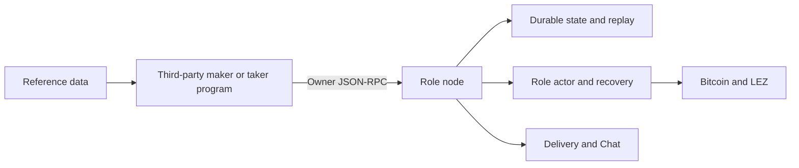

# ADR 0214: Third-party programs use the owner API

Status: Proposed; implementation included for review — 2026-09-07

## Context

Ecosystem [issue #176](https://github.com/logos-co/ecosystem/issues/176)
asks which maker features can be built independently without duplicating
RFP-003. Both nodes already own settlement. External programs need documented
contracts and a way to publish exactly their reviewed terms when other owner
clients can change configuration concurrently.

## Decision

Use the existing owner-only HTTP/Unix-socket JSON-RPC boundary for third-party
maker and taker applications. The supported subset, wire examples, limitations,
and compatibility rules are in [the API reference](../api/README.md). Business
policy remains outside the daemon and separate from the price-source interface.

Add `maker_offer_publish_v1` for local-price routes, with required schema version,
pair revision and price revision. Compare both revisions inside the existing
immediate SQLite publication transaction. A stale value fails before insertion.
The durable request includes both guards; a distinct replay operation prevents
legacy publication compatibility from discarding them. Exact replay precedes
current policy checks and returns the original commit. Delivery publication
uses the same path as legacy offers and never reactivates withdrawn/consumed
offers. Transport failure after durable commit remains an ambiguous outcome
until reconciliation or exact retry.

Extend the existing mutation-table CHECK constraint through its transactional
table-rebuild migration, retaining all rows and sequences. No signed-offer wire
shape, commitment, reservation rule, actor authority, or chain effect changes.
The original source-selected publication method stays available. The new
guarded method deliberately refuses a Logos-source route: an external strategy
submits its final decision through local settings instead of rereading a feed
at execution time.

## Threat-model delta

No new remote listener or permission tier. An external program authorized to
use an owner socket holds owner-level control, including fund-moving commands;
this is not a sandbox for untrusted plugins. Wallet keys, actor files, SQLite,
and chain endpoints remain resolved by the role node. Revision guards reduce
accidental wrong-price publication; they are not wallet reservations or
portfolio exposure enforcement. Existing reservation-versus-withdrawal races
remain resolved by the one-winner store transition.

## Compatibility and rollback

The documented contract is additive within v1. Breaking request/response
semantics require a new method version and a documented migration. Unknown
capabilities and states must be handled conservatively by clients.

Rollback can stop use of the new method while retaining its journal records.
An older binary cannot replay the new operation through legacy publish (it
fails with a request conflict); do not retry it with a fresh request ID merely
to work around that failure. Never delete mutation history or downgrade the
CHECK constraint to discard the new entries. Signed offers remain readable.

## Evidence

`crates/maker-node/tests/extension_api.rs` covers stale pair and price guards,
exact terms, restart replay, legacy-method conflicts, withdrawn-offer replay,
and strict input validation. Store tests cover the existing publication and
reservation rules and migration preservation. The Python example tests the
real HTTP-over-UDS envelope, large integers, bounded replies, and errors without
retry. No strategy, trading loop, or public-network deployment is added.
