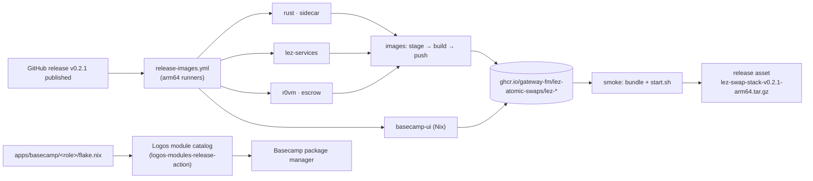

# ADR 0215 — Publish prebuilt stack images and the Basecamp packages

Status: proposed, 2026-09-09. Builds on ADR 0212 (versioned runtime
components), ADR 0213 (the Nodes own the BTC↔LEZ lifecycle) and ADR 0147
(isolated Basecamp role packages). Threat-model delta: none to the swap
protocol; the distribution surface gains a registry and a catalog, both
recorded below.

## Context

Until v0.2.0 the only way to run the product was `deploy/scripts/from-scratch.sh`:
a multi-hour native arm64 build of the LEZ services, r0vm, the escrow
artifact, the sidecar, the Node binaries and the Nix-built Basecamp bundle.
Every reviewer and every Logos tester paid that cost, and the two Basecamp
apps could only be installed from a developer-install tree. The Logos team
asked for prebuilt arm64 images with a compose file and a start script
attached to the GitHub release, and for the apps to be installable from a
Logos module catalog so Basecamp can test them against the release tag.

## Decisions

1. **The release workflow builds what from-scratch.sh builds, in the same
   pinned containers.** `.github/workflows/release-images.yml` runs only when a GitHub release
   is published (plus a manual dispatch for rehearsals on a fork; never on
   pushes or pull requests) and executes the script's own phases (`--only rust`, `build:<step>`, `nix`, `stage`) on
   GitHub-hosted arm64 runners, one phase group per runner, so the published
   images are the artifacts a developer host would produce, not a second
   build recipe. `phase_build` is split into selectable steps for that
   reason and for no other; a plain `--only build` is unchanged.
2. **One compose file, two image sources.** `deploy/compose.yaml` names every
   image `${LEZ_IMAGE_PREFIX}-<service>:${LEZ_IMAGE_TAG}`; the defaults are
   the local names `docker compose build` has always produced, a release sets
   the registry path and tag. `up.sh` gains `LEZ_IMAGES=pull`; nothing else
   about the stack changes.
3. **The one-time tools ship as an image, never as a service.** The escrow
   deployer, the vault-claim tool and the identity tool form
   `lez-tools`, a compose service in profile `tools` that only runs as
   `docker compose --profile tools run --rm tools '…'`, as the host user, on
   the stack network, with the market root mounted. It replaces the
   `lez-builder:local` container the bootstrap used to borrow. It holds no
   Docker socket and takes part in no swap.
4. **Wallet identities are minted on the user's host, never published.**
   `scripts/start.sh` mints the four identities with the tools image into
   the bundle's `market/` root and bootstraps the market there. The release
   workflow's identities are throwaway and are not uploaded.
5. **The bundle is the release asset.** `scripts/package-dist.sh` archives
   `deploy/` from `git archive` (never the working tree), drops the build
   contexts and build-only scripts, and adds `release.env` with the image
   prefix, tag, the pinned escrow program id and the commit. A smoke job
   starts the stack from the bundle and the pushed images alone before the
   bundle is attached to the release.
6. **The Basecamp apps are catalog modules of the repository release.** Each
   app carries its own `flake.nix` next to its `metadata.json`
   (`apps/basecamp/<role>/flake.nix`), so a catalog built on
   `logos-modules-release-action` can build `.#lgx-portable` inside the
   package directory of the submodule. The app version follows the release
   tag (`0.2.1` ↔ `v0.2.1`). The aggregate `apps/basecamp/flake.nix` stays
   the entry point of the repository's own integration tests, and both
   flakes pin the same Chat release.

## Consequences

- A tester needs Docker on an arm64 host and the bundle; `./scripts/start.sh`
  replaces the multi-hour build. `from-scratch.sh` remains the developer path
  and the source of truth for every pin.
- The registry packages are created private on first push and must be made
  public once in the repository's package settings; until then
  `docker compose pull` needs a GitHub login.
- The Windows cross leg of the catalog action fails for these packages
  (no `packages.x86_64-windows`); the action publishes the three native
  variants and records the missing one in the sidecar.
- Debug-profile Node binaries are what the stack has always run and been
  verified with; the images strip them but do not change the profile. A
  release-profile build is a separate decision.
