# Architecture

The canonical composed view is [System architecture and actor
flows](system-architecture.md), with the concrete process/node/RPC inventory in
[Deployment components, RPCs, and local nodes](deployment-components-and-rpcs.md). It defines the independent actors, runtime and
trust boundaries, and the happy, recovery, and restart lifecycles used to judge
whether a test is genuinely end to end. The ADRs below are append-only records
of the decisions behind that system. The current canonical M2 runtime,
deployment, actor, and chain facts are retained in the
[private actual-node certification packet](../evidence/m2-canonical-local-certification-20260714.json).
The current M3 schema-4 actor-owned Maker-lock checkpoint is retained in the
[private local two-direction packet](../evidence/m3-schema4-actor-owned-lock-poc-20260717.json):
the Taker fixture creates only the first lock, while the one-shot Maker actor
creates and reconciles the exact second lock before locally closing revision
two. This remains a private local PoC, not an M3 completion or production
readiness claim.

The M3 component boundary now also contains the checked witnessed-token guest,
its synchronized manifest/IDL/deployer/verifier/runner identity, the complete
deterministic BTC SDK lifecycle, the asset-bound lock-authorization facade, and
the additive exact-once v2 asset client. The SDK requires exact finalized
Taker-plan evidence before releasing the exact Maker plan. The client enforces
operation-specific actor roles and conservative exact or discovery observation
without retries. All eleven authenticated sidecar routes, durable replay, and
fork-safe finalized asset scans are component GREEN. Clean pushed-commit Runs
X, Z, and AA complete three exact pairs of both role-owned actual-node
custom-token directions with exact balances, effects, terminal replay, and
cleanup. The requested F7 repeatability gate is closed; recordings and
remaining milestone closure work remain open. ADR 0052 separates those source
captures from the literal D1 videos and binds the private render path to the
same actual-node role/effect evidence.

ADRs are append-only. Superseded decisions remain here and link to their
replacement.

## Diagram compatibility policy

Every tracked Markdown Mermaid block must use the conservative GitHub-compatible
subset enforced by CI: stable flowchart, sequence, state-v2, class, or ER
declarations without host configuration, beta/new-shape syntax, or interactive
links and callbacks. The same gate renders every diagram with the exact Mermaid
CLI 11.16.0 pin. GitHub's live Viewscreen asset also reported 11.16.0 on
2026-07-12; its URL and SHA-256 are retained in
[`../evidence/github-mermaid-renderer.json`](../evidence/github-mermaid-renderer.json).
GitHub controls that renderer, so visual verification on GitHub is still
required after pushing documentation changes.

```mermaid
flowchart TB
    System["System architecture + actor flows"] --> Scope["0001 Scope"]
    System --> Deployment["Deployment components + RPCs"]
    System --> Ports["0002 Ports/adapters"]
    Scope --> Ports
    Ports --> Persistence["0003 Persistence"]
    Ports --> Zcash["0004 Zcash stack"]
    Ports --> Docker["0005 Isolated E2E"]
    Scope --> LEZ["0006 LEZ semantics"]
    Ports --> RPC["0007 Maker RPC"]
    Scope --> Direction["0008 Bidirectional ordering"]
    Direction --> Bitcoin["0009 Bitcoin refund"]
    Bitcoin --> BitcoinEntry["0029 M3 Bitcoin entry"]
    BitcoinEntry --> TokenWitness["0042 Witnessed token ATA claims"]
    TokenWitness --> FixedWindows["0047 Pinned finality and test lanes"]
    FixedWindows --> ParallelStartup["0048 Exact parallel node provisioning"]
    ParallelStartup --> PhaseEvidence["0049 Bound outer and child phase evidence"]
    BitcoinEntry --> FinalizedFunding["0030 Finalized LEZ funding before claim"]
    FinalizedFunding --> BtcActor["0031 Revision-zero BTC actor"]
    BtcActor --> Contexts["0032 Agreement-derived adaptor contexts"]
    Contexts --> ClaimFacade["0043 Agreement-derived BTC claims"]
    Contexts --> AdaptorMap["0050 BTC adaptor security map"]
    BitcoinEntry --> TestnetRoutes["0051 Testnet4 route profile"]
    TestnetRoutes -.-> AdaptorMap
    PhaseEvidence --> DemoVideos["0052 Private demo-video evidence"]
    BitcoinEntry --> DemoVideos
    Contexts --> PublicEffects["0033 Durable public effects"]
    PublicEffects --> ActivationGate["0034 Complete activation authority"]
    ActivationGate --> ClaimProjection["0035 Canonical claim projection"]
    ClaimProjection --> ClaimPresence["0036 Bounded LEZ claim absence"]
    ClaimProjection --> ClaimFacade
    ClaimPresence --> PrelockFunding["0037 Exact pre-lock Bitcoin funding"]
    PrelockFunding --> RefundPlanner["0038 Durable LEZ refund preparation"]
    RefundPlanner --> FirstLockCutoff["0039 Cross-chain first-lock cutoff"]
    ClaimProjection --> Survivor["0040 Post-reveal survivor continuation"]
    Direction --> Deadlines["0010 Typed deadlines"]
    LEZ --> Deadlines
    Deadlines --> Recovery["0011 Recovery triggers"]
    LEZ --> Custody["0012 Escrow custody"]
    Ports --> SDK["0013 SDK layering"]
    SDK --> ClaimFacade
    Zcash --> ZecPins["0014 M2 ZEC pins"]
    Custody --> ZecPins
    Custody --> TokenWitness
    SDK --> ZecPins
    ZecPins --> ZecReconcile["0015 ZEC reconciliation"]
    SDK --> Agreement["0016 Concrete ZEC agreement"]
    Agreement --> FirstLock["0017 Durable first-lock intent"]
    FirstLock --> MakerLock["0020 Durable maker second lock"]
    MakerLock --> ClaimRecovery["0021 Protected claim recovery"]
    ClaimRecovery --> LezSidecar["0022 LEZ official-wire sidecar"]
    LezSidecar --> LocalM2["0023 Private local M2 certification"]
    LezSidecar --> PublicRoutes["0028 Dormant public-route portability"]
    ZecPins --> PublicRoutes
    LocalM2 --> PublicRoutes
    LocalM2 --> LocalStack["0024 Source-audited v0.2 local stack"]
    ZecPins --> LocalStack
    LocalStack --> PublicRoutes
    LocalStack --> VaultActors["0025 Independent v0.2 Vault onboarding"]
    VaultActors --> V02Effects["0026 At-most-once v0.2 effects"]
    Scope --> Progressive["0027 Progressive milestone delivery"]
    Progressive -.-> LocalM2
    Progressive -.-> V02Effects
    Progressive -.-> FixedWindows
    Progressive -.-> ParallelStartup
    ZecPins --> LezSidecar
    LEZ --> LezSidecar
    ZecPins --> Agreement
    Agreement -.-> ZecReconcile
    FirstLock -.-> ZecReconcile
    FirstLock --> Upstream["0018 Logos production exceptions"]
    Upstream -.-> ZecPins
    Persistence --> ZecReconcile
    Persistence --> SDK
    Persistence --> RPC
    Persistence --> ClaimRecovery
    Persistence --> V02Effects
    Persistence --> BtcActor
    Persistence --> PublicEffects
    Persistence --> ClaimProjection
    Persistence --> PrelockFunding
    Persistence --> RefundPlanner
    Persistence --> FirstLockCutoff
    Persistence --> Survivor
    LezSidecar -.-> Upstream
    PublicRoutes -.-> Upstream
    LocalM2 -.-> Upstream
    LocalStack -.-> Upstream
    V02Effects --> FinalizedFunding
    FinalizedFunding -.-> Upstream
    V02Effects -.-> Upstream
    TokenWitness -.-> ClaimFacade
    Progressive -.-> MoneroEntry["0053 Isolated M4 Monero entry"]
    MoneroEntry --> XmrDleq["0054 Bound XMR DLEQ shares"]
    XmrDleq --> XmrAtomicity["0055 Dual-reveal XMR atomicity"]
    MoneroEntry --> PairNeutral["0056 Pair-neutral adaptor"]
    PairNeutral --> XmrActivation["0058 Two-stage XMR activation"]
    MoneroEntry --> XmrGuest["0057 XMR guest branches"]
    XmrGuest --> XmrActivation
    XmrActivation --> XmrFundClassifier["0061 Exact durable Fund classifier"]
    XmrActivation --> XmrClaimAuthorization["0062 Typed Stage-B claim authorization"]
    XmrClaimAuthorization --> XmrOfficialBuilder["0063 Durable official Stage-B builder"]
    XmrActivation --> XmrObservation["0059 Separate observation and authority"]
    XmrObservation --> XmrIssuer["0065 Opaque evidence release issuer"]
    XmrFundClassifier --> XmrIssuer
    XmrOfficialBuilder --> XmrIssuer
    XmrIssuer --> XmrJournal["0060 Sealed release journal"]
    XmrJournal --> XmrPublisher["0064 Transaction-scoped journal publisher"]
    XmrPublisher --> XmrFinalClock["0066 Stable finalized genesis clock"]
    XmrOfficialBuilder --> XmrReleaseRoute["0067 Dedicated tag 14 submission"]
    XmrPublisher --> XmrReleaseWorker["0068 Isolated release worker"]
    XmrReleaseWorker --> XmrFinalClock
    XmrReleaseWorker --> XmrReleaseRoute
    XmrPublisher -.-> XmrReleaseRoute
    XmrActivation --> XmrInitializeBarrier["0070 Finalized Initialize before Fund"]
    XmrInitializeBarrier --> XmrFundClassifier
    XmrActivation --> XmrTag15["0071 Durable exact tag 15 completion"]
    XmrActivation --> XmrActorInputs["0072 Validated stage derived actor inputs"]
    XmrActorInputs --> XmrInitializeBarrier
    XmrActorInputs --> XmrTag15
    XmrOfficialBuilder --> XmrTag15
    XmrReleaseRoute -.-> XmrTag15
```

| ADR | Decision | Status |
|---|---|---|
| [0001](0001-authoritative-scope.md) | Live RFP plus accepted issue #112 define BTC/XMR/ZEC scope | Accepted |
| [0002](0002-ports-and-adapters.md) | Explicit protocol core with ports/adapters around external systems | Accepted |
| [0003](0003-sqlite-persistence.md) | SQLite/`rusqlite` persistence behind a repository port | Schema-v10 role-local locks, protected claims, ordered refunds, legacy-secret migration, and atomic replay proven; both private local actual-node happy claims reached independent revision-4 stores, while composed restart/refund effects remain later hardening |
| [0004](0004-zcash-stack.md) | Zebra plus local canonical transaction construction; selective Zallet use | Accepted |
| [0005](0005-docker-isolation.md) | Per-run Compose project, networks, volumes, and ephemeral ports | Accepted |
| [0006](0006-lez-upstream-semantics.md) | Pin LEZ behavior and verify source assumptions executablely | Accepted |
| [0007](0007-maker-local-rpc.md) | Authenticated local JSON-RPC with a transport-hardening gate | Accepted, production transport pending |
| [0008](0008-bidirectional-role-ordering.md) | Separate product direction from reviewed pair funding capability | Accepted; XMR is LEZ-first only |
| [0009](0009-bitcoin-refund-path.md) | Taproot key-path cooperative claim with script-path CSV refund | Accepted; both actual-node cooperative directions, canonical BIP-342 construction, typed Core maturity/observation/one-send/evidence, role-shaped key custody, and deterministic actor restart composition are GREEN. Actual-node refund, reorg, and fee-bump evidence remain |
| [0010](0010-typed-cross-chain-deadlines.md) | Typed consensus clocks plus conservative cross-chain safety bounds | Accepted for deadline legs; XMR superseded by 0011 |
| [0011](0011-event-gated-recovery.md) | Recovery uses typed deadlines or canonical events; XMR has no native timelock | Accepted and represented in core/RPC/CLI |
| [0012](0012-lez-escrow-custody.md) | Split metadata PDA from authenticated-transfer custody or required custom-token ATA | Native/ATA custody, both local v0.2 happy directions, strict refund wire, durable exact refund preparation, finalized refund observation, and deterministic actor execution are GREEN. ADR 0042 adds checked-guest aggregate-witness claims and an exact durable sidecar planner; Run X closes both actual-node custom-token directions |
| [0013](0013-sdk-layering.md) | Deterministic common core plus complete per-pair async facades | Concrete ZEC lifecycle and schema-v10 replay are proven. BTC now adds the bounded canonical lifecycle codec, exact CAS store port, role-fixed stored SDK, typed Bitcoin/LEZ runtime, both claim/refund directions, transition-by-transition restart/replay tests, public errors/doctests, and a dedicated wiring example. XMR remains M4; production BTC store/port implementations remain application-owned |
| [0014](0014-zec-m2-implementation-pins.md) | SPEL/LEZ, canonical Zcash crates, and vulnerability-clean minimal Zebra runtime pins for M2 | Accepted; v0.1.2 remains a lower compatibility lane, while the only trusted v0.2 target is Docker-built ELF `c85055...9d2e` and ProgramId `5cf8c5...29c1`. Earlier host-built `f83850...0fbe` evidence is explicitly historical |
| [0015](0015-durable-zcash-observation-reconciliation.md) | Stable affirmative Zcash canonical/removal evidence plus two-phase durable reconciliation | Binding, journal, role projection, conflicts, terminal alerts, and actual two-Zebra restart/requery proven; production poller pending |
| [0016](0016-canonical-zec-agreement.md) | Canonical bounded dual-signed LEZ/ZEC terms bind actors, chains, custody, deadlines, and transaction policy | Validator, activation/resume, locks, claims, and ordered refunds proven; the same agreement boundary completed both private local actual-node claim directions. Exact signed public-v0.2 activation is locally contract-proven; live public execution and composed recovery remain open |
| [0017](0017-crash-safe-first-lock-intent.md) | Exact role-fixed lock bytes are durable and observed before byte-identical submission | Taker and maker intents plus canonical history survive restart; schema-v10 claims/refunds continue from `BothLegsLocked` |
| [0018](0018-logos-upstream-production-exceptions.md) | Logos-owned live-release blockers are disclosed separately from repository-controlled milestone evidence | Accepted; living production register required through final release |
| [0019](0019-canonical-lez-observation.md) | Stable agreement-bound LEZ fund transaction, block, metadata, and custody evidence is replayed from primitive snapshots | Canonical/update/removal/replacement exact-head folding accepted in SDK/SQLite; v0.2 SDK-port observation completed both local happy directions after the reverse validator was bound to the agreement-derived depositor; composed reorg/recovery remains open |
| [0020](0020-durable-maker-second-lock.md) | Fresh eligibility is consumed by a separately durable opposite-chain maker effect | Separate schema-v10 maker/taker stores replay `BothLegsLocked`; direction-correct second locks completed through actual local nodes in both happy directions, while terminal recovery hardening continues under 0021 |
| [0021](0021-protected-claim-recovery.md) | Claim material and exact submissions use authenticated envelopes plus role-local schema-v10 claim/refund journals | Both directions, legacy-secret migration/scrub, corruption/rollback/unknown-outcome hardening, and independent replay at `Completed` or `Refunded` proven; key rotation and production adapters pending |
| [0022](0022-isolate-lez-official-wire-sidecar.md) | Keep incompatible pinned LEZ official-wire and Zcash graphs in separate processes behind a bounded local protocol | Process boundary and both local happy directions are GREEN. Actor schema v3 provides deterministic-local, self-hosted-cookie, and exact-Tatum Zebra routes; sidecar outbound profiles provide explicit local LEZ or exact official LEZ HTTPS while actor-to-sidecar traffic remains loopback/capability protected. Public live execution and actual-node recovery remain open |
| [0023](0023-private-local-m2-certification.md) | Certify M2 through a private fully functional actual-node corridor and defer public deployment/testnet publication | Accepted; the canonical Docker guest was deployed and finalized locally, and both private local happy directions plus dormant public-route contracts are GREEN. Public transactions and recordings remain deferred |
| [0024](0024-source-audited-lez-v0-2-local-stack.md) | Build the source-audited LEZ v0.2 services into an isolated Bedrock-settled local stack | Accepted; exact inputs/topology, isolated startup, signed channel, finalized Vault Claims, canonical ProgramId `5cf8c5...29c1` deployment in block 2582, and both private local directions are evidenced. Independent second clean service rebuild and composed recovery remain later hardening |
| [0025](0025-independent-lez-v02-vault-onboarding.md) | Onboard independent v0.2 maker and taker funds through exact owner-authorized Vault Claims | Exact preparation, durable one-call submission through Admitted, separate manual finalized inclusion/balance audit, and later use by both corridors are GREEN. Integrated actor-bound finality, negative on-chain attempts, and process-restart reconciliation remain later hardening |
| [0026](0026-lez-v02-at-most-once-submission-and-query-finality.md) | Persist AttemptStarted before one v0.2 send and prove inclusion/finality through bounded sequencer and indexer queries | Architecture and durable one-call/restart tests are GREEN. The M3 witnessed-claim bridge now performs bounded finalized block ID/hash and same-containing-BlockId account observation for either participant with client BIP-340 revalidation. Vault query/journal progression, upstream account proofs, and ambiguous multi-effect restart reconciliation remain later hardening |
| [0027](0027-progressive-jpeg-milestone-delivery.md) | Deliver a reproducible actual-local-devnet milestone PoC first, then owner-controlled QA, chaos, information-security, and production-readiness hardening | Accepted; M2 and M3 are certified at their local-functional PoC boundaries under `m2-complete` and `m3-complete`. Accumulated hardening is carried evidence until the owner enters and revalidates its phase; no transition to later QA/chaos/infosec/production phases is implied |
| [0028](0028-dormant-public-route-portability.md) | Admit exact dormant public LEZ and Zebra routes without exposing the actor-sidecar boundary or weakening agreement-bound pre-effect validation | Canonical Docker target and finalized local deployment binding are GREEN; exact dormant public configuration and bounded-client construction are GREEN without public I/O. Live public execution and official LEZ finalized-tip availability remain production gates |
| [0029](0029-m3-bitcoin-local-poc-entry.md) | Enter M3 through isolated Bitcoin Core Regtest and LEZ v0.2 actors with aggregate witnessed claim authorities | Accepted and certified under `m3-complete`: schema-4 happy/refund/survivor/overlap and F7 are actual-node GREEN; public lifecycle SDK, official/independent vectors, Testnet4 configuration, three source recordings/private bundle, ADR 0050 security map, ADR 0052 video pipeline, three verified MP4s, and final exact gates are complete |
| [0030](0030-finalized-lez-funding-before-claim.md) | Preserve the live observer and require distinct finalized LEZ funding evidence before either claim can reveal adaptor material | Accepted and actual-node GREEN in both happy directions. Logos v0.2 end-of-block account reads remain a disclosed production trust limitation; finalized refund observation remains |
| [0031](0031-one-shot-btc-actor-observe-before-project.md) | Use a public one-shot role-fixed actor that returns from exact chain observation before predecessor-CAS projection | Accepted and actual-node GREEN for both schema-4 directions at `0e7635f`. Exact Maker effects use role-local one-attempt journals, exact mempool or LEZ effect-count reconciliation, and one local transaction for the final intent plus revision-two close. Schema 3 remains observation-only compatibility; crash, reorg, and concurrency hardening remain |
| [0032](0032-derive-adaptor-contexts-from-agreement.md) | Reconstruct both adaptor signing contexts from the validated agreement plus fresh session IDs | Accepted and actual-node GREEN for both agreement-derived claim sessions. No second actor-side parser exists; refund-session custody and recovery hardening remain |
| [0033](0033-persist-public-effects-before-submission.md) | Persist complete public transaction bytes before consuming one-attempt submission authority | Accepted and actual-node GREEN for both claim paths. Fourteen focused tests prove replay and one CAS winner; forced process-kill evidence remains |
| [0034](0034-gate-actor-activation-on-signing-material.md) | Require complete agreement-derived signer, prepared-claim, and role-shaped scalar authority before actor activation | Accepted and actual-node GREEN through revision four in both directions. Agreement-matched Bitcoin refund-key custody is now enforced; process-kill and production key custody remain |
| [0035](0035-project-claims-only-from-canonical-public-evidence.md) | Advance claim revisions only from exact confirmed or finalized public evidence and retain only a one-way scalar commitment | Accepted and actual-node GREEN through claim projection in both roles and directions. Refund, reorg, crash, and concurrency projection remain |
| [0036](0036-prove-bounded-lez-claim-absence-before-first-send.md) | Distinguish exact finalized LEZ presence from stable complete bounded absence before first-send reconciliation | Accepted and actual-node GREEN for claims. Refunds use the stricter state-only eligibility then exact-observation gate with no absence-based authorization; both-direction actual-node refund evidence is GREEN, while adversarial race/reorg hardening remains |
| [0037](0037-finalize-exact-bitcoin-funding-before-first-effect.md) | Prepare, policy-check, and countersign one exact Bitcoin funding transaction before either chain effect | Accepted and actual-node GREEN in both schema-4 and custom-token directions. Exact rawtr authorization, planned-anchor recovery terms, secret-safe outputs, and focused tests gate the first effect; Runs W/X prove sequential JIT anchors 103 and 105 around forward settlement height 104. Production fee/replacement and reorg hardening remain |
| [0038](0038-durable-permissionless-lez-refund.md) | Durably prepare exact permissionless LEZ refund bytes before finalized actor eligibility can authorize one send | Accepted through authenticated planner replay, public actor one-attempt execution, no-rearm restart, nonowner discovery, and ordered finalized projection. Deterministic gates and both-direction actual-node timeout/refund execution are GREEN; later chaos/reorg hardening remains |
| [0039](0039-admit-first-lock-recovery-only-after-cross-chain-cutoff.md) | Admit a revision-one refund only after a signed cutoff, two fresh exact maker-lock classifications, and a fresh first-lock unspent/eligibility check | Accepted for the M3 BTC PoC; both live schema-4 timely-Maker paths are actual-node GREEN at `0e7635f`, including fresh exact first-lock eligibility, current/finalized chain evidence, one-attempt Maker submission, exact reconciliation, and atomic local intent/revision-two close. There is no distributed cross-chain commit; concurrency, reorg, adversarial-late-lock, and public production hardening remain |
| [0040](0040-continue-post-reveal-from-canonical-evidence.md) | Keep revision 3 nonterminal and let fresh maker processes continue from canonical reveal while the taker is absent | Accepted and clean pushed-commit actual-node evidence is GREEN in both directions in `m3survivor-20260716c` |
| [0041](0041-interleave-overlapping-swaps-with-exact-chain-barriers.md) | Run two independent opposite-direction swaps on shared local nodes while preserving exact singleton-chain assertions | Accepted and clean pushed-commit actual-node GREEN in `m3overlap-20260717a`: distinct mature outpoints, agreements, stores, journals, sessions, escrows, and deadlines were simultaneously at revision two before settlement; arbitrary-N and same-depositor nonce scheduling remain outside this checkpoint |
| [0042](0042-bind-witnessed-token-claims-to-exact-atas.md) | Bind aggregate-witness custom-token claims to one fungible definition and exact depositor, custody, and claimant ATAs in one recursive LEZ transition | Accepted through checked guest, adapters, and four complete both-direction actual-node pairs. Runs X, Z, AA, and AD retain exact balances, four LEZ effects, two Bitcoin effects, zero replay/custody, and cleanup per direction. Historical reads remain authoritative-indexer consistency, not cryptographic proof or an atomic snapshot; production hardening remains |
| [0043](0043-derive-btc-claims-from-the-agreement.md) | Derive both BTC claim sessions from the countersigned agreement and materialize only agreement-bound exact follow-up effects | Accepted and extended through pushed `0c78f3d`: both claim orders, exact evidence, redacted zeroizing recovery, durable codec/CAS storage contract, typed ports, restart/replay, examples/docs, and substitution rejection are GREEN. Actual-node actor evidence is retained separately |
| [0044](0044-presign-btc-recovery-and-project-revealing-leg-first.md) | Require both signed refunds before BTC locking and project the Maker-funded revealing-leg refund before the Taker-funded follow-up leg | Accepted and extended through ADR 0046 plus `0c78f3d`: both directions, signed recovery, revisions one through four, durable public storage/port contract, replay, role ownership, network/finality/confirmation checks, and invalid ordering are GREEN |
| [0045](0045-countersign-the-selected-lez-asset.md) | Preserve agreement-v1 bytes and separately countersign the exact native or custom-token selection, programs, definition, ATAs, amount, deadline, and aggregate authority | Accepted through deterministic SDK, adapter, sidecar, actor journals, and both actual-node F7 directions. Independent custom custody, both role signatures, exact local policy, exact v2 mapping, native/token plan validation, opaque asset-bound first-lock authorization, official ATA planning, and finalized route/scan mapping are GREEN |
| [0046](0046-replay-btc-sdk-lifecycle-from-exact-transitions.md) | Reconstruct revisions one through four from exact ordered chain transitions and remove discovery/negotiation capability after activation | Accepted and extended through `0c78f3d`; both directions/roles, claims, ordered refunds, canonical durable codec, exact CAS store port, typed runtime, restart/replay, example, and clone-validate-commit rollback are GREEN. Production provides durable storage/journals; actual-node actor evidence is separate |
| [0047](0047-pin-finalized-windows-and-separate-test-lanes.md) | Read only a pinned requested finalized interval, tolerate monotonic descendants, and separate fast development from fresh certification lanes | Accepted and actual-node GREEN for both custom-token directions at one-second cadence. Runs X, Z, AA, and AD exceed the requested 3-of-3 repeat gate; AD completed in 16 minutes 6.52 seconds with exact cleanup |
| [0048](0048-parallelize-exact-node-provisioning.md) | Start fixed Core and LEZ provisioners concurrently with exact process, component, failure, and cleanup identity | Accepted, behavioral GREEN, and measured by clean pushed Run AD. Core and LEZ completed in one 67-second window versus the 98-second sequential baseline, certifying a 31-second saving with exact cleanup |
| [0049](0049-bind-monotonic-phase-evidence.md) | Record fixed outer and actor-direction phases with a monotonic clock and bind strict secret-safe packets into main run evidence | Accepted and actual-node GREEN in clean pushed Run AF. The 1,000,170 ms outer packet has 510 ms unattributed; 346,060/386,060 ms child packets fit their exact parents and bind exact effects. Five finalized lock/claim windows dominate while every other child phase is below one second. The complete pinned CI suite and exact cleanup are GREEN; differing host contention prevents a speedup claim |
| [0050](0050-map-btc-adaptor-construction-to-security-properties.md) | Map the exact BTC/LEZ aggregate adaptor operations to Aumayr et al. and Fournier security properties and atomicity conditions | Accepted as an engineering-security map. It explicitly does not transfer a single-signer theorem to the exact two-party MuSig2 composition; official-vector gates and M7 independent cryptographic review remain distinct |
| [0051](0051-bind-bitcoin-testnet4-routes-to-chain-profile.md) | Bind self-hosted loopback and exact HTTPS Bitcoin Testnet4 RPC routes to one fail-closed Core/genesis/index-readiness profile | Accepted for M3 configuration portability. Focused tests make no public call; live public provider, wallet/faucet, fee/reorg, and production-custody evidence remain deferred |
| [0052](0052-bind-private-demo-videos-to-actual-node-evidence.md) | Regenerate a canonical proof from retained role/effect evidence before rendering and final verification of each private D1 MP4 | Accepted and executed for M3: three live private MP4s pass regenerated-source verification, complete decode, sampled-frame review, and mode-`0600` bundle verification at `7697a27c...f101ba8` |
| [0053](0053-enter-m4-through-isolated-monero-regtest.md) | Enter M4 through one real LEZ-first Monero Regtest/LEZ v0.2 actor flow with an exact adaptor/DLEQ transcript | Accepted; official Monero topology, local funding, component/RPC and bootstrap diagrams, evidence and cleanup are green, while the atomic actor flow remains pending |
| [0054](0054-bound-xmr-share-to-lez-adaptor-point.md) | Bind each canonical Monero spend-key share to its exact LEZ secp256k1 adaptor point through a versioned cross-curve DLEQ envelope | Accepted for the M4 PoC boundary; two proofs, bounded wire, symmetric reconstruction, official-wallet spend, strict lint/docs, and dependency-policy gates are green, while full adaptor lifecycle and production review remain pending |
| [0055](0055-preserve-xmr-atomicity-with-dual-reveal-branches.md) | Require two DLEQ-bound shares, delay the Maker-claim partial until canonical XMR funding, and reveal the opposite share through distinct signed LEZ claim/refund branches | Accepted for the M4 PoC design; symmetric SDK reconstruction and official-wallet spend are green, while XMR-specific signed refund/punish execution remains pending |
| [0056](0056-extract-pair-neutral-adaptor-signatures.md) | Move the proven two-role MuSig2 adaptor machinery behind a dependency-leaf crate while preserving BTC compatibility | Accepted and executed; exact hash bytes, leaf operations, BTC vectors/facade, role processes, and direct consumers are green. M4 agreement/session composition remains pending |
| [0057](0057-append-xmr-native-escrow-branches.md) | Append an on-chain claim-partial publication plus branch-specific XMR claim, signed-refund, and punishment instructions while pinning every existing LEZ guest tag and metadata byte | Accepted and checked-artifact-executed: tags 0–17, legacy metadata digests, version-3 metadata, exact partial publication, distinct aggregate authorities, disjoint windows, and bypass rejection are source-green; two fresh builds reproduce ELF `dc370bc...b7292` / ImageID `4d6590...2c82` and pass all five recursive tests. The Taker escrow route now durably prepares the exact checked initialize/fund pair with byte-identical restart replay and no submission; six builders, actual-local classification, and actual-node execution remain |
| [0058](0058-activate-xmr-swap-in-two-stages.md) | Derive XMR adaptor sessions from a countersigned base agreement, then countersign the exact nonce/partial activation transcript before the first LEZ lock | Accepted and source-executed: canonical Stage A/Stage B, the strict v3 protocol, eight-method ordinary client, separate release-intended type-narrowed client, twice-checked local guest, and non-cloneable exact Monero observation are green. Actual-local finalized LEZ evidence, release-service ownership/wiring, authorization finality, bridge claim completion, and actors remain |
| [0059](0059-separate-monero-observation-from-release-authority.md) | Keep exact Monero receipt observation non-authoritative until a durable Stage-B-bound actor gate consumes it once with LEZ-lock and RPC-topology evidence | Accepted for M4: the typed non-cloneable observation is component-GREEN; durable CAS release, ambiguous-send reconciliation, activation replay rejection, and actual-node actor evidence remain |
| [0060](0060-seal-xmr-release-journal-until-typed-integration.md) | Keep the version-2 XMR release journal private until concrete evidence issuers and a consuming publisher/outcome boundary replace raw internal plans | Accepted as the original sealed storage foundation and extended by ADRs 0064 and 0065. The schema-v3 crate now passes 35 tests through its public opaque-evidence issuer, while the raw plan remains private. Live node submission/finality, actor composition, and a claim PoC remain absent |
| [0061](0061-classify-only-the-durable-xmr-fund-target.md) | Classify only the Taker-owned durable exact `FundNative` target and never turn a missing bounded scan into absence | Accepted as a component checkpoint: the authenticated exact-Fund route validates ownership before indexer reads, returns `Found` only after canonical finalized facts and final re-pinning, maps missing to `Uncertain`, retains typed unavailable reasons, and makes zero sends. The full sidecar suite is 145 of 145 GREEN, but its `FinalizedIndexerApi` E2E is synthetic; actual-local-indexer evidence, other effects/discovery, actors, and a claim PoC remain absent |
| [0062](0062-mint-stage-b-claim-authorization-through-authenticated-client.md) | Mint a private-field non-`Clone` Stage-B claim-authorization capability only through the concrete authenticated bridge client | Accepted as the adapter authority checkpoint: the Taker-only adapter re-derives exact Stage B, verifies the committed partial and signed runtime binding before wire, makes exactly one authenticated call on success, and fails pre-wire drift with zero calls. ADR 0063 supplies the official sidecar builder and ADR 0065 consumes this capability into the sealed journal; actual-node effect and claim PoC remain absent |
| [0063](0063-build-stage-b-authorization-from-durable-fund.md) | Build exact tag-14 authorization bytes from the durable Fund nonce and persist them before exposure without submission | Accepted as an official-sidecar component checkpoint at `fda2bcf`: exact commitment, ABI, account, signer, Fund-plus-one nonce, canonical-byte, restart, conflict, overflow, cached-replay, and zero-send proofs pass in the current 145-test sidecar suite. ADR 0065 supplies typed journal authority and ADR 0067 supplies a separate submission component; actual-local release-service composition, finality, remaining five builders, actors, and claim PoC remain absent |
| [0064](0064-gate-xmr-publication-through-sealed-journal.md) | Gate one exact XMR authorization publication through a sealed transaction-scoped journal | Accepted and extended by ADRs 0065 and 0067: schema v3 and 35 tests cover the public typed issuer, authenticated expected ID, one CAS winner, post-CAS time suppression, admitted or ambiguous terminal outcomes, restart observation, and zero retry; the separate sidecar route supplies exact one-request submission semantics. The two journals are not transactional, and actual-local service wiring, node finality, actors, and a claim PoC remain absent |
| [0065](0065-bind-xmr-release-to-opaque-evidence.md) | Consume opaque Fund, authorization, Monero-output, and topology evidence into one release bound to the signed checked-guest deadline | Accepted as a component checkpoint: the public issuer derives every private plan field and exact half-open journal interval, and a public authenticated-loopback integration test proves publication identity plus restart reload in the 35-test suite. ADR 0067 supplies the narrow node-route component; the checked process proof is GREEN, while actual-local clock/submission wiring and finalized classification, role actors, and actual swap remain |
| [0066](0066-bind-release-time-to-stable-finalized-genesis.md) | Bind release-time authority to an unchanged official finalized-indexer sample whose genesis equals the immutable runtime | Accepted as an M4 component checkpoint: exact expected-genesis time succeeds, wrong genesis and a moving finalized tip fail closed, bridge readiness consumes the primitive, and the full pinned sidecar suite passes 145 of 145. ADR 0067 supplies a separate submission component; official v0.2 indexer-wire process wiring is GREEN, while actual-local clock/route execution and finality, actors, and the claim PoC remain |
| [0067](0067-submit-xmr-authorization-through-dedicated-route.md) | Submit only the exact durably owned tag-14 authorization through a separate release-intended type-narrowed client and one-attempt sidecar route | Accepted as an M4 component checkpoint: the ninth strict method is absent from the ordinary eight-method client, generic tag-14 submission remains closed, the sidecar persists an unknown outcome before exact lookup/send, and an official-type loopback fixture proves Accepted, AlreadyKnown, wrong-ID Unknown, and no resend for the same request. The checked process consumes the bearer and restarts observe-only against fixtures; actual server/planner restart, sequencer execution, authorization finality, actors, and a claim PoC remain absent |
| [0068](0068-isolate-xmr-release-worker-dependencies.md) | Keep the one-shot XMR release worker on a separately locked official-indexer-only graph instead of merging the full LEZ wallet stack with the release-authority graph | Accepted as an M4 process checkpoint: the 432-package lock resolves; four unit tests, strict Clippy/Rustdoc, and dependency policy pass; and a typed-issuer-seeded real-worker proof admits once then observes only after a fresh-process restart. Actual nodes, different-UID/network isolation, finality, actors, and a claim PoC remain |
| [0069](0069-bind-xmr-tag13-attempts-to-transaction-identity.md) | Bind each exact XMR tag-13 submission attempt to its canonical transaction ID and require initialization presence before funding | Accepted as an M4 component checkpoint: arbitrary fresh IDs and missing durable state fail before node I/O; exact Initialize then Fund uses cumulative lookup/send counters 3/2 and same-request replay changes neither. Finalized-Initialize actor gating, actual-local submission, remaining effects, actors, and a claim PoC remain |
| [0070](0070-require-finalized-xmr-initialize-before-fund.md) | Mint a non-cloneable exact finalized-Initialize capability and consume it before the Taker may submit Fund | Accepted as an M4 pre-funding component checkpoint: the sidecar classifies only exact durable Initialize/Fund targets with effect-specific historical state, stable finalized re-pins, and missing-as-Uncertain; the concrete adapter binds and consumes exact Initialize evidence before authenticated Fund submission. Actual-local indexer/sequencer execution, tag-14/tag-15 finality, actors, and the claim PoC remain |
| [0071](0071-durably-prepare-and-complete-xmr-tag15.md) | Durably prepare the exact nonce-bound tag-15 message and complete it only with the valid aggregate BIP340 witness before any submission authority exists | Accepted as an M4 component checkpoint: generated ABI/accounts/hash checks, separate owner-only prepare/complete records, fresh-server rederivation, exact replay, fail-closed mutation, and zero tag-15 sends are GREEN. Actual-local tag-14 finality, tag-15 submission/finality, adaptor extraction, actors, and the claim PoC remain |
| [0072](0072-derive-xmr-actor-inputs-from-validated-stage-material.md) | Derive actor protocol inputs and adaptor sessions only from canonical validated Stage-A/Stage-B material | Accepted as an M4 SDK composition checkpoint: validated agreements mint private-field checked claim/refund descriptors, which reconstruct the exact retained sessions and reject field mutation or branch cross-wiring. The tag-13 actor refactor, staged countersigning, actual-node execution, and the claim PoC remain |
