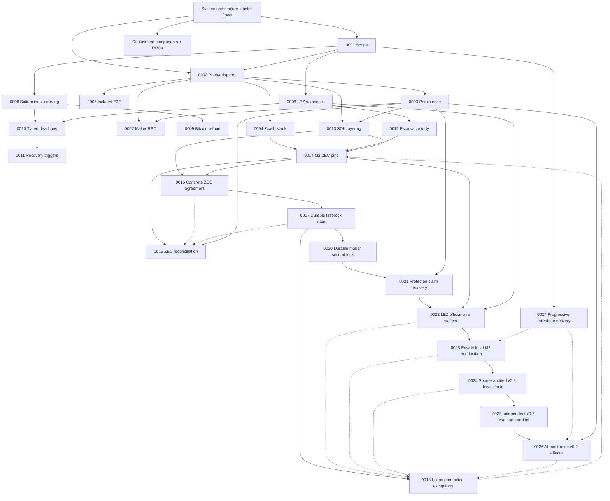

# Architecture

The canonical composed view is [System architecture and actor
flows](system-architecture.md), with the concrete process/node/RPC inventory in
[Deployment components, RPCs, and local nodes](deployment-components-and-rpcs.md). It defines the independent actors, runtime and
trust boundaries, and the happy, recovery, and restart lifecycles used to judge
whether a test is genuinely end to end. The ADRs below are append-only records
of the decisions behind that system.

ADRs are append-only. Superseded decisions remain here and link to their
replacement.

## Diagram compatibility policy

Every tracked Markdown Mermaid block must use the conservative GitHub-compatible
subset enforced by CI: stable flowchart, sequence, state-v2, class, or ER
declarations without host configuration, beta/new-shape syntax, or interactive
links and callbacks. The same gate renders every diagram with the exact Mermaid
CLI 11.16.0 pin. GitHub's live Viewscreen asset also reported 11.16.0 on
2026-07-12; its URL and SHA-256 are retained in
[`../evidence/github-mermaid-renderer.json`](../evidence/github-mermaid-renderer.json).
GitHub controls that renderer, so visual verification on GitHub is still
required after pushing documentation changes.

| ADR | Decision | Status |
|---|---|---|
| [0001](0001-authoritative-scope.md) | Live RFP plus accepted issue #112 define BTC/XMR/ZEC scope | Accepted |
| [0002](0002-ports-and-adapters.md) | Explicit protocol core with ports/adapters around external systems | Accepted |
| [0003](0003-sqlite-persistence.md) | SQLite/`rusqlite` persistence behind a repository port | Schema-v10 role-local locks, protected claims, ordered refunds, legacy-secret migration, and atomic replay proven; production effect composition pending |
| [0004](0004-zcash-stack.md) | Zebra plus local canonical transaction construction; selective Zallet use | Accepted |
| [0005](0005-docker-isolation.md) | Per-run Compose project, networks, volumes, and ephemeral ports | Accepted |
| [0006](0006-lez-upstream-semantics.md) | Pin LEZ behavior and verify source assumptions executablely | Accepted |
| [0007](0007-maker-local-rpc.md) | Authenticated local JSON-RPC with a transport-hardening gate | Accepted, production transport pending |
| [0008](0008-bidirectional-role-ordering.md) | Separate product direction from reviewed pair funding capability | Accepted; XMR is LEZ-first only |
| [0009](0009-bitcoin-refund-path.md) | Taproot key-path cooperative claim with script-path CSV refund | Accepted, M3 validation pending |
| [0010](0010-typed-cross-chain-deadlines.md) | Typed consensus clocks plus conservative cross-chain safety bounds | Accepted for deadline legs; XMR superseded by 0011 |
| [0011](0011-event-gated-recovery.md) | Recovery uses typed deadlines or canonical events; XMR has no native timelock | Accepted and represented in core/RPC/CLI |
| [0012](0012-lez-escrow-custody.md) | Split metadata PDA from authenticated-transfer custody or required custom-token ATA | Source-correct native/ATA TDD in progress |
| [0013](0013-sdk-layering.md) | Deterministic common core plus complete per-pair async facades | Concrete ZEC negotiation, locks, role-local claims/refunds, and schema-v10 replay proven; production chain composition pending |
| [0014](0014-zec-m2-implementation-pins.md) | SPEL/LEZ, canonical Zcash crates, and vulnerability-clean minimal Zebra runtime pins for M2 | Accepted for M2 implementation |
| [0015](0015-durable-zcash-observation-reconciliation.md) | Stable affirmative Zcash canonical/removal evidence plus two-phase durable reconciliation | Binding, journal, role projection, conflicts, terminal alerts, and actual two-Zebra restart/requery proven; production poller pending |
| [0016](0016-canonical-zec-agreement.md) | Canonical bounded dual-signed LEZ/ZEC terms bind actors, chains, custody, deadlines, and transaction policy | Validator, activation/resume, locks, claims, and ordered refunds proven; production composition pending |
| [0017](0017-crash-safe-first-lock-intent.md) | Exact role-fixed lock bytes are durable and observed before byte-identical submission | Taker and maker intents plus canonical history survive restart; schema-v10 claims/refunds continue from `BothLegsLocked` |
| [0018](0018-logos-upstream-production-exceptions.md) | Logos-owned live-release blockers are disclosed separately from repository-controlled milestone evidence | Accepted; living production register required through final release |
| [0019](0019-canonical-lez-observation.md) | Stable agreement-bound LEZ fund transaction, block, metadata, and custody evidence is replayed from primitive snapshots | Canonical/update/removal/replacement exact-head folding accepted in SDK/SQLite; official v0.1.2 owner/discovery decoder and main adapter GREEN, SDK-port composition pending |
| [0020](0020-durable-maker-second-lock.md) | Fresh eligibility is consumed by a separately durable opposite-chain maker effect | Separate schema-v10 maker/taker stores replay `BothLegsLocked`; terminal journals continue under 0021 and production adapters remain pending |
| [0021](0021-protected-claim-recovery.md) | Claim material and exact submissions use authenticated envelopes plus role-local schema-v10 claim/refund journals | Both directions, legacy-secret migration/scrub, corruption/rollback/unknown-outcome hardening, and independent replay at `Completed` or `Refunded` proven; key rotation and production adapters pending |
| [0022](0022-isolate-lez-official-wire-sidecar.md) | Keep incompatible pinned LEZ official-wire and Zcash graphs in separate processes behind a bounded local protocol | Process boundary accepted; all eight v0.1.2 sidecar methods, main validation ports, crash-safe SDK ports, runtime validator, exact-outpoint Zebra composite, existing-only store replay, schema-v2 actor/material boundary, and v0.1.2 deployment handoff GREEN. The separately locked v0.2 foundation proves official types, health/channel identity, authenticated describe, native/Vault preparation, durable recovery, and ADR-0026's role-bound one-call guard; generated RPC/query proof, actor wiring, and composition remain |
| [0023](0023-private-local-m2-certification.md) | Certify M2 through a private fully functional actual-node corridor and defer public deployment/testnet publication | Accepted target; isolated LEZ v0.2 service readiness, exact local preparation, and the one-attempt Claim journal are GREEN. Actual-node finalized Vault Claims, checked escrow deployment, official-wire effect processes, independent maker/taker swap/recovery, and configuration-only public portability remain; public execution evidence stays deferred to production readiness |
| [0024](0024-source-audited-lez-v0-2-local-stack.md) | Build the source-audited LEZ v0.2 services into an isolated Bedrock-settled local stack | Architecture accepted; exact inputs and topology are attested. Run `v02-actors-finalized-20260713b` proves isolated three-service startup, signed key-derived channel onboarding, finalized non-genesis cross-RPC block identity, distinct maker/taker owner/Vault pre-Claim state at exact finalized block 2, dynamic loopback publication, and fail-closed exact cleanup. Independent rebuild reproducibility and the full runtime tuple remain pending |
| [0025](0025-independent-lez-v02-vault-onboarding.md) | Onboard independent v0.2 maker and taker funds through exact owner-authorized Vault Claims | Exact maker/taker Claim preparation, mutation rejection, durable reservation recovery, and the role-bound attempt-before-call guard are GREEN. Generated-RPC processes, inclusion/finality, finalized balances, negative on-chain attempts, and restart reconciliation remain pending under ADR 0026 |
| [0026](0026-lez-v02-at-most-once-submission-and-query-finality.md) | Persist `AttemptStarted` before one v0.2 send and prove inclusion/finality through bounded sequencer and indexer queries | Architecture plus the durable Vault Claim one-call/restart matrix are GREEN under seventeen focused tests. Exact inclusion scan, indexer block/hash/account-at-block proof, generated-RPC composition, and actual-node evidence remain pending |
| [0027](0027-progressive-jpeg-milestone-delivery.md) | Deliver a reproducible actual-local-devnet milestone PoC first, then owner-controlled QA, chaos, information-security, and production-readiness hardening | Accepted; M2 is in PoC and accumulated hardening is carried evidence until its phase is entered and revalidated |
