# Architecture

The canonical composed view is [System architecture and actor
flows](system-architecture.md), with the concrete process/node/RPC inventory in
[Deployment components, RPCs, and local nodes](deployment-components-and-rpcs.md). It defines the independent actors, runtime and
trust boundaries, and the happy, recovery, and restart lifecycles used to judge
whether a test is genuinely end to end. The ADRs below are append-only records
of the decisions behind that system. The current canonical M2 runtime,
deployment, actor, and chain facts are retained in the
[private actual-node certification packet](../evidence/m2-canonical-local-certification-20260714.json).
The current M3 schema-4 actor-owned Maker-lock checkpoint is retained in the
[private local two-direction packet](../evidence/m3-schema4-actor-owned-lock-poc-20260717.json):
the Taker fixture creates only the first lock, while the one-shot Maker actor
creates and reconciles the exact second lock before locally closing revision
two. This remains a private local PoC, not an M3 completion or production
readiness claim.

The M3 component boundary now also contains the checked witnessed-token guest,
its synchronized manifest/IDL/deployer/verifier/runner identity, the complete
deterministic BTC SDK lifecycle, the asset-bound lock-authorization facade, and
the additive exact-once v2 asset client. The SDK requires exact finalized
Taker-plan evidence before releasing the exact Maker plan. The client enforces
operation-specific actor roles and conservative exact or discovery observation
without retries. All eleven authenticated sidecar routes, durable replay, and
fork-safe finalized asset scans are component GREEN. Clean pushed-commit Runs
X, Z, and AA complete three exact pairs of both role-owned actual-node
custom-token directions with exact balances, effects, terminal replay, and
cleanup. The requested F7 repeatability gate is closed; recordings and
remaining milestone closure work remain open. ADR 0052 separates those source
captures from the literal D1 videos and binds the private render path to the
same actual-node role/effect evidence.

ADRs are append-only. Superseded decisions remain here and link to their
replacement.

## Diagram compatibility policy

Every tracked Markdown Mermaid block must use the conservative GitHub-compatible
subset enforced by CI: stable flowchart, sequence, state-v2, class, or ER
declarations without host configuration, beta/new-shape syntax, or interactive
links and callbacks. The same gate renders every diagram with the exact Mermaid
CLI 11.16.0 pin. GitHub's live Viewscreen asset also reported 11.16.0 on
2026-07-12; its URL and SHA-256 are retained in
[`../evidence/github-mermaid-renderer.json`](../evidence/github-mermaid-renderer.json).
GitHub controls that renderer, so visual verification on GitHub is still
required after pushing documentation changes.

```mermaid
flowchart TB
    System["System architecture + actor flows"] --> Scope["0001 Scope"]
    System --> Deployment["Deployment components + RPCs"]
    System --> Ports["0002 Ports/adapters"]
    Scope --> Ports
    Ports --> Persistence["0003 Persistence"]
    Ports --> Zcash["0004 Zcash stack"]
    Ports --> Docker["0005 Isolated E2E"]
    Scope --> LEZ["0006 LEZ semantics"]
    Ports --> RPC["0007 Maker RPC"]
    Scope --> Direction["0008 Bidirectional ordering"]
    Direction --> Bitcoin["0009 Bitcoin refund"]
    Bitcoin --> BitcoinEntry["0029 M3 Bitcoin entry"]
    BitcoinEntry --> TokenWitness["0042 Witnessed token ATA claims"]
    TokenWitness --> FixedWindows["0047 Pinned finality and test lanes"]
    FixedWindows --> ParallelStartup["0048 Exact parallel node provisioning"]
    ParallelStartup --> PhaseEvidence["0049 Bound outer and child phase evidence"]
    BitcoinEntry --> FinalizedFunding["0030 Finalized LEZ funding before claim"]
    FinalizedFunding --> BtcActor["0031 Revision-zero BTC actor"]
    BtcActor --> Contexts["0032 Agreement-derived adaptor contexts"]
    Contexts --> ClaimFacade["0043 Agreement-derived BTC claims"]
    Contexts --> AdaptorMap["0050 BTC adaptor security map"]
    BitcoinEntry --> TestnetRoutes["0051 Testnet4 route profile"]
    TestnetRoutes -.-> AdaptorMap
    PhaseEvidence --> DemoVideos["0052 Private demo-video evidence"]
    BitcoinEntry --> DemoVideos
    Contexts --> PublicEffects["0033 Durable public effects"]
    PublicEffects --> ActivationGate["0034 Complete activation authority"]
    ActivationGate --> ClaimProjection["0035 Canonical claim projection"]
    ClaimProjection --> ClaimPresence["0036 Bounded LEZ claim absence"]
    ClaimProjection --> ClaimFacade
    ClaimPresence --> PrelockFunding["0037 Exact pre-lock Bitcoin funding"]
    PrelockFunding --> RefundPlanner["0038 Durable LEZ refund preparation"]
    RefundPlanner --> FirstLockCutoff["0039 Cross-chain first-lock cutoff"]
    ClaimProjection --> Survivor["0040 Post-reveal survivor continuation"]
    Direction --> Deadlines["0010 Typed deadlines"]
    LEZ --> Deadlines
    Deadlines --> Recovery["0011 Recovery triggers"]
    LEZ --> Custody["0012 Escrow custody"]
    Ports --> SDK["0013 SDK layering"]
    SDK --> ClaimFacade
    Zcash --> ZecPins["0014 M2 ZEC pins"]
    Custody --> ZecPins
    Custody --> TokenWitness
    SDK --> ZecPins
    ZecPins --> ZecReconcile["0015 ZEC reconciliation"]
    SDK --> Agreement["0016 Concrete ZEC agreement"]
    Agreement --> FirstLock["0017 Durable first-lock intent"]
    FirstLock --> MakerLock["0020 Durable maker second lock"]
    MakerLock --> ClaimRecovery["0021 Protected claim recovery"]
    ClaimRecovery --> LezSidecar["0022 LEZ official-wire sidecar"]
    LezSidecar --> LocalM2["0023 Private local M2 certification"]
    LezSidecar --> PublicRoutes["0028 Dormant public-route portability"]
    ZecPins --> PublicRoutes
    LocalM2 --> PublicRoutes
    LocalM2 --> LocalStack["0024 Source-audited v0.2 local stack"]
    ZecPins --> LocalStack
    LocalStack --> PublicRoutes
    LocalStack --> VaultActors["0025 Independent v0.2 Vault onboarding"]
    VaultActors --> FreshM5Signer["0101 Fresh M5 LEZ signer binding"]
    FreshM5Signer --> M5Entry
    VaultActors --> V02Effects["0026 At-most-once v0.2 effects"]
    Scope --> Progressive["0027 Progressive milestone delivery"]
    Progressive -.-> LocalM2
    Progressive -.-> V02Effects
    Progressive -.-> FixedWindows
    Progressive -.-> ParallelStartup
    ZecPins --> LezSidecar
    LEZ --> LezSidecar
    ZecPins --> Agreement
    Agreement -.-> ZecReconcile
    FirstLock -.-> ZecReconcile
    FirstLock --> Upstream["0018 Logos production exceptions"]
    Upstream -.-> ZecPins
    Persistence --> ZecReconcile
    Persistence --> SDK
    Persistence --> RPC
    Persistence --> ClaimRecovery
    Persistence --> V02Effects
    Persistence --> BtcActor
    Persistence --> PublicEffects
    Persistence --> ClaimProjection
    Persistence --> PrelockFunding
    Persistence --> RefundPlanner
    Persistence --> FirstLockCutoff
    Persistence --> Survivor
    LezSidecar -.-> Upstream
    PublicRoutes -.-> Upstream
    LocalM2 -.-> Upstream
    LocalStack -.-> Upstream
    V02Effects --> FinalizedFunding
    FinalizedFunding -.-> Upstream
    V02Effects -.-> Upstream
    TokenWitness -.-> ClaimFacade
    Progressive -.-> MoneroEntry["0053 Isolated M4 Monero entry"]
    MoneroEntry --> XmrDleq["0054 Bound XMR DLEQ shares"]
    XmrDleq --> XmrAtomicity["0055 Dual-reveal XMR atomicity"]
    MoneroEntry --> PairNeutral["0056 Pair-neutral adaptor"]
    PairNeutral --> XmrActivation["0058 Two-stage XMR activation"]
    MoneroEntry --> XmrGuest["0057 XMR guest branches"]
    XmrGuest --> XmrActivation
    XmrActivation --> XmrFundClassifier["0061 Exact durable Fund classifier"]
    XmrActivation --> XmrClaimAuthorization["0062 Typed Stage-B claim authorization"]
    XmrClaimAuthorization --> XmrOfficialBuilder["0063 Durable official Stage-B builder"]
    XmrActivation --> XmrObservation["0059 Separate observation and authority"]
    XmrObservation --> XmrIssuer["0065 Opaque evidence release issuer"]
    XmrFundClassifier --> XmrIssuer
    XmrOfficialBuilder --> XmrIssuer
    XmrIssuer --> XmrReleasePreparer["0074 Exclusive release preparation"]
    XmrReleasePreparer --> XmrJournal["0060 Sealed release journal"]
    XmrJournal --> XmrPublisher["0064 Transaction-scoped journal publisher"]
    XmrPublisher --> XmrFinalClock["0066 Stable finalized genesis clock"]
    XmrOfficialBuilder --> XmrReleaseRoute["0067 Dedicated tag 14 submission"]
    XmrPublisher --> XmrReleaseWorker["0068 Isolated release worker"]
    XmrReleaseWorker --> XmrFinalClock
    XmrReleaseWorker --> XmrReleaseRoute
    XmrPublisher -.-> XmrReleaseRoute
    XmrActivation --> XmrInitializeBarrier["0070 Finalized Initialize before Fund"]
    XmrInitializeBarrier --> XmrFundClassifier
    XmrActivation --> XmrTag15["0071 Durable exact tag 15 completion"]
    XmrActivation --> XmrActorInputs["0072 Validated stage derived actor inputs"]
    XmrActorInputs --> XmrRoleJournals["0073 Separate role journal material flow"]
    XmrRoleJournals --> XmrInitializeBarrier
    XmrRoleJournals --> XmrTag15
    XmrInitializeBarrier --> XmrSidecarLease["0076 Exclusive XMR sidecar state lease"]
    XmrSidecarLease --> XmrReleaseRoute
    XmrSidecarLease -.-> XmrTag15
    XmrOfficialBuilder --> XmrTag15
    XmrReleaseRoute -.-> XmrTag15
    XmrTag15 --> XmrActualClaim["0075 Finalized role-evidence claim completion"]
    XmrReleasePreparer --> XmrActualClaim
    XmrActorInputs --> XmrActualClaim
    XmrObservation --> XmrActualClaim
    Progressive -.-> M5Entry["0079 M5 application plane"]
    M5Entry --> M5Corridor["0094 ZEC composition"]
    M5Corridor --> M5Projection["0095 Terminal operator projection"]
    M5Entry --> M5Fuzz["0096 Coordinator fuzz harness"]
    M5Entry --> M5Lifecycle["0097 Maker lifecycle supervision"]
    M5Lifecycle --> M5ServiceControl["0117 Fixed Maker service control"]
    M5Entry --> M5Outage["0098 Transport outage recovery"]
    M5Entry --> M5Crash["0099 Actor submission fault seam"]
    M5Crash --> M5ProcessLease["0100 Fenced actor-process leases"]
    M5ProcessLease --> M5RefundRecovery["0102 Finalized-prefix refund recovery"]
    M5ProcessLease --> M5ManualActions["0103 Replay-safe manual actions"]
    M5ManualActions --> M5ActorProgress["0104 Fenced progress and owner lifecycle RPC"]
    M5Entry --> M5BtcNegotiation["0106 Validated BTC draft and role signatures"]
    M5BtcNegotiation --> M5BtcStore["0107 Atomic BTC staging and activation"]
    M5BtcStore --> M5BtcProvision["0108 Role fixed BTC actor provisioning"]
    M5BtcProvision --> M5BtcHandoff["0109 BTC daemon and Taker actor handoff"]
    M5BtcHandoff --> M5LezPrefix["0110 Immutable LEZ finalized prefixes"]
    M5Entry --> M5XmrStageA["0111 Reserve dual signed XMR Stage A"]
    XmrRoleJournals --> M5XmrStageA
    M5XmrStageA --> M5XmrStageB["0112 Atomic XMR Stage B activation"]
    M5XmrStageB --> M5XmrHandoff["0113 Sealed XMR pre-effect handoff"]
    M5XmrHandoff --> M5XmrTakerMonitor["0118 Receipt-only XMR Taker monitor"]
    M5XmrStageB --> M5XmrTag16Prepare["0119 Prepare tag 16"]
    M5XmrTag16Prepare --> M5XmrTag16Checkpoint["0120 Submit and classify tag 16"]
    M5XmrTag16Checkpoint --> M5XmrRefundRoles["0121 Ingest and reconstruct refund"]
    M5XmrRefundRoles --> M5XmrRefundRunner["0122 Compose refund runner tail"]
    M5XmrRefundRunner --> M5XmrClock["0123 Sealed finalized clock"]
    M5XmrClock --> M7Tag17["0158 Actual Tag17 release"]
    XmrRoleJournals --> M7PunishWorkflow["0159 Durable punishment branch"]
    M7Tag17 --> M7PunishWorkflow
    M7PunishWorkflow --> M7Tag17Authority["0160 Versioned Tag17 authority"]
    M7Tag17Authority --> M7Tag17Route["0161 Least privilege Tag17 route"]
    M7Tag17Route --> M7Tag17Worker["0162 Semantic sealed Tag17 worker"]
    M7Tag17Worker --> M7Tag17Supervisor["0163 Supervised Tag17 recovery"]
    M7Tag17Supervisor --> M7RecoveryBranch["0164 Durable recovery branch"]
    M7RecoveryBranch --> M7RefundCustody["0165 Sealed refund extraction"]
    M7RefundCustody --> M7RefundSender["0166 One shot Monero refund"]
    M7RefundSender --> M7RefundObserver["0167 Read only refund finality"]
    M7RefundObserver --> M7RefundActivation["0168 Evidence driven activation"]
    M7RefundActivation --> M7JournalCustody["0169 Preserve adaptor custody"]
    M7JournalCustody --> M7DurableHandoff["0170 Durable submission handoff"]
    M7DurableHandoff --> M7SemanticRestart["0171 Semantic journal restart"]
    M7SemanticRestart --> M7RefundCrash["0177 Killed refund actor reconciliation"]
```

| ADR | Decision | Status |
|---|---|---|
| [0001](0001-authoritative-scope.md) | Live RFP plus accepted issue #112 define BTC/XMR/ZEC scope | Accepted |
| [0002](0002-ports-and-adapters.md) | Explicit protocol core with ports/adapters around external systems | Accepted |
| [0003](0003-sqlite-persistence.md) | SQLite/`rusqlite` persistence behind a repository port | Schema-v10 role-local locks, protected claims, ordered refunds, legacy-secret migration, and atomic replay proven; both private local actual-node happy claims reached independent revision-4 stores, while composed restart/refund effects remain later hardening |
| [0004](0004-zcash-stack.md) | Zebra plus local canonical transaction construction; selective Zallet use | Accepted |
| [0005](0005-docker-isolation.md) | Per-run Compose project, networks, volumes, and ephemeral ports | Accepted |
| [0006](0006-lez-upstream-semantics.md) | Pin LEZ behavior and verify source assumptions executablely | Accepted |
| [0007](0007-maker-local-rpc.md) | Authenticated local JSON-RPC with a transport-hardening gate | Accepted, production transport pending |
| [0008](0008-bidirectional-role-ordering.md) | Separate product direction from reviewed pair funding capability | Accepted; XMR is LEZ-first only |
| [0009](0009-bitcoin-refund-path.md) | Taproot key-path cooperative claim with script-path CSV refund | Accepted; both actual-node cooperative directions, canonical BIP-342 construction, typed Core maturity/observation/one-send/evidence, role-shaped key custody, and deterministic actor restart composition are GREEN. Actual-node refund, reorg, and fee-bump evidence remain |
| [0010](0010-typed-cross-chain-deadlines.md) | Typed consensus clocks plus conservative cross-chain safety bounds | Accepted for deadline legs; XMR superseded by 0011 |
| [0011](0011-event-gated-recovery.md) | Recovery uses typed deadlines or canonical events; XMR has no native timelock | Accepted and represented in core/RPC/CLI |
| [0012](0012-lez-escrow-custody.md) | Split metadata PDA from authenticated-transfer custody or required custom-token ATA | Native/ATA custody, both local v0.2 happy directions, strict refund wire, durable exact refund preparation, finalized refund observation, and deterministic actor execution are GREEN. ADR 0042 adds checked-guest aggregate-witness claims and an exact durable sidecar planner; Run X closes both actual-node custom-token directions |
| [0013](0013-sdk-layering.md) | Deterministic common core plus complete per-pair async facades | Concrete ZEC lifecycle and schema-v10 replay are proven. BTC now adds the bounded canonical lifecycle codec, exact CAS store port, role-fixed stored SDK, typed Bitcoin/LEZ runtime, both claim/refund directions, transition-by-transition restart/replay tests, public errors/doctests, and a dedicated wiring example. XMR remains M4; production BTC store/port implementations remain application-owned |
| [0014](0014-zec-m2-implementation-pins.md) | SPEL/LEZ, canonical Zcash crates, and vulnerability-clean minimal Zebra runtime pins for M2 | Accepted; v0.1.2 remains a lower compatibility lane, while the only trusted v0.2 target is Docker-built ELF `c85055...9d2e` and ProgramId `5cf8c5...29c1`. Earlier host-built `f83850...0fbe` evidence is explicitly historical |
| [0015](0015-durable-zcash-observation-reconciliation.md) | Stable affirmative Zcash canonical/removal evidence plus two-phase durable reconciliation | Binding, journal, role projection, conflicts, terminal alerts, and actual two-Zebra restart/requery proven; production poller pending |
| [0016](0016-canonical-zec-agreement.md) | Canonical bounded dual-signed LEZ/ZEC terms bind actors, chains, custody, deadlines, and transaction policy | Validator, activation/resume, locks, claims, and ordered refunds proven; the same agreement boundary completed both private local actual-node claim directions. Exact signed public-v0.2 activation is locally contract-proven; live public execution and composed recovery remain open |
| [0017](0017-crash-safe-first-lock-intent.md) | Exact role-fixed lock bytes are durable and observed before byte-identical submission | Taker and maker intents plus canonical history survive restart; schema-v10 claims/refunds continue from `BothLegsLocked` |
| [0018](0018-logos-upstream-production-exceptions.md) | Logos-owned live-release blockers are disclosed separately from repository-controlled milestone evidence | Accepted; living production register required through final release |
| [0019](0019-canonical-lez-observation.md) | Stable agreement-bound LEZ fund transaction, block, metadata, and custody evidence is replayed from primitive snapshots | Canonical/update/removal/replacement exact-head folding accepted in SDK/SQLite; v0.2 SDK-port observation completed both local happy directions after the reverse validator was bound to the agreement-derived depositor; composed reorg/recovery remains open |
| [0020](0020-durable-maker-second-lock.md) | Fresh eligibility is consumed by a separately durable opposite-chain maker effect | Separate schema-v10 maker/taker stores replay `BothLegsLocked`; direction-correct second locks completed through actual local nodes in both happy directions, while terminal recovery hardening continues under 0021 |
| [0021](0021-protected-claim-recovery.md) | Claim material and exact submissions use authenticated envelopes plus role-local schema-v10 claim/refund journals | Both directions, legacy-secret migration/scrub, corruption/rollback/unknown-outcome hardening, and independent replay at `Completed` or `Refunded` proven; key rotation and production adapters pending |
| [0022](0022-isolate-lez-official-wire-sidecar.md) | Keep incompatible pinned LEZ official-wire and Zcash graphs in separate processes behind a bounded local protocol | Process boundary and both local happy directions are GREEN. Actor schema v3 provides deterministic-local, self-hosted-cookie, and exact-Tatum Zebra routes; sidecar outbound profiles provide explicit local LEZ or exact official LEZ HTTPS while actor-to-sidecar traffic remains loopback/capability protected. Public live execution and actual-node recovery remain open |
| [0023](0023-private-local-m2-certification.md) | Certify M2 through a private fully functional actual-node corridor and defer public deployment/testnet publication | Accepted; the canonical Docker guest was deployed and finalized locally, and both private local happy directions plus dormant public-route contracts are GREEN. Public transactions and recordings remain deferred |
| [0024](0024-source-audited-lez-v0-2-local-stack.md) | Build the source-audited LEZ v0.2 services into an isolated Bedrock-settled local stack | Accepted; exact inputs/topology, isolated startup, signed channel, finalized Vault Claims, canonical ProgramId `5cf8c5...29c1` deployment in block 2582, and both private local directions are evidenced. Independent second clean service rebuild and composed recovery remain later hardening |
| [0025](0025-independent-lez-v02-vault-onboarding.md) | Onboard independent v0.2 maker and taker funds through exact owner-authorized Vault Claims | Exact preparation, durable one-call submission through Admitted, separate manual finalized inclusion/balance audit, and later use by both corridors are GREEN. Integrated actor-bound finality, negative on-chain attempts, and process-restart reconciliation remain later hardening |
| [0026](0026-lez-v02-at-most-once-submission-and-query-finality.md) | Persist AttemptStarted before one v0.2 send and prove inclusion/finality through bounded sequencer and indexer queries | Architecture and durable one-call/restart tests are GREEN. The M3 witnessed-claim bridge now performs bounded finalized block ID/hash and same-containing-BlockId account observation for either participant with client BIP-340 revalidation. Vault query/journal progression, upstream account proofs, and ambiguous multi-effect restart reconciliation remain later hardening |
| [0027](0027-progressive-jpeg-milestone-delivery.md) | Deliver a reproducible actual-local-devnet milestone PoC first, then owner-controlled QA, chaos, information-security, and production-readiness hardening | Accepted; M2 and M3 are certified at their local-functional PoC boundaries under `m2-complete` and `m3-complete`. Accumulated hardening is carried evidence until the owner enters and revalidates its phase; no transition to later QA/chaos/infosec/production phases is implied |
| [0028](0028-dormant-public-route-portability.md) | Admit exact dormant public LEZ and Zebra routes without exposing the actor-sidecar boundary or weakening agreement-bound pre-effect validation | Canonical Docker target and finalized local deployment binding are GREEN; exact dormant public configuration and bounded-client construction are GREEN without public I/O. Live public execution and official LEZ finalized-tip availability remain production gates |
| [0029](0029-m3-bitcoin-local-poc-entry.md) | Enter M3 through isolated Bitcoin Core Regtest and LEZ v0.2 actors with aggregate witnessed claim authorities | Accepted and certified under `m3-complete`: schema-4 happy/refund/survivor/overlap and F7 are actual-node GREEN; public lifecycle SDK, official/independent vectors, Testnet4 configuration, three source recordings/private bundle, ADR 0050 security map, ADR 0052 video pipeline, three verified MP4s, and final exact gates are complete |
| [0030](0030-finalized-lez-funding-before-claim.md) | Preserve the live observer and require distinct finalized LEZ funding evidence before either claim can reveal adaptor material | Accepted and actual-node GREEN in both happy directions. Logos v0.2 end-of-block account reads remain a disclosed production trust limitation; finalized refund observation remains |
| [0031](0031-one-shot-btc-actor-observe-before-project.md) | Use a public one-shot role-fixed actor that returns from exact chain observation before predecessor-CAS projection | Accepted and actual-node GREEN for both schema-4 directions at `0e7635f`. Exact Maker effects use role-local one-attempt journals, exact mempool or LEZ effect-count reconciliation, and one local transaction for the final intent plus revision-two close. Schema 3 remains observation-only compatibility; crash, reorg, and concurrency hardening remain |
| [0032](0032-derive-adaptor-contexts-from-agreement.md) | Reconstruct both adaptor signing contexts from the validated agreement plus fresh session IDs | Accepted and actual-node GREEN for both agreement-derived claim sessions. No second actor-side parser exists; refund-session custody and recovery hardening remain |
| [0033](0033-persist-public-effects-before-submission.md) | Persist complete public transaction bytes before consuming one-attempt submission authority | Accepted and actual-node GREEN for both claim paths. Fourteen focused tests prove replay and one CAS winner; forced process-kill evidence remains |
| [0034](0034-gate-actor-activation-on-signing-material.md) | Require complete agreement-derived signer, prepared-claim, and role-shaped scalar authority before actor activation | Accepted and actual-node GREEN through revision four in both directions. Agreement-matched Bitcoin refund-key custody is now enforced; process-kill and production key custody remain |
| [0035](0035-project-claims-only-from-canonical-public-evidence.md) | Advance claim revisions only from exact confirmed or finalized public evidence and retain only a one-way scalar commitment | Accepted and actual-node GREEN through claim projection in both roles and directions. Refund, reorg, crash, and concurrency projection remain |
| [0036](0036-prove-bounded-lez-claim-absence-before-first-send.md) | Distinguish exact finalized LEZ presence from stable complete bounded absence before first-send reconciliation | Accepted and actual-node GREEN for claims. Refunds use the stricter state-only eligibility then exact-observation gate with no absence-based authorization; both-direction actual-node refund evidence is GREEN, while adversarial race/reorg hardening remains |
| [0037](0037-finalize-exact-bitcoin-funding-before-first-effect.md) | Prepare, policy-check, and countersign one exact Bitcoin funding transaction before either chain effect | Accepted and actual-node GREEN in both schema-4 and custom-token directions. Exact rawtr authorization, planned-anchor recovery terms, secret-safe outputs, and focused tests gate the first effect; Runs W/X prove sequential JIT anchors 103 and 105 around forward settlement height 104. Production fee/replacement and reorg hardening remain |
| [0038](0038-durable-permissionless-lez-refund.md) | Durably prepare exact permissionless LEZ refund bytes before finalized actor eligibility can authorize one send | Accepted through authenticated planner replay, public actor one-attempt execution, no-rearm restart, nonowner discovery, and ordered finalized projection. Deterministic gates and both-direction actual-node timeout/refund execution are GREEN; later chaos/reorg hardening remains |
| [0039](0039-admit-first-lock-recovery-only-after-cross-chain-cutoff.md) | Admit a revision-one refund only after a signed cutoff, two fresh exact maker-lock classifications, and a fresh first-lock unspent/eligibility check | Accepted for the M3 BTC PoC; both live schema-4 timely-Maker paths are actual-node GREEN at `0e7635f`, including fresh exact first-lock eligibility, current/finalized chain evidence, one-attempt Maker submission, exact reconciliation, and atomic local intent/revision-two close. There is no distributed cross-chain commit; concurrency, reorg, adversarial-late-lock, and public production hardening remain |
| [0040](0040-continue-post-reveal-from-canonical-evidence.md) | Keep revision 3 nonterminal and let fresh maker processes continue from canonical reveal while the taker is absent | Accepted and clean pushed-commit actual-node evidence is GREEN in both directions in `m3survivor-20260716c` |
| [0041](0041-interleave-overlapping-swaps-with-exact-chain-barriers.md) | Run two independent opposite-direction swaps on shared local nodes while preserving exact singleton-chain assertions | Accepted and clean pushed-commit actual-node GREEN in `m3overlap-20260717a`: distinct mature outpoints, agreements, stores, journals, sessions, escrows, and deadlines were simultaneously at revision two before settlement; arbitrary-N and same-depositor nonce scheduling remain outside this checkpoint |
| [0042](0042-bind-witnessed-token-claims-to-exact-atas.md) | Bind aggregate-witness custom-token claims to one fungible definition and exact depositor, custody, and claimant ATAs in one recursive LEZ transition | Accepted through checked guest, adapters, and four complete both-direction actual-node pairs. Runs X, Z, AA, and AD retain exact balances, four LEZ effects, two Bitcoin effects, zero replay/custody, and cleanup per direction. Historical reads remain authoritative-indexer consistency, not cryptographic proof or an atomic snapshot; production hardening remains |
| [0043](0043-derive-btc-claims-from-the-agreement.md) | Derive both BTC claim sessions from the countersigned agreement and materialize only agreement-bound exact follow-up effects | Accepted and extended through pushed `0c78f3d`: both claim orders, exact evidence, redacted zeroizing recovery, durable codec/CAS storage contract, typed ports, restart/replay, examples/docs, and substitution rejection are GREEN. Actual-node actor evidence is retained separately |
| [0044](0044-presign-btc-recovery-and-project-revealing-leg-first.md) | Require both signed refunds before BTC locking and project the Maker-funded revealing-leg refund before the Taker-funded follow-up leg | Accepted and extended through ADR 0046 plus `0c78f3d`: both directions, signed recovery, revisions one through four, durable public storage/port contract, replay, role ownership, network/finality/confirmation checks, and invalid ordering are GREEN |
| [0045](0045-countersign-the-selected-lez-asset.md) | Preserve agreement-v1 bytes and separately countersign the exact native or custom-token selection, programs, definition, ATAs, amount, deadline, and aggregate authority | Accepted through deterministic SDK, adapter, sidecar, actor journals, and both actual-node F7 directions. Independent custom custody, both role signatures, exact local policy, exact v2 mapping, native/token plan validation, opaque asset-bound first-lock authorization, official ATA planning, and finalized route/scan mapping are GREEN |
| [0046](0046-replay-btc-sdk-lifecycle-from-exact-transitions.md) | Reconstruct revisions one through four from exact ordered chain transitions and remove discovery/negotiation capability after activation | Accepted and extended through `0c78f3d`; both directions/roles, claims, ordered refunds, canonical durable codec, exact CAS store port, typed runtime, restart/replay, example, and clone-validate-commit rollback are GREEN. Production provides durable storage/journals; actual-node actor evidence is separate |
| [0047](0047-pin-finalized-windows-and-separate-test-lanes.md) | Read only a pinned requested finalized interval, tolerate monotonic descendants, and separate fast development from fresh certification lanes | Accepted and actual-node GREEN for both custom-token directions at one-second cadence. Runs X, Z, AA, and AD exceed the requested 3-of-3 repeat gate; AD completed in 16 minutes 6.52 seconds with exact cleanup |
| [0048](0048-parallelize-exact-node-provisioning.md) | Start fixed Core and LEZ provisioners concurrently with exact process, component, failure, and cleanup identity | Accepted, behavioral GREEN, and measured by clean pushed Run AD. Core and LEZ completed in one 67-second window versus the 98-second sequential baseline, certifying a 31-second saving with exact cleanup |
| [0049](0049-bind-monotonic-phase-evidence.md) | Record fixed outer and actor-direction phases with a monotonic clock and bind strict secret-safe packets into main run evidence | Accepted and actual-node GREEN in clean pushed Run AF. The 1,000,170 ms outer packet has 510 ms unattributed; 346,060/386,060 ms child packets fit their exact parents and bind exact effects. Five finalized lock/claim windows dominate while every other child phase is below one second. The complete pinned CI suite and exact cleanup are GREEN; differing host contention prevents a speedup claim |
| [0050](0050-map-btc-adaptor-construction-to-security-properties.md) | Map the exact BTC/LEZ aggregate adaptor operations to Aumayr et al. and Fournier security properties and atomicity conditions | Accepted as an engineering-security map. It explicitly does not transfer a single-signer theorem to the exact two-party MuSig2 composition; official-vector gates and M7 independent cryptographic review remain distinct |
| [0051](0051-bind-bitcoin-testnet4-routes-to-chain-profile.md) | Bind self-hosted loopback and exact HTTPS Bitcoin Testnet4 RPC routes to one fail-closed Core/genesis/index-readiness profile | Accepted for M3 configuration portability. Focused tests make no public call; live public provider, wallet/faucet, fee/reorg, and production-custody evidence remain deferred |
| [0052](0052-bind-private-demo-videos-to-actual-node-evidence.md) | Regenerate a canonical proof from retained role/effect evidence before rendering and final verification of each private D1 MP4 | Accepted and executed for M3: three live private MP4s pass regenerated-source verification, complete decode, sampled-frame review, and mode-`0600` bundle verification at `7697a27c...f101ba8` |
| [0053](0053-enter-m4-through-isolated-monero-regtest.md) | Enter M4 through one real LEZ-first Monero Regtest/LEZ v0.2 actor flow with an exact adaptor/DLEQ transcript | Accepted; official Monero topology and one complete actual local successful-claim branch are working-tree GREEN. Exact committed replay, cleanup, signed recovery, literal outputs, and hardening remain |
| [0054](0054-bound-xmr-share-to-lez-adaptor-point.md) | Bind each canonical Monero spend-key share to its exact LEZ secp256k1 adaptor point through a versioned cross-curve DLEQ envelope | Accepted for the M4 PoC boundary; two proofs, bounded wire, symmetric reconstruction, official-wallet spend, strict lint/docs, and dependency-policy gates are green, while full adaptor lifecycle and production review remain pending |
| [0055](0055-preserve-xmr-atomicity-with-dual-reveal-branches.md) | Require two DLEQ-bound shares, delay the Maker-claim partial until canonical XMR funding, and reveal the opposite share through distinct signed LEZ claim/refund branches | Accepted and extended by exact pushed recovery runs: successful claim plus Taker sweep, signed Tag16 plus Maker sweep, and Tag17 terminal LEZ punishment are actual-node GREEN. Joined abandonment economics, losing-branch races and formal review remain |
| [0056](0056-extract-pair-neutral-adaptor-signatures.md) | Move the proven two-role MuSig2 adaptor machinery behind a dependency-leaf crate while preserving BTC compatibility | Accepted and executed; exact hash bytes, leaf operations, BTC vectors/facade, role processes, and direct consumers are green. M4 agreement/session composition remains pending |
| [0057](0057-append-xmr-native-escrow-branches.md) | Append an on-chain claim-partial publication plus branch-specific XMR claim, signed-refund, and punishment instructions while pinning every existing LEZ guest tag and metadata byte | Accepted and checked-artifact-executed: tags 0–17, legacy metadata digests, version-3 metadata, exact partial publication, distinct aggregate authorities, disjoint windows, and bypass rejection are source-green; two fresh builds reproduce ELF `dc370bc...b7292` / ImageID `4d6590...2c82` and pass all five recursive tests. The Taker escrow route now durably prepares the exact checked initialize/fund pair with byte-identical restart replay and no submission; six builders, actual-local classification, and actual-node execution remain |
| [0058](0058-activate-xmr-swap-in-two-stages.md) | Derive XMR adaptor sessions from a countersigned base agreement, then countersign the exact nonce/partial activation transcript before the first LEZ lock | Accepted and source-executed: canonical Stage A/Stage B, the strict v3 protocol, eight-method ordinary client, separate release-intended type-narrowed client, twice-checked local guest, and non-cloneable exact Monero observation are green. Actual-local finalized LEZ evidence, release-service ownership/wiring, authorization finality, bridge claim completion, and actors remain |
| [0059](0059-separate-monero-observation-from-release-authority.md) | Keep exact Monero receipt observation non-authoritative until a durable Stage-B-bound actor gate consumes it once with LEZ-lock and RPC-topology evidence | Accepted for M4: the typed non-cloneable observation is component-GREEN; durable CAS release, ambiguous-send reconciliation, activation replay rejection, and actual-node actor evidence remain |
| [0060](0060-seal-xmr-release-journal-until-typed-integration.md) | Keep the version-2 XMR release journal private until concrete evidence issuers and a consuming publisher/outcome boundary replace raw internal plans | Accepted as the original sealed storage foundation and extended by ADRs 0064 and 0065. The schema-v3 crate now passes 35 tests through its public opaque-evidence issuer, while the raw plan remains private. Live node submission/finality, actor composition, and a claim PoC remain absent |
| [0061](0061-classify-only-the-durable-xmr-fund-target.md) | Classify only the Taker-owned durable exact `FundNative` target and never turn a missing bounded scan into absence | Accepted as a component checkpoint: the authenticated exact-Fund route validates ownership before indexer reads, returns `Found` only after canonical finalized facts and final re-pinning, maps missing to `Uncertain`, retains typed unavailable reasons, and makes zero sends. The full sidecar suite is 145 of 145 GREEN, but its `FinalizedIndexerApi` E2E is synthetic; actual-local-indexer evidence, other effects/discovery, actors, and a claim PoC remain absent |
| [0062](0062-mint-stage-b-claim-authorization-through-authenticated-client.md) | Mint a private-field non-`Clone` Stage-B claim-authorization capability only through the concrete authenticated bridge client | Accepted as the adapter authority checkpoint: the Taker-only adapter re-derives exact Stage B, verifies the committed partial and signed runtime binding before wire, makes exactly one authenticated call on success, and fails pre-wire drift with zero calls. ADR 0063 supplies the official sidecar builder and ADR 0065 consumes this capability into the sealed journal; actual-node effect and claim PoC remain absent |
| [0063](0063-build-stage-b-authorization-from-durable-fund.md) | Build exact tag-14 authorization bytes from the durable Fund nonce and persist them before exposure without submission | Accepted as an official-sidecar component checkpoint at `fda2bcf`: exact commitment, ABI, account, signer, Fund-plus-one nonce, canonical-byte, restart, conflict, overflow, cached-replay, and zero-send proofs pass in the current 145-test sidecar suite. ADR 0065 supplies typed journal authority and ADR 0067 supplies a separate submission component; actual-local release-service composition, finality, remaining five builders, actors, and claim PoC remain absent |
| [0064](0064-gate-xmr-publication-through-sealed-journal.md) | Gate one exact XMR authorization publication through a sealed transaction-scoped journal | Accepted and extended by ADRs 0065 and 0067: schema v3 and 35 tests cover the public typed issuer, authenticated expected ID, one CAS winner, post-CAS time suppression, admitted or ambiguous terminal outcomes, restart observation, and zero retry; the separate sidecar route supplies exact one-request submission semantics. The two journals are not transactional, and actual-local service wiring, node finality, actors, and a claim PoC remain absent |
| [0065](0065-bind-xmr-release-to-opaque-evidence.md) | Consume opaque Fund, authorization, Monero-output, and topology evidence into one release bound to the signed checked-guest deadline | Accepted as a component checkpoint: the public issuer derives every private plan field and exact half-open journal interval, and a public authenticated-loopback integration test proves publication identity plus restart reload in the 35-test suite. ADR 0067 supplies the narrow node-route component; the checked process proof is GREEN, while actual-local clock/submission wiring and finalized classification, role actors, and actual swap remain |
| [0066](0066-bind-release-time-to-stable-finalized-genesis.md) | Bind release-time authority to an unchanged official finalized-indexer sample whose genesis equals the immutable runtime | Accepted as an M4 component checkpoint: exact expected-genesis time succeeds, wrong genesis and a moving finalized tip fail closed, bridge readiness consumes the primitive, and the full pinned sidecar suite passes 145 of 145. ADR 0067 supplies a separate submission component; official v0.2 indexer-wire process wiring is GREEN, while actual-local clock/route execution and finality, actors, and the claim PoC remain |
| [0067](0067-submit-xmr-authorization-through-dedicated-route.md) | Submit only the exact durably owned tag-14 authorization through a separate release-intended type-narrowed client and one-attempt sidecar route | Accepted; component matrices remain GREEN and the working-tree claim exercised the separate worker, one tag-14 admission, and later finalized Maker-side discovery at height 4107. Exact committed replay and production isolation/reconciliation remain |
| [0068](0068-isolate-xmr-release-worker-dependencies.md) | Keep the one-shot XMR release worker on a separately locked official-indexer-only graph instead of merging the full LEZ wallet stack with the release-authority graph | Accepted; compile/process gates and one actual local working-tree publication remain GREEN. The reusable full-role sidecar launcher now has exact authenticated runtime, owner-private manifest, PID-identity, and scoped-stop contract coverage, but is not yet parent-runner/actual-node integrated. Different-UID/network isolation, server-enforced release-only capability scope, rollback controls, clean replay, and signed recovery remain |
| [0069](0069-bind-xmr-tag13-attempts-to-transaction-identity.md) | Bind each exact XMR tag-13 submission attempt to its canonical transaction ID and require initialization presence before funding | Accepted as an M4 component checkpoint: arbitrary fresh IDs and missing durable state fail before node I/O; exact Initialize then Fund uses cumulative lookup/send counters 3/2 and same-request replay changes neither. Finalized-Initialize actor gating, actual-local submission, remaining effects, actors, and a claim PoC remain |
| [0070](0070-require-finalized-xmr-initialize-before-fund.md) | Mint a non-cloneable exact finalized-Initialize capability and consume it before the Taker may submit Fund | Accepted as an M4 pre-funding component checkpoint: the sidecar classifies only exact durable Initialize/Fund targets with effect-specific historical state, stable finalized re-pins, and missing-as-Uncertain; the concrete adapter binds and consumes exact Initialize evidence before authenticated Fund submission. Actual-local indexer/sequencer execution, tag-14/tag-15 finality, actors, and the claim PoC remain |
| [0071](0071-durably-prepare-and-complete-xmr-tag15.md) | Durably prepare the exact nonce-bound tag-15 message and complete it only with the valid aggregate BIP340 witness before any submission authority exists | Accepted; prepare/complete/submission, finalized tag 15 at height 4208, role-local Taker ingestion, and extraction are working-tree GREEN. Recovery builders and exact committed replay remain |
| [0072](0072-derive-xmr-actor-inputs-from-validated-stage-material.md) | Derive actor protocol inputs and adaptor sessions only from canonical validated Stage-A/Stage-B material | Accepted as an M4 SDK and actor component checkpoint: validated agreements mint checked claim/refund descriptors, and the fixture-GREEN helper composes independent role roots, atomic view-key handoff, read-only Stage A, equal purpose sessions, one journal per role, private Taker claim material, equal refund presignatures, and countersigned Stage B. The role-fixed tag-13 actor revalidates canonical Stage A/B, stable finalized nonces, dedicated-account assumptions, and the signed funding cutoff. Parent-runner wiring, resumable ambiguous-send reconciliation, and exact clean-commit replay remain |
| [0073](0073-compose-xmr-stage-material-through-role-journals.md) | Compose countersigned Stage-A/Stage-B material through separate role processes and durable adaptor journals without directly revealing the Taker claim partial | Accepted and pre-effect GREEN. The fixture-tested reusable helper now reproduces provisioning, owner-private view-key handoff, read-only Stage A, independent signing, equal purpose sessions, one journal per role, private Taker claim material, equal refund presignatures, and countersigned Stage B. The retained actual-local composition and journal-to-tag-14 handoff remain GREEN; parent-runner integration and exact clean replay remain |
| [0074](0074-seal-xmr-release-through-exclusive-preparation.md) | Re-derive and consume finalized Fund, authenticated Monero output/topology, and the completed Taker journal only through a create-new one-shot preparer before the separate publisher receives release authority | Accepted; fresh `release3` actual-local preparation and subsequent worker admission are working-tree GREEN. Two failed states remain quarantined; clean replay, cleanup, production isolation, and signed recovery remain |
| [0075](0075-complete-xmr-claim-from-finalized-role-evidence.md) | Complete the XMR happy claim only from role-correct finalized tag-14/tag-15 evidence, then reconstruct, sweep, and bind both finalized chain snapshots | Accepted as a working-tree M4 PoC checkpoint. One native LEZ-first local run finalized tags 13, 14, and 15, extracted the Maker share only from canonical tag 15, confirmed the reconstructed-wallet sweep, and produced an owner-private conditional-atomicity binder over LEZ 4208/tip 4220 and Monero 121/tip 130. The retained legacy-v1-plus-receipt-v2 input has null exact fee and an explicit remainder; current v2 fee handling is focused-tested only. Destination ownership is not Stage-A committed. Exact committed replay, completed runner, cleanup, recovery branches, F7, U9, D1, later hardening, and the M4 tag remain open |
| [0076](0076-lease-exclusive-xmr-sidecar-state.md) | Hold a nonblocking exclusive descriptor-safe lease for each XMR bridge sidecar state directory before any request store or server use | Accepted as an M4 state-ownership component checkpoint. Lease source, focused tests, actual bridge acquisition, exact Taker adoption, typed export, strict Clippy, formatting, and warning-fatal Rustdoc are GREEN; parent-runner tag-13-to-tag-14 replay and production process isolation remain pending |
| [0077](0077-typed-tag13-role-handoff.md) | Bind finalized Tag 13 state to the adopted Taker sidecar through a typed owner-private receipt and exact artifacts | Accepted as an M4 handoff component checkpoint; adversarial handoff tests and pre-RPC bridge rejection are GREEN, while parent-runner wiring and clean actual replay remain pending |
| [0078](0078-deployment-responsibility-guardrails.md) | Separate builder, operator, custodian, and Logos responsibilities and expose technical compliance guardrails without claiming legal certification | Accepted for local RFP implementation; operator legal review remains required before production |
| [0079](0079-enter-m5-application-plane.md) | Enter M5 through owner-local daemon/CLI control, explicit pricing and transport ports, and real role-level local-devnet flows | Accepted for implementation; application PoC and hardening remain |
| [0080](0080-persist-maker-configuration-in-schema-v11.md) | Persist maker pair policy and exact local prices with route-local CAS and request-ID replay in the existing SQLite owner | Accepted and component GREEN; offer lifecycle, Logos C-API pricing, and full application PoC remain |
| [0081](0081-pluggable-maker-price-source.md) | Read exact maker prices through a pluggable boundary; isolate the provisional Logos C ABI in a bounded one-shot process | Accepted; both local and provisional Logos application paths GREEN through daemon selection, atomic store binding, signed Delivery replay, failed-source rejection, and restart reconciliation |
| [0082](0082-durable-expiring-maker-offers.md) | Persist immutable expiring maker offers with global request replay, one-winner reservation, and atomic initial-coordinator consumption | Accepted and component GREEN; Delivery/Chat signing and application composition remain |
| [0083](0083-authenticate-run-local-delivery-offers.md) | Authenticate bounded immutable offer envelopes through the accepted run-local Delivery discovery port | Accepted and component GREEN; Chat, CLI wiring, and corridor composition remain |
| [0084](0084-negotiate-zec-with-maker-first-signed-proposals.md) | Reuse the canonical ZEC agreement for a maker-first validated and signed proposal followed by the taker countersignature | Accepted and SDK component GREEN; durable Chat runtime and application composition remain |
| [0085](0085-stage-zec-chat-before-transport.md) | Reserve one winning ZEC offer and retain its exact maker-first proposal in the same schema-v13 transaction before Chat transport | Accepted and store component GREEN; atomic final acceptance and process composition remain |
| [0086](0086-atomically-accept-zec-chat-before-first-lock.md) | Commit the final ZEC agreement, coordinator, binding, encrypted maker claim material, negotiation completion, offer consumption, and replay result as one transaction | Accepted and store component GREEN; independent process and corridor composition remain |
| [0087](0087-key-pin-delivery-in-separate-taker-cli.md) | Discover authenticated expiring offers in a separate key-pinned taker process and retain the Delivery envelope commitment | Accepted and process component GREEN; initiation, durable taker acceptance, lifecycle commands, and corridor composition remain |
| [0088](0088-reconcile-daemon-delivery-from-durable-offers.md) | Make SQLite authoritative while the daemon publishes, withdraws, and restart-reconciles authenticated Delivery advertisements | Accepted and process component GREEN; Chat and corridor composition remain |
| [0089](0089-pass-unsigned-zec-drafts-before-role-signing.md) | Carry fully validated executable public terms to the maker as a canonical bounded unsigned wire without granting signing authority | Accepted and SDK component GREEN; preparer split, role processes, and corridor composition remain |
| [0090](0090-isolate-chat-and-stage-before-response.md) | Expose maker-first ZEC proposal staging on a disjoint taker-facing Unix socket and return signatures only after the one-winner transaction commits | Accepted and process component GREEN; taker countersign, final acceptance wiring, and corridor composition remain |
| [0091](0091-complete-chat-with-daemon-owned-authority.md) | Keep claim authority daemon-local and reuse the existing atomic transaction for exact dual-signed Chat completion | Accepted and process component GREEN; real taker acceptance is GREEN under ADR 0092; final actor configs and corridor composition remain |
| [0092](0092-let-the-taker-own-validation-and-countersigning.md) | Make the real taker process authenticate, validate, countersign, exact-replay, and no-clobber persist ZEC acceptance | Accepted; persist-before-complete recovery and real completion-only retry after expiry are GREEN. Per-swap authority, supervisor/systemd execution, lifecycle commands, and actual-node composition remain |
| [0093](0093-rebind-chat-agreements-into-fresh-actors.md) | Rebind only the authenticated Chat transcript of validated local chain facts, then validate the final role authority into fresh actor state | Accepted and symmetric role-aware no-clobber provisioning GREEN; acceptance-receipt and actual-node Taker composition remain |
| [0094](0094-compose-m5-zec-and-cut-after-first-lock.md) | Compose real maker/taker negotiation into fresh ZEC actors and remove Delivery/Chat only after the confirmed first lock | Accepted and exact isolated-node execution GREEN; terminal owner projection follows under ADR 0095 |
| [0095](0095-project-terminal-actors-as-operator-views.md) | Project stopped terminal Maker actors into a provenance-bound display-only owner view without changing lifecycle authority | Accepted and exact packet-bearing local-devnet restart GREEN at pushed commit `6c3bbbe` |
| [0096](0096-fuzz-coordinator-transitions-and-restarts.md) | Fuzz every supported coordinator profile and exact restart image in an isolated pinned libFuzzer graph | Accepted; 512-run local smoke, strict Clippy, and dependency-policy audit GREEN |
| [0097](0097-supervise-one-maker-daemon-lifecycle.md) | Run the same maker daemon under hardened systemd today and a bounded future Logos Core lifecycle seam without moving keys, SQLite, or effect authority into the supervisor | Accepted; staged install, actual user-systemd notification/crash restart, process lifecycle, and single-writer lease rehearsals GREEN |
| [0098](0098-report-and-recover-transport-outages.md) | Preserve SQLite authority while reporting and exactly recovering Delivery/Chat outages | Accepted; real maker/taker process outage, degraded health, restart, and exact-replay matrix GREEN; LOGOS-020 remains upstream production parity |
| [0099](0099-pause-actors-after-submission-only-in-fault-tests.md) | Pause a feature-gated real actor after an exact submitted effect and before stdout | Accepted; marker helper and node-free systemd/scheduler crash fixture GREEN. Real submitted ZEC-chain subprocess evidence remains |
| [0100](0100-fence-maker-actor-process-leases.md) | Fence scheduling by swap, random owner, monotonic generation, kernel lock, and sealed artifacts rather than TTL/path trust | Accepted; schema-v16 foundation, atomic ZEC acceptance, daemon-owned provisioning, expiry-independent replay, bounded per-swap authority registry, held-lock recovery, sealed config consumers, physical artifact binding, exact pair semantics, persistent daemon supervisor, and node-free user-systemd actor crash/restart GREEN. Actual-node supervisor execution, durable manual-action routing, and concurrent disjoint live-process composition remain |
| [0101](0101-bind-fresh-lez-identities-into-m5-actors.md) | Derive and bind fresh canonical LEZ identities into isolated M5 actors without importing the incompatible Logos host graph | Accepted for the component boundary; fresh-stack actual-node supervisor replay remains |
| [0102](0102-observe-refunds-from-finalized-window-prefixes.md) | Return a unique finalized refund from an available window prefix while keeping prefix absence non-terminal | Accepted; finalized old-page observation and restart-safe contiguous cursor component GREEN. Clean daemon/CLI actual-node replay, durable application actions, and all-pair M5 closure remain |
| [0103](0103-persist-replay-safe-manual-actor-actions.md) | Bind explicit claim/refund requests to the global mutation ledger and the existing owner/generation/kernel-lock execution authority | Accepted; schema-v17 replay, conflict, fencing, atomic resolution, abandoned transfer, literal ZEC claim/recover routing, and owner-local Maker claim/refund RPC/CLI GREEN. Receipt-bound kernel-locked ZEC Taker commands are process-GREEN; actual-node effects and supervisor replay remain |
| [0104](0104-commit-actor-progress-with-fenced-resolution.md) | Commit validated secret-free actor progress in the same fenced transaction as process and manual-action resolution | Accepted; strict actual-schema BTC/ZEC projection plus allowlisted read-only Maker monitor, exact action replay, restart durability, and error classification plus receipt-bound kernel-locked ZEC Taker lifecycle commands GREEN. Actual-node and concurrent live-node composition remain |
| [0105](0105-run-taker-lifecycle-from-role-state.md) | Run Taker monitor, claim, and refund directly from role-local authority under the shared per-swap kernel lock | Accepted; seven lifecycle cases plus the real Chat process prove pinned receipts, exact replay, and offline monitor. Fresh actual-node Claim and Refund lifecycle effects are GREEN |
| [0106](0106-negotiate-btc-with-validated-drafts.md) | Validate a canonical unsigned BTC body, verify a Maker-only proposal, and complete only through the existing dual-signature final validator | Accepted and SDK component GREEN; process handoff is GREEN under ADR 0109, while actual-node BTC application execution remains |
| [0107](0107-stage-and-complete-btc-negotiations-atomically.md) | Stage one real Maker-signed BTC proposal before response and atomically commit the final agreement, coordinator, offer consumption, and Maker actor | Accepted and schema-v19 store component GREEN; process handoff is GREEN under ADR 0109, while actual-node BTC application execution remains |
| [0108](0108-provision-role-fixed-btc-actors-without-clobber.md) | Publish independent schema-6 Maker or Taker BTC actor bundles through private staging and a no-replace rename | Accepted and component GREEN; real daemon/Taker composition is GREEN under ADR 0109, while actual-node BTC application execution remains |
| [0109](0109-hand-off-btc-from-chat-to-role-actors.md) | Compose signed Delivery, BTC Chat, dual-role countersigning, durable completion, role-only provisioning, receipt replay, and offline monitor through the real daemon and Taker CLI | Accepted and exact pushed isolated-node BTC application execution GREEN |
| [0110](0110-scan-immutable-lez-windows-as-finalized-prefixes.md) | Treat immutable schema-6 discovery windows as authorization envelopes and report only honest finalized prefixes | Accepted and exact pushed isolated-node BTC application execution GREEN; `LOGOS-022` remains a non-blocking production caveat |
| [0111](0111-reserve-dual-signed-xmr-stage-a-before-activation.md) | Reserve one authenticated XMR offer only after exact canonical dual-signed Stage A, without creating executable authority | Accepted for schema-v20 store boundary; Stage-B activation and process composition remain |
| [0112](0112-activate-xmr-stage-b-atomically.md) | Derive executable XMR authority only from countersigned Stage B and atomically commit the coordinator, consumed offer, and Monero Maker actor | Accepted for schema-v21 store boundary; role-only process handoff, semantic supervisor execution, and actual isolated Monero plus LEZ replay remain |
| [0113](0113-hand-off-xmr-stage-material-by-role.md) | Pass authenticated public XMR stage wires while schema-v2 role authority crosses the Maker process boundary only through a fully sealed fixed descriptor | Accepted and pre-effect GREEN: the child semantically validates Stage A/B plus an immutable Maker-journal snapshot and returns a typed zero-effect blocked status; actual isolated LEZ and Monero effects remain |
| [0114](0114-compose-xmr-application-before-chain-effects.md) | Bind one Delivery-derived XMR swap through application activation and a zero-effect supervisor cutoff before the existing actual-chain claim path owns liveness | Accepted for application cutoff; run H retains cryptographic, chain, binding, and cleanup evidence, while role-correct user replay is pending |
| [0115](0115-disable-only-the-selected-maker-route.md) | Reject quote and publication before price or Delivery I/O when the selected route is disabled, without changing another pair | Accepted for explicit route control; restart and re-enable journey GREEN, while automatic unavailable-node composition remains |
| [0116](0116-run-bounded-independent-maker-workers.md) | Run bounded independent actor workers under one daemon identity while preserving per-swap fences, locks, cancellation, and restart replay | Accepted for daemon concurrency; 10 of 10 simultaneous process journeys GREEN, while accepted-application and actual-chain overlap remain |
| [0117](0117-control-the-fixed-maker-system-service.md) | Expose bounded Maker start and stop only for the fixed packaged system unit and verify exact post-action state | Accepted for lifecycle control; exact argv, JSON, timeout, redaction, and fail-closed state tests GREEN |
| [0118](0118-monitor-xmr-taker-application-without-chain-authority.md) | Validate one private XMR Taker acceptance receipt under its per-swap lock and report application activation without chain authority | Accepted and receipt-only monitor GREEN; claim, refund, chain progress, and inherited path-ABA hardening remain outside this slice |
| [0119](0119-prepare-tag16-without-submission.md) | Prepare and durably complete the exact generated native-XMR tag 16 transaction under authenticated Taker authority without submission | Accepted and extended through exact pushed run `m5xmrrefund45924caa`: Tag16 submission, two-role finality, Maker sweep and binding are actual-node GREEN. Tag17 is separately GREEN under ADR 0158 |
| [0120](0120-submit-and-classify-tag16-once.md) | Admit only the exact completed tag 16 through one-attempt Taker submission and classify the finalized refund from exact-owner and Maker-discovery views | Accepted and extended through exact pushed run `m5xmrrefund45924caa`: Maker extraction, reconstructed sweep and binding are actual-node GREEN. Tag17 is separately GREEN under ADR 0158 |
| [0121](0121-ingest-and-reconstruct-the-xmr-refund-by-role.md) | Continue finalized tag 16 through role-fixed Maker ingestion, adaptor extraction, and one symmetric claim/refund Monero sweep engine | Accepted and extended through exact pushed run `m5xmrrefund45924caa`: runner wiring, refund replay and binding are actual-node GREEN. Tag17 is separately GREEN under ADR 0158 |
| [0122](0122-compose-the-xmr-refund-runner-tail.md) | Compose the finalized-clock-gated tag-16 refund through Maker reconstruction, exact Monero receipt verification, and conservative cross-chain binding | Accepted and exact clean two-devnet refund replay GREEN in `m5xmrrefund45924caa`; the retained evidence binds finalized tag 16 to Maker extraction, confirmed Monero sweep, and exact cleanup. Tag17 is separately actual-node GREEN under ADR 0158; the other literal M5 criteria remain open |
| [0123](0123-drive-the-local-finalized-clock-with-one-sealed-effect.md) | Advance an idle local LEZ finalized clock with one terms-sealed Taker-to-Maker unit transfer while separating current finalized-tip observation from fixed effect discovery | Accepted and exact clean replay GREEN at pushed commit `45924ca8ed2f76cdcb5befad25b54c5ccf37dbea`, retained in `docs/evidence/m5-xmr-application-refund-corridor-20260731.json`. It proves successful-refund-path conditional atomicity, not a distributed cross-chain transaction or future-reorganization immunity; literal M5 score remains `3/7` |
| [0124](0124-align-current-deployer-manifests-with-the-embedded-guest.md) | Make every buildable current deployer manifest describe the exact embedded 18-instruction guest while keeping historical artifacts in historical evidence | Accepted; the stale-binary deployment was quarantined, active source boundaries align with `ade4…`/`b7f…`, and the complete deployer suite is GREEN 20/20 before clean-chain replay |
| [0125](0125-daemon-driven-zec-deadline-and-cutover.md) | Bound daemon-driven ZEC effects to one inherited boot-clock cutoff across full-daemon and supervisor-only incarnations while distinguishing pre-cutoff submission from later finalization | Accepted by fresh clean-chain run `m5zec432dapp1`; daemon-only Maker effects, receipt-bound Taker effects, terminal restart, and exact cleanup raise literal M5 to `4/7` |
| [0126](0126-separate-xmr-effect-workflow-authority.md) | Separate role-local XMR branch and process orchestration from immutable adaptor transcripts and tag-specific one-attempt sidecar journals | Accepted through workflow v2, schema-v3 execution loading, sealed FD 197..210 custody, and the receipt-v2 three-call process checkpoint: one Tag14 sender, one role-fixed finalized observer with exact sending-plan identity and durable Succeeded reconciliation, then process-free Complete. Fixed local markers prove process composition only; no RPC, node, semantic Tag14 transaction, or actual-chain finality is composed. At that checkpoint literal M5 stayed `4/7` |
| [0127](0127-layer-m5-poc-evidence-and-map-bitcoin-claim-to-drive.md) | Layer literal M5 PoC evidence without conflating marker control-plane proofs with retained chain effects, and map user Bitcoin Claim intent to the actor semantic Drive command | Accepted for verified local-functional PoC `7/7`, bound by `m5-poc-complete`. Marker matrices add no chain effects; production readiness, public deployment, semantic receipt-v2 XMR workers, and simultaneous accepted-application actual-chain hardening remain unclaimed |
| [0128](0128-enter-m6-through-current-basecamp-qml.md) | Enter M6 through signed-off clickable role prototypes, then current Basecamp QML over M5 authority | Owner sign-off, both consumer-locked QML packages, official Basecamp product load, and actor-real role-service composition are GREEN |
| [0129](0129-save-maker-local-route-atomically.md) | Commit one Maker local pair policy, exact price, and global replay result as one owner operation | Accepted at `8c6a7db` and exercised through the Maker Basecamp package and real daemon |
| [0130](0130-expose-a-strict-role-fixed-taker-facade.md) | Expose only seven typed role-fixed Taker methods and keep private receipts, keys, paths, and effect authority behind the service | All seven methods are service-backed and the Taker Basecamp package exposes exactly seven typed slots; product admission/replay/list/monitor and layered actual-local Claim/Refund are GREEN |
| [0131](0131-isolate-taker-facade-on-owner-service.md) | Run the Taker facade as a separate owner-only Unix service and register only methods with real backing logic | Service custody, process-isolated QtRO/QML translation, prepared product flow, and fresh actual-local Claim/Refund are GREEN |
| [0132](0132-persist-taker-initiation-admission-separately.md) | Persist one Taker initiation's public facts, private authority, and exact replay result atomically outside the Maker database | Schema/concurrency GREEN; service replay now re-admits current full authority for exact private-row comparison before ADR 0135 acceptance |
| [0133](0133-bind-prepared-zec-service-authority.md) | Bind a bounded static ZEC authority catalog to authenticated Delivery facts and stable private-file identities before service admission | Service use-time byte/digest revalidation and pinned ActorConfig provisioning are GREEN through `5536dd0`; direct retained draft/key handoff remains hardening |
| [0134](0134-admit-taker-initiation-before-effects.md) | Resolve durable replay first, then require prepared and live-authenticated agreement before atomic local admission | Admission ordering remains GREEN and is extended by ADR 0135; it is no longer the terminal service response when execution is enabled |
| [0135](0135-complete-prepared-zec-acceptance-before-response.md) | Admit first, then complete exact prepared ZEC Chat handoff and receipt before returning `NotActivated` | Accepted and service-connected at `5536dd0`; no actor activation or chain effect, with swap lifecycle and UI work remaining |
| [0136](0136-project-admitted-zec-swaps-under-actor-lock.md) | Project admitted ZEC swaps from service-owned receipt authority under the actor per-swap lock | Locked reads are GREEN and extended by fresh actual-local Claim/Refund; durable rollback identity and UI work remain |
| [0137](0137-authorize-one-taker-terminal-action-before-effects.md) | Commit one generation-fenced Taker terminal authorization before invoking the role actor, then reconcile exact replay through actor journals | Service-driven fresh actual-local Claim/Refund and Basecamp terminal-control mapping are GREEN; the product run deliberately layers rather than conflates terminal chain evidence |
| [0138](0138-pin-refund-snapshots-across-forward-finality.md) | Give local ZEC bridge calls measured headroom and accept only bounded fully verified forward-finalized descendants while returning the pinned refund clock | Snapshot semantics remain GREEN; the historical 30-second local timeout is superseded by ADR 0145 |
| [0139](0139-bound-service-actions-above-actor-bridges.md) | Keep terminal service requests bounded but longer than the actor bridge work they invoke | Historical 15/40-second layering is superseded for Refund by ADR 0145 |
| [0140](0140-prefer-durable-terminal-conflicts.md) | Resolve exact replay and any durable terminal winner before consulting transient actor availability | Process/no-mutation, atomic-race mapping, object-envelope runner regressions, and fresh actual-node Refund are GREEN |
| [0141](0141-certify-terminal-refund-replay.md) | Bind canonical Zcash inclusion and post-terminal exact Refund replay to unchanged LEZ and Zebra effects | Evidence wiring, measured 300-second fail-safe, canonical inclusion, terminal no-effect replay, and fresh actual-node certificate are GREEN |
| [0142](0142-handoff-refund-control-state-to-parent.md) | Carry admitted Refund control state explicitly from the Taker-driver child shell to the effect-owning parent runner | Pending/finalized/replay/regression executable contract and fresh actual-node certificate GREEN |
| [0143](0143-retry-admitted-refund-reconciliation.md) | Treat only the documented dependency-unavailable envelope as a retryable reconciliation of an already admitted Refund | Exact-envelope executable contract and fresh actual-node certificate GREEN |
| [0144](0144-reconcile-confirmed-maker-lock-before-refund.md) | Project an already-confirmed Maker Zcash lock while normal Maker authority is suppressed, proving the observation adds no chain effect | Bounded authority, exact-call, mutation rejection, result-binding contract, and fresh actual-node Refund certificate GREEN |
| [0145](0145-serialize-refund-observation-and-layer-timeouts.md) | Serialize post-finality Refund observation and nest measured local timeout layers without removing pinned state checks | Zero-call quiescence, exact predicate edges, 60/75/90-second timeout hierarchy, local actor-config regressions, and fresh actual-node Refund certificate GREEN |
| [0146](0146-pin-basecamp-builds-behind-consumer-locks.md) | Pin Basecamp QML, LGX, and loader builds behind repository-owned consumer locks and a digest-pinned Nix image | Pinned runtime plus both product packages, LGXs, installers, standalone tests, and product loads are GREEN; LOGOS-025 retains upstream integration, license, signature, SBOM, and offline-cold-build release work |
| [0147](0147-isolate-basecamp-role-packages-over-owner-services.md) | Keep Maker and Taker QML unprivileged behind typed process backends and separate owner-only services | Implemented and product-GREEN; includes component, Maker/Taker, and per-pair terminal sequences with conditional atomicity arguments and layered evidence limits |
| [0148](0148-enter-m7-through-independent-review-readiness.md) | Close every repository-controlled M7 gate before immutable handoff, then keep formal S12/S13 attestation and closure independent | Accepted; authority, readiness/scope/findings documents and five packet contracts are GREEN, while hard-requirement reconciliation and reviewer-candidate preparation remain active |
| [0149](0149-expose-xmr-lifecycle-through-role-actors.md) | Expose full public XMR lifecycle commands while keeping Stage-B secrets, durability and effects in role-fixed actors | Accepted; facade implementation and focused validation are active |
| [0150](0150-withdraw-only-unhealthy-route-advertisements.md) | Probe route dependencies with bounded hash-pinned commands, withdraw only active unhealthy-route offers, and preserve accepted swaps plus unrelated pairs | Accepted; component, real-daemon periodic process, and clean actual-node unaffected-pair outage journey GREEN |
| [0151](0151-freeze-generated-spel-custody-abi.md) | Generate deployment and runtime clients from one pinned SPEL IDL and freeze both IDL and client digests plus custody signer roles | Accepted; focused compatibility and CI contract evidence GREEN for the current local LEZ v0.2 candidate |
| [0152](0152-seal-xmr-application-material-for-effect-workers.md) | Retain semantically validated XMR application material and seal it on fixed child descriptors before the one-attempt effect CAS | Accepted prerequisite; sender and observer custody GREEN, while live journal and branch artifacts remain |
| [0153](0153-bind-xmr-effect-child-execution-plan.md) | Bind role, mode, step, identities, ABI, journal, evidence root, and loopback RPC origins in one canonical sealed child plan | Accepted prerequisite; FD-217 sender/observer plan and fail-closed parser GREEN, semantic workers remain |
| [0154](0154-derive-tag16-in-the-sealed-effect-child.md) | Derive, verify, and submit exact Tag16 from Stage B, the live Taker journal, and least-privilege sealed share custody | Accepted semantic checkpoint; real sealed Tag16 child plus literal CLI preflight/send/restart reconciliation are GREEN, while actual-node replay, Tag14, sweep workers, and formal review remain |
| [0155](0155-invoke-the-xmr-release-worker-through-sealed-descriptors.md) | Invoke the finalized-gated XMR release service through sealed inputs and a retained owner-private directory descriptor | Accepted Tag14-composition prerequisite; mutable/unsealed inputs and directory replacement fail closed, exactly-once process publication is GREEN, while receipt-v2 authority wiring and actual-node finality remain |
| [0156](0156-version-the-tag14-release-authority.md) | Require an explicit schema-v2 Taker profile before a receipt may select the semantic Tag14 release worker | Accepted authority checkpoint; v1 marker compatibility and v2 release-only paths/endpoints/ABI validation are GREEN, with custody and CLI invocation subsequently closed by ADR 0157 |
| [0157](0157-preflight-and-compose-tag14-release.md) | Authenticate the Tag14 journal before workflow CAS and compose the semantic release worker with only FDs 220 through 223 | Accepted semantic-composition checkpoint; real worker preflight/invoke and literal CLI control flow are GREEN, while a joined actual-node replay, finalized observer, and Monero sweep remain |
| [0158](0158-prepare-and-release-tag17-once.md) | Prepare the exact Maker-signed Tag17 transaction durably and release it once under transaction-derived identity | Accepted and actual-node GREEN on pushed run `m7tag17a23a314a`; the current guest deployment, pre-boundary negative, one release, two-role finalized facts and exact cleanup close local F5. Joined abandonment economics and adverse concurrency remain |
| [0159](0159-model-tag17-as-a-durable-application-branch.md) | Persist Tag17 as a Maker-only exclusive workflow branch with one-attempt restart semantics | Accepted prerequisite; schema-v3 Punish authority, exact unmigrated schema-v2 compatibility, routing, and the semantic worker are GREEN. Joined abandonment composition remains |
| [0160](0160-version-maker-tag17-effect-authority.md) | Require an explicit schema-3 Maker tool before Tag17 can enter the effect router | Accepted prerequisite; canonical schema/role/ABI validation, route selection, and sealed execution are GREEN under ADRs 0161 and 0162 |
| [0161](0161-route-tag17-with-least-privilege-descriptors.md) | Route Maker Tag17 through pin-before-CAS sealed inputs and finalized-only observation without the private Monero share | Accepted process checkpoint; real role material, locks, one attempt, restart and observer routing are GREEN; ADR 0162 closes the semantic child |
| [0162](0162-run-tag17-through-a-semantic-sealed-worker.md) | Validate the exact Maker application and publish only the prepared Tag17 through a no-argument least-privilege worker | Accepted semantic-process checkpoint; preflight, exact one-attempt submission, bounded evidence and fail-closed FD 218 exclusion are GREEN |
| [0163](0163-supervise-maker-tag17-recovery.md) | Transfer the existing actor lock into the schema-3 Maker role actor and drive Tag17 once then finalized-only reconciliation through the normal supervisor | Accepted application checkpoint; the real actor process reaches pending then terminal without resending, while the joined actual-node abandonment corridor remains open |
| [0164](0164-select-maker-recovery-from-durable-branch.md) | Derive Maker Refund or Punish effects only from the validated durable workflow branch | Accepted; both process branches and the joined actual-node Refund branch are GREEN. Joined Claim and abandonment/adverse recovery remain open |
| [0165](0165-seal-finalized-refund-signature-for-in-memory-extraction.md) | Pin finalized Tag16 and the Maker share before CAS, then derive the refund scalar only in memory from the exact durable transcript | Accepted and joined actual-node Refund GREEN; descriptor custody and exact transcript extraction precede the one semantic send |
| [0166](0166-submit-maker-monero-refund-without-mining.md) | Restore and sweep the Maker refund once, returning non-final evidence without mining, waiting, or retrying | Accepted and actual-node GREEN on `m7refund-7cd3a9c-a`; one semantic send preceded separate confirmation driving and read-only finality |
| [0167](0167-observe-maker-monero-refund-without-spend-authority.md) | Re-observe the exact Maker refund through typed wallet and daemon evidence without receiving reconstruction or submission authority | Accepted and actual-node GREEN; ten-confirmation receipt, no observer send, terminal supervisor and retained evidence are checked |
| [0168](0168-activate-maker-refund-from-finalized-evidence.md) | Select the Maker Refund branch only after exact funding and finalized role-local Tag-16 evidence | Accepted and actual-node GREEN; exact Tag16/funding evidence activated the certified Refund without operator branch selection |
| [0169](0169-preserve-pinned-adaptor-journal-through-refund-activation.md) | Keep schema-3 finalized-signature custody from reopening the byte-pinned adaptor journal before activation | Accepted and actual-node GREEN; schema-3 activation preserved the pinned adaptor journal through terminal Refund |
| [0170](0170-drive-refund-confirmations-from-durable-submission.md) | Start the separate Regtest confirmation driver from durable one-shot submission evidence, not a transient scheduler window | Accepted and actual-node GREEN; the separate driver admitted durable send evidence and mined exactly ten blocks |
| [0171](0171-validate-mutable-role-journals-semantically.md) | Keep the SQLite role-journal digest as provisioning provenance and validate stable protocol semantics on every restart | Accepted and actual-node GREEN; physical-rewrite regression and terminal joined Refund both pass semantic journal validation |
| [0172](0172-retain-refund-finality-before-scoped-cleanup.md) | Publish the validated secret-free refund finality receipt create-once outside the ephemeral private effect directory before exact cleanup | Accepted and actual-node GREEN on `m7refund-7cd3a9c-a`; checked receipt, terminal supervisor and exact-cleanup certificate retained |
| [0173](0173-activate-and-observe-taker-tag14-from-receipt-v2.md) | Activate Claim only from actual finalized prerequisites, then publish and observe Tag14 through the receipt-v2 Taker command | Accepted and actual-node GREEN on `m7claim-2cff48d-a`; ADR 0189 pins the checked certificate while adverse hardening remains pending |
| [0174](0174-join-tag17-to-the-funded-monero-output.md) | Fund and re-observe the exact Stage-A Monero output around the terminal Tag17 LEZ punishment in one isolated run | Accepted and actual-node GREEN on `m7abandon-a742c9f-a`; checked certificate retained, while losing-branch/adverse hardening remains pending |
| [0175](0175-reject-losing-tag16-after-finalized-tag17.md) | Complete valid Tag16 before Tag17, then prove one late Tag16 cannot replace finalized Tag17 | Accepted and actual-node GREEN on `m7lose16-930e3b4-a`; checked certificate and exact cleanup retained |
| [0176](0176-exclude-losing-tag17-after-finalized-tag16.md) | Prepare valid Tag17 before Tag16, then prove one late Tag17 cannot replace finalized Tag16 | Accepted and actual-node GREEN on `m7lose17-63a9496-b`; checked certificate and exact cleanup retained |
| [0177](0177-reconcile-killed-monero-refund-actors.md) | Pause only after one Monero refund send, then require a killed actor to resume through observation rather than resend | Accepted and actual-node GREEN on m7refundkill-f8bee63-d; checked process-kill recovery certificate retained |
| [0178](0178-route-custom-token-refunds-through-asset-v2.md) | Route witnessed custom-token refunds through the asset-v2 bridge while retaining native schema-4 behavior | Accepted and actual-node GREEN in both directions on m7f7refund-062b6ba-h; checked F7 refund certificate retained |
| [0179](0179-pin-f7-host-deployer-build.md) | Pin the fully verified F7 host deployer while preserving the unchanged guest and ProgramId identities | Accepted; full pinned verification and fail-closed runner pins are GREEN |
| [0180](0180-refresh-refund-observation-window.md) | Refresh refund reconciliation to the exact post-deadline finalized baseline before one actor-owned submission | Accepted and actual-node GREEN twice on m7f7refund-062b6ba-h |
| [0181](0181-preserve-exact-refund-miss-uncertainty.md) | Preserve uncertainty for exact-ID refund misses and authorize the owner only from its fixed finalized baseline | Accepted and actual-node GREEN twice on m7f7refund-062b6ba-h |
| [0182](0182-preserve-asset-aware-refund-effect-counts.md) | Preserve the native/custom-token durable-effect invariant after finalized refund projection | Accepted and full two-direction actual-node GREEN on m7f7refund-062b6ba-h |
| [0183](0183-use-canonical-refund-transition-evidence-names.md) | Validate terminal refund evidence with the actor's canonical MakerLeg and TakerLeg wire names | Accepted and actual-node GREEN for both canonical transitions on m7f7refund-062b6ba-h |
| [0184](0184-index-terminal-effects-by-asset-shape.md) | Select the terminal LEZ effect from the native or witnessed-token lifecycle shape in every aggregate journey validator | Accepted and actual-node GREEN through aggregate publication on m7f7refund-062b6ba-h |
| [0185](0185-resolve-patched-mermaid-core.md) | Keep the pinned CLI while resolving its patched Mermaid and DOMPurify core dependencies | Accepted; vulnerability and license gates GREEN, full patched render required for closure |
| [0186](0186-rebind-current-bootstrap-source-boundary.md) | Rebind the checked M4 artifact boundary to the current verified F7 bootstrap without changing the guest or ProgramId | Accepted; executable source-boundary and SPEL ABI gates GREEN |
| [0187](0187-keep-tag14-process-doubles-honest.md) | Keep the marker-only Tag14 fixture invocation-only and make its secure startup hash load-tolerant | Accepted; both focused XMR process journeys GREEN without fabricated finality |
| [0188](0188-expect-expired-delivery-reconciliation.md) | Expect health sampling to reconcile expired consumed Delivery projections in the legacy ZEC process fixture | Accepted; focused ZEC process journey GREEN with no stale projection |
| [0189](0189-pin-taker-claim-certificate-in-ci.md) | Pin the actual receipt-v2 Taker Tag14 and Monero claim-sweep certificate into the quality and CI-hardening gates | Accepted; exact local-node claim packet and focused CI contracts GREEN |
| [0190](0190-compose-accepted-btc-overlap-under-one-daemon.md) | Compose two accepted BTC applications and their actual-node overlap under one daemon and database | Checked exact-node GREEN for bounded opposite-direction BTC concurrency |
| [0191](0191-accept-positive-first-lock-finalized-prefixes.md) | Authorize the reverse Bitcoin lock from an exact finalized LEZ funding match in a bounded prefix without waiting for unused future heights | Accepted; focused adapter gates and exact-node reverse Bitcoin second lock GREEN |
| [0192](0192-pin-accepted-btc-concurrency-certificate.md) | Pin the two-application BTC exact-run certificate and its honest scope in the quality and CI-hardening gates | Accepted; certificate, quality wiring, and CI-hardening contract GREEN |
| [0193](0193-recover-accepted-zec-after-process-kill.md) | Kill the accepted ZEC Maker daemon and actor after one funding submission, then recover the same unmined transaction through observation | Accepted; exact pushed-source local-devnet replay and checked certificate GREEN |
| [0194](0194-recover-taker-tag14-after-process-kill.md) | Kill the Taker CLI after one accepted Tag14 invocation, then recover through observation without another send | Accepted and exact pushed-source local-devnet GREEN on `m7claimkill507a38ba`; downstream claim-sweep/Tag15 crash seams remain in R4 |
| [0195](0195-recover-taker-monero-claim-sweep-after-process-kill.md) | Split the Taker Monero claim sweep into one sealed send and read-only restart observation | Accepted and exact pushed-source GREEN on `m7claimsweep997bd6bb`; checked certificate and CI/R4 gates pin the no-resend recovery |
| [0196](0196-recover-maker-tag15-after-process-kill.md) | Route Maker Tag15 through the normal Claim action and recover accepted-before-stdout ambiguity by owner-exact finalized observation | Accepted and actual-node GREEN on `m7tag15kille455deca`; unchanged one-send evidence, observation-only recovery, both claim legs, and exact cleanup close R4 |
| [0197](0197-compose-maker-all-pair-actions.md) | Join every BTC/XMR/ZEC Maker Claim/Refund request through the real CLI, owner RPC, daemon restart, supervisor, actor process, and durable replay | Accepted and process-GREEN 6 of 6; U3 closes while remaining Taker and actual-node adverse journeys stay open |
| [0198](0198-derive-zec-taker-direction-from-authenticated-offer.md) | Preserve either ZEC Taker direction from the authenticated Delivery offer into durable application facts and role authority | Real CLI/Chat process GREEN in both directions; exact-node absent-Maker execution remains |
| [0199](0199-recover-reverse-zec-first-lock-without-maker.md) | Recover the Taker-funded reverse ZEC first lock after the Maker disappears before its LEZ lock | Accepted and exact pushed-source local-node GREEN on `8981e32`; checked certificate pins the canonical refund and no-effect replay |
| [0200](0200-overlap-two-xmr-applications-through-one-daemon.md) | Overlap two accepted XMR applications through one daemon, restart, and independent terminal actions | Functional process-GREEN and actual-node F3 GREEN through ADRs 0204 and 0206 |
| [0201](0201-retain-zebra-competing-fork-evidence.md) | Retain the existing two-Zebra conflicting-spend reorg as sanitized exact-run evidence | Accepted and exact pushed-source GREEN on `m7reorg087c37fa`; checked certificate pins replacement and cleanup |
| [0202](0202-resume-zec-application-after-canonical-reappearance.md) | Resume the Maker application store when the exact detached ZEC funding becomes canonical again | Accepted and exact pushed-source GREEN on `m7appreorg297f09aa`; checked certificate pins removal, identical-byte re-mining, revision-three resumption, replay, and cleanup |
| [0203](0203-separate-functional-acceptance-from-reliability-hardening.md) | Close proven normal-flow functionality without duplicating adverse work assigned to Reliability | Accepted; local functionality is GREEN and ADR 0207 resolves the literal Reliability rows without production overclaim |
| [0204](0204-run-two-xmr-applications-through-one-daemon.md) | Join two accepted XMR applications to one real daemon and shared local-node topology | Accepted and exact pushed-source actual-node F3 GREEN |
| [0205](0205-bound-exact-xmr-finality-observation-separately.md) | Let exact read-only XMR finality verification finish without extending mutation or preflight bounds | Accepted; corrected 120-second observation bound and exact replay GREEN |
| [0206](0206-give-concurrent-takers-distinct-lez-identities.md) | Give concurrent accepted XMR Takers distinct LEZ signers, Vaults, and nonce domains | Accepted and actual-node F3 GREEN on `m7xmrconc-d8efb7ca` |
| [0207](0207-certify-literal-reliability-acceptance.md) | Bind R1/R2/R6/R7 to their literal RFP criteria and retained executable evidence | Accepted; all four private-local functional Reliability gates GREEN, production calibration remains explicit |
| [0208](0208-bind-private-m7-demos-to-actual-node-evidence.md) | Render six private M7 demos only from hash-bound executable evidence, preserving the layered ZEC concurrency limit | Accepted; six-scenario contract and exact pushed-source live bundle GREEN |
