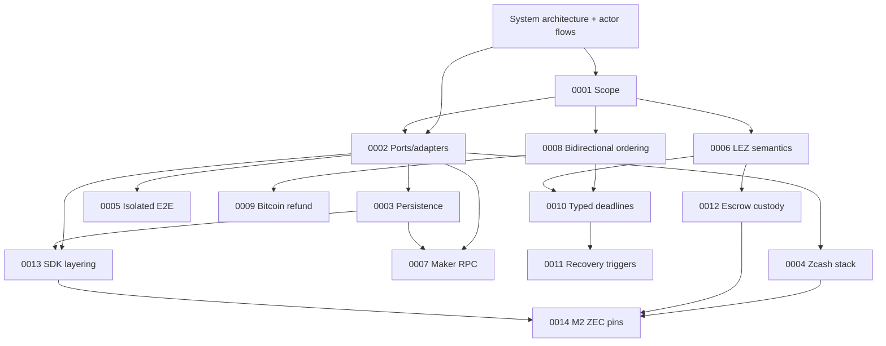

# Architecture

The canonical composed view is [System architecture and actor
flows](system-architecture.md). It defines the independent actors, runtime and
trust boundaries, and the happy, recovery, and restart lifecycles used to judge
whether a test is genuinely end to end. The ADRs below are append-only records
of the decisions behind that system.

ADRs are append-only. Superseded decisions remain here and link to their
replacement.

| ADR | Decision | Status |
|---|---|---|
| [0001](0001-authoritative-scope.md) | Live RFP plus accepted issue #112 define BTC/XMR/ZEC scope | Accepted |
| [0002](0002-ports-and-adapters.md) | Explicit protocol core with ports/adapters around external systems | Accepted |
| [0003](0003-sqlite-persistence.md) | SQLite/`rusqlite` persistence behind a repository port | Accepted, crash validation pending |
| [0004](0004-zcash-stack.md) | Zebra plus local canonical transaction construction; selective Zallet use | Accepted |
| [0005](0005-docker-isolation.md) | Per-run Compose project, networks, volumes, and ephemeral ports | Accepted |
| [0006](0006-lez-upstream-semantics.md) | Pin LEZ behavior and verify source assumptions executablely | Accepted |
| [0007](0007-maker-local-rpc.md) | Authenticated local JSON-RPC with a transport-hardening gate | Accepted, production transport pending |
| [0008](0008-bidirectional-role-ordering.md) | Separate product direction from reviewed pair funding capability | Accepted; XMR is LEZ-first only |
| [0009](0009-bitcoin-refund-path.md) | Taproot key-path cooperative claim with script-path CSV refund | Accepted, M3 validation pending |
| [0010](0010-typed-cross-chain-deadlines.md) | Typed consensus clocks plus conservative cross-chain safety bounds | Accepted for deadline legs; XMR superseded by 0011 |
| [0011](0011-event-gated-recovery.md) | Recovery uses typed deadlines or canonical events; XMR has no native timelock | Accepted and represented in core/RPC/CLI |
| [0012](0012-lez-escrow-custody.md) | Split metadata PDA from authenticated-transfer custody or required custom-token ATA | Source-correct native/ATA TDD in progress |
| [0013](0013-sdk-layering.md) | Deterministic common core plus complete per-pair async facades | Accepted for Logos review |
| [0014](0014-zec-m2-implementation-pins.md) | SPEL/LEZ, canonical Zcash crates, and vulnerability-clean minimal Zebra runtime pins for M2 | Accepted for M2 implementation |
