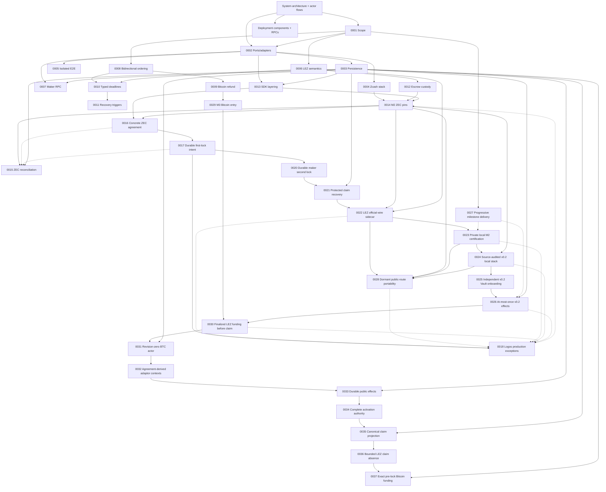

# Architecture

The canonical composed view is [System architecture and actor
flows](system-architecture.md), with the concrete process/node/RPC inventory in
[Deployment components, RPCs, and local nodes](deployment-components-and-rpcs.md). It defines the independent actors, runtime and
trust boundaries, and the happy, recovery, and restart lifecycles used to judge
whether a test is genuinely end to end. The ADRs below are append-only records
of the decisions behind that system. The current canonical M2 runtime,
deployment, actor, and chain facts are retained in the
[private actual-node certification packet](../evidence/m2-canonical-local-certification-20260714.json).

ADRs are append-only. Superseded decisions remain here and link to their
replacement.

## Diagram compatibility policy

Every tracked Markdown Mermaid block must use the conservative GitHub-compatible
subset enforced by CI: stable flowchart, sequence, state-v2, class, or ER
declarations without host configuration, beta/new-shape syntax, or interactive
links and callbacks. The same gate renders every diagram with the exact Mermaid
CLI 11.16.0 pin. GitHub's live Viewscreen asset also reported 11.16.0 on
2026-07-12; its URL and SHA-256 are retained in
[`../evidence/github-mermaid-renderer.json`](../evidence/github-mermaid-renderer.json).
GitHub controls that renderer, so visual verification on GitHub is still
required after pushing documentation changes.

| ADR | Decision | Status |
|---|---|---|
| [0001](0001-authoritative-scope.md) | Live RFP plus accepted issue #112 define BTC/XMR/ZEC scope | Accepted |
| [0002](0002-ports-and-adapters.md) | Explicit protocol core with ports/adapters around external systems | Accepted |
| [0003](0003-sqlite-persistence.md) | SQLite/`rusqlite` persistence behind a repository port | Schema-v10 role-local locks, protected claims, ordered refunds, legacy-secret migration, and atomic replay proven; both private local actual-node happy claims reached independent revision-4 stores, while composed restart/refund effects remain later hardening |
| [0004](0004-zcash-stack.md) | Zebra plus local canonical transaction construction; selective Zallet use | Accepted |
| [0005](0005-docker-isolation.md) | Per-run Compose project, networks, volumes, and ephemeral ports | Accepted |
| [0006](0006-lez-upstream-semantics.md) | Pin LEZ behavior and verify source assumptions executablely | Accepted |
| [0007](0007-maker-local-rpc.md) | Authenticated local JSON-RPC with a transport-hardening gate | Accepted, production transport pending |
| [0008](0008-bidirectional-role-ordering.md) | Separate product direction from reviewed pair funding capability | Accepted; XMR is LEZ-first only |
| [0009](0009-bitcoin-refund-path.md) | Taproot key-path cooperative claim with script-path CSV refund | Accepted; separate role actors complete both actual-node cooperative directions and the agreement-derived BIP-342 refund transaction is GREEN, while Core deadline/restart/fee-bump and LEZ refund evidence remain |
| [0010](0010-typed-cross-chain-deadlines.md) | Typed consensus clocks plus conservative cross-chain safety bounds | Accepted for deadline legs; XMR superseded by 0011 |
| [0011](0011-event-gated-recovery.md) | Recovery uses typed deadlines or canonical events; XMR has no native timelock | Accepted and represented in core/RPC/CLI |
| [0012](0012-lez-escrow-custody.md) | Split metadata PDA from authenticated-transfer custody or required custom-token ATA | Native authenticated-transfer and recursive ATA compatibility paths are GREEN; canonical v0.2 native custody completed both local happy directions, while actual-node refund and token-corridor hardening remain deferred |
| [0013](0013-sdk-layering.md) | Deterministic common core plus complete per-pair async facades | Concrete ZEC negotiation, locks, role-local claims/refunds, and schema-v10 replay proven; private local LEZ v0.2/Zebra happy-claim composition is GREEN in both directions, with production/public and actual-node recovery composition pending |
| [0014](0014-zec-m2-implementation-pins.md) | SPEL/LEZ, canonical Zcash crates, and vulnerability-clean minimal Zebra runtime pins for M2 | Accepted; v0.1.2 remains a lower compatibility lane, while the only trusted v0.2 target is Docker-built ELF `c85055...9d2e` and ProgramId `5cf8c5...29c1`. Earlier host-built `f83850...0fbe` evidence is explicitly historical |
| [0015](0015-durable-zcash-observation-reconciliation.md) | Stable affirmative Zcash canonical/removal evidence plus two-phase durable reconciliation | Binding, journal, role projection, conflicts, terminal alerts, and actual two-Zebra restart/requery proven; production poller pending |
| [0016](0016-canonical-zec-agreement.md) | Canonical bounded dual-signed LEZ/ZEC terms bind actors, chains, custody, deadlines, and transaction policy | Validator, activation/resume, locks, claims, and ordered refunds proven; the same agreement boundary completed both private local actual-node claim directions. Exact signed public-v0.2 activation is locally contract-proven; live public execution and composed recovery remain open |
| [0017](0017-crash-safe-first-lock-intent.md) | Exact role-fixed lock bytes are durable and observed before byte-identical submission | Taker and maker intents plus canonical history survive restart; schema-v10 claims/refunds continue from `BothLegsLocked` |
| [0018](0018-logos-upstream-production-exceptions.md) | Logos-owned live-release blockers are disclosed separately from repository-controlled milestone evidence | Accepted; living production register required through final release |
| [0019](0019-canonical-lez-observation.md) | Stable agreement-bound LEZ fund transaction, block, metadata, and custody evidence is replayed from primitive snapshots | Canonical/update/removal/replacement exact-head folding accepted in SDK/SQLite; v0.2 SDK-port observation completed both local happy directions after the reverse validator was bound to the agreement-derived depositor; composed reorg/recovery remains open |
| [0020](0020-durable-maker-second-lock.md) | Fresh eligibility is consumed by a separately durable opposite-chain maker effect | Separate schema-v10 maker/taker stores replay `BothLegsLocked`; direction-correct second locks completed through actual local nodes in both happy directions, while terminal recovery hardening continues under 0021 |
| [0021](0021-protected-claim-recovery.md) | Claim material and exact submissions use authenticated envelopes plus role-local schema-v10 claim/refund journals | Both directions, legacy-secret migration/scrub, corruption/rollback/unknown-outcome hardening, and independent replay at `Completed` or `Refunded` proven; key rotation and production adapters pending |
| [0022](0022-isolate-lez-official-wire-sidecar.md) | Keep incompatible pinned LEZ official-wire and Zcash graphs in separate processes behind a bounded local protocol | Process boundary and both local happy directions are GREEN. Actor schema v3 provides deterministic-local, self-hosted-cookie, and exact-Tatum Zebra routes; sidecar outbound profiles provide explicit local LEZ or exact official LEZ HTTPS while actor-to-sidecar traffic remains loopback/capability protected. Public live execution and actual-node recovery remain open |
| [0023](0023-private-local-m2-certification.md) | Certify M2 through a private fully functional actual-node corridor and defer public deployment/testnet publication | Accepted; the canonical Docker guest was deployed and finalized locally, and both private local happy directions plus dormant public-route contracts are GREEN. Public transactions and recordings remain deferred |
| [0024](0024-source-audited-lez-v0-2-local-stack.md) | Build the source-audited LEZ v0.2 services into an isolated Bedrock-settled local stack | Accepted; exact inputs/topology, isolated startup, signed channel, finalized Vault Claims, canonical ProgramId `5cf8c5...29c1` deployment in block 2582, and both private local directions are evidenced. Independent second clean service rebuild and composed recovery remain later hardening |
| [0025](0025-independent-lez-v02-vault-onboarding.md) | Onboard independent v0.2 maker and taker funds through exact owner-authorized Vault Claims | Exact preparation, durable one-call submission through Admitted, separate manual finalized inclusion/balance audit, and later use by both corridors are GREEN. Integrated actor-bound finality, negative on-chain attempts, and process-restart reconciliation remain later hardening |
| [0026](0026-lez-v02-at-most-once-submission-and-query-finality.md) | Persist AttemptStarted before one v0.2 send and prove inclusion/finality through bounded sequencer and indexer queries | Architecture and durable one-call/restart tests are GREEN. The M3 witnessed-claim bridge now performs bounded finalized block ID/hash and same-containing-BlockId account observation for either participant with client BIP-340 revalidation. Vault query/journal progression, upstream account proofs, and ambiguous multi-effect restart reconciliation remain later hardening |
| [0027](0027-progressive-jpeg-milestone-delivery.md) | Deliver a reproducible actual-local-devnet milestone PoC first, then owner-controlled QA, chaos, information-security, and production-readiness hardening | Accepted; M2 is certified at its local-functional PoC boundary under `m2-complete`. Accumulated hardening is carried evidence until the owner enters and revalidates its phase; no transition to QA or M3 is implied |
| [0028](0028-dormant-public-route-portability.md) | Admit exact dormant public LEZ and Zebra routes without exposing the actor-sidecar boundary or weakening agreement-bound pre-effect validation | Canonical Docker target and finalized local deployment binding are GREEN; exact dormant public configuration and bounded-client construction are GREEN without public I/O. Live public execution and official LEZ finalized-tip availability remain production gates |
| [0029](0029-m3-bitcoin-local-poc-entry.md) | Enter M3 through isolated Bitcoin Core Regtest and LEZ v0.2 actors with aggregate witnessed claim authorities | Accepted and active; actual-Core consensus, durable journals, fresh independent role processes, external adaptation/extraction, the checked witnessed guest, both complete operator-composed local directions, canonical agreement, typed observers, and recovery store are GREEN. The public actor source reaches terminal revision four with both claim effects; its fresh two-direction actual-node E2E, refunds, concurrency, Testnet4 portability, and hardening remain |
| [0030](0030-finalized-lez-funding-before-claim.md) | Preserve the live observer and require distinct finalized LEZ funding evidence before either claim can reveal adaptor material | Accepted; protocol/client/sidecar and actor composition are GREEN. Logos v0.2 end-of-block account reads require funding finality before claim submission and remain a disclosed production trust limitation; fresh public-actor actual-node evidence remains pending |
| [0031](0031-one-shot-btc-actor-observe-before-project.md) | Use a public one-shot role-fixed actor that returns from each exact funding observation before predecessor-CAS projection | Accepted. `activate`, offline `status`, typed Core or finalized-LEZ `drive`, both claim revisions, signed policy/account binding, persistence, and local replay/CAS tests are GREEN in both roles and directions; fresh two-direction actual-node actor evidence remains pending |
| [0032](0032-derive-adaptor-contexts-from-agreement.md) | Reconstruct both adaptor signing contexts from the validated agreement plus fresh session IDs | Accepted for the SDK boundary. Agreement tests prove the Bitcoin tweak/message and untweaked LEZ message are derived in both directions without a second actor-side session parser; actor activation and claim-time journal revalidation are GREEN, while fresh actual-node evidence remains pending |
| [0033](0033-persist-public-effects-before-submission.md) | Persist complete public transaction bytes before consuming one-attempt submission authority | Accepted for the persistence boundary. Fourteen focused tests prove exact replay, a concurrent single CAS winner, ambiguous observe-only recovery, corruption rejection, conflict-authority burning, and full-byte reconciliation; Bitcoin and LEZ actor claim paths are composed, while actual-node crash evidence remains pending |
| [0034](0034-gate-actor-activation-on-signing-material.md) | Require complete agreement-derived signer, prepared-claim, and role-shaped scalar authority before actor activation | Accepted. Strict private schema 2, independent presignature verification, full prepared-result binding, taker-only private scalar point checking, failure-before-state, non-disclosure, fresh-process replay, and revision-three/four reuse are GREEN; actual-node actor evidence remains pending |
| [0035](0035-project-claims-only-from-canonical-public-evidence.md) | Advance claim revisions only from exact confirmed or finalized public evidence and retain only a one-way scalar commitment | Accepted for the deterministic claim-projection boundary. Both roles and directions reach revisions three and four through predecessor CAS after rerunning activation authority; concrete observation/submission adapters are composed, while fresh actual-node actor evidence remains pending |
| [0036](0036-prove-bounded-lez-claim-absence-before-first-send.md) | Distinguish exact finalized LEZ presence from stable complete bounded absence before first-send reconciliation | Accepted and actor-composed. Only a complete stable finalized scan yields `NotFound`; partial history, moving tips, timeouts, and transport ambiguity cannot authorize submission. Deterministic actor effects are GREEN; fresh actual-node evidence remains pending |
| [0037](0037-finalize-exact-bitcoin-funding-before-first-effect.md) | Prepare, policy-check, and countersign one exact Bitcoin funding transaction before either chain effect | Accepted and implemented for the fixture provisioner. Exact rawtr authorization, planned-anchor recovery terms, secret-safe outputs, and 11 focused tests are GREEN; the fresh two-direction public-actor actual-node run remains the certification gate |
