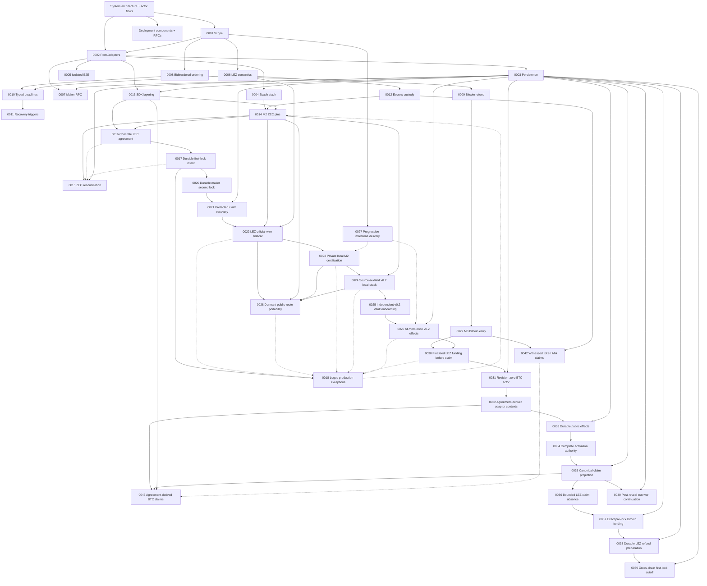

# Architecture

The canonical composed view is [System architecture and actor
flows](system-architecture.md), with the concrete process/node/RPC inventory in
[Deployment components, RPCs, and local nodes](deployment-components-and-rpcs.md). It defines the independent actors, runtime and
trust boundaries, and the happy, recovery, and restart lifecycles used to judge
whether a test is genuinely end to end. The ADRs below are append-only records
of the decisions behind that system. The current canonical M2 runtime,
deployment, actor, and chain facts are retained in the
[private actual-node certification packet](../evidence/m2-canonical-local-certification-20260714.json).
The current M3 schema-4 actor-owned Maker-lock checkpoint is retained in the
[private local two-direction packet](../evidence/m3-schema4-actor-owned-lock-poc-20260717.json):
the Taker fixture creates only the first lock, while the one-shot Maker actor
creates and reconciles the exact second lock before locally closing revision
two. This remains a private local PoC, not an M3 completion or production
readiness claim.

The M3 component boundary now also contains the checked witnessed-token guest,
its synchronized manifest/IDL/deployer/verifier/runner identity, the complete
deterministic BTC SDK lifecycle, and the additive exact-once v2 asset client.
The client enforces operation-specific actor roles and conservative exact or
discovery observation without retries. Official sidecar scans, adapter/journal
composition, and role-owned actual-node custom-token execution remain open.

ADRs are append-only. Superseded decisions remain here and link to their
replacement.

## Diagram compatibility policy

Every tracked Markdown Mermaid block must use the conservative GitHub-compatible
subset enforced by CI: stable flowchart, sequence, state-v2, class, or ER
declarations without host configuration, beta/new-shape syntax, or interactive
links and callbacks. The same gate renders every diagram with the exact Mermaid
CLI 11.16.0 pin. GitHub's live Viewscreen asset also reported 11.16.0 on
2026-07-12; its URL and SHA-256 are retained in
[`../evidence/github-mermaid-renderer.json`](../evidence/github-mermaid-renderer.json).
GitHub controls that renderer, so visual verification on GitHub is still
required after pushing documentation changes.

| ADR | Decision | Status |
|---|---|---|
| [0001](0001-authoritative-scope.md) | Live RFP plus accepted issue #112 define BTC/XMR/ZEC scope | Accepted |
| [0002](0002-ports-and-adapters.md) | Explicit protocol core with ports/adapters around external systems | Accepted |
| [0003](0003-sqlite-persistence.md) | SQLite/`rusqlite` persistence behind a repository port | Schema-v10 role-local locks, protected claims, ordered refunds, legacy-secret migration, and atomic replay proven; both private local actual-node happy claims reached independent revision-4 stores, while composed restart/refund effects remain later hardening |
| [0004](0004-zcash-stack.md) | Zebra plus local canonical transaction construction; selective Zallet use | Accepted |
| [0005](0005-docker-isolation.md) | Per-run Compose project, networks, volumes, and ephemeral ports | Accepted |
| [0006](0006-lez-upstream-semantics.md) | Pin LEZ behavior and verify source assumptions executablely | Accepted |
| [0007](0007-maker-local-rpc.md) | Authenticated local JSON-RPC with a transport-hardening gate | Accepted, production transport pending |
| [0008](0008-bidirectional-role-ordering.md) | Separate product direction from reviewed pair funding capability | Accepted; XMR is LEZ-first only |
| [0009](0009-bitcoin-refund-path.md) | Taproot key-path cooperative claim with script-path CSV refund | Accepted; both actual-node cooperative directions, canonical BIP-342 construction, typed Core maturity/observation/one-send/evidence, role-shaped key custody, and deterministic actor restart composition are GREEN. Actual-node refund, reorg, and fee-bump evidence remain |
| [0010](0010-typed-cross-chain-deadlines.md) | Typed consensus clocks plus conservative cross-chain safety bounds | Accepted for deadline legs; XMR superseded by 0011 |
| [0011](0011-event-gated-recovery.md) | Recovery uses typed deadlines or canonical events; XMR has no native timelock | Accepted and represented in core/RPC/CLI |
| [0012](0012-lez-escrow-custody.md) | Split metadata PDA from authenticated-transfer custody or required custom-token ATA | Native/ATA custody, both local v0.2 happy directions, strict refund wire, durable exact refund preparation, finalized refund observation, and deterministic actor execution are GREEN. ADR 0042 adds checked-guest aggregate-witness claims and an exact durable sidecar planner for custom-token ATAs; the actual-node token corridor remains open |
| [0013](0013-sdk-layering.md) | Deterministic common core plus complete per-pair async facades | Concrete ZEC negotiation, locks, role-local claims/refunds, and schema-v10 replay proven. ADRs 0043 and 0044 add BTC agreement-derived claims, signed pre-lock refunds, and pure recovery selection; revisions 1 through 4 resume, actor/store/node composition, examples, and the complete public lifecycle remain open |
| [0014](0014-zec-m2-implementation-pins.md) | SPEL/LEZ, canonical Zcash crates, and vulnerability-clean minimal Zebra runtime pins for M2 | Accepted; v0.1.2 remains a lower compatibility lane, while the only trusted v0.2 target is Docker-built ELF `c85055...9d2e` and ProgramId `5cf8c5...29c1`. Earlier host-built `f83850...0fbe` evidence is explicitly historical |
| [0015](0015-durable-zcash-observation-reconciliation.md) | Stable affirmative Zcash canonical/removal evidence plus two-phase durable reconciliation | Binding, journal, role projection, conflicts, terminal alerts, and actual two-Zebra restart/requery proven; production poller pending |
| [0016](0016-canonical-zec-agreement.md) | Canonical bounded dual-signed LEZ/ZEC terms bind actors, chains, custody, deadlines, and transaction policy | Validator, activation/resume, locks, claims, and ordered refunds proven; the same agreement boundary completed both private local actual-node claim directions. Exact signed public-v0.2 activation is locally contract-proven; live public execution and composed recovery remain open |
| [0017](0017-crash-safe-first-lock-intent.md) | Exact role-fixed lock bytes are durable and observed before byte-identical submission | Taker and maker intents plus canonical history survive restart; schema-v10 claims/refunds continue from `BothLegsLocked` |
| [0018](0018-logos-upstream-production-exceptions.md) | Logos-owned live-release blockers are disclosed separately from repository-controlled milestone evidence | Accepted; living production register required through final release |
| [0019](0019-canonical-lez-observation.md) | Stable agreement-bound LEZ fund transaction, block, metadata, and custody evidence is replayed from primitive snapshots | Canonical/update/removal/replacement exact-head folding accepted in SDK/SQLite; v0.2 SDK-port observation completed both local happy directions after the reverse validator was bound to the agreement-derived depositor; composed reorg/recovery remains open |
| [0020](0020-durable-maker-second-lock.md) | Fresh eligibility is consumed by a separately durable opposite-chain maker effect | Separate schema-v10 maker/taker stores replay `BothLegsLocked`; direction-correct second locks completed through actual local nodes in both happy directions, while terminal recovery hardening continues under 0021 |
| [0021](0021-protected-claim-recovery.md) | Claim material and exact submissions use authenticated envelopes plus role-local schema-v10 claim/refund journals | Both directions, legacy-secret migration/scrub, corruption/rollback/unknown-outcome hardening, and independent replay at `Completed` or `Refunded` proven; key rotation and production adapters pending |
| [0022](0022-isolate-lez-official-wire-sidecar.md) | Keep incompatible pinned LEZ official-wire and Zcash graphs in separate processes behind a bounded local protocol | Process boundary and both local happy directions are GREEN. Actor schema v3 provides deterministic-local, self-hosted-cookie, and exact-Tatum Zebra routes; sidecar outbound profiles provide explicit local LEZ or exact official LEZ HTTPS while actor-to-sidecar traffic remains loopback/capability protected. Public live execution and actual-node recovery remain open |
| [0023](0023-private-local-m2-certification.md) | Certify M2 through a private fully functional actual-node corridor and defer public deployment/testnet publication | Accepted; the canonical Docker guest was deployed and finalized locally, and both private local happy directions plus dormant public-route contracts are GREEN. Public transactions and recordings remain deferred |
| [0024](0024-source-audited-lez-v0-2-local-stack.md) | Build the source-audited LEZ v0.2 services into an isolated Bedrock-settled local stack | Accepted; exact inputs/topology, isolated startup, signed channel, finalized Vault Claims, canonical ProgramId `5cf8c5...29c1` deployment in block 2582, and both private local directions are evidenced. Independent second clean service rebuild and composed recovery remain later hardening |
| [0025](0025-independent-lez-v02-vault-onboarding.md) | Onboard independent v0.2 maker and taker funds through exact owner-authorized Vault Claims | Exact preparation, durable one-call submission through Admitted, separate manual finalized inclusion/balance audit, and later use by both corridors are GREEN. Integrated actor-bound finality, negative on-chain attempts, and process-restart reconciliation remain later hardening |
| [0026](0026-lez-v02-at-most-once-submission-and-query-finality.md) | Persist AttemptStarted before one v0.2 send and prove inclusion/finality through bounded sequencer and indexer queries | Architecture and durable one-call/restart tests are GREEN. The M3 witnessed-claim bridge now performs bounded finalized block ID/hash and same-containing-BlockId account observation for either participant with client BIP-340 revalidation. Vault query/journal progression, upstream account proofs, and ambiguous multi-effect restart reconciliation remain later hardening |
| [0027](0027-progressive-jpeg-milestone-delivery.md) | Deliver a reproducible actual-local-devnet milestone PoC first, then owner-controlled QA, chaos, information-security, and production-readiness hardening | Accepted; M2 is certified at its local-functional PoC boundary under `m2-complete`. Accumulated hardening is carried evidence until the owner enters and revalidates its phase; no transition to QA or M3 is implied |
| [0028](0028-dormant-public-route-portability.md) | Admit exact dormant public LEZ and Zebra routes without exposing the actor-sidecar boundary or weakening agreement-bound pre-effect validation | Canonical Docker target and finalized local deployment binding are GREEN; exact dormant public configuration and bounded-client construction are GREEN without public I/O. Live public execution and official LEZ finalized-tip availability remain production gates |
| [0029](0029-m3-bitcoin-local-poc-entry.md) | Enter M3 through isolated Bitcoin Core Regtest and LEZ v0.2 actors with aggregate witnessed claim authorities | Accepted and active; clean pushed commit `0e7635f` completed both schema-4 directions in run `m3schema4-20260717d`, and ADR 0041 closes the opposite-direction overlap checkpoint. Full accepted SDK/custom-token integration and recording scope, Testnet4 portability, hardening, and the milestone tag remain |
| [0030](0030-finalized-lez-funding-before-claim.md) | Preserve the live observer and require distinct finalized LEZ funding evidence before either claim can reveal adaptor material | Accepted and actual-node GREEN in both happy directions. Logos v0.2 end-of-block account reads remain a disclosed production trust limitation; finalized refund observation remains |
| [0031](0031-one-shot-btc-actor-observe-before-project.md) | Use a public one-shot role-fixed actor that returns from exact chain observation before predecessor-CAS projection | Accepted and actual-node GREEN for both schema-4 directions at `0e7635f`. Exact Maker effects use role-local one-attempt journals, exact mempool or LEZ effect-count reconciliation, and one local transaction for the final intent plus revision-two close. Schema 3 remains observation-only compatibility; crash, reorg, and concurrency hardening remain |
| [0032](0032-derive-adaptor-contexts-from-agreement.md) | Reconstruct both adaptor signing contexts from the validated agreement plus fresh session IDs | Accepted and actual-node GREEN for both agreement-derived claim sessions. No second actor-side parser exists; refund-session custody and recovery hardening remain |
| [0033](0033-persist-public-effects-before-submission.md) | Persist complete public transaction bytes before consuming one-attempt submission authority | Accepted and actual-node GREEN for both claim paths. Fourteen focused tests prove replay and one CAS winner; forced process-kill evidence remains |
| [0034](0034-gate-actor-activation-on-signing-material.md) | Require complete agreement-derived signer, prepared-claim, and role-shaped scalar authority before actor activation | Accepted and actual-node GREEN through revision four in both directions. Agreement-matched Bitcoin refund-key custody is now enforced; process-kill and production key custody remain |
| [0035](0035-project-claims-only-from-canonical-public-evidence.md) | Advance claim revisions only from exact confirmed or finalized public evidence and retain only a one-way scalar commitment | Accepted and actual-node GREEN through claim projection in both roles and directions. Refund, reorg, crash, and concurrency projection remain |
| [0036](0036-prove-bounded-lez-claim-absence-before-first-send.md) | Distinguish exact finalized LEZ presence from stable complete bounded absence before first-send reconciliation | Accepted and actual-node GREEN for claims. Refunds now use the stricter state-only eligibility then exact-observation gate with no absence-based authorization; actual-node refund evidence remains |
| [0037](0037-finalize-exact-bitcoin-funding-before-first-effect.md) | Prepare, policy-check, and countersign one exact Bitcoin funding transaction before either chain effect | Accepted and actual-node GREEN in both schema-4 directions. Exact rawtr authorization, planned-anchor recovery terms, secret-safe outputs, and 11 focused tests gate the first effect; run `m3schema4-20260717d` additionally proves the direction-correct Maker actor, not the runner, owns the second-lock send. Production fee/replacement and reorg hardening remain |
| [0038](0038-durable-permissionless-lez-refund.md) | Durably prepare exact permissionless LEZ refund bytes before finalized actor eligibility can authorize one send | Accepted through authenticated planner replay, public actor one-attempt execution, no-rearm restart, nonowner discovery, and ordered finalized projection. Deterministic gates and both-direction actual-node timeout/refund execution are GREEN; later chaos/reorg hardening remains |
| [0039](0039-admit-first-lock-recovery-only-after-cross-chain-cutoff.md) | Admit a revision-one refund only after a signed cutoff, two fresh exact maker-lock classifications, and a fresh first-lock unspent/eligibility check | Accepted for the M3 BTC PoC; both live schema-4 timely-Maker paths are actual-node GREEN at `0e7635f`, including fresh exact first-lock eligibility, current/finalized chain evidence, one-attempt Maker submission, exact reconciliation, and atomic local intent/revision-two close. There is no distributed cross-chain commit; concurrency, reorg, adversarial-late-lock, and public production hardening remain |
| [0040](0040-continue-post-reveal-from-canonical-evidence.md) | Keep revision 3 nonterminal and let fresh maker processes continue from canonical reveal while the taker is absent | Accepted and clean pushed-commit actual-node evidence is GREEN in both directions in `m3survivor-20260716c` |
| [0041](0041-interleave-overlapping-swaps-with-exact-chain-barriers.md) | Run two independent opposite-direction swaps on shared local nodes while preserving exact singleton-chain assertions | Accepted and clean pushed-commit actual-node GREEN in `m3overlap-20260717a`: distinct mature outpoints, agreements, stores, journals, sessions, escrows, and deadlines were simultaneously at revision two before settlement; arbitrary-N and same-depositor nonce scheduling remain outside this checkpoint |
| [0042](0042-bind-witnessed-token-claims-to-exact-atas.md) | Bind aggregate-witness custom-token claims to one fungible definition and exact depositor, custody, and claimant ATAs in one recursive LEZ transition | Accepted at checked-guest/protocol/client/adapter/sidecar-planner component boundaries; new ELF/ImageID, tags 11/12, two-definition claims, recursive rollback, strict v2 asset terms and transactions, manifest/IDL/deployer assembly, four finalized effect classifiers, the eleven-operation exact-once client and no-submit agreement adapter, and four durable official-token planner reservations are GREEN. Routes/scans, journal/actor composition, and actual-node F7 integration remain open |
| [0043](0043-derive-btc-claims-from-the-agreement.md) | Derive both BTC claim sessions from the countersigned agreement and materialize only agreement-bound exact follow-up effects | Accepted at deterministic SDK component boundary in `28f38c7`; both claim orders, exact evidence, redacted zeroizing recovery, template substitution, replay, and substitution rejection are GREEN. ADR 0044 extends it with signed refunds and pure recovery selection; later-revision resume, actor/store/node composition, examples/docs, and F7 integration remain open |
| [0044](0044-presign-btc-recovery-and-project-revealing-leg-first.md) | Require both signed refunds before BTC locking and project the Maker-funded revealing-leg refund before the Taker-funded follow-up leg | Accepted at the deterministic SDK component boundary; both directions, first-lock abandonment, exact timeout boundaries, replay, role ownership, network/finality/confirmation checks, and invalid ordering are GREEN. Durable later-revision resume and actor/store/node composition remain open |
| [0045](0045-countersign-the-selected-lez-asset.md) | Preserve agreement-v1 bytes and separately countersign the exact native or custom-token selection, programs, definition, ATAs, amount, deadline, and aggregate authority | Accepted at the deterministic SDK and adapter boundaries; independent custom custody, both role signatures, exact local policy, the substitution matrix, and exact v2 terms/call mapping are GREEN. Official ATA derivation is GREEN in the sidecar planner; actor journals, route/scan mapping, and actual-node F7 evidence remain open |
| [0046](0046-replay-btc-sdk-lifecycle-from-exact-transitions.md) | Reconstruct revisions one through four from exact ordered chain transitions and remove discovery/negotiation capability after activation | Accepted at the deterministic SDK boundary; both directions/roles, claims, ordered refunds, replay, and clone-validate-commit rollback are GREEN. Public process-durable store and direct actor/node composition remain open |
