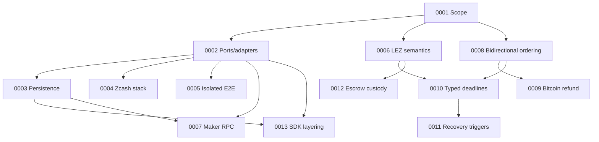

# Architecture decision log

ADRs are append-only. Superseded decisions remain here and link to their
replacement. Every new ADR records its threat-model delta or states that none
applies; the [threat model](../milestone-1/threat-model.md) is re-validated at
each milestone gate.

| ADR | Decision | Status |
|---|---|---|
| [0001](0001-authoritative-scope.md) | Live RFP plus accepted issue #112 define BTC/XMR/ZEC scope | Accepted |
| [0002](0002-ports-and-adapters.md) | Explicit protocol core with ports/adapters around external systems | Accepted |
| [0003](0003-sqlite-persistence.md) | SQLite/`rusqlite` persistence behind a repository port | Accepted, crash validation pending |
| [0004](0004-zcash-stack.md) | Zebra plus local canonical transaction construction; selective Zallet use | Accepted |
| [0005](0005-docker-isolation.md) | Per-run Compose project, networks, volumes, and ephemeral ports | Accepted |
| [0006](0006-lez-upstream-semantics.md) | Pin LEZ behavior and verify source assumptions executablely | Accepted |
| [0007](0007-maker-local-rpc.md) | Authenticated local JSON-RPC with a transport-hardening gate | Accepted, production transport pending |
| [0008](0008-bidirectional-role-ordering.md) | Separate product direction from reviewed pair funding capability | Accepted; XMR is LEZ-first only |
| [0009](0009-bitcoin-refund-path.md) | Taproot key-path cooperative claim with script-path CSV refund | Accepted, M3 validation pending |
| [0010](0010-typed-cross-chain-deadlines.md) | Typed consensus clocks plus conservative cross-chain safety bounds | Accepted for deadline legs; XMR superseded by 0011 |
| [0011](0011-event-gated-recovery.md) | Recovery uses typed deadlines or canonical events; XMR has no native timelock | Accepted and represented in core/RPC/CLI |
| [0012](0012-lez-escrow-custody.md) | Split metadata PDA from native vault or required custom-token ATA | Accepted, M2 validation pending |
| [0013](0013-sdk-layering.md) | Deterministic common core plus complete per-pair async facades | Accepted for Logos review |

## Submission series

This focused branch also carries the decision ranges needed to review the M3
Bitcoin implementation and M6 Basecamp surface. Numbers between the ranges
belong to milestones outside this package and are intentionally not reproduced
here.

| Range | Focus |
|---|---|
| [0029](0029-m3-bitcoin-local-poc-entry.md)–[0052](0052-bind-private-demo-videos-to-actual-node-evidence.md) | M3 Bitcoin entry, exact lock/claim evidence, adaptor security properties, recovery, replay, concurrency, and demo evidence |
| [0128](0128-enter-m6-through-current-basecamp-qml.md)–[0147](0147-isolate-basecamp-role-packages-over-owner-services.md) | M6 role services, terminal actions/refunds, Basecamp toolchain pinning, and isolated packages |
| [0210](0210-route-role-agreement-chat-over-logos-chat.md)–[0211](0211-discover-offers-over-logos-delivery.md) | App-lifetime Logos Chat negotiation and signed Delivery offer discovery |
| [0212](0212-version-runtime-components.md) | Checked runtime profiles, symmetric public names, and least-privilege demo launch |

The [system architecture](system-architecture.md) and
[deployment/RPC map](deployment-components-and-rpcs.md) are the detailed M3
references. The shorter [M3+ product diagrams](../diagrams.md) show only the
LEZ/BTC stack exercised by this submission.
