# Deployment components, RPCs, and local nodes

Status: Living executable inventory — 2026-08-04

This document is the concrete deployment companion to the
[system architecture](system-architecture.md). It distinguishes processes that
actually run today from target components that do not yet have an implementation,
port, credential scheme, or selected provider. A dashed component or edge is
planned; blue components are implemented and may have partial live exercise but
have not completed this topology.
No port is invented for an unimplemented integration. Exact current artifact,
deployment, transaction, balance, and run facts are retained in the
[canonical M2 certification packet](../evidence/m2-canonical-local-certification-20260714.json).

## M6 implemented UI deployment topology

M6 has both the signed-off dependency-free prototypes and two production-shape
Basecamp 0.2 `ui_qml` packages. The prototypes remain a no-effect review tool.
The role packages are consumer-locked, build module/LGX/developer-install and
official integration outputs, and load in the pinned Basecamp 0.2.0-RC3 product.
Each view uses a typed Qt Remote Objects replica whose C++ backend runs in a
separate process. That backend can open only the matching owner Unix socket and
translate only the role's fixed method allowlist.

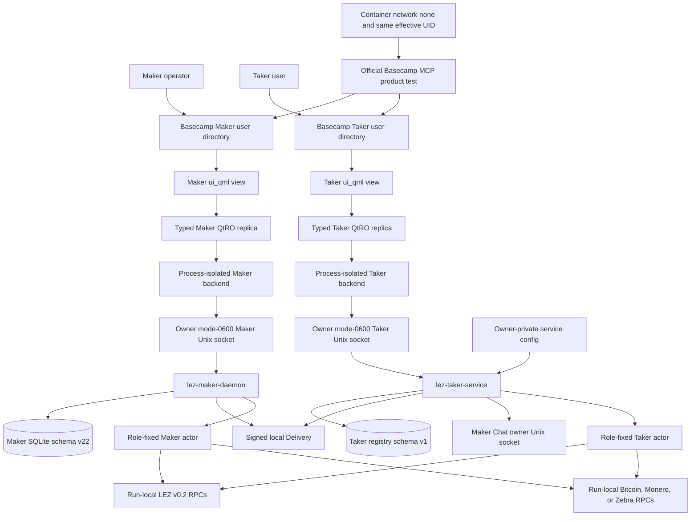

The Maker product test loads the package, checks the real daemon, commits
`maker_local_route_save_v1`, and reads history from isolated SQLite. The Taker
product test loads its separate package, checks the real owner service, browses
offers, submits an authenticated prepared request, repeats it as exact replay,
lists swaps, and monitors the admitted swap. The post-product Rust assertion
proves UI request `taker-ui-initiate-001` durably maps to
`m6-process-zec-swap-001` in the real registry. Missing service tests for both
roles fail closed without crashing Basecamp.

Neither QML view receives a socket path, node endpoint, wallet credential,
signing key, Delivery key, Chat credential, SQLite path, receipt, or arbitrary
method name. The shared local client rejects symlinks, non-sockets, wrong owner,
and any mode other than 0600, bounds HTTP/JSON messages to 64 KiB, uses finite
connect/read timeouts, and has no TCP, web, or command-execution path.

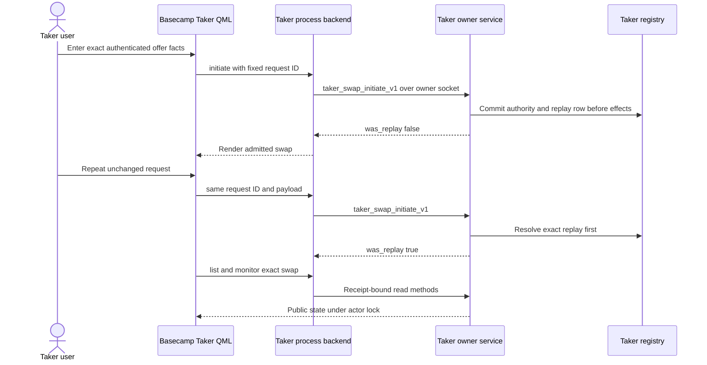

The Basecamp composition run ends at admission, replay, list, and monitor; it
does not claim that the click produced a chain transaction. Fresh actual-node
service certificates separately prove ZEC Claim and Refund through the same
owner service and actors. Claim run `m6claim0ba41aba` finalized LEZ Claim
`f865903e...14d0cc` in block 127 and made exact Zcash Claim
`0da6b4c2...d2abf` canonical at height 107, with no-effect replay. Refund run
`m6refund8f76d87a` finalized LEZ Refund `c43df1bb...dcf5ad` in block 129 before
canonical Zcash Refund `db066a94...5ab470` at height 110, with opposite-action
conflict and no-effect replay. ADR 0147 contains the per-pair sequences and
conditional atomicity arguments.

### M6 ports, credentials, and resources

| Surface | Port or endpoint | Credentials visible to the surface | Owned resources and current status |
|---|---|---|---|
| Manual static prototype | Default `127.0.0.1:0`; the printed kernel-selected port is authoritative. `M6_PROTOTYPE_PORT` may select one explicit loopback port and fails if it is busy | None | One Node process and the allowlisted static files; current, no Docker and no runtime effects |
| Manual browser | Exact origin printed by the server; no listener of its own | None; no cookie, token, key, seed, wallet file, `localStorage`, `sessionStorage`, or IndexedDB | Browser memory only; current and disposable |
| CI prototype server | `127.0.0.1:0`; the test reads the kernel-selected port from the listener | None | In-process `node:test` server; current and closed by the owning test run |
| CI browser | No application listener; connects only to the exact CI test-server origin | None | `/usr/bin/google-chrome`, with Puppeteer download disabled, plus a profile below `${{ runner.temp }}/lez-m6-ui-${{ github.run_id }}-${{ github.run_attempt }}`; current, run-unique, sandboxed, and removed by that run |
| Local isolated browser proof | In-process test server on kernel-selected loopback; container has `--network none` | None | Digest-pinned Puppeteer 25.3.0 image; read-only repository, disposable tmpfs/profile, unique container name, bounded CPU/memory/PIDs, Chromium sandbox enabled; current and GREEN 6/6 |
| Pinned Basecamp product | Qt inspector uses loopback only inside the networkless product container; application packages add no TCP listener | Separate Maker and Taker user directories contain only the matching developer-install tree; no chain credential | Basecamp 0.2.0-RC3 build/load GREEN. Dedicated Nix store and digest-pinned image are setup resources; product runtime uses `--network none` |
| Maker `ui_qml` | Internal typed QtRO connection managed by Basecamp; no application TCP port | No secrets, paths, arbitrary methods, node endpoints, or wallet authority in QML | Implemented package, LGX, installer, official standalone test, missing-service test, and real-daemon product flow GREEN |
| Maker process backend | Opens only the absolute path in `LEZ_MAKER_RPC_SOCKET`; actual path stays in the process environment | Effective-UID ownership and exact mode 0600 admit the backend; QML cannot read or change the path | Six typed QtRO slots translate to six fixed Maker JSON-RPC methods; shared client caps messages at 64 KiB and rejects TCP/web/command execution |
| Maker owner control | Default `/run/lez-atomic-swaps/maker.sock`; Unix mode 0600 beneath an effective-UID-owned mode-0700 runtime directory | Unix ownership and mode are the transport admission boundary; no browser credential | Existing Maker daemon RPC including atomic `maker_local_route_save_v1`; the process backend may call it, the QML view may not |
| Taker `ui_qml` | Internal typed QtRO connection managed by Basecamp; no application TCP port | No secrets, paths, arbitrary methods, node endpoints, or wallet authority in QML | Implemented package, LGX, installer, official standalone test, missing-service test, real-service test, and prepared actor-real product flow GREEN |
| Taker process backend | Opens only the absolute path in `LEZ_TAKER_RPC_SOCKET`; actual path stays in the process environment | Effective-UID ownership and exact mode 0600 admit the backend; QML cannot read or change the path | Seven typed QtRO slots translate to the seven fixed Taker methods; no generic dispatcher or public fallback |
| Taker service | Default `/run/lez-atomic-swaps/taker.sock`, or a run-owned absolute mode-0600 Unix socket below an owner mode-0700 directory | Unix ownership and mode admit the client; fixed DTOs/errors expose no paths, keys, receipts, commands, or raw evidence | Actual through `0c32200`; prepared authority exposes all seven fixed methods, including generation-fenced Claim and Refund. Fresh local evidence covers Claim and Refund. HTTP-only, batches disabled, bounded connections/bodies, inode-safe SIGTERM cleanup |
| Taker service configuration | Absolute owner-owned single-link regular mode-0400 or mode-0600 file, maximum 512 KiB | Pinned Delivery sources, Chat socket, existing registry, prepared ZEC files and signing key remain owner-only | Strict schema v1; `initiation.execute_prepared_zec` defaults false. Any nonempty prepared catalog currently requires Chat; true enables synchronous pre-effect acceptance |
| Prepared-ZEC startup context | No separate endpoint; loaded inside the owner service | At most 256 exact prepared authorities; no UI visibility | Service-connected through `e9393cf`; draft/key/source config are revalidated, full durable replay authority must match, and enabled acceptance provisions agreement, Taker actor, and receipt before response. Direct retained-byte use-time handoff remains hardening |
| Taker registry | Configured normalized absolute mode-0600 SQLite file inside the service | Stores private initiation and sole terminal-action authority; public APIs and fixed errors redact it | Initiation and terminal authorization each commit before their effects. Exact terminal replay returns the original action and may only re-enter the same actor journal; Claim and Refund cannot both be authorized |
| Delivery | No M6 TCP port; zero to 32 owner-private signed directories pinned to Maker keys | Maker signing material never enters the UI or Taker response | Fresh listing/initiation dependency only. Completed receipt replay does not read the removed offer; configured directory startup availability is still required |
| Chat | Absolute owner-owned mode-0600 Maker Unix socket; no TCP port | Maker signing and claim authority remain daemon-owned; Taker sends bounded public agreement material | Health probes metadata. With execution enabled, real propose/complete runs before response; completed receipt replay makes no Chat exchange |
| LEZ node RPCs | Run-scoped dynamic literal-loopback Bedrock, sequencer, and indexer endpoints plus role sidecars | Run, role, capability, signer, and key files remain outside the UI and service DTO | Fresh Claim regression `m6claim0ba41aba` used new LEZ run `m6claimlez0ba41aba`: Bedrock `127.0.0.1:32826`, sequencer `127.0.0.1:32827`, and indexer `127.0.0.1:32828`, with zero restarts. Fresh Refund certificate `m6refund8f76d87a` used new LEZ run `m6lez8f76d87a` at dynamic loopback ports 32821 through 32823 with zero restarts. Initiation/monitor do not contact them; role actors use sequencer/indexer |
| Bitcoin Core RPC | No new M6 port. Existing Regtest runs allocate a dynamic literal-loopback RPC port | Provisioner cookie authority and distinct restricted mode-0600 role Basic credentials remain outside the UI | Existing isolated Core and role actors; not started by the current prototype |
| Monero RPCs | No new M6 ports. Existing Regtest runs allocate distinct dynamic literal-loopback daemon and wallet ports | Distinct Digest RPC credentials and wallet-password files remain owner-private and outside the UI | Existing peerless daemon plus provisioner, Maker, and Taker wallets; not started by the current prototype |
| Zcash RPC | One run-scoped dynamic literal-loopback Zebra Regtest endpoint | Regtest transport is unauthenticated; signing keys and effect authority remain in actors, never UI or DTOs | Fresh Claim regression `m6claim0ba41aba` used new Zebra run `m6claimzec0ba41aba` at `127.0.0.1:32825`; exact Claim `0da6b4c2...d2abf` appeared once, remained identical on replay, and became canonical at height 107. Fresh Refund certificate `m6refund8f76d87a` used new Zebra run `m6refundzec8f76d87b` at `127.0.0.1:32824`; one exact Refund was canonical at height 110 and terminal replay retained height 110 plus an empty mempool |
| Public swap services | None | None | No public RPC, faucet, public funds, analytics, CDN, font host, or external finality service. Pinned Bedrock may attempt best-effort UDP NTP through `pool.ntp.org` during startup; block or account for it in network-isolated setup |

### M6 external-resource and flakiness boundary

The current runtime prototype is independent of external services. Default
port-zero binding avoids collisions; an explicitly selected busy port fails
instead of taking over another listener. CI isolates each browser profile under
the workflow run ID and attempt and performs exact test-owned cleanup. The
local Docker proof additionally uses a digest-pinned official Puppeteer image,
a unique container name, no network namespace, a read-only repository mount,
disposable tmpfs state, bounded resources, and a sandbox-enabled browser.

Prototype runtime external resources are empty. If the pinned image is absent,
acquiring it from GHCR is a setup dependency that may fail independently of
the test. Remaining prototype sensitivities are Docker and kernel sandbox
support, Node/npm or image setup, local process limits, and CPU scheduling
against browser timeouts.

The Basecamp package/product build used only immutable GitHub flake inputs and
`cache.nixos.org`; cold-cache DNS, GitHub, or Nix-cache availability can fail
or delay setup. The measured Basecamp closure is about 2.75 GB and a dedicated
Nix-store volume prevents collisions with other projects. Once warm, both role
product runs are networkless and use no chain RPC, faucet, public funds, or
public deployment. A completely network-disabled cold reconstruction was not
certified because the Nix fetcher source cache was not populated. This is a
disclosed setup/reproducibility risk, not permission to use floating inputs.

The Taker service uses only owner-private configuration and local resources.
Fresh enabled acceptance adds system time, signed local Delivery, the Maker
daemon's separate Chat Unix socket, Maker and Taker SQLite stores, and private
agreement/actor files. It uses no public RPC, faucet, peer, DNS, public funds,
or automatic provider fallback. Completed receipt replay and receipt-bound
list/monitor make no Delivery offer read or Chat exchange, although startup
still requires the configured Delivery directory and retained local custody.
Monitor adds only current prepared authority, the registry, the service-owned
receipt/config, the per-swap kernel lock, and local actor-state SQLite when it
exists. `ActorCommand::Status` uses unit ports, so no configured LEZ or Zebra
endpoint is opened. Process-incarnation receipt digest/inode replacement and lock contention
fail closed at `3307dca`. Durable receipt/state rollback across restart remains
a retained hardening risk; malformed or mismatched local custody fails with a
fixed unavailable error rather than falling back to a node or public service.

Stale files, wrong Maker keys, expired offers, clock drift, permission or inode
changes, conflicting authority, result overflow, and registry or Chat errors
fail closed. SQLite/filesystem sync, the bounded five-second busy timeout,
short offer TTL, child readiness, disk pressure, clock jumps, and CPU
scheduling can affect local tests. A pre-effect initiation failure retains durable work for exact retry and
returns a fixed dependency error. A terminal Claim admission can precede a
chain response; the opposite action remains excluded and only exact replay may
re-enter the actor journal. Local Claim and Refund composition use Docker-isolated LEZ v0.2 and primary-only Zebra
Regtest with deterministic genesis and Regtest funds. The swap uses no public
RPC, faucet, or public funds and has no provider fallback. The pinned Bedrock
process may attempt best-effort UDP NTP through `pool.ntp.org` during startup;
therefore network-isolated test policy must account for or block that setup-time
behavior rather than claiming universal DNS/NTP silence. Host
load may delay local finality; stale manifests, partial Zebra maturity, disk
pressure, or endpoint contention invalidate the run rather than authorizing
reuse.

LEZ v0.2 `getAccountAtBlock` reconstructs historical state per account from
genesis. Measured block-157 reads took 10.84 and 11.39 seconds, and concurrent
Maker/Taker Refund observers can oversubscribe the indexer. ADR 0145 removes
that redundant overlap and layers finite local timeouts without removing pinned
state checks. Chain-history growth and historical-RPC concurrency therefore
remain production capacity risks under LOGOS-024, not a reason to accept
missing evidence.

Terminal actor-real use inherits startup, finality, reorg, and bounded-RPC
timing from local LEZ, Bitcoin, Monero, and Zcash lanes, plus Basecamp, Qt,
QtRO, and reproducible-package toolchain drift. Delivery or Chat may affect
pre-lock discovery and negotiation. The current Basecamp product replay proves
acceptance and monitoring composition; terminal chain effects remain layered
service/actor evidence. None of these risks authorizes public endpoint fallback
or direct UI-to-node access.

## Current executable local topology

```mermaid
flowchart TB
    Operator["Maker operator"]
    TakerProcess["Separate taker process"]

    subgraph MakerHost["Maker host"]
        CLI["lez-maker CLI"]
        Systemctl["/usr/bin/systemctl"]
        Systemd["systemd system manager"]
        Daemon["lez-maker-daemon"]
        Store[("SQLite schema v22")]
        Offers["Durable offer lifecycle<br/>snapshot + expiry + one-winner CAS"]
        RuntimeDir["Effective-UID-owned mode-0700 runtime"]
        Socket["Owner mode-0600 Unix socket"]
        ChatSocket["Taker-facing mode-0600 Chat socket"]
        DeliveryDir["Owner-private signed Delivery directory"]
        Ready["Create-new mode-0600 readiness path"]
        PriceSelect["Durable route source selection"]
        PriceParent["Bounded external-price parent"]
        PriceWorker["lez-logos-price-worker"]
        PriceModule["Pinned Logos module artifact"]
        RuntimeTest["maker runtime restart fixture"]
        SdkJournal["SDK exact-tracker canonical / depth / same-tip replacement / removal journal"]
        SdkMaker["SDK fresh-gated maker-lock fixture"]
    end

    subgraph DeterministicCorridor["Deterministic SDK claim corridor; no node or RPC"]
        MakerActor["Role-fixed maker SDK actor"]
        TakerActor["Role-fixed taker SDK actor"]
        MakerClaimState[("Maker schema-v15 state")]
        TakerClaimState[("Taker schema-v15 state")]
        ClaimDouble["Deterministic LEZ/Zcash claim-port doubles"]
        Completed["Both actors Completed at revision 4"]
    end

    subgraph ZebraProject["Isolated Docker Compose project per RUN_ID"]
        ZebraPrimary["Primary Zebra 5.2.0 Regtest"]
        ZebraFork["Fork Zebra 5.2.0 Regtest"]
    end

    ZebraTest["Zebra actor acceptance fixture"]

    subgraph LezProcess["Pinned LEZ v0.1.2 local-node lane"]
        LezTest["LEZ actor and process acceptance fixtures"]
        LezExternal["lez-standalone-node external process"]
        LezNode["Standalone sequencer<br/>dynamic upstream port"]
        LezHome["Fresh mode-0700 home"]
        LezReady[("Private mode-0600 schema-v2 readiness<br/>deployment tx/block + program/built-in + actor keys")]
    end

    Operator --> CLI
    CLI -->|"fixed start or stop"| Systemctl
    Systemctl -->|"fixed lez-maker-daemon service"| Systemd
    Systemd --> Daemon
    Daemon -->|"Publish and reconcile signed offers"| DeliveryDir
    DeliveryDir -->|"Key-pinned exact envelope"| TakerProcess
    TakerProcess -->|"Bound unsigned ZEC or BTC draft"| ChatSocket
    ChatSocket -->|"Pair-specific propose and complete"| Daemon
    RuntimeDir --> Socket
    RuntimeDir --> Ready
    CLI -->|"Bounded HTTP JSON-RPC over Unix stream"| Socket
    Socket -->|"pair, price, offer, history, create, status, alerts"| Daemon
    Daemon --> PriceSelect
    PriceSelect -->|"local route"| Store
    PriceSelect -->|"Logos route outside SQLite lock"| PriceParent
    PriceParent -->|"bounded child and JSON"| PriceWorker
    PriceWorker -->|"versioned C ABI"| PriceModule
    PriceSelect -->|"atomic quote snapshot"| Offers
    Daemon --> Offers
    Offers -->|"BEGIN IMMEDIATE plus global request replay"| Store
    Daemon -->|"rusqlite; caller-selected local file; Mutex-serialized"| Store
    RuntimeTest -->|"Direct maker runtime API"| Store
    RuntimeTest --> SdkJournal
    SdkJournal -->|"Immediate transaction and full-history replay"| Store
    SdkMaker -->|"Both directions; intent and confirmed transition"| Store
    MakerActor --> MakerClaimState
    TakerActor --> TakerClaimState
    MakerActor -->|"LEZ reveal or Zcash follow-up"| ClaimDouble
    TakerActor -->|"Observe reveal and continue from protected preimage"| ClaimDouble
    ClaimDouble --> Completed
    Completed --> MakerClaimState
    Completed --> TakerClaimState
    RuntimeTest -->|"Stable JSON-RPC query and block relay"| ZebraPrimary
    RuntimeTest -->|"Independent fork mining JSON-RPC"| ZebraFork
    ZebraTest -->|"Unauthenticated JSON-RPC on ephemeral host-loopback port"| ZebraPrimary
    ZebraTest -->|"Unauthenticated JSON-RPC on different ephemeral host-loopback port"| ZebraFork
    ZebraFork -->|"submitblock relay performed by fixture"| ZebraPrimary
    LezTest -->|"Spawn, tamper/reuse rejection, shutdown"| LezExternal
    LezExternal -->|"Start exact upstream service"| LezNode
    LezExternal --> LezHome
    LezExternal -->|"Official health, genesis, tx/block, static built-in, account RPC"| LezNode
    LezTest -->|"Unauthenticated HTTP JSON-RPC through 127.0.0.1 client URL"| LezNode
    LezExternal -->|"Atomic no-clobber publish after verification"| LezReady
```

The maker daemon exposes no TCP listener. Its owner-control socket defaults to
`/run/lez-atomic-swaps/maker.sock` and accepts only an absolute socket beneath a
real effective-UID-owned mode-0700 runtime directory. It refuses a pre-existing
path, applies mode 0600, disables WebSocket and batch calls, caps connections at
16, and caps owner request/response bodies at 64 KiB and the disjoint Chat listener at 1 MiB so the already SDK-bounded XMR Stage-A wire fits without changing the owner surface. A Delivery-enabled daemon also
requires a separate absolute mode-0600 Chat socket in an owner-only runtime;
that socket registers only `zec_chat_propose_v1`, `zec_chat_complete_v1`,
`btc_chat_propose_v1`, `btc_chat_complete_v1`, `xmr_chat_stage_a_v1`, and `xmr_chat_activate_v1`, while the owner socket never
registers Chat methods. Its optional create-new readiness
file contains only the socket path and is removed only if device/inode identity
still matches. The CLI uses that socket directly and opens one connection per
explicit command. Registered methods are `maker_pair_configure`, `maker_pair_list`,
`maker_local_price_set`, `maker_local_price_list`, `maker_price_quote`,
`maker_offer_publish`, `maker_offer_list`, `maker_offer_withdraw`, `swap_create`,
`swap_status`,
`swap_history`, `swap_alerts`, and `swap_alert_acknowledge`. Status includes pending
count/highest severity; list supports a cursor and acknowledged-history flag.
Acknowledgment never changes protocol phase. A Chat proposal authenticates the
exact signed Delivery envelope, validates and signs the pair-specific canonical
unsigned draft, and commits the one-winner reservation plus byte-exact proposal
before responding. BTC completion uses schema 19 to commit the final
dual-signed agreement, consumed offer, coordinator, and immutable Maker actor in
one transaction. The Taker persists the final wire and role-only actor before
completion and publishes its digest-pinned receipt only after durable Maker
acceptance. Exact replay no longer needs Delivery. The owner socket also exposes
typed `maker_health`. There is no daemon-integrated chain watcher, chain-key
owner, or production ZEC/BTC ingestion RPC yet.

For a Logos-priced route, daemon startup validates an all-or-none absolute
worker/module/SHA configuration plus bounded timeout and quote age. Quote and
offer RPCs read the route's durable source kind; there is no local or zero-price
fallback. The bounded worker runs with an empty environment, root working
directory, null input and diagnostics, bounded output, timeout kill/reap, and
pre/post module validation. SQLite schema v22 is the offer linearization point;
Delivery signs only the committed snapshot and restart reconciliation repairs a
missing advertisement. This component path uses no chain RPC or public feed.

Each Zebra container listens on `0.0.0.0:18232` inside its isolated project
network. Compose publishes it as a different ephemeral `127.0.0.1` host port.
Cookie authentication is disabled for this Regtest-only fixture. The nodes have
separate tmpfs state, no initial peers, and no fixed host ports; the fixture
relays blocks explicitly. Both containers are non-root, read-only,
capability-free, resource-capped, and removed only through their exact Compose
project name. The runner creates an absolute, run-scoped SQLite path, refuses a
pre-existing manifest, database, WAL, or SHM before Compose starts, and records
the selected database and both ephemeral RPC URLs in `run.env`. The maker
runtime fixture commits real canonical funding, closes/reopens SQLite, suppresses
an unchanged fresh RPC requery, applies an affirmative deeper-fork removal,
closes/reopens again, and proves exact retry without a third journal row.

The pinned LEZ standalone server is short-lived, uses port zero and temporary
state, and the test client connects through `127.0.0.1`. However, the exact
upstream v0.1.2 server binds `0.0.0.0` on that ephemeral port. It is collision
isolated but not loopback/network-namespace isolated. This must remain visible
until upstream accepts a bind address or the lane is placed in an isolated
network namespace/container.

The reusable external wrapper verifies the tracked manifest bytes, ELF
SHA-256, and Risc0 ImageID before creating state. It refuses a pre-existing
home or readiness path, creates a mode-0700 home, waits for mandatory canonical
progress, deploys the checked guest, and re-reads genesis, the deployed
transaction and containing block, ProgramId derived from the transaction ELF,
the advertised authenticated-transfer built-in, and two key-derived funded
accounts owned by that built-in through official RPC. Upstream `getProgramIds`
is a static built-in map, not a deployed-program registry. Only then does the
process atomically create the mode-0600 schema-v2 readiness file; that file
contains deterministic actor private keys and is never a public ready file.
Tamper/reuse failures leave no readiness and preserve the existing home.

The deterministic claim corridor is deliberately separate from both local-node
lanes. It uses two role-fixed SDK actors, two different temporary schema-v14
SQLite databases, and an externally supplied test claim key per role. The key is
not stored in SQLite. In both signed directions it persists exact protected
claim submissions, observes the LEZ reveal, protects the extracted preimage,
submits the Zcash follow-up, and reopens both actors at revision 4 and
`Completed`. Its LEZ and Zcash ports are deterministic test doubles: it starts no
service, opens no RPC connection, and proves neither `LezClaimPort` nor
`ZcashClaimPort` against a node.

## M4 checked guest artifact lane

The historical M4 checked ELF has a separate actual local deployment proof. The
current advisory-clean rebuild is checked but has not been freshly deployed.
Bridge swap effects and lifecycle actors remain pending. Solid edges below are
locally executed;
the dotted cold-cache edge is a setup availability dependency, not a runtime
RPC.

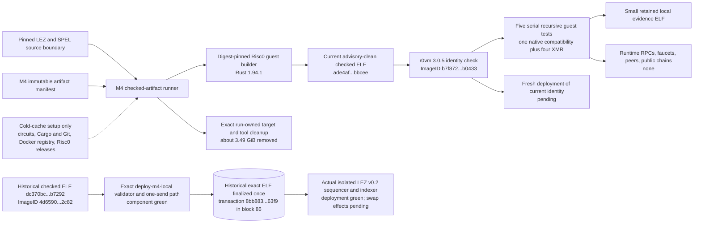

One fresh advisory-remediation execution reproduced ELF SHA-256
`ade4af8426040b7e5c171b559a382a15a3fa72e27531a93fe89742689a1bbcee`
and ImageID
`b7f8727893174a29bd776eacbfdd9773e0510ebdac43102cb7e93ba4fa0b0433`,
then passed all five recursive cases. No sequencer, indexer, Monero daemon,
wallet RPC, faucet, peer, or public endpoint participates after setup. Cold
caches may fetch the pinned circuits archive, Cargo/Git sources, digest-pinned
builder image, and Risc0 tools; network availability and rate limits can make
that setup flaky. The checked-artifact run itself is not a chain effect. A
historical isolated-stack run proves the superseded `dc370bc...b7292` ELF
deployed once; there is no fresh deployment claim for the current
`ade4af...bbcee` ELF. Neither result is a swap or a public deployment.

## M4 integration component and RPC status

Status: actual local successful-claim checkpoint from a working tree; exact committed-tree replay, cleanup attestation, recovery paths, and milestone certification remain open.

The retained run used actual isolated LEZ v0.2 services and official Monero 0.18.5.1 Regtest processes. Solid arrows in both diagrams were exercised in one same-run journey. Dashed arrows belong to the current replay-orchestration source/contract and have not completed a clean replay from the current commit. That runner now reaches actor onboarding, the official Monero child, canonical agreement and separate role journals, and exact one-shot finalized tag 13. The role-sidecar route remains unwired; its exclusive state lease is component-GREEN, while adopted-state launch and typed tag-13-to-tag-14 export are pending. The port numbers are retained evidence examples only; every new run must read fresh dynamic literal-loopback endpoints from its owner-only manifests.

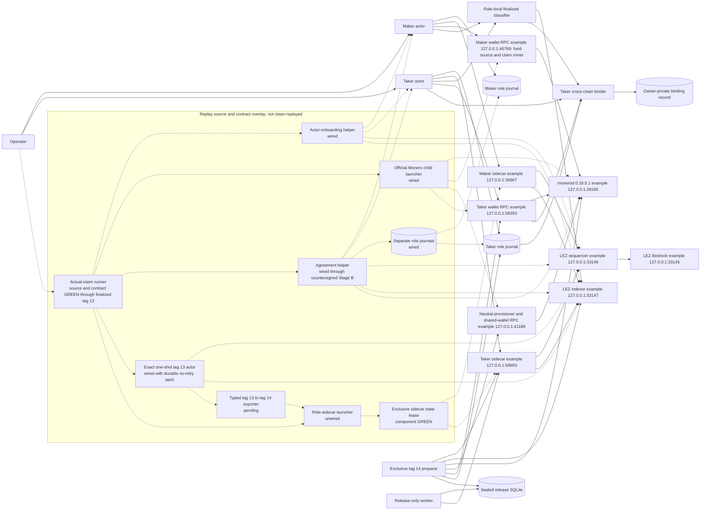

All services above were run-owned local processes. No public RPC, P2P peer, faucet, public funds, Stagenet, or external finality service participated. Loopback was transport isolation, not a replacement for the real daemon, wallet, sequencer, indexer, or sidecar implementation.

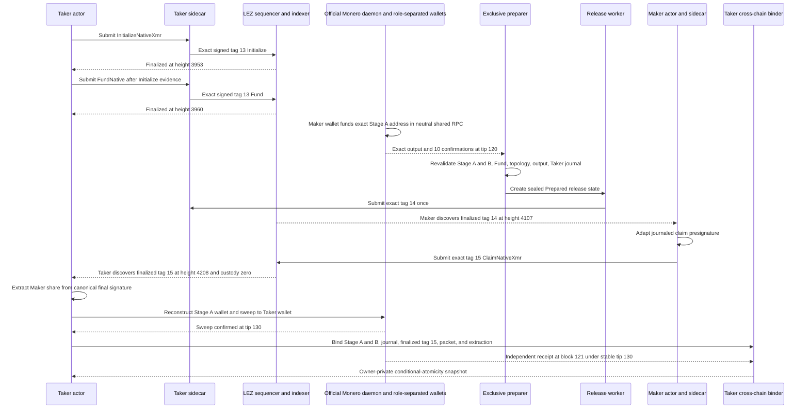

The successful branch is conditionally atomic because the Taker partial was committed before effects but withheld until the exact Monero output was confirmed; tag 14 released only that committed partial; the Maker could claim LEZ only by publishing the final signature that reveals the Maker adaptor share; and the Taker extracted that share only from finalized canonical tag 15 before reconstructing and spending the Monero key. This is not a distributed transaction across chains. Tag 16 and Tag 17 have now each been exercised actual-node as separate terminal LEZ transitions. A joined two-devnet abandonment corridor and adverse losing-branch races remain before those separate proofs establish complete recovery economics.

Two failed preparer states are quarantined. Official Monero may omit `connections` when the list is empty; the compatibility decoder maps omission only to an empty list while `get_info` independently requires zero incoming and zero outgoing peers. The successful fresh `release3` database alone reached Prepared and then Admitted.

The public packet is
[m4-actual-claim-poc-20260721.json](../evidence/m4-actual-claim-poc-20260721.json).
It carries the binder schema and public facts without a private path or scalar.
The final 3203-byte mode-`0600`, one-link packet has SHA-256
`896d05d3178e3ff44b6ca010d4528835f5d796dc7e1004984ed78e853c083306`.
The retained legacy-v1 sweep plus receipt-v2 pair records exact receipt and
remainder but `fee_piconero: null`; the current sweep-v2 validator proves exact
fee conservation in focused tests but was not the retained full CLI invocation.
Its destination is authenticated by the owner-private Taker-wallet boundary,
not committed by Stage A. The binder is a conditional-atomicity snapshot rather
than a distributed transaction or future-reorg guarantee. It is intentionally
bound to a working tree over base commit `40cbac3d` and does not retain
execution-binary hashes. Exact clean-commit replay, completed operator replay,
scoped cleanup, signed-refund and punishment journeys, F7 token parity, U9
public guidance, D1 XMR video evidence, and all post-PoC hardening remain before
an `m4-complete` tag.

`scripts/run-m4-actual-claim-poc.sh` is not yet a one-command happy-claim
journey. Its source/contract path now composes deployment and exact finalized
Maker/Taker onboarding, the run-scoped official Monero child, canonical Stage A
and countersigned Stage B with separate role journals, and exact one-shot
finalized tag 13. Before tag-13 invocation it durably publishes a create-new
no-retry latch. It then intentionally fails before swap-specific Monero funding.
The cleanup contract pre-registers the Monero child, captures exact Docker
resources in reverse-cleanup order, binds each process by PID start time and
executable, and revalidates each resource run label immediately before deletion;
foreign-sentinel survival is required and broad cleanup is forbidden. This is
source/contract evidence only, not a clean actual replay from the current
commit.

`scripts/run-m4-lez-sidecar.sh` remains the only available unwired launcher. It
provides run-scoped dynamic-loopback Maker/Taker startup, exact authenticated
runtime probing, PID identity, owner-private manifests, and exact stop. The
bridge process now holds one exclusive fixed-name state-directory lease from
immediately after argument validation until shutdown, and that source/component
gate is GREEN. Launcher adoption of the tag-13 state directory, typed
tag-13-to-tag-14 evidence export, and actual continuation replay are pending.
`scripts/run-m4-xmr-agreement.sh` is wired in the runner source through
countersigned Stage B; it performs no submission and its `requested_terms`
field remains a CLI-input report, not a helper-level decoded/rebound Stage-A
claim. The runner/PoC estimate is 3 to 7 focused hours, followed by a
25-to-45-minute warm or 1-to-3-hour cold replay. Full functional M4 remains 15
to 27 focused hours.

## M2 SDK/reference-demo target topology

This is the accepted M2 demo boundary. It is independent of the M5 production
daemon/CLI/Delivery/Chat delivery below. ADR 0022 records why the LEZ adapter is
a process boundary rather than another dependency in the reference actor.

The Zcash workspace graph pins `crypto-common = 0.2.0-rc.1`. The official LEZ
v0.1.2 graph reaches `chacha20 0.10` and `cipher 0.5.1`, which require stable
`crypto-common ^0.2`; Cargo cannot resolve those constraints in one graph. The
integration must not weaken or patch either cryptographic pin, and must not copy
official LEZ wire or RPC types into the Zcash workspace. A separately built,
exactly locked LEZ sidecar owns those official types. Its typed local bridge is
a bounded serde-only adapter protocol carrying primitive requests and facts; it
is not the official LEZ JSON-RPC protocol and cannot assert canonicality.
The final ADR-0023 corridor selects a separately locked v0.2 official-wire
sidecar and full local v0.2 Bedrock/indexer/non-standalone-sequencer stack. The
implemented v0.1.2 sidecar/node remain lower compatibility evidence, not the
final portability proof.


Each actor and each actor-owned sidecar has a distinct PID. Actor state, claim
keys, LEZ signing keys, sidecar capabilities, and nonce leases are owner-local;
the maker and taker persist the agreement separately. The reference runner owns
the sidecar listener, selects an ephemeral loopback port and high-entropy
capability, binds every call to its `RUN_ID`, and cleans only its own processes
and resources. The actor never sends official LEZ RPC through the local bridge:
only the separately locked sidecar constructs, signs, decodes, and calls the
official LEZ protocol. The in-process Zebra adapter calls Zebra directly and
delegates agreement/consensus validation to the SDK.

Each role's schema-v3 file fixes the exact signed-agreement SHA-256, complete
sidecar and Zebra runtime identities, finite discovery/candidate bounds, and
isolated state, journal, capability, signer, claim, and optional preimage paths.
Paired validation requires one preimage owner and one Zcash funder, identical
agreement/runtime/Zebra terms, distinct sidecars and signers, and no path
aliases. Offline `status` deliberately loads only claim-recovery material and
the role-store location: it requires no sidecar/Zebra credential and opens no
chain port. It returns `not_activated` without creating a missing database; for
existing state it uses the hardened existing-only SQLite opener and
`resume_all_capable` with unit LEZ and Zcash port types. Its versioned output is
secret-free. `activate` and `drive` now compose the SDK, role bridges, and Zebra
port in the development runner. Run `m2poc-vertical-20260714a` proves that the
provisioner can
query the live retained Zebra, select one stable mature maker UTXO, create the
dual-signed agreement, write separate private role trees, reload both configs
and activation-material sets, and pass pair isolation. The configured sidecar
URLs were not bound or called, and neither actor process executed a lifecycle
effect. Its saved window 1..256 is stale at later tip 389 and is never reused by
the development runner, which prebuilds, provisions at a fresh tip, starts
explicit run-port bridges, mines only after Zcash effects, and enforces a
monotonic 49-second cap against the 60-second LEZ delay. Before provisioning
effects it acquires a nonblocking advisory `flock` keyed by the exact LEZ
sequencer/indexer and Zebra endpoint tuple. A different tuple can proceed; a
runner using the same tuple fails closed without touching the node processes or
unrelated Docker resources.

Historical runs 14d through 14n retain partial and failure evidence. Historical
pre-canonical run 14o completed `TakerSellsLez` in 25.370 seconds: the taker deposited LEZ, the
maker funded Zcash and claimed LEZ after two confirmations, and the taker spent
the revealed Zcash path. Both actors reached revision 4 `Completed`; one
bounded `moving_tip` retry succeeded. LEZ effects finalized in blocks
264/265/266, and the Zcash height-108 claim spent the height-106 funding output.
Historical pre-canonical reverse run 14c completed `TakerSellsForeign` in 26.960 seconds without a
drive retry: the taker funded Zcash, the maker deposited LEZ, the taker claimed
LEZ, and the maker spent Zcash. LEZ effects finalized in blocks 641/642/643,
and the Zcash height-115 claim spent the height-113 funding output. Both actor
processes and role stores again reached revision 4 `Completed`. Those successful
runs used host-built ProgramId `f8385049...0fbe` and remain immutable
historical evidence rather than current deployment authority.

The canonical Docker artifact has ELF `c85055f6...9d2e` and ProgramId
`5cf8c5a4...29c1`. It was deployed in transaction `bd16808e...733f`, proved
Finalized in block 2582, and then exercised by
`m2cert-canonical-forward-bb53daf-20260714a` and
`m2cert-canonical-reverse-bb53daf-20260714a`. Both actor pairs reached revision
4 `Completed`; the forward run took 25.580 seconds with two bounded retries and
the reverse took 28.790 seconds without a retry. The common live
guard requires confirmed Zcash funding before the LEZ revealing claim and the
LEZ reveal before the Zcash follow-up spend. Both required happy directions
have separate indexer-finality and Zebra transaction evidence. The dormant
public-route configuration contract is GREEN without public I/O. Restart,
refund, reorg, live-public behavior, chaos, and production hardening remain open.

The local mailbox is explicitly a test adapter, not Logos Delivery or Chat.
Once terms persist and the first lock is submitted, it is destroyed; both actors
must complete or refund using only their own state and selected chain nodes.

## M5 production application target topology

```mermaid
flowchart LR
    Maker["Maker operator"]
    Taker["Taker user"]

    subgraph MakerBoundary["Maker-owned boundary"]
        MakerCLI["Maker CLI"]
        Core["Optional Logos Core lifecycle adapter"]
        MakerDaemon["Maker daemon plus ZEC watcher"]
        MakerStore[("SQLite aggregate, journal, binding, alert outbox")]
        DeliveryKey[("Mode 0600 Delivery signing key")]
        NegotiationTxn["Schema-v19 BTC and ZEC negotiation handoff<br/>atomic accept + exact expiry retry"]
        MakerZebra["Schema-v3 maker Zebra route"]
        MakerBtcAuthority[("Mode 0600 BTC Maker signing key and schema 6 authority")]
        MakerBtcActor["Role-only BTC Maker actor"]
        MakerLezBridge["Loopback capability LEZ adapter"]
        MakerLezSidecar["Official-wire LEZ sidecar"]
        MakerLez["Typed outbound LEZ profile"]
    end

    subgraph TakerBoundary["Taker-owned boundary"]
        TakerCLI["lez-taker CLI<br/>persisted replay and receipt lifecycle GREEN"]
        TakerState[("Private agreement plus role-only actor")]
        TakerReceipt[("Mode 0600 acceptance receipt")]
        TakerZebra["Schema-v3 taker Zebra route"]
        TakerLezBridge["Loopback capability LEZ adapter"]
        TakerBtcAuthority[("Mode 0600 BTC Taker schema 6 authority")]
        TakerBtcActor["Role-only BTC Taker actor"]
        TakerLezSidecar["Official-wire LEZ sidecar"]
        TakerLez["Typed outbound LEZ profile"]
    end

    Delivery["Run-local signed offer discovery<br/>stale projection degrades health"]
    Chat["Signed negotiation channel"]
    RouteGate["Validate signed agreement, runtime,<br/>route, identity, and credentials"]

    subgraph RouteTargets["Typed route targets"]
        LocalLez["Local loopback sequencer + indexer"]
        PublicLez["Exact official LEZ HTTPS"]
        PublicLezRisk["Finalized-tip method unknown"]
        LocalZebra["Deterministic Zebra Regtest"]
        SelfHostedZebra["Self-hosted loopback Zebra + cookie"]
        TatumZebra["Exact Tatum HTTPS + x-api-key"]
        LocalCore["Isolated Bitcoin Core 31.1 Regtest RPC"]
    end

    Maker --> MakerCLI
    MakerCLI -.->|"Owner-local authenticated control RPC"| MakerDaemon
    Core -.->|"start, endpoint, health, stop"| MakerDaemon
    MakerDaemon --> MakerStore
    DeliveryKey --> MakerDaemon
    Chat --> NegotiationTxn
    NegotiationTxn --> MakerStore
    MakerStore -->|"exact committed replay preflight"| NegotiationTxn
    MakerDaemon -->|"Typed Zebra JSON-RPC"| MakerZebra
    MakerDaemon -->|"Bounded local adapter protocol"| MakerLezBridge
    MakerLezBridge -->|"Loopback + run/role capability"| MakerLezSidecar
    MakerBtcAuthority --> MakerDaemon
    NegotiationTxn -->|"no-clobber provision"| MakerBtcActor
    MakerBtcActor -.->|"actual-node lifecycle pending"| LocalCore
    MakerLezSidecar --> MakerLez
    Taker --> TakerCLI
    TakerCLI -->|"persist agreement and actor before completion"| TakerState
    NegotiationTxn -->|"durable completion"| TakerCLI
    TakerState -->|"config and agreement digests"| TakerReceipt
    TakerReceipt -->|"select exact Taker actor"| TakerCLI
    TakerCLI -->|"Typed Zebra JSON-RPC"| TakerZebra
    TakerCLI -->|"Bounded local adapter protocol"| TakerLezBridge
    TakerBtcAuthority --> TakerCLI
    TakerCLI -->|"persist before completion"| TakerBtcActor
    TakerBtcActor -.->|"actual-node lifecycle pending"| LocalCore
    TakerLezBridge -->|"Loopback + run/role capability"| TakerLezSidecar
    TakerLezSidecar --> TakerLez
    MakerDaemon -->|"Authenticated expiring offers only"| Delivery
    TakerCLI -->|"Key-pinned offer queries only"| Delivery
    MakerDaemon -.->|"Both-role signed terms before first lock"| Chat
    TakerCLI -.->|"Both-role signed terms before first lock"| Chat
    Chat --> RouteGate
    RouteGate --> MakerDaemon
    RouteGate --> TakerCLI
    MakerLez -->|"local"| LocalLez
    TakerLez -->|"local"| LocalLez
    MakerLez -.->|"official_public"| PublicLez
    TakerLez -.->|"official_public"| PublicLez
    PublicLez -.-> PublicLezRisk
    MakerZebra -->|"deterministic_local"| LocalZebra
    TakerZebra -->|"deterministic_local"| LocalZebra
    MakerZebra -.->|"self_hosted_cookie"| SelfHostedZebra
    TakerZebra -.->|"self_hosted_cookie"| SelfHostedZebra
    MakerZebra -.->|"tatum_testnet_x_api_key"| TatumZebra
    TakerZebra -.->|"tatum_testnet_x_api_key"| TatumZebra

    classDef planned stroke-dasharray: 5 5,fill:#fff7e6,stroke:#9a6700;
    classDef implemented fill:#ddf4ff,stroke:#0969da;
    class MakerCLI,Core,MakerDaemon,PublicLezRisk planned;
    class TakerCLI,TakerState,TakerReceipt,Chat,Delivery,DeliveryKey,NegotiationTxn,MakerBtcAuthority,MakerBtcActor,TakerBtcAuthority,TakerBtcActor,MakerZebra,MakerLezBridge,MakerLezSidecar,MakerLez,TakerZebra,TakerLezBridge,TakerLezSidecar,TakerLez,RouteGate,LocalLez,PublicLez,LocalCore,LocalZebra,SelfHostedZebra,TatumZebra implemented;
```

Delivery and Chat are negotiation transports, never sources of chain truth or
secrets. After the first lock, each actor must recover using only its own durable
state and selected chain nodes. Logos Core is optional lifecycle/presentation;
it never opens SQLite or becomes protocol authority. Blue route targets denote
implemented configuration and bounded-client construction, not successful live
connections. Only the local targets have execution evidence. The dashed public
edges still require endpoint/authentication smoke, funding/deployment, identity
revalidation, propagation, and finality evidence before release.

### M5 XMR role-process pre-effect deployment

Status: process-GREEN through the receipt-v2 Taker Tag14 sender,
local finalized-observer, durable reconciliation, and process-free Complete
replay. ADR 0152 additionally seals the validated Stage A/B, own/peer packets,
private-role manifest, and private view key on FDs 211 through 216 before the
one-attempt CAS. ADR 0153 adds a canonical role/mode/step/identity/ABI/journal/
evidence/RPC plan on sealed FD 217. The focused effect-route suite passes 5 of
5 at the ADR 0153 checkpoint. ADR 0154 adds least-privilege FD 218 custody, a
prepare-only pre-CAS Tag16 child, and the real Tag16 sender; the current
Tag16 checkpoint passed 7 of 7 routes and 6 of 6 process cases. ADR 0157 adds
semantic Tag14 preflight and least-privilege release custody; the current route
suite passes 8 of 8 and the real release process proof passes 1 of 1.
Strict Clippy plus warning-fatal Rustdoc are
rerun for each pushed slice. Solid edges below are fixed-local component
evidence. Tag16 construction and authenticated sidecar calls are semantic;
literal CLI Tag14 and Tag16 preflight/send/restart composition is process-GREEN.
Joined actual-node submission/finality through this boundary, semantic
observation, and Monero sweeps remain dashed and open.

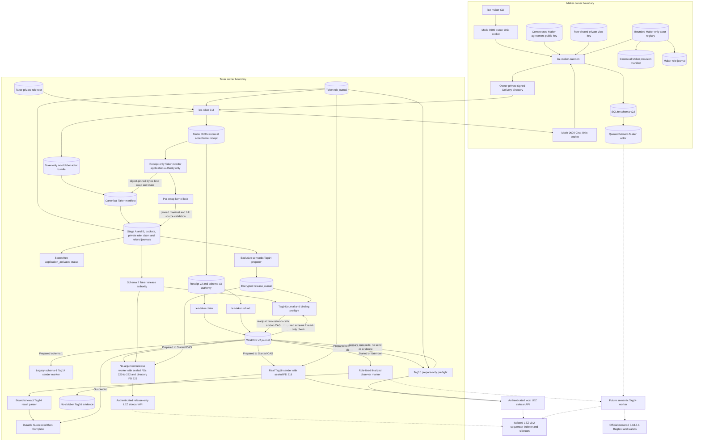

| Component or method | Exact endpoint or authority | Pre-effect behavior |
|---|---|---|
| Maker control | `--socket` and `lez-maker publish-offer` | Owner-only 64 KiB RPC publishes the already committed signed offer; no Chat method is registered |
| Taker Chat | `--chat-socket` | Separate 1 MiB RPC exposes only pair Chat methods; XMR uses `xmr_chat_stage_a_v1` then `xmr_chat_activate_v1` |
| XMR Maker identity | `--xmr-maker-agreement-public-key-file` | Owner-only raw 33-byte compressed key; Stage A must name this Maker identity |
| XMR view authority | `--xmr-private-view-key-file` | Owner-only raw 32-byte Monero private view key; validates Stage B server-side and is never returned or debug-printed |
| XMR actor registry | `--xmr-actor-manifest-registry-file` | Bounded schema-1 JSON. Every entry pins lowercase swap ID, config path/SHA-256, installed owner-owned single-link program path/SHA-256, and state database path |
| Maker role manifest | `actor-provision.json` from `xmr-reference-actor provision-application maker` | Daemon requires canonical schema 1, Maker role, exact swap, exact role-journal state path, normalized authority paths, and lowercase digests before readiness |
| Taker acceptance | `lez-taker --accept-xmr-offer` plus Stage A/B, role root, public packets, role journal, actor root, and receipt flags | Taker authenticates Delivery only on first acceptance, provisions only Taker authority, activates over Chat, and publishes its receipt after Maker commit |
| Taker receipt-only monitor | `lez-taker monitor --receipt` with the private canonical XMR receipt | Digest-pinned canonical Taker-manifest bytes bind the swap and state before the per-swap lock; full Stage A/B, packet, private-role, and claim/refund-journal semantics are reread under the lock; returns only secret-free `application_activated` and never contacts Delivery, Chat, a daemon, a node, or an RPC |
| Receipt-v2 Taker Tag14 process | `lez-taker claim --receipt` under separate actor/workflow locks | Schema 1 retains the FD-197..217 marker. Schema 2 runs the release worker preflight at Prepared, repins, commits Prepared-to-Started, and invokes once with only FDs 220..223. Restart is observe-only and Complete starts no process. Literal CLI composition is GREEN; its observer remains a fixed process double rather than finalized-chain proof |
| Sealed Tag14 release service | no-argument `lez-v0-2-xmr-release-service` with FDs 220..223 | Reuses the encrypted release journal prepared from finalized Fund, confirmed Monero output, and authenticated topology. Schema-v2 preflight authenticates config, secrets, journal, and exact binding without indexer/sidecar use or CAS. Invoke retains post-CAS finalized-clock suppression and at-most-once publication. FD 223 prevents pathname replacement from redirecting the journal. Real worker preflight/admit/restart proof is GREEN |
| Versioned Tag14 release authority | schema-2 Taker effect authority with `lez_xmr_tag14_release_v2` | Canonically binds distinct release-only sidecar/capability/key/journal identities and local or exact-pinned finalized-indexer policy. The parent rederives runtime-bound terms from validated Stage A/B; general RPC credentials and private application material never enter the child. Schema 1 remains marker-only. Joined actual-node replay and semantic finalized observation remain open |
| Sealed Taker Tag16 child | no-argument `xmr-reference-tag16` selected for `lez_xmr_tag16_refund_v1` | While the workflow is Prepared, a sealed preflight plan receives the same exact application/journal authority and calls authenticated prepare only; rejection leaves the CAS untouched and produces no evidence. Success causes the parent to repin, CAS to Started, and run invoke mode, which prepares, completes and submits exactly once. Started/Unknown/Succeeded skip preflight and cannot rearm. Component proof uses an in-process loopback sidecar, so the configured sidecar-to-LEZ-node edge, finality, later Maker extraction and Monero recovery are not claimed here |
| Durable replay | Same database, registry, actor root, receipt, reservation, and command after Delivery removal | Durable actor bypasses discovery; exact Stage A/B replay returns revision 3 without replacing role artifacts |
| Public effects | Maker application database and immutable role journals | The application database has no public-effect table; any participating effect journal must be absent or contain zero rows, and both input role journals remain byte-identical |

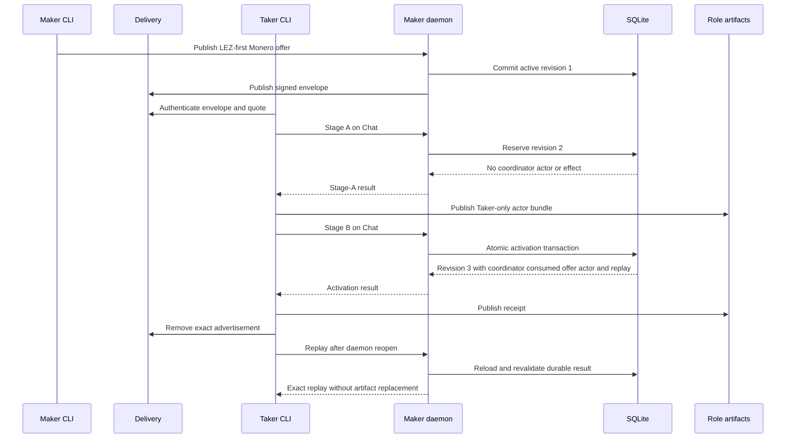

Stage A is non-executable by construction. Stage B is locally atomic because one immediate SQLite transaction activates the negotiation, derives and persists the coordinator, consumes the exact offer, registers one immutable Maker actor, and records global replay. Any failed write restores the revision-2 reservation. The Taker actor bundle is written before activation as a crash latch; its receipt appears only after the Maker commit. This does not create a distributed cross-chain transaction.

The receipt-only monitor performs no writes, preserves every receipt, manifest,
role artifact, journal, and state byte, and returns no chain-progress inference.
Legacy receipt-v1 claim/refund remain unsupported. Receipt-v2 claim now runs the Tag14 sender exactly once; the losing refund branch fails closed. Its second call observes a fixed local finalized marker and reconciles evidence-shaped Succeeded, while its third call starts no process. This proves the process contract only, not a semantic transaction or actual-chain effect. The inherited
reopen/final-equality path-ABA concern remains production hardening rather than a
PoC blocker; full semantic validation still occurs under the exact per-swap
kernel lock and grants no effect authority.

Runtime external resources are empty: no chain RPC, local node, Docker project,
faucet, DNS, network, or funds. The process proof uses only temporary Unix
sockets, SQLite, sealed memfds, and owner-private files. This isolates custody
ABI behavior from chain/finality flakiness. It does not validate Monero or LEZ
behavior. The receipt-v2 route still runs only its node-free marker worker.
Keep semantic effect actions disabled until typed live-journal and
branch-artifact authorities are present and the route composes the exact
isolated dynamic-loopback Monero and LEZ adapters.

#### Schema-v3 XMR invocation component

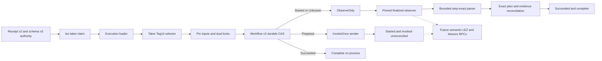

| Boundary | Implemented behavior | Still absent |
|---|---|---|
| Schema-v3 loader | Retains exact effect-authority digest and workflow identity | No node or RPC opening |
| Role-fixed selector | Admits only three Maker and three Taker sending slots | No classifier/verifier send authority |
| Pre-authorization custody | Pins tool, runtime, ten secrets, six immutable validated application artifacts, canonical child plan, both locks, and one FD map before workflow CAS | Live journal is address-bound but semantic transitions and branch-artifact custody remain; no semantic transaction construction |
| Workflow result | First call consumes InvokeOnce and leaves Started; second runs only the role-fixed observer and reconciles exact local evidence as Succeeded; third returns Complete without a process | No semantic transaction, actual-chain classifier, or chain publication |

The real receipt-v2 Taker route proves corrupt-program and wrong-role failure
leave Prepared unconsumed, then invokes and reaps one exact sender marker. The
second call starts no sender: only Started or Unknown may run the hash-pinned
role-fixed observer, whose bounded parser requires the exact Tag14 result and
whose source is derived locally. Exact plan and finalized marker evidence
reconcile Succeeded. Prepared and Succeeded reject observer preparation; every
observer failure leaves the journal unchanged. The third call is Complete with
no process. Sending ambiguity remains sticky Unknown. Neither fixed marker
contacts the dashed node boundary, publishes semantic tag 14, or proves actual
chain finality.

### M5 maker service supervision and RPC inventory

ADR 0097 adds a production-shaped standalone supervisor without changing the
application or chain boundaries. The same binary and state are used in the
interactive PoC, systemd package, and future Logos Core lifecycle seam.

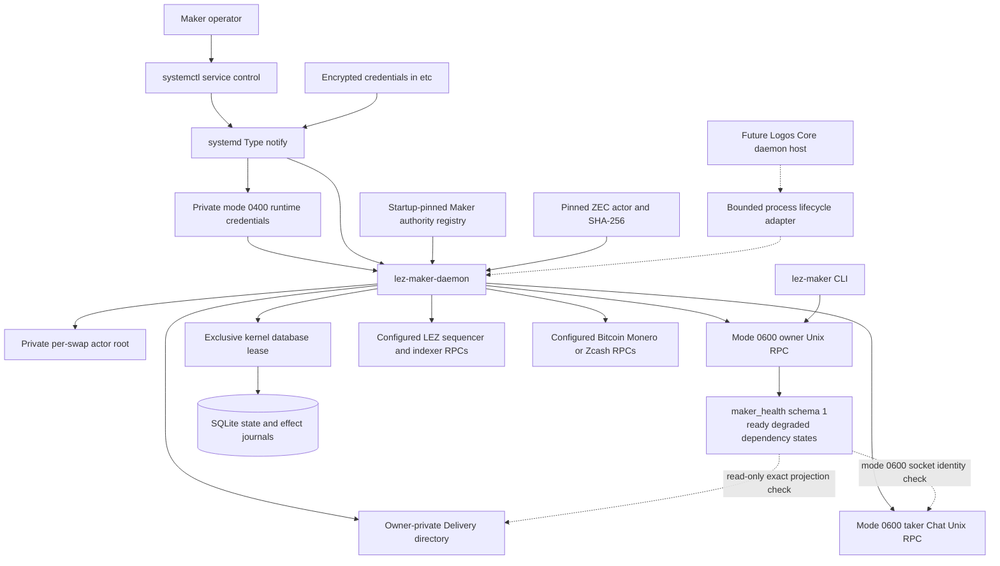

| Component | Endpoint or path | Authority and failure behavior |
|---|---|---|
| systemd service | `lez-maker-daemon.service` | Dedicated `lez-swap` user; owns `/run/lez-atomic-swaps` and `/var/lib/lez-atomic-swaps`; reports active only after daemon notification; restarts after failure with a bounded storm policy |
| Encrypted credentials | `/etc/lez-atomic-swaps/credentials/*.cred` to systemd `%d` | systemd decrypts named Delivery, claim-recovery, and preimage values into private mode-0400 runtime files; the unit never places secret bytes in arguments or environment variables |
| ZEC Maker authority registry | `/var/lib/lez-atomic-swaps/authority/zec-maker.json` plus repeatable daemon inputs | One to 256 startup-pinned Maker configs; duplicate swap/state identities and incomplete Chat deployment fail before readiness; an accepted agreement selects only its exact application swap |
| ZEC actor deployment | `/usr/bin/zec-reference-actor`, exact SHA-256 environment, and `/var/lib/lez-atomic-swaps/actors` | Installer carries the real actor and digest template; daemon verifies program metadata/hash and private root before sockets or SQLite; the fenced supervisor executes sealed status and selected claim/recover commands |
| Maker owner RPC | `/run/lez-atomic-swaps/maker.sock` | Owner-only bounded HTTP/1 JSON-RPC over Unix transport. `maker_health` reports readiness/dependencies; `maker_actor_monitor_v1` returns an allowlisted application-SQLite view; `maker_actor_claim_v1` and `maker_actor_refund_v1` durably admit explicit generation-fenced actions. The operator CLI runs as the service user |
| Taker Chat RPC | `/run/lez-atomic-swaps/chat.sock` | Separate owner-only Unix listener with the isolated negotiation method set; no owner-control method crossover |
| Maker database | `/var/lib/lez-atomic-swaps/maker.sqlite3` | SQLite transactions and effect journals remain protocol authority; a sibling owner-only `.lock` admits one process writer for its whole lifetime |
| Delivery adapter | `/var/lib/lez-atomic-swaps/delivery` | Signed pre-lock discovery and winning-request retry projection; durable commit precedes visible projection failure; exact request replay repairs without duplication; it is not chain truth and may disappear after the first lock |
| LEZ and foreign nodes | Pair configuration selects explicit HTTP RPC origins | AF_INET and AF_INET6 remain available under systemd for typed bounded chain adapters. The service unit embeds no endpoint, faucet, fund, or public-network assumption |
| Future Core adapter | `start`, `endpoint`, `health`, `stop` process contract | Validates absolute paths, owns one exact child, has bounded readiness/health/shutdown, and never reads keys or SQLite. The live upstream Core API remains LOGOS-019 |

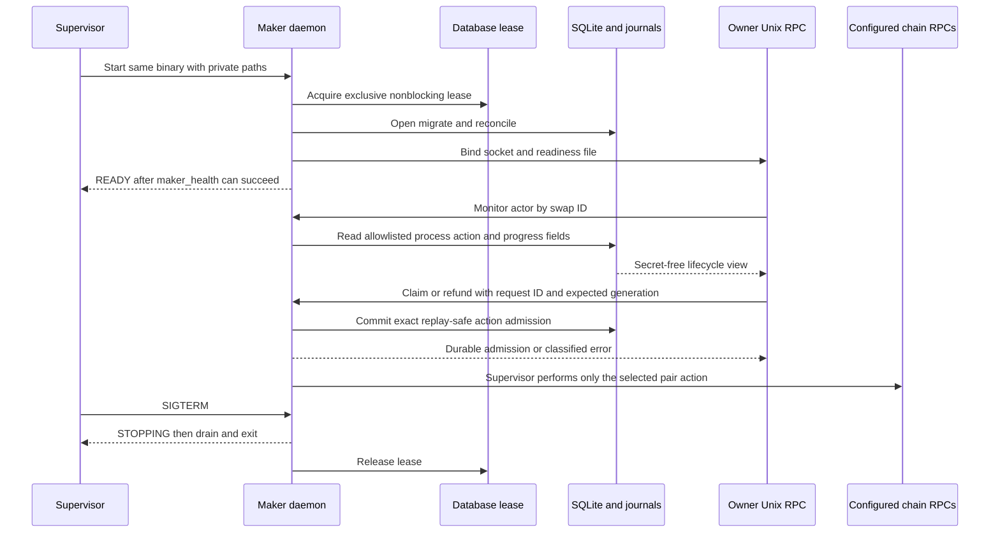

Supervisor readiness and the database lease preserve lifecycle safety but do
not create a cross-chain transaction. Swap atomicity remains in the signed
agreement, chain contracts, durable transitions, effect journals, and recovery
paths described by each pair ADR.

### M5 progressive local ZEC composition

The opt-in runner narrows the first application PoC to one already stable
`TakerSellsLez` corridor. Exact pushed-tree run `m5appee8424520260724a`
completed the schema-v14 terminal import and fresh owner-daemon history/status
through isolated local nodes. Replay `m5app6c3bbbe20260724a` repeated the whole
flow from exact packet-bearing pushed commit `6c3bbbe` and closed this
progressive local-functional gate.

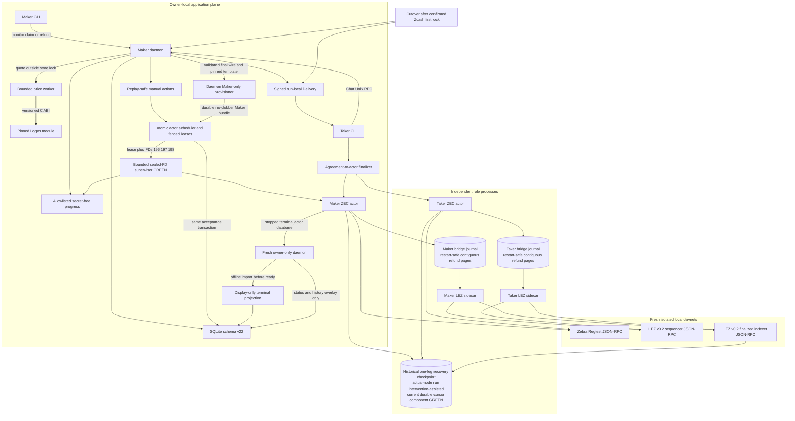

The runner accepts only explicit nonzero literal-loopback HTTP endpoints and
locks their exact tuple. The application control and Chat endpoints are
separate mode-0600 Unix sockets. After the first lock is confirmed, the runner
stops the exact PID/start-time/executable tuple and moves only that run's
Delivery path offline. Later LEZ reveal and Zcash follow-up operations use only
fresh role state, capability-authenticated sidecars, and the chain RPCs. After
both actors are terminal, a fresh daemon imports only the stopped Maker actor's
fully replayed terminal coordinator and exposes only the owner socket. ADR 0102
adds the separate intervention-assisted actual-node abandonment image: the refund
owner submitted one
LEZ transaction after expiry, the counterparty discovered it from the finalized
window prefix, and both role actors reached `Refunded` revision 2 with zero
custody. The original window aged out and that historical run required unsupported
actor-window and bridge-journal intervention. Current role-local journals now
automatically advance only fully covered contiguous pages and restore the active
page after restart with unchanged actor config. The historical checkpoint still uses the role binaries directly. The supervisor
and Maker lifecycle controls are component-GREEN, but a fresh application-driven
actual-node recovery without intervention remains required.

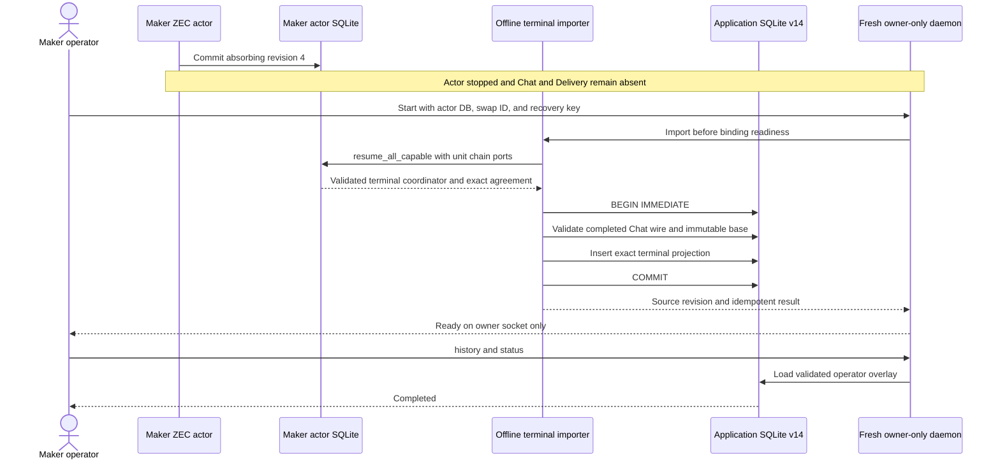

The actor's terminal journal is committed before import and is immutable. The
projection insert is one target-database transaction, but no transaction spans
the two SQLite files. A crash before target commit leaves the prior operator
view and retries safely; a crash after commit exact-replays. The projection is
never returned by lifecycle `load` or `list_swaps`, so it cannot authorize an
effect. Offline replay uses unit LEZ/Zcash ports and therefore cannot issue a
chain RPC. This preserves protocol atomicity while treating operator history as
a recoverable read model rather than a second coordinator.

## RPC and local-resource inventory

| Component | Status | Transport and bind | Authentication / authority | Methods exercised or required | Lifecycle and isolation |
|---|---|---|---|---|---|
| M4 actual local native claim checkpoint | Successful LEZ-first claim branch GREEN on a working tree; clean committed replay pending | Actual isolated LEZ v0.2 Bedrock, sequencer, indexer, Maker/Taker sidecars, official monerod 0.18.5.1, and three wallet RPCs; every endpoint was dynamic literal loopback | Independent owner-private role roots and journals, sidecar capabilities, Digest-authenticated Monero RPC files, exclusive release preparation, and a separate release-only worker | Finalized tag-13 Initialize/Fund at 3953/3960; exact 1 XMR lock at height 111 and tip 120; finalized tag 14 at 4107; finalized tag 15 at 4208 with custody zero; reconstructed-key sweep confirmed at tip 130 | No public RPC, peer, faucet, public funds, Stagenet, or external finality. Public packet omits secrets and execution-binary hashes. Cleanup, clean-commit replay, tag-16/tag-17 recovery, F7, U9, D1 XMR, and hardening remain; no M4 tag is authorized |
| M4 checked LEZ guest artifact | Local build/identity and recursive branch execution GREEN twice | Digest-pinned Docker guest builder during cold/fresh build; checked execution opens no socket or RPC | Manifest pins source files, historical M2/M3 boundaries, Risc0 3.0.5/Rust 1.94.1, builder digest, ELF SHA-256 `dc370bc...b7292`, and ImageID `4d6590...2c82` | Fresh methods embedding; exact ELF/ImageID verification; one native aggregate-witness compatibility test plus four XMR initialize/fund/claim, signed-refund, punishment, negative, and rollback tests | Both fresh runs passed 5 of 5. Runtime resources are `[]`; cold setup may use GitHub, Cargo/Git, Docker, and Risc0 endpoints. Default exact cleanup retained the small evidence ELF and removed about 3.49 GiB. The artifact run itself is not a chain effect; the same exact checked ELF now has separate actual-local deployment evidence. No actor lifecycle, swap, or public deployment is claimed |
| M4 exact local guest deployer and deployment | Component and actual-local GREEN; 4 focused tests plus one fresh exact deployment pass | Caller supplies only a literal-loopback HTTP sequencer RPC, nonzero 32-byte channel ID, and bounded timeout; no public endpoint or artifact override is accepted | Current M4 manifest status/public flag/tags 13..17, generated append-only IDL, embedded ELF SHA `dc370bc...b7292`, decoded ImageID/ProgramId `4d6590...2c82`, and exact runtime channel/genesis/built-ins validate before RPC | Official health, genesis, program map, and tip preflight; exactly one `ProgramDeployment`; exact returned ID; bounded canonical inclusion scan | Nineteen manifest/runtime mutations and three non-loopback endpoint classes make zero RPC calls. Historical deploy commands remain intact. Transaction `8bb883f1...63f9` finalized in block 86, hash `b49b347a...61fb`. A full finalized genesis-through-86 scan proves zero prior and one total exact-ELF occurrence, decoded ELF/ImageID equality, sequencer/indexer inclusion equality, and stable ID/hash/ID rereads. Runtime external resources are `[]`. The code has one send per invocation and no automatic retry; no sequencer-side global attempt count, swap effect, or public deployment is claimed |
| M4 actor Vault onboarding | 2 of 2 independent deterministic-genesis identities finalized once | Actual `lez-v02-vault-claim-poc` processes used the isolated stack sequencer on dynamic literal loopback; no public RPC, faucet, peer, public funds, or external finality service | Separate owner-private signer files and mode-`0700` actor roots; no keys, reservations, or raw runtime state are committed. The initial group-writable-ancestor attempt failed before reservation/submission and the security check stayed enforced | Taker and Maker Vault Claims finalized once in blocks 228 and 240. Their allocated owner balances remained 200000 and 100000 with nonce one; both Vault balances remained zero | Closes funded identity and nonce prerequisites only. It is not tag-13 execution, a lifecycle actor, a Monero lock, an M4 swap, or swap-atomicity proof |
| M4 ordinary strict v3 bridge client | The ordinary `BridgeClient` retains all eight actor/observer methods; its prior 51-target evidence remains, and the package passes 53 targets including the separate release surface | Capability-bearing literal-loopback HTTP, exact run and role headers, one attempt, finite timeout, bounded response body, no redirect/proxy/retry | Dedicated Maker/Taker runtime, signer, ProgramId, terms, request context, and role matrix are checked before transport. Invalid local bindings make zero calls | Prepare/complete claim and refund; prepare punishment, escrow, and claim authorization; classify finalized effect. Exact context/terms/effect/target/window echoes and coverage are required | No dedicated tag-14 submit method is exposed here. Client-only tests do not claim actor completion or node publication |
| M4 release-intended type-narrowed client and dedicated tag-14 sidecar route | `XmrReleaseClient` exposes only the ninth strict method; protocol 53 tests, client package 53 targets, and the focused authenticated sidecar routes pass | Taker-only capability-bearing literal-loopback RPC to the real sidecar route; official `getTransaction` and `sendTransaction` types terminate at official-type loopback fixtures | Exact run/runtime/terms/prepared ID and bytes; every Linux call reloads the durable tag-14 reservation; sidecar journal stores unknown before node I/O; returned ID must equal the canonical transaction hash | Generic submit rejects tag 14 with zero sends; Accepted sends once; exact AlreadyKnown performs one lookup and zero sends; wrong official ID becomes Unknown and replay stays one lookup/one send; missing durable state fails before node I/O | Type narrowing is not bearer isolation. A checked worker consumes the bearer and restarts against mocks; different-UID/network isolation, actual server/planner restart, sequencer, authorization finality, and cross-journal reconciliation are pending. Lookup transport failure is Unavailable; admission is not finality; no transaction spans the journals |
| M4 typed Stage-B authorization and pre-Fund gate | Two private-field non-`Clone` adapter capabilities are component-GREEN; 98 non-doc tests plus 3 doctests and strict gates pass | Authenticated literal-loopback bridge calls after Taker-only preflight; synthetic finalized response for Initialize; no node, public RPC, or external resource | Only `LezBridgeAdapter<BridgeClient>` can mint either capability. Stage-B authorization binds the committed partial; the journal handoff opens only the exact completed Taker claim session and rebinds its transcript/partial without a plaintext side store; ADR 0070 binds exact finalized Initialize facts and consumes them before Fund. Drift fails before transport | Load exact Taker partial; prepare tag-14 authorization; classify exact Initialize; submit exact Fund under its transaction-ID-derived request key | Invalid journals make zero RPC calls. Official sidecar builders/classifier independently validate durable ABI and ownership. This row does not claim actual-local finality, node effect, or claim PoC |
| M4 official Stage-B builder, native-XMR escrow, tag-15 completion, and four-effect classifier | Four of seven builders, exact tag-13 through tag-15 classification, genesis-bound clock, exact tag-15 admission, and role-local actor ingestion are component-GREEN | Capability-authenticated literal-loopback v3 routes; classifier uses synthetic `FinalizedIndexerApi` only after durable ownership; clock uses official finalized ID plus block-by-ID/hash and exact runtime genesis; preparation/completion/classification make zero sends; an official-message tag-15 fixture makes one authenticated send | Taker runtime binds exact terms/deployment/accounts/signers, tags 13/14, canonical bytes/IDs, commitment, nonces, and durable replay. Maker tag 15 binds aggregate authority/nonce, generated ABI/accounts, immutable message hash, valid aggregate BIP340 signature, separate durable prepare/complete records, and exact completed-record admission | Persist exact Initialize/Fund, tag 14, unsigned tag 15, and completed canonical tag 15 before exposure; exact-classify owner or role-local discovery results with canonical stability re-pins; admit only an exact owned tag-15 submission and reject tag 14 on the generic route | Missing remains `Uncertain`; wrong/moving/unavailable/cross-role facts fail closed. Three recovery builders remain unavailable. The run-level checkpoint above exercised actual tag 14, tag 15, finality, role ingestion, and the reconstructed-wallet sweep; the three recovery builders remain unavailable and exact committed replay is pending |
| M4 pure Stage-A future-message planner | 3 of 3 focused tests GREEN | Pure function only: no endpoint, RPC, reservation, journal, persistence, signer, or submission authority | One caller-supplied stable finalized snapshot binds Maker/Taker owner and claim/refund aggregate-authority nonces. Aliased identities, invalid keys, nonce overflow, or colliding hashes fail closed | Constructs exact generated official tag-15 claim, tag-16 signed-refund, and tag-17 punishment messages plus distinct NSSA hashes. Existing tag-15 prepare/complete accepts the planned claim message/hash byte-identically | Closes placeholder future-message planning only. Callers must obtain and bind the stable finalized snapshot; tag-16/tag-17 builders, signatures, persistence, submission, finality, actors, and swap effects remain unavailable |
| M4 bridge state-directory exclusive lease | Source/component GREEN; 2 library tests plus 1 binary lifecycle test | Local filesystem only; no RPC, socket, Docker, chain, faucet, peer, or public service | Fixed `bridge-state-lease.v1.lock` is opened relative to the already held state directory; exact mode `0600`, current UID, one link, empty content, inode re-open equality, and nonblocking exclusive `flock` are required | `lez-v02-bridge-poc` acquires immediately after argument validation and before config, node, store, or server work, then holds the lease until server stop | Prevents two bridge processes from owning one journal/state root. The parent launcher still cannot adopt the tag-13 state directory, remains unwired, and has no typed tag-13-to-tag-14 exporter or actual continuation replay |
| M4 actual-local Stage-A composer and independent role actor | Component and pre-effect actual-local GREEN; 17 adapter tests, 10 composer tests, 4 provisioning tests, 2 black-box process tests, and 1 two-devnet replay | Composer owns read-only literal-loopback clients: Digest-authenticated official monerod 0.18.5.1 plus official LEZ v0.2 sequencer/indexer. Role processes have no socket or RPC and each receive one private root. No public RPC, peer, faucet, public fund, or external finality service is used | Composer binds observed Monero/LEZ identities, exact escrow/account state, cross-checked finalized anchor, stable nonces, future messages, roles, and canonical SDK wire. Each role revalidates every private/public binding before signing; each complete session directory is one no-replace rename | `lez-v02-xmr-stage-a-compose`; independent `sign-stage-a`; public `assemble-stage-a`; independent atomic `initialize-sessions` | Same-host evidence is not different-UID isolation. Composer does not prove the checked ProgramID deployment and has no submit authority; tag-13 independently re-proves deployment before effects. Parent-path same-UID unpublished-orphan and ordinary in-memory credential-copy residuals remain. Stage B journals and actual tag 13 are GREEN. Later effects and production custody are pending |
| M4 canonical tag-13 executor | Component and actual-local GREEN; focused tag-13 matrix 3 of 3 plus finalized blocks 3008 and 3023 | Reuses authenticated generic submit and durable request journal; canonical transaction-ID request key; official-type loopback lookup/send; Fund first looks up exact Initialize | Owner-only pair, run, role, runtime, ABI, signature, accounts, nonces, bytes, IDs, and request identity revalidate before I/O. ADR 0070 adds an independent typed finalized barrier before the actor may call Fund | Ordered Initialize then Fund reaches lookup/send 3/2; replay unchanged; premature Fund 1/0; arbitrary ID or missing reservation zero-send | The retained actual run used only local LEZ and deterministic genesis funds. Its signed continuation expired, so a fresh wider-window v2-evidence run is required; no public RPC, faucet, peer, public funds, or external finality participated |
| M4 cross-chain claim-to-sweep binder | Actor implementation and retained actual-run invocation GREEN; exact committed replay pending | No RPC of its own. It consumes bounded canonical owner-private Stage A/B, Taker journal/signature/extraction, finalized-classifier JSON, sweep evidence, and independent receipt evidence | Revalidates exact Taker role material and session, LEZ Claim facts and aggregate signature, transcript extraction, reconstructed public spend key, agreement/run/genesis/network, Monero transaction/block/tip/topology, and create-new `0600` one-link output | The current sweep-v2 validator proves exact received-plus-fee accounting in focused tests; the retained invocation used legacy v1 plus receipt v2. Retained legacy sweep v1 plus receipt v2 emits a null fee and only the checked unreceived remainder. Both produce the successful-claim conditional-atomicity snapshot | The destination is evidenced through the owner-private Taker-wallet producer but is not Stage-A committed; the binder does not prove independent Taker address ownership, current canonicality, future-reorg immunity, or a distributed cross-chain transaction |
| M4 Monero output observation adapter | Exact receipt observation component-GREEN in 7 of 7 focused tests; public release-issuer composition GREEN in the 35-test authority suite | Typed `monero-rpc` 0.5.1 to distinct credential-configured literal-loopback daemon and wallet origins; fixed 30-second request timeout; public/DNS RPC rejected | Exact network/genesis, standard shared address, transaction, amount, wallet-reported availability, canonical decoded-block membership, at least ten confirmations, and stable tip. The result is private-field and non-cloneable, but is not Stage-B or durable-consumption authority by itself | Typed height-zero hash, bracketed last headers, wallet transfer/available outputs, daemon transaction, containing header/block. Selected decoded collections are bounded | The public integration cross-binds it to the run-bound topology capability, consumes it once against Stage B, and journals it before publication. Run-level actor composition is evidenced above on the working tree. View-only spent status, upstream pre-decode bounds, discarded header trust flags, and malformed-block panic behavior remain explicit residuals. Peerless Regtest observation is supported; Stagenet/production hardening is pending |
| M4 local Monero topology attestation | Run/chain/origin/auth capability component-GREEN; total adapter suite 16 of 16 plus strict Clippy/Rustdoc/format/diff; public release-issuer composition GREEN | Three distinct credential-configured literal-loopback origins; fixed timeout; project-owned `get_info`/`get_connections` response bodies are streamed with a 64 KiB cap | Private-field and non-`Clone`; correct target and foreign origins authenticate with their own Digest credentials, while replaying the foreign credential against the target must finish exact HTTP 401. Capability cross-binds exact run, Regtest chain, daemon origin, and target wallet origin to the output observation | Typed `get_info`, `get_connections`, both wallets `get_version`, and height-zero genesis. Requires fakechain, offline, `untrusted == false`, zero incoming/outgoing counts, empty connections, and matching genesis | Closes the earlier topology-auth residual for the isolated local Regtest PoC only. `monero-rpc` 0.5.1 lacks the two topology calls, so the narrow bounded adapter is project-owned and needs production/upstream review. No public or Stagenet trust is claimed; the run-level working-tree checkpoint above consumed this capability in the actual local claim |
| M4 sealed XMR release journal | Public opaque-evidence issuer, exclusive preparer, and sealed narrow-client publisher component-GREEN; no live node authority | The preparer composes credential-configured literal-loopback LEZ/Monero clients; component integration uses authenticated loopback factories. A separate process proof wires the official v0.2 indexer client to an indexer-wire mock; actual-local indexer/sequencer execution is pending | Raw release plan, byte-bearing transport, and decrypted authorization stay private. The preparer re-derives Stage A/B, recovers exact tag-13 bytes, proves Fund/topology/output/journal evidence, then creates one 0600 one-link database. XChaCha20-Poly1305, domain-separated HMACs, exact binary IDs, authenticated expected publication ID, and schema-v3 constraints protect it | Stable resource and later-tip observation; client mismatch makes zero clock/RPC calls; exact binding takes two finalized samples, one prepared-to-started CAS, one dedicated RPC, matching-ID admission, and zero-call observe-only restart | Assumes one trusted host/process boundary, one canonical journal, no clone/backup/restore/rollback, and no hostile same-UID WAL/SHM race. Exclusive create-new preparation and the one-shot worker are source-GREEN. Actual-local preparer, clock, and route wiring ran in the working-tree checkpoint above. Exact committed replay, definitive absence, different-UID release-service isolation, cancellation-after-CAS hardening, and an external rollback anchor remain |
| Canonical v0.2 guest and deployment | Docker build, exact artifact verification, and private local on-chain deployment GREEN | Guest build runs in pinned Risc0 builder; deployment uses the explicit loopback sequencer and is finalized through the explicit loopback indexer | Immutable builder digest, ELF SHA-256 `c85055...9d2e`, ImageID and ProgramId `5cf8c5...29c1`, source commits, channel, and genesis are fail-closed inputs | Supported Risc0 Docker embed; exact manifest/ELF/ImageID verification; official-type `ProgramDeployment`; sequencer transaction lookup; indexer block-by-ID/hash finality | Deployment tx `bd1680...733f` is Finalized in block 2582, hash `d2c494...6860`. Historical host-built ProgramId `f83850...0fbe` is evidence-only and rejected for current admission |
| Full local LEZ v0.2 devnet | Services, both Vault Claims, canonical deployment, native lifecycle, and both canonical corridor directions GREEN | Unique no-masquerade bridge: Bedrock HTTP `bedrock:18080`, sequencer JSON-RPC `sequencer:3040`, indexer JSON-RPC `indexer:8779`; retained proof host publications were `127.0.0.1:32831/32832/32833` | Local RPCs are unauthenticated and limited to loopback and the run bridge. Actor signatures authorize Vault and escrow effects; the accredited channel authorizes publication to Bedrock | Bedrock cryptarchia/channel reads; sequencer health/channel/program/block/transaction/account/nonce and submission; indexer finalized tip, transaction, block-by-ID/hash, and account-at-block | Canonical deployment finalized in block 2582. Forward escrow initialize/fund/claim finalized in 2594/2595/2596; reverse finalized in 2605/2606/2607; both actor pairs ended revision 4 `Completed`. Restart, refund, reorg, and composed cleanup remain later hardening |
| Official-wire LEZ v0.2 native PoC CLIs | Library gate plus actual-node `lez-v02-vault-claim-poc` and role-separated native `deposit`/`claim`/`observe` GREEN | PoC CLIs call the official sequencer at a dynamic literal-loopback URL | Maker and taker use separate key files and owner-only state directories; only the direction-derived Zcash funder and LEZ claimant receives the preimage. Exact official types bind runtime, role, signer, channel, program, terms, and accounts. Secrets are file inputs, never argv/evidence | Vault Claim submission; native initialize/fund/revealing claim; canonical sequencer inclusion and stable same-tip account reads. Separate sequential indexer calls proved finality; CLI output itself does not | Forty-two existing integration tests plus format/Clippy/rustdoc/dependency gates pass. Exact signed bytes and observe-before-submit are GREEN, but native output reports `crash_atomic_submission=false`; integrated finality/journal reconciliation remains later work |
| Exact v0.2 PoC role bridge | Both role processes completed the full method sequence in canonical forward and reverse runs; dormant exact-public construction is GREEN | Actor-facing listener is explicit nonzero loopback. Sidecar outbound `local` accepts explicit loopback sequencer/indexer URLs; `official_public` accepts only `https://testnet.lez.logos.co/` for both | File-backed capability and private key; bearer, run, role, runtime, signer, canonical program, and private state are bound before JSON parsing | Describe, native prepare, escrow observe, revealing-claim prepare/observe, and exact submit; startup requires an unchanged finalized indexer tip bound to the configured runtime genesis by exact ID/hash reads; sequencer facts are checked on operation paths, not cross-bound at startup | Both canonical runs used only ProgramId `5cf8c5...29c1`. No public call was made; official-origin finalized-tip availability and actual-node refund remain open |
| Local reference-actor fixture provisioner | Direction-aware private pairs provisioned and reloadable; retained successful pairs are evidence, not reusable fixtures | Reads retained Zebra at dynamic loopback and emits distinct configured sidecar URLs; runner binds fresh role bridges | Separate `0700` roots and `0600` files; distinct recovery keys, capabilities, signers, stores, and journals. Only the direction-derived Zcash funder receives the preimage candidate | Validates Regtest identity and stable mature UTXO; emits and reloads configs and activation material; validates pair isolation | The old window 1..256 is never reused. Both canonical runs provisioned fresh inputs and bound only ProgramId `5cf8c5...29c1`; new effect-bearing runs require fresh funds or explicit owner recovery |
| Reference actor configuration, status, activate, and drive | Unix schema-v3 configuration, paired-role validation, offline recovery, both canonical local directions, and dormant Zebra route contracts GREEN | Bridge endpoint remains explicit loopback. Zebra route is deterministic local loopback, self-hosted loopback with cookie, or exact Tatum Testnet HTTPS with `x-api-key` | Agreement, run, swap, role, runtime, network, branch, genesis, route, canonical ProgramId, separate capability/signer/state/claim/Zcash keys, and owner-only credentials validate before effects | `status` remains chain-impossible by type. `activate` and `drive` use fresh role-bound bridge and bounded Zebra clients; both canonical runs reached revision 4 `Completed` | Public construction is tested without calls. Self-hosted/Tatum availability, actual-node restart/refund/reorg, and hardening remain open |
| BTC role-fixed actor provisioner | Component GREEN; 4 focused and 100 all-target actor tests | Local owner-private filesystem only; no socket, node, RPC, Docker service, faucet, DNS, network, or public funds | Startup-pinned schema-6 role authority, canonical dual-signed agreement body, exact digest and swap, trusted acceptance time, existing signer journals, recovery material, credentials, endpoints, and runtime policy | Maker or Taker wrapper; mode-0700 sibling stage; mode-0600 agreement/config; file and directory sync; `RENAME_NOREPLACE`; exact replay validation | Publishes only the selected role subtree, rejects even a dangling counterparty-role link without mutation, preserves existing destinations, and reuses the established actor format. Daemon/Taker CLI composition, signer-journal rotation/import, broader crash injection, and actual-node execution remain |
| `lez-maker-daemon` | Running M5 application shell | Bounded HTTP/1 JSON-RPC over disjoint absolute owner-control and taker-facing Chat Unix sockets; no TCP listener | Effective-UID-owned mode-0700 runtime, mode-0600 sockets, no-clobber paths and exact-inode cleanup | Owner methods plus isolated `zec_chat_propose_v1` and `zec_chat_complete_v1`; exact committed scheduled completion is preflighted from SQLite before live wall-clock parsing/provisioning; daemon-owned Delivery publication/reconciliation | Operator/service-manager-owned process; caller-selected owner-private SQLite, Delivery, and claim authority; Ctrl-C shutdown; pair-neutral supervisor, actor-bearing systemd, and chain watcher remain |
| `lez-taker` | Running discovery, ZEC acceptance, and Taker lifecycle M5 CLI | Fresh acceptance uses owner-private run-local Delivery plus disjoint Chat; persisted completion replay needs Chat but not Delivery; lifecycle monitor needs neither, while claim/refund use only config-pinned LEZ and Zebra loopback RPCs | Pinned maker key, trusted time, exact offer/reservation, private signing key, role-fixed source authority, no-clobber actor root, and post-completion receipt whose config and agreement digests are checked from one identified read | Key-pinned discovery; local countersigning; exact agreement and Taker-bundle publication before completion; receipt publication only after durable Maker acceptance; receipt-bound monitor/claim/refund under the shared kernel lock; inode-stable exact replay | Actual-node Taker effects, BTC/XMR initiation, concurrent composition, and production custody remain |
| `lez-maker` | Running M5 operator CLI | Ordinary commands open one bounded HTTP/1 connection over the owner Unix socket; `start` and `stop` instead execute fixed `/usr/bin/systemctl` with no daemon RPC | Socket ownership for ordinary calls; host service-manager authorization for lifecycle; fixed unit, 30-second child deadline, capped state output, and no embedded elevation | Actual CLI includes configuration, pricing, offers, history, status, alerts, Maker monitor/claim/refund, plus fixed-unit `start` and `stop` with exact `ActiveState` verification | Independent operator process; supported-pair XMR lifecycle and full application-concurrency closure remain |
| SQLite | Running | Local file; no RPC or port | Daemon/runtime process filesystem authority; SDK adapter fixes one local role per handle; claim key material is supplied externally and never stored | Pair policy, exact local price, immutable expiring offers, global request-result audit, aggregate, revision, ZEC journal, immutable binding, alerts, separate lock/claim/refund owner intents, protected claim material, owner/observer claim/refund transitions, and canonical observation transitions | WAL, `FULL` synchronous, foreign keys, immediate transactions; schema-v14 replay retains prior lock/claim journals, rejects inconsistent history, and closes/reopens both directions at revision 4 and `Completed` or `Refunded`. Owner refund commit copies the exact intent, inserts the transition, advances revision once, and deletes pending intent in one immediate transaction; observer rows retain no signing intent. The v8→v9 migration still replaces legacy plaintext claim evidence and scrubs SQLite/WAL remnants; 119 store tests pass; one process mutex remains |
| Adapter-independent SDK core | Running library contract at `ed5cd77` | No socket, RPC, node, Docker, faucet, or public endpoint | Pair crates alone construct validated associated types; discovery and negotiation return untrusted inputs and cannot authorize post-lock effects | `SwapProtocol`, `OfferDiscovery`, `NegotiationChannel`, structured error category/disposition, explicit claim order, protocol/schema versions, and ordered exact-public-effect plans with stable step IDs, expected public IDs, complete bytes, hashes, and a domain-separated plan commitment | Eight invariant tests, two external-consumer API tests, one doctest, strict Clippy, and rustdoc pass. There is no actor, adapter, store, SQLite, or CLI coupling. The concrete BTC facade now layers its public durable lifecycle contract above this core; XMR remains M4 |
| Deterministic LEZ/ZEC SDK lifecycle | Running library/test boundary | No socket, RPC, node, Docker, faucet, or public endpoint; bounded Borsh schema-2 bytes enter from an untrusted negotiation adapter | Fixed maker/taker roles and the signed direction select observations/effects; separate role databases and external claim keys prevent shared claim-recovery authority; refund observers cannot sign | Exact agreement validation, protected activation, both lock directions, LEZ reveal, observer preimage extraction, Zcash follow-up, and fixed LEZ-then-Zcash refund driving with observe-before-rebroadcast and versioned durable records. After signed-wire acceptance, activation and resume require no discovery or negotiation capability. `resume_all_capable` replays lock, claim, and refund records without a chain call for truthful terminal status | 16 KiB agreement and 2,000,000-byte submission caps; 134 SDK tests plus one compile-fail doctest and 119 store tests pass, with one actual-Zebra SDK case intentionally ignored outside its isolated runner. Claims and refunds replay through SQLite with forced-rollback, exact-conflict, corruption, future-schema, and terminal full-resume checks. Chain evidence comes from deterministic port doubles, so this row is not an actual-node claim |
| SDK-facing LEZ bridge client and adapter | Thirty-operation client including eleven additive v2 asset calls, signed-agreement adapters, crash-safe context-owning SDK ports, witnessed prepare/complete, distinct finalized funding/claim/refund observers, public prepared-message validation, and M3 actor revisions one through four actual-node GREEN. The F7 main-process adapter binding and schema-5 peer-funding projection are component GREEN | Literal-IP run-owned loopback HTTP; fresh client per attempt; no redirects or proxy settings; finite 120-second actor request timeout | Capability plus exact run/role/runtime/ProgramId and caller-owned request IDs. V2 asset calls bind depositor/claimant/either-participant authority to the countersigned BTC extension and exact local native/token policy before transport. Schema-5 peer projection has no peer-private prepared bytes and no submit surface; its ID binds agreement, asset, run, role, runtime, full terms, fixed target, and window before `DiscoverByTerms`. Runtime chain/program/signer drift and wrong roles are zero-wire | Prepare, complete, submit, current clock and progress observation, finalized funding/claim/refund, plus v2 ordered asset preparation/current observation/claim/refund and four finalized effect classifiers. The public validators check exact prepared bytes, transcript, target, window, stable placement, and response echoes without retries. Only v2 `Found` projects peer funding; the other three classifier states remain pending | The 46-check client and 79-test adapter gates remain GREEN. The actor's 85 tests cover both peer role/direction shapes, request-ID drift, and fail-closed absence/uncertainty/unavailability; strict Clippy and the pre-Docker contract pass. Run R retained the legacy-v1 Taker dispatch RED with exact cleanup. The dispatch fix is actual-node GREEN in four later two-direction pairs; compact evidence for valid transactions above the 64 KiB recovery cap, process-kill/reorg, and production trust remediation remain open |
| Official-wire LEZ sidecar | Native escrow, Maker-lock, claim, and refund paths plus finalized funding/claim/refund observers are actual-node GREEN. F7 official-token planning, all eleven authenticated v2 routes, durable replay, the finalized asset-scanner boundary, and four complete actual-node pairs are GREEN; the requested repeat gate is closed | Actor-facing server is capability-authenticated literal loopback; outbound `local` is uncredentialed loopback HTTP and `official_public` remains exact pinned HTTPS. The actor bridge outer timeout is 120 seconds. Ordinary block/tip RPC uses 10 seconds and maximum concurrency one; the historical-account client uses 90 seconds and maximum concurrency three. Custom-token metadata, definition, and custody use one bounded concurrent join | Capability, run, fixed role, signer, runtime, channel, genesis, program, destination, and M3 aggregate authority are checked independently of transport. F7 additionally rederives Token/ATA programs, definition, all owner/custody ATAs, and exact aggregate authority. Historical default-account absence remains distinct from RPC failure | Native Maker initialization/funding reservations restore exact bytes before bind. F7 produces ordered tag-11 initialize, permissionless tag-7 custody, tag-8 funding, tag-12 aggregate claim, and tag-10 permissionless refund bytes. The server exposes prepare/observe escrow, prepare/complete/observe claim, prepare/observe refund, and four finalized classifiers plus authenticated `observe_finalized_clock` backed by the stable genesis-bound official-indexer reader. A `Found` result reads metadata, definition, and custody at its containing block and then revalidates that immutable finalized block by official indexer ID and hash; a newer unrelated tip is harmless, while a missing or changed candidate fails closed. Bounded absence uses the same rule at the requested-end block | Runs X, Z, AA, and AD completed both F7 directions with four LEZ and two Bitcoin effects, exact balances, zero custody/replay, and scoped cleanup. Run O showed client-side concurrency with effective upstream serialization or queueing; the 90-second local budget accommodates that PoC behavior but is not a production scalability claim. Historical account responses have no cryptographic proof or atomic multi-read snapshot, so containing-block revalidation is authoritative-indexer consistency only. Upstream batch or cached block-identified snapshots, process-kill/reorg behavior, and production readiness remain open |
| M7 actual-local Tag17 punishment | Current guest deployment and canonical punishment GREEN on run `m7tag17a23a314a` | Fresh run-isolated Bedrock, LEZ v0.2 sequencer/indexer, Maker/Taker sidecars, official Monero 0.18.5.1 Regtest daemon and three wallet RPCs, all on dynamic literal loopback. Monero supplies agreement identity only | Separate owner-private roles, keys, journals, capabilities and evidence. Only the claimant signs ordered metadata/custody/claimant accounts; release identity is the exact transaction ID | Finalized Tag13 prerequisite; pre-boundary one-block negative; durable Tag17 prepare; one release; contiguous finalized eight-block pagination; Maker exact-owner and Taker terms-discovery classification | Current ImageID `b7f87278...b0433`; Tag17 finalized at height 124 under tip 127, 9.877 seconds after `punish_at`, with `Claimed` metadata and zero custody. No public RPC, faucet, funds, peer or public deployment. Exact cleanup passed. The page size is pagination, not confirmation depth; joined Monero economics and adverse races remain |
| M3 official-wallet artifact cache | Implementation, adversarial contract, and clean pushed actual-node integration GREEN | No RPC or Docker service. Owner-only local filesystem root defaults to `/tmp/lez-atomic-swaps-cache-UID/m3-official-wallet-v1`; per-input and per-object `flock` plus atomic no-clobber publication | The current UID is trusted. Policy 2 binds source/origin/archive, lock and metadata, program artifacts, effective Cargo configs, toolchain and target-library tree, build tools, bindgen headers, native libraries, exact recipe, expected wallet, and helper hash. Production rejects test overrides. Invalid refs/objects/runtime fail closed | The persistent object allowlist is exactly mode-`0500` `wallet` and mode-`0600` `manifest.json`. Each run receives a fresh non-hardlinked copy and rehashes source before/after plus destination. No wallet home, key, credential, nonce, actor state, journal, agreement, transaction, node state, port, or evidence is cached | Production-input miss/hit measured 202.42/10.35 seconds, saving 192.07 seconds (94.9%) and about 804 MiB peak RSS. Runs Z and AA retained 10.32/7.81-second production hits on exact pushed commits with unchanged effects, balances, finality, replay, and exact cleanup |
| In-process typed Zebra adapter | Agreement-bound funding/claim/refund composite, role-keyed signer, both canonical local happy directions, and schema-v3 dormant route construction implemented | Direct bounded JSON-RPC: deterministic Regtest loopback; self-hosted Main/Test loopback with cookie; or exact Tatum Testnet HTTPS with sensitive `x-api-key` | Role/key/network/branch/genesis/route, exact candidate commitment, stable tip, transaction policy, canonical bytes, and owner-only credentials are independently checked | Canonical forward run advanced Zebra 121 to 124; canonical reverse advanced 124 to 127, each preserving confirmed funding before LEZ reveal and follow-up spend after reveal | Self-hosted/Tatum calls were not made. Provider smoke, post-lock replacement, actual-node restart/reorg, and hardening remain open |
| Development LEZ plus Zebra corridor runner | Canonical forward completed `TakerSellsLez`; canonical reverse completed `TakerSellsForeign`; 2 of 2 directions | Consumes explicit local sequencer/indexer/Zebra loopback URLs; creates fresh run root and bridge listeners; does not own or remove nodes. Endpoint-tuple `flock` serializes only the same tuple | Distinct maker/taker capabilities, keys, state, journals, funding, and databases; secret-free outputs remain under the private run root | Prebuilds and provisions fresh, applies bounded calls/retries, mines only after a Zcash effect, and enforces confirmed funding then LEZ reveal then Zcash follow-up | Forward `m2cert-canonical-forward-bb53daf-20260714a` completed in 25.580s; reverse `m2cert-canonical-reverse-bb53daf-20260714a` in 28.790s. Cleanup is exact; recovery and hardening remain open |
| Primary Zebra | Running in ignored E2E | Container `0.0.0.0:18232`; ephemeral host `127.0.0.1` mapping | Regtest fixture has no cookie auth; signed transactions and consensus remain authoritative | `getblockcount`, `generate`, `getblockhash`, `getblock`, `getblockheader`, `submitblock`, `getaddressutxos`, `getrawtransaction`, `sendrawtransaction`, `getblockchaininfo` | Unique Compose project and tmpfs state per `RUN_ID` |
| Fork Zebra | Running in ignored E2E | Same container port; distinct ephemeral host-loopback mapping | Same Regtest-only policy | Same RPC set; produces independent higher-work branch | Separate tmpfs state; no initial peer; fixture-controlled block relay |
| LEZ standalone v0.1.2 | Running in ignored E2E | Upstream server `0.0.0.0:0`; client uses `127.0.0.1:<assigned>` | No transport credential; actor signatures authorize transactions | `checkHealth`, `sendTransaction`, `getLastBlockId`, `getTransaction`, `getAccountsNonces`, `getAccount`, `getBlock`, and `getProgramIds` for static built-ins only | In-process handle, temporary state, deterministic genesis actors; not public v0.2 |
| Reusable external LEZ standalone process | Exact schema-v2 process, rejection paths, native/two-definition lifecycle, strict Clippy, and recursive-cost runner previously GREEN; nonempty actor channel focused suite GREEN and exact full rerun pending | Own process; upstream `0.0.0.0:0` server; publishes only the allocated literal `http://127.0.0.1:<port>` client URL | No RPC transport credential; mode-0600 no-clobber readiness is a run-local capability because it contains two actor private keys. Actor signatures remain transaction authority | Preflight tracked manifest/ELF/ImageID before state; start service; `checkHealth`; exact genesis; mandatory block progress; `sendTransaction` deployment; locate the exact hash/variant in `getTransaction` and containing `getBlock`; derive ProgramId from those ELF bytes; use `getProgramIds` only to bind the static authenticated-transfer owner; verify two `getAccount` ownership/balance results; graceful stdin/Ctrl-C shutdown | Initial exact run rejected the false custom-program-list assertion. Corrected schema-v2 source refuses pre-existing home/readiness, creates a fresh mode-0700 home, and binds endpoint, nonempty deterministic channel, genesis ID/hash, ELF SHA-256, ImageID/ProgramId, deployment transaction hash, containing block ID/hash, authenticated-transfer built-in, account IDs, keys, and balances. The earlier exact full runner passed; after correcting the agreement-invalid zero channel, the three-test locked-graph readiness suite passes and the full runner is a pre-corridor gate. No Docker, faucet, public RPC, or fixed port |
| Logos Core adapter | Planned | No transport/port selected beyond the daemon control endpoint | Protected OS credential handle | `start`, `endpoint`, `health`, `stop` | Optional supervisor of the same daemon binary |
| Run-local Delivery | Daemon-to-separate-taker outage and recovery process GREEN | Owner-private mode-0700 bounded filesystem mailbox; no network endpoint | Key-pinned secp256k1 signed immutable offer envelope; health verifies the exact unexpired active, reserved, or consumed retry projection | `OfferDiscovery`; durable-first publish, exact replay repair, startup reconciliation; an expired consumed envelope yields ready plus degraded/Delivery-unavailable until reconciliation | Untrusted and removable after lock; same-UID local PoC; exact Logos parity remains LOGOS-020 |
| Chat | Outage, restart replay, atomic final acceptance, and exact post-expiry completion retry GREEN | Separate caller-selected absolute mode-0600 Unix socket; `zec_chat_propose_v1` and `zec_chat_complete_v1` only | Exact Delivery authentication, deterministic request IDs, both role signatures, persist-before-complete, exact committed-result preflight | Durable proposal replay and schema-v16 scheduled completion; exact durable retry bypasses current wall-clock parsing only after request/negotiation/actor identity matches | Removable after first lock; automatic transport retry and exact Logos parity remain hardening/LOGOS-020 |
| Production Zebra watcher routes | Schema-v3 self-hosted-cookie and exact-Tatum-`x-api-key` route/config/client construction GREEN; live evidence pending | Zebra 6.0.0 JSON-RPC on operator-owned loopback with cookie auth, or only `https://zcash-testnet-zebrad.gateway.tatum.io/` with a sensitive `x-api-key`; generic HTTPS providers are rejected | Self-hosted: operator owns cookie/node and public peers provide consensus. Tatum operates the public authoritative node/gateway; never substitute generic Zcash RPC or lightwalletd gRPC | Required on both live routes: sync/branch/genesis preflight, stable-tip observation, `gettxout`, raw transaction/mempool/block lookup, broadcast, and reorg reconciliation. Exact method smoke remains required before effects | No live call was made. Self-hosted initial sync/disk/P2P/epoch risk and Tatum provisioning/quota/outage/lag/method-policy/trust risk remain; never switch routes mid-effect or automatically retry an ambiguous broadcast |
| Official LEZ testnet v0.2 node | Exact dormant sidecar route construction GREEN; public deployment/execution evidence pending | Only HTTPS JSON-RPC `https://testnet.lez.logos.co/` is accepted for both outbound sequencer and indexer clients | Public reads and program deployment transaction; rate limits, reset schedule, and indexer-method surface unspecified | Live gate requires `checkHealth`, `getChannelId`, exact runtime/channel/genesis/program validation, exactly one `sendTransaction`, bounded observation, and a non-genesis finalized tip. Availability of `getLastFinalizedBlockId` at this origin is not established | Official LEZ v0.2.0 commit `a58fbce...`; guest/client use `/LEE/` PDA domain. No public call was made by the contract test; reset/channel drift or missing finalized-tip support fails closed |
| LEZ v0.2 deployment/query client | Executable engineering lane and authenticated offline provisioning handoff GREEN; live mutation not yet run | Fixed HTTPS JSON-RPC to the official node; loopback `jsonrpsee` server only in exact-once tests; `provision-identity` performs no RPC and creates one no-clobber file in a non-shared-writable directory | Official LEZ transaction/RPC types; program deployment bytes are derived from the checked ELF; the offline trusted target is derived from the immutable manifest plus compiled ELF/ImageID/ProgramId. A separate exact owner-only 32-byte key authenticates observed evidence and is zeroized after use; it is never an actor, wallet, or signing input | Validate endpoint, channel, genesis, built-ins, ATA provenance, ELF SHA-256, ImageID, and ProgramId before RPC; submit deployment once; bind returned/local hash, exact transaction bytes, post-tip block range, block ID, and block hash; timeout or ambiguity forbids retry. The deployer HMAC-SHA256 authenticates retained dynamic facts; offline provisioning verifies that tag before revalidating bounded evidence, its SHA-256, canonical deployment hash/inclusion, and emitting exact environment/compatibility/chain/channel/genesis/program identity | Six native-safe provisioning boundary tests cover happy output, no-clobber, eight authenticated mutations, unauthenticated chain-fact tampering, bounded/non-regular input, and exact owner-only key files without public I/O. Official RPC/type dependencies still pull Logos common/libp2p/Hickory 0.25; graph-local policy constrains that disclosed production blocker |
| Bitcoin Core and BTC signing boundary | Core 31.1 role infrastructure, exact-pinned MuSig2/adaptor P2TR composition, durable dual-domain sessions, both schema-4 actual-node directions, one opposite-direction overlapping pair, and explicit Testnet4 portability are GREEN | Actual-node evidence uses verified Core 31.1 Regtest on dynamic literal-loopback RPC with no P2P publication. Configuration-only Testnet4 admits self-hosted literal loopback or one exact allowlisted HTTPS DNS origin | Full cookie and wallet/mining RPC belong only to the run provisioner/operator. Maker and Taker use separate restricted mode-`0600` Basic credentials, processes, stores, and journals. HTTPS is Testnet4-only and has no redirect/retry/proxy/failover. Exact-pinned `bitcoin` 0.32.101 and `musig2` 0.4.1 provide production-path primitives; `k256` 0.13.4 is a test-only independent verifier | Core 31.1 spender observation uses the required options object. Testnet4 additionally requires exact chain/genesis/network/index readiness before any effect. In actual-node Regtest, the schema-4 Maker actor submitted the exact second lock once and each exact 64-byte key-path witness spent its contract output once | Actual-node runs retain disjoint effects, zero replay, and cleanup. Five focused Testnet4 tests make no public call. Arbitrary-N/same-direction scheduling, live public execution, process-kill/reorg/chaos, production custody, and audit remain open. Beta unaudited `musig2` is not a production endorsement |
| `monerod` plus wallet RPC | Official Monero 0.18.5.1 Regtest topology/funding/reconstruction GREEN; typed observation, exact agreement funding, role-correct tag 14 and tag 15, extraction, and reconstructed-wallet sweep GREEN in the working-tree checkpoint | One peerless daemon plus provisioner, Maker, and Taker wallet RPCs on unique dynamic literal-loopback ports; no P2P/ZMQ publication | Three distinct wallet credentials/stores. Fresh manifests expose separate owner-only RPC username/password and wallet-password file paths, never their contents. The reusable local topology capability proves correct-origin Digest access and exact wrong-role credential HTTP 401 at the target, then remains a separate release input | Local block generation, wallet create/open/refresh, exact transfer, ten-confirmation and balance checks, `generate_from_keys`, one bounded sweep; typed observation uses exact daemon/wallet/block calls | Seven successful topology runs, one reconstructed-key spend development run, one actual-local Stage-A/B material run, and the 18-test wallet-effect component use no runtime public RPC, peer, faucet, or public funds. Older topology cleanup passes. The working-tree checkpoint executed exact agreement funding, tag-14 release, claim, and sweep; its own cleanup attestation, clean-commit replay, and self-hosted Stagenet guide/CI remain |

### M3 local Bitcoin and witnessed-LEZ additions

Run `m3schema4-20260717d` at clean, already-pushed commit `0e7635f`
exercised the live schema-4 Maker-lock composition against fresh actual local
services in both directions. The external fixture submitted only the Taker
first lock. The Maker actor submitted the direction-selected second lock
through its own restricted Core RPC or role-local LEZ sidecar, and the runner
only confirmed that actor-submitted effect. Both roles then completed the
claim flow to revision 4. The terminal evidence node is a successful
private-local PoC edge, not a public-deployment or production-readiness claim.

```mermaid
flowchart TB
    WalletCache["Owner-only immutable wallet cache<br/>no RPC, state, keys, or evidence"]

    subgraph Bootstrap["Run-owned bootstrap and provisioning"]
        Guest["Supplied guest ELF<br/>SHA-256 a199c5be...e293"]
        Deploy["Exact-once deploy and finalized audit<br/>ProgramId 39b6a4db...4dec"]
        Identity["Fresh maker and taker owner identities"]
        Vault["Official owner-derived Vault account IDs"]
        Claims["Finalized maker and taker Vault Claims"]
        CoreAdmin["Core cookie wallet, miner, and funding authority"]
        WalletCopy["Run-private verified wallet copy"]
        TokenFixture["Optional F7 Token and ATA fixture"]
        Identity --> Vault
        Guest --> Deploy
        Vault --> Claims
        WalletCopy --> TokenFixture
        Identity --> TokenFixture
    end

    subgraph MakerBoundary["Maker process boundary"]
        MakerActor["Schema-4 role-fixed Maker actor<br/>owns second lock and claims"]
        MakerState[("Maker SQLite<br/>lifecycle, Maker-lock, effect, BTC, and LEZ journals")]
        MakerBridge["Maker capability bridge client"]
        MakerSidecar["Maker official wire sidecar"]
    end

    subgraph TakerBoundary["Taker process boundary"]
        TakerActor["Schema-4 role-fixed Taker actor<br/>observes Maker lock and owns reveal"]
        TakerState[("Taker SQLite<br/>lifecycle, effect, BTC, and LEZ journals")]
        TakerBridge["Taker capability bridge client"]
        TakerSidecar["Taker official wire sidecar"]
    end

    subgraph Services["Run-owned local services on dynamic literal-loopback ports"]
        Core["Bitcoin Core 31.1 Regtest JSON-RPC<br/>restricted role Basic credentials<br/>no published P2P port"]
        Sequencer["LEZ v0.2 sequencer JSON-RPC"]
        Indexer["LEZ v0.2 finalized indexer JSON-RPC"]
        Bedrock["LEZ Bedrock HTTP"]
    end

    FirstLock["Taker external first-lock fixture"]
    Confirmer["Run controller<br/>fixture-only mining and confirmation"]
    Evidence["M3 native and F7 packets<br/>both directions terminal"]

    WalletCache -->|"policy-keyed copy and rehash"| WalletCopy
    Deploy --> Sequencer
    Deploy --> Indexer
    Claims --> Sequencer
    Claims --> Indexer
    TokenFixture -->|"official token transactions"| Sequencer
    TokenFixture -->|"finalized fixture audit"| Indexer
    CoreAdmin -->|"setup and deterministic funds"| Core
    FirstLock -->|"Bitcoin first lock"| Core
    FirstLock -->|"LEZ first lock"| TakerSidecar
    Confirmer -->|"fixture-only mining and confirmation"| Core
    Confirmer -->|"finality confirmation only"| Indexer
    MakerActor --> MakerState
    TakerActor --> TakerState
    MakerActor -->|"Role local Basic RPC"| Core
    TakerActor -->|"Role local Basic RPC"| Core
    MakerActor -->|"Capability authenticated loopback"| MakerBridge
    TakerActor -->|"Capability authenticated loopback"| TakerBridge
    MakerBridge --> MakerSidecar
    TakerBridge --> TakerSidecar
    MakerSidecar -->|"Maker LEZ lock and claim submission plus reads"| Sequencer
    TakerSidecar -->|"Official submission and reads"| Sequencer
    MakerSidecar -->|"Bounded finalized classification and current clock"| Indexer
    TakerSidecar -->|"Bounded finalized observation"| Indexer
    Sequencer -->|"Signed channel publication"| Bedrock
    Indexer -->|"Finalized channel reads"| Bedrock
    MakerActor --> Evidence
    TakerActor --> Evidence
    Core --> Evidence
    Indexer --> Evidence
    TokenFixture --> Evidence

    classDef implemented fill:#ddf4ff,stroke:#0969da;
    classDef running fill:#e6ffec,stroke:#1a7f37;
    classDef passed fill:#e6ffec,stroke:#1a7f37;
    class WalletCache,Guest,Deploy,Identity,Vault,Claims,CoreAdmin,WalletCopy,TokenFixture,FirstLock,Confirmer,MakerActor,MakerState,MakerBridge,MakerSidecar,TakerActor,TakerState,TakerBridge,TakerSidecar implemented;
    class Core,Sequencer,Indexer,Bedrock running;
    class Evidence passed;
```

The LEZ stack receives fresh owner IDs at genesis; upstream derives and funds
their Vault accounts. The repository identity provisioner independently uses
the official Vault derivation and passes the paired owner/Vault IDs to
readiness, onboarding, and evidence. Supplying only one half of a pair, an
invalid identity, or any cross-role owner/Vault collision fails before the
stack starts. The bootstrap independently hashes the guest, submits deployment
and each Vault Claim once, and proves each exact transaction finalized with
bounded sequential indexer reads.

`TakerSellsForeign` uses Bitcoin for the Taker first lock and LEZ for the
Maker second lock:

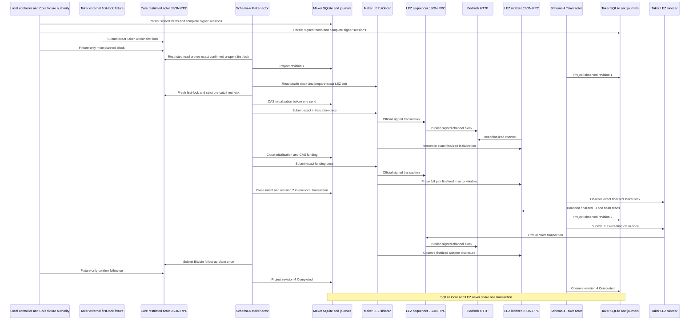

`TakerSellsLez` uses LEZ for the Taker first lock and Bitcoin for the Maker
second lock:

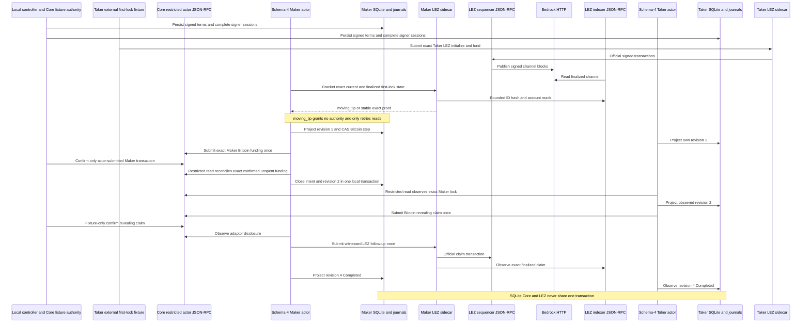

The executable timeout topology is the same in either trade direction; the
agreement selects the Taker-funded first-lock chain and forces the Maker-funded
second lock onto the opposite chain. Solid edges below are implemented and
covered by deterministic actor tests. Separate run `m3refund-20260716h`
crossed the Core and LEZ actual-node refund edges in both directions; run
`m3schema4-20260717d` is the complementary live happy-path Maker-admission
proof. Genuinely concurrent cutoff, refund, and late admission is still a
hardening item rather than an inferred property of either run.

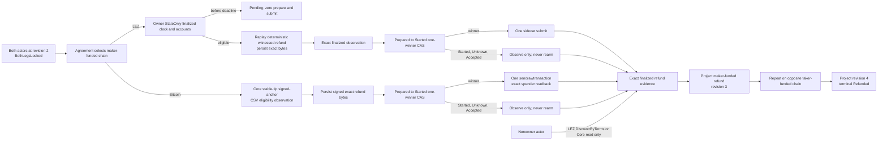

`testmempoolaccept` is a pre-finalization read-only policy gate, not a funding
broadcast. The exact funding bytes and planned next-block anchor are committed
by the agreement before both independent signer journals complete. Only then
may the direction-derived first effect occur. This order avoids signing an
agreement around an already mutable on-chain funding observation; it does not
create an atomic commit across Core, LEZ, and SQLite. In the current PoC the
external Taker fixture owns only the first-lock submission and the controller
owns deterministic local mining. The schema-4 Maker actor owns second-lock
construction, durable one-attempt authority, submission, and reconciliation;
the Taker actor observes that lock through its own restricted Core RPC or LEZ
sidecar. Both actors own their claim-effect journals. Replacing the external
Taker fixture with a product SDK remains accepted-scope work.

The schema-4 seam now has the following actual-node composition. Every arrow is
an implemented call used by run `m3schema4-20260717d`; no dashed future edge is
used to claim this checkpoint.

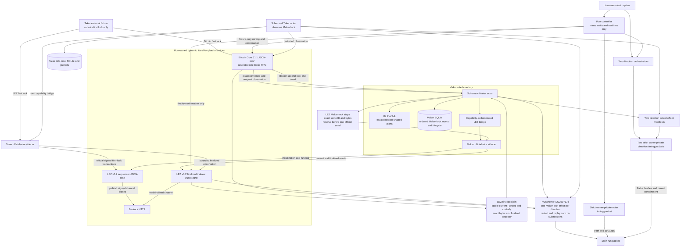

ADR 0048 adds one exact node-start coordinator ahead of every M3 bootstrap and
actor flow. It starts the fixed Core and LEZ service launchers concurrently in
separate owned sessions, waits and reaps both exact statuses, then authenticates
the complete Docker run/scope/component inventory. No deployment, Vault claim,
agreement, lock, claim, refund, or scalar authority exists before that join.
The pre-change Run-AA baseline is approximately 39 seconds Core, 58 seconds
LEZ, and 98 seconds with sequential handoff. Behavioral success, child failure,
INT, TERM, overcount, wrong-component, query-failure, exact cleanup, and foreign
survival cases are GREEN.
Clean pushed Run AD completed the concurrent startup window in 67 seconds
versus Run AA's 98-second sequential baseline, certifying a 31-second saving
with exact cleanup. ADR 0049 adds fixed monotonic outer phases without adding
an RPC, port, actor credential, or chain authority. Its strict private packet
is path-and-SHA-bound into main evidence. Clean pushed Run AE measures
1,023,100 ms with 280 ms unattributed; the two complete direction phases
consume 75.2 percent. Child semantic packets are now contract-GREEN, bind the
current effect manifests, and must fit inside their exact outer parent phases.
Clean pushed Run AF measures 1,000,170 ms with 510 ms unattributed. Its
346,060/386,060 ms children fit their 346,280/386,310 ms parents and localize
nearly all actor time to five finalized lock/claim windows.

| Component | Status | Endpoints and local services | Role/authority boundary | Current proof and nonclaim |
|---|---|---|---|---|
| M3 monotonic phase evidence | Outer and child implementation, complete pinned CI, and clean pushed Run AF actual-node measurement GREEN | Reads only Linux `/proc/uptime` in the outer and direction runners. It opens no RPC, port, peer, faucet, or public service | Fixed outer and journey-specific child phase identifiers are allowlisted. No command, endpoint, account, transaction, actor output, or secret enters a journal. Timing never grants send, retry, finality, deadline, CAS, or cleanup authority | Exact ordering/arithmetic, supported schedule shapes, 0600 modes, symlink/tamper/malformed-effect rejection, no-clobber publication, effect SHA binding, parent-duration containment, main-packet path/SHA equality, and five-file rehash before/after main publication are GREEN. Run AF measured 1,000,170 ms outer and 346,060/386,060 ms children; five finalized lock/claim windows dominate. Different host contention means no speedup over Run AE is claimed |
| M3 exact-idempotent LEZ initialization journal | Actual-node GREEN in `TakerSellsForeign` at run `m3schema4-20260717d` | Maker actor calls its capability-authenticated loopback sidecar; the sidecar uses official RPC on the run-owned sequencer and finalized reads on the indexer | `ExactIdempotentSubmissionSafe` is distinct from absence. The role-local Maker journal reserves the exact initialization ID and bytes before one send; `Started`, `Unknown`, and accepted states never rearm. Exact canonical evidence is still required to close | Durable LEZ Maker-lock counts advanced 0 to 1 to 2 for initialization and funding, stayed unchanged across restart, and the full pair finalized inside the exact actor window. This proves the private-local operation, not generic production idempotence for an arbitrary future LEZ endpoint |
| M3 exact-idempotent typed actor mapping | Actual-node GREEN in the live schema-4 Maker CLI | `MakerLockStepChainObservationV1` carries exact IDs and bytes between the direction-shaped SDK, role-local SQLite, and live Core or LEZ adapter | Only the Maker role receives second-lock material. The first eligible drive can consume one journal authority; a restarted actor observes durable state and submits zero times. Taker is observation-only for the Maker lock | Each direction recorded exactly one Maker-lock economic effect and zero restart or terminal-replay re-submissions. Chain observation, rather than accepted submission, closes revision two |
| M3 joined current and finalized LEZ first-lock proof | Actual-node GREEN in `TakerSellsLez` | One role-local sidecar brackets a stable current LEZ clock, exact witnessed metadata and custody, exact initialize/fund bytes, and independently bounded finalized indexer ancestry | Runtime, chain, program, signer, accounts, custody owner/program, amount, response context, block identity, and stable clock are fail-closed. A payload-free `moving_tip` grants no chain fact or send authority | Nine `moving_tip` reads caused fresh-process read-only retries; attempt ten returned the stable joined proof and permitted one Maker Bitcoin send. State-only evidence alone remains insufficient and is never described as finality |
| M3 schema-4 live Maker-lock seam | Actual-node 2 of 2 GREEN at tested pushed commit `0e7635f` | Live `BtcPairSdk`, Maker SQLite, restricted Core 31.1 Basic RPC, capability-authenticated LEZ bridge, official-wire sidecar, sequencer, Bedrock, and indexer are composed on dynamic literal loopback | Taker external fixture submits only the first lock. Maker rechecks exact first-lock eligibility and a strictly pre-cutoff current clock immediately before any possible CAS/send. Maker intent close and lifecycle revision two share one SQLite transaction; chain I/O does not | Retained packet `docs/evidence/m3-schema4-actor-owned-lock-poc-20260717.json` binds run D, both terminal revision-4 role pairs, one Maker effect per direction, exact replay counts, no public resources, and cleanup. This completes the schema-4 private-local checkpoint, not accepted M3 scope, production readiness, public deployment, or the `m3-complete` tag |
| M3 fresh identity, guest bootstrap, and direction runner | Actual-node schema-4 2 of 2 GREEN in `m3schema4-20260717d` | One unique run owns Core, Bedrock, sequencer, indexer, both sidecars, dynamic literal-loopback host ports, state roots, Docker resources, credentials, and evidence. The caller names the exact artifact target | Fresh owner identities and official owner-derived Vault IDs are paired and cross-distinct. Bootstrap owns deploy/Vault Claim authority; Core cookie wallet/miner authority is excluded from actor configs. The runner submits no Maker lock | Guest `a199c5be...e293` deployed once as ProgramId `39b6a4db...4dec` in finalized block 6; Maker/Taker Vault Claims finalized once in blocks 9/12. Both directions ended with both roles revision 4 `Completed`, restart and replay added zero submissions, and exact scoped cleanup passed |
| Bitcoin Core 31.1 service mode | GREEN in both schema-4 actor happy directions | Run-owned daemon and Regtest chain on an allocated literal-loopback RPC port; no published P2P port, zero peers, deterministic local coinbase funds | Provisioner alone owns cookie, wallets, mining, and funding authority. Maker and Taker use distinct mode-`0600` `rpcauth` configurations with least-privilege tested method matrices. The Maker actor, not the provisioner, sends the schema-4 Bitcoin second lock | In `TakerSellsLez`, exact Maker transaction `6c2505b...11dd6` appeared once in mempool and once canonically; restart added zero sends. Core 31.1 spender lookup used one options object. One confirmation is local PoC policy only |
| M3 durable MuSig2 SDK/journal | GREEN component boundary | No RPC or public resource; separate owner-only SQLite/WAL files per actor and per-session canonical byte exchange | Each role reserves a fresh BIP-327 nonce before exposing its commitment. The SDK revalidates the complete context, own and peer role-bound commitments, and secret/public nonce relation; SQLite atomically replaces the nonce with one exact replayable partial. Existing-only open cannot create an empty signer store | Seven focused journal tests, all 86 store tests, and all 26 BTC SDK all-target tests pass. The focused BTC-recovery slice is 11/11. The SDK point-checks a private adaptor scalar without creating a final signature. Plaintext nonce at rest until consumption and non-zeroizing upstream scalar internals are production nonclaims |
| M3 public durable lifecycle SDK | GREEN public library boundary at `0c78f3d` | No endpoint is embedded. Typed Bitcoin and LEZ ports are application-supplied and each bounded drive chooses exactly one chain. The reference in-memory store has no process-durability claim | Canonical secret-free records bind agreement, role, revision, all exact public effects/evidence, full-range decimal `u128`, and SHA-256. Exact create/CAS controls lifecycle projection. Port implementations separately persist bytes before send, observe before resend, and keep unknown outcomes non-authorizing | Fifteen unit, 32 external facade, two doctest, and 75 combined all-target/all-feature checks pass. Both claim and ordered-refund directions restart after every transition, replay with zero writes, and reject chain/role/agreement/byte substitution. `durable-lifecycle.rs` shows external composition. Production supplies the durable store and public-effect journals |
| M3 official and adaptor vector gate | GREEN immutable/test-only boundary at `0c78f3d` | No RPC, Docker, node, faucet, or public resource. Corpora are repository files pinned to bitcoin/bips commit `8c369ac8...13d7` with enforced hashes and BSD licenses | Public deterministic test scalars only. Every applicable production SDK operation is reconstructed under exact key/message/tweak/adaptor context; `k256` is an independent dev-only verifier | Nine focused groups pass. All 19 BIP-340 rows and applicable stateful BIP-327 operations execute; the swap fixture adapts, extracts, verifies, and rejects substitutions. The newer unused deterministic-signing extension is checksum/structure validated rather than falsely claimed as a production path |
| M3 private D1 recorder and bundle | Three of three BTC scenarios and bundle GREEN | Owner-private `.e2e` paths only; actual runs use dynamic loopback Core/LEZ services. No public RPC, peer, faucet, funds, or deployment | Fresh unique run ID, clean evidence commit, exact scenario, mode-`0700` directory and mode-`0600` files. Bundle verifier rehashes manifest/evidence/output/timing bytes and binds an ancestor evidence commit to the clean verifier commit | Happy, both ordered refund directions, and opposite-direction concurrent barrier record at `a6eb1ad`. Verifier `946208a` sealed bundle SHA-256 `3d7d7adc...a86c7cc`, result `passed`, with no external-network certification dependency. Private actor data is deliberately not checked in |
| M3 private D1 video renderer and bundle | Three of three BTC MP4s and video bundle GREEN | Digest-pinned VHS 0.11.0 is pulled during setup; production rendering then runs with `--network none`, a read-only root, dropped capabilities, no-new-privileges, bounded resources, and only one owner-private output mount. It calls no chain RPC, peer, faucet, or public service | The source verifier re-hashes terminal/timing, aggregate, role, effect, terminal, refund, and overlap packets before emitting canonical `proof.json`. The renderer only projects that proof; it gains no actor, signer, wallet, node, send, retry, finality, or cleanup authority. The final verifier regenerates proof and rejects changed bytes, roles, order, duplicates, mixed commits/networks, unsafe modes, and malformed streams | Renderer/verifier `846ba56` produced happy, refund, and concurrent H.264 1280x720 MP4s. Complete decode and sampled intro, both-direction, scenario/atomicity, and stable-tail frames passed; mode-`0600` bundle `7697a27c...f101ba8` binds source commit `a6eb1ad`. The image pull can fail on registry/DNS/TLS/rate limits, but certification success uses no external network |
| M3 actor-local BTC recovery store | GREEN through all four revisions and both schema-4 actual-node directions | Separate owner-private SQLite/WAL per actor; no public RPC, faucet, or public resource | Schema-4 activation enforces direction-selected Maker-lock material and Bitcoin refund-key authority. Each drive/recover projection and Maker intent close uses `BEGIN IMMEDIATE` plus predecessor CAS | Both roles ended revision 4 in both directions and restart/replay caused zero submissions. The Maker intent and revision-two close are one local transaction; cross-chain atomicity, a chain-plus-SQLite transaction, process-kill recovery, and malicious database-owner authentication are not claimed |
| M3 public-effect journal | GREEN for actual-node Bitcoin/LEZ claims and both ordered refund transitions | Owner-private SQLite stores complete public transaction bytes, SHA-256, expected chain ID, agreement commitment, and role/revision authority | Only `Prepared` to `Started` grants one fresh RPC call. Claims require bounded absence; refunds reject absence and require affirmative stable eligibility. Started/Unknown are observe-only; conflicting presence burns authority. Eight racing refund observers yield one winner. Secrets are forbidden | Claim replay and run `m3refund-20260716h` retained identical effect counts and zero re-submissions in both directions. Process-kill injection remains pending; no cross-system atomic commit is claimed |
| M3 legacy schema-3 one-shot BTC reference actor | Historical happy path GREEN in 2 of 2 actual-node directions; deterministic live-adapter refund execution GREEN through both transitions | Private schema-3 configs expose `activate`, `drive`, `recover`, and offline `status`; they bind loopback Core/sidecar routes, finite LEZ reads, distinct journals, the prepared claim, Taker adaptor authority, and only the agreement-selected Bitcoin funder refund key. Schema 3 Maker-lock handling remains observation-only | LEZ owners use state-only then prepare/exact/submit for claim/refund effects; LEZ nonowners use discovery only. Core refunds re-decode exact bytes and recompute txid/wtxid. Both chains persist exact bytes before one-send authority and project only finalized evidence | The schema-3 evidence remains valid for claims and refunds, while run D supersedes its operator-owned Maker-lock happy path. Schema-4 live Maker-lock admission and the separate opposite-direction overlap checkpoint are GREEN; public RPC/faucet, arbitrary-N/same-direction scheduling, concurrency chaos, and production custody remain unclaimed |
| M3 typed Bitcoin Core adapter | GREEN component; actual-node funding, claim, and both ordered timeout/refund paths GREEN; Testnet4 configuration GREEN | Literal-loopback HTTP supports Regtest and self-hosted Testnet4. One exact canonical allowlisted HTTPS DNS origin is admitted only for Testnet4. Both have bounded size/time/concurrency and separate role-local Basic files | Exact Core 31.1 version, profile chain/genesis, readiness, synchronized indexes, and stable owner-private credentials are required. Route/profile mismatch fails before RPC; provisioner/wallet authority is excluded. Refund send authority remains actor-journal owned | 37 all-target executions cover exact funding/claim/refund, signed-anchor next-block CSV maturity, exact witnesses, conflicts, finality, one-send and txid/wtxid readback. Five focused tests cover Testnet4 readiness and HTTPS/loopback security without public calls. Live public provider and fee/reorg stress remain later work |
| M3 v0.2 native-refund planner and RPCs | Durable exact planner, authenticated prepare/restart, finalized witnessed observation, and both actual-node refund orders GREEN | Capability-authenticated run/role/runtime-bound literal-loopback HTTP to the run-owned sequencer/indexer tuple; no faucet or public endpoint | The sidecar role, complete runtime, escrow and transfer programs, immutable depositor, and witnessed aggregate key/account are revalidated. The official transaction is permissionless and has no signer, nonce, or witness. Successful canonical request/result replay is restored before bind | Component mutation/replay/deadline/finality coverage remains, and `m3refund-20260716h` proves actual-node execution to terminal revision 4 `Refunded` in both directions with zero replay submissions. Process-kill/reorg and production trust remediation remain |
| M3 witnessed LEZ v0.2 stack | Schema-4 happy-path actor composition GREEN in both directions; exact durable refund preparation and finalized observation components GREEN | Run D allocates Bedrock, sequencer, indexer, and separate Maker/Taker sidecars on dynamic literal-loopback ports; none is a default or reusable discovery address | Separate capabilities, signer keys, stores, and journals. Sequencer admission is not finality. Bounded finalized scans use ID/hash equality and finite 120-second bridge calls. A `moving_tip` response is payload-free and non-authorizing | Guest `a199c5be...e293` / ProgramId `39b6a4db...4dec` deployed in block 6. In `TakerSellsForeign`, the Maker actor submitted initialization `6e13383d...2110` and funding `9eb4ce06...3262`; the full pair finalized inside its exact window and restart added zero sends |
| Historical and current actor runners | Historical operator-composed and schema-3 private local PoCs remain retained; schema-4 run D is the Maker-lock checkpoint, the overlap run is the two-swap checkpoint, F7 repeatability is closed, and fresh D1 recordings repeat happy/refund/concurrent journeys | Current runs allocate dynamic Core, Bedrock, sequencer, indexer, and role-sidecar endpoints plus isolated state/evidence. The overlap run shares only run-owned nodes and fixture custody; actor databases, signer journals/sessions, agreements, escrows, deadlines, and outpoints are swap-distinct. Exact run labels and ownership registries scope cleanup | All runs prove presign-before-effect and dual-lock-before-reveal. Run D proves Maker second-lock ownership. The overlap barrier holds four role stores at revision two before settlement. The public SDK exposes the same structural lifecycle while the reference actor retains concrete SQLite/effect journals; the Taker first lock remains external-fixture owned | Retained summaries and D1 hashes bind terminal states, exact effect/replay counts, no public resources, and cleanup. Accepted private M3 SDK/custom-token/recording/Testnet4 configuration scope is GREEN. Arbitrary-N/same-direction scheduling, process-kill/reorg/chaos, production custody, live public routes, and production readiness remain open |
| M3 overlap controller and isolation barrier | Clean actual-node GREEN in `m3overlap-20260717a` at pushed commit `1e6d5f1` | Two direction controllers share one run-owned Core 31.1 loopback JSON-RPC endpoint and one LEZ v0.2 Bedrock/sequencer/indexer tuple. Four role-local sidecars and four actor databases remain private; no public RPC, faucet, peer, or public funds participate | A deterministic fixture custody key owns two distinct mature coinbase outpoints; it grants no actor or signer authority. Four actor DB paths/inodes, eight signer journal paths/inodes, two sessions per domain, two agreements, two escrow pairs, and distinct deadlines are asserted before settlement. Chain mutations remain serialized | Both swaps reached revision 2 `both_legs_locked` before either settlement permit, then all four roles reached revision 4 `Completed`. Each swap retained two Bitcoin and three LEZ effects, cross-swap IDs were disjoint, terminal replay added zero submissions, and exact cleanup targeted no foreign resource. This proves one opposite-direction pair, not arbitrary-N or same-direction LEZ nonce scheduling |

The overlap deployment shares the actual chain services while keeping every
swap-owned state surface separate:

```mermaid
flowchart LR
    Controller["Overlap controller<br/>revision-two barrier"]

    subgraph SwapA["TakerSellsForeign"]
        ActorA["Maker and Taker<br/>fresh actor commands"]
        DbA[("Two actor DBs<br/>four signer journals")]
        SidecarsA["Maker and Taker<br/>capability sidecars"]
        ActorA --> DbA
        ActorA --> SidecarsA
    end

    subgraph SwapB["TakerSellsLez"]
        ActorB["Maker and Taker<br/>fresh actor commands"]
        DbB[("Two actor DBs<br/>four signer journals")]
        SidecarsB["Maker and Taker<br/>capability sidecars"]
        ActorB --> DbB
        ActorB --> SidecarsB
    end

    Core["Core 31.1 Regtest<br/>dynamic loopback JSON-RPC"]
    Sequencer["LEZ sequencer<br/>dynamic loopback JSON-RPC"]
    Bedrock["LEZ Bedrock<br/>run-owned local service"]
    Indexer["LEZ indexer<br/>dynamic loopback JSON-RPC"]

    Controller --> ActorA
    Controller --> ActorB
    ActorA --> Core
    ActorB --> Core
    SidecarsA --> Sequencer
    SidecarsB --> Sequencer
    SidecarsA --> Indexer
    SidecarsB --> Indexer
    Sequencer --> Bedrock
    Indexer --> Bedrock
```

The shared deterministic test-custody key is confined to provisioner-owned
Regtest source funding. It produced two mature, distinct outpoints and does not
cross the restricted actor RPC, role-local sidecar, actor database, signer
journal, session, agreement, or escrow boundaries shown above.

## External resources and flakiness

The deterministic SDK/schema-v14 corridor uses only local temporary files and
process input. It cannot fail because a public RPC, faucet, chain peer, Docker
registry, or testnet is unavailable. The canonical forward and reverse certification runs crossed actual local LEZ
v0.2 Bedrock, sequencer, indexer, and Zebra Regtest
consensus/state-transition boundaries in one swap. Regtest outputs and LEZ
genesis allocations provided deterministic local funds. Separate ignored fault
suites remain independent evidence and do not turn the two happy runs into
restart, refund, reorg, or chaos proof.

Schema-4 run `m3schema4-20260717d` likewise used only its private local Bitcoin
Core 31.1 Regtest and LEZ v0.2 Bedrock, sequencer, indexer, and role-sidecar
tuple. Regtest coinbase outputs and LEZ genesis/Vault allocations supplied
deterministic local funds. It used no public RPC, faucet, public funds, or
public deployment, and success did not depend on an external network. The
pinned Bedrock process attempted `pool.ntp.org:123/udp` and recorded 45
timeouts, but certification did not consume that result. This optional upstream
NTP behavior can add log noise or latency and must not become a hidden readiness
dependency. The local finalized tip also advanced during bracketed reads:
nine typed `moving_tip` results delayed `TakerSellsLez`, but each was
payload-free, granted no send authority, and caused only bounded fresh-process
read retries before the one stable proof. These are availability/flakiness
facts, not weakened canonicality checks.

The retained M4 deployment and actor-onboarding runtime likewise used only a
run-owned LEZ v0.2 Bedrock, sequencer, and indexer on dynamic literal-loopback
ports plus deterministic genesis allocations. The deployment packet records
`runtime_external_resources == []`; no public RPC, peer, faucet, public funds,
public deployment, or external finality service participated. A full finalized
history scan and exact block-ID/hash rereads prove local consensus/indexer
behavior rather than treating loopback transport as a chain emulator. This
closes deployment and identity prerequisites only; actual swap effects are
still 0 of 1.

Cold setup can still depend on crates.io, GitHub, container registries, Risc0
tool distribution, and the checksummed Logos circuits release. CPU, memory,
disk, registry availability, and an uncached dependency graph can therefore
delay or fail a local-node run without changing its chain assertions. Warm,
verified caches reduce availability risk but do not justify bypassing a digest,
lockfile, or vulnerability failure.

Future public evidence adds different failure modes. The official LEZ endpoint
`https://testnet.lez.logos.co` can be rate-limited, unavailable, reset, or move
to another channel; every result must bind the observed channel, block,
transaction, ProgramId, ELF, ImageID, and exact commits. The selected Zcash
routes are a self-hosted Zebra 6.0.0 public-Testnet node and Tatum's
API-key-authenticated Testnet Zebrad gateway. The former carries initial sync,
disk, peer, epoch, and organic-reorg risk; the latter carries provisioning,
quota, outage, lag, method-policy, and authoritative-provider trust risk.
Community faucets or Discord funding have no
SLA and may be depleted, so CI must not silently treat their outage as success.
No current evidence flow calls those public endpoints or funding routes. The
dormant constructors are executable, but their tests stop before network I/O.

## Local test concurrency

```mermaid
flowchart LR
    Start["Choose unique RUN_ID"] --> Check{"Heavy suite already active?"}
    Check -->|"yes"| Wait["Wait or use isolated checkout and resources"]
    Check -->|"no"| Choose{"Select one heavy lane"}
    Choose --> Zebra["Two-node Zebra Compose project"]
    Choose --> Lez["LEZ v0.1.2 standalone and Risc0 lane"]
    Choose --> LezV02["Full LEZ v0.2 private-network lane"]
    Choose --> Corridor["Composed M2 corridor on explicit local tuple"]
    Choose --> M3Actor["Run-owned M3 Core and LEZ actor lane"]
    M3Actor --> M3Schedule{"Select actor schedule"}
    M3Schedule -->|"default sequential"| Ownership["Inventory unique containers, networks, volumes, images, ports, and state roots"]
    M3Schedule -->|"overlap claim"| Barrier["Hold both swaps at revision two<br/>then release settlement"]
    Barrier --> Ownership
    Ownership --> RoleCleanup
    Corridor --> Lock{"Endpoint tuple flock available?"}
    Lock -->|"no"| Refuse["Fail closed before effects"]
    Lock -->|"yes"| RoleCleanup["Stop exact role bridge PIDs only"]
    Zebra --> ScopedCleanup["Clean exact Compose project only"]
    Lez --> ScopedCleanup
    LezV02 --> ScopedCleanup
```

Never run the Zebra and LEZ heavy lanes concurrently on the same host. Never use
global Docker prune/stop commands. Every Zebra run owns a unique Compose project,
ephemeral host ports, run manifest, and absolute maker database. Reusing a run
manifest or database is rejected before Compose starts. LEZ runs require unique
tool, target, standalone, and evidence directories when another checkout might
be active. The full v0.2 lane specifically owns project
`lez-atomic-swaps-lez-v02-{run_id}`, state `.e2e/{run_id}/lez-v02`, one private
network, and dynamic literal-loopback host ports; it must never reuse fixed
container names or clean another project's resources. A composed corridor does
not own those node processes. It acquires a nonblocking advisory lock whose key
is the SHA-256 of the configured sequencer, indexer, and Zebra URLs, creates a
fresh output root and role bridges, and stops only bridge PIDs whose start ticks
and executable identity match its manifest. A failed effect-bearing run is
retained and its swap, output root, and funds are never reused.

The M3 actor lane owns its Core daemon, LEZ Compose project, networks, volumes,
images built for that run, six dynamic host endpoints, actor and sidecar
processes, state roots, and evidence root. Before effects it records and checks
that inventory against the unique run identifier. Cleanup addresses only those
exact resources; it never prunes Docker globally, stops an unlisted process, or
removes the caller-supplied verified artifact cache. Failed effect-bearing M3
runs are retained and their agreements, journals, outputs, Vault funds, and
Core inputs are never reused.

## M4 exact replay checkpoint

The component/RPC graph was exercised cryptographically by clean replay `m4cert20260722an` on
`5ec6521`: isolated LEZ Bedrock/sequencer/indexer, authenticated Maker/Taker
role sidecars, and official Monero 0.18.5.1 daemon plus provisioner, Maker, and Taker wallet RPCs. All endpoints were fresh loopback bindings from the run manifest;
no public RPC, P2P peer, faucet, or public funds participated. The replay passed
finalized deployment, actor onboarding, tag 13/14/15 discovery, post-fee sweep and receipt verification, canonical cross-chain binding, and
state-based exact cleanup. A 2026-07-30 audit proved that historical replay used provisioner funding, Taker shared-wallet hosting, and a Maker destination. It therefore retains chain, cryptographic, binder, and cleanup evidence but not role-correct user certification. The corrected graph requires Maker funding and claim mining, neutral provisioner shared-wallet hosting, and Taker receipt; fresh replay is pending. This diagram remains the local PoC architecture;
production deployment, distributed atomicity, and recovery branches are not
claimed by this checkpoint.

```mermaid
graph LR
  T[Taker actor] -->|authenticated RPC| TS[Taker sidecar]
  M[Maker actor] -->|authenticated RPC| MS[Maker sidecar]
  TS -->|tag 13/14/15 effects| L[LEZ v0.2\nBedrock + sequencer + indexer]
  MS -->|finalized claim| L
  T -->|Taker destination wallet RPC| X[Monero regtest daemon]
  M -->|Maker funding and claim-mining wallet RPC| X
  X -->|receipt and sweep evidence| B[Cross-chain binder]
  L -->|finalized claim evidence| B
```


## M5 closure-candidate local process deployment

```mermaid
flowchart TB
    subgraph Owner["Owner local boundary"]
        MakerCLI["lez-maker CLI"]
        TakerCLI["lez-taker CLI"]
        Socket["Mode 0600 owner Unix RPC"]
        Daemon["lez-maker-daemon"]
        DB[("SQLite application and actor rows")]
        Workers["Three actor workers"]
    end
    MakerCLI --> Socket --> Daemon --> DB --> Workers
    TakerCLI --> Receipt["Private receipt v2"]
    Receipt --> Tag16["Tag16 sender once"]
    Receipt --> Observer["Role fixed observer"]
    Observer --> Reconcile["Evidence shaped reconciliation"]
    Workers --> BTC["Bitcoin marker Terminal"]
    Workers --> XMR["XMR marker live then failure"]
    Workers --> ZEC["Zcash marker Terminal"]
    XMR --> Reap["Reap then Backoff"]
    DB --> Restart["Restart exact rows no replay"]
    Tag16 -.-> LEZ["Retained isolated LEZ evidence"]
    BTC -.-> Core["Retained Bitcoin Core evidence"]
    ZEC -.-> Zebra["Retained Zebra evidence"]
    XMR -.-> Monero["Retained Monero evidence"]
```

| Boundary | Current closure evidence | External resources in the new test |
|---|---|---|
| Maker all-pair lifecycle | Real CLI/daemon 1/1 in 0.64s | None; marker configs/programs only |
| Taker Tag16 refund | Real CLI 1/1 in 106.26s; rejected-preflight retry, prepare-only preflight, send, observe/reconcile, Complete, losing claim | None; signed local acceptance plus fixed sender/observer |
| Three-pair coordinator | Real daemon/database 1/1 in 16.31s; XMR failure isolated, BTC/ZEC Terminal, reap/restart/no replay | None; local processes, SQLite, Unix socket |
| Chain-effect layer | Retained M2/M3/M4 devnets and clean M5 BTC/ZEC/XMR corridors | Isolated loopback nodes only in their separate documented runs |

The solid topology requires no Docker, node RPC, faucet, DNS, peer, network, or
funds. Dashed nodes are not contacted by the new matrix/overlap tests. Switching
the application deployments from local nodes to a public environment remains a
configuration plus deployment operation, but no public deployment is claimed.
Semantic receipt-v2 XMR worker adapters and simultaneous accepted-application
actual-chain overlap remain post-PoC hardening.

## M7 schema-3 Maker Tag17 supervisor deployment

This section records the Tag17-only checkpoint from ADR 0163. The current
branch-aware deployment under ADR 0164 is documented in the section below.

```mermaid
flowchart LR
    MakerCLI[Maker CLI] --> OwnerSocket[Owner Unix RPC]
    OwnerSocket --> Daemon[Maker daemon]
    Daemon --> Store[(Maker SQLite)]
    Store --> Supervisor[Maker supervisor]
    Supervisor --> Actor[xmr maker actor]
    Actor --> Workflow[(XMR workflow SQLite)]
    Actor --> Sender[Tag17 sender]
    Actor --> Observer[Finalized observer]
    Sender --> LezSidecar[Maker LEZ sidecar]
    Observer --> LezSidecar
    LezSidecar --> LezRpc[LEZ sequencer and indexer RPC]
    Actor -. authority only .-> XmrDaemon[Monero daemon RPC]
    Actor -. authority only .-> XmrWallets[Funding shared and role wallet RPCs]
```

| Component | Production-shaped authority | Focused supervisor test |
|---|---|---|
| Maker daemon and store | Owner-only Unix RPC, durable action, fenced process lease | Real store and supervisor library |
| XMR Maker role actor | Digest-pinned executable, sealed schema-3 FD 196, inherited actor lock, distinct workflow lock | Real xmr-maker-actor process |
| Tag17 sender | Digest-pinned no-argument xmr-reference-tag17 using authenticated Maker sidecar | Strict local descriptor probe |
| Finalized observer | Role-fixed classifier over original sending-plan identity | Strict local finalized result probe |
| LEZ nodes | Run-owned Bedrock, sequencer and indexer on configured loopback or approved deployment endpoints | Not started and no RPC opened |
| Monero nodes | Run-owned daemon plus funding, shared, and role wallet RPCs | Not started and no RPC opened |

The process test proves the solid control-plane edges through the Actor and
Workflow nodes. ADR 0158 separately proves Sender through LEZ finality on fresh
local nodes. No evidence currently claims that the focused test opened the
dashed RPC edges or joined the subsequent Monero recovery sweep. Local-to-public
portability requires replacing configuration and deploying the reviewed LEZ
program; it does not permit implicit endpoint fallback.


## M7 branch-aware Maker recovery deployment

```mermaid
flowchart TB
    CLI[Maker CLI] --> Socket[Owner Unix RPC]
    Socket --> Daemon[Maker daemon]
    Daemon --> Store[(Maker SQLite)]
    Store --> Supervisor[Maker supervisor]
    Supervisor --> Actor[xmr maker actor]
    Actor --> Workflow[(XMR workflow SQLite)]
    Workflow --> Branch{Refund or Punish}
    Branch -->|Refund| RefundWorker[Monero refund worker]
    RefundWorker --> Wallet[Role wallet RPC]
    Wallet --> Monerod[Monero daemon RPC]
    Branch -->|Punish| Tag17Worker[Tag17 worker]
    Tag17Worker --> Sidecar[Authenticated LEZ sidecar]
    Sidecar --> Sequencer[LEZ sequencer RPC]
    Sidecar --> Indexer[LEZ indexer RPC]
    Actor --> Observer[Role fixed observer]
    Observer --> Wallet
    Observer --> Sidecar
```

| Route | Production-shaped RPCs | Focused process proof | Secret custody |
|---|---|---|---|
| Refund | role/shared wallet RPC and Monero daemon RPC | strict local worker and verifier, no RPC | FD 218 only for invocation |
| Punish | authenticated Maker sidecar, sequencer and indexer RPC | strict local preflight, worker and observer, no RPC | FD 218 always absent |

Both focused routes use real sealed authority, workflow SQLite, inherited actor
lock, distinct workflow lock, supervisor lease and terminal Maker-store update.
They start no Docker resource or local node. The existing actual-node Tag17 run
proves the LEZ RPC leg separately; the existing historical Maker recovery run
proves a Monero sweep separately. A fresh application-owned joined run and actual-node refund observation remain open, so configuration-only
public portability is not yet a production-readiness claim.

## M7 sealed refund-signature deployment boundary

ADR 0165 adds no endpoint. It narrows the existing Refund worker deployment by
requiring two invocation-only sealed inputs before the one-attempt CAS.

```mermaid
flowchart TB
    Evidence[Owner private finalized Tag16 artifact] -->|FD 219| Worker[Refund worker]
    Share[Owner private Maker share] -->|FD 218| Worker
    Journal[(Owner private adaptor SQLite)] --> Worker
    Worker --> SharedWallet[Shared wallet RPC loopback]
    SharedWallet --> Monerod[Monero daemon RPC loopback]
    SharedWallet --> Observer[Role fixed Monero verifier]
    Observer --> Workflow[(XMR workflow SQLite)]
    Evidence -. not mapped .-> Observer
    Share -. not mapped .-> Observer
```

```mermaid
sequenceDiagram
    participant PairActor as Maker role actor
    participant Store as Workflow SQLite
    participant Worker as Refund worker
    participant Wallet as Shared wallet RPC
    participant Verify as Monero verifier

    PairActor->>PairActor: Open and seal stable inputs
    PairActor->>Store: Consume send authority once
    PairActor->>Worker: Start no argument child
    Worker->>Wallet: Submit authenticated sweep
    PairActor->>Verify: Later read only observation
    Verify-->>PairActor: Finalized receipt
    PairActor->>Store: Complete original plan
```

The ADR 0165 custody tests open no RPC. ADR 0166 additionally runs the real
semantic child against three independent ephemeral loopback fixtures: Maker
role wallet, shared wallet, and daemon authority. Only the two wallet origins
receive calls; the daemon fixture receives none. This proves process routing
and the absence of sender-side confirmation mining, not real-node behavior.
Switching to reviewed remote endpoints remains a configuration change, while
any required on-chain deployment remains a separate deployment operation.

## M7 semantic Maker refund RPC deployment

```mermaid
flowchart LR
    Actor[xmr maker actor] -->|FDs 200 to 219| Worker[xmr reference monero refund]
    Worker -->|get address| RoleWallet[Maker wallet RPC]
    Worker -->|close generate refresh balance sweep| SharedWallet[Shared wallet RPC]
    RoleWallet --> Monerod[Monero daemon]
    SharedWallet --> Monerod
    Observer[Monero finality verifier] --> RoleWallet
    Observer --> Monerod
    Worker -. no direct RPC .-> Monerod
    Actor --> Workflow[(XMR workflow SQLite)]
    Observer --> Workflow
```

```mermaid
sequenceDiagram
    participant Worker as Refund sender
    participant MakerWallet as Maker wallet RPC
    participant SharedWallet as Shared wallet RPC
    participant Monerod as Monero daemon RPC
    participant Observer as Finality verifier

    Worker->>MakerWallet: get_address account 0 index 0
    Worker->>SharedWallet: close_wallet
    Worker->>SharedWallet: generate_from_keys restore height 0
    Worker->>SharedWallet: refresh from height 0
    Worker->>SharedWallet: get_balance exact principal
    Worker->>SharedWallet: sweep_all relay true
    Note over Worker,Monerod: No generate_blocks and no direct daemon request
    Observer->>MakerWallet: Refresh and locate exact receipt
    Observer->>Monerod: Verify canonical block and confirmation depth
```

ADR 0167 implements the second half as `xmr-reference-monero-verify`. The
observer contacts only the configured Maker-wallet and daemon RPC origins,
receives neither FD 218 nor FD 219, returns Pending for bounded non-final
states, and atomically publishes a receipt only after exact stable-tip,
canonical-block, destination, amount and ten-confirmation checks. Its fresh
joined actual-node replay remains open. In production, wallet RPCs themselves
are configured to their selected daemon. Neither sender nor observer falls
back to DNS, a public RPC, faucet or provider.
