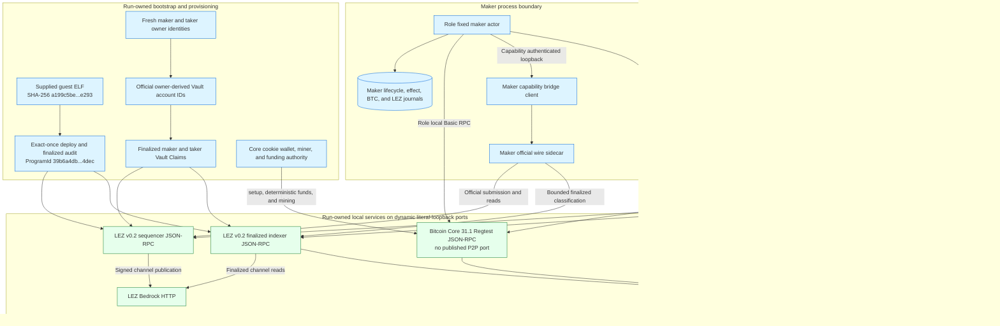
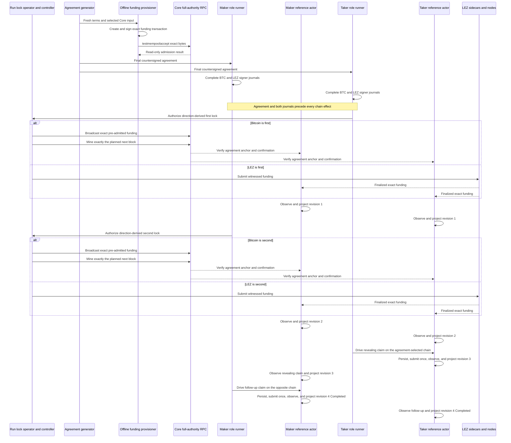
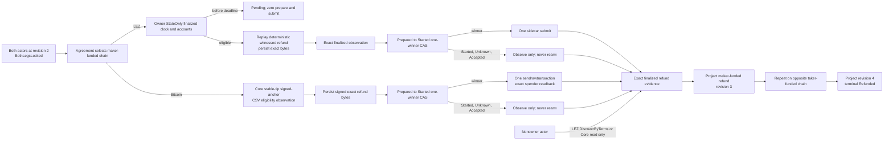
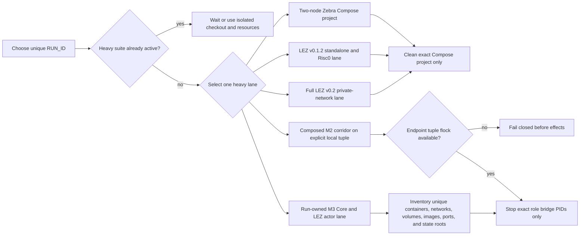

# Deployment components, RPCs, and local nodes

Status: Living executable inventory — 2026-07-16

This document is the concrete deployment companion to the
[system architecture](system-architecture.md). It distinguishes processes that
actually run today from target components that do not yet have an implementation,
port, credential scheme, or selected provider. A dashed component or edge is
planned; blue components are implemented and may have partial live exercise but
have not completed this topology.
No port is invented for an unimplemented integration. Exact current artifact,
deployment, transaction, balance, and run facts are retained in the
[canonical M2 certification packet](../evidence/m2-canonical-local-certification-20260714.json).

## Current executable local topology

```mermaid
flowchart TB
    Operator["Maker operator"]

    subgraph MakerHost["Maker host"]
        CLI["lez-maker CLI"]
        Daemon["lez-maker-daemon"]
        Store[("SQLite schema v10")]
        RuntimeTest["maker runtime restart fixture"]
        SdkJournal["SDK exact-tracker canonical / depth / same-tip replacement / removal journal"]
        SdkMaker["SDK fresh-gated maker-lock fixture"]
    end

    subgraph DeterministicCorridor["Deterministic SDK claim corridor; no node or RPC"]
        MakerActor["Role-fixed maker SDK actor"]
        TakerActor["Role-fixed taker SDK actor"]
        MakerClaimState[("Maker schema-v10 state")]
        TakerClaimState[("Taker schema-v10 state")]
        ClaimDouble["Deterministic LEZ/Zcash claim-port doubles"]
        Completed["Both actors Completed at revision 4"]
    end

    subgraph ZebraProject["Isolated Docker Compose project per RUN_ID"]
        ZebraPrimary["Primary Zebra 5.2.0 Regtest"]
        ZebraFork["Fork Zebra 5.2.0 Regtest"]
    end

    ZebraTest["Zebra actor acceptance fixture"]

    subgraph LezProcess["Pinned LEZ v0.1.2 local-node lane"]
        LezTest["LEZ actor and process acceptance fixtures"]
        LezExternal["lez-standalone-node external process"]
        LezNode["Standalone sequencer<br/>dynamic upstream port"]
        LezHome["Fresh mode-0700 home"]
        LezReady[("Private mode-0600 schema-v2 readiness<br/>deployment tx/block + program/built-in + actor keys")]
    end

    Operator --> CLI
    CLI -->|"Bearer HTTP JSON-RPC; create, status, alert list, alert acknowledge"| Daemon
    Daemon -->|"rusqlite; caller-selected local file; Mutex-serialized"| Store
    RuntimeTest -->|"Direct maker runtime API"| Store
    RuntimeTest --> SdkJournal
    SdkJournal -->|"Immediate transaction and full-history replay"| Store
    SdkMaker -->|"Both directions; intent and confirmed transition"| Store
    MakerActor --> MakerClaimState
    TakerActor --> TakerClaimState
    MakerActor -->|"LEZ reveal or Zcash follow-up"| ClaimDouble
    TakerActor -->|"Observe reveal and continue from protected preimage"| ClaimDouble
    ClaimDouble --> Completed
    Completed --> MakerClaimState
    Completed --> TakerClaimState
    RuntimeTest -->|"Stable JSON-RPC query and block relay"| ZebraPrimary
    RuntimeTest -->|"Independent fork mining JSON-RPC"| ZebraFork
    ZebraTest -->|"Unauthenticated JSON-RPC on ephemeral host-loopback port"| ZebraPrimary
    ZebraTest -->|"Unauthenticated JSON-RPC on different ephemeral host-loopback port"| ZebraFork
    ZebraFork -->|"submitblock relay performed by fixture"| ZebraPrimary
    LezTest -->|"Spawn, tamper/reuse rejection, shutdown"| LezExternal
    LezExternal -->|"Start exact upstream service"| LezNode
    LezExternal --> LezHome
    LezExternal -->|"Official health, genesis, tx/block, static built-in, account RPC"| LezNode
    LezTest -->|"Unauthenticated HTTP JSON-RPC through 127.0.0.1 client URL"| LezNode
    LezExternal -->|"Atomic no-clobber publish after verification"| LezReady
```

The maker daemon hard-refuses a non-loopback bind and defaults to
`127.0.0.1:0`. Its ready file contains only the selected URL; the Bearer token
comes from `LEZ_MAKER_RPC_TOKEN` and is never written there. The CLI default is
`http://127.0.0.1:9944`, so an ephemeral daemon must be called with the ready URL.
Registered methods are `swap_create`, `swap_status`, `swap_alerts`, and
`swap_alert_acknowledge`. Status includes pending count/highest severity; list
supports a cursor and acknowledged-history flag. Acknowledgment never changes
protocol phase. There is no daemon-integrated chain watcher, chain-key owner,
health method, or production ZEC ingestion RPC yet.

Each Zebra container listens on `0.0.0.0:18232` inside its isolated project
network. Compose publishes it as a different ephemeral `127.0.0.1` host port.
Cookie authentication is disabled for this Regtest-only fixture. The nodes have
separate tmpfs state, no initial peers, and no fixed host ports; the fixture
relays blocks explicitly. Both containers are non-root, read-only,
capability-free, resource-capped, and removed only through their exact Compose
project name. The runner creates an absolute, run-scoped SQLite path, refuses a
pre-existing manifest, database, WAL, or SHM before Compose starts, and records
the selected database and both ephemeral RPC URLs in `run.env`. The maker
runtime fixture commits real canonical funding, closes/reopens SQLite, suppresses
an unchanged fresh RPC requery, applies an affirmative deeper-fork removal,
closes/reopens again, and proves exact retry without a third journal row.

The pinned LEZ standalone server is short-lived, uses port zero and temporary
state, and the test client connects through `127.0.0.1`. However, the exact
upstream v0.1.2 server binds `0.0.0.0` on that ephemeral port. It is collision
isolated but not loopback/network-namespace isolated. This must remain visible
until upstream accepts a bind address or the lane is placed in an isolated
network namespace/container.

The reusable external wrapper verifies the tracked manifest bytes, ELF
SHA-256, and Risc0 ImageID before creating state. It refuses a pre-existing
home or readiness path, creates a mode-0700 home, waits for mandatory canonical
progress, deploys the checked guest, and re-reads genesis, the deployed
transaction and containing block, ProgramId derived from the transaction ELF,
the advertised authenticated-transfer built-in, and two key-derived funded
accounts owned by that built-in through official RPC. Upstream `getProgramIds`
is a static built-in map, not a deployed-program registry. Only then does the
process atomically create the mode-0600 schema-v2 readiness file; that file
contains deterministic actor private keys and is never a public ready file.
Tamper/reuse failures leave no readiness and preserve the existing home.

The deterministic claim corridor is deliberately separate from both local-node
lanes. It uses two role-fixed SDK actors, two different temporary schema-v10
SQLite databases, and an externally supplied test claim key per role. The key is
not stored in SQLite. In both signed directions it persists exact protected
claim submissions, observes the LEZ reveal, protects the extracted preimage,
submits the Zcash follow-up, and reopens both actors at revision 4 and
`Completed`. Its LEZ and Zcash ports are deterministic test doubles: it starts no
service, opens no RPC connection, and proves neither `LezClaimPort` nor
`ZcashClaimPort` against a node.

## M2 SDK/reference-demo target topology

This is the accepted M2 demo boundary. It is independent of the M5 production
daemon/CLI/Delivery/Chat delivery below. ADR 0022 records why the LEZ adapter is
a process boundary rather than another dependency in the reference actor.

The Zcash workspace graph pins `crypto-common = 0.2.0-rc.1`. The official LEZ
v0.1.2 graph reaches `chacha20 0.10` and `cipher 0.5.1`, which require stable
`crypto-common ^0.2`; Cargo cannot resolve those constraints in one graph. The
integration must not weaken or patch either cryptographic pin, and must not copy
official LEZ wire or RPC types into the Zcash workspace. A separately built,
exactly locked LEZ sidecar owns those official types. Its typed local bridge is
a bounded serde-only adapter protocol carrying primitive requests and facts; it
is not the official LEZ JSON-RPC protocol and cannot assert canonicality.
The final ADR-0023 corridor selects a separately locked v0.2 official-wire
sidecar and full local v0.2 Bedrock/indexer/non-standalone-sequencer stack. The
implemented v0.1.2 sidecar/node remain lower compatibility evidence, not the
final portability proof.

```mermaid
flowchart LR
    Mailbox["Test-only pre-lock agreement mailbox"]
    Zebra["Primary Zebra Regtest JSON-RPC"]
    ZebraFork["Temporary fork Zebra"]
    Bedrock["Bedrock node HTTP 18080<br/>digest-pinned; service GREEN"]
    LezIndexer["LEZ v0.2 indexer RPC 8779<br/>finalized ID and hash GREEN"]
    LezNode["Non-standalone sequencer RPC 3040<br/>signed channel and Borsh block GREEN"]
    LezV02Runner["Host orchestrator<br/>exact-ID lifecycle and RPC probes"]
    LezNetwork["Unique no-masquerade bridge<br/>dynamic loopback publications"]
    LezState[(".e2e/run_id/lez-v02")]
    LezReady[("Services + finalized Vault Claims + canonical deploy GREEN<br/>ProgramId 5cf8c5...29c1")]
    MakerNative["Maker native PoC CLI<br/>initialize + fund GREEN"]
    TakerNative["Taker native PoC CLI<br/>revealing claim GREEN"]
    LezNative[("Native lifecycle GREEN<br/>finalized blocks 219 220 223")]
    ActorProvisioner["zec-local-poc-provision GREEN<br/>stable Zebra query + private pair output"]
    FixtureReady[("Fixture readiness GREEN<br/>isolated configs; saved window stale")]
    LezFull[("Canonical ZEC corridor directions GREEN<br/>forward and reverse certification runs")]
    LezRunner["Direction-aware development runner<br/>2 of 2 happy directions GREEN"]
    EndpointLock[("Endpoint tuple advisory flock<br/>sequencer + indexer + Zebra URLs")]
    CanonicalBuilder["Pinned Risc0 Docker guest-builder<br/>Rust 1.94.1 + immutable digest"]
    CanonicalArtifact["ELF c85055...9d2e<br/>ProgramId 5cf8c5...29c1"]
    CanonicalDeploy["Finalized deployment<br/>tx bd1680...733f / block 2582"]

    subgraph MakerProcess["Role-fixed maker reference actor process"]
        MakerSdk["LEZ/ZEC swap SDK and agreement validators"]
        MakerState[("Maker-only schema-v10 state")]
        MakerConfig["Schema-v3 maker config"]
        MakerStatus["Offline status material"]
        MakerBridge["Typed local LEZ bridge client"]
        MakerZebra["In-process typed Zebra adapter"]
    end

    subgraph MakerSidecarProcess["Run-scoped maker LEZ sidecar process"]
        MakerCapability["lez-v02-bridge-poc<br/>canonical forward and reverse GREEN"]
        MakerOfficial["Prepare + observe + claim + submit<br/>source GREEN"]
        MakerEffect[("Role/run/runtime request store<br/>PREPARE + submit durability GREEN")]
    end

    subgraph TakerProcess["Role-fixed taker reference actor process"]
        TakerSdk["LEZ/ZEC swap SDK and agreement validators"]
        TakerState[("Taker-only schema-v10 state")]
        TakerConfig["Schema-v3 taker config"]
        TakerStatus["Offline status material"]
        TakerBridge["Typed local LEZ bridge client"]
        TakerZebra["In-process typed Zebra adapter"]
    end

    subgraph TakerSidecarProcess["Run-scoped taker LEZ sidecar process"]
        TakerCapability["lez-v02-bridge-poc<br/>canonical forward and reverse GREEN"]
        TakerOfficial["Prepare + observe + claim + submit<br/>source GREEN"]
        TakerEffect[("Role/run/runtime request store<br/>PREPARE + submit durability GREEN")]
    end

    Mailbox -.->|"Bounded dual-signed terms before first lock"| MakerSdk
    Mailbox -.->|"Bounded dual-signed terms before first lock"| TakerSdk
    MakerSdk --> MakerState
    TakerSdk --> TakerState
    MakerConfig --> MakerStatus
    TakerConfig --> TakerStatus
    MakerConfig -->|"Fresh private inputs; live activate and drive"| MakerSdk
    TakerConfig -->|"Fresh private inputs; live activate and drive"| TakerSdk
    MakerStatus -->|"Existing-only hardened open; no RPC"| MakerState
    TakerStatus -->|"Existing-only hardened open; no RPC"| TakerState
    MakerSdk -->|"Live primitive requests"| MakerBridge
    TakerSdk -->|"Live primitive requests"| TakerBridge
    MakerBridge <-->|"Bounded serde-only local protocol"| MakerCapability
    TakerBridge <-->|"Bounded serde-only local protocol"| TakerCapability
    MakerCapability --> MakerOfficial
    TakerCapability --> TakerOfficial
    MakerOfficial --> MakerEffect
    TakerOfficial --> TakerEffect
    MakerEffect -->|"Reveal forward; initialize and fund reverse"| LezNode
    TakerEffect -->|"Initialize and fund forward; reveal reverse"| LezNode
    MakerCapability -->|"Non-genesis finalized-tip readiness"| LezIndexer
    TakerCapability -->|"Non-genesis finalized-tip readiness"| LezIndexer
    MakerNative -->|"official JSON-RPC; maker key file"| LezNode
    TakerNative -->|"official JSON-RPC; taker key + preimage files"| LezNode
    LezV02Runner -->|"Start first; cryptarchia and channel HTTP"| Bedrock
    LezV02Runner -->|"Start after channel; finalized ID and hash RPC"| LezIndexer
    LezV02Runner -->|"Start after exact missing proof; service RPC"| LezNode
    LezV02Runner -.-> LezNetwork
    LezV02Runner -.-> LezState
    LezNetwork --> Bedrock
    LezNetwork --> LezIndexer
    LezNetwork --> LezNode
    LezNode -->|"Zone SDK signed publish"| Bedrock
    LezIndexer -->|"Poll finalized LEZ channel"| Bedrock
    CanonicalBuilder --> CanonicalArtifact
    CanonicalArtifact -->|"ProgramDeployment through official RPC types"| LezNode
    LezIndexer -->|"prove transaction in finalized block"| CanonicalDeploy
    CanonicalArtifact --> CanonicalDeploy
    CanonicalDeploy --> LezReady
    LezV02Runner -->|"Write run-scoped evidence"| LezReady
    MakerNative --> LezNative
    TakerNative --> LezNative
    LezReady --> LezNative
    LezReady -->|"runtime facts"| ActorProvisioner
    ActorProvisioner -->|"stable mature candidate query"| Zebra
    ActorProvisioner --> FixtureReady
    FixtureReady -->|"owner-private configs"| MakerConfig
    FixtureReady -->|"owner-private configs"| TakerConfig
    LezNative --> LezRunner
    FixtureReady --> LezRunner
    LezRunner -->|"Both independent actor corridors Completed"| LezFull
    LezRunner -->|"Acquire before provisioning effects"| EndpointLock
    EndpointLock -.->|"Guard exact local tuple"| LezNode
    EndpointLock -.->|"Guard exact local tuple"| LezIndexer
    EndpointLock -.->|"Guard exact local tuple"| Zebra
    LezRunner -->|"Maker-only endpoint and key files"| MakerCapability
    LezRunner -->|"Taker-only endpoint and key files"| TakerCapability
    MakerSdk -.->|"Typed requests and validated snapshots"| MakerZebra
    TakerSdk -.->|"Typed requests and validated snapshots"| TakerZebra
    MakerZebra -->|"Fund forward; follow-up claim reverse"| Zebra
    TakerZebra -->|"Follow-up claim forward; fund reverse"| Zebra
    ZebraFork -.->|"Explicit reorg relay in fault tests"| Zebra
    MakerCapability -.->|"Primitive facts only"| MakerBridge
    TakerCapability -.->|"Primitive facts only"| TakerBridge
    Mailbox -.->|"Destroyed after immutable terms persist"| MakerSdk
    Mailbox -.->|"Destroyed after immutable terms persist"| TakerSdk

    classDef planned stroke-dasharray: 5 5,fill:#fff7e6,stroke:#9a6700;
    classDef implemented fill:#ddf4ff,stroke:#0969da;
    classDef running fill:#e6ffec,stroke:#1a7f37;
    class CanonicalBuilder,CanonicalArtifact,CanonicalDeploy,Bedrock,LezIndexer,LezNode,LezV02Runner,LezNetwork,LezState,LezReady,MakerNative,TakerNative,LezNative,ActorProvisioner,FixtureReady,Zebra,MakerConfig,TakerConfig,MakerCapability,MakerOfficial,MakerEffect,TakerCapability,TakerOfficial,TakerEffect,LezRunner,EndpointLock,LezFull,MakerSdk,MakerBridge,MakerZebra,TakerSdk,TakerBridge,TakerZebra running;
    class Mailbox,ZebraFork planned;
```

Each actor and each actor-owned sidecar has a distinct PID. Actor state, claim
keys, LEZ signing keys, sidecar capabilities, and nonce leases are owner-local;
the maker and taker persist the agreement separately. The reference runner owns
the sidecar listener, selects an ephemeral loopback port and high-entropy
capability, binds every call to its `RUN_ID`, and cleans only its own processes
and resources. The actor never sends official LEZ RPC through the local bridge:
only the separately locked sidecar constructs, signs, decodes, and calls the
official LEZ protocol. The in-process Zebra adapter calls Zebra directly and
delegates agreement/consensus validation to the SDK.

Each role's schema-v3 file fixes the exact signed-agreement SHA-256, complete
sidecar and Zebra runtime identities, finite discovery/candidate bounds, and
isolated state, journal, capability, signer, claim, and optional preimage paths.
Paired validation requires one preimage owner and one Zcash funder, identical
agreement/runtime/Zebra terms, distinct sidecars and signers, and no path
aliases. Offline `status` deliberately loads only claim-recovery material and
the role-store location: it requires no sidecar/Zebra credential and opens no
chain port. It returns `not_activated` without creating a missing database; for
existing state it uses the hardened existing-only SQLite opener and
`resume_all_capable` with unit LEZ and Zcash port types. Its versioned output is
secret-free. `activate` and `drive` now compose the SDK, role bridges, and Zebra
port in the development runner. Run `m2poc-vertical-20260714a` proves that the
provisioner can
query the live retained Zebra, select one stable mature maker UTXO, create the
dual-signed agreement, write separate private role trees, reload both configs
and activation-material sets, and pass pair isolation. The configured sidecar
URLs were not bound or called, and neither actor process executed a lifecycle
effect. Its saved window 1..256 is stale at later tip 389 and is never reused by
the development runner, which prebuilds, provisions at a fresh tip, starts
explicit run-port bridges, mines only after Zcash effects, and enforces a
monotonic 49-second cap against the 60-second LEZ delay. Before provisioning
effects it acquires a nonblocking advisory `flock` keyed by the exact LEZ
sequencer/indexer and Zebra endpoint tuple. A different tuple can proceed; a
runner using the same tuple fails closed without touching the node processes or
unrelated Docker resources.

Historical runs 14d through 14n retain partial and failure evidence. Historical
pre-canonical run 14o completed `TakerSellsLez` in 25.370 seconds: the taker deposited LEZ, the
maker funded Zcash and claimed LEZ after two confirmations, and the taker spent
the revealed Zcash path. Both actors reached revision 4 `Completed`; one
bounded `moving_tip` retry succeeded. LEZ effects finalized in blocks
264/265/266, and the Zcash height-108 claim spent the height-106 funding output.
Historical pre-canonical reverse run 14c completed `TakerSellsForeign` in 26.960 seconds without a
drive retry: the taker funded Zcash, the maker deposited LEZ, the taker claimed
LEZ, and the maker spent Zcash. LEZ effects finalized in blocks 641/642/643,
and the Zcash height-115 claim spent the height-113 funding output. Both actor
processes and role stores again reached revision 4 `Completed`. Those successful
runs used host-built ProgramId `f8385049...0fbe` and remain immutable
historical evidence rather than current deployment authority.

The canonical Docker artifact has ELF `c85055f6...9d2e` and ProgramId
`5cf8c5a4...29c1`. It was deployed in transaction `bd16808e...733f`, proved
Finalized in block 2582, and then exercised by
`m2cert-canonical-forward-bb53daf-20260714a` and
`m2cert-canonical-reverse-bb53daf-20260714a`. Both actor pairs reached revision
4 `Completed`; the forward run took 25.580 seconds with two bounded retries and
the reverse took 28.790 seconds without a retry. The common live
guard requires confirmed Zcash funding before the LEZ revealing claim and the
LEZ reveal before the Zcash follow-up spend. Both required happy directions
have separate indexer-finality and Zebra transaction evidence. The dormant
public-route configuration contract is GREEN without public I/O. Restart,
refund, reorg, live-public behavior, chaos, and production hardening remain open.

The local mailbox is explicitly a test adapter, not Logos Delivery or Chat.
Once terms persist and the first lock is submitted, it is destroyed; both actors
must complete or refund using only their own state and selected chain nodes.

## M5 production application target topology

```mermaid
flowchart LR
    Maker["Maker operator"]
    Taker["Taker user"]

    subgraph MakerBoundary["Maker-owned boundary"]
        MakerCLI["Maker CLI"]
        Core["Optional Logos Core lifecycle adapter"]
        MakerDaemon["Maker daemon plus ZEC watcher"]
        MakerStore[("SQLite aggregate, journal, binding, alert outbox")]
        MakerZebra["Schema-v3 maker Zebra route"]
        MakerLezBridge["Loopback capability LEZ adapter"]
        MakerLezSidecar["Official-wire LEZ sidecar"]
        MakerLez["Typed outbound LEZ profile"]
    end

    subgraph TakerBoundary["Taker-owned boundary"]
        TakerCLI["Taker CLI or SDK"]
        TakerState[("Taker recovery state")]
        TakerZebra["Schema-v3 taker Zebra route"]
        TakerLezBridge["Loopback capability LEZ adapter"]
        TakerLezSidecar["Official-wire LEZ sidecar"]
        TakerLez["Typed outbound LEZ profile"]
    end

    Delivery["Offer discovery"]
    Chat["Signed negotiation channel"]
    RouteGate["Validate signed agreement, runtime,<br/>route, identity, and credentials"]

    subgraph RouteTargets["Typed route targets"]
        LocalLez["Local loopback sequencer + indexer"]
        PublicLez["Exact official LEZ HTTPS"]
        PublicLezRisk["Finalized-tip method unknown"]
        LocalZebra["Deterministic Zebra Regtest"]
        SelfHostedZebra["Self-hosted loopback Zebra + cookie"]
        TatumZebra["Exact Tatum HTTPS + x-api-key"]
    end

    Maker --> MakerCLI
    MakerCLI -.->|"Owner-local authenticated control RPC"| MakerDaemon
    Core -.->|"start, endpoint, health, stop"| MakerDaemon
    MakerDaemon --> MakerStore
    MakerDaemon -->|"Typed Zebra JSON-RPC"| MakerZebra
    MakerDaemon -->|"Bounded local adapter protocol"| MakerLezBridge
    MakerLezBridge -->|"Loopback + run/role capability"| MakerLezSidecar
    MakerLezSidecar --> MakerLez
    Taker --> TakerCLI
    TakerCLI --> TakerState
    TakerCLI -->|"Typed Zebra JSON-RPC"| TakerZebra
    TakerCLI -->|"Bounded local adapter protocol"| TakerLezBridge
    TakerLezBridge -->|"Loopback + run/role capability"| TakerLezSidecar
    TakerLezSidecar --> TakerLez
    MakerDaemon -.->|"Authenticated expiring offers only"| Delivery
    TakerCLI -.->|"Offer queries only"| Delivery
    MakerDaemon -.->|"Both-role signed terms before first lock"| Chat
    TakerCLI -.->|"Both-role signed terms before first lock"| Chat
    Chat --> RouteGate
    RouteGate --> MakerDaemon
    RouteGate --> TakerCLI
    MakerLez -->|"local"| LocalLez
    TakerLez -->|"local"| LocalLez
    MakerLez -.->|"official_public"| PublicLez
    TakerLez -.->|"official_public"| PublicLez
    PublicLez -.-> PublicLezRisk
    MakerZebra -->|"deterministic_local"| LocalZebra
    TakerZebra -->|"deterministic_local"| LocalZebra
    MakerZebra -.->|"self_hosted_cookie"| SelfHostedZebra
    TakerZebra -.->|"self_hosted_cookie"| SelfHostedZebra
    MakerZebra -.->|"tatum_testnet_x_api_key"| TatumZebra
    TakerZebra -.->|"tatum_testnet_x_api_key"| TatumZebra

    classDef planned stroke-dasharray: 5 5,fill:#fff7e6,stroke:#9a6700;
    classDef implemented fill:#ddf4ff,stroke:#0969da;
    class MakerCLI,Core,MakerDaemon,TakerCLI,TakerState,Delivery,Chat,PublicLezRisk planned;
    class MakerZebra,MakerLezBridge,MakerLezSidecar,MakerLez,TakerZebra,TakerLezBridge,TakerLezSidecar,TakerLez,RouteGate,LocalLez,PublicLez,LocalZebra,SelfHostedZebra,TatumZebra implemented;
```

Delivery and Chat are negotiation transports, never sources of chain truth or
secrets. After the first lock, each actor must recover using only its own durable
state and selected chain nodes. Logos Core is optional lifecycle/presentation;
it never opens SQLite or becomes protocol authority. Blue route targets denote
implemented configuration and bounded-client construction, not successful live
connections. Only the local targets have execution evidence. The dashed public
edges still require endpoint/authentication smoke, funding/deployment, identity
revalidation, propagation, and finality evidence before release.

## RPC and local-resource inventory

| Component | Status | Transport and bind | Authentication / authority | Methods exercised or required | Lifecycle and isolation |
|---|---|---|---|---|---|
| Canonical v0.2 guest and deployment | Docker build, exact artifact verification, and private local on-chain deployment GREEN | Guest build runs in pinned Risc0 builder; deployment uses the explicit loopback sequencer and is finalized through the explicit loopback indexer | Immutable builder digest, ELF SHA-256 `c85055...9d2e`, ImageID and ProgramId `5cf8c5...29c1`, source commits, channel, and genesis are fail-closed inputs | Supported Risc0 Docker embed; exact manifest/ELF/ImageID verification; official-type `ProgramDeployment`; sequencer transaction lookup; indexer block-by-ID/hash finality | Deployment tx `bd1680...733f` is Finalized in block 2582, hash `d2c494...6860`. Historical host-built ProgramId `f83850...0fbe` is evidence-only and rejected for current admission |
| Full local LEZ v0.2 devnet | Services, both Vault Claims, canonical deployment, native lifecycle, and both canonical corridor directions GREEN | Unique no-masquerade bridge: Bedrock HTTP `bedrock:18080`, sequencer JSON-RPC `sequencer:3040`, indexer JSON-RPC `indexer:8779`; retained proof host publications were `127.0.0.1:32831/32832/32833` | Local RPCs are unauthenticated and limited to loopback and the run bridge. Actor signatures authorize Vault and escrow effects; the accredited channel authorizes publication to Bedrock | Bedrock cryptarchia/channel reads; sequencer health/channel/program/block/transaction/account/nonce and submission; indexer finalized tip, transaction, block-by-ID/hash, and account-at-block | Canonical deployment finalized in block 2582. Forward escrow initialize/fund/claim finalized in 2594/2595/2596; reverse finalized in 2605/2606/2607; both actor pairs ended revision 4 `Completed`. Restart, refund, reorg, and composed cleanup remain later hardening |
| Official-wire LEZ v0.2 native PoC CLIs | Library gate plus actual-node `lez-v02-vault-claim-poc` and role-separated native `deposit`/`claim`/`observe` GREEN | PoC CLIs call the official sequencer at a dynamic literal-loopback URL | Maker and taker use separate key files and owner-only state directories; only the direction-derived Zcash funder and LEZ claimant receives the preimage. Exact official types bind runtime, role, signer, channel, program, terms, and accounts. Secrets are file inputs, never argv/evidence | Vault Claim submission; native initialize/fund/revealing claim; canonical sequencer inclusion and stable same-tip account reads. Separate sequential indexer calls proved finality; CLI output itself does not | Forty-two existing integration tests plus format/Clippy/rustdoc/dependency gates pass. Exact signed bytes and observe-before-submit are GREEN, but native output reports `crash_atomic_submission=false`; integrated finality/journal reconciliation remains later work |
| Exact v0.2 PoC role bridge | Both role processes completed the full method sequence in canonical forward and reverse runs; dormant exact-public construction is GREEN | Actor-facing listener is explicit nonzero loopback. Sidecar outbound `local` accepts explicit loopback sequencer/indexer URLs; `official_public` accepts only `https://testnet.lez.logos.co/` for both | File-backed capability and private key; bearer, run, role, runtime, signer, canonical program, and private state are bound before JSON parsing | Describe, native prepare, escrow observe, revealing-claim prepare/observe, and exact submit; startup requires sequencer health/channel and non-genesis finalized indexer tip | Both canonical runs used only ProgramId `5cf8c5...29c1`. No public call was made; official-origin finalized-tip availability and actual-node refund remain open |
| Local reference-actor fixture provisioner | Direction-aware private pairs provisioned and reloadable; retained successful pairs are evidence, not reusable fixtures | Reads retained Zebra at dynamic loopback and emits distinct configured sidecar URLs; runner binds fresh role bridges | Separate `0700` roots and `0600` files; distinct recovery keys, capabilities, signers, stores, and journals. Only the direction-derived Zcash funder receives the preimage candidate | Validates Regtest identity and stable mature UTXO; emits and reloads configs and activation material; validates pair isolation | The old window 1..256 is never reused. Both canonical runs provisioned fresh inputs and bound only ProgramId `5cf8c5...29c1`; new effect-bearing runs require fresh funds or explicit owner recovery |
| Reference actor configuration, status, activate, and drive | Unix schema-v3 configuration, paired-role validation, offline recovery, both canonical local directions, and dormant Zebra route contracts GREEN | Bridge endpoint remains explicit loopback. Zebra route is deterministic local loopback, self-hosted loopback with cookie, or exact Tatum Testnet HTTPS with `x-api-key` | Agreement, run, swap, role, runtime, network, branch, genesis, route, canonical ProgramId, separate capability/signer/state/claim/Zcash keys, and owner-only credentials validate before effects | `status` remains chain-impossible by type. `activate` and `drive` use fresh role-bound bridge and bounded Zebra clients; both canonical runs reached revision 4 `Completed` | Public construction is tested without calls. Self-hosted/Tatum availability, actual-node restart/refund/reorg, and hardening remain open |
| `lez-maker-daemon` | Running prototype | HTTP JSON-RPC; default `127.0.0.1:0`; non-loopback rejected | Bearer token from hidden environment; minimum 24 bytes; header checked before JSON parsing | Actual: `swap_create`, `swap_status`, `swap_alerts`, `swap_alert_acknowledge` | Operator/test-owned process; caller-selected SQLite path; Ctrl-C shutdown |
| `lez-maker` | Running prototype | HTTP client; default `127.0.0.1:9944`; explicit ready URL for ephemeral daemon | Authorization header marked sensitive | Actual CLI: `create-swap`, `status`, `alerts`, `acknowledge-alert` | Independent operator process |
| SQLite | Running | Local file; no RPC or port | Daemon/runtime process filesystem authority; SDK adapter fixes one local role per handle; claim key material is supplied externally and never stored | Aggregate, revision, ZEC journal, immutable binding, alerts, separate lock/claim/refund owner intents, protected claim material, owner/observer claim/refund transitions, and canonical observation transitions | WAL, `FULL` synchronous, foreign keys, immediate transactions; schema-v10 replay retains prior lock/claim journals, rejects inconsistent history, and closes/reopens both directions at revision 4 and `Completed` or `Refunded`. Owner refund commit copies the exact intent, inserts the transition, advances revision once, and deletes pending intent in one immediate transaction; observer rows retain no signing intent. The v8→v9 migration still replaces legacy plaintext claim evidence and scrubs SQLite/WAL remnants; 39 store tests pass; one process mutex remains |
| Adapter-independent SDK core | Running library contract at `ed5cd77` | No socket, RPC, node, Docker, faucet, or public endpoint | Pair crates alone construct validated associated types; discovery and negotiation return untrusted inputs and cannot authorize post-lock effects | `SwapProtocol`, `OfferDiscovery`, `NegotiationChannel`, structured error category/disposition, explicit claim order, protocol/schema versions, and ordered exact-public-effect plans with stable step IDs, expected public IDs, complete bytes, hashes, and a domain-separated plan commitment | Eight invariant tests, two external-consumer API tests, one doctest, strict Clippy, and rustdoc pass. Normal dependencies are only `async-trait`, `lez-swap-core`, `serde`, `sha2`, and `thiserror`; there is no actor, adapter, store, SQLite, or CLI coupling. Concrete BTC facade and recovery authority remain M3 work |
| Deterministic LEZ/ZEC SDK lifecycle | Running library/test boundary | No socket, RPC, node, Docker, faucet, or public endpoint; bounded Borsh schema-2 bytes enter from an untrusted negotiation adapter | Fixed maker/taker roles and the signed direction select observations/effects; separate role databases and external claim keys prevent shared claim-recovery authority; refund observers cannot sign | Exact agreement validation, protected activation, both lock directions, LEZ reveal, observer preimage extraction, Zcash follow-up, and fixed LEZ-then-Zcash refund driving with observe-before-rebroadcast and versioned durable records. After signed-wire acceptance, activation and resume require no discovery or negotiation capability. `resume_all_capable` replays lock, claim, and refund records without a chain call for truthful terminal status | 16 KiB agreement and 2,000,000-byte submission caps; 132 SDK checks plus 39 store tests pass, with one actual-Zebra SDK case intentionally ignored outside its isolated runner. Claims and refunds replay through SQLite with forced-rollback, exact-conflict, corruption, future-schema, and terminal full-resume checks. Chain evidence comes from deterministic port doubles, so this row is not an actual-node claim |
| SDK-facing LEZ bridge client and adapter | Fourteen-method client, signed-agreement adapters, crash-safe context-owning SDK ports, witnessed prepare/complete, distinct finalized funding/claim/refund observers, public prepared-message validation, and M3 actor revisions one through four actual-node GREEN | Literal-IP run-owned loopback HTTP; fresh client per attempt; no redirects or proxy settings; finite 30-second actor request timeout | Capability plus exact run/role/runtime/ProgramId and caller-owned request IDs. The BTC actor derives terms from the signed agreement and uses each role's own sidecar | Prepare, complete, submit, progress observation, and finalized funding, claim, and refund. The public pure validator checks exact prepared bytes against the official domain-separated message hash without RPC | Funding, claim, and witnessed refund observations validate bounded finalized ancestry and canonical facts before CAS. Refund additionally enforces the containing-block deadline and historical plus tip terminal state. Run `m3actor-20260716n` completed both happy directions; deterministic actor refunds now cover both transitions, while actual-node refund, historical account proof/snapshot, process-kill/reorg, and production trust remediation remain open |
| Official-wire LEZ sidecar | Native escrow and claim paths plus M3 witnessed preparation/completion and finalized funding/claim observers are actual-node GREEN. The strict refund wire, durable exact v0.2 refund planner, authenticated prepare/restart replay, and finalized witnessed observer are component GREEN | Actor-facing server is capability-authenticated literal loopback; outbound `local` is uncredentialed loopback HTTP and `official_public` remains exact pinned HTTPS | Capability, run, fixed role, signer, runtime, channel, genesis, program, destination, and M3 aggregate authority are checked independently of transport | Refund preparation produces official `[metadata, custody, depositor]` bytes with zero nonce/witness, admits only the retained reservation, and restores the canonical request/result before bind. Finalized state-only/exact/discovery observation is repeatable, fully finalized, deadline-checked, historical-account-checked, and no-submit | Actor claim revisions completed in both actual-node directions in `m3actor-20260716n`. Deterministic actor refund execution is GREEN; actual-node refund, historical account proof/snapshot, crash/reorg, and production trust remediation remain open |
| In-process typed Zebra adapter | Agreement-bound funding/claim/refund composite, role-keyed signer, both canonical local happy directions, and schema-v3 dormant route construction implemented | Direct bounded JSON-RPC: deterministic Regtest loopback; self-hosted Main/Test loopback with cookie; or exact Tatum Testnet HTTPS with sensitive `x-api-key` | Role/key/network/branch/genesis/route, exact candidate commitment, stable tip, transaction policy, canonical bytes, and owner-only credentials are independently checked | Canonical forward run advanced Zebra 121 to 124; canonical reverse advanced 124 to 127, each preserving confirmed funding before LEZ reveal and follow-up spend after reveal | Self-hosted/Tatum calls were not made. Provider smoke, post-lock replacement, actual-node restart/reorg, and hardening remain open |
| Development LEZ plus Zebra corridor runner | Canonical forward completed `TakerSellsLez`; canonical reverse completed `TakerSellsForeign`; 2 of 2 directions | Consumes explicit local sequencer/indexer/Zebra loopback URLs; creates fresh run root and bridge listeners; does not own or remove nodes. Endpoint-tuple `flock` serializes only the same tuple | Distinct maker/taker capabilities, keys, state, journals, funding, and databases; secret-free outputs remain under the private run root | Prebuilds and provisions fresh, applies bounded calls/retries, mines only after a Zcash effect, and enforces confirmed funding then LEZ reveal then Zcash follow-up | Forward `m2cert-canonical-forward-bb53daf-20260714a` completed in 25.580s; reverse `m2cert-canonical-reverse-bb53daf-20260714a` in 28.790s. Cleanup is exact; recovery and hardening remain open |
| Primary Zebra | Running in ignored E2E | Container `0.0.0.0:18232`; ephemeral host `127.0.0.1` mapping | Regtest fixture has no cookie auth; signed transactions and consensus remain authoritative | `getblockcount`, `generate`, `getblockhash`, `getblock`, `getblockheader`, `submitblock`, `getaddressutxos`, `getrawtransaction`, `sendrawtransaction`, `getblockchaininfo` | Unique Compose project and tmpfs state per `RUN_ID` |
| Fork Zebra | Running in ignored E2E | Same container port; distinct ephemeral host-loopback mapping | Same Regtest-only policy | Same RPC set; produces independent higher-work branch | Separate tmpfs state; no initial peer; fixture-controlled block relay |
| LEZ standalone v0.1.2 | Running in ignored E2E | Upstream server `0.0.0.0:0`; client uses `127.0.0.1:<assigned>` | No transport credential; actor signatures authorize transactions | `checkHealth`, `sendTransaction`, `getLastBlockId`, `getTransaction`, `getAccountsNonces`, `getAccount`, `getBlock`, and `getProgramIds` for static built-ins only | In-process handle, temporary state, deterministic genesis actors; not public v0.2 |
| Reusable external LEZ standalone process | Exact schema-v2 process, rejection paths, native/two-definition lifecycle, strict Clippy, and recursive-cost runner previously GREEN; nonempty actor channel focused suite GREEN and exact full rerun pending | Own process; upstream `0.0.0.0:0` server; publishes only the allocated literal `http://127.0.0.1:<port>` client URL | No RPC transport credential; mode-0600 no-clobber readiness is a run-local capability because it contains two actor private keys. Actor signatures remain transaction authority | Preflight tracked manifest/ELF/ImageID before state; start service; `checkHealth`; exact genesis; mandatory block progress; `sendTransaction` deployment; locate the exact hash/variant in `getTransaction` and containing `getBlock`; derive ProgramId from those ELF bytes; use `getProgramIds` only to bind the static authenticated-transfer owner; verify two `getAccount` ownership/balance results; graceful stdin/Ctrl-C shutdown | Initial exact run rejected the false custom-program-list assertion. Corrected schema-v2 source refuses pre-existing home/readiness, creates a fresh mode-0700 home, and binds endpoint, nonempty deterministic channel, genesis ID/hash, ELF SHA-256, ImageID/ProgramId, deployment transaction hash, containing block ID/hash, authenticated-transfer built-in, account IDs, keys, and balances. The earlier exact full runner passed; after correcting the agreement-invalid zero channel, the three-test locked-graph readiness suite passes and the full runner is a pre-corridor gate. No Docker, faucet, public RPC, or fixed port |
| Logos Core adapter | Planned | No transport/port selected beyond the daemon control endpoint | Protected OS credential handle | `start`, `endpoint`, `health`, `stop` | Optional supervisor of the same daemon binary |
| Delivery / Chat | Planned | No protocol, endpoint, or port selected | Authenticated offers and both-role signed transcript | `OfferDiscovery`; `NegotiationChannel` | Untrusted/removable after first lock |
| Production Zebra watcher routes | Schema-v3 self-hosted-cookie and exact-Tatum-`x-api-key` route/config/client construction GREEN; live evidence pending | Zebra 6.0.0 JSON-RPC on operator-owned loopback with cookie auth, or only `https://zcash-testnet-zebrad.gateway.tatum.io/` with a sensitive `x-api-key`; generic HTTPS providers are rejected | Self-hosted: operator owns cookie/node and public peers provide consensus. Tatum operates the public authoritative node/gateway; never substitute generic Zcash RPC or lightwalletd gRPC | Required on both live routes: sync/branch/genesis preflight, stable-tip observation, `gettxout`, raw transaction/mempool/block lookup, broadcast, and reorg reconciliation. Exact method smoke remains required before effects | No live call was made. Self-hosted initial sync/disk/P2P/epoch risk and Tatum provisioning/quota/outage/lag/method-policy/trust risk remain; never switch routes mid-effect or automatically retry an ambiguous broadcast |
| Official LEZ testnet v0.2 node | Exact dormant sidecar route construction GREEN; public deployment/execution evidence pending | Only HTTPS JSON-RPC `https://testnet.lez.logos.co/` is accepted for both outbound sequencer and indexer clients | Public reads and program deployment transaction; rate limits, reset schedule, and indexer-method surface unspecified | Live gate requires `checkHealth`, `getChannelId`, exact runtime/channel/genesis/program validation, exactly one `sendTransaction`, bounded observation, and a non-genesis finalized tip. Availability of `getLastFinalizedBlockId` at this origin is not established | Official LEZ v0.2.0 commit `a58fbce...`; guest/client use `/LEE/` PDA domain. No public call was made by the contract test; reset/channel drift or missing finalized-tip support fails closed |
| LEZ v0.2 deployment/query client | Executable engineering lane and authenticated offline provisioning handoff GREEN; live mutation not yet run | Fixed HTTPS JSON-RPC to the official node; loopback `jsonrpsee` server only in exact-once tests; `provision-identity` performs no RPC and creates one no-clobber file in a non-shared-writable directory | Official LEZ transaction/RPC types; program deployment bytes are derived from the checked ELF; the offline trusted target is derived from the immutable manifest plus compiled ELF/ImageID/ProgramId. A separate exact owner-only 32-byte key authenticates observed evidence and is zeroized after use; it is never an actor, wallet, or signing input | Validate endpoint, channel, genesis, built-ins, ATA provenance, ELF SHA-256, ImageID, and ProgramId before RPC; submit deployment once; bind returned/local hash, exact transaction bytes, post-tip block range, block ID, and block hash; timeout or ambiguity forbids retry. The deployer HMAC-SHA256 authenticates retained dynamic facts; offline provisioning verifies that tag before revalidating bounded evidence, its SHA-256, canonical deployment hash/inclusion, and emitting exact environment/compatibility/chain/channel/genesis/program identity | Six native-safe provisioning boundary tests cover happy output, no-clobber, eight authenticated mutations, unauthenticated chain-fact tampering, bounded/non-regular input, and exact owner-only key files without public I/O. Official RPC/type dependencies still pull Logos common/libp2p/Hickory 0.25; graph-local policy constrains that disclosed production blocker |
| Bitcoin Core and BTC signing boundary | Core 31.1 role infrastructure, exact-pinned MuSig2/adaptor P2TR composition, durable dual-domain sessions, and both repository-owned actual-node actor directions are GREEN | Bitcoin Core 31.1 Regtest is built from verified official release material with an allocated loopback RPC port and no published P2P port | Full cookie and wallet/mining RPC belong only to the run provisioner. Maker and taker use separate `rpcauth` credentials, processes, stores, and journals. Exact-pinned `bitcoin` 0.32.101 and `musig2` 0.4.1 provide the primitives | Core 31.1 spender observation uses the required options object with `mempool_only=false` and `return_spending_tx=true`. Each exact 64-byte key-path witness spent its contract output once. The release verifier kills only its exact run-owned GnuPG agent on exit and fails closed if that cleanup fails | Run `m3actor-20260716n` binds exact effects, blocks, roles, replay counts, no-public-resource facts, and absence of its GnuPG agent after cleanup at commit `6ded2f9`. Deterministic refund execution and restart suppression are GREEN; actual-node refund, concurrency, process-kill/reorg, production custody, and audit remain open. Beta unaudited `musig2` is not a production endorsement |
| `monerod` plus wallet RPC | M4 planned | No ports/images/providers selected | Actor-owned daemon/wallet credentials | Typed `MoneroChain` port | Wallet/key state remains actor-owned |

### M3 local Bitcoin and witnessed-LEZ additions

Commit `66d352f` first composed this actor path in source and deterministic
adapter tests. Run `m3actor-20260716n` at commit `6ded2f9` then exercised every
solid edge against fresh actual local services in both directions. The terminal
evidence node is now a successful PoC edge, not a future adapter claim.

The LEZ stack receives fresh owner IDs at genesis; upstream derives and funds
their Vault accounts. The repository identity provisioner independently uses
the official Vault derivation and passes the paired owner/Vault IDs to
readiness, onboarding, and evidence. Supplying only one half of a pair, an
invalid identity, or any cross-role owner/Vault collision fails before the
stack starts. The bootstrap independently hashes the guest, submits deployment
and each Vault Claim once, and proves each exact transaction finalized with
bounded sequential indexer reads.

The executable timeout topology is the same in either trade direction; the
agreement selects which chain is maker-funded first and forces the opposite
chain to be taker-funded second. Solid edges below are implemented and
covered by deterministic actor tests. The Core and LEZ node edges still need a
fresh retained actual-node refund run before milestone certification.

`testmempoolaccept` is a pre-finalization read-only policy gate, not a funding
broadcast. The exact funding bytes and planned next-block anchor are committed
by the agreement before both independent signer journals complete. Only then
may the direction-derived first effect occur. This order avoids signing an
agreement around an already mutable on-chain funding observation; it does not
create an atomic commit across Core, LEZ, and SQLite. The PoC run operator owns
lock submission and local mining; the public actors own both claims and all
claim-effect journals.

| Component | Status | Endpoints and local services | Role/authority boundary | Current proof and nonclaim |
|---|---|---|---|---|
| M3 fresh identity, guest bootstrap, and direction runner | Actual-node 2 of 2 GREEN in `m3actor-20260716n` | One unique run owns Core, Bedrock, sequencer, indexer, both sidecars, dynamic literal-loopback host ports, state roots, Docker resources, credentials, and evidence. The caller names the exact artifact target | Fresh owner identities and official owner-derived Vault IDs are paired and cross-distinct. Bootstrap owns deploy/Vault Claim authority; Core cookie wallet/miner authority is excluded from actor configs | Guest `a199c5be...e293` deployed once as ProgramId `39b6a4db...4dec` in finalized block 6; maker/taker Vault Claims finalized once in blocks 9/12. Both directions ended with both roles revision 4 `Completed`, replay added zero submissions, and exact cleanup passed |
| Bitcoin Core 31.1 service mode | GREEN in both repository-owned actor happy directions | Successful run RPC `127.0.0.1:32913`; one run-owned daemon and chain, no published P2P port, zero peers, deterministic Regtest coinbase funds | Provisioner alone owns cookie, wallets, mining, and funding authority. Maker and taker use distinct mode-`0600` `rpcauth` configurations with least-privilege tested method matrices | Funding anchors were exact heights 102 and 104. Core 31.1 spender lookup used one options object. Every lock and one-item 64-byte key-path claim witness was confirmed and spent the exact contract output once. One confirmation is local PoC policy only |
| M3 durable MuSig2 SDK/journal | GREEN component boundary | No RPC or public resource; separate owner-only SQLite/WAL files per actor and per-session canonical byte exchange | Each role reserves a fresh BIP-327 nonce before exposing its commitment. The SDK revalidates the complete context, own and peer role-bound commitments, and secret/public nonce relation; SQLite atomically replaces the nonce with one exact replayable partial. Existing-only open cannot create an empty signer store | Seven focused journal tests, all 86 store tests, and all 26 BTC SDK all-target tests pass. The focused BTC-recovery slice is 11/11. The SDK point-checks a private adaptor scalar without creating a final signature. Plaintext nonce at rest until consumption and non-zeroizing upstream scalar internals are production nonclaims |
| M3 actor-local BTC recovery store | GREEN through all four component revisions and both actual-node directions | Separate owner-private SQLite/WAL per actor; no public RPC, faucet, or public resource | Schema-3 activation additionally enforces direction-selected Bitcoin refund-key authority; each drive or recover projection uses `BEGIN IMMEDIATE` plus predecessor CAS | Both roles ended revision 4 in both directions and replay caused zero submissions. Cross-chain atomicity, process-kill recovery, and malicious database-owner authentication are not claimed |
| M3 public-effect journal | GREEN component and actual-node Bitcoin/LEZ claim integration; explicit refund eligibility guard GREEN | Owner-private SQLite stores complete public transaction bytes, SHA-256, expected chain ID, agreement commitment, and role/revision authority | Only `Prepared` to `Started` grants one fresh RPC call. Claims require bounded absence; refunds reject absence and require affirmative stable eligibility. Started/Unknown are observe-only; conflicting presence burns authority. Eight racing refund observers yield one winner. Secrets are forbidden | Successful claim replay retained identical effect counts per direction. Deterministic refund actor composition is GREEN for both transitions; process-kill injection and actual-node refund remain pending; no cross-system atomic commit is claimed |
| M3 one-shot BTC reference actor | Happy path GREEN in 2 of 2 actual-node directions; deterministic live-adapter refund execution GREEN through both transitions | Private schema-3 configs expose `activate`, `drive`, `recover`, and offline `status`; they bind loopback Core/sidecar routes, finite LEZ reads, distinct journals, the prepared claim, taker adaptor authority, and only the agreement-selected Bitcoin funder refund key | LEZ owners use state-only then prepare/exact/submit; LEZ nonowners use discovery only. Core refunds re-decode exact bytes and recompute txid/wtxid. Both chains persist exact bytes before one-send authority and project only finalized evidence | 49 unit plus 8 CLI integration tests pass. Both MakerLeg and TakerLeg reach `Refunded`; Accepted/Started/Unknown never rearm. Actual-node refund, public RPC/faucet, concurrency/chaos, and production custody remain unclaimed |
| M3 typed Bitcoin Core adapter | GREEN component; actual-node funding/claim call paths GREEN, timeout path not yet composed | Literal-loopback HTTP, bounded concurrency/timeouts, and separate role-local Basic files. Current support is Core 31.1 Regtest | Exact version/genesis/readiness/indexes and stable credentials are required; provisioner authority is excluded. Core 31.1 spender flags use one options object. Refund send authority remains actor-journal owned | 29 all-target executions cover exact funding/claim, signed-anchor next-block CSV maturity, exact three-item refund, conflicting spends, finalized containing-height evidence, one send, and same-txid/different-wtxid readback. Testnet4 and actual-node timeout runs remain |
| M3 v0.2 native-refund planner and RPCs | Durable exact planner plus authenticated prepare/restart and finalized witnessed observation GREEN; no actual-node refund claim yet | Capability-authenticated run/role/runtime-bound literal-loopback HTTP. The focused bridge tests use only an ephemeral loopback sequencer health stub and an in-memory finalized-indexer double; no faucet, chain node, Docker service, or public endpoint | The sidecar role, complete runtime, escrow and transfer programs, immutable depositor, and witnessed aggregate key/account are revalidated. The official transaction is permissionless and has no signer, nonce, or witness. Successful canonical request/result replay is restored before bind | Five planner tests, one bridge/restart test, and nine observer tests cover exact ABI, mutation, replay, deadline-minus-one/deadline state, finalized block identity/ancestry, historical and tip terminal accounts, complete absence, ambiguity, pre-read rejection, and repeatable no-submit RPCs. Actor one-attempt submission is deterministic-test GREEN; actual-node evidence remains |
| M3 witnessed LEZ v0.2 stack | Repository-owned happy-path actor composition GREEN in both directions; exact durable refund preparation and finalized observation components GREEN | Successful services: Bedrock `127.0.0.1:32914`, sequencer `127.0.0.1:32915`, indexer `127.0.0.1:32916`; final sidecars: foreign maker/taker `52895/48941`, LEZ maker/taker `60737/48599`, all literal loopback and never defaults | Separate capabilities, signer keys, stores, and journals. Sequencer admission is not finality. Bounded finalized scans use ID/hash equality and finite 30-second bridge calls. Refund bytes have immutable depositor and zero signer authority | Guest `a199c5be...e293` / ProgramId `39b6a4db...4dec` deployed in block 6. Happy claims finalized in 16/19/25 and 31/34/42 with zero custody. The refund planner itself performs no RPC; the observer uses the finalized indexer without submitting. Deterministic actor integration is GREEN; actual-node timeout evidence remains |
| Historical operator composition and repository-owned actor runner | Historical private local PoC 2 of 2 plus fresh repository-owned actor PoC 2 of 2 | Historical flow used fixed evidence endpoints. `m3actor-20260716n` used dynamically allocated Core, LEZ, and sidecar endpoints plus isolated state/evidence | Both prove presign-before-effect and dual-lock-before-reveal. The repository actor additionally owns observations, claims, durable one-attempt effects, follow-up observation, and four CAS projections | Summary binds commit `6ded2f9`, executable hashes, terminal states, effect counts, zero replay resubmissions, no public resources, and exact cleanup. Refund, concurrency, process-kill/reorg/chaos, production custody, public routes, and production finality remain open |

## External resources and flakiness

The deterministic SDK/schema-v10 corridor uses only local temporary files and
process input. It cannot fail because a public RPC, faucet, chain peer, Docker
registry, or testnet is unavailable. The canonical forward and reverse certification runs crossed actual local LEZ
v0.2 Bedrock, sequencer, indexer, and Zebra Regtest
consensus/state-transition boundaries in one swap. Regtest outputs and LEZ
genesis allocations provided deterministic local funds. Separate ignored fault
suites remain independent evidence and do not turn the two happy runs into
restart, refund, reorg, or chaos proof.

Cold setup can still depend on crates.io, GitHub, container registries, Risc0
tool distribution, and the checksummed Logos circuits release. CPU, memory,
disk, registry availability, and an uncached dependency graph can therefore
delay or fail a local-node run without changing its chain assertions. Warm,
verified caches reduce availability risk but do not justify bypassing a digest,
lockfile, or vulnerability failure.

Future public evidence adds different failure modes. The official LEZ endpoint
`https://testnet.lez.logos.co` can be rate-limited, unavailable, reset, or move
to another channel; every result must bind the observed channel, block,
transaction, ProgramId, ELF, ImageID, and exact commits. The selected Zcash
routes are a self-hosted Zebra 6.0.0 public-Testnet node and Tatum's
API-key-authenticated Testnet Zebrad gateway. The former carries initial sync,
disk, peer, epoch, and organic-reorg risk; the latter carries provisioning,
quota, outage, lag, method-policy, and authoritative-provider trust risk.
Community faucets or Discord funding have no
SLA and may be depleted, so CI must not silently treat their outage as success.
No current evidence flow calls those public endpoints or funding routes. The
dormant constructors are executable, but their tests stop before network I/O.

## Local test concurrency

Never run the Zebra and LEZ heavy lanes concurrently on the same host. Never use
global Docker prune/stop commands. Every Zebra run owns a unique Compose project,
ephemeral host ports, run manifest, and absolute maker database. Reusing a run
manifest or database is rejected before Compose starts. LEZ runs require unique
tool, target, standalone, and evidence directories when another checkout might
be active. The full v0.2 lane specifically owns project
`lez-atomic-swaps-lez-v02-{run_id}`, state `.e2e/{run_id}/lez-v02`, one private
network, and dynamic literal-loopback host ports; it must never reuse fixed
container names or clean another project's resources. A composed corridor does
not own those node processes. It acquires a nonblocking advisory lock whose key
is the SHA-256 of the configured sequencer, indexer, and Zebra URLs, creates a
fresh output root and role bridges, and stops only bridge PIDs whose start ticks
and executable identity match its manifest. A failed effect-bearing run is
retained and its swap, output root, and funds are never reused.

The M3 actor lane owns its Core daemon, LEZ Compose project, networks, volumes,
images built for that run, six dynamic host endpoints, actor and sidecar
processes, state roots, and evidence root. Before effects it records and checks
that inventory against the unique run identifier. Cleanup addresses only those
exact resources; it never prunes Docker globally, stops an unlisted process, or
removes the caller-supplied verified artifact cache. Failed effect-bearing M3
runs are retained and their agreements, journals, outputs, Vault funds, and
Core inputs are never reused.
