# Deployment components, RPCs, and local nodes

Status: Living executable inventory — 2026-07-19

This document is the concrete deployment companion to the
[system architecture](system-architecture.md). It distinguishes processes that
actually run today from target components that do not yet have an implementation,
port, credential scheme, or selected provider. A dashed component or edge is
planned; blue components are implemented and may have partial live exercise but
have not completed this topology.
No port is invented for an unimplemented integration. Exact current artifact,
deployment, transaction, balance, and run facts are retained in the
[canonical M2 certification packet](../evidence/m2-canonical-local-certification-20260714.json).

## Current executable local topology

```mermaid
flowchart TB
    Operator["Maker operator"]

    subgraph MakerHost["Maker host"]
        CLI["lez-maker CLI"]
        Daemon["lez-maker-daemon"]
        Store[("SQLite schema v10")]
        RuntimeTest["maker runtime restart fixture"]
        SdkJournal["SDK exact-tracker canonical / depth / same-tip replacement / removal journal"]
        SdkMaker["SDK fresh-gated maker-lock fixture"]
    end

    subgraph DeterministicCorridor["Deterministic SDK claim corridor; no node or RPC"]
        MakerActor["Role-fixed maker SDK actor"]
        TakerActor["Role-fixed taker SDK actor"]
        MakerClaimState[("Maker schema-v10 state")]
        TakerClaimState[("Taker schema-v10 state")]
        ClaimDouble["Deterministic LEZ/Zcash claim-port doubles"]
        Completed["Both actors Completed at revision 4"]
    end

    subgraph ZebraProject["Isolated Docker Compose project per RUN_ID"]
        ZebraPrimary["Primary Zebra 5.2.0 Regtest"]
        ZebraFork["Fork Zebra 5.2.0 Regtest"]
    end

    ZebraTest["Zebra actor acceptance fixture"]

    subgraph LezProcess["Pinned LEZ v0.1.2 local-node lane"]
        LezTest["LEZ actor and process acceptance fixtures"]
        LezExternal["lez-standalone-node external process"]
        LezNode["Standalone sequencer<br/>dynamic upstream port"]
        LezHome["Fresh mode-0700 home"]
        LezReady[("Private mode-0600 schema-v2 readiness<br/>deployment tx/block + program/built-in + actor keys")]
    end

    Operator --> CLI
    CLI -->|"Bearer HTTP JSON-RPC; create, status, alert list, alert acknowledge"| Daemon
    Daemon -->|"rusqlite; caller-selected local file; Mutex-serialized"| Store
    RuntimeTest -->|"Direct maker runtime API"| Store
    RuntimeTest --> SdkJournal
    SdkJournal -->|"Immediate transaction and full-history replay"| Store
    SdkMaker -->|"Both directions; intent and confirmed transition"| Store
    MakerActor --> MakerClaimState
    TakerActor --> TakerClaimState
    MakerActor -->|"LEZ reveal or Zcash follow-up"| ClaimDouble
    TakerActor -->|"Observe reveal and continue from protected preimage"| ClaimDouble
    ClaimDouble --> Completed
    Completed --> MakerClaimState
    Completed --> TakerClaimState
    RuntimeTest -->|"Stable JSON-RPC query and block relay"| ZebraPrimary
    RuntimeTest -->|"Independent fork mining JSON-RPC"| ZebraFork
    ZebraTest -->|"Unauthenticated JSON-RPC on ephemeral host-loopback port"| ZebraPrimary
    ZebraTest -->|"Unauthenticated JSON-RPC on different ephemeral host-loopback port"| ZebraFork
    ZebraFork -->|"submitblock relay performed by fixture"| ZebraPrimary
    LezTest -->|"Spawn, tamper/reuse rejection, shutdown"| LezExternal
    LezExternal -->|"Start exact upstream service"| LezNode
    LezExternal --> LezHome
    LezExternal -->|"Official health, genesis, tx/block, static built-in, account RPC"| LezNode
    LezTest -->|"Unauthenticated HTTP JSON-RPC through 127.0.0.1 client URL"| LezNode
    LezExternal -->|"Atomic no-clobber publish after verification"| LezReady
```

The maker daemon hard-refuses a non-loopback bind and defaults to
`127.0.0.1:0`. Its ready file contains only the selected URL; the Bearer token
comes from `LEZ_MAKER_RPC_TOKEN` and is never written there. The CLI default is
`http://127.0.0.1:9944`, so an ephemeral daemon must be called with the ready URL.
Registered methods are `swap_create`, `swap_status`, `swap_alerts`, and
`swap_alert_acknowledge`. Status includes pending count/highest severity; list
supports a cursor and acknowledged-history flag. Acknowledgment never changes
protocol phase. There is no daemon-integrated chain watcher, chain-key owner,
health method, or production ZEC ingestion RPC yet.

Each Zebra container listens on `0.0.0.0:18232` inside its isolated project
network. Compose publishes it as a different ephemeral `127.0.0.1` host port.
Cookie authentication is disabled for this Regtest-only fixture. The nodes have
separate tmpfs state, no initial peers, and no fixed host ports; the fixture
relays blocks explicitly. Both containers are non-root, read-only,
capability-free, resource-capped, and removed only through their exact Compose
project name. The runner creates an absolute, run-scoped SQLite path, refuses a
pre-existing manifest, database, WAL, or SHM before Compose starts, and records
the selected database and both ephemeral RPC URLs in `run.env`. The maker
runtime fixture commits real canonical funding, closes/reopens SQLite, suppresses
an unchanged fresh RPC requery, applies an affirmative deeper-fork removal,
closes/reopens again, and proves exact retry without a third journal row.

The pinned LEZ standalone server is short-lived, uses port zero and temporary
state, and the test client connects through `127.0.0.1`. However, the exact
upstream v0.1.2 server binds `0.0.0.0` on that ephemeral port. It is collision
isolated but not loopback/network-namespace isolated. This must remain visible
until upstream accepts a bind address or the lane is placed in an isolated
network namespace/container.

The reusable external wrapper verifies the tracked manifest bytes, ELF
SHA-256, and Risc0 ImageID before creating state. It refuses a pre-existing
home or readiness path, creates a mode-0700 home, waits for mandatory canonical
progress, deploys the checked guest, and re-reads genesis, the deployed
transaction and containing block, ProgramId derived from the transaction ELF,
the advertised authenticated-transfer built-in, and two key-derived funded
accounts owned by that built-in through official RPC. Upstream `getProgramIds`
is a static built-in map, not a deployed-program registry. Only then does the
process atomically create the mode-0600 schema-v2 readiness file; that file
contains deterministic actor private keys and is never a public ready file.
Tamper/reuse failures leave no readiness and preserve the existing home.

The deterministic claim corridor is deliberately separate from both local-node
lanes. It uses two role-fixed SDK actors, two different temporary schema-v10
SQLite databases, and an externally supplied test claim key per role. The key is
not stored in SQLite. In both signed directions it persists exact protected
claim submissions, observes the LEZ reveal, protects the extracted preimage,
submits the Zcash follow-up, and reopens both actors at revision 4 and
`Completed`. Its LEZ and Zcash ports are deterministic test doubles: it starts no
service, opens no RPC connection, and proves neither `LezClaimPort` nor
`ZcashClaimPort` against a node.

## M4 checked guest artifact lane

This build/test component is complete independently of the still-pending M4
bridge, actors, and on-chain deployment. Solid edges below are locally executed;
the dotted cold-cache edge is a setup availability dependency, not a runtime
RPC.

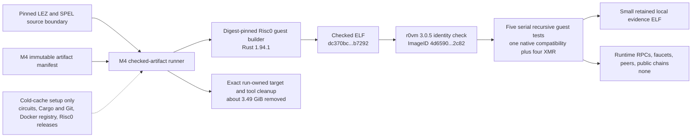

Two fresh executions each reproduced ELF SHA-256
`dc370bc34b432317730c51b49342760dbc675fca700e300b30b5fadefe5b7292`
and ImageID
`4d6590332948743c2db88a183755815354ef92560550cd206ac27bddeea12c82`,
then passed all five recursive cases. No sequencer, indexer, Monero daemon,
wallet RPC, faucet, peer, or public endpoint participates after setup. Cold
caches may fetch the pinned circuits archive, Cargo/Git sources, digest-pinned
builder image, and Risc0 tools; network availability and rate limits can make
that setup flaky. This is a checked local artifact, not a deployment or a swap.

## M4 integration component and RPC status

Solid green-labelled components have executable source gates. Dotted edges are
the remaining local-PoC composition; no public endpoint, faucet, peer, or public
fund participates. Every actor-facing bridge and wallet port will be a unique
dynamic literal-loopback publication owned by one run.

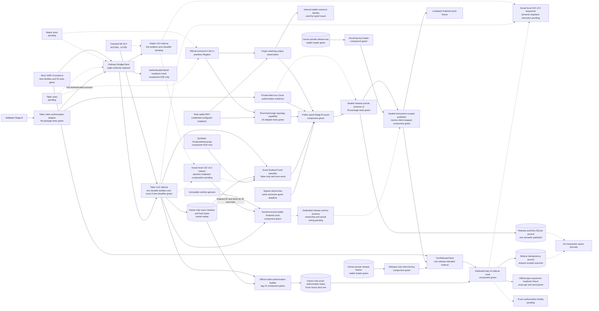

The Monero observation is non-cloneable but is not itself claim-partial
authority. It retains the exact daemon and wallet origins. A separate
private-field, non-`Clone` local-Regtest capability binds the run, chain, daemon,
target-wallet, and foreign-wallet origins; it requires correct-target and
foreign Digest authentication, exact foreign-credential HTTP 401 at the target,
bounded typed peerless/offline facts, and typed genesis. The Taker actor must
consume both values durably against exact Stage B.

The `lez-xmr-release-authority` component is deliberately not yet connected to
an actor, dedicated process, or production RPC. Its public typed issuer consumes
opaque finalized Fund, prepared authorization, Monero-output, and topology
capabilities before the private release plan feeds a sealed publisher. The
issuer derives the exact `[finalized Fund time, signed refund time)` interval.
The wrapper authenticates the snapshot, exact-checks typed binding and client
before clock/CAS, samples finalized time twice, decrypts only after the winning
CAS and decisive clock, and calls `XmrReleaseClient` once.

One authenticated-loopback integration within the 35-test suite proves
zero-call client-mismatch rejection, one admitted dedicated submission, and
zero-call observe-only restart through a fresh store and client. This is sealed
journal-to-client composition, but the clock and sidecar are loopback fixtures,
not the official actual-local indexer or sequencer.

The separate official finalized-clock primitive and dedicated sidecar route are
component-green. The clock binds official indexer genesis and an unchanged tip;
the route reloads the durable tag-14 reservation, persists unknown before node
I/O, calls official lookup/send types, and requires the canonical returned ID.
The generic sidecar route remains closed. Process ownership, actual clock/route
wiring, actor isolation, and authorization finality remain pending.

The release-authority SQLite journal grants one semantic publisher, while the
sidecar idempotency journal grants at most one attempt for one RPC request ID.
No transaction spans them. The PoC deployment therefore still needs one
dedicated release-service process and capability owner that reconciles both
stores conservatively and keeps signed authorization bytes and the release
bearer away from actors. Actual-local Fund evidence, clock/route wiring,
actual-sequencer execution, authorization finality, and definitive-absence
handling remain. Admission is not finality. The one-host private-directory,
no-clone/no-rollback, and same-UID threat-model limits remain until production
hardening and a monotonic rollback anchor.

The LEZ sidecars expose eight authenticated ordinary v3 routes. The Taker
`prepare_native_xmr_escrow_v3` route checks the generated v0.2 ABI, exact
PDAs/accounts/terms/signers, and consecutive nonces, then atomically owner-only
persists both exact signed transaction byte strings before return. Same-request
replay survives a fresh planner/server byte-identically with zero nonce reads.
The same ordinary client prepares tag 14 only after the sidecar recomputes the
NUL-terminated commitment, revalidates the durable Fund, derives nonce
`Fund + 1` without a nonce RPC, and persists the exact authorization.
Fresh-server restore is Fund-before-authorization and byte-identical. Cached
responses revalidate the planner file; missing/corrupt state, drift, mutation,
and overflow fail closed. Generic submit rejects tag 14 with zero sends.

The ninth method is exposed only by `XmrReleaseClient`. Its dedicated sidecar
route revalidates the durable authorization on every Linux call and writes an
unknown sidecar-journal outcome before exact lookup/send. The official-type
loopback fixture decodes the canonical transaction, returns its exact hash, and
observes one send; same-request replay returns the stored result with no second
send. A fresh request after planner-file deletion fails before node I/O. The
fixture is not an actual sequencer and this route is not wired to the release
journal or an actor. The other five builders and
non-Fund/discovery classification return typed `Unavailable`. The exact-Fund
route is now a Taker-only read boundary: it matches the durable reservation
before indexer access, authenticates one canonical finalized transaction plus
metadata/custody, re-pins the candidate, tip, and window end, returns missing
as `Uncertain` rather than `Absent`, and preserves typed
finality/history/moving/conflicting results. Its focused E2E uses a synthetic
`FinalizedIndexerApi` and makes zero sends; the complete sidecar suite passes
142 of 142 with strict Clippy and warning-free Rustdoc. The concrete main-process adapter separately
mints a private-field non-`Clone` Stage-B claim-authorization capability only
for the Taker. It re-derives and compares Stage B, verifies the committed partial
and signed channel/genesis/runtime before wire, and relies on exact client
run/role/runtime binding. Success makes one authenticated mock call; all pre-wire
drift makes zero; response context, terms, or empty-byte drift makes one then
fails closed. All 94 adapter tests, 3 authenticated cases, 2 doctests, and strict
gates pass. ADR 0063 supplies the separate official ABI-validating builder, but
neither the adapter nor builder is journal or submission authority. ADR 0067
supplies a separate submission component only. Actual-local-indexer execution,
release-service clock/route wiring, actual-sequencer publication, finality, and
actor effects remain; this is not a functional claim PoC.

## M2 SDK/reference-demo target topology

This is the accepted M2 demo boundary. It is independent of the M5 production
daemon/CLI/Delivery/Chat delivery below. ADR 0022 records why the LEZ adapter is
a process boundary rather than another dependency in the reference actor.

The Zcash workspace graph pins `crypto-common = 0.2.0-rc.1`. The official LEZ
v0.1.2 graph reaches `chacha20 0.10` and `cipher 0.5.1`, which require stable
`crypto-common ^0.2`; Cargo cannot resolve those constraints in one graph. The
integration must not weaken or patch either cryptographic pin, and must not copy
official LEZ wire or RPC types into the Zcash workspace. A separately built,
exactly locked LEZ sidecar owns those official types. Its typed local bridge is
a bounded serde-only adapter protocol carrying primitive requests and facts; it
is not the official LEZ JSON-RPC protocol and cannot assert canonicality.
The final ADR-0023 corridor selects a separately locked v0.2 official-wire
sidecar and full local v0.2 Bedrock/indexer/non-standalone-sequencer stack. The
implemented v0.1.2 sidecar/node remain lower compatibility evidence, not the
final portability proof.

```mermaid
flowchart LR
    Mailbox["Test-only pre-lock agreement mailbox"]
    Zebra["Primary Zebra Regtest JSON-RPC"]
    ZebraFork["Temporary fork Zebra"]
    Bedrock["Bedrock node HTTP 18080<br/>digest-pinned; service GREEN"]
    LezIndexer["LEZ v0.2 indexer RPC 8779<br/>finalized ID and hash GREEN"]
    LezNode["Non-standalone sequencer RPC 3040<br/>signed channel and Borsh block GREEN"]
    LezV02Runner["Host orchestrator<br/>exact-ID lifecycle and RPC probes"]
    LezNetwork["Unique no-masquerade bridge<br/>dynamic loopback publications"]
    LezState[(".e2e/run_id/lez-v02")]
    LezReady[("Services + finalized Vault Claims + canonical deploy GREEN<br/>ProgramId 5cf8c5...29c1")]
    MakerNative["Maker native PoC CLI<br/>initialize + fund GREEN"]
    TakerNative["Taker native PoC CLI<br/>revealing claim GREEN"]
    LezNative[("Native lifecycle GREEN<br/>finalized blocks 219 220 223")]
    ActorProvisioner["zec-local-poc-provision GREEN<br/>stable Zebra query + private pair output"]
    FixtureReady[("Fixture readiness GREEN<br/>isolated configs; saved window stale")]
    LezFull[("Canonical ZEC corridor directions GREEN<br/>forward and reverse certification runs")]
    LezRunner["Direction-aware development runner<br/>2 of 2 happy directions GREEN"]
    EndpointLock[("Endpoint tuple advisory flock<br/>sequencer + indexer + Zebra URLs")]
    CanonicalBuilder["Pinned Risc0 Docker guest-builder<br/>Rust 1.94.1 + immutable digest"]
    CanonicalArtifact["ELF c85055...9d2e<br/>ProgramId 5cf8c5...29c1"]
    CanonicalDeploy["Finalized deployment<br/>tx bd1680...733f / block 2582"]

    subgraph MakerProcess["Role-fixed maker reference actor process"]
        MakerSdk["LEZ/ZEC swap SDK and agreement validators"]
        MakerState[("Maker-only schema-v10 state")]
        MakerConfig["Schema-v3 maker config"]
        MakerStatus["Offline status material"]
        MakerBridge["Typed local LEZ bridge client"]
        MakerZebra["In-process typed Zebra adapter"]
    end

    subgraph MakerSidecarProcess["Run-scoped maker LEZ sidecar process"]
        MakerCapability["lez-v02-bridge-poc<br/>canonical forward and reverse GREEN"]
        MakerOfficial["Prepare + observe + claim + submit<br/>source GREEN"]
        MakerEffect[("Role/run/runtime request store<br/>PREPARE + submit durability GREEN")]
    end

    subgraph TakerProcess["Role-fixed taker reference actor process"]
        TakerSdk["LEZ/ZEC swap SDK and agreement validators"]
        TakerState[("Taker-only schema-v10 state")]
        TakerConfig["Schema-v3 taker config"]
        TakerStatus["Offline status material"]
        TakerBridge["Typed local LEZ bridge client"]
        TakerZebra["In-process typed Zebra adapter"]
    end

    subgraph TakerSidecarProcess["Run-scoped taker LEZ sidecar process"]
        TakerCapability["lez-v02-bridge-poc<br/>canonical forward and reverse GREEN"]
        TakerOfficial["Prepare + observe + claim + submit<br/>source GREEN"]
        TakerEffect[("Role/run/runtime request store<br/>PREPARE + submit durability GREEN")]
    end

    Mailbox -.->|"Bounded dual-signed terms before first lock"| MakerSdk
    Mailbox -.->|"Bounded dual-signed terms before first lock"| TakerSdk
    MakerSdk --> MakerState
    TakerSdk --> TakerState
    MakerConfig --> MakerStatus
    TakerConfig --> TakerStatus
    MakerConfig -->|"Fresh private inputs; live activate and drive"| MakerSdk
    TakerConfig -->|"Fresh private inputs; live activate and drive"| TakerSdk
    MakerStatus -->|"Existing-only hardened open; no RPC"| MakerState
    TakerStatus -->|"Existing-only hardened open; no RPC"| TakerState
    MakerSdk -->|"Live primitive requests"| MakerBridge
    TakerSdk -->|"Live primitive requests"| TakerBridge
    MakerBridge <-->|"Bounded serde-only local protocol"| MakerCapability
    TakerBridge <-->|"Bounded serde-only local protocol"| TakerCapability
    MakerCapability --> MakerOfficial
    TakerCapability --> TakerOfficial
    MakerOfficial --> MakerEffect
    TakerOfficial --> TakerEffect
    MakerEffect -->|"Reveal forward; initialize and fund reverse"| LezNode
    TakerEffect -->|"Initialize and fund forward; reveal reverse"| LezNode
    MakerCapability -->|"Non-genesis finalized-tip readiness"| LezIndexer
    TakerCapability -->|"Non-genesis finalized-tip readiness"| LezIndexer
    MakerNative -->|"official JSON-RPC; maker key file"| LezNode
    TakerNative -->|"official JSON-RPC; taker key + preimage files"| LezNode
    LezV02Runner -->|"Start first; cryptarchia and channel HTTP"| Bedrock
    LezV02Runner -->|"Start after channel; finalized ID and hash RPC"| LezIndexer
    LezV02Runner -->|"Start after exact missing proof; service RPC"| LezNode
    LezV02Runner -.-> LezNetwork
    LezV02Runner -.-> LezState
    LezNetwork --> Bedrock
    LezNetwork --> LezIndexer
    LezNetwork --> LezNode
    LezNode -->|"Zone SDK signed publish"| Bedrock
    LezIndexer -->|"Poll finalized LEZ channel"| Bedrock
    CanonicalBuilder --> CanonicalArtifact
    CanonicalArtifact -->|"ProgramDeployment through official RPC types"| LezNode
    LezIndexer -->|"prove transaction in finalized block"| CanonicalDeploy
    CanonicalArtifact --> CanonicalDeploy
    CanonicalDeploy --> LezReady
    LezV02Runner -->|"Write run-scoped evidence"| LezReady
    MakerNative --> LezNative
    TakerNative --> LezNative
    LezReady --> LezNative
    LezReady -->|"runtime facts"| ActorProvisioner
    ActorProvisioner -->|"stable mature candidate query"| Zebra
    ActorProvisioner --> FixtureReady
    FixtureReady -->|"owner-private configs"| MakerConfig
    FixtureReady -->|"owner-private configs"| TakerConfig
    LezNative --> LezRunner
    FixtureReady --> LezRunner
    LezRunner -->|"Both independent actor corridors Completed"| LezFull
    LezRunner -->|"Acquire before provisioning effects"| EndpointLock
    EndpointLock -.->|"Guard exact local tuple"| LezNode
    EndpointLock -.->|"Guard exact local tuple"| LezIndexer
    EndpointLock -.->|"Guard exact local tuple"| Zebra
    LezRunner -->|"Maker-only endpoint and key files"| MakerCapability
    LezRunner -->|"Taker-only endpoint and key files"| TakerCapability
    MakerSdk -.->|"Typed requests and validated snapshots"| MakerZebra
    TakerSdk -.->|"Typed requests and validated snapshots"| TakerZebra
    MakerZebra -->|"Fund forward; follow-up claim reverse"| Zebra
    TakerZebra -->|"Follow-up claim forward; fund reverse"| Zebra
    ZebraFork -.->|"Explicit reorg relay in fault tests"| Zebra
    MakerCapability -.->|"Primitive facts only"| MakerBridge
    TakerCapability -.->|"Primitive facts only"| TakerBridge
    Mailbox -.->|"Destroyed after immutable terms persist"| MakerSdk
    Mailbox -.->|"Destroyed after immutable terms persist"| TakerSdk

    classDef planned stroke-dasharray: 5 5,fill:#fff7e6,stroke:#9a6700;
    classDef implemented fill:#ddf4ff,stroke:#0969da;
    classDef running fill:#e6ffec,stroke:#1a7f37;
    class CanonicalBuilder,CanonicalArtifact,CanonicalDeploy,Bedrock,LezIndexer,LezNode,LezV02Runner,LezNetwork,LezState,LezReady,MakerNative,TakerNative,LezNative,ActorProvisioner,FixtureReady,Zebra,MakerConfig,TakerConfig,MakerCapability,MakerOfficial,MakerEffect,TakerCapability,TakerOfficial,TakerEffect,LezRunner,EndpointLock,LezFull,MakerSdk,MakerBridge,MakerZebra,TakerSdk,TakerBridge,TakerZebra running;
    class Mailbox,ZebraFork planned;
```

Each actor and each actor-owned sidecar has a distinct PID. Actor state, claim
keys, LEZ signing keys, sidecar capabilities, and nonce leases are owner-local;
the maker and taker persist the agreement separately. The reference runner owns
the sidecar listener, selects an ephemeral loopback port and high-entropy
capability, binds every call to its `RUN_ID`, and cleans only its own processes
and resources. The actor never sends official LEZ RPC through the local bridge:
only the separately locked sidecar constructs, signs, decodes, and calls the
official LEZ protocol. The in-process Zebra adapter calls Zebra directly and
delegates agreement/consensus validation to the SDK.

Each role's schema-v3 file fixes the exact signed-agreement SHA-256, complete
sidecar and Zebra runtime identities, finite discovery/candidate bounds, and
isolated state, journal, capability, signer, claim, and optional preimage paths.
Paired validation requires one preimage owner and one Zcash funder, identical
agreement/runtime/Zebra terms, distinct sidecars and signers, and no path
aliases. Offline `status` deliberately loads only claim-recovery material and
the role-store location: it requires no sidecar/Zebra credential and opens no
chain port. It returns `not_activated` without creating a missing database; for
existing state it uses the hardened existing-only SQLite opener and
`resume_all_capable` with unit LEZ and Zcash port types. Its versioned output is
secret-free. `activate` and `drive` now compose the SDK, role bridges, and Zebra
port in the development runner. Run `m2poc-vertical-20260714a` proves that the
provisioner can
query the live retained Zebra, select one stable mature maker UTXO, create the
dual-signed agreement, write separate private role trees, reload both configs
and activation-material sets, and pass pair isolation. The configured sidecar
URLs were not bound or called, and neither actor process executed a lifecycle
effect. Its saved window 1..256 is stale at later tip 389 and is never reused by
the development runner, which prebuilds, provisions at a fresh tip, starts
explicit run-port bridges, mines only after Zcash effects, and enforces a
monotonic 49-second cap against the 60-second LEZ delay. Before provisioning
effects it acquires a nonblocking advisory `flock` keyed by the exact LEZ
sequencer/indexer and Zebra endpoint tuple. A different tuple can proceed; a
runner using the same tuple fails closed without touching the node processes or
unrelated Docker resources.

Historical runs 14d through 14n retain partial and failure evidence. Historical
pre-canonical run 14o completed `TakerSellsLez` in 25.370 seconds: the taker deposited LEZ, the
maker funded Zcash and claimed LEZ after two confirmations, and the taker spent
the revealed Zcash path. Both actors reached revision 4 `Completed`; one
bounded `moving_tip` retry succeeded. LEZ effects finalized in blocks
264/265/266, and the Zcash height-108 claim spent the height-106 funding output.
Historical pre-canonical reverse run 14c completed `TakerSellsForeign` in 26.960 seconds without a
drive retry: the taker funded Zcash, the maker deposited LEZ, the taker claimed
LEZ, and the maker spent Zcash. LEZ effects finalized in blocks 641/642/643,
and the Zcash height-115 claim spent the height-113 funding output. Both actor
processes and role stores again reached revision 4 `Completed`. Those successful
runs used host-built ProgramId `f8385049...0fbe` and remain immutable
historical evidence rather than current deployment authority.

The canonical Docker artifact has ELF `c85055f6...9d2e` and ProgramId
`5cf8c5a4...29c1`. It was deployed in transaction `bd16808e...733f`, proved
Finalized in block 2582, and then exercised by
`m2cert-canonical-forward-bb53daf-20260714a` and
`m2cert-canonical-reverse-bb53daf-20260714a`. Both actor pairs reached revision
4 `Completed`; the forward run took 25.580 seconds with two bounded retries and
the reverse took 28.790 seconds without a retry. The common live
guard requires confirmed Zcash funding before the LEZ revealing claim and the
LEZ reveal before the Zcash follow-up spend. Both required happy directions
have separate indexer-finality and Zebra transaction evidence. The dormant
public-route configuration contract is GREEN without public I/O. Restart,
refund, reorg, live-public behavior, chaos, and production hardening remain open.

The local mailbox is explicitly a test adapter, not Logos Delivery or Chat.
Once terms persist and the first lock is submitted, it is destroyed; both actors
must complete or refund using only their own state and selected chain nodes.

## M5 production application target topology

```mermaid
flowchart LR
    Maker["Maker operator"]
    Taker["Taker user"]

    subgraph MakerBoundary["Maker-owned boundary"]
        MakerCLI["Maker CLI"]
        Core["Optional Logos Core lifecycle adapter"]
        MakerDaemon["Maker daemon plus ZEC watcher"]
        MakerStore[("SQLite aggregate, journal, binding, alert outbox")]
        MakerZebra["Schema-v3 maker Zebra route"]
        MakerLezBridge["Loopback capability LEZ adapter"]
        MakerLezSidecar["Official-wire LEZ sidecar"]
        MakerLez["Typed outbound LEZ profile"]
    end

    subgraph TakerBoundary["Taker-owned boundary"]
        TakerCLI["Taker CLI or SDK"]
        TakerState[("Taker recovery state")]
        TakerZebra["Schema-v3 taker Zebra route"]
        TakerLezBridge["Loopback capability LEZ adapter"]
        TakerLezSidecar["Official-wire LEZ sidecar"]
        TakerLez["Typed outbound LEZ profile"]
    end

    Delivery["Offer discovery"]
    Chat["Signed negotiation channel"]
    RouteGate["Validate signed agreement, runtime,<br/>route, identity, and credentials"]

    subgraph RouteTargets["Typed route targets"]
        LocalLez["Local loopback sequencer + indexer"]
        PublicLez["Exact official LEZ HTTPS"]
        PublicLezRisk["Finalized-tip method unknown"]
        LocalZebra["Deterministic Zebra Regtest"]
        SelfHostedZebra["Self-hosted loopback Zebra + cookie"]
        TatumZebra["Exact Tatum HTTPS + x-api-key"]
    end

    Maker --> MakerCLI
    MakerCLI -.->|"Owner-local authenticated control RPC"| MakerDaemon
    Core -.->|"start, endpoint, health, stop"| MakerDaemon
    MakerDaemon --> MakerStore
    MakerDaemon -->|"Typed Zebra JSON-RPC"| MakerZebra
    MakerDaemon -->|"Bounded local adapter protocol"| MakerLezBridge
    MakerLezBridge -->|"Loopback + run/role capability"| MakerLezSidecar
    MakerLezSidecar --> MakerLez
    Taker --> TakerCLI
    TakerCLI --> TakerState
    TakerCLI -->|"Typed Zebra JSON-RPC"| TakerZebra
    TakerCLI -->|"Bounded local adapter protocol"| TakerLezBridge
    TakerLezBridge -->|"Loopback + run/role capability"| TakerLezSidecar
    TakerLezSidecar --> TakerLez
    MakerDaemon -.->|"Authenticated expiring offers only"| Delivery
    TakerCLI -.->|"Offer queries only"| Delivery
    MakerDaemon -.->|"Both-role signed terms before first lock"| Chat
    TakerCLI -.->|"Both-role signed terms before first lock"| Chat
    Chat --> RouteGate
    RouteGate --> MakerDaemon
    RouteGate --> TakerCLI
    MakerLez -->|"local"| LocalLez
    TakerLez -->|"local"| LocalLez
    MakerLez -.->|"official_public"| PublicLez
    TakerLez -.->|"official_public"| PublicLez
    PublicLez -.-> PublicLezRisk
    MakerZebra -->|"deterministic_local"| LocalZebra
    TakerZebra -->|"deterministic_local"| LocalZebra
    MakerZebra -.->|"self_hosted_cookie"| SelfHostedZebra
    TakerZebra -.->|"self_hosted_cookie"| SelfHostedZebra
    MakerZebra -.->|"tatum_testnet_x_api_key"| TatumZebra
    TakerZebra -.->|"tatum_testnet_x_api_key"| TatumZebra

    classDef planned stroke-dasharray: 5 5,fill:#fff7e6,stroke:#9a6700;
    classDef implemented fill:#ddf4ff,stroke:#0969da;
    class MakerCLI,Core,MakerDaemon,TakerCLI,TakerState,Delivery,Chat,PublicLezRisk planned;
    class MakerZebra,MakerLezBridge,MakerLezSidecar,MakerLez,TakerZebra,TakerLezBridge,TakerLezSidecar,TakerLez,RouteGate,LocalLez,PublicLez,LocalZebra,SelfHostedZebra,TatumZebra implemented;
```

Delivery and Chat are negotiation transports, never sources of chain truth or
secrets. After the first lock, each actor must recover using only its own durable
state and selected chain nodes. Logos Core is optional lifecycle/presentation;
it never opens SQLite or becomes protocol authority. Blue route targets denote
implemented configuration and bounded-client construction, not successful live
connections. Only the local targets have execution evidence. The dashed public
edges still require endpoint/authentication smoke, funding/deployment, identity
revalidation, propagation, and finality evidence before release.

## RPC and local-resource inventory

| Component | Status | Transport and bind | Authentication / authority | Methods exercised or required | Lifecycle and isolation |
|---|---|---|---|---|---|
| M4 checked LEZ guest artifact | Local build/identity and recursive branch execution GREEN twice | Digest-pinned Docker guest builder during cold/fresh build; checked execution opens no socket or RPC | Manifest pins source files, historical M2/M3 boundaries, Risc0 3.0.5/Rust 1.94.1, builder digest, ELF SHA-256 `dc370bc...b7292`, and ImageID `4d6590...2c82` | Fresh methods embedding; exact ELF/ImageID verification; one native aggregate-witness compatibility test plus four XMR initialize/fund/claim, signed-refund, punishment, negative, and rollback tests | Both fresh runs passed 5 of 5. Runtime resources are `[]`; cold setup may use GitHub, Cargo/Git, Docker, and Risc0 endpoints. Default exact cleanup retained the small evidence ELF and removed about 3.49 GiB. No local/public deployment or actor execution is claimed |
| M4 ordinary strict v3 bridge client | The ordinary `BridgeClient` retains all eight actor/observer methods; its prior 51-target evidence remains, and the package passes 53 targets including the separate release surface | Capability-bearing literal-loopback HTTP, exact run and role headers, one attempt, finite timeout, bounded response body, no redirect/proxy/retry | Dedicated Maker/Taker runtime, signer, ProgramId, terms, request context, and role matrix are checked before transport. Invalid local bindings make zero calls | Prepare/complete claim and refund; prepare punishment, escrow, and claim authorization; classify finalized effect. Exact context/terms/effect/target/window echoes and coverage are required | No dedicated tag-14 submit method is exposed here. Client-only tests do not claim actor completion or node publication |
| M4 release-intended type-narrowed client and dedicated tag-14 sidecar route | `XmrReleaseClient` exposes only the ninth strict method; protocol 52 tests, client package 53 targets, and the focused authenticated sidecar routes pass | Taker-only capability-bearing literal-loopback RPC to the real sidecar route; official `getTransaction` and `sendTransaction` types terminate at official-type loopback fixtures | Exact run/runtime/terms/prepared ID and bytes; every Linux call reloads the durable tag-14 reservation; sidecar journal stores unknown before node I/O; returned ID must equal the canonical transaction hash | Generic submit rejects tag 14 with zero sends; Accepted sends once; exact AlreadyKnown performs one lookup and zero sends; wrong official ID becomes Unknown and replay stays one lookup/one send; missing durable state fails before node I/O | Type narrowing is not bearer isolation. Dedicated service ownership, server/planner restart proof, actual sequencer, authorization finality, and cross-journal reconciliation are pending. Lookup transport failure is Unavailable; admission is not finality; no transaction spans the journals |
| M4 typed Stage-B claim authorization | Private-field non-`Clone` `PreparedXmrClaimAuthorizationEvidenceV3` adapter component-GREEN; package 94 of 94, authenticated matrix 3 of 3, doctests 2 of 2, and strict gates pass | One authenticated literal-loopback mock request after Taker-only preflight; no node, chain RPC, or external resource | Only `LezBridgeAdapter<BridgeClient>` can mint evidence. It re-derives exact Stage B, verifies the committed partial before wire, and binds signed channel/genesis/runtime plus client run/role/runtime | Prepare native-XMR claim authorization through the strict v3 client with exact response context and terms | ADR 0063 supplies the official builder; ADR 0065 consumes the capability into the sealed journal. This adapter row still does not claim submission, node effect, or a claim PoC |
| M4 official Stage-B builder, native-XMR escrow preparation, and exact-Fund classifier | Two of seven builders and the exact durable-Fund classifier are component-GREEN; complete sidecar suite 142 of 142; genesis-bound stable finalized clock component-GREEN plus strict Clippy/Rustdoc and dependency policy | Capability-authenticated literal-loopback v3 routes; one nonce read prepares Initialize/Fund; authorization derives Fund-plus-one with no read; classifier uses a trait-backed finalized indexer after ownership validation; the clock uses official finalized ID and block-by-ID/hash with exact runtime genesis; builder/classifier paths make zero submission calls | Taker runtime, exact terms/deployment/accounts/signers, generated tags 13/14, canonical bytes/IDs, commitment, durable prerequisites, nonce continuity, request identity, and fresh/cached replay are revalidated | Persist exact Initialize/Fund then exact claim authorization before exposure; classify canonical finalized exact Fund with metadata/custody and stability re-pins | Focused tests use synthetic indexer/local mocks and zero external-chain resources. Clock tests reject wrong genesis and a moving tip; bridge readiness consumes the primitive. Five other builders and non-Fund/discovery classification remain `Unavailable`. No actual local-devnet classifier run, chain mutation, journal authority, claim PoC, or actor completion is claimed |
| M4 Monero output observation adapter | Exact receipt observation component-GREEN in 7 of 7 focused tests; public release-issuer composition GREEN in the 35-test authority suite | Typed `monero-rpc` 0.5.1 to distinct credential-configured literal-loopback daemon and wallet origins; fixed 30-second request timeout; public/DNS RPC rejected | Exact network/genesis, standard shared address, transaction, amount, wallet-reported availability, canonical decoded-block membership, at least ten confirmations, and stable tip. The result is private-field and non-cloneable, but is not Stage-B or durable-consumption authority by itself | Typed height-zero hash, bracketed last headers, wallet transfer/available outputs, daemon transaction, containing header/block. Selected decoded collections are bounded | The public integration cross-binds it to the run-bound topology capability, consumes it once against Stage B, and journals it before publication. Actor composition remains pending. View-only spent status, upstream pre-decode bounds, discarded header trust flags, and malformed-block panic behavior remain explicit residuals. Peerless Regtest observation is supported; Stagenet/production hardening is pending |
| M4 local Monero topology attestation | Run/chain/origin/auth capability component-GREEN; total adapter suite 16 of 16 plus strict Clippy/Rustdoc/format/diff; public release-issuer composition GREEN | Three distinct credential-configured literal-loopback origins; fixed timeout; project-owned `get_info`/`get_connections` response bodies are streamed with a 64 KiB cap | Private-field and non-`Clone`; correct target and foreign origins authenticate with their own Digest credentials, while replaying the foreign credential against the target must finish exact HTTP 401. Capability cross-binds exact run, Regtest chain, daemon origin, and target wallet origin to the output observation | Typed `get_info`, `get_connections`, both wallets `get_version`, and height-zero genesis. Requires fakechain, offline, `untrusted == false`, zero incoming/outgoing counts, empty connections, and matching genesis | Closes the earlier topology-auth residual for the isolated local Regtest PoC only. `monero-rpc` 0.5.1 lacks the two topology calls, so the narrow bounded adapter is project-owned and needs production/upstream review. No public/Stagenet trust, node publication, or claim PoC is claimed |
| M4 sealed XMR release journal | Public opaque-evidence issuer plus sealed narrow-client publisher component-GREEN in 35 of 35 tests; no live node authority | No production RPC or listener. The integration uses authenticated literal-loopback capability factories and one local mode-`0600` SQLite file under a dedicated-UID mode-`0700` directory; the proof uses a loopback clock and dedicated sidecar; the official clock and actual node are not process-wired | Raw release plan, byte-bearing transport, and decrypted authorization stay private. The public issuer consumes Fund, authorization, Monero-output, and topology capabilities, derives the exact ID, bytes, commitments, and `[finalized Fund time, signed refund time)` interval. XChaCha20-Poly1305, domain-separated HMACs, exact binary IDs, authenticated expected publication ID, and schema-v3 constraints protect one local journal | Stable resource and later-tip observation; client mismatch makes zero clock/RPC calls; exact binding takes two finalized samples, one prepared-to-started CAS, one dedicated RPC, matching-ID admission, and zero-call observe-only restart; ambiguity and known-no-send remain terminal | Assumes one trusted host/process boundary, one canonical journal, no clone/backup/restore/rollback, and no hostile same-UID WAL/SHM race. Tests prove neither live replay prevention nor a claim PoC. Release-service ownership of preparation/key/journal/bearer plus actual genesis-bound clock and node wiring, finalized classification, definitive absence, dedicated release-service isolation, cancellation-after-CAS hardening, and an external rollback anchor remain |
| Canonical v0.2 guest and deployment | Docker build, exact artifact verification, and private local on-chain deployment GREEN | Guest build runs in pinned Risc0 builder; deployment uses the explicit loopback sequencer and is finalized through the explicit loopback indexer | Immutable builder digest, ELF SHA-256 `c85055...9d2e`, ImageID and ProgramId `5cf8c5...29c1`, source commits, channel, and genesis are fail-closed inputs | Supported Risc0 Docker embed; exact manifest/ELF/ImageID verification; official-type `ProgramDeployment`; sequencer transaction lookup; indexer block-by-ID/hash finality | Deployment tx `bd1680...733f` is Finalized in block 2582, hash `d2c494...6860`. Historical host-built ProgramId `f83850...0fbe` is evidence-only and rejected for current admission |
| Full local LEZ v0.2 devnet | Services, both Vault Claims, canonical deployment, native lifecycle, and both canonical corridor directions GREEN | Unique no-masquerade bridge: Bedrock HTTP `bedrock:18080`, sequencer JSON-RPC `sequencer:3040`, indexer JSON-RPC `indexer:8779`; retained proof host publications were `127.0.0.1:32831/32832/32833` | Local RPCs are unauthenticated and limited to loopback and the run bridge. Actor signatures authorize Vault and escrow effects; the accredited channel authorizes publication to Bedrock | Bedrock cryptarchia/channel reads; sequencer health/channel/program/block/transaction/account/nonce and submission; indexer finalized tip, transaction, block-by-ID/hash, and account-at-block | Canonical deployment finalized in block 2582. Forward escrow initialize/fund/claim finalized in 2594/2595/2596; reverse finalized in 2605/2606/2607; both actor pairs ended revision 4 `Completed`. Restart, refund, reorg, and composed cleanup remain later hardening |
| Official-wire LEZ v0.2 native PoC CLIs | Library gate plus actual-node `lez-v02-vault-claim-poc` and role-separated native `deposit`/`claim`/`observe` GREEN | PoC CLIs call the official sequencer at a dynamic literal-loopback URL | Maker and taker use separate key files and owner-only state directories; only the direction-derived Zcash funder and LEZ claimant receives the preimage. Exact official types bind runtime, role, signer, channel, program, terms, and accounts. Secrets are file inputs, never argv/evidence | Vault Claim submission; native initialize/fund/revealing claim; canonical sequencer inclusion and stable same-tip account reads. Separate sequential indexer calls proved finality; CLI output itself does not | Forty-two existing integration tests plus format/Clippy/rustdoc/dependency gates pass. Exact signed bytes and observe-before-submit are GREEN, but native output reports `crash_atomic_submission=false`; integrated finality/journal reconciliation remains later work |
| Exact v0.2 PoC role bridge | Both role processes completed the full method sequence in canonical forward and reverse runs; dormant exact-public construction is GREEN | Actor-facing listener is explicit nonzero loopback. Sidecar outbound `local` accepts explicit loopback sequencer/indexer URLs; `official_public` accepts only `https://testnet.lez.logos.co/` for both | File-backed capability and private key; bearer, run, role, runtime, signer, canonical program, and private state are bound before JSON parsing | Describe, native prepare, escrow observe, revealing-claim prepare/observe, and exact submit; startup requires an unchanged finalized indexer tip bound to the configured runtime genesis by exact ID/hash reads; sequencer facts are checked on operation paths, not cross-bound at startup | Both canonical runs used only ProgramId `5cf8c5...29c1`. No public call was made; official-origin finalized-tip availability and actual-node refund remain open |
| Local reference-actor fixture provisioner | Direction-aware private pairs provisioned and reloadable; retained successful pairs are evidence, not reusable fixtures | Reads retained Zebra at dynamic loopback and emits distinct configured sidecar URLs; runner binds fresh role bridges | Separate `0700` roots and `0600` files; distinct recovery keys, capabilities, signers, stores, and journals. Only the direction-derived Zcash funder receives the preimage candidate | Validates Regtest identity and stable mature UTXO; emits and reloads configs and activation material; validates pair isolation | The old window 1..256 is never reused. Both canonical runs provisioned fresh inputs and bound only ProgramId `5cf8c5...29c1`; new effect-bearing runs require fresh funds or explicit owner recovery |
| Reference actor configuration, status, activate, and drive | Unix schema-v3 configuration, paired-role validation, offline recovery, both canonical local directions, and dormant Zebra route contracts GREEN | Bridge endpoint remains explicit loopback. Zebra route is deterministic local loopback, self-hosted loopback with cookie, or exact Tatum Testnet HTTPS with `x-api-key` | Agreement, run, swap, role, runtime, network, branch, genesis, route, canonical ProgramId, separate capability/signer/state/claim/Zcash keys, and owner-only credentials validate before effects | `status` remains chain-impossible by type. `activate` and `drive` use fresh role-bound bridge and bounded Zebra clients; both canonical runs reached revision 4 `Completed` | Public construction is tested without calls. Self-hosted/Tatum availability, actual-node restart/refund/reorg, and hardening remain open |
| `lez-maker-daemon` | Running prototype | HTTP JSON-RPC; default `127.0.0.1:0`; non-loopback rejected | Bearer token from hidden environment; minimum 24 bytes; header checked before JSON parsing | Actual: `swap_create`, `swap_status`, `swap_alerts`, `swap_alert_acknowledge` | Operator/test-owned process; caller-selected SQLite path; Ctrl-C shutdown |
| `lez-maker` | Running prototype | HTTP client; default `127.0.0.1:9944`; explicit ready URL for ephemeral daemon | Authorization header marked sensitive | Actual CLI: `create-swap`, `status`, `alerts`, `acknowledge-alert` | Independent operator process |
| SQLite | Running | Local file; no RPC or port | Daemon/runtime process filesystem authority; SDK adapter fixes one local role per handle; claim key material is supplied externally and never stored | Aggregate, revision, ZEC journal, immutable binding, alerts, separate lock/claim/refund owner intents, protected claim material, owner/observer claim/refund transitions, and canonical observation transitions | WAL, `FULL` synchronous, foreign keys, immediate transactions; schema-v10 replay retains prior lock/claim journals, rejects inconsistent history, and closes/reopens both directions at revision 4 and `Completed` or `Refunded`. Owner refund commit copies the exact intent, inserts the transition, advances revision once, and deletes pending intent in one immediate transaction; observer rows retain no signing intent. The v8→v9 migration still replaces legacy plaintext claim evidence and scrubs SQLite/WAL remnants; 39 store tests pass; one process mutex remains |
| Adapter-independent SDK core | Running library contract at `ed5cd77` | No socket, RPC, node, Docker, faucet, or public endpoint | Pair crates alone construct validated associated types; discovery and negotiation return untrusted inputs and cannot authorize post-lock effects | `SwapProtocol`, `OfferDiscovery`, `NegotiationChannel`, structured error category/disposition, explicit claim order, protocol/schema versions, and ordered exact-public-effect plans with stable step IDs, expected public IDs, complete bytes, hashes, and a domain-separated plan commitment | Eight invariant tests, two external-consumer API tests, one doctest, strict Clippy, and rustdoc pass. There is no actor, adapter, store, SQLite, or CLI coupling. The concrete BTC facade now layers its public durable lifecycle contract above this core; XMR remains M4 |
| Deterministic LEZ/ZEC SDK lifecycle | Running library/test boundary | No socket, RPC, node, Docker, faucet, or public endpoint; bounded Borsh schema-2 bytes enter from an untrusted negotiation adapter | Fixed maker/taker roles and the signed direction select observations/effects; separate role databases and external claim keys prevent shared claim-recovery authority; refund observers cannot sign | Exact agreement validation, protected activation, both lock directions, LEZ reveal, observer preimage extraction, Zcash follow-up, and fixed LEZ-then-Zcash refund driving with observe-before-rebroadcast and versioned durable records. After signed-wire acceptance, activation and resume require no discovery or negotiation capability. `resume_all_capable` replays lock, claim, and refund records without a chain call for truthful terminal status | 16 KiB agreement and 2,000,000-byte submission caps; 132 SDK checks plus 39 store tests pass, with one actual-Zebra SDK case intentionally ignored outside its isolated runner. Claims and refunds replay through SQLite with forced-rollback, exact-conflict, corruption, future-schema, and terminal full-resume checks. Chain evidence comes from deterministic port doubles, so this row is not an actual-node claim |
| SDK-facing LEZ bridge client and adapter | Twenty-nine-operation client including eleven additive v2 asset calls, signed-agreement adapters, crash-safe context-owning SDK ports, witnessed prepare/complete, distinct finalized funding/claim/refund observers, public prepared-message validation, and M3 actor revisions one through four actual-node GREEN. The F7 main-process adapter binding and schema-5 peer-funding projection are component GREEN | Literal-IP run-owned loopback HTTP; fresh client per attempt; no redirects or proxy settings; finite 120-second actor request timeout | Capability plus exact run/role/runtime/ProgramId and caller-owned request IDs. V2 asset calls bind depositor/claimant/either-participant authority to the countersigned BTC extension and exact local native/token policy before transport. Schema-5 peer projection has no peer-private prepared bytes and no submit surface; its ID binds agreement, asset, run, role, runtime, full terms, fixed target, and window before `DiscoverByTerms`. Runtime chain/program/signer drift and wrong roles are zero-wire | Prepare, complete, submit, current clock and progress observation, finalized funding/claim/refund, plus v2 ordered asset preparation/current observation/claim/refund and four finalized effect classifiers. The public validators check exact prepared bytes, transcript, target, window, stable placement, and response echoes without retries. Only v2 `Found` projects peer funding; the other three classifier states remain pending | The 46-check client and 79-test adapter gates remain GREEN. The actor's 85 tests cover both peer role/direction shapes, request-ID drift, and fail-closed absence/uncertainty/unavailability; strict Clippy and the pre-Docker contract pass. Run R retained the legacy-v1 Taker dispatch RED with exact cleanup. The dispatch fix is actual-node GREEN in four later two-direction pairs; compact evidence for valid transactions above the 64 KiB recovery cap, process-kill/reorg, and production trust remediation remain open |
| Official-wire LEZ sidecar | Native escrow, Maker-lock, claim, and refund paths plus finalized funding/claim/refund observers are actual-node GREEN. F7 official-token planning, all eleven authenticated v2 routes, durable replay, the finalized asset-scanner boundary, and four complete actual-node pairs are GREEN; the requested repeat gate is closed | Actor-facing server is capability-authenticated literal loopback; outbound `local` is uncredentialed loopback HTTP and `official_public` remains exact pinned HTTPS. The actor bridge outer timeout is 120 seconds. Ordinary block/tip RPC uses 10 seconds and maximum concurrency one; the historical-account client uses 90 seconds and maximum concurrency three. Custom-token metadata, definition, and custody use one bounded concurrent join | Capability, run, fixed role, signer, runtime, channel, genesis, program, destination, and M3 aggregate authority are checked independently of transport. F7 additionally rederives Token/ATA programs, definition, all owner/custody ATAs, and exact aggregate authority. Historical default-account absence remains distinct from RPC failure | Native Maker initialization/funding reservations restore exact bytes before bind. F7 produces ordered tag-11 initialize, permissionless tag-7 custody, tag-8 funding, tag-12 aggregate claim, and tag-10 permissionless refund bytes. The server exposes prepare/observe escrow, prepare/complete/observe claim, prepare/observe refund, and four finalized classifiers. A `Found` result reads metadata, definition, and custody at its containing block and then revalidates that immutable finalized block by official indexer ID and hash; a newer unrelated tip is harmless, while a missing or changed candidate fails closed. Bounded absence uses the same rule at the requested-end block | Runs X, Z, AA, and AD completed both F7 directions with four LEZ and two Bitcoin effects, exact balances, zero custody/replay, and scoped cleanup. Run O showed client-side concurrency with effective upstream serialization or queueing; the 90-second local budget accommodates that PoC behavior but is not a production scalability claim. Historical account responses have no cryptographic proof or atomic multi-read snapshot, so containing-block revalidation is authoritative-indexer consistency only. Upstream batch or cached block-identified snapshots, process-kill/reorg behavior, and production readiness remain open |
| M3 official-wallet artifact cache | Implementation, adversarial contract, and clean pushed actual-node integration GREEN | No RPC or Docker service. Owner-only local filesystem root defaults to `/tmp/lez-atomic-swaps-cache-UID/m3-official-wallet-v1`; per-input and per-object `flock` plus atomic no-clobber publication | The current UID is trusted. Policy 2 binds source/origin/archive, lock and metadata, program artifacts, effective Cargo configs, toolchain and target-library tree, build tools, bindgen headers, native libraries, exact recipe, expected wallet, and helper hash. Production rejects test overrides. Invalid refs/objects/runtime fail closed | The persistent object allowlist is exactly mode-`0500` `wallet` and mode-`0600` `manifest.json`. Each run receives a fresh non-hardlinked copy and rehashes source before/after plus destination. No wallet home, key, credential, nonce, actor state, journal, agreement, transaction, node state, port, or evidence is cached | Production-input miss/hit measured 202.42/10.35 seconds, saving 192.07 seconds (94.9%) and about 804 MiB peak RSS. Runs Z and AA retained 10.32/7.81-second production hits on exact pushed commits with unchanged effects, balances, finality, replay, and exact cleanup |
| In-process typed Zebra adapter | Agreement-bound funding/claim/refund composite, role-keyed signer, both canonical local happy directions, and schema-v3 dormant route construction implemented | Direct bounded JSON-RPC: deterministic Regtest loopback; self-hosted Main/Test loopback with cookie; or exact Tatum Testnet HTTPS with sensitive `x-api-key` | Role/key/network/branch/genesis/route, exact candidate commitment, stable tip, transaction policy, canonical bytes, and owner-only credentials are independently checked | Canonical forward run advanced Zebra 121 to 124; canonical reverse advanced 124 to 127, each preserving confirmed funding before LEZ reveal and follow-up spend after reveal | Self-hosted/Tatum calls were not made. Provider smoke, post-lock replacement, actual-node restart/reorg, and hardening remain open |
| Development LEZ plus Zebra corridor runner | Canonical forward completed `TakerSellsLez`; canonical reverse completed `TakerSellsForeign`; 2 of 2 directions | Consumes explicit local sequencer/indexer/Zebra loopback URLs; creates fresh run root and bridge listeners; does not own or remove nodes. Endpoint-tuple `flock` serializes only the same tuple | Distinct maker/taker capabilities, keys, state, journals, funding, and databases; secret-free outputs remain under the private run root | Prebuilds and provisions fresh, applies bounded calls/retries, mines only after a Zcash effect, and enforces confirmed funding then LEZ reveal then Zcash follow-up | Forward `m2cert-canonical-forward-bb53daf-20260714a` completed in 25.580s; reverse `m2cert-canonical-reverse-bb53daf-20260714a` in 28.790s. Cleanup is exact; recovery and hardening remain open |
| Primary Zebra | Running in ignored E2E | Container `0.0.0.0:18232`; ephemeral host `127.0.0.1` mapping | Regtest fixture has no cookie auth; signed transactions and consensus remain authoritative | `getblockcount`, `generate`, `getblockhash`, `getblock`, `getblockheader`, `submitblock`, `getaddressutxos`, `getrawtransaction`, `sendrawtransaction`, `getblockchaininfo` | Unique Compose project and tmpfs state per `RUN_ID` |
| Fork Zebra | Running in ignored E2E | Same container port; distinct ephemeral host-loopback mapping | Same Regtest-only policy | Same RPC set; produces independent higher-work branch | Separate tmpfs state; no initial peer; fixture-controlled block relay |
| LEZ standalone v0.1.2 | Running in ignored E2E | Upstream server `0.0.0.0:0`; client uses `127.0.0.1:<assigned>` | No transport credential; actor signatures authorize transactions | `checkHealth`, `sendTransaction`, `getLastBlockId`, `getTransaction`, `getAccountsNonces`, `getAccount`, `getBlock`, and `getProgramIds` for static built-ins only | In-process handle, temporary state, deterministic genesis actors; not public v0.2 |
| Reusable external LEZ standalone process | Exact schema-v2 process, rejection paths, native/two-definition lifecycle, strict Clippy, and recursive-cost runner previously GREEN; nonempty actor channel focused suite GREEN and exact full rerun pending | Own process; upstream `0.0.0.0:0` server; publishes only the allocated literal `http://127.0.0.1:<port>` client URL | No RPC transport credential; mode-0600 no-clobber readiness is a run-local capability because it contains two actor private keys. Actor signatures remain transaction authority | Preflight tracked manifest/ELF/ImageID before state; start service; `checkHealth`; exact genesis; mandatory block progress; `sendTransaction` deployment; locate the exact hash/variant in `getTransaction` and containing `getBlock`; derive ProgramId from those ELF bytes; use `getProgramIds` only to bind the static authenticated-transfer owner; verify two `getAccount` ownership/balance results; graceful stdin/Ctrl-C shutdown | Initial exact run rejected the false custom-program-list assertion. Corrected schema-v2 source refuses pre-existing home/readiness, creates a fresh mode-0700 home, and binds endpoint, nonempty deterministic channel, genesis ID/hash, ELF SHA-256, ImageID/ProgramId, deployment transaction hash, containing block ID/hash, authenticated-transfer built-in, account IDs, keys, and balances. The earlier exact full runner passed; after correcting the agreement-invalid zero channel, the three-test locked-graph readiness suite passes and the full runner is a pre-corridor gate. No Docker, faucet, public RPC, or fixed port |
| Logos Core adapter | Planned | No transport/port selected beyond the daemon control endpoint | Protected OS credential handle | `start`, `endpoint`, `health`, `stop` | Optional supervisor of the same daemon binary |
| Delivery / Chat | Planned | No protocol, endpoint, or port selected | Authenticated offers and both-role signed transcript | `OfferDiscovery`; `NegotiationChannel` | Untrusted/removable after first lock |
| Production Zebra watcher routes | Schema-v3 self-hosted-cookie and exact-Tatum-`x-api-key` route/config/client construction GREEN; live evidence pending | Zebra 6.0.0 JSON-RPC on operator-owned loopback with cookie auth, or only `https://zcash-testnet-zebrad.gateway.tatum.io/` with a sensitive `x-api-key`; generic HTTPS providers are rejected | Self-hosted: operator owns cookie/node and public peers provide consensus. Tatum operates the public authoritative node/gateway; never substitute generic Zcash RPC or lightwalletd gRPC | Required on both live routes: sync/branch/genesis preflight, stable-tip observation, `gettxout`, raw transaction/mempool/block lookup, broadcast, and reorg reconciliation. Exact method smoke remains required before effects | No live call was made. Self-hosted initial sync/disk/P2P/epoch risk and Tatum provisioning/quota/outage/lag/method-policy/trust risk remain; never switch routes mid-effect or automatically retry an ambiguous broadcast |
| Official LEZ testnet v0.2 node | Exact dormant sidecar route construction GREEN; public deployment/execution evidence pending | Only HTTPS JSON-RPC `https://testnet.lez.logos.co/` is accepted for both outbound sequencer and indexer clients | Public reads and program deployment transaction; rate limits, reset schedule, and indexer-method surface unspecified | Live gate requires `checkHealth`, `getChannelId`, exact runtime/channel/genesis/program validation, exactly one `sendTransaction`, bounded observation, and a non-genesis finalized tip. Availability of `getLastFinalizedBlockId` at this origin is not established | Official LEZ v0.2.0 commit `a58fbce...`; guest/client use `/LEE/` PDA domain. No public call was made by the contract test; reset/channel drift or missing finalized-tip support fails closed |
| LEZ v0.2 deployment/query client | Executable engineering lane and authenticated offline provisioning handoff GREEN; live mutation not yet run | Fixed HTTPS JSON-RPC to the official node; loopback `jsonrpsee` server only in exact-once tests; `provision-identity` performs no RPC and creates one no-clobber file in a non-shared-writable directory | Official LEZ transaction/RPC types; program deployment bytes are derived from the checked ELF; the offline trusted target is derived from the immutable manifest plus compiled ELF/ImageID/ProgramId. A separate exact owner-only 32-byte key authenticates observed evidence and is zeroized after use; it is never an actor, wallet, or signing input | Validate endpoint, channel, genesis, built-ins, ATA provenance, ELF SHA-256, ImageID, and ProgramId before RPC; submit deployment once; bind returned/local hash, exact transaction bytes, post-tip block range, block ID, and block hash; timeout or ambiguity forbids retry. The deployer HMAC-SHA256 authenticates retained dynamic facts; offline provisioning verifies that tag before revalidating bounded evidence, its SHA-256, canonical deployment hash/inclusion, and emitting exact environment/compatibility/chain/channel/genesis/program identity | Six native-safe provisioning boundary tests cover happy output, no-clobber, eight authenticated mutations, unauthenticated chain-fact tampering, bounded/non-regular input, and exact owner-only key files without public I/O. Official RPC/type dependencies still pull Logos common/libp2p/Hickory 0.25; graph-local policy constrains that disclosed production blocker |
| Bitcoin Core and BTC signing boundary | Core 31.1 role infrastructure, exact-pinned MuSig2/adaptor P2TR composition, durable dual-domain sessions, both schema-4 actual-node directions, one opposite-direction overlapping pair, and explicit Testnet4 portability are GREEN | Actual-node evidence uses verified Core 31.1 Regtest on dynamic literal-loopback RPC with no P2P publication. Configuration-only Testnet4 admits self-hosted literal loopback or one exact allowlisted HTTPS DNS origin | Full cookie and wallet/mining RPC belong only to the run provisioner/operator. Maker and Taker use separate restricted mode-`0600` Basic credentials, processes, stores, and journals. HTTPS is Testnet4-only and has no redirect/retry/proxy/failover. Exact-pinned `bitcoin` 0.32.101 and `musig2` 0.4.1 provide production-path primitives; `k256` 0.13.4 is a test-only independent verifier | Core 31.1 spender observation uses the required options object. Testnet4 additionally requires exact chain/genesis/network/index readiness before any effect. In actual-node Regtest, the schema-4 Maker actor submitted the exact second lock once and each exact 64-byte key-path witness spent its contract output once | Actual-node runs retain disjoint effects, zero replay, and cleanup. Five focused Testnet4 tests make no public call. Arbitrary-N/same-direction scheduling, live public execution, process-kill/reorg/chaos, production custody, and audit remain open. Beta unaudited `musig2` is not a production endorsement |
| `monerod` plus wallet RPC | Official Monero 0.18.5.1 Regtest topology/funding/reconstruction GREEN; typed observation component GREEN; composed actor pending | One peerless daemon plus provisioner, Maker, and Taker wallet RPCs on unique dynamic literal-loopback ports; no P2P/ZMQ publication | Three distinct wallet credentials/stores; the reusable local topology capability proves correct-origin Digest access and exact wrong-role credential HTTP 401 at the target, then remains a separate release input | Local block generation, wallet create/open/refresh, real funding, ten-confirmation and balance checks; typed observation uses exact daemon/wallet/block calls | Five successful topology runs and one reconstructed-key spend development run use no runtime public RPC, peer, faucet, or funds. Exact scoped cleanup passes; self-hosted Stagenet guide/CI and durable Stage-B release remain |

### M3 local Bitcoin and witnessed-LEZ additions

Run `m3schema4-20260717d` at clean, already-pushed commit `0e7635f`
exercised the live schema-4 Maker-lock composition against fresh actual local
services in both directions. The external fixture submitted only the Taker
first lock. The Maker actor submitted the direction-selected second lock
through its own restricted Core RPC or role-local LEZ sidecar, and the runner
only confirmed that actor-submitted effect. Both roles then completed the
claim flow to revision 4. The terminal evidence node is a successful
private-local PoC edge, not a public-deployment or production-readiness claim.

```mermaid
flowchart TB
    WalletCache["Owner-only immutable wallet cache<br/>no RPC, state, keys, or evidence"]

    subgraph Bootstrap["Run-owned bootstrap and provisioning"]
        Guest["Supplied guest ELF<br/>SHA-256 a199c5be...e293"]
        Deploy["Exact-once deploy and finalized audit<br/>ProgramId 39b6a4db...4dec"]
        Identity["Fresh maker and taker owner identities"]
        Vault["Official owner-derived Vault account IDs"]
        Claims["Finalized maker and taker Vault Claims"]
        CoreAdmin["Core cookie wallet, miner, and funding authority"]
        WalletCopy["Run-private verified wallet copy"]
        TokenFixture["Optional F7 Token and ATA fixture"]
        Identity --> Vault
        Guest --> Deploy
        Vault --> Claims
        WalletCopy --> TokenFixture
        Identity --> TokenFixture
    end

    subgraph MakerBoundary["Maker process boundary"]
        MakerActor["Schema-4 role-fixed Maker actor<br/>owns second lock and claims"]
        MakerState[("Maker SQLite<br/>lifecycle, Maker-lock, effect, BTC, and LEZ journals")]
        MakerBridge["Maker capability bridge client"]
        MakerSidecar["Maker official wire sidecar"]
    end

    subgraph TakerBoundary["Taker process boundary"]
        TakerActor["Schema-4 role-fixed Taker actor<br/>observes Maker lock and owns reveal"]
        TakerState[("Taker SQLite<br/>lifecycle, effect, BTC, and LEZ journals")]
        TakerBridge["Taker capability bridge client"]
        TakerSidecar["Taker official wire sidecar"]
    end

    subgraph Services["Run-owned local services on dynamic literal-loopback ports"]
        Core["Bitcoin Core 31.1 Regtest JSON-RPC<br/>restricted role Basic credentials<br/>no published P2P port"]
        Sequencer["LEZ v0.2 sequencer JSON-RPC"]
        Indexer["LEZ v0.2 finalized indexer JSON-RPC"]
        Bedrock["LEZ Bedrock HTTP"]
    end

    FirstLock["Taker external first-lock fixture"]
    Confirmer["Run controller<br/>fixture-only mining and confirmation"]
    Evidence["M3 native and F7 packets<br/>both directions terminal"]

    WalletCache -->|"policy-keyed copy and rehash"| WalletCopy
    Deploy --> Sequencer
    Deploy --> Indexer
    Claims --> Sequencer
    Claims --> Indexer
    TokenFixture -->|"official token transactions"| Sequencer
    TokenFixture -->|"finalized fixture audit"| Indexer
    CoreAdmin -->|"setup and deterministic funds"| Core
    FirstLock -->|"Bitcoin first lock"| Core
    FirstLock -->|"LEZ first lock"| TakerSidecar
    Confirmer -->|"fixture-only mining and confirmation"| Core
    Confirmer -->|"finality confirmation only"| Indexer
    MakerActor --> MakerState
    TakerActor --> TakerState
    MakerActor -->|"Role local Basic RPC"| Core
    TakerActor -->|"Role local Basic RPC"| Core
    MakerActor -->|"Capability authenticated loopback"| MakerBridge
    TakerActor -->|"Capability authenticated loopback"| TakerBridge
    MakerBridge --> MakerSidecar
    TakerBridge --> TakerSidecar
    MakerSidecar -->|"Maker LEZ lock and claim submission plus reads"| Sequencer
    TakerSidecar -->|"Official submission and reads"| Sequencer
    MakerSidecar -->|"Bounded finalized classification and current clock"| Indexer
    TakerSidecar -->|"Bounded finalized observation"| Indexer
    Sequencer -->|"Signed channel publication"| Bedrock
    Indexer -->|"Finalized channel reads"| Bedrock
    MakerActor --> Evidence
    TakerActor --> Evidence
    Core --> Evidence
    Indexer --> Evidence
    TokenFixture --> Evidence

    classDef implemented fill:#ddf4ff,stroke:#0969da;
    classDef running fill:#e6ffec,stroke:#1a7f37;
    classDef passed fill:#e6ffec,stroke:#1a7f37;
    class WalletCache,Guest,Deploy,Identity,Vault,Claims,CoreAdmin,WalletCopy,TokenFixture,FirstLock,Confirmer,MakerActor,MakerState,MakerBridge,MakerSidecar,TakerActor,TakerState,TakerBridge,TakerSidecar implemented;
    class Core,Sequencer,Indexer,Bedrock running;
    class Evidence passed;
```

The LEZ stack receives fresh owner IDs at genesis; upstream derives and funds
their Vault accounts. The repository identity provisioner independently uses
the official Vault derivation and passes the paired owner/Vault IDs to
readiness, onboarding, and evidence. Supplying only one half of a pair, an
invalid identity, or any cross-role owner/Vault collision fails before the
stack starts. The bootstrap independently hashes the guest, submits deployment
and each Vault Claim once, and proves each exact transaction finalized with
bounded sequential indexer reads.

`TakerSellsForeign` uses Bitcoin for the Taker first lock and LEZ for the
Maker second lock:

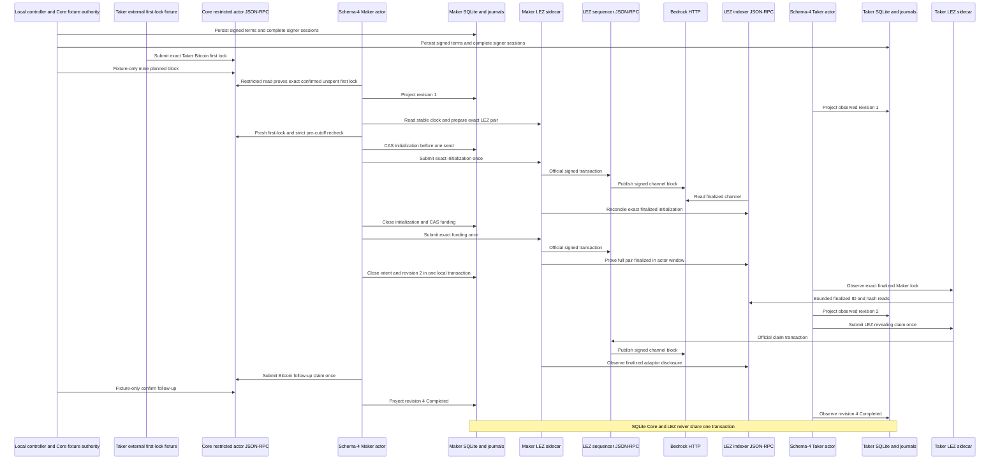

`TakerSellsLez` uses LEZ for the Taker first lock and Bitcoin for the Maker
second lock:

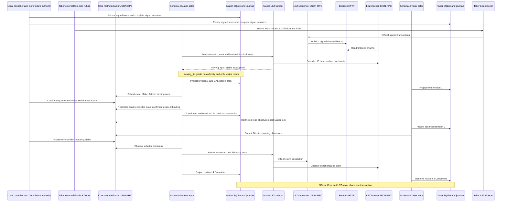

The executable timeout topology is the same in either trade direction; the
agreement selects the Taker-funded first-lock chain and forces the Maker-funded
second lock onto the opposite chain. Solid edges below are implemented and
covered by deterministic actor tests. Separate run `m3refund-20260716h`
crossed the Core and LEZ actual-node refund edges in both directions; run
`m3schema4-20260717d` is the complementary live happy-path Maker-admission
proof. Genuinely concurrent cutoff, refund, and late admission is still a
hardening item rather than an inferred property of either run.

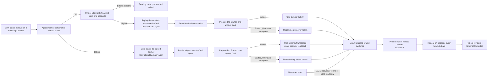

`testmempoolaccept` is a pre-finalization read-only policy gate, not a funding
broadcast. The exact funding bytes and planned next-block anchor are committed
by the agreement before both independent signer journals complete. Only then
may the direction-derived first effect occur. This order avoids signing an
agreement around an already mutable on-chain funding observation; it does not
create an atomic commit across Core, LEZ, and SQLite. In the current PoC the
external Taker fixture owns only the first-lock submission and the controller
owns deterministic local mining. The schema-4 Maker actor owns second-lock
construction, durable one-attempt authority, submission, and reconciliation;
the Taker actor observes that lock through its own restricted Core RPC or LEZ
sidecar. Both actors own their claim-effect journals. Replacing the external
Taker fixture with a product SDK remains accepted-scope work.

The schema-4 seam now has the following actual-node composition. Every arrow is
an implemented call used by run `m3schema4-20260717d`; no dashed future edge is
used to claim this checkpoint.

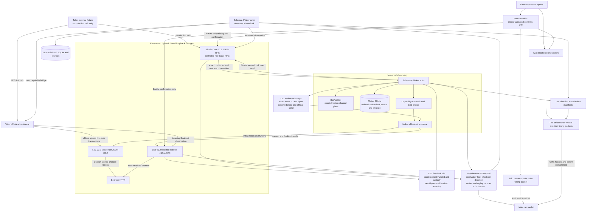

ADR 0048 adds one exact node-start coordinator ahead of every M3 bootstrap and
actor flow. It starts the fixed Core and LEZ service launchers concurrently in
separate owned sessions, waits and reaps both exact statuses, then authenticates
the complete Docker run/scope/component inventory. No deployment, Vault claim,
agreement, lock, claim, refund, or scalar authority exists before that join.
The pre-change Run-AA baseline is approximately 39 seconds Core, 58 seconds
LEZ, and 98 seconds with sequential handoff. Behavioral success, child failure,
INT, TERM, overcount, wrong-component, query-failure, exact cleanup, and foreign
survival cases are GREEN.
Clean pushed Run AD completed the concurrent startup window in 67 seconds
versus Run AA's 98-second sequential baseline, certifying a 31-second saving
with exact cleanup. ADR 0049 adds fixed monotonic outer phases without adding
an RPC, port, actor credential, or chain authority. Its strict private packet
is path-and-SHA-bound into main evidence. Clean pushed Run AE measures
1,023,100 ms with 280 ms unattributed; the two complete direction phases
consume 75.2 percent. Child semantic packets are now contract-GREEN, bind the
current effect manifests, and must fit inside their exact outer parent phases.
Clean pushed Run AF measures 1,000,170 ms with 510 ms unattributed. Its
346,060/386,060 ms children fit their 346,280/386,310 ms parents and localize
nearly all actor time to five finalized lock/claim windows.

| Component | Status | Endpoints and local services | Role/authority boundary | Current proof and nonclaim |
|---|---|---|---|---|
| M3 monotonic phase evidence | Outer and child implementation, complete pinned CI, and clean pushed Run AF actual-node measurement GREEN | Reads only Linux `/proc/uptime` in the outer and direction runners. It opens no RPC, port, peer, faucet, or public service | Fixed outer and journey-specific child phase identifiers are allowlisted. No command, endpoint, account, transaction, actor output, or secret enters a journal. Timing never grants send, retry, finality, deadline, CAS, or cleanup authority | Exact ordering/arithmetic, supported schedule shapes, 0600 modes, symlink/tamper/malformed-effect rejection, no-clobber publication, effect SHA binding, parent-duration containment, main-packet path/SHA equality, and five-file rehash before/after main publication are GREEN. Run AF measured 1,000,170 ms outer and 346,060/386,060 ms children; five finalized lock/claim windows dominate. Different host contention means no speedup over Run AE is claimed |
| M3 exact-idempotent LEZ initialization journal | Actual-node GREEN in `TakerSellsForeign` at run `m3schema4-20260717d` | Maker actor calls its capability-authenticated loopback sidecar; the sidecar uses official RPC on the run-owned sequencer and finalized reads on the indexer | `ExactIdempotentSubmissionSafe` is distinct from absence. The role-local Maker journal reserves the exact initialization ID and bytes before one send; `Started`, `Unknown`, and accepted states never rearm. Exact canonical evidence is still required to close | Durable LEZ Maker-lock counts advanced 0 to 1 to 2 for initialization and funding, stayed unchanged across restart, and the full pair finalized inside the exact actor window. This proves the private-local operation, not generic production idempotence for an arbitrary future LEZ endpoint |
| M3 exact-idempotent typed actor mapping | Actual-node GREEN in the live schema-4 Maker CLI | `MakerLockStepChainObservationV1` carries exact IDs and bytes between the direction-shaped SDK, role-local SQLite, and live Core or LEZ adapter | Only the Maker role receives second-lock material. The first eligible drive can consume one journal authority; a restarted actor observes durable state and submits zero times. Taker is observation-only for the Maker lock | Each direction recorded exactly one Maker-lock economic effect and zero restart or terminal-replay re-submissions. Chain observation, rather than accepted submission, closes revision two |
| M3 joined current and finalized LEZ first-lock proof | Actual-node GREEN in `TakerSellsLez` | One role-local sidecar brackets a stable current LEZ clock, exact witnessed metadata and custody, exact initialize/fund bytes, and independently bounded finalized indexer ancestry | Runtime, chain, program, signer, accounts, custody owner/program, amount, response context, block identity, and stable clock are fail-closed. A payload-free `moving_tip` grants no chain fact or send authority | Nine `moving_tip` reads caused fresh-process read-only retries; attempt ten returned the stable joined proof and permitted one Maker Bitcoin send. State-only evidence alone remains insufficient and is never described as finality |
| M3 schema-4 live Maker-lock seam | Actual-node 2 of 2 GREEN at tested pushed commit `0e7635f` | Live `BtcPairSdk`, Maker SQLite, restricted Core 31.1 Basic RPC, capability-authenticated LEZ bridge, official-wire sidecar, sequencer, Bedrock, and indexer are composed on dynamic literal loopback | Taker external fixture submits only the first lock. Maker rechecks exact first-lock eligibility and a strictly pre-cutoff current clock immediately before any possible CAS/send. Maker intent close and lifecycle revision two share one SQLite transaction; chain I/O does not | Retained packet `docs/evidence/m3-schema4-actor-owned-lock-poc-20260717.json` binds run D, both terminal revision-4 role pairs, one Maker effect per direction, exact replay counts, no public resources, and cleanup. This completes the schema-4 private-local checkpoint, not accepted M3 scope, production readiness, public deployment, or the `m3-complete` tag |
| M3 fresh identity, guest bootstrap, and direction runner | Actual-node schema-4 2 of 2 GREEN in `m3schema4-20260717d` | One unique run owns Core, Bedrock, sequencer, indexer, both sidecars, dynamic literal-loopback host ports, state roots, Docker resources, credentials, and evidence. The caller names the exact artifact target | Fresh owner identities and official owner-derived Vault IDs are paired and cross-distinct. Bootstrap owns deploy/Vault Claim authority; Core cookie wallet/miner authority is excluded from actor configs. The runner submits no Maker lock | Guest `a199c5be...e293` deployed once as ProgramId `39b6a4db...4dec` in finalized block 6; Maker/Taker Vault Claims finalized once in blocks 9/12. Both directions ended with both roles revision 4 `Completed`, restart and replay added zero submissions, and exact scoped cleanup passed |
| Bitcoin Core 31.1 service mode | GREEN in both schema-4 actor happy directions | Run-owned daemon and Regtest chain on an allocated literal-loopback RPC port; no published P2P port, zero peers, deterministic local coinbase funds | Provisioner alone owns cookie, wallets, mining, and funding authority. Maker and Taker use distinct mode-`0600` `rpcauth` configurations with least-privilege tested method matrices. The Maker actor, not the provisioner, sends the schema-4 Bitcoin second lock | In `TakerSellsLez`, exact Maker transaction `6c2505b...11dd6` appeared once in mempool and once canonically; restart added zero sends. Core 31.1 spender lookup used one options object. One confirmation is local PoC policy only |
| M3 durable MuSig2 SDK/journal | GREEN component boundary | No RPC or public resource; separate owner-only SQLite/WAL files per actor and per-session canonical byte exchange | Each role reserves a fresh BIP-327 nonce before exposing its commitment. The SDK revalidates the complete context, own and peer role-bound commitments, and secret/public nonce relation; SQLite atomically replaces the nonce with one exact replayable partial. Existing-only open cannot create an empty signer store | Seven focused journal tests, all 86 store tests, and all 26 BTC SDK all-target tests pass. The focused BTC-recovery slice is 11/11. The SDK point-checks a private adaptor scalar without creating a final signature. Plaintext nonce at rest until consumption and non-zeroizing upstream scalar internals are production nonclaims |
| M3 public durable lifecycle SDK | GREEN public library boundary at `0c78f3d` | No endpoint is embedded. Typed Bitcoin and LEZ ports are application-supplied and each bounded drive chooses exactly one chain. The reference in-memory store has no process-durability claim | Canonical secret-free records bind agreement, role, revision, all exact public effects/evidence, full-range decimal `u128`, and SHA-256. Exact create/CAS controls lifecycle projection. Port implementations separately persist bytes before send, observe before resend, and keep unknown outcomes non-authorizing | Fifteen unit, 32 external facade, two doctest, and 75 combined all-target/all-feature checks pass. Both claim and ordered-refund directions restart after every transition, replay with zero writes, and reject chain/role/agreement/byte substitution. `durable-lifecycle.rs` shows external composition. Production supplies the durable store and public-effect journals |
| M3 official and adaptor vector gate | GREEN immutable/test-only boundary at `0c78f3d` | No RPC, Docker, node, faucet, or public resource. Corpora are repository files pinned to bitcoin/bips commit `8c369ac8...13d7` with enforced hashes and BSD licenses | Public deterministic test scalars only. Every applicable production SDK operation is reconstructed under exact key/message/tweak/adaptor context; `k256` is an independent dev-only verifier | Nine focused groups pass. All 19 BIP-340 rows and applicable stateful BIP-327 operations execute; the swap fixture adapts, extracts, verifies, and rejects substitutions. The newer unused deterministic-signing extension is checksum/structure validated rather than falsely claimed as a production path |
| M3 private D1 recorder and bundle | Three of three BTC scenarios and bundle GREEN | Owner-private `.e2e` paths only; actual runs use dynamic loopback Core/LEZ services. No public RPC, peer, faucet, funds, or deployment | Fresh unique run ID, clean evidence commit, exact scenario, mode-`0700` directory and mode-`0600` files. Bundle verifier rehashes manifest/evidence/output/timing bytes and binds an ancestor evidence commit to the clean verifier commit | Happy, both ordered refund directions, and opposite-direction concurrent barrier record at `a6eb1ad`. Verifier `946208a` sealed bundle SHA-256 `3d7d7adc...a86c7cc`, result `passed`, with no external-network certification dependency. Private actor data is deliberately not checked in |
| M3 private D1 video renderer and bundle | Three of three BTC MP4s and video bundle GREEN | Digest-pinned VHS 0.11.0 is pulled during setup; production rendering then runs with `--network none`, a read-only root, dropped capabilities, no-new-privileges, bounded resources, and only one owner-private output mount. It calls no chain RPC, peer, faucet, or public service | The source verifier re-hashes terminal/timing, aggregate, role, effect, terminal, refund, and overlap packets before emitting canonical `proof.json`. The renderer only projects that proof; it gains no actor, signer, wallet, node, send, retry, finality, or cleanup authority. The final verifier regenerates proof and rejects changed bytes, roles, order, duplicates, mixed commits/networks, unsafe modes, and malformed streams | Renderer/verifier `846ba56` produced happy, refund, and concurrent H.264 1280x720 MP4s. Complete decode and sampled intro, both-direction, scenario/atomicity, and stable-tail frames passed; mode-`0600` bundle `7697a27c...f101ba8` binds source commit `a6eb1ad`. The image pull can fail on registry/DNS/TLS/rate limits, but certification success uses no external network |
| M3 actor-local BTC recovery store | GREEN through all four revisions and both schema-4 actual-node directions | Separate owner-private SQLite/WAL per actor; no public RPC, faucet, or public resource | Schema-4 activation enforces direction-selected Maker-lock material and Bitcoin refund-key authority. Each drive/recover projection and Maker intent close uses `BEGIN IMMEDIATE` plus predecessor CAS | Both roles ended revision 4 in both directions and restart/replay caused zero submissions. The Maker intent and revision-two close are one local transaction; cross-chain atomicity, a chain-plus-SQLite transaction, process-kill recovery, and malicious database-owner authentication are not claimed |
| M3 public-effect journal | GREEN for actual-node Bitcoin/LEZ claims and both ordered refund transitions | Owner-private SQLite stores complete public transaction bytes, SHA-256, expected chain ID, agreement commitment, and role/revision authority | Only `Prepared` to `Started` grants one fresh RPC call. Claims require bounded absence; refunds reject absence and require affirmative stable eligibility. Started/Unknown are observe-only; conflicting presence burns authority. Eight racing refund observers yield one winner. Secrets are forbidden | Claim replay and run `m3refund-20260716h` retained identical effect counts and zero re-submissions in both directions. Process-kill injection remains pending; no cross-system atomic commit is claimed |
| M3 legacy schema-3 one-shot BTC reference actor | Historical happy path GREEN in 2 of 2 actual-node directions; deterministic live-adapter refund execution GREEN through both transitions | Private schema-3 configs expose `activate`, `drive`, `recover`, and offline `status`; they bind loopback Core/sidecar routes, finite LEZ reads, distinct journals, the prepared claim, Taker adaptor authority, and only the agreement-selected Bitcoin funder refund key. Schema 3 Maker-lock handling remains observation-only | LEZ owners use state-only then prepare/exact/submit for claim/refund effects; LEZ nonowners use discovery only. Core refunds re-decode exact bytes and recompute txid/wtxid. Both chains persist exact bytes before one-send authority and project only finalized evidence | The schema-3 evidence remains valid for claims and refunds, while run D supersedes its operator-owned Maker-lock happy path. Schema-4 live Maker-lock admission and the separate opposite-direction overlap checkpoint are GREEN; public RPC/faucet, arbitrary-N/same-direction scheduling, concurrency chaos, and production custody remain unclaimed |
| M3 typed Bitcoin Core adapter | GREEN component; actual-node funding, claim, and both ordered timeout/refund paths GREEN; Testnet4 configuration GREEN | Literal-loopback HTTP supports Regtest and self-hosted Testnet4. One exact canonical allowlisted HTTPS DNS origin is admitted only for Testnet4. Both have bounded size/time/concurrency and separate role-local Basic files | Exact Core 31.1 version, profile chain/genesis, readiness, synchronized indexes, and stable owner-private credentials are required. Route/profile mismatch fails before RPC; provisioner/wallet authority is excluded. Refund send authority remains actor-journal owned | 37 all-target executions cover exact funding/claim/refund, signed-anchor next-block CSV maturity, exact witnesses, conflicts, finality, one-send and txid/wtxid readback. Five focused tests cover Testnet4 readiness and HTTPS/loopback security without public calls. Live public provider and fee/reorg stress remain later work |
| M3 v0.2 native-refund planner and RPCs | Durable exact planner, authenticated prepare/restart, finalized witnessed observation, and both actual-node refund orders GREEN | Capability-authenticated run/role/runtime-bound literal-loopback HTTP to the run-owned sequencer/indexer tuple; no faucet or public endpoint | The sidecar role, complete runtime, escrow and transfer programs, immutable depositor, and witnessed aggregate key/account are revalidated. The official transaction is permissionless and has no signer, nonce, or witness. Successful canonical request/result replay is restored before bind | Component mutation/replay/deadline/finality coverage remains, and `m3refund-20260716h` proves actual-node execution to terminal revision 4 `Refunded` in both directions with zero replay submissions. Process-kill/reorg and production trust remediation remain |
| M3 witnessed LEZ v0.2 stack | Schema-4 happy-path actor composition GREEN in both directions; exact durable refund preparation and finalized observation components GREEN | Run D allocates Bedrock, sequencer, indexer, and separate Maker/Taker sidecars on dynamic literal-loopback ports; none is a default or reusable discovery address | Separate capabilities, signer keys, stores, and journals. Sequencer admission is not finality. Bounded finalized scans use ID/hash equality and finite 120-second bridge calls. A `moving_tip` response is payload-free and non-authorizing | Guest `a199c5be...e293` / ProgramId `39b6a4db...4dec` deployed in block 6. In `TakerSellsForeign`, the Maker actor submitted initialization `6e13383d...2110` and funding `9eb4ce06...3262`; the full pair finalized inside its exact window and restart added zero sends |
| Historical and current actor runners | Historical operator-composed and schema-3 private local PoCs remain retained; schema-4 run D is the Maker-lock checkpoint, the overlap run is the two-swap checkpoint, F7 repeatability is closed, and fresh D1 recordings repeat happy/refund/concurrent journeys | Current runs allocate dynamic Core, Bedrock, sequencer, indexer, and role-sidecar endpoints plus isolated state/evidence. The overlap run shares only run-owned nodes and fixture custody; actor databases, signer journals/sessions, agreements, escrows, deadlines, and outpoints are swap-distinct. Exact run labels and ownership registries scope cleanup | All runs prove presign-before-effect and dual-lock-before-reveal. Run D proves Maker second-lock ownership. The overlap barrier holds four role stores at revision two before settlement. The public SDK exposes the same structural lifecycle while the reference actor retains concrete SQLite/effect journals; the Taker first lock remains external-fixture owned | Retained summaries and D1 hashes bind terminal states, exact effect/replay counts, no public resources, and cleanup. Accepted private M3 SDK/custom-token/recording/Testnet4 configuration scope is GREEN. Arbitrary-N/same-direction scheduling, process-kill/reorg/chaos, production custody, live public routes, and production readiness remain open |
| M3 overlap controller and isolation barrier | Clean actual-node GREEN in `m3overlap-20260717a` at pushed commit `1e6d5f1` | Two direction controllers share one run-owned Core 31.1 loopback JSON-RPC endpoint and one LEZ v0.2 Bedrock/sequencer/indexer tuple. Four role-local sidecars and four actor databases remain private; no public RPC, faucet, peer, or public funds participate | A deterministic fixture custody key owns two distinct mature coinbase outpoints; it grants no actor or signer authority. Four actor DB paths/inodes, eight signer journal paths/inodes, two sessions per domain, two agreements, two escrow pairs, and distinct deadlines are asserted before settlement. Chain mutations remain serialized | Both swaps reached revision 2 `both_legs_locked` before either settlement permit, then all four roles reached revision 4 `Completed`. Each swap retained two Bitcoin and three LEZ effects, cross-swap IDs were disjoint, terminal replay added zero submissions, and exact cleanup targeted no foreign resource. This proves one opposite-direction pair, not arbitrary-N or same-direction LEZ nonce scheduling |

The overlap deployment shares the actual chain services while keeping every
swap-owned state surface separate:

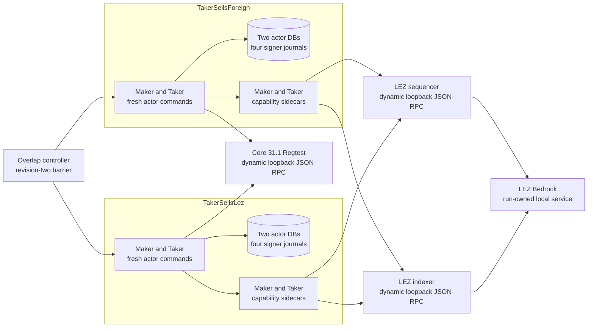

The shared deterministic test-custody key is confined to provisioner-owned
Regtest source funding. It produced two mature, distinct outpoints and does not
cross the restricted actor RPC, role-local sidecar, actor database, signer
journal, session, agreement, or escrow boundaries shown above.

## External resources and flakiness

The deterministic SDK/schema-v10 corridor uses only local temporary files and
process input. It cannot fail because a public RPC, faucet, chain peer, Docker
registry, or testnet is unavailable. The canonical forward and reverse certification runs crossed actual local LEZ
v0.2 Bedrock, sequencer, indexer, and Zebra Regtest
consensus/state-transition boundaries in one swap. Regtest outputs and LEZ
genesis allocations provided deterministic local funds. Separate ignored fault
suites remain independent evidence and do not turn the two happy runs into
restart, refund, reorg, or chaos proof.

Schema-4 run `m3schema4-20260717d` likewise used only its private local Bitcoin
Core 31.1 Regtest and LEZ v0.2 Bedrock, sequencer, indexer, and role-sidecar
tuple. Regtest coinbase outputs and LEZ genesis/Vault allocations supplied
deterministic local funds. It used no public RPC, faucet, public funds, or
public deployment, and success did not depend on an external network. The
pinned Bedrock process attempted `pool.ntp.org:123/udp` and recorded 45
timeouts, but certification did not consume that result. This optional upstream
NTP behavior can add log noise or latency and must not become a hidden readiness
dependency. The local finalized tip also advanced during bracketed reads:
nine typed `moving_tip` results delayed `TakerSellsLez`, but each was
payload-free, granted no send authority, and caused only bounded fresh-process
read retries before the one stable proof. These are availability/flakiness
facts, not weakened canonicality checks.

Cold setup can still depend on crates.io, GitHub, container registries, Risc0
tool distribution, and the checksummed Logos circuits release. CPU, memory,
disk, registry availability, and an uncached dependency graph can therefore
delay or fail a local-node run without changing its chain assertions. Warm,
verified caches reduce availability risk but do not justify bypassing a digest,
lockfile, or vulnerability failure.

Future public evidence adds different failure modes. The official LEZ endpoint
`https://testnet.lez.logos.co` can be rate-limited, unavailable, reset, or move
to another channel; every result must bind the observed channel, block,
transaction, ProgramId, ELF, ImageID, and exact commits. The selected Zcash
routes are a self-hosted Zebra 6.0.0 public-Testnet node and Tatum's
API-key-authenticated Testnet Zebrad gateway. The former carries initial sync,
disk, peer, epoch, and organic-reorg risk; the latter carries provisioning,
quota, outage, lag, method-policy, and authoritative-provider trust risk.
Community faucets or Discord funding have no
SLA and may be depleted, so CI must not silently treat their outage as success.
No current evidence flow calls those public endpoints or funding routes. The
dormant constructors are executable, but their tests stop before network I/O.

## Local test concurrency

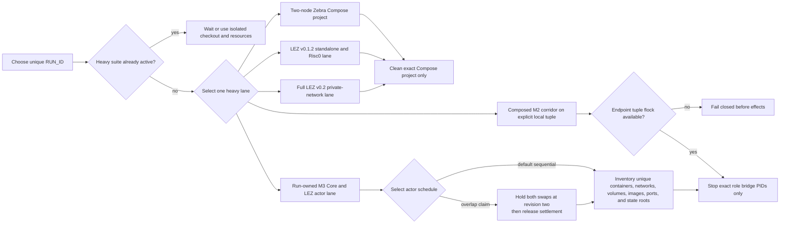

Never run the Zebra and LEZ heavy lanes concurrently on the same host. Never use
global Docker prune/stop commands. Every Zebra run owns a unique Compose project,
ephemeral host ports, run manifest, and absolute maker database. Reusing a run
manifest or database is rejected before Compose starts. LEZ runs require unique
tool, target, standalone, and evidence directories when another checkout might
be active. The full v0.2 lane specifically owns project
`lez-atomic-swaps-lez-v02-{run_id}`, state `.e2e/{run_id}/lez-v02`, one private
network, and dynamic literal-loopback host ports; it must never reuse fixed
container names or clean another project's resources. A composed corridor does
not own those node processes. It acquires a nonblocking advisory lock whose key
is the SHA-256 of the configured sequencer, indexer, and Zebra URLs, creates a
fresh output root and role bridges, and stops only bridge PIDs whose start ticks
and executable identity match its manifest. A failed effect-bearing run is
retained and its swap, output root, and funds are never reused.

The M3 actor lane owns its Core daemon, LEZ Compose project, networks, volumes,
images built for that run, six dynamic host endpoints, actor and sidecar
processes, state roots, and evidence root. Before effects it records and checks
that inventory against the unique run identifier. Cleanup addresses only those
exact resources; it never prunes Docker globally, stops an unlisted process, or
removes the caller-supplied verified artifact cache. Failed effect-bearing M3
runs are retained and their agreements, journals, outputs, Vault funds, and
Core inputs are never reused.
