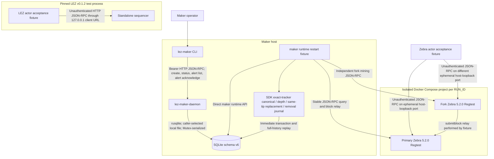
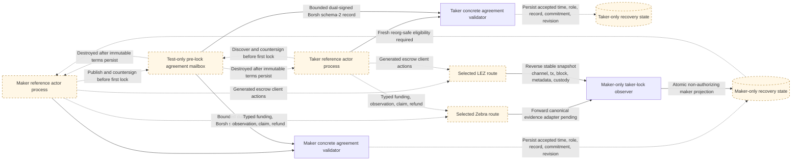
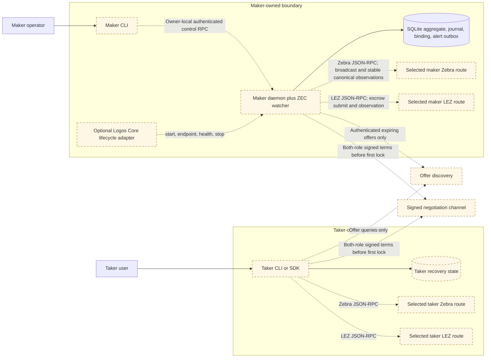
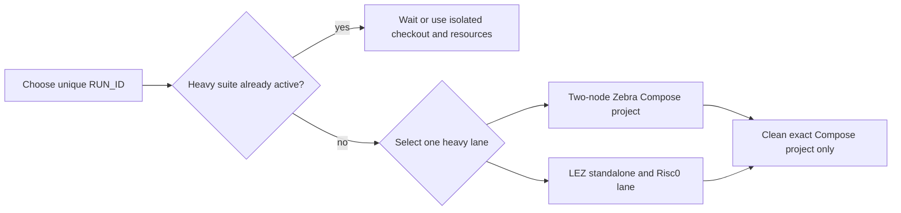

# Deployment components, RPCs, and local nodes

Status: Living executable inventory — 2026-07-12

This document is the concrete deployment companion to the
[system architecture](system-architecture.md). It distinguishes processes that
actually run today from target components that do not yet have an implementation,
port, credential scheme, or selected provider. A dashed component or edge is
planned. No port is invented for an unimplemented integration.

## Current executable local topology

The maker daemon hard-refuses a non-loopback bind and defaults to
`127.0.0.1:0`. Its ready file contains only the selected URL; the Bearer token
comes from `LEZ_MAKER_RPC_TOKEN` and is never written there. The CLI default is
`http://127.0.0.1:9944`, so an ephemeral daemon must be called with the ready URL.
Registered methods are `swap_create`, `swap_status`, `swap_alerts`, and
`swap_alert_acknowledge`. Status includes pending count/highest severity; list
supports a cursor and acknowledged-history flag. Acknowledgment never changes
protocol phase. There is no daemon-integrated chain watcher, chain-key owner,
health method, or production ZEC ingestion RPC yet.

Each Zebra container listens on `0.0.0.0:18232` inside its isolated project
network. Compose publishes it as a different ephemeral `127.0.0.1` host port.
Cookie authentication is disabled for this Regtest-only fixture. The nodes have
separate tmpfs state, no initial peers, and no fixed host ports; the fixture
relays blocks explicitly. Both containers are non-root, read-only,
capability-free, resource-capped, and removed only through their exact Compose
project name. The runner creates an absolute, run-scoped SQLite path, refuses a
pre-existing manifest, database, WAL, or SHM before Compose starts, and records
the selected database and both ephemeral RPC URLs in `run.env`. The maker
runtime fixture commits real canonical funding, closes/reopens SQLite, suppresses
an unchanged fresh RPC requery, applies an affirmative deeper-fork removal,
closes/reopens again, and proves exact retry without a third journal row.

The pinned LEZ standalone server is short-lived, uses port zero and temporary
state, and the test client connects through `127.0.0.1`. However, the exact
upstream v0.1.2 server binds `0.0.0.0` on that ephemeral port. It is collision
isolated but not loopback/network-namespace isolated. This must remain visible
until upstream accepts a bind address or the lane is placed in an isolated
network namespace/container.

## M2 SDK/reference-demo target topology

This is the accepted M2 demo boundary. It is independent of the M5 production
daemon/CLI/Delivery/Chat delivery below.

Each process must have a distinct PID, owner-only state/key paths, fixed local
role, and separately persisted agreement. The local mailbox is explicitly a test
adapter, not Logos Delivery or Chat. Once terms persist and the first lock is
submitted, it is destroyed; both actors must complete or refund using only their
own state and selected chain nodes.

## M5 production application target topology

Delivery and Chat are negotiation transports, never sources of chain truth or
secrets. After the first lock, each actor must recover using only its own durable
state and selected chain nodes. Logos Core is optional lifecycle/presentation;
it never opens SQLite or becomes protocol authority.

## RPC and local-resource inventory

| Component | Status | Transport and bind | Authentication / authority | Methods exercised or required | Lifecycle and isolation |
|---|---|---|---|---|---|
| `lez-maker-daemon` | Running prototype | HTTP JSON-RPC; default `127.0.0.1:0`; non-loopback rejected | Bearer token from hidden environment; minimum 24 bytes; header checked before JSON parsing | Actual: `swap_create`, `swap_status`, `swap_alerts`, `swap_alert_acknowledge` | Operator/test-owned process; caller-selected SQLite path; Ctrl-C shutdown |
| `lez-maker` | Running prototype | HTTP client; default `127.0.0.1:9944`; explicit ready URL for ephemeral daemon | Authorization header marked sensitive | Actual CLI: `create-swap`, `status`, `alerts`, `acknowledge-alert` | Independent operator process |
| SQLite | Running | Local file; no RPC or port | Daemon/runtime process filesystem authority; SDK adapter fixes one local role per handle | Aggregate, revision, ZEC journal, immutable binding, operator-alert list/ack APIs; schema-v6 role-local SDK agreement/open-or-closed taker intent plus taker submission or ordered maker canonical/depth/replacement/removal recovery | WAL, `FULL` synchronous, foreign keys, immediate transactions; ten SDK-adapter tests prove role isolation, taker and maker rollback, torn/orphan/holey-state rejection, poison-append rejection, exact/historical maker replay, stale-instance catch-up, no maker-side taker intent, and forward-Zcash plus reverse-LEZ close/reopen recovery; one process mutex remains |
| Concrete LEZ/ZEC agreement and lifecycle boundary | Running library boundary | No socket or RPC; bounded Borsh schema-2 bytes enter from an untrusted negotiation adapter; typed first-lock action and maker-observation ports have no selected production endpoint | Maker and taker transparent keys provide dual low-S signatures; each SDK and SQLite adapter fixes its local role; signed direction alone selects the maker's LEZ or Zcash observation port | Exact decode, cross-binding including LEZ v0.2 channel/genesis, persistence-before-activation, adversarial resume, durable exact taker first-lock intent, primitive-record revalidation, observe-before-rebroadcast, complete canonical forward-Zcash observation persistence, stable reverse-LEZ transaction/block/metadata/custody evidence, ordered LEZ initialize/fund, atomic projection/unknown-commit probe/replay, non-cached fresh forward exact-head eligibility requery | 16 KiB agreement and 2,000,000-byte per-submission caps; 84 ordinary SDK tests plus one doctest and 23 store tests pass. Maker observation and eligibility remain non-authorizing; production node ports, official-wire LEZ decoding and SDK/SQLite tracker integration, the maker effect that consumes eligibility internally, and later effects are remaining M2 work |
| Primary Zebra | Running in ignored E2E | Container `0.0.0.0:18232`; ephemeral host `127.0.0.1` mapping | Regtest fixture has no cookie auth; signed transactions and consensus remain authoritative | `getblockcount`, `generate`, `getblockhash`, `getblock`, `getblockheader`, `submitblock`, `getaddressutxos`, `getrawtransaction`, `sendrawtransaction`, `getblockchaininfo` | Unique Compose project and tmpfs state per `RUN_ID` |
| Fork Zebra | Running in ignored E2E | Same container port; distinct ephemeral host-loopback mapping | Same Regtest-only policy | Same RPC set; produces independent higher-work branch | Separate tmpfs state; no initial peer; fixture-controlled block relay |
| LEZ standalone v0.1.2 | Running in ignored E2E | Upstream server `0.0.0.0:0`; client uses `127.0.0.1:<assigned>` | No transport credential; actor signatures authorize transactions | `checkHealth`, `sendTransaction`, `getLastBlockId`, `getTransaction`, `getAccountsNonces`, `getAccount`, `getBlock` | In-process handle, tempfile state, deterministic genesis actors; not public v0.2 |
| Logos Core adapter | Planned | No transport/port selected beyond the daemon control endpoint | Protected OS credential handle | `start`, `endpoint`, `health`, `stop` | Optional supervisor of the same daemon binary |
| Delivery / Chat | Planned | No protocol, endpoint, or port selected | Authenticated offers and both-role signed transcript | `OfferDiscovery`; `NegotiationChannel` | Untrusted/removable after first lock |
| Production Zebra watcher route | Self-hosted public-Testnet route selected; adapter/evidence planned | Zebra 6.0.0 JSON-RPC on operator-owned loopback with cookie auth; no official public Zebra JSON-RPC route found | Operator owns cookie and node; public peers provide consensus data; never substitute lightwalletd gRPC | Required: sync/branch preflight, stable-tip observation, `gettxout`, raw transaction lookup, broadcast, reorg reconciliation | Initial sync/disk/P2P/epoch flakiness; project transparent signer and live actor suite remain |
| Official LEZ testnet v0.2 node | Live node; narrow adapter/deployment planned | HTTPS JSON-RPC `https://testnet.lez.logos.co` | Public reads; actor wallet/signature authorizes transactions; rate limits unspecified | Verified `checkHealth`, `getLastBlockId`, `getProgramIds`; required deployment evidence adds `getChannelId`, returned `sendTransaction` hash, `getTransaction`, and exact `getBlock` inclusion | Official LEZ v0.2.0 commit `a58fbce...`; guest/client must use `/LEE/` PDA domain; announced resets invalidate evidence when channel changes |
| LEZ v0.2 deployment/query client | Planned, security-constrained | HTTPS JSON-RPC to the official node; no local listener | Official LEZ transaction/RPC types; actor signing material remains process-local | Deploy checked guest, retain transaction hash, query exact transaction and containing block | Thin `jsonrpsee` graph must exclude Logos node auth, libp2p, Hickory 0.25, and pending LGPL exceptions; full released standalone graph is prohibited for public runtime use |
| Bitcoin Core | M3 planned | No port/image/provider selected | Actor-owned node and wallet credentials | Typed `BitcoinChain` port | Do not infer conventional ports before selection |
| `monerod` plus wallet RPC | M4 planned | No ports/images/providers selected | Actor-owned daemon/wallet credentials | Typed `MoneroChain` port | Wallet/key state remains actor-owned |

## Local test concurrency

Never run the Zebra and LEZ heavy lanes concurrently on the same host. Never use
global Docker prune/stop commands. Every Zebra run owns a unique Compose project,
ephemeral host ports, run manifest, and absolute maker database. Reusing a run
manifest or database is rejected before Compose starts. LEZ runs require unique
tool, target, standalone, and evidence directories when another checkout might be active.
