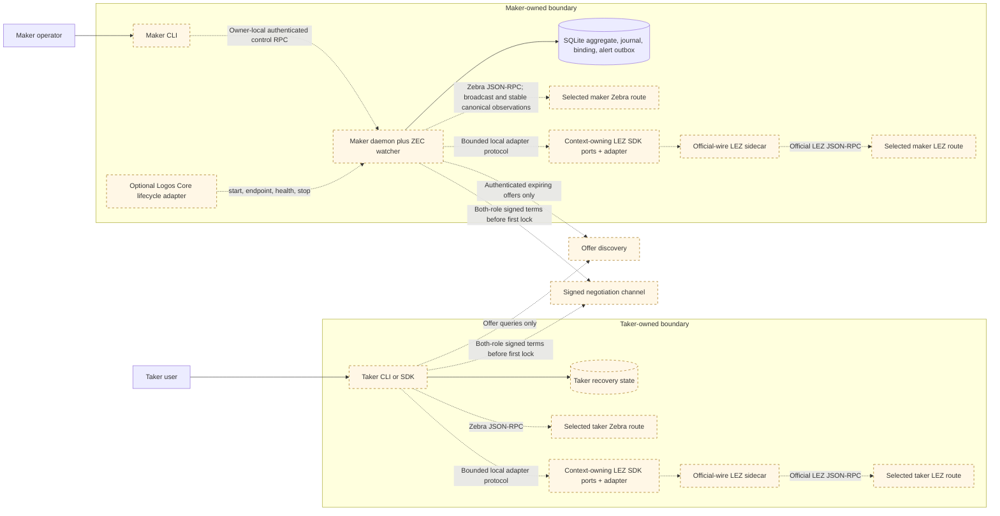
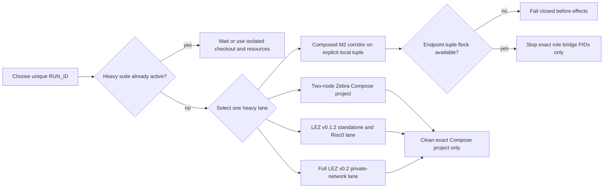

# Deployment components, RPCs, and local nodes

Status: Living executable inventory — 2026-07-13

This document is the concrete deployment companion to the
[system architecture](system-architecture.md). It distinguishes processes that
actually run today from target components that do not yet have an implementation,
port, credential scheme, or selected provider. A dashed component or edge is
planned; blue components are implemented and may have partial live exercise but
have not completed this topology.
No port is invented for an unimplemented integration.

## Current executable local topology

```mermaid
flowchart TB
    Operator["Maker operator"]

    subgraph MakerHost["Maker host"]
        CLI["lez-maker CLI"]
        Daemon["lez-maker-daemon"]
        Store[("SQLite schema v10")]
        RuntimeTest["maker runtime restart fixture"]
        SdkJournal["SDK exact-tracker canonical / depth / same-tip replacement / removal journal"]
        SdkMaker["SDK fresh-gated maker-lock fixture"]
    end

    subgraph DeterministicCorridor["Deterministic SDK claim corridor; no node or RPC"]
        MakerActor["Role-fixed maker SDK actor"]
        TakerActor["Role-fixed taker SDK actor"]
        MakerClaimState[("Maker schema-v10 state")]
        TakerClaimState[("Taker schema-v10 state")]
        ClaimDouble["Deterministic LEZ/Zcash claim-port doubles"]
        Completed["Both actors Completed at revision 4"]
    end

    subgraph ZebraProject["Isolated Docker Compose project per RUN_ID"]
        ZebraPrimary["Primary Zebra 5.2.0 Regtest"]
        ZebraFork["Fork Zebra 5.2.0 Regtest"]
    end

    ZebraTest["Zebra actor acceptance fixture"]

    subgraph LezProcess["Pinned LEZ v0.1.2 local-node lane"]
        LezTest["LEZ actor and process acceptance fixtures"]
        LezExternal["lez-standalone-node external process"]
        LezNode["Standalone sequencer<br/>dynamic upstream port"]
        LezHome["Fresh mode-0700 home"]
        LezReady[("Private mode-0600 schema-v2 readiness<br/>deployment tx/block + program/built-in + actor keys")]
    end

    Operator --> CLI
    CLI -->|"Bearer HTTP JSON-RPC; create, status, alert list, alert acknowledge"| Daemon
    Daemon -->|"rusqlite; caller-selected local file; Mutex-serialized"| Store
    RuntimeTest -->|"Direct maker runtime API"| Store
    RuntimeTest --> SdkJournal
    SdkJournal -->|"Immediate transaction and full-history replay"| Store
    SdkMaker -->|"Both directions; intent and confirmed transition"| Store
    MakerActor --> MakerClaimState
    TakerActor --> TakerClaimState
    MakerActor -->|"LEZ reveal or Zcash follow-up"| ClaimDouble
    TakerActor -->|"Observe reveal and continue from protected preimage"| ClaimDouble
    ClaimDouble --> Completed
    Completed --> MakerClaimState
    Completed --> TakerClaimState
    RuntimeTest -->|"Stable JSON-RPC query and block relay"| ZebraPrimary
    RuntimeTest -->|"Independent fork mining JSON-RPC"| ZebraFork
    ZebraTest -->|"Unauthenticated JSON-RPC on ephemeral host-loopback port"| ZebraPrimary
    ZebraTest -->|"Unauthenticated JSON-RPC on different ephemeral host-loopback port"| ZebraFork
    ZebraFork -->|"submitblock relay performed by fixture"| ZebraPrimary
    LezTest -->|"Spawn, tamper/reuse rejection, shutdown"| LezExternal
    LezExternal -->|"Start exact upstream service"| LezNode
    LezExternal --> LezHome
    LezExternal -->|"Official health, genesis, tx/block, static built-in, account RPC"| LezNode
    LezTest -->|"Unauthenticated HTTP JSON-RPC through 127.0.0.1 client URL"| LezNode
    LezExternal -->|"Atomic no-clobber publish after verification"| LezReady
```

The maker daemon hard-refuses a non-loopback bind and defaults to
`127.0.0.1:0`. Its ready file contains only the selected URL; the Bearer token
comes from `LEZ_MAKER_RPC_TOKEN` and is never written there. The CLI default is
`http://127.0.0.1:9944`, so an ephemeral daemon must be called with the ready URL.
Registered methods are `swap_create`, `swap_status`, `swap_alerts`, and
`swap_alert_acknowledge`. Status includes pending count/highest severity; list
supports a cursor and acknowledged-history flag. Acknowledgment never changes
protocol phase. There is no daemon-integrated chain watcher, chain-key owner,
health method, or production ZEC ingestion RPC yet.

Each Zebra container listens on `0.0.0.0:18232` inside its isolated project
network. Compose publishes it as a different ephemeral `127.0.0.1` host port.
Cookie authentication is disabled for this Regtest-only fixture. The nodes have
separate tmpfs state, no initial peers, and no fixed host ports; the fixture
relays blocks explicitly. Both containers are non-root, read-only,
capability-free, resource-capped, and removed only through their exact Compose
project name. The runner creates an absolute, run-scoped SQLite path, refuses a
pre-existing manifest, database, WAL, or SHM before Compose starts, and records
the selected database and both ephemeral RPC URLs in `run.env`. The maker
runtime fixture commits real canonical funding, closes/reopens SQLite, suppresses
an unchanged fresh RPC requery, applies an affirmative deeper-fork removal,
closes/reopens again, and proves exact retry without a third journal row.

The pinned LEZ standalone server is short-lived, uses port zero and temporary
state, and the test client connects through `127.0.0.1`. However, the exact
upstream v0.1.2 server binds `0.0.0.0` on that ephemeral port. It is collision
isolated but not loopback/network-namespace isolated. This must remain visible
until upstream accepts a bind address or the lane is placed in an isolated
network namespace/container.

The reusable external wrapper verifies the tracked manifest bytes, ELF
SHA-256, and Risc0 ImageID before creating state. It refuses a pre-existing
home or readiness path, creates a mode-0700 home, waits for mandatory canonical
progress, deploys the checked guest, and re-reads genesis, the deployed
transaction and containing block, ProgramId derived from the transaction ELF,
the advertised authenticated-transfer built-in, and two key-derived funded
accounts owned by that built-in through official RPC. Upstream `getProgramIds`
is a static built-in map, not a deployed-program registry. Only then does the
process atomically create the mode-0600 schema-v2 readiness file; that file
contains deterministic actor private keys and is never a public ready file.
Tamper/reuse failures leave no readiness and preserve the existing home.

The deterministic claim corridor is deliberately separate from both local-node
lanes. It uses two role-fixed SDK actors, two different temporary schema-v10
SQLite databases, and an externally supplied test claim key per role. The key is
not stored in SQLite. In both signed directions it persists exact protected
claim submissions, observes the LEZ reveal, protects the extracted preimage,
submits the Zcash follow-up, and reopens both actors at revision 4 and
`Completed`. Its LEZ and Zcash ports are deterministic test doubles: it starts no
service, opens no RPC connection, and proves neither `LezClaimPort` nor
`ZcashClaimPort` against a node.

## M2 SDK/reference-demo target topology

This is the accepted M2 demo boundary. It is independent of the M5 production
daemon/CLI/Delivery/Chat delivery below. ADR 0022 records why the LEZ adapter is
a process boundary rather than another dependency in the reference actor.

The Zcash workspace graph pins `crypto-common = 0.2.0-rc.1`. The official LEZ
v0.1.2 graph reaches `chacha20 0.10` and `cipher 0.5.1`, which require stable
`crypto-common ^0.2`; Cargo cannot resolve those constraints in one graph. The
integration must not weaken or patch either cryptographic pin, and must not copy
official LEZ wire or RPC types into the Zcash workspace. A separately built,
exactly locked LEZ sidecar owns those official types. Its typed local bridge is
a bounded serde-only adapter protocol carrying primitive requests and facts; it
is not the official LEZ JSON-RPC protocol and cannot assert canonicality.
The final ADR-0023 corridor selects a separately locked v0.2 official-wire
sidecar and full local v0.2 Bedrock/indexer/non-standalone-sequencer stack. The
implemented v0.1.2 sidecar/node remain lower compatibility evidence, not the
final portability proof.

```mermaid
flowchart LR
    Mailbox["Test-only pre-lock agreement mailbox"]
    Zebra["Primary Zebra Regtest JSON-RPC"]
    ZebraFork["Temporary fork Zebra"]
    Bedrock["Bedrock node HTTP 18080<br/>digest-pinned; service GREEN"]
    LezIndexer["LEZ v0.2 indexer RPC 8779<br/>finalized ID and hash GREEN"]
    LezNode["Non-standalone sequencer RPC 3040<br/>signed channel and Borsh block GREEN"]
    LezV02Runner["Host orchestrator<br/>exact-ID lifecycle and RPC probes"]
    LezNetwork["Unique no-masquerade bridge<br/>dynamic loopback publications"]
    LezState[(".e2e/run_id/lez-v02")]
    LezReady[("Services + finalized Vault Claims + deploy GREEN")]
    MakerNative["Maker native PoC CLI<br/>initialize + fund GREEN"]
    TakerNative["Taker native PoC CLI<br/>revealing claim GREEN"]
    LezNative[("Native lifecycle GREEN<br/>finalized blocks 219 220 223")]
    ActorProvisioner["zec-local-poc-provision GREEN<br/>stable Zebra query + private pair output"]
    FixtureReady[("Fixture readiness GREEN<br/>isolated configs; saved window stale")]
    LezFull[("Both ZEC corridor directions GREEN<br/>run14o and reverse run14c")]
    LezRunner["Direction-aware development runner<br/>2 of 2 happy directions GREEN"]
    EndpointLock[("Endpoint tuple advisory flock<br/>sequencer + indexer + Zebra URLs")]

    subgraph MakerProcess["Role-fixed maker reference actor process"]
        MakerSdk["LEZ/ZEC swap SDK and agreement validators"]
        MakerState[("Maker-only schema-v10 state")]
        MakerConfig["Schema-v2 maker config"]
        MakerStatus["Offline status material"]
        MakerBridge["Typed local LEZ bridge client"]
        MakerZebra["In-process typed Zebra adapter"]
    end

    subgraph MakerSidecarProcess["Run-scoped maker LEZ sidecar process"]
        MakerCapability["lez-v02-bridge-poc<br/>14o and reverse 14c GREEN"]
        MakerOfficial["Prepare + observe + claim + submit<br/>source GREEN"]
        MakerEffect[("Role/run/runtime request store<br/>PREPARE + submit durability GREEN")]
    end

    subgraph TakerProcess["Role-fixed taker reference actor process"]
        TakerSdk["LEZ/ZEC swap SDK and agreement validators"]
        TakerState[("Taker-only schema-v10 state")]
        TakerConfig["Schema-v2 taker config"]
        TakerStatus["Offline status material"]
        TakerBridge["Typed local LEZ bridge client"]
        TakerZebra["In-process typed Zebra adapter"]
    end

    subgraph TakerSidecarProcess["Run-scoped taker LEZ sidecar process"]
        TakerCapability["lez-v02-bridge-poc<br/>14o and reverse 14c GREEN"]
        TakerOfficial["Prepare + observe + claim + submit<br/>source GREEN"]
        TakerEffect[("Role/run/runtime request store<br/>PREPARE + submit durability GREEN")]
    end

    Mailbox -.->|"Bounded dual-signed terms before first lock"| MakerSdk
    Mailbox -.->|"Bounded dual-signed terms before first lock"| TakerSdk
    MakerSdk --> MakerState
    TakerSdk --> TakerState
    MakerConfig --> MakerStatus
    TakerConfig --> TakerStatus
    MakerConfig -->|"Fresh private inputs; live activate and drive"| MakerSdk
    TakerConfig -->|"Fresh private inputs; live activate and drive"| TakerSdk
    MakerStatus -->|"Existing-only hardened open; no RPC"| MakerState
    TakerStatus -->|"Existing-only hardened open; no RPC"| TakerState
    MakerSdk -->|"Live primitive requests"| MakerBridge
    TakerSdk -->|"Live primitive requests"| TakerBridge
    MakerBridge <-->|"Bounded serde-only local protocol"| MakerCapability
    TakerBridge <-->|"Bounded serde-only local protocol"| TakerCapability
    MakerCapability --> MakerOfficial
    TakerCapability --> TakerOfficial
    MakerOfficial --> MakerEffect
    TakerOfficial --> TakerEffect
    MakerEffect -->|"Reveal in 14o; initialize and fund in reverse 14c"| LezNode
    TakerEffect -->|"Initialize and fund in 14o; reveal in reverse 14c"| LezNode
    MakerCapability -->|"Non-genesis finalized-tip readiness"| LezIndexer
    TakerCapability -->|"Non-genesis finalized-tip readiness"| LezIndexer
    MakerNative -->|"official JSON-RPC; maker key file"| LezNode
    TakerNative -->|"official JSON-RPC; taker key + preimage files"| LezNode
    LezV02Runner -->|"Start first; cryptarchia and channel HTTP"| Bedrock
    LezV02Runner -->|"Start after channel; finalized ID and hash RPC"| LezIndexer
    LezV02Runner -->|"Start after exact missing proof; service RPC"| LezNode
    LezV02Runner -.-> LezNetwork
    LezV02Runner -.-> LezState
    LezNetwork --> Bedrock
    LezNetwork --> LezIndexer
    LezNetwork --> LezNode
    LezNode -->|"Zone SDK signed publish"| Bedrock
    LezIndexer -->|"Poll finalized LEZ channel"| Bedrock
    LezV02Runner -->|"Write run-scoped evidence"| LezReady
    MakerNative --> LezNative
    TakerNative --> LezNative
    LezReady --> LezNative
    LezReady -->|"runtime facts"| ActorProvisioner
    ActorProvisioner -->|"stable mature candidate query"| Zebra
    ActorProvisioner --> FixtureReady
    FixtureReady -->|"owner-private configs"| MakerConfig
    FixtureReady -->|"owner-private configs"| TakerConfig
    LezNative --> LezRunner
    FixtureReady --> LezRunner
    LezRunner -->|"Both independent actor corridors Completed"| LezFull
    LezRunner -->|"Acquire before provisioning effects"| EndpointLock
    EndpointLock -.->|"Guard exact local tuple"| LezNode
    EndpointLock -.->|"Guard exact local tuple"| LezIndexer
    EndpointLock -.->|"Guard exact local tuple"| Zebra
    LezRunner -->|"Maker-only endpoint and key files"| MakerCapability
    LezRunner -->|"Taker-only endpoint and key files"| TakerCapability
    MakerSdk -.->|"Typed requests and validated snapshots"| MakerZebra
    TakerSdk -.->|"Typed requests and validated snapshots"| TakerZebra
    MakerZebra -->|"Fund in 14o; follow-up claim in reverse 14c"| Zebra
    TakerZebra -->|"Follow-up claim in 14o; fund in reverse 14c"| Zebra
    ZebraFork -.->|"Explicit reorg relay in fault tests"| Zebra
    MakerCapability -.->|"Primitive facts only"| MakerBridge
    TakerCapability -.->|"Primitive facts only"| TakerBridge
    Mailbox -.->|"Destroyed after immutable terms persist"| MakerSdk
    Mailbox -.->|"Destroyed after immutable terms persist"| TakerSdk

    classDef planned stroke-dasharray: 5 5,fill:#fff7e6,stroke:#9a6700;
    classDef implemented fill:#ddf4ff,stroke:#0969da;
    classDef running fill:#e6ffec,stroke:#1a7f37;
    class Bedrock,LezIndexer,LezNode,LezV02Runner,LezNetwork,LezState,LezReady,MakerNative,TakerNative,LezNative,ActorProvisioner,FixtureReady,Zebra,MakerConfig,TakerConfig,MakerCapability,MakerOfficial,MakerEffect,TakerCapability,TakerOfficial,TakerEffect,LezRunner,EndpointLock,LezFull,MakerSdk,MakerBridge,MakerZebra,TakerSdk,TakerBridge,TakerZebra running;
    class Mailbox,ZebraFork planned;
```

Each actor and each actor-owned sidecar has a distinct PID. Actor state, claim
keys, LEZ signing keys, sidecar capabilities, and nonce leases are owner-local;
the maker and taker persist the agreement separately. The reference runner owns
the sidecar listener, selects an ephemeral loopback port and high-entropy
capability, binds every call to its `RUN_ID`, and cleans only its own processes
and resources. The actor never sends official LEZ RPC through the local bridge:
only the separately locked sidecar constructs, signs, decodes, and calls the
official LEZ protocol. The in-process Zebra adapter calls Zebra directly and
delegates agreement/consensus validation to the SDK.

Each role's schema-v2 file fixes the exact signed-agreement SHA-256, complete
sidecar and Zebra runtime identities, finite discovery/candidate bounds, and
isolated state, journal, capability, signer, claim, and optional preimage paths.
Paired validation requires one preimage owner and one Zcash funder, identical
agreement/runtime/Zebra terms, distinct sidecars and signers, and no path
aliases. Offline `status` deliberately loads only claim-recovery material and
the role-store location: it requires no sidecar/Zebra credential and opens no
chain port. It returns `not_activated` without creating a missing database; for
existing state it uses the hardened existing-only SQLite opener and
`resume_all_capable` with unit LEZ and Zcash port types. Its versioned output is
secret-free. `activate` and `drive` now compose the SDK, role bridges, and Zebra
port in the development runner. Run `m2poc-vertical-20260714a` proves that the
provisioner can
query the live retained Zebra, select one stable mature maker UTXO, create the
dual-signed agreement, write separate private role trees, reload both configs
and activation-material sets, and pass pair isolation. The configured sidecar
URLs were not bound or called, and neither actor process executed a lifecycle
effect. Its saved window 1..256 is stale at later tip 389 and is never reused by
the development runner, which prebuilds, provisions at a fresh tip, starts
explicit run-port bridges, mines only after Zcash effects, and enforces a
monotonic 49-second cap against the 60-second LEZ delay. Before provisioning
effects it acquires a nonblocking advisory `flock` keyed by the exact LEZ
sequencer/indexer and Zebra endpoint tuple. A different tuple can proceed; a
runner using the same tuple fails closed without touching the node processes or
unrelated Docker resources.

Historical runs 14d through 14n retain partial and failure evidence. Fresh run
14o completed `TakerSellsLez` in 25.370 seconds: the taker deposited LEZ, the
maker funded Zcash and claimed LEZ after two confirmations, and the taker spent
the revealed Zcash path. Both actors reached revision 4 `Completed`; one
bounded `moving_tip` retry succeeded. LEZ effects finalized in blocks
264/265/266, and the Zcash height-108 claim spent the height-106 funding output.
Fresh reverse run 14c completed `TakerSellsForeign` in 26.960 seconds without a
drive retry: the taker funded Zcash, the maker deposited LEZ, the taker claimed
LEZ, and the maker spent Zcash. LEZ effects finalized in blocks 641/642/643,
and the Zcash height-115 claim spent the height-113 funding output. Both actor
processes and role stores again reached revision 4 `Completed`. The common live
guard requires confirmed Zcash funding before the LEZ revealing claim and the
LEZ reveal before the Zcash follow-up spend. Both required happy directions
have separate indexer-finality and Zebra transaction evidence. Restart, refund,
reorg, public-route portability, chaos, and production hardening remain open.

The local mailbox is explicitly a test adapter, not Logos Delivery or Chat.
Once terms persist and the first lock is submitted, it is destroyed; both actors
must complete or refund using only their own state and selected chain nodes.

## M5 production application target topology

Delivery and Chat are negotiation transports, never sources of chain truth or
secrets. After the first lock, each actor must recover using only its own durable
state and selected chain nodes. Logos Core is optional lifecycle/presentation;
it never opens SQLite or becomes protocol authority.

## RPC and local-resource inventory

| Component | Status | Transport and bind | Authentication / authority | Methods exercised or required | Lifecycle and isolation |
|---|---|---|---|---|---|
| Full local LEZ v0.2 devnet | Services, both Vault Claims, checked deployment, native lifecycle, and both composed corridor directions GREEN | Unique no-masquerade bridge: Bedrock HTTP `bedrock:18080`, sequencer JSON-RPC `sequencer:3040`, indexer JSON-RPC `indexer:8779`; retained proof host publications were `127.0.0.1:32831/32832/32833` | Local RPCs are unauthenticated and limited to loopback/the run bridge. Actor signatures authorize Vault and escrow effects; the sequencer's accredited channel authorizes publication to Bedrock | Bedrock cryptarchia/channel reads; sequencer health/channel/program/block/transaction/account/nonce and submission calls; indexer finalized tip, transaction, block-by-ID/hash, and account-at-block reads | Forward run14o finalized initialize/fund/claim in blocks 264/265/266; reverse run14c finalized them in 641/642/643. Both ended claimed with zero custody. Restart, refund, reorg, and composed cleanup remain pending |
| Official-wire LEZ v0.2 native PoC CLIs | Library gate plus actual-node `lez-v02-vault-claim-poc` and role-separated native `deposit`/`claim`/`observe` GREEN | PoC CLIs call the official sequencer at a dynamic literal-loopback URL | Maker and taker use separate key files and owner-only state directories; only the direction-derived Zcash funder and LEZ claimant receives the preimage. Exact official types bind runtime, role, signer, channel, program, terms, and accounts. Secrets are file inputs, never argv/evidence | Vault Claim submission; native initialize/fund/revealing claim; canonical sequencer inclusion and stable same-tip account reads. Separate sequential indexer calls proved finality; CLI output itself does not | Forty-two existing integration tests plus format/Clippy/rustdoc/dependency gates pass. Exact signed bytes and observe-before-submit are GREEN, but native output reports `crash_atomic_submission=false`; integrated finality/journal reconciliation remains later work |
| Exact v0.2 PoC role bridge | Both role processes completed the full method sequence in forward run14o and reverse run14c | Requires an explicitly provisioned nonzero literal-loopback listener plus official sequencer and indexer literal-loopback URLs. The listener is never allocated with port zero; startup requires a non-genesis finalized indexer tip | File-backed capability and private key; exact bearer, run ID, role, runtime, derived signer, program, and private state binding. Middleware rejects identity before JSON parsing | Describe, native prepare, escrow observe, revealing-claim prepare/observe, and exact submit are implemented. Refund methods return typed unavailable. Sequencer evidence is bounded canonical inclusion plus stable same-tip accounts; bridge readiness does not assert effect finality | Run14o completed with one bounded payload-free `moving_tip` retry and finalized LEZ blocks 264/265/266. Reverse run14c completed without a retry and finalized blocks 641/642/643. Actual-node refund remains open |
| Local reference-actor fixture provisioner | Direction-aware private pairs provisioned and reloadable; retained successful pairs are evidence, not reusable fixtures | Reads retained Zebra at dynamic loopback and emits distinct configured sidecar URLs; the runner then binds fresh role bridges | Separate `0700` roots and `0600` files; distinct recovery keys, capabilities, signers, stores, and journals. The direction-derived Zcash funder alone receives the preimage and candidate | Validates real Regtest identity and a stable mature UTXO; emits and reloads configs/activation material; validates pair isolation | The old window 1..256 is stale and never reused. Runs 14o and 14c provisioned just in time with a 49-second completion cap against the 60-second LEZ delay. New effect-bearing runs require fresh nodes/funds or explicit owner recovery |
| Reference actor configuration, status, activate, and drive | Unix-only schema-v2 configuration, paired-role validation, offline recovery, and live effect composition completed both happy directions | Config/status remain file/SQLite-only. `activate`/`drive` open fresh role-bound bridge clients and direct bounded Zebra JSON-RPC using distinct literal-loopback endpoints | Exact agreement/run/swap/role/runtime, separate capability/signer/state/claim/Zcash keys, one direction-derived preimage owner and Zcash funder. Private-file and no-alias checks remain enforced | `status` remains chain-impossible by type. In run14o and reverse run14c, both actors activated independently and repeated `drive` calls reached revision 4 `Completed` | `TakerSellsLez` and `TakerSellsForeign` are GREEN, 2 of 2. Actual-node restart/refund/reorg and hardening remain open |
| `lez-maker-daemon` | Running prototype | HTTP JSON-RPC; default `127.0.0.1:0`; non-loopback rejected | Bearer token from hidden environment; minimum 24 bytes; header checked before JSON parsing | Actual: `swap_create`, `swap_status`, `swap_alerts`, `swap_alert_acknowledge` | Operator/test-owned process; caller-selected SQLite path; Ctrl-C shutdown |
| `lez-maker` | Running prototype | HTTP client; default `127.0.0.1:9944`; explicit ready URL for ephemeral daemon | Authorization header marked sensitive | Actual CLI: `create-swap`, `status`, `alerts`, `acknowledge-alert` | Independent operator process |
| SQLite | Running | Local file; no RPC or port | Daemon/runtime process filesystem authority; SDK adapter fixes one local role per handle; claim key material is supplied externally and never stored | Aggregate, revision, ZEC journal, immutable binding, alerts, separate lock/claim/refund owner intents, protected claim material, owner/observer claim/refund transitions, and canonical observation transitions | WAL, `FULL` synchronous, foreign keys, immediate transactions; schema-v10 replay retains prior lock/claim journals, rejects inconsistent history, and closes/reopens both directions at revision 4 and `Completed` or `Refunded`. Owner refund commit copies the exact intent, inserts the transition, advances revision once, and deletes pending intent in one immediate transaction; observer rows retain no signing intent. The v8→v9 migration still replaces legacy plaintext claim evidence and scrubs SQLite/WAL remnants; 39 store tests pass; one process mutex remains |
| Deterministic LEZ/ZEC SDK lifecycle | Running library/test boundary | No socket, RPC, node, Docker, faucet, or public endpoint; bounded Borsh schema-2 bytes enter from an untrusted negotiation adapter | Fixed maker/taker roles and the signed direction select observations/effects; separate role databases and external claim keys prevent shared claim-recovery authority; refund observers cannot sign | Exact agreement validation, protected activation, both lock directions, LEZ reveal, observer preimage extraction, Zcash follow-up, and fixed LEZ-then-Zcash refund driving with observe-before-rebroadcast and versioned durable records. After signed-wire acceptance, activation and resume require no discovery or negotiation capability. `resume_all_capable` replays lock, claim, and refund records without a chain call for truthful terminal status | 16 KiB agreement and 2,000,000-byte submission caps; 132 SDK checks plus 39 store tests pass, with one actual-Zebra SDK case intentionally ignored outside its isolated runner. Claims and refunds replay through SQLite with forced-rollback, exact-conflict, corruption, future-schema, and terminal full-resume checks. Chain evidence comes from deterministic port doubles, so this row is not an actual-node claim |
| SDK-facing LEZ bridge client and adapter | Eight-method client, signed-agreement adapters, crash-safe context-owning SDK ports, and live actor wiring completed both happy directions | Literal-IP run-owned loopback HTTP; fresh client per attempt; no redirects or proxy settings | Capability plus exact run/role/runtime and caller-owned request IDs; role-local operation journal retains IDs/windows and ambiguous context | Run14o and reverse run14c crossed prepare/observe/submit through both actors without duplicate effects | Existing adapter gates remain GREEN. Actual-node refund and recovery composition remain open |
| Official-wire LEZ sidecar | Native/revealing-claim/native-refund planners and observations, node-RPC core, authenticated eight-method server, executable role runner, and context-owning happy-path actor composition are implemented | Official LEZ RPC client and actor-facing server enforce literal loopback; each actor listener binds `127.0.0.1:0`; one connection and 5.5 MB bodies maximum. Runs use distinct private files and state | Capability, exact `RUN_ID`, and fixed role are checked in middleware before JSON parsing. Planners bind runtime/role/signer/program; native preparation reserves one consecutive nonce pair, revealing claim binds the exact preimage plus request/cache funding identity, and permissionless refund uses no nonce or witness. The 0600 durable store validates identity, rejects symlinks, fsyncs file plus directory, and restores all prepared operation kinds | All eight local methods register. Describe, official native/revealing-claim/refund prepare, exact cached submit, and all three observation families are complete. Observation decodes official transaction/signature/Risc0-instruction/account types, validates block/genesis links and stable clock/tip brackets, rejects ambiguity, and reports only full-window absence. Generated upstream RPC covers nonce, submit, clock, tip/block/account, and bounded range scans | Both actual-node happy directions are GREEN. Native output still reports `crash_atomic_submission=false`; actual-node refund, integrated finality/journal reconciliation, restart, and fault recovery remain later work |
| In-process typed Zebra adapter | Agreement-bound funding/claim/refund composite and role-keyed signer implemented; actor wiring completed both happy directions | Direct bounded literal-loopback Zebra JSON-RPC from each actor; no bridge or sidecar | Role/key/network/branch/genesis, exact candidate commitment, stable tip, transaction policy, and canonical bytes remain independently checked | Run14o funded `255b991f...dceab:0` at height 106 and claimed it at 108. Reverse run14c funded `181c4baa...14f0:0` at 113 and claimed it at 115 after height 114 supplied the second confirmation | Post-lock removal/replacement, actual-node restart/reorg composition, and later hardening remain open |
| Development LEZ plus Zebra corridor runner | Run14o completed `TakerSellsLez` and reverse run14c completed `TakerSellsForeign`; 2 of 2 directions | Consumes already-running explicit local LEZ sequencer/indexer and Zebra loopback URLs; creates a fresh run-owned root and two ephemeral bridge listeners. It does not own or remove the nodes. A nonblocking `flock` serializes only the SHA-256-keyed endpoint tuple | Provisions distinct maker/taker capabilities, keys, state, request journals, funding, and databases; records secret-free outputs under the private run root | Prebuilds before provisioning; enforces pre-effect maximum 25 seconds, monotonic provision-to-completion cap 49 seconds versus the 60-second LEZ delay, per-call cap 20 seconds, fresh discovery headroom, maximum-eight same-run drive retries, and mines only after a reported Zcash effect. The live guard enforces confirmed Zcash funding, then LEZ reveal, then Zcash follow-up | Stops only bridge PIDs matching recorded start ticks and executable identity, retains private failure evidence, and refuses output-root reuse. Integrated terminal evidence was audited separately. Chain-fund recovery, restart/refund/reorg, and hardening remain open |
| Primary Zebra | Running in ignored E2E | Container `0.0.0.0:18232`; ephemeral host `127.0.0.1` mapping | Regtest fixture has no cookie auth; signed transactions and consensus remain authoritative | `getblockcount`, `generate`, `getblockhash`, `getblock`, `getblockheader`, `submitblock`, `getaddressutxos`, `getrawtransaction`, `sendrawtransaction`, `getblockchaininfo` | Unique Compose project and tmpfs state per `RUN_ID` |
| Fork Zebra | Running in ignored E2E | Same container port; distinct ephemeral host-loopback mapping | Same Regtest-only policy | Same RPC set; produces independent higher-work branch | Separate tmpfs state; no initial peer; fixture-controlled block relay |
| LEZ standalone v0.1.2 | Running in ignored E2E | Upstream server `0.0.0.0:0`; client uses `127.0.0.1:<assigned>` | No transport credential; actor signatures authorize transactions | `checkHealth`, `sendTransaction`, `getLastBlockId`, `getTransaction`, `getAccountsNonces`, `getAccount`, `getBlock`, and `getProgramIds` for static built-ins only | In-process handle, temporary state, deterministic genesis actors; not public v0.2 |
| Reusable external LEZ standalone process | Exact schema-v2 process, rejection paths, native/two-definition lifecycle, strict Clippy, and recursive-cost runner previously GREEN; nonempty actor channel focused suite GREEN and exact full rerun pending | Own process; upstream `0.0.0.0:0` server; publishes only the allocated literal `http://127.0.0.1:<port>` client URL | No RPC transport credential; mode-0600 no-clobber readiness is a run-local capability because it contains two actor private keys. Actor signatures remain transaction authority | Preflight tracked manifest/ELF/ImageID before state; start service; `checkHealth`; exact genesis; mandatory block progress; `sendTransaction` deployment; locate the exact hash/variant in `getTransaction` and containing `getBlock`; derive ProgramId from those ELF bytes; use `getProgramIds` only to bind the static authenticated-transfer owner; verify two `getAccount` ownership/balance results; graceful stdin/Ctrl-C shutdown | Initial exact run rejected the false custom-program-list assertion. Corrected schema-v2 source refuses pre-existing home/readiness, creates a fresh mode-0700 home, and binds endpoint, nonempty deterministic channel, genesis ID/hash, ELF SHA-256, ImageID/ProgramId, deployment transaction hash, containing block ID/hash, authenticated-transfer built-in, account IDs, keys, and balances. The earlier exact full runner passed; after correcting the agreement-invalid zero channel, the three-test locked-graph readiness suite passes and the full runner is a pre-corridor gate. No Docker, faucet, public RPC, or fixed port |
| Logos Core adapter | Planned | No transport/port selected beyond the daemon control endpoint | Protected OS credential handle | `start`, `endpoint`, `health`, `stop` | Optional supervisor of the same daemon binary |
| Delivery / Chat | Planned | No protocol, endpoint, or port selected | Authenticated offers and both-role signed transcript | `OfferDiscovery`; `NegotiationChannel` | Untrusted/removable after first lock |
| Production Zebra watcher routes | Self-hosted and public-provider routes selected; public HTTPS adapter/evidence planned | Zebra 6.0.0 JSON-RPC on operator-owned loopback with cookie auth, or `https://zcash-testnet-zebrad.gateway.tatum.io` with a sensitive `x-api-key`; no Zcash Foundation-operated public Zebra RPC was found | Self-hosted: operator owns cookie/node and public peers provide consensus. Public: Tatum operates the authoritative node/gateway; never substitute generic Zcash RPC or lightwalletd gRPC | Required on both routes: sync/branch/genesis preflight, stable-tip observation, `gettxout`, raw transaction/mempool/block lookup, broadcast, and reorg reconciliation. Public route must pass an exact method smoke before use | Self-hosted initial sync/disk/P2P/epoch risk; provider provisioning/quota/outage/lag/method-policy/trust risk; never switch routes mid-effect or automatically retry an ambiguous broadcast; project transparent signer and live actor suite remain |
| Official LEZ testnet v0.2 node | Live node; local fail-closed deployer implemented, public deployment evidence pending | HTTPS JSON-RPC `https://testnet.lez.logos.co` | Public reads and program deployment transaction; rate limits and reset schedule unspecified | Previously verified `checkHealth`, `getLastBlockId`, `getProgramIds`; live deployment gate additionally requires `getChannelId`, exactly one `sendTransaction`, bounded block-range observation, exact transaction bytes, and canonical containing-block identity | Official LEZ v0.2.0 commit `a58fbce...`; guest/client use `/LEE/` PDA domain; announced resets or channel drift invalidate evidence and prevent automatic resubmission |
| LEZ v0.2 deployment/query client | Executable engineering lane GREEN; live mutation not yet run | Fixed HTTPS JSON-RPC to the official node; loopback `jsonrpsee` server only in exact-once tests; no production listener | Official LEZ transaction/RPC types; program deployment bytes are derived from the checked ELF; no wallet or actor-signing graph is imported | Validate endpoint, channel, built-ins, ATA provenance, ELF SHA-256, ImageID, and ProgramId before RPC; submit deployment once; bind returned/local hash, exact transaction bytes, post-tip block range, block ID, and block hash; timeout or ambiguity forbids retry | Official RPC/type dependencies still pull Logos common/libp2p/Hickory 0.25. Graph-local cargo-deny and feature/reachability tests constrain that disclosed upstream risk; it does not stop M2 evidence under ADR 0018 but remains a production-release blocker |
| Bitcoin Core | M3 planned | No port/image/provider selected | Actor-owned node and wallet credentials | Typed `BitcoinChain` port | Do not infer conventional ports before selection |
| `monerod` plus wallet RPC | M4 planned | No ports/images/providers selected | Actor-owned daemon/wallet credentials | Typed `MoneroChain` port | Wallet/key state remains actor-owned |

## External resources and flakiness

The deterministic SDK/schema-v10 corridor uses only local temporary files and
process input. It cannot fail because a public RPC, faucet, chain peer, Docker
registry, or testnet is unavailable. The composed runs 14o and reverse 14c
crossed actual local LEZ v0.2 Bedrock/sequencer/indexer and Zebra Regtest
consensus/state-transition boundaries in one swap. Regtest outputs and LEZ
genesis allocations provided deterministic local funds. Separate ignored fault
suites remain independent evidence and do not turn the two happy runs into
restart, refund, reorg, or chaos proof.

Cold setup can still depend on crates.io, GitHub, container registries, Risc0
tool distribution, and the checksummed Logos circuits release. CPU, memory,
disk, registry availability, and an uncached dependency graph can therefore
delay or fail a local-node run without changing its chain assertions. Warm,
verified caches reduce availability risk but do not justify bypassing a digest,
lockfile, or vulnerability failure.

Future public evidence adds different failure modes. The official LEZ endpoint
`https://testnet.lez.logos.co` can be rate-limited, unavailable, reset, or move
to another channel; every result must bind the observed channel, block,
transaction, ProgramId, ELF, ImageID, and exact commits. The selected Zcash
routes are a self-hosted Zebra 6.0.0 public-Testnet node and Tatum's
API-key-authenticated Testnet Zebrad gateway. The former carries initial sync,
disk, peer, epoch, and organic-reorg risk; the latter carries provisioning,
quota, outage, lag, method-policy, and authoritative-provider trust risk.
Community faucets or Discord funding have no
SLA and may be depleted, so CI must not silently treat their outage as success.
No current executable user flow calls those public endpoints or funding routes.

## Local test concurrency

Never run the Zebra and LEZ heavy lanes concurrently on the same host. Never use
global Docker prune/stop commands. Every Zebra run owns a unique Compose project,
ephemeral host ports, run manifest, and absolute maker database. Reusing a run
manifest or database is rejected before Compose starts. LEZ runs require unique
tool, target, standalone, and evidence directories when another checkout might
be active. The full v0.2 lane specifically owns project
`lez-atomic-swaps-lez-v02-{run_id}`, state `.e2e/{run_id}/lez-v02`, one private
network, and dynamic literal-loopback host ports; it must never reuse fixed
container names or clean another project's resources. A composed corridor does
not own those node processes. It acquires a nonblocking advisory lock whose key
is the SHA-256 of the configured sequencer, indexer, and Zebra URLs, creates a
fresh output root and role bridges, and stops only bridge PIDs whose start ticks
and executable identity match its manifest. A failed effect-bearing run is
retained and its swap, output root, and funds are never reused.
