# System architecture and actor flows

Status: Living target architecture — 2026-07-18

This is the canonical whole-system view. ADRs record why individual choices
were made; this document shows how the choices compose into the product that
operators and takers actually run. Dashed components are required final
deliverables that are not implemented yet. Blue components are implemented
boundaries that may have partial live exercise but have not completed the shown
end-to-end boundary. A test
is called end to end only when it crosses the same process, RPC, persistence,
role, and chain boundaries shown here.

## Canonical M2 build, deployment, and actor boundary

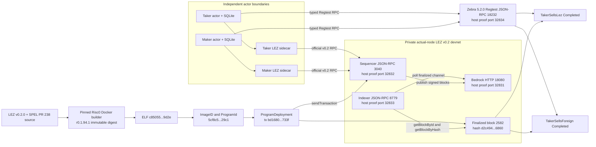

The canonical artifact above is the only current v0.2 deployment target: ELF
SHA-256
`c85055f6fe85b71535a322ba84ffc612f5d093954a721ba3b529428814dc9d2e`
and ImageID and ProgramId
`5cf8c5a4eedb3c2873956cb7898eb33a495407c9746fb1a065c99638159329c1`.
Deployment transaction
`bd16808ee91c9860e860830e7437148b3f4f81c632fc1b6d40350e20cc47733f`
is Finalized in block `2582`, hash
`d2c4944a936347207be7030bb39f6b8f21dfc3dc75e95afedb58e22ed1f96860`.
The exact source, toolchain, actor, LEZ transaction, Zebra transaction, balance,
and timing facts are retained in the
[canonical M2 certification packet](../evidence/m2-canonical-local-certification-20260714.json).
Earlier host-built ELF `40c9d37c...8021` and ProgramId `f8385049...0fbe`
remain solely as immutable historical-evidence identities. They are not
accepted by current manifests, actor configuration, or the corridor runner.
All displayed host ports are retained-proof addresses for one isolated run,
not defaults or reusable discovery values.

## M3 schema-4 actor-owned Maker-lock PoC and retained evidence

Run `m3schema4-20260717d`, completed at `2026-07-17T07:45:38Z` from the clean,
already-pushed repository commit
`0e7635fc7e50cc6e0612745dcdaf6df8bbcf6f9a`, is the current private-local
schema-4 checkpoint. Fresh one-shot Maker and Taker actor processes completed
both `TakerSellsForeign` and `TakerSellsLez` against one run-owned Bitcoin Core
31.1 Regtest and LEZ v0.2 service tuple. The test fixture submitted only the
Taker's direction-selected first lock. The schema-4 Maker actor independently
validated that exact first lock, consumed its role-local durable authority,
and submitted the opposite-chain second lock. The runner only mined or waited
for, and then confirmed, the Maker-submitted effect. Both role stores reached
revision 4 `Completed` in both directions; Maker restart and terminal replay
added zero submissions. The previous `m3actor-20260716n` and 2026-07-15
operator-composed packets remain historical evidence, not substitutes for this
actor-owned second-lock proof.

Core 31.1 requires `gettxspendingprevout` flags in one options object
`{mempool_only:false,return_spending_tx:true}`, rather than the older positional
boolean form. Finalized LEZ scans use bounded windows and each actor-sidecar
request has a finite 120-second timeout. In `TakerSellsLez`, nine typed
`moving_tip` results were returned while the local finalized tip advanced; a
tenth fresh-process observation obtained one stable exact first-lock proof and
then permitted the one Maker Bitcoin send. A `moving_tip` payload carries no
chain fact and grants no send authority. Bounded retries repeat reads only and
cannot re-arm a `Started`, `Unknown`, `Accepted`, or completed journal step.

The current runner allocates every host port dynamically on literal loopback.
Bitcoin publishes no P2P port. Core, Bedrock, the sequencer, the indexer, both
sidecars, state roots, credentials, and Docker resources are owned by one
unique run identifier. The endpoint labels below are protocols and process
roles, not reusable port numbers.

ADR 0048 starts the independent Core and LEZ service provisioners concurrently
only after immutable prebuild and artifact gates pass. Both fixed launcher
scripts are SHA-bound, placed in separate owned sessions, registered by exact
PID/start/executable/PGID/SID, waited, and reaped before bootstrap or actor
authority can proceed. Docker discovery authenticates fixed run, scope, and
component labels and retains every individually safe identity for cleanup even
when certification rejects an overcount. Run AA measured the pre-change
sequential startup at about 39 seconds for Core, 58 seconds for LEZ, and 98
seconds including handoff. Clean pushed Run AD completed startup in one
67-second concurrent window and the complete two-direction run plus cleanup in
16 minutes 6.52 seconds. The certified startup saving is 31 seconds. ADR 0049
now records fixed outer phases from Linux monotonic uptime, publishes an exact
owner-private packet, and binds its path and SHA-256 into the main run packet.
Clean pushed Run AE now measures 17 minutes 3.10 seconds before main
publication with only 280 ms unattributed. Its two complete user-direction
phases consume 75.2 percent. Direction-internal semantic timing and the
complete pinned CI quality suite are now GREEN: both child packets bind their
effect manifests and must fit inside their outer actor-flow or overlap parent
before main publication. Clean pushed Run AF now measures those packets:
346.06 seconds forward and 386.06 seconds reverse inside exact parents, with
five finalized lock/claim windows accounting for nearly all actor time and
every other child phase below one second. Differing host contention prevents
claiming Run AF's lower wall time as a speedup.

```mermaid
flowchart TB
    Source["Pinned LEZ v0.2 source and witnessed guest"]
    Artifact["Exact guest ELF<br/>SHA-256 a199c5be...e293"]
    Deployment["Exact ProgramDeployment<br/>ProgramId 39b6a4db...4dec"]

    subgraph Bootstrap["Run-owned bootstrap authority"]
        OuterRunner["M3 outer runner"]
        DirectionRunner["Two direction orchestrators"]
        Clock["Linux monotonic uptime"]
        Timing["Strict outer timing packet"]
        DirectionTiming["Two strict direction timing packets"]
        NodeCoordinator["Exact concurrent node-start coordinator"]
        Identity["Fresh maker and taker owner identities"]
        VaultDerive["Official owner-derived Vault account IDs"]
        CoreProvisioner["Core service, wallet, miner, and funding provisioner"]
        LezProvisioner["LEZ Bedrock, sequencer, and indexer provisioner"]
        LezBootstrap["Exact guest deploy, finality audit, and Vault Claims"]
        Clock --> OuterRunner
        Clock --> DirectionRunner
        OuterRunner --> NodeCoordinator
        OuterRunner --> Timing
        OuterRunner --> DirectionRunner
        DirectionRunner --> DirectionTiming
        NodeCoordinator --> CoreProvisioner
        NodeCoordinator --> LezProvisioner
        Identity --> VaultDerive
    end

    subgraph MakerHost["Maker role boundary"]
        Maker["Maker operator"]
        MakerRunner["Maker role runner"]
        MakerActor["schema-4 btc-reference-actor<br/>owns second lock and claims"]
        MakerStore[("Maker SQLite<br/>lifecycle, Maker-lock, effect, BTC, and LEZ journals")]
        MakerSidecar["Maker sidecar<br/>capability-authenticated loopback"]
        Maker --> MakerRunner
        MakerRunner --> MakerActor
        MakerActor --> MakerStore
        MakerActor --> MakerSidecar
    end

    subgraph TakerHost["Taker role boundary"]
        Taker["Taker operator"]
        TakerRunner["Taker role runner"]
        TakerActor["schema-4 btc-reference-actor<br/>observes Maker lock and owns reveal"]
        TakerStore[("Taker SQLite<br/>lifecycle, effect, BTC, and LEZ journals")]
        TakerSidecar["Taker sidecar<br/>capability-authenticated loopback"]
        Taker --> TakerRunner
        TakerRunner --> TakerActor
        TakerActor --> TakerStore
        TakerActor --> TakerSidecar
    end

    subgraph BitcoinStack["Run-owned Bitcoin Core 31.1 Regtest"]
        Core["JSON-RPC<br/>dynamic literal-loopback port<br/>restricted actor Basic credentials"]
        CoreState[("Run-owned chain, wallet, and deterministic Regtest funds")]
        Core --> CoreState
    end

    subgraph LezStack["Run-owned LEZ v0.2 private devnet"]
        Sequencer["Sequencer JSON-RPC<br/>dynamic literal-loopback port"]
        Bedrock["Bedrock HTTP<br/>dynamic literal-loopback port"]
        Indexer["Indexer JSON-RPC<br/>dynamic literal-loopback port"]
        Vaults[("Fresh derived maker and taker Vault accounts")]
        Escrow["Witnessed escrow program<br/>39b6a4db...4dec"]
        Sequencer -->|"publish signed channel blocks"| Bedrock
        Indexer -->|"read finalized channel"| Bedrock
        Sequencer --> Escrow
    end

    Source --> Artifact
    Artifact --> Deployment
    Deployment --> LezBootstrap
    VaultDerive --> LezBootstrap
    LezBootstrap --> Sequencer
    LezBootstrap --> Indexer
    LezBootstrap --> Vaults
    TakerFirst["Taker external first-lock fixture<br/>only PoC ownership exception"]
    Confirmer["Run controller<br/>mines or waits and confirms only"]
    CoreProvisioner -->|"cookie RPC for setup and deterministic funds"| Core
    LezProvisioner --> Sequencer
    LezProvisioner --> Bedrock
    LezProvisioner --> Indexer
    TakerFirst -->|"Bitcoin first lock"| Core
    TakerFirst -->|"LEZ first lock"| TakerSidecar
    Confirmer -->|"fixture-only mining"| Core
    Confirmer -->|"confirmation reads"| Core
    Confirmer -->|"finality reads"| Indexer
    MakerActor -->|"restricted role Basic RPC"| Core
    TakerActor -->|"restricted role Basic RPC"| Core
    MakerSidecar -->|"signed transactions"| Sequencer
    TakerSidecar -->|"signed transactions"| Sequencer
    MakerSidecar -->|"finalized observations"| Indexer
    TakerSidecar -->|"finalized observations"| Indexer

    Terminal["Run m3schema4-20260717d<br/>schema-4 Maker locks actor-owned<br/>two of two directions revision 4 Completed"]
    Timing -->|"Path and SHA 256 bound before success"| Terminal
    DirectionTiming -->|"Paths effect hashes and containment"| Terminal
    MakerActor --> Terminal
    TakerActor --> Terminal
    Core --> Terminal
    Indexer --> Terminal
```

The pushed M3 closure adds the application-facing durable SDK and explicit
Bitcoin Testnet4 routes without changing the retained local-node topology or
actor authority:

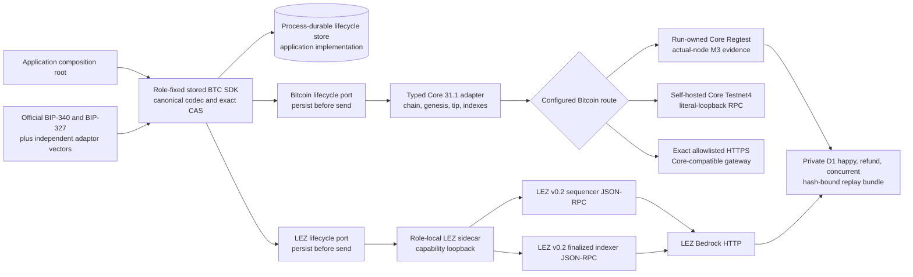

Only the Regtest and private-LEZ branches were used by actual-node M3
certification. The Testnet4 branches are configuration/readiness contracts:
literal loopback is valid for self-hosting, exact HTTPS is admitted only with
the Testnet4 profile, and both require exact Core 31.1, Testnet4 genesis, and
synchronized indexes. Neither branch was contacted publicly. The three private
recordings bind clean evidence commit `a6eb1ad` and verifier commit
`946208a`; their mode-`0600` bundle hash is
`3d7d7adc...a86c7cc`.

Fresh LEZ owners are generated for every actor run. The identity provisioner
derives each Vault account with the official Vault program function and emits
both owner and derived Vault identities. Genesis supplies the owner identity;
the sequencer derives and funds its Vault. Readiness and onboarding then query
that same derived Vault and submit exactly one owner-signed Vault Claim. This
prevents a fresh owner from accidentally being paired with a stale static
Vault identifier.

The runner independently hashes the supplied guest artifact, requires
`a199c5be...e293`, deploys ProgramId `39b6a4db...4dec` exactly once, and uses
sequential bounded indexer reads to prove the deployment and both Vault Claims
finalized. Node acceptance alone is not finality. Run `m3schema4-20260717d`
proved this bootstrap in the same fresh composition as both complete schema-4
directions: deployment finalized once in block 6, the maker Vault Claim in
block 9, and the taker Vault Claim in block 12.

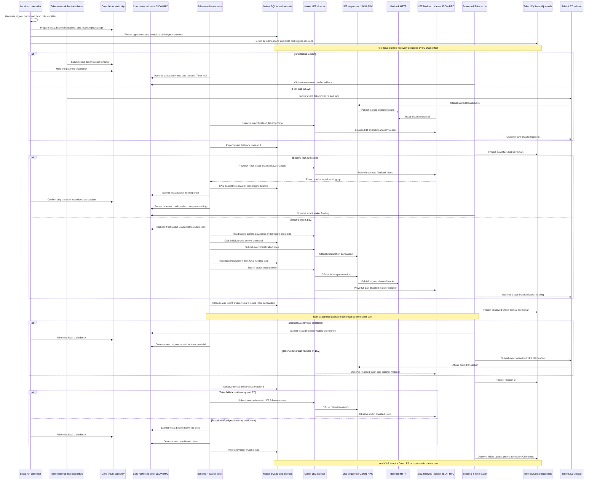

### Schema-4 `TakerSellsForeign` local flow

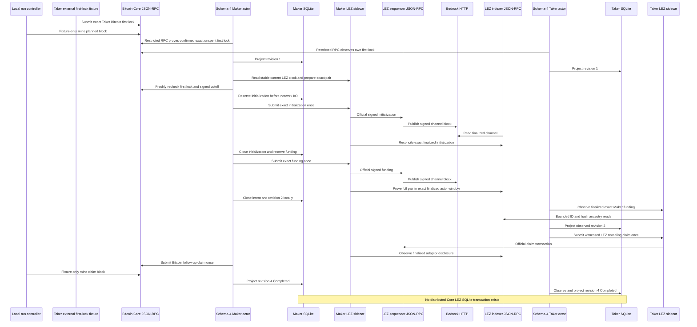

### Schema-4 `TakerSellsLez` local flow

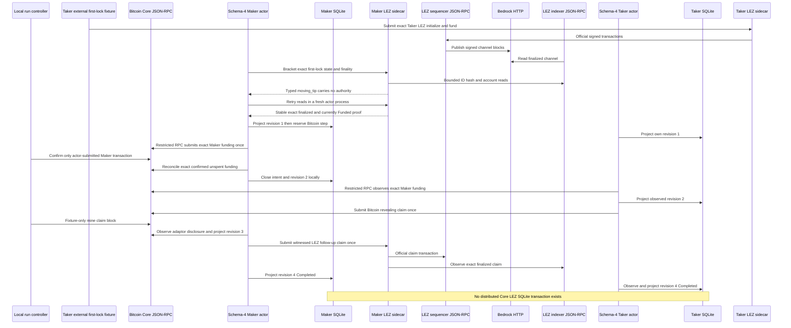

At the current PoC boundary, a Taker external fixture still constructs and
submits the first lock and the run controller owns deterministic local mining.
The schema-4 Maker actor constructs and submits the second lock through its
restricted Core RPC or role-local LEZ sidecar; the controller does not submit
that effect. The Maker's complete intent and revision-two close are atomic only
inside Maker SQLite. Chain submission is outside that transaction. Claims,
durable one-attempt authority, exact reconciliation, canonical observation,
and revisions three and four are actor-owned. A product Taker SDK must replace
the external first-lock fixture without changing the agreement or chain-adapter
contracts.

The older operator facts remain in the
[M3 local evidence packet](../evidence/m3-local-two-direction-poc-20260715.json).
The current secret-safe retained summary is
[the schema-4 checkpoint packet](../evidence/m3-schema4-actor-owned-lock-poc-20260717.json);
the full run packet is rooted at
`.e2e/m3schema4-20260717d/m3-actor-poc/evidence/`. It binds the exact pushed
commit and executable hashes. It retains dynamic local endpoints, fresh
owner-derived Vault onboarding, the checked guest deployment, both role
journals, one actor-owned Maker-lock effect per direction, five unique effects
per direction, four terminal role states, replay submission counts, and exact
cleanup attestation. It records no public RPC, faucet, public funds, or
private-material disclosure. The separate overlap checkpoint below closes the
accepted two-swap opposite-direction execution item. Process-kill, reorg,
chaos, production key custody, and public deployment remain outside this
checkpoint. Public deployment is intentionally not required for M3.

### M3 opposite-direction overlap checkpoint

Clean run `m3overlap-20260717a` completed from already-pushed commit
`1e6d5f1b9205aafb2df427f5285ff0920406b7d1` against the same run-owned Core
31.1 Regtest and LEZ v0.2 Bedrock/sequencer/indexer tuple. One controller per
economic direction stayed alive while every individual actor command used a
fresh one-shot process. Both swaps and all four actor stores reached revision
2 `both_legs_locked` before the controller issued either settlement permit.

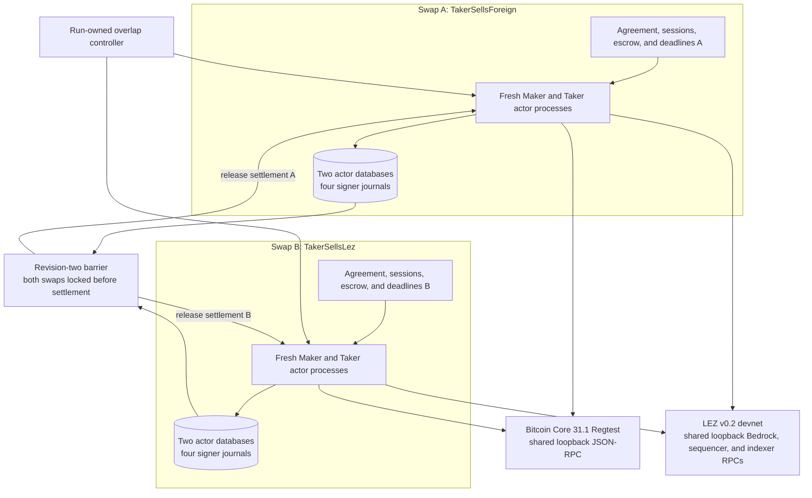

The funding fixture uses one deterministic local test-custody key but assigns
two distinct mature coinbase outpoints. Run A's source outpoint was mined at
height 1 and its planned contract anchor was 103; Run B's source was mined at
height 2 and its planned anchor was 104. Sharing the fixture key does not share
an outpoint, agreement, actor state, signer session, escrow, deadline, or
protocol authority. The revision-two inventory proved four distinct actor
database paths and inodes, eight distinct signer journal paths and inodes, two
Bitcoin and two LEZ sessions, two agreements, two escrow metadata/custody
pairs, and distinct refund bounds.

After the barrier, both roles in both swaps reached revision 4 `Completed`.
Each swap retained two Bitcoin and three LEZ effects; the effect ID sets were
pairwise disjoint and terminal replay added zero submissions. Exact cleanup
removed every captured run resource, used no broad cleanup, and targeted no
foreign activity. The secret-safe packet is
[m3-overlapping-two-swap-poc-20260717.json](../evidence/m3-overlapping-two-swap-poc-20260717.json).

This is protocol overlap, not one distributed transaction or a throughput
claim. Chain-mutating phases are deliberately serialized so each exact
mempool/finality assertion remains strict. Atomicity remains per swap:
presignatures are durable before its first effect, its Taker locks first, both
of its locks are canonical before reveal, and its claims/refunds follow the
signed chain order. Arbitrary-N scheduling, two same-direction swaps sharing a
LEZ depositor nonce stream, adversarial cutoff/refund races, reorg, and
production/public operation remain open.

## Actors, runtime components, and trust boundaries

```mermaid
flowchart TB
    subgraph People["Independent actors"]
        MO["Maker operator"]
        T["Taker"]
    end

    subgraph MakerHost["Maker-controlled host"]
        MC["Maker CLI"]
        MM["Maker mini-app"]
        LC["Logos Core lifecycle adapter"]
        MD["Maker daemon"]
        CO["Durable swap coordinator"]
        DB[("Maker SQLite schema v10<br/>lock + claim + refund journals")]
        PS["BTC / XMR / ZEC pair SDKs"]
        ZA["Canonical dual-signed LEZ/ZEC agreement validator"]
        ZTX["ZEC BIP-199 V5 transaction SDK"]
        CA["Validated chain adapters"]
        MOA["Maker-only taker-lock observation"]
        OJ["Contiguous exact-tracker journal<br/>canonical / depth / same-tip replacement / removal"]
        ME["Fresh-gated durable maker second lock"]
        MLB["Context-owning LEZ SDK ports + adapter"]
    end

    subgraph TakerDevice["Taker-controlled device"]
        TC["Taker CLI"]
        TM["Taker mini-app"]
        TS["Taker pair SDK + durable recovery state"]
        TA["Taker-side concrete agreement validator"]
        TMO["Taker-only maker-lock observation"]
        TDB[("Taker SQLite schema v10<br/>role-local recovery")]
        TLB["Context-owning LEZ SDK ports + adapter"]
    end

    subgraph SharedSecurity["Shared SDK security boundary"]
        PCM["Protected preimage + exact claim payload<br/>XChaCha20-Poly1305 + HKDF<br/>schema-v10 envelope journal"]
        M3AJ[("M3 role-local adaptor journal<br/>reserve before commitment<br/>consume nonce with exact partial GREEN")]
        M3AS[("M3 taker-only adaptor scalar<br/>owner-private file; point check only at activation<br/>maker authority forbidden")]
        M3RK[("M3 Bitcoin-funder refund scalar<br/>mode 0600 + x-only agreement match GREEN")]
        M3PE[("M3 role-local public-effect journal<br/>claim absence or refund eligibility before CAS<br/>refund race guard GREEN")]
        M3BR[("M3 BTC lifecycle recovery store<br/>four evidence revisions + hash chain<br/>offline Completed or Refunded GREEN")]
        M3SDK["M3 public durable BTC lifecycle SDK<br/>canonical codec and exact CAS store port<br/>typed BTC and LEZ runtime GREEN"]
        M3ML[("M3 Maker second-lock journal<br/>ordered one-attempt steps<br/>atomic revision-two close GREEN")]
        M3ID[("M3 exact-idempotent LEZ init path<br/>role-local reserve before official RPC<br/>actual-node restart no-rearm GREEN")]
        M3BC["M3 typed Core 31.1 adapter<br/>exact unspent funding + claim/refund evidence<br/>authorized one-send readback GREEN"]
        M3F7A["F7 countersigned asset extension<br/>strict v2 protocol + four classifiers GREEN"]
        M3F7C["F7 exact-once bridge client<br/>eleven v2 operations + role/window checks GREEN"]
        M3F7D["F7 agreement and local-policy adapter<br/>eleven no-submit mappings GREEN"]
        M3F7S["F7 official sidecar planner<br/>tags 11, 7, 8, 12, and 10<br/>four durable v2 reservations GREEN"]
        M3F7R["F7 sidecar and finalized scanner<br/>lifecycle-aware terms discovery + containing-block anchors GREEN<br/>90s max3 historical reads in 120s actor budget<br/>four actual-node pairs GREEN"]
        M3F7P["F7 peer funding projection<br/>schema 5 v2 DiscoverByTerms<br/>nonowner has no submit authority GREEN"]
        M3RA["btc-reference-actor<br/>schema 4 live locks and schema 5 peer projection GREEN<br/>four complete F7 actual-node pairs GREEN"]
        M3RUN["Schema 4 private-local runner<br/>external Taker first lock<br/>actor-owned Maker second lock GREEN"]
        M3CACHE["Policy-2 official-wallet artifact cache<br/>executable plus manifest only<br/>202.42s cold and 10.35s hit GREEN"]
        M3F7A --> M3F7C
        M3F7C --> M3F7D
        M3F7D --> M3F7S
        M3F7S --> M3F7R
        M3F7R --> M3F7P
        M3F7P --> M3RA
        M3CACHE -->|"verified private wallet copy"| M3RUN
    end

    subgraph LezSidecars["Role-isolated official LEZ v0.1.2 processes"]
        MSL["Maker sidecar<br/>official wire + signer + durable cache"]
        TLS["Taker sidecar<br/>official wire + signer + durable cache"]
    end

    subgraph LocalLezFixture["Run-scoped exact-v0.1.2 node fixture"]
        ELN["Reusable external standalone process<br/>checked guest + fresh mode-0700 home"]
        LRM[("Private mode-0600 readiness<br/>endpoint + deployment tx/block + ProgramId<br/>built-in owner + funded actor keys")]
        LRR["Future reference-actor runner<br/>splits role-local endpoint and key files"]
    end

    subgraph LezV02Sidecars["Official LEZ v0.2 sidecar boundary"]
        MSL2["Maker v0.2 PoC process<br/>Vault Claim + native deposit GREEN"]
        TLS2["Taker v0.2 PoC process<br/>Vault Claim + native claim GREEN"]
        V02J[("Separate role-bound state<br/>exact reservations + Vault attempt journals GREEN")]
        MBR2["Maker lez-v02-bridge-poc<br/>canonical forward and reverse complete"]
        TBR2["Taker lez-v02-bridge-poc<br/>canonical forward and reverse complete"]
        M3WB["M3 witnessed prepare, complete, and submit<br/>both local happy directions GREEN"]
        M3FF["M3 finalized witnessed-funding observer<br/>parent-linked stable-tip ancestry<br/>historical Funded state GREEN"]
        M3CF["M3 generic current funded-escrow proof<br/>stable state-only clock and custody GREEN<br/>923586b; not finality"]
        M3FO["M3 finalized witnessed-claim observer<br/>parent-linked stable-tip ancestry<br/>dual role + BIP340 GREEN"]
        M3RF["M3 native-refund planner + finalized observer<br/>state-only, exact, and discovery GREEN"]
        M3LI["Live LEZ init admission<br/>exact same ID and bytes<br/>one role-local send GREEN"]
        M3LC["Joined LEZ first-lock view<br/>stable current state plus exact bytes<br/>and finalized ancestry GREEN"]
        MBRJ[("Maker-only request store<br/>PREPARE replay + submit unknown-before-I/O GREEN")]
        TBRJ[("Taker-only request store<br/>PREPARE replay + submit unknown-before-I/O GREEN")]
        MSL2 --> V02J
        TLS2 --> V02J
        MBR2 --> MBRJ
        TBR2 --> TBRJ
        MBR2 --> M3WB
        TBR2 --> M3WB
        M3WB --> V02J
        MBR2 --> M3FF
        TBR2 --> M3FF
        MBR2 --> M3FO
        TBR2 --> M3FO
        MBR2 --> M3RF
        TBR2 --> M3RF
    end

    subgraph LocalLezV02["Required public-compatible local LEZ v0.2 devnet"]
        BR["Bedrock HTTP 18080<br/>retained proof host 32831"]
        IX["LEZ v0.2 indexer RPC 8779<br/>retained proof host 32833"]
        SQ["LEZ v0.2 sequencer RPC 3040<br/>retained proof host 32832"]
        V02R["Host orchestrator<br/>exact-ID lifecycle and RPC probes"]
        V02Net["Unique no-masquerade Docker bridge<br/>dynamic loopback ports"]
        V02Ready[("v0.2 services + Vault Claims + canonical deploy GREEN<br/>ProgramId 5cf8c5...29c1")]
        V02Native[("Native init + fund + claim GREEN<br/>finalized blocks 219 220 223")]
        V02Fixture[("Fixture readiness GREEN<br/>isolated configs; saved window stale")]
        V02Partial[("Historical host-built evidence retained<br/>14d through 14o and reverse 14c")]
        V02Full[("Canonical ZEC corridor directions GREEN<br/>2 of 2 happy directions")]
        V02M3[("M3 aggregate-witness guest deployed<br/>ELF a199c5be...e293<br/>ProgramId 39b6a4db...4dec; two claims finalized")]
        V02State[(".e2e/run_id/lez-v02")]
    end

    subgraph OffChain["Untrusted, removable after lock"]
        DC["Delivery / Chat"]
    end

    subgraph Nodes["Actor-selected node boundary"]
        LEZ["LEZ sequencer<br/>dynamic local port<br/>private v0.2 execution GREEN<br/>public live execution deferred"]
        BTC["Bitcoin Core 31.1 Regtest<br/>both adaptor claim directions GREEN<br/>service mode and durable SDK/journal GREEN"]
        XMR["monerod + wallet RPC"]
        ZEC["Zebra 5.2.0 Regtest JSON-RPC<br/>retained proof host 32834"]
    end

    subgraph DormantRoutes["Dormant public route contracts; no public I/O evidence"]
        RouteGate["Schema-v3 route + signed runtime<br/>pre-persistence validation"]
        LezProfile{"Sidecar outbound LEZ profile"}
        PublicLez["Exact HTTPS<br/>testnet.lez.logos.co"]
        PublicLezRisk["Finalized-tip method<br/>availability unknown"]
        ZebraProfile{"Actor Zebra route"}
        SelfHostedZebra["Self-hosted loopback<br/>cookie authentication"]
        TatumZebra["Exact Tatum Testnet HTTPS<br/>x-api-key authentication"]
    end

    subgraph PublicIdentity["Dormant public deployment identity handoff"]
        V02Deploy["Exact-once v0.2 deployment client<br/>fixed official RPC"]
        V02AuthKey[("Separate owner-only 32-byte<br/>evidence authentication key")]
        V02Evidence[("Bounded HMAC-authenticated evidence<br/>channel + genesis + program + tx + block")]
        V02Target["Canonical Docker target<br/>ELF c85055...9d2e<br/>ProgramId 5cf8c5...29c1"]
        V02Provision["Offline provision-identity<br/>trusted target + no-clobber"]
        V02Runtime[("Exact public runtime identity")]
    end

    subgraph Networks["Consensus networks"]
        LN["LEZ"]
        BN["Bitcoin"]
        XN["Monero"]
        ZN["Zcash transparent pool"]
    end

    MO --> MC
    MO --> MM
    MO --> LC
    MC -->|"authenticated local RPC"| MD
    MM -.->|"M6 authenticated local RPC"| MD
    LC -.->|"start / stop / health"| MD
    MD --> CO
    CO --> DB
    CO --> PS
    PS --> ZA
    PS --> ZTX
    PS --> CA
    PS --> MOA
    PS --> ME
    PS --> MLB
    ZTX --> CA

    T --> TC
    T --> TM
    TC --> TS
    TS --> TA
    TS --> TMO
    TS --> TDB
    TS --> TLB
    TMO --> TDB
    TMO -->|"signed direction selects one node"| LEZ
    TMO -->|"signed direction selects one node"| ZEC
    PS --> PCM
    TS --> PCM
    PS --> M3AJ
    TS --> M3AJ
    TS -->|"taker only owner-private authority"| M3AS
    PS -->|"maker private config"| M3RA
    TS -->|"taker private config"| M3RA
    PS -->|"only when maker is Bitcoin funder"| M3RK
    TS -->|"only when taker is Bitcoin funder"| M3RK
    M3AJ -->|"existing exact-role Bitcoin and LEZ journals"| M3RA
    M3AS -->|"stable read and agreement point check"| M3RA
    M3RK -->|"Bitcoin funder only; exact refund key"| M3RA
    M3WB -->|"full prepared claim result"| M3RA
    M3SDK -->|"schema 4 exact plans"| M3RA
    M3ML -->|"observe before one send; close with revision two"| M3RA
    M3ID -->|"typed exact-idempotent live mapping"| M3RA
    M3RUN -->|"schema-4 live composition"| M3RA
    M3RA -->|"predecessor CAS projections one through four"| M3BR
    M3RA -->|"agreement-derived Bitcoin funding, claim, and refund"| M3BC
    M3RA -->|"signed-account finalized LEZ funding read"| M3FF
    M3RA -->|"current funded proof in joined live view"| M3CF
    M3RA -->|"signed transcript finalized LEZ claim read"| M3FO
    M3RA -->|"state-only, prepare, exact, submit, finalized discovery"| M3RF
    M3RA -->|"LEZ Maker initialization and funding"| M3LI
    M3RA -->|"Bitcoin Maker send gate"| M3LC
    M3LI --> M3WB
    M3ID -->|"same request ID and bytes"| M3LI
    M3LC --> M3FF
    M3CF -->|"current Funded facts only"| M3LC
    M3RA -->|"persist exact actor-owned claim or refund before authority"| M3PE
    PCM -->|"encrypted envelope + journal"| DB
    PCM -->|"encrypted envelope + journal"| TDB
    TM -.-> TS

    MLB <-->|"bounded authenticated lez_bridge.v1"| MSL
    TLB <-->|"bounded authenticated lez_bridge.v1"| TLS
    MSL -->|"pinned generated JSON-RPC"| LEZ
    TLS -->|"pinned generated JSON-RPC"| LEZ
    ELN -->|"start exact upstream service"| LEZ
    LEZ -->|"official health, tx/block, static built-in, account RPC"| ELN
    ELN -->|"atomic no-clobber publish after verification"| LRM
    LRM -.->|"future private handoff"| LRR
    LRR -.->|"maker-only provisioning"| MSL
    LRR -.->|"taker-only provisioning"| TLS
    MLB <-->|"live bounded bridge; canonical runs Completed"| MBR2
    TLB <-->|"live bounded bridge; canonical runs Completed"| TBR2
    MSL2 -->|"official v0.2 JSON-RPC"| SQ
    TLS2 -->|"official v0.2 JSON-RPC"| SQ
    MBR2 -->|"reveal forward; initialize and fund reverse"| SQ
    TBR2 -->|"initialize and fund forward; reveal reverse"| SQ
    MBR2 -->|"non-genesis finalized-tip readiness"| IX
    TBR2 -->|"non-genesis finalized-tip readiness"| IX
    M3FO -->|"bounded ID and hash blocks parent-linked through stable tip<br/>unique transcript + accounts at containing BlockId"| IX
    M3FF -->|"bounded ID and hash blocks parent-linked through stable tip<br/>canonical FundNative + historical Funded accounts"| IX
    M3F7R -->|"finalized candidate plus metadata, definition, and custody<br/>at one immutable containing BlockId"| IX
    MBR2 -->|"typed outbound profile"| LezProfile
    TBR2 -->|"typed outbound profile"| LezProfile
    LezProfile -->|"local explicit loopback"| SQ
    LezProfile -->|"local explicit loopback"| IX
    LezProfile -.->|"official_public"| PublicLez
    PublicLez -.-> PublicLezRisk
    V02Deploy -.->|"future owner-authorized deployment"| PublicLez
    V02AuthKey -->|"authenticate observed facts"| V02Deploy
    V02Deploy -->|"retain exact observed result"| V02Evidence
    V02Evidence --> V02Provision
    V02AuthKey -->|"verify before trust"| V02Provision
    V02Target --> V02Provision
    V02Provision --> V02Runtime
    V02Runtime -.->|"future signing and role provisioning"| RouteGate
    V02R -->|"start first; cryptarchia and channel HTTP"| BR
    V02R -->|"start after channel; finalized ID and hash RPC"| IX
    V02R -->|"start after exact missing proof; service RPC"| SQ
    V02R --> V02Net
    V02R --> V02State
    V02Net --> BR
    V02Net --> IX
    V02Net --> SQ
    SQ -->|"Zone SDK signed publish"| BR
    IX -->|"poll finalized LEZ channel"| BR
    V02R -->|"write run-scoped evidence"| V02Ready
    V02Ready --> V02Native
    V02Ready --> V02Fixture
    ZEC -->|"stable mature Regtest UTXO query"| V02Fixture
    V02Native --> V02Partial
    V02Fixture --> V02Partial
    V02Ready -->|"canonical deployment finalized"| V02Full
    V02R -->|"digest-pinned build, recursive execution, official-wire completion"| V02M3
    M3WB --> V02M3
    V02M3 -->|"deployment and witnessed claims finalized"| SQ
    V02Fixture -->|"fresh role provisioning"| V02Full
    V02Full -->|"direction-derived funding and exact spend on Zebra"| ZEC
    V02Full -.->|"runtime and funding handoff"| LRR
    ZA --> RouteGate
    TA --> RouteGate
    RouteGate --> LezProfile
    RouteGate --> ZebraProfile
    PS --> ZebraProfile
    TS --> ZebraProfile
    ZebraProfile -->|"deterministic_local"| ZEC
    ZebraProfile -.->|"self_hosted_cookie"| SelfHostedZebra
    ZebraProfile -.->|"tatum_testnet_x_api_key"| TatumZebra

    MD <-->|"discovery + negotiation only"| DC
    TS <-->|"discovery + negotiation only"| DC
    CA --> LEZ
    CA --> BTC
    M3BC --> BTC
    CA --> XMR
    CA --> ZEC
    MOA -->|"signed direction selects one node"| LEZ
    MOA -->|"signed direction selects one node"| ZEC
    MOA -->|"validated event"| OJ
    OJ -->|"atomic role-local projection"| DB
    OJ -->|"full-history replay"| CO
    ME -->|"fresh exact-head query"| MOA
    ME -->|"intent and confirmed transition"| DB
    ME -.->|"typed production action pending"| CA
    TS --> LEZ
    TS --> BTC
    TS --> XMR
    TS --> ZEC
    LEZ --> LN
    SQ -.-> LN
    PublicLez -.-> LN
    BTC --> BN
    XMR --> XN
    ZEC --> ZN
    SelfHostedZebra -.-> ZN
    TatumZebra -.-> ZN

    classDef planned stroke-dasharray: 5 5,fill:#fff7e6,stroke:#9a6700;
    classDef implemented fill:#ddf4ff,stroke:#0969da;
    classDef running fill:#e6ffec,stroke:#1a7f37;
    class MM,LC,CA,TM,LRR,PublicLezRisk planned;
    class TC,M3AS,M3RK,M3PE,M3RF,M3BR,M3BC,M3SDK,M3ML,MBRJ,TBRJ,V02Partial,RouteGate,LezProfile,PublicLez,ZebraProfile,SelfHostedZebra,TatumZebra,V02Deploy,V02AuthKey,V02Evidence,V02Target,V02Provision,V02Runtime implemented;
    class BR,IX,SQ,V02R,V02Net,V02Ready,V02Native,V02Fixture,V02Full,V02State,MSL2,TLS2,V02J,MBR2,TBR2,M3FF,M3FO,M3CF,M3ID,M3LI,M3LC,M3RA,M3RUN running;
```

The maker operator owns maker policy, keys, node selection, and the daemon
lifecycle. The taker owns a separate client, keys, node selection, and recovery
state. Logos Core is an optional lifecycle surface, never a protocol authority.
Delivery / Chat is not trusted with secrets or chain truth and may disappear
after the first lock. Chain adapters accept consensus evidence from the selected
LEZ sequencer, Bitcoin Core, `monerod`, or Zebra; peer messages never advance an
on-chain state by themselves.

The concrete LEZ/ZEC agreement validator is integrated on both actor sides as
one bounded canonical wire contract. Negotiation yields untrusted bytes;
role-fixed SDK instances validate and persist an accepted envelope before
activation, then revalidate its exact durable wire on resume without retaining
transport or raw adapter handles. The current executable SDK store is a
role-fixed production SQLite adapter for accepted agreement, both lock intents,
taker projection, maker-independent observation replay, confirmed maker funding,
and the taker-local observed-maker transition. Schema-v10 claim and refund
journals protect exact owner material, keep observer paths secret-free, and
replay separate role stores to `Completed` or `Refunded` in both directions.
The BTC pair exposes a dependency-light role-fixed funding facade with exact
Bitcoin and ordered LEZ plans and byte-bound first-lock validation. Its dedicated
Maker-only revision-one SQLite journal persists the complete second-lock plan,
consumes one authority per step, retains node-admitted versus ambiguous outcomes
without rearming, and accepts completion only from exact canonical observation.
Maker revision-two projection and intent close share one transaction; Taker
projection remains observation-only. Run `m3schema4-20260717d` composes that
contract through the live schema-4 CLI in both directions. For a LEZ Maker
lock, the role-local journal reserves exact initialization and funding steps
before the sidecar's official sequencer calls; identical request IDs and bytes
never re-arm, without pretending that LEZ exposes pending-transaction absence.
For a Bitcoin Maker lock, the actor joins a stable current `Funded` state and
custody read with exact transaction bytes and independently bounded finalized
ancestry before its Core send CAS. State-only evidence does not replace bytes
or finality. Both paths re-read the exact Taker first lock and current
Maker-chain clock before any possible send, and only a strictly pre-cutoff result can grant
fresh authority. The retained run proves one live Maker-lock effect per
direction, restart with zero re-submission, exact reconciliation, and
revision-two closure; it does not make the local-node semantics a production
endorsement.
The official native-refund sidecar, main revealing-claim/refund validation
adapters, both-direction agreement-bound Zebra funding discovery, and
context-owning LEZ SDK ports are now GREEN. The production fresh-client
factory, actor-owned random request/window allocator, and cloneable shared
role-local operation journal close the corresponding process-composition
prerequisites. Reopened role-local SQLite is now the canonical LEZ claim-funding
authority in both directions and reverse claims require the durable opposite
Zcash lock. The role-keyed Zcash funding/claim/refund signer retains only
zeroizing key bytes and uses the canonical SDK builders. The
agreement-committed exact-outpoint planner, checked all-trait Zebra composite,
refund-aware full-history resume, and the mode-0600, path-isolated one-shot
maker/taker CLI boundary are GREEN. Offline `status` now opens only a
pre-existing hardened role store, replays all durable lock/claim/refund state
with chain ports impossible by type, and leaves missing state uncreated. The
v0.2 sidecar foundation now binds the exact official LEE account and
transaction types, canonical signed-transaction decoder, sequencer
health/channel RPC, and an authenticated role/run-bound describe server. Its
native escrow planner prepares and validates an exact signed initialize/fund
pair using node-observed consecutive nonces. Its Vault planner prepares and
validates the exact official maker/taker Claim transactions with role-specific
allocations and an independently confirmed owner nonce. Both optionally persist
their exact reservation in a Linux owner-only no-symlink directory and recover
the same validated signed bytes after restart without another nonce lookup.
The native refund planner separately derives the official metadata, custody, and
immutable depositor account order, constructs an unsigned `RefundNative` public
transaction with zero nonces and witnesses, and durably reserves the exact bytes
before exposure. It accepts strict legacy and witnessed terms, revalidates the
aggregate authority binding for the witnessed shape, restores byte-identically
after restart without a nonce lookup, and admits only the retained transaction
to the generic submission boundary. This planner performs no RPC and does not
claim deadline eligibility or finality.
Their role-bound SQLite effect journal now exposes the narrow Vault Claim
one-attempt state machine: it commits exact typed preparation and
`AttemptStarted` before the only official-transaction call and makes every
reopen observe-only. Forced races, crash windows, ambiguity, error
classification, schema tampering, and filesystem substitution are GREEN in
library tests. The retained local v0.2 stack then proved both owner-authorized
Vault Claims, checked deployment, and separate maker/taker PoC processes driving
native initialize/fund/claim into finalized blocks 219/220/223. The native CLI
itself proves sequencer inclusion and same-tip state; sequential indexer reads
provide the distinct finality proof. It reports `crash_atomic_submission=false`.
The exact `lez-v02-bridge-poc` source now provides the role/run/runtime/signer-
bound process boundary for prepare, observe, revealing claim, and submit. It
requires an explicit nonzero loopback actor listener and private file inputs.
Its outbound node profile accepts either explicit loopback HTTP sequencer and
indexer URLs or the exact `https://testnet.lez.logos.co/` origin for both;
mixed or generic remote routes fail before client construction. It gates
startup on the official sequencer and indexer health calls, replays successful
PREPARE results, re-executes observations and transient PREPARE failures, and
persists submit as unknown before node I/O. The authenticated bridge
prepare-refund method reaches the internal durable planner, stores the canonical request/result, and reconstructs and compares it
before a restarted server binds. The repeatable observe-refund method now uses
fully covered finalized indexer ancestry, equal by-ID/by-hash blocks, historical
and tip accounts, and the containing-block deadline. It never submits or caches chain truth. The actor-local lifecycle store now
replays ordered maker- and taker-funded refund evidence to terminal `Refunded`;
public actor one-attempt submission is deterministic-test GREEN, and fresh
actual-node two-lock plus first-lock refund evidence is GREEN in
`m3refund-20260716h` and `m3firstlock-20260716h`.
Sequencer observation remains bounded inclusion plus same-tip accounts. The
new witnessed-claim path separately asserts indexer finality through bounded
fully covered scans, equal by-ID/by-hash finalized blocks, exact aggregate
witness validation, and terminal accounts read at the containing block. Either
role-bound participant can observe without submitting, and the client
independently verifies BIP-340. The v2 finalized asset classifiers bind a
positive candidate to its immutable finalized containing block. After bounded
historical metadata, token-definition, and custody reads at that block, the
sidecar revalidates the same block through the official indexer's by-ID and
by-hash methods. Advancing an unrelated latest tip does not invalidate the
candidate; a missing or changed candidate fails closed. Those historical reads
use explicit nested budgets and bounded concurrency strictly inside the
120-second actor bridge request timeout: ordinary block and tip calls retain a
10-second, single-request client, while the historical-account client uses a
90-second budget, maximum concurrency three, and one bounded concurrent join
for custom-token metadata, definition, and custody. Run O showed that these
client requests can be concurrent while the upstream service effectively
serializes or queues them. The larger local budget accommodates that behavior
for PoC diagnostics; upstream batch reads or cached block-identified snapshots
remain the production improvement. The historical responses remain
authoritative-indexer consistency checks, not cryptographic account proofs or
one atomic multi-read snapshot. No fresh actual-node F7 PoC is implied by this
component correction or run O. Historical runs 14d through 14n remain failure
and invariant evidence. Fresh
pre-canonical run `m2poc-corridor-fresh-20260714o` completed `TakerSellsLez`: the taker
initialized and funded LEZ, the maker funded Zcash, waited for two
confirmations, claimed LEZ and revealed the preimage, and the taker spent the
Zcash HTLC. Both independent actors reached revision 4 `Completed` in 25.370
seconds. One payload-free `moving_tip` observation was retried once. A separate
indexer audit found the LEZ effects in finalized blocks 264/265/266 and proved
terminal `Claimed` metadata and zero custody; Zebra funding at height 106 was
spent at height 108.

The pre-canonical reverse run `m2poc-corridor-reverse-fresh-20260714c` completed
`TakerSellsForeign`: the taker funded Zcash, the maker initialized and funded
LEZ after the two confirmations, the taker claimed LEZ and revealed the
preimage, and the maker spent the Zcash HTLC. Both independent actors again
reached revision 4 `Completed`, this time in 26.960 seconds without a drive
retry. LEZ initialize/fund/claim finalized in blocks 641/642/643, and Zebra
funding at height 113 was spent at height 115. Two earlier effect-bearing
reverse attempts are retained and never reused; they exposed a canonical LEZ
validator that was hard-coded to the forward taker depositor. The correction
now validates the agreement-derived LEZ depositor and signer in both
directions. Those successful 14o and reverse 14c records used the host-built
`f8385049...0fbe` program and remain immutable historical evidence, not current
deployment authority.

Canonical certification rebuilt the guest in the pinned Docker builder as ELF
`c85055f6...9d2e`, ProgramId `5cf8c5a4...29c1`, deployed it in transaction
`bd16808e...733f`, and proved Finalized inclusion in LEZ block `2582`. Run
`m2cert-canonical-forward-bb53daf-20260714a` then completed
`TakerSellsLez` in 25.580 seconds over 38 drive rounds with two bounded retries;
Zebra advanced from height 121 to 124. Run
`m2cert-canonical-reverse-bb53daf-20260714a` completed
`TakerSellsForeign` in 28.790 seconds over 47 drive rounds without a retry;
Zebra advanced from height 124 to 127. Both independent actor stores reached
revision 4 `Completed`, both configs bound only the canonical ProgramId, and no
public RPC or faucet was used.

The development runner provisions fresh role inputs and executes independent
`activate`/`drive` processes. Before effects it acquires a nonblocking advisory
`flock` keyed by the SHA-256 of the configured sequencer, indexer, and Zebra
endpoint tuple. That lock serializes only users of the same retained nodes and
does not inspect, stop, or prune unrelated Docker resources. Its live atomic
guard permits the revealing LEZ claim only after the Zcash funding has two
confirmations, and permits the Zcash follow-up spend only after that LEZ reveal;
it also rejects a wrong role or duplicate chain effect. The saved early fixture
window 1..256 remains stale and is not reused. Both required local-devnet happy
directions are now GREEN. The dormant LEZ and Zebra public-route construction
contracts are also GREEN without public I/O. Restart, refund, reorg, chaos,
live-public behavior, and production hardening remain explicit later gates. Chain
adapters must
independently recompute every chain-derived account, input, and deadline. Maker
observation alone is non-authorizing: forward Zcash persists and revalidates
the complete canonical output type plus ordered canonical, depth, atomic
same-tip replacement, and affirmative exact-head removal events. The SDK and
store fold `ZcashObservationTracker`, so duplicate polls write nothing and
changed inclusion without replacement fails. Schema v10 rejects orphan, holey,
or history-incompatible rows and catches stale instances up before returning.
The maker effect invokes the distinct fresh pre-second-lock call internally,
then persists the exact direction-fixed opposite-chain plan before submission.
Confirmed Maker evidence commits atomically and replays to `BothLegsLocked` in
both directions without caching authority in `next_action`. Reverse LEZ rejects
primitive ID/depth assertions and
persists a stable primitive snapshot bound to the signed channel/genesis,
public fund transaction, canonical block/tip, complete SPEL metadata, exact
custody, depth, and finality policy. SDK and SQLite replay rerun the same
validator. The dependency-free exact-head tracker is now folded by the active
SDK and the schema-v10 journal. Exact duplicates write no row, while a
same-inclusion Pending-to-Finalized update advances one contiguous revision and
survives close/reopen. The pure tracker also proves affirmative same-tip
replacement, stale-evidence rejection, and fatal finalized-history changes.
Complete primitive removal/replacement records now carry nonfinal reorgs
through the active SDK and SQLite, while stale old-head evidence fails without
a row or revision change. Deterministic-local reverse fresh eligibility now
replays and re-queries the exact head and checks signed depth; local Pending
remains eligible when depth is sufficient, and no result is cached as
authority. The public Finalized/typed-finality policy and exact route can now be
constructed, but neither has been exercised against a public node. The official
LEZ origin's availability of the required finalized-tip/indexer method remains
an upstream release risk. The official
v0.1.2 node/escrow, revealing-claim, and native-refund owner/discovery ports,
main escrow/claim/refund agreement conversion, and crash-safe context-owning
SDK-port wiring are GREEN lower compatibility evidence. Public deployment is
deferred under ADR 0023. The full local v0.2 runtime tuple and independent actor
processes are GREEN in both happy directions. Dormant public configuration
contracts are GREEN; public live execution, actual-node restart/refund/reorg
and maker-fault evidence, and production adapter composition remain open.

## Dormant route admission and actor flow

```mermaid
flowchart LR
    Evidence["HMAC-authenticated deployment evidence"]
    AuthKey["Separate owner-only authentication key"]
    TrustedTarget["Immutable manifest + compiled target"]
    Provision["Offline provision-identity<br/>no RPC + no-clobber"]
    RuntimeIdentity["Exact public runtime identity"]
    Config["Untrusted schema-v3 actor config"]
    Terms["Dual-signed agreement + runtime descriptor"]
    Validate["Validate route, credentials, role, signer,<br/>network, branch, genesis, channel, and program"]
    Reject["Reject before persistence or effects"]
    Accept["Accepted role-local runtime"]

    Evidence -.->|"future public provisioning"| Provision
    AuthKey --> Provision
    TrustedTarget --> Provision
    Provision -.-> RuntimeIdentity
    RuntimeIdentity -.->|"sign into both inputs"| Config
    RuntimeIdentity -.->|"sign into both inputs"| Terms
    Config --> Validate
    Terms --> Validate
    Validate -->|"invalid"| Reject
    Validate -->|"valid"| Accept

    Accept --> ZebraRoute{"Actor Zebra route"}
    ZebraRoute -->|"deterministic_local"| Regtest["Loopback Zebra Regtest"]
    ZebraRoute -.->|"self_hosted_cookie"| SelfHosted["Loopback Zebra + cookie"]
    ZebraRoute -.->|"tatum_testnet_x_api_key"| Tatum["Exact Tatum HTTPS + x-api-key"]

    Accept --> Bridge["Loopback bridge client + capability"]
    Bridge --> Sidecar["Role-isolated official-wire sidecar"]
    Sidecar --> LezRoute{"Outbound LEZ profile"}
    LezRoute -->|"local"| LocalLez["Loopback sequencer + indexer"]
    LezRoute -.->|"official_public"| PublicLez["Exact official LEZ HTTPS"]
    PublicLez -.-> Risk["Finalized-tip method availability unknown"]
```

Solid route edges are the actual local evidence paths. Dashed edges are dormant
configuration and client-construction contracts proven without public network
calls. They do not claim endpoint availability, authentication success,
funding, deployment, transaction propagation, finality, or provider behavior.

The protected-claim module derives per-context keys with HKDF-SHA256 and encrypts
preimages and bounded exact claim-submission bytes with XChaCha20-Poly1305 while
binding schema, swap, pair, direction, agreement, role, purpose, and key ID.
Schema-v10 SQLite claim/refund intents and owner/observer transitions are
implemented with atomic revision commits, close/reopen replay, rollback,
conflict, corruption, and legacy-secret scrub coverage.

The dashed state reflects delivery honestly. The deterministic core, SQLite
repository, maker daemon, authenticated maker CLI flow, LEZ semantic
verification, pinned SPEL/LEZ generated-IDL/client fixture, and ZEC exact-script
plus signed V5 spend foundation exist. Bounded spend recognition now matches
pinned Zebra consensus across all defined sighash modes and alternate valid
stack/signature encodings while reporting stricter SDK construction policy
separately. Deterministic actor-owned funding/change and pinned, vulnerability-clean
Zebra 5.2.0 Regtest acceptance/rejection/confirmation, concurrent swaps,
confirmation regression, exact rebroadcast, block reconsideration, and a
two-node conflicting four-over-three-block fork replacement now exist as
consensus-node proof. Source-correct authenticated-transfer/ATA custody and
generated owner-role clients now exist as locally composed upstream-program
evidence. The checked Risc0 guest now builds reproducibly, deploys through the
isolated standalone sequencer's JSON-RPC, and executes the complete native initialize/fund/claim/refund
lifecycle with real funded actor keys in an isolated v0.1.2 standalone
sequencer. Wrong-preimage, wrong-role, and early-refund transactions are
excluded from canonical blocks without mutating nonce or custody. Native
recursive cost evidence is machine-checked from production state transitions
without Clock noise. The official ATA lifecycle also passes for two independent
definitions with real owner roles and permissionless fixed refunds. Their
escrow/ATA/Token recursion is also included in the machine-checked cost record.
Public-testnet execution evidence is deferred to production readiness. The
full-runtime local v0.2 happy path and composed both-direction maker/taker
processes are evidence-backed PoC boundaries. Production adapter composition,
cross-chain deadline and refund composition, actual-node restart/reorg/chaos,
encrypted state/outbox, and mini-apps remain milestone work and cannot yet be
represented as production E2E.

The reusable external local-node boundary is narrower than that composed E2E.
It recomputes the tracked ELF SHA-256 and Risc0 ImageID before creating any
state, refuses an existing node home or readiness path, creates its own
mode-0700 home, and requests an upstream dynamic port. It publishes the
literal-loopback client endpoint only after official RPC verifies health,
genesis identity, mandatory chain progress, checked-guest deployment and
the exact deployment transaction and containing block, ProgramId, the static
authenticated-transfer built-in identity, plus two key-derived accounts owned
by that built-in with positive balances. Upstream `getProgramIds` is not a
deployment registry; custom guest authority comes from `getTransaction`, exact
`getBlock` membership, and ProgramId derived from the contained ELF. The
mode-0600 no-clobber readiness manifest includes those deterministic private
keys and is therefore a run-local secret. The
future actor edges are dashed because neither SDK actor consumes this handoff
in a composed LEZ/Zebra swap yet. This entire v0.1.2 boundary is retained as a
lower lane and cannot replace ADR 0023's full v0.2 stack. The upstream v0.1.2 server itself still binds
the allocated port on the host wildcard address.

The v0.2 service stack is source- and binary-attested and runs clean LEZ
`v0.2.0` source `a58fbce2...`, Rust 1.94.0 service artifacts, the digest-pinned
Bedrock image, exact Risc0/Rapisnark inputs, and dynamic loopback RPCs on a
unique no-masquerade bridge. Historical pre-canonical run
`m2poc-vertical-20260714a` retained that stack
while Vault Claims finalized in blocks 29/30, the checked escrow deployed in
block 51, and the native lifecycle finalized in blocks 219/220/223. Terminal
custody/maker/taker balances were 0/99300/200700. A keyless process observed the
same terminal state, and the actor-fixture provisioner selected a 625000000-zat
maker-owned Zebra output at 104 confirmations. That retained vertical run was
not itself a cross-chain swap. Subsequent pre-canonical runs 14o and reverse
14c composed the same services but used historical ProgramId `f8385049...0fbe`.
The canonical Docker artifact `5cf8c5a4...29c1` was later deployed in finalized
block 2582 and rerun through both corridors as
`m2cert-canonical-forward-bb53daf-20260714a` and
`m2cert-canonical-reverse-bb53daf-20260714a`. Composed restart, refund, reorg,
and fault recovery remain pending. PoC-to-hardening and milestone transitions
are owner-controlled.

## Verified M2 local actor and RPC flow

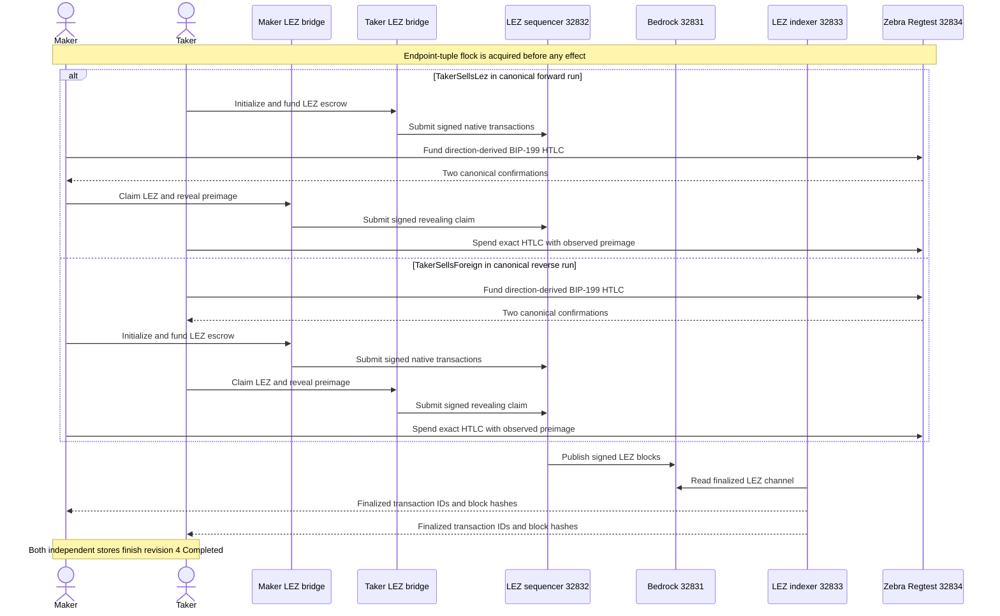

The direction changes actor ownership, not the atomic reveal order. In both
canonical runs the Zcash funding is confirmed before the LEZ claim reveals the preimage,
and the exact Zcash follow-up spend occurs only after that reveal. The retained
host ports above are evidence addresses from these isolated runs, not reusable
service discovery values; every new run must receive an explicit fresh local
tuple.

## LEZ escrow custody components and actor flows

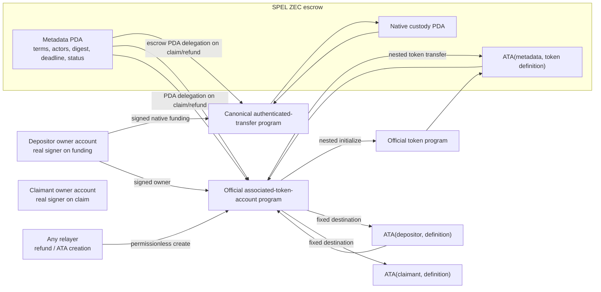

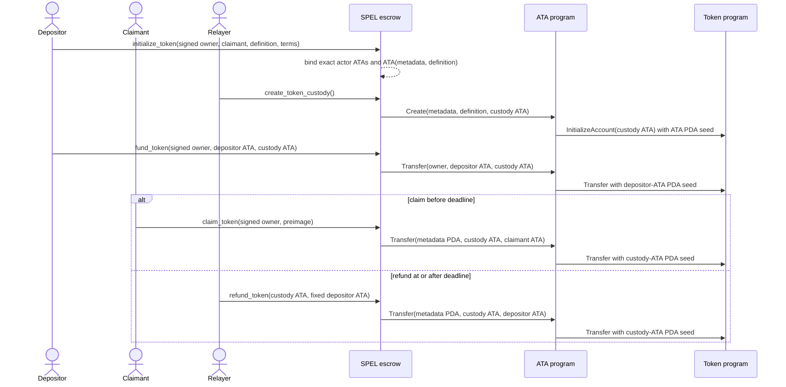

## Deployable guest and standalone block flow

```mermaid
flowchart LR
    Source["SPEL escrow source"] --> Guest["Risc0 3.0.5 guest wrapper"]
    Builder["Pinned guest-builder image digest"] --> ELF["Checked ELF<br/>SHA-256 + ImageID"]
    Guest --> Builder
    Manifest["Tracked artifact manifest"] --> Preflight["Verify exact manifest bytes<br/>ELF SHA-256 + ImageID"]
    ELF --> Preflight
    Preflight --> Process["External lez-standalone-node"]
    Process --> Home["Fresh mode-0700 node home"]
    R0VM["Exact r0vm 3.0.5"] --> Clock["Mandatory clock execution"]
    Process --> Clock
    Clock --> ReadyBlock["Persisted readiness block"]
    ELF --> RPC["sendTransaction ProgramDeployment"]
    Process --> RPC
    RPC --> Mempool["Standalone mempool"]
    ReadyBlock --> Mempool
    Mempool --> Validate["Block-time deployment validation"]
    R0VM --> Validate
    Validate --> Block["Canonical persisted block"]
    Block --> Query["Exact getTransaction + containing getBlock"]
    Query --> DeploymentCheck["Verify deployment variant, hash,<br/>block identity and ELF-derived ProgramId"]
    Process --> BuiltIn["getProgramIds static built-ins<br/>bind authenticated_transfer only"]
    Actors --> ActorCheck["getAccount ownership + balance checks"]
    BuiltIn --> ActorCheck
    DeploymentCheck --> Readiness["No-clobber mode-0600 schema-v2 readiness<br/>endpoint + tx/block/program + built-in + keys"]
    ActorCheck --> Readiness
    Readiness -.-> ActorRunner["Reference actor runner"]
    Actors["Funded depositor + claimant keys"] --> NativeLifecycle["Signed native initialise / fund / claim"]
    Relayer["Permissionless refund relayer"] --> NativeLifecycle
    NativeLifecycle --> RPC
    Block --> NativeState["Metadata status + exact custody/actor balances"]
    NativeState --> CostReplay["Deterministic production-state replay<br/>Clock excluded"]
    CostReplay --> CostEvidence["12 attributed Risc0 sessions<br/>cycle invariants + budgets + JSON"]
    TokenActors["Two definitions + owner keys + actor ATAs"] --> TokenLifecycle["Initialize / custody / fund / claim / refund"]
    TokenLifecycle --> RPC
    Block --> TokenState["Definition-bound holdings + exact supply conservation"]
    TokenState --> TokenCostReplay["Deterministic token replay<br/>Clock/setup excluded"]
    TokenCostReplay --> TokenCostEvidence["Escrow + ATA + Token sessions<br/>invariants + budgets + JSON"]
    V02Pins["LEZ v0.2.0 + exact SPEL PR head"] --> V02Guest["Risc0 v0.2 escrow guest"]
    V02Builder["Pinned Docker guest-builder<br/>Rust 1.94.1 + immutable digest"] --> V02Artifact["Canonical v0.2 ELF c85055...9d2e<br/>ImageID and ProgramId 5cf8c5...29c1"]
    V02Guest --> V02Builder
    V02Artifact --> V02Local["Recursive native + two-definition token<br/>claim/refund + rollback tests"]
    V02Artifact --> V02LocalDeployer["Checked local ProgramDeployment<br/>tx bd1680...733f"]
    V02LocalDeployer --> V02DeployProof["Indexer Finalized proof<br/>block 2582"]
    V02DeployProof --> V02FullLocal
    V02Artifact --> V02Deployer["Exact-once fixed-URL<br/>official-RPC deployer"]
    V02Artifact --> V02Sidecar["Official-wire prepare + one-attempt Claim GREEN<br/>actual-node effects GREEN"]
    V02Sidecar --> V02FullLocal["Bedrock + indexer + non-standalone sequencer<br/>both independent actor corridors GREEN"]
    V02Deployer -.-> Testnet["Official v0.2 testnet<br/>deployment + cost evidence"]

    classDef planned stroke-dasharray: 5 5,fill:#fff7e6,stroke:#9a6700;
    classDef running fill:#e6ffec,stroke:#1a7f37;
    class Testnet,ActorRunner planned;
    class V02FullLocal running;
```

The deployment proof uses port `0`, a fresh mode-0700 sequencer home,
deterministic genesis inputs, an exact `r0vm` path, and no shared Docker project
or chain state. The external process rejects the guest before home creation if
its bytes or manifest differ from the embedded tracked identity, and refuses to
reuse another activity's home or readiness path. Deployment admission alone is
deliberately insufficient: the readiness block proves the mandatory
clock/executor/store loop first, transaction lookup proves the deployment
reached the block store rather than only the mempool. The helper locates the
exact transaction in a post-submit block and retains its hash plus containing
block ID/hash. `getProgramIds` binds only the static authenticated-transfer
built-in used as actor owner; official account RPC then revalidates both
deterministic actors before a private schema-v2 mode-0600 handoff is published.
The solid native lifecycle uses the actual funded genesis roles,
validates signer-bound claim and permissionless-refund boundaries against
canonical block time, and asserts exact balances. The solid token lifecycle
uses two definitions, owner-signed ATA funding/claim, permissionless custody and
refund, and cross-definition substitution negatives. Token replay attributes
the escrow/ATA/nested-Token recursion while excluding setup and Clock noise.
The solid v0.2 branch builds an independently locked guest/generated client
through the pinned Risc0 Docker builder, binds ELF SHA-256
`c85055f6...9d2e` and ImageID and ProgramId `5cf8c5a4...29c1`, and runs
recursive native plus two-definition token claim/refund tests. Historical
`40c9d37c...8021` and `f8385049...0fbe` identities remain only with the
immutable pre-canonical evidence that produced them. A child-transfer overflow regression proves the metadata and every
touched account roll back together. The v0.2 deployer validates immutable
endpoint/channel/built-ins/artifact identity, submits once, and accepts only the
exact transaction in its containing block; ambiguity or timeout is never
retried. The solid v0.2 sidecar node represents tested describe/health/decoder,
native initialize/fund preparation, deterministic maker/taker Vault Claim
preparation, hardened durable exact-byte restart, and the role-bound
attempt-before-call Vault Claim submission state machine. The full-local edge
is solid because the canonical forward and reverse runs crossed the official
sidecar, three-service LEZ stack, independent actor state, and Zebra in both
happy directions after the exact deployment was finalized. Actual-node restart, refund, reorg, and fault recovery remain open.
The dashed public-testnet edge and deployed-runtime costs are deferred to production
readiness under ADR 0023. The v0.1.2 cost replay executes the same guest instructions through
LEZ production state transitions, counts the escrow root and
authenticated-transfer child, and compares generated JSON with the checked
evidence artifact.

## Zcash competing-fork consensus flow

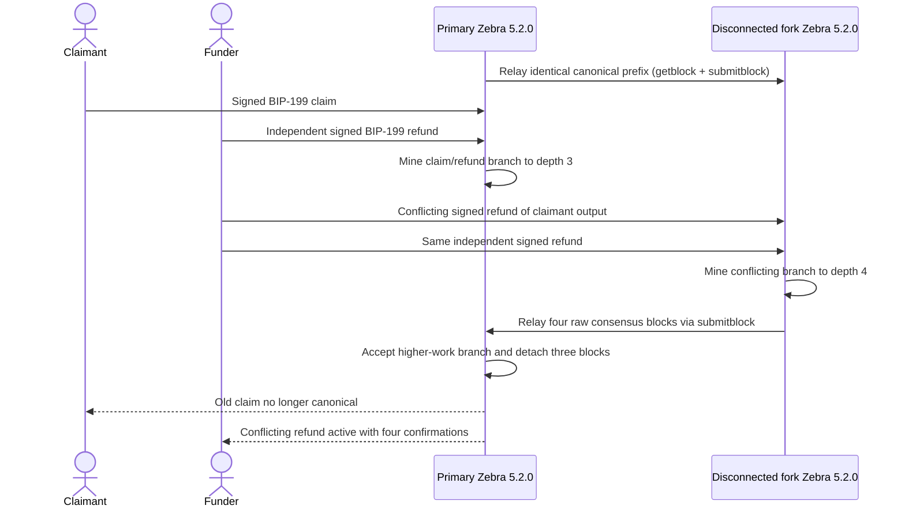

Both nodes use separate ephemeral loopback RPC ports, immutable tmpfs state,
non-root read-only images, and one uniquely named Compose project. This flow
proves Zebra consensus validation and best-chain replacement with actual actor
keys. It deliberately does not claim cross-chain refund-margin proof: that
requires typed ZEC observation commitments, checked LEZ millisecond/core-second
conversion, a named profile, and a composed standalone-LEZ plus Zebra run.

## Zcash profile and deadline flow

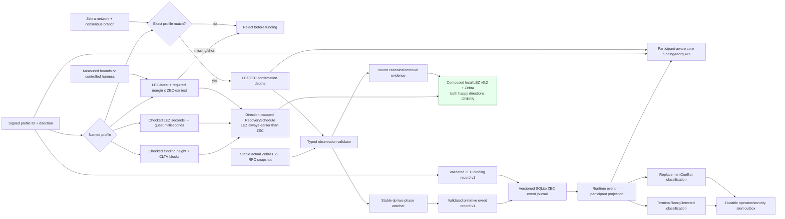

The solid profile, validator, stable-tip watcher, and actual Zebra E2E snapshot
paths are implemented. The validator
re-decodes canonical bytes and checks the complete network, branch, block,
outpoint, value, exact script, and derived-depth binding before producing a
lossy coordinator proof. Public-testnet values are acceptance targets, not
mainnet recommendations or proof of worst-case cadence. Durable production
participant-aware core semantics are implemented for taker- and maker-funded
legs: removal pins the exact ID, suspends claims, exact reappearance restores
authority, conflicting replacement fails, and refunds remain available.
Independent leg policies also make maker-depth regression suspend and depth
recovery restore claims. The runtime event-to-participant path is now solid: the
isolated two-Zebra fixture drives real canonical and removal evidence through schema-v10 SQLite
close/reopen and exact replay. The composed local LEZ/ZEC happy-path corridor is solid for both directions in
the canonical forward and reverse certification runs. Its actual-node
restart/refund/reorg and recovery paths remain open. RPC errors or absence never imply removal: a detach event
requires a stable replacement tip and a changed canonical hash at the prior
inclusion height.

The runtime path passes direction-derived canonical/removal projection, atomic
commit, restart reload, exact unknown-outcome replay in both ZEC directions,
authenticated operator alert operations, and actual-node close/reopen/requery.
Restart revalidates primitive records and immutable binding terms,
rejects impossible sequence history, restores the exact historical tracker head,
and still requires a fresh stable Zebra reconciliation before effects.
Completed/refunded removal or replacement is now journaled without erasing the
lifecycle result and is classified as `TerminalReorgDetected`; its critical
alert now commits atomically and survives replay/restart.
Authenticated maker status/list/ack RPC and CLI flows surface that durable alert;
acknowledgment clears attention metadata without changing the protocol phase.
Post-dependent replacement now commits chain truth atomically, retains the
protocol-committed transaction ID in the participant-specific reorg phase, and
returns `ReplacementConflict`; pre-dependent replacement and same-transaction
re-mining remain normal applied outcomes.
The SDK binding record now revalidates primitive profile and BIP-199 terms,
including both derived scripts. Schema v4 persists it atomically with the swap
and rejects immutable rebinding. Runtime requires it before tracker restoration,
replay detection, or projection; both coordinator leg policies and every event
side must match the named profile and expected-output envelope.
The separate concrete agreement record now additionally binds both actor
signatures, exact LEZ chain/custody terms, Zcash transaction policy, refund
calibration, and the authenticated transcript. It remains pre-integration
evidence until activation and resume persist and revalidate that exact record.

## Pair-specific protocol flows and atomicity boundaries

The three pairs share a role rule but not one generic claim or refund order.
The taker always submits the first lock. The maker may submit the second lock
only after the exact taker-funded leg reaches its signed canonical-confirmation
policy. The accepted agreement, recovery material, and construction-specific
claim authority are durable before either lock. From the first submitted lock,
the signed protocol must no longer depend on Delivery or Chat: each role must be
able to continue from its private store and independently configured chain
RPCs. A first-lock-only refund is safe only after a signed last-safe cutoff for
the maker second lock, a fresh canonical absence and first-lock-unspent recheck,
and admission/race enforcement that prevents a late second lock from crossing
the refund decision. A local timer or an assumption that the maker disappeared
is insufficient. The BTC actor now implements and actual-node proves the
refund-side cutoff branch and the post-reveal follower-survivor branch in both
directions. Run `m3schema4-20260717d` additionally proves the live happy-path
Maker-lock admission side: the actor rechecks the exact first lock and a
strictly pre-cutoff current clock immediately before its role-local one-send
CAS. The separate cutoff and admission proofs establish the fail-closed
boundary, but genuinely concurrent cutoff/refund/late-admission chaos remains
an open hardening item. The public ZEC SDK survivor branches shown below
remain unimplemented or unproved; the XMR flow remains an M4 target.

This is not a distributed transaction and there is no cross-chain atomic commit.
Atomicity is a protocol property conditional on canonical chain validation,
sound cryptography, durable local recovery state, and the signed confirmation
and recovery profile. The diagrams below are normative protocol sequences with
explicit implementation-status annotations for each supported direction.

All diagrams use the same terminality rule. `Completed` requires canonical
claim evidence for every funded leg. `Refunded` requires canonical recovery
evidence for every funded leg, or for the sole taker leg when the maker never
funded. One finalized claim or refund while the opposite funded leg remains
claimable stays in the applicable nonterminal phase, such as
`ClaimEvidenceAvailable`, `MakerLegRefunded`, `TakerLegRefunded`, or the XMR
target `MakerRecoveryAvailable`; `Recovering` is only an informal category, not
an implemented protocol phase. An abandoned key owner can leave its output
unspent indefinitely; that is a liveness failure, not permission to give
the survivor the other role private key or to report a false atomic outcome.

The current local runs do not prove node diversity. Both roles may use separate
credentials and sidecars against the same run-owned Core, Zebra, or LEZ
services. In particular, LEZ v0.2 finalized account state is supplied by the
pinned sequencer/indexer boundary: `getAccountAtBlock` has no account proof,
atomic multi-account snapshot token, or transaction-index state. Stable-tip
bracketing, exact block identity and ancestry, transaction-byte validation, and
historical account binding compensate for that limitation but do not turn the
authoritative indexer into proof-bearing consensus verification. The native
refund sidecar also enforces the containing-block deadline internally because
the current response does not expose that timestamp for independent actor
revalidation. These are explicit production trust assumptions, not hidden
atomicity guarantees.

### LEZ and Bitcoin

`TakerSellsForeign` means that the taker funds Bitcoin first and the maker funds
LEZ second. The taker then claims the maker-funded LEZ leg; the finalized
witnessed claim exposes the adaptor material needed for the maker's Bitcoin
key-path claim. If nobody reveals, the maker-funded LEZ leg becomes refundable
first and the taker-funded Bitcoin CSV branch becomes refundable later.

<!-- atomic-sequence: lez-btc/taker-sells-foreign -->

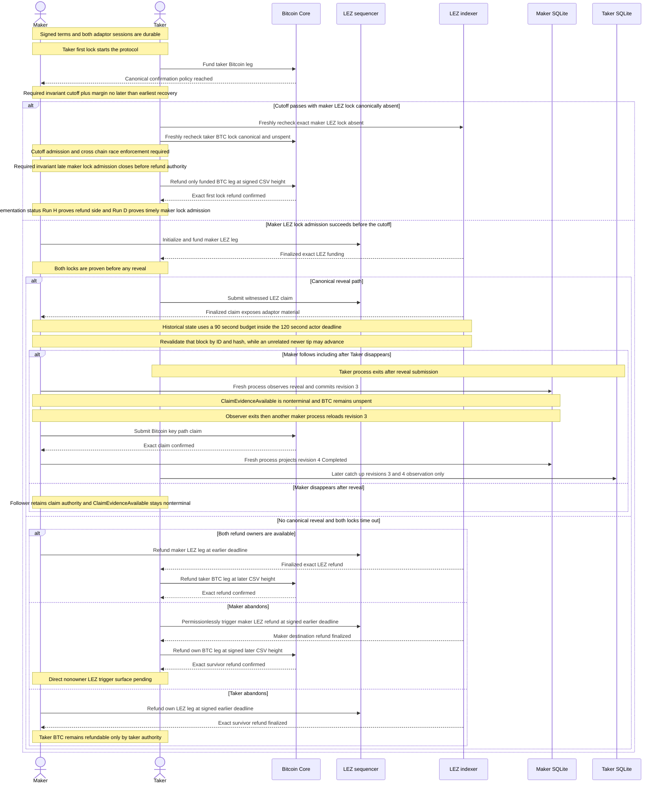

`TakerSellsLez` maps the same role rule to the opposite chains: the taker funds
LEZ first and the maker funds Bitcoin second. The taker's canonical Bitcoin
key-path signature exposes the adaptor material for the maker's witnessed LEZ
claim. On timeout, the maker-funded Bitcoin CSV branch is earlier and the
taker-funded LEZ refund is later.

<!-- atomic-sequence: lez-btc/taker-sells-lez -->

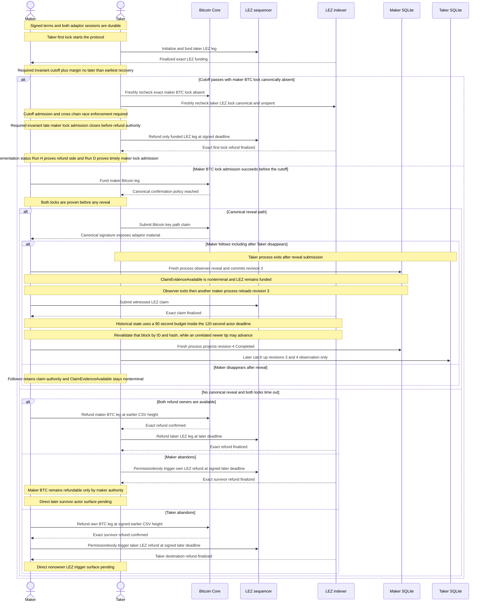

<!-- atomicity-argument: lez-btc/taker-sells-foreign -->

For `TakerSellsForeign`, the canonical witnessed LEZ claim discloses the
adaptor completion material for the Bitcoin claim by the maker. Without that
reveal, the maker-funded LEZ refund becomes available before the later
taker-funded Bitcoin refund.

**Economic safety:** under the stated cryptographic, canonicality, and timelock
assumptions, the taker either refunds its sole first lock, or can receive LEZ
only by exposing the material that lets the maker claim Bitcoin. A one-leg
post-reveal state is nonterminal.

**Replay/idempotency:** persist-before-send journals and exact finalized
projection prevent duplicate effects and false terminal status. They do not
create cross-chain atomicity.

**Conditional liveness:** inclusion, usable nodes, fee policy, and retained
role keys are required for progress. Permanent follower abandonment may leave
the Bitcoin leg safely claimable but unspent.

**Implementation status:** happy claims, ordered two-lock refunds, the
absent-maker refund-side branch, and direct post-reveal maker continuation are
actual-node GREEN. Run `m3schema4-20260717d` at tested pushed commit
`0e7635f` additionally proves this direction's external Taker Bitcoin first
lock followed by the live Maker actor's exact LEZ initialization and funding.
Both LEZ steps were role-locally reserved before official RPC, finalized inside
the exact actor window, and never re-armed after restart. Both actors reached
revision 4 `Completed`; replay added zero submissions. This is a
private-local happy-path checkpoint, not a public deployment or production
readiness claim.

<!-- atomicity-argument: lez-btc/taker-sells-lez -->

For `TakerSellsLez`, the canonical Bitcoin key-path claim discloses the
adaptor completion material for the witnessed LEZ claim by the maker. Without
that reveal, the maker-funded Bitcoin refund becomes available before the later
taker-funded LEZ refund.

**Economic safety:** under the stated assumptions, the taker either refunds
its sole LEZ first lock, or its Bitcoin claim exposes the material that lets
the maker claim the witnessed LEZ leg. A one-leg post-reveal state is
nonterminal.

**Replay/idempotency:** exact-byte journals, one-attempt authority, and
finalized-only projection prevent duplicate effects and false completion. They
are operational safeguards rather than the economic atomicity mechanism.

**Conditional liveness:** progress still needs canonical inclusion, available
RPCs, calibrated fees, and retained role authority. A disappeared follower can
leave the remaining LEZ leg safely claimable but not terminal.

**Implementation status:** happy claims, ordered two-lock refunds, the
absent-maker refund-side branch, and direct post-reveal maker continuation are
actual-node GREEN. Run `m3schema4-20260717d` at tested pushed commit
`0e7635f` additionally proves this direction's external Taker LEZ first lock
followed by the live Maker actor's one exact Bitcoin funding send. Nine
payload-free `moving_tip` observations granted no authority; the tenth stable
joined current, exact-byte, and finalized proof allowed one role-local CAS and
send. Both actors reached revision 4 `Completed`; restart and replay added
zero submissions. This is a private-local happy-path checkpoint, not a public
deployment or production readiness claim.

The BTC construction is atomic under these explicit conditions:

- Taker-first funding and the canonical confirmation gate prevent the maker
  from placing its own second-lock value at risk before the first lock is real.
  First-lock-only recovery additionally requires the signed maker-lock cutoff,
  fresh canonical absence and unspent observations, and race-safe late-lock
  admission. Run `m3firstlock-20260716h` proves the refund-side actor gate in
  both actual-node directions; `3d202f7` rejects late canonical inclusion and
  quarantines late presence. Run `m3schema4-20260717d` proves the complementary
  live admission path in both directions: exact-idempotent LEZ initialization
  and funding or exact unspent Bitcoin funding, each behind a fresh first-lock
  and strict pre-cutoff check. Genuinely overlapping cutoff/refund/admission
  chaos remains pending and therefore is not inferred from the two separate
  actual-node proofs.
- Both domain-separated aggregate adaptor presignatures and the Bitcoin CSV
  refund commitment are verified and persisted before funding. Neither actor
  has a standalone claim key that bypasses the two-party transcript.
- The actor will not reveal at revision two until both agreement-bound locks
  are canonically observed. A finalized LEZ signature or canonical Bitcoin
  key-path signature reveals the same committed adaptor scalar, allowing the
  other claimant to complete the opposite presignature without the peer.
- The recovery schedule enforces
  `maker_second_lock_cutoff + required_margin <= earlier_refund_latest` and
  `later_refund_earliest >= earlier_refund_latest + required_margin`. It maps
  the maker-funded leg to the earlier recovery and the taker-funded leg to the
  later recovery without comparing raw LEZ timestamps to Bitcoin heights.
- Agreements, signer journals, complete public transaction bytes, one-attempt
  effect authority, and lifecycle revisions are durable before dependent I/O.
  Projection requires exact confirmed Bitcoin bytes or bounded finalized LEZ
  ancestry; accepted submission alone is not completion.
- After both locks, the protocol construction lets a surviving role recover its
  own funded leg at its signed deadline. A LEZ refund is permissionless but pays
  only the immutable depositor; Bitcoin refund remains restricted to its funder
  key. The current actor proves the maker follower continuing from canonical
  reveal after the taker disappears, including a fresh-process restart between
  revision three and the follow-up. It does not yet prove every direct nonowner
  refund trigger or every outage/process-kill variant.

This safety argument does not make the two nodes one transaction manager. A
deep reorg can invalidate evidence that was treated as canonical; fee pressure
can delay a Bitcoin claim or refund; and a crash after an ambiguous send trades
liveness for at-most-once safety. Happy claims are actual-node GREEN in both
directions. Run `m3refund-20260716h` is also actual-node GREEN for the
both-owner, two-lock ordered refund in both directions: both roles reached
revision four `Refunded` and replay added zero submissions. Signed-cutoff and
first-lock-only refund-side recovery are actual-node GREEN in run
`m3firstlock-20260716h`. Post-reveal survivor continuation is clean
pushed-commit GREEN in `m3survivor-20260716c`; nonowner refund surfaces,
concurrent cutoff/refund/admission chaos, process-kill, fee-bump, and reorg
evidence remain pending. The schema-4 happy-path Maker-lock admission itself is
actual-node GREEN in `m3schema4-20260717d`.

This is an engineering safety argument, not the accepted proposal's promised
formal theorem. [ADR 0050](0050-map-btc-adaptor-construction-to-security-properties.md)
now maps the implemented `pSign`, `pVrfy`, `Adapt`, and `Ext` boundaries to
Aumayr et al.'s aEUF-CMA, pre-signature-adaptability, and
witness-extractability properties and the Fournier one-time-VES recoverability
model.
It also records why neither single-signer analysis is automatically a proof of
the exact two-party MuSig2, Taproot, and witnessed-LEZ composition. M7 retains
the independent cryptographic-review and formal-claim decision.
The BTC pair-specific F7 boundary preserves the same witness relation while
the countersigned asset extension additionally binds the exact token program,
definition, depositor/claimant/custody ATAs, amount, and aggregate authority;
native evidence cannot be relabeled as custom-token evidence.
Also, “LEZ leg” in the actual-node BTC flows currently means the proved
witnessed native path. The shared guest ATA/custom-token transition, separately
countersigned asset extension, strict v2 protocol/classifiers, eleven-call
exact-once client, agreement/local-policy adapter, official durable token
planner, authenticated sidecar routes, and fork-safe finalized scans are GREEN
component boundaries. Durable journal/actor composition and both-direction
custom-token node effects remain open and are not implied by the native
actual-node diagrams.

### LEZ and transparent Zcash

Both ZEC product directions preserve one chain-relative reveal order: the LEZ
recipient claims LEZ first and publishes the SHA-256 preimage; the ZEC recipient
then spends the exact BIP-199 output with that preimage. In
`TakerSellsForeign`, the taker funds ZEC first, the maker funds LEZ second, the
taker reveals on LEZ, and the maker follows on ZEC.

<!-- atomic-sequence: lez-zec-transparent/taker-sells-foreign -->

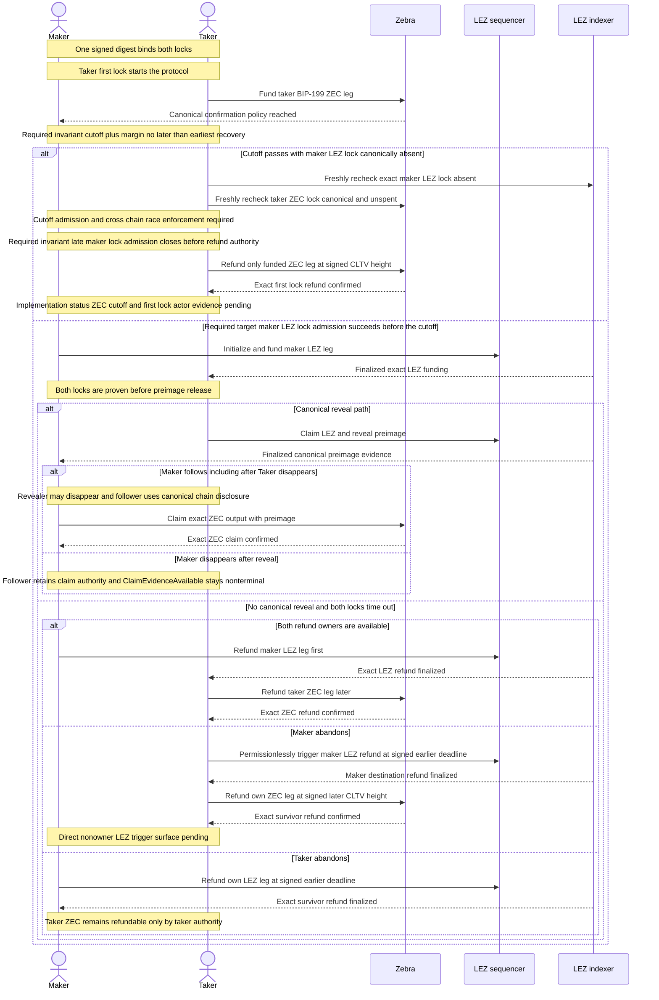

In `TakerSellsLez`, the taker funds LEZ first and the maker funds ZEC second.
The maker is now the LEZ recipient and therefore the revealing claimant; the
taker follows on ZEC. Direction changes ownership, never the LEZ-before-ZEC
claim or refund order.

<!-- atomic-sequence: lez-zec-transparent/taker-sells-lez -->

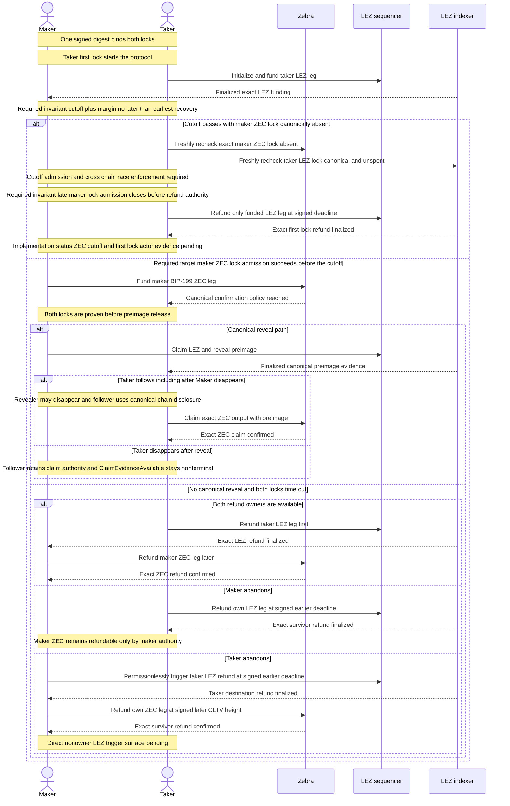

<!-- atomicity-argument: lez-zec-transparent/taker-sells-foreign -->

For `TakerSellsForeign`, the taker can receive LEZ only by publishing the
agreement-bound preimage, which lets the maker claim the exact ZEC output. If no
preimage is published, the maker-funded LEZ refund precedes the later
taker-funded ZEC refund.

**Economic safety:** an honest taker either recovers its sole ZEC first lock or
reveals the agreement preimage only after both locks, thereby enabling the
maker's exact ZEC claim. A half-completed reveal path is nonterminal.

**Replay/idempotency:** durable intents and canonical-only projection prevent
duplicate sends and false completion but are not the hashlock atomicity
mechanism.

**Conditional liveness:** the argument assumes usable nodes, inclusion, fees,
retained refund keys, and a sufficient cross-chain margin.

**Implementation status:** the normative direction and local happy path are
GREEN; the signed cutoff, first-lock actor path, and direct survivor E2E remain
unimplemented or unproved.

<!-- atomicity-argument: lez-zec-transparent/taker-sells-lez -->

For `TakerSellsLez`, the maker can receive LEZ only by publishing the same
agreement-bound preimage, which lets the taker claim the exact ZEC output. If no
preimage is published, the taker-funded LEZ refund precedes the later
maker-funded ZEC refund.

**Economic safety:** an honest taker either recovers its sole LEZ first lock or
uses the published preimage to claim the exact ZEC output after the maker
receives LEZ. A half-completed reveal path is nonterminal.

**Replay/idempotency:** durable intents and canonical-only projection prevent
duplicate sends and false completion but are not the hashlock atomicity
mechanism.

**Conditional liveness:** the argument assumes usable nodes, inclusion, fees,
retained refund keys, and a sufficient cross-chain margin.

**Implementation status:** the normative direction and local happy path are
GREEN; the signed cutoff, first-lock actor path, and direct survivor E2E remain
unimplemented or unproved.

The ZEC construction is atomic under these explicit conditions:

- The taker's direction-derived first lock must be canonical at the signed
  depth before the maker can build and submit the second lock. Both actors
  independently bind the exact LEZ accounts and expected BIP-199 output
  envelope, including network, branch, value, redeem script, P2SH output, fee,
  and expiry policy, to the dual-signed agreement. The agreement deliberately
  excludes the not-yet-created funding outpoint; canonical observation pins the
  exact resulting outpoint in lifecycle evidence before dependent effects.
- A first-lock-only refund is safe only after the signed maker-lock cutoff,
  fresh canonical absence and unspent observations, and race-safe late-lock
  admission. The public ZEC SDK does not yet drive or prove that
  `TakerLockConfirmed` branch.
- Both locks commit the same SHA-256 digest. The coordinator permits only the
  LEZ recipient to reveal first and permits the ZEC recipient to follow only
  after canonical LEZ claim evidence exposes the matching preimage.
- Refund ordering is chain-fixed in both directions: LEZ is earlier and Zcash
  is later. The signed profile must satisfy
  `zec_refund_earliest >= lez_refund_latest + required_margin`, including
  confirmation latency, reorg distance, congestion, clock drift, and reaction
  time. Typed LEZ time and Zcash height are never directly compared.
- Accepted terms, lock intents, protected preimage and claim bytes, exact
  refund intents, observations, and lifecycle revisions persist in role-local
  SQLite before the next dependent effect. Exact Zebra canonical evidence and
  bounded finalized LEZ evidence, not peer messages or mempool presence, drive
  projection.
- Once both locks exist, the protocol construction lets a surviving role recover
  its own funded leg at the signed chain deadline. Permissionless LEZ execution
  still pays only the immutable depositor; ZEC refund remains restricted to its
  funding key. Current SDK evidence covers the both-owner ordered path, not the
  direct nonowner LEZ trigger or every absent-peer survivor path.

This is still not a distributed transaction. Atomicity depends on the hash
preimage remaining secret until both locks, on conservative margin calibration,
and on both nodes' canonicality assumptions. Deep reorgs, post-lock node
outages, expired unmined Zcash transactions, and fee or inclusion delays can
reduce liveness or require an exact safe replacement. Both actual local happy
directions are GREEN. Composed actual-node refund, restart, reorg, concurrent,
and chaos journeys remain open and must not be inferred from component refund
or two-Zebra fork tests.

### LEZ and Monero

Only `TakerSellsLez` is supported. The taker funds the scriptable LEZ leg first;
after its canonical confirmation policy, the maker funds the agreed Monero
output. XMR-first is rejected because the reviewed COMIT construction does not
supply that direction's safe recovery path.

The shared signing, two-stage XMR SDK, and focused guest-source boundaries are
executable without routing XMR through the BTC SDK. Dashed edges remain M4
bridge-runtime and actor-composition work; the local checked guest artifact is
now a solid executable component:

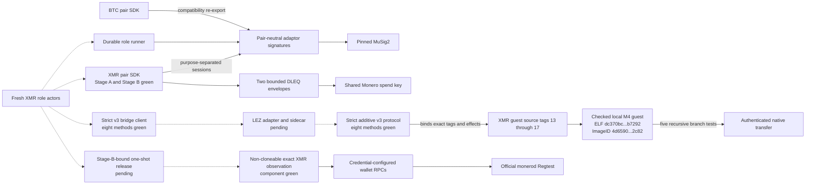

<!-- atomic-sequence: lez-xmr/taker-sells-lez -->

```mermaid
sequenceDiagram
    actor Maker
    actor Taker
    participant LezSeq as LEZ sequencer
    participant LezIdx as LEZ indexer
    participant Monero as monerod and wallet RPC

    Note over Maker,Taker: Stage A base terms derive distinct claim refund sessions
    Note over Maker,Taker: Stage B activation binds nonces partial commitments and exact LEZ initialization
    Note over Maker,Taker: Taker first lock starts the protocol
    Taker->>LezSeq: Fund taker LEZ leg
    LezIdx-->>Maker: Canonical LEZ confirmation policy reached
    Note over Maker,Taker: Required invariant cutoff plus margin no later than earliest recovery
    alt Cutoff passes with maker XMR lock canonically absent
        Taker->>Monero: Freshly recheck exact maker XMR lock absent
        Taker->>LezIdx: Freshly recheck taker LEZ lock canonical and unspent
        Note over Maker,Taker: Cutoff admission and cross chain race enforcement required
        Note over Maker,Taker: Required invariant late maker lock admission closes before refund authority
        Taker->>LezSeq: Refund only funded LEZ leg at signed deadline
        LezIdx-->>Taker: Exact first lock refund finalized
        Note over Maker,Taker: Implementation status M4 cutoff and first lock evidence pending
    else Required M4 target maker XMR lock admission succeeds before the cutoff
        Maker->>Monero: Fund maker Monero output
        Monero-->>Taker: Exact output observation reaches canonical confirmation policy
        Note over Maker,Taker: Taker must consume observation once against the exact Stage B activation
        Taker->>LezSeq: Publish exact committed claim partial after XMR confirmation
        LezIdx-->>Maker: Canonical finalized AuthorizeNativeXmrClaim bytes
        Note over Maker,Taker: Both locks are proven before Maker can aggregate and adapt the claim
        alt Canonical reveal path
            Maker->>LezSeq: Claim LEZ with adaptor witness
            LezIdx-->>Taker: Canonical claim reveals recovery share
            alt Taker follows including after Maker disappears
                Note over Maker,Taker: Revealer may disappear and follower uses canonical chain disclosure
                Taker->>Monero: Spend maker Monero output
                Monero-->>Taker: Exact spend confirmed
            else Taker disappears after reveal
                Note over Maker,Taker: Follower retains claim authority and ClaimEvidenceAvailable stays nonterminal
            end
        else No canonical reveal and both locks enter recovery
            alt Both recovery owners are available
                Taker->>LezSeq: Signed XMR-specific refund adapted with Taker share s_b
                LezIdx-->>Maker: Canonical refund signature reveals s_b
                Maker->>Monero: Add retained s_a and recovered s_b then recover XMR
                Monero-->>Maker: Exact recovery spend confirmed
            else Maker abandons
                Taker->>LezSeq: Signed XMR-specific refund adapted with s_b
                LezIdx-->>Taker: Exact survivor refund finalized
                Note over Maker,Taker: Canonical signature leaves Maker recovery available from s_a plus s_b
                Note over Maker,Taker: Checked guest artifact green and bridge actor execution pending
            else Taker abandons
                Maker->>LezSeq: Execute Maker punishment after punish_at
                LezIdx-->>Maker: Exact punishment finalized
                Note over Maker,Taker: COMIT economic safety fallback, literal RFP both-refund disposition pending review
                Note over Maker,Taker: Checked guest artifact green and bridge actor execution pending
            end
        end
    end
```

<!-- atomicity-argument: lez-xmr/taker-sells-lez -->

For supported `TakerSellsLez`, the Maker can receive LEZ only after the Taker
publishes the activation-bound partial on LEZ and the Maker publishes the final
adaptor witness that reveals Maker share `s_a`, which the Taker adds to retained
`s_b` to spend XMR. If there is no claim, the Taker's XMR-specific signed refund
reveals `s_b`, which the Maker adds to retained `s_a` to recover XMR. An unsigned
permissionless refund reveals neither share and is not an XMR recovery proof.
The publication is retrieved from the canonical LEZ chain, so the flow needs no
post-first-lock off-chain message channel.

**Economic safety:** there is no invented Monero timeout. A canonical Maker LEZ
claim reveals Maker share `s_a`; without that claim, a canonical signed Taker
refund reveals Taker share `s_b`. If the Taker abandons the refund window, the
cited construction needs a later Maker punishment branch. That fallback and its
literal RFP F5/F6 disposition remain pending and are not literal refund
atomicity. A hidden-partial commitment also proves later consistency, not
pre-funding validity; invalid or withheld publication can force punishment and
remains part of the disclosed production review.

**Replay/idempotency:** durable shares, event projection, and one-attempt spend
authority prevent duplicate effects and false terminal state. The current
Monero observation is deliberately non-cloneable but not activation authority;
the pending actor journal must consume it once against exact Stage B before
publication. These controls do not replace the DLEQ and event-gated economic
construction.

**Conditional liveness:** the model assumes valid DLEQ proofs, retained shares,
canonical LEZ events, usable Monero RPCs, and transaction inclusion. Lost
authority may leave a safe nonterminal output indefinitely.

**Implementation status:** both DLEQ/share-addition orders, one official Monero
reconstructed spend, the pair-neutral adaptor leaf, BTC compatibility, durable
fresh-process signing, canonical Stage-A/Stage-B activation, structural
LEZ-lock/cutoff validation, and focused guest-source
publication/claim/refund/punish branches are executable. Two fresh
digest-pinned builds reproduce checked ELF
`dc370bc34b432317730c51b49342760dbc675fca700e300b30b5fadefe5b7292`
and ImageID
`4d6590332948743c2db88a183755815354ef92560550cd206ac27bddeea12c82`;
all five recursive cases pass in both builds. The eight-method bridge client is
green across 51 package targets, and the exact Monero receipt observation is
green in seven focused tests. The LEZ adapter/sidecar runtime, trusted finalized
LEZ capability, Stage-B-bound durable one-shot release, role actors, and
composed E2E remain pending. The Monero observation does not prove old-output
unspent state from a view-only wallet or server authentication by credential
configuration alone; the local run must bind its fresh output, peerless
topology, and cross-credential rejection. The additive v3 protocol and all 44
legacy bridge protocol cases are green. The checked artifact uses no runtime
RPC or external resource and is not an on-chain or public deployment.

The XMR construction’s atomicity argument differs from the deadline-bearing
pairs:

- Taker-first funding and the LEZ confirmation gate prevent the maker from
  creating the Monero lock before the taker's scriptable recovery path is
  canonical. First-lock recovery additionally requires the signed maker-lock
  cutoff, fresh canonical absence and unspent observations, and race-safe
  late-lock admission. Those gates remain M4 work.
  The Monero confirmation gate then protects the maker's LEZ reveal after both
  locks exist.
- The cross-curve secp256k1 and Ed25519 DLEQ transcript binds the LEZ adaptor
  witness to the Monero spend-key share. The maker cannot claim LEZ without
  publishing the evidence the taker needs to spend Monero.
- Both locks, both DLEQ envelopes, view-key material, and distinct claim/refund
  sessions must be verified and durable before reveal. The Taker keeps its
  claim partial owner-local until the Maker's exact XMR output reaches the
  signed depth; otherwise the Maker could adapt with known `s_a` before funding.
  After reveal, the Taker
  continues from canonical LEZ evidence and Monero RPC without Chat or maker
  cooperation.
- Monero has no script refund and no Monero deadline is invented. If the Maker
  abandons before claiming LEZ, the Taker uses the distinct `s_b`-adapted LEZ
  refund during its validity window. The final signature, not a generic event,
  supplies `s_b` for Maker recovery. That signed disclosure replaces a native
  Monero refund branch for this pair.
- With both locks, a surviving Taker can recover the LEZ leg without Maker
  cooperation and reveal `s_b`. A Maker cannot synthesize that signature when
  the Taker destroys `s_b`; the cited protocol instead needs a later punishment
  branch. Both exact survivor surfaces remain M4 work, and the punishment
  branch cannot be described as a literal both-refund result without review.
- Role-local persistence records the event, confirmation regression, recovery
  availability, and terminal action idempotently. Before a recovery spend is
  submitted or projected, a regressed LEZ refund event revokes recovery
  authority until the required canonical depth returns.

This is not a distributed transaction, and the safety claim depends on the
reviewed DLEQ construction, secure share custody, exact Monero transaction
validation, and canonical LEZ event observation. A deep LEZ reorg after Monero
recovery, loss of a persisted share, or a malformed/subgroup-invalid proof can
break the assumptions and must fail closed. Current evidence is the accepted
M1 model, event-gated coordinator, persistence, RPC, and CLI contract. Exact
COMIT vectors, production DLEQ and Ed25519 integration, real `monerod` and
wallet-RPC actors, stagenet happy/refund/concurrent runs, reorg handling, and
third-party review remain M4 and M7 work.

## Happy-path user flow

```mermaid
sequenceDiagram
    actor Maker as Maker operator
    participant Daemon as Maker daemon
    participant Store as Durable store
    participant Chat as Delivery / Chat
    actor Taker
    participant TakerLeg as Taker-funded chain
    participant MakerLeg as Maker-funded chain
    actor LezRecipient as Direction-specific LEZ recipient
    actor ForeignRecipient as Direction-specific foreign recipient
    participant LEZ as LEZ leg
    participant Foreign as Foreign leg

    Maker->>Daemon: Configure pair, price, limits, nodes
    Daemon->>Store: Persist policy and signed offer
    Daemon->>Chat: Publish offer
    Taker->>Chat: Discover and negotiate offer
    Chat->>Daemon: Deliver authenticated request
    Daemon->>Store: Persist immutable direction and safety profile
    Taker->>TakerLeg: Construct and submit first lock
    TakerLeg-->>Daemon: Validated confirmations
    Daemon->>Store: Persist lock evidence before next effect
    Daemon->>MakerLeg: Construct and submit second lock
    MakerLeg-->>Taker: Validated confirmations
    Note over Chat: May disappear permanently now
    alt ZEC pair
        LezRecipient->>LEZ: Claim first and reveal preimage
        LEZ-->>Daemon: Canonical claim evidence contains preimage
        ForeignRecipient->>Foreign: Follow on ZEC with extracted preimage
    else BTC pair
        Taker->>MakerLeg: Taker claims maker-funded leg
        MakerLeg-->>Daemon: Claim witness reveals adaptor material
        Maker->>TakerLeg: Maker claims taker-funded leg
    else XMR pair, LEZ-first direction only
        Maker->>TakerLeg: Maker claims taker-funded LEZ
        TakerLeg-->>Taker: Canonical LEZ claim evidence reveals recovery material
        Taker->>MakerLeg: Taker spends maker-funded XMR output
    end
    Daemon->>Store: Persist terminal chain evidence
    Daemon-->>Maker: Report completed swap
```

“Taker-funded” and “maker-funded” describe funding order, not a fixed chain.
BTC and ZEC support both product directions; XMR is LEZ-first only. Claim and
refund order is construction-specific, as fixed in ADR 0008 and ADR 0010.

ADR 0029 concretizes the BTC branch: distinct two-party aggregate claim
authorities protect the Bitcoin and LEZ legs. The first direction-specific
canonical claim—finalized LEZ bytes or a Bitcoin witness canonical at the
negotiated confirmation policy—reveals the agreed scalar, and the second
claimant adapts the opposite-chain signature. No standalone actor claim key may
bypass that transcript. The exact `f5a9caa` fixture uses public deterministic
maker/taker shares to aggregate and tweak `Q`, computes role-tagged nonce
commitments locally, produces both partials, verifies a 65-byte adaptor
presignature, adapts it with the public fixture scalar, verifies the 64-byte
result under `Q`, passes Core policy and consensus, and extracts the matching
scalar. That single-process fixture is lower-level evidence. The current
source path exchanges commitments through independent role journals, completes
both domain sessions, validates actual Core and official-wire LEZ effects, and
projects both claim revisions without persisting the recovered scalar.

ADR 0031 defines the public role-fixed process boundary. Separate
owner-private maker and taker configs invoke one fresh `btc-reference-actor`
process for `activate`, `drive`, `recover`, or `status`. Only activation inserts agreement
acceptance. Absent or empty/no-acceptance state remains not activated; corrupt
or conflicting state fails closed. Status may migrate an existing database
schema but creates no acceptance, constructs no chain client, and performs no
RPC. At predecessors zero and one, drive selects respectively the taker- and
maker-funded chain from the validated agreement, receives typed Core funding or
finalized LEZ funding, binds LEZ accounts to the signed terms, and retains the
finalized tip before projecting the next revision. At predecessors two and
three, the local role completes or reproduces the exact revealing or follow-up
claim from the agreement and existing signer journal, persists the public
effect, submits only with single-winner authority, and requires canonical chain
evidence before projection. Normal pre-effect observer errors are retryable
unavailability, not false absence. Exact retries retain their deterministic
identity. A concurrent CAS loser may converge only on a valid matching winner;
other projection failures fail closed. Revisions one through four are GREEN in
source, deterministic adapter tests, and schema-4 actual-node run
`m3schema4-20260717d`. In that current PoC, the Taker first lock is still
external-fixture owned; the Maker actor owns the exact opposite-chain second
lock and both actors own subsequent claim observation/effects. The alternative
branch exposes explicit `recover`. LEZ owners perform state-only eligibility,
durable deterministic preparation, exact observation, one journal-authorized
submit, and later finalized projection; LEZ nonowners use terms discovery only.
Bitcoin owners use the agreement-matched refund scalar and typed Core adapter.
Both chains recompute or revalidate exact public identity before projection.
Run `m3refund-20260716h` proves both actual-node refund orders through terminal
`Refunded` with restart no-rearm. Run `m3overlap-20260717a` separately proves
two opposite-direction swaps simultaneously at revision two on shared nodes.
Process-kill, reorg, arbitrary-N/same-direction nonce scheduling,
cutoff/refund/admission chaos, and production custody remain pending.

ADR 0033 supplies the reusable effect boundary used by actor-owned claim and
refund revisions. Both adaptor session databases reopen existing-only; a missing path
cannot create empty signer state. Complete public Bitcoin or LEZ transaction
bytes and signed-agreement authority are durable before a one-winner
`Prepared` to `Started` CAS permits the only fresh RPC submission. `Started` or
`Unknown` recovery observes exact bytes only, and a definitive conflict burns
fresh authority without calling the transport. This is crash-safe local
authority, not a cross-system atomic commit.

```mermaid
flowchart LR
    Agreement["Validated countersigned agreement"]
    Signers[("Existing maker and taker signer journals")]
    Actor["Role-fixed actor<br/>revisions zero through four"]
    Prepared["Complete public Bitcoin or LEZ transaction"]
    Effects[("Role local public effect journal")]
    Observe["Exact chain observation"]
    Core["Bitcoin Core loopback RPC"]
    Sidecar["Role LEZ sidecar loopback RPC"]
    Lifecycle[("BTC recovery lifecycle<br/>Completed or Refunded replay")]
    RefundStore["Both-direction and both-role<br/>Refunded component tests"]
    MakerLock[("Schema-4 Maker-lock journal<br/>one actor-owned second lock")]
    Evidence["m3schema4-20260717d<br/>2 of 2 schema-4 directions Completed"]
    RefundEvidence["m3refund-20260716h<br/>2 of 2 actual-node refund orders"]

    Agreement --> Actor
    Signers --> Actor
    Actor --> Prepared
    Actor --> MakerLock
    Prepared --> Effects
    Effects --> Observe
    Observe --> Core
    Observe --> Sidecar
    Effects -->|"single Started winner"| Core
    Effects -->|"single Started winner"| Sidecar
    Core -->|"confirmed exact bytes"| Lifecycle
    Sidecar -->|"finalized exact bytes"| Lifecycle
    Lifecycle --> Actor
    Lifecycle --> RefundStore
    Actor --> Evidence
    Lifecycle --> RefundEvidence
```

Pushed `0177151` adds a production-shaped in-memory boundary alongside that
retained Core fixture. Separate maker/taker state objects use fresh OS nonces,
exchange transcript-bound commitments before reveal, verify peer partials, and
bind distinct BTC and LEZ messages to the same adaptor point. Either completed
signature reveals the scalar needed to complete the other. Pushed `e3f2938`
adds the role-local SQLite journal that reserves the nonce before commitment,
gates reveal on a durable peer commitment, and consumes the nonce atomically
with the exact replayable partial. Pushed `8a7ea55` adds SDK generation and
restart reconstruction for the exact journal material, complete-context and
both-commitment checks, partial verification, and aggregate-presignature
verification. Pushed `6935acd` adds the checked LEZ guest:
the aggregate account authorizes the exact transaction while the distinct
claimant receives the escrow. That retained component fixture still shares one
process, but the 2026-07-15 composition crossed both actual local nodes through
independent maker and taker role processes and stores. Both happy directions
completed, and the recovered scalar matched the committed point without being
retained in public evidence. The canonical version-one agreement is now
implemented and reconstructs the exact aggregate key, P2TR/CSV contract,
funding outpoint, cooperative transaction/sighash, Bitcoin chain policy, LEZ
terms, and recovery schedule before accepting both role signatures. The public
actor activates that validated record, observes the agreement-derived taker and
maker locks through typed chain adapters, completes the direction-derived
Bitcoin or LEZ revealing and follow-up claims under the local role, and
persists all four transitions. Run `m3schema4-20260717d` executes that
repository-owned workflow against fresh actual Core/LEZ services, proves the
Maker owns the second lock in each direction, and leaves both actors terminal
`Completed`. The Taker first lock remains an external PoC fixture. This closes
the schema-4 private-local checkpoint only. Run `m3overlap-20260717a`
separately closes the accepted opposite-direction two-swap execution item;
the BTC pair-specific F7 component boundary now also includes schema-5
peerless finalized token-funding projection without Maker-private material or
submit authority. Run R reached finalized token funding and Maker revision two
but retained the pre-fix Taker v1-dispatch RED. Run S exercised that v2 route
and exposed a second bounded RED: the terms scan treated the valid earlier
same-swap initialization as a funding conflict. The scanner now validates and
skips only legitimate different lifecycle kinds while retaining malformed,
same-kind, and duplicate-match conflicts. Run T at clean pushed `50db397`
finalized forward token initialization, custody, and funding at blocks
120/148/170; Maker exact observation and Taker lifecycle-aware peer discovery
both reached revision two. That proves the scanner repair through actual nodes.
The immediately following dual-lock evidence serializer had malformed jq syntax
and stopped before claims or the reverse direction. It is now a directly tested,
validate-before-publish tracked filter. The then-current 127 sidecar tests and
the pre-Docker orchestration contract pass, but Runs R, S, and T are bounded
REDs rather than full F7 evidence.
Run U on exact pushed `65f55c5` was stopped after thirteen minutes because the
ten-second custom-token slot had reached only bootstrap and no new F7 boundary.
Exact cleanup left no owned container, network, volume, process, or secure-state
directory. ADR 0047 replaces the slow quiet-tip workaround with a pinned
requested finalized interval. Newer finalized descendants are accepted only
when height does not rewind and the pinned end block still agrees by ID and
hash after historical state reads. Fixed-window RED-GREEN, all 128 sidecar
tests, five binary/example tests, strict Clippy, and the one-second orchestration
contract pass. Run V proved the faster cadence through the complete forward
direction. Run W proved schedule-aware sequential anchors around the forward
settlement and exposed the last typed retry-count mismatch. Run X on clean
pushed `422c72e` then completed both actual-node custom-token directions with
four LEZ and two Bitcoin effects each, exact `175/75/0` and `75/175/0`
balances, zero custody/replay, no public resource, and exact cleanup.

Run Z on clean pushed `1555749` repeated both directions in 19 minutes 10.95
seconds with the same terminal revisions, effects, directional balances,
finality, zero replay, and exact cleanup. Its production-mode official-wallet
cache hit took 10.32 seconds. Run Y is not evidence for a swap: the independent
guest check rejected a mistakenly selected pre-F7 artifact before deployment,
and exact cleanup passed.

Run AA on clean pushed `df7ed86` completed the third pair in 18 minutes 13.61
seconds with unchanged terminal revisions, effects, directional balances,
finality, replay, and exact cleanup. The production-mode wallet-cache hit took
7.81 seconds, and bootstrap retained the exact hardened guest/deployer
identities. Runs X, Z, and AA therefore close the requested 3-of-3 F7
repeatability gate.

The official-wallet prebuild now passes through a separate owner-only
content-addressed artifact component. Policy 2 binds the complete secret-free
source, toolchain, target-library, build-tool, Cargo-config, bindgen,
native-library, expected-output, runtime, and validation-helper identities.
Only the executable and manifest persist; a fresh run-private non-hardlinked
copy is triple-rehashed before use. A real cold/hit comparison measured
202.42/10.35 seconds, saving 192.07 seconds without weakening any chain or
artifact gate. Runs Z and AA certify integrated hits on exact pushed code. The
F7 repeat gate is closed;
arbitrary-N/same-direction scheduling, process-kill/reorg/chaos, public
deployment, formal review, and production readiness remain outside the claim.

## Abandonment and autonomous recovery flow

```mermaid
sequenceDiagram
    actor Maker as Maker operator
    participant Daemon as Maker daemon + watcher
    participant Store as Durable recovery state
    actor Taker
    participant LEZ as LEZ sequencer
    participant Foreign as Bitcoin Core / monerod / Zebra
    participant TakerLeg as Taker-funded chain
    participant MakerLeg as Maker-funded chain
    participant Chat as Delivery / Chat
    actor LezFunder as Direction-specific LEZ funder
    actor ZecFunder as Direction-specific ZEC funder

    Note over Chat: Offline and neither recovery path calls it
    alt Maker never submits the second lock
        Taker->>Store: Load first-lock recovery data
        Taker->>TakerLeg: Wait for its typed recovery condition
        Taker->>TakerLeg: Submit first-lock refund
    else Both locks exist but the revealing claimant abandons
        Daemon->>Store: Reconcile canonical chain evidence
        alt ZEC
            LezFunder->>LEZ: Submit earlier LEZ refund
            LEZ-->>Daemon: Canonical LEZ refund evidence
            ZecFunder->>Foreign: Submit later ZEC CLTV refund after margin
        else BTC
            Daemon->>MakerLeg: Recover maker-funded leg at its reviewed path
            Taker->>TakerLeg: Recover taker-funded leg at the later safe path
        else XMR
            Taker->>LEZ: Refund taker-funded LEZ
            LEZ-->>Daemon: Canonical LEZ refund event
            Daemon->>Foreign: Recover XMR with reviewed key-share evidence
        end
    end
    Daemon->>Store: Persist refund proofs and terminal state
    Daemon-->>Maker: Report recovered balances
```

Each actor retains enough local data to recover without the counterparty.
Deadline comparisons are typed by chain and clock domain. ZEC always refunds
LEZ first and ZEC later by the configured margin. XMR recovery is gated by a
canonical LEZ event rather than a fictitious Monero deadline.

## Offline actor status flow

```mermaid
flowchart LR
    User["Maker or taker"] --> Command["One-shot status command"]
    Command --> Config["Private role-fixed schema-v3 config"]
    Config --> Inspect["Inspect role-store path"]
    Inspect -->|"missing"| Missing["Versioned not_activated output"]
    Inspect -->|"exists"| Material["Load claim-recovery key only"]
    Material --> Open["Open existing SQLite with NOFOLLOW and identity checks"]
    Open --> SDK["Role-fixed ZEC SDK with unit LEZ and Zcash ports"]
    NoChain["No sidecar, Zebra credential, or chain capability"] --> SDK
    SDK --> Replay["Replay agreement, locks, claims, and refunds"]
    Replay --> Output["Secret-free phase, revision, and next action"]
```

`status` is an implemented store-recovery path, not a configuration-only
placeholder. Missing SQLite returns `not_activated` without creating a file.
Existing state is opened with the existing-only hardened SQLite entry point and
replayed through `resume_all_capable`; the SDK is instantiated with unit LEZ and
Zcash port types, so a chain call is impossible even if a later adapter changes.
It loads neither the sidecar capability nor Zebra cookie, signing key,
agreement file, or preimage. The separate `activate` and `drive` paths load
their scoped effect material and completed both real local v0.2/Zebra directions again in the canonical
forward and reverse certification runs; `status` keeps this
no-chain design.

## Crash, restart, and at-least-once observation flow

```mermaid
sequenceDiagram
    actor User as Maker operator / Taker
    participant Surface as CLI / mini-app
    participant Process as Daemon / taker coordinator
    participant Store as SQLite aggregate + outbox
    participant Node as Selected chain node

    User->>Surface: Request transition with durable request ID
    Surface->>Process: Authenticated command
    Process->>Store: Transactionally persist intent + outbox item
    Process--xProcess: Crash at any instruction boundary
    User->>Process: Restart process
    Process->>Store: Load aggregate, pending effects, observations
    Process->>Node: Reconcile canonical chain state first
    Node-->>Process: Confirmed, replaced, removed, or absent
    Process->>Store: Idempotently apply validated evidence
    alt Effect is still required
        Process->>Node: Submit byte-identical or safely replaced transaction
        Node-->>Process: Transaction identifier / rejection
        Process->>Store: Persist result and close outbox item
    else Effect already exists or became invalid
        Process->>Store: Close, suspend, or replace effect without duplication
    end
    Process-->>Surface: Current durable status
    Surface-->>User: Resume without double spend or state leakage
```

The final coordinator uses one durable aggregate per swap and atomic intent plus
outbox persistence. Chain observations are at least once and therefore
idempotent; conflicting evidence is rejected. Current M1 proves restart and
observation idempotence for the prototype store. Atomic outbox, secret
encryption, process-kill matrices, and pair transaction resubmission are M5 exit
evidence, not present claims.

## Delivery-to-architecture map

| Boundary | Required proof | Milestone |
|---|---|---|
| Deterministic lifecycle and safety profiles | Pair acceptance/property tests | M1, then retained |
| LEZ and foreign-chain construction | Published vectors plus consensus-node acceptance/rejection | M2–M4 |
| Independent maker/taker processes | Black-box role matrix using real credentials, nodes, and funds | M2–M5 |
| Crash-safe coordinator | Kill/restart/outbox/reorg matrix | M5 |
| Maker CLI and Logos Core lifecycle | Authenticated operator journeys | M5 |
| Maker/taker mini-apps | Same role suites through UI process boundaries | M6 |
| ZEC private public-compatible local devnets and private recording/evidence | Independent happy/refund/reorg/concurrency actors across full local LEZ v0.2 and Zebra Regtest | M2 |
| ZEC public testnet/deployment and public recordings | Deferred proposal evidence plus final production rehearsal/remediation | Production readiness / M7 under ADR 0023 |
| BTC private public-compatible local devnets and evidence | Independent actors complete both directions across Bitcoin Core 31.1 Regtest and local LEZ v0.2, with exact key-path witness and scalar extraction | M3 |
| BTC public Testnet4 route and final review | Self-host/public node, wallet, funds and flakiness guide in M3; live public execution/remediation may remain private/deferred | M3 documentation, production readiness / M7 live evidence |
| XMR stagenet and final review | Independent actors, COMIT/DLEQ evidence, and remediation packet | M4, M7 |

No milestone is complete merely because an internal API test passes. Its tag
must point to the commit whose role-real evidence crosses every applicable
boundary above.
