# System architecture and actor flows

Status: Living target architecture — 2026-08-04

This is the canonical whole-system view. ADRs record why individual choices
were made; this document shows how the choices compose into the product that
operators and takers actually run. Dashed components are required final
deliverables that are not implemented yet. Blue components are implemented
boundaries that may have partial live exercise but have not completed the shown
end-to-end boundary. A test
is called end to end only when it crosses the same process, RPC, persistence,
role, and chain boundaries shown here.

## M6 application surfaces and authority boundary

The current M6 HTML surface is an executable review prototype, not an adapter
to the swap system. Solid arrows in the first diagram are implemented today.
Both role pages use deterministic browser-memory state and the loopback server
serves only repository assets with a restrictive content-security policy. No
solid arrow crosses from either page to a daemon, role store, transport, wallet,
chain node, or public endpoint.

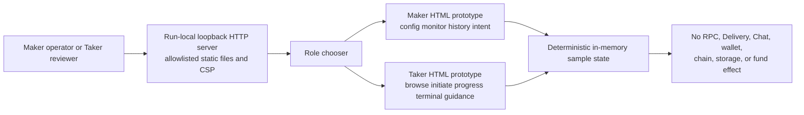

The production surface is planned as two independent Basecamp 0.2.0
`ui_qml` packages. Basecamp loads each QML view in its own application surface
and the generated Qt Remote Objects replica reaches a backend in a separate
`ui-host` process. Those QML and QtRO boundaries remain dashed and gated by
owner prototype sign-off.

The Maker backend will translate an allowlisted secret-free GUI contract to the
existing owner-restricted Unix JSON-RPC. The atomic route-save prerequisite is
implemented. The Taker side has an exact seven-method DTO contract, an
authenticated read backend, a strict owner-private startup loader, and
`lez-taker-service` on its own mode-0600 Unix socket. Empty configurations
register health and offer listing. A validated prepared-ZEC configuration registers all seven methods: health,
offer list, initiation, swap list, monitor, Claim, and Refund. Terminal requests
are generation-fenced, mutually exclusive, and admitted durably before the
role-fixed actor command.

The Taker schema-v1 registry and strict prepared-ZEC context are
service-wired through `e9393cf`. Durable request lookup remains first. A new
request must match current authenticated Delivery at one trusted timestamp and
commits public facts, full private authority, and replay before execution.
With `execute_prepared_zec: true`, the service then uses the bounded Maker
Chat socket to obtain and complete the signed proposal, no-clobber persists the
agreement and Taker actor, publishes the completion receipt, and returns
`NotActivated` generation zero.

Exact restart replay selects the current prepared entry and compares its full
authority to the durable private row at the original admission time. A valid
receipt replays after Delivery-offer removal and Chat outage without rewriting
artifacts. Maker negotiation is completed and one Maker actor is queued, but
neither role actor starts. Receipt-bound list and monitor resolve only the prepared authority
that exactly matches the private admission, reread receipt/config authority
under the shared per-swap lock, and invoke status with unit ports. They remain
available after Delivery and Chat disappear and perform no wallet, Zebra, or
LEZ RPC. Commit `3307dca` additionally fences the receipt digest and inode for the
process incarnation and rejects live actor-lock contention. Durable
receipt/state rollback-incarnation fencing across restart remains hardening.
XMR capability remains effect-checkpoint-only. Fresh regression
`m6claim0ba41aba` drove the `TakerSellsLez` Claim
through the owner service against wholly fresh local LEZ v0.2 and Zebra
Regtest. LEZ Claim `f865903e...14d0cc` finalized in block 127, and exact
service replay reconciled the same sole Zcash transaction
`0da6b4c2...d2abf` before canonical inclusion at height 107.
Fresh pushed-commit run `m6refund8f76d87a` also drove the
service Refund on wholly fresh LEZ and Zebra stacks. LEZ finalized the Taker
Refund exactly once before parent-owned Maker recovery submitted the Zcash
Refund exactly once; all views reached `refunded`, and terminal replay changed
neither chain.

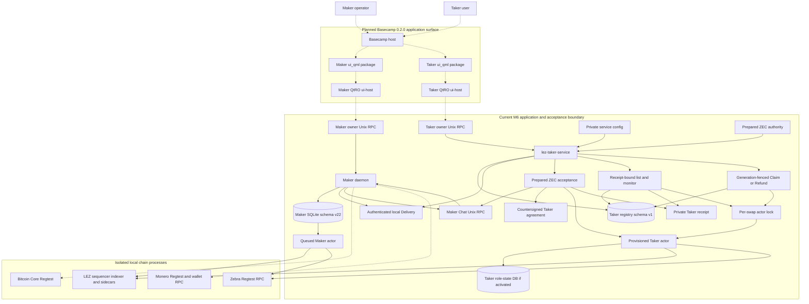

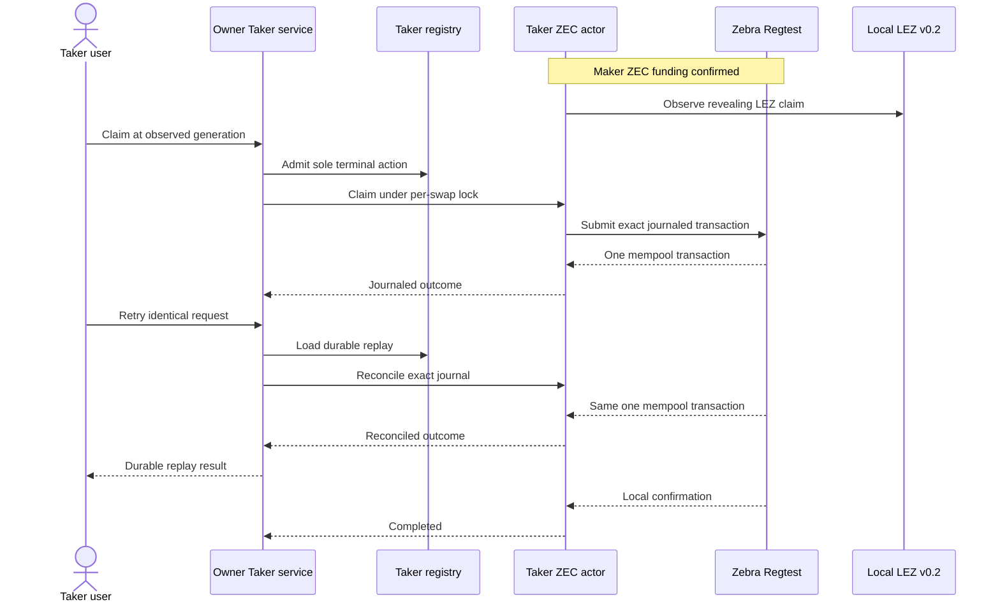

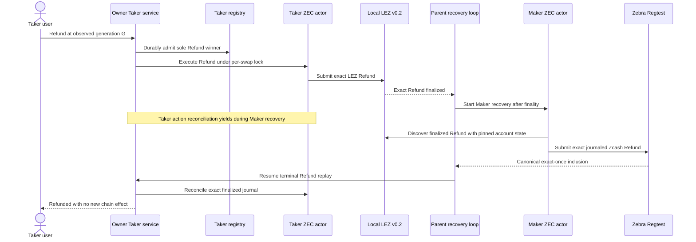

This Refund order is conditionally atomic: the sole terminal winner is durable
before effect I/O, LEZ recovery is finalized before Maker receives Zcash
recovery authority, and exact journals make every retry observation or replay
rather than a new send. Temporarily yielding Taker observation cannot suppress
a legitimate Taker effect because its sole Refund is already finalized and
Claim is excluded. Acceptance still requires one canonical effect on each
chain and terminal replay with no new effect. This is not a distributed atomic
commit or a proof against future public-chain reorganization.

The process split is an authority boundary, not merely a UI detail. There is
no Taker-service edge to the Maker owner RPC. Fresh Taker initiation reaches
the Maker only through authenticated Delivery and the separate bounded Chat
socket. The service negotiates and provisions exact role artifacts, projects locked
status, and can invoke the admitted ZEC Taker Claim or Refund command under the
actor lock. The actor alone owns chain capabilities and journals. Fresh regression
`m6claim0ba41aba` exercised the Claim edge and surrounding
role actors against wholly fresh local LEZ v0.2 and Zebra Regtest. LEZ Claim
`f865903e...14d0cc` finalized in block 127; the empty-to-one-to-same-one
Zebra sequence retained exact Claim `0da6b4c2...d2abf`, later canonical at
height 107, proving replay added no effect. The QML and QtRO edges
remain unimplemented and unexercised.

A future QML or `ui-host` crash must not stop the autonomous Maker daemon or
erase either role's durable recovery state. Delivery and Chat remain pre-lock
discovery and negotiation transports only. After first submission, pair actors
and role-restricted nodes must retain enough local state to claim or refund
without either transport. Existing actor and chain components retain their M2
through M5 evidence level. This diagram makes no Basecamp-driven swap claim
until every dashed edge is built and actor-real exercised.

## Canonical M2 build, deployment, and actor boundary

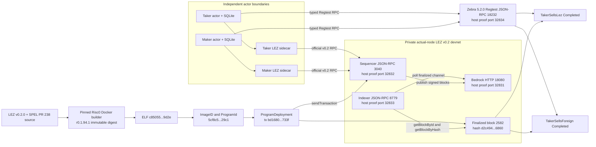

The canonical artifact above is the only current v0.2 deployment target: ELF
SHA-256
`c85055f6fe85b71535a322ba84ffc612f5d093954a721ba3b529428814dc9d2e`
and ImageID and ProgramId
`5cf8c5a4eedb3c2873956cb7898eb33a495407c9746fb1a065c99638159329c1`.
Deployment transaction
`bd16808ee91c9860e860830e7437148b3f4f81c632fc1b6d40350e20cc47733f`
is Finalized in block `2582`, hash
`d2c4944a936347207be7030bb39f6b8f21dfc3dc75e95afedb58e22ed1f96860`.
The exact source, toolchain, actor, LEZ transaction, Zebra transaction, balance,
and timing facts are retained in the
[canonical M2 certification packet](../evidence/m2-canonical-local-certification-20260714.json).
Earlier host-built ELF `40c9d37c...8021` and ProgramId `f8385049...0fbe`
remain solely as immutable historical-evidence identities. They are not
accepted by current manifests, actor configuration, or the corridor runner.
All displayed host ports are retained-proof addresses for one isolated run,
not defaults or reusable discovery values.

## M3 schema-4 actor-owned Maker-lock PoC and retained evidence

Run `m3schema4-20260717d`, completed at `2026-07-17T07:45:38Z` from the clean,
already-pushed repository commit
`0e7635fc7e50cc6e0612745dcdaf6df8bbcf6f9a`, is the current private-local
schema-4 checkpoint. Fresh one-shot Maker and Taker actor processes completed
both `TakerSellsForeign` and `TakerSellsLez` against one run-owned Bitcoin Core
31.1 Regtest and LEZ v0.2 service tuple. The test fixture submitted only the
Taker's direction-selected first lock. The schema-4 Maker actor independently
validated that exact first lock, consumed its role-local durable authority,
and submitted the opposite-chain second lock. The runner only mined or waited
for, and then confirmed, the Maker-submitted effect. Both role stores reached
revision 4 `Completed` in both directions; Maker restart and terminal replay
added zero submissions. The previous `m3actor-20260716n` and 2026-07-15
operator-composed packets remain historical evidence, not substitutes for this
actor-owned second-lock proof.

Core 31.1 requires `gettxspendingprevout` flags in one options object
`{mempool_only:false,return_spending_tx:true}`, rather than the older positional
boolean form. Finalized LEZ scans use bounded windows and each actor-sidecar
request has a finite 120-second timeout. In `TakerSellsLez`, nine typed
`moving_tip` results were returned while the local finalized tip advanced; a
tenth fresh-process observation obtained one stable exact first-lock proof and
then permitted the one Maker Bitcoin send. A `moving_tip` payload carries no
chain fact and grants no send authority. Bounded retries repeat reads only and
cannot re-arm a `Started`, `Unknown`, `Accepted`, or completed journal step.

The current runner allocates every host port dynamically on literal loopback.
Bitcoin publishes no P2P port. Core, Bedrock, the sequencer, the indexer, both
sidecars, state roots, credentials, and Docker resources are owned by one
unique run identifier. The endpoint labels below are protocols and process
roles, not reusable port numbers.

ADR 0048 starts the independent Core and LEZ service provisioners concurrently
only after immutable prebuild and artifact gates pass. Both fixed launcher
scripts are SHA-bound, placed in separate owned sessions, registered by exact
PID/start/executable/PGID/SID, waited, and reaped before bootstrap or actor
authority can proceed. Docker discovery authenticates fixed run, scope, and
component labels and retains every individually safe identity for cleanup even
when certification rejects an overcount. Run AA measured the pre-change
sequential startup at about 39 seconds for Core, 58 seconds for LEZ, and 98
seconds including handoff. Clean pushed Run AD completed startup in one
67-second concurrent window and the complete two-direction run plus cleanup in
16 minutes 6.52 seconds. The certified startup saving is 31 seconds. ADR 0049
now records fixed outer phases from Linux monotonic uptime, publishes an exact
owner-private packet, and binds its path and SHA-256 into the main run packet.
Clean pushed Run AE now measures 17 minutes 3.10 seconds before main
publication with only 280 ms unattributed. Its two complete user-direction
phases consume 75.2 percent. Direction-internal semantic timing and the
complete pinned CI quality suite are now GREEN: both child packets bind their
effect manifests and must fit inside their outer actor-flow or overlap parent
before main publication. Clean pushed Run AF now measures those packets:
346.06 seconds forward and 386.06 seconds reverse inside exact parents, with
five finalized lock/claim windows accounting for nearly all actor time and
every other child phase below one second. Differing host contention prevents
claiming Run AF's lower wall time as a speedup.

```mermaid
flowchart TB
    Source["Pinned LEZ v0.2 source and witnessed guest"]
    Artifact["Exact guest ELF<br/>SHA-256 a199c5be...e293"]
    Deployment["Exact ProgramDeployment<br/>ProgramId 39b6a4db...4dec"]

    subgraph Bootstrap["Run-owned bootstrap authority"]
        OuterRunner["M3 outer runner"]
        DirectionRunner["Two direction orchestrators"]
        Clock["Linux monotonic uptime"]
        Timing["Strict outer timing packet"]
        DirectionTiming["Two strict direction timing packets"]
        NodeCoordinator["Exact concurrent node-start coordinator"]
        Identity["Fresh maker and taker owner identities"]
        VaultDerive["Official owner-derived Vault account IDs"]
        CoreProvisioner["Core service, wallet, miner, and funding provisioner"]
        LezProvisioner["LEZ Bedrock, sequencer, and indexer provisioner"]
        LezBootstrap["Exact guest deploy, finality audit, and Vault Claims"]
        Clock --> OuterRunner
        Clock --> DirectionRunner
        OuterRunner --> NodeCoordinator
        OuterRunner --> Timing
        OuterRunner --> DirectionRunner
        DirectionRunner --> DirectionTiming
        NodeCoordinator --> CoreProvisioner
        NodeCoordinator --> LezProvisioner
        Identity --> VaultDerive
    end

    subgraph MakerHost["Maker role boundary"]
        Maker["Maker operator"]
        MakerRunner["Maker role runner"]
        MakerActor["schema-4 btc-reference-actor<br/>owns second lock and claims"]
        MakerStore[("Maker SQLite<br/>lifecycle, Maker-lock, effect, BTC, and LEZ journals")]
        MakerSidecar["Maker sidecar<br/>capability-authenticated loopback"]
        Maker --> MakerRunner
        MakerRunner --> MakerActor
        MakerActor --> MakerStore
        MakerActor --> MakerSidecar
    end

    subgraph TakerHost["Taker role boundary"]
        Taker["Taker operator"]
        TakerRunner["Taker role runner"]
        TakerActor["schema-4 btc-reference-actor<br/>observes Maker lock and owns reveal"]
        TakerStore[("Taker SQLite<br/>lifecycle, effect, BTC, and LEZ journals")]
        TakerSidecar["Taker sidecar<br/>capability-authenticated loopback"]
        Taker --> TakerRunner
        TakerRunner --> TakerActor
        TakerActor --> TakerStore
        TakerActor --> TakerSidecar
    end

    subgraph BitcoinStack["Run-owned Bitcoin Core 31.1 Regtest"]
        Core["JSON-RPC<br/>dynamic literal-loopback port<br/>restricted actor Basic credentials"]
        CoreState[("Run-owned chain, wallet, and deterministic Regtest funds")]
        Core --> CoreState
    end

    subgraph LezStack["Run-owned LEZ v0.2 private devnet"]
        Sequencer["Sequencer JSON-RPC<br/>dynamic literal-loopback port"]
        Bedrock["Bedrock HTTP<br/>dynamic literal-loopback port"]
        Indexer["Indexer JSON-RPC<br/>dynamic literal-loopback port"]
        Vaults[("Fresh derived maker and taker Vault accounts")]
        Escrow["Witnessed escrow program<br/>39b6a4db...4dec"]
        Sequencer -->|"publish signed channel blocks"| Bedrock
        Indexer -->|"read finalized channel"| Bedrock
        Sequencer --> Escrow
    end

    Source --> Artifact
    Artifact --> Deployment
    Deployment --> LezBootstrap
    VaultDerive --> LezBootstrap
    LezBootstrap --> Sequencer
    LezBootstrap --> Indexer
    LezBootstrap --> Vaults
    TakerFirst["Taker external first-lock fixture<br/>only PoC ownership exception"]
    Confirmer["Run controller<br/>mines or waits and confirms only"]
    CoreProvisioner -->|"cookie RPC for setup and deterministic funds"| Core
    LezProvisioner --> Sequencer
    LezProvisioner --> Bedrock
    LezProvisioner --> Indexer
    TakerFirst -->|"Bitcoin first lock"| Core
    TakerFirst -->|"LEZ first lock"| TakerSidecar
    Confirmer -->|"fixture-only mining"| Core
    Confirmer -->|"confirmation reads"| Core
    Confirmer -->|"finality reads"| Indexer
    MakerActor -->|"restricted role Basic RPC"| Core
    TakerActor -->|"restricted role Basic RPC"| Core
    MakerSidecar -->|"signed transactions"| Sequencer
    TakerSidecar -->|"signed transactions"| Sequencer
    MakerSidecar -->|"finalized observations"| Indexer
    TakerSidecar -->|"finalized observations"| Indexer

    Terminal["Run m3schema4-20260717d<br/>schema-4 Maker locks actor-owned<br/>two of two directions revision 4 Completed"]
    Timing -->|"Path and SHA 256 bound before success"| Terminal
    DirectionTiming -->|"Paths effect hashes and containment"| Terminal
    MakerActor --> Terminal
    TakerActor --> Terminal
    Core --> Terminal
    Indexer --> Terminal
```

The pushed M3 closure adds the application-facing durable SDK and explicit
Bitcoin Testnet4 routes without changing the retained local-node topology or
actor authority:

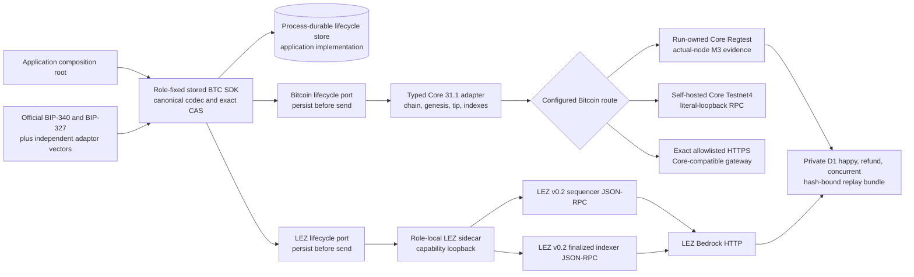

Only the Regtest and private-LEZ branches were used by actual-node M3
certification. The Testnet4 branches are configuration/readiness contracts:
literal loopback is valid for self-hosting, exact HTTPS is admitted only with
the Testnet4 profile, and both require exact Core 31.1, Testnet4 genesis, and
synchronized indexes. Neither branch was contacted publicly. The three private
recordings bind clean evidence commit `a6eb1ad` and verifier commit
`946208a`; their mode-`0600` bundle hash is
`3d7d7adc...a86c7cc`.

Fresh LEZ owners are generated for every actor run. The identity provisioner
derives each Vault account with the official Vault program function and emits
both owner and derived Vault identities. Genesis supplies the owner identity;
the sequencer derives and funds its Vault. Readiness and onboarding then query
that same derived Vault and submit exactly one owner-signed Vault Claim. This
prevents a fresh owner from accidentally being paired with a stale static
Vault identifier.

The runner independently hashes the supplied guest artifact, requires
`a199c5be...e293`, deploys ProgramId `39b6a4db...4dec` exactly once, and uses
sequential bounded indexer reads to prove the deployment and both Vault Claims
finalized. Node acceptance alone is not finality. Run `m3schema4-20260717d`
proved this bootstrap in the same fresh composition as both complete schema-4
directions: deployment finalized once in block 6, the maker Vault Claim in
block 9, and the taker Vault Claim in block 12.

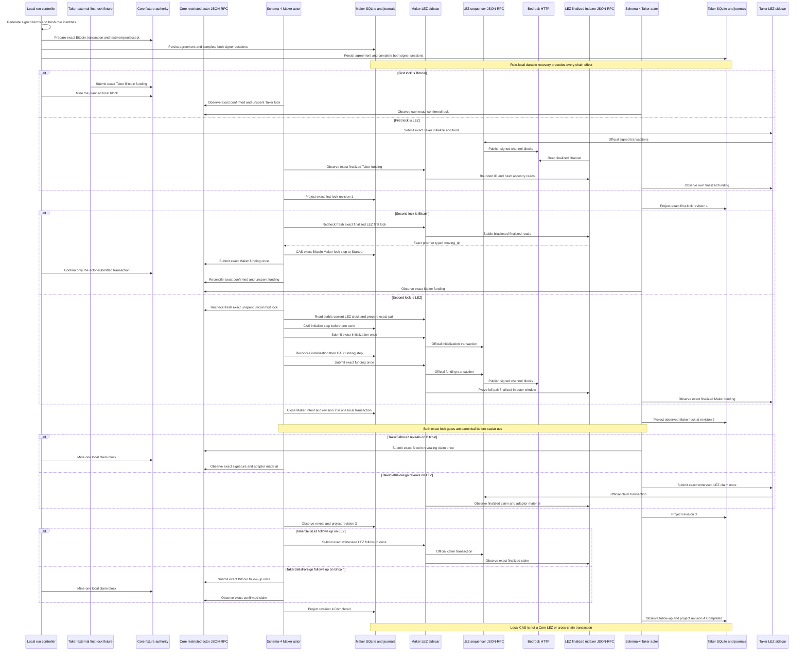

### Schema-4 `TakerSellsForeign` local flow

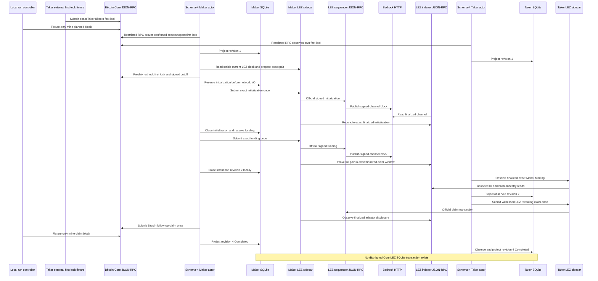

### Schema-4 `TakerSellsLez` local flow

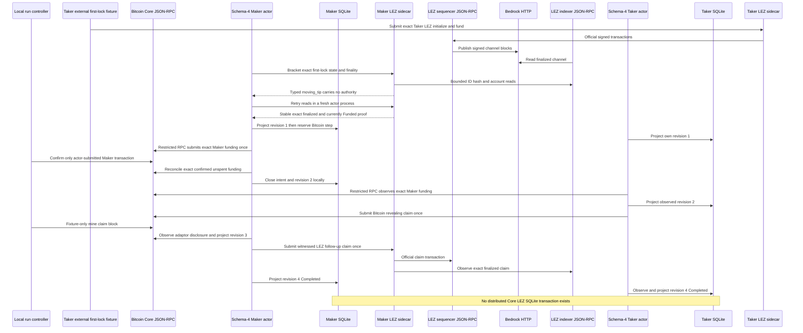

At the current PoC boundary, a Taker external fixture still constructs and
submits the first lock and the run controller owns deterministic local mining.
The schema-4 Maker actor constructs and submits the second lock through its
restricted Core RPC or role-local LEZ sidecar; the controller does not submit
that effect. The Maker's complete intent and revision-two close are atomic only
inside Maker SQLite. Chain submission is outside that transaction. Claims,
durable one-attempt authority, exact reconciliation, canonical observation,
and revisions three and four are actor-owned. A product Taker SDK must replace
the external first-lock fixture without changing the agreement or chain-adapter
contracts.

The older operator facts remain in the
[M3 local evidence packet](../evidence/m3-local-two-direction-poc-20260715.json).
The current secret-safe retained summary is
[the schema-4 checkpoint packet](../evidence/m3-schema4-actor-owned-lock-poc-20260717.json);
the full run packet is rooted at
`.e2e/m3schema4-20260717d/m3-actor-poc/evidence/`. It binds the exact pushed
commit and executable hashes. It retains dynamic local endpoints, fresh
owner-derived Vault onboarding, the checked guest deployment, both role
journals, one actor-owned Maker-lock effect per direction, five unique effects
per direction, four terminal role states, replay submission counts, and exact
cleanup attestation. It records no public RPC, faucet, public funds, or
private-material disclosure. The separate overlap checkpoint below closes the
accepted two-swap opposite-direction execution item. Process-kill, reorg,
chaos, production key custody, and public deployment remain outside this
checkpoint. Public deployment is intentionally not required for M3.

### M3 opposite-direction overlap checkpoint

Clean run `m3overlap-20260717a` completed from already-pushed commit
`1e6d5f1b9205aafb2df427f5285ff0920406b7d1` against the same run-owned Core
31.1 Regtest and LEZ v0.2 Bedrock/sequencer/indexer tuple. One controller per
economic direction stayed alive while every individual actor command used a
fresh one-shot process. Both swaps and all four actor stores reached revision
2 `both_legs_locked` before the controller issued either settlement permit.

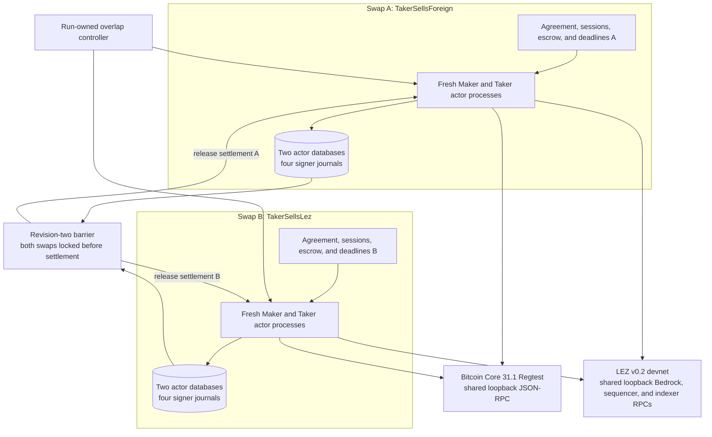

The funding fixture uses one deterministic local test-custody key but assigns
two distinct mature coinbase outpoints. Run A's source outpoint was mined at
height 1 and its planned contract anchor was 103; Run B's source was mined at
height 2 and its planned anchor was 104. Sharing the fixture key does not share
an outpoint, agreement, actor state, signer session, escrow, deadline, or
protocol authority. The revision-two inventory proved four distinct actor
database paths and inodes, eight distinct signer journal paths and inodes, two
Bitcoin and two LEZ sessions, two agreements, two escrow metadata/custody
pairs, and distinct refund bounds.

After the barrier, both roles in both swaps reached revision 4 `Completed`.
Each swap retained two Bitcoin and three LEZ effects; the effect ID sets were
pairwise disjoint and terminal replay added zero submissions. Exact cleanup
removed every captured run resource, used no broad cleanup, and targeted no
foreign activity. The secret-safe packet is
[m3-overlapping-two-swap-poc-20260717.json](../evidence/m3-overlapping-two-swap-poc-20260717.json).

This is protocol overlap, not one distributed transaction or a throughput
claim. Chain-mutating phases are deliberately serialized so each exact
mempool/finality assertion remains strict. Atomicity remains per swap:
presignatures are durable before its first effect, its Taker locks first, both
of its locks are canonical before reveal, and its claims/refunds follow the
signed chain order. Arbitrary-N scheduling, two same-direction swaps sharing a
LEZ depositor nonce stream, adversarial cutoff/refund races, reorg, and
production/public operation remain open.

## Actors, runtime components, and trust boundaries

```mermaid
flowchart TB
    subgraph People["Independent actors"]
        MO["Maker operator"]
        T["Taker"]
    end

    subgraph MakerHost["Maker-controlled host"]
        MC["Maker CLI"]
        MM["Maker mini-app"]
        LC["Logos Core lifecycle adapter"]
        MD["Maker daemon"]
        MRPC["Owner lifecycle RPC<br/>monitor claim refund GREEN"]
        APP["M5 application service"]
        OF["Durable expiring offers<br/>global replay + one-winner reserve GREEN"]
        BTN[("Schema-v19 BTC negotiation<br/>signed staging + atomic actor activation GREEN")]
        CO["Durable swap coordinator"]
        DB[("Maker SQLite schema v22<br/>application + actor scheduler journals")]
        PR["Durable route price selector"]
        MPV["Daemon Maker-only provisioner<br/>startup-pinned authority + durable no-clobber publish"]
        SCH[("Schema-v18 actor scheduler<br/>atomic registration + fenced leases")]
        ACT[("Schema-v17 manual actions<br/>request replay + generation-fenced attach")]
        PG[("Schema-v18 secret-free progress<br/>pair vocabulary + source generation")]
        SUP["Bounded sealed-FD supervisor cycle GREEN<br/>strict BTC/ZEC schema projection<br/>actual-node composition pending"]
        MA["One-shot Maker pair actor<br/>real BTC/ZEC sealed-config consumers GREEN"]
        PP["Bounded price process parent"]
        PW["One-shot Logos price worker"]
        PM["Pinned module plus SHA identity"]
        OTP[("Display-only terminal projection<br/>exact agreement provenance")]
        PS["BTC / XMR / ZEC pair SDKs"]
        ZA["Canonical dual-signed LEZ/ZEC agreement validator"]
        ZTX["ZEC BIP-199 V5 transaction SDK"]
        CA["Validated chain adapters"]
        MOA["Maker-only taker-lock observation"]
        OJ["Contiguous exact-tracker journal<br/>canonical / depth / same-tip replacement / removal"]
        ME["Fresh-gated durable maker second lock"]
        MLB["Context-owning LEZ SDK ports + adapter"]
    end

    subgraph TakerDevice["Taker-controlled device"]
        TC["lez-taker CLI<br/>BTC, XMR, and ZEC acceptance replay GREEN<br/>local-node effects pending"]
        TR[("Role-bound acceptance receipt")]
        TM["Taker mini-app"]
        TS["Taker pair SDK + durable recovery state"]
        TA["Taker-side concrete agreement validator"]
        TMO["Taker-only maker-lock observation"]
        TDB[("Taker SQLite schema v16<br/>role-local recovery")]
        TLB["Context-owning LEZ SDK ports + adapter"]
        XTR[("Private canonical XMR acceptance receipt")]
        XTM["Receipt-only XMR Taker monitor<br/>application authority GREEN<br/>no chain progress"]
        XTL["Per-swap kernel lock"]
        XTA[("Canonical Taker manifest<br/>Stage A and B, packets, private role, journals")]
    end

    subgraph SharedSecurity["Shared SDK security boundary"]
        PCM["Protected preimage + exact claim payload<br/>XChaCha20-Poly1305 + HKDF<br/>schema-v15 envelope journal"]
        M3AJ[("M3 role-local adaptor journal<br/>reserve before commitment<br/>consume nonce with exact partial GREEN")]
        M3AS[("M3 taker-only adaptor scalar<br/>owner-private file; point check only at activation<br/>maker authority forbidden")]
        M3RK[("M3 Bitcoin-funder refund scalar<br/>mode 0600 + x-only agreement match GREEN")]
        M3PE[("M3 role-local public-effect journal<br/>claim absence or refund eligibility before CAS<br/>refund race guard GREEN")]
        M3BR[("M3 BTC lifecycle recovery store<br/>four evidence revisions + hash chain<br/>offline Completed or Refunded GREEN")]
        M3SDK["M3 public durable BTC lifecycle SDK<br/>canonical codec and exact CAS store port<br/>typed BTC and LEZ runtime GREEN"]
        M3ML[("M3 Maker second-lock journal<br/>ordered one-attempt steps<br/>atomic revision-two close GREEN")]
        M3ID[("M3 exact-idempotent LEZ init path<br/>role-local reserve before official RPC<br/>actual-node restart no-rearm GREEN")]
        M3BC["M3 typed Core 31.1 adapter<br/>exact unspent funding + claim/refund evidence<br/>authorized one-send readback GREEN"]
        M3F7A["F7 countersigned asset extension<br/>strict v2 protocol + four classifiers GREEN"]
        M3F7C["F7 exact-once bridge client<br/>eleven v2 operations + role/window checks GREEN"]
        M3F7D["F7 agreement and local-policy adapter<br/>eleven no-submit mappings GREEN"]
        M3F7S["F7 official sidecar planner<br/>tags 11, 7, 8, 12, and 10<br/>four durable v2 reservations GREEN"]
        M3F7R["F7 sidecar and finalized scanner<br/>lifecycle-aware terms discovery + containing-block anchors GREEN<br/>90s max3 historical reads in 120s actor budget<br/>four actual-node pairs GREEN"]
        M3F7P["F7 peer funding projection<br/>schema 5 v2 DiscoverByTerms<br/>nonowner has no submit authority GREEN"]
        M3RA["btc-reference-actor<br/>schema 4 live locks and schema 5 peer projection GREEN<br/>four complete F7 actual-node pairs GREEN"]
        BTP["Schema-6 BTC role provisioner<br/>private stage + no-replace publish GREEN"]
        M3RUN["Schema 4 private-local runner<br/>external Taker first lock<br/>actor-owned Maker second lock GREEN"]
        M3CACHE["Policy-2 official-wallet artifact cache<br/>executable plus manifest only<br/>202.42s cold and 10.35s hit GREEN"]
        M5FZ["M5 cargo-fuzz coordinator harness<br/>all supported profiles + restart invariants<br/>bounded CI smoke GREEN locally"]
        M5RR[("M5 one-leg ZEC recovery<br/>historical actual-node checkpoint intervention-assisted<br/>durable contiguous cursor component GREEN")]
        M3F7A --> M3F7C
        M3F7C --> M3F7D
        M3F7D --> M3F7S
        M3F7S --> M3F7R
        M3F7R --> M3F7P
        M3F7P --> M3RA
        M3CACHE -->|"verified private wallet copy"| M3RUN
    end

    subgraph LezSidecars["Role-isolated official LEZ v0.1.2 processes"]
        MSL["Maker sidecar<br/>official wire + signer + durable cache"]
        TLS["Taker sidecar<br/>official wire + signer + durable cache"]
    end

    subgraph LocalLezFixture["Run-scoped exact-v0.1.2 node fixture"]
        ELN["Reusable external standalone process<br/>checked guest + fresh mode-0700 home"]
        LRM[("Private mode-0600 readiness<br/>endpoint + deployment tx/block + ProgramId<br/>built-in owner + funded actor keys")]
        LRR["Future reference-actor runner<br/>splits role-local endpoint and key files"]
    end

    subgraph LezV02Sidecars["Official LEZ v0.2 sidecar boundary"]
        MSL2["Maker v0.2 PoC process<br/>Vault Claim + native deposit GREEN"]
        TLS2["Taker v0.2 PoC process<br/>Vault Claim + native claim GREEN"]
        V02J[("Separate role-bound state<br/>exact reservations + Vault attempt journals GREEN")]
        MBR2["Maker lez-v02-bridge-poc<br/>canonical forward and reverse complete"]
        TBR2["Taker lez-v02-bridge-poc<br/>canonical forward and reverse complete"]
        M3WB["M3 witnessed prepare, complete, and submit<br/>both local happy directions GREEN"]
        M3FF["M3 finalized witnessed-funding observer<br/>parent-linked stable-tip ancestry<br/>historical Funded state GREEN"]
        M3CF["M3 generic current funded-escrow proof<br/>stable state-only clock and custody GREEN<br/>923586b; not finality"]
        M3FO["M3 finalized witnessed-claim observer<br/>parent-linked stable-tip ancestry<br/>dual role + BIP340 GREEN"]
        M3RF["Native-refund planner + finalized observer<br/>hashlock and witnessed bounded old-page discovery GREEN"]
        M3LI["Live LEZ init admission<br/>exact same ID and bytes<br/>one role-local send GREEN"]
        M3LC["Joined LEZ first-lock view<br/>stable current state plus exact bytes<br/>and finalized ancestry GREEN"]
        MBRJ[("Maker-only request store<br/>PREPARE replay + submit unknown-before-I/O GREEN")]
        TBRJ[("Taker-only request store<br/>PREPARE replay + submit unknown-before-I/O GREEN")]
        MSL2 --> V02J
        TLS2 --> V02J
        MBR2 --> MBRJ
        TBR2 --> TBRJ
        MBR2 --> M3WB
        TBR2 --> M3WB
        M3WB --> V02J
        MBR2 --> M3FF
        TBR2 --> M3FF
        MBR2 --> M3FO
        TBR2 --> M3FO
        MBR2 --> M3RF
        TBR2 --> M3RF
    end

    subgraph LocalLezV02["Required public-compatible local LEZ v0.2 devnet"]
        BR["Bedrock HTTP 18080<br/>retained proof host 32831"]
        IX["LEZ v0.2 indexer RPC 8779<br/>retained proof host 32833"]
        SQ["LEZ v0.2 sequencer RPC 3040<br/>retained proof host 32832"]
        V02R["Host orchestrator<br/>exact-ID lifecycle and RPC probes"]
        V02Net["Unique no-masquerade Docker bridge<br/>dynamic loopback ports"]
        V02Ready[("v0.2 services + Vault Claims + canonical deploy GREEN<br/>ProgramId 5cf8c5...29c1")]
        V02Native[("Native init + fund + claim GREEN<br/>finalized blocks 219 220 223")]
        V02Fixture[("Fixture readiness GREEN<br/>isolated configs; saved window stale")]
        V02Partial[("Historical host-built evidence retained<br/>14d through 14o and reverse 14c")]
        V02Full[("Canonical ZEC corridor directions GREEN<br/>2 of 2 happy directions")]
        V02M3[("M3 aggregate-witness guest deployed<br/>ELF a199c5be...e293<br/>ProgramId 39b6a4db...4dec; two claims finalized")]
        V02State[(".e2e/run_id/lez-v02")]
    end

    subgraph OffChain["Untrusted, removable after lock"]
        DEL["Run-local Delivery-compatible adapter<br/>stale projection degradation GREEN"]
        CHAT["Run-local Chat-compatible adapter<br/>atomic completion and post-expiry exact retry GREEN"]
    end

    subgraph Nodes["Actor-selected node boundary"]
        LEZ["LEZ sequencer<br/>dynamic local port<br/>private v0.2 execution GREEN<br/>public live execution deferred"]
        BTC["Bitcoin Core 31.1 Regtest<br/>both adaptor claim directions GREEN<br/>service mode and durable SDK/journal GREEN"]
        XMR["monerod + wallet RPC"]
        ZEC["Zebra 5.2.0 Regtest JSON-RPC<br/>retained proof host 32834"]
    end

    subgraph DormantRoutes["Dormant public route contracts; no public I/O evidence"]
        RouteGate["Schema-v3 route + signed runtime<br/>pre-persistence validation"]
        LezProfile{"Sidecar outbound LEZ profile"}
        PublicLez["Exact HTTPS<br/>testnet.lez.logos.co"]
        PublicLezRisk["Finalized-tip method<br/>availability unknown"]
        ZebraProfile{"Actor Zebra route"}
        SelfHostedZebra["Self-hosted loopback<br/>cookie authentication"]
        TatumZebra["Exact Tatum Testnet HTTPS<br/>x-api-key authentication"]
    end

    subgraph PublicIdentity["Dormant public deployment identity handoff"]
        V02Deploy["Exact-once v0.2 deployment client<br/>fixed official RPC"]
        V02AuthKey[("Separate owner-only 32-byte<br/>evidence authentication key")]
        V02Evidence[("Bounded HMAC-authenticated evidence<br/>channel + genesis + program + tx + block")]
        V02Target["Canonical Docker target<br/>ELF c85055...9d2e<br/>ProgramId 5cf8c5...29c1"]
        V02Provision["Offline provision-identity<br/>trusted target + no-clobber"]
        V02Runtime[("Exact public runtime identity")]
    end

    subgraph Networks["Consensus networks"]
        LN["LEZ"]
        BN["Bitcoin"]
        XN["Monero"]
        ZN["Zcash transparent pool"]
    end

    MO --> MC
    MO --> MM
    MO --> LC
    MC -->|"owner Unix RPC"| MRPC
    MRPC --> MD
    MM -.->|"M6 authenticated local RPC"| MD
    LC -.->|"start / stop / health"| MD
    MD --> APP
    APP --> OF
    APP --> BTN
    APP --> PR
    PR -->|"local route"| DB
    PR -->|"Logos route outside DB lock"| PP
    PP -->|"bounded typed JSON"| PW
    PW -->|"versioned C ABI"| PM
    PR -->|"atomic immutable snapshot"| OF
    APP -->|"signed offer publication"| DEL
    TC -->|"key-pinned discovery"| DEL
    APP -->|"isolated maker proposal runtime"| CHAT
    TC -->|"persist wire then exact completion retry"| CHAT
    APP -->|"validated final agreement"| MPV
    MPV -->|"durable Maker-only bundle"| SCH
    SCH -->|"same acceptance transaction"| DB
    MRPC -->|"allowlisted read"| PG
    MRPC -->|"request ID and expected generation"| ACT
    ACT -->|"same fenced resolution"| DB
    PG -->|"same fenced resolution"| DB
    DB -->|"expiry-independent committed replay preflight"| APP
    SCH -.->|"fenced lease and sealed FDs"| SUP
    ACT -.->|"attached explicit action"| SUP
    SUP -.->|"bounded one-shot execution"| MA
    SUP -->|"validated status or effect"| PG
    OF --> DB
    BTN --> DB
    APP --> CO
    APP -->|"durable Maker handoff"| BTP
    TC -->|"persist-before-complete Taker handoff"| BTP
    BTP -->|"config and agreement digests"| TR
    BTP -->|"one role-only actor root"| M3RA
    CO --> DB
    CO --> PS
    MA --> PS
    M5FZ -.->|"generated transition and restart checks"| CO
    PS --> M5RR
    TS --> M5RR
    M3RF --> M5RR
    PS -->|"stopped terminal offline replay"| OTP
    OTP --> DB
    APP -->|"owner status and history overlay only"| OTP
    PS --> ZA
    PS --> ZTX
    PS --> CA
    PS --> MOA
    PS --> ME
    PS --> MLB
    ZTX --> CA

    T --> TC
    T --> TM
    TC --> TS
    TC --> XTM
    XTR -->|"canonical receipt"| XTM
    XTM -->|"digest-pinned prelock binding"| XTA
    XTM --> XTL
    XTL -->|"pinned manifest and full source validation"| XTA
    TS --> TA
    TS --> TMO
    TS --> TDB
    TS --> TLB
    TMO --> TDB
    TMO -->|"signed direction selects one node"| LEZ
    TMO -->|"signed direction selects one node"| ZEC
    PS --> PCM
    TS --> PCM
    PS --> M3AJ
    TS --> M3AJ
    TS -->|"taker only owner-private authority"| M3AS
    PS -->|"maker private config"| M3RA
    TS -->|"taker private config"| M3RA
    PS -->|"only when maker is Bitcoin funder"| M3RK
    TS -->|"only when taker is Bitcoin funder"| M3RK
    M3AJ -->|"existing exact-role Bitcoin and LEZ journals"| M3RA
    M3AS -->|"stable read and agreement point check"| M3RA
    M3RK -->|"Bitcoin funder only; exact refund key"| M3RA
    M3WB -->|"full prepared claim result"| M3RA
    M3SDK -->|"schema 4 exact plans"| M3RA
    M3ML -->|"observe before one send; close with revision two"| M3RA
    M3ID -->|"typed exact-idempotent live mapping"| M3RA
    M3RUN -->|"schema-4 live composition"| M3RA
    M3RA -->|"predecessor CAS projections one through four"| M3BR
    M3RA -->|"agreement-derived Bitcoin funding, claim, and refund"| M3BC
    M3RA -->|"signed-account finalized LEZ funding read"| M3FF
    M3RA -->|"current funded proof in joined live view"| M3CF
    M3RA -->|"signed transcript finalized LEZ claim read"| M3FO
    M3RA -->|"state-only, prepare, exact, submit, finalized discovery"| M3RF
    M3RA -->|"LEZ Maker initialization and funding"| M3LI
    M3RA -->|"Bitcoin Maker send gate"| M3LC
    M3LI --> M3WB
    M3ID -->|"same request ID and bytes"| M3LI
    M3LC --> M3FF
    M3CF -->|"current Funded facts only"| M3LC
    M3RA -->|"persist exact actor-owned claim or refund before authority"| M3PE
    PCM -->|"encrypted envelope + journal"| DB
    PCM -->|"encrypted envelope + journal"| TDB
    TM -.-> TS

    MLB <-->|"bounded authenticated lez_bridge.v1"| MSL
    TLB <-->|"bounded authenticated lez_bridge.v1"| TLS
    MSL -->|"pinned generated JSON-RPC"| LEZ
    TLS -->|"pinned generated JSON-RPC"| LEZ
    ELN -->|"start exact upstream service"| LEZ
    LEZ -->|"official health, tx/block, static built-in, account RPC"| ELN
    ELN -->|"atomic no-clobber publish after verification"| LRM
    LRM -.->|"future private handoff"| LRR
    LRR -.->|"maker-only provisioning"| MSL
    LRR -.->|"taker-only provisioning"| TLS
    MLB <-->|"live bounded bridge; canonical runs Completed"| MBR2
    TLB <-->|"live bounded bridge; canonical runs Completed"| TBR2
    MSL2 -->|"official v0.2 JSON-RPC"| SQ
    TLS2 -->|"official v0.2 JSON-RPC"| SQ
    MBR2 -->|"reveal forward; initialize and fund reverse"| SQ
    TBR2 -->|"initialize and fund forward; reveal reverse"| SQ
    MBR2 -->|"stable finalized tip bound to runtime genesis"| IX
    TBR2 -->|"stable finalized tip bound to runtime genesis"| IX
    M3FO -->|"bounded ID and hash blocks parent-linked through stable tip<br/>unique transcript + accounts at containing BlockId"| IX
    M3FF -->|"bounded ID and hash blocks parent-linked through stable tip<br/>canonical FundNative + historical Funded accounts"| IX
    M3F7R -->|"finalized candidate plus metadata, definition, and custody<br/>at one immutable containing BlockId"| IX
    MBR2 -->|"typed outbound profile"| LezProfile
    TBR2 -->|"typed outbound profile"| LezProfile
    LezProfile -->|"local explicit loopback"| SQ
    LezProfile -->|"local explicit loopback"| IX
    LezProfile -.->|"official_public"| PublicLez
    PublicLez -.-> PublicLezRisk
    V02Deploy -.->|"future owner-authorized deployment"| PublicLez
    V02AuthKey -->|"authenticate observed facts"| V02Deploy
    V02Deploy -->|"retain exact observed result"| V02Evidence
    V02Evidence --> V02Provision
    V02AuthKey -->|"verify before trust"| V02Provision
    V02Target --> V02Provision
    V02Provision --> V02Runtime
    V02Runtime -.->|"future signing and role provisioning"| RouteGate
    V02R -->|"start first; cryptarchia and channel HTTP"| BR
    V02R -->|"start after channel; finalized ID and hash RPC"| IX
    V02R -->|"start after exact missing proof; service RPC"| SQ
    V02R --> V02Net
    V02R --> V02State
    V02Net --> BR
    V02Net --> IX
    V02Net --> SQ
    SQ -->|"Zone SDK signed publish"| BR
    IX -->|"poll finalized LEZ channel"| BR
    V02R -->|"write run-scoped evidence"| V02Ready
    V02Ready --> V02Native
    V02Ready --> V02Fixture
    ZEC -->|"stable mature Regtest UTXO query"| V02Fixture
    V02Native --> V02Partial
    V02Fixture --> V02Partial
    V02Ready -->|"canonical deployment finalized"| V02Full
    V02R -->|"digest-pinned build, recursive execution, official-wire completion"| V02M3
    M3WB --> V02M3
    V02M3 -->|"deployment and witnessed claims finalized"| SQ
    V02Fixture -->|"fresh role provisioning"| V02Full
    V02Full -->|"direction-derived funding and exact spend on Zebra"| ZEC
    V02Full -.->|"runtime and funding handoff"| LRR
    ZA --> RouteGate
    TA --> RouteGate
    RouteGate --> LezProfile
    RouteGate --> ZebraProfile
    PS --> ZebraProfile
    TS --> ZebraProfile
    ZebraProfile -->|"deterministic_local"| ZEC
    ZebraProfile -.->|"self_hosted_cookie"| SelfHostedZebra
    ZebraProfile -.->|"tatum_testnet_x_api_key"| TatumZebra

    APP -.->|"publish and reserve before first lock"| DEL
    APP -.->|"countersigned terms before first lock"| CHAT
    TS -.->|"discover only before acceptance"| DEL
    TS -.->|"negotiate only before first lock"| CHAT
    CA --> LEZ
    CA --> BTC
    M3BC --> BTC
    CA --> XMR
    CA --> ZEC
    MOA -->|"signed direction selects one node"| LEZ
    MOA -->|"signed direction selects one node"| ZEC
    MOA -->|"validated event"| OJ
    OJ -->|"atomic role-local projection"| DB
    OJ -->|"full-history replay"| CO
    ME -->|"fresh exact-head query"| MOA
    ME -->|"intent and confirmed transition"| DB
    ME -.->|"typed production action pending"| CA
    TS --> LEZ
    TS --> BTC
    TS --> XMR
    TS --> ZEC
    LEZ --> LN
    SQ -.-> LN
    PublicLez -.-> LN
    BTC --> BN
    XMR --> XN
    ZEC --> ZN
    SelfHostedZebra -.-> ZN
    TatumZebra -.-> ZN

    classDef planned stroke-dasharray: 5 5,fill:#fff7e6,stroke:#9a6700;
    classDef implemented fill:#ddf4ff,stroke:#0969da;
    classDef running fill:#e6ffec,stroke:#1a7f37;
    class MM,LC,CA,TM,LRR,PublicLezRisk planned;
    class TC,XTR,XTM,XTL,XTA,BTP,M3AS,M3RK,M3PE,M3RF,M3BR,M3BC,M3SDK,M3ML,MBRJ,TBRJ,V02Partial,RouteGate,LezProfile,PublicLez,ZebraProfile,SelfHostedZebra,TatumZebra,V02Deploy,V02AuthKey,V02Evidence,V02Target,V02Provision,V02Runtime implemented;
    class BR,IX,SQ,V02R,V02Net,V02Ready,V02Native,V02Fixture,V02Full,V02State,MSL2,TLS2,V02J,MBR2,TBR2,M3FF,M3FO,M3CF,M3ID,M3LI,M3LC,M3RA,M3RUN running;
```

The maker operator owns maker policy, keys, node selection, and the daemon
lifecycle. The taker owns a separate client, keys, node selection, and recovery
state. Logos Core is an optional lifecycle surface, never a protocol authority.
Delivery / Chat is not trusted with secrets or chain truth and may disappear
after the first lock. Chain adapters accept consensus evidence from the selected
LEZ sequencer, Bitcoin Core, `monerod`, or Zebra; peer messages never advance an
on-chain state by themselves.

The XMR Taker monitor is deliberately outside those transport and chain edges.
It binds a private canonical acceptance receipt to canonical Taker manifest
bytes before selecting the per-swap lock, then performs the complete semantic
reread under that lock and returns only `application_activated`. It does not
contact Delivery, Chat, a daemon, a node, or an RPC; it does not support claim
or refund and does not infer chain progress. ADR 0118 records the validation and
remaining production path-ABA hardening boundary.

For a lost completion response, the taker persists its countersigned agreement
before the RPC. A rerun validates that private wire against its executable
draft and both role identities, then retries only Chat completion. The maker
consults SQLite before current-time agreement validation or provisioning and
returns the original result only when the request, negotiation, pair authority,
and scheduled actor row all match. For BTC, the agreement signer is distinct
from the Delivery signer: the Maker signs only after binding the exact Delivery
commitment and reservation, schema 19 commits the dual-signed wire and Maker
actor together, and the Taker publishes a receipt only after durable completion.
Expired Delivery projection drift degrades transport health but cannot change
that durable result.

The concrete LEZ/ZEC agreement validator is integrated on both actor sides as
one bounded canonical wire contract. Negotiation yields untrusted bytes;
role-fixed SDK instances validate and persist an accepted envelope before
activation, then revalidate its exact durable wire on resume without retaining
transport or raw adapter handles. The current executable SDK store is a
role-fixed production SQLite adapter for accepted agreement, both lock intents,
taker projection, maker-independent observation replay, confirmed maker funding,
and the taker-local observed-maker transition. Schema-v10 claim and refund
journals protect exact owner material, keep observer paths secret-free, and
replay separate role stores to `Completed` or `Refunded` in both directions.
The BTC pair exposes a dependency-light role-fixed funding facade with exact
Bitcoin and ordered LEZ plans and byte-bound first-lock validation. Its dedicated
Maker-only revision-one SQLite journal persists the complete second-lock plan,
consumes one authority per step, retains node-admitted versus ambiguous outcomes
without rearming, and accepts completion only from exact canonical observation.
Maker revision-two projection and intent close share one transaction; Taker
projection remains observation-only. Run `m3schema4-20260717d` composes that
contract through the live schema-4 CLI in both directions. For a LEZ Maker
lock, the role-local journal reserves exact initialization and funding steps
before the sidecar's official sequencer calls; identical request IDs and bytes
never re-arm, without pretending that LEZ exposes pending-transaction absence.
For a Bitcoin Maker lock, the actor joins a stable current `Funded` state and
custody read with exact transaction bytes and independently bounded finalized
ancestry before its Core send CAS. State-only evidence does not replace bytes
or finality. Both paths re-read the exact Taker first lock and current
Maker-chain clock before any possible send, and only a strictly pre-cutoff result can grant
fresh authority. The retained run proves one live Maker-lock effect per
direction, restart with zero re-submission, exact reconciliation, and
revision-two closure; it does not make the local-node semantics a production
endorsement.
The official native-refund sidecar, main revealing-claim/refund validation
adapters, both-direction agreement-bound Zebra funding discovery, and
context-owning LEZ SDK ports are now GREEN. The production fresh-client
factory, actor-owned random request/window allocator, and cloneable shared
role-local operation journal close the corresponding process-composition
prerequisites. Reopened role-local SQLite is now the canonical LEZ claim-funding
authority in both directions and reverse claims require the durable opposite
Zcash lock. The role-keyed Zcash funding/claim/refund signer retains only
zeroizing key bytes and uses the canonical SDK builders. The
agreement-committed exact-outpoint planner, checked all-trait Zebra composite,
refund-aware full-history resume, and the mode-0600, path-isolated one-shot
maker/taker CLI boundary are GREEN. Offline `status` now opens only a
pre-existing hardened role store, replays all durable lock/claim/refund state
with chain ports impossible by type, and leaves missing state uncreated. The
v0.2 sidecar foundation now binds the exact official LEE account and
transaction types, canonical signed-transaction decoder, sequencer
health/channel RPC, and an authenticated role/run-bound describe server. Its
native escrow planner prepares and validates an exact signed initialize/fund
pair using node-observed consecutive nonces. Its Vault planner prepares and
validates the exact official maker/taker Claim transactions with role-specific
allocations and an independently confirmed owner nonce. Both optionally persist
their exact reservation in a Linux owner-only no-symlink directory and recover
the same validated signed bytes after restart without another nonce lookup.
The native refund planner separately derives the official metadata, custody, and
immutable depositor account order, constructs an unsigned `RefundNative` public
transaction with zero nonces and witnesses, and durably reserves the exact bytes
before exposure. It accepts strict legacy and witnessed terms, revalidates the
aggregate authority binding for the witnessed shape, restores byte-identically
after restart without a nonce lookup, and admits only the retained transaction
to the generic submission boundary. This planner performs no RPC and does not
claim deadline eligibility or finality.
Their role-bound SQLite effect journal now exposes the narrow Vault Claim
one-attempt state machine: it commits exact typed preparation and
`AttemptStarted` before the only official-transaction call and makes every
reopen observe-only. Forced races, crash windows, ambiguity, error
classification, schema tampering, and filesystem substitution are GREEN in
library tests. The retained local v0.2 stack then proved both owner-authorized
Vault Claims, checked deployment, and separate maker/taker PoC processes driving
native initialize/fund/claim into finalized blocks 219/220/223. The native CLI
itself proves sequencer inclusion and same-tip state; sequential indexer reads
provide the distinct finality proof. It reports `crash_atomic_submission=false`.
The exact `lez-v02-bridge-poc` source now provides the role/run/runtime/signer-
bound process boundary for prepare, observe, revealing claim, and submit. It
requires an explicit nonzero loopback actor listener and private file inputs.
Its outbound node profile accepts either explicit loopback HTTP sequencer and
indexer URLs or the exact `https://testnet.lez.logos.co/` origin for both;
mixed or generic remote routes fail before client construction. Startup binds
the official finalized indexer to the configured runtime genesis through a
stable exact sample; it does not contact or cross-bind the sequencer endpoint.
Operation paths perform their own sequencer reads and bindings before relying
on sequencer facts. The bridge replays successful PREPARE results, re-executes
observations and transient PREPARE failures, and
persists submit as unknown before node I/O. The authenticated bridge
prepare-refund method reaches the internal durable planner, stores the canonical request/result, and reconstructs and compares it
before a restarted server binds. The repeatable observe-refund method now uses
fully covered finalized indexer ancestry, equal by-ID/by-hash blocks, historical
and tip accounts, and the containing-block deadline. It never submits or caches chain truth. The actor-local lifecycle store now
replays ordered maker- and taker-funded refund evidence to terminal `Refunded`;
public actor one-attempt submission is deterministic-test GREEN, and fresh
actual-node two-lock plus first-lock refund evidence is GREEN in
`m3refund-20260716h` and `m3firstlock-20260716h`.
Sequencer observation remains bounded inclusion plus same-tip accounts. The
new witnessed-claim path separately asserts indexer finality through bounded
fully covered scans, equal by-ID/by-hash finalized blocks, exact aggregate
witness validation, and terminal accounts read at the containing block. Either
role-bound participant can observe without submitting, and the client
independently verifies BIP-340. The v2 finalized asset classifiers bind a
positive candidate to its immutable finalized containing block. After bounded
historical metadata, token-definition, and custody reads at that block, the
sidecar revalidates the same block through the official indexer's by-ID and
by-hash methods. Advancing an unrelated latest tip does not invalidate the
candidate; a missing or changed candidate fails closed. Those historical reads
use explicit nested budgets and bounded concurrency strictly inside the
120-second actor bridge request timeout: ordinary block and tip calls retain a
10-second, single-request client, while the historical-account client uses a
90-second budget, maximum concurrency three, and one bounded concurrent join
for custom-token metadata, definition, and custody. Run O showed that these
client requests can be concurrent while the upstream service effectively
serializes or queues them. The larger local budget accommodates that behavior
for PoC diagnostics; upstream batch reads or cached block-identified snapshots
remain the production improvement. The historical responses remain
authoritative-indexer consistency checks, not cryptographic account proofs or
one atomic multi-read snapshot. No fresh actual-node F7 PoC is implied by this
component correction or run O. Historical runs 14d through 14n remain failure
and invariant evidence. Fresh
pre-canonical run `m2poc-corridor-fresh-20260714o` completed `TakerSellsLez`: the taker
initialized and funded LEZ, the maker funded Zcash, waited for two
confirmations, claimed LEZ and revealed the preimage, and the taker spent the
Zcash HTLC. Both independent actors reached revision 4 `Completed` in 25.370
seconds. One payload-free `moving_tip` observation was retried once. A separate
indexer audit found the LEZ effects in finalized blocks 264/265/266 and proved
terminal `Claimed` metadata and zero custody; Zebra funding at height 106 was
spent at height 108.

The pre-canonical reverse run `m2poc-corridor-reverse-fresh-20260714c` completed
`TakerSellsForeign`: the taker funded Zcash, the maker initialized and funded
LEZ after the two confirmations, the taker claimed LEZ and revealed the
preimage, and the maker spent the Zcash HTLC. Both independent actors again
reached revision 4 `Completed`, this time in 26.960 seconds without a drive
retry. LEZ initialize/fund/claim finalized in blocks 641/642/643, and Zebra
funding at height 113 was spent at height 115. Two earlier effect-bearing
reverse attempts are retained and never reused; they exposed a canonical LEZ
validator that was hard-coded to the forward taker depositor. The correction
now validates the agreement-derived LEZ depositor and signer in both
directions. Those successful 14o and reverse 14c records used the host-built
`f8385049...0fbe` program and remain immutable historical evidence, not current
deployment authority.

Canonical certification rebuilt the guest in the pinned Docker builder as ELF
`c85055f6...9d2e`, ProgramId `5cf8c5a4...29c1`, deployed it in transaction
`bd16808e...733f`, and proved Finalized inclusion in LEZ block `2582`. Run
`m2cert-canonical-forward-bb53daf-20260714a` then completed
`TakerSellsLez` in 25.580 seconds over 38 drive rounds with two bounded retries;
Zebra advanced from height 121 to 124. Run
`m2cert-canonical-reverse-bb53daf-20260714a` completed
`TakerSellsForeign` in 28.790 seconds over 47 drive rounds without a retry;
Zebra advanced from height 124 to 127. Both independent actor stores reached
revision 4 `Completed`, both configs bound only the canonical ProgramId, and no
public RPC or faucet was used.

The development runner provisions fresh role inputs and executes independent
`activate`/`drive` processes. Before effects it acquires a nonblocking advisory
`flock` keyed by the SHA-256 of the configured sequencer, indexer, and Zebra
endpoint tuple. That lock serializes only users of the same retained nodes and
does not inspect, stop, or prune unrelated Docker resources. Its live atomic
guard permits the revealing LEZ claim only after the Zcash funding has two
confirmations, and permits the Zcash follow-up spend only after that LEZ reveal;
it also rejects a wrong role or duplicate chain effect. The saved early fixture
window 1..256 remains stale and is not reused. Both required local-devnet happy
directions are now GREEN. The dormant LEZ and Zebra public-route construction
contracts are also GREEN without public I/O. Restart, refund, reorg, chaos,
live-public behavior, and production hardening remain explicit later gates. Chain
adapters must
independently recompute every chain-derived account, input, and deadline. Maker
observation alone is non-authorizing: forward Zcash persists and revalidates
the complete canonical output type plus ordered canonical, depth, atomic
same-tip replacement, and affirmative exact-head removal events. The SDK and
store fold `ZcashObservationTracker`, so duplicate polls write nothing and
changed inclusion without replacement fails. Schema v10 rejects orphan, holey,
or history-incompatible rows and catches stale instances up before returning.
The maker effect invokes the distinct fresh pre-second-lock call internally,
then persists the exact direction-fixed opposite-chain plan before submission.
Confirmed Maker evidence commits atomically and replays to `BothLegsLocked` in
both directions without caching authority in `next_action`. Reverse LEZ rejects
primitive ID/depth assertions and
persists a stable primitive snapshot bound to the signed channel/genesis,
public fund transaction, canonical block/tip, complete SPEL metadata, exact
custody, depth, and finality policy. SDK and SQLite replay rerun the same
validator. The dependency-free exact-head tracker is now folded by the active
SDK and the schema-v14 journal. Exact duplicates write no row, while a
same-inclusion Pending-to-Finalized update advances one contiguous revision and
survives close/reopen. The pure tracker also proves affirmative same-tip
replacement, stale-evidence rejection, and fatal finalized-history changes.
Complete primitive removal/replacement records now carry nonfinal reorgs
through the active SDK and SQLite, while stale old-head evidence fails without
a row or revision change. Deterministic-local reverse fresh eligibility now
replays and re-queries the exact head and checks signed depth; local Pending
remains eligible when depth is sufficient, and no result is cached as
authority. The public Finalized/typed-finality policy and exact route can now be
constructed, but neither has been exercised against a public node. The official
LEZ origin's availability of the required finalized-tip/indexer method remains
an upstream release risk. The official
v0.1.2 node/escrow, revealing-claim, and native-refund owner/discovery ports,
main escrow/claim/refund agreement conversion, and crash-safe context-owning
SDK-port wiring are GREEN lower compatibility evidence. Public deployment is
deferred under ADR 0023. The full local v0.2 runtime tuple and independent actor
processes are GREEN in both happy directions. Dormant public configuration
contracts are GREEN; public live execution, actual-node restart/refund/reorg
and maker-fault evidence, and production adapter composition remain open.

## Dormant route admission and actor flow

```mermaid
flowchart LR
    Evidence["HMAC-authenticated deployment evidence"]
    AuthKey["Separate owner-only authentication key"]
    TrustedTarget["Immutable manifest + compiled target"]
    Provision["Offline provision-identity<br/>no RPC + no-clobber"]
    RuntimeIdentity["Exact public runtime identity"]
    Config["Untrusted schema-v3 actor config"]
    Terms["Dual-signed agreement + runtime descriptor"]
    Validate["Validate route, credentials, role, signer,<br/>network, branch, genesis, channel, and program"]
    Reject["Reject before persistence or effects"]
    Accept["Accepted role-local runtime"]

    Evidence -.->|"future public provisioning"| Provision
    AuthKey --> Provision
    TrustedTarget --> Provision
    Provision -.-> RuntimeIdentity
    RuntimeIdentity -.->|"sign into both inputs"| Config
    RuntimeIdentity -.->|"sign into both inputs"| Terms
    Config --> Validate
    Terms --> Validate
    Validate -->|"invalid"| Reject
    Validate -->|"valid"| Accept

    Accept --> ZebraRoute{"Actor Zebra route"}
    ZebraRoute -->|"deterministic_local"| Regtest["Loopback Zebra Regtest"]
    ZebraRoute -.->|"self_hosted_cookie"| SelfHosted["Loopback Zebra + cookie"]
    ZebraRoute -.->|"tatum_testnet_x_api_key"| Tatum["Exact Tatum HTTPS + x-api-key"]

    Accept --> Bridge["Loopback bridge client + capability"]
    Bridge --> Sidecar["Role-isolated official-wire sidecar"]
    Sidecar --> LezRoute{"Outbound LEZ profile"}
    LezRoute -->|"local"| LocalLez["Loopback sequencer + indexer"]
    LezRoute -.->|"official_public"| PublicLez["Exact official LEZ HTTPS"]
    PublicLez -.-> Risk["Finalized-tip method availability unknown"]
```

Solid route edges are the actual local evidence paths. Dashed edges are dormant
configuration and client-construction contracts proven without public network
calls. They do not claim endpoint availability, authentication success,
funding, deployment, transaction propagation, finality, or provider behavior.

The protected-claim module derives per-context keys with HKDF-SHA256 and encrypts
preimages and bounded exact claim-submission bytes with XChaCha20-Poly1305 while
binding schema, swap, pair, direction, agreement, role, purpose, and key ID.
Schema-v10 SQLite claim/refund intents and owner/observer transitions are
implemented with atomic revision commits, close/reopen replay, rollback,
conflict, corruption, and legacy-secret scrub coverage.

The dashed state reflects delivery honestly. The deterministic core, SQLite
repository, maker daemon, authenticated maker CLI flow, LEZ semantic
verification, pinned SPEL/LEZ generated-IDL/client fixture, and ZEC exact-script
plus signed V5 spend foundation exist. Bounded spend recognition now matches
pinned Zebra consensus across all defined sighash modes and alternate valid
stack/signature encodings while reporting stricter SDK construction policy
separately. Deterministic actor-owned funding/change and pinned, vulnerability-clean
Zebra 5.2.0 Regtest acceptance/rejection/confirmation, concurrent swaps,
confirmation regression, exact rebroadcast, block reconsideration, and a
two-node conflicting four-over-three-block fork replacement now exist as
consensus-node proof. Source-correct authenticated-transfer/ATA custody and
generated owner-role clients now exist as locally composed upstream-program
evidence. The checked Risc0 guest now builds reproducibly, deploys through the
isolated standalone sequencer's JSON-RPC, and executes the complete native initialize/fund/claim/refund
lifecycle with real funded actor keys in an isolated v0.1.2 standalone
sequencer. Wrong-preimage, wrong-role, and early-refund transactions are
excluded from canonical blocks without mutating nonce or custody. Native
recursive cost evidence is machine-checked from production state transitions
without Clock noise. The official ATA lifecycle also passes for two independent
definitions with real owner roles and permissionless fixed refunds. Their
escrow/ATA/Token recursion is also included in the machine-checked cost record.
Public-testnet execution evidence is deferred to production readiness. The
full-runtime local v0.2 happy path and composed both-direction maker/taker
processes are evidence-backed PoC boundaries. Production adapter composition,
cross-chain deadline and refund composition, actual-node restart/reorg/chaos,
encrypted state/outbox, and mini-apps remain milestone work and cannot yet be
represented as production E2E.

The reusable external local-node boundary is narrower than that composed E2E.
It recomputes the tracked ELF SHA-256 and Risc0 ImageID before creating any
state, refuses an existing node home or readiness path, creates its own
mode-0700 home, and requests an upstream dynamic port. It publishes the
literal-loopback client endpoint only after official RPC verifies health,
genesis identity, mandatory chain progress, checked-guest deployment and
the exact deployment transaction and containing block, ProgramId, the static
authenticated-transfer built-in identity, plus two key-derived accounts owned
by that built-in with positive balances. Upstream `getProgramIds` is not a
deployment registry; custom guest authority comes from `getTransaction`, exact
`getBlock` membership, and ProgramId derived from the contained ELF. The
mode-0600 no-clobber readiness manifest includes those deterministic private
keys and is therefore a run-local secret. The
future actor edges are dashed because neither SDK actor consumes this handoff
in a composed LEZ/Zebra swap yet. This entire v0.1.2 boundary is retained as a
lower lane and cannot replace ADR 0023's full v0.2 stack. The upstream v0.1.2 server itself still binds
the allocated port on the host wildcard address.

The v0.2 service stack is source- and binary-attested and runs clean LEZ
`v0.2.0` source `a58fbce2...`, Rust 1.94.0 service artifacts, the digest-pinned
Bedrock image, exact Risc0/Rapisnark inputs, and dynamic loopback RPCs on a
unique no-masquerade bridge. Historical pre-canonical run
`m2poc-vertical-20260714a` retained that stack
while Vault Claims finalized in blocks 29/30, the checked escrow deployed in
block 51, and the native lifecycle finalized in blocks 219/220/223. Terminal
custody/maker/taker balances were 0/99300/200700. A keyless process observed the
same terminal state, and the actor-fixture provisioner selected a 625000000-zat
maker-owned Zebra output at 104 confirmations. That retained vertical run was
not itself a cross-chain swap. Subsequent pre-canonical runs 14o and reverse
14c composed the same services but used historical ProgramId `f8385049...0fbe`.
The canonical Docker artifact `5cf8c5a4...29c1` was later deployed in finalized
block 2582 and rerun through both corridors as
`m2cert-canonical-forward-bb53daf-20260714a` and
`m2cert-canonical-reverse-bb53daf-20260714a`. Composed restart, refund, reorg,
and fault recovery remain pending. PoC-to-hardening and milestone transitions
are owner-controlled.

## Verified M2 local actor and RPC flow

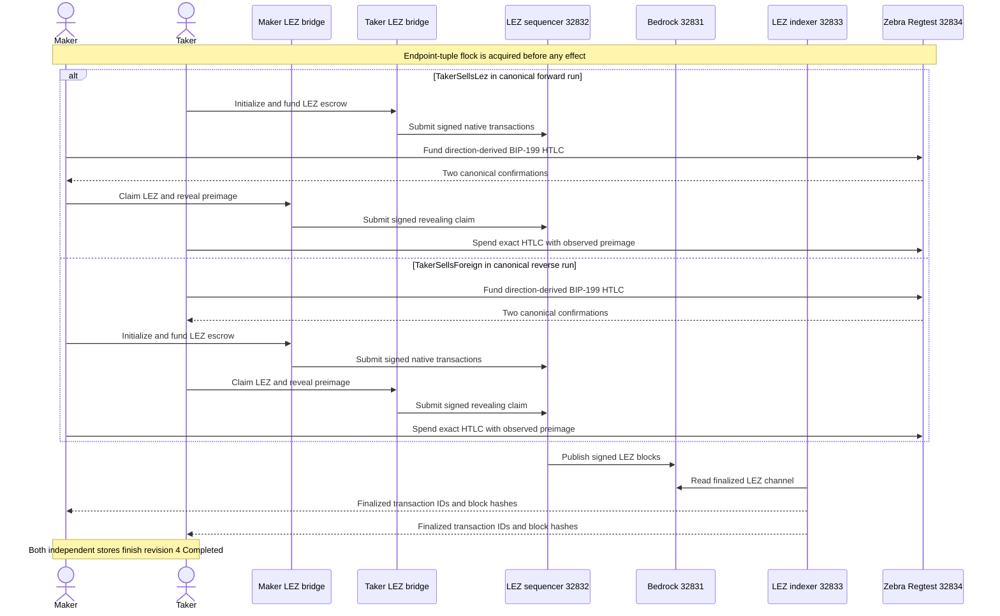

The direction changes actor ownership, not the atomic reveal order. In both
canonical runs the Zcash funding is confirmed before the LEZ claim reveals the preimage,
and the exact Zcash follow-up spend occurs only after that reveal. The retained
host ports above are evidence addresses from these isolated runs, not reusable
service discovery values; every new run must receive an explicit fresh local
tuple.

## LEZ escrow custody components and actor flows

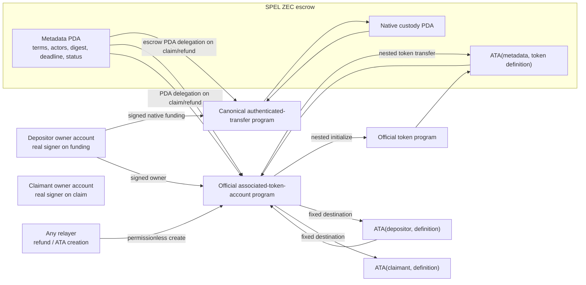

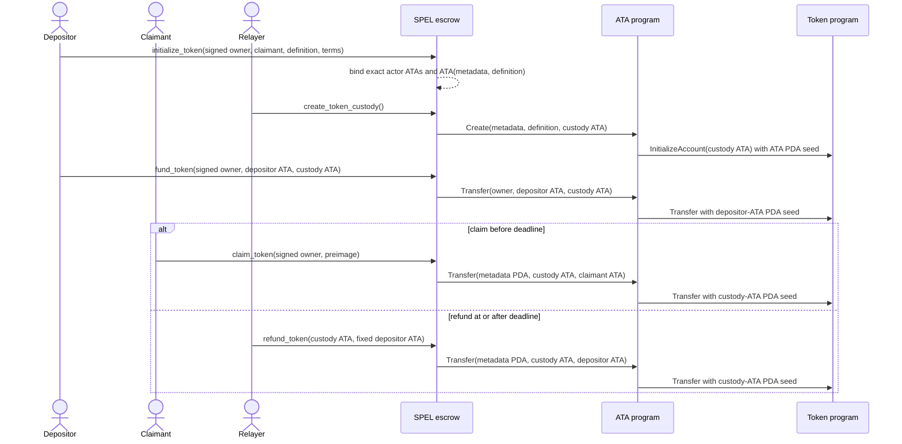

## Deployable guest and standalone block flow

```mermaid
flowchart LR
    Source["SPEL escrow source"] --> Guest["Risc0 3.0.5 guest wrapper"]
    Builder["Pinned guest-builder image digest"] --> ELF["Checked ELF<br/>SHA-256 + ImageID"]
    Guest --> Builder
    Manifest["Tracked artifact manifest"] --> Preflight["Verify exact manifest bytes<br/>ELF SHA-256 + ImageID"]
    ELF --> Preflight
    Preflight --> Process["External lez-standalone-node"]
    Process --> Home["Fresh mode-0700 node home"]
    R0VM["Exact r0vm 3.0.5"] --> Clock["Mandatory clock execution"]
    Process --> Clock
    Clock --> ReadyBlock["Persisted readiness block"]
    ELF --> RPC["sendTransaction ProgramDeployment"]
    Process --> RPC
    RPC --> Mempool["Standalone mempool"]
    ReadyBlock --> Mempool
    Mempool --> Validate["Block-time deployment validation"]
    R0VM --> Validate
    Validate --> Block["Canonical persisted block"]
    Block --> Query["Exact getTransaction + containing getBlock"]
    Query --> DeploymentCheck["Verify deployment variant, hash,<br/>block identity and ELF-derived ProgramId"]
    Process --> BuiltIn["getProgramIds static built-ins<br/>bind authenticated_transfer only"]
    Actors --> ActorCheck["getAccount ownership + balance checks"]
    BuiltIn --> ActorCheck
    DeploymentCheck --> Readiness["No-clobber mode-0600 schema-v2 readiness<br/>endpoint + tx/block/program + built-in + keys"]
    ActorCheck --> Readiness
    Readiness -.-> ActorRunner["Reference actor runner"]
    Actors["Funded depositor + claimant keys"] --> NativeLifecycle["Signed native initialise / fund / claim"]
    Relayer["Permissionless refund relayer"] --> NativeLifecycle
    NativeLifecycle --> RPC
    Block --> NativeState["Metadata status + exact custody/actor balances"]
    NativeState --> CostReplay["Deterministic production-state replay<br/>Clock excluded"]
    CostReplay --> CostEvidence["12 attributed Risc0 sessions<br/>cycle invariants + budgets + JSON"]
    TokenActors["Two definitions + owner keys + actor ATAs"] --> TokenLifecycle["Initialize / custody / fund / claim / refund"]
    TokenLifecycle --> RPC
    Block --> TokenState["Definition-bound holdings + exact supply conservation"]
    TokenState --> TokenCostReplay["Deterministic token replay<br/>Clock/setup excluded"]
    TokenCostReplay --> TokenCostEvidence["Escrow + ATA + Token sessions<br/>invariants + budgets + JSON"]
    V02Pins["LEZ v0.2.0 + exact SPEL PR head"] --> V02Guest["Risc0 v0.2 escrow guest"]
    V02Builder["Pinned Docker guest-builder<br/>Rust 1.94.1 + immutable digest"] --> V02Artifact["Canonical v0.2 ELF c85055...9d2e<br/>ImageID and ProgramId 5cf8c5...29c1"]
    V02Guest --> V02Builder
    V02Artifact --> V02Local["Recursive native + two-definition token<br/>claim/refund + rollback tests"]
    V02Artifact --> V02LocalDeployer["Checked local ProgramDeployment<br/>tx bd1680...733f"]
    V02LocalDeployer --> V02DeployProof["Indexer Finalized proof<br/>block 2582"]
    V02DeployProof --> V02FullLocal
    V02Artifact --> V02Deployer["Exact-once fixed-URL<br/>official-RPC deployer"]
    V02Artifact --> V02Sidecar["Official-wire prepare + one-attempt Claim GREEN<br/>actual-node effects GREEN"]
    V02Sidecar --> V02FullLocal["Bedrock + indexer + non-standalone sequencer<br/>both independent actor corridors GREEN"]
    V02Deployer -.-> Testnet["Official v0.2 testnet<br/>deployment + cost evidence"]

    classDef planned stroke-dasharray: 5 5,fill:#fff7e6,stroke:#9a6700;
    classDef running fill:#e6ffec,stroke:#1a7f37;
    class Testnet,ActorRunner planned;
    class V02FullLocal running;
```

The deployment proof uses port `0`, a fresh mode-0700 sequencer home,
deterministic genesis inputs, an exact `r0vm` path, and no shared Docker project
or chain state. The external process rejects the guest before home creation if
its bytes or manifest differ from the embedded tracked identity, and refuses to
reuse another activity's home or readiness path. Deployment admission alone is
deliberately insufficient: the readiness block proves the mandatory
clock/executor/store loop first, transaction lookup proves the deployment
reached the block store rather than only the mempool. The helper locates the
exact transaction in a post-submit block and retains its hash plus containing
block ID/hash. `getProgramIds` binds only the static authenticated-transfer
built-in used as actor owner; official account RPC then revalidates both
deterministic actors before a private schema-v2 mode-0600 handoff is published.
The solid native lifecycle uses the actual funded genesis roles,
validates signer-bound claim and permissionless-refund boundaries against
canonical block time, and asserts exact balances. The solid token lifecycle
uses two definitions, owner-signed ATA funding/claim, permissionless custody and
refund, and cross-definition substitution negatives. Token replay attributes
the escrow/ATA/nested-Token recursion while excluding setup and Clock noise.
The solid v0.2 branch builds an independently locked guest/generated client
through the pinned Risc0 Docker builder, binds ELF SHA-256
`c85055f6...9d2e` and ImageID and ProgramId `5cf8c5a4...29c1`, and runs
recursive native plus two-definition token claim/refund tests. Historical
`40c9d37c...8021` and `f8385049...0fbe` identities remain only with the
immutable pre-canonical evidence that produced them. A child-transfer overflow regression proves the metadata and every
touched account roll back together. The v0.2 deployer validates immutable
endpoint/channel/built-ins/artifact identity, submits once, and accepts only the
exact transaction in its containing block; ambiguity or timeout is never
retried. The solid v0.2 sidecar node represents tested describe/health/decoder,
native initialize/fund preparation, deterministic maker/taker Vault Claim
preparation, hardened durable exact-byte restart, and the role-bound
attempt-before-call Vault Claim submission state machine. The full-local edge
is solid because the canonical forward and reverse runs crossed the official
sidecar, three-service LEZ stack, independent actor state, and Zebra in both
happy directions after the exact deployment was finalized. Actual-node restart, refund, reorg, and fault recovery remain open.
The dashed public-testnet edge and deployed-runtime costs are deferred to production
readiness under ADR 0023. The v0.1.2 cost replay executes the same guest instructions through
LEZ production state transitions, counts the escrow root and
authenticated-transfer child, and compares generated JSON with the checked
evidence artifact.

## Zcash competing-fork consensus flow

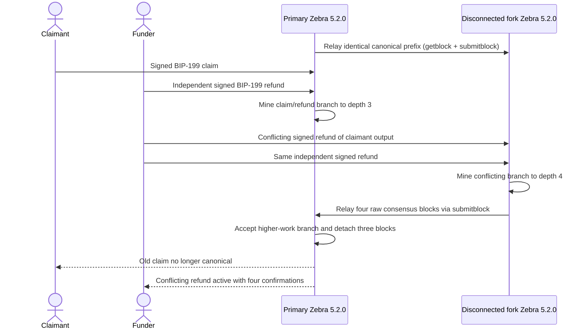

Both nodes use separate ephemeral loopback RPC ports, immutable tmpfs state,
non-root read-only images, and one uniquely named Compose project. This flow
proves Zebra consensus validation and best-chain replacement with actual actor
keys. It deliberately does not claim cross-chain refund-margin proof: that
requires typed ZEC observation commitments, checked LEZ millisecond/core-second
conversion, a named profile, and a composed standalone-LEZ plus Zebra run.

## Zcash profile and deadline flow

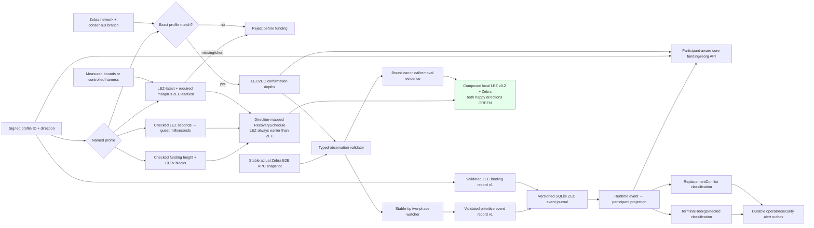

The solid profile, validator, stable-tip watcher, and actual Zebra E2E snapshot
paths are implemented. The validator
re-decodes canonical bytes and checks the complete network, branch, block,
outpoint, value, exact script, and derived-depth binding before producing a
lossy coordinator proof. Public-testnet values are acceptance targets, not
mainnet recommendations or proof of worst-case cadence. Durable production
participant-aware core semantics are implemented for taker- and maker-funded
legs: removal pins the exact ID, suspends claims, exact reappearance restores
authority, conflicting replacement fails, and refunds remain available.
Independent leg policies also make maker-depth regression suspend and depth
recovery restore claims. The runtime event-to-participant path is now solid: the
isolated two-Zebra fixture drives real canonical and removal evidence through schema-v14 SQLite
close/reopen and exact replay. The composed local LEZ/ZEC happy-path corridor is solid for both directions in
the canonical forward and reverse certification runs. Its actual-node
restart/refund/reorg and recovery paths remain open. RPC errors or absence never imply removal: a detach event
requires a stable replacement tip and a changed canonical hash at the prior
inclusion height.

The runtime path passes direction-derived canonical/removal projection, atomic
commit, restart reload, exact unknown-outcome replay in both ZEC directions,
authenticated operator alert operations, and actual-node close/reopen/requery.
Restart revalidates primitive records and immutable binding terms,
rejects impossible sequence history, restores the exact historical tracker head,
and still requires a fresh stable Zebra reconciliation before effects.
Completed/refunded removal or replacement is now journaled without erasing the
lifecycle result and is classified as `TerminalReorgDetected`; its critical
alert now commits atomically and survives replay/restart.
Authenticated maker status/list/ack RPC and CLI flows surface that durable alert;
acknowledgment clears attention metadata without changing the protocol phase.
Post-dependent replacement now commits chain truth atomically, retains the
protocol-committed transaction ID in the participant-specific reorg phase, and
returns `ReplacementConflict`; pre-dependent replacement and same-transaction
re-mining remain normal applied outcomes.
The SDK binding record now revalidates primitive profile and BIP-199 terms,
including both derived scripts. Schema v4 persists it atomically with the swap
and rejects immutable rebinding. Runtime requires it before tracker restoration,
replay detection, or projection; both coordinator leg policies and every event
side must match the named profile and expected-output envelope.
The separate concrete agreement record now additionally binds both actor
signatures, exact LEZ chain/custody terms, Zcash transaction policy, refund
calibration, and the authenticated transcript. It remains pre-integration
evidence until activation and resume persist and revalidate that exact record.

## Pair-specific protocol flows and atomicity boundaries

The three pairs share a role rule but not one generic claim or refund order.
The taker always submits the first lock. The maker may submit the second lock
only after the exact taker-funded leg reaches its signed canonical-confirmation
policy. The accepted agreement, recovery material, and construction-specific
claim authority are durable before either lock. From the first submitted lock,
the signed protocol must no longer depend on Delivery or Chat: each role must be
able to continue from its private store and independently configured chain
RPCs. A first-lock-only refund is safe only after a signed last-safe cutoff for
the maker second lock, a fresh canonical absence and first-lock-unspent recheck,
and admission/race enforcement that prevents a late second lock from crossing
the refund decision. A local timer or an assumption that the maker disappeared
is insufficient. The BTC actor now implements and actual-node proves the
refund-side cutoff branch and the post-reveal follower-survivor branch in both
directions. Run `m3schema4-20260717d` additionally proves the live happy-path
Maker-lock admission side: the actor rechecks the exact first lock and a
strictly pre-cutoff current clock immediately before its role-local one-send
CAS. The separate cutoff and admission proofs establish the fail-closed
boundary, but genuinely concurrent cutoff/refund/late-admission chaos remains
an open hardening item. The public ZEC SDK survivor branches shown below
remain unimplemented or unproved; the XMR flow remains an M4 target.

This is not a distributed transaction and there is no cross-chain atomic commit.
Atomicity is a protocol property conditional on canonical chain validation,
sound cryptography, durable local recovery state, and the signed confirmation
and recovery profile. The diagrams below are normative protocol sequences with
explicit implementation-status annotations for each supported direction.

All diagrams use the same terminality rule. `Completed` requires canonical
claim evidence for every funded leg. `Refunded` requires canonical recovery
evidence for every funded leg, or for the sole taker leg when the maker never
funded. One finalized claim or refund while the opposite funded leg remains
claimable stays in the applicable nonterminal phase, such as
`ClaimEvidenceAvailable`, `MakerLegRefunded`, `TakerLegRefunded`, or the XMR
target `MakerRecoveryAvailable`; `Recovering` is only an informal category, not
an implemented protocol phase. An abandoned key owner can leave its output
unspent indefinitely; that is a liveness failure, not permission to give
the survivor the other role private key or to report a false atomic outcome.

The current local runs do not prove node diversity. Both roles may use separate
credentials and sidecars against the same run-owned Core, Zebra, or LEZ
services. In particular, LEZ v0.2 finalized account state is supplied by the
pinned sequencer/indexer boundary: `getAccountAtBlock` has no account proof,
atomic multi-account snapshot token, or transaction-index state. Stable-tip
bracketing, exact block identity and ancestry, transaction-byte validation, and
historical account binding compensate for that limitation but do not turn the
authoritative indexer into proof-bearing consensus verification. The native
refund sidecar also enforces the containing-block deadline internally because
the current response does not expose that timestamp for independent actor
revalidation. These are explicit production trust assumptions, not hidden
atomicity guarantees.

### LEZ and Bitcoin

`TakerSellsForeign` means that the taker funds Bitcoin first and the maker funds
LEZ second. The taker then claims the maker-funded LEZ leg; the finalized
witnessed claim exposes the adaptor material needed for the maker's Bitcoin
key-path claim. If nobody reveals, the maker-funded LEZ leg becomes refundable
first and the taker-funded Bitcoin CSV branch becomes refundable later.

<!-- atomic-sequence: lez-btc/taker-sells-foreign -->

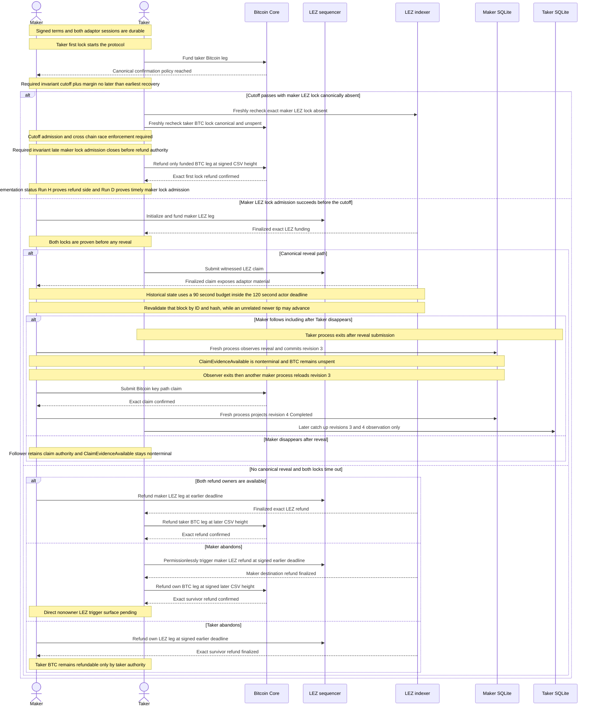

`TakerSellsLez` maps the same role rule to the opposite chains: the taker funds
LEZ first and the maker funds Bitcoin second. The taker's canonical Bitcoin
key-path signature exposes the adaptor material for the maker's witnessed LEZ
claim. On timeout, the maker-funded Bitcoin CSV branch is earlier and the
taker-funded LEZ refund is later.

<!-- atomic-sequence: lez-btc/taker-sells-lez -->

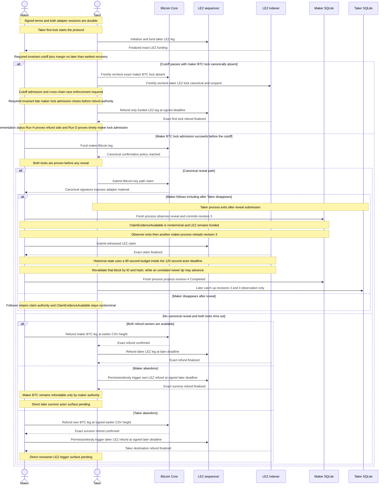

<!-- atomicity-argument: lez-btc/taker-sells-foreign -->

For `TakerSellsForeign`, the canonical witnessed LEZ claim discloses the
adaptor completion material for the Bitcoin claim by the maker. Without that
reveal, the maker-funded LEZ refund becomes available before the later
taker-funded Bitcoin refund.

**Economic safety:** under the stated cryptographic, canonicality, and timelock
assumptions, the taker either refunds its sole first lock, or can receive LEZ
only by exposing the material that lets the maker claim Bitcoin. A one-leg
post-reveal state is nonterminal.

**Replay/idempotency:** persist-before-send journals and exact finalized
projection prevent duplicate effects and false terminal status. They do not
create cross-chain atomicity.

**Conditional liveness:** inclusion, usable nodes, fee policy, and retained
role keys are required for progress. Permanent follower abandonment may leave
the Bitcoin leg safely claimable but unspent.

**Implementation status:** happy claims, ordered two-lock refunds, the
absent-maker refund-side branch, and direct post-reveal maker continuation are
actual-node GREEN. Run `m3schema4-20260717d` at tested pushed commit
`0e7635f` additionally proves this direction's external Taker Bitcoin first
lock followed by the live Maker actor's exact LEZ initialization and funding.
Both LEZ steps were role-locally reserved before official RPC, finalized inside
the exact actor window, and never re-armed after restart. Both actors reached
revision 4 `Completed`; replay added zero submissions. This is a
private-local happy-path checkpoint, not a public deployment or production
readiness claim.

<!-- atomicity-argument: lez-btc/taker-sells-lez -->

For `TakerSellsLez`, the canonical Bitcoin key-path claim discloses the
adaptor completion material for the witnessed LEZ claim by the maker. Without
that reveal, the maker-funded Bitcoin refund becomes available before the later
taker-funded LEZ refund.

**Economic safety:** under the stated assumptions, the taker either refunds
its sole LEZ first lock, or its Bitcoin claim exposes the material that lets
the maker claim the witnessed LEZ leg. A one-leg post-reveal state is
nonterminal.

**Replay/idempotency:** exact-byte journals, one-attempt authority, and
finalized-only projection prevent duplicate effects and false completion. They
are operational safeguards rather than the economic atomicity mechanism.

**Conditional liveness:** progress still needs canonical inclusion, available
RPCs, calibrated fees, and retained role authority. A disappeared follower can
leave the remaining LEZ leg safely claimable but not terminal.

**Implementation status:** happy claims, ordered two-lock refunds, the
absent-maker refund-side branch, and direct post-reveal maker continuation are
actual-node GREEN. Run `m3schema4-20260717d` at tested pushed commit
`0e7635f` additionally proves this direction's external Taker LEZ first lock
followed by the live Maker actor's one exact Bitcoin funding send. Nine
payload-free `moving_tip` observations granted no authority; the tenth stable
joined current, exact-byte, and finalized proof allowed one role-local CAS and
send. Both actors reached revision 4 `Completed`; restart and replay added
zero submissions. This is a private-local happy-path checkpoint, not a public
deployment or production readiness claim.

The BTC construction is atomic under these explicit conditions:

- Taker-first funding and the canonical confirmation gate prevent the maker
  from placing its own second-lock value at risk before the first lock is real.
  First-lock-only recovery additionally requires the signed maker-lock cutoff,
  fresh canonical absence and unspent observations, and race-safe late-lock
  admission. Run `m3firstlock-20260716h` proves the refund-side actor gate in
  both actual-node directions; `3d202f7` rejects late canonical inclusion and
  quarantines late presence. Run `m3schema4-20260717d` proves the complementary
  live admission path in both directions: exact-idempotent LEZ initialization
  and funding or exact unspent Bitcoin funding, each behind a fresh first-lock
  and strict pre-cutoff check. Genuinely overlapping cutoff/refund/admission
  chaos remains pending and therefore is not inferred from the two separate
  actual-node proofs.
- Both domain-separated aggregate adaptor presignatures and the Bitcoin CSV
  refund commitment are verified and persisted before funding. Neither actor
  has a standalone claim key that bypasses the two-party transcript.
- The actor will not reveal at revision two until both agreement-bound locks
  are canonically observed. A finalized LEZ signature or canonical Bitcoin
  key-path signature reveals the same committed adaptor scalar, allowing the
  other claimant to complete the opposite presignature without the peer.
- The recovery schedule enforces
  `maker_second_lock_cutoff + required_margin <= earlier_refund_latest` and
  `later_refund_earliest >= earlier_refund_latest + required_margin`. It maps
  the maker-funded leg to the earlier recovery and the taker-funded leg to the
  later recovery without comparing raw LEZ timestamps to Bitcoin heights.
- Agreements, signer journals, complete public transaction bytes, one-attempt
  effect authority, and lifecycle revisions are durable before dependent I/O.
  Projection requires exact confirmed Bitcoin bytes or bounded finalized LEZ
  ancestry; accepted submission alone is not completion.
- After both locks, the protocol construction lets a surviving role recover its
  own funded leg at its signed deadline. A LEZ refund is permissionless but pays
  only the immutable depositor; Bitcoin refund remains restricted to its funder
  key. The current actor proves the maker follower continuing from canonical
  reveal after the taker disappears, including a fresh-process restart between
  revision three and the follow-up. It does not yet prove every direct nonowner
  refund trigger or every outage/process-kill variant.

This safety argument does not make the two nodes one transaction manager. A
deep reorg can invalidate evidence that was treated as canonical; fee pressure
can delay a Bitcoin claim or refund; and a crash after an ambiguous send trades
liveness for at-most-once safety. Happy claims are actual-node GREEN in both
directions. Run `m3refund-20260716h` is also actual-node GREEN for the
both-owner, two-lock ordered refund in both directions: both roles reached
revision four `Refunded` and replay added zero submissions. Signed-cutoff and
first-lock-only refund-side recovery are actual-node GREEN in run
`m3firstlock-20260716h`. Post-reveal survivor continuation is clean
pushed-commit GREEN in `m3survivor-20260716c`; nonowner refund surfaces,
concurrent cutoff/refund/admission chaos, process-kill, fee-bump, and reorg
evidence remain pending. The schema-4 happy-path Maker-lock admission itself is
actual-node GREEN in `m3schema4-20260717d`.

This is an engineering safety argument, not the accepted proposal's promised
formal theorem. [ADR 0050](0050-map-btc-adaptor-construction-to-security-properties.md)
now maps the implemented `pSign`, `pVrfy`, `Adapt`, and `Ext` boundaries to
Aumayr et al.'s aEUF-CMA, pre-signature-adaptability, and
witness-extractability properties and the Fournier one-time-VES recoverability
model.
It also records why neither single-signer analysis is automatically a proof of
the exact two-party MuSig2, Taproot, and witnessed-LEZ composition. M7 retains
the independent cryptographic-review and formal-claim decision.
The BTC pair-specific F7 boundary preserves the same witness relation while
the countersigned asset extension additionally binds the exact token program,
definition, depositor/claimant/custody ATAs, amount, and aggregate authority;
native evidence cannot be relabeled as custom-token evidence.
Also, “LEZ leg” in the actual-node BTC flows currently means the proved
witnessed native path. The shared guest ATA/custom-token transition, separately
countersigned asset extension, strict v2 protocol/classifiers, eleven-call
exact-once client, agreement/local-policy adapter, official durable token
planner, authenticated sidecar routes, and fork-safe finalized scans are GREEN
component boundaries. Durable journal/actor composition and both-direction
custom-token node effects remain open and are not implied by the native
actual-node diagrams.

### LEZ and transparent Zcash

Both ZEC product directions preserve one chain-relative reveal order: the LEZ
recipient claims LEZ first and publishes the SHA-256 preimage; the ZEC recipient
then spends the exact BIP-199 output with that preimage. In
`TakerSellsForeign`, the taker funds ZEC first, the maker funds LEZ second, the
taker reveals on LEZ, and the maker follows on ZEC.

<!-- atomic-sequence: lez-zec-transparent/taker-sells-foreign -->

```mermaid
sequenceDiagram
    actor Maker
    actor Taker
    participant Zebra as Zebra
    participant LezSeq as LEZ sequencer
    participant LezIdx as LEZ indexer

    Note over Maker,Taker: One signed digest binds both locks
    Note over Maker,Taker: Taker first lock starts the protocol
    Taker->>Zebra: Fund taker BIP-199 ZEC leg
    Zebra-->>Maker: Canonical confirmation policy reached
    Note over Maker,Taker: Required invariant cutoff plus margin no later than earliest recovery
    alt Cutoff passes with maker LEZ lock canonically absent
        Taker->>LezIdx: Freshly recheck exact maker LEZ lock absent
        Taker->>Zebra: Freshly recheck taker ZEC lock canonical and unspent
        Note over Maker,Taker: Cutoff admission and cross chain race enforcement required
        Note over Maker,Taker: Required invariant late maker lock admission closes before refund authority
        Taker->>Zebra: Refund only funded ZEC leg at signed CLTV height
        Zebra-->>Taker: Exact first lock refund confirmed
        Note over Maker,Taker: Implementation status ZEC cutoff and first lock actor evidence pending
    else Required target maker LEZ lock admission succeeds before the cutoff
        Maker->>LezSeq: Initialize and fund maker LEZ leg
        LezIdx-->>Taker: Finalized exact LEZ funding
        Note over Maker,Taker: Both locks are proven before preimage release
        alt Canonical reveal path
            Taker->>LezSeq: Claim LEZ and reveal preimage
            LezIdx-->>Maker: Finalized canonical preimage evidence
            alt Maker follows including after Taker disappears
                Note over Maker,Taker: Revealer may disappear and follower uses canonical chain disclosure
                Maker->>Zebra: Claim exact ZEC output with preimage
                Zebra-->>Maker: Exact ZEC claim confirmed
            else Maker disappears after reveal
                Note over Maker,Taker: Follower retains claim authority and ClaimEvidenceAvailable stays nonterminal
            end
        else No canonical reveal and both locks time out
            alt Both refund owners are available
                Maker->>LezSeq: Refund maker LEZ leg first
                LezIdx-->>Taker: Exact LEZ refund finalized
                Taker->>Zebra: Refund taker ZEC leg later
                Zebra-->>Taker: Exact ZEC refund confirmed
            else Maker abandons
                Taker->>LezSeq: Permissionlessly trigger maker LEZ refund at signed earlier deadline
                LezIdx-->>Taker: Maker destination refund finalized
                Taker->>Zebra: Refund own ZEC leg at signed later CLTV height
                Zebra-->>Taker: Exact survivor refund confirmed
                Note over Maker,Taker: Direct nonowner LEZ trigger surface pending
            else Taker abandons
                Maker->>LezSeq: Refund own LEZ leg at signed earlier deadline
                LezIdx-->>Maker: Exact survivor refund finalized
                Note over Maker,Taker: Taker ZEC remains refundable only by taker authority
            end
        end
    end
```

In `TakerSellsLez`, the taker funds LEZ first and the maker funds ZEC second.
The maker is now the LEZ recipient and therefore the revealing claimant; the
taker follows on ZEC. Direction changes ownership, never the LEZ-before-ZEC
claim or refund order.

<!-- atomic-sequence: lez-zec-transparent/taker-sells-lez -->

```mermaid
sequenceDiagram
    actor Maker
    actor Taker
    participant Zebra as Zebra
    participant LezSeq as LEZ sequencer
    participant LezIdx as LEZ indexer

    Note over Maker,Taker: One signed digest binds both locks
    Note over Maker,Taker: Taker first lock starts the protocol
    Taker->>LezSeq: Initialize and fund taker LEZ leg
    LezIdx-->>Maker: Finalized exact LEZ funding
    Note over Maker,Taker: Required invariant cutoff plus margin no later than earliest recovery
    alt Cutoff passes with maker ZEC lock canonically absent
        Taker->>Zebra: Freshly recheck exact maker ZEC lock absent
        Taker->>LezIdx: Freshly recheck taker LEZ lock canonical and unspent
        Note over Maker,Taker: Cutoff admission and cross chain race enforcement required
        Note over Maker,Taker: Required invariant late maker lock admission closes before refund authority
        Taker->>LezSeq: Refund only funded LEZ leg at signed deadline
        LezIdx-->>Taker: Exact first lock refund finalized
        Note over Maker,Taker: Implementation status ZEC cutoff and first lock actor evidence pending
    else Required target maker ZEC lock admission succeeds before the cutoff
        Maker->>Zebra: Fund maker BIP-199 ZEC leg
        Zebra-->>Taker: Canonical confirmation policy reached
        Note over Maker,Taker: Both locks are proven before preimage release
        alt Canonical reveal path
            Maker->>LezSeq: Claim LEZ and reveal preimage
            LezIdx-->>Taker: Finalized canonical preimage evidence
            alt Taker follows including after Maker disappears
                Note over Maker,Taker: Revealer may disappear and follower uses canonical chain disclosure
                Taker->>Zebra: Claim exact ZEC output with preimage
                Zebra-->>Taker: Exact ZEC claim confirmed
            else Taker disappears after reveal
                Note over Maker,Taker: Follower retains claim authority and ClaimEvidenceAvailable stays nonterminal
            end
        else No canonical reveal and both locks time out
            alt Both refund owners are available
                Taker->>LezSeq: Refund taker LEZ leg first
                LezIdx-->>Maker: Exact LEZ refund finalized
                Maker->>Zebra: Refund maker ZEC leg later
                Zebra-->>Maker: Exact ZEC refund confirmed
            else Maker abandons
                Taker->>LezSeq: Refund own LEZ leg at signed earlier deadline
                LezIdx-->>Taker: Exact survivor refund finalized
                Note over Maker,Taker: Maker ZEC remains refundable only by maker authority
            else Taker abandons
                Maker->>LezSeq: Permissionlessly trigger taker LEZ refund at signed earlier deadline
                LezIdx-->>Maker: Taker destination refund finalized
                Maker->>Zebra: Refund own ZEC leg at signed later CLTV height
                Zebra-->>Maker: Exact survivor refund confirmed
                Note over Maker,Taker: Direct nonowner LEZ trigger surface pending
            end
        end
    end
```

<!-- atomicity-argument: lez-zec-transparent/taker-sells-foreign -->

For `TakerSellsForeign`, the taker can receive LEZ only by publishing the
agreement-bound preimage, which lets the maker claim the exact ZEC output. If no
preimage is published, the maker-funded LEZ refund precedes the later
taker-funded ZEC refund.

**Economic safety:** an honest taker either recovers its sole ZEC first lock or
reveals the agreement preimage only after both locks, thereby enabling the
maker's exact ZEC claim. A half-completed reveal path is nonterminal.

**Replay/idempotency:** durable intents and canonical-only projection prevent
duplicate sends and false completion but are not the hashlock atomicity
mechanism.

**Conditional liveness:** the argument assumes usable nodes, inclusion, fees,
retained refund keys, and a sufficient cross-chain margin.

**Implementation status:** the normative direction and local happy path are
GREEN; the signed cutoff, first-lock actor path, and direct survivor E2E remain
unimplemented or unproved.

<!-- atomicity-argument: lez-zec-transparent/taker-sells-lez -->

For `TakerSellsLez`, the maker can receive LEZ only by publishing the same
agreement-bound preimage, which lets the taker claim the exact ZEC output. If no
preimage is published, the taker-funded LEZ refund precedes the later
maker-funded ZEC refund.

**Economic safety:** an honest taker either recovers its sole LEZ first lock or
uses the published preimage to claim the exact ZEC output after the maker
receives LEZ. A half-completed reveal path is nonterminal.

**Replay/idempotency:** durable intents and canonical-only projection prevent
duplicate sends and false completion but are not the hashlock atomicity
mechanism.

**Conditional liveness:** the argument assumes usable nodes, inclusion, fees,
retained refund keys, and a sufficient cross-chain margin.

**Implementation status:** the normative direction and local happy path are
GREEN; the signed cutoff, first-lock actor path, and direct survivor E2E remain
unimplemented or unproved.

The ZEC construction is atomic under these explicit conditions:

- The taker's direction-derived first lock must be canonical at the signed
  depth before the maker can build and submit the second lock. Both actors
  independently bind the exact LEZ accounts and expected BIP-199 output
  envelope, including network, branch, value, redeem script, P2SH output, fee,
  and expiry policy, to the dual-signed agreement. The agreement deliberately
  excludes the not-yet-created funding outpoint; canonical observation pins the
  exact resulting outpoint in lifecycle evidence before dependent effects.
- A first-lock-only refund is safe only after the signed maker-lock cutoff,
  fresh canonical absence and unspent observations, and race-safe late-lock
  admission. The public ZEC SDK does not yet drive or prove that
  `TakerLockConfirmed` branch.
- Both locks commit the same SHA-256 digest. The coordinator permits only the
  LEZ recipient to reveal first and permits the ZEC recipient to follow only
  after canonical LEZ claim evidence exposes the matching preimage.
- Refund ordering is chain-fixed in both directions: LEZ is earlier and Zcash
  is later. The signed profile must satisfy
  `zec_refund_earliest >= lez_refund_latest + required_margin`, including
  confirmation latency, reorg distance, congestion, clock drift, and reaction
  time. Typed LEZ time and Zcash height are never directly compared.
- Accepted terms, lock intents, protected preimage and claim bytes, exact
  refund intents, observations, and lifecycle revisions persist in role-local
  SQLite before the next dependent effect. Exact Zebra canonical evidence and
  bounded finalized LEZ evidence, not peer messages or mempool presence, drive
  projection.
- Once both locks exist, the protocol construction lets a surviving role recover
  its own funded leg at the signed chain deadline. Permissionless LEZ execution
  still pays only the immutable depositor; ZEC refund remains restricted to its
  funding key. Current SDK evidence covers the both-owner ordered path, not the
  direct nonowner LEZ trigger or every absent-peer survivor path.

This is still not a distributed transaction. Atomicity depends on the hash
preimage remaining secret until both locks, on conservative margin calibration,
and on both nodes' canonicality assumptions. Deep reorgs, post-lock node
outages, expired unmined Zcash transactions, and fee or inclusion delays can
reduce liveness or require an exact safe replacement. Both actual local happy
directions are GREEN. Composed actual-node refund, restart, reorg, concurrent,
and chaos journeys remain open and must not be inferred from component refund
or two-Zebra fork tests.

### LEZ and Monero

Only `TakerSellsLez` is in the current M4 protocol scope: the Taker first locks native LEZ and the Maker then funds the jointly controlled Monero output. The successful claim branch has one actual local working-tree checkpoint. A reverse direction is not claimed.

XMR-first is rejected by signed-term validation and the operator boundary because the reviewed construction requires the scriptable LEZ lock and its recovery schedule to precede Monero funding; role symmetry alone is not evidence of a safe reverse protocol.

#### M5 application activation boundary

The application store now separates offer reservation from executable
authority. Schema-v20 Stage A reserves one authenticated offer and creates no
coordinator or actor. Schema-v21 Stage B is the only boundary that can derive
the coordinator and atomically register a Monero Maker actor.

```mermaid
flowchart TB
    Delivery["Authenticated Delivery offer"] --> StageA["Canonical dual-signed Stage A"]
    StageA --> Reserve["SQLite reserve transaction"]
    Reserve --> Reserved[("Reserved offer and non-executable Stage A")]
    Reserved --> StageB["Canonical countersigned Stage B"]
    StageB --> Derive["XMR SDK derives coordinator and policies"]
    Derive --> Activate["SQLite activation transaction"]
    Activate --> Swap[("Monero coordinator")]
    Activate --> Consumed[("Consumed offer")]
    Activate --> PairActor[("Immutable Monero Maker actor")]
    Activate --> Replay[("Exact replay record")]
    PairActor --> Supervisor["Maker-node supervisor"]
    Supervisor --> SealedConfig["Schema-v2 config on sealed FD 196"]
    SealedConfig --> RoleActor["xmr-maker-actor pre-effect validation"]
    RoleActor -->|"typed blocked status"| Supervisor
    RoleActor -.->|"zero requests"| LezRpc["LEZ v0.2 sequencer and indexer RPCs"]
    RoleActor -.->|"zero requests"| MoneroRpc["monerod and wallet RPCs"]
```

Stage-B acceptance is bounded by the signed Maker funding cutoff, not by the
expired public listing after Stage A has already won the reservation. One local
transaction inserts the coordinator and actor, activates the negotiation,
consumes the offer, and records replay; any failed write restores the
Stage-A-only state. Exact replay revalidates the signed Stage A, offer route and
quote, activation, coordinator, actor, and mutation rows.

The store component uses no chain RPC or node. The real Chat process checkpoint remains GREEN and includes the Maker CLI, daemon, Taker CLI, signed Delivery, separate Unix sockets, independent role roots and journals, Delivery removal, and daemon reopen. The later semantic supervisor checkpoint is also GREEN: the normal scheduler launches `xmr-maker-actor` with schema-v2 authority on fully sealed descriptor 196, the child validates Stage A/B and an immutable Maker-journal snapshot, and the supervisor persists one typed blocked observation. Both checkpoints emit zero public effects; actual LEZ and Monero RPC composition remains open.

```mermaid
flowchart LR
    MakerOperator["Maker operator"] --> MakerCli["lez-maker CLI"]
    MakerCli -->|"fixed start or stop"| Systemctl["/usr/bin/systemctl"]
    Systemctl --> Systemd["system systemd manager"]
    Systemd --> Daemon["lez-maker-daemon"]
    MakerCli -->|"owner Unix RPC"| Daemon
    MakerKey[("Maker agreement public key")] --> Daemon
    ViewKey[("Shared private view key")] --> Daemon
    Registry[("Maker-only actor registry")] --> Daemon
    Daemon --> Delivery["Signed run-local Delivery"]
    Delivery --> TakerCli["lez-taker CLI"]
    TakerRoot[("Taker private role root")] --> TakerCli
    TakerJournal[("Taker role journal")] --> TakerCli
    PublicPackets["Maker and Taker public packets"] --> TakerCli
    TakerCli -->|"Stage A and Stage B over Chat Unix RPC"| Daemon
    Daemon --> Store[("SQLite schema v22")]
    TakerCli --> TakerBundle[("Taker-only no-clobber actor bundle")]
    TakerCli --> Receipt[("Taker acceptance receipt")]
    Store --> MakerActor["Queued Maker-only Monero actor"]
    MakerActor --> Scheduler["Fenced Maker scheduler"]
    Scheduler --> Supervisor["XMR process supervisor"]
    Authority["Schema-v2 Maker authority"] --> Supervisor
    Supervisor --> Sealed["Fully sealed config FD 196"]
    Sealed --> SemanticActor["xmr-maker-actor semantic pre-effect"]
    SemanticActor -->|"blocked, zero effect"| Supervisor
    SemanticActor -.->|"zero requests"| LezRpc["LEZ v0.2 sequencer and indexer"]
    SemanticActor -.->|"zero requests"| MoneroRpc["Official monerod and wallet RPCs"]
```

```mermaid
sequenceDiagram
    participant T as Taker CLI
    participant D as Maker daemon
    participant DB as SQLite
    participant F as Taker filesystem
    participant S as Maker scheduler
    participant P as XMR supervisor
    participant A as xmr-maker-actor

    T->>D: Authenticated Stage A for reservation
    D->>DB: Begin immediate reserve transaction
    DB-->>D: Revision 2 and no executable authority
    D-->>T: Durable Stage-A response
    T->>F: Publish Taker-only bundle without replacement
    T->>D: Canonical Stage B
    D->>DB: Begin immediate activation transaction
    DB->>DB: Activate negotiation
    DB->>DB: Create coordinator and one Maker actor
    DB->>DB: Consume offer and record exact replay
    DB-->>D: Commit revision 3
    D-->>T: Durable activation response
    S->>P: Run exact program and pre-effect ABI
    P->>P: Validate swap, state path, and schema-v2 manifest
    P->>A: Pass fully sealed config on FD 196
    A->>A: Validate Stage A/B and immutable journal snapshot
    A-->>P: Typed blocked status with zero chain effects
    P->>DB: Persist one progress observation and remain queued
    T->>F: Publish receipt after Maker commit
    T->>D: Replay after Delivery removal and restart
    D->>DB: Revalidate original rows
    D-->>T: Original result without replacement
```

The atomicity claim is deliberately local. Stage A cannot create a coordinator, actor, or effect. Stage B performs every executable application transition in one SQLite transaction, so any failed member restores the Stage-A-only state. The Taker bundle is a pre-activation crash latch and the receipt is post-commit evidence. After commit, canonical-manifest preflight, complete memfd seals, child role/digest/transcript validation, and immutable journal-snapshot validation each fail closed before any chain effect. A successful pre-effect run also makes zero chain requests and truthfully remains queued. No cross-chain transaction or chain safety is inferred; actual isolated Monero plus LEZ effects remain the next corridor gate.

#### M5 schema-v3 receipt-v2 process invocation boundary

The schema-v2 scheduled actor above remains the honest zero-effect application
cutoff. Separately, schema-v3 receipt/effect authority now has a node-free
role-fixed receipt-v2 process-invocation boundary. The loader retains the immutable
effect-authority digest and exact initialized workflow identity. Only seven
sending slots are admitted: Maker Monero fund, tag 15, Monero refund sweep,
and tag 17; and Taker tag 14, Monero claim sweep, and tag 16. ADR 0154 makes
Tag16 the first real semantic sender on this boundary and ADR 0162 adds the
semantic Tag17 sender; the other slots remain at their previous implementation
levels.

```mermaid
flowchart TB
    Receipt["Receipt v2"] --> Claim["lez-taker claim"]
    Claim --> Loader["Schema v3 execution loader"]
    Loader --> Selector["Role and workflow selector"]
    Selector --> Pin["Hash pin role-specific inputs and dual locks"]
    Pin --> Share["Add sealed FD 218 only for share-consuming senders"]
    Pin --> Authorize["Workflow v2 or v3 durable CAS"]
    Authorize -->|Prepared schema 1| Invoke["InvokeOnce"]
    Invoke --> Tag14["Legacy Tag14 sender marker"]
    ReleaseAuthority["Schema 2 Taker release authority"] --> ReleasePreflight["Tag14 release preflight with FDs 220 to 223"]
    ReleasePrepare["Exclusive Tag14 release preparer"] --> ReleaseJournal[("Encrypted release journal")]
    ReleaseJournal --> ReleasePreflight
    ReleasePreflight -->|"ready with zero network and no CAS"| Authorize
    Authorize -->|"Prepared schema 2 to Started CAS"| ReleaseWorker
    ReleaseJournal --> ReleaseWorker["No-argument release worker with sealed FDs 220 to 222 and directory FD 223"]
    ReleaseAuthority --> ReleaseWorker
    ReleaseWorker --> ReleaseSidecar["Authenticated release-only sidecar"]
    ReleaseSidecar -.-> Node
    Invoke --> Tag16["Real Tag16 sender"]
    Share --> Tag16
    MakerAuthority["Schema 3 Maker Tag17 authority"] --> Tag17Preflight["Prepare-only semantic Tag17 worker"]
    Pin --> Tag17Preflight
    Tag17Preflight --> Authorize
    Authorize -->|"Prepared schema 3 to Started CAS"| Tag17Worker["One-attempt semantic Tag17 worker"]
    Tag17Worker --> Sidecar
    Tag17Worker --> Started
    Share -.-> Excluded["FD 218 rejected by Tag17 worker"]
    Excluded -.-> Tag17Worker
    Journal[("Live Taker adaptor journal")] --> Tag16
    Tag16 --> Sidecar["Authenticated local LEZ sidecar API"]
    Sidecar -.-> Node["Configured LEZ node"]
    Started["Started and invoked unreconciled"]
    Tag14 --> Started
    Tag16 --> Started
    Authorize -->|Started or Unknown| Observe["ObserveOnly"]
    Observe --> Observer["Role fixed finalized observer"]
    Observer --> Parser["Bounded exact Tag14 parser"]
    Parser --> Reconcile["Exact plan and evidence reconciliation"]
    Reconcile --> Succeeded["Succeeded and complete"]
    Authorize -->|Succeeded| Complete["Complete with no process"]
    ReleaseWorker --> Started
    Observer -.-> Rpc["Future semantic finalized Tag14 observer"]
```

Program, inputs, both locks, and the complete descriptor command are validated
before `authorize_once`, so a corrupt path, wrong role, or crossed lock cannot
burn Prepared. ADR 0152 extends that command with sealed Stage A/B, own/peer
packets, private-role manifest, and private view key on FDs 211 through 216;
no stale mutable-journal snapshot is passed. ADR 0153 adds a canonical
secret-free execution plan on sealed FD 217, binding mode, step, identities,
ABI, original sending-plan digest, journal, evidence root, and loopback RPC
origins. ADR 0154 supplies FD 218 only to Tag16 and the two Monero sweep
senders. The schema-v2 Tag14 parent instead derives exact public release terms
from validated Stage A/B and grants only sealed FDs 220 through 223; general
credentials, private application bytes, and FD 218 are absent. The schema-v3
Maker Tag17 worker receives the application material but rejects FD 218 before
parsing or RPC. It performs prepare-only preflight, then submits only the exact
prepared transaction after the parent consumes one-attempt authority. A read-only
worker preflight authenticates the journal and binding at zero network calls
before the parent repins and consumes the workflow CAS. The no-argument
Tag16 child reconstructs the exact Taker refund session, requires its live
durable presignature to equal Stage B, adapts it with the sealed Taker share,
verifies the result, and performs one authenticated prepare, complete, and
exact submission. The process suite proves this against a local sidecar double
and rejects journal drift before RPC. InvokeOnce alone starts the sender and leaves Started. On the
second claim, ObserveOnly starts only the role-fixed observer from Started or
Unknown, exact-compares the original sending-plan identity, parses bounded
step-exact output, locally derives the evidence source, and reconciles
Succeeded. Prepared and Succeeded cannot start the observer; observer failure
changes no journal state. The third claim reads Complete and starts no process.
The solid Tag16-to-sidecar and Tag17-to-sidecar routes plus the Tag14 worker
boundary are semantic local process evidence. The literal CLI covers rejected Tag14 preflight, retry,
invoke once, observe/reconcile, and Complete, while the real release worker
separately proves preflight, admission, and restart. Their single joined
actual-node replay, semantic finalized Tag14 observer, Monero sweeps, and
adverse crash/reorg/concurrency evidence remain open. ADRs 0154, 0157, and
0162 give the complete conditional-atomicity sequences and limits.

#### Actual local components and RPCs

```mermaid
flowchart TB
    Maker["Maker role process"]
    Taker["Taker role process"]
    MakerJournal[("Maker claim and refund journal")]
    TakerJournal[("Taker claim and refund journal")]
    Preparer["Exclusive tag 14 preparer"]
    ReleaseDb[("Sealed release SQLite")]
    Worker["Release-only worker"]
    MakerSidecar["Maker LEZ sidecar"]
    TakerSidecar["Taker LEZ sidecar"]
    Sequencer["LEZ v0.2 sequencer"]
    Indexer["LEZ v0.2 indexer"]
    Bedrock["LEZ v0.2 Bedrock"]
    Monerod["Official monerod 0.18.5.1 Regtest"]
    MakerWallet["Official Maker wallet RPC: fund source and claim miner"]
    SharedWallet["Neutral provisioner RPC: shared wallet only"]
    TakerWallet["Official Taker wallet RPC"]
    Binder["Taker cross-chain binder"]
    Binding[("Owner-private binding record")]

    Maker --> MakerJournal
    Taker --> TakerJournal
    Maker --> MakerSidecar
    Taker --> TakerSidecar
    MakerSidecar --> Sequencer
    TakerSidecar --> Sequencer
    Sequencer --> Bedrock
    MakerSidecar --> Indexer
    TakerSidecar --> Indexer
    MakerWallet --> Monerod
    SharedWallet --> Monerod
    TakerWallet --> Monerod
    Preparer --> TakerJournal
    Preparer --> TakerSidecar
    Preparer --> Indexer
    Preparer --> Monerod
    Preparer --> SharedWallet
    Preparer --> TakerWallet
    Preparer --> ReleaseDb
    Worker --> ReleaseDb
    Worker --> TakerSidecar
    Maker --> MakerWallet
    Taker --> TakerWallet
    Taker --> Binder
    TakerJournal --> Binder
    TakerSidecar -.->|"Finalized result file"| Binder
    TakerWallet -.->|"Receipt evidence file"| Binder
    Binder --> Binding
```

The retained run used dynamic literal-loopback RPCs. Its example ports were LEZ Bedrock 33145, sequencer 33146, indexer 33147, Maker sidecar 36967, Taker sidecar 58993, Monero daemon 39185, provisioner wallet 41189, Maker wallet 46769, and Taker wallet 58393. A later audit proved the historical runner made the provisioner fund, hosted the shared wallet on the Taker RPC, and swept to Maker. The corrected graph above is the required fresh topology: Maker funds and supplies the claim mining address, the neutral provisioner hosts the shared wallet, and Taker receives the claim sweep. These numbers document that run; fresh operators must source fresh manifests. No public RPC, P2P peer, faucet, public funds, Stagenet, or external finality service participated.

#### Successful claim sequence

<!-- atomic-sequence: lez-xmr/taker-sells-lez -->

```mermaid
sequenceDiagram
    participant T as Taker
    participant TS as Taker sidecar
    participant L as LEZ sequencer and indexer
    participant X as Official Monero daemon and wallets
    participant P as Exclusive release preparer
    participant W as Release-only worker
    participant M as Maker and Maker sidecar
    participant B as Taker cross-chain binder

    Note over T,M: Stage A and B bind terms, claim, refund, punishment, and role journals
    Note over T,M: Taker first lock starts the protocol
    Note over T,M: Required invariant cutoff plus margin no later than earliest recovery remains mandatory
    Note over T,M: Required invariant late maker lock admission closes before refund authority remains mandatory
    T->>TS: Submit exact InitializeNativeXmr
    TS->>L: Tag 13 Initialize
    L-->>T: Finalized at height 3953
    T->>TS: Submit exact FundNative
    TS->>L: Tag 13 Fund
    L-->>T: Finalized at height 3960
    M->>X: Maker wallet funds exact Stage A address hosted by neutral shared RPC
    X-->>P: Transaction at height 111 and 10 confirmations at tip 120
    Note over T,M: Both locks are proven before tag 14
    P->>P: Revalidate Stage A and B, Fund, topology, output, and Taker journal
    P->>W: Exclusively create Prepared release database
    W->>TS: Submit exact tag 14 authorization once
    L-->>M: Canonical finalized tag 14 at height 4107
    M->>M: Adapt the committed claim presignature
    M->>L: Publish exact tag 15 ClaimNativeXmr
    L-->>T: Canonical finalized tag 15 at height 4208 and custody zero
    Note over T,M: Revealer may disappear and follower uses canonical chain disclosure
    Note over T,M: Follower retains claim authority and ClaimEvidenceAvailable stays nonterminal
    T->>T: Extract Maker adaptor share from final signature
    T->>X: Reconstruct Stage A wallet and sweep to Taker wallet
    X-->>T: Sweep confirmed at tip 130
    T->>B: Bind Stage A and B, journal, finalized tag 15, packet, and extraction
    X-->>B: Independent receipt at block 121 under stable tip 130
    B-->>T: Owner-private conditional-atomicity snapshot
    Note over T,M: No canonical reveal before cutoff leaves only recovery branches
    Note over T,M: Implementation status claim Tag16 and Tag17 are separately actual-node GREEN and joined abandonment remains open
```

#### Recovery sequence and remaining joined proof

```mermaid
sequenceDiagram
    participant T as Taker
    participant L as LEZ sequencer and indexer
    participant M as Maker
    participant X as Official Monero wallet

    alt Maker does not claim before refund boundary
        T->>L: Submit precommitted signed tag 16 refund
        L-->>M: Finalized refund signature reveals Taker share
        M->>M: Combine retained Maker share with revealed Taker share
        M->>X: Reconstruct and recover the Monero output
    else Refund path violates the later punishment condition
        M->>L: Submit precommitted tag 17 punishment
        L-->>M: Finalized punishment disposition
    end
```

The signed Tag16 branch and the post-boundary Tag17 terminal LEZ transition are now separately actual-node GREEN. Run `m5xmrrefund45924caa` covers Tag16 plus the Maker Monero recovery sweep; run `m7tag17a23a314a` covers Tag17 publication, finality and identical Maker/Taker classification. The diagram remains the joined economic target: one fresh abandonment journey must connect the actual Monero output, the mutually exclusive deadline branches, losing-branch rejection and recovery under adverse process/concurrency cases.

<!-- atomicity-argument: lez-xmr/taker-sells-lez -->

#### Why the successful branch is conditionally atomic

Evidence correction: the retained run proves the disclosure and reconstruction mechanism, but its role-inverted wallet topology does not prove the intended user-economic transfer. Apply the argument below to certification only after a fresh Maker-funded, neutral-shared, Taker-destination replay.

The XMR construction does not create a single distributed transaction. Its safety comes from linked cryptographic revelations and role-correct finality gates:

1. Stage A and Stage B commit the exact claim, refund, and punishment messages before any chain effect. The Taker claim partial is kept only in the Taker journal.
2. The Taker locks LEZ first. The Maker does not fund Monero until canonical Initialize and Fund are finalized.
3. The release preparer refuses tag 14 unless it independently proves finalized Fund, the exact confirmed Monero output, authenticated peerless topology, and the completed same-run Taker journal.
4. Tag 14 releases only the already committed Taker claim partial. The Maker cannot claim LEZ without combining it with the Maker partial and publishing the exact final signature.
5. That finalized tag 15 signature reveals the Maker adaptor share. The Taker extracts it only from canonical role-local evidence, point-checks it, reconstructs the Stage A Monero spend key, and sweeps.
6. Therefore, in the executed successful branch, taking the LEZ claim creates the information needed for the Monero counter-claim. A process crash can delay observation or spending but does not let the Maker keep both assets without publishing that information.

The argument is conditional on the cryptography and finality assumptions, on the exact messages committed in Stage A/B, and on the one-host PoC custody boundary. The release journal and sidecar journal are separate SQLite databases and no transaction spans them. Quarantined failed preparation states, rollback of an older valid journal, same-UID file races, cancellation after the publication CAS, and definitive-absence recovery remain production hardening.

**Economic safety:** in the executed claim branch, the Maker receives LEZ only by publishing the finalized aggregate signature that lets the Taker reconstruct and spend the exact Stage-A Monero output. Tag16 and Tag17 now have separate actual-node branch proofs, but the joined abandonment economics and adverse losing-branch races remain outside this claim proof.

**Replay/idempotency:** create-new evidence, durable role journals, exclusive release preparation, and one-attempt submission prevent a replay from becoming a second authorized effect; they support the reveal construction but are not its cryptographic atomicity mechanism.

**Conditional liveness:** the argument assumes canonical LEZ and Monero finality, retained role journals and shares, usable local nodes, fees, inclusion, and enough signed recovery margin. A crash can delay the follower, while canonical disclosure preserves its authority.

**Implementation status:** the historical claim binder revalidated LEZ Claim
at height 4208 under finalized tip 4220 and the matching Monero receipt at
height 121 under stable tip 130. Later exact pushed runs separately close the
role-correct claim, Tag16 refund plus Maker sweep, and Tag17 terminal LEZ
transition. Joined abandonment economics and adverse survivor races remain;
this historical section does not itself authorize a milestone tag.

Official Monero 0.18.5.1 may omit `connections` for an empty list. The local compatibility decoder accepts omission only as empty while `get_info` independently requires zero incoming and zero outgoing peers. Two failed preparation states exposed this wire difference and remain quarantined; only fresh `release3` reached Prepared and Admitted.

The public evidence packet is
[m4-actual-claim-poc-20260721.json](../evidence/m4-actual-claim-poc-20260721.json).
It records the binder schema and public facts without its private path or any
scalar. The retained legacy-v1 sweep plus receipt-v2 binding has
`fee_piconero: null` and an unreceived remainder of 1808400000 piconero; the
current sweep-v2 validator instead proves exact fee conservation in focused
tests, but it was not the retained full CLI invocation. The destination is
authenticated by the owner-private Taker-wallet boundary but is not
countersigned by Stage A, so the architecture claims a confirmed sweep to the
evidenced destination rather than independent address-ownership proof. The
binder is a conditional-atomicity snapshot, not a distributed transaction or
future-reorg guarantee. It is a working-tree checkpoint over base commit
`40cbac3d`, not exact clean-commit replay. It omits private material and does
not claim execution-binary hashes. Scoped cleanup, signed recovery, F7 token
parity, U9 public deployment guidance, D1 XMR videos, QA, chaos,
information-security, production-readiness review, and the `m4-complete` tag
remain open.

## Happy-path user flow

```mermaid
sequenceDiagram
    actor Maker as Maker operator
    participant Daemon as Maker daemon
    participant Store as Durable store
    participant Chat as Delivery / Chat
    actor Taker
    participant TakerLeg as Taker-funded chain
    participant MakerLeg as Maker-funded chain
    actor LezRecipient as Direction-specific LEZ recipient
    actor ForeignRecipient as Direction-specific foreign recipient
    participant LEZ as LEZ leg
    participant Foreign as Foreign leg

    Maker->>Daemon: Configure pair, price, limits, nodes
    Daemon->>Store: Persist policy and signed offer
    Daemon->>Chat: Publish offer
    Taker->>Chat: Discover and negotiate offer
    Chat->>Daemon: Deliver authenticated request
    Daemon->>Store: Persist immutable direction and safety profile
    Taker->>TakerLeg: Construct and submit first lock
    TakerLeg-->>Daemon: Validated confirmations
    Daemon->>Store: Persist lock evidence before next effect
    Daemon->>MakerLeg: Construct and submit second lock
    MakerLeg-->>Taker: Validated confirmations
    Note over Chat: May disappear permanently now
    alt ZEC pair
        LezRecipient->>LEZ: Claim first and reveal preimage
        LEZ-->>Daemon: Canonical claim evidence contains preimage
        ForeignRecipient->>Foreign: Follow on ZEC with extracted preimage
    else BTC pair
        Taker->>MakerLeg: Taker claims maker-funded leg
        MakerLeg-->>Daemon: Claim witness reveals adaptor material
        Maker->>TakerLeg: Maker claims taker-funded leg
    else XMR pair, LEZ-first direction only
        Maker->>TakerLeg: Maker claims taker-funded LEZ
        TakerLeg-->>Taker: Canonical LEZ claim evidence reveals recovery material
        Taker->>MakerLeg: Taker spends maker-funded XMR output
    end
    Daemon->>Store: Persist terminal chain evidence
    Daemon-->>Maker: Report completed swap
```

“Taker-funded” and “maker-funded” describe funding order, not a fixed chain.
BTC and ZEC support both product directions; XMR is LEZ-first only. Claim and
refund order is construction-specific, as fixed in ADR 0008 and ADR 0010.

ADR 0029 concretizes the BTC branch: distinct two-party aggregate claim
authorities protect the Bitcoin and LEZ legs. The first direction-specific
canonical claim—finalized LEZ bytes or a Bitcoin witness canonical at the
negotiated confirmation policy—reveals the agreed scalar, and the second
claimant adapts the opposite-chain signature. No standalone actor claim key may
bypass that transcript. The exact `f5a9caa` fixture uses public deterministic
maker/taker shares to aggregate and tweak `Q`, computes role-tagged nonce
commitments locally, produces both partials, verifies a 65-byte adaptor
presignature, adapts it with the public fixture scalar, verifies the 64-byte
result under `Q`, passes Core policy and consensus, and extracts the matching
scalar. That single-process fixture is lower-level evidence. The current
source path exchanges commitments through independent role journals, completes
both domain sessions, validates actual Core and official-wire LEZ effects, and
projects both claim revisions without persisting the recovered scalar.

ADR 0031 defines the public role-fixed process boundary. Separate
owner-private maker and taker configs invoke one fresh `btc-reference-actor`
process for `activate`, `drive`, `recover`, or `status`. Only activation inserts agreement
acceptance. Absent or empty/no-acceptance state remains not activated; corrupt
or conflicting state fails closed. Status may migrate an existing database
schema but creates no acceptance, constructs no chain client, and performs no
RPC. At predecessors zero and one, drive selects respectively the taker- and
maker-funded chain from the validated agreement, receives typed Core funding or
finalized LEZ funding, binds LEZ accounts to the signed terms, and retains the
finalized tip before projecting the next revision. At predecessors two and
three, the local role completes or reproduces the exact revealing or follow-up
claim from the agreement and existing signer journal, persists the public
effect, submits only with single-winner authority, and requires canonical chain
evidence before projection. Normal pre-effect observer errors are retryable
unavailability, not false absence. Exact retries retain their deterministic
identity. A concurrent CAS loser may converge only on a valid matching winner;
other projection failures fail closed. Revisions one through four are GREEN in
source, deterministic adapter tests, and schema-4 actual-node run
`m3schema4-20260717d`. In that current PoC, the Taker first lock is still
external-fixture owned; the Maker actor owns the exact opposite-chain second
lock and both actors own subsequent claim observation/effects. The alternative
branch exposes explicit `recover`. LEZ owners perform state-only eligibility,
durable deterministic preparation, exact observation, one journal-authorized
submit, and later finalized projection; LEZ nonowners use terms discovery only.
Bitcoin owners use the agreement-matched refund scalar and typed Core adapter.
Both chains recompute or revalidate exact public identity before projection.
Run `m3refund-20260716h` proves both actual-node refund orders through terminal
`Refunded` with restart no-rearm. Run `m3overlap-20260717a` separately proves
two opposite-direction swaps simultaneously at revision two on shared nodes.
Process-kill, reorg, arbitrary-N/same-direction nonce scheduling,
cutoff/refund/admission chaos, and production custody remain pending.

ADR 0033 supplies the reusable effect boundary used by actor-owned claim and
refund revisions. Both adaptor session databases reopen existing-only; a missing path
cannot create empty signer state. Complete public Bitcoin or LEZ transaction
bytes and signed-agreement authority are durable before a one-winner
`Prepared` to `Started` CAS permits the only fresh RPC submission. `Started` or
`Unknown` recovery observes exact bytes only, and a definitive conflict burns
fresh authority without calling the transport. This is crash-safe local
authority, not a cross-system atomic commit.

```mermaid
flowchart LR
    Agreement["Validated countersigned agreement"]
    Signers[("Existing maker and taker signer journals")]
    PairActor["Role-fixed actor<br/>revisions zero through four"]
    Prepared["Complete public Bitcoin or LEZ transaction"]
    Effects[("Role local public effect journal")]
    Observe["Exact chain observation"]
    Core["Bitcoin Core loopback RPC"]
    Sidecar["Role LEZ sidecar loopback RPC"]
    Lifecycle[("BTC recovery lifecycle<br/>Completed or Refunded replay")]
    RefundStore["Both-direction and both-role<br/>Refunded component tests"]
    MakerLock[("Schema-4 Maker-lock journal<br/>one actor-owned second lock")]
    Evidence["m3schema4-20260717d<br/>2 of 2 schema-4 directions Completed"]
    RefundEvidence["m3refund-20260716h<br/>2 of 2 actual-node refund orders"]

    Agreement --> PairActor
    Signers --> PairActor
    PairActor --> Prepared
    PairActor --> MakerLock
    Prepared --> Effects
    Effects --> Observe
    Observe --> Core
    Observe --> Sidecar
    Effects -->|"single Started winner"| Core
    Effects -->|"single Started winner"| Sidecar
    Core -->|"confirmed exact bytes"| Lifecycle
    Sidecar -->|"finalized exact bytes"| Lifecycle
    Lifecycle --> PairActor
    Lifecycle --> RefundStore
    PairActor --> Evidence
    Lifecycle --> RefundEvidence
```

Pushed `0177151` adds a production-shaped in-memory boundary alongside that
retained Core fixture. Separate maker/taker state objects use fresh OS nonces,
exchange transcript-bound commitments before reveal, verify peer partials, and
bind distinct BTC and LEZ messages to the same adaptor point. Either completed
signature reveals the scalar needed to complete the other. Pushed `e3f2938`
adds the role-local SQLite journal that reserves the nonce before commitment,
gates reveal on a durable peer commitment, and consumes the nonce atomically
with the exact replayable partial. Pushed `8a7ea55` adds SDK generation and
restart reconstruction for the exact journal material, complete-context and
both-commitment checks, partial verification, and aggregate-presignature
verification. Pushed `6935acd` adds the checked LEZ guest:
the aggregate account authorizes the exact transaction while the distinct
claimant receives the escrow. That retained component fixture still shares one
process, but the 2026-07-15 composition crossed both actual local nodes through
independent maker and taker role processes and stores. Both happy directions
completed, and the recovered scalar matched the committed point without being
retained in public evidence. The canonical version-one agreement is now
implemented and reconstructs the exact aggregate key, P2TR/CSV contract,
funding outpoint, cooperative transaction/sighash, Bitcoin chain policy, LEZ
terms, and recovery schedule before accepting both role signatures. The public
actor activates that validated record, observes the agreement-derived taker and
maker locks through typed chain adapters, completes the direction-derived
Bitcoin or LEZ revealing and follow-up claims under the local role, and
persists all four transitions. Run `m3schema4-20260717d` executes that
repository-owned workflow against fresh actual Core/LEZ services, proves the
Maker owns the second lock in each direction, and leaves both actors terminal
`Completed`. The Taker first lock remains an external PoC fixture. This closes
the schema-4 private-local checkpoint only. Run `m3overlap-20260717a`
separately closes the accepted opposite-direction two-swap execution item;
the BTC pair-specific F7 component boundary now also includes schema-5
peerless finalized token-funding projection without Maker-private material or
submit authority. Run R reached finalized token funding and Maker revision two
but retained the pre-fix Taker v1-dispatch RED. Run S exercised that v2 route
and exposed a second bounded RED: the terms scan treated the valid earlier
same-swap initialization as a funding conflict. The scanner now validates and
skips only legitimate different lifecycle kinds while retaining malformed,
same-kind, and duplicate-match conflicts. Run T at clean pushed `50db397`
finalized forward token initialization, custody, and funding at blocks
120/148/170; Maker exact observation and Taker lifecycle-aware peer discovery
both reached revision two. That proves the scanner repair through actual nodes.
The immediately following dual-lock evidence serializer had malformed jq syntax
and stopped before claims or the reverse direction. It is now a directly tested,
validate-before-publish tracked filter. The then-current 127 sidecar tests and
the pre-Docker orchestration contract pass, but Runs R, S, and T are bounded
REDs rather than full F7 evidence.
Run U on exact pushed `65f55c5` was stopped after thirteen minutes because the
ten-second custom-token slot had reached only bootstrap and no new F7 boundary.
Exact cleanup left no owned container, network, volume, process, or secure-state
directory. ADR 0047 replaces the slow quiet-tip workaround with a pinned
requested finalized interval. Newer finalized descendants are accepted only
when height does not rewind and the pinned end block still agrees by ID and
hash after historical state reads. Fixed-window RED-GREEN, all 128 sidecar
tests, five binary/example tests, strict Clippy, and the one-second orchestration
contract pass. Run V proved the faster cadence through the complete forward
direction. Run W proved schedule-aware sequential anchors around the forward
settlement and exposed the last typed retry-count mismatch. Run X on clean
pushed `422c72e` then completed both actual-node custom-token directions with
four LEZ and two Bitcoin effects each, exact `175/75/0` and `75/175/0`
balances, zero custody/replay, no public resource, and exact cleanup.

Run Z on clean pushed `1555749` repeated both directions in 19 minutes 10.95
seconds with the same terminal revisions, effects, directional balances,
finality, zero replay, and exact cleanup. Its production-mode official-wallet
cache hit took 10.32 seconds. Run Y is not evidence for a swap: the independent
guest check rejected a mistakenly selected pre-F7 artifact before deployment,
and exact cleanup passed.

Run AA on clean pushed `df7ed86` completed the third pair in 18 minutes 13.61
seconds with unchanged terminal revisions, effects, directional balances,
finality, replay, and exact cleanup. The production-mode wallet-cache hit took
7.81 seconds, and bootstrap retained the exact hardened guest/deployer
identities. Runs X, Z, and AA therefore close the requested 3-of-3 F7
repeatability gate.

The official-wallet prebuild now passes through a separate owner-only
content-addressed artifact component. Policy 2 binds the complete secret-free
source, toolchain, target-library, build-tool, Cargo-config, bindgen,
native-library, expected-output, runtime, and validation-helper identities.
Only the executable and manifest persist; a fresh run-private non-hardlinked
copy is triple-rehashed before use. A real cold/hit comparison measured
202.42/10.35 seconds, saving 192.07 seconds without weakening any chain or
artifact gate. Runs Z and AA certify integrated hits on exact pushed code. The
F7 repeat gate is closed;
arbitrary-N/same-direction scheduling, process-kill/reorg/chaos, public
deployment, formal review, and production readiness remain outside the claim.

## Abandonment and autonomous recovery flow

```mermaid
sequenceDiagram
    actor Maker as Maker operator
    participant Daemon as Maker daemon + watcher
    participant Store as Durable recovery state
    actor Taker
    participant LEZ as LEZ sequencer
    participant Foreign as Bitcoin Core / monerod / Zebra
    participant TakerLeg as Taker-funded chain
    participant MakerLeg as Maker-funded chain
    participant Chat as Delivery / Chat
    actor LezFunder as Direction-specific LEZ funder
    actor ZecFunder as Direction-specific ZEC funder

    Note over Chat: Offline and neither recovery path calls it
    alt Maker never submits the second lock
        Taker->>Store: Load first-lock recovery data
        Taker->>TakerLeg: Wait for its typed recovery condition
        Taker->>TakerLeg: Submit first-lock refund
    else Both locks exist but the revealing claimant abandons
        Daemon->>Store: Reconcile canonical chain evidence
        alt ZEC
            LezFunder->>LEZ: Submit earlier LEZ refund
            LEZ-->>Daemon: Canonical LEZ refund evidence
            ZecFunder->>Foreign: Submit later ZEC CLTV refund after margin
        else BTC
            Daemon->>MakerLeg: Recover maker-funded leg at its reviewed path
            Taker->>TakerLeg: Recover taker-funded leg at the later safe path
        else XMR
            Taker->>LEZ: Refund taker-funded LEZ
            LEZ-->>Daemon: Canonical LEZ refund event
            Daemon->>Foreign: Recover XMR with reviewed key-share evidence
        end
    end
    Daemon->>Store: Persist refund proofs and terminal state
    Daemon-->>Maker: Report recovered balances
```

Each actor retains enough local data to recover without the counterparty.
Deadline comparisons are typed by chain and clock domain. ZEC always refunds
LEZ first and ZEC later by the configured margin. XMR recovery is gated by a
canonical LEZ event rather than a fictitious Monero deadline.

## Offline actor status flow

```mermaid
flowchart LR
    User["Maker or taker"] --> Command["One-shot status command"]
    Command --> Config["Private role-fixed schema-v3 config"]
    Config --> Inspect["Inspect role-store path"]
    Inspect -->|"missing"| Missing["Versioned not_activated output"]
    Inspect -->|"exists"| Material["Load claim-recovery key only"]
    Material --> Open["Open existing SQLite with NOFOLLOW and identity checks"]
    Open --> SDK["Role-fixed ZEC SDK with unit LEZ and Zcash ports"]
    NoChain["No sidecar, Zebra credential, or chain capability"] --> SDK
    SDK --> Replay["Replay agreement, locks, claims, and refunds"]
    Replay --> Output["Secret-free phase, revision, and next action"]
```

`status` is an implemented store-recovery path, not a configuration-only
placeholder. Missing SQLite returns `not_activated` without creating a file.
Existing state is opened with the existing-only hardened SQLite entry point and
replayed through `resume_all_capable`; the SDK is instantiated with unit LEZ and
Zcash port types, so a chain call is impossible even if a later adapter changes.
It loads neither the sidecar capability nor Zebra cookie, signing key,
agreement file, or preimage. The separate `activate` and `drive` paths load
their scoped effect material and completed both real local v0.2/Zebra directions again in the canonical
forward and reverse certification runs; `status` keeps this
no-chain design.

## Crash, restart, and at-least-once observation flow

```mermaid
sequenceDiagram
    actor User as Maker operator / Taker
    participant Surface as CLI / mini-app
    participant Process as Daemon / taker coordinator
    participant Store as SQLite aggregate + outbox
    participant Node as Selected chain node

    User->>Surface: Request transition with durable request ID
    Surface->>Process: Authenticated command
    Process->>Store: Transactionally persist intent + outbox item
    Process--xProcess: Crash at any instruction boundary
    User->>Process: Restart process
    Process->>Store: Load aggregate, pending effects, observations
    Process->>Node: Reconcile canonical chain state first
    Node-->>Process: Confirmed, replaced, removed, or absent
    Process->>Store: Idempotently apply validated evidence
    alt Effect is still required
        Process->>Node: Submit byte-identical or safely replaced transaction
        Node-->>Process: Transaction identifier / rejection
        Process->>Store: Persist result and close outbox item
    else Effect already exists or became invalid
        Process->>Store: Close, suspend, or replace effect without duplication
    end
    Process-->>Surface: Current durable status
    Surface-->>User: Resume without double spend or state leakage
```

The final coordinator uses one durable aggregate per swap and atomic intent plus
outbox persistence. Chain observations are at least once and therefore
idempotent; conflicting evidence is rejected. Current M1 proves restart and
observation idempotence for the prototype store. Atomic outbox, secret
encryption, process-kill matrices, and pair transaction resubmission are M5 exit
evidence, not present claims.

## Delivery-to-architecture map

| Boundary | Required proof | Milestone |
|---|---|---|
| Deterministic lifecycle and safety profiles | Pair acceptance/property tests | M1, then retained |
| LEZ and foreign-chain construction | Published vectors plus consensus-node acceptance/rejection | M2–M4 |
| Independent maker/taker processes | Black-box role matrix using real credentials, nodes, and funds | M2–M5 |
| Crash-safe coordinator | Kill/restart/outbox/reorg matrix | M5 |
| Maker CLI and Logos Core lifecycle | Authenticated operator journeys | M5 |
| Maker/taker mini-apps | Same role suites through UI process boundaries | M6 |
| ZEC private public-compatible local devnets and private recording/evidence | Independent happy/refund/reorg/concurrency actors across full local LEZ v0.2 and Zebra Regtest | M2 |
| ZEC public testnet/deployment and public recordings | Deferred proposal evidence plus final production rehearsal/remediation | Production readiness / M7 under ADR 0023 |
| BTC private public-compatible local devnets and evidence | Independent actors complete both directions across Bitcoin Core 31.1 Regtest and local LEZ v0.2, with exact key-path witness and scalar extraction | M3 |
| BTC public Testnet4 route and final review | Self-host/public node, wallet, funds and flakiness guide in M3; live public execution/remediation may remain private/deferred | M3 documentation, production readiness / M7 live evidence |
| XMR stagenet and final review | Independent actors, COMIT/DLEQ evidence, and remediation packet | M4, M7 |

No milestone is complete merely because an internal API test passes. Its tag
must point to the commit whose role-real evidence crosses every applicable
boundary above.

## M7 route-scoped chain health and advertisement control

The Maker daemon now composes semantic node readiness through a configuration-
only command adapter. Each route can require both its LEZ check and its foreign-
node check. Bitcoin Core, Monero daemon/wallet RPC, Zebra, and LEZ remain the
authoritative implementations; the Maker only consumes the bounded exit status
of hash-pinned commands and receives no wallet or signing authority.

```mermaid
flowchart TB
    subgraph MakerHost[Maker host]
        Timer[Nonoverlapping periodic timer]
        Probe[Bounded process probe]
        Rpc[Owner and Chat RPC accept loop]
        Db[(Maker SQLite offers)]
        Ads[Delivery projection]
    end
    subgraph LocalOrPublic[Configured chain infrastructure]
        Lez[LEZ RPC]
        Btc[Bitcoin Core RPC]
        Xmr[Monero daemon and wallet RPC]
        Zec[Zebra RPC]
    end
    Timer --> Probe
    Probe --> Lez
    Probe --> Btc
    Probe --> Xmr
    Probe --> Zec
    Timer --> Db
    Db --> Ads
    Rpc --> Db
    Probe -. no key or transaction bytes .-> Rpc
```

Unavailable route status is additive in `maker_health`. The periodic worker is
off the async accept loop, missed ticks are skipped, and only one sample may be
live. An unavailable route rejects quote/publication and withdraws only active
offers. Reserved/consumed negotiations and their role actors continue from
durable state; another route remains independently serviceable.

```mermaid
sequenceDiagram
    participant N as Selected node
    participant P as Health worker
    participant D as Maker daemon
    participant S as SQLite
    participant O as Other pair user
    N--xP: Semantic command fails
    P-->>D: Route unavailable
    D->>S: CAS active offer to withdrawn
    O->>D: Quote or continue other pair
    D->>S: Read other route or accepted swap
    S-->>D: Unchanged available state
    D-->>O: Continue
```

The CAS is the atomic boundary: reservation and withdrawal cannot both win the
same revision. This is local offer atomicity, not a new cross-chain atomicity
claim. Pair protocol atomicity remains in the role-fixed actors and their chain
evidence. ADR 0150 contains the detailed security and failure argument.

## M7 generated SPEL custody ABI boundary

The v0.2 escrow's generated `PROGRAM_IDL_JSON` is the only client-interface
source. The deployment compatibility package and the executable sidecar feed
that same value into the exact pinned SPEL generator. Tests and the artifact
manifest bind both the IDL SHA-256 and the generated Rust-client SHA-256;
sidecar build assertions independently bind native, XMR, and token account
order and signer roles.

```mermaid
flowchart LR
    Escrow[SPEL escrow source] --> Idl[Generated IDL]
    Idl --> Generator[Pinned client generator]
    Generator --> Deploy[Deployment client]
    Generator --> Sidecar[Runtime sidecar client]
    Idl --> IdlPin[IDL digest]
    Deploy --> ClientPin[Client digest]
    Sidecar --> Roles[Account and signer assertions]
    IdlPin --> Manifest[Artifact manifest]
    ClientPin --> Manifest
    Roles --> Gate[M7 ABI and artifact gates]
    Manifest --> Gate
```

At runtime, the role actor supplies only its authorized operation. The sidecar
re-derives ordered accounts and signs as the depositor owner, claimant owner,
claim aggregate authority, refund aggregate authority, or permissionless
caller exactly as the instruction requires. Official ATAs remain accounts, not
signers.

```mermaid
sequenceDiagram
    participant PairActor as Role-fixed actor
    participant Sidecar as Generated-client sidecar
    participant Escrow as LEZ escrow
    participant Custody as Native or Token and ATA program
    PairActor->>Sidecar: Exact operation and role authority
    Sidecar->>Sidecar: Derive accounts and enforce signer role
    Sidecar->>Escrow: Ordered instruction and accounts
    Escrow->>Custody: Validate and transfer in same transaction
    alt Every check succeeds
        Custody-->>Escrow: Commit custody effect
        Escrow-->>Sidecar: Commit escrow transition
    else Any account, role, or transfer check fails
        Custody-->>Escrow: Error
        Escrow-->>Sidecar: Whole LEZ transaction rolls back
    end
    Sidecar-->>PairActor: Typed result
```

This preserves atomicity inside each LEZ transaction: escrow metadata and the
native/token custody effect commit together or not at all. It does not turn the
two chains into a distributed transaction. Conditional cross-chain atomicity
continues to depend on the pair-specific reveal/refund/punishment construction,
timelocks, and canonical-chain evidence. ADR 0151 records the detailed change
and verification flow.


## M5 closure-candidate evidence layers

```mermaid
flowchart LR
    User["Maker and Taker users"] --> CLI["Real Maker and Taker CLIs"]
    CLI --> Daemon["Maker daemon and owner RPC"]
    Daemon --> Store[("One durable SQLite authority")]
    Store --> Pool["Bounded independent worker pool"]
    Pool --> BTC["Bitcoin marker Terminal"]
    Pool --> XMR["XMR marker live then Backoff"]
    Pool --> ZEC["Zcash marker Terminal"]
    XMR --> Reap["Child reaped"]
    Reap --> Restart["Daemon restart exact rows no replay"]
    BTC -.-> BTCNodes["Retained M3 and M5 BTC chain evidence"]
    ZEC -.-> ZECNodes["Retained M2 and M5 ZEC chain evidence"]
    XMR -.-> XMRNodes["Retained M4 and M5 XMR chain evidence"]
```

Solid edges are the current control-plane closure evidence. The marker actors
open no RPC and create no chain effect. Dashed edges denote separately retained
local-devnet evidence, not calls made by this overlap test. Together with the
daemon, price-source, Delivery/Chat, and fuzz outputs, this supports literal M5
verified 7/7, bound by `m5-poc-complete`. Production and public deployment are
not claimed.

Bitcoin manual Claim is preserved in the durable user action and translated
only at execution to the actor's semantic Drive command. XMR/ZEC Claim remain
Claim; all pair refunds execute Recover. This pair-aware translation prevents a
valid user intent from being rejected as JSON-RPC `-32602` without inventing a
new Bitcoin actor verb.

## M7 supervised Maker Tag17 recovery boundary

This section records the Tag17 checkpoint from ADR 0163. ADR 0164 is the
current routing decision: the actor derives Refund or Punish only from the
durable workflow branch; the branch-aware component and sequence follow below.

The normal Maker process plane now consumes schema-3 XMR authority. A queued
operator Refund action is the only route from the typed pre-effect status to
Maker Tag17 recovery. The role actor receives the supervisor-held actor lock,
acquires the separate workflow lock, and selects preflight, sender, or observer
from durable workflow state. It never chooses a program, endpoint, branch, or
evidence source from operator input.

```mermaid
flowchart TB
    Operator[Maker operator] --> OwnerRpc[Owner RPC]
    OwnerRpc --> MakerDb[(Maker SQLite)]
    MakerDb --> Supervisor[Maker supervisor]
    Supervisor --> RoleActor[xmr maker actor]
    RoleActor --> Workflow[(XMR workflow SQLite)]
    RoleActor --> Router[Schema 3 effect router]
    Router --> Tag17[xmr reference tag17]
    Router --> Finality[Finalized LEZ observer]
    Tag17 --> Sidecar[Authenticated LEZ sidecar]
    Finality --> Sidecar
    Sidecar --> Bedrock[Local LEZ Bedrock RPC]
    Bedrock --> Sequencer[Local LEZ sequencer]
    Sequencer --> Indexer[Local LEZ indexer]
    RoleActor -. pinned but unused by Tag17 .-> Monerod[Local Monero daemon RPC]
    RoleActor -. pinned but unused by Tag17 .-> Wallets[Local Monero wallet RPCs]
```

The solid local-node route is the production-shaped target and was separately
executed for actual Tag17 finality under ADR 0158. The focused supervisor test
replaces Tag17 and its finalized observer with strict descriptor probes, so it
opens none of the depicted RPCs. The schema-3 authority still pins literal
loopback LEZ sidecar plus Monero daemon, funding-wallet, shared-wallet, and
role-wallet origins; changing to approved public or self-hosted endpoints is a
configuration and deployment change, not an actor-control-flow change.

```mermaid
sequenceDiagram
    actor Maker
    participant Owner as Owner RPC
    participant Store as Maker SQLite
    participant Supervisor
    participant PairActor as XMR Maker actor
    participant Workflow as XMR workflow
    participant Lez as LEZ sidecar and nodes

    Maker->>Owner: Queue Refund for exact swap
    Owner->>Store: Persist request and branch
    Supervisor->>Store: Lease due process and action
    Supervisor->>PairActor: Status with sealed schema 3 config
    PairActor-->>Supervisor: Offered and no automatic effect
    Supervisor->>PairActor: Recover with inherited actor lock
    PairActor->>Workflow: Preflight then Prepared to Started
    PairActor->>Lez: Submit exact Tag17 once
    PairActor-->>Supervisor: Awaiting observation
    Supervisor->>Store: Requeue same action
    Supervisor->>PairActor: Recover on later cycle
    PairActor->>Lez: Observe original plan only
    Lez-->>PairActor: Finalized nonzero evidence
    PairActor->>Workflow: Reconcile Succeeded
    PairActor-->>Supervisor: Refunded and complete
    Supervisor->>Store: Complete action and process
```

The two local database commits are different atomicity domains. The XMR
workflow CAS prevents effect resubmission, while the fenced Maker-store
resolution keeps the user action queued until finalized evidence is durable and
then completes the action and process together. Cross-chain atomicity remains
conditional on the Stage A and B construction, mutually exclusive branch,
canonical LEZ finality, Monero funding evidence, and recovery deadlines. This
component proof does not replace the still-open joined two-devnet abandonment
and adverse-race certificate.


## M7 durable Maker recovery branch selection

ADR 0164 removes the last hard-coded Tag17 choice from the Maker role actor.
The operator authorizes recovery, while the validated workflow row alone chooses
Refund or Punish. Claim and an unselected branch fail before effect preparation.

```mermaid
flowchart LR
    Supervisor[Maker supervisor] --> PairActor[xmr maker actor]
    PairActor --> Locks[Actor and workflow locks]
    Locks --> Journal[(XMR workflow SQLite)]
    Journal --> Choice{Durable branch}
    Choice -->|Refund| Sweep[Monero refund sweep]
    Choice -->|Punish| Preflight[Tag17 preflight]
    Preflight --> Tag17[Tag17 sender]
    Choice -->|Claim or none| Reject[Fail closed]
    Sweep --> Verify[Monero verifier]
    Tag17 --> Finality[LEZ finalized observer]
    Share[Private share FD 218] --> Sweep
    Share -. excluded .-> Tag17
    Share -. excluded .-> Verify
    Share -. excluded .-> Finality
```

```mermaid
sequenceDiagram
    participant Supervisor
    participant PairActor as XMR Maker actor
    participant Workflow as XMR workflow
    participant Effect as Selected effect
    participant Observer as Selected observer

    Supervisor->>PairActor: Recover with inherited lock
    PairActor->>Workflow: Validate identity and read branch
    opt Punish only
        PairActor->>Effect: Read-only preflight
    end
    PairActor->>Workflow: Prepared to Started CAS
    PairActor->>Effect: Invoke selected route once
    PairActor-->>Supervisor: Awaiting observation
    Supervisor->>PairActor: Recover after restart
    PairActor->>Workflow: Read same branch and Started state
    PairActor->>Observer: Observe original plan only
    Observer-->>PairActor: Finalized evidence
    PairActor->>Workflow: Reconcile Succeeded
    PairActor-->>Supervisor: Refunded and complete
```

The CAS precedes either external effect and makes Started or Unknown
observation-only. Refund receives FD 218 only during its sending child; Punish
and both observers reject it. The strict real-process test proves these
control-plane and custody invariants for both branches. It does not replace the
semantic Monero worker or the joined actual-node economic corridor.

## M7 sealed Maker Monero refund extraction

ADR 0165 extends only the Refund edge. Finalized Tag16 is normalized into one
owner-private canonical artifact, pinned before CAS, and passed with the Maker
share to the sender. Extraction uses the exact role journal in memory; the
observer receives neither reconstruction input.

```mermaid
flowchart LR
    Lez[Finalized LEZ Tag16] --> Artifact[Private canonical signature]
    Artifact -->|FD 219| Sender[Monero refund sender]
    Share[Maker share] -->|FD 218| Sender
    RoleJournal[(Maker adaptor journal)] --> Sender
    Sender --> Wallet[Shared wallet RPC]
    Wallet --> Monerod[Monero daemon RPC]
    Wallet --> Verify[Monero verifier]
    Verify --> Workflow[(XMR workflow SQLite)]
    Artifact -. excluded .-> Verify
    Share -. excluded .-> Verify
```

```mermaid
sequenceDiagram
    participant Router as Maker effect router
    participant Workflow as XMR workflow
    participant Sender as Refund sender
    participant Journal as Maker adaptor journal
    participant Wallet as Monero wallet RPC
    participant Observer as Monero verifier

    Router->>Router: Pin signature and share
    Router->>Workflow: Prepared to Started CAS
    Router->>Sender: Invoke with FDs 218 and 219
    Sender->>Journal: Load exact presignature
    Sender->>Sender: Verify and extract in memory
    Sender->>Wallet: Submit sweep once
    Router->>Observer: Restart observation without secrets
    Observer-->>Router: Finalized transaction evidence
    Router->>Workflow: Reconcile Succeeded
```

ADR 0166 closes the semantic sending edge: the real no-argument child performs
transcript-bound reconstruction, reads the Maker destination from the role
wallet, and submits once through the shared wallet. Its deterministic process
test uses independent loopback wallet fixtures and proves zero direct daemon
calls. Canonical actual-node observation and the joined two-devnet corridor are
not claimed by this checkpoint.

```mermaid
sequenceDiagram
    participant Parent as Maker effect router
    participant Worker as Semantic refund child
    participant RoleWallet as Maker role wallet RPC
    participant SharedWallet as Shared wallet RPC
    participant Monerod as Monero daemon
    participant Finality as Separate observer

    Parent->>Worker: Invoke once after CAS
    Worker->>RoleWallet: Read standard destination
    Worker->>SharedWallet: Restore, refresh and check principal
    SharedWallet->>Monerod: Wallet managed chain access
    Worker->>SharedWallet: Sweep all once
    Worker-->>Parent: Nonfinal submission evidence
    Note over Worker,Monerod: Worker never mines or calls daemon directly
    Parent->>Finality: Restart observation without FDs 218 and 219
```

## M7 read-only Maker refund finality observer

ADR 0167 closes the semantic observation edge. The observer validates the
original sender receipt and sending-plan digest, receives neither spend input,
and can report only Pending or a typed canonical finality proof.

```mermaid
flowchart LR
    SenderReceipt[Canonical sender receipt] --> FinalityObserver[Refund finality observer]
    ObservePlan[Sealed observe plan] --> FinalityObserver
    FinalityObserver --> MakerWallet[Maker wallet RPC]
    FinalityObserver --> MoneroDaemon[Monero daemon RPC]
    FinalityObserver --> AtomicReceipt[Atomic finality receipt]
    AtomicReceipt --> EffectWorkflow[(Effect workflow)]
    RefundShare[Maker spend share] -. excluded .-> FinalityObserver
    Tag16Signature[Finalized Tag16] -. excluded .-> FinalityObserver
```

```mermaid
sequenceDiagram
    participant MakerActor as Maker role actor
    participant Observer as Monero observer
    participant Wallet as Maker wallet RPC
    participant Daemon as Monero daemon RPC
    participant Workflow as XMR workflow

    MakerActor->>Observer: Observe original refund plan
    Observer->>Wallet: Locate exact incoming sweep
    Observer->>Daemon: Prove stable canonical membership
    alt Non-final
        Observer-->>MakerActor: Pending
    else Exact ten-confirmation proof
        Observer-->>MakerActor: Finalized evidence digest
        MakerActor->>Workflow: Reconcile succeeded
    else Any identity or semantic mismatch
        Observer--xMakerActor: Fail closed
    end
```

## M7 evidence-driven Maker refund activation

ADR 0168 removes operator branch selection from the actual application seam.
The schema-3 effect workflow is promoted to Refund only after exact local
Monero funding and finalized Maker-side Tag-16 evidence agree with Stage A/B.

```mermaid
flowchart LR
    Stage[Stage A and B] --> Activation[Refund activation gate]
    Funding[Monero funding and receipt] --> Activation
    Classifier[Maker finalized classifier] --> Activation
    Signature[Observed Tag16 signature] --> Activation
    Activation --> Evidence[Private fixed evidence]
    Activation --> Workflow[(Schema 3 workflow)]
    Workflow --> Actor[Maker role actor]
    Actor --> Sender[Refund sender]
    Actor --> Observer[Refund observer]
    Sender --> SharedWallet[Shared wallet RPC]
    Observer --> MakerWallet[Maker wallet RPC]
    Sender --> MoneroDaemon[Monero daemon RPC]
    Observer --> MoneroDaemon
    Owner[Maker owner CLI] --> Actor
    Driver[Run owned Regtest block driver] --> MoneroDaemon
```

```mermaid
sequenceDiagram
    participant LEZ as Local LEZ finality
    participant Monero as Official Monero Regtest
    participant Gate as Refund activation gate
    participant Workflow as XMR workflow
    participant MakerActor as Maker role actor
    participant Owner as Maker owner CLI
    participant Sender as Refund sender
    participant Driver as Regtest block driver
    participant Observer as Refund observer

    Monero-->>Gate: Exact funded shared output receipt
    LEZ-->>Gate: Finalized Tag16 and aggregate signature
    Gate->>Workflow: Import funding as Succeeded
    Gate->>Workflow: Select Refund by compare and set
    Gate->>Workflow: Prepare sweep
    Owner->>MakerActor: Refund with current lease generation
    MakerActor->>Workflow: Consume one refund attempt
    MakerActor->>Sender: Submit once
    Driver->>Monero: Mine exactly ten local blocks
    MakerActor->>Observer: Observe only without spend authority
    Observer-->>MakerActor: Finalized exact transaction
```

The gate itself opens no RPC. The effect authority still names distinct
literal-loopback LEZ sidecar, Monero daemon, funding wallet, shared wallet and
Maker role-wallet origins. Actual node behavior and finality are proven by the
joined replay rather than inferred from loopback transport.
