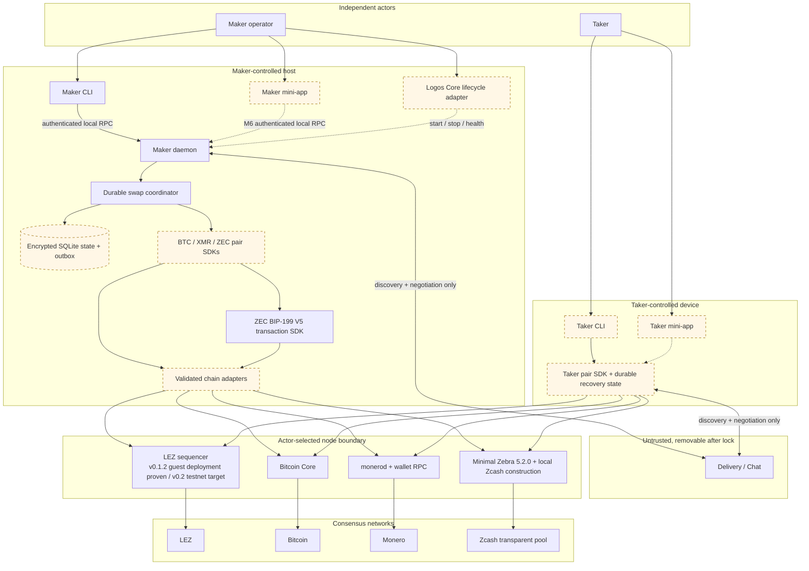
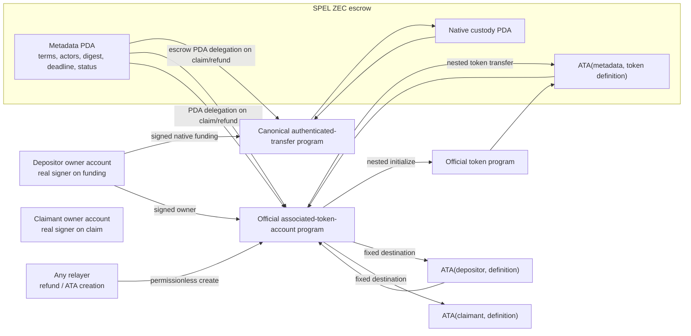
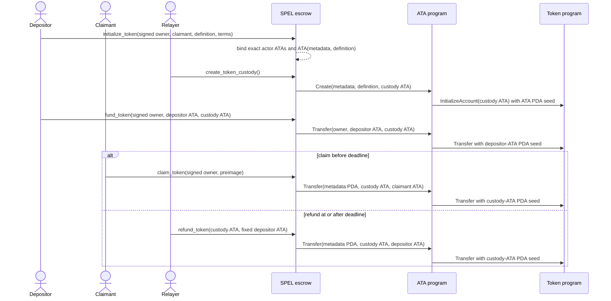
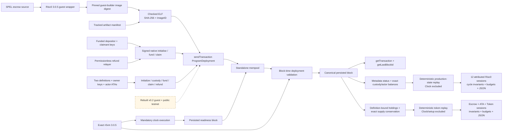
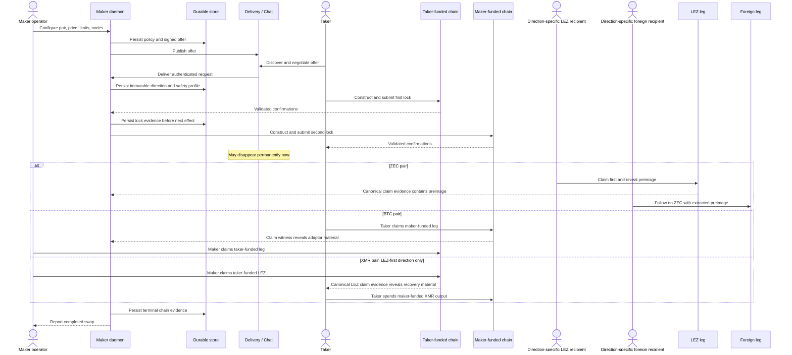
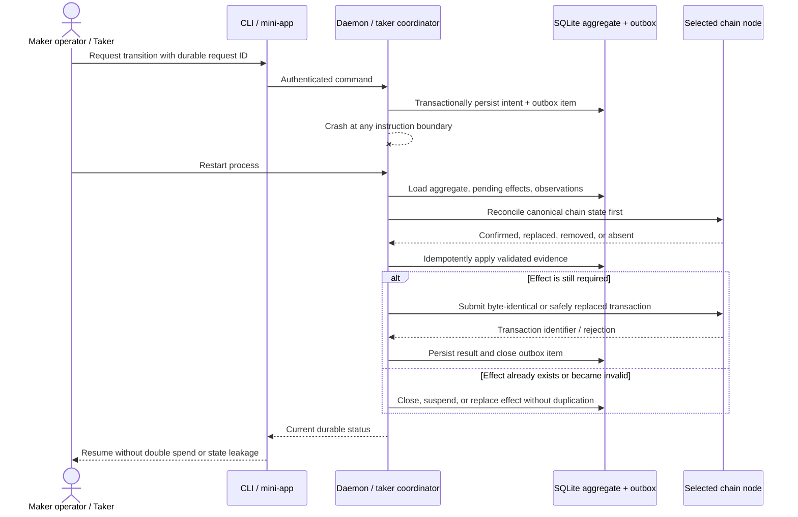

# System architecture and actor flows

Status: Living target architecture — 2026-07-11

This is the canonical whole-system view. ADRs record why individual choices
were made; this document shows how the choices compose into the product that
operators and takers actually run. Dashed components are required final
deliverables that are not implemented yet. A test is called end to end only
when it crosses the same process, RPC, persistence, role, and chain boundaries
shown here.

## Actors, runtime components, and trust boundaries



The maker operator owns maker policy, keys, node selection, and the daemon
lifecycle. The taker owns a separate client, keys, node selection, and recovery
state. Logos Core is an optional lifecycle surface, never a protocol authority.
Delivery / Chat is not trusted with secrets or chain truth and may disappear
after the first lock. Chain adapters accept consensus evidence from the selected
LEZ sequencer, Bitcoin Core, `monerod`, or Zebra; peer messages never advance an
on-chain state by themselves.

The dashed state reflects delivery honestly. The deterministic core, SQLite
repository, maker daemon, authenticated maker CLI flow, LEZ semantic
verification, pinned SPEL/LEZ generated-IDL/client fixture, and ZEC exact-script
plus signed V5 spend foundation
exist. Deterministic actor-owned funding/change and pinned, vulnerability-clean
Zebra 5.2.0 Regtest acceptance/rejection/confirmation, concurrent swaps,
confirmation regression, exact rebroadcast, block reconsideration, and a
two-node conflicting four-over-three-block fork replacement now exist as
consensus-node proof. Source-correct authenticated-transfer/ATA custody and
generated owner-role clients now exist as locally composed upstream-program
evidence. The checked Risc0 guest now builds reproducibly, deploys through
public RPC, and executes the complete native initialize/fund/claim/refund
lifecycle with real funded actor keys in an isolated v0.1.2 standalone
sequencer. Wrong-preimage, wrong-role, and early-refund transactions are
excluded from canonical blocks without mutating nonce or custody. Native
recursive cost evidence is machine-checked from production state transitions
without Clock noise. The official ATA lifecycle also passes for two independent
definitions with real owner roles and permissionless fixed refunds. Their
escrow/ATA/Token recursion is also included in the machine-checked cost record.
Public-testnet evidence, composed both-direction maker/taker processes, typed
adapter-grade ZEC observations, cross-chain deadline composition, encrypted
state/outbox, and mini-apps remain milestone work and cannot yet be represented
as production E2E.

## LEZ escrow custody components and actor flows





## Deployable guest and standalone block flow



The deployment proof uses port `0`, a temporary sequencer home, deterministic
genesis inputs, an exact `r0vm` path, and no shared Docker project or chain
state. Deployment admission alone is deliberately insufficient: the readiness
block proves the mandatory clock/executor/store loop first, and transaction
lookup proves the deployment reached the block store rather than only the
mempool. The solid native lifecycle uses the actual funded genesis roles,
validates signer-bound claim and permissionless-refund boundaries against
canonical block time, and asserts exact balances. The solid token lifecycle
uses two definitions, owner-signed ATA funding/claim, permissionless custody and
refund, and cross-definition substitution negatives. Token replay attributes
the escrow/ATA/nested-Token recursion while excluding setup and Clock noise. The
dashed v0.2 testnet edge remains M2 exit work. Cost replay executes the same
guest instructions through LEZ production state transitions, counts the escrow
root and authenticated-transfer child, and compares generated JSON with the
checked evidence artifact.

## Zcash competing-fork consensus flow

```mermaid
sequenceDiagram
    actor Claimant
    actor Funder
    participant Primary as Primary Zebra 5.2.0
    participant Fork as Disconnected fork Zebra 5.2.0

    Primary->>Fork: Relay identical canonical prefix (getblock + submitblock)
    Claimant->>Primary: Signed BIP-199 claim
    Funder->>Primary: Independent signed BIP-199 refund
    Primary-->>Primary: Mine claim/refund branch to depth 3
    Funder->>Fork: Conflicting signed refund of claimant output
    Funder->>Fork: Same independent signed refund
    Fork-->>Fork: Mine conflicting branch to depth 4
    Fork->>Primary: Relay four raw consensus blocks via submitblock
    Primary-->>Primary: Accept higher-work branch; detach three blocks
    Primary-->>Claimant: Old claim no longer canonical
    Primary-->>Funder: Conflicting refund active with four confirmations
```

Both nodes use separate ephemeral loopback RPC ports, immutable tmpfs state,
non-root read-only images, and one uniquely named Compose project. This flow
proves Zebra consensus validation and best-chain replacement with actual actor
keys. It deliberately does not claim cross-chain refund-margin proof: that
requires typed ZEC observation commitments, checked LEZ millisecond/core-second
conversion, a named profile, and a composed standalone-LEZ plus Zebra run.

## Happy-path user flow



“Taker-funded” and “maker-funded” describe funding order, not a fixed chain.
BTC and ZEC support both product directions; XMR is LEZ-first only. Claim and
refund order is construction-specific, as fixed in ADR 0008 and ADR 0010.

## Abandonment and autonomous recovery flow

```mermaid
sequenceDiagram
    actor Maker as Maker operator
    participant Daemon as Maker daemon + watcher
    participant Store as Durable recovery state
    actor Taker
    participant LEZ as LEZ sequencer
    participant Foreign as Bitcoin Core / monerod / Zebra
    participant TakerLeg as Taker-funded chain
    participant MakerLeg as Maker-funded chain
    participant Chat as Delivery / Chat
    actor LezFunder as Direction-specific LEZ funder
    actor ZecFunder as Direction-specific ZEC funder

    Note over Chat: Offline; neither recovery path calls it
    alt Maker never submits the second lock
        Taker->>Store: Load first-lock recovery data
        Taker->>TakerLeg: Wait for its typed recovery condition
        Taker->>TakerLeg: Submit first-lock refund
    else Both locks exist but the revealing claimant abandons
        Daemon->>Store: Reconcile canonical chain evidence
        alt ZEC
            LezFunder->>LEZ: Submit earlier LEZ refund
            LEZ-->>Daemon: Canonical LEZ refund evidence
            ZecFunder->>Foreign: Submit later ZEC CLTV refund after margin
        else BTC
            Daemon->>MakerLeg: Recover maker-funded leg at its reviewed path
            Taker->>TakerLeg: Recover taker-funded leg at the later safe path
        else XMR
            Taker->>LEZ: Refund taker-funded LEZ
            LEZ-->>Daemon: Canonical LEZ refund event
            Daemon->>Foreign: Recover XMR with reviewed key-share evidence
        end
    end
    Daemon->>Store: Persist refund proofs and terminal state
    Daemon-->>Maker: Report recovered balances
```

Each actor retains enough local data to recover without the counterparty.
Deadline comparisons are typed by chain and clock domain. ZEC always refunds
LEZ first and ZEC later by the configured margin. XMR recovery is gated by a
canonical LEZ event rather than a fictitious Monero deadline.

## Crash, restart, and at-least-once observation flow



The final coordinator uses one durable aggregate per swap and atomic intent plus
outbox persistence. Chain observations are at least once and therefore
idempotent; conflicting evidence is rejected. Current M1 proves restart and
observation idempotence for the prototype store. Atomic outbox, secret
encryption, process-kill matrices, and pair transaction resubmission are M5 exit
evidence, not present claims.

## Delivery-to-architecture map

| Boundary | Required proof | Milestone |
|---|---|---|
| Deterministic lifecycle and safety profiles | Pair acceptance/property tests | M1, then retained |
| LEZ and foreign-chain construction | Published vectors plus consensus-node acceptance/rejection | M2–M4 |
| Independent maker/taker processes | Black-box role matrix using real credentials, nodes, and funds | M2–M5 |
| Crash-safe coordinator | Kill/restart/outbox/reorg matrix | M5 |
| Maker CLI and Logos Core lifecycle | Authenticated operator journeys | M5 |
| Maker/taker mini-apps | Same role suites through UI process boundaries | M6 |
| Public testnets and review | Happy/refund/concurrency recordings and remediation packet | M7 |

No milestone is complete merely because an internal API test passes. Its tag
must point to the commit whose role-real evidence crosses every applicable
boundary above.
