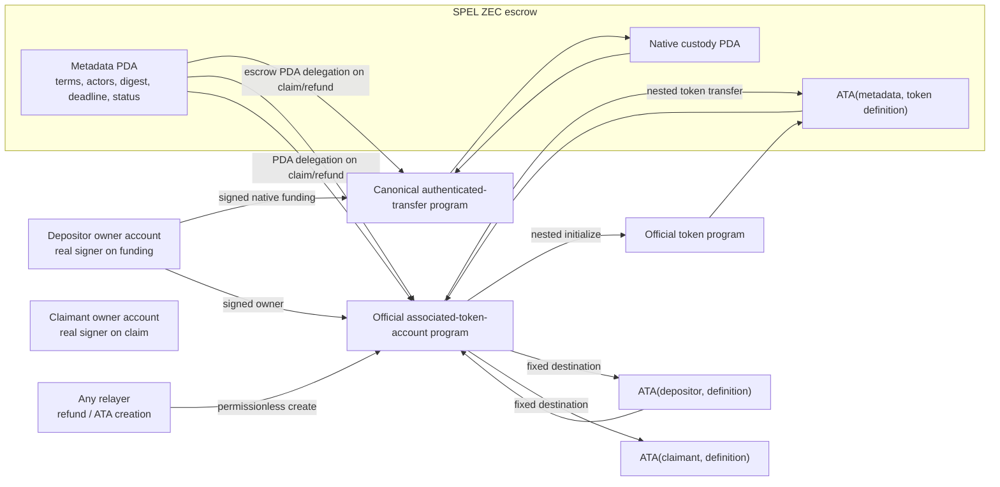
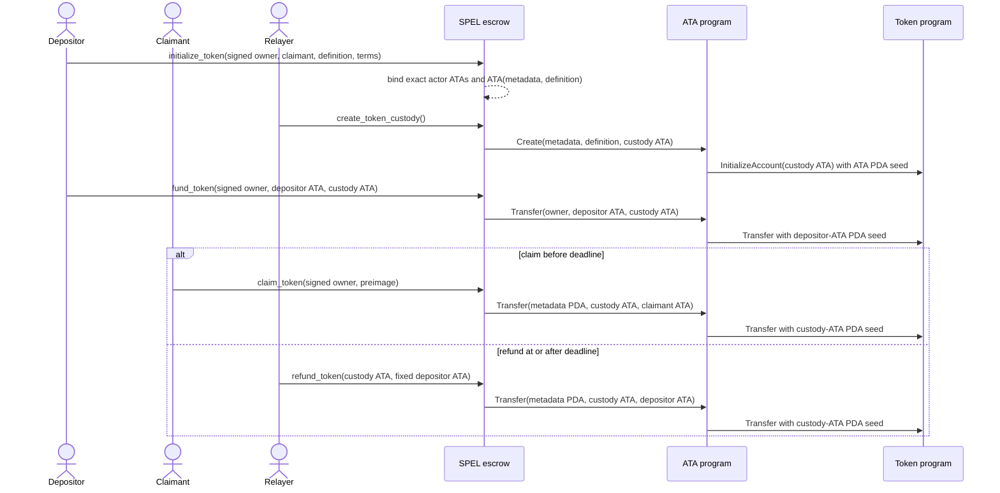
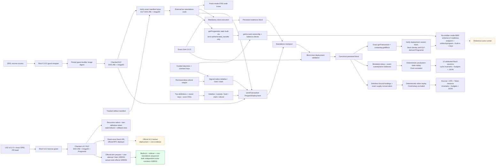
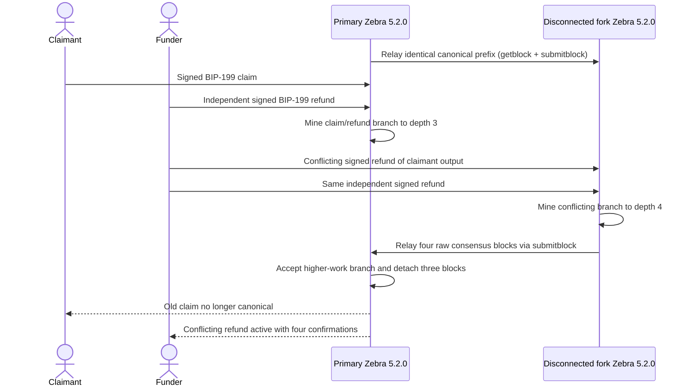
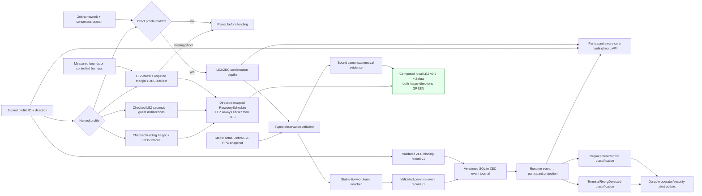
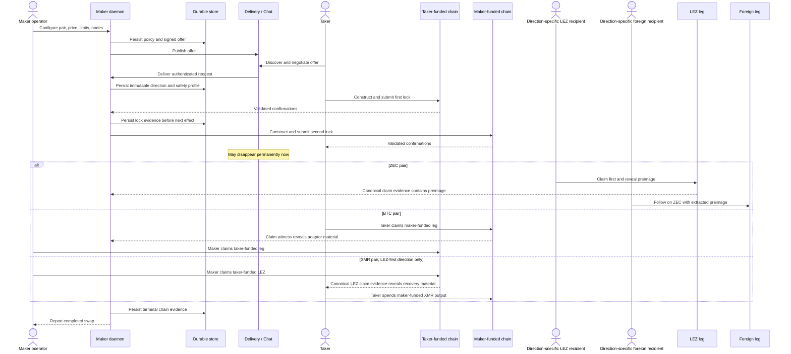
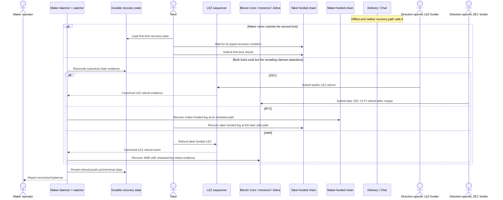
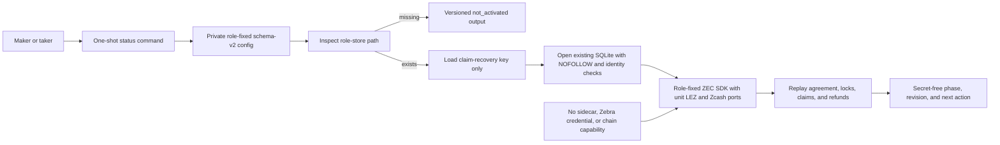
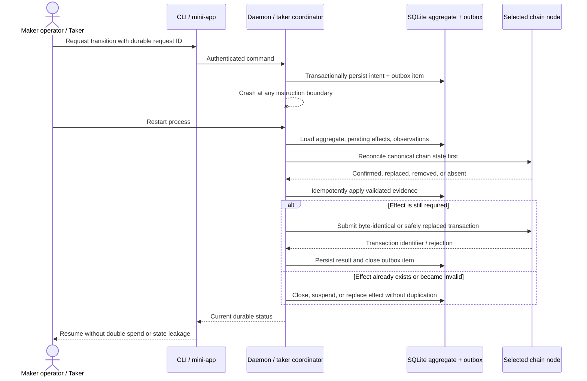

# System architecture and actor flows

Status: Living target architecture — 2026-07-14

This is the canonical whole-system view. ADRs record why individual choices
were made; this document shows how the choices compose into the product that
operators and takers actually run. Dashed components are required final
deliverables that are not implemented yet. Blue components are implemented
boundaries that may have partial live exercise but have not completed the shown
end-to-end boundary. A test
is called end to end only when it crosses the same process, RPC, persistence,
role, and chain boundaries shown here.

## Actors, runtime components, and trust boundaries

```mermaid
flowchart TB
    subgraph People["Independent actors"]
        MO["Maker operator"]
        T["Taker"]
    end

    subgraph MakerHost["Maker-controlled host"]
        MC["Maker CLI"]
        MM["Maker mini-app"]
        LC["Logos Core lifecycle adapter"]
        MD["Maker daemon"]
        CO["Durable swap coordinator"]
        DB[("Maker SQLite schema v10<br/>lock + claim + refund journals")]
        PS["BTC / XMR / ZEC pair SDKs"]
        ZA["Canonical dual-signed LEZ/ZEC agreement validator"]
        ZTX["ZEC BIP-199 V5 transaction SDK"]
        CA["Validated chain adapters"]
        MOA["Maker-only taker-lock observation"]
        OJ["Contiguous exact-tracker journal<br/>canonical / depth / same-tip replacement / removal"]
        ME["Fresh-gated durable maker second lock"]
        MLB["Context-owning LEZ SDK ports + adapter"]
    end

    subgraph TakerDevice["Taker-controlled device"]
        TC["Taker CLI"]
        TM["Taker mini-app"]
        TS["Taker pair SDK + durable recovery state"]
        TA["Taker-side concrete agreement validator"]
        TMO["Taker-only maker-lock observation"]
        TDB[("Taker SQLite schema v10<br/>role-local recovery")]
        TLB["Context-owning LEZ SDK ports + adapter"]
    end

    subgraph SharedSecurity["Shared SDK security boundary"]
        PCM["Protected preimage + exact claim payload<br/>XChaCha20-Poly1305 + HKDF<br/>schema-v10 envelope journal"]
    end

    subgraph LezSidecars["Role-isolated official LEZ v0.1.2 processes"]
        MSL["Maker sidecar<br/>official wire + signer + durable cache"]
        TLS["Taker sidecar<br/>official wire + signer + durable cache"]
    end

    subgraph LocalLezFixture["Run-scoped exact-v0.1.2 node fixture"]
        ELN["Reusable external standalone process<br/>checked guest + fresh mode-0700 home"]
        LRM[("Private mode-0600 readiness<br/>endpoint + deployment tx/block + ProgramId<br/>built-in owner + funded actor keys")]
        LRR["Future reference-actor runner<br/>splits role-local endpoint and key files"]
    end

    subgraph LezV02Sidecars["Official LEZ v0.2 sidecar boundary"]
        MSL2["Maker v0.2 PoC process<br/>Vault Claim + native deposit GREEN"]
        TLS2["Taker v0.2 PoC process<br/>Vault Claim + native claim GREEN"]
        V02J[("Separate role-bound state<br/>exact reservations + Vault attempt journals GREEN")]
        MBR2["Maker lez-v02-bridge-poc<br/>both corridors complete in 14o and 14c"]
        TBR2["Taker lez-v02-bridge-poc<br/>both corridors complete in 14o and 14c"]
        MBRJ[("Maker-only request store<br/>PREPARE replay + submit unknown-before-I/O GREEN")]
        TBRJ[("Taker-only request store<br/>PREPARE replay + submit unknown-before-I/O GREEN")]
        MSL2 --> V02J
        TLS2 --> V02J
        MBR2 --> MBRJ
        TBR2 --> TBRJ
    end

    subgraph LocalLezV02["Required public-compatible local LEZ v0.2 devnet"]
        BR["Bedrock HTTP 18080<br/>retained proof host 32831"]
        IX["LEZ v0.2 indexer RPC 8779<br/>retained proof host 32833"]
        SQ["LEZ v0.2 sequencer RPC 3040<br/>retained proof host 32832"]
        V02R["Host orchestrator<br/>exact-ID lifecycle and RPC probes"]
        V02Net["Unique no-masquerade Docker bridge<br/>dynamic loopback ports"]
        V02Ready[("v0.2 services + Vault Claims + deploy GREEN")]
        V02Native[("Native init + fund + claim GREEN<br/>finalized blocks 219 220 223")]
        V02Fixture[("Fixture readiness GREEN<br/>isolated configs; saved window stale")]
        V02Partial[("Historical partial evidence<br/>14d through 14n retained")]
        V02Full[("Both ZEC corridor directions GREEN<br/>2 of 2 happy directions")]
        V02State[(".e2e/run_id/lez-v02")]
    end

    subgraph OffChain["Untrusted, removable after lock"]
        DC["Delivery / Chat"]
    end

    subgraph Nodes["Actor-selected node boundary"]
        LEZ["LEZ sequencer<br/>dynamic port; loopback client URL<br/>upstream wildcard bind<br/>public v0.2 activation pending"]
        BTC["Bitcoin Core"]
        XMR["monerod + wallet RPC"]
        ZEC["Zebra 5.2.0 Regtest JSON-RPC<br/>retained proof host 32834"]
    end

    subgraph Networks["Consensus networks"]
        LN["LEZ"]
        BN["Bitcoin"]
        XN["Monero"]
        ZN["Zcash transparent pool"]
    end

    MO --> MC
    MO --> MM
    MO --> LC
    MC -->|"authenticated local RPC"| MD
    MM -.->|"M6 authenticated local RPC"| MD
    LC -.->|"start / stop / health"| MD
    MD --> CO
    CO --> DB
    CO --> PS
    PS --> ZA
    PS --> ZTX
    PS --> CA
    PS --> MOA
    PS --> ME
    PS --> MLB
    ZTX --> CA

    T --> TC
    T --> TM
    TC --> TS
    TS --> TA
    TS --> TMO
    TS --> TDB
    TS --> TLB
    TMO --> TDB
    TMO -->|"signed direction selects one node"| LEZ
    TMO -->|"signed direction selects one node"| ZEC
    PS --> PCM
    TS --> PCM
    PCM -->|"encrypted envelope + journal"| DB
    PCM -->|"encrypted envelope + journal"| TDB
    TM -.-> TS

    MLB <-->|"bounded authenticated lez_bridge.v1"| MSL
    TLB <-->|"bounded authenticated lez_bridge.v1"| TLS
    MSL -->|"pinned generated JSON-RPC"| LEZ
    TLS -->|"pinned generated JSON-RPC"| LEZ
    ELN -->|"start exact upstream service"| LEZ
    LEZ -->|"official health, tx/block, static built-in, account RPC"| ELN
    ELN -->|"atomic no-clobber publish after verification"| LRM
    LRM -.->|"future private handoff"| LRR
    LRR -.->|"maker-only provisioning"| MSL
    LRR -.->|"taker-only provisioning"| TLS
    MLB <-->|"live bounded bridge; Completed in 14o and 14c"| MBR2
    TLB <-->|"live bounded bridge; Completed in 14o and 14c"| TBR2
    MSL2 -->|"official v0.2 JSON-RPC"| SQ
    TLS2 -->|"official v0.2 JSON-RPC"| SQ
    MBR2 -->|"reveal in 14o; initialize and fund in 14c"| SQ
    TBR2 -->|"initialize and fund in 14o; reveal in 14c"| SQ
    MBR2 -->|"non-genesis finalized-tip readiness"| IX
    TBR2 -->|"non-genesis finalized-tip readiness"| IX
    V02R -->|"start first; cryptarchia and channel HTTP"| BR
    V02R -->|"start after channel; finalized ID and hash RPC"| IX
    V02R -->|"start after exact missing proof; service RPC"| SQ
    V02R --> V02Net
    V02R --> V02State
    V02Net --> BR
    V02Net --> IX
    V02Net --> SQ
    SQ -->|"Zone SDK signed publish"| BR
    IX -->|"poll finalized LEZ channel"| BR
    V02R -->|"write run-scoped evidence"| V02Ready
    V02Ready --> V02Native
    V02Ready --> V02Fixture
    ZEC -->|"stable mature Regtest UTXO query"| V02Fixture
    V02Native --> V02Partial
    V02Fixture --> V02Partial
    V02Partial -->|"14o and reverse 14c completed"| V02Full
    V02Full -->|"direction-derived funding and exact spend on Zebra"| ZEC
    V02Full -.->|"runtime and funding handoff"| LRR

    MD <-->|"discovery + negotiation only"| DC
    TS <-->|"discovery + negotiation only"| DC
    CA --> LEZ
    CA --> BTC
    CA --> XMR
    CA --> ZEC
    MOA -->|"signed direction selects one node"| LEZ
    MOA -->|"signed direction selects one node"| ZEC
    MOA -->|"validated event"| OJ
    OJ -->|"atomic role-local projection"| DB
    OJ -->|"full-history replay"| CO
    ME -->|"fresh exact-head query"| MOA
    ME -->|"intent and confirmed transition"| DB
    ME -.->|"typed production action pending"| CA
    TS --> LEZ
    TS --> BTC
    TS --> XMR
    TS --> ZEC
    LEZ --> LN
    SQ -.-> LN
    BTC --> BN
    XMR --> XN
    ZEC --> ZN

    classDef planned stroke-dasharray: 5 5,fill:#fff7e6,stroke:#9a6700;
    classDef implemented fill:#ddf4ff,stroke:#0969da;
    classDef running fill:#e6ffec,stroke:#1a7f37;
    class MM,LC,CA,TM,LRR planned;
    class TC,MBRJ,TBRJ,V02Partial implemented;
    class BR,IX,SQ,V02R,V02Net,V02Ready,V02Native,V02Fixture,V02Full,V02State,MSL2,TLS2,V02J,MBR2,TBR2 running;
```

The maker operator owns maker policy, keys, node selection, and the daemon
lifecycle. The taker owns a separate client, keys, node selection, and recovery
state. Logos Core is an optional lifecycle surface, never a protocol authority.
Delivery / Chat is not trusted with secrets or chain truth and may disappear
after the first lock. Chain adapters accept consensus evidence from the selected
LEZ sequencer, Bitcoin Core, `monerod`, or Zebra; peer messages never advance an
on-chain state by themselves.

The concrete LEZ/ZEC agreement validator is integrated on both actor sides as
one bounded canonical wire contract. Negotiation yields untrusted bytes;
role-fixed SDK instances validate and persist an accepted envelope before
activation, then revalidate its exact durable wire on resume without retaining
transport or raw adapter handles. The current executable SDK store is a
role-fixed production SQLite adapter for accepted agreement, both lock intents,
taker projection, maker-independent observation replay, confirmed maker funding,
and the taker-local observed-maker transition. Schema-v10 claim and refund
journals protect exact owner material, keep observer paths secret-free, and
replay separate role stores to `Completed` or `Refunded` in both directions.
The official native-refund sidecar, main revealing-claim/refund validation
adapters, both-direction agreement-bound Zebra funding discovery, and
context-owning LEZ SDK ports are now GREEN. The production fresh-client
factory, actor-owned random request/window allocator, and cloneable shared
role-local operation journal close the corresponding process-composition
prerequisites. Reopened role-local SQLite is now the canonical LEZ claim-funding
authority in both directions and reverse claims require the durable opposite
Zcash lock. The role-keyed Zcash funding/claim/refund signer retains only
zeroizing key bytes and uses the canonical SDK builders. The
agreement-committed exact-outpoint planner, checked all-trait Zebra composite,
refund-aware full-history resume, and the mode-0600, path-isolated one-shot
maker/taker CLI boundary are GREEN. Offline `status` now opens only a
pre-existing hardened role store, replays all durable lock/claim/refund state
with chain ports impossible by type, and leaves missing state uncreated. The
v0.2 sidecar foundation now binds the exact official LEE account and
transaction types, canonical signed-transaction decoder, sequencer
health/channel RPC, and an authenticated role/run-bound describe server. Its
native escrow planner prepares and validates an exact signed initialize/fund
pair using node-observed consecutive nonces. Its Vault planner prepares and
validates the exact official maker/taker Claim transactions with role-specific
allocations and an independently confirmed owner nonce. Both optionally persist
their exact reservation in a Linux owner-only no-symlink directory and recover
the same validated signed bytes after restart without another nonce lookup.
Their role-bound SQLite effect journal now exposes the narrow Vault Claim
one-attempt state machine: it commits exact typed preparation and
`AttemptStarted` before the only official-transaction call and makes every
reopen observe-only. Forced races, crash windows, ambiguity, error
classification, schema tampering, and filesystem substitution are GREEN in
library tests. The retained local v0.2 stack then proved both owner-authorized
Vault Claims, checked deployment, and separate maker/taker PoC processes driving
native initialize/fund/claim into finalized blocks 219/220/223. The native CLI
itself proves sequencer inclusion and same-tip state; sequential indexer reads
provide the distinct finality proof. It reports `crash_atomic_submission=false`.
The exact `lez-v02-bridge-poc` source now provides the role/run/runtime/signer-
bound process boundary for prepare, observe, revealing claim, and submit. It
requires explicit nonzero loopback endpoints and private file inputs, gates
startup on the official sequencer and indexer health calls, replays successful
PREPARE results, re-executes observations and transient PREPARE failures, and
persists submit as unknown before node I/O. Refund calls are typed unavailable;
sequencer observation is bounded inclusion plus same-tip accounts, and the
bridge does not assert indexer finality. Historical partial runs 14d through
14n remain failure and invariant evidence. Fresh run
`m2poc-corridor-fresh-20260714o` completed `TakerSellsLez`: the taker
initialized and funded LEZ, the maker funded Zcash, waited for two
confirmations, claimed LEZ and revealed the preimage, and the taker spent the
Zcash HTLC. Both independent actors reached revision 4 `Completed` in 25.370
seconds. One payload-free `moving_tip` observation was retried once. A separate
indexer audit found the LEZ effects in finalized blocks 264/265/266 and proved
terminal `Claimed` metadata and zero custody; Zebra funding at height 106 was
spent at height 108.

Fresh reverse run `m2poc-corridor-reverse-fresh-20260714c` completed
`TakerSellsForeign`: the taker funded Zcash, the maker initialized and funded
LEZ after the two confirmations, the taker claimed LEZ and revealed the
preimage, and the maker spent the Zcash HTLC. Both independent actors again
reached revision 4 `Completed`, this time in 26.960 seconds without a drive
retry. LEZ initialize/fund/claim finalized in blocks 641/642/643, and Zebra
funding at height 113 was spent at height 115. Two earlier effect-bearing
reverse attempts are retained and never reused; they exposed a canonical LEZ
validator that was hard-coded to the forward taker depositor. The correction
now validates the agreement-derived LEZ depositor and signer in both
directions.

The development runner provisions fresh role inputs and executes independent
`activate`/`drive` processes. Before effects it acquires a nonblocking advisory
`flock` keyed by the SHA-256 of the configured sequencer, indexer, and Zebra
endpoint tuple. That lock serializes only users of the same retained nodes and
does not inspect, stop, or prune unrelated Docker resources. Its live atomic
guard permits the revealing LEZ claim only after the Zcash funding has two
confirmations, and permits the Zcash follow-up spend only after that LEZ reveal;
it also rejects a wrong role or duplicate chain effect. The saved early fixture
window 1..256 remains stale and is not reused. Both required local-devnet happy
directions are now GREEN. Restart, refund, reorg, chaos, public-route
portability, and production hardening remain explicit later gates. Chain
adapters must
independently recompute every chain-derived account, input, and deadline. Maker
observation alone is non-authorizing: forward Zcash persists and revalidates
the complete canonical output type plus ordered canonical, depth, atomic
same-tip replacement, and affirmative exact-head removal events. The SDK and
store fold `ZcashObservationTracker`, so duplicate polls write nothing and
changed inclusion without replacement fails. Schema v10 rejects orphan, holey,
or history-incompatible rows and catches stale instances up before returning.
The maker effect invokes the distinct fresh pre-second-lock call internally,
then persists the exact direction-fixed opposite-chain plan before submission.
Confirmed Maker evidence commits atomically and replays to `BothLegsLocked` in
both directions without caching authority in `next_action`. Reverse LEZ rejects
primitive ID/depth assertions and
persists a stable primitive snapshot bound to the signed channel/genesis,
public fund transaction, canonical block/tip, complete SPEL metadata, exact
custody, depth, and finality policy. SDK and SQLite replay rerun the same
validator. The dependency-free exact-head tracker is now folded by the active
SDK and the schema-v10 journal. Exact duplicates write no row, while a
same-inclusion Pending-to-Finalized update advances one contiguous revision and
survives close/reopen. The pure tracker also proves affirmative same-tip
replacement, stale-evidence rejection, and fatal finalized-history changes.
Complete primitive removal/replacement records now carry nonfinal reorgs
through the active SDK and SQLite, while stale old-head evidence fails without
a row or revision change. Deterministic-local reverse fresh eligibility now
replays and re-queries the exact head and checks signed depth; local Pending
remains eligible when depth is sufficient, and no result is cached as
authority. The public Finalized/typed-finality policy is unit-tested but remains
unreachable while public agreement activation is fail-closed. The official
v0.1.2 node/escrow, revealing-claim, and native-refund owner/discovery ports,
main escrow/claim/refund agreement conversion, and crash-safe context-owning
SDK-port wiring are GREEN lower compatibility evidence. Public deployment is
deferred under ADR 0023. The full local v0.2 runtime tuple and independent actor
processes are GREEN in both happy directions. Dormant public configuration
contracts, actual-node restart/refund/reorg and maker-fault evidence, and
production adapter composition remain open.

The protected-claim module derives per-context keys with HKDF-SHA256 and encrypts
preimages and bounded exact claim-submission bytes with XChaCha20-Poly1305 while
binding schema, swap, pair, direction, agreement, role, purpose, and key ID.
Schema-v10 SQLite claim/refund intents and owner/observer transitions are
implemented with atomic revision commits, close/reopen replay, rollback,
conflict, corruption, and legacy-secret scrub coverage.

The dashed state reflects delivery honestly. The deterministic core, SQLite
repository, maker daemon, authenticated maker CLI flow, LEZ semantic
verification, pinned SPEL/LEZ generated-IDL/client fixture, and ZEC exact-script
plus signed V5 spend foundation exist. Bounded spend recognition now matches
pinned Zebra consensus across all defined sighash modes and alternate valid
stack/signature encodings while reporting stricter SDK construction policy
separately. Deterministic actor-owned funding/change and pinned, vulnerability-clean
Zebra 5.2.0 Regtest acceptance/rejection/confirmation, concurrent swaps,
confirmation regression, exact rebroadcast, block reconsideration, and a
two-node conflicting four-over-three-block fork replacement now exist as
consensus-node proof. Source-correct authenticated-transfer/ATA custody and
generated owner-role clients now exist as locally composed upstream-program
evidence. The checked Risc0 guest now builds reproducibly, deploys through
public RPC, and executes the complete native initialize/fund/claim/refund
lifecycle with real funded actor keys in an isolated v0.1.2 standalone
sequencer. Wrong-preimage, wrong-role, and early-refund transactions are
excluded from canonical blocks without mutating nonce or custody. Native
recursive cost evidence is machine-checked from production state transitions
without Clock noise. The official ATA lifecycle also passes for two independent
definitions with real owner roles and permissionless fixed refunds. Their
escrow/ATA/Token recursion is also included in the machine-checked cost record.
Public-testnet execution evidence is deferred to production readiness. The
full-runtime local v0.2 happy path and composed both-direction maker/taker
processes are evidence-backed PoC boundaries. Production adapter composition,
cross-chain deadline and refund composition, actual-node restart/reorg/chaos,
encrypted state/outbox, and mini-apps remain milestone work and cannot yet be
represented as production E2E.

The reusable external local-node boundary is narrower than that composed E2E.
It recomputes the tracked ELF SHA-256 and Risc0 ImageID before creating any
state, refuses an existing node home or readiness path, creates its own
mode-0700 home, and requests an upstream dynamic port. It publishes the
literal-loopback client endpoint only after official RPC verifies health,
genesis identity, mandatory chain progress, checked-guest deployment and
the exact deployment transaction and containing block, ProgramId, the static
authenticated-transfer built-in identity, plus two key-derived accounts owned
by that built-in with positive balances. Upstream `getProgramIds` is not a
deployment registry; custom guest authority comes from `getTransaction`, exact
`getBlock` membership, and ProgramId derived from the contained ELF. The
mode-0600 no-clobber readiness manifest includes those deterministic private
keys and is therefore a run-local secret. The
future actor edges are dashed because neither SDK actor consumes this handoff
in a composed LEZ/Zebra swap yet. This entire v0.1.2 boundary is retained as a
lower lane and cannot replace ADR 0023's full v0.2 stack. The upstream v0.1.2 server itself still binds
the allocated port on the host wildcard address.

The v0.2 service stack is source- and binary-attested and runs clean LEZ
`v0.2.0` source `a58fbce2...`, Rust 1.94.0 service artifacts, the digest-pinned
Bedrock image, exact Risc0/Rapisnark inputs, and dynamic loopback RPCs on a
unique no-masquerade bridge. Run `m2poc-vertical-20260714a` retained that stack
while Vault Claims finalized in blocks 29/30, the checked escrow deployed in
block 51, and the native lifecycle finalized in blocks 219/220/223. Terminal
custody/maker/taker balances were 0/99300/200700. A keyless process observed the
same terminal state, and the actor-fixture provisioner selected a 625000000-zat
maker-owned Zebra output at 104 confirmations. That retained vertical run was
not itself a cross-chain swap. Subsequent runs 14o and reverse 14c composed the
same LEZ services, role-isolated sidecars and actors, and Zebra HTLC
funding/spend in both happy directions. Composed restart, refund, reorg, and
fault recovery remain pending. PoC-to-hardening and milestone transitions are
owner-controlled.

## Verified M2 local actor and RPC flow

The direction changes actor ownership, not the atomic reveal order. In both
runs the Zcash funding is confirmed before the LEZ claim reveals the preimage,
and the exact Zcash follow-up spend occurs only after that reveal. The retained
host ports above are evidence addresses from these isolated runs, not reusable
service discovery values; every new run must receive an explicit fresh local
tuple.

## LEZ escrow custody components and actor flows

## Deployable guest and standalone block flow

The deployment proof uses port `0`, a fresh mode-0700 sequencer home,
deterministic genesis inputs, an exact `r0vm` path, and no shared Docker project
or chain state. The external process rejects the guest before home creation if
its bytes or manifest differ from the embedded tracked identity, and refuses to
reuse another activity's home or readiness path. Deployment admission alone is
deliberately insufficient: the readiness block proves the mandatory
clock/executor/store loop first, transaction lookup proves the deployment
reached the block store rather than only the mempool. The helper locates the
exact transaction in a post-submit block and retains its hash plus containing
block ID/hash. `getProgramIds` binds only the static authenticated-transfer
built-in used as actor owner; official account RPC then revalidates both
deterministic actors before a private schema-v2 mode-0600 handoff is published.
The solid native lifecycle uses the actual funded genesis roles,
validates signer-bound claim and permissionless-refund boundaries against
canonical block time, and asserts exact balances. The solid token lifecycle
uses two definitions, owner-signed ATA funding/claim, permissionless custody and
refund, and cross-definition substitution negatives. Token replay attributes
the escrow/ATA/nested-Token recursion while excluding setup and Clock noise.
The solid v0.2 branch builds an independently locked guest/generated client,
binds ELF SHA-256 `40c9d37c...8021`, ImageID `f8385049...0fbe`, and
ProgramId, and runs recursive native plus two-definition token claim/refund
tests. A child-transfer overflow regression proves the metadata and every
touched account roll back together. The v0.2 deployer validates immutable
endpoint/channel/built-ins/artifact identity, submits once, and accepts only the
exact transaction in its containing block; ambiguity or timeout is never
retried. The solid v0.2 sidecar node represents tested describe/health/decoder,
native initialize/fund preparation, deterministic maker/taker Vault Claim
preparation, hardened durable exact-byte restart, and the role-bound
attempt-before-call Vault Claim submission state machine. The full-local edge
is now solid because runs 14o and reverse 14c crossed the official sidecar,
three-service LEZ stack, independent actor state, and Zebra in both happy
directions. Actual-node restart, refund, reorg, and fault recovery remain open.
The dashed public-testnet edge and deployed-runtime costs are deferred to production
readiness under ADR 0023. The v0.1.2 cost replay executes the same guest instructions through
LEZ production state transitions, counts the escrow root and
authenticated-transfer child, and compares generated JSON with the checked
evidence artifact.

## Zcash competing-fork consensus flow

Both nodes use separate ephemeral loopback RPC ports, immutable tmpfs state,
non-root read-only images, and one uniquely named Compose project. This flow
proves Zebra consensus validation and best-chain replacement with actual actor
keys. It deliberately does not claim cross-chain refund-margin proof: that
requires typed ZEC observation commitments, checked LEZ millisecond/core-second
conversion, a named profile, and a composed standalone-LEZ plus Zebra run.

## Zcash profile and deadline flow

The solid profile, validator, stable-tip watcher, and actual Zebra E2E snapshot
paths are implemented. The validator
re-decodes canonical bytes and checks the complete network, branch, block,
outpoint, value, exact script, and derived-depth binding before producing a
lossy coordinator proof. Public-testnet values are acceptance targets, not
mainnet recommendations or proof of worst-case cadence. Durable production
participant-aware core semantics are implemented for taker- and maker-funded
legs: removal pins the exact ID, suspends claims, exact reappearance restores
authority, conflicting replacement fails, and refunds remain available.
Independent leg policies also make maker-depth regression suspend and depth
recovery restore claims. The runtime event-to-participant path is now solid: the
isolated two-Zebra fixture drives real canonical and removal evidence through schema-v10 SQLite
close/reopen and exact replay. The composed local LEZ/ZEC happy-path corridor is
solid for both directions in runs 14o and reverse 14c. Its actual-node
restart/refund/reorg and recovery paths remain open. RPC errors or absence never imply removal: a detach event
requires a stable replacement tip and a changed canonical hash at the prior
inclusion height.

The runtime path passes direction-derived canonical/removal projection, atomic
commit, restart reload, exact unknown-outcome replay in both ZEC directions,
authenticated operator alert operations, and actual-node close/reopen/requery.
Restart revalidates primitive records and immutable binding terms,
rejects impossible sequence history, restores the exact historical tracker head,
and still requires a fresh stable Zebra reconciliation before effects.
Completed/refunded removal or replacement is now journaled without erasing the
lifecycle result and is classified as `TerminalReorgDetected`; its critical
alert now commits atomically and survives replay/restart.
Authenticated maker status/list/ack RPC and CLI flows surface that durable alert;
acknowledgment clears attention metadata without changing the protocol phase.
Post-dependent replacement now commits chain truth atomically, retains the
protocol-committed transaction ID in the participant-specific reorg phase, and
returns `ReplacementConflict`; pre-dependent replacement and same-transaction
re-mining remain normal applied outcomes.
The SDK binding record now revalidates primitive profile and BIP-199 terms,
including both derived scripts. Schema v4 persists it atomically with the swap
and rejects immutable rebinding. Runtime requires it before tracker restoration,
replay detection, or projection; both coordinator leg policies and every event
side must match the named profile and expected-output envelope.
The separate concrete agreement record now additionally binds both actor
signatures, exact LEZ chain/custody terms, Zcash transaction policy, refund
calibration, and the authenticated transcript. It remains pre-integration
evidence until activation and resume persist and revalidate that exact record.

## Happy-path user flow

“Taker-funded” and “maker-funded” describe funding order, not a fixed chain.
BTC and ZEC support both product directions; XMR is LEZ-first only. Claim and
refund order is construction-specific, as fixed in ADR 0008 and ADR 0010.

## Abandonment and autonomous recovery flow

Each actor retains enough local data to recover without the counterparty.
Deadline comparisons are typed by chain and clock domain. ZEC always refunds
LEZ first and ZEC later by the configured margin. XMR recovery is gated by a
canonical LEZ event rather than a fictitious Monero deadline.

## Offline actor status flow

`status` is an implemented store-recovery path, not a configuration-only
placeholder. Missing SQLite returns `not_activated` without creating a file.
Existing state is opened with the existing-only hardened SQLite entry point and
replayed through `resume_all_capable`; the SDK is instantiated with unit LEZ and
Zcash port types, so a chain call is impossible even if a later adapter changes.
It loads neither the sidecar capability nor Zebra cookie, signing key,
agreement file, or preimage. The separate `activate` and `drive` paths load
their scoped effect material and completed the first real local v0.2/Zebra
direction in run14o and the reverse direction in run14c; `status` keeps this
no-chain design.

## Crash, restart, and at-least-once observation flow

The final coordinator uses one durable aggregate per swap and atomic intent plus
outbox persistence. Chain observations are at least once and therefore
idempotent; conflicting evidence is rejected. Current M1 proves restart and
observation idempotence for the prototype store. Atomic outbox, secret
encryption, process-kill matrices, and pair transaction resubmission are M5 exit
evidence, not present claims.

## Delivery-to-architecture map

| Boundary | Required proof | Milestone |
|---|---|---|
| Deterministic lifecycle and safety profiles | Pair acceptance/property tests | M1, then retained |
| LEZ and foreign-chain construction | Published vectors plus consensus-node acceptance/rejection | M2–M4 |
| Independent maker/taker processes | Black-box role matrix using real credentials, nodes, and funds | M2–M5 |
| Crash-safe coordinator | Kill/restart/outbox/reorg matrix | M5 |
| Maker CLI and Logos Core lifecycle | Authenticated operator journeys | M5 |
| Maker/taker mini-apps | Same role suites through UI process boundaries | M6 |
| ZEC private public-compatible local devnets and private recording/evidence | Independent happy/refund/reorg/concurrency actors across full local LEZ v0.2 and Zebra Regtest | M2 |
| ZEC public testnet/deployment and public recordings | Deferred proposal evidence plus final production rehearsal/remediation | Production readiness / M7 under ADR 0023 |
| Other public testnets and final review | BTC/XMR evidence plus remediation packet | M3–M4, M7 |

No milestone is complete merely because an internal API test passes. Its tag
must point to the commit whose role-real evidence crosses every applicable
boundary above.
