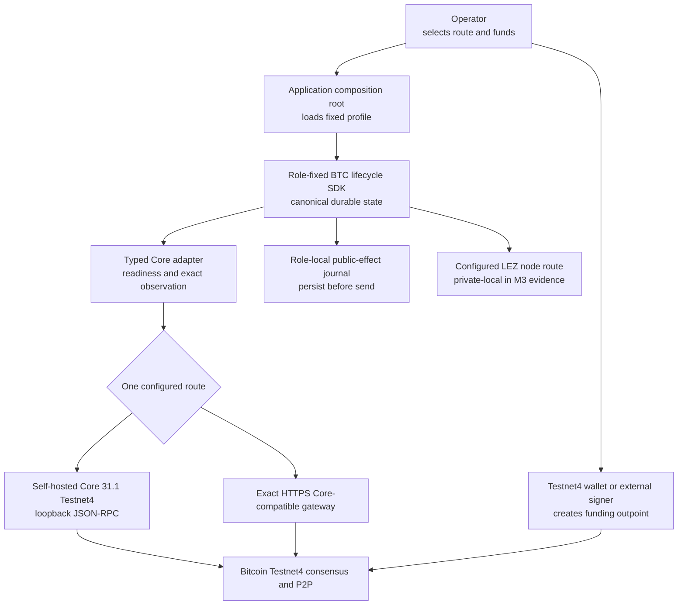
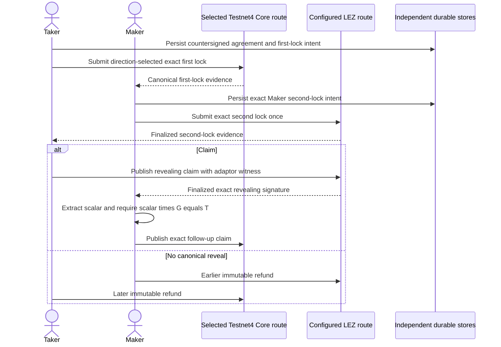

# Bitcoin Testnet4 setup, funding, and SDK connectivity

This guide covers the two M3 Bitcoin route shapes: an operator-owned Bitcoin
Core 31.1 Testnet4 node on literal loopback and one exact operator-allowlisted
Core-compatible HTTPS gateway. It also shows where wallet/funding authority
ends and swap-actor authority begins.

The repository's retained happy, refund, concurrent, and D1 recording evidence
uses isolated Bitcoin Regtest plus private LEZ v0.2. No public Testnet4 RPC,
peer, gateway, faucet, funds, or transaction was used for certification.
Testnet4 support is a fail-closed configuration and readiness contract; this
guide does not claim a live public deployment.

## What to build and test first

From a clean repository checkout:

```sh
rustup show
cargo build --locked -p lez-btc-swap-sdk -p lez-btc-core-adapter
./scripts/test-bitcoin-testnet4-route-contract.sh
./scripts/check-m3-cryptographic-vectors.sh
```

These checks make no public network call. They prove that the adapter requires:

- Testnet4 means exact `chain=testnet4` and the rust-bitcoin Testnet4
  genesis, never Testnet3's `chain=test`;
- Core to be exactly 31.1, network-active, synchronized, unpruned, and out of
  IBD;
- `txindex` and `txospenderindex` to be present and synchronized at
  the same tip;
- literal loopback is valid for a self-hosted node;
- exact HTTPS is valid only with `Testnet4Networked`; and
- malformed, unallowlisted, cross-profile, or insecure-credential routes fail
  before RPC.

## Components and authorities



The operator wallet is not a swap actor RPC identity. A Taker first-lock actor
and a Maker second-lock actor receive distinct role-scoped credentials,
agreement material, stores, signer journals, and exact effects. The node
operator retains wallet administration and, for a self-hosted node, P2P and
index operations.

## Route A: self-host Bitcoin Core 31.1 Testnet4

### 1. Verify the exact release

The repository pins the archive checksum, source commit, release signatures,
and Guix attestations in
`tests/e2e/bitcoin-core/provenance.env`. Cold verification downloads those
exact public artifacts. A preseeded exact archive in a fresh verifier cache is
revalidated rather than trusted.

```sh
export TESTNET4_ROOT="$HOME/.local/share/lez-btc-testnet4"
install -d -m 0700 \
  "$TESTNET4_ROOT/cache" \
  "$TESTNET4_ROOT/evidence" \
  "$TESTNET4_ROOT/release" \
  "$TESTNET4_ROOT/data"
export BITCOIN_CORE_CACHE_DIR="$TESTNET4_ROOT/cache"
export BITCOIN_CORE_PROVENANCE_EVIDENCE="$TESTNET4_ROOT/evidence/core-31.1.json"
./scripts/verify-bitcoin-core-release.sh

tar -xzf "$TESTNET4_ROOT/cache/bitcoin-31.1-x86_64-linux-gnu.tar.gz" \
  --strip-components=1 \
  -C "$TESTNET4_ROOT/release" \
  bitcoin-31.1/bin/bitcoind \
  bitcoin-31.1/bin/bitcoin-cli \
  bitcoin-31.1/share/rpcauth/rpcauth.py
```

The verifier refuses to overwrite its evidence file and refuses a cache whose
`gnupg` directory already exists. Each repeat therefore needs both a fresh
absolute `BITCOIN_CORE_CACHE_DIR` and a fresh evidence path. An operator
may copy the already downloaded exact archive into that fresh cache; every
checksum and signature is still revalidated. The existing
`run-bitcoin-core-e2e.sh` service mode is Regtest-only and must not be
relabeled as Testnet4 evidence.

### 2. Configure the node and actor credentials

Create separate `rpcauth` entries with the extracted helper for Maker and
Taker. Store each returned password as a mode-`0600` file containing exactly
`username:password` for the application, and put only the corresponding
`rpcauth=...` verifier lines in the Core configuration. Never put the
plaintext password in `bitcoin.conf` or a command-line argument.

An operator-owned mode-`0600` configuration needs at least:

```ini
testnet4=1
server=1
listen=1
networkactive=1
txindex=1
txospenderindex=1
rpcbind=127.0.0.1
rpcallowip=127.0.0.1/32
rpcport=48332
rpcwhitelistdefault=0
rpcauth=maker:REPLACE_WITH_GENERATED_VERIFIER
rpcauth=taker:REPLACE_WITH_GENERATED_VERIFIER
rpcwhitelist=maker:getblockchaininfo,getnetworkinfo,getblockhash,getblock,getblockheader,getrawtransaction,gettxout,gettxspendingprevout,getindexinfo,getmempoolinfo,getrawmempool,getmempoolentry,testmempoolaccept,sendrawtransaction
rpcwhitelist=taker:getblockchaininfo,getnetworkinfo,getblockhash,getblock,getblockheader,getrawtransaction,gettxout,gettxspendingprevout,getindexinfo,getmempoolinfo,getrawmempool,getmempoolentry,testmempoolaccept,sendrawtransaction
```

The allowlist is the exact method surface used by the typed adapter and denies
wallet administration to both actors. The cookie-authenticated operator
retains wallet and node administration. Bind RPC only to literal loopback. P2P
needs network access to synchronize Testnet4; do not publish RPC. Run the
daemon under a dedicated unprivileged account with an owner-private data
directory:

```sh
"$TESTNET4_ROOT/release/bin/bitcoind" \
  -conf="$TESTNET4_ROOT/bitcoin.conf" \
  -datadir="$TESTNET4_ROOT/data" \
  -daemonwait
```

### 3. Wait for exact readiness

Use the local cookie-authenticated operator CLI:

```sh
CORE_CLI="$TESTNET4_ROOT/release/bin/bitcoin-cli"
"$CORE_CLI" -testnet4 -datadir="$TESTNET4_ROOT/data" getnetworkinfo
"$CORE_CLI" -testnet4 -datadir="$TESTNET4_ROOT/data" getblockchaininfo
"$CORE_CLI" -testnet4 -datadir="$TESTNET4_ROOT/data" getblockhash 0
"$CORE_CLI" -testnet4 -datadir="$TESTNET4_ROOT/data" getindexinfo
```

Do not start a swap until Core reports version `310100`/subversion
`/Satoshi:31.1.0/`, `chain=testnet4`, network active, IBD false,
pruned false, blocks equal headers, and both required indexes synchronized at
that height. The typed adapter repeats these checks and also requires the
countersigned agreement genesis to equal both the observed and library-pinned
Testnet4 genesis.

### 4. Create and fund an operator wallet

The wallet is only a funding source. It is not passed to Maker or Taker:

```sh
"$CORE_CLI" -testnet4 -datadir="$TESTNET4_ROOT/data" createwallet "lez-funding"
FUNDING_ADDRESS="$(
  "$CORE_CLI" -testnet4 -datadir="$TESTNET4_ROOT/data" \
    -rpcwallet=lez-funding getnewaddress "" bech32m
)"
printf '%s\n' "$FUNDING_ADDRESS"
```

Acquire Testnet4 coins through an operator-selected faucet or another
Testnet4 wallet. Treat the source and returned txid as untrusted. Verify a
confirmed, unspent outpoint through this same node before building the
agreement:

```sh
"$CORE_CLI" -testnet4 -datadir="$TESTNET4_ROOT/data" \
  -rpcwallet=lez-funding listunspent 1 9999999
```

Do not reuse the local PoC's deterministic Regtest coinbase fixture or keys on
Testnet4.

### 5. Compose the SDK route

The application loads one role's mode-`0600` Basic credential file and
selects Testnet4 explicitly:

```rust
use lez_btc_core_adapter::{
    CoreConnectivityPolicy, HttpBitcoinCoreConfig, HttpBitcoinCoreRpc,
};

let config = HttpBitcoinCoreConfig::new("http://127.0.0.1:48332")?
    .with_cookie_file("/owner-private/maker.basic")?;
let adapter = HttpBitcoinCoreRpc::connect_profiled(
    &config,
    CoreConnectivityPolicy::Testnet4Networked,
)?;
```

Before effects, call `ensure_ready` with the fully validated Testnet4
agreement. The lifecycle runtime then uses typed Bitcoin/LEZ ports; its store
and public-effect journal must be process-durable. The repository reference
runner remains an isolated Regtest executable, so this library composition is
the current Testnet4 boundary rather than a claim that a public actor run was
performed.

## Route B: exact HTTPS Core-compatible gateway

Select a provider only after confirming it exposes the exact Core methods,
Core 31.1 identity, Testnet4 chain/genesis, and synchronized indexes required by
the adapter. This is a manual operator admission requirement; the repository
does not supply, discover, endorse, or pin a provider. `ensure_ready`
independently fails closed if the selected route does not return the required
identity and readiness facts.

Create one owner-private `username:password` file and configure the exact
canonical origin twice: once as the selected endpoint and once as the trusted
allowlist value.

```rust
use lez_btc_core_adapter::{
    CoreConnectivityPolicy, HttpBitcoinCoreConfig, HttpBitcoinCoreRpc,
};

let endpoint = "https://btc-testnet4.example.invalid/";
let config = HttpBitcoinCoreConfig::new_exact_https_basic_gateway(
    endpoint,
    endpoint,
    "/owner-private/maker-gateway.basic",
)?;
let adapter = HttpBitcoinCoreRpc::connect_profiled(
    &config,
    CoreConnectivityPolicy::Testnet4Networked,
)?;
```

Replace the reserved example domain only with the operator-approved canonical
HTTPS origin. The client rejects URL credentials, paths, queries, fragments,
IP literals, localhost, wildcards, explicit ports, mismatches, and Regtest
pairing. It installs no redirect, automatic-retry, proxy, or failover
middleware.

Funding remains separate. Use an operator wallet or faucet, then verify the
exact confirmed outpoint through the selected route. If a broadcast times out
or returns an ambiguous transport error, preserve the journal as unknown and
observe the exact transaction before any further decision. Never switch
providers mid-effect.

## Main user flow after connectivity



The chain assignments reverse when the Taker sells LEZ; the invariant remains
Taker first lock, Maker second lock, no witness reveal before both canonical
locks, and earlier Maker-funded recovery before later Taker-funded recovery.
See
[system architecture and actor flows](architecture/system-architecture.md) and
[ADR 0050](architecture/0050-map-btc-adaptor-construction-to-security-properties.md)
for both exact direction sequences and the conditional atomicity argument.

## External dependencies and flakiness

| Dependency | Local M3 CI/recordings | Manual Testnet4 effect |
| --- | --- | --- |
| Core archive, Git source, Guix signatures | Cold setup only; exact pins and cache | Download or signer-host outage blocks install, never changes accepted bytes |
| Public Testnet4 P2P | Not used | Sync can take time, stall, partition, or reorg; readiness and confirmation policy must hold |
| Public HTTPS gateway | Not used | DNS/TLS, credentials, quota, method policy, lag, outage, and ambiguous sends are external risks |
| Faucet or donor wallet | Not used | No SLA; rate limits/depletion/invalid txids are possible; verify through the selected node |
| Platform CA roots and clock | Not used by local route | Required for HTTPS; failure stops the route with no insecure fallback |
| Public LEZ endpoint/faucet | Not used | Future public LEZ remains separately configured, validated, and production-reviewed |

The fully reproducible milestone path remains the private local Regtest/LEZ
flow in [the M3 operator guide](m3-local-poc-operator-guide.md). Changing to
Testnet4 changes configuration, funding, confirmations, and external
availability; it does not change protocol state, agreement commitments,
atomicity rules, or chain effect construction.
