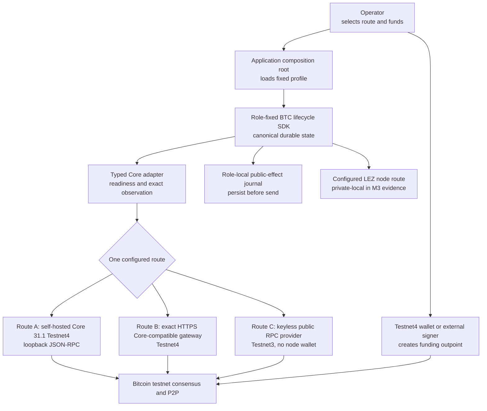
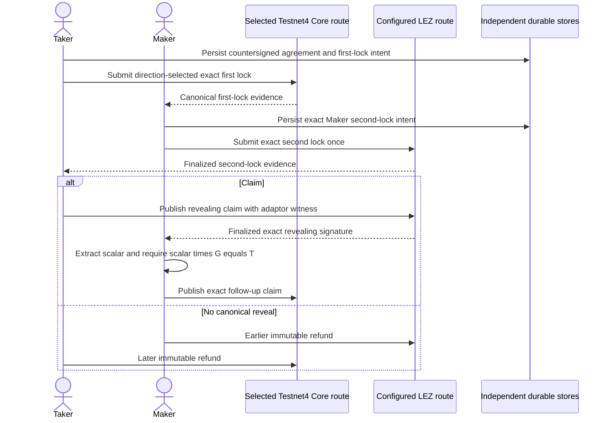

# Bitcoin testnet setup, funding, and SDK connectivity

Testnet4 on Routes A and B, Testnet3 on Route C.

This guide covers the three Bitcoin route shapes the swap supports, how to
create and fund a wallet on each, where wallet and funding authority ends and
swap-actor authority begins, and which swap directions each route can serve.

| Route | Network | Who runs the node | Node wallet | Directions served |
| --- | --- | --- | --- | --- |
| [A — self-hosted Core](#route-a-self-host-bitcoin-core-311-testnet4) | Testnet4 | you, on literal loopback | required | both |
| [B — exact HTTPS gateway](#route-b-exact-https-core-compatible-gateway) | Testnet4 | an operator-allowlisted Core-compatible gateway | required | both |
| [C — keyless public provider](#route-c-keyless-public-rpc-provider-testnet3) | Testnet3 | a third party you do not control | **none** | **`TakerSellsForeign` only** |

Route C is the only one that needs no Bitcoin node and no wallet of its own,
and it is the only one restricted to a single direction — see
[why Route C serves one direction](#why-route-c-serves-one-direction).

Routes A and B are the M3 library composition and are configured in Rust at the
application's composition root. Route C is a deployment shape for the Maker and
Taker Nodes and is configured through environment variables; it is documented
end to end in
[running the swap stack on public testnets, section 9](testnet-run.md#9-bitcoin-through-a-public-rpc-provider-instead-of-your-own-core).
The route-to-chain-profile contract that all three obey is
[ADR 0051](architecture/0051-bind-bitcoin-testnet4-routes-to-chain-profile.md).

**Which evidence this claim belongs to.** The M3 private-local certification —
the retained happy, refund, concurrent, and D1 recording evidence — uses
isolated Bitcoin Regtest plus private LEZ v0.2, and no public Testnet4 RPC,
peer, gateway, faucet, funds, or transaction took part in *that* certification.
Public-network runs were recorded separately and later:
[Testnet4 on Route A](evidence/testnet4-20260919/README.md) and
[Testnet3 through a public provider on Route C](evidence/testnet3-provider-20260918/README.md).
Testnet4 support in the library remains a fail-closed configuration and
readiness contract.

## What to build and test first

From a clean repository checkout:

```sh
rustup show
cargo build --locked -p lez-btc-swap-sdk -p lez-btc-core-adapter
./scripts/test-bitcoin-testnet4-route-contract.sh
./scripts/check-m3-cryptographic-vectors.sh
```

These checks make no public Bitcoin or LEZ chain-endpoint call. A cold Cargo
invocation may still fetch the exact locked Rust dependencies. The checks prove
that the adapter requires:

- Testnet4 means exact `chain=testnet4` and the rust-bitcoin Testnet4
  genesis, never Testnet3's `chain=test`;
- Core to be exactly 31.1, network-active, synchronized, unpruned, and out of
  IBD;
- `txindex` and `txospenderindex` to be present and synchronized at
  the same tip;
- literal loopback is valid for a self-hosted node;
- exact HTTPS is valid only with `Testnet4Networked`; and
- malformed, unallowlisted, cross-profile, or insecure-credential routes fail
  before RPC.

Those checks cover the Testnet4 profile used by Routes A and B. Route C selects
the separate `Testnet3Networked` profile, which requires `chain=test` and the
Testnet3 genesis; the two profiles never admit each other's chain.

## Components and authorities


```mermaid
flowchart TB
    Operator["Operator<br/>selects route and funds"]
    Wallet["Testnet4 wallet or external signer<br/>creates funding outpoint"]
    App["Application composition root<br/>loads fixed profile"]
    SDK["Role-fixed BTC lifecycle SDK<br/>canonical durable state"]
    Adapter["Typed Core adapter<br/>readiness and exact observation"]
    Journal["Role-local public-effect journal<br/>persist before send"]
    Route{"One configured route"}
    LocalCore["Route A: self-hosted Core 31.1 Testnet4<br/>loopback JSON-RPC"]
    Gateway["Route B: exact HTTPS Core-compatible gateway<br/>Testnet4"]
    Provider["Route C: keyless public RPC provider<br/>Testnet3, no node wallet"]
    Testnet["Bitcoin testnet consensus and P2P"]
    Lez["Configured LEZ node route<br/>private-local in M3 evidence"]

    Operator --> Wallet
    Operator --> App
    App --> SDK
    SDK --> Journal
    SDK --> Adapter
    Adapter --> Route
    Route --> LocalCore
    Route --> Gateway
    Route --> Provider
    LocalCore --> Testnet
    Gateway --> Testnet
    Provider --> Testnet
    Wallet --> Testnet
    SDK --> Lez
```

The operator wallet is not a swap actor RPC identity. A Taker first-lock actor
and a Maker second-lock actor receive distinct role-scoped credentials,
agreement material, stores, signer journals, and exact effects. The node
operator retains wallet administration and, for a self-hosted node, P2P and
index operations. On Route C there is no node wallet to administer at all: the
funding wallet stays entirely outside the Node and hands it one signed,
unbroadcast transaction.

## Route A: self-host Bitcoin Core 31.1 Testnet4

### 1. Verify the exact release

The repository pins the archive checksum, source commit, release signatures,
and Guix attestations in
`tests/e2e/bitcoin-core/provenance.env`. Cold verification downloads those
exact public artifacts. A preseeded exact archive in a fresh verifier cache is
revalidated rather than trusted.

```sh
export TESTNET4_ROOT="$HOME/.local/share/lez-btc-testnet4"
install -d -m 0700 \
  "$TESTNET4_ROOT/cache" \
  "$TESTNET4_ROOT/evidence" \
  "$TESTNET4_ROOT/release" \
  "$TESTNET4_ROOT/data"
export BITCOIN_CORE_CACHE_DIR="$TESTNET4_ROOT/cache"
export BITCOIN_CORE_PROVENANCE_EVIDENCE="$TESTNET4_ROOT/evidence/core-31.1.json"
./scripts/verify-bitcoin-core-release.sh

tar -xzf "$TESTNET4_ROOT/cache/bitcoin-31.1-x86_64-linux-gnu.tar.gz" \
  --strip-components=1 \
  -C "$TESTNET4_ROOT/release" \
  bitcoin-31.1/bin/bitcoind \
  bitcoin-31.1/bin/bitcoin-cli \
  bitcoin-31.1/share/rpcauth/rpcauth.py
```

The verifier refuses to overwrite its evidence file and refuses a cache whose
`gnupg` directory already exists. Each repeat therefore needs both a fresh
absolute `BITCOIN_CORE_CACHE_DIR` and a fresh evidence path. An operator
may copy the already downloaded exact archive into that fresh cache; every
checksum and signature is still revalidated. The existing
`run-bitcoin-core-e2e.sh` service mode is Regtest-only and must not be
relabeled as Testnet4 evidence.

### 2. Configure the node and actor credentials

Create separate `rpcauth` entries with the extracted helper for Maker and
Taker. Store each returned password as a mode-`0600` file containing exactly
`username:password` for the application, and put only the corresponding
`rpcauth=...` verifier lines in the Core configuration. Never put the
plaintext password in `bitcoin.conf` or a command-line argument.

An operator-owned mode-`0600` configuration needs at least:

```ini
testnet4=1
server=1
listen=1
networkactive=1
txindex=1
txospenderindex=1
rpcbind=127.0.0.1
rpcallowip=127.0.0.1/32
rpcport=48332
rpcwhitelistdefault=0
rpcauth=maker:REPLACE_WITH_GENERATED_VERIFIER
rpcauth=taker:REPLACE_WITH_GENERATED_VERIFIER
rpcwhitelist=maker:getblockchaininfo,getnetworkinfo,getblockhash,getblockheader,getrawtransaction,gettxspendingprevout,getindexinfo,testmempoolaccept,sendrawtransaction
rpcwhitelist=taker:getblockchaininfo,getnetworkinfo,getblockhash,getblockheader,getrawtransaction,gettxspendingprevout,getindexinfo,testmempoolaccept,sendrawtransaction
```

The allowlist is the exact method surface used by the typed adapter and denies
wallet administration to both actors. The cookie-authenticated operator
retains wallet and node administration. Bind RPC only to literal loopback. P2P
needs network access to synchronize Testnet4; do not publish RPC. Run the
daemon under a dedicated unprivileged account with an owner-private data
directory:

```sh
"$TESTNET4_ROOT/release/bin/bitcoind" \
  -conf="$TESTNET4_ROOT/bitcoin.conf" \
  -datadir="$TESTNET4_ROOT/data" \
  -daemonwait
```

### 3. Wait for exact readiness

Use the local cookie-authenticated operator CLI:

```sh
CORE_CLI="$TESTNET4_ROOT/release/bin/bitcoin-cli"
"$CORE_CLI" -testnet4 -datadir="$TESTNET4_ROOT/data" getnetworkinfo
"$CORE_CLI" -testnet4 -datadir="$TESTNET4_ROOT/data" getblockchaininfo
"$CORE_CLI" -testnet4 -datadir="$TESTNET4_ROOT/data" getblockhash 0
"$CORE_CLI" -testnet4 -datadir="$TESTNET4_ROOT/data" getindexinfo
```

Do not start a swap until Core reports version `310100`/subversion
`/Satoshi:31.1.0/`, `chain=testnet4`, network active, IBD false,
pruned false, blocks equal headers, and both required indexes synchronized at
that height. The typed adapter repeats these checks and also requires the
countersigned agreement genesis to equal both the observed and library-pinned
Testnet4 genesis.

These are fail-closed internal-consistency checks against the node's reported
header tip. They do not prove that the public Testnet4 tip is fresh, that any
peer is connected, or that reported chainwork is globally current. The
self-hosting operator must separately monitor peer connectivity and tip
freshness before admitting public-value effects.

### 4. Create and fund an operator wallet

The wallet is only a funding source. It is not passed to Maker or Taker:

```sh
"$CORE_CLI" -testnet4 -datadir="$TESTNET4_ROOT/data" createwallet "lez-funding"
FUNDING_ADDRESS="$(
  "$CORE_CLI" -testnet4 -datadir="$TESTNET4_ROOT/data" \
    -rpcwallet=lez-funding getnewaddress "" bech32m
)"
printf '%s\n' "$FUNDING_ADDRESS"
```

Acquire Testnet4 coins through an operator-selected faucet or another
Testnet4 wallet. Treat the source and returned txid as untrusted. Verify a
confirmed, unspent outpoint through this same node before building the
agreement:

```sh
"$CORE_CLI" -testnet4 -datadir="$TESTNET4_ROOT/data" \
  -rpcwallet=lez-funding listunspent 1 9999999
```

Do not reuse the local PoC's deterministic Regtest coinbase fixture or keys on
Testnet4.

Current discovery examples, last checked 2026-07-18, include
`https://faucet.testnet4.dev/` and the community list at
`https://testnet4.dev/resources/`. They are examples, not pinned dependencies
or endorsements. Availability, identity checks, amount, rate limits, and
returned transaction correctness have not been certified. Never make a faucet
a CI prerequisite; independently observe the exact txid and confirmation
through the selected node.

For a worked faucet request, a per-role wallet split, and the amounts a run
actually needs, see
[running the swap stack on public testnets, section 2](testnet-run.md#2-bitcoin-testnet4).
That section runs one wallet per role — `lez-maker` and `lez-taker` — rather
than the single operator wallet above, because each Node funds its own leg.

### 5. Compose the SDK route

The application loads one role's mode-`0600` Basic credential file and
selects Testnet4 explicitly:

```rust
use lez_btc_core_adapter::{
    CoreConnectivityPolicy, HttpBitcoinCoreConfig, HttpBitcoinCoreRpc,
};

let config = HttpBitcoinCoreConfig::new("http://127.0.0.1:48332")?
    .with_cookie_file("/owner-private/maker.basic")?;
let adapter = HttpBitcoinCoreRpc::connect_profiled(
    &config,
    CoreConnectivityPolicy::Testnet4Networked,
)?;
```

Before effects, call `ensure_ready` with the fully validated Testnet4
agreement. The lifecycle runtime then uses typed Bitcoin/LEZ ports; its store
and public-effect journal must be process-durable. The repository reference
runner remains an isolated Regtest executable, so this library composition is
the current Testnet4 boundary rather than a claim that a public actor run was
performed.

## Route B: exact HTTPS Core-compatible gateway

Route B is Testnet4, keeps a node wallet, and serves **both** directions. It is
the library-level HTTPS shape: one exact operator-allowlisted root origin with
file-backed Basic authentication. If what you have is a keyless public RPC
endpoint rather than a gateway you admit yourself, you want
[Route C](#route-c-keyless-public-rpc-provider-testnet3) instead.

Select a provider only after confirming it exposes the exact Core methods,
Core 31.1 identity, Testnet4 chain/genesis, and synchronized indexes required by
the adapter. This is a manual operator admission requirement; the repository
does not supply, discover, endorse, or pin a provider. `ensure_ready`
independently fails closed if the selected route does not return the required
identity and readiness facts.

Create one owner-private `username:password` file and configure the exact
canonical origin twice: once as the selected endpoint and once as the trusted
allowlist value.

```rust
use lez_btc_core_adapter::{
    CoreConnectivityPolicy, HttpBitcoinCoreConfig, HttpBitcoinCoreRpc,
};

let endpoint = "https://btc-testnet4.example.invalid/";
let config = HttpBitcoinCoreConfig::new_exact_https_basic_gateway(
    endpoint,
    endpoint,
    "/owner-private/maker-gateway.basic",
)?;
let adapter = HttpBitcoinCoreRpc::connect_profiled(
    &config,
    CoreConnectivityPolicy::Testnet4Networked,
)?;
```

Replace the reserved example domain only with the operator-approved canonical
HTTPS origin. The client rejects URL credentials, paths, queries, fragments,
IP literals, localhost, wildcards, explicit ports, mismatches, and Regtest
pairing. It installs no redirect, automatic-retry, proxy, or failover
middleware.

The reserved domain is a transport-shape example, not evidence that a current
public provider is directly compatible. Two current discovery references show
why admission is explicit:

- QuickNode documents Bitcoin Testnet4, but its normal endpoint places an auth
  token in the URL path (`https://www.quicknode.com/docs/bitcoin/testnet4`);
- Xverse documents a Testnet4 RPC under a path with `x-api-key` authentication
  (`https://docs.xverse.app/sats-connect/bitcoin-provider/testnet4`).

The current adapter intentionally accepts neither shape: it requires one root
HTTPS DNS origin and file-backed Basic authentication, and readiness also
requires the exact Core identity plus `getindexinfo`/`txospenderindex` facts.
An operator may place an independently reviewed, root-origin, Basic-auth
gateway in front of a provider only if it exposes the exact required method and
chain profile without changing retry or broadcast semantics. Direct token-path
or header-key provider authentication is later adapter work, not a Logos
upstream blocker and not part of the private M3 certification. No listed
provider was called during M3.

Funding remains separate. Use an operator wallet or faucet, then verify the
exact confirmed outpoint through the selected route. If a broadcast times out
or returns an ambiguous transport error, preserve the journal as unknown and
observe the exact transaction before any further decision. Never switch
providers mid-effect.

## Route C: keyless public RPC provider (Testnet3)

Route C runs a Maker or Taker Node with **no Bitcoin node and no node wallet at
all**, against a keyless public RPC endpoint. It is the route the recorded
public-provider swap in
[`docs/evidence/testnet3-provider-20260918/`](evidence/testnet3-provider-20260918/README.md)
used, and it is configured on the deployed Nodes rather than in the library.

**Network.** Keyless providers serve Testnet3, not Testnet4, so this route sets
`LEZ_BTC_NETWORK=testnet3`. The adapter's `Testnet3Networked` profile requires
`chain=test` and the Testnet3 genesis, and `Testnet4Networked` never admits it.
The LEZ side is unchanged.

**What the provider has to serve.** Any Core from 24.0 with `txindex`, plus
`testmempoolaccept` and `sendrawtransaction`. It needs neither
`txospenderindex` nor any wallet RPC, and it may answer in the JSON-RPC 1.x
envelope.

**Transport.** The Nodes accept only literal-loopback HTTP endpoints, so put an
nginx proxy on the Docker network that terminates TLS to the provider, and
point the Nodes at it:

```sh
mkdir -p ~/lez-testnet/proxy-btc-provider
# nginx.conf listening on 18443, with the provider's host — for example
# https://bitcoin-testnet-rpc.publicnode.com — in proxy_pass, Host and
# proxy_ssl_name.
docker run -d --name lez-t3-provider --restart unless-stopped --network lez-testnet \
  --read-only --tmpfs /tmp -v ~/lez-testnet/proxy-btc-provider:/etc/nginx/lez:ro \
  nginx:1.29.1-alpine nginx -c /etc/nginx/lez/nginx.conf -g 'daemon off;'

export LEZ_MAKER_BTC_CLAIM_DESTINATION=<an address of the Maker owner's wallet>
export LEZ_TAKER_BTC_CLAIM_DESTINATION=<an address of the Taker owner's wallet>
docker compose -p lez-testnet --env-file testnet.env -f compose.yaml -f compose.testnet.yaml \
  -f compose.testnet3-provider.yaml up -d --no-deps maker-node taker-node
```

`compose.testnet3-provider.yaml` sets `LEZ_BTC_WALLET: ""`, so both Nodes report
their Bitcoin wallet as `disabled`. The two claim destinations must differ — an
agreement refuses a Maker and a Taker paid at the same address.

### Wallet creation and funding without a node wallet

There is no `createwallet` step on this route. The wallet lives wherever you
keep it, and it never touches the Node:

1. Take an offer. With no node wallet the Taker cannot fund its own lock, so
   `taker_swap_initiate_v1` answers `-32018`, category
   `bitcoin_funding_required`, carrying the contract `address` and
   `amount_sat`.
2. In a wallet of your own, sign a transaction paying exactly that amount to
   exactly that address — **without broadcasting it**. Spend native SegWit
   inputs only.
3. Replay the same take with `funding_transaction_hex`
   ([API reference](api/README.md#funding-the-lock-from-your-own-wallet)). The
   Node validates it and keeps it.
4. `taker_swap_lock_v1` broadcasts it through the provider.

Fund that external wallet from any Testnet3 faucet. As on Route A, treat the
faucet and its txid as untrusted and confirm the outpoint through the route you
are actually using.

### Why Route C serves one direction

**Route C serves `TakerSellsForeign` only** — the direction in which the Taker
pays Bitcoin and the Maker pays LEZ.

A public provider exposes no wallet RPCs, and the Node's `bitcoin.wallet` is
what funds a Bitcoin leg. So the question is simply which role has to fund
Bitcoin in each direction:

- In **`TakerSellsForeign`** the Taker funds the Bitcoin first lock, and that
  lock can be signed externally and handed over as `funding_transaction_hex`.
  The Maker's only Bitcoin action is the follow-up claim, which the Node builds
  and broadcasts itself, paying `claim_destination_address`. Neither role needs
  a wallet on the node.
- In **`TakerSellsLez`** the Maker funds the Bitcoin second lock from
  `bitcoin.wallet` on its own node. There is no external-funding path for a
  second lock, so a provider-only Maker cannot serve this direction.

Run Route A or B if you need both directions.

### What you give up

The Node believes what its Bitcoin RPC tells it: it does not check headers or
proof of work itself. A provider therefore sees every outpoint your Node
watches, can withhold or delay answers, and could report a confirmation that
does not exist. Treat this route as a convenience for testnets and small
amounts, and run your own Core where the amounts matter.

Without `txospenderindex`, a spender already buried in a block is found by
scanning back from the tip — one `getblock` per block, on an endpoint that is
usually rate-limited.

## Main user flow after connectivity


```mermaid
sequenceDiagram
    actor Taker
    actor Maker
    participant Btc as Selected Testnet4 Core route
    participant Lez as Configured LEZ route
    participant Stores as Independent durable stores

    Taker->>Stores: Persist countersigned agreement and first-lock intent
    Taker->>Btc: Submit direction-selected exact first lock
    Btc-->>Maker: Canonical first-lock evidence
    Maker->>Stores: Persist exact Maker second-lock intent
    Maker->>Lez: Submit exact second lock once
    Lez-->>Taker: Finalized second-lock evidence
    alt Claim
        Taker->>Lez: Publish revealing claim with adaptor witness
        Lez-->>Maker: Finalized exact revealing signature
        Maker->>Maker: Extract scalar and require scalar times G equals T
        Maker->>Btc: Publish exact follow-up claim
    else No canonical reveal
        Maker->>Lez: Earlier immutable refund
        Taker->>Btc: Later immutable refund
    end
```

The chain assignments reverse when the Taker sells LEZ; the invariant remains
Taker first lock, Maker second lock, no witness reveal before both canonical
locks, and earlier Maker-funded recovery before later Taker-funded recovery.
That reversal is exactly what
[Route C cannot serve](#why-route-c-serves-one-direction): it puts the Bitcoin
funding on the Maker, which needs a node wallet. Routes A and B serve both
sequences. See
[system architecture and actor flows](architecture/system-architecture.md) and
[ADR 0050](architecture/0050-map-btc-adaptor-construction-to-security-properties.md)
for both exact direction sequences and the conditional atomicity argument.

## External dependencies and flakiness

| Dependency | Local M3 CI/recordings | Manual public-network effect |
| --- | --- | --- |
| Core archive, Git source, Guix signatures | Cold setup only; exact pins and cache | Download or signer-host outage blocks install, never changes accepted bytes |
| Public Testnet4 P2P | Not used | Sync can take time, stall, partition, or reorg; readiness and confirmation policy must hold |
| Public HTTPS gateway (Route B) | Not used | DNS/TLS, credentials, quota, method policy, lag, outage, and ambiguous sends are external risks |
| Keyless public RPC provider (Route C) | Not used | Adds rate limits, back-scan cost without `txospenderindex`, and a third party that sees every watched outpoint and may withhold, delay, or misreport |
| External signing wallet (Route C) | Not used | The lock is signed outside the Node; a mismatched amount or address fails the take, and a broadcast made by hand breaks the Node's journal |
| Faucet or donor wallet | Not used | No SLA; rate limits/depletion/invalid txids are possible; verify through the selected node |
| Platform CA roots and clock | Not used by local route | Required for HTTPS; failure stops the route with no insecure fallback |
| Public LEZ endpoint/faucet | Not used | Future public LEZ remains separately configured, validated, and production-reviewed |

The fully reproducible milestone path remains the private local Regtest/LEZ
flow in [ADR 0213](architecture/0213-nodes-own-the-btc-lifecycle.md). Changing to
Testnet4 changes configuration, funding, confirmations, and external
availability; it does not change protocol state, agreement commitments,
atomicity rules, or chain effect construction.
