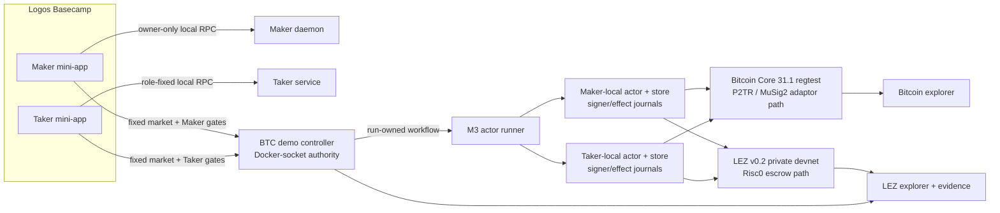
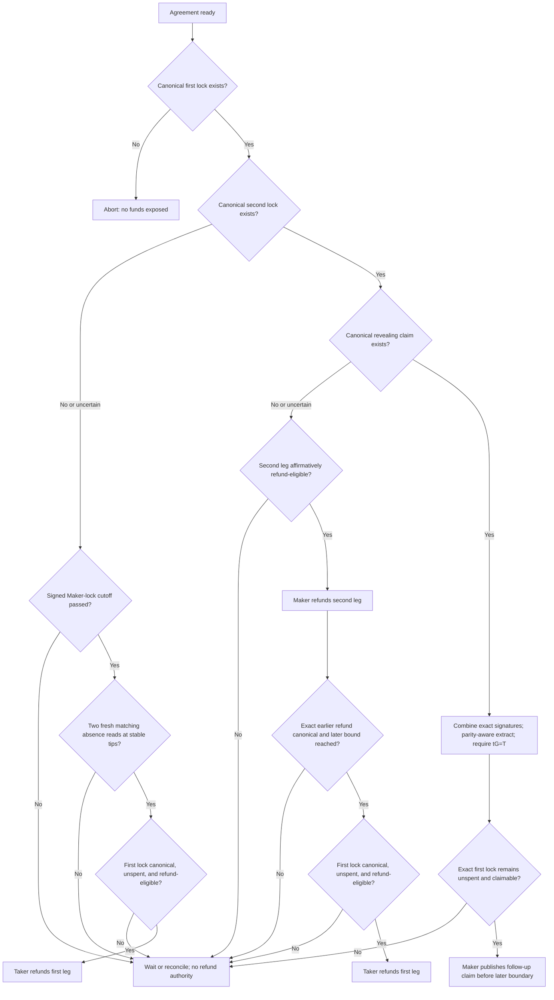

# LEZ/BTC architecture and atomic flow

These diagrams describe the bilateral Bitcoin milestone and the private-local
M3+ product stack on this branch. The construction is a conditional atomic
swap across two independent ledgers; it is not a single cross-chain
transaction.

## Running product stack

The current BTC mini-apps use an owner-local demo controller for the fixed
wallet market and role-gated actions. The controller invokes the run-owned M3
workflow and has Docker-socket authority, so it is trusted local-demo
orchestration outside the production trust/custody design. The current PoC's
Taker first lock is submitted by a run-owned fixture; subsequent transitions
use separate Maker- and Taker-local actors, stores, signer journals, and effect
journals.



Logos Delivery and Chat are architectural discovery/negotiation transports,
but this BTC demo uses the local market controller and does not demonstrate a
live Delivery/Chat BTC route. Once the agreement and recovery material are
persisted, protocol settlement no longer depends on the discovery transport.

## Generic two-leg construction

The role order does not change when the economic direction reverses:

1. The **Taker** funds the first leg, with the later refund deadline.
2. After confirmation, the **Maker** funds the second leg, with the earlier
   refund deadline.
3. The **Taker** claims the second leg by adapting its exact verified
   pre-signature with `t`.
4. The **Maker** combines the canonical final signature with its retained exact
   pre-signature, applies the adaptor scheme's nonce-parity convention,
   requires `tG = T`, and claims the first leg while it remains claimable.

Conceptually, completion uses `s = s′ + εt mod q`, where
`ε ∈ {+1, −1}` is fixed by adapted-nonce parity. Extraction applies the
matching sign and nonce relation, then accepts the result only if `tG = T`;
production code uses the verified `Adapt`/`Ext` operations rather than an
unconditional `t = s − s′` shortcut.

| Direction | First lock, later refund | Second lock, earlier refund | Revealing claim | Follow-up claim |
|---|---|---|---|---|
| Taker sells BTC | BTC by Taker | LEZ by Maker | LEZ by Taker | BTC by Maker |
| Taker sells LEZ | LEZ by Taker | BTC by Maker | BTC by Taker | LEZ by Maker |

## Successful settlement

```mermaid
sequenceDiagram
    participant T as Taker
    participant M as Maker
    participant A as First-leg chain
    participant B as Second-leg chain

    Note over T,M: Persist the countersigned agreement, both verified claim pre-signatures, exact lock plans, and both agreement-bound recovery paths before value is at risk
    T->>A: Fund first leg
    A-->>M: Exact lock reaches required finality
    M->>B: Fund second leg
    B-->>T: Exact lock reaches required finality
    T->>B: Publish claim with adapted final signature
    B-->>M: Exact final signature becomes canonical
    M->>M: Combine with retained pre-signature; parity-aware extract; require tG=T
    A-->>M: Fresh check: exact first lock remains unspent and claimable
    M->>A: Publish follow-up claim using t
    Note over T,M: Both principals transferred; fees reconcile separately
```

For the BTC-for-LEZ run shown in the proposal video, the five public effects
are the Bitcoin first lock, LEZ escrow initialization, LEZ Maker funding, the
Taker's revealing LEZ claim, and the Maker's Bitcoin follow-up claim.

## Abort and refund cases



Pending, ambiguous, moving-tip, or late-present second locks lead to
reconciliation, not first-lock refund. The timeout rule is **maker-funded leg
earlier, taker-funded leg later**. It is not “LEZ always earlier”: when the
Taker sells LEZ, Bitcoin is the Maker-funded second leg and therefore has the
earlier refund path.

## What atomicity means here

Under the protocol assumptions, the construction couples the outcomes:

- Before reveal, abandoning the swap leads to the ordered recovery path when
  the required authorized actors or survivor processes execute each eligible
  transition.
- A canonical revealing claim plus the Maker's retained exact pre-signature
  provides the witness needed for the other claim without further Taker
  cooperation.
- Exact agreement binding, chain identity checks, transaction-byte checks,
  monotonic revisions, and at-most-once effect journaling reject stale,
  malformed, or replayed transitions.

The guarantee remains conditional on operational liveness and ledger
assumptions:

- `t` remains role-private only until the revealing transaction is published.
  A holder of the related pre-signature can extract it from a pending or later
  reorganized signature, so both locks must be canonical before publication
  and the Maker must wait for exact canonical reveal evidence before acting.
  Private keys and secret nonces remain secret; public nonces, commitments,
  partials, and verified pre-signatures are exchanged during setup.
- Both roles need durable agreement/recovery state and usable chain access.
- A fresh Maker-controlled process with the Maker's role-local state and signer
  journals must prove the remaining leg is still claimable and obtain
  follow-up inclusion before the later refund boundary.
- Fee policy and the deadline margin must remain sufficient under congestion.
- Confirmation thresholds assume no deeper reorganization than the selected
  finality policy.

This is the M3 engineering-security argument, not a formal proof of the exact
two-party MuSig2 adaptor composition; independent cryptographic review remains
an M7 gate. LEZ claims end at the exclusive `refund_at` boundary and refunds
begin there inclusively. Bitcoin differs: its Taproot key-path claim does not
expire, so after CSV maturity claim and refund compete for the same outpoint.
Miner ordering decides that boundary race; the protocol's normal safety window
does not promise fairness once it has expired.

See [ADR 0050](architecture/0050-map-btc-adaptor-construction-to-security-properties.md)
for the construction-to-property mapping and the
[M3 operator guide](m3-local-poc-operator-guide.md) for exact recovery tables,
confirmation rules, and evidence boundaries.
