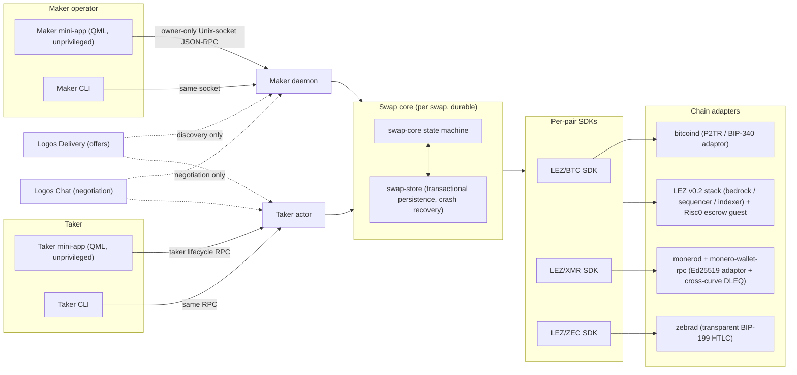
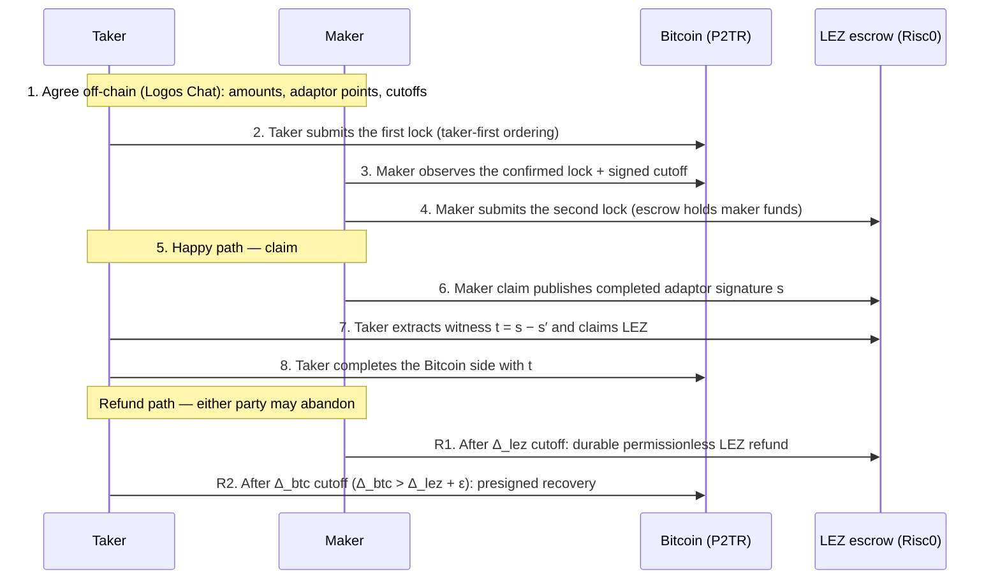

# M3+ minimal diagrams

Three artefacts: the component architecture, the swap flow, and the atomicity
argument. Everything here is grounded in the shipped code on this branch:
`apps/basecamp` (real Basecamp packages), `apps/m6-prototypes` (HTML
prototypes), and the M3+ operator guide in `docs/m3-local-poc-operator-guide.md`.

## Architecture

Unprivileged QML views drive a process-isolated C++ backend that may only call
a fixed role allowlist over an owner-only Unix socket. Everything after the
first on-chain lock is driven purely from chain evidence; Delivery and Chat are
discovery/negotiation-only.

After the first lock is submitted the dashed links may disappear permanently:
claims and refunds are driven from persisted local state plus the chain nodes
only.

## Swap flow (adaptor legs, BTC shown; XMR analogous)

Taker-first ordering is enforced: the maker does not lock until the taker's
on-chain transaction is confirmed (Reliability 1).

The ZEC leg replaces adaptor machinery with a SHA-256 HTLC on both sides
(BIP-199 on the transparent pool; preimage reveal on claim). The two cutoffs
keep the same strict ordering: the Zcash refund deadline succeeds the LEZ
deadline by a documented safety margin.

## Atomicity

The invariant: no reachable state exists where one party holds both legs
(Functionality 6). Three mechanisms deliver it:

1. **Witness-coupled claims.** The LEZ escrow only releases on a completed
   adaptor signature (BIP-340) whose public form is bound to the same secret
   that unlocks the foreign leg. Whoever claims on LEZ necessarily publishes
   the material the counterparty needs to finish the foreign claim
   (extraction `t = s − s′`). On the ZEC leg the same coupling is the hash
   preimage: claiming requires revealing it.

2. **Taker-first lock ordering.** The maker's funds move only after the
   taker's on-chain lock is confirmed, so a non-responsive taker can never
   strand maker funds in a half-open swap.

3. **Strictly ordered timelocks.** Each leg carries a refund cutoff with
   `Δ_foreign > Δ_lez + ε`, and refunds are durable + permissionless: after
   the cutoff each party reclaims from its own leg using only local state and
   the chain. Because the foreign cutoff strictly succeeds the LEZ cutoff,
   the party that could still claim on LEZ has already had its window to
   extract the witness close, so "one side claimed, other side stuck" is not
   reachable.

Net effect, in the Aumayr et al. (2021) framing used by the proposal: the
construction provides witness extractability of the completed signature and
pre-signature adaptability, so any completed claim leaks the witness, and any
abandoned swap decays into two independent refunds rather than a unilateral
transfer.
