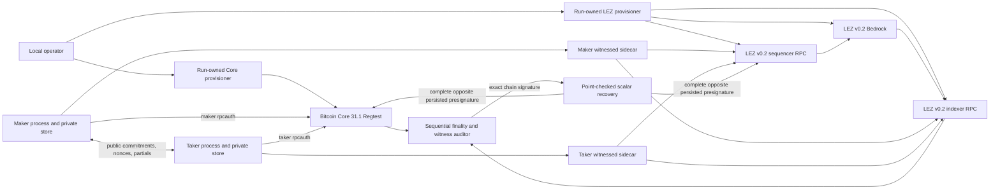

# M3 local LEZ/BTC PoC operator guide

Last verified: 2026-07-15

This guide reproduces the operator-composed M3 happy path proved by private
local run m3poc-live2-20260715a. It uses Bitcoin Core 31.1 Regtest, the pinned
LEZ v0.2 Bedrock/sequencer/indexer stack, the checked witnessed-escrow guest,
independent maker and taker sidecars, separate signing journals, and actual
transactions on both local chains.

This is a functional PoC recipe, not an automated full-lifecycle application.
The public `btc-reference-actor` now provides one-shot, role-fixed activation,
offline status, and direction-derived taker- and maker-lock observation/projection
through revision two. It does not yet perform claim revisions three and four,
so the operator must still compose the proven signing, lock submission, claim,
and terminal interfaces and retain their
private evidence. That remaining manual composition is a production gap, not a
reason to weaken any ordering check below.

The secret-safe result of the reference run is
[m3-local-two-direction-poc-20260715.json](evidence/m3-local-two-direction-poc-20260715.json).
It records two completed directions, exact public transaction and block
identities, one Bitcoin confirmation per effect, finalized LEZ inclusion, exact
chain-witness equality, terminal recipients, and the explicit production
nonclaims. Do not publish a private run root: it contains keys, capabilities,
SQLite journals, exact signed transactions, and complete signatures.

## Topology and trust boundary

Every listener is a dynamic literal-loopback endpoint. The Core P2P port is not
published, network activity is disabled, and the retained run had zero peers.
LEZ uses one run-owned Docker network with no public provider. Runtime funds are
deterministic Regtest coinbase outputs and deterministic local genesis Vault
allocations. No public RPC, faucet, public peer, or public fund participates.

## Prerequisites and builds

Repeat both public actor funding transitions without Docker or chain nodes:

~~~sh
cargo test --locked -p btc-reference-actor --all-targets
~~~

All 18 focused tests invoke the public `activate`, `drive`, and `status` surface,
use separate private maker/taker configs, prove offline status and idempotent
activation, retain a finalized LEZ ancestry tip, and observe before projecting
predecessors zero and one in both directions and roles. Deterministic observers and loopback-only placeholder routes
are used; no public RPC, faucet, public funds, chain peer, or external service
participates. This component gate does not prove an actual-node actor run or
claim revisions three and four.

Before starting either node, the durable Bitcoin lifecycle component can be
repeated independently:

~~~sh
cargo test --locked -p lez-swap-store --test btc_recovery -- --nocapture
~~~

The eleven cases create separate owner-private temporary SQLite databases for
maker and taker, project both directions through the four exact revisions,
close/reopen and reconstruct `Completed`, exercise replay/CAS/rollback and
mutation failures, and scan SQLite/WAL for the recovered-scalar sentinel. They
use synthetic evidence that represents already-validated chain-adapter output;
there is no RPC, node, Docker container, faucet, public endpoint, or external
availability dependency in this component gate. It does not substitute for
the still-pending reference-actor run through actual nodes.

Repeat the agreement-derived signing context and the new recovery seams:

~~~sh
cargo test --locked -p lez-btc-swap-sdk --test agreement_v1 \
  validated_agreement_derives_both_fresh_adaptor_session_contexts -- --exact
cargo test --locked -p lez-swap-store --test adaptor_session_journal \
  existing_only_open_never_creates_a_missing_signer_database -- --exact
cargo test --locked -p lez-swap-store --test public_effect_journal -- --nocapture
~~~

The future claim actor retains distinct nonzero Bitcoin and LEZ session IDs and
role-local journal paths. It rederives keys, role order, messages, adaptor point,
and the Bitcoin Taproot tweak from the countersigned agreement, then requires
the existing journal identities to match. The role-runner session JSON is
manual ceremony input, not actor authority. Claim composition is still pending.

The twelve public-effect tests persist complete node-disclosable Bitcoin or LEZ
transaction bytes before authorization. Only definitive `Absent + Prepared`
commits `Started` and grants one send. A crash before or after that RPC never
re-arms `Started`; `Uncertain` and `Unknown` are observation-only. Exact
presence may reconcile `Prepared`, `Started`, or `Unknown` to `Accepted`.
Byte or effect-ID drift and contradictory terminal evidence fail closed. This
is a temporary-SQLite component gate with no RPC, Docker, faucet, peer, or
network, not an actor/submission E2E. “Public” describes node-disclosable bytes,
not an endpoint. Zcash is excluded by the typed chain enum, but raw bytes are not
secret-scanned; callers must never put secret-bearing material in this journal.

Repeat the typed Bitcoin Core boundary independently:

~~~sh
cargo test --locked -p lez-btc-core-adapter --all-targets
~~~

These 18 tests exercise the exact Core 31.1 typed DTOs, consensus-byte
cross-checks, stable-tip funding/claim observation, canonical scalar-free
evidence, wtxid/raw-byte-bound one-attempt submission semantics, already-known
and conflicting-witness outcomes, and a bounded authenticated
loopback HTTP server. They use deterministic RPC doubles and ephemeral loopback
servers, not the Dockerized Core service, a faucet, a public RPC, or public
funds. Actual service-mode actor integration remains a separate composed gate.

Repeat exact-ID and peerless finalized LEZ funding and claim observation
independently:

~~~sh
cargo test --locked -p lez-bridge-protocol --all-targets
cargo test --locked -p lez-bridge-client --all-targets
cargo +1.96.0 test --locked --manifest-path compat/lez-v0_2-sidecar/Cargo.toml --all-targets
~~~

The peerless cases omit the funding or completed-claim transaction ID and
discover one canonical public transaction from the pinned program,
terms-derived accounts, roles, aggregate authority, and bounded finalized
window. Funding requires canonical `FundNative`, historical `Funded` metadata,
and exact custody at its containing block before claim. Claim additionally
binds the exact prepared transcript and signature. They prove unique success
plus distinct absence, ambiguity, and conflicting-transcript failures through
the authenticated server/runtime path. Protocol 22/22, client 2 unit plus 23
integration and 3 CLI tests, and sidecar 78/78 are GREEN.
The public `validate_prepared_witnessed_claim` unit boundary checks only that
the message is nonempty and its bytes match the official domain-separated hash.
It performs no RPC and does not prove the signature, accounts, transcript,
inclusion, finality, or other chain truth.
The tests use deterministic in-process indexer doubles and ephemeral loopback
servers; they do not contact the local devnet or any public resource. The
manual flow below repeats the same request against the retained local indexer.

Repeat the agreement-to-signer and crash-safe public-effect boundaries without
any node, Docker service, faucet, peer, or network:

~~~sh
cargo test --locked -p lez-btc-swap-sdk --test agreement_v1 \
  validated_agreement_derives_both_fresh_adaptor_session_contexts -- --exact
cargo test --locked -p lez-swap-store --test adaptor_session_journal \
  existing_only_open_never_creates_a_missing_signer_database -- --exact
cargo test --locked -p lez-swap-store --test public_effect_journal -- --nocapture
~~~

The first two gates prove that the actor can reconstruct both exact signing
contexts from the countersigned agreement and cannot manufacture a missing
signer database. The public-effect tests use temporary SQLite only. They prove
durable complete public transaction bytes, one send authorization, and
observe-only ambiguous recovery as a component boundary; they do not prove an
actor RPC submission. `public` here means node-disclosable Bitcoin or LEZ
transaction bytes, not a public endpoint. Secret-bearing Zcash material is
excluded by type, and callers must still prevent other secrets from entering
the journal because its byte field is intentionally not a secret scanner.

Run from the repository root. Use a clean or intentionally reviewed worktree
and a fresh composed identifier:

~~~sh
export M3_RUN_ID=m3-manual-$(date -u +%Y%m%d%H%M%S)
export CORE_RUN_ID="${M3_RUN_ID}-core"
export LEZ_RUN_ID="${M3_RUN_ID}-lez"
export BUILD_RUN_ID="${M3_RUN_ID}-artifact"
export PRIVATE_ROOT="${TMPDIR:-/tmp}/lez-m3-${M3_RUN_ID}"
umask 077
install -d -m 0700 "$PRIVATE_ROOT" "$PRIVATE_ROOT/evidence"
~~~

One composed ID deliberately produces service-qualified Docker RUN_ID values.
The two retained-service scripts cannot safely receive an identical literal
RUN_ID at the same time: both reject any existing container carrying that run
label. CORE_RUN_ID and LEZ_RUN_ID preserve one composed lineage while avoiding
that intentional collision. Do not bypass either script's reuse check.

Required host tools include Bash, Rust/Cargo, Docker with Compose, curl, jq,
OpenSSL, sha256sum, xxd, a C toolchain, libclang, GPG, and the tools checked by
the three repository scripts below. The LEZ v0.2 path uses Rust 1.96.0, Risc0
3.0.5, the pinned guest builder, and locally verified Rapidsnark/GMP libraries.
A cold machine may need network access to populate signed Bitcoin release
material, Cargo/git sources, the digest-pinned Risc0 image, and the
checksum-pinned Logos circuits archive. Runtime execution after those caches
are warm has no external network dependency.

Build the root one-shot tools:

~~~sh
cargo build --locked -p lez-adaptor-role-runner
cargo build --locked -p btc-reference-actor
cargo build --locked -p lez-btc-swap-sdk --example btc-core-p2tr-fixture
cargo build --locked -p lez-bridge-client --example m3_witnessed_lez_operator
export ROLE_RUNNER="$PWD/target/debug/lez-adaptor-role-runner"
export BTC_ACTOR="$PWD/target/debug/btc-reference-actor"
export BTC_FIXTURE="$PWD/target/debug/examples/btc-core-p2tr-fixture"
export LEZ_OPERATOR="$PWD/target/debug/examples/m3_witnessed_lez_operator"
~~~

Build the official-wire sidecar and Vault Claim binaries in an isolated target.
Use the same verified Rapidsnark directory used by the full verifier:

~~~sh
export RAPIDSNARK_LIB_DIR=/absolute/path/to/verified/rapidsnark-v0.0.8-libraries
export BINDGEN_EXTRA_CLANG_ARGS=-I/usr/lib/gcc/x86_64-linux-gnu/13/include
export SIDECAR_TARGET="${TMPDIR:-/tmp}/lez-v02-sidecar-${BUILD_RUN_ID}"
CARGO_TARGET_DIR="$SIDECAR_TARGET" CARGO_NET_OFFLINE=true cargo +1.96.0 build --locked --offline --manifest-path compat/lez-v0_2-sidecar/Cargo.toml --bin lez-v02-bridge-poc --bin lez-v02-vault-claim-poc --example lez-v02-local-actor-identity
export BRIDGE_BIN="$SIDECAR_TARGET/debug/lez-v02-bridge-poc"
export VAULT_BIN="$SIDECAR_TARGET/debug/lez-v02-vault-claim-poc"
export IDENTITY_PROVISIONER="$SIDECAR_TARGET/debug/examples/lez-v02-local-actor-identity"
~~~

If the offline build reports a missing crate, git source, circuit, or native
library, populate it through the full pinned verifier rather than removing
locked/offline flags.

Provision fresh official LEZ actor identities before creating the LEZ genesis.
The helper accepts only new output directories, sources keys from the OS random
generator, writes `lez-signer.key` and `identity.json` under owner-only
permissions, and prints only the public descriptor:

~~~sh
"$IDENTITY_PROVISIONER" --output-directory "$PRIVATE_ROOT/maker" >"$PRIVATE_ROOT/evidence/maker-public-identity.json"
"$IDENTITY_PROVISIONER" --output-directory "$PRIVATE_ROOT/taker" >"$PRIVATE_ROOT/evidence/taker-public-identity.json"
chmod 0600 "$PRIVATE_ROOT/evidence/"*-public-identity.json
export LEZ_V02_MAKER_ACCOUNT_ID="$(jq -er '.account_id' "$PRIVATE_ROOT/maker/identity.json")"
export LEZ_V02_TAKER_ACCOUNT_ID="$(jq -er '.account_id' "$PRIVATE_ROOT/taker/identity.json")"
test "$LEZ_V02_MAKER_ACCOUNT_ID" != "$LEZ_V02_TAKER_ACCOUNT_ID"
~~~

Never print either signer file. The provisioner refuses an existing output
path instead of reusing or overwriting an identity. Its account IDs are public
and are the exact values that the stack must place in genesis.

## Start both retained local chains

Use separate terminals. Start Core in service mode and retain it:

~~~sh
RUN_ID="$CORE_RUN_ID" BITCOIN_CORE_E2E_MODE=service BITCOIN_CORE_E2E_KEEP_RUNNING=1 BITCOIN_CORE_E2E_REQUIRE_CLEAN=0 ./scripts/run-bitcoin-core-e2e.sh
~~~

Require the service evidence to report Core 31.1, Regtest height 101, zero
peers, networkactive false, synced txindex and txospenderindex, a mature
5,000,000,000-sat local output, distinct maker/taker rpcauth files, and a
literal-loopback RPC.

Start and retain the exact LEZ v0.2 stack:

~~~sh
RUN_ID="$LEZ_RUN_ID" LEZ_V02_KEEP_RUNNING=1 \
  LEZ_V02_MAKER_ACCOUNT_ID="$LEZ_V02_MAKER_ACCOUNT_ID" \
  LEZ_V02_TAKER_ACCOUNT_ID="$LEZ_V02_TAKER_ACCOUNT_ID" \
  ./scripts/run-lez-v02-stack.sh
~~~

Require three run-owned services, an advancing signed channel, a non-genesis
finalized indexer tip, equal sequencer/indexer block identity at the readiness
height, and distinct maker/taker owner and Vault allocations. KEEP_RUNNING does
not make service readiness an actor-funding claim.

In the operator terminal, hand off only through the run-owned manifests:

~~~sh
export CORE_RUN_DIR="$PWD/.e2e/$CORE_RUN_ID/bitcoin-core"
export LEZ_RUN_DIR="$PWD/.e2e/$LEZ_RUN_ID/lez-v02"
test -f "$CORE_RUN_DIR/run.env"
test -f "$LEZ_RUN_DIR/run.env"
. "$CORE_RUN_DIR/run.env"
export CORE_RPC_URL="$BITCOIN_CORE_RPC_URL"
export MAKER_CORE_CONFIG="$BITCOIN_CORE_MAKER_CURL_CONFIG"
export TAKER_CORE_CONFIG="$BITCOIN_CORE_TAKER_CURL_CONFIG"
export MAKER_CORE_BASIC="$BITCOIN_CORE_MAKER_BASIC_CREDENTIALS"
export TAKER_CORE_BASIC="$BITCOIN_CORE_TAKER_BASIC_CREDENTIALS"
export CORE_FUNDING_FILE="$BITCOIN_CORE_FUNDING_CREDENTIALS"
. "$LEZ_RUN_DIR/run.env"
export SEQUENCER_URL="$LEZ_SEQUENCER_RPC_URL"
export INDEXER_URL="$LEZ_INDEXER_RPC_URL"
export BEDROCK_URL="$BEDROCK_RPC_URL"
export LEZ_CHAIN_ID="$LEZ_V02_CHANNEL_PUBLIC_KEY"
test "$LEZ_V02_MAKER_ACCOUNT_ID" = "$(jq -er '.account_id' "$PRIVATE_ROOT/maker/identity.json")"
test "$LEZ_V02_TAKER_ACCOUNT_ID" = "$(jq -er '.account_id' "$PRIVATE_ROOT/taker/identity.json")"
~~~

Never print or commit either curl config, Basic credential file, or the Core
funding credential file. The typed adapter consumes the role's Basic file and
never the provisioner's cookie or funding authority. Both Basic files must be
distinct owner-private regular files; the adapter rejects permissions other
than `0600`, hard links, symlinks, and file replacement or change while reading.
Read only the public txid, vout, value, and mining address fields needed by the
fixture. The same file also contains a local test secret.

## Verify and deploy the exact M3 guest

The full verifier is the authoritative build, test, lint, rustdoc, dependency,
and artifact-identity gate:

~~~sh
export LEZ_V02_ARTIFACT_TARGET_DIR="${TMPDIR:-/tmp}/lez-v02-artifact-${BUILD_RUN_ID}"
RUN_ID="$BUILD_RUN_ID" LEZ_V02_ARTIFACT_TARGET_DIR="$LEZ_V02_ARTIFACT_TARGET_DIR" RAPIDSNARK_LIB_DIR="$RAPIDSNARK_LIB_DIR" BINDGEN_EXTRA_CLANG_ARGS="$BINDGEN_EXTRA_CLANG_ARGS" ./scripts/verify-lez-v02-provisional.sh
export DEPLOYER="$LEZ_V02_ARTIFACT_TARGET_DIR/debug/lez-zec-escrow-v02-deployer"
~~~

Require ELF SHA-256
a199c5be062adcb27cf63c62d9f5688b37058b4699ce7e1767fd26eeceb5e293
and ImageID/ProgramId
39b6a4db85374de9359ea82164ef415019919475f656d597c5ab2231bc104dec.
The verifier must finish all guest, methods, deployer, Clippy, rustdoc, source,
feature, license, and advisory-policy checks.

Deploy once to the explicit local sequencer:

~~~sh
install -d -m 0700 "$PRIVATE_ROOT/deployment"
"$DEPLOYER" deploy-local --rpc-url "$SEQUENCER_URL" --channel-id "$LEZ_CHAIN_ID" --timeout-seconds 300 >"$PRIVATE_ROOT/deployment/deployment.json"
chmod 0600 "$PRIVATE_ROOT/deployment/deployment.json"
export ESCROW_PROGRAM_ID="$(jq -er '.preflight.image_id' "$PRIVATE_ROOT/deployment/deployment.json")"
jq -e --arg expected 39b6a4db85374de9359ea82164ef415019919475f656d597c5ab2231bc104dec '.preflight.image_id == $expected and .transaction_hash != null and .inclusion_block_id > 0 and .inclusion_block_hash != null' "$PRIVATE_ROOT/deployment/deployment.json" >/dev/null
~~~

deploy-local performs one submission attempt. If it times out or returns an
ambiguous failure after possible I/O, do not run it again on that chain.
Inspect the exact transaction through the sequencer and indexer. If its state
cannot be proved, abandon this chain and start a fresh service-qualified run.

Independently prove deployment finality through the indexer, sequentially:

~~~sh
rpc() {
  curl --fail --silent --show-error --connect-timeout 2 --max-time 30 -H 'content-type: application/json' --data "$2" "$1"
}
DEPLOY_TX="$(jq -er '.transaction_hash' "$PRIVATE_ROOT/deployment/deployment.json")"
DEPLOY_BLOCK="$(jq -er '.inclusion_block_id' "$PRIVATE_ROOT/deployment/deployment.json")"
DEPLOY_HASH="$(jq -er '.inclusion_block_hash' "$PRIVATE_ROOT/deployment/deployment.json")"
rpc "$INDEXER_URL" '{"jsonrpc":"2.0","id":1,"method":"getLastFinalizedBlockId","params":[]}' >"$PRIVATE_ROOT/deployment/finalized-tip.json"
jq -e --argjson block "$DEPLOY_BLOCK" '.result >= $block' "$PRIVATE_ROOT/deployment/finalized-tip.json" >/dev/null
rpc "$INDEXER_URL" "$(jq -cn --argjson block "$DEPLOY_BLOCK" '{jsonrpc:"2.0",id:1,method:"getBlockById",params:[$block]}')" >"$PRIVATE_ROOT/deployment/block-by-id.json"
rpc "$INDEXER_URL" "$(jq -cn --arg hash "$DEPLOY_HASH" '{jsonrpc:"2.0",id:1,method:"getBlockByHash",params:[$hash]}')" >"$PRIVATE_ROOT/deployment/block-by-hash.json"
jq -e --arg tx "$DEPLOY_TX" --arg hash "$DEPLOY_HASH" --argjson block "$DEPLOY_BLOCK" '.result.header.block_id == $block and .result.header.hash == $hash and .result.bedrock_status == "Finalized" and ([.result.body.transactions[] | select(.Public.hash == $tx)] | length) == 1' "$PRIVATE_ROOT/deployment/block-by-id.json" >/dev/null
test "$(jq -S -c '.result' "$PRIVATE_ROOT/deployment/block-by-id.json")" = "$(jq -S -c '.result' "$PRIVATE_ROOT/deployment/block-by-hash.json")"
~~~

Do not parallelize indexer block reads. The retained run saw intermittent local
timeouts under parallel heavy reads.

## Deterministic local Vault onboarding

The stack allocates funds to each actor's Vault, not directly to its owner
account. Both Vault Claims must be finalized before preparing either swap
transcript.

The fresh identities provisioned before stack startup already match the maker
and taker account IDs emitted in the LEZ run manifest. Keep those signer files
inside the private run root and create only the role-local state directories:

~~~sh
install -d -m 0700 "$PRIVATE_ROOT/maker/vault-state" "$PRIVATE_ROOT/taker/vault-state"
test "$(stat -c '%a' "$PRIVATE_ROOT/maker/lez-signer.key")" = 600
test "$(stat -c '%a' "$PRIVATE_ROOT/taker/lez-signer.key")" = 600
~~~

Run each Claim in a separate role process. The CLI durably records
AttemptStarted before one generated-RPC submission and reports only Admitted,
Rejected, Unknown, or observe-only replay. Never blind-retry Unknown.

~~~sh
"$VAULT_BIN" --role maker --run-id "$M3_RUN_ID" --request-id maker-vault-claim-001 --state-directory "$PRIVATE_ROOT/maker/vault-state" --private-key-file "$PRIVATE_ROOT/maker/lez-signer.key" --sequencer-url "$SEQUENCER_URL" --chain-id "$LEZ_CHAIN_ID" --escrow-program-id "$ESCROW_PROGRAM_ID" --allocation 100000 >"$PRIVATE_ROOT/evidence/maker-vault-claim.json"
"$VAULT_BIN" --role taker --run-id "$M3_RUN_ID" --request-id taker-vault-claim-001 --state-directory "$PRIVATE_ROOT/taker/vault-state" --private-key-file "$PRIVATE_ROOT/taker/lez-signer.key" --sequencer-url "$SEQUENCER_URL" --chain-id "$LEZ_CHAIN_ID" --escrow-program-id "$ESCROW_PROGRAM_ID" --allocation 200000 >"$PRIVATE_ROOT/evidence/taker-vault-claim.json"
chmod 0600 "$PRIVATE_ROOT/evidence/"*-vault-claim.json
jq -e '.submission.decision == "admitted" and .durable_state == "admitted" and .before.owner.balance == 0 and .before.vault.balance == .allocation' "$PRIVATE_ROOT/evidence/maker-vault-claim.json" >/dev/null
jq -e '.submission.decision == "admitted" and .durable_state == "admitted" and .before.owner.balance == 0 and .before.vault.balance == .allocation' "$PRIVATE_ROOT/evidence/taker-vault-claim.json" >/dev/null
~~~

For each returned transaction ID, apply the sequential finality recipe below.
At that exact finalized block query getAccountAtBlock with the base58 owner and
Vault IDs from run.env. Require owner balance equal to its allocation, owner
nonce 1, authenticated-transfer program ownership, Vault balance 0, and Vault
nonce 0. The indexer account API expects base58 account IDs; the sequencer and
bridge protocol use their canonical hex forms. Do not interchange them.

## Create role runtimes and start sidecars

Query indexer block zero once and save its hash:

~~~sh
rpc "$INDEXER_URL" '{"jsonrpc":"2.0","id":1,"method":"getBlockById","params":[0]}' >"$PRIVATE_ROOT/evidence/lez-genesis.json"
export LEZ_GENESIS_HASH="$(jq -er '.result.header.hash' "$PRIVATE_ROOT/evidence/lez-genesis.json")"
export MAKER_ACCOUNT_HEX="$(jq -er '.before.owner.account_id' "$PRIVATE_ROOT/evidence/maker-vault-claim.json")"
export TAKER_ACCOUNT_HEX="$(jq -er '.before.owner.account_id' "$PRIVATE_ROOT/evidence/taker-vault-claim.json")"
~~~

Create strict public runtime descriptors and private capabilities:

~~~sh
for role in maker taker; do
  openssl rand -hex 32 >"$PRIVATE_ROOT/$role/sidecar.capability"
  chmod 0600 "$PRIVATE_ROOT/$role/sidecar.capability"
  install -d -m 0700 "$PRIVATE_ROOT/$role/bridge-state"
done
jq -n --arg chain "$LEZ_CHAIN_ID" --arg genesis "$LEZ_GENESIS_HASH" --arg program "$ESCROW_PROGRAM_ID" --arg signer "$MAKER_ACCOUNT_HEX" '{sidecar_role:"maker",compatibility:"lee_v0_2_0",chain_id:$chain,channel_id:$chain,genesis_block_hash:$genesis,escrow_program_id:$program,signer_account_id:$signer}' >"$PRIVATE_ROOT/maker/runtime.json"
jq -n --arg chain "$LEZ_CHAIN_ID" --arg genesis "$LEZ_GENESIS_HASH" --arg program "$ESCROW_PROGRAM_ID" --arg signer "$TAKER_ACCOUNT_HEX" '{sidecar_role:"taker",compatibility:"lee_v0_2_0",chain_id:$chain,channel_id:$chain,genesis_block_hash:$genesis,escrow_program_id:$program,signer_account_id:$signer}' >"$PRIVATE_ROOT/taker/runtime.json"
chmod 0600 "$PRIVATE_ROOT/maker/runtime.json" "$PRIVATE_ROOT/taker/runtime.json"
export AUTH_TRANSFER_PROGRAM_ID=dcbbfebcd59399961ed9973b8307dc475fd4c5ca5779aacfe7588f7dbc3f4a71
~~~

Reserve two unused loopback ports. The reference run used 32857 and 32858, but
they are evidence, not defaults. Start one role per terminal and record its PID
and readiness line:

~~~sh
export MAKER_LISTEN=127.0.0.1:<fresh-maker-port>
export TAKER_LISTEN=127.0.0.1:<fresh-taker-port>
export MAKER_BRIDGE_URL="http://$MAKER_LISTEN/"
export TAKER_BRIDGE_URL="http://$TAKER_LISTEN/"
"$BRIDGE_BIN" --listen-address "$MAKER_LISTEN" --node-profile local --sequencer-url "$SEQUENCER_URL" --indexer-url "$INDEXER_URL" --run-id "$M3_RUN_ID" --runtime-file "$PRIVATE_ROOT/maker/runtime.json" --capability-file "$PRIVATE_ROOT/maker/sidecar.capability" --private-key-file "$PRIVATE_ROOT/maker/lez-signer.key" --state-directory "$PRIVATE_ROOT/maker/bridge-state" --authenticated-transfer-program-id "$AUTH_TRANSFER_PROGRAM_ID"
~~~

Run the analogous command with taker paths and TAKER_LISTEN in the other
terminal. Each must emit one ready JSON line whose role, run ID, endpoint, and
runtime match, whose indexer health is getLastFinalizedBlockId_non_genesis, and
whose finality field is not_observed_by_this_poc_bridge. Sidecar observation
proves bounded canonical inclusion and stable same-tip account effects. It does
not prove Bedrock finality; the separate indexer audit remains mandatory.

## Repeat the two-lock reference-actor flow

The actor consumes an already canonical countersigned Borsh agreement; it does
not negotiate or create one. Retain that exact agreement as
`$DIRECTION/agreement.borsh`, and require its Bitcoin genesis, confirmation
policy, LEZ channel/genesis/program/accounts, direction, and swap terms to match
the run artifacts below. Use different state databases, role Basic files,
capabilities, runtimes, and configs for maker and taker.

This recipe is chronological only after the exact LEZ claim has been prepared
and both fresh-process signing ceremonies below have reached verified
presignatures, but still before the first chain submission. Preparation uses
the deterministic planned LEZ funding transaction ID, so it need not wait for
that transaction to be submitted. Return here after completing direction step
4 for `TakerSellsForeign` or step 3 for `TakerSellsLez`.

Create strict private schema-2 configs only with normalized absolute paths.
`cookie_file` must point to the role's restricted Basic file, never the
provisioner cookie or funding/mining credential. Each config binds its own
existing Bitcoin and LEZ signer journal, the two distinct nonzero session IDs,
and the complete persisted `{context,claim}` prepare result—not only its
`.claim` member. The taker config additionally requires the owner-only adaptor
scalar; the maker config must omit it:

~~~sh
: "${DIRECTION:?set the private direction root}"
: "${ACTOR_DISCOVERY_START_HEIGHT:?inclusive finalized LEZ window start}"
: "${ACTOR_DISCOVERY_MAX_BLOCKS:?complete covered window length}"
test "$ACTOR_DISCOVERY_MAX_BLOCKS" -ge 1
test "$ACTOR_DISCOVERY_MAX_BLOCKS" -le 4096
export AGREEMENT_FILE="$(realpath "$DIRECTION/agreement.borsh")"
export ACTOR_ACCEPTED_AT="$(date -u +%s)"
: "${BTC_SESSION_ID:?retain the 64-hex Bitcoin session ID}"
: "${LEZ_SESSION_ID:?retain the 64-hex LEZ session ID}"
test "${#BTC_SESSION_ID}" -eq 64
test "${#LEZ_SESSION_ID}" -eq 64
test "$BTC_SESSION_ID" != "$LEZ_SESSION_ID"
test -s "$DIRECTION/prepared-claim.json"

write_actor_config() {
  local role="$1"
  local core_basic="$2"
  local bridge_url="$3"
  local runtime="$PRIVATE_ROOT/$role/runtime.json"
  local capability="$PRIVATE_ROOT/$role/sidecar.capability"
  local state_db="$DIRECTION/$role-btc-actor.sqlite3"
  local config="$DIRECTION/$role-btc-actor.json"
  local btc_journal="$DIRECTION/$role/btc-journal.sqlite"
  local lez_journal="$DIRECTION/$role/lez-journal.sqlite"
  local prepared_result="$DIRECTION/prepared-claim.json"
  local adaptor_secret=""

  test ! -e "$state_db"
  test -s "$btc_journal"
  test -s "$lez_journal"
  test -s "$prepared_result"
  case "$role" in
    taker)
      test -s "$DIRECTION/taker/adaptor-secret.key"
      adaptor_secret="$(realpath "$DIRECTION/taker/adaptor-secret.key")"
      ;;
    maker)
      test ! -e "$DIRECTION/maker/adaptor-secret.key"
      ;;
    *) return 2 ;;
  esac
  jq -n \
    --arg role "$role" \
    --arg agreement "$AGREEMENT_FILE" \
    --arg state "$(realpath -m "$state_db")" \
    --argjson accepted "$ACTOR_ACCEPTED_AT" \
    --arg core "$CORE_RPC_URL" \
    --arg basic "$(realpath "$core_basic")" \
    --arg bridge "$bridge_url" \
    --arg capability "$(realpath "$capability")" \
    --arg run "$M3_RUN_ID" \
    --argjson timeout 10000 \
    --argjson start "$ACTOR_DISCOVERY_START_HEIGHT" \
    --argjson blocks "$ACTOR_DISCOVERY_MAX_BLOCKS" \
    --arg btc_session "$BTC_SESSION_ID" \
    --arg btc_journal "$(realpath "$btc_journal")" \
    --arg lez_session "$LEZ_SESSION_ID" \
    --arg lez_journal "$(realpath "$lez_journal")" \
    --arg prepared_result "$(realpath "$prepared_result")" \
    --arg adaptor_secret "$adaptor_secret" \
    --slurpfile runtime "$runtime" \
    '{
      schema_version: 2,
      role: $role,
      agreement_file: $agreement,
      state_db: $state,
      accepted_at_unix_seconds: $accepted,
      bitcoin_core: {
        endpoint: $core,
        cookie_file: $basic,
        connectivity: "isolated_local"
      },
      lez_bridge: {
        endpoint: $bridge,
        capability_file: $capability,
        run_id: $run,
        runtime: $runtime[0],
        request_timeout_millis: $timeout,
        discovery_start_height: $start,
        discovery_max_blocks: $blocks
      },
      signing: ({
          bitcoin: {
            session_id: $btc_session,
            journal_db: $btc_journal
          },
          lez: {
            session_id: $lez_session,
            journal_db: $lez_journal
          },
          prepared_witnessed_claim_result_file: $prepared_result
        } + (if $role == "taker"
             then {adaptor_secret_file: $adaptor_secret}
             else {}
             end))
    }' >"$config"
  chmod 0600 "$config"
}

write_actor_config maker "$MAKER_CORE_BASIC" "$MAKER_BRIDGE_URL"
write_actor_config taker "$TAKER_CORE_BASIC" "$TAKER_BRIDGE_URL"
export MAKER_BTC_ACTOR_CONFIG="$DIRECTION/maker-btc-actor.json"
export TAKER_BTC_ACTOR_CONFIG="$DIRECTION/taker-btc-actor.json"
~~~

The single LEZ discovery window is used by whichever direction-derived funding
transition observes LEZ. Choose an inclusive window that the finalized tip
can
fully cover and that will contain the funding transaction. Before funding
exists, the v0.2 finalized observer commonly returns an absence/window error;
the actor reports `actor first-lock observation is unavailable`. Treat that as
retryable local observation unavailability, not proof that funding is absent
and never as authorization to submit a replacement effect.

An exact retry uses the unchanged private config, deterministic observation ID,
and request. If the chosen window already contains the funding height, wait for
finality and invoke a fresh process without changing it. A deliberate bounded-
window change produces a distinct deterministic observation ID because the ID
binds the run, role, runtime, signed terms, target, and window. The complete
request is also retained and revalidated in the evidence. Change the window
only as an intentional new bounded observation, for example when the funded
block is outside the earlier window; do not mutate it merely to retry the same
request. Keep maker and taker configs on the same deliberate window.

Only `activate` inserts the agreement acceptance. Before creating revision
zero, it strict-decodes the complete prepared result, binds its run, claimant,
request, and official message hash to the agreement, opens both signer journals
existing-only, derives both contexts from the agreement and configured session
IDs, and independently verifies their local-role identities and retained
presignatures. For the taker only, it stable-reads an exact lowercase 32-byte
hex scalar from a mode-0600, single-link regular file and point-checks it against
the agreement without producing a signature. Maker configs carrying a secret
path and taker configs missing one are rejected. Missing, cross-wired,
incomplete, unsafe, or changed material fails without creating the actor
database. Private schema-1 configs are rejected.

An absent state path or an
empty/migrated database with no acceptance produces `not_activated` from
`status` and `actor is not activated` from `drive`. `status` may migrate the
schema of an existing SQLite file, but it performs no RPC and never creates an
acceptance. A corrupt database or an acceptance conflicting with role,
agreement, timestamp, or initial coordinator fails closed. Do not precreate the
state database in the normal flow.

Repeat each one-shot command and retain only its secret-free stdout:

~~~sh
for config in "$MAKER_BTC_ACTOR_CONFIG" "$TAKER_BTC_ACTOR_CONFIG"; do
  "$BTC_ACTOR" --config "$config" status
  "$BTC_ACTOR" --config "$config" activate
  "$BTC_ACTOR" --config "$config" status
done
~~~

The first status must be `not_activated`. Activation returns revision `0`,
phase `offered`, and `was_replay:false`; exact repetition returns
`was_replay:true`. Post-activation status is still revision `0` with next action
`observe_taker_first_lock` and does not require either node. `status` does not
open signer journals or the prepared-result file; activation does.

After the agreement-derived taker lock reaches the signed Bitcoin confirmation
policy or finalized LEZ funding is inside the complete configured window, run
one fresh process for each role:

~~~sh
"$BTC_ACTOR" --config "$MAKER_BTC_ACTOR_CONFIG" drive
"$BTC_ACTOR" --config "$TAKER_BTC_ACTOR_CONFIG" drive
"$BTC_ACTOR" --config "$MAKER_BTC_ACTOR_CONFIG" status
"$BTC_ACTOR" --config "$TAKER_BTC_ACTOR_CONFIG" status
~~~

Affirmative output is `observed_then_projected`, revision `1`, phase
`taker_lock_confirmed`, on the direction-correct `bitcoin` or `lez` chain.
Bitcoin evidence is the typed, stable-tip agreement funding record at the
signed depth. LEZ evidence contains the agreement commitment, complete
finalized tip, canonical funding transaction, containing block, historical
`Funded` metadata, and exact custody; the actor also compares metadata and
custody accounts with the signed agreement. The RPC observation returns before
SQLite begins the predecessor-zero projection. This is restartable local CAS,
not cross-system atomicity. If concurrent drives
race with different valid evidence, one projection wins and the other may
return `converged_on_existing_projection` after reconstructing the valid
revision-one winner; it never overwrites the winner. Other conflicts fail
closed.

Status now reports next action `observe_maker_second_lock`. Use the operator
flow below to submit and confirm/finalize the agreement-derived maker lock, then
run one fresh process for each role again:

~~~sh
"$BTC_ACTOR" --config "$MAKER_BTC_ACTOR_CONFIG" drive
"$BTC_ACTOR" --config "$TAKER_BTC_ACTOR_CONFIG" drive
"$BTC_ACTOR" --config "$MAKER_BTC_ACTOR_CONFIG" status
"$BTC_ACTOR" --config "$TAKER_BTC_ACTOR_CONFIG" status
~~~

Affirmative output is `observed_then_projected`, revision `2`, phase
`both_legs_locked`, on the opposite direction-correct chain. Observation again
returns before the predecessor-one SQLite CAS. Exact replay is idempotent;
different concurrent valid observations may only converge on an already valid
revision-two winner and never overwrite it.

A later `drive` returns `not_yet_composed` at durable revision `2` without RPC.
Claim revisions three and four, adaptation/extraction/submission, terminal
status, refunds, and live two-direction E2E through this actor are pending. Use
the operator-composed flow below for those effects; do not interpret revision
two as a complete swap.

## Strict witnessed operator requests

Every operator request is strict JSON with unknown fields denied. Every call
also requires the explicit endpoint, composed run ID, sidecar role, private
capability file, matching runtime file, and request file:

~~~sh
"$LEZ_OPERATOR" <command> --endpoint "$MAKER_BRIDGE_URL" --run-id "$M3_RUN_ID" --sidecar-role maker --capability-file "$PRIVATE_ROOT/maker/sidecar.capability" --runtime-file "$PRIVATE_ROOT/maker/runtime.json" --request-file <request.json>
~~~

Use the taker endpoint and files for taker calls. The eight commands are
describe-runtime, prepare-witnessed-escrow, observe-witnessed-escrow,
observe-finalized-witnessed-funding, submit-transaction,
prepare-witnessed-claim, complete-witnessed-claim, and
observe-finalized-witnessed-claim.

Each context has exactly schema_version, run_id, request_id, and sidecar_role.
Runtime has exactly sidecar_role, compatibility, chain_id, channel_id,
genesis_block_hash, escrow_program_id, and signer_account_id. Witnessed terms
have exactly swap_id, terms_hash, depositor, depositor_account_id, claimant,
claimant_account_id, aggregate_authority_account_id,
aggregate_x_only_public_key, amount as a decimal string, refund_at_ms as an
integer, and authenticated_transfer_program_id.

Construct requests with jq rather than hand-editing signed identifiers:

~~~sh
new_request_id() { openssl rand -hex 16; }
ROLE=maker
RUNTIME="$PRIVATE_ROOT/$ROLE/runtime.json"
REQ="$(new_request_id)"
jq -n --arg run "$M3_RUN_ID" --arg req "$REQ" --arg role "$ROLE" --slurpfile runtime "$RUNTIME" --slurpfile terms "$DIRECTION/terms.json" '{context:{schema_version:1,run_id:$run,request_id:$req,sidecar_role:$role},runtime:$runtime[0],terms:$terms[0]}' >"$DIRECTION/prepare-escrow-request.json"
~~~

prepare-witnessed-claim adds exactly funding_transaction_id. Its context role is
the LEZ claimant:

~~~sh
jq -n --arg run "$M3_RUN_ID" --arg req "$(new_request_id)" --arg role "$CLAIMANT_ROLE" --arg funding "$LEZ_FUND_TX" --slurpfile runtime "$CLAIMANT_RUNTIME" --slurpfile terms "$DIRECTION/terms.json" '{context:{schema_version:1,run_id:$run,request_id:$req,sidecar_role:$role},runtime:$runtime[0],terms:$terms[0],funding_transaction_id:$funding}' >"$DIRECTION/prepare-claim-request.json"
~~~

An exact observation adds target with mode exact plus both exact transaction
IDs. Counterparty discovery adds target with mode discover_by_terms and window
containing start_height and max_blocks:

~~~sh
jq -n --arg run "$M3_RUN_ID" --arg req "$(new_request_id)" --arg role "$ROLE" --arg init "$LEZ_INIT_TX" --arg fund "$LEZ_FUND_TX" --slurpfile runtime "$RUNTIME" --slurpfile terms "$DIRECTION/terms.json" '{context:{schema_version:1,run_id:$run,request_id:$req,sidecar_role:$role},runtime:$runtime[0],terms:$terms[0],target:{mode:"exact",initialization_transaction_id:$init,funding_transaction_id:$fund}}' >"$DIRECTION/observe-exact-request.json"
jq -n --arg run "$M3_RUN_ID" --arg req "$(new_request_id)" --arg role "$ROLE" --argjson start "$START_HEIGHT" --argjson blocks "$MAX_BLOCKS" --slurpfile runtime "$RUNTIME" --slurpfile terms "$DIRECTION/terms.json" '{context:{schema_version:1,run_id:$run,request_id:$req,sidecar_role:$role},runtime:$runtime[0],terms:$terms[0],target:{mode:"discover_by_terms",window:{start_height:$start,max_blocks:$blocks}}}' >"$DIRECTION/observe-discover-request.json"
~~~

The stable live observation above is a progress/recovery hint, not the
dual-lock finality checkpoint. After the indexer finalized tip covers the funding
window, either bound participant must run the distinct finalized funding
observation. The bridge returns evidence but does not retain a prerequisite
across its independent claim methods; until cohesive actor wiring lands, the
operator must persist this checkpoint before permitting claim. Peerless mode
accepts no transaction ID from the counterparty:

~~~sh
FUNDING_OBSERVER_ROLE=maker
FUNDING_OBSERVER_RUNTIME="$PRIVATE_ROOT/$FUNDING_OBSERVER_ROLE/runtime.json"
FUNDING_OBSERVER_ENDPOINT="$MAKER_BRIDGE_URL"
: "${FUNDING_START_HEIGHT:?save the pre-funding finalized height here}"
rpc "$INDEXER_URL" '{"jsonrpc":"2.0","id":1,"method":"getLastFinalizedBlockId","params":[]}' >"$DIRECTION/funding-finalized-tip.json"
FUNDING_FINALIZED_TIP="$(jq -er '.result' "$DIRECTION/funding-finalized-tip.json")"
FUNDING_MAX_BLOCKS="$((FUNDING_FINALIZED_TIP - FUNDING_START_HEIGHT + 1))"
test "$FUNDING_MAX_BLOCKS" -ge 1
test "$FUNDING_MAX_BLOCKS" -le 4096
jq -n --arg run "$M3_RUN_ID" --arg req "$(new_request_id)" --arg role "$FUNDING_OBSERVER_ROLE" --argjson start "$FUNDING_START_HEIGHT" --argjson blocks "$FUNDING_MAX_BLOCKS" --slurpfile runtime "$FUNDING_OBSERVER_RUNTIME" --slurpfile terms "$DIRECTION/terms.json" '{context:{schema_version:1,run_id:$run,request_id:$req,sidecar_role:$role},runtime:$runtime[0],terms:$terms[0],target:{mode:"discover_by_terms"},window:{start_height:$start,max_blocks:$blocks}}' >"$DIRECTION/observe-finalized-funding-request.json"
"$LEZ_OPERATOR" observe-finalized-witnessed-funding --endpoint "$FUNDING_OBSERVER_ENDPOINT" --run-id "$M3_RUN_ID" --sidecar-role "$FUNDING_OBSERVER_ROLE" --capability-file "$PRIVATE_ROOT/$FUNDING_OBSERVER_ROLE/sidecar.capability" --runtime-file "$FUNDING_OBSERVER_RUNTIME" --request-file "$DIRECTION/observe-finalized-funding-request.json" >"$DIRECTION/finalized-funding.json"
test "$(jq -er '.funding.metadata.status' "$DIRECTION/finalized-funding.json")" = funded
test "$(jq -er '.funding.custody.balance' "$DIRECTION/finalized-funding.json")" = "$(jq -er '.amount' "$DIRECTION/terms.json")"
test "$(jq -er '.funding.transaction.transaction_id' "$DIRECTION/finalized-funding.json")" = "$LEZ_FUND_TX"
~~~

The last transaction-ID comparison uses the locally retained submission result
after peerless discovery; it is not discovery input. Persist this complete
result before claim completion. No adaptor reveal, claim completion, or claim
submission is eligible from `observe-witnessed-escrow` alone.

submit-transaction adds exactly transaction, containing transaction_id and
exact_bytes copied unchanged from a prepared result:

~~~sh
jq -n --arg run "$M3_RUN_ID" --arg req "$(new_request_id)" --arg role "$ROLE" --slurpfile runtime "$RUNTIME" --slurpfile transaction "$PREPARED_TRANSACTION_FILE" '{context:{schema_version:1,run_id:$run,request_id:$req,sidecar_role:$role},runtime:$runtime[0],transaction:$transaction[0]}' >"$DIRECTION/submit-request.json"
~~~

complete-witnessed-claim adds exactly claim and aggregate_signature. Copy claim
from the prepared claim result and payload from the role-runner final-signature
packet without logging either:

~~~sh
jq -n --arg run "$M3_RUN_ID" --arg req "$(new_request_id)" --arg role "$CLAIMANT_ROLE" --arg signature "$(jq -er '.payload' "$LEZ_FINAL_PACKET")" --slurpfile runtime "$CLAIMANT_RUNTIME" --slurpfile prepared "$DIRECTION/prepared-claim.json" '{context:{schema_version:1,run_id:$run,request_id:$req,sidecar_role:$role},runtime:$runtime[0],claim:$prepared[0].claim,aggregate_signature:$signature}' >"$DIRECTION/complete-claim-request.json"
~~~

After submission, either participant may independently discover the exact
finalized claim through its own role endpoint. Supply the same strict witnessed
terms and prepared unsigned claim plus the inclusive bounded window that
contains it; do not supply a peer transaction ID:

~~~sh
OBSERVER_ROLE=maker
OBSERVER_RUNTIME="$PRIVATE_ROOT/$OBSERVER_ROLE/runtime.json"
OBSERVER_ENDPOINT="$MAKER_BRIDGE_URL"
: "${CLAIM_START_HEIGHT:?save the pre-claim finalized height here}"
rpc "$INDEXER_URL" '{"jsonrpc":"2.0","id":1,"method":"getLastFinalizedBlockId","params":[]}' >"$DIRECTION/claim-finalized-tip.json"
CLAIM_FINALIZED_TIP="$(jq -er '.result' "$DIRECTION/claim-finalized-tip.json")"
CLAIM_MAX_BLOCKS="$((CLAIM_FINALIZED_TIP - CLAIM_START_HEIGHT + 1))"
test "$CLAIM_MAX_BLOCKS" -ge 1
test "$CLAIM_MAX_BLOCKS" -le 4096
jq -n --arg run "$M3_RUN_ID" --arg req "$(new_request_id)" --arg role "$OBSERVER_ROLE" --argjson start "$CLAIM_START_HEIGHT" --argjson blocks "$CLAIM_MAX_BLOCKS" --slurpfile runtime "$OBSERVER_RUNTIME" --slurpfile terms "$DIRECTION/terms.json" --slurpfile prepared "$DIRECTION/prepared-claim.json" '{context:{schema_version:1,run_id:$run,request_id:$req,sidecar_role:$role},runtime:$runtime[0],terms:$terms[0],claim:$prepared[0].claim,target:{mode:"discover_by_terms"},window:{start_height:$start,max_blocks:$blocks}}' >"$DIRECTION/observe-finalized-claim-request.json"
"$LEZ_OPERATOR" observe-finalized-witnessed-claim --endpoint "$OBSERVER_ENDPOINT" --run-id "$M3_RUN_ID" --sidecar-role "$OBSERVER_ROLE" --capability-file "$PRIVATE_ROOT/$OBSERVER_ROLE/sidecar.capability" --runtime-file "$OBSERVER_RUNTIME" --request-file "$DIRECTION/observe-finalized-claim-request.json" >"$DIRECTION/finalized-claim.json"
~~~

Use the observer's matching maker or taker endpoint, capability, and runtime;
the example endpoint is maker-specific. Success means the whole window was
covered by one stable finalized tip, the containing block lies inside it, all
blocks agree by ID/hash and parent-link through that tip, and terminal metadata
and zero custody were read at that exact
numeric block ID, and the client independently verified the aggregate BIP-340
signature. This call is read-only and never authorizes a replacement submit.
Require the returned transaction ID to equal the locally retained
`$LEZ_CLAIM_TX`; this is an evidence comparison after discovery, not an input
that can be supplied by the counterparty.

Moving-tip observations must use a new request ID on every attempt. Reusing an
ID returns the sidecar's durable at-most-once result and can replay Unknown
after the chain has advanced. Preparation may intentionally replay an exact
successful result under its original ID. Never retry submit after an ambiguous
response; reconcile the exact transaction ID through node reads.

## Fresh-process two-session signing ceremony

Each direction has two distinct session files: one BTC Taproot session over the
exact BIP-341 sighash and one untweaked LEZ session over the exact official
Message::hash(). They share one adaptor point but have fresh 32-byte session
IDs, separate nonces, and separate journals.

The BTC helper emits the public fixed PoC contract, funding transaction, spend
plan, and session:

~~~sh
"$BTC_FIXTURE" fund "$SOURCE_TXID" "$SOURCE_VOUT" "$SOURCE_VALUE_SAT" >"$DIRECTION/btc-fund.json"
"$BTC_FIXTURE" plan-spend "$(jq -er '.txid' "$DIRECTION/btc-fund.json")" 0 "$(jq -er '.contract_value_sat' "$DIRECTION/btc-fund.json")" "$BTC_RECIPIENT_ADDRESS" >"$DIRECTION/btc-plan.json"
BTC_SESSION_ID="$(openssl rand -hex 32)"
"$BTC_FIXTURE" btc-session "$(jq -er '.txid' "$DIRECTION/btc-fund.json")" 0 "$(jq -er '.contract_value_sat' "$DIRECTION/btc-fund.json")" "$BTC_RECIPIENT_ADDRESS" "$BTC_SESSION_ID" >"$DIRECTION/btc-session.json"
LEZ_SESSION_ID="$(openssl rand -hex 32)"
"$BTC_FIXTURE" lez-session "$LEZ_SESSION_ID" "$LEZ_CLAIM_MESSAGE_HASH" "$(jq -er '.adaptor_point' "$DIRECTION/btc-plan.json")" >"$DIRECTION/lez-session.json"
~~~

The helper and signer keys are deterministic local-only fixture authority. The
two owner-private signer files must match the public maker/taker keys emitted by
the helper. Do not substitute random keys. Do not print the fixture keys or the
adaptor scalar; provision them into mode-0600 files with a non-logging local
fixture provisioner. This is test authority, not production custody.

For each session, run every phase as a fresh process. Set SESSION to either
btc-session.json or lez-session.json, PREFIX to btc or lez, and use a distinct
role journal for that session:

~~~sh
"$ROLE_RUNNER" --journal "$DIRECTION/maker/$PREFIX-journal.sqlite" --session "$SESSION" maker reserve --secret-key-file "$DIRECTION/maker/signing.key" --output "$DIRECTION/public/$PREFIX-maker-commitment.json"
"$ROLE_RUNNER" --journal "$DIRECTION/taker/$PREFIX-journal.sqlite" --session "$SESSION" taker reserve --secret-key-file "$DIRECTION/taker/signing.key" --output "$DIRECTION/public/$PREFIX-taker-commitment.json"
"$ROLE_RUNNER" --journal "$DIRECTION/maker/$PREFIX-journal.sqlite" --session "$SESSION" maker accept-commitment --input "$DIRECTION/public/$PREFIX-taker-commitment.json"
"$ROLE_RUNNER" --journal "$DIRECTION/taker/$PREFIX-journal.sqlite" --session "$SESSION" taker accept-commitment --input "$DIRECTION/public/$PREFIX-maker-commitment.json"
"$ROLE_RUNNER" --journal "$DIRECTION/maker/$PREFIX-journal.sqlite" --session "$SESSION" maker reveal-nonce --output "$DIRECTION/public/$PREFIX-maker-nonce.json"
"$ROLE_RUNNER" --journal "$DIRECTION/taker/$PREFIX-journal.sqlite" --session "$SESSION" taker reveal-nonce --output "$DIRECTION/public/$PREFIX-taker-nonce.json"
"$ROLE_RUNNER" --journal "$DIRECTION/maker/$PREFIX-journal.sqlite" --session "$SESSION" maker accept-nonce-sign --input "$DIRECTION/public/$PREFIX-taker-nonce.json" --secret-key-file "$DIRECTION/maker/signing.key" --output "$DIRECTION/public/$PREFIX-maker-partial.json"
"$ROLE_RUNNER" --journal "$DIRECTION/taker/$PREFIX-journal.sqlite" --session "$SESSION" taker accept-nonce-sign --input "$DIRECTION/public/$PREFIX-maker-nonce.json" --secret-key-file "$DIRECTION/taker/signing.key" --output "$DIRECTION/public/$PREFIX-taker-partial.json"
"$ROLE_RUNNER" --journal "$DIRECTION/maker/$PREFIX-journal.sqlite" --session "$SESSION" maker accept-peer-partial --input "$DIRECTION/public/$PREFIX-taker-partial.json" --output "$DIRECTION/public/$PREFIX-maker-presignature.json"
"$ROLE_RUNNER" --journal "$DIRECTION/taker/$PREFIX-journal.sqlite" --session "$SESSION" taker accept-peer-partial --input "$DIRECTION/public/$PREFIX-maker-partial.json" --output "$DIRECTION/public/$PREFIX-taker-presignature.json"
cmp "$DIRECTION/public/$PREFIX-maker-presignature.json" "$DIRECTION/public/$PREFIX-taker-presignature.json"
~~~

Repeat all ten lines for both sessions before the first chain effect. Require
owner-only journal permissions, two distinct context bindings, commitment
acceptance before nonce reveal, both exact partials persisted, and identical
verified presignatures. Retain hashes of public packets, not their complete
contents, in publishable evidence. Retain the exact `BTC_SESSION_ID` and
`LEZ_SESSION_ID`; the actor schema-2 config names them and the role-local
journals. Role-runner session JSON and packet files remain ceremony transport,
not actor authority. The actor rederives keys, role order, exact messages,
adaptor point, and the Bitcoin Taproot tweak from the countersigned agreement.

## Restricted Bitcoin actor RPC and mining

Maker and taker use only their own curl config. A convenient wrapper is:

~~~sh
core_actor_rpc() {
  role="$1"
  method="$2"
  params="$3"
  case "$role" in
    maker) config="$MAKER_CORE_CONFIG" ;;
    taker) config="$TAKER_CORE_CONFIG" ;;
    *) return 2 ;;
  esac
  curl --fail --silent --show-error --config "$config" -H 'content-type: application/json' --data "$(jq -cn --arg method "$method" --argjson params "$params" '{jsonrpc:"2.0",id:1,method:$method,params:$params}')"
}
~~~

The actor allowlist includes chain/network reads, raw transaction and outpoint
observation, mempool reads, testmempoolaccept, and sendrawtransaction. Actors
cannot mine. Use the one exact run-owned Core container and its cookie
provisioner only:

~~~sh
mapfile -t CORE_CONTAINERS < <(docker container ls --quiet --filter "label=org.logos-co.atomic-swaps.run=$CORE_RUN_ID")
test "${#CORE_CONTAINERS[@]}" -eq 1
CORE_CONTAINER="${CORE_CONTAINERS[0]}"
MINING_ADDRESS="$(awk -F= '$1 == "BITCOIN_CORE_FUNDING_ADDRESS" {print $2}' "$CORE_FUNDING_FILE")"
docker exec "$CORE_CONTAINER" bitcoin-cli -conf=/run-config/bitcoin.conf -datadir=/var/lib/bitcoin generatetoaddress 1 "$MINING_ADDRESS"
~~~

For every Bitcoin lock or claim: testmempoolaccept under the submitting role,
require allowed true, sendrawtransaction under that role, observe the mempool
under the other role, mine exactly one block with the provisioner, then require
getrawtransaction reports one confirmation. One confirmation is an intentional
local Regtest happy-path policy only, never a production policy.

## Direction 1: TakerSellsForeign

Here the taker locks BTC and ultimately receives LEZ. The maker deposits LEZ
and ultimately receives BTC.

1. Create a new private direction root, separate role stores, signing key
   files, one taker-only adaptor-secret file, public packet directory, and
   evidence directory.
2. Derive fresh swap_id and terms_hash, choose a future refund_at_ms, and write
   witnessed terms with depositor maker, claimant taker, the actor account IDs,
   the helper's aggregate authority/key, a nonzero decimal LEZ amount, and the
   checked authenticated-transfer program ID.
3. Through the maker sidecar prepare-witnessed-escrow. Save the exact
   initialization and funding objects. Through the taker sidecar
   prepare-witnessed-claim for that exact funding ID. Save its exact official
   message hash and bytes.
4. Build the BTC funding bytes from the mature local source, the maker
   recipient spend plan, and both session files. Complete both fresh-process
   signing ceremonies. This entire step must finish before any chain effect.
5. Under taker rpcauth, policy-check and broadcast the BTC lock. Mine one local
   block. The maker must observe the exact P2TR contract outpoint, value, script,
   txid, and one confirmation.
6. Under the maker sidecar, submit the exact LEZ initialization once. Observe
   it with a fresh request ID. Then submit funding once and observe exact IDs
   as maker and discover-by-terms as taker, each with a fresh request ID.
7. Sequentially prove initialize and funding each occur exactly once in a
   Finalized indexer block whose ID/hash lookups agree. Run
   `observe-finalized-witnessed-funding` through either bound role, persist its
   result, and require status Funded plus the exact custody amount at the
   funding-containing block.
8. Only now is the dual-lock gate open: BTC lock confirmed and LEZ funding
   finalized. Before this point, no process may read or adapt with the adaptor
   scalar.
9. In a fresh taker process, adapt the LEZ presignature with the private scalar.
   Complete the exact witnessed claim through the taker sidecar and submit it
   once. Prove finalized inclusion and terminal metadata Claimed with custody
   balance zero.
10. Read the finalized LEZ transaction through getTransaction. Require exactly
    one witness and byte-for-byte equality between
    result.Public.witness_set.signatures_and_public_keys[0][0] and the payload
    in the persisted LEZ final-signature packet.
11. Only after that equality, run maker extract-adaptor-secret against the
    persisted LEZ presignature and exact final-signature packet. The runner
    point-checks the recovered value against the committed adaptor point and
    writes a new owner-private file.
12. In a fresh maker process, adapt the persisted BTC presignature with the
    recovered file. Pass only its payload to BTC_FIXTURE finalize-spend for the
    exact contract outpoint, amount, and maker Regtest destination.
13. Under maker rpcauth, policy-check and broadcast the BTC claim. The taker
    observes it, the provisioner mines one block, and both roles verify the
    exact outpoint was spent once.

The adaptation and extraction commands are:

~~~sh
"$ROLE_RUNNER" --journal "$DIRECTION/taker/lez-journal.sqlite" --session "$DIRECTION/lez-session.json" taker adapt-presignature --input "$DIRECTION/public/lez-taker-presignature.json" --adaptor-secret-file "$DIRECTION/taker/adaptor-secret.key" --output "$DIRECTION/public/lez-final-signature.json"
"$ROLE_RUNNER" --journal "$DIRECTION/maker/lez-journal.sqlite" --session "$DIRECTION/lez-session.json" maker extract-adaptor-secret --presignature "$DIRECTION/public/lez-maker-presignature.json" --final-signature "$DIRECTION/public/lez-final-signature.json" --output "$DIRECTION/maker/recovered-adaptor.key"
"$ROLE_RUNNER" --journal "$DIRECTION/maker/btc-journal.sqlite" --session "$DIRECTION/btc-session.json" maker adapt-presignature --input "$DIRECTION/public/btc-maker-presignature.json" --adaptor-secret-file "$DIRECTION/maker/recovered-adaptor.key" --output "$DIRECTION/public/btc-final-signature.json"
"$BTC_FIXTURE" finalize-spend "$BTC_LOCK_TXID" 0 "$BTC_CONTRACT_VALUE_SAT" "$MAKER_BTC_ADDRESS" "$(jq -er '.payload' "$DIRECTION/public/btc-final-signature.json")" >"$DIRECTION/btc-claim.json"
~~~

## Direction 2: TakerSellsLez

Do not even prepare this direction until the preceding LEZ claim is finalized.
The shared aggregate-authority account nonce advances when a witnessed claim is
accepted. Preparing direction 2 earlier can reserve a stale exact claim message
and invalidate its presignature.

Here the taker deposits LEZ and ultimately receives BTC. The maker locks BTC
and ultimately receives LEZ.

1. After direction 1 finality, create a new swap ID, terms hash, refund time,
   direction root, distinct BTC and LEZ session IDs, fresh nonces, and new
   journals. Terms name taker as LEZ depositor and maker as claimant.
2. Prepare the exact taker initialization/funding pair and maker witnessed
   claim from the now-current authority nonce. Build the BTC transaction from
   an independently confirmed unspent local change output and the taker
   recipient address.
3. Complete both full signing ceremonies before any new chain effect.
4. Through the taker sidecar submit LEZ initialization and then funding,
   observing exact IDs as taker and discover-by-terms as maker. Prove both
   Finalized sequentially, persist `observe-finalized-witnessed-funding`, and
   require exact Funded custody before continuing.
5. Under maker rpcauth broadcast the BTC lock, have the taker observe the exact
   contract, mine one block, and require one confirmation.
6. Only after LEZ funding finality and BTC confirmation may the taker adapt the
   BTC presignature. Finalize the exact spend, policy-check and broadcast it
   under taker rpcauth, mine one block, and prove its one-item witness.
7. Require byte-for-byte equality between the confirmed Core
   vin[0].txinwitness[0] and the payload of the persisted BTC final-signature
   packet before maker extraction.
8. In a fresh maker process point-check extraction from the persisted BTC
   presignature and exact chain signature. Use that recovered owner-private
   file to adapt the persisted LEZ presignature.
9. Complete and submit the exact witnessed LEZ claim through the maker sidecar.
   Prove its exact signature in a Finalized indexer transaction, terminal
   Claimed metadata, and zero custody.

The reveal-side commands mirror direction 1 with taker adapting BTC, maker
extracting from BTC, and maker adapting LEZ. No new counterparty signing
interaction is allowed after the first lock in either direction.

## Sequential LEZ finality recipe

For deployment, both Vault Claims, and every initialize, fund, and claim
transaction:

1. Save the start height before submission and the exact expected transaction
   ID.
2. Query getLastFinalizedBlockId. Wait locally until its result covers the
   bounded scan window; do not infer finality from sequencer admission or
   sidecar observation.
3. Query getTransaction with the exact transaction ID and require the returned
   Public.hash to match.
4. Query getBlockById one height at a time from start through finalized tip.
   Count exact Public.hash occurrences across body.transactions. Require count
   exactly one.
5. Require that containing block's bedrock_status is Finalized.
6. Query getBlockByHash for its header hash and require canonical JSON equality
   with the getBlockById result.
7. For state assertions, call getAccountAtBlock with the correct base58 account
   ID and that containing/finalized height. Keep calls sequential.

An empty result means not proved, not safe to continue. A moving finalized tip
is normal; a moving sequencer tip during a multi-read sidecar observation may
return Unknown. Retry only the observation with a fresh request ID. Never turn
an uncertain submit into a second send.

`getAccountAtBlock` exposes end-of-block state, not a transaction-index
snapshot. Funding and claim in one block would therefore expose only terminal
Claimed state and cannot prove the intermediate Funded lock. Always complete
and persist finalized funding observation before submitting the claim; the
claim must finalize in a later block. This is deterministic local ordering, and
the missing proof/snapshot API remains `LOGOS-016` in the production register.

## Exact witness and terminal checks

For a finalized LEZ witnessed claim, require:

~~~sh
CHAIN_LEZ_SIGNATURE="$(jq -er '.result.Public.witness_set.signatures_and_public_keys[0][0]' "$INDEXER_CLAIM_TRANSACTION")"
PACKET_LEZ_SIGNATURE="$(jq -er '.payload' "$LEZ_FINAL_PACKET")"
test "${#CHAIN_LEZ_SIGNATURE}" -eq 128
test "$CHAIN_LEZ_SIGNATURE" = "$PACKET_LEZ_SIGNATURE"
jq -e '.result.Public.witness_set.signatures_and_public_keys | length == 1' "$INDEXER_CLAIM_TRANSACTION" >/dev/null
~~~

For a confirmed Bitcoin claim, require:

~~~sh
CHAIN_BTC_SIGNATURE="$(jq -er '.result.vin[0].txinwitness[0]' "$CORE_CLAIM_TRANSACTION")"
PACKET_BTC_SIGNATURE="$(jq -er '.payload' "$BTC_FINAL_PACKET")"
test "${#CHAIN_BTC_SIGNATURE}" -eq 128
test "$CHAIN_BTC_SIGNATURE" = "$PACKET_BTC_SIGNATURE"
jq -e '.result.vin[0].txinwitness | length == 1' "$CORE_CLAIM_TRANSACTION" >/dev/null
~~~

Perform equality before extraction. Comparing a locally prepared signature to
itself is not chain evidence.

Terminal certification for each direction additionally requires:

- Bitcoin gettxout for the contract outpoint is null.
- gettxspendingprevout names exactly the expected confirmed claim once.
- The claim's recipient output is present and belongs to the direction-correct
  maker or taker.
- LEZ finalized-window observation reports the exact aggregate-signature-verified
  claim and containing block, with metadata Claimed and custody balance 0 read
  at that same containing block ID.
- The LEZ claimant balance received the direction amount.
- Both recipient roles match the signed direction.
- Recovered scalar matches the committed point, but its value is not recorded.
- Both locks preceded the first scalar adaptation and the opposite claim used
  only persisted role state.

## Failed-onboarding diagnostic and atomic refusal

The earlier diagnostic m3poc-live-20260715a confirmed a BTC lock, then saw LEZ
initialize admitted but dropped with program error 6003 because the genesis
allocation remained in the Vault while the owner account was unfunded. LEZ
funding was not submitted and the adaptor scalar was never revealed.

It would have been possible to onboard the actor and prepare a new LEZ claim
transcript after that Bitcoin lock. The operator correctly refused: replacing
the exact message or presignature after the first effect would violate the
pre-lock signing invariant and could destroy atomicity. The failed swap was
excluded from certification. Both Vaults were onboarded and a completely fresh
swap, with both presignatures complete before either effect, produced the
successful run.

Apply the same rule to every failure: never repair a live locked swap by
changing terms, exact claim bytes, account nonce, session, key aggregation,
adaptor point, or presignature. Reconcile only the exact persisted transcript;
otherwise abandon the isolated chain funds and start a fresh run.

## External resources and flakiness

Runtime external resources are empty:

- Bitcoin Core is local Regtest with zero peers and deterministic local mining.
- LEZ is the run-owned local Bedrock, sequencer, and indexer.
- Funds come from local genesis/Vault and Regtest outputs.
- No faucet, public RPC, public Testnet, public peer, or public funds are used.

Cold setup can depend on crates.io/git caches, official Bitcoin release and
Guix-signature URLs, the digest-pinned Risc0 builder image, and the
checksum-pinned Logos circuits release. Treat download, DNS, registry, and
registry-rate failures as setup flakiness, not chain evidence.

Remaining runtime flakiness is local: process scheduling, an advancing LEZ tip
across multi-read observations, indexer/sequencer readiness, heavy parallel
indexer reads, port selection, and manual ordering. Use unique ports, sequential
indexer calls, bounded waits, fresh observation IDs, and retained exact
evidence. Never mask a timeout by resubmitting an effect.

## Public configuration switch and production nonclaims

The LEZ sidecar has a dormant official_public node profile. Switching LEZ
routes changes the node profile, HTTPS URLs, runtime chain/channel/genesis,
deployed program identity, actor accounts, funding, and finality policy. The
checked protocol messages and sidecar binary remain the same. A public escrow
deployment and public account provisioning are still on-chain actions, not a
URL-only switch.

Bitcoin is not yet a configuration-only public switch. The current Core runner
is Regtest-only and btc-core-p2tr-fixture uses deterministic local keys,
Regtest addresses, and fixed fixture transaction construction. A production
Core adapter, public/Testnet funding path, non-fixture signing authority,
production confirmation/reorg policy, and key custody must replace that test
surface.

This PoC does not prove refunds, abandonment, reorg handling, concurrent swaps,
crash recovery across the full lifecycle, chaos behavior, denial-of-service
resistance, secure transport between actors, HSM custody, key rotation, backup,
formal cryptographic audit, public deployment, or production readiness.
musig2 remains a PoC dependency subject to the recorded audit/zeroization
review, and Logos-owned upstream disclosures remain tracked separately.

## Exact run-scoped cleanup

Stop only the two recorded bridge PIDs and wait for them. Preserve the
secret-safe evidence you intend to retain, then remove the private direction
roots. Never use docker system prune, docker volume prune, wildcard container
removal, or any cleanup keyed to another run.

For Core, read exact identities from its retained runtime evidence:

~~~sh
CORE_EVIDENCE="$CORE_RUN_DIR/evidence/runtime.json"
CORE_CONTAINER="$(jq -er '.isolation.container_id' "$CORE_EVIDENCE")"
CORE_VOLUME="$(jq -er '.isolation.data_volume' "$CORE_EVIDENCE")"
CORE_NETWORK="$(jq -er '.isolation.network' "$CORE_EVIDENCE")"
CORE_IMAGE="$(jq -er '.core.image' "$CORE_EVIDENCE")"
docker container rm --force "$CORE_CONTAINER"
docker volume rm "$CORE_VOLUME"
docker network rm "$CORE_NETWORK"
docker image rm "$CORE_IMAGE"
~~~

For LEZ, enumerate only the exact service-qualified run label, require exactly
three containers, then remove the named network and image:

~~~sh
mapfile -t LEZ_CONTAINERS < <(docker container ls --all --quiet --filter "label=org.logos-co.atomic-swaps.run=$LEZ_RUN_ID")
test "${#LEZ_CONTAINERS[@]}" -eq 3
docker container rm --force "${LEZ_CONTAINERS[@]}"
docker network rm "lez-atomic-swaps-lez-v02-${LEZ_RUN_ID}-private"
docker image rm "lez-atomic-swaps-lez-v02:${LEZ_RUN_ID}"
~~~

Finally verify no container retains either exact run label. Remove only
PRIVATE_ROOT and the isolated build targets you created after any required
private audit is complete. Leave every unrelated container, image, network,
volume, cache, and worktree file untouched.
