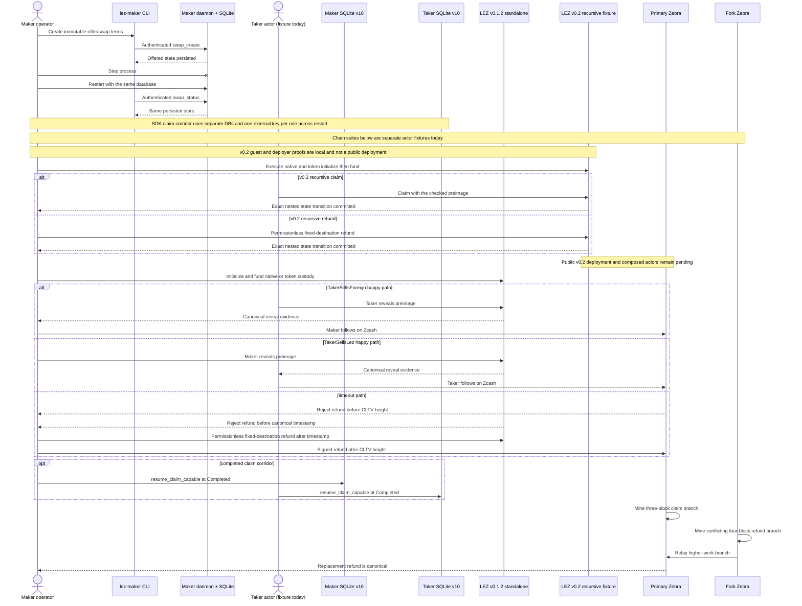
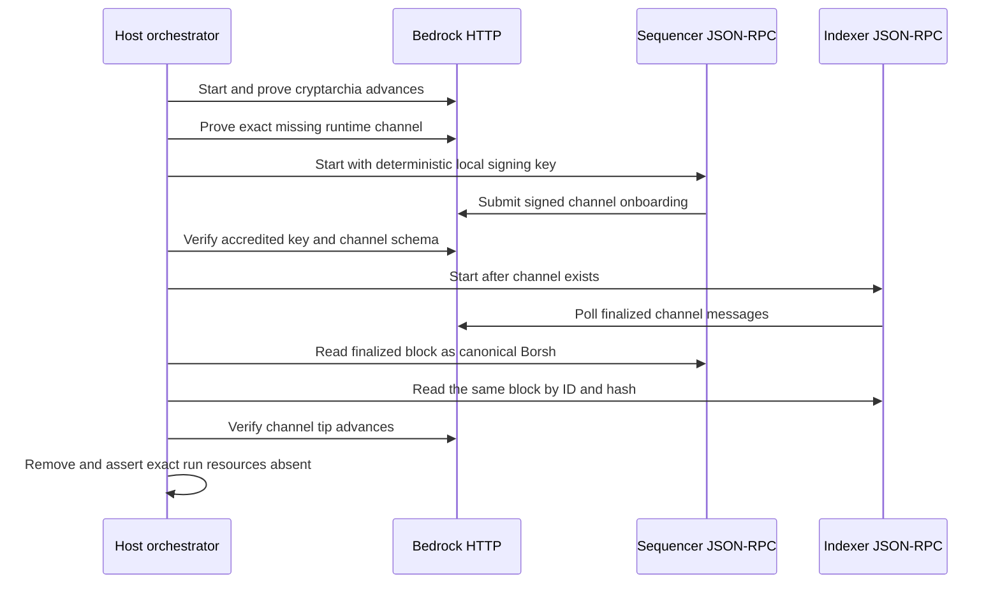

# Manual reproduction guide

Last verified: 2026-07-13

This is the living operator guide for the user-visible flows that the repository
currently proves. Update it in the same change whenever a runner, prerequisite,
actor boundary, expected result, or cleanup rule changes.

Public-testnet setup and funding prerequisites are maintained in the
[Zcash public-testnet guide](zcash-testnet-setup.md). That guide selects a
self-hosted Zebra route and Tatum's public-provider Testnet Zebrad route, but
explicitly leaves live execution pending the project-owned transparent signer,
HTTPS provider transport, and actor adapter.

## Can I run the complete swap myself?

Not yet as one released maker-to-taker command. A fresh checkout can reproduce
the role-separated swap state machine, restart-safe claim/refund journals, and
real local LEZ and Zebra on-chain lifecycles today. It cannot yet compose those
pieces through two independent reference-actor processes. That composed
corridor is an open M2 exit criterion; component passes must not be reported as
a completed cross-chain swap.

For the fastest currently available rehearsal, which needs no node, Docker,
faucet, or public endpoint, run:

```sh
cargo test --locked -p lez-zec-swap-sdk --test sdk_lifecycle \
  independent_actors_complete_lez_then_zcash_claims_in_both_directions \
  -- --exact --nocapture
cargo test --locked -p lez-swap-store --test zec_sdk_recovery \
  schema_v9_claim_journal_completes_and_reopens_independent_actors_in_both_directions \
  -- --exact --nocapture
```

Both commands exercise distinct maker and taker actors, both trade directions,
LEZ-before-Zcash claim ordering, separate durable stores, and terminal restart.
They use deterministic contract doubles, so continue with Flow 2's Zebra runner
and Flow 3's LEZ runner when you need evidence from the actual pinned local
nodes. Use a unique `RUN_ID` for every heavy run and never overlap those runners
with another repository build.

The terminal SDK replay used by the future actor `status` command is already
offline by construction: it can instantiate the LEZ and Zcash ports as `()` and
reads only the role-local recovery store. The schema-v2 actor configuration
likewise loads status material from only the role store plus the external
claim-recovery key; agreement bytes, sidecar capability, Zcash key, preimage,
Zebra cookie, and both node endpoints may be unavailable. The current binary
does not yet open the store or emit that status, so this is verified API and
configuration evidence, not a user command advertised as complete.

M2 will not be tagged until this guide also contains and has been checked from
a fresh checkout for all of the following:

1. build the independent reference actors and start their isolated local nodes;
2. generate separate private maker/taker configurations and deterministic
   role-correct funds without printing capabilities or signing keys;
3. execute and inspect both happy-path trade directions through canonical LEZ
   reveal followed by the exact Zcash spend;
4. stop and restart either actor, then repeat the terminal status checks;
5. execute pre-second-lock abandonment and post-lock peer-independent recovery;
6. run concurrent swaps without fixed-port, database, Docker-project, or volume
   collisions; and
7. stop only resources owned by the chosen run and locate the retained evidence.

The M2 rehearsal uses one pinned public-compatible local LEZ v0.2 devnet and one
pinned local Zcash Regtest devnet. The LEZ devnet must include the full Bedrock node, indexer, and
non-standalone sequencer. Their exact source, image labels, service flow,
toolchain, native inputs, and service-binary hashes are now attested. Container assembly, signed runtime-channel onboarding, and three-service non-genesis finality are GREEN in isolated run `v02-stack-20260713n`. Vault Claim onboarding, escrow deployment, actor use, swap effects, and restart recovery remain pending. The
standalone mock block publisher and v0.1.2 lane are lower-level checks only. Maker and taker
use separate configs, keys, funds,
stores, journals, sidecars, and processes. The guide will identify every local
RPC, deterministic funding source, expected output without exposing secrets,
and retained artifact. It must also show that the same binaries select a future
public route only through signed configuration and provisioning: endpoints,
authentication, chain identities, confirmation profile, keys/funds, and the
deployed LEZ program ID. It will not require or publish a public transaction,
address, faucet interaction, or recording for M2. Until those exact local
commands exist here, use the narrower flows below and treat the full manual swap
as unavailable.

## What this guide proves today

| Flow | Boundary exercised | Current limitation |
|---|---|---|
| ZEC SDK agreement/activation/locks/claims/refunds | Canonical bounded dual-signed terms, separate role stores, exact lock recovery, and direction-fixed effects reach `BothLegsLocked`; LEZ reveal then Zcash follow-up reaches `Completed`; or exact owner intents plus observer-only transitions drive LEZ then Zcash refunds to `Refunded` in both directions | These commands still use deterministic contract doubles and no RPC, node, Docker, faucet, or external resource. Claims and refunds replay through schema-v10 SQLite with atomic owner/observer journals. Main LEZ/Zebra validation adapters, official LEZ refund execution, and crash-safe context-owning LEZ SDK ports are GREEN; the composed actor/node flow remains pending, so this is not yet the manual actual-node flow |
| LEZ bridge and Zebra funding/claim/refund contracts | The one-attempt authenticated loopback client and sidecar serve all eight bounded methods. The sidecar restores exact native, revealing-claim, and permissionless native-refund bytes and writes an unknown guard before submit. Official native escrow, claim, and refund observations decode exact-owner facts or bounded counterparty discovery; main escrow/claim/refund adapters independently validate the signed agreement, stable clock/tip, accounts, transactions, instructions, windows, deadlines, depth, and durable identity/bytes. Context-owning SDK ports journal caller-owned IDs/windows per logical operation, open fresh clients for exact retry, and preserve ambiguous prepare/refund contexts across restart. Two real sidecar processes run concurrently with distinct maker/taker roles, keys, capabilities, stores, runtimes, and ephemeral listeners. Typed Zebra ports validate exact-outpoint funding plans, owner claims/refunds, counterparty spends, and agreement-bound funding in both directions. A one-shot actor CLI now validates separate maker/taker private configs and rejects shared or config-overwriting paths | These are isolated adapter, planner, process, and actor-boundary contract tests, not yet a composed consensus proof. The actor still rejects effect-bearing `activate`/`drive`, but `status` now performs existing-only hardened SQLite recovery through an SDK type that cannot call either chain; missing state remains uncreated as `not_activated`. The runner's describe/authentication path uses no chain call; official observation uses an ephemeral loopback RPC mock returning pinned node types. The composed corridor remains pending. No Docker, faucet, public endpoint, or fixed port is used |
| Maker operator create/status/restart | Actual `lez-maker` process, authenticated loopback RPC, actual `lez-maker-daemon`, and persisted SQLite state | This creates negotiated swap state only; it does not run a taker or submit chain transactions |
| Zcash watcher/store reconciliation | Direction-derived maker runtime, immutable profile/output binding, schema-v10 SQLite journal/alerts plus the production role-fixed SDK recovery adapter, restart replay, both funded roles, removals, replacements, terminal outcomes, and exact replay; actual two-Zebra close/reopen/requery/removal passes | The daemon polling loop, LEZ SDK-port/refund composition, and independent maker/taker processes remain pending |
| Zcash fund/claim/refund/fork | Locally constructed NU6.2 transparent transactions submitted by fixed test actors to two actual pinned Zebra processes | The actors live in one Rust acceptance fixture; they are not yet independent maker/taker processes |
| LEZ native and token claim/refund | Real genesis actor keys submit public transactions to an ephemeral-port LEZ v0.1.2 standalone sequencer. The last corrected full runner exited `0` after the reusable external process published a private schema-v2 handoff containing the exact deployment transaction and canonical block, the built-in-only `getProgramIds` result, and two funded deterministic actors | The native/two-definition lifecycle and corrected external-node handoff are GREEN with ELF SHA-256 `a324355c...7006` and ImageID `c14c978a...4483`. A later actor-contract RED replaced the agreement-invalid zero channel with one nonempty deterministic identity; its focused suite passes and the exact full runner must be repeated before using the handoff as current corridor evidence. No reference SDK actor consumes that handoff in a composed LEZ/Zebra flow yet, and this local v0.1.2 evidence is not LEZ v0.2 public-testnet evidence |
| LEZ recursive execution costs | Exact checked guest replayed through production `V03State` transitions with nested authenticated-transfer and ATA/Token sessions | This measures deterministic local execution, not public-testnet fees or latency |
| Provisional LEZ v0.2 executable lane | Exact SPEL PR #238 and LEZ v0.2.0 build a checked Risc0 escrow ELF, compile the generated typed client, and execute recursive native plus two-definition token claim/refund tests, including child-failure rollback. The fail-closed deployer is tested through the official RPC types against an ephemeral loopback server | Local ELF SHA-256 `40c9d37c...8021` and ImageID `f8385049...0fbe` are GREEN. No v0.2 public deployment, deployed-runtime CU evidence, independent maker/taker actor flow, composed LEZ/Zebra corridor, or maintainer approval is proved |
| Full local LEZ v0.2 service readiness | Clean exact source and artifacts are checked, then digest-pinned Bedrock, non-standalone sequencer, and indexer execute on one unique no-masquerade bridge with dynamic loopback RPCs. The real sequencer signs and onboards its key-derived channel; finalized block 2 is equal through indexer ID/hash lookup and sequencer Borsh identity | GREEN in `v02-stack-20260713n`, including fail-closed exact cleanup. This does not prove Vault Claims, checked escrow deployment, independent actors, swap effects, restart recovery, or the composed LEZ/Zebra corridor |
| Official-wire LEZ v0.2 prepare foundation | Exact upstream LEE account/transaction, Vault, and generated escrow/RPC types are separately locked. Seventeen tests cover runtime/role/signer/channel binding, canonical decoding, authenticated loopback describe, exact native initialize/fund preparation, deterministic maker/taker Vault Claim preparation, node-confirmed nonces, recovery mutation rejection, and redaction | The verifier is a local build/test/dependency gate, not a running actor flow. Prepared exact bytes remain only in fail-closed memory; durable recovery, authenticated server wiring, observation, one-attempt submission, executable maker/taker processes, finalized actor balances, and actual-node corridor use remain pending. It uses no public RPC, faucet, or Docker |

The following are **not complete yet**: one composed LEZ↔ZEC run with
independent maker and taker processes, both ZEC trade directions through all
CLI/daemon/chain boundaries, Delivery/Chat-loss and restart at those boundaries,
recordings generated from that suite, and public-testnet deployment. Do not use
the local fixtures below as evidence for those pending M2 exit criteria.

The 23 reference-actor boundary cases additionally prove that one Unix-only
schema-v2 configuration fixes exactly one role/run/swap, exact signed-agreement
SHA-256, LEZ runtime and discovery window, Zebra network/branch/genesis, and a
bounded exact-outpoint set. Existing private files must be regular, owner-only
mode `0600`, single-link, and unchanged between validation and use; symlinks,
hard-link aliases, late agreement/state aliasing, unsafe lexical paths,
cross-role state reuse, and secret-bearing diagnostics fail closed. The existing-only and create-capable store openers now use
`SQLITE_OPEN_NOFOLLOW`, reject non-regular/hardlinked/wrong-mode files, and
compare device/inode identity around mutable setup. Owner-private parent
directories remain mandatory because later SQLite WAL/SHM opens are not
descriptor-bound.

## User and custody flow



## Fresh-checkout prerequisites

Run all commands from the repository root. A fresh checkout needs:

- Git and `rustup`, with Rust 1.96.0, `rustfmt`, and Clippy;
- Docker Engine and Docker Compose v2 for Zebra and the Risc0 guest builder;
- `curl`, `gcc`, `tar`, `sha256sum`, `awk`, `diff`, and `rg` for the LEZ runner;
- `unzip` and a working libclang C-header search path for the provisional LEZ
  v0.2 standalone dependency build;
- outbound access on the first LEZ run so the script can install pinned `rzup`
  0.5.1/Risc0 3.0.5 tools and download the checksum-verified circuits archive;
  and
- `cargo-deny` 0.19.9 and ShellCheck when reproducing all local quality gates.

Install and confirm the repository toolchain:

```sh
rustup toolchain install 1.96.0 --component rustfmt,clippy
rustc --version
cargo --version
docker version
docker compose version
```

The first two version commands must report 1.96.0. Build the workspace and run
the non-ignored acceptance tests before starting either heavy chain suite:

```sh
cargo build --locked --workspace --all-targets
cargo test --locked --workspace --all-targets
cargo fmt --all --check
cargo clippy --locked --workspace --all-targets --all-features -- -D warnings
cargo deny check advisories bans licenses sources
```

The lockfiles are part of the evidence. Do not omit `--locked` to work around a
dependency change.

## Flow 0: provisional LEZ v0.2 executable guest/client/deployer lane

Choose a fresh lowercase run ID and run:

```sh
RUN_ID=manual-lez-v02-20260712-a ./scripts/verify-lez-v02-provisional.sh
cargo deny --manifest-path compat/lez-v0.2-provisional/Cargo.toml \
  check --config compat/lez-v0.2-provisional/deny.toml \
  advisories bans licenses sources
cargo deny --manifest-path compat/lez-v0.2-provisional/escrow/methods/Cargo.toml \
  check --config compat/lez-v0.2-provisional/escrow/methods/deny.toml \
  advisories bans licenses sources
cargo deny --manifest-path compat/lez-v0.2-provisional/escrow/methods/guest/Cargo.toml \
  check --config compat/lez-v0.2-provisional/escrow/methods/guest/deny.toml \
  advisories bans licenses sources
cargo deny --manifest-path compat/lez-v0.2-provisional/escrow/deployer/Cargo.toml \
  check --config compat/lez-v0.2-provisional/escrow/deployer/deny.toml \
  advisories bans licenses sources
```

The runner rejects any `RUN_ID` outside
`^[a-z0-9][a-z0-9_-]*$`, fixes Cargo at two build jobs, and creates only unique
root, guest, artifact, tool, and Docker-source directories under
`${TMPDIR:-/tmp}`. It invokes the digest-pinned Risc0 guest-builder container
for the checked artifact, but does not create a network namespace, bind a port,
start a service/sequencer, or issue a global process/container cleanup command.
The graph is large, so do not overlap its cold build with another heavy suite.

A fresh uncached run needs crates.io and the exact locked GitHub repositories,
including SPEL, LEZ, Logos Blockchain/circuits, Overwatch, Jellyfish, and
Risc0-related sources. It also needs `unzip` for the pinned rapidsnark archive
and functional libclang system headers for RocksDB bindgen. Cached sources and
build artifacts reduce availability risk but never relax the lockfile checks.

A pass proves all of the following and nothing broader:

- SPEL PR #238 exact head `df17acd98436be4f09c55877dae1fe2e73cbcdca`;
- official LEZ tag `v0.2.0` resolves only to
  `a58fbce2ff48c58b7bb5001b1a27e64b9596ee3a`, without a duplicate revision
  source/type identity;
- the v0.2 `SequencerConfig` and standalone entry point compile, without polling
  the future or starting the sequencer;
- the renamed `LeeTransaction` envelope compiles; and
- SPEL and LEZ derive the same fixed public `/LEE/` PDA vector; and
- the exact dependency-light SDK source produces the same metadata PDA, native
  `custody`/swap multi-seed PDA, and owner/definition ATA as pinned upstream
  `lee_core`, SPEL, and ATA-core types;
- the generated typed client compiles against the checked escrow IDL and exact
  public ProgramId wire types;
- the digest-pinned builder and the independently embedded methods build agree
  on ELF SHA-256
  `40c9d37c5dc3c8544bcb7c26916a5be1039b76cc862b2c9dcd34e0cf61468021`
  and ImageID
  `f8385049e93a319b44d868e0d0cf805b058eddcf92141a186ffd69e4596c0fbe`;
- recursive native claim/refund and two-definition token claim/refund execute
  through official `V03State`, authenticated-transfer, ATA, and Token paths;
- child-transfer failure rolls back terminal metadata, custody, and actor state;
  and
- the deployment client rejects local identity mutation before RPC, submits the
  exact checked `ProgramDeployment` once, rejects a mismatched returned hash,
  never resubmits an ambiguous/timeout outcome, and binds inclusion to the exact
  post-tip transaction and canonical block.

CI audits four independently locked v0.2 graphs with graph-local `cargo-deny`
policy: compatibility root, methods, guest, and deployer. The local verifier
also checks the reviewed advisory feature/reachability assumptions and rejects
lock, artifact, ProgramId, or deployment-manifest drift.

This flow does **not** start a sequencer, deploy to the public endpoint, record
deployed-runtime compute units, or run independent maker/taker actors or the
composed LEZ/Zebra corridor. The checked deployment manifest deliberately keeps
its transaction hash and inclusion block pending. SPEL PR #238 is open,
unmerged, and without submitted maintainer review; issues #242/#243 also remain
upstream disclosures. Under ADR 0018 those Logos-owned conditions do not block
M2 certification, but they remain production-release blockers. This is
provisional engineering evidence, not final release approval.

The official LEZ graph also contains `hickory-proto 0.25.0-alpha.5`, affected
by `RUSTSEC-2026-0118` and `RUSTSEC-2026-0119`, through Logos-owned
common/libp2p paths. The root compile-only test remains hash-locked and cannot
poll/start the standalone future; the bounded deployer has its own policy and
exact endpoint/feature tests. DNSSEC features are rejected. These exact
graph-local exceptions are nonblocking only for M2 under ADR 0018 and are
production-blocking until Logos removes the paths or a separate security review
explicitly accepts them.

## Flow 0B: verify the exact local-v0.2 source and binary contract

This is the current reproducible boundary before the three-service runner. It
checks a clean exact source checkout, toolchain and native inputs, service
binary hashes and versions, Bedrock fixture hashes, and immutable OCI labels.
It does not start a container or call an RPC.

```sh
export LEZ_V02_SOURCE_DIR=/path/to/clean/logos-execution-zone-v0.2.0
export LEZ_V02_R0VM=/path/to/verified/r0vm
export LEZ_V02_SEQUENCER_BINARY=/path/to/verified/sequencer_service
export LEZ_V02_INDEXER_BINARY=/path/to/verified/indexer_service
export LEZ_V02_RAPIDSNARK_ARCHIVE=/path/to/rapidsnark-linux-x86_64-pic-v0.0.8.zip
export RAPIDSNARK_LIB_DIR=/path/to/verified/rapidsnark-v0.0.8-libraries
export BINDGEN_EXTRA_CLANG_ARGS=-I/usr/lib/gcc/x86_64-linux-gnu/13/include
RUN_ID=manual-v02-contract-20260713-a ./scripts/verify-lez-v02-local-stack-contract.sh
```

The exact Bedrock digest must already be cached locally so the verifier can
inspect its source, revision, version, and license labels without pulling it.
Expected output ends with `verification_scope=source-contract-only` and names OCI revision
`d8711bbc3d43d3ef9755ef9b73af32fd0f703160`. A dirty source checkout, changed
binary, wrong toolchain or native library, missing cached image, or changed OCI
label fails closed. This command needs Docker metadata access but starts no
container, uses no public chain RPC or faucet, and proves no swap execution.

## Flow 0B2: run the isolated LEZ v0.2 service stack

This flow runs the real pinned Bedrock node, non-standalone sequencer, and
indexer. It proves service onboarding and non-genesis finality, not a swap.



Prerequisites from a clean host:

- a non-root Unix user, Docker Engine with Compose v2, Git, curl, jq, ripgrep,
  sha256sum, base64, xxd, od, sed, and a Docker build backend;
- a clean LEZ `v0.2.0` checkout at commit
  `a58fbce2ff48c58b7bb5001b1a27e64b9596ee3a` with the local tag resolving to
  that commit;
- locked release binaries named `sequencer_service` and `indexer_service` in
  one directory, with SHA-256 values `3727e9aa...412f` and
  `6ed54f04...7442`; and
- the verified executable `r0vm 3.0.5`, SHA-256 `36c016a5...15b`.

One clean-host provisioning route is:

```sh
PROVISION="$PWD/.e2e/lez-v02-provision"
LEZ_V02_SOURCE_DIR="$PROVISION/logos-execution-zone"
LEZ_V02_BUILD_DIR="$PROVISION/build"
LEZ_V02_TOOL_DIR="$PROVISION/tools"
mkdir -p "$PROVISION"
git clone --branch v0.2.0 --single-branch \
  https://github.com/logos-blockchain/logos-execution-zone.git \
  "$LEZ_V02_SOURCE_DIR"
test "$(git -C "$LEZ_V02_SOURCE_DIR" rev-parse HEAD)" = \
  a58fbce2ff48c58b7bb5001b1a27e64b9596ee3a
test -z "$(git -C "$LEZ_V02_SOURCE_DIR" status --porcelain=v1 --untracked-files=all)"
rustup toolchain install 1.94.0 --profile minimal

RAPIDSNARK_ARCHIVE="$PROVISION/rapidsnark-linux-x86_64-pic-v0.0.8.zip"
curl -fL \
  https://github.com/logos-blockchain/logos-blockchain-rust-rapidsnark/releases/download/rapidsnark-pic-v0.0.8/rapidsnark-linux-x86_64-pic-v0.0.8.zip \
  -o "$RAPIDSNARK_ARCHIVE"
printf "%s  %s\n" \
  59bdd709eed96235de061f352893f4650c923b54b591052118593012bb1cd831 \
  "$RAPIDSNARK_ARCHIVE" | sha256sum --check --strict
mkdir -p "$PROVISION/rapidsnark"
unzip -q "$RAPIDSNARK_ARCHIVE" -d "$PROVISION/rapidsnark"
RAPIDSNARK_LIB_DIR="$(dirname "$(find "$PROVISION/rapidsnark" \
  -type f -name librapidsnark.a -print -quit)")"
(
  cd "$RAPIDSNARK_LIB_DIR"
  printf "%s  %s\n" \
    d4133227f845ff5bfa3672eb5b9c018a6a086bfa164b176bdaf76949c7d1f423 librapidsnark.a \
    0a910b420c3ad603c83c9dc2818c7ae05394c231ca23135c7b873e8e680ea41b libgmp.a \
    797b5d24bb8e8b088f811bddfff35f33973af9c797fb3812489cd42ba6a957d0 libfq.a \
    40f809394904682cb5517845cd3c2f936a5eb4609712534b573f552f2811fb82 libfr.a \
    | sha256sum --check --strict
)
export RAPIDSNARK_LIB_DIR
export BINDGEN_EXTRA_CLANG_ARGS=-I/usr/lib/gcc/x86_64-linux-gnu/13/include
(
  cd "$LEZ_V02_SOURCE_DIR"
  CARGO_TARGET_DIR="$LEZ_V02_BUILD_DIR" \
    cargo +1.94.0 build --locked --release --jobs 2 \
      --package sequencer_service --package indexer_service
)
LEZ_V02_SERVICES_DIR="$LEZ_V02_BUILD_DIR/release"
printf "%s  %s\n" \
  3727e9aa10600d04d0cdfda6eb39df146ef4cc14f5b09ad33bcf076a8f2c412f \
  "$LEZ_V02_SERVICES_DIR/sequencer_service" \
  6ed54f04ae018f3554898a9f0aef6decd6930c4e8609326d146ca164e48d7442 \
  "$LEZ_V02_SERVICES_DIR/indexer_service" \
  | sha256sum --check --strict

cargo install rzup --version 0.5.1 --locked --root "$LEZ_V02_TOOL_DIR"
RISC0_HOME="$LEZ_V02_TOOL_DIR/risc0-3.0.5/home" \
  "$LEZ_V02_TOOL_DIR/bin/rzup" install r0vm 3.0.5
LEZ_V02_R0VM="$LEZ_V02_TOOL_DIR/risc0-3.0.5/home/extensions/v3.0.5-cargo-risczero-x86_64-unknown-linux-gnu/r0vm"
printf "%s  %s\n" \
  36c016a5bb2ded5bd1f8f92cc487e6ffaeb1e95ec05850c983081a0f716b515b \
  "$LEZ_V02_R0VM" | sha256sum --check --strict
```

Keep the three resulting absolute paths for the runner. A cold host also needs the exact Bedrock GHCR digest and distroless GCR digest.
The runner may pull those immutable images if they are absent. The exact clone, native-library verification, locked build, and r0vm provisioning commands above produce those inputs; the runtime runner never floats source or artifact versions.

```sh
export LEZ_V02_SOURCE_DIR=/absolute/path/to/clean/logos-execution-zone-v0.2.0
export LEZ_V02_SERVICES_DIR=/absolute/path/to/locked/release-binaries
export LEZ_V02_R0VM=/absolute/path/to/verified/r0vm
RUN_ID=manual-v02-stack-001 ./scripts/run-lez-v02-stack.sh
```

Expected output ends with `LEZ v0.2 isolated service-readiness passed` and a
finalized block ID of at least 2. Evidence remains under
`.e2e/manual-v02-stack-001/lez-v02`: `run.env` binds source, artifacts, exact
container and network IDs, dynamic loopback URLs, and finalized ID; `evidence/`
contains the cryptarchia samples, exact pre-bootstrap missing-channel body,
channel snapshots, port bindings, sequencer Borsh block, and indexer ID/hash
responses; `logs/` contains each service log. Normal exit removes only the
captured containers, exact network, and exact image, then asserts all three
absent. A cleanup assertion failure changes a successful run into failure.

For live inspection, set `LEZ_V02_KEEP_RUNNING=1`. Retention is honored only
after a GREEN run. The runner prints exact cleanup commands containing the
captured container IDs, network, and image; execute all three commands when
finished. Never use a global prune.

All chain RPCs in this flow are dynamically published on literal loopback, and
all service traffic stays on its unique no-masquerade bridge. Runtime execution
uses no public RPC, public peer, faucet, or public funds. Only cold image or
source provisioning can depend on GHCR, GCR, GitHub, Rust distribution, or
crates.io; cached verified inputs remove that availability risk. Deterministic
local genesis and signing material make the run reproducible, while correctness
comes from executing the pinned real implementations and cross-checking their
canonical outputs. Public peer propagation, fee pressure, and public-runtime
parity are deliberately outside this local claim.

## Flow 0C: verify the official-wire v0.2 prepare foundation

Provision the exact four already-extracted Rapisnark libraries named in the
local-stack contract, then run the fail-closed wrapper from the repository
root:

```sh
export RAPIDSNARK_LIB_DIR=/absolute/path/to/verified/rapidsnark-v0.0.8-libraries
export BINDGEN_EXTRA_CLANG_ARGS=-I/usr/lib/gcc/x86_64-linux-gnu/13/include
./scripts/verify-lez-v02-sidecar.sh
```

Expected output ends with `LEZ v0.2 sidecar verification: ok`. The wrapper
attests all four static-library SHA-256 identities before invoking Cargo and
then runs locked offline formatting, 17 integration tests, strict Clippy,
rustdoc warnings, and graph-local advisory/license/source policy. Those tests
include exact native initialize/fund and deterministic maker/taker Vault Claim
preparation, but no durable recovery or submission. A missing,
relative, or changed library directory fails before Cargo. Do not replace this
with direct `cargo --offline`: the upstream build script can still attempt its
own release-asset download. This command starts no node, sidecar process,
container, faucet call, or public RPC and therefore proves no chain effect or
swap. The full prerequisite and licensing boundary is recorded in
`compat/lez-v0_2-sidecar/README.md`.

## External resources and flakiness

No currently executable user flow calls a public blockchain RPC or faucet. The
official LEZ v0.2 endpoint `https://testnet.lez.logos.co` is now selected and
its health/block/program methods were checked on 2026-07-12, but no flow below
submits a transaction to it yet.
The maker RPC is a locally created loopback endpoint and both Zebra RPCs use
ephemeral host-loopback mappings. The LEZ test client uses loopback, but pinned
upstream v0.1.2 binds its short-lived server to the host wildcard address on an
ephemeral port. Actor funds come from deterministic local genesis or Regtest
coinbase outputs. Therefore a public RPC outage, rate limit, faucet balance, or
testnet reorg cannot affect the flows in this guide today.

The SDK memory actor test and schema-v10 SQLite actor test in Flow 2 are the
most isolated claim lane: they start no service, make no network request, and
need no RPC, node, Docker image, faucet, or pre-funded chain account. The
SQLite case creates different temporary database paths for maker and taker.
Each role must receive the same external claim-key ID and key material again
when its database is reopened; the key is process input and is not stored in
SQLite. These tests can fail because of local build, CPU, filesystem, or disk
conditions, but not because a public endpoint is unavailable. Actual Zebra
and LEZ node claims are separate suites, and the composed actual-node corridor
remains an M2 deliverable.

Loopback is an isolation property, not a correctness claim. The chain evidence
comes from running the real pinned implementations and crossing their actual
transaction, validation, execution, and canonical-block boundaries:

- Zebra 5.2.0 validates canonical signed V5/BIP-199 bytes through its real
  mempool and consensus services, mines them into blocks, and selects a
  higher-work conflicting branch. Regtest controls mining and network
  activation; it does not simulate public peer propagation or fee pressure.
- The LEZ v0.1.2 standalone sequencer accepts the checked Risc0 guest and actor
  transactions through public RPC, executes production `V03State` transitions,
  persists canonical blocks, and exposes resulting nonce/custody/balance state.
  Its reusable external process verifies the tracked ELF SHA-256 and ImageID
  before creating state, refuses a pre-existing home or readiness path, and
  publishes readiness only after official RPC confirms genesis, chain progress,
  the exact deployment transaction and containing block, ProgramId, the static
  authenticated-transfer built-in identity, and two key-derived funded
  accounts. Upstream `getProgramIds` lists built-ins only; it is not used as a
  custom-deployment registry. Standalone does not prove LEZ testnet 0.2
  compatibility or public sequencing.

The M2 evidence ladder is exact local vectors, public-compatible actual local
chain implementations, a composed independent maker/taker local corridor, and
locally tested dormant public-route configuration/adapters. Self-hosted and
provider-backed public testnet execution with public funds is deferred to
production readiness under ADR 0023 and remains visibly unproved. Mainnet
remains separately disabled pending calibration and formal review.

Cold setup and CI do use external software-distribution services:

| Resource | Used by | Pin/integrity control | Availability/flakiness risk |
|---|---|---|---|
| Rust toolchain distribution selected by `rustup` | Fresh toolchain install and CI | Exact Rust `1.96.0`; CI toolchain action is commit-pinned | DNS/CDN/proxy outage can block cold setup; warm installed toolchains avoid it |
| crates.io index and crate downloads | Workspace build, `cargo install rzup`, cargo-deny installation | Cargo lockfiles, exact `rzup 0.5.1`, and crate checksums | Registry/CDN/rate-limit outage can block an uncached build; cached sources avoid most requests |
| GitHub Git endpoints for Logos LEZ, SPEL, Overwatch, Jellyfish, and other locked Git dependencies | First LEZ compatibility build | Cargo lockfiles resolve exact commits; source policy allowlists exact repositories | GitHub/DNS/proxy outage can block an uncached checkout; it cannot silently substitute another locked commit |
| `https://testnet.lez.logos.co` and its explorer | Deferred production-readiness v0.2 deployment/actor evidence; health audit only today | Official LEZ v0.2 endpoint; deployment must bind exact runtime, checked ELF, ProgramId, tx IDs, and blocks | Public service/rate-limit/reorg outage can make testnet evidence flaky; no SLA or self-hosted fallback is selected yet. M2 locally contract-tests the public-capable configuration without publishing a deployment |
| Self-host Zebra 6.0.0 on public Testnet | Selected deferred production-readiness node route; not called by current flows | Exact stable tag/release; cookie-authenticated loopback RPC; query current `consensus.next_block` | Initial sync, disk, DNS/P2P, organic reorg, and epoch activation can delay/fail a public run; the private M2 corridor uses Regtest |
| Tatum Testnet Zebrad JSON-RPC | Selected public-provider route; not called by current flows | `https://zcash-testnet-zebrad.gateway.tatum.io`; dedicated API key in sensitive `x-api-key`; require the exact actor method contract and chain/branch/genesis/stable-tip checks | Third-party authoritative node with account provisioning, quotas, outage, lag, method-policy, and provider-trust risk; HTTPS adapter contract remains an M2 portability gate, while live rehearsal is deferred to production readiness; no silent failover or submit retry |
| Community Zcash faucet or Discord support | Optional future TAZ funding | External operator; verify any returned txid independently through self-hosted Zebra | No SLA/current rate or amount; faucet may time out or be depleted and is never a required CI gate |
| Zallet v0.1.0-alpha.4 | Optional future funding wallet, never the HTLC signer | Exact alpha tag, loopback RPC, Zebra cookie; explicit transparent privacy policy | Alpha/epoch compatibility; cannot export derived transparent keys or sign arbitrary HTLC transactions |
| GHCR Logos Blockchain image | Local LEZ v0.2 Bedrock node and source/binary contract | Exact digest `sha256:91d6c5bf07e07fcfba5e7cf07d21ee686a6bc4b9f6210f2d28bffbcad9a3729f`; verifier checks OCI source revision `d8711bbc...` and license | Registry outage can block a cold pull; the manual contract verifier never pulls and fails if the exact cached image is absent. Public-testnet parity remains an upstream production question |
| GitHub Rapisnark v0.0.8 release asset | Exact LEZ v0.2 service and sidecar builds | Revision, archive name, SHA-256, and all four extracted static-library hashes are contract-bound | Release/CDN outage blocks an uncached build; implicit build-script download is rejected in favor of the preverified local directory |
| Docker Hub `zfnd/zebra` and `risczero/risc0-guest-builder` | Cold Zebra image build and Risc0 guest build | Zebra `5.2.0` source image and guest builder are digest-pinned | Registry outage, throttling, or authentication policy can block a cold pull; local images reduce but do not guarantee offline BuildKit resolution |
| Google Container Registry distroless image | Cold minimal Zebra and LEZ v0.2 service image builds | Exact `cc-debian13:nonroot` digest | Registry/DNS outage can block a cold pull; no moving tag is accepted |
| GitHub release asset for `logos-blockchain-circuits v0.4.2` | First LEZ run | Exact release URL plus required SHA-256 before extraction | Release/CDN outage can fail after retries; a verified run-specific cache avoids redownload |
| `rzup`-managed Risc0 release endpoint | First install of `r0vm`/`cargo-risczero` 3.0.5 | Runner checks exact tool versions and the final ELF digest/ImageID | Upstream release availability can block cold setup; keep the verified `LEZ_E2E_TOOL_DIR` cache |
| RustSec advisory database and Trivy vulnerability database | cargo-deny locally/CI; Trivy in CI | Scanner actions are commit-pinned; databases intentionally update | Network outage can prevent refresh, and a new advisory/CVE can make a previously green commit fail; this is a security signal, not a flaky test to bypass |

The local tests can still time out under severe CPU, memory, disk, or Docker
contention; this is why the heavy suites are serialized and resource-capped.
Retry only with a fresh run ID after checking the scoped logs. Do not weaken a
digest, checksum, vulnerability result, or consensus assertion to classify an
external outage as success.

Public-testnet corridor work has selected self-hosted Zebra 6.0.0 and Tatum's
documented Zebrad-powered Testnet gateway. No Zcash Foundation-operated public
Zebra JSON-RPC service exists in the reviewed primary sources. The project
transparent signer, provider HTTPS adapter, exact live method smoke, funded
LEZ/Zcash accounts, endpoint health, and clean-machine rehearsal remain. Before
that flow is called available, the guide and global README must retain
endpoint/faucet authentication, current limits, observed funding/confirmation
latency, fallback policy, health checks, and evidence retention. No public route
is required by the current local suites.

## Isolation and no-clash rules

Choose a new lowercase run ID for every attempt, for example
`manual-zebra-20260711-a`. It may contain only lowercase letters, numbers,
underscores, and hyphens.

- Never run the heavy Zebra and LEZ suites concurrently on the same host.
- Never run two LEZ suites from the same checkout concurrently: the checked
  guest ELF has a repository-relative target path. Use another checkout and
  distinct target/tool directories if parallel execution is unavoidable.
- The Zebra runner creates only `lez-atomic-swaps-${RUN_ID}`, uses ephemeral
  localhost RPC ports, and refuses to reuse an active project.
- Do not run a global Docker prune, stop, kill, or volume-removal command.
- For the strongest LEZ isolation, give every run unique
  `LEZ_E2E_TOOL_DIR`, `LEZ_METHODS_TARGET_DIR`,
  `LEZ_STANDALONE_TARGET_DIR`, and `LEZ_COST_OUTPUT_DIR` values as shown below.
  A shared completed tool cache is safe only when no other run is writing it.
- A direct reusable-node launch must also receive a never-before-created node
  home and readiness path under a private run directory. Never point it at
  another process's home: pre-existing homes are rejected and preserved.

### Isolated LEZ maker/taker sidecar processes

Build and run the exact locked compatibility executable contract without
Docker, a public endpoint, faucet funds, or a fixed port:

```sh
cd compat/lez-v0_1_2-sidecar
cargo build --offline --locked --bin lez-v0-1-2-sidecar
cargo test --offline --locked --test runner_process -- --nocapture
```

The test starts maker and taker binaries concurrently. Each child reads a
different 0600 signer file, capability file, runtime descriptor, and durable
state path, then publishes a distinct literal-loopback ephemeral endpoint.
Wrong capability, run ID, and role calls must fail; the correct actor can call
`lez_bridge.v1.describe_runtime`; graceful shutdown must leave a private
state file and no child process. The configured official node endpoint is an
unused loopback sentinel in this process-lifecycle test, so it does not claim
an on-chain observation. Official native observation behavior is covered
separately by the sidecar's `official_node_rpc` test against an ephemeral
loopback service returning the pinned generated RPC types.

From the repository root, reproduce the main-process agreement, claim, and
refund boundaries:

```sh
cargo test --offline --locked -p lez-bridge-adapter --test native_first_lock -- --nocapture
```

The adapter suite uses no socket, node, Docker, faucet, or public endpoint. It
must pass both signed directions, owner/observer separation, caller-owned
request IDs and windows, exact funding/preimage binding, account-state
eligibility, claim/refund prepare/exact/discovery/submit conversion, stable
clock and exact millisecond deadline checks, complete primitive mutation
rejection, and uncertain-submit handling. This proves fail-closed main-process
conversion only; it does not prove the composed SDK actor flow.

From `compat/lez-v0_1_2-sidecar`, reproduce the exact official native-refund
planner, node observation, authenticated server, and restart gates:

```sh
cargo test --offline --locked --all-targets -- --nocapture
```

All 33 tests must pass. This invokes no Docker, faucet, public endpoint, or fixed
port. The official-node tests use an ephemeral loopback mock that returns the
pinned generated LEZ RPC types; they prove source-correct conversion and
fail-closed scanning, not public-testnet consensus.

From the repository root, reproduce the agreement-bound Zebra funding/claim/
refund adapter and isolated actor-configuration boundaries:

```sh
cargo test --offline --locked -p lez-zebra-node-adapter --test first_lock -- --nocapture
cargo test --offline --locked -p lez-zebra-node-adapter \
  --test exact_outpoint_funding_planner \
  --test exact_outpoint_funding_planner_contract -- --nocapture
cargo test --offline --locked -p lez-zebra-node-adapter \
  --test zcash_port_composite \
  --test zcash_port_composite_configuration -- --nocapture
cargo test --offline --locked -p zec-reference-actor --all-features -- --nocapture
```

The complete Zebra package has 66 checks: 37 unit, 15 first-lock, three signer,
one planner-API, six exhaustive planner-contract, one composite-API, and three
composite-configuration cases. They cover both
funding directions, stable-tip block/mempool discovery, exact confirmed
candidate outpoints and signed input-set commitment, transparent-only canonical
V5 bytes and output/change policy, absence/ambiguity/horizon behavior, prior
removal/replacement reconciliation, claims, and refunds. The actor package adds
23 maker/taker schema-v2 configuration, credential, identity, offline-status,
and filesystem-isolation cases. These commands use bounded in-memory or
filesystem fixtures rather than an actual Zebra process; the separate isolated
Zebra suite remains the consensus lane, and the actor commands do not yet drive it.

The `zec-reference-actor` CLI spelling is
`zec-reference-actor --config PRIVATE_JSON activate|drive|status`. Today each
form validates the private configuration and exits; it does not open SQLite,
connect to a sidecar or Zebra, activate an agreement, drive an effect, or emit a
durable status snapshot. Do not provision real keys or funds for this binary
until those command bodies and the descriptor-bound SQLite open are composed
and covered by the actor-process corridor.

For a direct **LEZ sidecar** launch, create the parent directory for the state file and
supply the six required flags shown by the test fixture:
`--node-endpoint`, `--run-id`, `--runtime-file`,
`--capability-file`, `--signer-key-file`, and `--state-file`.
Secret files must be regular non-symlinks with no group/other permission bits;
the signer file is exactly 64 lowercase hexadecimal characters. Omit the
test-only `--shutdown-on-stdin` flag so the process waits for Ctrl-C.

## Flow 1: maker operator CLI and daemon restart

The executable acceptance fixture is the quickest exact reproduction:

```sh
cargo test --locked -p lez-maker-node --test operator_journey -- --nocapture
```

It starts the real daemon on an ephemeral loopback port, creates BTC, reverse
ZEC, and supported LEZ-first XMR swaps through the real CLI, rejects an
unsupported XMR direction and a wrong capability, kills the daemon, restarts it
on a new port with the same SQLite database, and reads the persisted swaps.

To repeat the operator steps manually, first build the two binaries:

```sh
cargo build --locked -p lez-maker-node --bins
```

In terminal 1, use an isolated directory and a capability of at least 24 bytes:

```sh
export RUN_ID=manual-operator-20260711-a
export RUN_DIR="${TMPDIR:-/tmp}/lez-atomic-swaps-${RUN_ID}"
export LEZ_MAKER_RPC_TOKEN=manual-maker-owner-capability-20260711-a
mkdir -p "$RUN_DIR"
target/debug/lez-maker-daemon \
  --listen 127.0.0.1:0 \
  --database "$RUN_DIR/maker.sqlite3" \
  --ready-file "$RUN_DIR/maker.ready"
```

After the ready file appears, use the same environment in terminal 2:

```sh
export RUN_ID=manual-operator-20260711-a
export RUN_DIR="${TMPDIR:-/tmp}/lez-atomic-swaps-${RUN_ID}"
export LEZ_MAKER_RPC_TOKEN=manual-maker-owner-capability-20260711-a
export MAKER_RPC_URL="$(cat "$RUN_DIR/maker.ready")"

target/debug/lez-maker --rpc-url "$MAKER_RPC_URL" create-swap \
  --id manual-zec-reverse-1 \
  --pair zcash \
  --direction taker-sells-lez \
  --confirmations 2 \
  --maker-refund-at 100 \
  --taker-refund-at 120 \
  --earlier-refund-latest 1000 \
  --later-refund-earliest 1200 \
  --required-margin 100

target/debug/lez-maker --rpc-url "$MAKER_RPC_URL" status \
  --id manual-zec-reverse-1
```

Each successful command prints one JSON object. It must contain
`"id":"manual-zec-reverse-1"`, `"pair":"Zcash"`,
`"direction":"TakerSellsLez"`, and `"phase":"Offered"`.

The other currently accepted operator constructions use these exact argument
shapes:

```sh
target/debug/lez-maker --rpc-url "$MAKER_RPC_URL" create-swap \
  --id manual-btc-forward-1 \
  --pair bitcoin \
  --direction taker-sells-foreign \
  --confirmations 2 \
  --maker-refund-at 100 \
  --taker-refund-at 120 \
  --earlier-refund-latest 1000 \
  --later-refund-earliest 1200 \
  --required-margin 100

target/debug/lez-maker --rpc-url "$MAKER_RPC_URL" create-swap \
  --id manual-xmr-lez-first-1 \
  --pair monero \
  --direction taker-sells-lez \
  --confirmations 2 \
  --taker-refund-at 120 \
  --xmr-refund-event-confirmations 2
```

Both print `"phase":"Offered"`. XMR in the opposite direction is deliberately
rejected, and XMR recovery is canonical-LEZ-refund-event-gated rather than
configured with a fabricated Monero deadline.

To prove restart persistence, stop terminal 1 with Ctrl-C and start the same
daemon command again with the same database and ready file. Refresh the URL and
query status again:

```sh
export MAKER_RPC_URL="$(cat "$RUN_DIR/maker.ready")"
target/debug/lez-maker --rpc-url "$MAKER_RPC_URL" status \
  --id manual-zec-reverse-1
```

The same JSON view must be returned after refreshing the daemon's ephemeral
endpoint. The database and readiness file are the run-specific manual-flow
artifacts; remove that specific `$RUN_DIR` only after the daemon has stopped
and the evidence is no longer needed.

## Flow 2: Zcash SDK, reconciliation, then actor claim/refund/fork

Build the two libraries, then reproduce the proven independent-actor claim
corridor directly:

```sh
cargo build --locked -p lez-zec-swap-sdk -p lez-swap-store
cargo test --locked -p lez-zec-swap-sdk --test sdk_lifecycle \
  independent_actors_complete_lez_then_zcash_claims_in_both_directions \
  -- --exact --nocapture
cargo test --locked -p lez-swap-store --test zec_sdk_recovery \
  schema_v9_claim_journal_completes_and_reopens_independent_actors_in_both_directions \
  -- --exact --nocapture
```

The expected result from each focused command is one passing test. Both cover
`TakerSellsForeign` and `TakerSellsLez`. The first claimant always submits the
LEZ reveal; only after both role-local actors observe its canonical evidence
does the other actor recover the preimage internally and submit the Zcash
follow-up. Both actors finish at revision 4 and a claim-capable restart returns
`Completed`.

The SQLite test creates independent temporary maker and taker database files.
It passes the same deterministic external test key ID and material to each
role's original open and reopen. A real caller must likewise provide the same
external key for a role across restart; losing or changing it fails closed.
The key is never persisted. Protected material and exact claim submissions are
XChaCha20-Poly1305 ciphertext under HKDF-derived, context-bound keys. The test
scans the database and WAL bytes before and after reopen and rejects plaintext
preimages or either exact secret-bearing claim transaction.

Run the broader agreement, lifecycle, and store regressions afterward:

```sh
cargo test --locked -p lez-zec-swap-sdk --test agreement_v1_cross_binding -- --nocapture
cargo test --locked -p lez-zec-swap-sdk --test sdk_lifecycle -- --nocapture
cargo test --locked -p lez-swap-store --test zec_sdk_recovery -- --nocapture
```

The first command runs 17 cases over the canonical agreement: bounded
exact wire decoding, both low-S signatures, every signed-field mutation, both
directions, deterministic-local execution terms, fail-closed public deployment,
actual LEZ/ZEC deadlines, role/digest binding, agreement-derived
fees/destinations/expiry/funding requests, exact native/token PDA/ATA accounts,
accepted-at resume, and redacted diagnostics. The second runs 30 integrated
cases in which independent maker and taker SDK instances with fixed roles
receive untrusted bytes, validate the concrete record, persist separate accepted
envelopes before activation, and resume the original wire after transcript
expiry. It also proves exact retry idempotence, changed same-key conflict,
wrong-role/revision/wire/swap-ID rejection, redacted active diagnostics, and
transport-free active types. Its primitive-record case rejects
future/substituted/corrupt recovery fields.
Package rustdoc additionally compile-fails any
attempt to obtain raw LEZ, Zcash, or recovery-store handles from an active swap.

The chain adapters are deterministic contract doubles; these commands require
no RPC, node, Docker, faucet, or external resource. They do not prove real
Logos Delivery/Chat, official-wire LEZ/Zebra lifecycle effects, or a
process-level maker/taker E2E. The claim-capable activation and schema-v10 store
atomically bind the direction-derived first claimant agreement to encrypted
material, retain exact claim submissions only in protected envelopes, and
separate owner and observer transition journals. The SDK first-lock cases
additionally prove exact
role/direction-bound bytes are staged before a node call, changed replay
conflicts, unstable observations submit nothing, restart observes before exact
rebroadcast, and LEZ initialization must be confirmed before its separately
durable fund transaction is submitted. Two projection cases prove invalid
evidence and a failed commit leave the coordinator `Offered`, an unknown
successful commit is accepted only after an exact predecessor-slot probe, and
restart replays the durable transition to `TakerLockConfirmed`. Maker-specific
cases prove that only the agreement-derived node port is queried, a primitive
forward Zcash assertion is rejected, complete canonical output evidence survives
record revalidation against the HTLC output binding, non-confirmed
outcomes write nothing, the maker never owns a taker intent, persisted adapter
assertions remain non-authorizing, and restart uses the maker-only store. The
same SDK suite then drives the maker happy path in both signed directions:
Zcash taker funding selects LEZ initialize/fund, while LEZ taker funding selects
Zcash fund. Every drive performs a fresh eligibility poll, the exact plan is
durable before submission, confirmed Maker evidence advances to
`BothLegsLocked`, and restart reconstructs that phase. A separate-role case then
has the taker observe the maker lock through the agreement-selected port;
distinct maker and taker stores both reach and replay `BothLegsLocked` in both
directions. The claim case continues from that exact actor boundary: LEZ reveal
precedes Zcash follow-up, the follower receives no caller-supplied secret, and
both independent journals replay `Completed` through `resume_claim_capable`.
The expected remote submission ID is adapter-asserted in this fixture, so a
production canonical adapter remains required. A stale second maker
instance catches up from the durable transition without another submission.
Projection fault injection leaves the maker intent open and in-memory phase
unchanged; an unknown successful commit is adopted only after exact probe.
Stable absence in either direction creates no maker intent and submits nothing.
Accept-then-fail fixtures cover LEZ initialize, LEZ fund, and Zcash fund: each
restart observes the accepted step before proceeding and submission counts do
not increase. A taker removal after LEZ initialization holds the maker in
`Offered`, submits no fund through stable absence, and resumes only after a
validated replacement.
The store command runs
16 production-adapter cases over real temporary
schema-v10 databases: exact replay/conflict, same-ID role isolation, retained
closed intent, taker and maker trigger-injected rollback,
future/malformed/torn/orphan/holey-state rejection, poison-append rejection,
exact and historical maker replay, stale-instance catch-up, and four-event
close/reopen resume. The maker actor flow is canonical observation at revision
1, atomic replacement at revision 2, same-inclusion depth update at revision 3,
and affirmative removal at revision 4. Replacement halves share one stable
tip; unchanged polls write nothing; changed inclusion without replacement and
stale removal of an old inclusion fail before append. A fresh eligibility call
after close/reopen replays and re-queries the exact Zcash or LEZ head, writes
no duplicate, returns the durable revision, and leaves `next_action` at
`Wait`; reverse replacement heads are eligible after restart, removed heads
are not, and local Pending is depth-eligible. The public Pending/Safe typed
awaiting-finality policy is unit-tested only because public agreement activation
remains fail-closed pending reviewed deployment. Stable absence and unstable polls return no
eligibility, write nothing, and preserve the revision. Its schema-v10 cases
prove both directions stage at revision 1, commit an intervening canonical
depth/finality update at revision 2 without another maker submission, then
close the intent and maker transition at revision 3 before reopen at
`BothLegsLocked`. A taker-local observed-maker transition independently replays
the taker from revision 1 to `BothLegsLocked` at revision 2 in both directions;
malformed and future payloads fail closed. The claim case adds protected
material, protected exact-payload intent, owned/observed transitions, unified
revision continuity, raw DB/WAL secret rejection, and independent close/reopen
at `Completed`. Production chain RPC claim adapters, actual-node
transport/reorg repetition, refunds, and independent actor processes are
remaining work.

Before starting Zebra, reproduce spend recognition independently from SDK
construction policy:

```sh
cargo test --locked -p lez-zec-swap-sdk --test zcash_spend_observations -- --nocapture
```

The eight cases enforce Zebra's exact P2SH/CLTV consensus flags, every defined
ZIP-244 sighash mode, consensus-valid high-S and nonminimal/semantic stack
forms, raw/script bounds, exact decoding, stable inclusion, and preservation of
outputs, lock time, expiry, sequence, role, and claim preimage. A separate
policy report flags any deviation from the SDK's canonical low-S, minimal,
`SIGHASH_ALL`, exact destination/fee/expiry shape without discarding the valid
claim. This command uses no RPC, node, Docker, faucet, or external resource.
It does not yet prove agreement-derived funding provenance, multi-input
non-`ANYONECANPAY` prevout context, or durable spend reorg tracking.

First reproduce the lightweight runtime/store user-role semantics without
Docker:

```sh
cargo test --locked -p lez-maker-node --test zec_runtime_reconciliation -- --nocapture
cargo test --locked -p lez-swap-store --test zec_event_journal -- --nocapture
```

The first suite must pass both ZEC-funded roles, restart replay, exact-head
validation, pre-dependent replacement, same-transaction re-mining,
post-dependent `ReplacementConflict`, and completed/refunded
`TerminalReorgDetected`. It also proves that missing legacy bindings, mismatched
profile confirmation policies, and a mismatched output envelope fail before any
revision or journal mutation. The second suite proves schema-v3 migration,
atomic swap+binding and event+aggregate rollback, immutable rebinding, lower
commit/probe enforcement, and restart-safe loading. These runtime/store tests do
not substitute for the actual-node command below.

Reproduce the owner-facing incident path through the real authenticated daemon
and CLI with:

```sh
cargo test --locked -p lez-maker-node --test operator_journey \
  owner_lists_and_acknowledges_durable_alert_across_daemon_restart \
  -- --exact --nocapture
```

That journey creates a genuine post-dependent Zcash replacement conflict through
the maker runtime, starts the daemon on an ephemeral loopback port, and uses the
owner CLI to verify the attention summary, list the durable alert, restart the
daemon, and acknowledge the same alert. A wrong bearer token must be rejected.
For an equivalent already-running daemon, the owner commands are:

```sh
target/debug/lez-maker --rpc-url "$RPC_URL" --rpc-token "$RPC_TOKEN" \
  status --id "$SWAP_ID"
target/debug/lez-maker --rpc-url "$RPC_URL" --rpc-token "$RPC_TOKEN" \
  alerts --id "$SWAP_ID"
target/debug/lez-maker --rpc-url "$RPC_URL" --rpc-token "$RPC_TOKEN" \
  acknowledge-alert --id "$SWAP_ID" --alert "$ALERT_SEQUENCE"
target/debug/lez-maker --rpc-url "$RPC_URL" --rpc-token "$RPC_TOKEN" \
  alerts --id "$SWAP_ID" --all
```

Acknowledgment records operator receipt only: it neither changes the swap phase
nor makes an unsafe claim/refund eligible. There is intentionally no production
RPC that injects watcher events; the automated journey seeds the conflict through
the same typed maker runtime boundary used by the watcher.

Use a fresh run ID and let the repository runner own the complete Docker
lifecycle:

```sh
RUN_ID=manual-zebra-20260711-a ./scripts/run-zebra-e2e.sh
```

The runner builds a unique digest-pinned Zebra image, starts two disconnected
NU6.2 Regtest nodes with independent ephemeral state and host ports, and exports
their RPC URLs plus an absolute run-scoped maker database only to the ignored
Rust fixtures. It refuses a pre-existing manifest, database, WAL, or SHM before
Compose starts. The maker runtime fixture runs first and:

1. constructs and broadcasts canonical BIP-199 funding to the primary node;
2. commits its immutable binding, event, and aggregate revision to schema-v10
   SQLite, closes the store, reopens it, replays the journal, and proves an
   unchanged fresh RPC requery creates no duplicate;
3. mines a longer independent fork without the funding transaction, relays it
   to the primary, and validates affirmative changed-height removal evidence;
4. commits the removal back to `Offered`, closes/reopens again, and proves an
   exact unknown-outcome retry keeps one binding and exactly two journal rows.

The existing actor/consensus fixture then:

1. matures four transparent actor UTXOs and validates the fetched prevouts;
2. rejects a funding transaction whose actor signature was mutated;
3. funds and claims one exact BIP-199 P2SH output with the claimant key and
   preimage, while rejecting a mutated claimant signature; before spending,
   stable RPC queries bind Regtest genesis, NU6.2, raw bytes, canonical block,
   exact outpoint/value/scripts, and derived depth into typed source evidence;
4. funds a second output, rejects its refund before CLTV, then confirms the
   funder's refund at the required height;
5. funds two more outputs for concurrent claim/refund lifecycles; and
6. gives both nodes an identical prefix, mines a three-block claim branch on the
   primary and a conflicting four-block refund branch on the fork node, relays
   the higher-work branch, and verifies the old branch is detached and the
   replacement refund is canonical with at least four confirmations.

Success includes both test results and an actor evidence line containing the
actual transaction IDs and serialized-hex sizes:

```text
test canonical_funding_is_requeried_across_store_restart_and_real_removal ... ok
test real_actor_keys_fund_claim_and_refund_through_zebra_consensus ... ok
Zebra accepted actor claim ... and refund ...
```

The EXIT trap stops only `lez-atomic-swaps-${RUN_ID}`, removes its volumes and
the image created by that run, and leaves `.e2e/${RUN_ID}/run.env` as the
endpoint/project/database manifest and the SQLite evidence beside it. Reusing
that run ID is deliberately rejected. It never prunes unrelated resources.

## Flow 3: LEZ guest deployment and native/token actor lifecycles

This is the exact end-to-end local compatibility command. Use unique paths and
do not run it beside another heavy suite:

```sh
RUN_ID=manual-lez-20260711-a \
LEZ_E2E_TOOL_DIR=/tmp/lez-risc0-manual-lez-20260711-a \
LEZ_METHODS_TARGET_DIR=/tmp/lez-methods-manual-lez-20260711-a \
LEZ_STANDALONE_TARGET_DIR=/tmp/lez-standalone-manual-lez-20260711-a \
LEZ_COST_OUTPUT_DIR=/tmp/lez-costs-manual-lez-20260711-a \
./scripts/run-lez-standalone-e2e.sh
```

The runner checks the exact SPEL/LEZ commits and dependency-feature exposure,
builds the Risc0 3.0.5 guest, checks the ELF digest and ImageID, deploys it
through public RPC into a canonical standalone block, and exercises actual
funded genesis actors.

The native flow is `initialize → fund → claim` and an independent
`initialize → fund → refund` after canonical time. It rejects a wrong preimage,
a valid depositor key used in the claimant role, and an early permissionless
refund without changing the signer nonce or custody.

The token flow creates two official fungible definitions and the actors'
definition-bound associated token accounts (ATAs). Each escrow custody is the
official `ATA(metadata, definition)`. One definition is claimed and the other is
refunded. The suite rejects a wrong preimage, wrong actor role,
cross-definition claimant ATA, early refund, and cross-definition refund
destination, while checking exact holdings and total-supply conservation.

Success ends with all of the following evidence:

```text
proved LEZ cf3639d8252040d13b3d4e933feb19b42c76e14a deployment plus native and two-definition token actor lifecycles
LEZ standalone guest native/token lifecycle proof passed: elf_sha256=a324355c6417f6ac7265ab8ba880287d0976e8c27a672917d293bddd80be7006 image_id=c14c978abbaedeffb54c71aa6a96275d1fdb66fcf79f7343bf6bf7aee04f4483
LEZ native/token recursive cost evidence passed: /tmp/lez-costs-manual-lez-20260711-a/generated.json
```

The corrected complete runner also exits `0` after exercising the reusable
external-node process. Its private schema-v2 readiness binds the same checked
ELF/ImageID to the exact deployment transaction and containing canonical block,
treats `getProgramIds` as a built-in-only map, and verifies two funded
deterministic actors through official account RPC.

The generated JSON must be byte-identical to
[`docs/evidence/lez-v0.1.2-escrow-costs.json`](evidence/lez-v0.1.2-escrow-costs.json).
That comparison checks operation order, recursive session topology, segments,
cycle accounting, allocated totals, and per-operation user-cycle budgets.

The sequencer uses an ephemeral port and temporary state and stops when the test
ends. The unique tool, build, and cost directories remain as reproducibility
caches/evidence. Remove only the directories belonging to this run, only after
no process is using them; never delete another run's shared cache.

### Direct reusable LEZ node handoff

The full runner above builds and tests the external
`lez-standalone-node` process. To keep that checked node alive for a manual
consumer after the runner has produced the exact guest, use a new run directory
and the same isolated standalone target directory:

```sh
RUN_DIR=/tmp/lez-node-manual-20260713-a
LEZ_NODE_TARGET_DIR=/tmp/lez-standalone-node-manual-20260713-a
umask 077
mkdir "$RUN_DIR"
CARGO_TARGET_DIR="$LEZ_NODE_TARGET_DIR" \
  cargo build --locked --manifest-path compat/lez-standalone-e2e/Cargo.toml \
    --bin lez-standalone-node
"$LEZ_NODE_TARGET_DIR/debug/lez-standalone-node" \
  --home "$RUN_DIR/node" \
  --guest-elf compat/spel-zec-escrow/methods/guest/target/riscv32im-risc0-zkvm-elf/docker/zec_escrow.bin \
  --artifact-manifest compat/spel-zec-escrow/methods/guest/artifact-manifest.toml \
  --readiness-manifest "$RUN_DIR/readiness.json"
```

The node prints only `ready` after the private manifest has been durably
published, then waits for stdin or Ctrl-C. In a second shell, check permissions
without printing the secret-bearing JSON:

```sh
RUN_DIR=/tmp/lez-node-manual-20260713-a
test "$(stat -c '%a' "$RUN_DIR/node")" = 700
test "$(stat -c '%a' "$RUN_DIR/readiness.json")" = 600
```

The schema-v2 JSON contains the dynamic `http://127.0.0.1:<port>` client
endpoint, exact channel and genesis identity, checked ELF
SHA-256/ImageID/ProgramId, canonical deployment transaction hash and containing
block ID/hash, the advertised authenticated-transfer built-in identity, and two
deterministic funded actor account IDs, balances, and private signing keys.
`getProgramIds` supplies only that static built-in identity; a consumer re-fetches
the exact deployment through `getTransaction` and `getBlock`, verifies its
variant/hash/block membership, and derives ProgramId from the contained ELF. The
readiness file is a run-local capability and must not be displayed, logged,
uploaded, or committed. The upstream server still binds its allocated port on `0.0.0.0` even
though the published client URL is literal loopback; use a network namespace or
container when host-wildcard exposure is unacceptable. Press Ctrl-C in the
first shell for graceful shutdown, then remove only this `$RUN_DIR` after all
consumers have stopped. The process does not use Docker, a public RPC, a faucet,
or public testnet funds; the only cold-run availability risks are the software
and artifact distribution resources already listed above. The corrected exact
full runner has passed with exit `0`; a direct launch is still only a local
v0.1.2 node handoff and must not be reported as a v0.2 public deployment or a
composed actor corridor.

## Troubleshooting

- **`RUN_ID` is rejected or an active project already exists:** choose another
  lowercase unique ID. Do not take over the reported project; it can belong to
  another operator.
- **A Zebra RPC is not ready within 60 seconds:** the runner prints logs for
  only its two services before scoped cleanup. Check Docker memory/CPU
  availability and the emitted service log, then retry with a new run ID.
- **Docker reports a fixed-port conflict:** the checked Compose file publishes
  `127.0.0.1::18232` ephemerally. Run
  `./scripts/check-docker-isolation.sh`; do not edit in a fixed host port.
- **The LEZ runner cannot find `cargo-risczero` or `r0vm`:** keep its unique tool
  directory intact and rerun after restoring outbound access. The runner itself
  installs and version-checks both tools; a system-wide substitute is not
  accepted.
- **Guest ELF digest or ImageID drift:** stop. Do not update the expected value
  just to make the run green. Compare the lockfiles and
  [`artifact-manifest.toml`](../compat/spel-zec-escrow/methods/guest/artifact-manifest.toml)
  with the reviewed pins.
- **Cost evidence differs:** inspect the generated `cost.log` and
  `generated.json`. Setup transactions and mandatory Clock execution must not
  enter the measured operation list. Treat unexplained cycle or topology drift
  as a code/pin change requiring review.
- **The operator CLI receives HTTP 401:** terminal 1 and terminal 2 are not using
  the same `LEZ_MAKER_RPC_TOKEN`. Do not place a real credential in source,
  shell history, or committed files.
- **An old maker URL fails after restart:** reread `maker.ready`; the daemon
  intentionally binds a new ephemeral loopback port.

## Keeping this guide current

For any flow change, verify the command from a clean checkout or clean target,
update the status table and Mermaid flow, replace expected evidence only after a
passing run, and keep pending actor/public-testnet qualifications explicit.
Milestone evidence and tags remain governed by the
[living implementation plan](implementation-plan.md); this guide never turns a
partial fixture into a completed milestone by itself.
