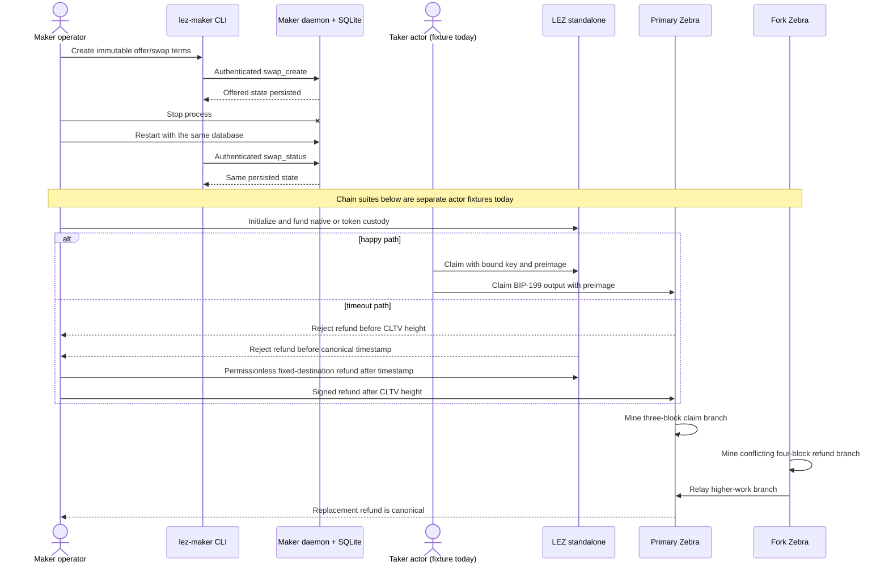

# Manual reproduction guide

Last verified: 2026-07-12

This is the living operator guide for the user-visible flows that the repository
currently proves. Update it in the same change whenever a runner, prerequisite,
actor boundary, expected result, or cleanup rule changes.

## What this guide proves today

| Flow | Boundary exercised | Current limitation |
|---|---|---|
| Maker operator create/status/restart | Actual `lez-maker` process, authenticated loopback RPC, actual `lez-maker-daemon`, and persisted SQLite state | This creates negotiated swap state only; it does not run a taker or submit chain transactions |
| Zcash watcher/store reconciliation | Direction-derived maker runtime, immutable profile/output binding, schema-v3 SQLite journal, restart replay, both funded roles, removals, replacements, terminal outcomes, and exact replay | Uses validated deterministic observations in-process; actual two-Zebra store/restart/requery is still pending |
| Zcash fund/claim/refund/fork | Locally constructed NU6.2 transparent transactions submitted by fixed test actors to two actual pinned Zebra processes | The actors live in one Rust acceptance fixture; they are not yet independent maker/taker processes |
| LEZ native and token claim/refund | Real genesis actor keys submit public transactions to an in-process, ephemeral-port LEZ v0.1.2 standalone sequencer | This is a local compatibility proof, not the incompatible LEZ 0.2 public testnet |
| LEZ recursive execution costs | Exact checked guest replayed through production `V03State` transitions with nested authenticated-transfer and ATA/Token sessions | This measures deterministic local execution, not public-testnet fees or latency |

The following are **not complete yet**: actual two-Zebra watcher/store restart
and requery evidence, one composed LEZ↔ZEC run with
independent maker and taker processes, both ZEC trade directions through all
CLI/daemon/chain boundaries, Delivery/Chat-loss and restart at those boundaries,
recordings generated from that suite, and public-testnet deployment. Do not use
the local fixtures below as evidence for those pending M2 exit criteria.

## User and custody flow



## Fresh-checkout prerequisites

Run all commands from the repository root. A fresh checkout needs:

- Git and `rustup`, with Rust 1.96.0, `rustfmt`, and Clippy;
- Docker Engine and Docker Compose v2 for Zebra and the Risc0 guest builder;
- `curl`, `gcc`, `tar`, `sha256sum`, `awk`, `diff`, and `rg` for the LEZ runner;
- outbound access on the first LEZ run so the script can install pinned `rzup`
  0.5.1/Risc0 3.0.5 tools and download the checksum-verified circuits archive;
  and
- `cargo-deny` 0.19.9 and ShellCheck when reproducing all local quality gates.

Install and confirm the repository toolchain:

```sh
rustup toolchain install 1.96.0 --component rustfmt,clippy
rustc --version
cargo --version
docker version
docker compose version
```

The first two version commands must report 1.96.0. Build the workspace and run
the non-ignored acceptance tests before starting either heavy chain suite:

```sh
cargo build --locked --workspace --all-targets
cargo test --locked --workspace --all-targets
cargo fmt --all --check
cargo clippy --locked --workspace --all-targets --all-features -- -D warnings
cargo deny check advisories bans licenses sources
```

The lockfiles are part of the evidence. Do not omit `--locked` to work around a
dependency change.

## External resources and flakiness

No currently documented user flow calls a public blockchain RPC or faucet.
The maker RPC is a locally created loopback endpoint, both Zebra RPCs are local
ephemeral containers, and the LEZ RPC is an in-process standalone node on an
ephemeral loopback port. Actor funds come from deterministic local genesis or
Regtest coinbase outputs. Therefore a public RPC outage, rate limit, faucet
balance, or testnet reorg cannot affect the flows in this guide today.

Loopback is an isolation property, not a correctness claim. The chain evidence
comes from running the real pinned implementations and crossing their actual
transaction, validation, execution, and canonical-block boundaries:

- Zebra 5.2.0 validates canonical signed V5/BIP-199 bytes through its real
  mempool and consensus services, mines them into blocks, and selects a
  higher-work conflicting branch. Regtest controls mining and network
  activation; it does not simulate public peer propagation or fee pressure.
- The LEZ v0.1.2 standalone sequencer accepts the checked Risc0 guest and actor
  transactions through public RPC, executes production `V03State` transitions,
  persists canonical blocks, and exposes resulting nonce/custody/balance state.
  Standalone does not prove LEZ testnet 0.2 compatibility or public sequencing.

The required evidence ladder is exact local vectors, actual isolated consensus
nodes, a composed independent maker/taker local corridor, and then self-hosted
plus public-route testnet corridors with real funded accounts. Local on-chain
evidence cannot replace the latter two levels. Mainnet remains separately
disabled pending calibration and formal review.

Cold setup and CI do use external software-distribution services:

| Resource | Used by | Pin/integrity control | Availability/flakiness risk |
|---|---|---|---|
| Rust toolchain distribution selected by `rustup` | Fresh toolchain install and CI | Exact Rust `1.96.0`; CI toolchain action is commit-pinned | DNS/CDN/proxy outage can block cold setup; warm installed toolchains avoid it |
| crates.io index and crate downloads | Workspace build, `cargo install rzup`, cargo-deny installation | Cargo lockfiles, exact `rzup 0.5.1`, and crate checksums | Registry/CDN/rate-limit outage can block an uncached build; cached sources avoid most requests |
| GitHub Git endpoints for Logos LEZ, SPEL, Overwatch, Jellyfish, and other locked Git dependencies | First LEZ compatibility build | Cargo lockfiles resolve exact commits; source policy allowlists exact repositories | GitHub/DNS/proxy outage can block an uncached checkout; it cannot silently substitute another locked commit |
| Docker Hub `zfnd/zebra` and `risczero/risc0-guest-builder` | Cold Zebra image build and Risc0 guest build | Zebra `5.2.0` source image and guest builder are digest-pinned | Registry outage, throttling, or authentication policy can block a cold pull; local images reduce but do not guarantee offline BuildKit resolution |
| Google Container Registry distroless image | Cold minimal Zebra image build | Exact `cc-debian13:nonroot` digest | Registry/DNS outage can block a cold pull; no moving tag is accepted |
| GitHub release asset for `logos-blockchain-circuits v0.4.2` | First LEZ run | Exact release URL plus required SHA-256 before extraction | Release/CDN outage can fail after retries; a verified run-specific cache avoids redownload |
| `rzup`-managed Risc0 release endpoint | First install of `r0vm`/`cargo-risczero` 3.0.5 | Runner checks exact tool versions and the final ELF digest/ImageID | Upstream release availability can block cold setup; keep the verified `LEZ_E2E_TOOL_DIR` cache |
| RustSec advisory database and Trivy vulnerability database | cargo-deny locally/CI; Trivy in CI | Scanner actions are commit-pinned; databases intentionally update | Network outage can prevent refresh, and a new advisory/CVE can make a previously green commit fail; this is a security signal, not a flaky test to bypass |

The local tests can still time out under severe CPU, memory, disk, or Docker
contention; this is why the heavy suites are serialized and resource-capped.
Retry only with a fresh run ID after checking the scoped logs. Do not weaken a
digest, checksum, vulnerability result, or consensus assertion to classify an
external outage as success.

Public-testnet corridor work will necessarily add selected LEZ/Zcash RPC
routes and funded transparent accounts or faucets. Before that flow is called
available, this table and the global README must name each endpoint/faucet,
authentication and rate limits, expected funding/confirmation latency,
fallback/self-hosted route, health check, and evidence-retention policy. None
has been selected or is required by the current local suites.

## Isolation and no-clash rules

Choose a new lowercase run ID for every attempt, for example
`manual-zebra-20260711-a`. It may contain only lowercase letters, numbers,
underscores, and hyphens.

- Never run the heavy Zebra and LEZ suites concurrently on the same host.
- Never run two LEZ suites from the same checkout concurrently: the checked
  guest ELF has a repository-relative target path. Use another checkout and
  distinct target/tool directories if parallel execution is unavoidable.
- The Zebra runner creates only `lez-atomic-swaps-${RUN_ID}`, uses ephemeral
  localhost RPC ports, and refuses to reuse an active project.
- Do not run a global Docker prune, stop, kill, or volume-removal command.
- For the strongest LEZ isolation, give every run unique
  `LEZ_E2E_TOOL_DIR`, `LEZ_METHODS_TARGET_DIR`,
  `LEZ_STANDALONE_TARGET_DIR`, and `LEZ_COST_OUTPUT_DIR` values as shown below.
  A shared completed tool cache is safe only when no other run is writing it.

## Flow 1: maker operator CLI and daemon restart

The executable acceptance fixture is the quickest exact reproduction:

```sh
cargo test --locked -p lez-maker-node --test operator_journey -- --nocapture
```

It starts the real daemon on an ephemeral loopback port, creates BTC, reverse
ZEC, and supported LEZ-first XMR swaps through the real CLI, rejects an
unsupported XMR direction and a wrong capability, kills the daemon, restarts it
on a new port with the same SQLite database, and reads the persisted swaps.

To repeat the operator steps manually, first build the two binaries:

```sh
cargo build --locked -p lez-maker-node --bins
```

In terminal 1, use an isolated directory and a capability of at least 24 bytes:

```sh
export RUN_ID=manual-operator-20260711-a
export RUN_DIR="${TMPDIR:-/tmp}/lez-atomic-swaps-${RUN_ID}"
export LEZ_MAKER_RPC_TOKEN=manual-maker-owner-capability-20260711-a
mkdir -p "$RUN_DIR"
target/debug/lez-maker-daemon \
  --listen 127.0.0.1:0 \
  --database "$RUN_DIR/maker.sqlite3" \
  --ready-file "$RUN_DIR/maker.ready"
```

After the ready file appears, use the same environment in terminal 2:

```sh
export RUN_ID=manual-operator-20260711-a
export RUN_DIR="${TMPDIR:-/tmp}/lez-atomic-swaps-${RUN_ID}"
export LEZ_MAKER_RPC_TOKEN=manual-maker-owner-capability-20260711-a
export MAKER_RPC_URL="$(cat "$RUN_DIR/maker.ready")"

target/debug/lez-maker --rpc-url "$MAKER_RPC_URL" create-swap \
  --id manual-zec-reverse-1 \
  --pair zcash \
  --direction taker-sells-lez \
  --confirmations 2 \
  --maker-refund-at 100 \
  --taker-refund-at 120 \
  --earlier-refund-latest 1000 \
  --later-refund-earliest 1200 \
  --required-margin 100

target/debug/lez-maker --rpc-url "$MAKER_RPC_URL" status \
  --id manual-zec-reverse-1
```

Each successful command prints one JSON object. It must contain
`"id":"manual-zec-reverse-1"`, `"pair":"Zcash"`,
`"direction":"TakerSellsLez"`, and `"phase":"Offered"`.

The other currently accepted operator constructions use these exact argument
shapes:

```sh
target/debug/lez-maker --rpc-url "$MAKER_RPC_URL" create-swap \
  --id manual-btc-forward-1 \
  --pair bitcoin \
  --direction taker-sells-foreign \
  --confirmations 2 \
  --maker-refund-at 100 \
  --taker-refund-at 120 \
  --earlier-refund-latest 1000 \
  --later-refund-earliest 1200 \
  --required-margin 100

target/debug/lez-maker --rpc-url "$MAKER_RPC_URL" create-swap \
  --id manual-xmr-lez-first-1 \
  --pair monero \
  --direction taker-sells-lez \
  --confirmations 2 \
  --taker-refund-at 120 \
  --xmr-refund-event-confirmations 2
```

Both print `"phase":"Offered"`. XMR in the opposite direction is deliberately
rejected, and XMR recovery is canonical-LEZ-refund-event-gated rather than
configured with a fabricated Monero deadline.

To prove restart persistence, stop terminal 1 with Ctrl-C and start the same
daemon command again with the same database and ready file. Refresh the URL and
query status again:

```sh
export MAKER_RPC_URL="$(cat "$RUN_DIR/maker.ready")"
target/debug/lez-maker --rpc-url "$MAKER_RPC_URL" status \
  --id manual-zec-reverse-1
```

The same JSON view must be returned after refreshing the daemon's ephemeral
endpoint. The database and readiness file are the run-specific manual-flow
artifacts; remove that specific `$RUN_DIR` only after the daemon has stopped
and the evidence is no longer needed.

## Flow 2: Zcash reconciliation, then actor claim/refund/fork

First reproduce the lightweight runtime/store user-role semantics without
Docker:

```sh
cargo test --locked -p lez-maker-node --test zec_runtime_reconciliation -- --nocapture
cargo test --locked -p lez-swap-store --test zec_event_journal -- --nocapture
```

The first suite must pass both ZEC-funded roles, restart replay, exact-head
validation, pre-dependent replacement, same-transaction re-mining,
post-dependent `ReplacementConflict`, and completed/refunded
`TerminalReorgDetected`. It also proves that missing legacy bindings, mismatched
profile confirmation policies, and a mismatched output envelope fail before any
revision or journal mutation. The second suite proves schema-v3 migration,
atomic swap+binding and event+aggregate rollback, immutable rebinding, lower
commit/probe enforcement, and restart-safe loading. These runtime/store tests do
not substitute for the actual-node command below.

Use a fresh run ID and let the repository runner own the complete Docker
lifecycle:

```sh
RUN_ID=manual-zebra-20260711-a ./scripts/run-zebra-e2e.sh
```

The runner builds a unique digest-pinned Zebra image, starts two disconnected
NU6.2 Regtest nodes with independent ephemeral state and host ports, and exports
their RPC URLs only to the ignored Rust fixture. The fixture then:

1. matures four transparent actor UTXOs and validates the fetched prevouts;
2. rejects a funding transaction whose actor signature was mutated;
3. funds and claims one exact BIP-199 P2SH output with the claimant key and
   preimage, while rejecting a mutated claimant signature; before spending,
   stable RPC queries bind Regtest genesis, NU6.2, raw bytes, canonical block,
   exact outpoint/value/scripts, and derived depth into typed source evidence;
4. funds a second output, rejects its refund before CLTV, then confirms the
   funder's refund at the required height;
5. funds two more outputs for concurrent claim/refund lifecycles; and
6. gives both nodes an identical prefix, mines a three-block claim branch on the
   primary and a conflicting four-block refund branch on the fork node, relays
   the higher-work branch, and verifies the old branch is detached and the
   replacement refund is canonical with at least four confirmations.

Success includes this test result and an actor evidence line containing the
actual transaction IDs and serialized-hex sizes:

```text
test real_actor_keys_fund_claim_and_refund_through_zebra_consensus ... ok
Zebra accepted actor claim ... and refund ...
```

The EXIT trap stops only `lez-atomic-swaps-${RUN_ID}`, removes its volumes and
the image created by that run, and leaves `.e2e/${RUN_ID}/run.env` as the small
endpoint/project manifest. It never prunes unrelated resources.

## Flow 3: LEZ guest deployment and native/token actor lifecycles

This is the exact end-to-end local compatibility command. Use unique paths and
do not run it beside another heavy suite:

```sh
RUN_ID=manual-lez-20260711-a \
LEZ_E2E_TOOL_DIR=/tmp/lez-risc0-manual-lez-20260711-a \
LEZ_METHODS_TARGET_DIR=/tmp/lez-methods-manual-lez-20260711-a \
LEZ_STANDALONE_TARGET_DIR=/tmp/lez-standalone-manual-lez-20260711-a \
LEZ_COST_OUTPUT_DIR=/tmp/lez-costs-manual-lez-20260711-a \
./scripts/run-lez-standalone-e2e.sh
```

The runner checks the exact SPEL/LEZ commits and dependency-feature exposure,
builds the Risc0 3.0.5 guest, checks the ELF digest and ImageID, deploys it
through public RPC into a canonical standalone block, and exercises actual
funded genesis actors.

The native flow is `initialize → fund → claim` and an independent
`initialize → fund → refund` after canonical time. It rejects a wrong preimage,
a valid depositor key used in the claimant role, and an early permissionless
refund without changing the signer nonce or custody.

The token flow creates two official fungible definitions and the actors'
definition-bound associated token accounts (ATAs). Each escrow custody is the
official `ATA(metadata, definition)`. One definition is claimed and the other is
refunded. The suite rejects a wrong preimage, wrong actor role,
cross-definition claimant ATA, early refund, and cross-definition refund
destination, while checking exact holdings and total-supply conservation.

Success ends with all of the following evidence:

```text
proved LEZ cf3639d8252040d13b3d4e933feb19b42c76e14a deployment plus native and two-definition token actor lifecycles
LEZ standalone guest native/token lifecycle proof passed: elf_sha256=a324355c6417f6ac7265ab8ba880287d0976e8c27a672917d293bddd80be7006 image_id=c14c978abbaedeffb54c71aa6a96275d1fdb66fcf79f7343bf6bf7aee04f4483
LEZ native/token recursive cost evidence passed: /tmp/lez-costs-manual-lez-20260711-a/generated.json
```

The generated JSON must be byte-identical to
[`docs/evidence/lez-v0.1.2-escrow-costs.json`](evidence/lez-v0.1.2-escrow-costs.json).
That comparison checks operation order, recursive session topology, segments,
cycle accounting, allocated totals, and per-operation user-cycle budgets.

The sequencer uses an ephemeral port and temporary state and stops when the test
ends. The unique tool, build, and cost directories remain as reproducibility
caches/evidence. Remove only the directories belonging to this run, only after
no process is using them; never delete another run's shared cache.

## Troubleshooting

- **`RUN_ID` is rejected or an active project already exists:** choose another
  lowercase unique ID. Do not take over the reported project; it can belong to
  another operator.
- **A Zebra RPC is not ready within 60 seconds:** the runner prints logs for
  only its two services before scoped cleanup. Check Docker memory/CPU
  availability and the emitted service log, then retry with a new run ID.
- **Docker reports a fixed-port conflict:** the checked Compose file publishes
  `127.0.0.1::18232` ephemerally. Run
  `./scripts/check-docker-isolation.sh`; do not edit in a fixed host port.
- **The LEZ runner cannot find `cargo-risczero` or `r0vm`:** keep its unique tool
  directory intact and rerun after restoring outbound access. The runner itself
  installs and version-checks both tools; a system-wide substitute is not
  accepted.
- **Guest ELF digest or ImageID drift:** stop. Do not update the expected value
  just to make the run green. Compare the lockfiles and
  [`artifact-manifest.toml`](../compat/spel-zec-escrow/methods/guest/artifact-manifest.toml)
  with the reviewed pins.
- **Cost evidence differs:** inspect the generated `cost.log` and
  `generated.json`. Setup transactions and mandatory Clock execution must not
  enter the measured operation list. Treat unexplained cycle or topology drift
  as a code/pin change requiring review.
- **The operator CLI receives HTTP 401:** terminal 1 and terminal 2 are not using
  the same `LEZ_MAKER_RPC_TOKEN`. Do not place a real credential in source,
  shell history, or committed files.
- **An old maker URL fails after restart:** reread `maker.ready`; the daemon
  intentionally binds a new ephemeral loopback port.

## Keeping this guide current

For any flow change, verify the command from a clean checkout or clean target,
update the status table and Mermaid flow, replace expected evidence only after a
passing run, and keep pending actor/public-testnet qualifications explicit.
Milestone evidence and tags remain governed by the
[living implementation plan](implementation-plan.md); this guide never turns a
partial fixture into a completed milestone by itself.
