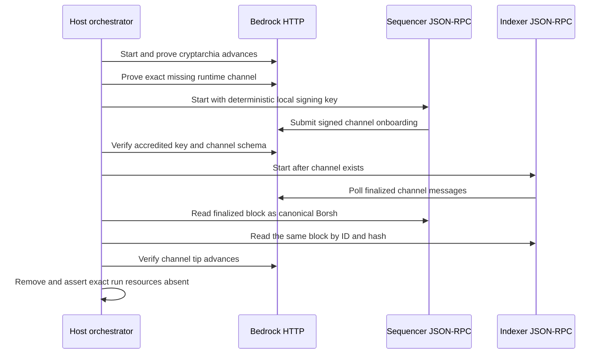

# Manual reproduction guide

Last verified: 2026-07-19

This is the living operator guide for the user-visible flows that the repository
currently proves. Update it in the same change whenever a runner, prerequisite,
actor boundary, expected result, or cleanup rule changes.

Public-testnet setup and funding prerequisites are maintained in the
[Zcash public-testnet guide](zcash-testnet-setup.md). That guide selects a
self-hosted Zebra route and Tatum's public-provider Testnet Zebrad route, but
explicitly leaves live execution pending the project-owned transparent signer,
HTTPS provider transport, and actor adapter.

Bitcoin self-hosted and exact-HTTPS Testnet4 node, wallet, funding, SDK-route,
and external-flakiness steps are maintained in the
[Bitcoin Testnet4 guide](bitcoin-testnet4-setup.md). Its focused checks perform
no public I/O; actual-node M3 certification remains isolated Regtest plus
private LEZ v0.2.

## M3 status: happy, two-lock refund, and absent-maker paths reproduced

The operator-composed M3 PoC has completed both `TakerSellsForeign` and
`TakerSellsLez` against Bitcoin Core 31.1 Regtest and the exact local LEZ v0.2
guest. Maker and taker ran as separate role processes with separate stores and
signing journals. In each direction both chain presignatures existed before the
first effect, scalar reveal waited for both locks, and the opposite claim used
only persisted role state and chain RPCs.

Follow the [M3 local PoC operator guide](m3-local-poc-operator-guide.md) to
build the components, start collision-safe isolated services, repeat both
directions, inspect evidence, and clean only those resources. The secret-safe
retained result is
[m3-local-two-direction-poc-20260715.json](evidence/m3-local-two-direction-poc-20260715.json).
No public RPC, faucet, peer, or public funds were used.

This proves the private local happy path, not production readiness. The later
issue-#112 SDK, vector, Testnet4 configuration, recording, and construction-
mapping outputs are now repository-complete; public live execution and the
owner-selected hardening phases remain deliberately unclaimed. The public
Bitcoin reference actor now projects injected
exact canonical revealing and follow-up claim evidence through revisions three
and four for both roles and directions. Immediately before revision three it
reruns the strict activation-material gate; the taker reproduces the observed
signature from its private scalar, the maker extracts and point-checks that
scalar from its persisted presignature, and only one-way `ClaimEvidence` is
retained. Revision four reconstructs `Completed`, and a fresh offline `status`
reports `complete`. Exact Bitcoin claims are now actor-owned and durable. The
taker alone prepares a revealing Bitcoin claim at revision two; the maker alone
prepares a follow-up Bitcoin claim at revision three and re-extracts its scalar
from the durable revealing witness plus its persisted LEZ presignature. Exact
public bytes are journaled before one authorized send. `Started` and `Unknown`
remain observe-only across restart, mismatched bytes grant no authority, and
local projection waits for typed Core evidence that the same bytes are
finalized at the agreement's signed confirmation depth.

Run `m3actor-20260716n` completed that actual-node certification at pushed
`origin/main` commit
`6ded2f9b8ba9ec8e0cfbf06287da92d34256f91a` on
2026-07-16T01:00:30Z. Both maker and taker reached revision 4,
`phase=completed`, and offline next action `complete` in both directions.
Each direction recorded exactly two Bitcoin effects and three LEZ effects,
including the actor-owned claim on each chain. Terminal replay produced zero
resubmissions, and exact run cleanup removed every captured container, network,
volume, image, and reservation without targeting foreign resources. The exact
refund plan remains bound in the countersigned agreement. Public
schema-3 `recover` now composes both Bitcoin and LEZ refund legs deterministically
with role authority, durable exact bytes, one-attempt submission, observe-only
ambiguous recovery, and finalized-only revision 2 to 3 to 4 projection in both
directions. Run `m3refund-20260716h` additionally reproduced both two-lock ordered refund
directions through actual nodes with terminal revision four and zero replay
submissions. Run `m3firstlock-20260716h` also reproduced both first-lock-only
absent-maker directions through terminal revision 2 with no maker second-lock
effect and zero replay submissions. The clean overlap run, accepted public
durable lifecycle SDK, official/independent vectors, three recordings/private
bundle, and public-node setup guidance are now GREEN. Arbitrary-N/same-
direction scheduling, chaos/adversarial hardening, live public routes, formal
review, and upstream DLC vector acceptance remain later work. Those items do
not reopen the completed progressive M3 local PoC.

### Repeat the M3 timeout/refund path

Build and run the deterministic public-command gate first:

```sh
cargo test --locked -p btc-reference-actor --all-targets
```

The current gate exercises
public `recover` through both direction-correct LEZ/Bitcoin orders, role-shaped
Bitcoin refund authority, pre-deadline no-send, exact-byte persistence, the
one-winner/one-attempt journal, observe-only `Started`/`Unknown`/`Accepted`,
owner/nonowner projection, and finalized-only revisions 2 to 3 to 4. These are
deterministic ports with temporary local files; the command uses no Docker, RPC,
faucet, peer, funds, or external network.

For the manual actual-node rehearsal, follow the
[M3 timeout/refund procedure](m3-local-poc-operator-guide.md#manual-actor-timeoutrefund-recovery).
It uses a fresh isolated Core 31.1 Regtest node and local LEZ v0.2
Bedrock/sequencer/indexer plus two role sidecars. Funds are deterministic local
Regtest/genesis outputs; no public RPC, faucet, deployment, or funds participate.
Retained run `m3refund-20260716h` proves this exact two-lock actual-node path.
It does not prove the separate post-reveal survivor journey or concurrent swaps. Moving LEZ
tips, indexer readiness, the bounded request
timeout, and the fixed 4096-block discovery window can cause local observation
retries; they never authorize another send.

### Repeat the M3 first-lock absent-maker path

Use the same verified prerequisites as the happy path, a never-used run ID,
and the repository-owned actor journey:

```sh
export RUN_ID=m3firstlock-manual-001
export M3_ACTOR_POC_JOURNEY=first_lock_refund
./scripts/run-m3-actor-local-poc.sh
```

Assert the terminal and cleanup packets with the exact `jq` checks in the
[README quick start](../README.md#m3-public-actor-local-poc-quick-start). The
runner emulates both real user role shapes: maker and taker activate separately;
the taker alone reaches revision 1 after its direction-correct first lock; the
maker stays offline and produces no second-lock effect; the taker waits for the
signed cutoff and Bitcoin CSV or finalized LEZ deadline; two fresh cross-chain
reads admit one refund; then a fresh maker reconstructs first lock and refund
from its own store plus chain RPCs. Both roles finish revision 2 `refunded`.

Runtime chain endpoints are ephemeral literal-loopback Core, LEZ sequencer,
and LEZ indexer RPCs. Funds are deterministic Regtest/genesis allocations. No
public RPC, faucet, peer, deployment, or public funds participate. Bedrock may
attempt `pool.ntp.org:123/udp`, but certification does not depend on success.
Moving finalized tips can cause bounded read-only retries; timeout, transport,
malformed evidence, and every non-`moving_tip` remote error fail immediately.

### Repeat the M3 post-reveal survivor path

Use the same verified local prerequisites as the happy path, choose a fresh ID,
and select the survivor journey. The runner creates its own isolated Core 31.1
Regtest and private LEZ v0.2 services; do not start shared manual nodes first.

```sh
export RUN_ID=m3survivor-manual-001
export M3_ACTOR_POC_JOURNEY=survivor_claim
./scripts/run-m3-actor-local-poc.sh

export M3_EVIDENCE="$PWD/.e2e/$RUN_ID/m3-actor-poc/evidence"
jq -e '.kind == "m3_actor_two_direction_survivor_claim_local_poc" and
  .journey == "survivor_claim" and .result == "passed" and
  .survivor.revealer == "taker" and .survivor.follower_role == "maker" and
  .survivor.protected_absence.revealer_actor_invocation_count == 0 and
  .survivor.intermediate.phase == "claim_evidence_available" and
  .survivor.intermediate.lifecycle_disposition == "recovering" and
  .survivor.intermediate.terminal == false and
  .survivor.intermediate.remaining_leg_canonical_and_claimable == true and
  .survivor.delayed_revealer_catchup.observation_only == true and
  .survivor.delayed_revealer_catchup.bitcoin_successful_resubmission_count == 0 and
  .survivor.delayed_revealer_catchup.lez_successful_resubmission_count == 0 and
  .survivor.delayed_revealer_catchup.successful_resubmission_count == 0 and
  all(.survivor.direction_evidence[];
    .completion_boundary.completed_before_signed_refund_boundary == true) and
  all(.directions[];
    .terminal_revision == 4 and .terminal_phase == "completed") and
  .replay_resubmission_count == 0 and
  .public_rpc_used == false and .faucet_used == false and
  .public_funds_used == false and .private_material_disclosed == false' \
  "$M3_EVIDENCE/m3-actor-local-poc.json"

for direction in taker_sells_foreign taker_sells_lez; do
  jq -e '.journey == "survivor_claim" and
    .availability.taker_invocations_after_reveal_before_maker_terminal == 0 and
    .intermediate.protocol_phase == "claim_evidence_available" and
    .intermediate.terminal == false and
    .completion.maker_revision == 4 and
    .completion.boundary.completed_before_signed_refund_boundary == true and
    .delayed_revealer_catchup.per_chain.bitcoin.successful_resubmission_count == 0 and
    .delayed_revealer_catchup.per_chain.lez.successful_resubmission_count == 0 and
    .delayed_revealer_catchup.successful_resubmission_count == 0 and
    .secret_recorded == false' \
    "$M3_EVIDENCE/${direction}-survivor-claim.json"
done

jq -e '.result == "passed" and .all_exact_run_resources_absent == true and
  .foreign_resources_targeted == false and .broad_cleanup_used == false' \
  "$M3_EVIDENCE/cleanup-attestation.json"
```

This emulates the real role split after both locks. The taker owns and publishes
the reveal, then the journey fail-closes every harnessed taker actor invocation
until maker terminality. A fresh
maker reads the canonical reveal and commits revision 3; that one-shot process
exits. Another fresh maker resumes from maker-only state, claims the remaining
leg, and reaches terminal revision 4. Only then can a fresh taker process return
to observe revisions 3 and 4 without submitting. In `TakerSellsForeign`, the
remaining Bitcoin outpoint must still be canonical and unspent below its CSV
boundary. In `TakerSellsLez`, the exact finalized LEZ escrow must remain
`funded` with full custody before its signed refund timestamp.

No Delivery, Chat, public RPC, faucet, peers, or public funds participate. The
only disclosed egress attempt is pinned Bedrock's best-effort
`pool.ntp.org:123/udp`; certification does not depend on it. Advancing LEZ tips
can produce bounded read-only `moving_tip` or unavailable observations, so the
local run may take longer without gaining a second submission authority. Keep
the full `.e2e` root private and never reuse a successful or failed run ID.

### Provision exact Bitcoin funding and the agreement before either effect

Pushed `a8688a3` removes the former post-confirmation agreement gap. Run the
detailed, no-clobber recipe in the
[M3 operator guide](m3-local-poc-operator-guide.md#generate-the-agreement-fixture-before-funding)
once for each direction. The exact local command surfaces are:

```sh
cargo run --locked -p btc-local-poc-provision -- generate \
  --planning-file "$AGREEMENT_PLANNING" \
  --output-root "$DIRECTION"

# Use Core gettxout to populate the candidate service input; it does not broadcast.

cargo run --locked -p btc-local-poc-provision -- prepare-funding \
  --spec-file "$FUNDING_PREPARE_SPEC" \
  --output-root "$DIRECTION"

# Use Core testmempoolaccept on the exact persisted bytes; it does not broadcast.

cargo run --locked -p btc-local-poc-provision -- finalize \
  --spec-file "$AGREEMENT_FINALIZE_SPEC" \
  --output-root "$DIRECTION"
```

`generate` runs after the distinct LEZ owner accounts exist and before either
chain effect. It creates a fresh normalized
absolute root and `private/` directory at mode `0700`, then create-new,
single-link mode-`0600` files for maker/taker signing, refund, and claim
destinations plus the adaptor scalar and secret-free public specification. It
refuses an existing root. Use the separate pinned Rust 1.96
`lez-v02-account-id` helper exactly as shown in the operator guide; the root
graph deliberately does not reimplement the official Logos account mapping.

The prepare document contains `schema_version`, `stage1_public_sha256`,
`direction`, `contract_value_sat`, `fee_sat`, and a `service_input` object with
`transaction_id`, `output_index`, `value_sat`, `script_pubkey`, and
`signing_secret_key_file`. That last file is a raw 32-byte key in a mode-`0600`
owner-private file, extracted directly from the Core funding credential without
stdout. `prepare-funding` creates `funding-transaction.hex` and
`funding-transaction-summary.json`, both mode `0600`, and prints only the
secret-free summary. It proves the key/script relation, exact BIP-341
authorization, canonical bytes/hash/txid, contract/change/fee, one-item
`SIGHASH_DEFAULT` witness, and Merkle root. It reports
`node_state_asserted: false` because it performs no RPC.

Before `prepare-funding`, the operator uses Core `gettxout` on the candidate
outpoint. After preparation, read-only `testmempoolaccept` consumes the exact
persisted transaction bytes. Those calls establish the current local UTXO view
and current node policy, not a reservation, broadcast, confirmation, or
finality. `finalize` then binds the exact raw funding bytes and
SHA-256, service-input value/script, funding txid/vout/value, claim value, Core
genesis and confirmation policy, finalized LEZ preparation facts, and a
recovery plan containing `refund_csv_blocks`,
`planned_bitcoin_funding_anchor_height`, `bitcoin_refund_height`, both typed
deadlines, and their margin. It rejects the former broadcast, observed-
confirmation, and observed-anchor fields, countersigns both roles, and requires
byte-identical canonical agreement replay.

Complete both Bitcoin and LEZ role-local signing journals from that agreement
before the first chain submission. When the Bitcoin lock is due, submit the
persisted exact bytes, mine exactly one isolated Regtest block, and require the
containing height to equal the signed planned anchor. This ordering maximizes
atomicity because either post-lock claim needs only durable local material and
canonical reveal evidence, but no distributed commit exists across files,
journals, actor stores, Core, and LEZ.

Each multi-file output group is create-new and fail safe, not one filesystem
transaction. Before any effect, retire an interrupted direction root and start
from fresh stage one rather than deleting selected outputs. After any possible
effect, preserve that exact root and reconcile or refund; never regenerate
authority for already-locked funds.

Repeat its deterministic both-direction gate separately:

```sh
cargo test --locked -p btc-local-poc-provision --all-targets
cargo clippy --locked -p btc-local-poc-provision --all-targets --all-features -- -D warnings
```

All eleven tests use temporary local files and supplied facts, not Core, LEZ,
Docker, a faucet, or a public endpoint. They cover both directions,
genuine rawtr signing, public/private crosswires, malformed or drifted funding,
authority/key and recovery drift, strict JSON, no-clobber, owner-only modes,
unsafe links, and stdout secret scanning. Actual-node fact collection and the
isolated helper have separate gates.

The combined local entry point is `scripts/run-m3-actor-local-poc.sh`, with
per-direction work in `scripts/run-m3-actor-direction.sh`. After building the
verified guest artifact target and populating both locked Cargo graphs, run it
with a fresh ID and exact local LEZ prerequisites:

```sh
export RUN_ID=m3actor-manual-20260715a
export LEZ_V02_SOURCE_DIR=/absolute/path/to/clean/logos-execution-zone-v0.2.0
export LEZ_V02_SERVICES_DIR=/absolute/path/to/locked/release-binaries
export LEZ_V02_R0VM=/absolute/path/to/verified/r0vm
export LEZ_V02_ARTIFACT_TARGET_DIR=/absolute/path/to/verified/lez-artifact-target
export RAPIDSNARK_LIB_DIR=/absolute/path/to/verified/rapidsnark-v0.0.8-libraries
export BINDGEN_EXTRA_CLANG_ARGS=-I/usr/lib/gcc/x86_64-linux-gnu/13/include
./scripts/run-m3-actor-local-poc.sh
```

The audited run-n command used these exact already-verified local inputs:

```sh
RUN_ID=m3actor-20260716n \
LEZ_V02_SOURCE_DIR=/tmp/lez-v020-native-investigation \
LEZ_V02_SERVICES_DIR=/tmp/lez-v02-services-a58fbce2-20260713/release \
LEZ_V02_R0VM=/tmp/lez-atomic-swaps-tools/risc0-3.0.5/home/extensions/v3.0.5-cargo-risczero-x86_64-unknown-linux-gnu/r0vm \
LEZ_V02_ARTIFACT_TARGET_DIR=/tmp/lez-m3-artifact-20260715a \
RAPIDSNARK_LIB_DIR=/tmp/lez-atomic-swaps-tools/rapidsnark-v0.0.8/d4133227 \
BINDGEN_EXTRA_CLANG_ARGS=-I/usr/lib/gcc/x86_64-linux-gnu/13/include \
./scripts/run-m3-actor-local-poc.sh
```

That invocation is an audit record, not a reusable command: never reuse its
run ID or existing run root. For a portable repetition, provision equivalent
verified inputs, choose a fresh ID, and use the preceding generic command.

The runner refuses reused outer, child, and Docker identities, prebuilds every
actor/sidecar binary offline, starts both actual local node stacks, executes the
directions sequentially, and writes the terminal and cleanup packets below
`.e2e/$RUN_ID/m3-actor-poc/evidence`. Apply the exact `jq` assertions in the
[operator guide](m3-local-poc-operator-guide.md#run-the-combined-actual-node-public-actor-flow)
before treating a zero exit as evidence. Keep the entire run root private and
never reuse it after success or failure. Fresh LEZ identity schema version 2
exposes `account_id`, `account_id_hex`,
`vault_account_id`, `vault_account_id_hex`, and `x_only_public_key`. The Vault
ID is derived by official LEZ code from that owner and the Vault program; the
local stack requires the owner and Vault overrides as a pair before genesis.

Core 31.1 requires the second `gettxspendingprevout` parameter to be the
options object
`{"mempool_only":false,"return_spending_tx":true}`, not the older positional
booleans. The M3 adapter uses that object and verifies the returned spending
transaction bytes; a mempool observation must omit `blockhash`, while a
confirmed observation must carry the exact containing block hash. LEZ actor
scans use a finite 30,000 ms read-only request timeout. A timeout remains
uncertain observation and can be retried with a fresh observation request; it
never authorizes another chain submission.

### Component-level Bitcoin and signing rehearsals

The isolated Bitcoin Core 31.1 infrastructure and typed P2TR transaction slice
now reproduce a one-process, two-party `MuSig2` adaptor-signature Bitcoin-leg
fixture. A second runnable fixture uses separate maker/taker signer-state
objects, fresh OS-random nonces, commitment-before-reveal, and two
domain-separated BTC/LEZ messages to prove both scalar-reveal orders. The
role-local crash-safe journal, fresh-process maker/taker runner, external
adaptation/extraction, and checked LEZ aggregate-witness guest are also
reproducible component gates. They do not by themselves reproduce the composed
local-chain result above.

Start with the standalone cryptographic fixture. It needs Rust/Cargo and locked
registry artifacts, but no Docker, node, RPC, faucet, public funds, or public
network:

```sh
cargo run --locked -p lez-btc-swap-sdk --example musig2-adaptor-poc
```

A successful run prints `schema_version=1`, `fixture_only=true`, fixed
`role_order=maker,taker`, the aggregate internal key and Taproot output key, a
full compressed adaptor point, both nonce-commitment hashes, the 65-byte
adaptor presignature, the adapted 64-byte BIP-340 signature, the extracted
32-byte scalar, txid/wtxid, and `witness_items=1` plus `witness_bytes=64`. The
fixture checks the Taproot tweak and output parity against `rust-bitcoin`, both
participants derive the same adaptor presignature, adaptation verifies under
the tweaked key, extraction reproduces the committed point, and the completed
signature passes the SDK's independent `rust-bitcoin` verification for the
exact transaction.

Those outputs are deterministic public Regtest vectors, not secrets or
production signing authority. Both signers and the adaptor secret live in one
process. Nonce commitments are computed and locally recomputed but are not
exchanged before nonce reveal. No durable one-use nonce reservation,
consumption or restart journal, independent actor authentication, Core policy
or consensus acceptance, LEZ composition, complete direction, or atomicity is
proved. The beta `musig2` 0.4.1 dependency also retains cloneable/non-zeroized
secret types; clearing the example's input byte arrays does not establish
complete in-memory erasure.

Run the production-shaped in-memory signing boundary separately:

```sh
cargo run --locked -p lez-btc-swap-sdk --example dual-chain-adaptor-poc
```

This command creates distinct BTC and LEZ signing sessions over the same
adaptor point, exchanges role-bound commitments before public nonces, verifies
both peer partials, and completes the signatures in both reveal orders. Require
`nonce_source=os_random`, `commitment_exchange_before_nonce_reveal=true`,
`dual_domain_sessions=true`, `shared_adaptor_point=true`,
`btc_witness_items=1`, and `btc_witness_bytes=64`. It intentionally also prints
`fixture_only=true`, `signer_separation=distinct_state_objects`,
`actual_lez_submission=false`, and `durable_nonce_journal=false`. Those four
nonclaims prevent this in-process transcript from being mistaken for the
independent-actor local-devnet corridor.

Run the package gates separately:

```sh
cargo test --locked -p lez-btc-swap-sdk --all-targets
cargo clippy --locked -p lez-btc-swap-sdk --all-targets --all-features -- -D warnings
RUSTDOCFLAGS="-D warnings" cargo doc --locked -p lez-btc-swap-sdk --no-deps
```

`cargo test --all-targets` compiles examples, including all M3 fixtures, but it
does **not** execute their `main` functions. Run the standalone command above
for the cryptographic transcript and the Core runner below for actual-node
policy/consensus evidence. Package tests cover deterministic Taproot and
transaction construction plus rejection cases; they do not substitute for
either executable fixture.

### Repeat the durable signer and checked LEZ guest component gates

The role-local journal and BTC SDK restart bridge need no Docker, chain endpoint,
faucet, or public network. The journal uses a new temporary owner-only SQLite
database for every test:

```sh
cargo test --locked -p lez-swap-store --test adaptor_session_journal --no-fail-fast
cargo test --locked -p lez-swap-store --no-fail-fast
cargo test --locked -p lez-btc-swap-sdk --all-targets
cargo test --locked -p lez-adaptor-role-runner
```

Require 6 focused journal tests and all 60 package tests to pass. They prove
reserve-before-commitment, commitment-before-nonce reveal, exact-message and
wire-byte immutability, one-use nonce fingerprints, atomic nonce consumption
with an exact partial outbox, restart replay, and a single callback across two
concurrent SQLite connections. They deliberately report
`nonce_encrypted_at_rest=false`: the serialized nonce is plaintext in a mode
`0600` database/WAL until consumption. Do not treat this as production key
custody.

Require all 12 BTC SDK tests to pass. The restart cases verify the full durable
context, each role's own and peer nonce commitments, the secret/public nonce
relation, partial signatures, and the aggregate presignature. These are exact
library boundaries. Require all 4 role-runner integration journeys to pass;
they spawn fresh maker/taker OS processes with separate SQLite journals for
both LEZ and Bitcoin sessions, replay exact partials after restart, adapt one
signature, recover the point-checked scalar from the other, and reject
session/role/message/packet cross-wires without printing secrets. They remain a
signing component, not complete chain-connected reference actors.

The official-wire witnessed sidecar boundary is reproduced separately. The
first two commands need only the locked root graph; the third uses the pinned
LEZ v0.2 graph and a locally cached, checksum-verified Rapidsnark build:

```sh
cargo test --locked -p lez-bridge-protocol
cargo test --locked -p lez-bridge-client
RAPIDSNARK_LIB_DIR=/tmp/lez-atomic-swaps-tools/rapidsnark-v0.0.8/d4133227 \
BINDGEN_EXTRA_CLANG_ARGS=-I/usr/lib/gcc/x86_64-linux-gnu/13/include \
cargo +1.96.0 test \
  --manifest-path compat/lez-v0_2-sidecar/Cargo.toml \
  --locked --offline --test witnessed_claim_prepare
```

Require 20 protocol, 21 client, and 3 focused sidecar tests. They prove exact
message/hash reservation, destination/aggregate-authority separation, official
signature verification, fresh-process completion without rereading the nonce,
exact replay, and conflicting-completion rejection. They do not start the LEZ
node or submit a transaction. A cold environment must first populate the pinned
git and circuit/tool caches through the full verifier below; that setup can be
network-flaky, while the shown `--offline` sidecar test is not.

The standard LEZ v0.2 closure verifier rebuilds the current guest with the
digest-pinned Risc0 builder, runs the recursive checked-program tests, derives
the ImageID, and exercises the repository's dependency and generated-client
gates. Use a fresh run ID so all tool and target directories are isolated:

```sh
RUN_ID=m3-lez-witness-manual-20260715a \
./scripts/verify-lez-v02-provisional.sh
```

On a warm verified cache, the focused recursive lifecycle can be repeated with
the same pinned Risc0 3.0.5 toolchain used by that verifier. The full verifier
is the portable entrypoint because it installs or validates the exact toolchain
instead of assuming a host path. Require ELF SHA-256 `a199c5be...e293`,
ImageID/ProgramId `39b6a4db...4dec`, seven contract tests, and four recursive
methods tests. The witnessed test must transfer custody to the claimant while
leaving the aggregate authority balance unchanged, and must reject a single
share, wrong exact message, mismatched authority, and legacy preimage bypass.
This rebuild executes the checked guest recursively; it does not deploy or
submit that claim to the local sequencer.

Cold execution may download checksum-pinned Risc0 tooling, the digest-pinned
guest-builder image, locked Rust/git dependencies, and the hash-pinned Logos
circuit archive. Their hosts, DNS/TLS, registries, and Docker availability can
cause setup flakiness. The journal-only commands have no chain or Docker
dependency after locked Rust artifacts are cached.

### Repeat the actual Bitcoin Core flow

Prerequisites are Docker, Rust/Cargo 1.96, Bash, curl, Git, GnuPG, jq,
Python 3, ripgrep, SHA-256 tools, and tar. Use a fresh 8-64 character lowercase
`RUN_ID`:

```sh
RUN_ID=m3-core-manual-20260715a ./scripts/run-bitcoin-core-e2e.sh
```

For an external actor/composed runner, select service mode and retain only this
run's resources temporarily:

```sh
RUN_ID=m3-core-service-20260715a \
BITCOIN_CORE_E2E_MODE=service \
BITCOIN_CORE_E2E_KEEP_RUNNING=1 \
./scripts/run-bitcoin-core-e2e.sh
```

The command prints the dynamic RPC URL, separate mode-`0600` maker/taker curl
configs, owner-only deterministic funding handoff, evidence path, and exact
container/volume/network/image cleanup commands. The funding handoff contains a
private Regtest key and must never be copied into evidence or logs. Service mode
sets every P2TR/adaptor/LEZ/atomicity proof claim to false; those become true
only in a composed run. Execute the printed exact cleanup commands when manual
actor work ends—never use a broad project, label, or Docker prune.

For certification, first commit or stash every change and require the runner to
reject a dirty tree:

```sh
RUN_ID=m3-core-cert-20260715a \
BITCOIN_CORE_E2E_REQUIRE_CLEAN=1 \
./scripts/run-bitcoin-core-e2e.sh
```

The runner verifies the official Core 31.1 release, its source tag and Guix
attestations, builds the isolated image, starts a real Regtest daemon with a
dynamic loopback-only RPC port and no published P2P port, and gives maker and
taker distinct restricted RPC credentials. The fixed `rawtr(G)` 50 BTC output
is only the mature mining source. A taker-labeled transaction funds the exact
1 BTC aggregate-key-plus-CSV P2TR contract; after confirmation, the
maker-labeled path broadcasts the 0.99999 BTC one-item key-path claim produced
by the two-party adaptor fixture. Core must accept both transactions into
policy and consensus, and the taker-labeled observer must see the contract
outpoint spent exactly once.

To reuse an already downloaded archive, pass only an absolute candidate path;
all release, signer, source, and Guix checks still run:

```sh
RUN_ID=m3-core-manual-20260715b \
BITCOIN_CORE_ARCHIVE_PATH=/absolute/path/bitcoin-31.1-x86_64-linux-gnu.tar.gz \
./scripts/run-bitcoin-core-e2e.sh
```

After ordinary success, inspect the private runtime, cleanup, and attestation
packets:

```sh
RUN_ID=m3-core-manual-20260715a
jq '{result, repository, core, isolation, chain,
  p2tr_contract, p2tr_funding, cooperative_key_path_claim,
  security_claims,
  actor_rpc: {users: .actor_rpc.users, results: .actor_rpc.results},
  external_dependencies}' \
  ".e2e/${RUN_ID}/bitcoin-core/evidence/runtime.json"
jq . ".e2e/${RUN_ID}/bitcoin-core/evidence/cleanup.json"
jq . ".e2e/${RUN_ID}/bitcoin-core/evidence/attestation.json"
```

A passing runtime must report Core 31.1, Regtest genesis
`0f9188...2206`, final height 103, funding in block 102, claim in block 103, an
empty final mempool, zero peers, `networkactive=false`, exact 64-byte
`SIGHASH_DEFAULT` witness with no annex, and the exact contract outpoint spent
once. The strict security scope is equally important. Require these values,
not merely `result=passed`:

```sh
jq -e '
  .result == "passed"
  and .security_claims.direction == "TakerSellsForeign"
  and .security_claims.fixture_rpc_role_ordering_proven == true
  and .security_claims.taproot_tweak_and_consensus_spend_proven == true
  and .security_claims.known_private_key_fixture == true
  and .security_claims.musig2_taproot_fixture_proven == true
  and .security_claims.adaptor_signature_fixture_proven == true
  and .security_claims.scalar_extraction_fixture_proven == true
  and .security_claims.production_signing_authority_proven == false
  and .security_claims.independent_actor_processes_proven == false
  and .security_claims.durable_actor_stores_proven == false
  and .security_claims.nonce_commitment_exchange_proven == false
  and .security_claims.crash_safe_nonce_journal_proven == false
  and .security_claims.lez_composition_proven == false
  and .security_claims.atomicity_proven == false
  and .actor_rpc.credentials_distinct == true
  and .external_dependencies.runtime_external_resources == []
  and .external_dependencies.public_rpc_used == false
' ".e2e/${RUN_ID}/bitcoin-core/evidence/runtime.json"
```

The current clean-commit certification packet is
`m3-musig-exact-f5a9caa`, tested at pushed commit
`f5a9caa66b04b0bec1a86cb732f5a64f63852e6e`. Its chain facts, exact fixture
scope, true/false security claims, cleanup result, and packet hashes are in
[`docs/evidence/m3-bitcoin-core-musig2-f5a9caa-20260715.json`](evidence/m3-bitcoin-core-musig2-f5a9caa-20260715.json).
The older
[`m3-p2tr-exact-4f7b6b3` packet](evidence/m3-bitcoin-core-p2tr-4f7b6b3-20260715.json)
is historical known-single-key P2TR evidence. It does not prove `MuSig2`, an
adaptor signature, or scalar extraction and must not be used as current M3
cryptographic evidence.

### Keep the successful node for manual role RPCs

Retention remains available only after the complete runner flow succeeds:

```sh
RUN_ID=m3-core-live-20260715a \
BITCOIN_CORE_E2E_KEEP_RUNNING=1 \
./scripts/run-bitcoin-core-e2e.sh

curl --config \
  ".e2e/${RUN_ID}/bitcoin-core/credentials/maker.curlrc" \
  --data '{"jsonrpc":"2.0","id":1,"method":"getblockchaininfo","params":[]}' \
  | jq .
curl --config \
  ".e2e/${RUN_ID}/bitcoin-core/credentials/taker.curlrc" \
  --data '{"jsonrpc":"2.0","id":1,"method":"getnetworkinfo","params":[]}' \
  | jq .
```

Those mode-`0600` curl configuration files contain plaintext local-only actor
passwords under a mode-`0700` run root. Never print, copy, commit, or reuse
them. Use the exact cleanup commands printed by the runner; their equivalent is:

```sh
project="lez-atomic-swaps-bitcoin-core-${RUN_ID}"
docker container rm --force "${project}-bitcoin-core"
docker volume rm "${project}_core_data"
docker network rm "${project}_bitcoin_core_private"
docker image rm "lez-atomic-swaps-bitcoin-core:${RUN_ID}"
```

Runtime uses no public RPC, faucet, public funds, public peers, or public chain.
Cold setup does use signed assets from bitcoincore.org, the Bitcoin source tag
and Guix attestations from GitHub, a digest-pinned `gcr.io` distroless base, and
locked Cargo registry artifacts. DNS/TLS failures, registry or host
availability, rate limits, signature-service changes, and vulnerability-
database outages in CI can therefore make setup or scanning flaky without
changing the deterministic local-chain assertions. Reusing a verified Core
archive reduces downloads but does not remove the other provenance checks.

The complete operator sequence for both M3 happy directions is now in the
[dedicated M3 guide](m3-local-poc-operator-guide.md). It composes the durable
fresh-process role runner, Bitcoin helper, Bitcoin Core 31.1, the witnessed LEZ
guest, and local LEZ v0.2 sequencer and indexer. It is deliberately an
operator-driven recipe rather than one released application command. The
reference actor reaches offline terminal revision four, and both its Bitcoin
and LEZ claim effects plus bounded observations are composed. Audited run
`m3actor-20260716n` passed both directions through Core 31.1 Regtest and the
private local LEZ v0.2 stack. Both roles finished revision four with next action
`complete`, and replay resubmission count remained zero.
Public-actor two-lock refund recovery in `m3refund-20260716h` and first-lock
absent-maker recovery in `m3firstlock-20260716h` are GREEN in both directions.
Direct post-reveal survivor continuation is clean pushed-commit GREEN in
`m3survivor-20260716c`; the secret-safe packet is
`docs/evidence/m3-local-two-direction-survivor-claim-poc-20260716.json`.
Canonical maker-lock containing-time enforcement is GREEN at `3d202f7`.
SDK-owned same-action Maker submission, its actual-node admission packet, and
the accepted opposite-direction concurrent journey are GREEN. Arbitrary-N,
same-direction scheduling, process-kill, crash/chaos, and adversarial journeys
remain later hardening.

The same guide now includes the
[custom-token F7 pair and verified wallet-cache procedure](m3-local-poc-operator-guide.md#reproduce-the-custom-token-f7-happy-pair-with-the-verified-wallet-cache).
It selects the real Maker/Taker roles, runs both economic directions through
fresh isolated Core and LEZ nodes, checks exact `2 Bitcoin + 4 LEZ` effects,
directional `175/75/0` and `75/175/0` balances, zero replay, and exact cleanup.
The persistent cache contains only the pinned executable and manifest. It uses
no RPC or download and cannot introduce faucet/public-endpoint flakiness;
uncached locked build inputs remain an offline setup availability risk. The
measured hardened hit saves 192.07 seconds versus cold preparation without
weakening source, toolchain, native/runtime-library, expected-output, policy,
or private-copy checks.

## Repeat the M3 SDK, vector, route, and recording gates

The fast application-facing closure checks need no Docker, chain node, public
RPC, faucet, peer, or funds:

```sh
cargo test --locked -p lez-btc-swap-sdk --all-targets --all-features
cargo test --locked -p lez-btc-core-adapter --all-targets --all-features
./scripts/check-m3-cryptographic-vectors.sh
./scripts/test-bitcoin-testnet4-route-contract.sh
```

The SDK suite drives both claim directions and both ordered-refund directions,
reconstructs the role-fixed lifecycle after every revision, verifies
byte-identical replay produces no store write, and rejects cross-chain or
agreement substitutions. The vector gate checks immutable upstream hashes and
executes official BIP-340/BIP-327 operations plus the independent adaptor
fixture. The Testnet4 gate constructs self-hosted loopback and exact HTTPS
clients and validates chain/genesis/index/profile rejection without making a
request.

Follow the [Bitcoin Testnet4 guide](bitcoin-testnet4-setup.md) when you need to
install exact Core 31.1, synchronize a self-hosted node, create/fund a separate
operator wallet, or compose an approved HTTPS route. Those steps use external
resources and are not local certification prerequisites.

To repeat the actual-node D1 artifacts and produce the literal videos, use the
[private recording procedure](../README.md#private-m3-terminal-recording-quick-start)
with three fresh unique run IDs. The reference private bundle binds happy,
refund, and concurrent recordings at evidence commit `a6eb1ad` to verifier
commit `946208a`, is mode `0600`, and has SHA-256
`3d7d7adc12571a610be21a18b746e68cb17311ea1224191fcdcdf1b39a86c7cc`.
Never publish the surrounding `.e2e` roots: they contain actor-private
state. The source verifier's output is a hash index, not a replacement for the
three replayable terminal streams. After those pass, follow the operator
guide's `Render and verify the three private demo videos` subsection. It uses
the digest-pinned VHS container with network disabled and emits one mode-
`0600` MP4 per scenario plus a sealed three-video bundle; no chain rerun or
public resource is involved.

The retained reference render is private at
`.e2e/m3-private-demo-videos-20260719c/`. Its happy, refund, and concurrent
videos all passed regenerated source verification, complete stream decode, and
sampled scenario/conditional-atomicity/tail frames. The mode-`0600` bundle
binds source commit `a6eb1ad` to renderer/verifier commit `846ba56` and has
SHA-256 `7697a27c80c8f90856d6592051805a8923fe564aa01b0dff4109bd5c5f101ba8`.
Keep this reference local; it is reproducible using the commands above and is
not a public deployment artifact.

## Can I run the complete M3 happy path myself?

Yes. Follow the [M3 local PoC operator guide](m3-local-poc-operator-guide.md).
It requires Docker and Rust/Cargo, assigns distinct run IDs to the Core and LEZ
stacks so collision guards remain effective, uses literal loopback RPCs and
deterministic local funds, and gives chain and journal checks for both
directions. It is a manual operator recipe today: it reproduces the complete
operator-composed chain flow. Both Bitcoin and LEZ public-actor effects are
wired, and run `m3actor-20260716n` retained accepted terminal actual-node E2E
evidence for both directions. This establishes the progressive local PoC; it
does not claim the later production-hardening journeys listed above.

## Can I run the complete M2 ZEC swap myself?

Yes, as a private development PoC against already-running isolated local
devnets. The direction-aware runner now composes two independent reference-
actor processes through the real pinned LEZ v0.2 and Zebra Regtest boundaries
in both supported directions. This is not a released production command: it
uses deterministic local funds, explicit loopback endpoints, and private
run-local actor material.

For the fastest currently available rehearsal, which needs no node, Docker,
faucet, or public endpoint, run:

```sh
cargo test --locked -p lez-zec-swap-sdk --test sdk_lifecycle \
  independent_actors_complete_lez_then_zcash_claims_in_both_directions \
  -- --exact --nocapture
cargo test --locked -p lez-swap-store --test zec_sdk_recovery \
  schema_v9_claim_journal_completes_and_reopens_independent_actors_in_both_directions \
  -- --exact --nocapture
```

Both commands exercise distinct maker and taker actors, both trade directions,
LEZ-before-Zcash claim ordering, separate durable stores, and terminal restart.
They use deterministic contract doubles, so continue with Flow 2's Zebra runner
and Flow 3's LEZ runner when you need evidence from the actual pinned local
nodes. Use a unique `RUN_ID` for every heavy run and never overlap those runners
with another repository build.

The actor `status` command is offline by construction: it reads only the role-
local recovery store plus the external claim-recovery key. Agreement bytes,
sidecar capability, Zcash key, preimage, Zebra cookie, and both node endpoints
may be unavailable. Both successful corridors ended with independent maker and
taker status at revision 4 `Completed`.

The two successful retained runs cover the following owner-review checklist;
the commands below keep it reproducible from a fresh checkout and fresh local
devnets:

1. build the independent reference actors and start their isolated local nodes;
2. generate separate private maker/taker configurations and deterministic
   role-correct funds without printing capabilities or signing keys;
3. execute and inspect both happy-path trade directions through canonical LEZ
   reveal followed by the exact Zcash spend;
4. reproduce the same flow with one command and the manual commands; and
5. stop only resources owned by the chosen run and locate the retained evidence.

Only after the repository owner ends the PoC phase does this guide add the
hardening repetitions: actor restart/terminal recovery, abandonment/refund,
reorg and ambiguity handling, and concurrent swaps. Existing lower-lane
evidence remains carried, but none of those new matrices is an active PoC
prerequisite.

The M2 rehearsal uses one pinned public-compatible local LEZ v0.2 devnet and one
pinned local Zcash Regtest devnet. The LEZ devnet must include the full Bedrock node, indexer, and
non-standalone sequencer. Their exact source, image labels, service flow,
toolchain, native inputs, and service-binary hashes are now attested. Container
assembly, signed runtime-channel onboarding, three-service non-genesis finality,
both finalized maker/taker Vault Claims, checked deployment, and one
role-separated native initialize/fund/claim slice are GREEN in retained run
`m2poc-vertical-20260714a`. Fresh chain runs
`m2poc-fresh-lez-20260714a` and `m2poc-fresh-zebra-20260714a` then supported
completed `TakerSellsLez` run `m2poc-corridor-fresh-20260714o` and completed
`TakerSellsForeign` run
`m2poc-corridor-reverse-fresh-20260714c`. Both independent actors reached
revision 4 `Completed` in both runs through real LEZ initialize/fund/claim and
Zcash funding/claim. Restart recovery remains queued for owner-triggered
hardening. The
standalone mock block publisher and v0.1.2 lane are lower-level checks only. Maker and taker
use separate configs, keys, funds,
stores, journals, sidecars, and processes. The guide will identify every local
RPC, deterministic funding source, expected output without exposing secrets,
and retained artifact. It must also show that the same binaries select a future
public route only through signed configuration and provisioning: endpoints,
authentication, chain identities, confirmation profile, keys/funds, and the
deployed LEZ program ID. It will not require or publish a public transaction,
address, faucet interaction, or recording for M2. The development one-command
local runner now reproduces either direction through `POC_DIRECTION`.

## What this guide proves today

| Flow | Boundary exercised | Current limitation |
|---|---|---|
| ZEC SDK agreement/activation/locks/claims/refunds | Canonical bounded dual-signed terms, separate role stores, exact lock recovery, and direction-fixed effects complete both actual-node happy directions; deterministic lanes additionally cover refunds | Runs 14o and reverse 14c are 2 of 2 PoC directions. Both ended with two independent revision-4 `Completed` stores |
| LEZ bridge and Zebra funding/claim/refund contracts | The authenticated bridge and context-owning SDK ports compose through live actor `activate`/`drive`; direct Zebra ports complete funding and claim in the same actor boundary | Run 14o completed after one bounded payload-free `moving_tip` retry; reverse 14c completed without a same-run retry. Both have separate LEZ finality and exact Zcash funding/spend evidence. No public endpoint, faucet, or fixed bridge port is used |
| Maker operator create/status/restart | Actual `lez-maker` process, authenticated loopback RPC, actual `lez-maker-daemon`, and persisted SQLite state | This creates negotiated swap state only; it does not run a taker or submit chain transactions |
| Zcash watcher/store reconciliation | Direction-derived maker runtime, immutable profile/output binding, schema-v10 SQLite journal/alerts plus the production role-fixed SDK recovery adapter, restart replay, both funded roles, removals, replacements, terminal outcomes, and exact replay; actual two-Zebra close/reopen/requery/removal passes | The daemon polling loop, LEZ SDK-port/refund composition, and independent maker/taker processes remain pending |
| Zcash fund/claim/refund/fork | Locally constructed NU6.2 transparent transactions submitted by fixed test actors to two actual pinned Zebra processes | The actors live in one Rust acceptance fixture; they are not yet independent maker/taker processes |
| LEZ native and token claim/refund | Real genesis actor keys submit public transactions to an ephemeral-port LEZ v0.1.2 standalone sequencer. The last corrected full runner exited `0` after the reusable external process published a private schema-v2 handoff containing the exact deployment transaction and canonical block, the built-in-only `getProgramIds` result, and two funded deterministic actors | The native/two-definition lifecycle and corrected external-node handoff are GREEN with ELF SHA-256 `a324355c...7006` and ImageID `c14c978a...4483`. A later actor-contract RED replaced the agreement-invalid zero channel with one nonempty deterministic identity; its focused suite passes and the exact full runner must be repeated before using the handoff as current corridor evidence. No reference SDK actor consumes that handoff in a composed LEZ/Zebra flow yet, and this local v0.1.2 evidence is not LEZ v0.2 public-testnet evidence |
| LEZ recursive execution costs | Exact checked guest replayed through production `V03State` transitions with nested authenticated-transfer and ATA/Token sessions | This measures deterministic local execution, not public-testnet fees or latency |
| Provisional LEZ v0.2 executable lane | Exact SPEL PR #238 and LEZ v0.2.0 build a checked Risc0 escrow ELF in the digest-pinned Risc0 guest-builder, compile the generated typed client, and execute recursive native plus two-definition token claim/refund tests, including child-failure rollback. The fail-closed deployer submitted that exact artifact to the retained local v0.2 node | Canonical Docker ELF SHA-256 `c85055f6...c9d2e` and ImageID/ProgramId `5cf8c5a4...329c1` are GREEN and deployed in finalized local block 2582. Both independent corridor directions subsequently used only that ProgramId. No v0.2 public deployment, deployed-runtime CU evidence, cold clean-host replay, or maintainer approval is proved |
| Full local LEZ v0.2 vertical slice | Clean exact source and artifacts run as digest-pinned Bedrock, non-standalone sequencer, and indexer on one unique no-masquerade bridge with dynamic loopback RPCs. Both actors claimed deterministic Vault allocations, the exact checked escrow deployed, maker initialized then funded 700 only after observing `Empty`, and taker claimed only after observing `Funded` | GREEN in retained run `m2poc-vertical-20260714a`: finalized Vault blocks 29/30, deployment block 51, native blocks 219/220/223, and terminal custody/maker/taker balances are recorded in `docs/evidence/m2-local-onboarding-20260714.json`. These PoC CLIs are not reference actors; no Zebra HTLC, cross-chain direction, restart proof, refund, or composed cleanup is claimed |
| Official-wire LEZ v0.2 effect foundation | Exact upstream types and `lez-v02-bridge-poc` now serve live role-separated actor calls. Pushed `0861117` fixes exact claim absence; startup now uses bounded non-genesis finalized-tip readiness | 14o completed initialize/fund/revealing-claim and observation/submit. The bridge still asserts no finality itself; separate indexer evidence proves finalized blocks 264/265/266 |
| Local reference-actor fixture readiness | `zec-local-poc-provision` queried retained Zebra, selected one stable mature maker output, built a dual-signed `TakerSellsLez` agreement, wrote separate `0700` maker/taker trees with `0600` files, reloaded both configs and activation material, and validated pair isolation | GREEN for fixture readiness only: `90819e4f...f76f:0`, 625000000 zatoshis, 104 confirmations at tip 104, agreement `b1291931...bb0ed`. The sidecars were not started or called; neither `activate` nor `drive` nor any HTLC/corridor effect ran. Its 1..256 LEZ discovery window is now stale and the retained files are not runnable corridor inputs |

The following are **not complete yet**: Delivery/Chat-loss and process-kill
hardening at the actual-node boundaries, the later ZEC/XMR recording set,
broader hardening, public-testnet deployment/provisioning, and live public-route
evidence. The BTC happy/refund/concurrent recording set and private bundle are
GREEN. Dormant route selection and transport contracts are locally verified
without a public call. The two BTC happy directions are complete local PoC
evidence; lower fixtures below must not be substituted for later hardening or
other-pair gates.

The 30 reference-actor boundary cases additionally prove that one Unix-only
schema-v3 configuration fixes exactly one role/run/swap, exact signed-agreement
SHA-256, LEZ runtime and discovery window, Zebra network/branch/genesis, and a
typed Zebra route plus bounded exact-outpoint set. Existing private files must
be regular, owner-only mode `0600`, single-link, and unchanged between
validation and use; symlinks,
hard-link aliases, late agreement/state aliasing, unsafe lexical paths,
cross-role state reuse, and secret-bearing diagnostics fail closed. The existing-only and create-capable store openers now use
`SQLITE_OPEN_NOFOLLOW`, reject non-regular/hardlinked/wrong-mode files, and
compare device/inode identity around mutable setup. Owner-private parent
directories remain mandatory because later SQLite WAL/SHM opens are not
descriptor-bound.

## User and custody flow


## Fresh-checkout prerequisites

Run all commands from the repository root. A fresh checkout needs:

- Git and `rustup`, with Rust 1.96.0, `rustfmt`, and Clippy;
- Docker Engine and Docker Compose v2 for Zebra and the Risc0 guest builder;
- `curl`, `gcc`, `tar`, `sha256sum`, `awk`, `diff`, and `rg` for the LEZ runner;
- `unzip` and a working libclang C-header search path for the provisional LEZ
  v0.2 standalone dependency build;
- outbound access on the first LEZ run so the script can install pinned `rzup`
  0.5.1/Risc0 3.0.5 tools and download the checksum-verified circuits archive;
  and
- `cargo-deny` 0.19.9 and ShellCheck when reproducing all local quality gates.

Install and confirm the repository toolchain:

```sh
rustup toolchain install 1.96.0 --component rustfmt,clippy
rustc --version
cargo --version
docker version
docker compose version
```

The first two version commands must report 1.96.0. Build the workspace and run
the non-ignored acceptance tests before starting either heavy chain suite:

```sh
cargo build --locked --workspace --all-targets
cargo test --locked --workspace --all-targets
cargo fmt --all --check
cargo clippy --locked --workspace --all-targets --all-features -- -D warnings
cargo deny check advisories bans licenses sources
```

The lockfiles are part of the evidence. Do not omit `--locked` to work around a
dependency change.

## Flow 0: provisional LEZ v0.2 executable guest/client/deployer lane

Choose a fresh lowercase run ID and run:

```sh
RUN_ID=manual-lez-v02-20260712-a ./scripts/verify-lez-v02-provisional.sh
cargo deny --manifest-path compat/lez-v0.2-provisional/Cargo.toml \
  check --config compat/lez-v0.2-provisional/deny.toml \
  advisories bans licenses sources
cargo deny --manifest-path compat/lez-v0.2-provisional/escrow/methods/Cargo.toml \
  check --config compat/lez-v0.2-provisional/escrow/methods/deny.toml \
  advisories bans licenses sources
cargo deny --manifest-path compat/lez-v0.2-provisional/escrow/methods/guest/Cargo.toml \
  check --config compat/lez-v0.2-provisional/escrow/methods/guest/deny.toml \
  advisories bans licenses sources
cargo deny --manifest-path compat/lez-v0.2-provisional/escrow/deployer/Cargo.toml \
  check --config compat/lez-v0.2-provisional/escrow/deployer/deny.toml \
  advisories bans licenses sources
```

The runner rejects any `RUN_ID` outside
`^[a-z0-9][a-z0-9_-]*$`, fixes Cargo at two build jobs, and creates only unique
root, guest, artifact, tool, and Docker-source directories under
`${TMPDIR:-/tmp}`. It invokes the digest-pinned Risc0 guest-builder container
for the checked artifact, but does not create a network namespace, bind a port,
start a service/sequencer, or issue a global process/container cleanup command.
The graph is large, so do not overlap its cold build with another heavy suite.

A fresh uncached run needs crates.io and the exact locked GitHub repositories,
including SPEL, LEZ, Logos Blockchain/circuits, Overwatch, Jellyfish, and
Risc0-related sources. It also needs `unzip` for the pinned rapidsnark archive
and functional libclang system headers for RocksDB bindgen. Cached sources and
build artifacts reduce availability risk but never relax the lockfile checks.

A pass proves all of the following and nothing broader:

- SPEL PR #238 exact head `df17acd98436be4f09c55877dae1fe2e73cbcdca`;
- official LEZ tag `v0.2.0` resolves only to
  `a58fbce2ff48c58b7bb5001b1a27e64b9596ee3a`, without a duplicate revision
  source/type identity;
- the v0.2 `SequencerConfig` and standalone entry point compile, without polling
  the future or starting the sequencer;
- the renamed `LeeTransaction` envelope compiles; and
- SPEL and LEZ derive the same fixed public `/LEE/` PDA vector; and
- the exact dependency-light SDK source produces the same metadata PDA, native
  `custody`/swap multi-seed PDA, and owner/definition ATA as pinned upstream
  `lee_core`, SPEL, and ATA-core types;
- the generated typed client compiles against the checked escrow IDL and exact
  public ProgramId wire types;
- the digest-pinned direct Docker build and the Docker-backed methods embedding
  agree on ELF SHA-256
  `c85055f6fe85b71535a322ba84ffc612f5d093954a721ba3b529428814dc9d2e`
  and ImageID/ProgramId
  `5cf8c5a4eedb3c2873956cb7898eb33a495407c9746fb1a065c99638159329c1`;
- recursive native claim/refund and two-definition token claim/refund execute
  through official `V03State`, authenticated-transfer, ATA, and Token paths;
- child-transfer failure rolls back terminal metadata, custody, and actor state;
  and
- the deployment client rejects local identity mutation before RPC, submits the
  exact checked `ProgramDeployment` once, rejects a mismatched returned hash,
  never resubmits an ambiguous/timeout outcome, and binds inclusion to the exact
  post-tip transaction and canonical block; and
- retained deployment evidence includes the official channel plus genesis
  ID/hash, is HMAC-SHA256 authenticated by a separate owner-only 32-byte key
  before it leaves the authorized deployer, and can be converted offline into
  one bounded no-clobber runtime identity only after revalidating the
  authentication tag, fixed RPC/channel, checked
  ELF/ImageID/ProgramId, built-ins, canonical deployment transaction hash, and
  containing block.

After a future owner-authorized public deployment has produced its retained
JSON evidence, provision the machine-readable identity offline:

```sh
export DEPLOYMENT_EVIDENCE=/absolute/private/run/deployment-evidence.json
export EVIDENCE_AUTH_KEY=/absolute/private/run/deployment-evidence-auth.key
export RUNTIME_IDENTITY=/absolute/private/run/public-runtime-identity.json
test -f "$DEPLOYMENT_EVIDENCE"
test -f "$EVIDENCE_AUTH_KEY"
test "$(wc -c < "$EVIDENCE_AUTH_KEY")" -eq 32
test ! -e "$RUNTIME_IDENTITY"
umask 077
cargo +1.96.0 run --offline --locked \
  --manifest-path compat/lez-v0.2-provisional/escrow/deployer/Cargo.toml -- \
  provision-identity \
  --evidence-file "$DEPLOYMENT_EVIDENCE" \
  --evidence-authentication-key-file "$EVIDENCE_AUTH_KEY" \
  --output-file "$RUNTIME_IDENTITY"
test -s "$RUNTIME_IDENTITY"
```

`provision-identity` performs no RPC. The future authorized `deploy` command
must receive the same key through
`--evidence-authentication-key-file`; generate it from the operating system
CSPRNG, retain it separately from the evidence, grant no group/other
permissions, and never pass it to either swap actor. The provisioner refuses a
missing, non-regular, non-owner-only, or non-32-byte key; refuses empty,
oversized, non-regular, unknown-field, unauthenticated, mutated, or mismatched
evidence; records the SHA-256 of the exact retained JSON envelope bytes; and
atomically refuses to overwrite an existing output in a non-shared-writable
directory. The result fixes `public_testnet_v0_2`, `lee_v0_2`, RPC, equal
chain/channel, genesis, escrow ProgramId, ELF/ImageID, deployment transaction,
and inclusion block identities. Role signer accounts and credentials/funds are
separate owner provisioning inputs. This command is documented for the
configuration-only migration contract; M2 has no live public deployment
evidence to feed it.

This HMAC is same-owner provenance, not an independent chain proof or
non-repudiable signature. The dedicated key is domain-separated for this
schema, but anyone who obtains it can forge an envelope. Keep it outside every
actor-readable tree, prefer a distinct deployment UID or system credential
boundary because mode 0600 cannot isolate hostile same-UID processes, rotate it
for every deployment, and retain or destroy it under an explicit evidence
policy. A third-party-verifiable release must replace or supplement this handoff
with a pinned public-key signature or a chain proof anchored in trusted
consensus data.

CI audits four independently locked v0.2 graphs with graph-local `cargo-deny`
policy: compatibility root, methods, guest, and deployer. The local verifier
also checks the reviewed advisory feature/reachability assumptions and rejects
lock, artifact, ProgramId, or deployment-manifest drift.

This flow does **not** start a sequencer, deploy to the public endpoint, record
deployed-runtime compute units, or run independent maker/taker actors or the
composed LEZ/Zebra corridor. The checked deployment manifest deliberately keeps
its transaction hash and inclusion block pending. SPEL PR #238 is open,
unmerged, and without submitted maintainer review; issues #242/#243 also remain
upstream disclosures. Under ADR 0018 those Logos-owned conditions do not block
M2 certification, but they remain production-release blockers. This is
provisional engineering evidence, not final release approval.

The official LEZ graph also contains `hickory-proto 0.25.0-alpha.5`, affected
by `RUSTSEC-2026-0118` and `RUSTSEC-2026-0119`, through Logos-owned
common/libp2p paths. The root compile-only test remains hash-locked and cannot
poll/start the standalone future; the bounded deployer has its own policy and
exact endpoint/feature tests. DNSSEC features are rejected. These exact
graph-local exceptions are nonblocking only for M2 under ADR 0018 and are
production-blocking until Logos removes the paths or a separate security review
explicitly accepts them.

## Flow 0B: verify the exact local-v0.2 source and binary contract

This is the current reproducible boundary before the three-service runner. It
checks a clean exact source checkout, toolchain and native inputs, service
binary hashes and versions, Bedrock fixture hashes, and immutable OCI labels.
It does not start a container or call an RPC.

```sh
export LEZ_V02_SOURCE_DIR=/path/to/clean/logos-execution-zone-v0.2.0
export LEZ_V02_R0VM=/path/to/verified/r0vm
export LEZ_V02_SEQUENCER_BINARY=/path/to/verified/sequencer_service
export LEZ_V02_INDEXER_BINARY=/path/to/verified/indexer_service
export LEZ_V02_RAPIDSNARK_ARCHIVE=/path/to/rapidsnark-linux-x86_64-pic-v0.0.8.zip
export RAPIDSNARK_LIB_DIR=/path/to/verified/rapidsnark-v0.0.8-libraries
export BINDGEN_EXTRA_CLANG_ARGS=-I/usr/lib/gcc/x86_64-linux-gnu/13/include
RUN_ID=manual-v02-contract-20260713-a ./scripts/verify-lez-v02-local-stack-contract.sh
```

The exact Bedrock digest must already be cached locally so the verifier can
inspect its source, revision, version, and license labels without pulling it.
Expected output ends with `verification_scope=source-contract-only` and names OCI revision
`d8711bbc3d43d3ef9755ef9b73af32fd0f703160`. A dirty source checkout, changed
binary, wrong toolchain or native library, missing cached image, or changed OCI
label fails closed. This command needs Docker metadata access but starts no
container, uses no public chain RPC or faucet, and proves no swap execution.

## Flow 0B2: run the isolated LEZ v0.2 service stack

This flow runs the real pinned Bedrock node, non-standalone sequencer, and
indexer. It proves service onboarding and non-genesis finality, not a swap.



Prerequisites from a clean host:

- a non-root Unix user, Docker Engine with Compose v2, Git, curl, jq, ripgrep,
  sha256sum, base64, xxd, od, sed, and a Docker build backend;
- a clean LEZ `v0.2.0` checkout at commit
  `a58fbce2ff48c58b7bb5001b1a27e64b9596ee3a` with the local tag resolving to
  that commit;
- locked release binaries named `sequencer_service` and `indexer_service` in
  one directory, with SHA-256 values `3727e9aa...412f` and
  `6ed54f04...7442`; and
- the verified executable `r0vm 3.0.5`, SHA-256 `36c016a5...15b`.

One clean-host provisioning route is:

```sh
PROVISION="$PWD/.e2e/lez-v02-provision"
LEZ_V02_SOURCE_DIR="$PROVISION/logos-execution-zone"
LEZ_V02_BUILD_DIR="$PROVISION/build"
LEZ_V02_TOOL_DIR="$PROVISION/tools"
mkdir -p "$PROVISION"
git clone --branch v0.2.0 --single-branch \
  https://github.com/logos-blockchain/logos-execution-zone.git \
  "$LEZ_V02_SOURCE_DIR"
test "$(git -C "$LEZ_V02_SOURCE_DIR" rev-parse HEAD)" = \
  a58fbce2ff48c58b7bb5001b1a27e64b9596ee3a
test -z "$(git -C "$LEZ_V02_SOURCE_DIR" status --porcelain=v1 --untracked-files=all)"
rustup toolchain install 1.94.0 --profile minimal

RAPIDSNARK_ARCHIVE="$PROVISION/rapidsnark-linux-x86_64-pic-v0.0.8.zip"
curl -fL \
  https://github.com/logos-blockchain/logos-blockchain-rust-rapidsnark/releases/download/rapidsnark-pic-v0.0.8/rapidsnark-linux-x86_64-pic-v0.0.8.zip \
  -o "$RAPIDSNARK_ARCHIVE"
printf "%s  %s\n" \
  59bdd709eed96235de061f352893f4650c923b54b591052118593012bb1cd831 \
  "$RAPIDSNARK_ARCHIVE" | sha256sum --check --strict
mkdir -p "$PROVISION/rapidsnark"
unzip -q "$RAPIDSNARK_ARCHIVE" -d "$PROVISION/rapidsnark"
RAPIDSNARK_LIB_DIR="$(dirname "$(find "$PROVISION/rapidsnark" \
  -type f -name librapidsnark.a -print -quit)")"
(
  cd "$RAPIDSNARK_LIB_DIR"
  printf "%s  %s\n" \
    d4133227f845ff5bfa3672eb5b9c018a6a086bfa164b176bdaf76949c7d1f423 librapidsnark.a \
    0a910b420c3ad603c83c9dc2818c7ae05394c231ca23135c7b873e8e680ea41b libgmp.a \
    797b5d24bb8e8b088f811bddfff35f33973af9c797fb3812489cd42ba6a957d0 libfq.a \
    40f809394904682cb5517845cd3c2f936a5eb4609712534b573f552f2811fb82 libfr.a \
    | sha256sum --check --strict
)
export RAPIDSNARK_LIB_DIR
export BINDGEN_EXTRA_CLANG_ARGS=-I/usr/lib/gcc/x86_64-linux-gnu/13/include
(
  cd "$LEZ_V02_SOURCE_DIR"
  CARGO_TARGET_DIR="$LEZ_V02_BUILD_DIR" \
    cargo +1.94.0 build --locked --release --jobs 2 \
      --package sequencer_service --package indexer_service
)
LEZ_V02_SERVICES_DIR="$LEZ_V02_BUILD_DIR/release"
printf "%s  %s\n" \
  3727e9aa10600d04d0cdfda6eb39df146ef4cc14f5b09ad33bcf076a8f2c412f \
  "$LEZ_V02_SERVICES_DIR/sequencer_service" \
  6ed54f04ae018f3554898a9f0aef6decd6930c4e8609326d146ca164e48d7442 \
  "$LEZ_V02_SERVICES_DIR/indexer_service" \
  | sha256sum --check --strict

cargo install rzup --version 0.5.1 --locked --root "$LEZ_V02_TOOL_DIR"
RISC0_HOME="$LEZ_V02_TOOL_DIR/risc0-3.0.5/home" \
  "$LEZ_V02_TOOL_DIR/bin/rzup" install r0vm 3.0.5
LEZ_V02_R0VM="$LEZ_V02_TOOL_DIR/risc0-3.0.5/home/extensions/v3.0.5-cargo-risczero-x86_64-unknown-linux-gnu/r0vm"
printf "%s  %s\n" \
  36c016a5bb2ded5bd1f8f92cc487e6ffaeb1e95ec05850c983081a0f716b515b \
  "$LEZ_V02_R0VM" | sha256sum --check --strict
```

Keep the three resulting absolute paths for the runner. A cold host also needs the exact Bedrock GHCR digest and distroless GCR digest.
The runner may pull those immutable images if they are absent. The exact clone, native-library verification, locked build, and r0vm provisioning commands above produce those inputs; the runtime runner never floats source or artifact versions.

```sh
export LEZ_V02_SOURCE_DIR=/absolute/path/to/clean/logos-execution-zone-v0.2.0
export LEZ_V02_SERVICES_DIR=/absolute/path/to/locked/release-binaries
export LEZ_V02_R0VM=/absolute/path/to/verified/r0vm
RUN_ID=manual-v02-stack-001 ./scripts/run-lez-v02-stack.sh
```

Expected output ends with `LEZ v0.2 isolated service-readiness passed` and a
finalized block ID of at least 2. Evidence remains under
`.e2e/manual-v02-stack-001/lez-v02`: `run.env` binds source, artifacts, exact
container and network IDs, dynamic loopback URLs, and finalized ID; `evidence/`
contains the cryptarchia samples, exact pre-bootstrap missing-channel body,
channel snapshots, port bindings, sequencer Borsh block, and indexer ID/hash
responses; `logs/` contains each service log. Normal exit removes only the
captured containers, exact network, and exact image, then asserts all three
absent. A cleanup assertion failure changes a successful run into failure.

For live inspection, set `LEZ_V02_KEEP_RUNNING=1`. Retention is honored only
after a GREEN run. The runner prints exact cleanup commands containing the
captured container IDs, network, and image; execute all three commands when
finished. Never use a global prune.

All chain RPCs in this flow are dynamically published on literal loopback, and
all service traffic stays on its unique no-masquerade bridge. Runtime execution
uses no public RPC, public peer, faucet, or public funds. Only cold image or
source provisioning can depend on GHCR, GCR, GitHub, Rust distribution, or
crates.io; cached verified inputs remove that availability risk. Deterministic
local genesis and signing material make the run reproducible, while correctness
comes from executing the pinned real implementations and cross-checking their
canonical outputs. Public peer propagation, fee pressure, and public-runtime
parity are deliberately outside this local claim.

## Flow 0C: verify the official-wire v0.2 prepare foundation

Provision the exact four already-extracted Rapisnark libraries named in the
local-stack contract, then run the fail-closed wrapper from the repository
root:

```sh
export RAPIDSNARK_LIB_DIR=/absolute/path/to/verified/rapidsnark-v0.0.8-libraries
export BINDGEN_EXTRA_CLANG_ARGS=-I/usr/lib/gcc/x86_64-linux-gnu/13/include
./scripts/verify-lez-v02-sidecar.sh
```

Expected output ends with `LEZ v0.2 sidecar verification: ok`. The wrapper
attests all four static-library SHA-256 identities before invoking Cargo and
then runs locked offline formatting, 42 integration tests, strict Clippy,
rustdoc warnings, and graph-local advisory/license/source policy. Those tests
include exact native initialize/fund and deterministic maker/taker Vault Claim
preparation plus durable exact-byte recovery, filesystem hardening, and a
one-attempt submission state machine against an in-process adapter using
official transaction and client-error types. They do not call a node or prove
inclusion/finality. A missing,
relative, or changed library directory fails before Cargo. Do not replace this
with direct `cargo --offline`: the upstream build script can still attempt its
own release-asset download. This command starts no node, sidecar process,
container, faucet call, or public RPC and therefore proves no chain effect or
swap. The full prerequisite and licensing boundary is recorded in
`compat/lez-v0_2-sidecar/README.md`.

## Flow 0D: run the role-separated native LEZ v0.2 slice

This is a **historical pre-canonical flow** retained for the immutable
`f8385049...0fbe` onboarding evidence. It is not the current M2 certification
path and must not be replayed against the canonical corridor configuration.
The partial vertical flow starts after Flow 0B2 has retained a GREEN
three-service stack, both actors have completed their Vault Claims, and that
historical escrow has been deployed. Those onboarding and deploy steps are not
automated below. The exact retained prerequisite and completed example are in
[`docs/evidence/m2-local-onboarding-20260714.json`](evidence/m2-local-onboarding-20260714.json).
Use a fresh chain or select a new unused `SWAP_ID`; deposit correctly rejects an
already initialized swap.

Build the PoC binary with the verified native libraries. Flow 0C remains the
authoritative format/test/lint/rustdoc/dependency gate.

```bash
export RAPIDSNARK_LIB_DIR=/absolute/path/to/verified/rapidsnark-v0.0.8-libraries
export BINDGEN_EXTRA_CLANG_ARGS=-I/usr/lib/gcc/x86_64-linux-gnu/13/include
CARGO_NET_OFFLINE=true cargo +1.96.0 build \
  --manifest-path compat/lez-v0_2-sidecar/Cargo.toml \
  --locked --offline --bin lez-v02-native-escrow-poc
NATIVE_CLI="$PWD/compat/lez-v0_2-sidecar/target/debug/lez-v02-native-escrow-poc"
```

Load the trusted, run-owned stack manifest. Its dynamic loopback URLs are valid
only while that exact retained run is alive.

```bash
RUN_ID=your-retained-green-run
LEZ_RUN_DIR="$PWD/.e2e/$RUN_ID/lez-v02"
. "$LEZ_RUN_DIR/run.env"
CHAIN_ID="$LEZ_V02_CHANNEL_PUBLIC_KEY"
SEQUENCER_URL="$LEZ_SEQUENCER_RPC_URL"
INDEXER_URL="$LEZ_INDEXER_RPC_URL"
ESCROW_PROGRAM_ID=f8385049e93a319b44d868e0d0cf805b058eddcf92141a186ffd69e4596c0fbe # historical evidence only
```

Keep the roles physically separate. `SOURCE_MAKER_KEY_FILE` and
`SOURCE_TAKER_KEY_FILE` are the owner-private Vault-onboarding outputs. Never
print them, put their contents in an environment variable, or pass their
contents on the command line. The historical run used the audited deterministic
local identities; this guide intentionally does not publish their keys.

```bash
umask 077
PRIVATE_BASE="$(mktemp -d "${TMPDIR:-/tmp}/lez-native-${RUN_ID}.XXXXXX")"
MAKER_STATE="$PRIVATE_BASE/maker"
TAKER_STATE="$PRIVATE_BASE/taker"
EVIDENCE_DIR="$PRIVATE_BASE/evidence"
install -d -m 0700 "$MAKER_STATE" "$TAKER_STATE" "$EVIDENCE_DIR"
install -m 0600 "$SOURCE_MAKER_KEY_FILE" "$MAKER_STATE/private-key.hex"
install -m 0600 "$SOURCE_TAKER_KEY_FILE" "$TAKER_STATE/private-key.hex"
openssl rand -hex 32 >"$TAKER_STATE/preimage.hex"
chmod 0600 "$TAKER_STATE/preimage.hex"
```

The terms are public. The far-future refund time is only a happy-path fixture;
the actual corridor must derive its digest, direction, and deadlines from the
dual-signed agreement.

```bash
SWAP_ID="$(printf '%s' "${RUN_ID}:native-poc:1" | sha256sum | cut -d' ' -f1)"
TERMS_HASH="$(printf '%s' "${RUN_ID}:native-terms:1" | sha256sum | cut -d' ' -f1)"
SECRET_DIGEST="$(xxd -r -p <"$TAKER_STATE/preimage.hex" | sha256sum | cut -d' ' -f1)"
MAKER_ACCOUNT=94b3cefdc7335256e802987a50f336cfed7053992c3bcc318054a0e3d8956166
TAKER_ACCOUNT=1e916b03cf49c0e6a03feecf124536d867f45c5e7cf82a108d1377120ee28ccc
AMOUNT=700
REFUND_AT_MS=9999999999999
common_terms=(
  --sequencer-url "$SEQUENCER_URL"
  --chain-id "$CHAIN_ID"
  --escrow-program-id "$ESCROW_PROGRAM_ID"
  --swap-id "$SWAP_ID"
  --terms-hash "$TERMS_HASH"
  --secret-digest "$SECRET_DIGEST"
  --depositor-role maker
  --depositor-account-id "$MAKER_ACCOUNT"
  --claimant-role taker
  --claimant-account-id "$TAKER_ACCOUNT"
  --amount "$AMOUNT"
  --refund-at-ms "$REFUND_AT_MS"
)
```

Run effects in separate processes. Maker initializes, observes `Empty`, then
funds. Taker starts only from observed `Funded` and receives the exact funding
transaction ID. Evidence contains no private key or preimage.

```bash
"$NATIVE_CLI" deposit \
  --role maker --run-id "$RUN_ID" --request-id maker-deposit-001 \
  --state-directory "$MAKER_STATE" \
  --private-key-file "$MAKER_STATE/private-key.hex" \
  "${common_terms[@]}" | tee "$EVIDENCE_DIR/deposit.json"
FUND_TX="$(jq -er \
  '.transactions[] | select(.kind == "fund_native") | .transaction_id' \
  "$EVIDENCE_DIR/deposit.json")"

"$NATIVE_CLI" claim \
  --role taker --run-id "$RUN_ID" --request-id taker-claim-001 \
  --state-directory "$TAKER_STATE" \
  --private-key-file "$TAKER_STATE/private-key.hex" \
  --funding-transaction-id "$FUND_TX" \
  --preimage-file "$TAKER_STATE/preimage.hex" \
  "${common_terms[@]}" | tee "$EVIDENCE_DIR/claim.json"

"$NATIVE_CLI" observe "${common_terms[@]}" | tee "$EVIDENCE_DIR/observe.json"
jq -e '
  .schema == "lez_v02_native_escrow_poc_v1"
  and .action == "observe"
  and .role == null
  and .after.escrow_state == "claimed"
  and .after.custody.balance == 0
  and .after.claimant.balance == 200700
  and .finality == "not_observed_in_this_poc_slice"
  and .crash_atomic_submission == false
' "$EVIDENCE_DIR/observe.json"
```

The CLI proves canonical sequencer inclusion plus same-tip account reads, not
Bedrock finality. Query the indexer sequentially; the retained run observed
intermittent timeouts when heavy block reads ran in parallel. This scan requires
each exact transaction once in a `Finalized` block and equal ID/hash lookups.

```bash
rpc() {
  curl --fail --silent --show-error --connect-timeout 2 --max-time 30 \
    -H 'content-type: application/json' --data "$2" "$1"
}
START_BLOCK="$(( $(jq -r '.before.sequencer_tip' "$EVIDENCE_DIR/deposit.json") + 1 ))"
rpc "$INDEXER_URL" \
  '{"jsonrpc":"2.0","id":1,"method":"getLastFinalizedBlockId","params":[]}' \
  >"$EVIDENCE_DIR/indexer-finalized-tip.json"
FINALIZED_BLOCK="$(jq -er '.result' "$EVIDENCE_DIR/indexer-finalized-tip.json")"

find_finalized_tx() {
  local label="$1" tx="$2" block count found hash
  rpc "$INDEXER_URL" \
    "{\"jsonrpc\":\"2.0\",\"id\":1,\"method\":\"getTransaction\",\"params\":[\"$tx\"]}" \
    >"$EVIDENCE_DIR/indexer-${label}-transaction.json"
  jq -e --arg tx "$tx" '.result.Public.hash == $tx' \
    "$EVIDENCE_DIR/indexer-${label}-transaction.json" >/dev/null
  for ((block=START_BLOCK; block<=FINALIZED_BLOCK; block++)); do
    rpc "$INDEXER_URL" \
      "{\"jsonrpc\":\"2.0\",\"id\":1,\"method\":\"getBlockById\",\"params\":[${block}]}" \
      >"$EVIDENCE_DIR/indexer-${label}-block-${block}.json"
    count="$(jq --arg tx "$tx" \
      '[.result.body.transactions[]? | .Public.hash? | select(. == $tx)] | length' \
      "$EVIDENCE_DIR/indexer-${label}-block-${block}.json")"
    if [[ "$count" == 1 ]]; then
      [[ -z "${found:-}" ]]
      found="$block"
    else
      [[ "$count" == 0 ]]
    fi
  done
  [[ -n "${found:-}" ]]
  jq -e --arg tx "$tx" --argjson block "$found" '
    .result.header.block_id == $block
    and .result.bedrock_status == "Finalized"
    and ([.result.body.transactions[]? | .Public.hash? | select(. == $tx)] | length) == 1
  ' "$EVIDENCE_DIR/indexer-${label}-block-${found}.json" >/dev/null
  hash="$(jq -er '.result.header.hash' \
    "$EVIDENCE_DIR/indexer-${label}-block-${found}.json")"
  rpc "$INDEXER_URL" \
    "{\"jsonrpc\":\"2.0\",\"id\":1,\"method\":\"getBlockByHash\",\"params\":[\"$hash\"]}" \
    >"$EVIDENCE_DIR/indexer-${label}-block-by-hash.json"
  diff \
    <(jq -S '.result' "$EVIDENCE_DIR/indexer-${label}-block-${found}.json") \
    <(jq -S '.result' "$EVIDENCE_DIR/indexer-${label}-block-by-hash.json")
  printf '%s finalized in block %s (%s)\n' "$label" "$found" "$hash"
}
INIT_TX="$(jq -er '.transactions[] | select(.kind == "initialize_native") | .transaction_id' "$EVIDENCE_DIR/deposit.json")"
CLAIM_TX="$(jq -er '.transactions[] | select(.kind == "claim_native") | .transaction_id' "$EVIDENCE_DIR/claim.json")"
find_finalized_tx initialize "$INIT_TX"
find_finalized_tx fund "$FUND_TX"
find_finalized_tx claim "$CLAIM_TX"
```

The retained example finalized blocks 219/220/223 and ended with custody 0,
maker 99300/nonce 3, and taker 200700/nonce 2. Exact transactions, hashes, PDAs,
and the same-tip/finality boundary are in the evidence JSON. The CLI reports
`crash_atomic_submission=false`: exact bytes are durable and every step observes
before submit, but ambiguous multi-effect crash reconciliation is post-PoC
hardening. This flow does not contact Zebra and is not a corridor. Use Flow
0B2's exact retained-stack cleanup commands, then remove only
`"$PRIVATE_BASE"`; never use a global Docker prune.

## Flow 0E: provision the local Zebra/reference-actor fixture

This fixture-readiness step consumes a live isolated Zebra Regtest node plus
the observed LEZ runtime identity. It creates one dual-signed agreement for
the selected `POC_DIRECTION` and two owner-private actor trees. It does not
start a sidecar, call
`activate` or `drive`, fund an HTLC, spend Zcash, or prove a corridor.

Create the non-secret spec inside an owner-private directory. The bridge URLs
must be distinct literal-loopback endpoints assigned to future role sidecars;
provisioning validates their shape but does not bind or call them. Use endpoints
allocated by the composed runner before treating the configs as runnable.

```bash
umask 077
PRIVATE_BASE="$(mktemp -d "${TMPDIR:-/tmp}/lez-corridor-fixture-${RUN_ID}.XXXXXX")"
SPEC_FILE="$PRIVATE_BASE/provision-spec.json"
OUTPUT_ROOT="$PRIVATE_BASE/actors"
POC_DIRECTION="${POC_DIRECTION:-taker_sells_lez}"
LEZ_TIP="$(curl --fail --silent --show-error --connect-timeout 2 --max-time 30 \
  -H 'content-type: application/json' \
  --data '{"jsonrpc":"2.0","id":1,"method":"getLastBlockId","params":[]}' \
  "$SEQUENCER_URL" | jq -er '.result')"
LEZ_DISCOVERY_START="$((LEZ_TIP + 1))"
LEZ_DISCOVERY_MAX_BLOCKS=256
jq -n \
  --arg run_id "$RUN_ID" \
  --arg direction "$POC_DIRECTION" \
  --arg chain_id "$CHAIN_ID" \
  --arg genesis "e24c5a4a2d08a747b96cebefa1304cbe80e42dac9ced3a52c2330b22797e10d9" \
  --arg program "$ESCROW_PROGRAM_ID" \
  --arg zebra "$ZEBRA_RPC_URL" \
  --arg maker_bridge "$MAKER_SIDECAR_URL" \
  --arg taker_bridge "$TAKER_SIDECAR_URL" \
  --argjson discovery_start "$LEZ_DISCOVERY_START" \
  --argjson discovery_blocks "$LEZ_DISCOVERY_MAX_BLOCKS" '
  {
    schema_version: 1,
    run_id: $run_id,
    swap_id: ("m2-poc-" + $direction + "-001"),
    direction: $direction,
    lez_runtime: {
      chain_id: $chain_id,
      channel_id: $chain_id,
      genesis_block_hash: $genesis,
      escrow_program_id: $program,
      authenticated_transfer_program_id_base58: "FrexXMbyY6iZjwUo8DV3jfB8donj8H4kLRHT7xswCfJg",
      maker_signer_account_id_base58: "B1UN3hPgxacgHKBRoThcAmsPajGcUf6YXUhgB36x4DAd",
      taker_signer_account_id_base58: "34Kqgek6R7N1zU5FSJz8ziXwSPEPCuWGcn1T7GCVrfib"
    },
    bridge: {
      maker_endpoint: $maker_bridge,
      taker_endpoint: $taker_bridge
    },
    zebra_endpoint: $zebra,
    lez_discovery_start_height: $discovery_start,
    lez_discovery_max_blocks: $discovery_blocks
  }' >"$SPEC_FILE"
chmod 0600 "$SPEC_FILE"

CARGO_NET_OFFLINE=true cargo +1.96.0 run --locked --offline \
  -p zec-reference-actor --bin zec-local-poc-provision -- \
  --spec-file "$SPEC_FILE" --output-root "$OUTPUT_ROOT" \
  | tee "$PRIVATE_BASE/provision-summary.json"
chmod 0600 "$PRIVATE_BASE/provision-summary.json"
```

The output root must not exist beforehand. Success reloads both configs, loads
both activation-material sets, validates pair isolation, and prints a
secret-free summary. Inspect only public shape and modes:

```bash
jq -e --arg direction "$POC_DIRECTION" '
  .direction == $direction
  and .private_material_disclosed == false
  and .actor_pair_validated == true
' "$PRIVATE_BASE/provision-summary.json"
test "$(stat -c %a "$OUTPUT_ROOT/maker")" = 700
test "$(stat -c %a "$OUTPUT_ROOT/taker")" = 700
test "$(stat -c %a "$OUTPUT_ROOT/maker/actor-config.json")" = 600
test "$(stat -c %a "$OUTPUT_ROOT/taker/actor-config.json")" = 600
if [[ "$POC_DIRECTION" == taker_sells_lez ]]; then
  ZCASH_FUNDER=maker
  LEZ_DEPOSITOR=taker
else
  ZCASH_FUNDER=taker
  LEZ_DEPOSITOR=maker
fi
OTHER_ROLE=maker
if [[ "$ZCASH_FUNDER" == maker ]]; then
  OTHER_ROLE=taker
fi
jq -e --arg role "$ZCASH_FUNDER" '
  .role == $role
  and .claim_preimage_file != null
  and (.zcash_funding_outpoints | length) == 1
' "$OUTPUT_ROOT/$ZCASH_FUNDER/actor-config.json" >/dev/null
jq -e --arg role "$OTHER_ROLE" '
  .role == $role
  and .claim_preimage_file == null
  and (.zcash_funding_outpoints | length) == 0
' "$OUTPUT_ROOT/$OTHER_ROLE/actor-config.json" >/dev/null
jq -e --arg depositor "$LEZ_DEPOSITOR" \
  '.lez_depositor_role == $depositor' \
  "$PRIVATE_BASE/provision-summary.json" >/dev/null
```

Run `m2poc-vertical-20260714a` selected mature maker-owned output
`90819e4f...f76f:0`, worth 625000000 zatoshis with 104 confirmations at Zebra
tip 104, and emitted agreement SHA-256 `b1291931...bb0ed`. The full values are
in the M2 evidence JSON. That retained fixture used LEZ discovery window
1..256; a later audit observed tip 389, so those files are no longer runnable
corridor inputs even though their isolation/load checks remain evidence. This
is reproducible only while the real Regtest node has a stable matching NU6.2
identity and mature unspent deterministic key-4 output. The provisioner assigns
that key/output to the direction-derived Zcash funder: maker for
`taker_sells_lez`, taker for `taker_sells_foreign`.

The final runner must prebuild every binary before the deadline clock starts,
sample a fresh LEZ tip, provision just in time, start both sidecars on their
explicit run-owned ports, and fail before any effect if the full window/deadline
headroom is unavailable. `DeterministicLocalV1` currently permits only a
60-second LEZ refund delay; its Zcash plan uses a four-block refund horizon and
one confirmation. Mine the exact required Regtest blocks only after the Zcash
effects, never while preparing binaries or configs. This provision-only flow
does not prove those timing constraints. It uses no faucet, public RPC, or
public funds; a moving tip or missing/spent candidate fails closed. Retain
private output only until role processes consume it, then remove only
`"$PRIVATE_BASE"`.

## Flow 0F: start the exact v0.2 PoC role bridges

This is the manual equivalent of the live development runner, not completed
corridor evidence. The
saved `m2poc-vertical-20260714a` actor files must not be used: their LEZ window
is stale. Prebuild the bridge before the deadline clock starts, reserve two
distinct nonzero loopback ports for this run, then repeat Flow 0E against the
current LEZ tip with those exact bridge URLs. Port allocation and process
cleanup belong to the composed runner; confirm both ports are still free
immediately before starting the processes.

```bash
BRIDGE_TARGET_DIR="$PWD/.e2e/$RUN_ID/build/lez-v02-bridge"
CARGO_TARGET_DIR="$BRIDGE_TARGET_DIR" CARGO_NET_OFFLINE=true \
  cargo +1.96.0 build --locked --offline \
  --manifest-path compat/lez-v0_2-sidecar/Cargo.toml \
  --bin lez-v02-bridge-poc
BRIDGE_BIN="$BRIDGE_TARGET_DIR/debug/lez-v02-bridge-poc"

# Replace these placeholders with distinct ports owned by this RUN_ID. Set the
# matching http:// URLs before running Flow 0E so the actor configs bind them.
MAKER_BRIDGE_LISTEN="127.0.0.1:<maker-run-port>"
TAKER_BRIDGE_LISTEN="127.0.0.1:<taker-run-port>"
MAKER_SIDECAR_URL="http://$MAKER_BRIDGE_LISTEN"
TAKER_SIDECAR_URL="http://$TAKER_BRIDGE_LISTEN"
export MAKER_SIDECAR_URL TAKER_SIDECAR_URL
```

After fresh provisioning, run one role per terminal. Set `ROLE=maker` and
`ROLE_LISTEN="$MAKER_BRIDGE_LISTEN"` in the maker terminal; set `ROLE=taker`
and `ROLE_LISTEN="$TAKER_BRIDGE_LISTEN"` in the taker terminal. All secret
values remain in the provisioner's owner-private files.

```bash
ROLE=maker                       # use taker in the second terminal
ROLE_LISTEN="$MAKER_BRIDGE_LISTEN" # use TAKER_BRIDGE_LISTEN in the second
ROLE_ROOT="$OUTPUT_ROOT/$ROLE"
BRIDGE_STATE="$ROLE_ROOT/bridge-poc-state"
AUTH_TRANSFER_PROGRAM_ID_HEX=dcbbfebcd59399961ed9973b8307dc475fd4c5ca5779aacfe7588f7dbc3f4a71
test ! -e "$BRIDGE_STATE"
install -d -m 0700 "$BRIDGE_STATE"

exec "$BRIDGE_BIN" \
  --listen-address "$ROLE_LISTEN" \
  --node-profile local \
  --sequencer-url "$SEQUENCER_URL" \
  --indexer-url "$INDEXER_URL" \
  --run-id "$RUN_ID" \
  --runtime-file "$ROLE_ROOT/lez-runtime.json" \
  --capability-file "$ROLE_ROOT/sidecar.capability" \
  --private-key-file "$ROLE_ROOT/lez-signer.key" \
  --state-directory "$BRIDGE_STATE" \
  --authenticated-transfer-program-id "$AUTH_TRANSFER_PROGRAM_ID_HEX"
```

Each process first verifies its runtime-derived signer and the official
sequencer and indexer readiness gates. It then prints one readiness JSON line with
the exact endpoint/run/runtime, sequencer observation contract
`bounded_canonical_inclusion_and_same_tip_accounts`, indexer health
`getLastFinalizedBlockId_non_genesis`, and finality
`not_observed_by_this_poc_bridge`. The
listener supports describe, prepare/observe native escrow, prepare/observe the
revealing claim, and exact submit. Successful PREPARE replies replay from the
private request store; observations and transient PREPARE failures re-execute;
submit persists unknown-before-I/O and never resends an ambiguous replay.
Refund calls are typed unavailable. Stop each terminal with Ctrl-C and remove
only its run-owned state during composed cleanup.

Both role bridges completed both direction-derived sequences: `TakerSellsLez`
in run 14o and `TakerSellsForeign` in reverse run 14c. In the former the taker
deposits LEZ and the maker owns the revealing claim; in the latter the maker
deposits LEZ and the taker owns the revealing claim. Bridge readiness remains
deliberately not a finality proof. Manual completion must retain both readiness
lines, accepted submissions, terminal actor state, Zcash effects, and separate
indexer finality. The successful reverse initialize/fund/claim transactions are
finalized in indexer blocks 641/642/643. M2 is certified at the
local-functional PoC boundary. The owner has not entered M2 QA; M3 PoC work is
active separately, and later M2 hardening remains outside this certification.

The same binary has one separate dormant public profile. Do not run this form
for M2 evidence; it is shown so the configuration change is exact:

```text
--listen-address 127.0.0.1:<role-port>
--node-profile official_public
--sequencer-url https://testnet.lez.logos.co/
--indexer-url https://testnet.lez.logos.co/
```

`official_public` accepts only that exact HTTPS origin for both outbound
clients. It does not relax the inbound boundary: the sidecar still listens on
the role-owned loopback address, and schema-v3 `bridge.endpoint` remains
`http://127.0.0.1:<role-port>`. Thus actor-to-sidecar authentication and
isolation do not change when the sidecar's outbound node route changes. The
signed agreement/runtime must already bind the expected public chain, channel,
genesis, escrow deployment, signer account, and role before either actor can
drive it.

## Flow 0F.1: verify dormant M2 route configuration without public I/O

This is a local contract check, not a public-testnet rehearsal. It creates no
public account, obtains no credential, calls no public RPC, uses no faucet, and
submits no transaction:

```sh
cargo test --offline --locked -p zec-reference-actor --test actor_boundary \
  zebra_route_is_either_loopback_cookie_or_public_testnet_https_api_key \
  -- --exact --nocapture
cargo test --offline --locked -p zec-reference-actor --test actor_boundary \
  self_hosted_public_zebra_uses_loopback_cookie_transport \
  -- --exact --nocapture
cargo test --offline --locked -p lez-zebra-node-adapter \
  rpc::tests::public_ -- --nocapture
CARGO_NET_OFFLINE=true cargo +1.96.0 test --offline --locked \
  --manifest-path compat/lez-v0_2-sidecar/Cargo.toml \
  --bin lez-v02-bridge-poc \
  tests::typed_node_profile_accepts_only_complete_local_or_official_public_routes \
  -- --exact --nocapture
```

The last command needs the verified v0.2/Rapisnark build inputs from Flow 0C,
just like the existing bridge build. It validates URLs and constructs clients
only; it does not send a request.

Each role's owner-private actor JSON has `"schema_version": 3` and exactly one
of these deny-unknown-fields `zebra.route` values. For the local PoC, with no
Zebra cookie:

```json
{
  "kind": "deterministic_local",
  "endpoint": "http://127.0.0.1:18232",
  "cookie_file": null
}
```

For an operator-owned public Zebra whose JSON-RPC listener remains locally
cookie-authenticated:

```json
{
  "kind": "self_hosted_cookie",
  "endpoint": "http://127.0.0.1:8232",
  "cookie_file": "/absolute/private/run/maker-zebra.cookie"
}
```

For the selected provider-backed Zcash Testnet route:

```json
{
  "kind": "tatum_testnet_x_api_key",
  "endpoint": "https://zcash-testnet-zebrad.gateway.tatum.io",
  "api_key_file": "/absolute/private/run/maker-tatum-api-key"
}
```

`deterministic_local` requires `zebra.identity.network: "regtest"` and RPC
chain `"test"`. `self_hosted_cookie` accepts only a matching public `"main"`
or `"test"` identity. `tatum_testnet_x_api_key` requires `"test"`, the exact
Tatum root, and no cookie field. Both role configs must select the same route
kind and endpoint. URL credentials, remote plaintext HTTP, public-route
loopback hosts, paths, queries, fragments, a missing API key, cookie auth on
the provider route, and API-key auth on a loopback route all fail closed.

Create a private role directory before provisioning any secret-bearing file:

```sh
export RUN_ID=manual-route-contract-001
export RUN_DIR="${TMPDIR:-/tmp}/lez-atomic-swaps-${RUN_ID}"
test ! -e "$RUN_DIR"
install -d -m 0700 "$RUN_DIR/maker" "$RUN_DIR/taker"
install -m 0600 /dev/null "$RUN_DIR/maker/maker-zebra.cookie"
install -m 0600 /dev/null "$RUN_DIR/maker/maker-tatum-api-key"
test "$(stat -c %a "$RUN_DIR/maker/maker-zebra.cookie")" = 600
test "$(stat -c %a "$RUN_DIR/maker/maker-tatum-api-key")" = 600
```

Populate only the credential selected by that actor's route, using an
owner-private secret source that does not expose it in shell history or logs;
remove the unused placeholder. Repeat with distinct taker paths. Actor configs,
cookie/API-key files, sidecar capabilities, signer keys, recovery keys, and
preimages must all be regular mode-`0600` files below their mode-`0700` role
directory. The actor loads Zebra credentials only for `drive`; its `status`
command remains offline and needs no endpoint or effect credential.

The public switch is configuration under the signed agreement/runtime binding,
plus the expected on-chain escrow deployment and role account/key/fund
provisioning. It is not a different actor or adapter build. No public call was
made while proving this surface, and live public deployment, exact method
smoke, provider quotas, funding, confirmation latency, and retained chain
evidence remain deferred beyond the local progressive PoC.

## Flow 0G: run either development M2 corridor direction

The historical script name is retained for command compatibility, but the
runner supports both `taker_sells_lez` and `taker_sells_foreign` through
`POC_DIRECTION`. It assumes a freshly funded, isolated LEZ v0.2
Bedrock/sequencer/indexer devnet and a freshly funded, isolated Zebra 5.2.0
Regtest node are already running on explicit nonzero loopback URLs. Never point
a new attempt at a failed attempt's swap, private output root, Zcash candidate,
or LEZ allocation. A successful run also consumes chain funds, so provision
fresh deterministic genesis/Regtest outputs before repeating it.

The runner starts or removes no Docker resource. It acquires a nonblocking
`flock` keyed only by the exact configured LEZ sequencer/indexer and Zebra
endpoint tuple. This prevents two effect-bearing corridors from sharing those
nodes while leaving every unrelated endpoint, process, container, network, and
volume untouched. If the lock is held, wait or provision a different isolated
node tuple; never bypass the lock or prune global Docker state.

A cold machine also needs Rust 1.96.0, complete locked/offline Cargo sources,
the four verified Rapisnark/GMP libraries from Flow 0C, libclang, and `awk`,
`base64`, `curl`, `date`, `flock`, `jq`, `kill`, `od`, `perl`, `readlink`,
`sha256sum`, `sleep`, `stat`, `tail`, `timeout`, `tr`, and `xxd`.

On every fresh LEZ chain, first build and verify the canonical Docker artifact,
then deploy that exact embedded artifact once. Use a unique target and evidence
directory; `LEZ_CHANNEL_ID` comes from the fresh stack manifest. The verifier
pins the Risc0 builder digest and fails unless its direct Docker ELF equals the
Docker-backed methods ELF and the checked manifest identity.

```bash
export BUILD_RUN_ID=m2-canonical-build-unique-id
export LEZ_V02_ARTIFACT_TARGET_DIR="${TMPDIR:-/tmp}/lez-v02-artifact-${BUILD_RUN_ID}"
export RAPIDSNARK_LIB_DIR=/absolute/path/to/verified/rapidsnark-v0.0.8-libraries
export BINDGEN_EXTRA_CLANG_ARGS=-I/usr/lib/gcc/x86_64-linux-gnu/13/include
export LEZ_SEQUENCER_URL=http://127.0.0.1:<sequencer-port>
export LEZ_INDEXER_URL=http://127.0.0.1:<indexer-port>
RUN_ID="$BUILD_RUN_ID" ./scripts/verify-lez-v02-provisional.sh

DEPLOYER="$LEZ_V02_ARTIFACT_TARGET_DIR/debug/lez-zec-escrow-v02-deployer"
DEPLOY_DIR="$(mktemp -d "${TMPDIR:-/tmp}/lez-v02-deploy.XXXXXX")"
chmod 0700 "$DEPLOY_DIR"
export LEZ_CHANNEL_ID=<64-hex-channel-id-from-the-stack-manifest>
"$DEPLOYER" deploy-local \
  --rpc-url "$LEZ_SEQUENCER_URL" \
  --channel-id "$LEZ_CHANNEL_ID" \
  --timeout-seconds 300 >"$DEPLOY_DIR/deployment.json"
chmod 0600 "$DEPLOY_DIR/deployment.json"
```

Verify that the evidence contains ELF `c85055f6...c9d2e`, ImageID/ProgramId
`5cf8c5a4...329c1`, a nonempty transaction hash, and a non-genesis inclusion
block. The deployer submits once and never retries an ambiguous submission.
Independently confirm the transaction is present in the reported block through
the indexer and that the block is finalized before starting either actor. The
retained example is transaction `bd16808e...733f` in finalized local block
2582; those values are evidence, never defaults.

```bash
export RUN_ID=m2poc-corridor-unique-run-id
export POC_DIRECTION=taker_sells_lez # or: taker_sells_foreign
export POC_OUTPUT_ROOT="${TMPDIR:-/tmp}/lez-atomic-swaps-${RUN_ID}"
export LEZ_SEQUENCER_URL=http://127.0.0.1:<sequencer-port>
export LEZ_INDEXER_URL=http://127.0.0.1:<indexer-port>
export ZEBRA_RPC_URL=http://127.0.0.1:<zebra-port>
export ESCROW_PROGRAM_ID=5cf8c5a4eedb3c2873956cb7898eb33a495407c9746fb1a065c99638159329c1
export RAPIDSNARK_LIB_DIR=/absolute/path/to/verified/rapidsnark-v0.0.8-libraries
export BINDGEN_EXTRA_CLANG_ARGS=-I/usr/lib/gcc/x86_64-linux-gnu/13/include
./scripts/run-m2-taker-sells-lez-poc.sh
```

The runner refuses a reused output root and prebuilds the provisioner, actor,
and bridge before provisioning. Its current reviewed form has no round cap: it
polls every 0.10 seconds until completion or the monotonic deadline, uses a
fail-closed millisecond clock, KILL-bounds child calls, and permits at most eight
exact same-run drive retries. It retains the 49-second
provision-to-completion cap, fresh discovery, distinct bridge ports, and
mine-only-after-reported-Zcash-effect rule. A live guard rejects the LEZ reveal
before two Zcash funding confirmations, rejects a reveal or Zcash effect from
the wrong direction-derived actor, rejects the Zcash follow-up before the LEZ
reveal, and rejects duplicate Zcash effects. It stops only matching owned
bridge processes and retains the private failure root. Runs 14o and reverse 14c
live-proved these controls. Do not publish either private root: it contains
actor keys, capabilities, claim material, and exact prepared bytes.

After a successful fresh run, verify only the secret-free result:

```bash
jq -e --arg direction "$POC_DIRECTION" '
  .result == "completed"
  and .direction == $direction
  and .maker_status == "completed"
  and .taker_status == "completed"
  and .zebra_generate_blocks.total == 3
  and .atomic_order_observed == [
    "zcash_funded_and_confirmed",
    "lez_revealing_claim_submitted",
    "zcash_followup_claim_submitted_and_confirmed"
  ]
  and (
    if $direction == "taker_sells_lez" then
      .effect_owners == {
        zcash_funder: "maker",
        lez_claimant: "maker",
        zcash_claimant: "taker"
      }
    else
      .effect_owners == {
        zcash_funder: "taker",
        lez_claimant: "taker",
        zcash_claimant: "maker"
      }
    end
  )
  and .public_rpc_or_faucet_used == false
' "$POC_OUTPUT_ROOT/evidence/result.json"
```

The two retained successful examples used LEZ run
`m2poc-fresh-lez-20260714a` at loopback ports 32831/32832/32833 and Zebra run
`m2poc-fresh-zebra-20260714a` at port 32834. Those ports, run IDs, and now-spent
allocations are historical evidence, not reusable defaults.

Forward corridor `m2poc-corridor-fresh-20260714o` completed
`taker_sells_lez` in 25.370 seconds over 39 rounds/78 actor events. Taker round
2 retried `lez_bridge.v1.observe_escrow` once after a payload-free `moving_tip`
error and then succeeded. Its actual-user role order and terminal evidence are:

1. the taker deposits 50000 LEZ;
2. the maker, who owns the preimage in this direction, observes LEZ and funds
   Zcash transaction
   `255b991f6a5efe47e719eb3f5b9d20a15737d87d04284e9c83fbac756d4dceab`,
   whose HTLC output `:0` enters height 106;
3. after the required second confirmation at height 107, the maker claims LEZ and
   reveals the preimage in finalized LEZ block 266;
4. the taker spends the Zcash outpoint with
   `a2b41c5f4925e42792feee218d33d35f979e10bcae3ad1258457e7751ddbe16e`
   at height 108; and
5. both actor stores report revision 4 `Completed`. LEZ initialize/fund/claim
   are finalized in blocks 264/265/266 and end `Claimed`, custody 0,
   depositor 100000, and claimant 150000.

Reverse corridor `m2poc-corridor-reverse-fresh-20260714c` completed
`taker_sells_foreign` in 26.960 seconds over 50 rounds/100 actor events with no
same-run drive retry. Its actual-user role order and terminal evidence are:

1. the taker, who owns the preimage in this direction, funds Zcash transaction
   `181c4baafb5406b985bcf5a350cec18429d0de8ded880becfeff8159184c14f0`;
2. after its HTLC output `:0` reaches two confirmations at height 114, the
   maker initializes and deposits 50000 LEZ;
3. the taker claims LEZ and reveals the preimage in finalized LEZ block 643;
4. the maker spends the exact Zcash outpoint with transaction
   `ba65b2108bba81cebe5124132907071bfc955b5c6ef47eac057a728dfcf71e30`
   at height 115; and
5. both actor stores report revision 4 `Completed`. LEZ initialize/fund/claim
   are finalized in blocks 641/642/643 and end `Claimed`, custody 0, depositor
   0, and claimant 150000.

The checked-in
[forward secret-safe evidence](evidence/m2-taker-sells-lez-corridor-20260714.json)
and
[reverse secret-safe evidence](evidence/m2-taker-sells-foreign-corridor-20260714.json)
contain exact block hashes and limitations. They contain no preimage, key,
capability, private run root, or exact signed bytes. These are historical
pre-canonical behavior records.

The current certification examples are
`m2cert-canonical-forward-bb53daf-20260714a` and
`m2cert-canonical-reverse-bb53daf-20260714a`. They use only ProgramId
`5cf8c5a4...329c1`, deployed in finalized block 2582. Canonical forward LEZ
initialize/fund/claim finalized in blocks 2594/2595/2596; its Zcash
`0d041be6...b64c:0` funding output reached its second confirmation at 123 and
was spent by `8555c3d7...77d7` at 124. Canonical reverse LEZ effects finalized
in 2605/2606/2607; Zcash `1cbb5923...4785:0` reached its second confirmation
at 126 and was spent by `bfbd4379...9b2a` at 127. Both LEZ escrows are
`Claimed` with custody 0, and all four actor stores are revision 4 `Completed`.
The exact transactions, blocks, balance conservation, roles, retries, build
identity, deployment, resource boundary, and limitations are in the
[canonical certification packet](evidence/m2-canonical-local-certification-20260714.json).

Fresh failed runs are part of the reproduction record. Attempts 14i, 14k, 14l,
14m, and 14n stopped before any chain effect: respectively an incorrect
program-owner representation assumption, pre-effect readiness over 25 seconds,
an indexer-readiness timeout, an overstrict quiet-tip guard, and a tip movement
during the first account snapshot. Attempt 14j made effects but mined only one
Zcash confirmation; the SDK correctly refused the LEZ reveal because it
requires two. That distinct failed swap retains 50000 LEZ. Never reuse any
failed run's output root, swap, keys, candidate, or funds.

Reverse attempts `m2poc-corridor-reverse-fresh-20260714a` and
`m2poc-corridor-reverse-fresh-20260714b` each made external effects before
stopping: each created a distinct Zcash contract and locked 50000 LEZ. They
reproduced a direction-specific SDK defect that hard-coded the canonical LEZ
funded observation to `TakerSellsLez` and the taker signer. The correction now
validates the agreement-derived LEZ depositor in either direction; the focused
regression and all 35 SDK lifecycle cases pass. Those two locks are retained
failed-run effects, not successful-run custody. Never reuse their roots, swaps,
keys, candidates, or funds, and provision fresh allocations for another run.

Atomicity is preserved only at the implemented boundaries. Role/run-bound
request stores replay successful PREPARE and persist unknown-before-I/O before
one submission; repeated polling does not duplicate initialize or fund.
Actors commit their own revision transitions atomically, and mining follows an
explicit reported Zcash submission. Direction changes the actor, not the
ordering: the direction-derived Zcash funder and LEZ claimant cannot reveal the
preimage on LEZ until Zcash funding has two confirmations; the other actor
cannot claim Zcash until the canonical LEZ claim reveals it. In
`taker_sells_lez`, maker funds Zcash and claims LEZ while taker deposits LEZ and
claims Zcash. In `taker_sells_foreign`, taker funds Zcash and claims LEZ while
maker deposits LEZ and claims Zcash. These controls preserve HTLC ordering and
prevent silent duplicate effects or partial local commits, but no database can
make two independent chains one atomic transaction; failed 14j and reverse
attempts 14a/14b therefore retain recoverable protocol locks rather than
pretending rollback. Recovery/refund, restart, chaos, reorg, and public-route
validation remain owner-gated hardening unless needed to protect PoC
correctness.

## External resources and flakiness

No automated test, retained M2 run, or instructed local flow calls a public
blockchain RPC or faucet. The dormant binaries can now select public routes,
but their local contract tests validate configuration, credential handling,
TLS construction, and exact origins without sending a request. The official
LEZ v0.2 endpoint `https://testnet.lez.logos.co/` is selected and its
health/block/program methods were checked separately on 2026-07-12, but no
repository flow submits a transaction to it yet.
The M2 corridor calls only its configured literal-loopback LEZ v0.2 sequencer,
indexer, and Zebra Regtest RPCs; its two role bridges also bind run-owned
loopback ports. Actor funds come from deterministic local genesis allocations
or Regtest outputs. The older LEZ v0.1.2 standalone fixture also uses an
ephemeral port, although that upstream server binds the host wildcard rather
than literal loopback; it is not the M2 corridor. Therefore a public RPC outage,
rate limit, faucet balance, or public-testnet reorg cannot affect a warm local
run. Cold dependency/image downloads remain external and are listed below.

The M3 `btc-local-poc-provision` generate/prepare/finalize process is not
another runtime endpoint: it performs no RPC, starts no node or container, and
uses only OS randomness plus local owner-private files once the root Cargo graph
is cached. Its official `lez-v02-account-id` helper likewise performs no RPC but
builds from the separate pinned Rust 1.96 LEZ sidecar graph, so an uncached run
can share that graph's Cargo/git/native-library download failures. The actual
Core and LEZ facts around those commands come from the same run-owned loopback
services documented above. `gettxout` and `testmempoolaccept` can change as the
local tip or mempool changes and do not reserve the input; the isolated harness
therefore admits no unrelated writer, broadcasts only after both presignatures,
and mines the planned next block. Readiness, policy/finality, moving tips, or
manual transcription can make the ceremony fail closed. They cannot justify
inventing a fact, weakening a policy, reusing an output root, or overwriting
create-new files.

M3 run `m3actor-20260716n` used no public chain RPC, faucet, public peer, or
public fund, and no external network service was a certification success
dependency. Live first-lock diagnostics additionally show the pinned Bedrock
process attempting `pool.ntp.org:123/udp`; observed attempts timed out, and the
runner now records that count. Blocking or failure of this optional time-sync
egress does not weaken or satisfy the canonical finalized-block checks. Its combined runner required
all Cargo sources and the checked LEZ artifact, service binaries, Risc0
`r0vm`, Rapidsnark libraries, and Core release inputs to be locally verified
before the offline run. Cold provisioning can therefore be externally flaky,
but the certification itself depends on local Docker, CPU, memory, disk,
process scheduling, and node readiness. LEZ scans have a finite 30-second
read-only timeout so a moving or unresponsive local indexer fails uncertain
instead of hanging; retrying that observation never grants effect
resubmission.

The SDK memory actor test and schema-v10 SQLite actor test in Flow 2 are the
most isolated claim lane: they start no service, make no network request, and
need no RPC, node, Docker image, faucet, or pre-funded chain account. The
SQLite case creates different temporary database paths for maker and taker.
Each role must receive the same external claim-key ID and key material again
when its database is reopened; the key is process input and is not stored in
SQLite. These tests can fail because of local build, CPU, filesystem, or disk
conditions, but not because a public endpoint is unavailable. Historical run
14f showed that local polling policy itself can create false failure: 48 rounds
exhausted with 44.410 seconds remaining. Run 14o then live-proved the corrected
no-round-cap, 0.10-second, millisecond-deadline, KILL-timeout runner and
completed `TakerSellsLez` after one bounded retry. Reverse run 14c completed
`TakerSellsForeign` without a same-run retry. The current ceiling is eight
exact same-run drive retries within the unchanged absolute deadline;
exhausting it is a local failure, not permission to reuse an effect-bearing
run. Both PoC directions are complete and the exact closure tree is certified by
`m2-complete`. This manual remains the reproduction contract; actual-node
refund/restart/reorg/chaos, live public execution, and production readiness
remain deferred and are not claims of the tag.

Loopback is an isolation property, not a correctness claim. The chain evidence
comes from running the real pinned implementations and crossing their actual
transaction, validation, execution, and canonical-block boundaries:

- Zebra 5.2.0 validates canonical signed V5/BIP-199 bytes through its real
  mempool and consensus services, mines them into blocks, and selects a
  higher-work conflicting branch. Regtest controls mining and network
  activation; it does not simulate public peer propagation or fee pressure.
- The local LEZ v0.2 Bedrock node, non-standalone sequencer, and indexer accept
  official-wire transactions, execute the checked escrow, publish canonical
  account state, and independently report finalized inclusion. Runs 14o and
  14c crossed that boundary through separate maker/taker role processes. A
  deterministic local genesis does not simulate public sequencer load,
  governance, fees, peer propagation, or a live network upgrade.
- The LEZ v0.1.2 standalone sequencer accepts the checked Risc0 guest and actor
  transactions through public RPC, executes production `V03State` transitions,
  persists canonical blocks, and exposes resulting nonce/custody/balance state.
  Its reusable external process verifies the tracked ELF SHA-256 and ImageID
  before creating state, refuses a pre-existing home or readiness path, and
  publishes readiness only after official RPC confirms genesis, chain progress,
  the exact deployment transaction and containing block, ProgramId, the static
  authenticated-transfer built-in identity, and two key-derived funded
  accounts. Upstream `getProgramIds` lists built-ins only; it is not used as a
  custom-deployment registry. Standalone does not prove LEZ testnet 0.2
  compatibility or public sequencing.

The M2 evidence ladder is exact local vectors, public-compatible actual local
chain implementations, a composed independent maker/taker local corridor, and
locally tested dormant public-route configuration/adapters. Self-hosted and
provider-backed public testnet execution with public funds is deferred to
production readiness under ADR 0023 and remains visibly unproved. Mainnet
remains separately disabled pending calibration and formal review.

Cold setup and CI do use external software-distribution services:

| Resource | Used by | Pin/integrity control | Availability/flakiness risk |
|---|---|---|---|
| Rust toolchain distribution selected by `rustup` | Fresh toolchain install and CI | Exact Rust `1.96.0`; CI toolchain action is commit-pinned | DNS/CDN/proxy outage can block cold setup; warm installed toolchains avoid it |
| crates.io index and crate downloads | Workspace build, `cargo install rzup`, cargo-deny installation | Cargo lockfiles, exact `rzup 0.5.1`, and crate checksums | Registry/CDN/rate-limit outage can block an uncached build; cached sources avoid most requests |
| GitHub Git endpoints for Logos LEZ, SPEL, Overwatch, Jellyfish, and other locked Git dependencies | First LEZ compatibility build | Cargo lockfiles resolve exact commits; source policy allowlists exact repositories | GitHub/DNS/proxy outage can block an uncached checkout; it cannot silently substitute another locked commit |
| `https://testnet.lez.logos.co/` and its explorer | Not used by automated/local M2 runs; exact `official_public` origin validation is local and nonconnecting; deferred live v0.2 deployment/actor evidence | Official LEZ v0.2 endpoint; deployment must bind exact runtime, checked ELF, ProgramId, tx IDs, and blocks | Public service, quota/rate-limit, reorg, or method-policy drift can make live evidence flaky; no SLA or automatic fallback is selected. M2 publishes no deployment |
| Self-host Zebra 6.0.0 on public Testnet | Not used by automated/local M2 runs; selected deferred operator-owned route | Exact stable tag/release; schema-v3 `self_hosted_cookie`; cookie-authenticated loopback RPC; query current `consensus.next_block` | Initial sync, disk, DNS/P2P, organic reorg, and epoch activation can delay/fail a public run; cookie files are owner credentials and must remain mode `0600`; private M2 uses Regtest |
| Tatum Testnet Zebrad JSON-RPC | Not called by automated/local M2 runs; schema, sensitive-header, TLS-client construction, and actor wiring tests are local/nonconnecting | `https://zcash-testnet-zebrad.gateway.tatum.io`; schema-v3 `tatum_testnet_x_api_key`; dedicated mode-`0600` API-key file loaded into sensitive `x-api-key`; live use still requires exact method and chain/branch/genesis/stable-tip checks | Third-party account provisioning, credential rotation, quotas/rate limits, outage, lag, method-policy drift, and provider trust can make live evidence fail; no silent failover or ambiguous-submit retry |
| Community Zcash faucet or Discord support | Not used by automated/local M2 runs; optional future TAZ funding only | External operator; verify any returned txid independently through self-hosted Zebra | No SLA/current rate or amount; faucet may time out, rate-limit, or be depleted and is never a required CI gate |
| Operator-controlled LEZ Testnet and Zcash TAZ accounts/funds | Not used by automated/local M2 runs; required before any future live corridor | Provision independently, keep role keys mode `0600`, verify balances and every funding tx through the selected exact RPC route, and bind identities in the signed agreement/runtime | Provisioning delay, insufficient funds, key custody error, public confirmation/finality latency, and reorgs can fail a live run; never substitute deterministic local funds as public evidence |
| Zallet v0.1.0-alpha.4 | Not used by automated/local M2 runs; optional future funding wallet, never the HTLC signer | Exact alpha tag, loopback RPC, Zebra cookie; explicit transparent privacy policy | Alpha/epoch compatibility; cannot export derived transparent keys or sign arbitrary HTLC transactions |
| `pool.ntp.org:123/udp` | Best-effort time sync attempted by the pinned local Bedrock component during M3 actual-node runs | Not trusted as chain evidence; certification requires canonical finalized block identity/timestamps and does not require an NTP reply; final evidence records observed timeout attempts | DNS/UDP filtering or service outage can produce log timeouts, but cannot make the certification pass or fail while the local chain crosses the signed cutoff within its independent bounded wait |
| GHCR Logos Blockchain image | Local LEZ v0.2 Bedrock node and source/binary contract | Exact digest `sha256:91d6c5bf07e07fcfba5e7cf07d21ee686a6bc4b9f6210f2d28bffbcad9a3729f`; verifier checks OCI source revision `d8711bbc...` and license | Registry outage can block a cold pull; the manual contract verifier never pulls and fails if the exact cached image is absent. Public-testnet parity remains an upstream production question |
| GitHub Rapisnark v0.0.8 release asset | Exact LEZ v0.2 service and sidecar builds | Revision, archive name, SHA-256, and all four extracted static-library hashes are contract-bound | Release/CDN outage blocks an uncached build; implicit build-script download is rejected in favor of the preverified local directory |
| Docker Hub `zfnd/zebra` and `risczero/risc0-guest-builder` | Cold Zebra image build and Risc0 guest build | Zebra `5.2.0` source image and guest builder are digest-pinned | Registry outage, throttling, or authentication policy can block a cold pull; local images reduce but do not guarantee offline BuildKit resolution |
| Google Container Registry distroless image | Cold minimal Zebra and LEZ v0.2 service image builds | Exact `cc-debian13:nonroot` digest | Registry/DNS outage can block a cold pull; no moving tag is accepted |
| GitHub release asset for `logos-blockchain-circuits v0.4.2` | First LEZ run | Exact release URL plus required SHA-256 before extraction | Release/CDN outage can fail after retries; a verified run-specific cache avoids redownload |
| `rzup`-managed Risc0 release endpoint | First install of `r0vm`/`cargo-risczero` 3.0.5 | Runner checks exact tool versions and the final ELF digest/ImageID | Upstream release availability can block cold setup; keep the verified `LEZ_E2E_TOOL_DIR` cache |
| RustSec advisory database and Trivy vulnerability database | cargo-deny locally/CI; Trivy in CI | Scanner actions are commit-pinned; databases intentionally update | Network outage can prevent refresh, and a new advisory/CVE can make a previously green commit fail; this is a security signal, not a flaky test to bypass |

The local tests can still time out under severe CPU, memory, disk, or Docker
contention; this is why the heavy suites are serialized and resource-capped.
Retry only with a fresh run ID after checking the scoped logs. Do not weaken a
digest, checksum, vulnerability result, or consensus assertion to classify an
external outage as success.

Public-testnet corridor work has selected self-hosted Zebra 6.0.0 and Tatum's
documented Zebrad-powered Testnet gateway. No Zcash Foundation-operated public
Zebra JSON-RPC service exists in the reviewed primary sources. The schema-v3
routes, role-keyed signer wiring, provider HTTPS adapter, and exact LEZ public
profile are locally GREEN without public I/O. Public credentials/keys, exact
live method smoke, funded LEZ/Zcash accounts, on-chain escrow deployment,
endpoint health, and clean-machine rehearsal remain. Before
that flow is called available, the guide and global README must retain
endpoint/faucet authentication, current limits, observed funding/confirmation
latency, fallback policy, health checks, and evidence retention. No public route
is required by the current local suites.

## Isolation and no-clash rules

Choose a new lowercase run ID for every attempt, for example
`manual-zebra-20260711-a`. It may contain only lowercase letters, numbers,
underscores, and hyphens.

- Never run the heavy Zebra and LEZ suites concurrently on the same host.
- Never run two LEZ suites from the same checkout concurrently: the checked
  guest ELF has a repository-relative target path. Use another checkout and
  distinct target/tool directories if parallel execution is unavoidable.
- The Zebra runner creates only `lez-atomic-swaps-${RUN_ID}`, uses ephemeral
  localhost RPC ports, and refuses to reuse an active project.
- The M2 corridor runner obtains a nonblocking advisory lock derived from its
  exact LEZ sequencer/indexer and Zebra endpoint tuple. One tuple supports only
  one effect-bearing corridor at a time; a different isolated tuple and all
  unrelated Docker resources are unaffected.
- Do not run a global Docker prune, stop, kill, or volume-removal command.
- For the strongest LEZ isolation, give every run unique
  `LEZ_E2E_TOOL_DIR`, `LEZ_METHODS_TARGET_DIR`,
  `LEZ_STANDALONE_TARGET_DIR`, and `LEZ_COST_OUTPUT_DIR` values as shown below.
  A shared completed tool cache is safe only when no other run is writing it.
- A direct reusable-node launch must also receive a never-before-created node
  home and readiness path under a private run directory. Never point it at
  another process's home: pre-existing homes are rejected and preserved.

### Isolated LEZ maker/taker sidecar processes

Build and run the exact locked compatibility executable contract without
Docker, a public endpoint, faucet funds, or a fixed port:

```sh
cd compat/lez-v0_1_2-sidecar
cargo build --offline --locked --bin lez-v0-1-2-sidecar
cargo test --offline --locked --test runner_process -- --nocapture
```

The test starts maker and taker binaries concurrently. Each child reads a
different 0600 signer file, capability file, runtime descriptor, and durable
state path, then publishes a distinct literal-loopback ephemeral endpoint.
Wrong capability, run ID, and role calls must fail; the correct actor can call
`lez_bridge.v1.describe_runtime`; graceful shutdown must leave a private
state file and no child process. The configured official node endpoint is an
unused loopback sentinel in this process-lifecycle test, so it does not claim
an on-chain observation. Official native observation behavior is covered
separately by the sidecar's `official_node_rpc` test against an ephemeral
loopback service returning the pinned generated RPC types.

From the repository root, reproduce the main-process agreement, claim, and
refund boundaries:

```sh
cargo test --offline --locked -p lez-bridge-adapter --test native_first_lock -- --nocapture
```

The adapter suite uses no socket, node, Docker, faucet, or public endpoint. It
must pass both signed directions, owner/observer separation, caller-owned
request IDs and windows, exact funding/preimage binding, account-state
eligibility, claim/refund prepare/exact/discovery/submit conversion, stable
clock and exact millisecond deadline checks, complete primitive mutation
rejection, and uncertain-submit handling. This proves fail-closed main-process
conversion only; it does not prove the composed SDK actor flow.

From `compat/lez-v0_1_2-sidecar`, reproduce the exact official native-refund
planner, node observation, authenticated server, and restart gates:

```sh
cargo test --offline --locked --all-targets -- --nocapture
```

All 33 tests must pass. This invokes no Docker, faucet, public endpoint, or fixed
port. The official-node tests use an ephemeral loopback mock that returns the
pinned generated LEZ RPC types; they prove source-correct conversion and
fail-closed scanning, not public-testnet consensus.

From the repository root, reproduce the agreement-bound Zebra funding/claim/
refund adapter and isolated actor-configuration boundaries:

```sh
cargo test --offline --locked -p lez-zebra-node-adapter --test first_lock -- --nocapture
cargo test --offline --locked -p lez-zebra-node-adapter \
  --test exact_outpoint_funding_planner \
  --test exact_outpoint_funding_planner_contract -- --nocapture
cargo test --offline --locked -p lez-zebra-node-adapter \
  --test zcash_port_composite \
  --test zcash_port_composite_configuration -- --nocapture
cargo test --offline --locked -p zec-reference-actor --all-features -- --nocapture
```

The complete Zebra package has 70 checks: 41 unit, 15 first-lock, three signer,
one planner-API, six exhaustive planner-contract, one composite-API, and three
composite-configuration cases. They cover both
funding directions, stable-tip block/mempool discovery, exact confirmed
candidate outpoints and signed input-set commitment, transparent-only canonical
V5 bytes and output/change policy, absence/ambiguity/horizon behavior, prior
removal/replacement reconciliation, claims, and refunds. The actor package adds
30 maker/taker schema-v3 configuration, typed-route, credential, identity,
offline-status, direction-aware provisioning, and filesystem-isolation cases.
These commands use bounded in-memory or filesystem fixtures rather than an
actual Zebra process; the separate isolated Zebra suite remains the full consensus lane.
The development runner now drives the real local Zebra and LEZ v0.2 stack to
terminal `Completed` in both directions.

The `zec-reference-actor` CLI spelling is
`zec-reference-actor --config PRIVATE_JSON activate|drive|status`. `status`
performs existing-only store recovery with chain access impossible by type;
`activate` and `drive` now compose descriptor-bound SQLite, a fresh role bridge
client, and direct Zebra. Use them only through fresh private configs and the
development runner. Typed Drive-stage errors, bounded retry, terminal evidence,
and both happy directions are complete; restart/refund/chaos and live public
execution remain owner-gated. Dormant public route construction is locally
GREEN without public calls.

For a direct **LEZ sidecar** launch, create the parent directory for the state file and
supply the six required flags shown by the test fixture:
`--node-endpoint`, `--run-id`, `--runtime-file`,
`--capability-file`, `--signer-key-file`, and `--state-file`.
Secret files must be regular non-symlinks with no group/other permission bits;
the signer file is exactly 64 lowercase hexadecimal characters. Omit the
test-only `--shutdown-on-stdin` flag so the process waits for Ctrl-C.

## Flow 0: M4 official Monero Regtest topology

First reproduce the deterministic two-share cryptographic component. It uses
no Docker, node, RPC, peer, faucet, funds, or external network:

```sh
cargo run --locked -p lez-xmr-swap-sdk --example dleq-spike
```

Expected output includes `dleq_verified=true`,
`both_spend_shares_dleq_verified=true`,
`reconstructed_spend_key_matches=true`, and
`private_key_bytes_emitted=false`. The example verifies bounded canonical proof
exchange for Maker share `s_a` and Taker share `s_b`, derives the same shared
Monero address from both proofs, and proves both scalar-addition orders. It is a
component checkpoint, not a node-backed swap.

Then reproduce the current M4 actual-node infrastructure checkpoint. It
starts one official Monero 0.18.5.1 `monerod`, plus independent funding,
Maker, and Taker `monero-wallet-rpc` processes. It mines local Regtest funds,
submits a real two-destination Monero transaction, requires ten confirmations
and unlocked 10 XMR balances, seals evidence, and cleans only its run-owned
resources.

It is deliberately **not** an atomic-swap demonstration. A separate development
experiment has already funded the SDK-derived address, reconstructed the spend
key through official wallet RPC `generate_from_keys`, and submitted a real
spend after ten confirmations. That proves official-wallet behavior but is not
yet exposed as a stable one-command user flow. The current component checkpoint
also has a twice-reproduced checked guest artifact, a strict eight-method bridge
client, and exact non-cloneable Monero output observation. It still needs the
LEZ sidecar/finalized evidence capability, a Stage-B-bound durable one-shot
claim-partial release, fresh role actors, and both terminal stores before it is
an atomic happy PoC.

Reproduce the checked LEZ artifact and focused host boundaries with a fresh run
ID. The optional shared tool directory below is safe only when it already
contains the pinned Risc0 3.0.5 tools; omit `LEZ_M4_TOOL_DIR` for a fully
run-owned cold setup and cleanup:

```sh
RUN_ID=m4-manual-artifact-20260719a \
LEZ_M4_TOOL_DIR=/tmp/lez-atomic-swaps-tools/risc0-3.0.5 \
  ./scripts/run-m4-lez-artifact-tests.sh

cargo test --locked -p lez-bridge-client -p lez-xmr-monero-adapter \
  --all-targets --all-features
```

The artifact run must report ELF SHA-256
`dc370bc34b432317730c51b49342760dbc675fca700e300b30b5fadefe5b7292`,
ImageID
`4d6590332948743c2db88a183755815354ef92560550cd206ac27bddeea12c82`,
and five recursive runtime tests. Two independent clean builds produced the
same identities. Its runtime external-resource list is empty. A cold run can
need the pinned circuits release, crates.io and locked Git sources, the
digest-pinned guest-builder image, and Risc0 tool releases; default run-owned
cleanup reclaimed about 3.49 GiB in the certification runs. The Rust suites use
no node, RPC, faucet, peer, or public endpoint after dependencies are present.
They prove the exact host contracts only: 51 bridge-client tests and seven
Monero-observation tests currently pass. They do not publish a claim partial or
replace the role-correct swap journey.

The exact safety boundary matters when reviewing intermediate results. The
Maker claim must reveal Maker share `s_a`, allowing the Taker to combine it with
retained `s_b`. The timeout refund must be signed and reveal Taker share `s_b`,
allowing the Maker to combine it with retained `s_a`. The existing generic
permissionless LEZ refund is unsigned and reveals neither share, so a refund
event alone is not Monero recovery evidence. The Taker also withholds its claim
partial until it independently observes the exact Maker-funded XMR output at
the countersigned confirmation depth, then publishes the exact precommitted
partial through signed LEZ instruction `AuthorizeNativeXmrClaim`. The Maker
retrieves it from canonical LEZ evidence, so no post-first-lock off-chain
channel is required. ADR 0055 contains the component and sequence diagrams plus
the conditional atomicity argument.

Prerequisites are Docker with Compose v2, Bash, Curl, jq, Git, GnuPG, OpenSSL,
Perl, ripgrep, and standard archive/hash tools. Use a fresh lowercase run ID:

```sh
export RUN_ID=m4-manual-monero-20260719a
./scripts/run-monero-e2e.sh
```

The first run downloads the 84,575,716-byte official archive if it is not
already in `.e2e/cache/monero-0.18.5.1`. If the exact archive already exists
elsewhere, avoid another download without bypassing any verification:

```sh
export RUN_ID=m4-manual-monero-20260719b
export MONERO_ARCHIVE_PATH=/absolute/path/monero-linux-x64-v0.18.5.1.tar.bz2
./scripts/run-monero-e2e.sh
```

The runner still verifies the retained clearsigned hash manifest, pinned signer
fingerprint, archive SHA-256 and size, source tag object and peeled commit,
exact binary members and both version strings. It refuses reused run state or
Docker resources. A successful default run prints the runtime evidence path,
then removes the exact containers, four tmpfs volumes, bridge, sentinel, build
context, and image. Verify the packet with:

```sh
EVIDENCE=".e2e/${RUN_ID}/monero/evidence"
jq '{
  result,
  chain,
  isolation,
  local_funding,
  timings_seconds,
  runtime_external_resources
}' "$EVIDENCE/runtime.json"
jq . "$EVIDENCE/cleanup.json"
(
  cd "$EVIDENCE"
  sha256sum --check critical-evidence.sha256
)
```

Expected facts are `result == "passed"`, `nettype == "fakechain"`,
`offline == true`, zero peers, equal daemon/wallet heights, four
literal-loopback authenticated RPC bindings, Maker-to-Taker credential status
401, ten confirmations, unlocked 10 XMR Maker and Taker outputs,
`runtime_external_resources == []`, exact resource absence, and foreign
sentinel survival. Run `m4-monero-poc-20260719c` measured 53 seconds before
cleanup: 30 seconds provenance verification, 3 seconds image/topology
readiness, and 20 seconds wallet work. The 110 generated blocks use fixed local
difficulty; tests do not wait for public Monero block time.

To inspect the live official processes manually, opt in to keep-running mode:

```sh
export RUN_ID=m4-manual-monero-live-20260719a
export MONERO_E2E_KEEP_RUNNING=1
./scripts/run-monero-e2e.sh
source ".e2e/${RUN_ID}/monero/run.env"
```

The manifest is mode 0600 and contains no password, only exact endpoints,
credential-file paths, Compose values, and cleanup names. Query each role only
with its own credential file:

```sh
printf '%s' '{"jsonrpc":"2.0","id":"manual","method":"get_info"}' |
  curl --config "$MONERO_DAEMON_CREDENTIAL_FILE" \
    --data-binary @- "$MONERO_DAEMON_ENDPOINT/json_rpc" |
  jq '.result | {
    version,
    nettype,
    offline,
    height,
    incoming_connections_count,
    outgoing_connections_count
  }'

printf '%s' '{"jsonrpc":"2.0","id":"manual","method":"get_balance"}' |
  curl --config "$MONERO_MAKER_CREDENTIAL_FILE" \
    --data-binary @- "$MONERO_MAKER_WALLET_ENDPOINT/json_rpc" |
  jq '.result | {balance, unlocked_balance, blocks_to_unlock}'
```

The future Maker and Taker processes receive only their role wallet credential;
they never receive the daemon or funding credentials. When finished, remove
only the names loaded from that owner-only manifest:

```sh
docker compose \
  --project-name "$MONERO_COMPOSE_PROJECT" \
  --file "$MONERO_COMPOSE_FILE" \
  down --volumes --remove-orphans
docker network rm "$MONERO_NETWORK"
docker image rm "$MONERO_IMAGE"
```

Keep-running mode is exploratory and does not create a cleanup attestation.
Run the default mode once for certification evidence.

### Monero external resources and flakiness

Runtime chain resources are empty: no public Monero RPC, P2P peer, faucet,
public funds, stagenet, DNS checkpoint, bootstrap daemon, or external finality
service participates. Loopback is only the authenticated transport to real
official daemon and wallet processes; blocks, scans, transaction construction,
inclusion, confirmations, and balances are executed by Monero itself.

Cold setup can depend on three HTTPS resources:

1. the exact official Monero archive when the local cache is empty;
2. the pinned distroless runtime image digest when Docker has not cached it;
3. the Monero Git repository for the live exact-tag identity recheck.

The signed hash list and signer key are retained in the repository, so their
mutable upstream URLs are not a run dependency. Cold setup can still fail on
DNS, TLS, registry/download availability, or source-host availability. A
verified archive cache removes the largest 85 MB transfer but does not bypass
signature, hash, size, member, binary, or version checks. Host Docker startup,
temporary loopback port races, and wallet scan readiness are bounded and fail
closed; every new attempt requires a new run ID. Public stagenet latency,
reorgs, funding services, quotas, and peer behavior are not measured by this
local checkpoint and remain explicit M4 closure work.

## Flow 1: maker operator CLI and daemon restart

The executable acceptance fixture is the quickest exact reproduction:

```sh
cargo test --locked -p lez-maker-node --test operator_journey -- --nocapture
```

It starts the real daemon on an ephemeral loopback port, creates BTC, reverse
ZEC, and supported LEZ-first XMR swaps through the real CLI, rejects an
unsupported XMR direction and a wrong capability, kills the daemon, restarts it
on a new port with the same SQLite database, and reads the persisted swaps.

To repeat the operator steps manually, first build the two binaries:

```sh
cargo build --locked -p lez-maker-node --bins
```

In terminal 1, use an isolated directory and a capability of at least 24 bytes:

```sh
export RUN_ID=manual-operator-20260711-a
export RUN_DIR="${TMPDIR:-/tmp}/lez-atomic-swaps-${RUN_ID}"
export LEZ_MAKER_RPC_TOKEN=manual-maker-owner-capability-20260711-a
mkdir -p "$RUN_DIR"
target/debug/lez-maker-daemon \
  --listen 127.0.0.1:0 \
  --database "$RUN_DIR/maker.sqlite3" \
  --ready-file "$RUN_DIR/maker.ready"
```

After the ready file appears, use the same environment in terminal 2:

```sh
export RUN_ID=manual-operator-20260711-a
export RUN_DIR="${TMPDIR:-/tmp}/lez-atomic-swaps-${RUN_ID}"
export LEZ_MAKER_RPC_TOKEN=manual-maker-owner-capability-20260711-a
export MAKER_RPC_URL="$(cat "$RUN_DIR/maker.ready")"

target/debug/lez-maker --rpc-url "$MAKER_RPC_URL" create-swap \
  --id manual-zec-reverse-1 \
  --pair zcash \
  --direction taker-sells-lez \
  --confirmations 2 \
  --maker-refund-at 100 \
  --taker-refund-at 120 \
  --earlier-refund-latest 1000 \
  --later-refund-earliest 1200 \
  --required-margin 100

target/debug/lez-maker --rpc-url "$MAKER_RPC_URL" status \
  --id manual-zec-reverse-1
```

Each successful command prints one JSON object. It must contain
`"id":"manual-zec-reverse-1"`, `"pair":"Zcash"`,
`"direction":"TakerSellsLez"`, and `"phase":"Offered"`.

The other currently accepted operator constructions use these exact argument
shapes:

```sh
target/debug/lez-maker --rpc-url "$MAKER_RPC_URL" create-swap \
  --id manual-btc-forward-1 \
  --pair bitcoin \
  --direction taker-sells-foreign \
  --confirmations 2 \
  --maker-refund-at 100 \
  --taker-refund-at 120 \
  --earlier-refund-latest 1000 \
  --later-refund-earliest 1200 \
  --required-margin 100

target/debug/lez-maker --rpc-url "$MAKER_RPC_URL" create-swap \
  --id manual-xmr-lez-first-1 \
  --pair monero \
  --direction taker-sells-lez \
  --confirmations 2 \
  --taker-refund-at 120 \
  --xmr-refund-event-confirmations 2
```

Both print `"phase":"Offered"`. XMR in the opposite direction is deliberately
rejected, and XMR recovery is canonical-LEZ-refund-event-gated rather than
configured with a fabricated Monero deadline.

To prove restart persistence, stop terminal 1 with Ctrl-C and start the same
daemon command again with the same database and ready file. Refresh the URL and
query status again:

```sh
export MAKER_RPC_URL="$(cat "$RUN_DIR/maker.ready")"
target/debug/lez-maker --rpc-url "$MAKER_RPC_URL" status \
  --id manual-zec-reverse-1
```

The same JSON view must be returned after refreshing the daemon's ephemeral
endpoint. The database and readiness file are the run-specific manual-flow
artifacts; remove that specific `$RUN_DIR` only after the daemon has stopped
and the evidence is no longer needed.

## Flow 2: Zcash SDK, reconciliation, then actor claim/refund/fork

Build the two libraries, then reproduce the proven independent-actor claim
corridor directly:

```sh
cargo build --locked -p lez-zec-swap-sdk -p lez-swap-store
cargo test --locked -p lez-zec-swap-sdk --test sdk_lifecycle \
  independent_actors_complete_lez_then_zcash_claims_in_both_directions \
  -- --exact --nocapture
cargo test --locked -p lez-swap-store --test zec_sdk_recovery \
  schema_v9_claim_journal_completes_and_reopens_independent_actors_in_both_directions \
  -- --exact --nocapture
```

The expected result from each focused command is one passing test. Both cover
`TakerSellsForeign` and `TakerSellsLez`. The first claimant always submits the
LEZ reveal; only after both role-local actors observe its canonical evidence
does the other actor recover the preimage internally and submit the Zcash
follow-up. Both actors finish at revision 4 and a claim-capable restart returns
`Completed`.

The SQLite test creates independent temporary maker and taker database files.
It passes the same deterministic external test key ID and material to each
role's original open and reopen. A real caller must likewise provide the same
external key for a role across restart; losing or changing it fails closed.
The key is never persisted. Protected material and exact claim submissions are
XChaCha20-Poly1305 ciphertext under HKDF-derived, context-bound keys. The test
scans the database and WAL bytes before and after reopen and rejects plaintext
preimages or either exact secret-bearing claim transaction.

Run the broader agreement, lifecycle, and store regressions afterward:

```sh
cargo test --locked -p lez-zec-swap-sdk --test agreement_v1_cross_binding -- --nocapture
cargo test --locked -p lez-zec-swap-sdk --test sdk_lifecycle -- --nocapture
cargo test --locked -p lez-swap-store --test zec_sdk_recovery -- --nocapture
```

The first command runs 17 cases over the canonical agreement: bounded
exact wire decoding, both low-S signatures, every signed-field mutation, both
directions, deterministic-local execution terms, fail-closed public deployment,
actual LEZ/ZEC deadlines, role/digest binding, agreement-derived
fees/destinations/expiry/funding requests, exact native/token PDA/ATA accounts,
accepted-at resume, and redacted diagnostics. The second runs 30 integrated
cases in which independent maker and taker SDK instances with fixed roles
receive untrusted bytes, validate the concrete record, persist separate accepted
envelopes before activation, and resume the original wire after transcript
expiry. It also proves exact retry idempotence, changed same-key conflict,
wrong-role/revision/wire/swap-ID rejection, redacted active diagnostics, and
transport-free active types. Its primitive-record case rejects
future/substituted/corrupt recovery fields.
Package rustdoc additionally compile-fails any
attempt to obtain raw LEZ, Zcash, or recovery-store handles from an active swap.

The chain adapters are deterministic contract doubles; these commands require
no RPC, node, Docker, faucet, or external resource. They do not prove real
Logos Delivery/Chat, official-wire LEZ/Zebra lifecycle effects, or a
process-level maker/taker E2E. The claim-capable activation and schema-v10 store
atomically bind the direction-derived first claimant agreement to encrypted
material, retain exact claim submissions only in protected envelopes, and
separate owner and observer transition journals. The SDK first-lock cases
additionally prove exact
role/direction-bound bytes are staged before a node call, changed replay
conflicts, unstable observations submit nothing, restart observes before exact
rebroadcast, and LEZ initialization must be confirmed before its separately
durable fund transaction is submitted. Two projection cases prove invalid
evidence and a failed commit leave the coordinator `Offered`, an unknown
successful commit is accepted only after an exact predecessor-slot probe, and
restart replays the durable transition to `TakerLockConfirmed`. Maker-specific
cases prove that only the agreement-derived node port is queried, a primitive
forward Zcash assertion is rejected, complete canonical output evidence survives
record revalidation against the HTLC output binding, non-confirmed
outcomes write nothing, the maker never owns a taker intent, persisted adapter
assertions remain non-authorizing, and restart uses the maker-only store. The
same SDK suite then drives the maker happy path in both signed directions:
Zcash taker funding selects LEZ initialize/fund, while LEZ taker funding selects
Zcash fund. Every drive performs a fresh eligibility poll, the exact plan is
durable before submission, confirmed Maker evidence advances to
`BothLegsLocked`, and restart reconstructs that phase. A separate-role case then
has the taker observe the maker lock through the agreement-selected port;
distinct maker and taker stores both reach and replay `BothLegsLocked` in both
directions. The claim case continues from that exact actor boundary: LEZ reveal
precedes Zcash follow-up, the follower receives no caller-supplied secret, and
both independent journals replay `Completed` through `resume_claim_capable`.
The expected remote submission ID is adapter-asserted in this fixture, so a
production canonical adapter remains required. A stale second maker
instance catches up from the durable transition without another submission.
Projection fault injection leaves the maker intent open and in-memory phase
unchanged; an unknown successful commit is adopted only after exact probe.
Stable absence in either direction creates no maker intent and submits nothing.
Accept-then-fail fixtures cover LEZ initialize, LEZ fund, and Zcash fund: each
restart observes the accepted step before proceeding and submission counts do
not increase. A taker removal after LEZ initialization holds the maker in
`Offered`, submits no fund through stable absence, and resumes only after a
validated replacement.
The store command runs
16 production-adapter cases over real temporary
schema-v10 databases: exact replay/conflict, same-ID role isolation, retained
closed intent, taker and maker trigger-injected rollback,
future/malformed/torn/orphan/holey-state rejection, poison-append rejection,
exact and historical maker replay, stale-instance catch-up, and four-event
close/reopen resume. The maker actor flow is canonical observation at revision
1, atomic replacement at revision 2, same-inclusion depth update at revision 3,
and affirmative removal at revision 4. Replacement halves share one stable
tip; unchanged polls write nothing; changed inclusion without replacement and
stale removal of an old inclusion fail before append. A fresh eligibility call
after close/reopen replays and re-queries the exact Zcash or LEZ head, writes
no duplicate, returns the durable revision, and leaves `next_action` at
`Wait`; reverse replacement heads are eligible after restart, removed heads
are not, and local Pending is depth-eligible. The public Pending/Safe typed
awaiting-finality policy is unit-tested only because public agreement activation
remains fail-closed pending reviewed deployment. Stable absence and unstable polls return no
eligibility, write nothing, and preserve the revision. Its schema-v10 cases
prove both directions stage at revision 1, commit an intervening canonical
depth/finality update at revision 2 without another maker submission, then
close the intent and maker transition at revision 3 before reopen at
`BothLegsLocked`. A taker-local observed-maker transition independently replays
the taker from revision 1 to `BothLegsLocked` at revision 2 in both directions;
malformed and future payloads fail closed. The claim case adds protected
material, protected exact-payload intent, owned/observed transitions, unified
revision continuity, raw DB/WAL secret rejection, and independent close/reopen
at `Completed`. Production chain RPC claim adapters, actual-node
transport/reorg repetition, refunds, and independent actor processes are
remaining work.

Before starting Zebra, reproduce spend recognition independently from SDK
construction policy:

```sh
cargo test --locked -p lez-zec-swap-sdk --test zcash_spend_observations -- --nocapture
```

The eight cases enforce Zebra's exact P2SH/CLTV consensus flags, every defined
ZIP-244 sighash mode, consensus-valid high-S and nonminimal/semantic stack
forms, raw/script bounds, exact decoding, stable inclusion, and preservation of
outputs, lock time, expiry, sequence, role, and claim preimage. A separate
policy report flags any deviation from the SDK's canonical low-S, minimal,
`SIGHASH_ALL`, exact destination/fee/expiry shape without discarding the valid
claim. This command uses no RPC, node, Docker, faucet, or external resource.
It does not yet prove agreement-derived funding provenance, multi-input
non-`ANYONECANPAY` prevout context, or durable spend reorg tracking.

First reproduce the lightweight runtime/store user-role semantics without
Docker:

```sh
cargo test --locked -p lez-maker-node --test zec_runtime_reconciliation -- --nocapture
cargo test --locked -p lez-swap-store --test zec_event_journal -- --nocapture
```

The first suite must pass both ZEC-funded roles, restart replay, exact-head
validation, pre-dependent replacement, same-transaction re-mining,
post-dependent `ReplacementConflict`, and completed/refunded
`TerminalReorgDetected`. It also proves that missing legacy bindings, mismatched
profile confirmation policies, and a mismatched output envelope fail before any
revision or journal mutation. The second suite proves schema-v3 migration,
atomic swap+binding and event+aggregate rollback, immutable rebinding, lower
commit/probe enforcement, and restart-safe loading. These runtime/store tests do
not substitute for the actual-node command below.

Reproduce the owner-facing incident path through the real authenticated daemon
and CLI with:

```sh
cargo test --locked -p lez-maker-node --test operator_journey \
  owner_lists_and_acknowledges_durable_alert_across_daemon_restart \
  -- --exact --nocapture
```

That journey creates a genuine post-dependent Zcash replacement conflict through
the maker runtime, starts the daemon on an ephemeral loopback port, and uses the
owner CLI to verify the attention summary, list the durable alert, restart the
daemon, and acknowledge the same alert. A wrong bearer token must be rejected.
For an equivalent already-running daemon, the owner commands are:

```sh
target/debug/lez-maker --rpc-url "$RPC_URL" --rpc-token "$RPC_TOKEN" \
  status --id "$SWAP_ID"
target/debug/lez-maker --rpc-url "$RPC_URL" --rpc-token "$RPC_TOKEN" \
  alerts --id "$SWAP_ID"
target/debug/lez-maker --rpc-url "$RPC_URL" --rpc-token "$RPC_TOKEN" \
  acknowledge-alert --id "$SWAP_ID" --alert "$ALERT_SEQUENCE"
target/debug/lez-maker --rpc-url "$RPC_URL" --rpc-token "$RPC_TOKEN" \
  alerts --id "$SWAP_ID" --all
```

Acknowledgment records operator receipt only: it neither changes the swap phase
nor makes an unsafe claim/refund eligible. There is intentionally no production
RPC that injects watcher events; the automated journey seeds the conflict through
the same typed maker runtime boundary used by the watcher.

Use a fresh run ID and let the repository runner own the complete Docker
lifecycle:

```sh
RUN_ID=manual-zebra-20260711-a ./scripts/run-zebra-e2e.sh
```

The runner builds a unique digest-pinned Zebra image, starts two disconnected
NU6.2 Regtest nodes with independent ephemeral state and host ports, and exports
their RPC URLs plus an absolute run-scoped maker database only to the ignored
Rust fixtures. It refuses a pre-existing manifest, database, WAL, or SHM before
Compose starts. The maker runtime fixture runs first and:

1. constructs and broadcasts canonical BIP-199 funding to the primary node;
2. commits its immutable binding, event, and aggregate revision to schema-v10
   SQLite, closes the store, reopens it, replays the journal, and proves an
   unchanged fresh RPC requery creates no duplicate;
3. mines a longer independent fork without the funding transaction, relays it
   to the primary, and validates affirmative changed-height removal evidence;
4. commits the removal back to `Offered`, closes/reopens again, and proves an
   exact unknown-outcome retry keeps one binding and exactly two journal rows.

The existing actor/consensus fixture then:

1. matures four transparent actor UTXOs and validates the fetched prevouts;
2. rejects a funding transaction whose actor signature was mutated;
3. funds and claims one exact BIP-199 P2SH output with the claimant key and
   preimage, while rejecting a mutated claimant signature; before spending,
   stable RPC queries bind Regtest genesis, NU6.2, raw bytes, canonical block,
   exact outpoint/value/scripts, and derived depth into typed source evidence;
4. funds a second output, rejects its refund before CLTV, then confirms the
   funder's refund at the required height;
5. funds two more outputs for concurrent claim/refund lifecycles; and
6. gives both nodes an identical prefix, mines a three-block claim branch on the
   primary and a conflicting four-block refund branch on the fork node, relays
   the higher-work branch, and verifies the old branch is detached and the
   replacement refund is canonical with at least four confirmations.

Success includes both test results and an actor evidence line containing the
actual transaction IDs and serialized-hex sizes:

```text
test canonical_funding_is_requeried_across_store_restart_and_real_removal ... ok
test real_actor_keys_fund_claim_and_refund_through_zebra_consensus ... ok
Zebra accepted actor claim ... and refund ...
```

The EXIT trap stops only `lez-atomic-swaps-${RUN_ID}`, removes its volumes and
the image created by that run, and leaves `.e2e/${RUN_ID}/run.env` as the
endpoint/project/database manifest and the SQLite evidence beside it. Reusing
that run ID is deliberately rejected. It never prunes unrelated resources.

## Flow 3: LEZ guest deployment and native/token actor lifecycles

This is the exact end-to-end local compatibility command. Use unique paths and
do not run it beside another heavy suite:

```sh
RUN_ID=manual-lez-20260711-a \
LEZ_E2E_TOOL_DIR=/tmp/lez-risc0-manual-lez-20260711-a \
LEZ_METHODS_TARGET_DIR=/tmp/lez-methods-manual-lez-20260711-a \
LEZ_STANDALONE_TARGET_DIR=/tmp/lez-standalone-manual-lez-20260711-a \
LEZ_COST_OUTPUT_DIR=/tmp/lez-costs-manual-lez-20260711-a \
./scripts/run-lez-standalone-e2e.sh
```

The runner checks the exact SPEL/LEZ commits and dependency-feature exposure,
builds the Risc0 3.0.5 guest, checks the ELF digest and ImageID, deploys it
through public RPC into a canonical standalone block, and exercises actual
funded genesis actors.

The native flow is `initialize → fund → claim` and an independent
`initialize → fund → refund` after canonical time. It rejects a wrong preimage,
a valid depositor key used in the claimant role, and an early permissionless
refund without changing the signer nonce or custody.

The token flow creates two official fungible definitions and the actors'
definition-bound associated token accounts (ATAs). Each escrow custody is the
official `ATA(metadata, definition)`. One definition is claimed and the other is
refunded. The suite rejects a wrong preimage, wrong actor role,
cross-definition claimant ATA, early refund, and cross-definition refund
destination, while checking exact holdings and total-supply conservation.

Success ends with all of the following evidence:

```text
proved LEZ cf3639d8252040d13b3d4e933feb19b42c76e14a deployment plus native and two-definition token actor lifecycles
LEZ standalone guest native/token lifecycle proof passed: elf_sha256=a324355c6417f6ac7265ab8ba880287d0976e8c27a672917d293bddd80be7006 image_id=c14c978abbaedeffb54c71aa6a96275d1fdb66fcf79f7343bf6bf7aee04f4483
LEZ native/token recursive cost evidence passed: /tmp/lez-costs-manual-lez-20260711-a/generated.json
```

The corrected complete runner also exits `0` after exercising the reusable
external-node process. Its private schema-v2 readiness binds the same checked
ELF/ImageID to the exact deployment transaction and containing canonical block,
treats `getProgramIds` as a built-in-only map, and verifies two funded
deterministic actors through official account RPC.

The generated JSON must be byte-identical to
[`docs/evidence/lez-v0.1.2-escrow-costs.json`](evidence/lez-v0.1.2-escrow-costs.json).
That comparison checks operation order, recursive session topology, segments,
cycle accounting, allocated totals, and per-operation user-cycle budgets.

The sequencer uses an ephemeral port and temporary state and stops when the test
ends. The unique tool, build, and cost directories remain as reproducibility
caches/evidence. Remove only the directories belonging to this run, only after
no process is using them; never delete another run's shared cache.

### Direct reusable LEZ node handoff

The full runner above builds and tests the external
`lez-standalone-node` process. To keep that checked node alive for a manual
consumer after the runner has produced the exact guest, use a new run directory
and the same isolated standalone target directory:

```sh
RUN_DIR=/tmp/lez-node-manual-20260713-a
LEZ_NODE_TARGET_DIR=/tmp/lez-standalone-node-manual-20260713-a
umask 077
mkdir "$RUN_DIR"
CARGO_TARGET_DIR="$LEZ_NODE_TARGET_DIR" \
  cargo build --locked --manifest-path compat/lez-standalone-e2e/Cargo.toml \
    --bin lez-standalone-node
"$LEZ_NODE_TARGET_DIR/debug/lez-standalone-node" \
  --home "$RUN_DIR/node" \
  --guest-elf compat/spel-zec-escrow/methods/guest/target/riscv32im-risc0-zkvm-elf/docker/zec_escrow.bin \
  --artifact-manifest compat/spel-zec-escrow/methods/guest/artifact-manifest.toml \
  --readiness-manifest "$RUN_DIR/readiness.json"
```

The node prints only `ready` after the private manifest has been durably
published, then waits for stdin or Ctrl-C. In a second shell, check permissions
without printing the secret-bearing JSON:

```sh
RUN_DIR=/tmp/lez-node-manual-20260713-a
test "$(stat -c '%a' "$RUN_DIR/node")" = 700
test "$(stat -c '%a' "$RUN_DIR/readiness.json")" = 600
```

The schema-v2 JSON contains the dynamic `http://127.0.0.1:<port>` client
endpoint, exact channel and genesis identity, checked ELF
SHA-256/ImageID/ProgramId, canonical deployment transaction hash and containing
block ID/hash, the advertised authenticated-transfer built-in identity, and two
deterministic funded actor account IDs, balances, and private signing keys.
`getProgramIds` supplies only that static built-in identity; a consumer re-fetches
the exact deployment through `getTransaction` and `getBlock`, verifies its
variant/hash/block membership, and derives ProgramId from the contained ELF. The
readiness file is a run-local capability and must not be displayed, logged,
uploaded, or committed. The upstream server still binds its allocated port on `0.0.0.0` even
though the published client URL is literal loopback; use a network namespace or
container when host-wildcard exposure is unacceptable. Press Ctrl-C in the
first shell for graceful shutdown, then remove only this `$RUN_DIR` after all
consumers have stopped. The process does not use Docker, a public RPC, a faucet,
or public testnet funds; the only cold-run availability risks are the software
and artifact distribution resources already listed above. The corrected exact
full runner has passed with exit `0`; a direct launch is still only a local
v0.1.2 node handoff and must not be reported as a v0.2 public deployment or a
composed actor corridor.

## Troubleshooting

- **`RUN_ID` is rejected or an active project already exists:** choose another
  lowercase unique ID. Do not take over the reported project; it can belong to
  another operator.
- **A Zebra RPC is not ready within 60 seconds:** the runner prints logs for
  only its two services before scoped cleanup. Check Docker memory/CPU
  availability and the emitted service log, then retry with a new run ID.
- **Docker reports a fixed-port conflict:** the checked Compose file publishes
  `127.0.0.1::18232` ephemerally. Run
  `./scripts/check-docker-isolation.sh`; do not edit in a fixed host port.
- **The LEZ runner cannot find `cargo-risczero` or `r0vm`:** keep its unique tool
  directory intact and rerun after restoring outbound access. The runner itself
  installs and version-checks both tools; a system-wide substitute is not
  accepted.
- **Guest ELF digest or ImageID drift:** stop. Do not update the expected value
  just to make the run green. Compare the lockfiles and
  [`artifact-manifest.toml`](../compat/spel-zec-escrow/methods/guest/artifact-manifest.toml)
  with the reviewed pins.
- **Cost evidence differs:** inspect the generated `cost.log` and
  `generated.json`. Setup transactions and mandatory Clock execution must not
  enter the measured operation list. Treat unexplained cycle or topology drift
  as a code/pin change requiring review.
- **The operator CLI receives HTTP 401:** terminal 1 and terminal 2 are not using
  the same `LEZ_MAKER_RPC_TOKEN`. Do not place a real credential in source,
  shell history, or committed files.
- **An old maker URL fails after restart:** reread `maker.ready`; the daemon
  intentionally binds a new ephemeral loopback port.

## Keeping this guide current

For any flow change, verify the command from a clean checkout or clean target,
update the status table and Mermaid flow, replace expected evidence only after a
passing run, and keep pending actor/public-testnet qualifications explicit.
Milestone evidence and tags remain governed by the
[living implementation plan](implementation-plan.md); this guide never turns a
partial fixture into a completed milestone by itself.
