# Manual reproduction guide

Last updated: 2026-08-04

This is the living operator guide for the user-visible flows that the repository
currently proves. Update it in the same change whenever a runner, prerequisite,
actor boundary, expected result, or cleanup rule changes.

Public-testnet setup and funding prerequisites are maintained in the
[Zcash public-testnet guide](zcash-testnet-setup.md). That guide selects a
self-hosted Zebra route and Tatum's public-provider Testnet Zebrad route, but
explicitly leaves only credentials, funded TAZ, public deployment, and live
execution pending. The signer, actor, and exact HTTPS transport are locally
contract-tested; none is misrepresented as public evidence.

Bitcoin self-hosted and exact-HTTPS Testnet4 node, wallet, funding, SDK-route,
and external-flakiness steps are maintained in the
[Bitcoin Testnet4 guide](bitcoin-testnet4-setup.md). Its focused checks perform
no public I/O; actual-node M3 certification remains isolated Regtest plus
private LEZ v0.2.

## M3 status: happy, two-lock refund, and absent-maker paths reproduced

The operator-composed M3 PoC has completed both `TakerSellsForeign` and
`TakerSellsLez` against Bitcoin Core 31.1 Regtest and the exact local LEZ v0.2
guest. Maker and taker ran as separate role processes with separate stores and
signing journals. In each direction both chain presignatures existed before the
first effect, scalar reveal waited for both locks, and the opposite claim used
only persisted role state and chain RPCs.

Follow the [M3 local PoC operator guide](m3-local-poc-operator-guide.md) to
build the components, start collision-safe isolated services, repeat both
directions, inspect evidence, and clean only those resources. The secret-safe
retained result is
[m3-local-two-direction-poc-20260715.json](evidence/m3-local-two-direction-poc-20260715.json).
No public RPC, faucet, peer, or public funds were used.

This proves the private local happy path, not production readiness. The later
issue-#112 SDK, vector, Testnet4 configuration, recording, and construction-
mapping outputs are now repository-complete; public live execution and the
owner-selected hardening phases remain deliberately unclaimed. The public
Bitcoin reference actor now projects injected
exact canonical revealing and follow-up claim evidence through revisions three
and four for both roles and directions. Immediately before revision three it
reruns the strict activation-material gate; the taker reproduces the observed
signature from its private scalar, the maker extracts and point-checks that
scalar from its persisted presignature, and only one-way `ClaimEvidence` is
retained. Revision four reconstructs `Completed`, and a fresh offline `status`
reports `complete`. Exact Bitcoin claims are now actor-owned and durable. The
taker alone prepares a revealing Bitcoin claim at revision two; the maker alone
prepares a follow-up Bitcoin claim at revision three and re-extracts its scalar
from the durable revealing witness plus its persisted LEZ presignature. Exact
public bytes are journaled before one authorized send. `Started` and `Unknown`
remain observe-only across restart, mismatched bytes grant no authority, and
local projection waits for typed Core evidence that the same bytes are
finalized at the agreement's signed confirmation depth.

Run `m3actor-20260716n` completed that actual-node certification at pushed
`origin/main` commit
`6ded2f9b8ba9ec8e0cfbf06287da92d34256f91a` on
2026-07-16T01:00:30Z. Both maker and taker reached revision 4,
`phase=completed`, and offline next action `complete` in both directions.
Each direction recorded exactly two Bitcoin effects and three LEZ effects,
including the actor-owned claim on each chain. Terminal replay produced zero
resubmissions, and exact run cleanup removed every captured container, network,
volume, image, and reservation without targeting foreign resources. The exact
refund plan remains bound in the countersigned agreement. Public
schema-3 `recover` now composes both Bitcoin and LEZ refund legs deterministically
with role authority, durable exact bytes, one-attempt submission, observe-only
ambiguous recovery, and finalized-only revision 2 to 3 to 4 projection in both
directions. Run `m3refund-20260716h` additionally reproduced both two-lock ordered refund
directions through actual nodes with terminal revision four and zero replay
submissions. Run `m3firstlock-20260716h` also reproduced both first-lock-only
absent-maker directions through terminal revision 2 with no maker second-lock
effect and zero replay submissions. The clean overlap run, accepted public
durable lifecycle SDK, official/independent vectors, three recordings/private
bundle, and public-node setup guidance are now GREEN. Arbitrary-N/same-
direction scheduling, chaos/adversarial hardening, live public routes, formal
review, and upstream DLC vector acceptance remain later work. Those items do
not reopen the completed progressive M3 local PoC.

### Repeat the M3 timeout/refund path

Build and run the deterministic public-command gate first:

```sh
cargo test --locked -p btc-reference-actor --all-targets
```

The current gate exercises
public `recover` through both direction-correct LEZ/Bitcoin orders, role-shaped
Bitcoin refund authority, pre-deadline no-send, exact-byte persistence, the
one-winner/one-attempt journal, observe-only `Started`/`Unknown`/`Accepted`,
owner/nonowner projection, and finalized-only revisions 2 to 3 to 4. These are
deterministic ports with temporary local files; the command uses no Docker, RPC,
faucet, peer, funds, or external network.

For the manual actual-node rehearsal, follow the
[M3 timeout/refund procedure](m3-local-poc-operator-guide.md#manual-actor-timeoutrefund-recovery).
It uses a fresh isolated Core 31.1 Regtest node and local LEZ v0.2
Bedrock/sequencer/indexer plus two role sidecars. Funds are deterministic local
Regtest/genesis outputs; no public RPC, faucet, deployment, or funds participate.
Retained run `m3refund-20260716h` proves this exact two-lock actual-node path.
It does not prove the separate post-reveal survivor journey or concurrent swaps. Moving LEZ
tips, indexer readiness, the bounded request
timeout, and the fixed 4096-block discovery window can cause local observation
retries; they never authorize another send.

### Repeat the M3 first-lock absent-maker path

Use the same verified prerequisites as the happy path, a never-used run ID,
and the repository-owned actor journey:

```sh
export RUN_ID=m3firstlock-manual-001
export M3_ACTOR_POC_JOURNEY=first_lock_refund
./scripts/run-m3-actor-local-poc.sh
```

Assert the terminal and cleanup packets with the exact `jq` checks in the
[README quick start](../README.md#m3-public-actor-local-poc-quick-start). The
runner emulates both real user role shapes: maker and taker activate separately;
the taker alone reaches revision 1 after its direction-correct first lock; the
maker stays offline and produces no second-lock effect; the taker waits for the
signed cutoff and Bitcoin CSV or finalized LEZ deadline; two fresh cross-chain
reads admit one refund; then a fresh maker reconstructs first lock and refund
from its own store plus chain RPCs. Both roles finish revision 2 `refunded`.

Runtime chain endpoints are ephemeral literal-loopback Core, LEZ sequencer,
and LEZ indexer RPCs. Funds are deterministic Regtest/genesis allocations. public RPC, faucet, peer, deployment, or public funds participate. Bedrock may
attempt `pool.ntp.org:123/udp`, but certification does not depend on success.
Moving finalized tips can cause bounded read-only retries; timeout, transport,
malformed evidence, and every non-`moving_tip` remote error fail immediately.

### Repeat the M3 post-reveal survivor path

Use the same verified local prerequisites as the happy path, choose a fresh ID,
and select the survivor journey. The runner creates its own isolated Core 31.1
Regtest and private LEZ v0.2 services; do not start shared manual nodes first.

```sh
export RUN_ID=m3survivor-manual-001
export M3_ACTOR_POC_JOURNEY=survivor_claim
./scripts/run-m3-actor-local-poc.sh

export M3_EVIDENCE="$PWD/.e2e/$RUN_ID/m3-actor-poc/evidence"
jq -e '.kind == "m3_actor_two_direction_survivor_claim_local_poc" and
  .journey == "survivor_claim" and .result == "passed" and
  .survivor.revealer == "taker" and .survivor.follower_role == "maker" and
  .survivor.protected_absence.revealer_actor_invocation_count == 0 and
  .survivor.intermediate.phase == "claim_evidence_available" and
  .survivor.intermediate.lifecycle_disposition == "recovering" and
  .survivor.intermediate.terminal == false and
  .survivor.intermediate.remaining_leg_canonical_and_claimable == true and
  .survivor.delayed_revealer_catchup.observation_only == true and
  .survivor.delayed_revealer_catchup.bitcoin_successful_resubmission_count == 0 and
  .survivor.delayed_revealer_catchup.lez_successful_resubmission_count == 0 and
  .survivor.delayed_revealer_catchup.successful_resubmission_count == 0 and
  all(.survivor.direction_evidence[];
    .completion_boundary.completed_before_signed_refund_boundary == true) and
  all(.directions[];
    .terminal_revision == 4 and .terminal_phase == "completed") and
  .replay_resubmission_count == 0 and
  .public_rpc_used == false and .faucet_used == false and
  .public_funds_used == false and .private_material_disclosed == false' \
  "$M3_EVIDENCE/m3-actor-local-poc.json"

for direction in taker_sells_foreign taker_sells_lez; do
  jq -e '.journey == "survivor_claim" and
    .availability.taker_invocations_after_reveal_before_maker_terminal == 0 and
    .intermediate.protocol_phase == "claim_evidence_available" and
    .intermediate.terminal == false and
    .completion.maker_revision == 4 and
    .completion.boundary.completed_before_signed_refund_boundary == true and
    .delayed_revealer_catchup.per_chain.bitcoin.successful_resubmission_count == 0 and
    .delayed_revealer_catchup.per_chain.lez.successful_resubmission_count == 0 and
    .delayed_revealer_catchup.successful_resubmission_count == 0 and
    .secret_recorded == false' \
    "$M3_EVIDENCE/${direction}-survivor-claim.json"
done

jq -e '.result == "passed" and .all_exact_run_resources_absent == true and
  .foreign_resources_targeted == false and .broad_cleanup_used == false' \
  "$M3_EVIDENCE/cleanup-attestation.json"
```

This emulates the real role split after both locks. The taker owns and publishes
the reveal, then the journey fail-closes every harnessed taker actor invocation
until maker terminality. A fresh
maker reads the canonical reveal and commits revision 3; that one-shot process
exits. Another fresh maker resumes from maker-only state, claims the remaining
leg, and reaches terminal revision 4. Only then can a fresh taker process return
to observe revisions 3 and 4 without submitting. In `TakerSellsForeign`, the
remaining Bitcoin outpoint must still be canonical and unspent below its CSV
boundary. In `TakerSellsLez`, the exact finalized LEZ escrow must remain
`funded` with full custody before its signed refund timestamp.

No Delivery, Chat, public RPC, faucet, peers, or public funds participate. The
only disclosed egress attempt is pinned Bedrock's best-effort
`pool.ntp.org:123/udp`; certification does not depend on it. Advancing LEZ tips
can produce bounded read-only `moving_tip` or unavailable observations, so the
local run may take longer without gaining a second submission authority. Keep
the full `.e2e` root private and never reuse a successful or failed run ID.

### Provision exact Bitcoin funding and the agreement before either effect

Pushed `a8688a3` removes the former post-confirmation agreement gap. Run the
detailed, no-clobber recipe in the
[M3 operator guide](m3-local-poc-operator-guide.md#generate-the-agreement-fixture-before-funding)
once for each direction. The exact local command surfaces are:

```sh
cargo run --locked -p btc-local-poc-provision -- generate \
  --planning-file "$AGREEMENT_PLANNING" \
  --output-root "$DIRECTION"

# Use Core gettxout to populate the candidate service input; it does not broadcast.

cargo run --locked -p btc-local-poc-provision -- prepare-funding \
  --spec-file "$FUNDING_PREPARE_SPEC" \
  --output-root "$DIRECTION"

# Use Core testmempoolaccept on the exact persisted bytes; it does not broadcast.

cargo run --locked -p btc-local-poc-provision -- finalize \
  --spec-file "$AGREEMENT_FINALIZE_SPEC" \
  --output-root "$DIRECTION"
```

`generate` runs after the distinct LEZ owner accounts exist and before either
chain effect. It creates a fresh normalized
absolute root and `private/` directory at mode `0700`, then create-new,
single-link mode-`0600` files for maker/taker signing, refund, and claim
destinations plus the adaptor scalar and secret-free public specification. It
refuses an existing root. Use the separate pinned Rust 1.96
`lez-v02-account-id` helper exactly as shown in the operator guide; the root
graph deliberately does not reimplement the official Logos account mapping.

The prepare document contains `schema_version`, `stage1_public_sha256`,
`direction`, `contract_value_sat`, `fee_sat`, and a `service_input` object with
`transaction_id`, `output_index`, `value_sat`, `script_pubkey`, and
`signing_secret_key_file`. That last file is a raw 32-byte key in a mode-`0600`
owner-private file, extracted directly from the Core funding credential without
stdout. `prepare-funding` creates `funding-transaction.hex` and
`funding-transaction-summary.json`, both mode `0600`, and prints only the
secret-free summary. It proves the key/script relation, exact BIP-341
authorization, canonical bytes/hash/txid, contract/change/fee, one-item
`SIGHASH_DEFAULT` witness, and Merkle root. It reports
`node_state_asserted: false` because it performs no RPC.

Before `prepare-funding`, the operator uses Core `gettxout` on the candidate
outpoint. After preparation, read-only `testmempoolaccept` consumes the exact
persisted transaction bytes. Those calls establish the current local UTXO view
and current node policy, not a reservation, broadcast, confirmation, or
finality. `finalize` then binds the exact raw funding bytes and
SHA-256, service-input value/script, funding txid/vout/value, claim value, Core
genesis and confirmation policy, finalized LEZ preparation facts, and a
recovery plan containing `refund_csv_blocks`,
`planned_bitcoin_funding_anchor_height`, `bitcoin_refund_height`, both typed
deadlines, and their margin. It rejects the former broadcast, observed-
confirmation, and observed-anchor fields, countersigns both roles, and requires
byte-identical canonical agreement replay.

Complete both Bitcoin and LEZ role-local signing journals from that agreement
before the first chain submission. When the Bitcoin lock is due, submit the
persisted exact bytes, mine exactly one isolated Regtest block, and require the
containing height to equal the signed planned anchor. This ordering maximizes
atomicity because either post-lock claim needs only durable local material and
canonical reveal evidence, but no distributed commit exists across files,
journals, actor stores, Core, and LEZ.

Each multi-file output group is create-new and fail safe, not one filesystem
transaction. Before any effect, retire an interrupted direction root and start
from fresh stage one rather than deleting selected outputs. After any possible
effect, preserve that exact root and reconcile or refund; never regenerate
authority for already-locked funds.

Repeat its deterministic both-direction gate separately:

```sh
cargo test --locked -p btc-local-poc-provision --all-targets
cargo clippy --locked -p btc-local-poc-provision --all-targets --all-features -- -D warnings
```

All eleven tests use temporary local files and supplied facts, not Core, LEZ,
Docker, a faucet, or a public endpoint. They cover both directions,
genuine rawtr signing, public/private crosswires, malformed or drifted funding,
authority/key and recovery drift, strict JSON, no-clobber, owner-only modes,
unsafe links, and stdout secret scanning. Actual-node fact collection and the
isolated helper have separate gates.

The combined local entry point is `scripts/run-m3-actor-local-poc.sh`, with
per-direction work in `scripts/run-m3-actor-direction.sh`. After building the
verified guest artifact target and populating both locked Cargo graphs, run it
with a fresh ID and exact local LEZ prerequisites:

```sh
export RUN_ID=m3actor-manual-20260715a
export LEZ_V02_SOURCE_DIR=/absolute/path/to/clean/logos-execution-zone-v0.2.0
export LEZ_V02_SERVICES_DIR=/absolute/path/to/locked/release-binaries
export LEZ_V02_R0VM=/absolute/path/to/verified/r0vm
export LEZ_V02_ARTIFACT_TARGET_DIR=/absolute/path/to/verified/lez-artifact-target
export RAPIDSNARK_LIB_DIR=/absolute/path/to/verified/rapidsnark-v0.0.8-libraries
export BINDGEN_EXTRA_CLANG_ARGS=-I/usr/lib/gcc/x86_64-linux-gnu/13/include
./scripts/run-m3-actor-local-poc.sh
```

The audited run-n command used these exact already-verified local inputs:

```sh
RUN_ID=m3actor-20260716n \
LEZ_V02_SOURCE_DIR=/tmp/lez-v020-native-investigation \
LEZ_V02_SERVICES_DIR=/tmp/lez-v02-services-a58fbce2-20260713/release \
LEZ_V02_R0VM=/tmp/lez-atomic-swaps-tools/risc0-3.0.5/home/extensions/v3.0.5-cargo-risczero-x86_64-unknown-linux-gnu/r0vm \
LEZ_V02_ARTIFACT_TARGET_DIR=/tmp/lez-m3-artifact-20260715a \
RAPIDSNARK_LIB_DIR=/tmp/lez-atomic-swaps-tools/rapidsnark-v0.0.8/d4133227 \
BINDGEN_EXTRA_CLANG_ARGS=-I/usr/lib/gcc/x86_64-linux-gnu/13/include \
./scripts/run-m3-actor-local-poc.sh
```

That invocation is an audit record, not a reusable command: never reuse its
run ID or existing run root. For a portable repetition, provision equivalent
verified inputs, choose a fresh ID, and use the preceding generic command.

The runner refuses reused outer, child, and Docker identities, prebuilds every
actor/sidecar binary offline, starts both actual local node stacks, executes the
directions sequentially, and writes the terminal and cleanup packets below
`.e2e/$RUN_ID/m3-actor-poc/evidence`. Apply the exact `jq` assertions in the
[operator guide](m3-local-poc-operator-guide.md#run-the-combined-actual-node-public-actor-flow)
before treating a zero exit as evidence. Keep the entire run root private and
never reuse it after success or failure. Fresh LEZ identity schema version 2
exposes `account_id`, `account_id_hex`,
`vault_account_id`, `vault_account_id_hex`, and `x_only_public_key`. The Vault
ID is derived by official LEZ code from that owner and the Vault program; the
local stack requires the owner and Vault overrides as a pair before genesis.

Core 31.1 requires the second `gettxspendingprevout` parameter to be the
options object
`{"mempool_only":false,"return_spending_tx":true}`, not the older positional
booleans. The M3 adapter uses that object and verifies the returned spending
transaction bytes; a mempool observation must omit `blockhash`, while a
confirmed observation must carry the exact containing block hash. LEZ actor
scans use a finite 30,000 ms read-only request timeout. A timeout remains
uncertain observation and can be retried with a fresh observation request; it
never authorizes another chain submission.

### Component-level Bitcoin and signing rehearsals

The isolated Bitcoin Core 31.1 infrastructure and typed P2TR transaction slice
now reproduce a one-process, two-party `MuSig2` adaptor-signature Bitcoin-leg
fixture. A second runnable fixture uses separate maker/taker signer-state
objects, fresh OS-random nonces, commitment-before-reveal, and two
domain-separated BTC/LEZ messages to prove both scalar-reveal orders. The
role-local crash-safe journal, fresh-process maker/taker runner, external
adaptation/extraction, and checked LEZ aggregate-witness guest are also
reproducible component gates. They do not by themselves reproduce the composed
local-chain result above.

Start with the standalone cryptographic fixture. It needs Rust/Cargo and locked
registry artifacts, but no Docker, node, RPC, faucet, public funds, or public
network:

```sh
cargo run --locked -p lez-btc-swap-sdk --example musig2-adaptor-poc
```

A successful run prints `schema_version=1`, `fixture_only=true`, fixed
`role_order=maker,taker`, the aggregate internal key and Taproot output key, a
full compressed adaptor point, both nonce-commitment hashes, the 65-byte
adaptor presignature, the adapted 64-byte BIP-340 signature, the extracted
32-byte scalar, txid/wtxid, and `witness_items=1` plus `witness_bytes=64`. The
fixture checks the Taproot tweak and output parity against `rust-bitcoin`, both
participants derive the same adaptor presignature, adaptation verifies under
the tweaked key, extraction reproduces the committed point, and the completed
signature passes the SDK's independent `rust-bitcoin` verification for the
exact transaction.

Those outputs are deterministic public Regtest vectors, not secrets or
production signing authority. Both signers and the adaptor secret live in one
process. Nonce commitments are computed and locally recomputed but are not
exchanged before nonce reveal. No durable one-use nonce reservation,
consumption or restart journal, independent actor authentication, Core policy
or consensus acceptance, LEZ composition, complete direction, or atomicity is
proved. The beta `musig2` 0.4.1 dependency also retains cloneable/non-zeroized
secret types; clearing the example's input byte arrays does not establish
complete in-memory erasure.

Run the production-shaped in-memory signing boundary separately:

```sh
cargo run --locked -p lez-btc-swap-sdk --example dual-chain-adaptor-poc
```

This command creates distinct BTC and LEZ signing sessions over the same
adaptor point, exchanges role-bound commitments before public nonces, verifies
both peer partials, and completes the signatures in both reveal orders. Require
`nonce_source=os_random`, `commitment_exchange_before_nonce_reveal=true`,
`dual_domain_sessions=true`, `shared_adaptor_point=true`,
`btc_witness_items=1`, and `btc_witness_bytes=64`. It intentionally also prints
`fixture_only=true`, `signer_separation=distinct_state_objects`,
`actual_lez_submission=false`, and `durable_nonce_journal=false`. Those four
nonclaims prevent this in-process transcript from being mistaken for the
independent-actor local-devnet corridor.

Run the package gates separately:

```sh
cargo test --locked -p lez-btc-swap-sdk --all-targets
cargo clippy --locked -p lez-btc-swap-sdk --all-targets --all-features -- -D warnings
RUSTDOCFLAGS="-D warnings" cargo doc --locked -p lez-btc-swap-sdk --no-deps
```

`cargo test --all-targets` compiles examples, including all M3 fixtures, but it
does **not** execute their `main` functions. Run the standalone command above
for the cryptographic transcript and the Core runner below for actual-node
policy/consensus evidence. Package tests cover deterministic Taproot and
transaction construction plus rejection cases; they do not substitute for
either executable fixture.

### Repeat the durable signer and checked LEZ guest component gates

The role-local journal and BTC SDK restart bridge need no Docker, chain endpoint,
faucet, or public network. The journal uses a new temporary owner-only SQLite
database for every test:

```sh
cargo test --locked -p lez-swap-store --test adaptor_session_journal --no-fail-fast
cargo test --locked -p lez-swap-store --no-fail-fast
cargo test --locked -p lez-btc-swap-sdk --all-targets
cargo test --locked -p lez-adaptor-role-runner
```

Require 6 focused journal tests and all 60 package tests to pass. They prove
reserve-before-commitment, commitment-before-nonce reveal, exact-message and
wire-byte immutability, one-use nonce fingerprints, atomic nonce consumption
with an exact partial outbox, restart replay, and a single callback across two
concurrent SQLite connections. They deliberately report
`nonce_encrypted_at_rest=false`: the serialized nonce is plaintext in a mode
`0600` database/WAL until consumption. Do not treat this as production key
custody.

Require all 12 BTC SDK tests to pass. The restart cases verify the full durable
context, each role's own and peer nonce commitments, the secret/public nonce
relation, partial signatures, and the aggregate presignature. These are exact
library boundaries. Require all 4 role-runner integration journeys to pass;
they spawn fresh maker/taker OS processes with separate SQLite journals for
both LEZ and Bitcoin sessions, replay exact partials after restart, adapt one
signature, recover the point-checked scalar from the other, and reject
session/role/message/packet cross-wires without printing secrets. They remain a
signing component, not complete chain-connected reference actors.

The official-wire witnessed sidecar boundary is reproduced separately. The
first two commands need only the locked root graph; the third uses the pinned
LEZ v0.2 graph and a locally cached, checksum-verified Rapidsnark build:

```sh
cargo test --locked -p lez-bridge-protocol
cargo test --locked -p lez-bridge-client
RAPIDSNARK_LIB_DIR=/tmp/lez-atomic-swaps-tools/rapidsnark-v0.0.8/d4133227 \
BINDGEN_EXTRA_CLANG_ARGS=-I/usr/lib/gcc/x86_64-linux-gnu/13/include \
cargo +1.96.0 test \
  --manifest-path compat/lez-v0_2-sidecar/Cargo.toml \
  --locked --offline --test witnessed_claim_prepare
```

Require 20 protocol, 21 client, and 3 focused sidecar tests. They prove exact
message/hash reservation, destination/aggregate-authority separation, official
signature verification, fresh-process completion without rereading the nonce,
exact replay, and conflicting-completion rejection. They do not start the LEZ
node or submit a transaction. A cold environment must first populate the pinned
git and circuit/tool caches through the full verifier below; that setup can be
network-flaky, while the shown `--offline` sidecar test is not.

The standard LEZ v0.2 closure verifier rebuilds the current guest with the
digest-pinned Risc0 builder, runs the recursive checked-program tests, derives
the ImageID, and exercises the repository's dependency and generated-client
gates. Use a fresh run ID so all tool and target directories are isolated:

```sh
RUN_ID=m3-lez-witness-manual-20260715a \
./scripts/verify-lez-v02-provisional.sh
```

On a warm verified cache, the focused recursive lifecycle can be repeated with
the same pinned Risc0 3.0.5 toolchain used by that verifier. The full verifier
is the portable entrypoint because it installs or validates the exact toolchain
instead of assuming a host path. Require ELF SHA-256 `a199c5be...e293`,
ImageID/ProgramId `39b6a4db...4dec`, seven contract tests, and four recursive
methods tests. The witnessed test must transfer custody to the claimant while
leaving the aggregate authority balance unchanged, and must reject a single
share, wrong exact message, mismatched authority, and legacy preimage bypass.
This rebuild executes the checked guest recursively; it does not deploy or
submit that claim to the local sequencer.

Cold execution may download checksum-pinned Risc0 tooling, the digest-pinned
guest-builder image, locked Rust/git dependencies, and the hash-pinned Logos
circuit archive. Their hosts, DNS/TLS, registries, and Docker availability can
cause setup flakiness. The journal-only commands have no chain or Docker
dependency after locked Rust artifacts are cached.

### Repeat the actual Bitcoin Core flow

Prerequisites are Docker, Rust/Cargo 1.96, Bash, curl, Git, GnuPG, jq,
Python 3, ripgrep, SHA-256 tools, and tar. Use a fresh 8-64 character lowercase
`RUN_ID`:

```sh
RUN_ID=m3-core-manual-20260715a ./scripts/run-bitcoin-core-e2e.sh
```

For an external actor/composed runner, select service mode and retain only this
run's resources temporarily:

```sh
RUN_ID=m3-core-service-20260715a \
BITCOIN_CORE_E2E_MODE=service \
BITCOIN_CORE_E2E_KEEP_RUNNING=1 \
./scripts/run-bitcoin-core-e2e.sh
```

The command prints the dynamic RPC URL, separate mode-`0600` maker/taker curl
configs, owner-only deterministic funding handoff, evidence path, and exact
container/volume/network/image cleanup commands. The funding handoff contains a
private Regtest key and must never be copied into evidence or logs. Service mode
sets every P2TR/adaptor/LEZ/atomicity proof claim to false; those become true
only in a composed run. Execute the printed exact cleanup commands when manual
actor work ends—never use a broad project, label, or Docker prune.

For certification, first commit or stash every change and require the runner to
reject a dirty tree:

```sh
RUN_ID=m3-core-cert-20260715a \
BITCOIN_CORE_E2E_REQUIRE_CLEAN=1 \
./scripts/run-bitcoin-core-e2e.sh
```

The runner verifies the official Core 31.1 release, its source tag and Guix
attestations, builds the isolated image, starts a real Regtest daemon with a
dynamic loopback-only RPC port and no published P2P port, and gives maker and
taker distinct restricted RPC credentials. The fixed `rawtr(G)` 50 BTC output
is only the mature mining source. A taker-labeled transaction funds the exact
1 BTC aggregate-key-plus-CSV P2TR contract; after confirmation, the
maker-labeled path broadcasts the 0.99999 BTC one-item key-path claim produced
by the two-party adaptor fixture. Core must accept both transactions into
policy and consensus, and the taker-labeled observer must see the contract
outpoint spent exactly once.

To reuse an already downloaded archive, pass only an absolute candidate path;
all release, signer, source, and Guix checks still run:

```sh
RUN_ID=m3-core-manual-20260715b \
BITCOIN_CORE_ARCHIVE_PATH=/absolute/path/bitcoin-31.1-x86_64-linux-gnu.tar.gz \
./scripts/run-bitcoin-core-e2e.sh
```

After ordinary success, inspect the private runtime, cleanup, and attestation
packets:

```sh
RUN_ID=m3-core-manual-20260715a
jq '{result, repository, core, isolation, chain,
  p2tr_contract, p2tr_funding, cooperative_key_path_claim,
  security_claims,
  actor_rpc: {users: .actor_rpc.users, results: .actor_rpc.results},
  external_dependencies}' \
  ".e2e/${RUN_ID}/bitcoin-core/evidence/runtime.json"
jq . ".e2e/${RUN_ID}/bitcoin-core/evidence/cleanup.json"
jq . ".e2e/${RUN_ID}/bitcoin-core/evidence/attestation.json"
```

A passing runtime must report Core 31.1, Regtest genesis
`0f9188...2206`, final height 103, funding in block 102, claim in block 103, an
empty final mempool, zero peers, `networkactive=false`, exact 64-byte
`SIGHASH_DEFAULT` witness with no annex, and the exact contract outpoint spent
once. The strict security scope is equally important. Require these values,
not merely `result=passed`:

```sh
jq -e '
  .result == "passed"
  and .security_claims.direction == "TakerSellsForeign"
  and .security_claims.fixture_rpc_role_ordering_proven == true
  and .security_claims.taproot_tweak_and_consensus_spend_proven == true
  and .security_claims.known_private_key_fixture == true
  and .security_claims.musig2_taproot_fixture_proven == true
  and .security_claims.adaptor_signature_fixture_proven == true
  and .security_claims.scalar_extraction_fixture_proven == true
  and .security_claims.production_signing_authority_proven == false
  and .security_claims.independent_actor_processes_proven == false
  and .security_claims.durable_actor_stores_proven == false
  and .security_claims.nonce_commitment_exchange_proven == false
  and .security_claims.crash_safe_nonce_journal_proven == false
  and .security_claims.lez_composition_proven == false
  and .security_claims.atomicity_proven == false
  and .actor_rpc.credentials_distinct == true
  and .external_dependencies.runtime_external_resources == []
  and .external_dependencies.public_rpc_used == false
' ".e2e/${RUN_ID}/bitcoin-core/evidence/runtime.json"
```

The current clean-commit certification packet is
`m3-musig-exact-f5a9caa`, tested at pushed commit
`f5a9caa66b04b0bec1a86cb732f5a64f63852e6e`. Its chain facts, exact fixture
scope, true/false security claims, cleanup result, and packet hashes are in
[`docs/evidence/m3-bitcoin-core-musig2-f5a9caa-20260715.json`](evidence/m3-bitcoin-core-musig2-f5a9caa-20260715.json).
The older
[`m3-p2tr-exact-4f7b6b3` packet](evidence/m3-bitcoin-core-p2tr-4f7b6b3-20260715.json)
is historical known-single-key P2TR evidence. It does not prove `MuSig2`, an
adaptor signature, or scalar extraction and must not be used as current M3
cryptographic evidence.

### Keep the successful node for manual role RPCs

Retention remains available only after the complete runner flow succeeds:

```sh
RUN_ID=m3-core-live-20260715a \
BITCOIN_CORE_E2E_KEEP_RUNNING=1 \
./scripts/run-bitcoin-core-e2e.sh

curl --config \
  ".e2e/${RUN_ID}/bitcoin-core/credentials/maker.curlrc" \
  --data '{"jsonrpc":"2.0","id":1,"method":"getblockchaininfo","params":[]}' \
  | jq .
curl --config \
  ".e2e/${RUN_ID}/bitcoin-core/credentials/taker.curlrc" \
  --data '{"jsonrpc":"2.0","id":1,"method":"getnetworkinfo","params":[]}' \
  | jq .
```

Those mode-`0600` curl configuration files contain plaintext local-only actor
passwords under a mode-`0700` run root. Never print, copy, commit, or reuse
them. Use the exact cleanup commands printed by the runner; their equivalent is:

```sh
project="lez-atomic-swaps-bitcoin-core-${RUN_ID}"
docker container rm --force "${project}-bitcoin-core"
docker volume rm "${project}_core_data"
docker network rm "${project}_bitcoin_core_private"
docker image rm "lez-atomic-swaps-bitcoin-core:${RUN_ID}"
```

Runtime uses no public RPC, faucet, public funds, public peers, or public chain.
Cold setup does use signed assets from bitcoincore.org, the Bitcoin source tag
and Guix attestations from GitHub, a digest-pinned `gcr.io` distroless base, and
locked Cargo registry artifacts. DNS/TLS failures, registry or host
availability, rate limits, signature-service changes, and vulnerability-
database outages in CI can therefore make setup or scanning flaky without
changing the deterministic local-chain assertions. Reusing a verified Core
archive reduces downloads but does not remove the other provenance checks.

The complete operator sequence for both M3 happy directions is now in the
[dedicated M3 guide](m3-local-poc-operator-guide.md). It composes the durable
fresh-process role runner, Bitcoin helper, Bitcoin Core 31.1, the witnessed LEZ
guest, and local LEZ v0.2 sequencer and indexer. It is deliberately an
operator-driven recipe rather than one released application command. The
reference actor reaches offline terminal revision four, and both its Bitcoin
and LEZ claim effects plus bounded observations are composed. Audited run
`m3actor-20260716n` passed both directions through Core 31.1 Regtest and the
private local LEZ v0.2 stack. Both roles finished revision four with next action
`complete`, and replay resubmission count remained zero.
Public-actor two-lock refund recovery in `m3refund-20260716h` and first-lock
absent-maker recovery in `m3firstlock-20260716h` are GREEN in both directions.
Direct post-reveal survivor continuation is clean pushed-commit GREEN in
`m3survivor-20260716c`; the secret-safe packet is
`docs/evidence/m3-local-two-direction-survivor-claim-poc-20260716.json`.
Canonical maker-lock containing-time enforcement is GREEN at `3d202f7`.
SDK-owned same-action Maker submission, its actual-node admission packet, and
the accepted opposite-direction concurrent journey are GREEN. Arbitrary-N,
same-direction scheduling, process-kill, crash/chaos, and adversarial journeys
remain later hardening.

### Repeat the M7 accepted BTC application concurrency certificate

Start from a clean checkout whose `HEAD` already equals `origin/main`, Docker
with no colliding run ID, the verified LEZ v0.2 artifact target and R0VM, the
verified rapidsnark v0.0.8 libraries, and the checked Logos circuit directory:

```sh
export RUN_ID=m7btcconc-manual-$(date -u +%m%d%H%M)
export M5_LEZ_DEPLOYER_SHA256=replace-with-lowercase-64-hex-deployer-digest
export LEZ_V02_ARTIFACT_TARGET_DIR=/absolute/path/to/verified/lez-artifact-target
export LEZ_V02_R0VM=/absolute/path/to/verified/r0vm
export RAPIDSNARK_LIB_DIR=/absolute/path/to/verified/rapidsnark-v0.0.8-libraries
export BINDGEN_EXTRA_CLANG_ARGS=-I/absolute/path/to/gcc/include
export LOGOS_BLOCKCHAIN_CIRCUITS=/absolute/path/to/checked/logos-blockchain-circuits
./scripts/run-m7-btc-accepted-concurrency-poc.sh
```

Set `M5_LEZ_DEPLOYER_SHA256` to the digest itself, not a path. The wrapper fixes
native BTC, the claim journey, overlap scheduling, M5 application mode and M7
two-application mode. It builds the application binaries, starts one run-owned
Bitcoin Core 31.1 Regtest node and one run-owned LEZ v0.2 sequencer/indexer/
bedrock stack, prepares both authenticated directions, accepts them through one
daemon/database, restarts once, proves both revision-two locks before either
settlement, completes both claims, replays four terminal roles without effects,
and performs exact cleanup. Inspect:

```sh
jq . ".e2e/$RUN_ID/m3-actor-poc/evidence/m3-actor-local-poc.json"
jq . ".e2e/$RUN_ID/m3-actor-poc/evidence/cleanup-attestation.json"
./scripts/test-m7-btc-accepted-concurrency-actual-certificate.sh
```

Runtime uses literal loopback endpoints, no public peers/RPCs, no faucet, no
public deployment and deterministic local genesis/Regtest funds. Pinned Bedrock
still attempts `pool.ntp.org:123/udp`, but timeouts are counted and do not gate
certification; cold tool/artifact preparation can require separately documented
downloads. The run deliberately proves two opposite-direction BTC swaps, not
arbitrary-N/same-direction scheduling, process-kill recovery, fee-market stress,
public-provider reliability or future-reorganization immunity.

The same guide now includes the
[custom-token F7 pair and verified wallet-cache procedure](m3-local-poc-operator-guide.md#reproduce-the-custom-token-f7-happy-pair-with-the-verified-wallet-cache).
It selects the real Maker/Taker roles, runs both economic directions through
fresh isolated Core and LEZ nodes, checks exact `2 Bitcoin + 4 LEZ` effects,
directional `175/75/0` and `75/175/0` balances, zero replay, and exact cleanup.
The persistent cache contains only the pinned executable and manifest. It uses
no RPC or download and cannot introduce faucet/public-endpoint flakiness;
uncached locked build inputs remain an offline setup availability risk. The
measured hardened hit saves 192.07 seconds versus cold preparation without
weakening source, toolchain, native/runtime-library, expected-output, policy,
or private-copy checks.

The role-correct terminal F7 refund path is separately documented in
[the certified custom-token refund procedure](m3-local-poc-operator-guide.md#reproduce-the-certified-custom-token-f7-refund-pair).
It runs both actual user directions: Maker refunds LEZ before Taker refunds
Bitcoin when the Taker sells Bitcoin, while Maker refunds Bitcoin before Taker
refunds LEZ when the Taker sells LEZ. Each direction requires exact four-effect
token history, revision-four terminal role stores, zero replay submission, and
zero custody. The sequence and conditional atomicity argument are bound by the
checked m7f7refund-062b6ba-h certificate; no public endpoint, faucet, public
funds, or deployment is required.

## Repeat the M3 SDK, vector, route, and recording gates

The fast application-facing closure checks need no Docker, chain node, public
RPC, faucet, peer, or funds:

```sh
cargo test --locked -p lez-btc-swap-sdk --all-targets --all-features
cargo test --locked -p lez-btc-core-adapter --all-targets --all-features
./scripts/check-m3-cryptographic-vectors.sh
./scripts/test-bitcoin-testnet4-route-contract.sh
```

The SDK suite drives both claim directions and both ordered-refund directions,
reconstructs the role-fixed lifecycle after every revision, verifies
byte-identical replay produces no store write, and rejects cross-chain or
agreement substitutions. The vector gate checks immutable upstream hashes and
executes official BIP-340/BIP-327 operations plus the independent adaptor
fixture. The Testnet4 gate constructs self-hosted loopback and exact HTTPS
clients and validates chain/genesis/index/profile rejection without making a
request.

Follow the [Bitcoin Testnet4 guide](bitcoin-testnet4-setup.md) when you need to
install exact Core 31.1, synchronize a self-hosted node, create/fund a separate
operator wallet, or compose an approved HTTPS route. Those steps use external
resources and are not local certification prerequisites.

To repeat the actual-node D1 artifacts and produce the literal videos, use the
[private recording procedure](../README.md#private-m3-terminal-recording-quick-start)
with three fresh unique run IDs. The reference private bundle binds happy,
refund, and concurrent recordings at evidence commit `a6eb1ad` to verifier
commit `946208a`, is mode `0600`, and has SHA-256
`3d7d7adc12571a610be21a18b746e68cb17311ea1224191fcdcdf1b39a86c7cc`.
Never publish the surrounding `.e2e` roots: they contain actor-private
state. The source verifier's output is a hash index, not a replacement for the
three replayable terminal streams. After those pass, follow the operator
guide's `Render and verify the three private demo videos` subsection. It uses
the digest-pinned VHS container with network disabled and emits one mode-
`0600` MP4 per scenario plus a sealed three-video bundle; no chain rerun or
public resource is involved.

The retained reference render is private at
`.e2e/m3-private-demo-videos-20260719c/`. Its happy, refund, and concurrent
videos all passed regenerated source verification, complete stream decode, and
sampled scenario/conditional-atomicity/tail frames. The mode-`0600` bundle
binds source commit `a6eb1ad` to renderer/verifier commit `846ba56` and has
SHA-256 `7697a27c80c8f90856d6592051805a8923fe564aa01b0dff4109bd5c5f101ba8`.
Keep this reference local; it is reproducible using the commands above and is
not a public deployment artifact.

## Can I run the complete M3 happy path myself?

Yes. Follow the [M3 local PoC operator guide](m3-local-poc-operator-guide.md).
It requires Docker and Rust/Cargo, assigns distinct run IDs to the Core and LEZ
stacks so collision guards remain effective, uses literal loopback RPCs and
deterministic local funds, and gives chain and journal checks for both
directions. It is a manual operator recipe today: it reproduces the complete
operator-composed chain flow. Both Bitcoin and LEZ public-actor effects are
wired, and run `m3actor-20260716n` retained accepted terminal actual-node E2E
evidence for both directions. This establishes the progressive local PoC; it
does not claim the later production-hardening journeys listed above.

## Can I run the complete M2 ZEC swap myself?

Yes, as a private development PoC against already-running isolated local
devnets. The direction-aware runner now composes two independent reference-
actor processes through the real pinned LEZ v0.2 and Zebra Regtest boundaries
in both supported directions. This is not a released production command: it
uses deterministic local funds, explicit loopback endpoints, and private
run-local actor material.

For the fastest currently available rehearsal, which needs no node, Docker,
faucet, or public endpoint, run:

```sh
cargo test --locked -p lez-zec-swap-sdk --test sdk_lifecycle \
  independent_actors_complete_lez_then_zcash_claims_in_both_directions \
  -- --exact --nocapture
cargo test --locked -p lez-swap-store --test zec_sdk_recovery \
  schema_v9_claim_journal_completes_and_reopens_independent_actors_in_both_directions \
  -- --exact --nocapture
```

Both commands exercise distinct maker and taker actors, both trade directions,
LEZ-before-Zcash claim ordering, separate durable stores, and terminal restart.
They use deterministic contract doubles, so continue with Flow 2's Zebra runner
and Flow 3's LEZ runner when you need evidence from the actual pinned local
nodes. Use a unique `RUN_ID` for every heavy run and never overlap those runners
with another repository build.

The actor `status` command is offline by construction: it reads only the role-
local recovery store plus the external claim-recovery key. Agreement bytes,
sidecar capability, Zcash key, preimage, Zebra cookie, and both node endpoints
may be unavailable. Both successful corridors ended with independent maker and
taker status at revision 4 `Completed`.

The two successful retained runs cover the following owner-review checklist;
the commands below keep it reproducible from a fresh checkout and fresh local
devnets:

1. build the independent reference actors and start their isolated local nodes;
2. generate separate private maker/taker configurations and deterministic
   role-correct funds without printing capabilities or signing keys;
3. execute and inspect both happy-path trade directions through canonical LEZ
   reveal followed by the exact Zcash spend;
4. reproduce the same flow with one command and the manual commands; and
5. stop only resources owned by the chosen run and locate the retained evidence.

Only after the repository owner ends the PoC phase does this guide add the
hardening repetitions: actor restart/terminal recovery, abandonment/refund,
reorg and ambiguity handling, and concurrent swaps. Existing lower-lane
evidence remains carried, but none of those new matrices is an active PoC
prerequisite.

The M2 rehearsal uses one pinned public-compatible local LEZ v0.2 devnet and one
pinned local Zcash Regtest devnet. The LEZ devnet must include the full Bedrock node, indexer, and
non-standalone sequencer. Their exact source, image labels, service flow,
toolchain, native inputs, and service-binary hashes are now attested. Container
assembly, signed runtime-channel onboarding, three-service non-genesis finality,
both finalized maker/taker Vault Claims, checked deployment, and one
role-separated native initialize/fund/claim slice are GREEN in retained run
`m2poc-vertical-20260714a`. Fresh chain runs
`m2poc-fresh-lez-20260714a` and `m2poc-fresh-zebra-20260714a` then supported
completed `TakerSellsLez` run `m2poc-corridor-fresh-20260714o` and completed
`TakerSellsForeign` run
`m2poc-corridor-reverse-fresh-20260714c`. Both independent actors reached
revision 4 `Completed` in both runs through real LEZ initialize/fund/claim and
Zcash funding/claim. Restart recovery remains queued for owner-triggered
hardening. The
standalone mock block publisher and v0.1.2 lane are lower-level checks only. Maker and taker
use separate configs, keys, funds,
stores, journals, sidecars, and processes. The guide will identify every local
RPC, deterministic funding source, expected output without exposing secrets,
and retained artifact. It must also show that the same binaries select a future
public route only through signed configuration and provisioning: endpoints,
authentication, chain identities, confirmation profile, keys/funds, and the
deployed LEZ program ID. It will not require or publish a public transaction,
address, faucet interaction, or recording for M2. The development one-command
local runner now reproduces either direction through `POC_DIRECTION`.

## What this guide proves today

| Flow | Boundary exercised | Current limitation |
|---|---|---|
| ZEC SDK agreement/activation/locks/claims/refunds | Canonical bounded dual-signed terms, separate role stores, exact lock recovery, and direction-fixed effects complete both actual-node happy directions; deterministic lanes additionally cover refunds | Runs 14o and reverse 14c are 2 of 2 PoC directions. Both ended with two independent revision-4 `Completed` stores |
| LEZ bridge and Zebra funding/claim/refund contracts | The authenticated bridge and context-owning SDK ports compose through live actor `activate`/`drive`; direct Zebra ports complete funding and claim in the same actor boundary | Run 14o completed after one bounded payload-free `moving_tip` retry; reverse 14c completed without a same-run retry. Both have separate LEZ finality and exact Zcash funding/spend evidence. No public endpoint, faucet, or fixed bridge port is used |
| Maker operator configuration/create/history/restart | Actual `lez-maker` process, owner-local Unix RPC, actual `lez-maker-daemon`, schema-v14 pair/price/offer/request state, and persisted swaps | This configures, publishes/withdraws offers, and creates negotiated swap state only; it does not run a taker or submit chain transactions |
| Zcash watcher/store reconciliation | Direction-derived maker runtime, immutable profile/output binding, schema-v14 SQLite journal/alerts plus the production role-fixed SDK recovery adapter, restart replay, both funded roles, removals, replacements, terminal outcomes, and exact replay; actual two-Zebra close/reopen/requery/removal passes | The daemon polling loop, LEZ SDK-port/refund composition, and independent maker/taker processes remain pending |
| Zcash fund/claim/refund/fork | Locally constructed NU6.2 transparent transactions submitted by fixed test actors to two actual pinned Zebra processes | The actors live in one Rust acceptance fixture; they are not yet independent maker/taker processes |
| LEZ native and token claim/refund | Real genesis actor keys submit public transactions to an ephemeral-port LEZ v0.1.2 standalone sequencer. Exact remediation run `m5-ruint-v012-final-20260731` rebuilt with Risc0 3.0.5 and digest-pinned Rust builder `r0.1.94.1`, then published the private schema-v2 handoff containing the exact deployment transaction and canonical block, the built-in-only `getProgramIds` result, and two funded deterministic actors | The current native/two-definition lifecycle and corrected external-node handoff are GREEN with ELF SHA-256 `fe8ec116...c739f7` and ImageID `5421868e...add62`: six ordinary tests, two actual deployment/native-plus-two-token lifecycle tests, and one recursive cost case passed. The prior repeat-pending claim and superseded identity are historical only. No reference SDK actor consumes this handoff in a composed LEZ/Zebra flow yet, and local v0.1.2 evidence is not LEZ v0.2 public-testnet evidence |
| LEZ recursive execution costs | Exact checked guest replayed through production `V03State` transitions with nested authenticated-transfer and ATA/Token sessions | This measures deterministic local execution, not public-testnet fees or latency |
| Provisional LEZ v0.2 executable lane | Exact SPEL PR #238 and LEZ v0.2.0 build a checked Risc0 escrow ELF in the digest-pinned Risc0 guest-builder, compile the generated typed client, and execute recursive native plus two-definition token claim/refund tests, including child-failure rollback. The fail-closed deployer submitted that exact artifact to the retained local v0.2 node | Canonical Docker ELF SHA-256 `c85055f6...c9d2e` and ImageID/ProgramId `5cf8c5a4...329c1` are GREEN and deployed in finalized local block 2582. Both independent corridor directions subsequently used only that ProgramId. No v0.2 public deployment, deployed-runtime CU evidence, cold clean-host replay, or maintainer approval is proved |
| Full local LEZ v0.2 vertical slice | Clean exact source and artifacts run as digest-pinned Bedrock, non-standalone sequencer, and indexer on one unique no-masquerade bridge with dynamic loopback RPCs. Both actors claimed deterministic Vault allocations, the exact checked escrow deployed, maker initialized then funded 700 only after observing `Empty`, and taker claimed only after observing `Funded` | GREEN in retained run `m2poc-vertical-20260714a`: finalized Vault blocks 29/30, deployment block 51, native blocks 219/220/223, and terminal custody/maker/taker balances are recorded in `docs/evidence/m2-local-onboarding-20260714.json`. These PoC CLIs are not reference actors; no Zebra HTLC, cross-chain direction, restart proof, refund, or composed cleanup is claimed |
| Official-wire LEZ v0.2 effect foundation | Exact upstream types and `lez-v02-bridge-poc` now serve live role-separated actor calls. Pushed `0861117` fixes exact claim absence; startup now binds an unchanged finalized tip to runtime genesis through exact ID/hash reads | 14o completed initialize/fund/revealing-claim and observation/submit. Bridge startup now proves finalized-chain identity/time, while separate indexer evidence proves each effect in finalized blocks 264/265/266 |
| Local reference-actor fixture readiness | `zec-local-poc-provision` queried retained Zebra, selected one stable mature maker output, built a dual-signed `TakerSellsLez` agreement, wrote separate `0700` maker/taker trees with `0600` files, reloaded both configs and activation material, and validated pair isolation | GREEN for fixture readiness only: `90819e4f...f76f:0`, 625000000 zatoshis, 104 confirmations at tip 104, agreement `b1291931...bb0ed`. The sidecars were not started or called; neither `activate` nor `drive` nor any HTLC/corridor effect ran. Its 1..256 LEZ discovery window is now stale and the retained files are not runnable corridor inputs |

The following are **not complete yet**: Delivery/Chat-loss and process-kill
hardening at the actual-node boundaries, the later ZEC/XMR recording set,
broader hardening, public-testnet deployment/provisioning, and live public-route
evidence. The BTC happy/refund/concurrent recording set and private bundle are
GREEN. Dormant route selection and transport contracts are locally verified
without a public call. The two BTC happy directions are complete local PoC
evidence; lower fixtures below must not be substituted for later hardening or
other-pair gates.

The 30 reference-actor boundary cases additionally prove that one Unix-only
schema-v3 configuration fixes exactly one role/run/swap, exact signed-agreement
SHA-256, LEZ runtime and discovery window, Zebra network/branch/genesis, and a
typed Zebra route plus bounded exact-outpoint set. Existing private files must
be regular, owner-only mode `0600`, single-link, and unchanged between
validation and use; symlinks,
hard-link aliases, late agreement/state aliasing, unsafe lexical paths,
cross-role state reuse, and secret-bearing diagnostics fail closed. The existing-only and create-capable store openers now use
`SQLITE_OPEN_NOFOLLOW`, reject non-regular/hardlinked/wrong-mode files, and
compare device/inode identity around mutable setup. Owner-private parent
directories remain mandatory because later SQLite WAL/SHM opens are not
descriptor-bound.

## User and custody flow

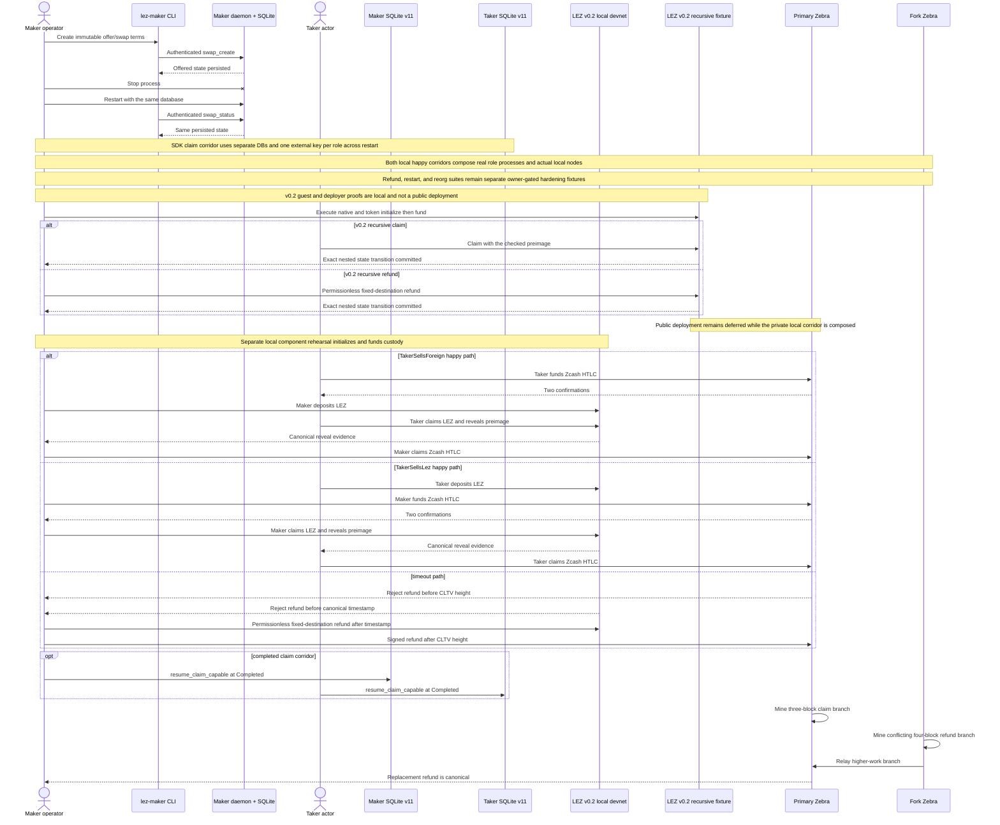

## Fresh-checkout prerequisites

Run all commands from the repository root. A fresh checkout needs:

- Git and `rustup`, with Rust 1.96.0, `rustfmt`, and Clippy;
- Docker Engine and Docker Compose v2 for Zebra and the Risc0 guest builder;
- `curl`, `gcc`, `tar`, `sha256sum`, `awk`, `diff`, and `rg` for the LEZ runner;
- `unzip` and a working libclang C-header search path for the provisional LEZ
  v0.2 standalone dependency build;
- outbound access on the first LEZ run so the script can install pinned `rzup`
  0.5.1/Risc0 3.0.5 tools and download the checksum-verified circuits archive;
  and
- `cargo-deny` 0.19.9 and ShellCheck when reproducing all local quality gates.

Install and confirm the repository toolchain:

```sh
rustup toolchain install 1.96.0 --component rustfmt,clippy
rustc --version
cargo --version
docker version
docker compose version
```

The first two version commands must report 1.96.0. Build the workspace and run
the non-ignored acceptance tests before starting either heavy chain suite:

```sh
cargo build --locked --workspace --all-targets
cargo test --locked --workspace --all-targets
cargo fmt --all --check
cargo clippy --locked --workspace --all-targets --all-features -- -D warnings
cargo deny check advisories bans licenses sources
```

The lockfiles are part of the evidence. Do not omit `--locked` to work around a
dependency change.

## Flow 0: provisional LEZ v0.2 executable guest/client/deployer lane

Choose a fresh lowercase run ID and run:

```sh
RUN_ID=manual-lez-v02-20260712-a ./scripts/verify-lez-v02-provisional.sh
cargo deny --manifest-path compat/lez-v0.2-provisional/Cargo.toml \
  check --config compat/lez-v0.2-provisional/deny.toml \
  advisories bans licenses sources
cargo deny --manifest-path compat/lez-v0.2-provisional/escrow/methods/Cargo.toml \
  check --config compat/lez-v0.2-provisional/escrow/methods/deny.toml \
  advisories bans licenses sources
cargo deny --manifest-path compat/lez-v0.2-provisional/escrow/methods/guest/Cargo.toml \
  check --config compat/lez-v0.2-provisional/escrow/methods/guest/deny.toml \
  advisories bans licenses sources
cargo deny --manifest-path compat/lez-v0.2-provisional/escrow/deployer/Cargo.toml \
  check --config compat/lez-v0.2-provisional/escrow/deployer/deny.toml \
  advisories bans licenses sources
```

The runner rejects any `RUN_ID` outside
`^[a-z0-9][a-z0-9_-]*$`, fixes Cargo at two build jobs, and creates only unique
root, guest, artifact, tool, and Docker-source directories under
`${TMPDIR:-/tmp}`. It invokes the digest-pinned Risc0 guest-builder container
for the checked artifact, but does not create a network namespace, bind a port,
start a service/sequencer, or issue a global process/container cleanup command.
The graph is large, so do not overlap its cold build with another heavy suite.

A fresh uncached run needs crates.io and the exact locked GitHub repositories,
including SPEL, LEZ, Logos Blockchain/circuits, Overwatch, Jellyfish, and
Risc0-related sources. It also needs `unzip` for the pinned rapidsnark archive
and functional libclang system headers for RocksDB bindgen. Cached sources and
build artifacts reduce availability risk but never relax the lockfile checks.

A pass proves all of the following and nothing broader:

- SPEL PR #238 exact head `df17acd98436be4f09c55877dae1fe2e73cbcdca`;
- official LEZ tag `v0.2.0` resolves only to
  `a58fbce2ff48c58b7bb5001b1a27e64b9596ee3a`, without a duplicate revision
  source/type identity;
- the v0.2 `SequencerConfig` and standalone entry point compile, without polling
  the future or starting the sequencer;
- the renamed `LeeTransaction` envelope compiles; and
- SPEL and LEZ derive the same fixed public `/LEE/` PDA vector; and
- the exact dependency-light SDK source produces the same metadata PDA, native
  `custody`/swap multi-seed PDA, and owner/definition ATA as pinned upstream
  `lee_core`, SPEL, and ATA-core types;
- the generated typed client compiles against the checked escrow IDL and exact
  public ProgramId wire types;
- the digest-pinned direct Docker build and the Docker-backed methods embedding
  agree on ELF SHA-256
  `c85055f6fe85b71535a322ba84ffc612f5d093954a721ba3b529428814dc9d2e`
  and ImageID/ProgramId
  `5cf8c5a4eedb3c2873956cb7898eb33a495407c9746fb1a065c99638159329c1`;
- recursive native claim/refund and two-definition token claim/refund execute
  through official `V03State`, authenticated-transfer, ATA, and Token paths;
- child-transfer failure rolls back terminal metadata, custody, and actor state;
  and
- the deployment client rejects local identity mutation before RPC, submits the
  exact checked `ProgramDeployment` once, rejects a mismatched returned hash,
  never resubmits an ambiguous/timeout outcome, and binds inclusion to the exact
  post-tip transaction and canonical block; and
- retained deployment evidence includes the official channel plus genesis
  ID/hash, is HMAC-SHA256 authenticated by a separate owner-only 32-byte key
  before it leaves the authorized deployer, and can be converted offline into
  one bounded no-clobber runtime identity only after revalidating the
  authentication tag, fixed RPC/channel, checked
  ELF/ImageID/ProgramId, built-ins, canonical deployment transaction hash, and
  containing block.

After a future owner-authorized public deployment has produced its retained
JSON evidence, provision the machine-readable identity offline:

```sh
export DEPLOYMENT_EVIDENCE=/absolute/private/run/deployment-evidence.json
export EVIDENCE_AUTH_KEY=/absolute/private/run/deployment-evidence-auth.key
export RUNTIME_IDENTITY=/absolute/private/run/public-runtime-identity.json
test -f "$DEPLOYMENT_EVIDENCE"
test -f "$EVIDENCE_AUTH_KEY"
test "$(wc -c < "$EVIDENCE_AUTH_KEY")" -eq 32
test ! -e "$RUNTIME_IDENTITY"
umask 077
cargo +1.96.0 run --offline --locked \
  --manifest-path compat/lez-v0.2-provisional/escrow/deployer/Cargo.toml -- \
  provision-identity \
  --evidence-file "$DEPLOYMENT_EVIDENCE" \
  --evidence-authentication-key-file "$EVIDENCE_AUTH_KEY" \
  --output-file "$RUNTIME_IDENTITY"
test -s "$RUNTIME_IDENTITY"
```

`provision-identity` performs no RPC. The future authorized `deploy` command
must receive the same key through
`--evidence-authentication-key-file`; generate it from the operating system
CSPRNG, retain it separately from the evidence, grant no group/other
permissions, and never pass it to either swap actor. The provisioner refuses a
missing, non-regular, non-owner-only, or non-32-byte key; refuses empty,
oversized, non-regular, unknown-field, unauthenticated, mutated, or mismatched
evidence; records the SHA-256 of the exact retained JSON envelope bytes; and
atomically refuses to overwrite an existing output in a non-shared-writable
directory. The result fixes `public_testnet_v0_2`, `lee_v0_2`, RPC, equal
chain/channel, genesis, escrow ProgramId, ELF/ImageID, deployment transaction,
and inclusion block identities. Role signer accounts and credentials/funds are
separate owner provisioning inputs. This command is documented for the
configuration-only migration contract; M2 has no live public deployment
evidence to feed it.

This HMAC is same-owner provenance, not an independent chain proof or
non-repudiable signature. The dedicated key is domain-separated for this
schema, but anyone who obtains it can forge an envelope. Keep it outside every
actor-readable tree, prefer a distinct deployment UID or system credential
boundary because mode 0600 cannot isolate hostile same-UID processes, rotate it
for every deployment, and retain or destroy it under an explicit evidence
policy. A third-party-verifiable release must replace or supplement this handoff
with a pinned public-key signature or a chain proof anchored in trusted
consensus data.

CI audits four independently locked v0.2 graphs with graph-local `cargo-deny`
policy: compatibility root, methods, guest, and deployer. The local verifier
also checks the reviewed advisory feature/reachability assumptions and rejects
lock, artifact, ProgramId, or deployment-manifest drift.

This flow does **not** start a sequencer, deploy to the public endpoint, record
deployed-runtime compute units, or run independent maker/taker actors or the
composed LEZ/Zebra corridor. The checked deployment manifest deliberately keeps
its transaction hash and inclusion block pending. SPEL PR #238 is open,
unmerged, and without submitted maintainer review; issues #242/#243 also remain
upstream disclosures. Under ADR 0018 those Logos-owned conditions do not block
M2 certification, but they remain production-release blockers. This is
provisional engineering evidence, not final release approval.

The official LEZ graph also contains `hickory-proto 0.25.0-alpha.5`, affected
by `RUSTSEC-2026-0118` and `RUSTSEC-2026-0119`, through Logos-owned
common/libp2p paths. The root compile-only test remains hash-locked and cannot
poll/start the standalone future; the bounded deployer has its own policy and
exact endpoint/feature tests. DNSSEC features are rejected. These exact
graph-local exceptions are nonblocking only for M2 under ADR 0018 and are
production-blocking until Logos removes the paths or a separate security review
explicitly accepts them.

## Flow 0B: verify the exact local-v0.2 source and binary contract

This is the current reproducible boundary before the three-service runner. It
checks a clean exact source checkout, toolchain and native inputs, service
binary hashes and versions, Bedrock fixture hashes, and immutable OCI labels.
It does not start a container or call an RPC.

```sh
export LEZ_V02_SOURCE_DIR=/path/to/clean/logos-execution-zone-v0.2.0
export LEZ_V02_R0VM=/path/to/verified/r0vm
export LEZ_V02_SEQUENCER_BINARY=/path/to/verified/sequencer_service
export LEZ_V02_INDEXER_BINARY=/path/to/verified/indexer_service
export LEZ_V02_RAPIDSNARK_ARCHIVE=/path/to/rapidsnark-linux-x86_64-pic-v0.0.8.zip
export RAPIDSNARK_LIB_DIR=/path/to/verified/rapidsnark-v0.0.8-libraries
export BINDGEN_EXTRA_CLANG_ARGS=-I/usr/lib/gcc/x86_64-linux-gnu/13/include
RUN_ID=manual-v02-contract-20260713-a ./scripts/verify-lez-v02-local-stack-contract.sh
```

The exact Bedrock digest must already be cached locally so the verifier can
inspect its source, revision, version, and license labels without pulling it.
Expected output ends with `verification_scope=source-contract-only` and names OCI revision
`d8711bbc3d43d3ef9755ef9b73af32fd0f703160`. A dirty source checkout, changed
binary, wrong toolchain or native library, missing cached image, or changed OCI
label fails closed. This command needs Docker metadata access but starts no
container, uses no public chain RPC or faucet, and proves no swap execution.

## Flow 0B2: run the isolated LEZ v0.2 service stack

This flow runs the real pinned Bedrock node, non-standalone sequencer, and
indexer. It proves service onboarding and non-genesis finality, not a swap.

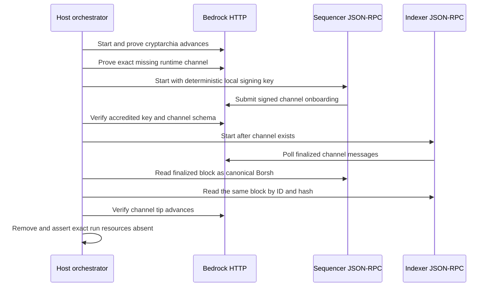

Prerequisites from a clean host:

- a non-root Unix user, Docker Engine with Compose v2, Git, curl, jq, ripgrep,
  sha256sum, base64, xxd, od, sed, and a Docker build backend;
- a clean LEZ `v0.2.0` checkout at commit
  `a58fbce2ff48c58b7bb5001b1a27e64b9596ee3a` with the local tag resolving to
  that commit;
- locked release binaries named `sequencer_service` and `indexer_service` in
  one directory, with SHA-256 values `3727e9aa...412f` and
  `6ed54f04...7442`; and
- the verified executable `r0vm 3.0.5`, SHA-256 `36c016a5...15b`.

One clean-host provisioning route is:

```sh
PROVISION="$PWD/.e2e/lez-v02-provision"
LEZ_V02_SOURCE_DIR="$PROVISION/logos-execution-zone"
LEZ_V02_BUILD_DIR="$PROVISION/build"
LEZ_V02_TOOL_DIR="$PROVISION/tools"
mkdir -p "$PROVISION"
git clone --branch v0.2.0 --single-branch \
  https://github.com/logos-blockchain/logos-execution-zone.git \
  "$LEZ_V02_SOURCE_DIR"
test "$(git -C "$LEZ_V02_SOURCE_DIR" rev-parse HEAD)" = \
  a58fbce2ff48c58b7bb5001b1a27e64b9596ee3a
test -z "$(git -C "$LEZ_V02_SOURCE_DIR" status --porcelain=v1 --untracked-files=all)"
rustup toolchain install 1.94.0 --profile minimal

RAPIDSNARK_ARCHIVE="$PROVISION/rapidsnark-linux-x86_64-pic-v0.0.8.zip"
curl -fL \
  https://github.com/logos-blockchain/logos-blockchain-rust-rapidsnark/releases/download/rapidsnark-pic-v0.0.8/rapidsnark-linux-x86_64-pic-v0.0.8.zip \
  -o "$RAPIDSNARK_ARCHIVE"
printf "%s  %s\n" \
  59bdd709eed96235de061f352893f4650c923b54b591052118593012bb1cd831 \
  "$RAPIDSNARK_ARCHIVE" | sha256sum --check --strict
mkdir -p "$PROVISION/rapidsnark"
unzip -q "$RAPIDSNARK_ARCHIVE" -d "$PROVISION/rapidsnark"
RAPIDSNARK_LIB_DIR="$(dirname "$(find "$PROVISION/rapidsnark" \
  -type f -name librapidsnark.a -print -quit)")"
(
  cd "$RAPIDSNARK_LIB_DIR"
  printf "%s  %s\n" \
    d4133227f845ff5bfa3672eb5b9c018a6a086bfa164b176bdaf76949c7d1f423 librapidsnark.a \
    0a910b420c3ad603c83c9dc2818c7ae05394c231ca23135c7b873e8e680ea41b libgmp.a \
    797b5d24bb8e8b088f811bddfff35f33973af9c797fb3812489cd42ba6a957d0 libfq.a \
    40f809394904682cb5517845cd3c2f936a5eb4609712534b573f552f2811fb82 libfr.a \
    | sha256sum --check --strict
)
export RAPIDSNARK_LIB_DIR
export BINDGEN_EXTRA_CLANG_ARGS=-I/usr/lib/gcc/x86_64-linux-gnu/13/include
(
  cd "$LEZ_V02_SOURCE_DIR"
  CARGO_TARGET_DIR="$LEZ_V02_BUILD_DIR" \
    cargo +1.94.0 build --locked --release --jobs 2 \
      --package sequencer_service --package indexer_service
)
LEZ_V02_SERVICES_DIR="$LEZ_V02_BUILD_DIR/release"
printf "%s  %s\n" \
  3727e9aa10600d04d0cdfda6eb39df146ef4cc14f5b09ad33bcf076a8f2c412f \
  "$LEZ_V02_SERVICES_DIR/sequencer_service" \
  6ed54f04ae018f3554898a9f0aef6decd6930c4e8609326d146ca164e48d7442 \
  "$LEZ_V02_SERVICES_DIR/indexer_service" \
  | sha256sum --check --strict

cargo install rzup --version 0.5.1 --locked --root "$LEZ_V02_TOOL_DIR"
RISC0_HOME="$LEZ_V02_TOOL_DIR/risc0-3.0.5/home" \
  "$LEZ_V02_TOOL_DIR/bin/rzup" install r0vm 3.0.5
LEZ_V02_R0VM="$LEZ_V02_TOOL_DIR/risc0-3.0.5/home/extensions/v3.0.5-cargo-risczero-x86_64-unknown-linux-gnu/r0vm"
printf "%s  %s\n" \
  36c016a5bb2ded5bd1f8f92cc487e6ffaeb1e95ec05850c983081a0f716b515b \
  "$LEZ_V02_R0VM" | sha256sum --check --strict
```

Keep the three resulting absolute paths for the runner. A cold host also needs the exact Bedrock GHCR digest and distroless GCR digest.
The runner may pull those immutable images if they are absent. The exact clone, native-library verification, locked build, and r0vm provisioning commands above produce those inputs; the runtime runner never floats source or artifact versions.

```sh
export LEZ_V02_SOURCE_DIR=/absolute/path/to/clean/logos-execution-zone-v0.2.0
export LEZ_V02_SERVICES_DIR=/absolute/path/to/locked/release-binaries
export LEZ_V02_R0VM=/absolute/path/to/verified/r0vm
RUN_ID=manual-v02-stack-001 ./scripts/run-lez-v02-stack.sh
```

Expected output ends with `LEZ v0.2 isolated service-readiness passed` and a
finalized block ID of at least 2. Evidence remains under
`.e2e/manual-v02-stack-001/lez-v02`: `run.env` binds source, artifacts, exact
container and network IDs, dynamic loopback URLs, and finalized ID; `evidence/`
contains the cryptarchia samples, exact pre-bootstrap missing-channel body,
channel snapshots, port bindings, sequencer Borsh block, and indexer ID/hash
responses; `logs/` contains each service log. Normal exit removes only the
captured containers, exact network, and exact image, then asserts all three
absent. A cleanup assertion failure changes a successful run into failure.

For live inspection, set `LEZ_V02_KEEP_RUNNING=1`. Retention is honored only
after a GREEN run. The runner prints exact cleanup commands containing the
captured container IDs, network, and image; execute all three commands when
finished. Never use a global prune.

All chain RPCs in this flow are dynamically published on literal loopback, and
all service traffic stays on its unique no-masquerade bridge. Runtime execution
uses no public RPC, public peer, faucet, or public funds. Only cold image or
source provisioning can depend on GHCR, GCR, GitHub, Rust distribution, or
crates.io; cached verified inputs remove that availability risk. Deterministic
local genesis and signing material make the run reproducible, while correctness
comes from executing the pinned real implementations and cross-checking their
canonical outputs. Public peer propagation, fee pressure, and public-runtime
parity are deliberately outside this local claim.

## Flow 0C: verify the official-wire v0.2 prepare foundation

Provision the exact four already-extracted Rapisnark libraries named in the
local-stack contract, then run the fail-closed wrapper from the repository
root:

```sh
export RAPIDSNARK_LIB_DIR=/absolute/path/to/verified/rapidsnark-v0.0.8-libraries
export BINDGEN_EXTRA_CLANG_ARGS=-I/usr/lib/gcc/x86_64-linux-gnu/13/include
./scripts/verify-lez-v02-sidecar.sh
```

Expected output ends with `LEZ v0.2 sidecar verification: ok`. The wrapper
attests all four static-library SHA-256 identities before invoking Cargo and
then runs locked offline formatting, 42 integration tests, strict Clippy,
rustdoc warnings, and graph-local advisory/license/source policy. Those tests
include exact native initialize/fund and deterministic maker/taker Vault Claim
preparation plus durable exact-byte recovery, filesystem hardening, and a
one-attempt submission state machine against an in-process adapter using
official transaction and client-error types. They do not call a node or prove
inclusion/finality. A missing,
relative, or changed library directory fails before Cargo. Do not replace this
with direct `cargo --offline`: the upstream build script can still attempt its
own release-asset download. This command starts no node, sidecar process,
container, faucet call, or public RPC and therefore proves no chain effect or
swap. The full prerequisite and licensing boundary is recorded in
`compat/lez-v0_2-sidecar/README.md`.

## Flow 0D: run the role-separated native LEZ v0.2 slice

This is a **historical pre-canonical flow** retained for the immutable
`f8385049...0fbe` onboarding evidence. It is not the current M2 certification
path and must not be replayed against the canonical corridor configuration.
The partial vertical flow starts after Flow 0B2 has retained a GREEN
three-service stack, both actors have completed their Vault Claims, and that
historical escrow has been deployed. Those onboarding and deploy steps are not
automated below. The exact retained prerequisite and completed example are in
[`docs/evidence/m2-local-onboarding-20260714.json`](evidence/m2-local-onboarding-20260714.json).
Use a fresh chain or select a new unused `SWAP_ID`; deposit correctly rejects an
already initialized swap.

Build the PoC binary with the verified native libraries. Flow 0C remains the
authoritative format/test/lint/rustdoc/dependency gate.

```bash
export RAPIDSNARK_LIB_DIR=/absolute/path/to/verified/rapidsnark-v0.0.8-libraries
export BINDGEN_EXTRA_CLANG_ARGS=-I/usr/lib/gcc/x86_64-linux-gnu/13/include
CARGO_NET_OFFLINE=true cargo +1.96.0 build \
  --manifest-path compat/lez-v0_2-sidecar/Cargo.toml \
  --locked --offline --bin lez-v02-native-escrow-poc
NATIVE_CLI="$PWD/compat/lez-v0_2-sidecar/target/debug/lez-v02-native-escrow-poc"
```

Load the trusted, run-owned stack manifest. Its dynamic loopback URLs are valid
only while that exact retained run is alive.

```bash
RUN_ID=your-retained-green-run
LEZ_RUN_DIR="$PWD/.e2e/$RUN_ID/lez-v02"
. "$LEZ_RUN_DIR/run.env"
CHAIN_ID="$LEZ_V02_CHANNEL_PUBLIC_KEY"
SEQUENCER_URL="$LEZ_SEQUENCER_RPC_URL"
INDEXER_URL="$LEZ_INDEXER_RPC_URL"
ESCROW_PROGRAM_ID=f8385049e93a319b44d868e0d0cf805b058eddcf92141a186ffd69e4596c0fbe # historical evidence only
```

Keep the roles physically separate. `SOURCE_MAKER_KEY_FILE` and
`SOURCE_TAKER_KEY_FILE` are the owner-private Vault-onboarding outputs. Never
print them, put their contents in an environment variable, or pass their
contents on the command line. The historical run used the audited deterministic
local identities; this guide intentionally does not publish their keys.

```bash
umask 077
PRIVATE_BASE="$(mktemp -d "${TMPDIR:-/tmp}/lez-native-${RUN_ID}.XXXXXX")"
MAKER_STATE="$PRIVATE_BASE/maker"
TAKER_STATE="$PRIVATE_BASE/taker"
EVIDENCE_DIR="$PRIVATE_BASE/evidence"
install -d -m 0700 "$MAKER_STATE" "$TAKER_STATE" "$EVIDENCE_DIR"
install -m 0600 "$SOURCE_MAKER_KEY_FILE" "$MAKER_STATE/private-key.hex"
install -m 0600 "$SOURCE_TAKER_KEY_FILE" "$TAKER_STATE/private-key.hex"
openssl rand -hex 32 >"$TAKER_STATE/preimage.hex"
chmod 0600 "$TAKER_STATE/preimage.hex"
```

The terms are public. The far-future refund time is only a happy-path fixture;
the actual corridor must derive its digest, direction, and deadlines from the
dual-signed agreement.

```bash
SWAP_ID="$(printf '%s' "${RUN_ID}:native-poc:1" | sha256sum | cut -d' ' -f1)"
TERMS_HASH="$(printf '%s' "${RUN_ID}:native-terms:1" | sha256sum | cut -d' ' -f1)"
SECRET_DIGEST="$(xxd -r -p <"$TAKER_STATE/preimage.hex" | sha256sum | cut -d' ' -f1)"
MAKER_ACCOUNT=94b3cefdc7335256e802987a50f336cfed7053992c3bcc318054a0e3d8956166
TAKER_ACCOUNT=1e916b03cf49c0e6a03feecf124536d867f45c5e7cf82a108d1377120ee28ccc
AMOUNT=700
REFUND_AT_MS=9999999999999
common_terms=(
  --sequencer-url "$SEQUENCER_URL"
  --chain-id "$CHAIN_ID"
  --escrow-program-id "$ESCROW_PROGRAM_ID"
  --swap-id "$SWAP_ID"
  --terms-hash "$TERMS_HASH"
  --secret-digest "$SECRET_DIGEST"
  --depositor-role maker
  --depositor-account-id "$MAKER_ACCOUNT"
  --claimant-role taker
  --claimant-account-id "$TAKER_ACCOUNT"
  --amount "$AMOUNT"
  --refund-at-ms "$REFUND_AT_MS"
)
```

Run effects in separate processes. Maker initializes, observes `Empty`, then
funds. Taker starts only from observed `Funded` and receives the exact funding
transaction ID. Evidence contains no private key or preimage.

```bash
"$NATIVE_CLI" deposit \
  --role maker --run-id "$RUN_ID" --request-id maker-deposit-001 \
  --state-directory "$MAKER_STATE" \
  --private-key-file "$MAKER_STATE/private-key.hex" \
  "${common_terms[@]}" | tee "$EVIDENCE_DIR/deposit.json"
FUND_TX="$(jq -er \
  '.transactions[] | select(.kind == "fund_native") | .transaction_id' \
  "$EVIDENCE_DIR/deposit.json")"

"$NATIVE_CLI" claim \
  --role taker --run-id "$RUN_ID" --request-id taker-claim-001 \
  --state-directory "$TAKER_STATE" \
  --private-key-file "$TAKER_STATE/private-key.hex" \
  --funding-transaction-id "$FUND_TX" \
  --preimage-file "$TAKER_STATE/preimage.hex" \
  "${common_terms[@]}" | tee "$EVIDENCE_DIR/claim.json"

"$NATIVE_CLI" observe "${common_terms[@]}" | tee "$EVIDENCE_DIR/observe.json"
jq -e '
  .schema == "lez_v02_native_escrow_poc_v1"
  and .action == "observe"
  and .role == null
  and .after.escrow_state == "claimed"
  and .after.custody.balance == 0
  and .after.claimant.balance == 200700
  and .finality == "not_observed_in_this_poc_slice"
  and .crash_atomic_submission == false
' "$EVIDENCE_DIR/observe.json"
```

The CLI proves canonical sequencer inclusion plus same-tip account reads, not
Bedrock finality. Query the indexer sequentially; the retained run observed
intermittent timeouts when heavy block reads ran in parallel. This scan requires
each exact transaction once in a `Finalized` block and equal ID/hash lookups.

```bash
rpc() {
  curl --fail --silent --show-error --connect-timeout 2 --max-time 30 \
    -H 'content-type: application/json' --data "$2" "$1"
}
START_BLOCK="$(( $(jq -r '.before.sequencer_tip' "$EVIDENCE_DIR/deposit.json") + 1 ))"
rpc "$INDEXER_URL" \
  '{"jsonrpc":"2.0","id":1,"method":"getLastFinalizedBlockId","params":[]}' \
  >"$EVIDENCE_DIR/indexer-finalized-tip.json"
FINALIZED_BLOCK="$(jq -er '.result' "$EVIDENCE_DIR/indexer-finalized-tip.json")"

find_finalized_tx() {
  local label="$1" tx="$2" block count found hash
  rpc "$INDEXER_URL" \
    "{\"jsonrpc\":\"2.0\",\"id\":1,\"method\":\"getTransaction\",\"params\":[\"$tx\"]}" \
    >"$EVIDENCE_DIR/indexer-${label}-transaction.json"
  jq -e --arg tx "$tx" '.result.Public.hash == $tx' \
    "$EVIDENCE_DIR/indexer-${label}-transaction.json" >/dev/null
  for ((block=START_BLOCK; block<=FINALIZED_BLOCK; block++)); do
    rpc "$INDEXER_URL" \
      "{\"jsonrpc\":\"2.0\",\"id\":1,\"method\":\"getBlockById\",\"params\":[${block}]}" \
      >"$EVIDENCE_DIR/indexer-${label}-block-${block}.json"
    count="$(jq --arg tx "$tx" \
      '[.result.body.transactions[]? | .Public.hash? | select(. == $tx)] | length' \
      "$EVIDENCE_DIR/indexer-${label}-block-${block}.json")"
    if [[ "$count" == 1 ]]; then
      [[ -z "${found:-}" ]]
      found="$block"
    else
      [[ "$count" == 0 ]]
    fi
  done
  [[ -n "${found:-}" ]]
  jq -e --arg tx "$tx" --argjson block "$found" '
    .result.header.block_id == $block
    and .result.bedrock_status == "Finalized"
    and ([.result.body.transactions[]? | .Public.hash? | select(. == $tx)] | length) == 1
  ' "$EVIDENCE_DIR/indexer-${label}-block-${found}.json" >/dev/null
  hash="$(jq -er '.result.header.hash' \
    "$EVIDENCE_DIR/indexer-${label}-block-${found}.json")"
  rpc "$INDEXER_URL" \
    "{\"jsonrpc\":\"2.0\",\"id\":1,\"method\":\"getBlockByHash\",\"params\":[\"$hash\"]}" \
    >"$EVIDENCE_DIR/indexer-${label}-block-by-hash.json"
  diff \
    <(jq -S '.result' "$EVIDENCE_DIR/indexer-${label}-block-${found}.json") \
    <(jq -S '.result' "$EVIDENCE_DIR/indexer-${label}-block-by-hash.json")
  printf '%s finalized in block %s (%s)\n' "$label" "$found" "$hash"
}
INIT_TX="$(jq -er '.transactions[] | select(.kind == "initialize_native") | .transaction_id' "$EVIDENCE_DIR/deposit.json")"
CLAIM_TX="$(jq -er '.transactions[] | select(.kind == "claim_native") | .transaction_id' "$EVIDENCE_DIR/claim.json")"
find_finalized_tx initialize "$INIT_TX"
find_finalized_tx fund "$FUND_TX"
find_finalized_tx claim "$CLAIM_TX"
```

The retained example finalized blocks 219/220/223 and ended with custody 0,
maker 99300/nonce 3, and taker 200700/nonce 2. Exact transactions, hashes, PDAs,
and the same-tip/finality boundary are in the evidence JSON. The CLI reports
`crash_atomic_submission=false`: exact bytes are durable and every step observes
before submit, but ambiguous multi-effect crash reconciliation is post-PoC
hardening. This flow does not contact Zebra and is not a corridor. Use Flow
0B2's exact retained-stack cleanup commands, then remove only
`"$PRIVATE_BASE"`; never use a global Docker prune.

## Flow 0E: provision the local Zebra/reference-actor fixture

This fixture-readiness step consumes a live isolated Zebra Regtest node plus
the observed LEZ runtime identity. It creates one dual-signed agreement for
the selected `POC_DIRECTION` and two owner-private actor trees. It does not
start a sidecar, call
`activate` or `drive`, fund an HTLC, spend Zcash, or prove a corridor.

Create the non-secret spec inside an owner-private directory. The bridge URLs
must be distinct literal-loopback endpoints assigned to future role sidecars;
provisioning validates their shape but does not bind or call them. Use endpoints
allocated by the composed runner before treating the configs as runnable.

```bash
umask 077
PRIVATE_BASE="$(mktemp -d "${TMPDIR:-/tmp}/lez-corridor-fixture-${RUN_ID}.XXXXXX")"
SPEC_FILE="$PRIVATE_BASE/provision-spec.json"
OUTPUT_ROOT="$PRIVATE_BASE/actors"
POC_DIRECTION="${POC_DIRECTION:-taker_sells_lez}"
LEZ_TIP="$(curl --fail --silent --show-error --connect-timeout 2 --max-time 30 \
  -H 'content-type: application/json' \
  --data '{"jsonrpc":"2.0","id":1,"method":"getLastBlockId","params":[]}' \
  "$SEQUENCER_URL" | jq -er '.result')"
LEZ_DISCOVERY_START="$((LEZ_TIP + 1))"
LEZ_DISCOVERY_MAX_BLOCKS=256
jq -n \
  --arg run_id "$RUN_ID" \
  --arg direction "$POC_DIRECTION" \
  --arg chain_id "$CHAIN_ID" \
  --arg genesis "e24c5a4a2d08a747b96cebefa1304cbe80e42dac9ced3a52c2330b22797e10d9" \
  --arg program "$ESCROW_PROGRAM_ID" \
  --arg zebra "$ZEBRA_RPC_URL" \
  --arg maker_bridge "$MAKER_SIDECAR_URL" \
  --arg taker_bridge "$TAKER_SIDECAR_URL" \
  --argjson discovery_start "$LEZ_DISCOVERY_START" \
  --argjson discovery_blocks "$LEZ_DISCOVERY_MAX_BLOCKS" '
  {
    schema_version: 1,
    run_id: $run_id,
    swap_id: ("m2-poc-" + $direction + "-001"),
    direction: $direction,
    lez_runtime: {
      chain_id: $chain_id,
      channel_id: $chain_id,
      genesis_block_hash: $genesis,
      escrow_program_id: $program,
      authenticated_transfer_program_id_base58: "FrexXMbyY6iZjwUo8DV3jfB8donj8H4kLRHT7xswCfJg",
      maker_signer_account_id_base58: "B1UN3hPgxacgHKBRoThcAmsPajGcUf6YXUhgB36x4DAd",
      taker_signer_account_id_base58: "34Kqgek6R7N1zU5FSJz8ziXwSPEPCuWGcn1T7GCVrfib"
    },
    bridge: {
      maker_endpoint: $maker_bridge,
      taker_endpoint: $taker_bridge
    },
    zebra_endpoint: $zebra,
    lez_discovery_start_height: $discovery_start,
    lez_discovery_max_blocks: $discovery_blocks
  }' >"$SPEC_FILE"
chmod 0600 "$SPEC_FILE"

CARGO_NET_OFFLINE=true cargo +1.96.0 run --locked --offline \
  -p zec-reference-actor --bin zec-local-poc-provision -- \
  --spec-file "$SPEC_FILE" --output-root "$OUTPUT_ROOT" \
  | tee "$PRIVATE_BASE/provision-summary.json"
chmod 0600 "$PRIVATE_BASE/provision-summary.json"
```

The output root must not exist beforehand. Success reloads both configs, loads
both activation-material sets, validates pair isolation, and prints a
secret-free summary. Inspect only public shape and modes:

```bash
jq -e --arg direction "$POC_DIRECTION" '
  .direction == $direction
  and .private_material_disclosed == false
  and .actor_pair_validated == true
' "$PRIVATE_BASE/provision-summary.json"
test "$(stat -c %a "$OUTPUT_ROOT/maker")" = 700
test "$(stat -c %a "$OUTPUT_ROOT/taker")" = 700
test "$(stat -c %a "$OUTPUT_ROOT/maker/actor-config.json")" = 600
test "$(stat -c %a "$OUTPUT_ROOT/taker/actor-config.json")" = 600
if [[ "$POC_DIRECTION" == taker_sells_lez ]]; then
  ZCASH_FUNDER=maker
  LEZ_DEPOSITOR=taker
else
  ZCASH_FUNDER=taker
  LEZ_DEPOSITOR=maker
fi
OTHER_ROLE=maker
if [[ "$ZCASH_FUNDER" == maker ]]; then
  OTHER_ROLE=taker
fi
jq -e --arg role "$ZCASH_FUNDER" '
  .role == $role
  and .claim_preimage_file != null
  and (.zcash_funding_outpoints | length) == 1
' "$OUTPUT_ROOT/$ZCASH_FUNDER/actor-config.json" >/dev/null
jq -e --arg role "$OTHER_ROLE" '
  .role == $role
  and .claim_preimage_file == null
  and (.zcash_funding_outpoints | length) == 0
' "$OUTPUT_ROOT/$OTHER_ROLE/actor-config.json" >/dev/null
jq -e --arg depositor "$LEZ_DEPOSITOR" \
  '.lez_depositor_role == $depositor' \
  "$PRIVATE_BASE/provision-summary.json" >/dev/null
```

Run `m2poc-vertical-20260714a` selected mature maker-owned output
`90819e4f...f76f:0`, worth 625000000 zatoshis with 104 confirmations at Zebra
tip 104, and emitted agreement SHA-256 `b1291931...bb0ed`. The full values are
in the M2 evidence JSON. That retained fixture used LEZ discovery window
1..256; a later audit observed tip 389, so those files are no longer runnable
corridor inputs even though their isolation/load checks remain evidence. This
is reproducible only while the real Regtest node has a stable matching NU6.2
identity and mature unspent deterministic key-4 output. The provisioner assigns
that key/output to the direction-derived Zcash funder: maker for
`taker_sells_lez`, taker for `taker_sells_foreign`.

The final runner must prebuild every binary before the deadline clock starts,
sample a fresh LEZ tip, provision just in time, start both sidecars on their
explicit run-owned ports, and fail before any effect if the full window/deadline
headroom is unavailable. `DeterministicLocalV1` currently permits only a
60-second LEZ refund delay; its Zcash plan uses a four-block refund horizon and
one confirmation. Mine the exact required Regtest blocks only after the Zcash
effects, never while preparing binaries or configs. This provision-only flow
does not prove those timing constraints. It uses no faucet, public RPC, or
public funds; a moving tip or missing/spent candidate fails closed. Retain
private output only until role processes consume it, then remove only
`"$PRIVATE_BASE"`.

## Flow 0F: start the exact v0.2 PoC role bridges

This is the manual equivalent of the live development runner, not completed
corridor evidence. The
saved `m2poc-vertical-20260714a` actor files must not be used: their LEZ window
is stale. Prebuild the bridge before the deadline clock starts, reserve two
distinct nonzero loopback ports for this run, then repeat Flow 0E against the
current LEZ tip with those exact bridge URLs. Port allocation and process
cleanup belong to the composed runner; confirm both ports are still free
immediately before starting the processes.

```bash
BRIDGE_TARGET_DIR="$PWD/.e2e/$RUN_ID/build/lez-v02-bridge"
CARGO_TARGET_DIR="$BRIDGE_TARGET_DIR" CARGO_NET_OFFLINE=true \
  cargo +1.96.0 build --locked --offline \
  --manifest-path compat/lez-v0_2-sidecar/Cargo.toml \
  --bin lez-v02-bridge-poc
BRIDGE_BIN="$BRIDGE_TARGET_DIR/debug/lez-v02-bridge-poc"

# Replace these placeholders with distinct ports owned by this RUN_ID. Set the
# matching http:// URLs before running Flow 0E so the actor configs bind them.
MAKER_BRIDGE_LISTEN="127.0.0.1:<maker-run-port>"
TAKER_BRIDGE_LISTEN="127.0.0.1:<taker-run-port>"
MAKER_SIDECAR_URL="http://$MAKER_BRIDGE_LISTEN"
TAKER_SIDECAR_URL="http://$TAKER_BRIDGE_LISTEN"
export MAKER_SIDECAR_URL TAKER_SIDECAR_URL
```

After fresh provisioning, run one role per terminal. Set `ROLE=maker` and
`ROLE_LISTEN="$MAKER_BRIDGE_LISTEN"` in the maker terminal; set `ROLE=taker`
and `ROLE_LISTEN="$TAKER_BRIDGE_LISTEN"` in the taker terminal. All secret
values remain in the provisioner's owner-private files.

```bash
ROLE=maker                       # use taker in the second terminal
ROLE_LISTEN="$MAKER_BRIDGE_LISTEN" # use TAKER_BRIDGE_LISTEN in the second
ROLE_ROOT="$OUTPUT_ROOT/$ROLE"
BRIDGE_STATE="$ROLE_ROOT/bridge-poc-state"
AUTH_TRANSFER_PROGRAM_ID_HEX=dcbbfebcd59399961ed9973b8307dc475fd4c5ca5779aacfe7588f7dbc3f4a71
test ! -e "$BRIDGE_STATE"
install -d -m 0700 "$BRIDGE_STATE"

exec "$BRIDGE_BIN" \
  --listen-address "$ROLE_LISTEN" \
  --node-profile local \
  --sequencer-url "$SEQUENCER_URL" \
  --indexer-url "$INDEXER_URL" \
  --run-id "$RUN_ID" \
  --runtime-file "$ROLE_ROOT/lez-runtime.json" \
  --capability-file "$ROLE_ROOT/sidecar.capability" \
  --private-key-file "$ROLE_ROOT/lez-signer.key" \
  --state-directory "$BRIDGE_STATE" \
  --authenticated-transfer-program-id "$AUTH_TRANSFER_PROGRAM_ID_HEX"
```

Each process first verifies its runtime-derived signer/config and the official
finalized-indexer readiness gate. Startup does not contact or cross-bind the
configured sequencer; operation paths perform their own sequencer reads and
bindings before relying on sequencer facts. Readiness JSON contains the exact
endpoint/run/runtime, the operation-time sequencer observation contract
`bounded_canonical_inclusion_and_same_tip_accounts`, indexer health
`stable_finalized_tip_bound_to_runtime_genesis`, and finality
`exact_genesis_bound_finalized_indexer_clock_available`. Genesis and tip are
read by ID and hash, and a final tip-ID equality read rejects a moving sample.
The listener supports describe, prepare/observe native escrow, prepare/observe the
revealing claim, and exact submit. Successful PREPARE replies replay from the
private request store; observations and transient PREPARE failures re-execute;
submit persists unknown-before-I/O and never resends an ambiguous replay.
Refund calls are typed unavailable. Stop each terminal with Ctrl-C and remove
only its run-owned state during composed cleanup.

Both role bridges completed both direction-derived sequences: `TakerSellsLez`
in run 14o and `TakerSellsForeign` in reverse run 14c. In the former the taker
deposits LEZ and the maker owns the revealing claim; in the latter the maker
deposits LEZ and the taker owns the revealing claim. Bridge readiness is an
exact finalized-chain identity/time proof, not finality evidence for any
specific effect. Manual completion must retain both readiness lines, accepted
submissions, terminal actor state, Zcash effects, and separate transaction
finality from the indexer. The successful reverse initialize/fund/claim transactions are
finalized in indexer blocks 641/642/643. M2 is certified at the
local-functional PoC boundary. The owner has not entered M2 QA; M3 PoC work is
active separately, and later M2 hardening remains outside this certification.

The same binary has one separate dormant public profile. Do not run this form
for M2 evidence; it is shown so the configuration change is exact:

```text
--listen-address 127.0.0.1:<role-port>
--node-profile official_public
--sequencer-url https://testnet.lez.logos.co/
--indexer-url https://testnet.lez.logos.co/
```

`official_public` accepts only that exact HTTPS origin for both outbound
clients. It does not relax the inbound boundary: the sidecar still listens on
the role-owned loopback address, and schema-v3 `bridge.endpoint` remains
`http://127.0.0.1:<role-port>`. Thus actor-to-sidecar authentication and
isolation do not change when the sidecar's outbound node route changes. The
signed agreement/runtime must already bind the expected public chain, channel,
genesis, escrow deployment, signer account, and role before either actor can
drive it.

## Flow 0F.1: verify dormant M2 route configuration without public I/O

This is a local contract check, not a public-testnet rehearsal. It creates no
public account, obtains no credential, calls no public RPC, uses no faucet, and
submits no transaction:

```sh
cargo test --offline --locked -p zec-reference-actor --test actor_boundary \
  zebra_route_is_either_loopback_cookie_or_public_testnet_https_api_key \
  -- --exact --nocapture
cargo test --offline --locked -p zec-reference-actor --test actor_boundary \
  self_hosted_public_zebra_uses_loopback_cookie_transport \
  -- --exact --nocapture
cargo test --offline --locked -p lez-zebra-node-adapter \
  rpc::tests::public_ -- --nocapture
CARGO_NET_OFFLINE=true cargo +1.96.0 test --offline --locked \
  --manifest-path compat/lez-v0_2-sidecar/Cargo.toml \
  --bin lez-v02-bridge-poc \
  tests::typed_node_profile_accepts_only_complete_local_or_official_public_routes \
  -- --exact --nocapture
```

The last command needs the verified v0.2/Rapisnark build inputs from Flow 0C,
just like the existing bridge build. It validates URLs and constructs clients
only; it does not send a request.

Each role's owner-private actor JSON has `"schema_version": 3` and exactly one
of these deny-unknown-fields `zebra.route` values. For the local PoC, with no
Zebra cookie:

```json
{
  "kind": "deterministic_local",
  "endpoint": "http://127.0.0.1:18232",
  "cookie_file": null
}
```

For an operator-owned public Zebra whose JSON-RPC listener remains locally
cookie-authenticated:

```json
{
  "kind": "self_hosted_cookie",
  "endpoint": "http://127.0.0.1:8232",
  "cookie_file": "/absolute/private/run/maker-zebra.cookie"
}
```

For the selected provider-backed Zcash Testnet route:

```json
{
  "kind": "tatum_testnet_x_api_key",
  "endpoint": "https://zcash-testnet-zebrad.gateway.tatum.io",
  "api_key_file": "/absolute/private/run/maker-tatum-api-key"
}
```

`deterministic_local` requires `zebra.identity.network: "regtest"` and RPC
chain `"test"`. `self_hosted_cookie` accepts only a matching public `"main"`
or `"test"` identity. `tatum_testnet_x_api_key` requires `"test"`, the exact
Tatum root, and no cookie field. Both role configs must select the same route
kind and endpoint. URL credentials, remote plaintext HTTP, public-route
loopback hosts, paths, queries, fragments, a missing API key, cookie auth on
the provider route, and API-key auth on a loopback route all fail closed.

Create a private role directory before provisioning any secret-bearing file:

```sh
export RUN_ID=manual-route-contract-001
export RUN_DIR="${TMPDIR:-/tmp}/lez-atomic-swaps-${RUN_ID}"
test ! -e "$RUN_DIR"
install -d -m 0700 "$RUN_DIR/maker" "$RUN_DIR/taker"
install -m 0600 /dev/null "$RUN_DIR/maker/maker-zebra.cookie"
install -m 0600 /dev/null "$RUN_DIR/maker/maker-tatum-api-key"
test "$(stat -c %a "$RUN_DIR/maker/maker-zebra.cookie")" = 600
test "$(stat -c %a "$RUN_DIR/maker/maker-tatum-api-key")" = 600
```

Populate only the credential selected by that actor's route, using an
owner-private secret source that does not expose it in shell history or logs;
remove the unused placeholder. Repeat with distinct taker paths. Actor configs,
cookie/API-key files, sidecar capabilities, signer keys, recovery keys, and
preimages must all be regular mode-`0600` files below their mode-`0700` role
directory. The actor loads Zebra credentials only for `drive`; its `status`
command remains offline and needs no endpoint or effect credential.

The public switch is configuration under the signed agreement/runtime binding,
plus the expected on-chain escrow deployment and role account/key/fund
provisioning. It is not a different actor or adapter build. No public call was
made while proving this surface, and live public deployment, exact method
smoke, provider quotas, funding, confirmation latency, and retained chain
evidence remain deferred beyond the local progressive PoC.

## Flow 0G: run either development M2 corridor direction

The historical script name is retained for command compatibility, but the
runner supports both `taker_sells_lez` and `taker_sells_foreign` through
`POC_DIRECTION`. It assumes a freshly funded, isolated LEZ v0.2
Bedrock/sequencer/indexer devnet and a freshly funded, isolated Zebra 5.2.0
Regtest node are already running on explicit nonzero loopback URLs. Never point
a new attempt at a failed attempt's swap, private output root, Zcash candidate,
or LEZ allocation. A successful run also consumes chain funds, so provision
fresh deterministic genesis/Regtest outputs before repeating it.

The runner starts or removes no Docker resource. It acquires a nonblocking
`flock` keyed only by the exact configured LEZ sequencer/indexer and Zebra
endpoint tuple. This prevents two effect-bearing corridors from sharing those
nodes while leaving every unrelated endpoint, process, container, network, and
volume untouched. If the lock is held, wait or provision a different isolated
node tuple; never bypass the lock or prune global Docker state.

A cold machine also needs Rust 1.96.0, complete locked/offline Cargo sources,
the four verified Rapisnark/GMP libraries from Flow 0C, libclang, and `awk`,
`base64`, `curl`, `date`, `flock`, `jq`, `kill`, `od`, `perl`, `readlink`,
`sha256sum`, `sleep`, `stat`, `tail`, `timeout`, `tr`, and `xxd`.

On every fresh LEZ chain, first build and verify the canonical Docker artifact,
then deploy that exact embedded artifact once. Use a unique target and evidence
directory; `LEZ_CHANNEL_ID` comes from the fresh stack manifest. The verifier
pins the Risc0 builder digest and fails unless its direct Docker ELF equals the
Docker-backed methods ELF and the checked manifest identity.

```bash
export BUILD_RUN_ID=m2-canonical-build-unique-id
export LEZ_V02_ARTIFACT_TARGET_DIR="${TMPDIR:-/tmp}/lez-v02-artifact-${BUILD_RUN_ID}"
export RAPIDSNARK_LIB_DIR=/absolute/path/to/verified/rapidsnark-v0.0.8-libraries
export BINDGEN_EXTRA_CLANG_ARGS=-I/usr/lib/gcc/x86_64-linux-gnu/13/include
export LEZ_SEQUENCER_URL=http://127.0.0.1:<sequencer-port>
export LEZ_INDEXER_URL=http://127.0.0.1:<indexer-port>
RUN_ID="$BUILD_RUN_ID" ./scripts/verify-lez-v02-provisional.sh

DEPLOYER="$LEZ_V02_ARTIFACT_TARGET_DIR/debug/lez-zec-escrow-v02-deployer"
DEPLOY_DIR="$(mktemp -d "${TMPDIR:-/tmp}/lez-v02-deploy.XXXXXX")"
chmod 0700 "$DEPLOY_DIR"
export LEZ_CHANNEL_ID=<64-hex-channel-id-from-the-stack-manifest>
"$DEPLOYER" deploy-local \
  --rpc-url "$LEZ_SEQUENCER_URL" \
  --channel-id "$LEZ_CHANNEL_ID" \
  --timeout-seconds 300 >"$DEPLOY_DIR/deployment.json"
chmod 0600 "$DEPLOY_DIR/deployment.json"
```

Verify that the evidence contains ELF `c85055f6...c9d2e`, ImageID/ProgramId
`5cf8c5a4...329c1`, a nonempty transaction hash, and a non-genesis inclusion
block. The deployer submits once and never retries an ambiguous submission.
Independently confirm the transaction is present in the reported block through
the indexer and that the block is finalized before starting either actor. The
retained example is transaction `bd16808e...733f` in finalized local block
2582; those values are evidence, never defaults.

```bash
export RUN_ID=m2poc-corridor-unique-run-id
export POC_DIRECTION=taker_sells_lez # or: taker_sells_foreign
export POC_OUTPUT_ROOT="${TMPDIR:-/tmp}/lez-atomic-swaps-${RUN_ID}"
export LEZ_SEQUENCER_URL=http://127.0.0.1:<sequencer-port>
export LEZ_INDEXER_URL=http://127.0.0.1:<indexer-port>
export ZEBRA_RPC_URL=http://127.0.0.1:<zebra-port>
export ESCROW_PROGRAM_ID=5cf8c5a4eedb3c2873956cb7898eb33a495407c9746fb1a065c99638159329c1
export RAPIDSNARK_LIB_DIR=/absolute/path/to/verified/rapidsnark-v0.0.8-libraries
export BINDGEN_EXTRA_CLANG_ARGS=-I/usr/lib/gcc/x86_64-linux-gnu/13/include
./scripts/run-m2-taker-sells-lez-poc.sh
```

The runner refuses a reused output root and prebuilds the provisioner, actor,
and bridge before provisioning. Its current reviewed form has no round cap: it
polls every 0.10 seconds until completion or the monotonic deadline, uses a
fail-closed millisecond clock, KILL-bounds child calls, and permits at most eight
exact same-run drive retries. It retains the 49-second
provision-to-completion cap, fresh discovery, distinct bridge ports, and
mine-only-after-reported-Zcash-effect rule. A live guard rejects the LEZ reveal
before two Zcash funding confirmations, rejects a reveal or Zcash effect from
the wrong direction-derived actor, rejects the Zcash follow-up before the LEZ
reveal, and rejects duplicate Zcash effects. It stops only matching owned
bridge processes and retains the private failure root. Runs 14o and reverse 14c
live-proved these controls. Do not publish either private root: it contains
actor keys, capabilities, claim material, and exact prepared bytes.

After a successful fresh run, verify only the secret-free result:

```bash
jq -e --arg direction "$POC_DIRECTION" '
  .result == "completed"
  and .direction == $direction
  and .maker_status == "completed"
  and .taker_status == "completed"
  and .zebra_generate_blocks.total == 3
  and .atomic_order_observed == [
    "zcash_funded_and_confirmed",
    "lez_revealing_claim_submitted",
    "zcash_followup_claim_submitted_and_confirmed"
  ]
  and (
    if $direction == "taker_sells_lez" then
      .effect_owners == {
        zcash_funder: "maker",
        lez_claimant: "maker",
        zcash_claimant: "taker"
      }
    else
      .effect_owners == {
        zcash_funder: "taker",
        lez_claimant: "taker",
        zcash_claimant: "maker"
      }
    end
  )
  and .public_rpc_or_faucet_used == false
' "$POC_OUTPUT_ROOT/evidence/result.json"
```

The two retained successful examples used LEZ run
`m2poc-fresh-lez-20260714a` at loopback ports 32831/32832/32833 and Zebra run
`m2poc-fresh-zebra-20260714a` at port 32834. Those ports, run IDs, and now-spent
allocations are historical evidence, not reusable defaults.

Forward corridor `m2poc-corridor-fresh-20260714o` completed
`taker_sells_lez` in 25.370 seconds over 39 rounds/78 actor events. Taker round
2 retried `lez_bridge.v1.observe_escrow` once after a payload-free `moving_tip`
error and then succeeded. Its actual-user role order and terminal evidence are:

1. the taker deposits 50000 LEZ;
2. the maker, who owns the preimage in this direction, observes LEZ and funds
   Zcash transaction
   `255b991f6a5efe47e719eb3f5b9d20a15737d87d04284e9c83fbac756d4dceab`,
   whose HTLC output `:0` enters height 106;
3. after the required second confirmation at height 107, the maker claims LEZ and
   reveals the preimage in finalized LEZ block 266;
4. the taker spends the Zcash outpoint with
   `a2b41c5f4925e42792feee218d33d35f979e10bcae3ad1258457e7751ddbe16e`
   at height 108; and
5. both actor stores report revision 4 `Completed`. LEZ initialize/fund/claim
   are finalized in blocks 264/265/266 and end `Claimed`, custody 0,
   depositor 100000, and claimant 150000.

Reverse corridor `m2poc-corridor-reverse-fresh-20260714c` completed
`taker_sells_foreign` in 26.960 seconds over 50 rounds/100 actor events with no
same-run drive retry. Its actual-user role order and terminal evidence are:

1. the taker, who owns the preimage in this direction, funds Zcash transaction
   `181c4baafb5406b985bcf5a350cec18429d0de8ded880becfeff8159184c14f0`;
2. after its HTLC output `:0` reaches two confirmations at height 114, the
   maker initializes and deposits 50000 LEZ;
3. the taker claims LEZ and reveals the preimage in finalized LEZ block 643;
4. the maker spends the exact Zcash outpoint with transaction
   `ba65b2108bba81cebe5124132907071bfc955b5c6ef47eac057a728dfcf71e30`
   at height 115; and
5. both actor stores report revision 4 `Completed`. LEZ initialize/fund/claim
   are finalized in blocks 641/642/643 and end `Claimed`, custody 0, depositor
   0, and claimant 150000.

The checked-in
[forward secret-safe evidence](evidence/m2-taker-sells-lez-corridor-20260714.json)
and
[reverse secret-safe evidence](evidence/m2-taker-sells-foreign-corridor-20260714.json)
contain exact block hashes and limitations. They contain no preimage, key,
capability, private run root, or exact signed bytes. These are historical
pre-canonical behavior records.

The current certification examples are
`m2cert-canonical-forward-bb53daf-20260714a` and
`m2cert-canonical-reverse-bb53daf-20260714a`. They use only ProgramId
`5cf8c5a4...329c1`, deployed in finalized block 2582. Canonical forward LEZ
initialize/fund/claim finalized in blocks 2594/2595/2596; its Zcash
`0d041be6...b64c:0` funding output reached its second confirmation at 123 and
was spent by `8555c3d7...77d7` at 124. Canonical reverse LEZ effects finalized
in 2605/2606/2607; Zcash `1cbb5923...4785:0` reached its second confirmation
at 126 and was spent by `bfbd4379...9b2a` at 127. Both LEZ escrows are
`Claimed` with custody 0, and all four actor stores are revision 4 `Completed`.
The exact transactions, blocks, balance conservation, roles, retries, build
identity, deployment, resource boundary, and limitations are in the
[canonical certification packet](evidence/m2-canonical-local-certification-20260714.json).

Fresh failed runs are part of the reproduction record. Attempts 14i, 14k, 14l,
14m, and 14n stopped before any chain effect: respectively an incorrect
program-owner representation assumption, pre-effect readiness over 25 seconds,
an indexer-readiness timeout, an overstrict quiet-tip guard, and a tip movement
during the first account snapshot. Attempt 14j made effects but mined only one
Zcash confirmation; the SDK correctly refused the LEZ reveal because it
requires two. That distinct failed swap retains 50000 LEZ. Never reuse any
failed run's output root, swap, keys, candidate, or funds.

Reverse attempts `m2poc-corridor-reverse-fresh-20260714a` and
`m2poc-corridor-reverse-fresh-20260714b` each made external effects before
stopping: each created a distinct Zcash contract and locked 50000 LEZ. They
reproduced a direction-specific SDK defect that hard-coded the canonical LEZ
funded observation to `TakerSellsLez` and the taker signer. The correction now
validates the agreement-derived LEZ depositor in either direction; the focused
regression and all 35 SDK lifecycle cases pass. Those two locks are retained
failed-run effects, not successful-run custody. Never reuse their roots, swaps,
keys, candidates, or funds, and provision fresh allocations for another run.

Atomicity is preserved only at the implemented boundaries. Role/run-bound
request stores replay successful PREPARE and persist unknown-before-I/O before
one submission; repeated polling does not duplicate initialize or fund.
Actors commit their own revision transitions atomically, and mining follows an
explicit reported Zcash submission. Direction changes the actor, not the
ordering: the direction-derived Zcash funder and LEZ claimant cannot reveal the
preimage on LEZ until Zcash funding has two confirmations; the other actor
cannot claim Zcash until the canonical LEZ claim reveals it. In
`taker_sells_lez`, maker funds Zcash and claims LEZ while taker deposits LEZ and
claims Zcash. In `taker_sells_foreign`, taker funds Zcash and claims LEZ while
maker deposits LEZ and claims Zcash. These controls preserve HTLC ordering and
prevent silent duplicate effects or partial local commits, but no database can
make two independent chains one atomic transaction; failed 14j and reverse
attempts 14a/14b therefore retain recoverable protocol locks rather than
pretending rollback. Recovery/refund, restart, chaos, reorg, and public-route
validation remain owner-gated hardening unless needed to protect PoC
correctness.

## External resources and flakiness

No automated test, retained M2 run, or instructed local flow calls a public
blockchain RPC or faucet. The dormant binaries can now select public routes,
but their local contract tests validate configuration, credential handling,
TLS construction, and exact origins without sending a request. The official
LEZ v0.2 endpoint `https://testnet.lez.logos.co/` is selected and its
health/block/program methods were checked separately on 2026-07-12, but no
repository flow submits a transaction to it yet.
The M2 corridor calls only its configured literal-loopback LEZ v0.2 sequencer,
indexer, and Zebra Regtest RPCs; its two role bridges also bind run-owned
loopback ports. Actor funds come from deterministic local genesis allocations
or Regtest outputs. The older LEZ v0.1.2 standalone fixture also uses an
ephemeral port, although that upstream server binds the host wildcard rather
than literal loopback; it is not the M2 corridor. Therefore a public RPC outage,
rate limit, faucet balance, or public-testnet reorg cannot affect a warm local
run. Cold dependency/image downloads remain external and are listed below.

The M3 `btc-local-poc-provision` generate/prepare/finalize process is not
another runtime endpoint: it performs no RPC, starts no node or container, and
uses only OS randomness plus local owner-private files once the root Cargo graph
is cached. Its official `lez-v02-account-id` helper likewise performs no RPC but
builds from the separate pinned Rust 1.96 LEZ sidecar graph, so an uncached run
can share that graph's Cargo/git/native-library download failures. The actual
Core and LEZ facts around those commands come from the same run-owned loopback
services documented above. `gettxout` and `testmempoolaccept` can change as the
local tip or mempool changes and do not reserve the input; the isolated harness
therefore admits no unrelated writer, broadcasts only after both presignatures,
and mines the planned next block. Readiness, policy/finality, moving tips, or
manual transcription can make the ceremony fail closed. They cannot justify
inventing a fact, weakening a policy, reusing an output root, or overwriting
create-new files.

M3 run `m3actor-20260716n` used no public chain RPC, faucet, public peer, or
public fund, and no external network service was a certification success
dependency. Live first-lock diagnostics additionally show the pinned Bedrock
process attempting `pool.ntp.org:123/udp`; observed attempts timed out, and the
runner now records that count. Blocking or failure of this optional time-sync
egress does not weaken or satisfy the canonical finalized-block checks. Its combined runner required
all Cargo sources and the checked LEZ artifact, service binaries, Risc0
`r0vm`, Rapidsnark libraries, and Core release inputs to be locally verified
before the offline run. Cold provisioning can therefore be externally flaky,
but the certification itself depends on local Docker, CPU, memory, disk,
process scheduling, and node readiness. LEZ scans have a finite 30-second
read-only timeout so a moving or unresponsive local indexer fails uncertain
instead of hanging; retrying that observation never grants effect
resubmission.

The SDK memory actor test and schema-v14 SQLite actor test in Flow 2 are the
most isolated claim lane: they start no service, make no network request, and
need no RPC, node, Docker image, faucet, or pre-funded chain account. The
SQLite case creates different temporary database paths for maker and taker.
Each role must receive the same external claim-key ID and key material again
when its database is reopened; the key is process input and is not stored in
SQLite. These tests can fail because of local build, CPU, filesystem, or disk
conditions, but not because a public endpoint is unavailable. Historical run
14f showed that local polling policy itself can create false failure: 48 rounds
exhausted with 44.410 seconds remaining. Run 14o then live-proved the corrected
no-round-cap, 0.10-second, millisecond-deadline, KILL-timeout runner and
completed `TakerSellsLez` after one bounded retry. Reverse run 14c completed
`TakerSellsForeign` without a same-run retry. The current ceiling is eight
exact same-run drive retries within the unchanged absolute deadline;
exhausting it is a local failure, not permission to reuse an effect-bearing
run. Both PoC directions are complete and the exact closure tree is certified by
`m2-complete`. This manual remains the reproduction contract; actual-node
refund/restart/reorg/chaos, live public execution, and production readiness
remain deferred and are not claims of the tag.

Loopback is an isolation property, not a correctness claim. The chain evidence
comes from running the real pinned implementations and crossing their actual
transaction, validation, execution, and canonical-block boundaries:

- Zebra 5.2.0 validates canonical signed V5/BIP-199 bytes through its real
  mempool and consensus services, mines them into blocks, and selects a
  higher-work conflicting branch. Regtest controls mining and network
  activation; it does not simulate public peer propagation or fee pressure.
- The local LEZ v0.2 Bedrock node, non-standalone sequencer, and indexer accept
  official-wire transactions, execute the checked escrow, publish canonical
  account state, and independently report finalized inclusion. Runs 14o and
  14c crossed that boundary through separate maker/taker role processes. A
  deterministic local genesis does not simulate public sequencer load,
  governance, fees, peer propagation, or a live network upgrade.
- The LEZ v0.1.2 standalone sequencer accepts the checked Risc0 guest and actor
  transactions through public RPC, executes production `V03State` transitions,
  persists canonical blocks, and exposes resulting nonce/custody/balance state.
  Its reusable external process verifies the tracked ELF SHA-256 and ImageID
  before creating state, refuses a pre-existing home or readiness path, and
  publishes readiness only after official RPC confirms genesis, chain progress,
  the exact deployment transaction and containing block, ProgramId, the static
  authenticated-transfer built-in identity, and two key-derived funded
  accounts. Upstream `getProgramIds` lists built-ins only; it is not used as a
  custom-deployment registry. Standalone does not prove LEZ testnet 0.2
  compatibility or public sequencing.

The M2 evidence ladder is exact local vectors, public-compatible actual local
chain implementations, a composed independent maker/taker local corridor, and
locally tested dormant public-route configuration/adapters. Self-hosted and
provider-backed public testnet execution with public funds is deferred to
production readiness under ADR 0023 and remains visibly unproved. Mainnet
remains separately disabled pending calibration and formal review.

Cold setup and CI do use external software-distribution services:

| Resource | Used by | Pin/integrity control | Availability/flakiness risk |
|---|---|---|---|
| Rust toolchain distribution selected by `rustup` | Fresh toolchain install and CI | Exact Rust `1.96.0`; CI toolchain action is commit-pinned | DNS/CDN/proxy outage can block cold setup; warm installed toolchains avoid it |
| crates.io index and crate downloads | Workspace build, `cargo install rzup`, cargo-deny installation | Cargo lockfiles, exact `rzup 0.5.1`, and crate checksums | Registry/CDN/rate-limit outage can block an uncached build; cached sources avoid most requests |
| GitHub Git endpoints for Logos LEZ, SPEL, Overwatch, Jellyfish, and other locked Git dependencies | First LEZ compatibility build | Cargo lockfiles resolve exact commits; source policy allowlists exact repositories | GitHub/DNS/proxy outage can block an uncached checkout; it cannot silently substitute another locked commit |
| `https://testnet.lez.logos.co/` and its explorer | Not used by automated/local M2 runs; exact `official_public` origin validation is local and nonconnecting; deferred live v0.2 deployment/actor evidence | Official LEZ v0.2 endpoint; deployment must bind exact runtime, checked ELF, ProgramId, tx IDs, and blocks | Public service, quota/rate-limit, reorg, or method-policy drift can make live evidence flaky; no SLA or automatic fallback is selected. M2 publishes no deployment |
| Self-host Zebra 6.0.0 on public Testnet | Not used by automated/local M2 runs; selected deferred operator-owned route | Exact stable tag/release; schema-v3 `self_hosted_cookie`; cookie-authenticated loopback RPC; query current `consensus.next_block` | Initial sync, disk, DNS/P2P, organic reorg, and epoch activation can delay/fail a public run; cookie files are owner credentials and must remain mode `0600`; private M2 uses Regtest |
| Tatum Testnet Zebrad JSON-RPC | Not called by automated/local M2 runs; schema, sensitive-header, TLS-client construction, and actor wiring tests are local/nonconnecting | `https://zcash-testnet-zebrad.gateway.tatum.io`; schema-v3 `tatum_testnet_x_api_key`; dedicated mode-`0600` API-key file loaded into sensitive `x-api-key`; live use still requires exact method and chain/branch/genesis/stable-tip checks | Third-party account provisioning, credential rotation, quotas/rate limits, outage, lag, method-policy drift, and provider trust can make live evidence fail; no silent failover or ambiguous-submit retry |
| Community Zcash faucet or Discord support | Not used by automated/local M2 runs; optional future TAZ funding only | External operator; verify any returned txid independently through self-hosted Zebra | No SLA/current rate or amount; faucet may time out, rate-limit, or be depleted and is never a required CI gate |
| Operator-controlled LEZ Testnet and Zcash TAZ accounts/funds | Not used by automated/local M2 runs; required before any future live corridor | Provision independently, keep role keys mode `0600`, verify balances and every funding tx through the selected exact RPC route, and bind identities in the signed agreement/runtime | Provisioning delay, insufficient funds, key custody error, public confirmation/finality latency, and reorgs can fail a live run; never substitute deterministic local funds as public evidence |
| Zallet v0.1.0-alpha.4 | Not used by automated/local M2 runs; optional future funding wallet, never the HTLC signer | Exact alpha tag, loopback RPC, Zebra cookie; explicit transparent privacy policy | Alpha/epoch compatibility; cannot export derived transparent keys or sign arbitrary HTLC transactions |
| `pool.ntp.org:123/udp` | Best-effort time sync attempted by the pinned local Bedrock component during M3 actual-node runs | Not trusted as chain evidence; certification requires canonical finalized block identity/timestamps and does not require an NTP reply; final evidence records observed timeout attempts | DNS/UDP filtering or service outage can produce log timeouts, but cannot make the certification pass or fail while the local chain crosses the signed cutoff within its independent bounded wait |
| GHCR Logos Blockchain image | Local LEZ v0.2 Bedrock node and source/binary contract | Exact digest `sha256:91d6c5bf07e07fcfba5e7cf07d21ee686a6bc4b9f6210f2d28bffbcad9a3729f`; verifier checks OCI source revision `d8711bbc...` and license | Registry outage can block a cold pull; the manual contract verifier never pulls and fails if the exact cached image is absent. Public-testnet parity remains an upstream production question |
| GitHub Rapisnark v0.0.8 release asset | Exact LEZ v0.2 service and sidecar builds | Revision, archive name, SHA-256, and all four extracted static-library hashes are contract-bound | Release/CDN outage blocks an uncached build; implicit build-script download is rejected in favor of the preverified local directory |
| Docker Hub `zfnd/zebra` and `risczero/risc0-guest-builder` | Cold Zebra image build and Risc0 guest build | Zebra `5.2.0` source image and guest builder are digest-pinned | Registry outage, throttling, or authentication policy can block a cold pull; local images reduce but do not guarantee offline BuildKit resolution |
| Google Container Registry distroless image | Cold minimal Zebra and LEZ v0.2 service image builds | Exact `cc-debian13:nonroot` digest | Registry/DNS outage can block a cold pull; no moving tag is accepted |
| GitHub release asset for `logos-blockchain-circuits v0.4.2` | First LEZ run | Exact release URL plus required SHA-256 before extraction | Release/CDN outage can fail after retries; a verified run-specific cache avoids redownload |
| `rzup`-managed Risc0 release endpoint | First install of `r0vm`/`cargo-risczero` 3.0.5 | Runner checks exact tool versions and the final ELF digest/ImageID | Upstream release availability can block cold setup; keep the verified `LEZ_E2E_TOOL_DIR` cache |
| RustSec advisory database and Trivy vulnerability database | cargo-deny locally/CI; Trivy in CI | Scanner actions are commit-pinned; databases intentionally update | Network outage can prevent refresh, and a new advisory/CVE can make a previously green commit fail; this is a security signal, not a flaky test to bypass |

The local tests can still time out under severe CPU, memory, disk, or Docker
contention; this is why the heavy suites are serialized and resource-capped.
Retry only with a fresh run ID after checking the scoped logs. Do not weaken a
digest, checksum, vulnerability result, or consensus assertion to classify an
external outage as success.

Public-testnet corridor work has selected self-hosted Zebra 6.0.0 and Tatum's
documented Zebrad-powered Testnet gateway. No Zcash Foundation-operated public
Zebra JSON-RPC service exists in the reviewed primary sources. The schema-v3
routes, role-keyed signer wiring, provider HTTPS adapter, and exact LEZ public
profile are locally GREEN without public I/O. Public credentials/keys, exact
live method smoke, funded LEZ/Zcash accounts, on-chain escrow deployment,
endpoint health, and clean-machine rehearsal remain. Before
that flow is called available, the guide and global README must retain
endpoint/faucet authentication, current limits, observed funding/confirmation
latency, fallback policy, health checks, and evidence retention. No public route
is required by the current local suites.

## Isolation and no-clash rules

Choose a new lowercase run ID for every attempt, for example
`manual-zebra-20260711-a`. It may contain only lowercase letters, numbers,
underscores, and hyphens.

- Never run the heavy Zebra and LEZ suites concurrently on the same host.
- Never run two LEZ suites from the same checkout concurrently: the checked
  guest ELF has a repository-relative target path. Use another checkout and
  distinct target/tool directories if parallel execution is unavoidable.
- The Zebra runner creates only `lez-atomic-swaps-${RUN_ID}`, uses ephemeral
  localhost RPC ports, and refuses to reuse an active project.
- The M2 corridor runner obtains a nonblocking advisory lock derived from its
  exact LEZ sequencer/indexer and Zebra endpoint tuple. One tuple supports only
  one effect-bearing corridor at a time; a different isolated tuple and all
  unrelated Docker resources are unaffected.
- Do not run a global Docker prune, stop, kill, or volume-removal command.
- For the strongest LEZ isolation, give every run unique
  `LEZ_E2E_TOOL_DIR`, `LEZ_METHODS_TARGET_DIR`,
  `LEZ_STANDALONE_TARGET_DIR`, and `LEZ_COST_OUTPUT_DIR` values as shown below.
  A shared completed tool cache is safe only when no other run is writing it.
- A direct reusable-node launch must also receive a never-before-created node
  home and readiness path under a private run directory. Never point it at
  another process's home: pre-existing homes are rejected and preserved.

### Isolated LEZ maker/taker sidecar processes

Build and run the exact locked compatibility executable contract without
Docker, a public endpoint, faucet funds, or a fixed port:

```sh
cd compat/lez-v0_1_2-sidecar
cargo build --offline --locked --bin lez-v0-1-2-sidecar
cargo test --offline --locked --test runner_process -- --nocapture
```

The test starts maker and taker binaries concurrently. Each child reads a
different 0600 signer file, capability file, runtime descriptor, and durable
state path, then publishes a distinct literal-loopback ephemeral endpoint.
Wrong capability, run ID, and role calls must fail; the correct actor can call
`lez_bridge.v1.describe_runtime`; graceful shutdown must leave a private
state file and no child process. The configured official node endpoint is an
unused loopback sentinel in this process-lifecycle test, so it does not claim
an on-chain observation. Official native observation behavior is covered
separately by the sidecar's `official_node_rpc` test against an ephemeral
loopback service returning the pinned generated RPC types.

From the repository root, reproduce the main-process agreement, claim, and
refund boundaries:

```sh
cargo test --offline --locked -p lez-bridge-adapter --test native_first_lock -- --nocapture
```

The adapter suite uses no socket, node, Docker, faucet, or public endpoint. It
must pass both signed directions, owner/observer separation, caller-owned
request IDs and windows, exact funding/preimage binding, account-state
eligibility, claim/refund prepare/exact/discovery/submit conversion, stable
clock and exact millisecond deadline checks, complete primitive mutation
rejection, and uncertain-submit handling. This proves fail-closed main-process
conversion only; it does not prove the composed SDK actor flow.

From `compat/lez-v0_1_2-sidecar`, reproduce the exact official native-refund
planner, node observation, authenticated server, and restart gates:

```sh
cargo test --offline --locked --all-targets -- --nocapture
```

All 33 tests must pass. This invokes no Docker, faucet, public endpoint, or fixed
port. The official-node tests use an ephemeral loopback mock that returns the
pinned generated LEZ RPC types; they prove source-correct conversion and
fail-closed scanning, not public-testnet consensus.

From the repository root, reproduce the agreement-bound Zebra funding/claim/
refund adapter and isolated actor-configuration boundaries:

```sh
cargo test --offline --locked -p lez-zebra-node-adapter --test first_lock -- --nocapture
cargo test --offline --locked -p lez-zebra-node-adapter \
  --test exact_outpoint_funding_planner \
  --test exact_outpoint_funding_planner_contract -- --nocapture
cargo test --offline --locked -p lez-zebra-node-adapter \
  --test zcash_port_composite \
  --test zcash_port_composite_configuration -- --nocapture
cargo test --offline --locked -p zec-reference-actor --all-features -- --nocapture
```

The complete Zebra package has 70 checks: 41 unit, 15 first-lock, three signer,
one planner-API, six exhaustive planner-contract, one composite-API, and three
composite-configuration cases. They cover both
funding directions, stable-tip block/mempool discovery, exact confirmed
candidate outpoints and signed input-set commitment, transparent-only canonical
V5 bytes and output/change policy, absence/ambiguity/horizon behavior, prior
removal/replacement reconciliation, claims, and refunds. The actor package adds
30 maker/taker schema-v3 configuration, typed-route, credential, identity,
offline-status, direction-aware provisioning, and filesystem-isolation cases.
These commands use bounded in-memory or filesystem fixtures rather than an
actual Zebra process; the separate isolated Zebra suite remains the full consensus lane.
The development runner now drives the real local Zebra and LEZ v0.2 stack to
terminal `Completed` in both directions.

The `zec-reference-actor` CLI spelling is
`zec-reference-actor --config PRIVATE_JSON activate|drive|status`. `status`
performs existing-only store recovery with chain access impossible by type;
`activate` and `drive` now compose descriptor-bound SQLite, a fresh role bridge
client, and direct Zebra. Use them only through fresh private configs and the
development runner. Typed Drive-stage errors, bounded retry, terminal evidence,
and both happy directions are complete; restart/refund/chaos and live public
execution remain owner-gated. Dormant public route construction is locally
GREEN without public calls.

For a direct **LEZ sidecar** launch, create the parent directory for the state file and
supply the six required flags shown by the test fixture:
`--node-endpoint`, `--run-id`, `--runtime-file`,
`--capability-file`, `--signer-key-file`, and `--state-file`.
Secret files must be regular non-symlinks with no group/other permission bits;
the signer file is exactly 64 lowercase hexadecimal characters. Omit the
test-only `--shutdown-on-stdin` flag so the process waits for Ctrl-C.

## Flow 0: M4 official Monero Regtest topology

The M4 manual journey has two layers. The deterministic DLEQ spike and focused
component suites remain useful diagnostics, while the complete happy claim must
use one same-run Stage A/B, LEZ stack, Monero topology, role journals, and role
sidecars through every effect:

```sh
cargo run --locked -p lez-xmr-swap-sdk --example dleq-spike
```

Expected output includes `dleq_verified=true`,
`both_spend_shares_dleq_verified=true`, and
`reconstructed_spend_key_matches=true`. That command is not a chain flow.

Working-tree run `m4happy-40cbac3-20260721a` subsequently executed the complete
native successful-claim branch through real isolated LEZ v0.2 and official
Monero 0.18.5.1 Regtest processes. The public
[checkpoint packet](evidence/m4-actual-claim-poc-20260721.json) is explicitly
pending exact committed-tree replay and cleanup; do not use it as an
`m4-complete` certification packet.

The actual order was LEZ Initialize/Fund, exact shared-address XMR funding and
ten confirmations, sealed tag-14 publication/finality, Maker tag-15
adaptation/publication/finality, Taker extraction, and reconstructed-wallet
Monero sweep. Only that same-swap causal chain is the successful-claim atomicity
checkpoint. The signed-refund and punishment branches remain unexecuted.

The repository runner is not yet the replay for this complete manual flow.
`scripts/run-m4-actual-claim-poc.sh contract` and its preflight modes are
implemented. Its source/contract path now reaches checked artifact build,
identity provisioning, the LEZ stack, M4 deployment, exact finalized
Maker/Taker Vault Claims, the official Monero child, canonical Stage A and
countersigned Stage B with separate role journals, and the exact tag-13 actor.
Before invoking that actor it durably publishes a create-new no-retry latch;
after finalized tag 13 it deliberately fails before swap-specific Monero
funding. The exact cleanup ledger records the Monero child before launch and
revalidates every Docker run label and process identity before deletion. Broad
or guessed cleanup is forbidden. This route is contract-GREEN, not a clean
actual replay from the current commit.

**Running `execute` may submit both tag-13 effects and then return failure. Do
not retry the same `RUN_ID`, and do not delete its `tag13-no-retry.latch` to make
it appear retryable.** Reconcile the recorded transaction evidence and chain
state; for development, quarantine that root and begin again with a fresh run
ID. The role-sidecar launcher now supports exact Taker adoption of the existing
tag-13 state. Adoption requires the owner-private fixed siblings
`tag13-handoff-receipt.json`, `taker-runtime.json`, and `terms.json` under one
canonical artifact directory; cross-swap terms, aliases, and state/output overlap
are rejected before supervisor-root creation. The typed exporter and bridge receipt gate are source/component-GREEN. The
parent runner now exports the four artifacts, starts Taker adoption and a fresh
Maker sidecar, records PID/start/binary cleanup identities, funds the local shared Monero output, verifies it against both role wallets, and stops before release/Tag14; the exact committed-tree replay remains pending.
The agreement helper receipt truthfully records CLI values as `requested_terms`
and does not claim independent helper-level term binding; the role actors remain
the canonical wire validation and signing boundary. Do not advertise the runner
as a one-command successful-claim replay. The remaining runner/PoC work is estimated at 1 to 3 focused hours;
once complete, allow 25 to 45 minutes for a warm replay or 1 to 3 hours for a cold replay. Full functional M4 is estimated
at 15 to 27 focused hours.

Every effect command below uses create-new outputs and has no automatic
submission retry. Use a fresh lowercase run ID, source the fresh LEZ and Monero
manifests, keep Maker/Taker roots and capabilities separate, and never substitute
the retained example ports for manifest values. The retained run happened to
use LEZ ports 33145/33146/33147, sidecars 36967/58993, and Monero ports
39185/41189/46769/58393; those are evidence facts, not defaults.

Loopback here is authenticated transport to actual local daemon, wallet,
sequencer, indexer, and sidecar processes. It is not a mock-chain claim. Runtime
uses deterministic local genesis/Regtest funds and no public RPC, peer, faucet,
public funds, or external finality service.

Reproduce the checked LEZ artifact and focused host boundaries with a fresh run
ID. The optional shared tool directory below is safe only when it already
contains the pinned Risc0 3.0.5 tools; omit `LEZ_M4_TOOL_DIR` for a fully
run-owned cold setup and cleanup. The separately locked sidecar graph must also
receive an absolute `RAPIDSNARK_LIB_DIR` containing the already verified v0.0.8
libraries. Omitting it enters the upstream build-script download and `unzip`
path; cold network/cache availability and missing archive tooling can therefore
fail the build before any test runs. Do not treat that implicit path as the
reproducible gate:

```sh
RUN_ID=m4-manual-artifact-20260719a \
LEZ_M4_TOOL_DIR=/tmp/lez-atomic-swaps-tools/risc0-3.0.5 \
  ./scripts/run-m4-lez-artifact-tests.sh

cargo test --locked -p lez-bridge-protocol -p lez-bridge-client \
  -p lez-xmr-monero-adapter --all-targets --all-features

cargo test --locked -p lez-bridge-adapter \
  --test xmr_claim_authorization_v3_authenticated --all-features
cargo test --locked -p lez-bridge-adapter --all-targets --all-features
cargo test --locked -p lez-bridge-adapter --doc --all-features
cargo clippy --locked -p lez-bridge-adapter \
  --all-targets --all-features -- -D warnings
RUSTDOCFLAGS="-D warnings" cargo doc --locked -p lez-bridge-adapter \
  --no-deps --all-features
cargo fmt --manifest-path crates/lez-bridge-adapter/Cargo.toml --all -- --check

CARGO_NET_OFFLINE=true CARGO_BUILD_JOBS=2 cargo test --locked \
  -p lez-xmr-release-authority --test xmr_claim_release_public --all-features
CARGO_NET_OFFLINE=true CARGO_BUILD_JOBS=2 cargo test --locked \
  -p lez-xmr-release-authority --all-targets --all-features
CARGO_NET_OFFLINE=true CARGO_BUILD_JOBS=2 cargo clippy --locked \
  -p lez-xmr-release-authority --all-targets --all-features -- -D warnings
RUSTDOCFLAGS="-D warnings" CARGO_NET_OFFLINE=true CARGO_BUILD_JOBS=2 \
  cargo doc --locked -p lez-xmr-release-authority --all-features --no-deps
cargo deny --all-features check advisories bans licenses sources

export RAPIDSNARK_LIB_DIR=/absolute/path/to/verified/rapidsnark-v0.0.8-libraries
export BINDGEN_EXTRA_CLANG_ARGS=-I/usr/lib/gcc/x86_64-linux-gnu/13/include
(
  cd "$RAPIDSNARK_LIB_DIR"
  printf "%s  %s\n" \
    d4133227f845ff5bfa3672eb5b9c018a6a086bfa164b176bdaf76949c7d1f423 librapidsnark.a \
    0a910b420c3ad603c83c9dc2818c7ae05394c231ca23135c7b873e8e680ea41b libgmp.a \
    797b5d24bb8e8b088f811bddfff35f33973af9c797fb3812489cd42ba6a957d0 libfq.a \
    40f809394904682cb5517845cd3c2f936a5eb4609712534b573f552f2811fb82 libfr.a \
    | sha256sum --check --strict
)

cargo test --locked \
  --manifest-path compat/lez-v0_2-sidecar/Cargo.toml \
  --test xmr_native_escrow_prepare \
  --test bridge_xmr_escrow_prepare \
  --test bridge_xmr_v3_routes
cargo test --locked \
  --manifest-path compat/lez-v0_2-sidecar/Cargo.toml \
  --test bridge_xmr_fund_classification
cargo test --locked \
  --manifest-path compat/lez-v0_2-sidecar/Cargo.toml \
  --test bridge_asset_v2_routes
./scripts/verify-lez-v02-sidecar.sh
git diff --check
```

The checked M4 deployer has a deliberately narrow local-only command. First
exercise its mutation and zero-RPC guards:

```sh
RISC0_SKIP_BUILD=1 CARGO_NET_OFFLINE=true cargo +1.96.0 test --locked \
  --manifest-path compat/lez-v0.2-provisional/escrow/deployer/Cargo.toml \
  m4_ -- --nocapture
RISC0_SKIP_BUILD=1 CARGO_NET_OFFLINE=true cargo +1.96.0 clippy --locked \
  --manifest-path compat/lez-v0.2-provisional/escrow/deployer/Cargo.toml \
  --all-targets --all-features -- -D warnings
RISC0_SKIP_BUILD=1 CARGO_NET_OFFLINE=true RUSTDOCFLAGS="-D warnings" \
  cargo +1.96.0 doc --locked \
  --manifest-path compat/lez-v0.2-provisional/escrow/deployer/Cargo.toml \
  --no-deps --document-private-items
```

With a fresh checked-artifact proof retained and a uniquely named isolated LEZ
v0.2 stack running, use the no-clobber deployment runner. The runner scans the
entire finalized pre-deployment history before its sole mutating command, so it
must run against a fresh stack on which the exact M4 ELF is absent:

```sh
export M4_LEZ_RUN_ID=m4-manual-lez-20260720a
export M4_ARTIFACT_RUN=${M4_LEZ_RUN_ID}-artifact
export M4_ARTIFACT_ROOT=/tmp/lez-m4-artifact-${M4_ARTIFACT_RUN}
export LEZ_M4_TOOL_DIR=/tmp/lez-atomic-swaps-tools/risc0-3.0.5
export RAPIDSNARK_LIB_DIR=/absolute/path/to/verified/rapidsnark-v0.0.8-libraries

RUN_ID="$M4_ARTIFACT_RUN" \
LEZ_M4_ARTIFACT_ROOT="$M4_ARTIFACT_ROOT" \
LEZ_M4_KEEP_BUILD=1 \
LEZ_M4_TOOL_DIR="$LEZ_M4_TOOL_DIR" \
  ./scripts/run-m4-lez-artifact-tests.sh

# For Vault onboarding, export the four public actor/Vault ID overrides here.
RUN_ID="$M4_LEZ_RUN_ID" ./scripts/run-lez-v02-stack.sh

export RISC0_HOME="$LEZ_M4_TOOL_DIR/home"
export RISC0_SERVER_PATH="$RISC0_HOME/extensions/v3.0.5-cargo-risczero-x86_64-unknown-linux-gnu/r0vm"
export RISC0_DOCKER_CONTAINER_TAG=r0.1.94.1
export LOGOS_BLOCKCHAIN_CIRCUITS=/tmp/lez-atomic-swaps-tools/logos-blockchain-circuits-v0.4.2
export BINDGEN_EXTRA_CLANG_ARGS="-I$(gcc -print-file-name=include)"
export PATH="$LEZ_M4_TOOL_DIR/cargo-home/bin:$LEZ_M4_TOOL_DIR/bin:$PATH"
export CARGO_TARGET_DIR="$M4_ARTIFACT_ROOT/target"
CARGO_NET_OFFLINE=true CARGO_BUILD_JOBS=2 cargo +1.96.0 build --locked --offline \
  --manifest-path compat/lez-v0.2-provisional/escrow/deployer/Cargo.toml \
  --bin lez-zec-escrow-v02-deployer

export M4_LEZ_STACK_MANIFEST="$PWD/.e2e/$M4_LEZ_RUN_ID/lez-v02/run.env"
export M4_LEZ_ARTIFACT_EVIDENCE="$M4_ARTIFACT_ROOT/evidence/artifact.toml"
export M4_LEZ_DEPLOYER="$CARGO_TARGET_DIR/debug/lez-zec-escrow-v02-deployer"
export M4_LEZ_EXPECTED_DEPLOYER_SHA256="$(sha256sum "$M4_LEZ_DEPLOYER" | cut -d' ' -f1)"
export M4_LEZ_EVIDENCE_ROOT="$PWD/.e2e/$M4_LEZ_RUN_ID/m4-deployment"

./scripts/run-m4-lez-local-deployment.sh contract | jq .
./scripts/run-m4-lez-local-deployment.sh self-test-finality-selector
./scripts/run-m4-lez-local-deployment.sh execute
jq . "$M4_LEZ_EVIDENCE_ROOT/finality.json"
```

All path variables are absolute and every run/evidence name is fresh. The
artifact proof, stack manifest, checked ELF, and deployer are hashed before and
after their points of use. The runner accepts only distinct literal-loopback
sequencer/indexer endpoints, checks the pinned source/channel/genesis/program
map, proves a stable pre-tip anchor, scans every finalized block, and requires
zero exact-ELF occurrences before the deployment and exactly one afterward.
It verifies the containing block by ID, hash, and ID again and requires the
sequencer and indexer inclusion identities to agree. It has one send in this
invocation and no automatic retry, but it does not claim a sequencer-side
global RPC-attempt counter or prevent a separate process from being invoked.

The retained actual run finalized transaction
`8bb883f18a2a8869e57f31e0791fc6736100e11058038e85c8d226e874ff63f9`
in block 86, hash
`b49b347aa4f8f0a83c04602037787ed3903e4f6114ed4fbfb48c009cb36161fb`.
The strict committed summary is
[`docs/evidence/m4-local-deployment-poc-20260720.json`](evidence/m4-local-deployment-poc-20260720.json).
That result proves one atomic `ProgramDeployment` inclusion. It does not prove
tag-13 execution, either chain leg, cross-chain swap atomicity, or production
readiness. Runtime external resources are empty: only the run-owned Bedrock,
sequencer, and indexer on dynamic loopback plus deterministic genesis state
participate. Cold build setup can still need pinned Cargo/Git sources, circuits,
Risc0 tools, and the digest-pinned builder image; cache, DNS, registry, or
source availability can delay setup without participating in runtime finality.

To repeat actor onboarding, provision two independent owner-private LEZ signer
files first and pass their public account and official Vault IDs through
`LEZ_V02_MAKER_ACCOUNT_ID`, `LEZ_V02_MAKER_VAULT_ACCOUNT_ID`,
`LEZ_V02_TAKER_ACCOUNT_ID`, and `LEZ_V02_TAKER_VAULT_ACCOUNT_ID` when starting
the fresh stack above. The private keys are deliberately absent from committed
evidence. Build the existing CLI and submit each role only from a dedicated
mode-`0700` root under sticky `/tmp`:

```sh
export RAPIDSNARK_LIB_DIR=/absolute/path/to/verified/rapidsnark-v0.0.8-libraries
CARGO_NET_OFFLINE=true cargo +1.96.0 build --locked --offline \
  --manifest-path compat/lez-v0_2-sidecar/Cargo.toml \
  --bin lez-v02-vault-claim-poc
VAULT_CLI="$PWD/compat/lez-v0_2-sidecar/target/debug/lez-v02-vault-claim-poc"
CHAIN_ID="$(sed -n 's/^LEZ_V02_CHANNEL_PUBLIC_KEY=//p' "$M4_LEZ_STACK_MANIFEST")"
SEQUENCER_URL="$(sed -n 's/^LEZ_SEQUENCER_RPC_URL=//p' "$M4_LEZ_STACK_MANIFEST")"
ESCROW_PROGRAM_ID=b7f8727893174a29bd776eacbfdd9773e0510ebdac43102cb7e93ba4fa0b0433
ACTOR_ROOT="/tmp/${M4_LEZ_RUN_ID}-actors"
umask 077
install -d -m 0700 "$ACTOR_ROOT" "$ACTOR_ROOT/maker" "$ACTOR_ROOT/taker" \
  "$ACTOR_ROOT/evidence"

"$VAULT_CLI" --role taker --run-id "$M4_LEZ_RUN_ID" \
  --request-id "$M4_LEZ_RUN_ID-taker-vault" \
  --state-directory "$ACTOR_ROOT/taker" \
  --private-key-file /absolute/owner-private/taker/lez-signer.key \
  --sequencer-url "$SEQUENCER_URL" --chain-id "$CHAIN_ID" \
  --escrow-program-id "$ESCROW_PROGRAM_ID" --allocation 200000 \
  >"$ACTOR_ROOT/evidence/taker-vault-claim.json"

"$VAULT_CLI" --role maker --run-id "$M4_LEZ_RUN_ID" \
  --request-id "$M4_LEZ_RUN_ID-maker-vault" \
  --state-directory "$ACTOR_ROOT/maker" \
  --private-key-file /absolute/owner-private/maker/lez-signer.key \
  --sequencer-url "$SEQUENCER_URL" --chain-id "$CHAIN_ID" \
  --escrow-program-id "$ESCROW_PROGRAM_ID" --allocation 100000 \
  >"$ACTOR_ROOT/evidence/maker-vault-claim.json"
```

Do not place actor state below a repository ancestor that is writable by group
or others. `SecureStateDirectory` intentionally rejected that layout before a
reservation or submission in the retained run; a fresh owner-only `/tmp` root
succeeded without relaxing the check. Finalized-indexer scans must then prove
each exact Vault Claim once. The retained Taker and Maker claims finalized in
blocks 228 and 240; owner balances remained 200000 and 100000 with nonce one,
and both Vault balances remained zero. The strict
[onboarding summary](evidence/m4-local-actor-onboarding-20260720.json) proves
funded identity and nonce readiness only. The later working-tree claim packet
records the separate complete role-process journey; onboarding alone must never
be relabeled as swap evidence.

### Verify the M4 tag-13 Taker actor component

The role-fixed executable now builds and passes its local component gate. Use
the verified rapidsnark libraries explicitly: the upstream build script may
otherwise attempt its own download even when Cargo is offline and then depend
on host `unzip` availability.

```sh
export RAPIDSNARK_LIB_DIR=/absolute/path/to/verified/rapidsnark-v0.0.8-libraries
export BINDGEN_EXTRA_CLANG_ARGS=-I/usr/lib/gcc/x86_64-linux-gnu/13/include
export CARGO_NET_OFFLINE=true

cargo +1.96.0 test --locked --offline \
  --manifest-path compat/lez-v0_2-sidecar/Cargo.toml \
  --bin lez-v02-xmr-stage-a-poc
cargo +1.96.0 test --locked --offline \
  --manifest-path compat/lez-v0_2-sidecar/Cargo.toml \
  --test m4_finalized_facts
cargo +1.96.0 clippy --locked --offline \
  --manifest-path compat/lez-v0_2-sidecar/Cargo.toml \
  --bin lez-v02-xmr-stage-a-poc -- -D warnings
```

Expected results are 12 actor tests and 5 reusable finalized-facts tests passed,
with no Clippy findings. These tests use no Docker, node, RPC, peer, faucet,
public endpoint, or funds. They prove input
hardening, signed finalized-consensus funding-cutoff enforcement, and exact
Initialize-finality-Fund ordering in code, not an executed chain effect. A stale
cutoff fails before submission; a cutoff crossed while Initialize finalizes
prevents Fund; and an after-cutoff finalized Fund cannot become success evidence.
Host wall clock is never cutoff authority.

### Provision fresh independent M4 role material

The first user-facing material step is now reproducible. Supply the exact raw
32-byte LEZ owner identities that correspond to the dedicated funded accounts;
do not paste private LEZ keys into this command. Run Taker first, transfer only
`monero-view.key` through an owner-private out-of-band channel, then run Maker:

```sh
cargo +1.96.0 build --locked --offline -p xmr-reference-actor

export XMR_MATERIAL_ROOT=/absolute/owner-private/m4-material-run
export TAKER_LEZ_OWNER_HEX=replace_with_64_lowercase_hex
export MAKER_LEZ_OWNER_HEX=replace_with_64_lowercase_hex
install -d -m 700 "$XMR_MATERIAL_ROOT" \
  "$XMR_MATERIAL_ROOT/material" "$XMR_MATERIAL_ROOT/exchange" \
  "$XMR_MATERIAL_ROOT/handoff"

target/debug/xmr-reference-actor provision taker \
  --private-root "$XMR_MATERIAL_ROOT/material/taker" \
  --lez-owner-account "$TAKER_LEZ_OWNER_HEX" \
  --public-packet "$XMR_MATERIAL_ROOT/exchange/taker.json"

# Emulate the private handoff on one PoC host. A real role-separated deployment
# transfers this file through its authenticated owner-private channel.
install -m 600 "$XMR_MATERIAL_ROOT/material/taker/monero-view.key" \
  "$XMR_MATERIAL_ROOT/handoff/monero-view.key"

target/debug/xmr-reference-actor provision maker \
  --private-root "$XMR_MATERIAL_ROOT/material/maker" \
  --lez-owner-account "$MAKER_LEZ_OWNER_HEX" \
  --shared-view-key-file "$XMR_MATERIAL_ROOT/handoff/monero-view.key" \
  --public-packet "$XMR_MATERIAL_ROOT/exchange/maker.json"

jq -e -s '
  length == 2 and
  .[0].role == "taker" and .[1].role == "maker" and
  .[0].public_view_key == .[1].public_view_key and
  .[0].lez_owner_account != .[1].lez_owner_account and
  .[0].agreement_public_key != .[1].agreement_public_key and
  .[0].claim_session_public_key != .[1].claim_session_public_key and
  .[0].refund_session_public_key != .[1].refund_session_public_key
' "$XMR_MATERIAL_ROOT/exchange/taker.json" \
  "$XMR_MATERIAL_ROOT/exchange/maker.json"
```

Expected result is `true`. Each role root contains six mode-`0600` files:
three independent BIP340 keys, one canonical Monero spend share, the shared
private view key, and a canonical private manifest binding role, LEZ owner, and
the SHA-256 of the exact public packet. The adaptor scalar is derived from the
share in memory and is not duplicated at rest. Each canonical public packet
contains only the role identity, verified DLEQ proof, and public view key.

The target role roots must not exist. Each command stages and syncs a complete
bundle under its exact mode-`0700` parent, publishes that directory with an
atomic no-replace rename, syncs the parent, then publishes the already-staged
public packet last with another no-replace rename. The two destinations are not
one filesystem transaction: a post-bundle collision or sync error can leave a
complete manifest-bound private root without a final public packet. Quarantine
that root and start with new destination names; never merge or partially reuse
it. No partially populated role root is published.

The same-host commands and process E2E prove separate invocations and private
root interfaces, not different-UID isolation. The command uses OS entropy only:
no Docker, RPC, node, faucet, peer, public funds, or external finality service.
A successful fresh development run produced two distinct 113,942-byte packets;
proof bytes are random, so exact packet hashes are not reproducibility
requirements.

This provisioning step performs no submission. Use a fresh, dedicated per-swap
Maker and Taker LEZ account and send no unrelated transactions from them,
because future nonces are checked but not leased. Crash resume,
ambiguous-outcome recovery, and durable nonce leasing apply after stage
composition and remain tracked for post-PoC hardening.

Do not fabricate agreement/activation wires from unit-test constants. Start the
Monero runner in keep mode, source its owner-only manifest, and use a retained
isolated LEZ stack whose funded owners match the role packets:

```sh
export RUN_ID=m4-manual-stage-a-20260720a
export MONERO_E2E_KEEP_RUNNING=1
./scripts/run-monero-e2e.sh
source ".e2e/${RUN_ID}/monero/run.env"
export M4_LEZ_STACK_MANIFEST=/absolute/path/to/isolated/lez-v02/run.env
export RAPIDSNARK_LIB_DIR=/absolute/path/to/verified/rapidsnark-v0.0.8/lib

SEQUENCER_URL="$(sed -n 's/^LEZ_SEQUENCER_RPC_URL=//p' "$M4_LEZ_STACK_MANIFEST")"
INDEXER_URL="$(sed -n 's/^LEZ_INDEXER_RPC_URL=//p' "$M4_LEZ_STACK_MANIFEST")"
SWAP_ID="$(printf '%s' "${RUN_ID}:stage-a:001" | sha256sum | cut -d' ' -f1)"
NOW_S="$(date -u +%s)"
FUNDING_CUTOFF_MS=$(((NOW_S + 14400) * 1000))
REFUND_AT_MS=$((FUNDING_CUTOFF_MS + 10000))
PUNISH_AT_MS=$((REFUND_AT_MS + 10000))

cargo +1.96.0 build --locked --offline \
  --manifest-path compat/lez-v0_2-sidecar/Cargo.toml \
  --bin lez-v02-xmr-stage-a-compose
COMPOSER="$PWD/compat/lez-v0_2-sidecar/target/debug/lez-v02-xmr-stage-a-compose"
"$COMPOSER" --sequencer-url "$SEQUENCER_URL" \
  --indexer-url "$INDEXER_URL" \
  --monero-daemon-url "$MONERO_DAEMON_ENDPOINT" \
  --monero-rpc-username-file "$MONERO_DAEMON_USERNAME_FILE" \
  --monero-rpc-password-file "$MONERO_DAEMON_PASSWORD_FILE" \
  --maker-public-packet "$XMR_MATERIAL_ROOT/exchange/maker.json" \
  --taker-public-packet "$XMR_MATERIAL_ROOT/exchange/taker.json" \
  --output-unsigned-stage-a "$XMR_MATERIAL_ROOT/exchange/unsigned-stage-a.bin" \
  --swap-id "$SWAP_ID" --monero-amount-piconero 1000000000000 \
  --lez-amount 700 --maker-xmr-funding-cutoff-ms "$FUNDING_CUTOFF_MS" \
  --refund-at-ms "$REFUND_AT_MS" --punish-at-ms "$PUNISH_AT_MS"
```

The runner exports separate mode-`0600` daemon username/password files; never
print or parse its combined curl credential. The read-only composer submits no
transaction. It discovers Monero height zero, brackets actual LEZ accounts and
nonces, cross-checks the indexer finalized hash with the sequencer, and writes
the canonical output create-new. Account/nonce drift, nondefault escrow state,
insufficient balance, crossed roles, or an existing output fails closed.
Run `m4stagea-fb67fe1-20260720b` produced commitment `170c23ad...66009` at
finalized block 2281; see
[the non-secret packet](evidence/m4-actual-stage-a-poc-20260720.json). Those
identities are evidence, not constants. After composition, use separate role
processes:

```sh
target/debug/xmr-reference-actor sign-stage-a taker \
  --private-root "$XMR_MATERIAL_ROOT/material/taker" \
  --own-public-packet "$XMR_MATERIAL_ROOT/exchange/taker.json" \
  --peer-public-packet "$XMR_MATERIAL_ROOT/exchange/maker.json" \
  --unsigned-stage-a "$XMR_MATERIAL_ROOT/exchange/unsigned-stage-a.bin" \
  --output-signature "$XMR_MATERIAL_ROOT/exchange/taker-stage-a.sig"

target/debug/xmr-reference-actor sign-stage-a maker \
  --private-root "$XMR_MATERIAL_ROOT/material/maker" \
  --own-public-packet "$XMR_MATERIAL_ROOT/exchange/maker.json" \
  --peer-public-packet "$XMR_MATERIAL_ROOT/exchange/taker.json" \
  --unsigned-stage-a "$XMR_MATERIAL_ROOT/exchange/unsigned-stage-a.bin" \
  --output-signature "$XMR_MATERIAL_ROOT/exchange/maker-stage-a.sig"

target/debug/xmr-reference-actor assemble-stage-a \
  --maker-public-packet "$XMR_MATERIAL_ROOT/exchange/maker.json" \
  --taker-public-packet "$XMR_MATERIAL_ROOT/exchange/taker.json" \
  --unsigned-stage-a "$XMR_MATERIAL_ROOT/exchange/unsigned-stage-a.bin" \
  --maker-signature "$XMR_MATERIAL_ROOT/exchange/maker-stage-a.sig" \
  --taker-signature "$XMR_MATERIAL_ROOT/exchange/taker-stage-a.sig" \
  --output-stage-a "$XMR_MATERIAL_ROOT/exchange/agreement-stage-a.bin"

target/debug/xmr-reference-actor initialize-sessions taker \
  --private-root "$XMR_MATERIAL_ROOT/material/taker" \
  --own-public-packet "$XMR_MATERIAL_ROOT/exchange/taker.json" \
  --peer-public-packet "$XMR_MATERIAL_ROOT/exchange/maker.json" \
  --agreement-stage-a "$XMR_MATERIAL_ROOT/exchange/agreement-stage-a.bin" \
  --session-root "$XMR_MATERIAL_ROOT/material/taker-sessions"

target/debug/xmr-reference-actor initialize-sessions maker \
  --private-root "$XMR_MATERIAL_ROOT/material/maker" \
  --own-public-packet "$XMR_MATERIAL_ROOT/exchange/maker.json" \
  --peer-public-packet "$XMR_MATERIAL_ROOT/exchange/taker.json" \
  --agreement-stage-a "$XMR_MATERIAL_ROOT/exchange/agreement-stage-a.bin" \
  --session-root "$XMR_MATERIAL_ROOT/material/maker-sessions"

cmp "$XMR_MATERIAL_ROOT/material/taker-sessions/claim.json" \
  "$XMR_MATERIAL_ROOT/material/maker-sessions/claim.json"
cmp "$XMR_MATERIAL_ROOT/material/taker-sessions/refund.json" \
  "$XMR_MATERIAL_ROOT/material/maker-sessions/refund.json"
test ! "$XMR_MATERIAL_ROOT/material/taker-sessions/claim.json" -ef \
  "$XMR_MATERIAL_ROOT/material/taker-sessions/refund.json"
```

Each session root is mode `0700` and contains exactly two mode-`0600`,
single-link files. The complete directory is exposed by one no-replace rename;
no canonical claim-only or refund-only root can appear. A parent-fsync ambiguity
may report an error after the complete directory exists, so inspect the whole
root after an error and never merge files. The runner's path-only writer can
leave an unpublished orphan only under a hostile same-UID parent-path race;
held inode and exact-entry checks prevent that orphan from becoming canonical.

### Complete the claim/refund journals and countersign Stage B

Use one long-lived database per role for both purposes. Do not create four
per-session databases: the store's nonce-fingerprint reuse guard is
database-wide. The following helper invokes the existing one-shot runner in a
fresh process for every monotonic transition and keeps the Taker claim partial
outside the exchange:

```sh
set -euo pipefail
cargo +1.96.0 build --locked --offline \
  -p lez-adaptor-role-runner -p xmr-reference-actor

RUNNER=target/debug/lez-adaptor-role-runner
ACTOR=target/debug/xmr-reference-actor
STAGE_B_ROOT="$XMR_MATERIAL_ROOT/stage-b"
MAKER_JOURNAL="$STAGE_B_ROOT/private/maker.sqlite"
TAKER_JOURNAL="$STAGE_B_ROOT/private/taker.sqlite"
install -d -m 700 "$STAGE_B_ROOT" "$STAGE_B_ROOT/exchange" \
  "$STAGE_B_ROOT/private" "$STAGE_B_ROOT/private/taker-outbox" \
  "$STAGE_B_ROOT/signatures"

run_m4_round() {
  purpose="$1"
  round="$STAGE_B_ROOT/exchange/$purpose"
  maker_session="$XMR_MATERIAL_ROOT/material/maker-sessions/$purpose.json"
  taker_session="$XMR_MATERIAL_ROOT/material/taker-sessions/$purpose.json"
  maker_key="$XMR_MATERIAL_ROOT/material/maker/$purpose.key"
  taker_key="$XMR_MATERIAL_ROOT/material/taker/$purpose.key"
  install -d -m 700 "$round"

  "$RUNNER" maker --journal "$MAKER_JOURNAL" --session "$maker_session" \
    reserve --secret-key-file "$maker_key" \
    --output "$round/maker-commitment.json"
  "$RUNNER" taker --journal "$TAKER_JOURNAL" --session "$taker_session" \
    reserve --secret-key-file "$taker_key" \
    --output "$round/taker-commitment.json"
  "$RUNNER" maker --journal "$MAKER_JOURNAL" --session "$maker_session" \
    accept-commitment --input "$round/taker-commitment.json"
  "$RUNNER" taker --journal "$TAKER_JOURNAL" --session "$taker_session" \
    accept-commitment --input "$round/maker-commitment.json"

  "$RUNNER" maker --journal "$MAKER_JOURNAL" --session "$maker_session" \
    reveal-nonce --output "$round/maker-nonce.json"
  "$RUNNER" taker --journal "$TAKER_JOURNAL" --session "$taker_session" \
    reveal-nonce --output "$round/taker-nonce.json"

  "$RUNNER" maker --journal "$MAKER_JOURNAL" --session "$maker_session" \
    accept-nonce-sign --input "$round/taker-nonce.json" \
    --secret-key-file "$maker_key" --output "$round/maker-partial.json"
  if [ "$purpose" = claim ]; then
    taker_partial="$STAGE_B_ROOT/private/taker-outbox/claim-partial.json"
    taker_presignature="$STAGE_B_ROOT/private/taker-outbox/claim-presignature.json"
  else
    taker_partial="$round/taker-partial.json"
    taker_presignature="$round/taker-presignature.json"
  fi
  "$RUNNER" taker --journal "$TAKER_JOURNAL" --session "$taker_session" \
    accept-nonce-sign --input "$round/maker-nonce.json" \
    --secret-key-file "$taker_key" --output "$taker_partial"
  "$RUNNER" taker --journal "$TAKER_JOURNAL" --session "$taker_session" \
    accept-peer-partial --input "$round/maker-partial.json" \
    --output "$taker_presignature"

  if [ "$purpose" = refund ]; then
    "$RUNNER" maker --journal "$MAKER_JOURNAL" --session "$maker_session" \
      accept-peer-partial --input "$round/taker-partial.json" \
      --output "$round/maker-presignature.json"
    cmp "$round/maker-presignature.json" "$round/taker-presignature.json"
  fi
}

run_m4_round claim
run_m4_round refund
test ! -e "$STAGE_B_ROOT/exchange/claim/taker-partial.json"
test "$(stat -c '%a' "$MAKER_JOURNAL")" = 600
test "$(stat -c '%a' "$TAKER_JOURNAL")" = 600

"$ACTOR" compose-stage-b \
  --private-root "$XMR_MATERIAL_ROOT/material/taker" \
  --own-public-packet "$XMR_MATERIAL_ROOT/exchange/taker.json" \
  --peer-public-packet "$XMR_MATERIAL_ROOT/exchange/maker.json" \
  --agreement-stage-a "$XMR_MATERIAL_ROOT/exchange/agreement-stage-a.bin" \
  --journal "$TAKER_JOURNAL" \
  --output-unsigned-stage-b "$STAGE_B_ROOT/unsigned-stage-b.bin"

"$ACTOR" sign-stage-b maker \
  --private-root "$XMR_MATERIAL_ROOT/material/maker" \
  --own-public-packet "$XMR_MATERIAL_ROOT/exchange/maker.json" \
  --peer-public-packet "$XMR_MATERIAL_ROOT/exchange/taker.json" \
  --agreement-stage-a "$XMR_MATERIAL_ROOT/exchange/agreement-stage-a.bin" \
  --unsigned-stage-b "$STAGE_B_ROOT/unsigned-stage-b.bin" \
  --output-signature "$STAGE_B_ROOT/signatures/maker.sig"
"$ACTOR" sign-stage-b taker \
  --private-root "$XMR_MATERIAL_ROOT/material/taker" \
  --own-public-packet "$XMR_MATERIAL_ROOT/exchange/taker.json" \
  --peer-public-packet "$XMR_MATERIAL_ROOT/exchange/maker.json" \
  --agreement-stage-a "$XMR_MATERIAL_ROOT/exchange/agreement-stage-a.bin" \
  --unsigned-stage-b "$STAGE_B_ROOT/unsigned-stage-b.bin" \
  --output-signature "$STAGE_B_ROOT/signatures/taker.sig"

"$ACTOR" assemble-stage-b taker \
  --private-root "$XMR_MATERIAL_ROOT/material/taker" \
  --own-public-packet "$XMR_MATERIAL_ROOT/exchange/taker.json" \
  --peer-public-packet "$XMR_MATERIAL_ROOT/exchange/maker.json" \
  --agreement-stage-a "$XMR_MATERIAL_ROOT/exchange/agreement-stage-a.bin" \
  --unsigned-stage-b "$STAGE_B_ROOT/unsigned-stage-b.bin" \
  --maker-signature "$STAGE_B_ROOT/signatures/maker.sig" \
  --taker-signature "$STAGE_B_ROOT/signatures/taker.sig" \
  --output-stage-b "$STAGE_B_ROOT/stage-b.bin"

test "$(stat -c '%a' "$STAGE_B_ROOT/unsigned-stage-b.bin")" = 600
test "$(stat -c '%a' "$STAGE_B_ROOT/stage-b.bin")" = 600
sha256sum "$STAGE_B_ROOT/unsigned-stage-b.bin" "$STAGE_B_ROOT/stage-b.bin"
```

Every output is create-new, mode `0600`, and single-link. Do not delete or reset
a journal to retry a swap. The Maker claim journal intentionally stops after
its own partial; the Taker claim journal and both refund views are complete.
Stage B contains a commitment to—not the bytes of—the Taker claim partial.
The actor revalidates canonical Stage A, private manifest/key/view bindings,
both journal identities/transcripts/partials, the refund presignature, and both
role-indexed Stage-B signatures. This stage uses no node, RPC, peer, faucet,
public endpoint, public funds, or external finality service and submits no
transaction. Retained non-secret hashes and modes are in
[the Stage-B packet](evidence/m4-actual-stage-b-poc-20260721.json).

The component replay is:

```sh
cargo +1.96.0 test --locked --offline \
  -p xmr-reference-actor --test stage_a
```

Expected result is 3 of 3 passed in addition to the four provisioning tests.
These tests use no Docker, node, RPC, peer, faucet, public endpoint, funds, or
external finality service. Actual-local Stage A, the canonical role-journal Stage B, and tag 13 are GREEN.
The exclusive release preparer and both role-local finalized-effect bridges are
source/component-GREEN. The later same-run steps below now execute actual Monero
funding, tag 14, tag 15, extraction, and the sweep.

### Execute the one-shot M4 tag-13 effect

Use a fresh owner-only state directory and the funded Taker signer belonging to
the same isolated LEZ run. The actor derives and compares the signer account
before its first RPC, validates Stage A/B and the private view-key binding, and
does not retry either submission automatically:

```sh
export M4_RUN_ID="$RUN_ID"
export M4_TAG13_RUN="$M4_RUN_ID"
export M4_TAG13_STATE=/tmp/lez-${M4_TAG13_RUN}
test ! -e "$M4_TAG13_STATE"
install -d -m 700 "$M4_TAG13_STATE"

RAPIDSNARK_LIB_DIR=/absolute/path/to/rapidsnark/lib \
BINDGEN_EXTRA_CLANG_ARGS=-I/usr/lib/gcc/x86_64-linux-gnu/13/include \
cargo +1.96.0 build --locked --offline \
  --manifest-path compat/lez-v0_2-sidecar/Cargo.toml \
  --bin lez-v02-xmr-stage-a-poc

compat/lez-v0_2-sidecar/target/debug/lez-v02-xmr-stage-a-poc \
  --state-directory "$M4_TAG13_STATE" \
  --private-key-file /absolute/path/to/taker/lez-signer.key \
  --sequencer-url http://127.0.0.1:SEQUENCER_PORT \
  --indexer-url http://127.0.0.1:INDEXER_PORT \
  --agreement-wire-file /absolute/path/to/stage-a.bin \
  --activation-wire-file /absolute/path/to/stage-b.bin \
  --monero-view-key-file /absolute/path/to/taker/monero-view.key \
  --run-id "$M4_TAG13_RUN" \
  --prepare-request-id "${M4_TAG13_RUN}-prepare"
```

Expected output names the owner-only
`m4-xmr-stage-a-tag13-evidence.v2.json` file and prints its non-secret JSON.
Verify `schema == "lez_v02_m4_xmr_stage_a_tag13_poc_v2"`, that
`prepare_request_id` exactly equals the CLI value, that
`initialization.effect == "initialize"`, `funding.effect == "fund"`, finalized
heights strictly increase, both timestamps are no later than
`maker_xmr_funding_cutoff_ms`, and `atomic_swap_proven == false`. The retained
v1 evidence is historical and must not be silently rewritten or used as if it
contained the durable preparation identity. This flow uses
only the suite-specific loopback LEZ sequencer/indexer and deterministic local
genesis funds. It uses no public RPC, peer, faucet, public funds, or external
finality service. The retained run took about 2.5 minutes per finalized effect;
that local LEZ v0.2 cadence can slow iteration but cannot create network
flakiness. Never rerun after an ambiguous submission; inspect the node and the
owner-only evidence/journal first. Never continue a retained run after its
signed refund boundary; regenerate Stage A/B and tag 13 with a new bounded
window instead.

The typed official-wallet component can be checked independently:

```sh
cargo +1.96.0 test --locked --offline \
  -p lez-xmr-monero-adapter --all-targets
```

Expected result is 18 passed. The effect API accepts only distinct
credential-configured literal-loopback daemon/wallet origins. Its funding path
uses the exact caller-supplied Stage-A destination/principal; its claim path
consumes the SDK's point-checked reconstructed spend and view keys, requires the
official restored address plus exact unlocked principal, permits one sweep
transaction in the first vertical PoC, and mines the fixed ten confirmations.
The unit suite makes no actual node call. A fresh `run-monero-e2e.sh` manifest
exports separate mode-`0600` RPC username/password and wallet-password file
paths for funding, Maker, and Taker. Never place those contents on argv or in
evidence.

### Fund and verify the exact Stage-A Monero output

Continue only with the same fresh Stage A/B and live Monero manifest. Bind the paths produced above, build the typed effect commands, source dynamic endpoints, and reserve new evidence names:

```sh
export M4_RUN_ID="$RUN_ID"
export MONERO_RUN_ID="$RUN_ID"
export M4_PRIVATE_ROOT="$XMR_MATERIAL_ROOT"
export AGREEMENT_STAGE_A="$XMR_MATERIAL_ROOT/exchange/agreement-stage-a.bin"
export ACTIVATION_STAGE_B="$XMR_MATERIAL_ROOT/stage-b/stage-b.bin"
export MAKER_PRIVATE_ROOT="$XMR_MATERIAL_ROOT/material/maker"
export TAKER_PRIVATE_ROOT="$XMR_MATERIAL_ROOT/material/taker"
export TAKER_MONERO_VIEW_KEY="$TAKER_PRIVATE_ROOT/monero-view.key"
export MAKER_CLAIM_JOURNAL="$XMR_MATERIAL_ROOT/stage-b/private/maker.sqlite"
export TAKER_CLAIM_JOURNAL="$XMR_MATERIAL_ROOT/stage-b/private/taker.sqlite"

test -f "$AGREEMENT_STAGE_A"
test -f "$ACTIVATION_STAGE_B"
test -f "$TAKER_CLAIM_JOURNAL"
test -f ".e2e/${MONERO_RUN_ID}/monero/run.env"
RAPIDSNARK_LIB_DIR=/absolute/path/to/rapidsnark/lib \
BINDGEN_EXTRA_CLANG_ARGS=-I/usr/lib/gcc/x86_64-linux-gnu/13/include \
cargo +1.96.0 build --locked --offline \
  --manifest-path compat/lez-v0_2-sidecar/Cargo.toml \
  --bin lez-v02-xmr-regtest-fund \
  --bin lez-v02-xmr-regtest-verify \
  --bin lez-v02-xmr-regtest-sweep

source ".e2e/${MONERO_RUN_ID}/monero/run.env"
export MONERO_FUNDING_EVIDENCE="$M4_PRIVATE_ROOT/monero-funding.json"
test ! -e "$MONERO_FUNDING_EVIDENCE"

compat/lez-v0_2-sidecar/target/debug/lez-v02-xmr-regtest-fund \
  --agreement-wire-file "$AGREEMENT_STAGE_A" \
  --monero-view-key-file "$TAKER_MONERO_VIEW_KEY" \
  --daemon-url "$MONERO_DAEMON_ENDPOINT" \
  --daemon-username-file "$MONERO_DAEMON_USERNAME_FILE" \
  --daemon-password-file "$MONERO_DAEMON_PASSWORD_FILE" \
  --funding-wallet-url "$MONERO_MAKER_WALLET_ENDPOINT" \
  --funding-wallet-username-file "$MONERO_MAKER_RPC_USERNAME_FILE" \
  --funding-wallet-password-file "$MONERO_MAKER_RPC_PASSWORD_FILE" \
  --shared-wallet-url "$MONERO_FUNDING_WALLET_ENDPOINT" \
  --shared-wallet-username-file "$MONERO_FUNDING_RPC_USERNAME_FILE" \
  --shared-wallet-password-file "$MONERO_FUNDING_RPC_PASSWORD_FILE" \
  --shared-wallet-file-password-file "$MONERO_FUNDING_WALLET_PASSWORD_FILE" \
  --shared-wallet-filename "${M4_RUN_ID}_shared_view" \
  --restore-height 0 \
  --output-evidence "$MONERO_FUNDING_EVIDENCE"

export MONERO_FUNDING_TXID="$(jq -er '.transaction_id' "$MONERO_FUNDING_EVIDENCE")"
export MONERO_LOCK_VERIFICATION="$M4_PRIVATE_ROOT/monero-lock-verification.json"
test ! -e "$MONERO_LOCK_VERIFICATION"

compat/lez-v0_2-sidecar/target/debug/lez-v02-xmr-regtest-verify \
  --agreement-wire-file "$AGREEMENT_STAGE_A" \
  --monero-transaction-id "$MONERO_FUNDING_TXID" \
  --run-id "$M4_RUN_ID" \
  --daemon-url "$MONERO_DAEMON_ENDPOINT" \
  --daemon-username-file "$MONERO_DAEMON_USERNAME_FILE" \
  --daemon-password-file "$MONERO_DAEMON_PASSWORD_FILE" \
  --target-wallet-url "$MONERO_FUNDING_WALLET_ENDPOINT" \
  --target-wallet-username-file "$MONERO_FUNDING_RPC_USERNAME_FILE" \
  --target-wallet-password-file "$MONERO_FUNDING_RPC_PASSWORD_FILE" \
  --foreign-wallet-url "$MONERO_TAKER_WALLET_ENDPOINT" \
  --foreign-wallet-username-file "$MONERO_TAKER_RPC_USERNAME_FILE" \
  --foreign-wallet-password-file "$MONERO_TAKER_RPC_PASSWORD_FILE" \
  --output-evidence "$MONERO_LOCK_VERIFICATION"
```

Require exact Stage-A address and amount, at least ten confirmations, one stable
tip, `peer_count == 0`, and matching authenticated origins. Official Monero
0.18.5.1 may omit `connections` when it is empty; the verifier accepts that
wire form only while `get_info` independently reports zero incoming and outgoing
peers. Do not proceed from transaction submission alone or from a generic Maker
wallet balance.

### Prepare one sealed M4 tag-14 release journal

This step executed in the working-tree happy claim, but it counts only when every
input belongs to the same fresh two-devnet journey. Build the separately locked
preparer and publisher. Existing failed release databases are poison/quarantine
evidence and must never be deleted and retried as the same attempt:

```sh
RAPIDSNARK_LIB_DIR=/absolute/path/to/rapidsnark/lib \
BINDGEN_EXTRA_CLANG_ARGS=-I/usr/lib/gcc/x86_64-linux-gnu/13/include \
cargo +1.96.0 build --locked --offline \
  --manifest-path compat/lez-v0_2-xmr-release-service/Cargo.toml \
  --bin lez-v02-xmr-release-prepare \
  --bin lez-v0-2-xmr-release-service
```

Use the v2 tag-13 evidence rather than retyping runtime or terms. The target
wallet below must be the authenticated view-capable wallet for the exact shared
Stage-A address; the generic Maker wallet is not a substitute merely because it
has the Maker label. The foreign wallet must be a distinct authenticated origin
whose credentials receive exact HTTP 401 at the target. Source the retained
Monero manifest for the daemon/foreign credentials and set the remaining
same-run values explicitly:

```sh
export TAG13_EVIDENCE="$M4_TAG13_STATE/m4-xmr-stage-a-tag13-evidence.v2.json"

# Source the same-run Maker and Taker sidecar manifests. They assign dynamic
# literal-loopback endpoints, runtime files, and capability-file paths.
source /absolute/owner-private/maker-sidecar/run.env
source /absolute/owner-private/taker-sidecar/run.env
export SHARED_WALLET_ENDPOINT="$MONERO_MAKER_WALLET_ENDPOINT"
export SHARED_WALLET_USERNAME_FILE="$MONERO_MAKER_RPC_USERNAME_FILE"
export SHARED_WALLET_PASSWORD_FILE="$MONERO_MAKER_RPC_PASSWORD_FILE"

# Reuse INDEXER_URL, MONERO_FUNDING_TXID, AGREEMENT_STAGE_A,
# ACTIVATION_STAGE_B, TAKER_CLAIM_JOURNAL, and TAKER_MONERO_VIEW_KEY from the
# same-run blocks above. Do not substitute a different journal, key, or wire.

export RELEASE_ROOT=/tmp/lez-m4-release-$(git rev-parse --short HEAD)-001
test ! -e "$RELEASE_ROOT"
install -d -m 700 "$RELEASE_ROOT" "$RELEASE_ROOT/config" "$RELEASE_ROOT/state"
openssl rand -hex 32 >"$RELEASE_ROOT/protection.key"
chmod 600 "$RELEASE_ROOT/protection.key"

jq -n --slurpfile evidence "$TAG13_EVIDENCE" \
  --arg sidecar "$TAKER_SIDECAR_URL" --arg indexer "$INDEXER_URL" \
  '{schema_version:1, sidecar_endpoint:$sidecar, indexer_endpoint:$indexer,
    node_profile:"local", run_id:$evidence[0].run_id,
    runtime:$evidence[0].runtime, terms:$evidence[0].terms,
    protection_key_id:"m4-local-release-key-001"}' \
  >"$RELEASE_ROOT/config/release.json"

jq -n --slurpfile evidence "$TAG13_EVIDENCE" \
  --arg fund_id "m4-local-fund-finality-001" \
  --arg authorization_id "m4-local-authorization-prepare-001" \
  --arg txid "$MONERO_FUNDING_TXID" \
  --arg daemon "$MONERO_DAEMON_ENDPOINT" \
  --arg target "$SHARED_WALLET_ENDPOINT" \
  --arg foreign "$MONERO_TAKER_WALLET_ENDPOINT" \
  '{schema_version:1,
    escrow_prepare_request_id:$evidence[0].prepare_request_id,
    fund_finality_request_id:$fund_id,
    authorization_prepare_request_id:$authorization_id,
    fund_finality_window:$evidence[0].funding.scanned_window,
    monero_funding_transaction_id:$txid,
    monero_daemon_endpoint:$daemon,
    monero_target_wallet_endpoint:$target,
    monero_foreign_wallet_endpoint:$foreign}' \
  >"$RELEASE_ROOT/config/preparation.json"
chmod 600 "$RELEASE_ROOT/config/release.json" \
  "$RELEASE_ROOT/config/preparation.json"
```

Every private file and its immediate directory must be owned by the invoking
UID, linked once, and not writable by group or others. The state directory must
be fresh and `xmr-release.sqlite3` must not exist. Invoke the preparer once:

```sh
compat/lez-v0_2-xmr-release-service/target/debug/lez-v02-xmr-release-prepare \
  --public-config-file "$RELEASE_ROOT/config/release.json" \
  --preparation-config-file "$RELEASE_ROOT/config/preparation.json" \
  --agreement-wire-file "$AGREEMENT_STAGE_A" \
  --activation-wire-file "$ACTIVATION_STAGE_B" \
  --monero-view-key-file "$TAKER_MONERO_VIEW_KEY" \
  --taker-claim-journal "$TAKER_CLAIM_JOURNAL" \
  --bridge-capability-file "$TAKER_SIDECAR_CAPABILITY" \
  --protection-key-file "$RELEASE_ROOT/protection.key" \
  --state-directory "$RELEASE_ROOT/state" \
  --daemon-username-file "$MONERO_DAEMON_USERNAME_FILE" \
  --daemon-password-file "$MONERO_DAEMON_PASSWORD_FILE" \
  --target-wallet-username-file "$SHARED_WALLET_USERNAME_FILE" \
  --target-wallet-password-file "$SHARED_WALLET_PASSWORD_FILE" \
  --foreign-wallet-username-file "$MONERO_TAKER_RPC_USERNAME_FILE" \
  --foreign-wallet-password-file "$MONERO_TAKER_RPC_PASSWORD_FILE"
```

The only success payload is
`{"schema_version":1,"event":"xmr_claim_authorization_preparation","durable_state":"prepared","node_profile":"local"}`.
The process has no publication client: it validates configuration before RPC,
recovers the exact tag-13 bytes by their original request ID, proves finalized
Fund plus authenticated peerless Regtest topology/output, prepares tag 14 from
the completed Taker journal, creates the release database exclusively at mode
`0600`, and authenticates it after drop/reopen. Any failure after database
creation leaves a poison/observe-only artifact for inspection. Do not delete it
and retry the same swap; use a genuinely fresh attempt only after determining
that no release occurred. A missing tag-13 reservation can currently allocate a
fresh reservation before finality rejects it, and the ordinary bearer is a
trusted-process PoC boundary rather than server-enforced route scoping.

Only after the preparer succeeds should the separately privileged publisher be
given its release-only capability and invoked once:

```sh
compat/lez-v0_2-xmr-release-service/target/debug/lez-v0-2-xmr-release-service \
  --public-config-file "$RELEASE_ROOT/config/release.json" \
  --state-directory "$RELEASE_ROOT/state" \
  --sidecar-capability-file /absolute/path/to/release-only.capability \
  --protection-key-file "$RELEASE_ROOT/protection.key"
```

### Finalize tag 14, publish tag 15, extract, and sweep

Admission is never finality. Build the result-only classifier and role tools,
then continue from the same role roots and sidecars:

```sh
RAPIDSNARK_LIB_DIR=/absolute/path/to/rapidsnark/lib \
BINDGEN_EXTRA_CLANG_ARGS=-I/usr/lib/gcc/x86_64-linux-gnu/13/include \
cargo +1.96.0 build --locked --offline \
  --manifest-path compat/lez-v0_2-xmr-release-service/Cargo.toml \
  --bin lez-v02-xmr-classify-finalized
cargo build --locked --offline -p xmr-reference-actor --features sessions \
  --bin xmr-reference-actor --bin xmr-reference-tag15
cargo build --locked --offline -p lez-adaptor-role-runner \
  --bin lez-adaptor-role-runner

export CLASSIFIER=compat/lez-v0_2-xmr-release-service/target/debug/lez-v02-xmr-classify-finalized
export REFERENCE_ACTOR=target/debug/xmr-reference-actor
export TAG15_DRIVER=target/debug/xmr-reference-tag15
export ROLE_RUNNER=target/debug/lez-adaptor-role-runner

# These are same-run paths established by the earlier provisioning and Stage-B steps.
export XMR_TERMS_JSON="$M4_PRIVATE_ROOT/sidecars/terms.json"
export MAKER_RUNTIME_JSON="$M4_PRIVATE_ROOT/sidecars/maker-runtime.json"
export TAKER_RUNTIME_JSON="$M4_PRIVATE_ROOT/sidecars/taker-runtime.json"
export MAKER_SIDECAR_CAPABILITY="$M4_PRIVATE_ROOT/sidecars/maker.capability"
export MAKER_PUBLIC_PACKET="$M4_PRIVATE_ROOT/exchange/maker.json"
export TAKER_PUBLIC_PACKET="$M4_PRIVATE_ROOT/exchange/taker.json"
export MAKER_CLAIM_JOURNAL="$M4_PRIVATE_ROOT/stage-b/private/maker.sqlite"
export TAKER_CLAIM_JOURNAL="$M4_PRIVATE_ROOT/stage-b/private/taker.sqlite"
export TAKER_CLAIM_SESSION_JSON="$M4_PRIVATE_ROOT/material/taker-sessions/claim.json"
export TAKER_CLAIM_PRESIGNATURE="$M4_PRIVATE_ROOT/stage-b/private/taker-outbox/claim-presignature.json"
```

Classify tag 14 only through the Maker sidecar and a finite window beginning
after the finalized Fund. A missing result is `Uncertain`, not evidence of
absence; repeat a read-only scan only with a new request ID and output file:

```sh
export TAG14_FINALIZED="$M4_PRIVATE_ROOT/sidecars/tag14-finalized.json"
export TAG14_SCAN_START="$(jq -er '.funding.containing_block_id + 1' "$TAG13_EVIDENCE")"
test ! -e "$TAG14_FINALIZED"

"$CLASSIFIER" \
  --sidecar-endpoint "$MAKER_SIDECAR_URL" \
  --capability-file "$MAKER_SIDECAR_CAPABILITY" \
  --runtime-file "$MAKER_RUNTIME_JSON" \
  --terms-file "$XMR_TERMS_JSON" \
  --run-id "$M4_RUN_ID" \
  --request-id "${M4_RUN_ID}-tag14-finality-001" \
  --role maker --effect authorize-claim \
  --start-height "$TAG14_SCAN_START" --max-blocks 512 \
  --output-result "$TAG14_FINALIZED"
jq -e '.outcome.status == "found" and
       .outcome.facts.instruction.effect == "authorize_claim"' \
  "$TAG14_FINALIZED"
```

The Maker now consumes only that role-correct finalized result, adapts its
existing journaled claim presignature, and gives the exact final signature to
the Maker tag-15 driver:

```sh
export MAKER_FINAL_SIGNATURE="$M4_PRIVATE_ROOT/sidecars/maker-claim-final-signature.json"
export TAG15_SUBMISSION="$M4_PRIVATE_ROOT/sidecars/tag15-submission.json"
test ! -e "$MAKER_FINAL_SIGNATURE"
test ! -e "$TAG15_SUBMISSION"

"$REFERENCE_ACTOR" complete-claim-from-finalized-authorization \
  --private-root "$MAKER_PRIVATE_ROOT" \
  --own-public-packet "$MAKER_PUBLIC_PACKET" \
  --peer-public-packet "$TAKER_PUBLIC_PACKET" \
  --agreement-stage-a "$AGREEMENT_STAGE_A" \
  --activation-stage-b "$ACTIVATION_STAGE_B" \
  --journal "$MAKER_CLAIM_JOURNAL" \
  --run-id "$M4_RUN_ID" \
  --finalized-authorization "$TAG14_FINALIZED" \
  --output-final-signature "$MAKER_FINAL_SIGNATURE"

"$TAG15_DRIVER" \
  --sidecar-endpoint "$MAKER_SIDECAR_URL" \
  --capability-file "$MAKER_SIDECAR_CAPABILITY" \
  --runtime-file "$MAKER_RUNTIME_JSON" \
  --agreement-wire-file "$AGREEMENT_STAGE_A" \
  --activation-wire-file "$ACTIVATION_STAGE_B" \
  --monero-view-key-file "$TAKER_MONERO_VIEW_KEY" \
  --final-signature-file "$MAKER_FINAL_SIGNATURE" \
  --run-id "$M4_RUN_ID" \
  --prepare-request-id "${M4_RUN_ID}-tag15-prepare-001" \
  --complete-request-id "${M4_RUN_ID}-tag15-complete-001" \
  --output-evidence "$TAG15_SUBMISSION"
```

The submission result is admission only. The Taker must independently discover
the exact tag 15 and prove terminal `claimed` metadata with custody zero:

```sh
export TAG15_FINALIZED="$M4_PRIVATE_ROOT/sidecars/tag15-finalized.json"
export TAG15_SCAN_START="$(jq -er '.outcome.facts.containing_block.block_id + 1' "$TAG14_FINALIZED")"
test ! -e "$TAG15_FINALIZED"

"$CLASSIFIER" \
  --sidecar-endpoint "$TAKER_SIDECAR_URL" \
  --capability-file "$TAKER_SIDECAR_CAPABILITY" \
  --runtime-file "$TAKER_RUNTIME_JSON" \
  --terms-file "$XMR_TERMS_JSON" \
  --run-id "$M4_RUN_ID" \
  --request-id "${M4_RUN_ID}-tag15-finality-001" \
  --role taker --effect claim \
  --start-height "$TAG15_SCAN_START" --max-blocks 512 \
  --output-result "$TAG15_FINALIZED"
jq -e '.outcome.status == "found" and
       .outcome.facts.instruction.effect == "claim" and
       .outcome.facts.metadata.state == "claimed" and
       .outcome.facts.custody.balance == "0"' "$TAG15_FINALIZED"
```

Only now may the Taker produce the extraction packet and owner-private scalar.
Never print, hash into public evidence, or pass that scalar on argv:

```sh
export TAKER_OBSERVED_SIGNATURE="$M4_PRIVATE_ROOT/sidecars/taker-observed-final-signature.json"
export EXTRACTED_MAKER_SCALAR="$M4_PRIVATE_ROOT/sidecars/extracted-maker-adaptor.key"
test ! -e "$TAKER_OBSERVED_SIGNATURE"
test ! -e "$EXTRACTED_MAKER_SCALAR"

"$REFERENCE_ACTOR" ingest-finalized-claim-signature \
  --private-root "$TAKER_PRIVATE_ROOT" \
  --own-public-packet "$TAKER_PUBLIC_PACKET" \
  --peer-public-packet "$MAKER_PUBLIC_PACKET" \
  --agreement-stage-a "$AGREEMENT_STAGE_A" \
  --activation-stage-b "$ACTIVATION_STAGE_B" \
  --journal "$TAKER_CLAIM_JOURNAL" \
  --run-id "$M4_RUN_ID" \
  --finalized-claim "$TAG15_FINALIZED" \
  --output-final-signature "$TAKER_OBSERVED_SIGNATURE"

"$ROLE_RUNNER" \
  --journal "$TAKER_CLAIM_JOURNAL" \
  --session "$TAKER_CLAIM_SESSION_JSON" \
  taker extract-adaptor-secret \
  --presignature "$TAKER_CLAIM_PRESIGNATURE" \
  --final-signature "$TAKER_OBSERVED_SIGNATURE" \
  --output "$EXTRACTED_MAKER_SCALAR"
test "$(stat -c %a "$EXTRACTED_MAKER_SCALAR")" = 600
test "$(stat -c %h "$EXTRACTED_MAKER_SCALAR")" = 1
```

Finally reconstruct the exact Stage-A key through the SDK and perform one
official-wallet sweep. The command reserves its evidence before RPC, verifies
the Taker destination receipt and fee conservation, and emits no scalar:

```sh
export MONERO_SWEEP_EVIDENCE="$M4_PRIVATE_ROOT/monero-claim-sweep.json"
test ! -e "$MONERO_SWEEP_EVIDENCE"

compat/lez-v0_2-sidecar/target/debug/lez-v02-xmr-regtest-sweep \
  --run-id "$M4_RUN_ID" \
  --agreement-wire-file "$AGREEMENT_STAGE_A" \
  --taker-share-file "$TAKER_PRIVATE_ROOT/xmr-share.key" \
  --extracted-maker-adaptor-scalar-file "$EXTRACTED_MAKER_SCALAR" \
  --monero-view-key-file "$TAKER_MONERO_VIEW_KEY" \
  --daemon-url "$MONERO_DAEMON_ENDPOINT" \
  --daemon-username-file "$MONERO_DAEMON_USERNAME_FILE" \
  --daemon-password-file "$MONERO_DAEMON_PASSWORD_FILE" \
  --shared-wallet-url "$MONERO_FUNDING_WALLET_ENDPOINT" \
  --shared-wallet-username-file "$MONERO_FUNDING_RPC_USERNAME_FILE" \
  --shared-wallet-password-file "$MONERO_FUNDING_RPC_PASSWORD_FILE" \
  --shared-wallet-file-password-file "$MONERO_FUNDING_WALLET_PASSWORD_FILE" \
  --taker-wallet-url "$MONERO_TAKER_WALLET_ENDPOINT" \
  --taker-wallet-username-file "$MONERO_TAKER_RPC_USERNAME_FILE" \
  --taker-wallet-password-file "$MONERO_TAKER_RPC_PASSWORD_FILE" \
  --funding-wallet-url "$MONERO_MAKER_WALLET_ENDPOINT" \
  --funding-wallet-username-file "$MONERO_MAKER_RPC_USERNAME_FILE" \
  --funding-wallet-password-file "$MONERO_MAKER_RPC_PASSWORD_FILE" \
  --reconstructed-wallet-filename "${M4_RUN_ID}_reconstructed_claim" \
  --restore-height 0 \
  --output-evidence "$MONERO_SWEEP_EVIDENCE"

jq -e '.confirmations >= .required_confirmations and
       .peer_count == 0 and
       .funded_amount_piconero ==
         (.received_amount_piconero + .fee_piconero) and
       .public_rpc_used == false and .faucet_used == false' \
  "$MONERO_SWEEP_EVIDENCE"
```

A fresh run of the current sweep binary emits
`lez_v02_m4_actual_local_monero_claim_sweep_v2`. Unlike the retained legacy-v1
artifact, v2 records exact received and fee fields and requires checked
`funded == received + fee`. Create an independent receipt through the Taker
wallet, then let the Taker actor bind both chain snapshots to the same durable
claim transcript:

```sh
export MONERO_CLAIM_RECEIPT="$M4_PRIVATE_ROOT/monero-claim-receipt.json"
export M4_CROSS_CHAIN_BINDING="$M4_PRIVATE_ROOT/m4-cross-chain-binding.json"
test ! -e "$MONERO_CLAIM_RECEIPT"
test ! -e "$M4_CROSS_CHAIN_BINDING"

compat/lez-v0_2-sidecar/target/debug/lez-v02-xmr-regtest-verify \
  --agreement-wire-file "$AGREEMENT_STAGE_A" \
  --monero-transaction-id "$(jq -er .transaction_id "$MONERO_SWEEP_EVIDENCE")" \
  --destination-address "$(jq -er .destination_address "$MONERO_SWEEP_EVIDENCE")" \
  --amount-piconero "$(jq -er .received_amount_piconero "$MONERO_SWEEP_EVIDENCE")" \
  --run-id "$M4_RUN_ID" \
  --daemon-url "$MONERO_DAEMON_ENDPOINT" \
  --daemon-username-file "$MONERO_DAEMON_USERNAME_FILE" \
  --daemon-password-file "$MONERO_DAEMON_PASSWORD_FILE" \
  --target-wallet-url "$MONERO_TAKER_WALLET_ENDPOINT" \
  --target-wallet-username-file "$MONERO_TAKER_RPC_USERNAME_FILE" \
  --target-wallet-password-file "$MONERO_TAKER_RPC_PASSWORD_FILE" \
  --foreign-wallet-url "$MONERO_MAKER_WALLET_ENDPOINT" \
  --foreign-wallet-username-file "$MONERO_MAKER_RPC_USERNAME_FILE" \
  --foreign-wallet-password-file "$MONERO_MAKER_RPC_PASSWORD_FILE" \
  --output-evidence "$MONERO_CLAIM_RECEIPT"

"$REFERENCE_ACTOR" bind-finalized-claim-sweep \
  --private-root "$TAKER_PRIVATE_ROOT" \
  --own-public-packet "$TAKER_PUBLIC_PACKET" \
  --peer-public-packet "$MAKER_PUBLIC_PACKET" \
  --agreement-stage-a "$AGREEMENT_STAGE_A" \
  --activation-stage-b "$ACTIVATION_STAGE_B" \
  --journal "$TAKER_CLAIM_JOURNAL" \
  --run-id "$M4_RUN_ID" \
  --finalized-claim "$TAG15_FINALIZED" \
  --observed-final-signature "$TAKER_OBSERVED_SIGNATURE" \
  --extracted-maker-adaptor-scalar "$EXTRACTED_MAKER_SCALAR" \
  --monero-sweep-evidence "$MONERO_SWEEP_EVIDENCE" \
  --monero-receipt-evidence "$MONERO_CLAIM_RECEIPT" \
  --output-binding-evidence "$M4_CROSS_CHAIN_BINDING"

test "$(stat -c %a "$M4_CROSS_CHAIN_BINDING")" = 600
test "$(stat -c %h "$M4_CROSS_CHAIN_BINDING")" = 1
jq -e . "$M4_CROSS_CHAIN_BINDING" >/dev/null
```

The binder revalidates the Taker role material, Stage A/B, durable claim
session, finalized tag-15 aggregate signature, extracted share, reconstructed
public spend key, exact agreement/genesis/network, both Monero evidence files,
confirmations, topology, and checked accounting. It creates one owner-private
canonical record. It never emits the scalar.

For retained run `m4happy-40cbac3-20260721a`, the original sweep file is
`lez_v02_m4_actual_local_monero_claim_sweep_v1`; pairing it with receipt v2
produces provenance `legacy_v1_plus_receipt_v2`, received amount 998191600000,
`fee_piconero: null`, and unreceived remainder 1808400000. The remainder must
not be relabeled an exact fee because v1 did not retain fee accounting. The current-v2
validator instead retains and verifies the exact fee. That path is
focused-tested but was not used by the retained full CLI invocation. In both cases the
address is the evidenced destination selected by the owner-private Taker-wallet
boundary; Stage A does not countersign that destination, so the binder does not
independently prove Taker address ownership. The result is a successful-claim
conditional-atomicity snapshot, not a distributed transaction, current-chain
query, or future-reorg guarantee.

Assemble a public packet by selecting only transaction IDs, heights, public
addresses/keys, role/effect order, runtime identities, resource booleans, and
explicit nonclaims. Exclude capabilities, credential paths and contents,
wallet passwords, journals, private packets, and the extracted scalar. The
working-tree example is
[`m4-actual-claim-poc-20260721.json`](evidence/m4-actual-claim-poc-20260721.json).

After copying and independently verifying the packet, execute only the exact
cleanup commands printed by the retained LEZ runner and the Monero manifest's
exact Compose project/file/network/image names. Assert every captured resource
is absent and the foreign-resource sentinel survives. Never use a global prune,
label-wide deletion, guessed port, or unrelated container selection. The
working-tree checkpoint intentionally has `cleanup_attested == false`; do not
change that field until the fresh committed-tree replay cleans exactly.

The focused public-boundary command must report `running 1 test` and one
passed; the full release-authority command must report 31 unit, 3 key-file, and
1 public integration test passed (35 aggregate) and zero
failed. The focused case mints finalized Fund and prepared authorization
capabilities through authenticated bridge loopbacks, mints exact output and
topology capabilities through typed authenticated Monero loopbacks, calls the
public issuer, and publishes through the sealed wrapper. It asserts the exact
`[12_500, 20_000)` interval, a zero-call pre-CAS client-mismatch rejection,
two finalized samples, one dedicated submission, durable `Admitted`, and
zero-call `ObserveOnly` after fresh store/client restart. Its temporary journal
parent is mode-`0700` and SQLite is mode-`0600`.

All transports and RPC services exist only inside the test process. It makes no
Docker, actual node, chain RPC, peer, faucet, public-fund, or external-finality
call. It proves typed preparation and sealed publication ordering, not actual
authorization finality, actor isolation, or a swap. The consuming
prepared-byte extraction still occurs in the trusted fixture and must move
behind the dedicated service's redacted API.

The focused authorization command must report 3 of 3 authenticated tests. A
successful exact Stage-B request makes one authenticated route call and returns
the exact private-field non-`Clone` evidence. Wrong partial, Stage B, binding,
run, role, or runtime makes zero calls. Wrong response context, terms, or empty
transaction bytes makes one call and then fails closed. The package command
must report 96 non-doc tests, and the doctest command must report 3 of 3 including
the compile-fail non-`Clone` contracts; strict Clippy, Rustdoc, formatting, and
diff hygiene must remain green. The server is an in-process authenticated
literal-loopback mock. It uses no chain node, external RPC, peer, faucet, public
fund, or finality service. The adapter test does not independently ABI-decode
valid transaction semantics; the official sidecar tests immediately above do.
They must prove exact tag 14, account order, sole depositor signer,
Fund-plus-one nonce, commitment mismatch rejection, missing/corrupt durable
state rejection, byte-identical restart/cache replay, and generic submission
rejection with zero sequencer sends. The same route binary must report 7 of 7:
three tag-13 cases, the three-case release-intended tag-14 matrix, and one
actor-realistic tag-15 prepare/complete regression. The tag-13 cases prove
canonical request identity, ordered `3/2` lookup/send counters, premature-Fund
terminal `1/0`, replay, and missing-durable `0/0`. The tag-14 matrix remains 3 of 3. It
proves accepted with one lookup/one send and unchanged replay counters; exact
byte-identical `AlreadyKnown` with one lookup/zero sends; and a wrong official
returned ID as `UnknownSubmissionOutcome` after one lookup/one send, with
same-request replay leaving both counts unchanged. After durable-reservation deletion, a fresh request ID fails before node I/O
without increasing the established count. The tag-15 case must prove exact
generated accounts/nonce/hash, aggregate signature, byte-identical
prepare/complete replay after a fresh server/planner, and one accepted exact
tag-15 submission. Durable deletion or corruption must fail before any
additional sequencer send rather than return cached success. These
are typed preparation/submission components, not actual-node, authorization or
claim finality, actor-flow, or claim-PoC evidence.

The focused classifier command must report two passing integration tests. The
matrix covers exact owner-side Initialize/Fund plus role-local discovery-side
tag 14/tag 15, durable-target rejection before any indexer read, and canonical
`Found` results with the state-specific metadata/custody checks,
candidate/tip/window repins, typed finality, history, moving, conflicting, and
malformed failures, missing as `Uncertain`, and zero sequencer sends.
It starts only ephemeral literal-loopback in-process fixtures and a synthetic
trait-backed `FinalizedIndexerApi`: no actual LEZ node, chain RPC, faucet, public
fund, peer, or external finality resource participates. The full pinned sidecar
package, strict Clippy, warning-free Rustdoc, and dependency policy must remain
green. These commands use only ephemeral literal-loopback
fixtures and owner-only temporary directories after dependencies are cached.
Neither result is an actual local-devnet classifier run or a claim PoC.

The artifact run must report ELF SHA-256
`ade4af8426040b7e5c171b559a382a15a3fa72e27531a93fe89742689a1bbcee`,
ImageID
`b7f8727893174a29bd776eacbfdd9773e0510ebdac43102cb7e93ba4fa0b0433`,
and five recursive runtime tests. Two independent clean builds produced the
same identities. Its runtime external-resource list is empty. A cold run can
need the pinned circuits release, crates.io and locked Git sources, the
digest-pinned guest-builder image, and Risc0 tool releases; default run-owned
cleanup reclaimed about 3.49 GiB in the certification runs. The Rust suites use
no node, RPC, faucet, peer, or public endpoint after dependencies are present.
They prove the exact host contracts only: 53 protocol tests, 53 bridge-client
tests, 16 Monero observation/topology tests, the tag-13 matrix at 3 of 3,
the dedicated tag-14 route matrix at 3 of 3, and the complete pinned sidecar
gate at its independently reverified current count. The topology
capability closes
the configured-auth residual only for local Regtest; it is not public/Stagenet trust, Stage-B release authority, or a claim
PoC. The focused sidecar commands cover the retained v2 route set and the three XMR
preparation/route binaries. They require one exact Taker preparation result, five typed `Unavailable`
builder results outside the happy classifier route, and the focused synthetic
exact-`Fund` classification matrix described above. The preparation result is
checked and restart-replayed exact transaction bytes
only, and the synthetic `Found` remains read-only. The dedicated route in the same fixture covers accepted with one lookup/one
send, exact byte-identical `AlreadyKnown` with one lookup/zero sends, and wrong
official returned ID as `UnknownSubmissionOutcome` after one lookup/one send
with unchanged same-request replay counters; it does not mutate an actual LEZ
devnet. None of these components publishes
a finalized claim partial, proves an actual-local-indexer `Found`, supplies
actual-node finality, or replaces the role-correct swap journey. The process
suite below separately proves real-worker input consumption, route wiring, and restart
reconciliation against official v0.2 indexer-wire plus typed bridge-protocol loopbacks.
The separately locked one-shot worker process checkpoint is independently
repeatable without Docker or live chain services after dependencies are cached:

```sh
cd compat/lez-v0_2-xmr-release-service
cargo test --locked --offline --all-targets
cargo clippy --locked --offline --all-targets --all-features --no-deps -- -D warnings
RUSTDOCFLAGS="-D warnings" cargo doc --locked --offline --no-deps --document-private-items
cargo deny --locked --all-features check --config deny.toml advisories bans licenses sources
cargo run --locked --offline -- --help
cd ../..
M4_RELEASE_PROCESS_OFFLINE=1 ./scripts/test-m4-xmr-release-worker-process.sh
```

The standalone all-target command must report eight passing tests, including
the release-worker and exclusive-preparer cases. The process runner
must report one passing ignored integration and
`M4 typed-issuer release-process admission and restart proof passed`. It seeds
the journal only through the public typed issuer, first requires a redacted
zero-RPC rejection for a group-writable route config, then observes exactly one
accepted submission after 4 finalized-ID, 8 block-by-ID, and 8 block-by-hash
calls. A fresh worker must add zero calls. Every worker child is kill-on-drop
bounded to 15 seconds. The help output
exposes only `--public-config-file`, `--state-directory`,
`--sidecar-capability-file`, and `--protection-key-file`; it exposes no
bearer, key, authorization, transaction ID, request ID, deadline, timeout, or
journal-name value. The fixed journal is
`STATE_DIRECTORY/xmr-release.sqlite3`. Local endpoints must be literal
loopback HTTP URLs with explicit nonzero ports; the dormant public profile
accepts only `https://testnet.lez.logos.co/`.

Although the JSON contains no secret, it selects the two network authorities:
the worker therefore requires it to be a regular file owned by the worker UID,
linked once, and not writable by group or others. Mode `0644` or stricter is
accepted; `0664` and hard-linked config are rejected before credentials are
read. CI runs these same locked compile, test, Clippy, Rustdoc, and dependency
audit gates plus the process runner against the standalone lockfile.

This is a checked process reproduction, not the manual swap flow. The process
runner supplies an ephemeral official v0.2 indexer-wire loopback and an
authenticated typed bridge-protocol sidecar mock; it uses no Docker,
public RPC, faucet, chain funds, peer, or external finality service. Those
fixtures prove client decoding, exact call counts, one-attempt publication, and
durable restart behavior, but cannot prove actual-node consensus or finality.
The exclusive preparer command above remains the only valid composition
boundary. The working-tree actual claim executed it before the publisher;
inventing a raw journal or authorization flag would bypass the authority being
proved.
A cold Cargo cache can require crates.io and the pinned Logos execution-zone
Git tag; `M4_RELEASE_PROCESS_OFFLINE=1` deliberately fails if that cache is
not already warm.

The exact safety boundary matters when reviewing intermediate results. The
Maker claim must reveal Maker share `s_a`, allowing the Taker to combine it with
retained `s_b`. The timeout refund must be signed and reveal Taker share `s_b`,
allowing the Maker to combine it with retained `s_a`. The existing generic
permissionless LEZ refund is unsigned and reveals neither share, so a refund
event alone is not Monero recovery evidence. The Taker also withholds its claim
partial until it independently observes the exact Maker-funded XMR output at
the countersigned confirmation depth, then publishes the exact precommitted
partial through signed LEZ instruction `AuthorizeNativeXmrClaim`. The Maker
retrieves it from canonical LEZ evidence, so no post-first-lock off-chain
channel is required. ADR 0055 contains the component and sequence diagrams plus
the conditional atomicity argument.

Prerequisites are Docker with Compose v2, Bash, Curl, jq, Git, GnuPG, OpenSSL,
Perl, ripgrep, and standard archive/hash tools. Use a fresh lowercase run ID:

```sh
export RUN_ID=m4-manual-monero-20260719a
./scripts/run-monero-e2e.sh
```

The first run downloads the 84,575,716-byte official archive if it is not
already in `.e2e/cache/monero-0.18.5.1`. If the exact archive already exists
elsewhere, avoid another download without bypassing any verification:

```sh
export RUN_ID=m4-manual-monero-20260719b
export MONERO_ARCHIVE_PATH=/absolute/path/monero-linux-x64-v0.18.5.1.tar.bz2
./scripts/run-monero-e2e.sh
```

The runner still verifies the retained clearsigned hash manifest, pinned signer
fingerprint, archive SHA-256 and size, source tag object and peeled commit,
exact binary members and both version strings. It refuses reused run state or
Docker resources. A successful default run prints the runtime evidence path,
then removes the exact containers, four tmpfs volumes, bridge, sentinel, build
context, and image. Verify the packet with:

```sh
EVIDENCE=".e2e/${RUN_ID}/monero/evidence"
jq '{
  result,
  chain,
  isolation,
  local_funding,
  timings_seconds,
  runtime_external_resources
}' "$EVIDENCE/runtime.json"
jq . "$EVIDENCE/cleanup.json"
(
  cd "$EVIDENCE"
  sha256sum --check critical-evidence.sha256
)
```

Expected facts are `result == "passed"`, `nettype == "fakechain"`,
`offline == true`, zero peers, equal daemon/wallet heights, four
literal-loopback authenticated RPC bindings, Maker-to-Taker credential status
401, ten confirmations, unlocked 10 XMR Maker and Taker outputs,
`runtime_external_resources == []`, exact resource absence, and foreign
sentinel survival. Run `m4-monero-poc-20260719c` measured 53 seconds before
cleanup: 30 seconds provenance verification, 3 seconds image/topology
readiness, and 20 seconds wallet work. The 110 generated blocks use fixed local
difficulty; tests do not wait for public Monero block time.

To inspect the live official processes manually, opt in to keep-running mode:

```sh
export RUN_ID=m4-manual-monero-live-20260719a
export MONERO_E2E_KEEP_RUNNING=1
./scripts/run-monero-e2e.sh
source ".e2e/${RUN_ID}/monero/run.env"
```

The manifest is mode 0600 and contains no password, only exact endpoints,
credential-file paths, Compose values, and cleanup names. Query each role only
with its own credential file:

```sh
printf '%s' '{"jsonrpc":"2.0","id":"manual","method":"get_info"}' |
  curl --config "$MONERO_DAEMON_CREDENTIAL_FILE" \
    --data-binary @- "$MONERO_DAEMON_ENDPOINT/json_rpc" |
  jq '.result | {
    version,
    nettype,
    offline,
    height,
    incoming_connections_count,
    outgoing_connections_count
  }'

printf '%s' '{"jsonrpc":"2.0","id":"manual","method":"get_balance"}' |
  curl --config "$MONERO_MAKER_CREDENTIAL_FILE" \
    --data-binary @- "$MONERO_MAKER_WALLET_ENDPOINT/json_rpc" |
  jq '.result | {balance, unlocked_balance, blocks_to_unlock}'
```

For the adapter-level topology proof, the typed verifier also calls
`get_connections`, caps each topology response at 64 KiB while streaming, and
requires an empty connection list in addition to the zero counters shown by
`get_info`. It authenticates the target and foreign wallet `get_version` calls
with their own Digest credentials, then requires replay of the foreign
credential against the target to finish with exact HTTP 401. The output
observation carries the same daemon and target-wallet origins so run, chain, and
origin drift fails binding. Maintained `monero-rpc` 0.5.1 does not expose
`get_info` or `get_connections`; the project-owned bounded adapter is therefore
a production/upstream-review item.

The future Maker and Taker processes receive only their role wallet credential;
they never receive the daemon or funding credentials. When finished, remove
only the names loaded from that owner-only manifest:

```sh
docker compose \
  --project-name "$MONERO_COMPOSE_PROJECT" \
  --file "$MONERO_COMPOSE_FILE" \
  down --volumes --remove-orphans
docker network rm "$MONERO_NETWORK"
docker image rm "$MONERO_IMAGE"
```

Keep-running mode is exploratory and does not create a cleanup attestation.
Run the default mode once for certification evidence.

### Monero external resources and flakiness

Runtime chain resources are empty: no public Monero RPC, P2P peer, faucet,
public funds, stagenet, DNS checkpoint, bootstrap daemon, or external finality
service participates. Loopback is only the authenticated transport to real
official daemon and wallet processes; blocks, scans, transaction construction,
inclusion, confirmations, and balances are executed by Monero itself.

Cold setup can depend on three HTTPS resources:

1. the exact official Monero archive when the local cache is empty;
2. the pinned distroless runtime image digest when Docker has not cached it;
3. the Monero Git repository for the live exact-tag identity recheck.

The signed hash list and signer key are retained in the repository, so their
mutable upstream URLs are not a run dependency. Cold setup can still fail on
DNS, TLS, registry/download availability, or source-host availability. A
verified archive cache removes the largest 85 MB transfer but does not bypass
signature, hash, size, member, binary, or version checks. Host Docker startup,
temporary loopback port races, and wallet scan readiness are bounded and fail
closed; every new attempt requires a new run ID. Public stagenet latency,
reorgs, funding services, quotas, and peer behavior are not measured by this
local checkpoint and remain explicit M4 closure work.

For pinned release, self-hosted Stagenet daemon, separate wallet RPC, funding,
untrusted public-node, manual rehearsal, cleanup, and flakiness procedures, use
the [Monero Stagenet setup guide](monero-stagenet-setup.md). It does not turn
the retained Regtest certificate into public evidence.

## Flow 1: maker operator CLI and daemon restart

The executable acceptance fixture is the quickest exact reproduction:

```sh
cargo test --locked -p lez-maker-node --test operator_journey -- --nocapture
```

It starts the real daemon on a mode-0600 Unix socket below an owner-only runtime
directory, configures and prices an enabled ZEC route through the real CLI,
publishes and exact-replays an expiring offer through signed Delivery, verifies
it from the separate key-pinned taker process, creates BTC, reverse ZEC, and
supported LEZ-first XMR swaps, and rejects an
unsupported XMR direction and a wrong socket, kills the daemon, restarts it with
the same SQLite database, and reads the persisted policy, price, offer, and swap
history before withdrawing the offer.

To repeat the operator steps manually, first build the two binaries:

```sh
cargo build --locked -p lez-maker-node --bins
```

In terminal 1, use an isolated owner-only runtime directory:

```sh
umask 077
export RUN_ID=manual-operator-20260724-a
export RUN_DIR="${TMPDIR:-/tmp}/lez-atomic-swaps-${RUN_ID}"
export MAKER_SOCKET="$RUN_DIR/maker.sock"
export CHAT_SOCKET="$RUN_DIR/chat.sock"
export DELIVERY_DIR="$RUN_DIR/delivery"
export DELIVERY_KEY="$RUN_DIR/delivery-signing.key"
export CLAIM_KEY="$RUN_DIR/maker-claim.key"
export CLAIM_PREIMAGE="$RUN_DIR/maker-claim-preimage.key"
mkdir -m 0700 "$RUN_DIR"
# Deterministic local-demo key only; use a securely generated key outside this PoC.
printf '%s\n' '0808080808080808080808080808080808080808080808080808080808080808' \
  >"$DELIVERY_KEY"
printf '%s' 'zzzzzzzzzzzzzzzzzzzzzzzzzzzzzzzz' >"$CLAIM_KEY"
printf '%s' 'DDDDDDDDDDDDDDDDDDDDDDDDDDDDDDDD' >"$CLAIM_PREIMAGE"
chmod 0600 "$DELIVERY_KEY" "$CLAIM_KEY" "$CLAIM_PREIMAGE"
target/debug/lez-maker-daemon \
  --socket "$MAKER_SOCKET" \
  --database "$RUN_DIR/maker.sqlite3" \
  --ready-file "$RUN_DIR/maker.ready" \
  --delivery-directory "$DELIVERY_DIR" \
  --delivery-signing-key-file "$DELIVERY_KEY" \
  --chat-socket "$CHAT_SOCKET" \
  --maker-claim-key-id manual-demo-claim-v1 \
  --maker-claim-key-file "$CLAIM_KEY" \
  --maker-claim-preimage-file "$CLAIM_PREIMAGE"
```

After the ready file appears, use its exact socket path in terminal 2:

```sh
export RUN_ID=manual-operator-20260724-a
export RUN_DIR="${TMPDIR:-/tmp}/lez-atomic-swaps-${RUN_ID}"
export MAKER_SOCKET="$(cat "$RUN_DIR/maker.ready")"

target/debug/lez-maker --socket "$MAKER_SOCKET" configure-pair \
  --request-id manual-zec-pair-create-001 \
  --pair zcash --direction taker-sells-lez --enabled false \
  --minimum-foreign-units 10 --maximum-foreign-units 10000 \
  --offer-ttl-seconds 3600

target/debug/lez-maker --socket "$MAKER_SOCKET" set-local-price \
  --request-id manual-zec-price-create-001 \
  --pair zcash --direction taker-sells-lez \
  --lez-units-per-lot 5 --foreign-units-per-lot 2

target/debug/lez-maker --socket "$MAKER_SOCKET" configure-pair \
  --request-id manual-zec-pair-enable-001 --expected-revision 1 \
  --pair zcash --direction taker-sells-lez --enabled true \
  --minimum-foreign-units 10 --maximum-foreign-units 10000 \
  --offer-ttl-seconds 3600

target/debug/lez-maker --socket "$MAKER_SOCKET" pairs
target/debug/lez-maker --socket "$MAKER_SOCKET" prices
target/debug/lez-maker --socket "$MAKER_SOCKET" quote \
  --pair zcash --direction taker-sells-lez

target/debug/lez-maker --socket "$MAKER_SOCKET" publish-offer \
  --request-id manual-zec-offer-publish-001 \
  --offer-id manual-zec-offer-001 \
  --pair zcash --direction taker-sells-lez
target/debug/lez-maker --socket "$MAKER_SOCKET" offers

target/debug/lez-taker \
  --delivery-directory "$RUN_DIR/delivery" \
  --maker-public-key \
    03f991f944d1e1954a7fc8b9bf62e0d78f015f4c07762d505e20e6c45260a3661b \
  --now-unix-seconds "$(date +%s)" \
  --pair zcash \
  --direction taker-sells-lez

target/debug/lez-maker --socket "$MAKER_SOCKET" create-swap \
  --id manual-zec-reverse-1 \
  --pair zcash \
  --direction taker-sells-lez \
  --confirmations 2 \
  --maker-refund-at 100 \
  --taker-refund-at 120 \
  --earlier-refund-latest 1000 \
  --later-refund-earliest 1200 \
  --required-margin 100

target/debug/lez-maker --socket "$MAKER_SOCKET" status \
  --id manual-zec-reverse-1
target/debug/lez-maker --socket "$MAKER_SOCKET" pairs
target/debug/lez-maker --socket "$MAKER_SOCKET" prices
target/debug/lez-maker --socket "$MAKER_SOCKET" history
```

Mutation, create, and status commands print one JSON object; list commands print a
JSON array. The swap object must contain `"id":"manual-zec-reverse-1"`,
`"pair":"Zcash"`, `"direction":"TakerSellsLez"`, and
`"phase":"Offered"`. The pair array must retain revision 2 with `enabled:true`;
the price array must retain revision 1 and the exact 5:2 integer lots. The quote
object must report the same exact price, `source_revision:1`, and a nonzero
daemon-trusted `observed_at_unix_seconds`. This local source makes no network,
RPC, faucet, or public-price-feed call. The first offer list must report revision
1 and `status:"active"`, policy revision 2, price revision 1, and the same 5:2
price. The separate taker output must contain one schema-v1 offer with ID
`manual-zec-offer-001`, the pinned maker key, and a nonzero signed-envelope
commitment. After withdrawal the maker view must report revision 2 and
`status:"withdrawn"`, and the same taker command must return an empty offer list.

The other currently accepted operator constructions use these exact argument
shapes:

```sh
target/debug/lez-maker --socket "$MAKER_SOCKET" create-swap \
  --id manual-btc-forward-1 \
  --pair bitcoin \
  --direction taker-sells-foreign \
  --confirmations 2 \
  --maker-refund-at 100 \
  --taker-refund-at 120 \
  --earlier-refund-latest 1000 \
  --later-refund-earliest 1200 \
  --required-margin 100

target/debug/lez-maker --socket "$MAKER_SOCKET" create-swap \
  --id manual-xmr-lez-first-1 \
  --pair monero \
  --direction taker-sells-lez \
  --confirmations 2 \
  --taker-refund-at 120 \
  --xmr-refund-event-confirmations 2
```

Both print `"phase":"Offered"`. XMR in the opposite direction is deliberately
rejected, and XMR recovery is canonical-LEZ-refund-event-gated rather than
configured with a fabricated Monero deadline.

To prove restart persistence, stop terminal 1 with Ctrl-C and start the same
daemon command again with the same database, socket, and readiness arguments.
Reread the readiness path and query status again:

```sh
export MAKER_SOCKET="$(cat "$RUN_DIR/maker.ready")"
target/debug/lez-maker --socket "$MAKER_SOCKET" status \
  --id manual-zec-reverse-1
target/debug/lez-maker --socket "$MAKER_SOCKET" pairs
target/debug/lez-maker --socket "$MAKER_SOCKET" prices
target/debug/lez-maker --socket "$MAKER_SOCKET" history
target/debug/lez-maker --socket "$MAKER_SOCKET" offers
target/debug/lez-maker --socket "$MAKER_SOCKET" withdraw-offer \
  --request-id manual-zec-offer-withdraw-001 \
  --offer-id manual-zec-offer-001 --expected-revision 1
target/debug/lez-maker --socket "$MAKER_SOCKET" offers
```

The same JSON view must be returned through the recreated socket. The daemon
removes only its exact socket and readiness inodes on graceful stop. The
database is the run-specific durable artifact; remove that specific `$RUN_DIR`
only after the daemon has stopped and the evidence is no longer needed.

### Signed run-local Delivery component check

The current signed-discovery slice is a real daemon-to-separate-taker process
journey, but not yet a negotiated swap. Reproduce its focused adapter boundary
with:

```sh
cargo test --locked -p lez-maker-node --test run_local_delivery -- --nocapture
```

The expected result is four passing cases, including a real separate `lez-taker` process. They create a fresh mode-0700
temporary Delivery directory, derive deterministic test-only maker identities,
publish one real schema-v14 store-produced ZEC offer, and discover it through a
separate subscriber holding only the expected public identity. The suite checks
the byte-identical offer and nonzero signed-envelope commitment, then proves the
exclusive expiry boundary, discovery-only authority, wrong-maker rejection,
signed-byte tamper rejection, no-clobber publication, and insecure-directory
rejection.

The fourth case launches the actual taker binary and can be repeated alone:

```sh
cargo test --locked --offline -p lez-maker-node --test run_local_delivery \
  separate_taker_process_discovers_only_key_pinned_live_route_offers \
  -- --exact --nocapture
```

The process receives an owner-private mailbox path, the expected compressed
maker key, trusted taker-local time, and exact ZEC `TakerSellsLez` route. Its
schema-v1 JSON contains the fully validated offer, pinned maker key, and signed
envelope commitment; at the exclusive expiry second it returns an empty list.
This is discovery only. Initiation/countersigning, durable taker acceptance,
status, claim, refund, and actual-node effects remain.

The component uses the accepted `OfferDiscovery` port and the repository's
pinned `secp256k1` library. It does not call a chain RPC, Logos Delivery, Chat,
DNS, a faucet, Docker, a public price feed, or any public service. Its only
runtime resources are owner-local temporary files, so network/finality
flakiness is absent. Host filesystem exhaustion or permission changes can make
it fail closed. Cold Cargo dependency acquisition can still depend on the
configured package registry; `--locked --offline` removes that dependency once
the cache is warm.

Do not treat this command as the complete M5 application PoC. Publication is now
owned by the maker daemon and discovery by the separate taker process. The next
slices must expose mutually authenticated one-winner Chat negotiation through
those processes, bind the returned offer commitment and exact amount into the
pair SDK's countersigned agreement, derive both actor configurations from that
exact final wire, and then run the actual LEZ/ZEC local-devnet corridor. After
first lock, both transport processes must be removed and terminal progress must
continue from role-local durable state and chain evidence alone.

### Maker-first ZEC negotiation component check

Reproduce the canonical proposal/countersign path and exact offer conversion:

```sh
cargo test --locked -p lez-zec-swap-sdk \
  --test agreement_v1_cross_binding \
  maker_validates_and_signs_before_the_taker_countersigns_exact_wire \
  -- --exact --nocapture
cargo test --locked -p lez-swap-store \
  --test maker_offers \
  publication_snapshots_exact_policy_and_price_and_survives_restart \
  -- --exact --nocapture
```

Each command must report one passing test. The first constructs the same
canonical ZEC body used by the executable SDK, validates every unsigned term
before the maker signature, bounded-decodes the maker proposal, rejects wrong
and high-S maker signatures, rejects a wrong taker signature and mutated wire,
then returns a fully validated dual-signed agreement with the exact direction,
ZEC amount, LEZ amount, Delivery offer commitment, and expiry. The second proves
the signed 5:2 price maps 10 foreign atomic units to exactly 25 LEZ atomic units,
rejects values outside 10 through 10,000, and rejects 11 because it would require
rounding.

These are deterministic in-process component checks. They use no Delivery or
Chat process, chain RPC, node, Docker, faucet, public funds, DNS, public price
feed, or external finality source. Cold Cargo acquisition is their only
possible network dependency; use `--locked --offline` after warming the cache.
They do not yet prove a separate taker CLI or the actual local-devnet corridor.

Reproduce the durable maker-side Chat linearization point with:

```sh
cargo test --locked --offline -p lez-swap-store --test maker_offers \
  zec_proposal_stage_is_one_winner_replay_safe_and_survives_restart \
  -- --exact --nocapture
```

The command must report one passing test. It creates a private temporary
schema-v14 database, publishes a real price-bound ZEC offer, atomically stores
the exact maker proposal while reserving one winner, replays the identical
request, rejects a competing reservation and changed lost-response retry, and
reopens the database to recover byte-identical proposal state. The request
ledger migration also preserves every older global request identity while
admitting the new operation.

This store check uses no chain RPC, node, Docker, faucet, public funds, DNS,
Logos Delivery/Chat service, or public endpoint. It therefore has no
network/finality flakiness. It is a component checkpoint, not the application
PoC: independent process wiring remains before any first-lock submission is
allowed.

Reproduce the complete local negotiation handoff transaction with:

```sh
cargo test --locked --offline -p lez-swap-store --test zec_sdk_recovery \
  maker_chat_completion_is_one_atomic_replay_safe_restart_unit \
  -- --exact --nocapture
```

The command must report one passing test. It uses the real maker-first proposal
and dual-signed agreement APIs, then forces the final replay insert to abort.
Offer consumption, negotiation completion, coordinator, immutable ZEC binding,
maker SDK agreement, and encrypted first-claim material all roll back. The same
request then commits once, replays exactly, rejects changed acceptance metadata,
and reopens every linked row plus the original protected preimage. A raw
SQLite/WAL scan rejects plaintext secret material. Generic offer consumption is
also forbidden once ZEC negotiation staging exists.

This transaction check has the same file-only resource boundary as the staging
check: no chain RPC, node, Docker, faucet, public funds, DNS, or Logos service.
It proves the crash-safe handoff to post-negotiation authority, not the separate
maker/taker process flow or actual local-devnet effects.

### Process-facing ZEC negotiation and atomic acceptance

Build the real application binaries and repeat the current maker/taker process
boundary with:

```sh
cargo build --locked --offline -p lez-maker-node --bins
cargo test --locked --offline -p lez-maker-node --test zec_chat_process \
  separate_taker_countersigns_and_maker_atomically_accepts_before_response \
  -- --exact --nocapture
```

The test invokes the following real user-facing shape. For a manually prepared
draft, substitute paths and IDs from the private preparation step. The current
process test creates these inputs; the one-command corridor preparer is the next
vertical slice:

```sh
target/debug/lez-taker \
  --delivery-directory "$RUN_ROOT/delivery" \
  --maker-public-key "$MAKER_ZEC_PUBLIC_KEY_HEX" \
  --now-unix-seconds "$(date +%s)" \
  --pair zcash \
  --direction taker-sells-lez \
  --accept-zec-offer "$OFFER_ID" \
  --chat-socket "$RUN_ROOT/runtime/chat.sock" \
  --reservation-id "$RESERVATION_ID" \
  --foreign-units 10000 \
  --unsigned-draft-file "$RUN_ROOT/taker/unsigned-draft.borsh" \
  --taker-signing-key-file "$RUN_ROOT/taker/agreement.key" \
  --agreement-output-file "$RUN_ROOT/taker/agreement.borsh"
```

The runtime and taker directories must be real owner-owned mode-`0700`
directories. Both input files must be owner-owned, single-link, mode-`0600`
regular files; the key is exactly 32 nonzero raw bytes. The output must not
already exist unless it contains the byte-identical agreement from an exact
retry. Repeating the complete command is safe: its proposal/completion request
IDs are deterministically derived from the reservation and the output uses
no-clobber publication.

The focused command must report exactly one passing test. It starts the real
maker daemon with separate owner-control and taker-facing Chat Unix sockets,
then exercises two recoverable outages. First it changes Delivery from mode
`0700` to insecure mode `0755`: the real maker command fails visibly after one
durable offer commit, health returns `ready: true`, `degraded: true`, Delivery
`unavailable`, and Chat `available`; restoring mode `0700` and repeating the
same command republishes exactly one envelope without a second row. Later it
stages one proposal, renames the Chat socket, observes Chat `unavailable`, and
proves a real taker attempt creates no agreement file. It restores the socket,
restarts the daemon, and repeats the same taker command; proposal replay and one
atomic completion succeed, followed by an exact completion/file replay.

The same process journey also configures a ZEC route and exact 5:2 local price
through owner RPC, publishes a
signed expiring offer through the daemon-owned Delivery directory, and launches the actual `lez-taker` process as a separate key-pinned user. The
fixture prepares a canonical unsigned draft
bound to the selected envelope, reservation-derived session, exact quote, and
expiry, then submits it over Chat.

The proposal result must be offer revision 2 and 25,000 LEZ atomic units for
10,000 zatoshis. The CLI validates the maker signature and exact unchanged body, countersigns
with its own raw mode-0600 key, no-clobber persists the dual-signed wire, then
repeats the identical command after crossing a wall-clock second, and receives the byte-identical
proposal. The daemon atomically returns revision 3 and
the agreement-derived swap ID; a second delayed request exact-replays. After a daemon restart, SQLite must reopen with Completed negotiation, exact final
wire, consumed offer, coordinator, binding, and no plaintext preimage. The same run proves the owner socket rejects the
Chat method and the Chat socket rejects owner-control methods.

All resources, including the temporary offline Chat path, are created below one
private temporary directory: two mode-0600
Unix sockets, one hex Delivery/agreement key, raw 32-byte claim-recovery and
preimage files, SQLite, and the signed Delivery mailbox. No LEZ or Zebra node, chain RPC, Docker, faucet, public funds,
DNS, public price source, public finality source, or Logos service is used.
After the Cargo cache is warm, `--locked --offline` removes registry/network
availability as a flakiness source; the only time-sensitive boundary is a
five-minute local offer TTL. This proves negotiation and the atomic pre-lock durable handoff through the
real daemon boundary. It proves the actual `lez-taker` acceptance command but not final actor
configuration, chain funding, or a completed cross-chain swap.

## Flow 1B: composed M5 ZEC application PoC

Status: exact pushed-tree run `m5appee8424520260724a` completed the composed
corridor in 33.400 protocol seconds. Exact packet-bearing replay
`m5app6c3bbbe20260724a` repeated it from pushed commit `6c3bbbe` in 27.860
seconds and produced a validating `result.json`. Both actors reached revision 4
`completed`; Zebra advanced exactly from height 104 to 107; Delivery and both
Unix sockets were absent after the confirmed first lock; a fresh owner daemon
reported `Completed` from offline Maker actor replay without chain RPC; scoped
cleanup passed; and no public RPC or faucet participated.
The checked packet is
[`m5-zec-application-terminal-projection-20260724.json`](evidence/m5-zec-application-terminal-projection-20260724.json).
Its `certification_replay` record closes the progressive local-functional gate.
The earlier corridor-only packet remains a historical checkpoint; neither
packet claims literal M5 or production completion.

Current exact clean pushed replay `m5zec432dapp1` from commit
`432d1f7dabbb573b9642794155066e37ee95e75d` completed the daemon-supervised
path in 25.030 protocol seconds. Both actors reached revision 4 `completed`;
the Maker scheduler resolved `terminal` with no child; the only Maker effect
authority was the daemon supervisor; and the Taker claim remained bound to its
acceptance receipt. Delivery, Chat, and the owner socket stayed absent after
the first lock, and a fresh owner daemon projected `completed` without a chain
RPC. Cleanup removed every exact run resource, and no public RPC or faucet was
used. This closes the accepted-application daemon output and raises literal M5
to 4 of 7. Complete supported-pair Maker lifecycle, complete supported-pair
Taker lifecycle, and actual-chain coordinator concurrency/restart/unavailable-
XMR isolation remain; this is not full M5 or production certification. The
secret-safe packet is
[`m5-zec-daemon-supervisor-certification-20260731.json`](evidence/m5-zec-daemon-supervisor-certification-20260731.json).


This flow emulates the actual users: a maker operator configures and publishes
through `lez-maker`, a separate taker identity discovers and accepts through
`lez-taker`, and independent maker/taker actors execute the final agreement.

Before starting genesis, create two canonical OS-random LEZ identities. Keep
their private files out of evidence, logs, command arguments, and the repository:

```sh
export M5_SETUP_ROOT=/tmp/m5-identities-$(date -u +%Y%m%d%H%M%S)
umask 077
install -d -m 0700 "$M5_SETUP_ROOT"
CARGO_NET_OFFLINE=true cargo +1.96.0 build --locked --offline \
  --manifest-path compat/lez-v0_2-sidecar/Cargo.toml \
  --example lez-v02-local-actor-identity
IDENTITY_BIN="$PWD/compat/lez-v0_2-sidecar/target/debug/examples/lez-v02-local-actor-identity"
"$IDENTITY_BIN" --output-directory "$M5_SETUP_ROOT/maker" >/dev/null
"$IDENTITY_BIN" --output-directory "$M5_SETUP_ROOT/taker" >/dev/null

export LEZ_V02_MAKER_ACCOUNT_ID="$(jq -er .account_id "$M5_SETUP_ROOT/maker/identity.json")"
export LEZ_V02_MAKER_VAULT_ACCOUNT_ID="$(jq -er .vault_account_id \
  "$M5_SETUP_ROOT/maker/identity.json")"
export LEZ_V02_TAKER_ACCOUNT_ID="$(jq -er .account_id "$M5_SETUP_ROOT/taker/identity.json")"
export LEZ_V02_TAKER_VAULT_ACCOUNT_ID="$(jq -er .vault_account_id \
  "$M5_SETUP_ROOT/taker/identity.json")"
```

Each signer is an owner-only, single-link, 65-byte file containing one
lowercase secp256k1 scalar and newline. The application provisioner re-derives
the pinned LEZ account from those bytes; copying a public ID without its exact
private signer fails before actor output or chain RPC.

First start a unique LEZ v0.2 stack and primary-only Zebra Regtest node. Never
reuse another activity's run ID or fixed host port:

```sh
LEZ_RUN=m5lez-$(date -u +%Y%m%d%H%M%S)
ZEC_RUN=m5zecnode-$(date -u +%Y%m%d%H%M%S)

RUN_ID="$LEZ_RUN" LEZ_V02_KEEP_RUNNING=1 \
  ./scripts/run-lez-v02-stack.sh
RUN_ID="$ZEC_RUN" ZEBRA_E2E_PRIMARY_ONLY=1 ZEBRA_E2E_SKIP_TESTS=1 \
  ZEBRA_E2E_KEEP_RUNNING=1 ./scripts/run-zebra-e2e.sh
```

A fresh primary-only Zebra starts at height 0. Before application provisioning,
generate the deterministic local maturity prefix and verify height 104. This
creates only Regtest fixture funds; it is not a faucet or a swap effect.

```sh
export ZEBRA_RPC_URL="$(sed -n 's/^ZEBRA_RPC_URL=//p' ".e2e/$ZEC_RUN/run.env")"
ZEBRA_BLOCKS="$(
  curl --fail --silent --show-error --noproxy '*' --connect-timeout 2 \
    --max-time 90 -H 'content-type: application/json' \
    --data '{"jsonrpc":"2.0","id":1,"method":"generate","params":[104]}' \
    "$ZEBRA_RPC_URL"
)"
test "$(jq -er '.result | length' <<<"$ZEBRA_BLOCKS")" = 104
ZEBRA_TIP="$(
  curl --fail --silent --show-error --noproxy '*' --connect-timeout 2 \
    --max-time 5 -H 'content-type: application/json' \
    --data '{"jsonrpc":"2.0","id":1,"method":"getblockcount","params":[]}' \
    "$ZEBRA_RPC_URL"
)"
test "$(jq -er '.result' <<<"$ZEBRA_TIP")" = 104
```

The 104-block call can take more than 30 seconds on a cold local node; keep the
90-second client bound. If it fails or yields a partial height, discard that
new Zebra run and restart this fixture step. Do not begin or retry the
application on a partially initialized node.


Follow [Flow 0B2](#flow-0b2-run-the-isolated-lez-v02-service-stack) and
[Flow 0G](#flow-0g-run-either-development-m2-corridor-direction) to deploy the
checked escrow and obtain the exact chain ID, genesis hash, program IDs, current
`deployment.json` and `finality.json`, canonical finalized Vault-Claim
`summary.json`, fresh signer paths, actor accounts, and dynamic
sequencer/indexer/Zebra URLs. The three evidence files must be canonical,
owner-private, single-link files. Do not copy historical endpoint ports. Fresh
genesis allocations and deterministic Zebra Regtest outputs are local test
funds; there is no faucet.

Run the application composition from the repository root. Values shown as
placeholders must come from the fresh manifests and deployment receipt:

```sh
export RUN_ID=m5app-$(date -u +%Y%m%d%H%M%S)
export LEZ_SEQUENCER_URL=http://127.0.0.1:SEQUENCER_PORT
export LEZ_INDEXER_URL=http://127.0.0.1:INDEXER_PORT
export ZEBRA_RPC_URL=http://127.0.0.1:ZEBRA_PORT
export LEZ_CHAIN_ID=LOWERCASE_HEX32
export LEZ_GENESIS_HASH=LOWERCASE_HEX32
export ESCROW_PROGRAM_ID=LOWERCASE_HEX32
export AUTHENTICATED_TRANSFER_PROGRAM_HEX=LOWERCASE_HEX32
export AUTHENTICATED_TRANSFER_PROGRAM_BASE58=BASE58_PROGRAM_ID
export MAKER_ACCOUNT_BASE58=BASE58_MAKER_ACCOUNT
export TAKER_ACCOUNT_BASE58=BASE58_TAKER_ACCOUNT
export M5_LEZ_DEPLOYMENT_EVIDENCE_FILE=/absolute/current/deployment.json
export M5_LEZ_FINALITY_EVIDENCE_FILE=/absolute/current/finality.json
export M5_LEZ_ONBOARDING_EVIDENCE_FILE=/absolute/current/onboarding/summary.json
export M5_LEZ_MAKER_SIGNER_KEY_FILE="$M5_SETUP_ROOT/maker/lez-signer.key"
export M5_LEZ_TAKER_SIGNER_KEY_FILE="$M5_SETUP_ROOT/taker/lez-signer.key"

./scripts/run-m5-zec-application-poc.sh
```

The runner refuses non-loopback endpoints, an unsafe/reused output root, an
endpoint tuple already owned by another corridor, or a direction other than
`taker_sells_lez`. It uses the exact prebuilt real binaries, source chain facts,
separate actor keys/state, capability-authenticated LEZ sidecars, and one
monotonic 49-second provision-to-completion clock.
After both actors report revision 4, the runner automatically starts a new
owner-only daemon with the private application database, stopped Maker actor
database, exact swap ID, and recovery key. It does not restore Chat, Delivery,
the claim preimage, or either chain signer. Import uses unit chain ports, so a
successful terminal history projection performs no LEZ or Zebra RPC.

On success, inspect without printing private key/config files:

```sh
EVIDENCE=/tmp/lez-atomic-swaps-${RUN_ID}/evidence
jq . "$EVIDENCE/m5-chat-handoff.json"
jq . "$EVIDENCE/m5-effect-actor-pair.json"
jq . "$EVIDENCE/m5-post-lock-cutover.json"
jq -s . "$EVIDENCE/m5-taker-receipt-monitor.ndjson"
jq -s . "$EVIDENCE/m5-taker-receipt-claim.ndjson"
jq . "$EVIDENCE/result.json"
jq . "$EVIDENCE/m5-terminal-operator-projection.json"
```

Required facts are: the real daemon/maker/taker processes completed one
agreement; the pre-effect pair receipt validates the exact queued Maker and
receipt-provisioned Taker bundles; pre-effect restart retained exact pair, price,
consumed offer, and swap history; the Maker supervisor submitted confirmed Zcash
funding; only then were both Unix sockets and Delivery removed; every Taker
monitor and claim trace entry binds the accepted swap and unchanged receipt
digest; exactly one submitted Zcash follow-up claim came from
`lez-taker claim --receipt`, never raw drive; both roles are terminal; a new
owner-only daemon reports the same completed swap in `history` and `status`
while Chat and Delivery stay absent; and all application evidence hashes are
bound into `result.json`.

Fresh regression `m6claim0ba41aba` proves the service-owned terminal Claim
route against wholly fresh isolated local LEZ and Zebra nodes after the shared
timeout change. The earlier M5 receipt-bound CLI
claim evidence remains a separate application boundary; do not substitute one
for the other.

Runtime external-resource inventory:

| Resource | Used by the swap | Flakiness and trust boundary |
|---|---:|---|
| Isolated LEZ v0.2 sequencer/indexer | Yes, literal loopback | Real official-wire local services; indexer finality and exact chain/program identity are checked. Host load can delay finality |
| Isolated Zebra Regtest | Yes, literal loopback | Real Zebra transaction/consensus behavior with deterministic local mining. The runner mines only after observed actor submissions |
| Public RPC, faucet, peer, public funds | No | Any observed use invalidates the local PoC |
| Logos Delivery, Chat, Core, or price feed | No | Run-local adapters emulate the accepted contracts; upstream production integration remains separately tracked |
| Registries, GitHub, Docker registry | Cold setup only | A warm `--locked --offline` run needs none. Cold image/tool/dependency acquisition can fail independently and is not swap-runtime evidence |

The application runner intentionally does not own the two node stacks. Stop
only the exact LEZ and Zebra resources recorded by their own run manifests and
cleanup commands; never use broad Docker prune, project-name wildcards, or
another run's Compose project. Keep the private application root only while
debugging or collecting secret-safe evidence, then remove that exact path under
the operator's normal local retention policy.

## Flow 1C: coordinator fuzz smoke and longer campaign

This is a developer/CI flow, not a user swap. It exercises BTC and ZEC in both
directions and the reviewed LEZ-first XMR profile without starting any node,
daemon, sidecar, Docker project, RPC, faucet, or public service.

Install the exact tools once:

```sh
rustup toolchain install nightly-2026-07-01 --profile minimal
cargo install cargo-fuzz --version 0.13.2 --locked
```

Then run the structural contract and the same bounded smoke as CI:

```sh
./scripts/test-m5-coordinator-fuzz-contract.sh
./scripts/run-m5-coordinator-fuzz-smoke.sh
```

Expected output ends with `DONE` after 512 runs and no crash. The runner copies
the seven checked seeds to a disposable corpus, limits inputs to 512 bytes and
each input to two seconds, and removes successful-run corpus, build, and
artifact roots. On an invariant failure it retains only the exact crash
artifact path printed on stderr; minimize and add that input to
`fuzz/corpus/coordinator/` with a descriptive name before fixing the bug.

For a larger but still bounded local campaign:

```sh
FUZZ_SMOKE_RUNS=100000 \
FUZZ_MAX_LEN=512 \
FUZZ_TIMEOUT_SECONDS=2 \
  ./scripts/run-m5-coordinator-fuzz-smoke.sh
```

External-resource and flakiness inventory:

| Resource | Runtime use | Flakiness and trust boundary |
|---|---:|---|
| LEZ, Bitcoin, Monero, or Zcash node/RPC | No | The target consumes deterministic in-memory public observations only |
| Docker, faucet, public funds, Delivery, Chat, Core | No | None can affect a fuzz result |
| crates.io and Rust distribution servers | Cold setup only | Toolchain and dependency acquisition can fail; the executed graph is locked and later runs use local caches |
| Host CPU and memory | Yes | A bounded run may be slower under contention; per-input timeout remains fail-hard |

The isolated `fuzz/Cargo.lock` is covered by its own advisory, license, ban, and
source audit in CI. `libfuzzer-sys` 0.4.13 carries permissive MIT/Apache and LLVM
NCSA terms; the NCSA allowance is exact and graph-local in `fuzz/deny.toml`.


## Flow 1D: install and rehearse the maker systemd service

This flow packages the same `lez-maker-daemon` used by the application PoC. It
does not substitute a service-specific implementation and does not grant the
supervisor access to SQLite internals or secret bytes.

First reproduce the staged installation and host unit verification without
changing the host:

```sh
./scripts/test-m5-service-lifecycle-contract.sh
./scripts/rehearse-m5-maker-service-install.sh
```

The second command builds the application binaries and real ZEC one-shot actor
into an isolated temporary root, installs them with production paths and modes,
installs the digest-environment template, and runs `systemd-analyze verify`. It
must end with:

```text
M5 maker service staged-install and systemd verification passed
```

On a host with a user systemd manager, run the actual notification and restart
rehearsal:

```sh
./scripts/run-m5-maker-systemd-transient.sh
```

The script creates a unique user unit and private run root, passes three real
systemd runtime credentials, creates one valid startup-pinned Maker authority
template, and deploys a single-link mode-0500 copy of the real ZEC actor with
its exact SHA-256. It waits for `Type=notify` readiness, calls the real
`lez-maker health` command, persists one route, kills only the unit's main PID,
observes one automatic restart and the same route, then stops the unit through
SIGTERM. Its trap stops and resets only that unique unit and removes only its
run root. Success resembles:

```text
M5 actual user-systemd lifecycle passed: run_id=lez-m5-systemd-... restarts=1 duration_seconds=... runtime_external_resources=none
```


Run `lez-m5-systemd-1000-2947208-15620` passed in 51 seconds after `cargo clean`;
the same lifecycle previously passed in nine seconds with a warm cache. The preceding
RED used Cargo's 167-MiB unstripped debug actor directly; policy correctly
rejected its group-writable parent/file and multiple-link metadata. After a
safe single-link copy, two unoptimized hashes still exceeded 34 seconds.
Stripping only debug sections from that disposable copy reduced the full start,
SIGKILL restart, and stop rehearsal to nine seconds when build artifacts are
warm without bypassing the digest check. The 51-second clean-cache measurement
includes rebuilding and preparing the actor artifact.
For a real system installation, build release binaries, create the dedicated
account, and stage the package:

```sh
cargo build --locked --release -p lez-maker-node --bins
cargo build --locked --release -p zec-reference-actor --bin zec-reference-actor
sudo useradd --system --home-dir /var/lib/lez-atomic-swaps \
  --shell /usr/sbin/nologin lez-swap
sudo env SOURCE_BIN_DIR=target/release ./scripts/install-m5-maker-service.sh
```


Provision the validated Maker actor config and every absolute path it references
as the service user; do not hand-edit the schema. The local-devnet provisioner
from Flow 1B can produce this authority while its isolated nodes are running.
The packaged unit expects the first config and fresh-output root here:

```text
/var/lib/lez-atomic-swaps/authority/zec-maker.json
/var/lib/lez-atomic-swaps/actors
```

Both parents must be canonical, owned by `lez-swap`, and mode 0700. Copy
`/etc/lez-atomic-swaps/zec-actor.env.example` to `zec-actor.env`, replace only
the placeholder with `sha256sum /usr/bin/zec-reference-actor`, and keep the
result root-owned mode 0600. The daemon refuses readiness if any authority or
program identity differs.
Create each 32-byte nonzero raw secret offline in an owner-only temporary file.
Do not place secret bytes in shell arguments, command history, logs, or this
repository. Encrypt each file for the local host, preserving the exact
credential name expected by the unit:

```sh
sudo systemd-creds encrypt --name=delivery-signing.key \
  /secure/input/delivery-signing.key \
  /etc/lez-atomic-swaps/credentials/delivery-signing.key.cred
sudo systemd-creds encrypt --name=maker-claim-recovery.key \
  /secure/input/maker-claim-recovery.key \
  /etc/lez-atomic-swaps/credentials/maker-claim-recovery.key.cred
sudo systemd-creds encrypt --name=maker-claim-preimage.key \
  /secure/input/maker-claim-preimage.key \
  /etc/lez-atomic-swaps/credentials/maker-claim-preimage.key.cred
sudo chmod 0600 /etc/lez-atomic-swaps/credentials/*.cred
```

Remove the plaintext inputs only according to the operator's approved secret
destruction procedure. Then verify, start, and inspect the service:

```sh
sudo systemd-analyze verify /usr/lib/systemd/system/lez-maker-daemon.service
sudo systemctl daemon-reload
sudo systemctl enable lez-maker-daemon.service
sudo /usr/bin/lez-maker start
sudo -u lez-swap /usr/bin/lez-maker \
  --socket /run/lez-atomic-swaps/maker.sock health
```

The start command must return `{"schema_version":1,"action":"start",
"unit":"lez-maker-daemon.service","active_state":"active"}` on one line. The
health JSON must report schema version 1 and `ready: true`. The control
socket is deliberately mode 0600, so ordinary users cannot issue maker RPCs;
run operational CLI commands as `lez-swap` through the host's audited privilege
boundary. Do not widen the socket mode to make a command convenient.

Stop only this service through the same bounded CLI, then disable future boot
activation separately if intended:

```sh
sudo /usr/bin/lez-maker stop
sudo systemctl disable lez-maker-daemon.service
```

Stop must return schema 1, action `stop`, the fixed unit, and exact state
`inactive`. The CLI embeds no `sudo` or interactive elevation; these examples
use the host administrator boundary explicitly. It passes `--no-ask-password`
to fixed `/usr/bin/systemctl`. If either the action or the state query reaches
its 30-second deadline, the exact child is killed and reaped and the CLI reports
uncertain state. Safely repeat the same idempotent action or inspect only the
fixed unit through the host audit boundary; do not infer the opposite state.

The persistent database and its `.lock` file remain in
`/var/lib/lez-atomic-swaps`. A lock file's presence does not mean the daemon is
running; the held kernel lock is authoritative. Do not delete state as part of
ordinary restart or upgrade. systemd removes the runtime directory after stop.

The actual transient rehearsal uses no chain RPC, local node, Docker, faucet,
public funds, DNS, Logos service, price feed, or external finality. Therefore it
cannot be flaky from block time or network finality. A cold Cargo build can
depend on crates.io availability, and the actual rehearsal requires a working
user systemd manager. Production operation additionally depends on only the
chain RPCs configured for enabled pairs; those endpoints are configuration, not
hard-coded service-unit behavior.

The `ProcessMakerDaemon` lifecycle contract is the future Logos Core daemon mode
boundary. The focused Rust test launches this exact binary, validates
bounded readiness and health, rejects duplicate ownership and a second writer
on one database, transfers the lease after stop, and enforces exact-child
SIGTERM shutdown. Logos has not published the immutable live host API, so this
is a tested compatibility boundary rather than a claim of live Core integration.

## Flow 1E: repeat the Logos price daemon and signed-offer path

This component flow uses the real maker daemon, maker CLI, taker CLI, SQLite,
Delivery signer, bounded price parent, and one-shot worker contract. Run both
halves because they prove different boundaries:

```sh
cargo build --locked -p lez-maker-node --bins -p lez-logos-price-c-api --bin lez-logos-price-worker
cargo test --locked -p lez-logos-price-c-api --test worker_process -- --nocapture
cargo test --locked -p lez-maker-node --test logos_price_offer_process -- --nocapture
```

The first test compiles and loads actual C shared-library fixtures through the
real `lez-logos-price-worker`; it covers ABI versioning, exact fixed-width
fields, stale/missing/unavailable responses, malformed values, and native
abort containment. The second test uses a deterministic local worker fixture
to exercise the complete application path without pretending that Gateway owns
an unpublished Logos module: daemon CLI parsing, durable route selection,
quote, atomic offer commit, Delivery signature, separate taker discovery,
failed-module replay, fresh-request rejection, and daemon restart.

For an operator-supplied module, build the worker above and add these arguments
to the fully configured daemon command from Flow 1. All paths must be absolute;
the worker and module must be single-link regular files owned by root or the
daemon UID, and neither the files nor their parent directories may be group- or
world-writable.

```sh
export LOGOS_PRICE_WORKER="$(pwd)/target/debug/lez-logos-price-worker"
export LOGOS_PRICE_MODULE=/absolute/operator/path/liblogos_price.so
export LOGOS_PRICE_MODULE_SHA256="$(sha256sum "$LOGOS_PRICE_MODULE" | cut -d' ' -f1)"

target/debug/lez-maker-daemon \
  ...the Flow 1 Delivery, Chat, and claim-authority arguments... \
  --logos-price-worker "$LOGOS_PRICE_WORKER" \
  --logos-price-module "$LOGOS_PRICE_MODULE" \
  --logos-price-module-sha256 "$LOGOS_PRICE_MODULE_SHA256" \
  --logos-price-timeout-milliseconds 1000 \
  --logos-price-max-age-seconds 30
```

The worker, module, and SHA arguments are all-or-none. Timeout is bounded to
1 through 5000 milliseconds and quote age to the ABI maximum; invalid paths,
modes, hashes, or bounds fail before daemon readiness. Configure the route
without a local price, then quote and publish normally:

```sh
target/debug/lez-maker --socket "$MAKER_SOCKET" configure-pair \
  --request-id manual-logos-zec-pair-001 \
  --pair zcash --direction taker-sells-lez --enabled true \
  --price-source logos-c-api \
  --minimum-foreign-units 10 --maximum-foreign-units 10000 \
  --offer-ttl-seconds 300
target/debug/lez-maker --socket "$MAKER_SOCKET" quote \
  --pair zcash --direction taker-sells-lez
target/debug/lez-maker --socket "$MAKER_SOCKET" publish-offer \
  --request-id manual-logos-zec-offer-001 \
  --offer-id manual-logos-zec-offer-001 \
  --pair zcash --direction taker-sells-lez
```

Atomicity is conditional on SQLite, not a distributed transaction with the
price source. The source call happens outside the store mutex and has no write
authority. The offer becomes authoritative only when one immediate transaction
revalidates the policy revision and source, advances the module-specific quote
high-water mark, inserts the immutable offer, and records replay. Delivery is
post-commit and repairable from SQLite.

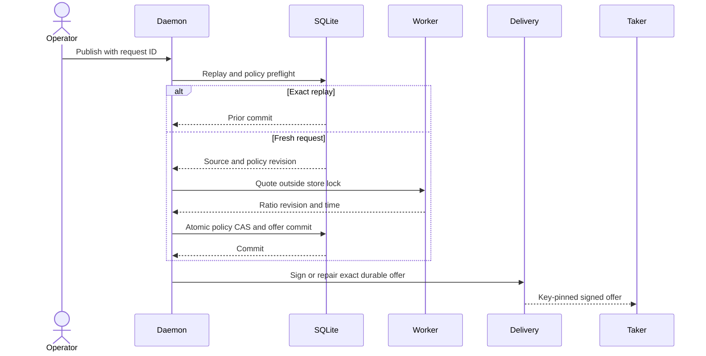

Runtime external resources are none: no chain node, RPC, Docker, faucet,
public funds, DNS, public price feed, or network is used. Cold compilation may
need crates.io and a C toolchain. The production module and immutable upstream
ABI remain LOGOS-021; that release dependency does not block this local M5
functional certification.

## Flow 1F: repeat the BTC/ZEC sealed-config actor boundaries

These component checks run the real one-shot actor binaries exactly as the M5
supervisor will run them, with private config inherited on fixed FD 196. They do
not claim that the daemon supervisor is complete.

```sh
cargo test --locked -p zec-reference-actor --test actor_boundary \
  real_binary_reads_only_the_fully_sealed_inherited_config \
  -- --exact --nocapture
cargo test --locked -p btc-reference-actor --test actor_command \
  real_binary_reads_only_commitment_bound_fully_sealed_config \
  -- --exact --nocapture
cargo test --locked -p btc-reference-actor --test actor_command \
  supervised_maker_bytes_match_exact_manifest_swap_and_state \
  -- --exact --nocapture
cargo test --locked -p lez-maker-node --test maker_actor_manifest -- --nocapture
cargo test --locked -p lez-swap-store --test maker_actor_process \
  verified_artifact_fds_survive_path_replacement_before_exec \
  -- --exact --nocapture
```

Expected result: exactly one passing test from each focused command, plus all
three ZEC manifest cases in the maker-node test. The boundary harnesses create
an owner-private anonymous memfd, writes a valid role config, applies all four
immutable seals, maps it to child FD 196 with pinned `command-fds` 0.3.3,
replaces the original deployment path, and invokes the public actor's offline
`status` command. The returned role and not-activated state must come from the
sealed snapshot. Both prove that a memfd missing the write seal and an ordinary
linked file exit nonzero, emit no JSON, and expose only the generic configuration
failure. Their CLI suites reject any descriptor other than 196 and path-plus-FD
ambiguity.

The BTC inherited route accepts only schema 6. That schema adds the exact
signed-agreement SHA-256 while preserving schemas 3 through 5 for legacy path
invocation. The focused schema test also proves a mismatched digest prevents
activation and that the supervisor can derive the exact signed swap ID, role,
state database path, and digest without secret material.

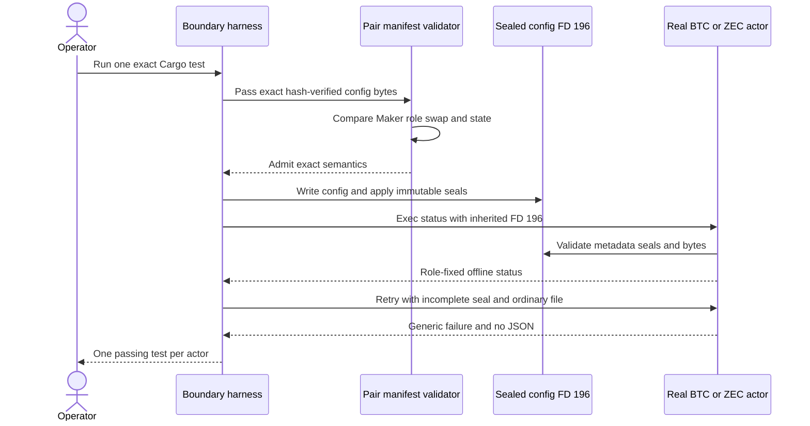

Runtime external resources are none: the flow uses only the local binaries,
temporary files, SQLite fixture state, and Linux memfd/seal/process primitives.
It contacts no RPC, node, Docker service, faucet, DNS service, or public network.
Cold compilation may need the pinned Cargo registry dependencies.

## Flow 1G: repeat daemon-owned ZEC actor scheduling

This process test exercises the real `lez-maker-daemon` and `lez-taker`
binaries across their separate owner and Chat Unix sockets. It is the shortest
repeatable proof that final Chat acceptance can no longer create an unscheduled
swap.

```sh
cargo test --locked -p zec-reference-actor --test maker_provision -- --nocapture
cargo test --locked -p lez-maker-node --test zec_chat_process \
  separate_taker_countersigns_and_maker_atomically_accepts_before_response \
  -- --exact --nocapture
```

Expected result: one passing test. The fixture creates a mode-0700 Maker actor
root, an owner-private Maker-only source config and authority files, and one
exact executable identity. It starts the daemon with the same four deployment
inputs an operator supplies:

```text
--zec-source-maker-config ABSOLUTE_PRIVATE_JSON
--zec-maker-actor-root ABSOLUTE_MODE_0700_DIRECTORY
--zec-actor-program ABSOLUTE_PINNED_EXECUTABLE
--zec-actor-program-sha256 EXACT_64_HEX_DIGEST
```

Repeat `--zec-source-maker-config` once per immutable application-swap
authority, up to 256 entries. Startup loads every activation binding and rejects
an empty/oversized registry or duplicate swap/state identity before binding a
socket. Finalization selects by the accepted agreement's application swap ID;
there is no first-template fallback.

The separate taker discovers and countersigns one offer with a three-second
TTL. It no-clobber-persists the private final agreement before asking the maker
to complete, so a lost response cannot discard the only countersigned wire.
Before returning success, the daemon publishes the final agreement and Maker config with
no-clobber semantics, syncs files and all containing directories, reloads the
semantic binding, and commits acceptance plus one queued schema-v16 actor row in
one SQLite transaction.

The test then waits until both offer and agreement are expired and invokes the
same real taker CLI again. Because the private final agreement already exists,
the taker validates it against its unsigned draft, pinned Maker, local Taker
key/role, exact amount, and swap identity, then retries only
`zec_chat_complete_v1`; it does not rediscover Delivery, stage a new proposal,
or countersign new bytes. Before any current-wall-clock parsing or provisioning,
the maker preflight exact-compares the committed request/offer/revision/
reservation, final-wire and protected-preimage digests, completed negotiation,
swap ID, and immutable actor row. The exact replay must retain one row, the same
manifest, identical config bytes, and the same config inode. Changed replay
inputs or a missing actor row fail closed. No `taker` subtree may exist in the
daemon-created bundle. The focused actor test adds Taker-source rejection,
corrupt collision, unsafe state/journal rejection, and two concurrent same-wire
publishers. The process fixture pins `/usr/bin/true` only to prove
production executable validation and scheduling; it does not claim actor
execution. Sealed execution of the real ZEC binary is covered separately by
`actor_boundary`; Flow 1H covers one bounded supervisor cycle. Long-running
daemon/systemd composition remains open.

Omitting the four deployment inputs is a deliberate fail-closed mode: proposal
staging remains available, but final completion returns `maker actor
provisioning is unavailable` and cannot call the legacy unscheduled acceptance
path. A partial four-argument group is rejected by the CLI before startup.

Runtime external resources are none. The test uses Unix sockets, temporary
owner-private files, SQLite, and local processes only. It contacts no chain
RPC, node, Docker service, faucet, DNS service, public network, or public funds.
After expiry the consumed Delivery envelope is intentionally stale: health
remains `ready: true` while reporting `degraded: true` and Delivery
`unavailable` until reconciliation. That removable projection is not swap
authority and does not invalidate or duplicate the committed completion.
The full local-devnet settlement remains Flow 1B; this focused flow certifies
only the acceptance-to-scheduler handoff.

Current limitation: persistent local-process coordination and a node-free
user-systemd actor crash/restart proof are implemented. The application handoff
verifies the exact queued daemon-provisioned manifest, but the current local-node
settlement still drives a separate finalized Maker actor. Actual-node supervisor
composition and durable maker/taker claim/refund action routing remain.

## Flow 1H: repeat the persistent fenced maker-actor supervisor

These checks exercise the schema-v16 store, pair-neutral supervisor, and actual
long-running daemon process. They cover exact ZEC Maker config semantics, sealed
child FDs, abandoned-lease recovery, a dedicated supervisor SQLite connection,
responsive owner health, and SIGTERM cleanup. They do not replace the real
BTC/ZEC sealed-config consumer tests in Flow 1F or claim actual-node execution.

```sh
cargo test --locked -p lez-swap-store --test maker_actor_process -- --nocapture
cargo test --locked -p lez-maker-node --test maker_actor_supervisor -- --nocapture
cargo test --locked -p lez-maker-node \
  --test daemon_actor_supervisor_process -- --nocapture
```

Expected result: 12 store cases, 13 supervisor cases, and two daemon-process E2E
passes. At startup the opt-in daemon generates one nonzero 128-bit owner with the
OS CSPRNG, exhaustively recovers abandoned leases before readiness, then opens
one WAL SQLite connection per configured worker. `--actor-worker-count` requires
`--actor-supervisor`, defaults to 1, and accepts only 1 through 32. Only acquisition of the exact per-swap kernel lock authorizes
the CAS transfer to the new owner and generation plus one; the row never becomes
queued or unleased. A live old lock is left untouched while a distinct due peer
progresses. The selected worker executes `status` and the selected effect from
one sealed deployment while retaining lock FD 198 through durable resolution.

The daemon E2E uses a local long-running actor, observes `ready: true` health in
under one second while that actor is leased, then sends SIGTERM. Cancellation,
process-group reap, durable non-leased resolution, child-identity clear, and
socket/readiness cleanup complete in under two seconds.

The second daemon E2E starts two workers on two disjoint rows. A terminal actor
completes while the other actor is simultaneously live, Leased, and bound to its
recorded child identity. An owner-private release file makes the second actor
exit nonzero; only that row enters 600-second Backoff. Both attempt counts remain
one, both child identities clear, owner health stays responsive, and restart
preserves the exact distinct manifests with unchanged invocation logs. The
deterministic case passed 10 of 10 local repetitions in 0.49 to 0.54 seconds. It
proves simultaneous process authority and failure isolation, not accepted-
application escrow/deadline overlap or any chain effect.

Run the actual node-free user-systemd crash proof with:

```sh
./scripts/run-m5-maker-systemd-transient.sh
```

Expected output names a unique `lez-m5-systemd-*` unit, one restart, runtime
external resources `none`, and `actual_zcash_chain_certified=false`. The proof
binds an owner-private marker to the durable PID/start ticks, verifies the live
sealed program memfd by SHA-256 and lock FD 198, kills daemon generation 1,
then requires generation 2 recovery, unchanged effect inode/hash, disjoint peer
progress, and zero leased/child rows. A failed run cleans only its unique unit
and temporary root. Cold compilation may need the pinned Cargo registry cache.

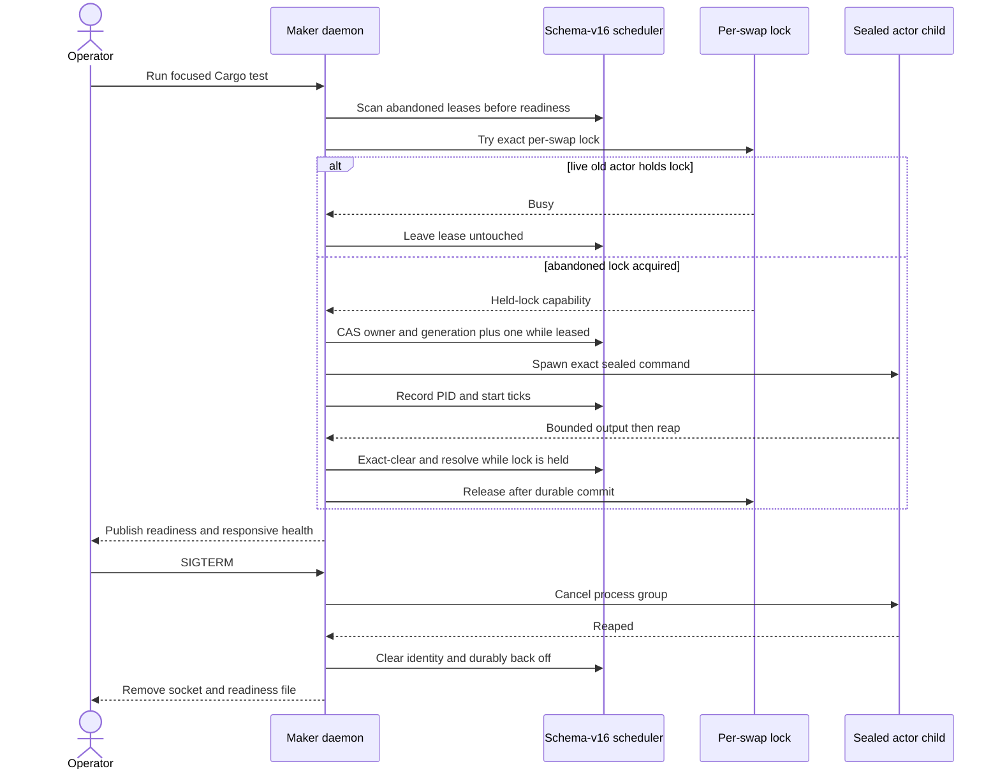

Runtime external resources are none. The tests use only local binaries,
temporary owner-private files, SQLite, and Linux process, `/proc`, memfd, and
locking primitives. They contact no chain RPC, node, Docker service, public
faucet, DNS service, network, or public funds. Cold compilation may need pinned
Cargo registry dependencies from cache or download.

This flow certifies persistent local-process coordination and node-free
user-systemd crash/restart fencing. It does not certify a submitted Zcash effect.
Actual-node supervisor composition, receipt-bound Taker effects, and simultaneous
disjoint live-process composition remain M5 work.

## Flow 1I: inspect the one-leg ZEC recovery checkpoint and target procedure

This is the intended role-correct recovery procedure behind ADR 0102, plus the
inspection boundary for the retained intervention-assisted checkpoint. It is
not yet reproducible end to end through the application as a supported one-command
flow. The historical run provisioned 193 through 448, finalized the refund at
block 608, and required manual rotation plus retirement of an older active
bridge-journal row. Do not repeat either internal edit. Current code makes the
configured window an initial page and size: each validated full-page miss
atomically reserves the next contiguous page in SQLite, and restart resumes it
with unchanged config. Partial, ambiguous, and typed-error polls retain the same
page. Maker lifecycle `monitor/claim/refund` commands are now available. Taker
lifecycle commands and a supported pause/abandonment runner still precede
daemon-supervised actual-node M5 evidence.

Start from a fresh Flow 1B local LEZ and Zebra deployment and its freshly
provisioned role configs. To create the abandonment case, stop lifecycle driving
only after the Taker-owned LEZ first lock is finalized and before any Maker
Zcash lock is submitted. The existing automated Flow 1B runner does not yet
expose this pause as a supported flag; use the
[M3 manual timeout/refund procedure](m3-local-poc-operator-guide.md#manual-actor-timeoutrefund-recovery)
to inspect the phase and deadline. Never edit an agreement, swap ID, account,
deadline, signer, or protected recovery field to manufacture eligibility.

For direction `TakerSellsLez`, the Taker deposited LEZ and is the only role that
may submit that LEZ refund. The Maker is an observer. Reverse those owner labels
only when the signed agreement reverses the funded leg.

```sh
export MAKER_ACTOR_CONFIG=/absolute/private/maker/actor-config.json
export TAKER_ACTOR_CONFIG=/absolute/private/taker/actor-config.json
export LEZ_INDEXER_URL=http://127.0.0.1:PORT
export EVIDENCE_ROOT=/absolute/private/recovery-evidence
install -d -m 0700 "$EVIDENCE_ROOT"

cargo build --locked -p zec-reference-actor --bin zec-reference-actor
target/debug/zec-reference-actor --config "$MAKER_ACTOR_CONFIG" status
target/debug/zec-reference-actor --config "$TAKER_ACTOR_CONFIG" status
```

Both statuses must describe the same swap and the expected one-leg phase. Query
the finalized clock until it covers the signed refund deadline; a sequencer tip
or host wall clock is not sufficient:

```sh
curl --fail --silent --show-error --noproxy '*' \
  -H 'content-type: application/json' \
  --data '{"jsonrpc":"2.0","id":1,"method":"getLastFinalizedBlockId","params":[]}' \
  "$LEZ_INDEXER_URL" | tee "$EVIDENCE_ROOT/finalized-tip.json"
```

Invoke the owner first. `awaiting_deadline` is a safe no-effect result; poll the
finalized clock and retry the same actor state. `submitted` means the durable
attempt is now observe-only on replay. Continue until `refunded`:

```sh
target/debug/zec-reference-actor --config "$TAKER_ACTOR_CONFIG" recover \
  | tee "$EVIDENCE_ROOT/taker-recover.json"
target/debug/zec-reference-actor --config "$TAKER_ACTOR_CONFIG" recover \
  | tee "$EVIDENCE_ROOT/taker-terminal-replay.json"
```

Then invoke the non-owner. It must discover the unique finalized refund and
must not submit one. If the refund lies after the active page, repeat the same
command without editing config; each fully covered miss advances exactly one
durable page, while an incomplete page remains a safe polling result:

```sh
target/debug/zec-reference-actor --config "$MAKER_ACTOR_CONFIG" recover \
  | tee "$EVIDENCE_ROOT/maker-observe-refund.json"
target/debug/zec-reference-actor --config "$MAKER_ACTOR_CONFIG" status
target/debug/zec-reference-actor --config "$TAKER_ACTOR_CONFIG" status
```

Require both statuses to end at `phase: refunded`, equal terminal revisions,
and `next_action: complete`. From the public refund result, retain its
transaction ID and containing finalized height. Query `getBlockById` and
`getBlockByHash`; the decoded results must agree, report `Finalized`, and contain
the transaction exactly once. Read the transaction's metadata and custody
account IDs directly from its ordered public accounts and call
`getAccountAtBlock` for that exact height. Custody must be zero and the observer
must reject a conflicting authority, duplicate refund, broken ancestry, moving
tip, or partial-window absence as terminal.

Atomicity is conditional rather than a distributed commit: the refund owner
persists exact intent before at-most-once submission, the non-owner only
observes, a one-leg abandonment refunds only its funded leg, and when both legs
are funded LEZ recovery precedes Zcash recovery. Both roles require one
unique finalized transaction plus terminal metadata and zero custody, and an
incomplete absence cannot advance either actor. The full argument and sequence
diagram are in [ADR 0102](architecture/0102-observe-refunds-from-finalized-window-prefixes.md).

The retained working-tree example used local LEZ v0.2 sequencer/indexer/Bedrock
and Zebra Regtest only. It used deterministic local genesis funds, no public
RPC, faucet, peer, public funds, or public deployment. Runtime flakiness can
still come from local CPU/disk pressure, configured block cadence, or stopping
the devnet before finality. Cold setup can require pinned Cargo/Git artifacts
and the four pinned rapidsnark v0.0.8 libraries; verify their documented
SHA-256 identities and set absolute `RAPIDSNARK_LIB_DIR` before building the
LEZ sidecar. The upstream fallback also assumes `unzip`, so certified runs use
the verified local libraries and Cargo offline.

Current limitation: the retained actual-node result is one
intervention-assisted recovery, not a clean pushed-commit repeat or a supported
one-command abandonment runner. The current component no longer needs window or
journal edits, and Maker manual-action intent plus CLI routing are GREEN. A
fresh isolated daemon-supervised actual-node replay and Taker controls remain.

## Flow 1J: monitor and request a Maker actor claim or refund

Use this flow only for a swap already accepted by the Maker application and
registered with its exact actor manifest. Do not create or edit scheduler rows
by hand. Start the same owner-local daemon used by Flow 1B or Flow 1D with the
actor supervisor enabled, then build the operator CLI:

```sh
cargo build --locked -p lez-maker-node --bins
export MAKER_SOCKET=/absolute/owner/runtime/maker.sock
export SWAP_ID=the-accepted-application-swap-id

target/debug/lez-maker --socket "$MAKER_SOCKET" monitor --id "$SWAP_ID" \
  | tee /tmp/maker-actor-monitor.json
export EXPECTED_GENERATION="$(jq -er .lease_generation /tmp/maker-actor-monitor.json)"
```

The response is deliberately secret-free. Its top-level fields are
`schema_version`, `swap_id`, `actor_kind`, `schedule_state`,
`lease_generation`, `attempt_count`, `progress`, and `manual_action`. It must
not contain config/program/state paths, artifact hashes, a lease-owner value,
PID/start ticks, keys, capabilities, preimages, or raw actor output. Monitor
reads only application SQLite and performs no actor invocation or chain RPC.

Choose exactly one action justified by the signed agreement and current actor
progress. ZEC Maker actors support both commands. BTC Maker actors support
`refund` only; `claim` fails as an invalid request. XMR has no unified Maker
lifecycle actor at this boundary. A claim example is:

```sh
export ACTION_REQUEST_ID=maker-claim-local-001
target/debug/lez-maker --socket "$MAKER_SOCKET" claim \
  --id "$SWAP_ID" \
  --request-id "$ACTION_REQUEST_ID" \
  --expected-generation "$EXPECTED_GENERATION" \
  | tee /tmp/maker-actor-claim-admission.json
```

For an eligible timeout path, use a different swap and stable request ID:

```sh
export ACTION_REQUEST_ID=maker-refund-local-001
target/debug/lez-maker --socket "$MAKER_SOCKET" refund \
  --id "$SWAP_ID" \
  --request-id "$ACTION_REQUEST_ID" \
  --expected-generation "$EXPECTED_GENERATION" \
  | tee /tmp/maker-actor-refund-admission.json
```

The command admits durable intent; it does not mean a transaction has already
been submitted. `was_replay: false` means the request was newly committed. To
recover from a lost response, repeat the exact same command with the same
request ID, swap ID, action, and expected generation. The result must report
`was_replay: true` and the original `requested_after_generation`. Never replace
that generation with a newer monitor value for the same request ID. A changed
payload, stale generation, or second open action returns conflict. A missing
actor returns not found. An unsupported pair/action or ineligible scheduler
state returns invalid request.

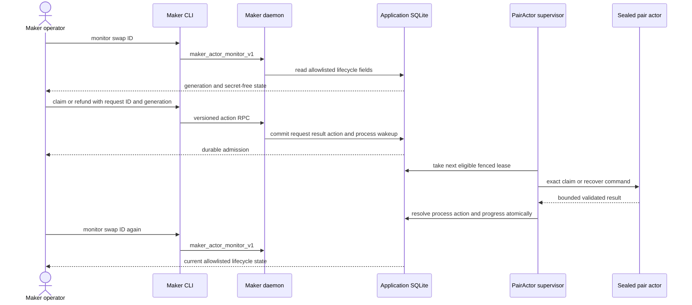

Action admission is atomic because the global mutation result, manual-action
row, and process wakeup commit in one immediate transaction. Execution remains
atomic with respect to local publication because the exact owner/generation
lease, action resolution, process resolution, and validated progress commit
together while the supervisor holds the per-swap kernel lock. Cross-chain
atomicity still comes from the pair agreement, role journal, persist-before-send
transition, canonical observation, and ordered refund/claim rules; this RPC
creates no new signing authority.

After a daemon restart, repeat `monitor`. The durable generation, progress, and
action state must reappear. If the action is still queued, do not invent a new
request. Let the enabled supervisor take its next eligible lease. For a local
process-only reproduction of monitor, exact replay, conflict, missing actor, and
restart durability, run:

```sh
cargo test --locked -p lez-maker-node --test operator_journey \
  maker_actor_lifecycle_commands_are_read_only_replay_safe_and_restart_durable \
  -- --exact --nocapture
```

That focused test uses temporary owner-private files, SQLite, Unix sockets, and
local binaries only. It uses no Docker service, chain RPC, faucet, DNS, public
network, or public funds. A real accepted actor action uses the chain endpoints
and local deterministic funds already bound by its private config; on the Flow
1B PoC those are the isolated LEZ v0.2 and Zebra Regtest services. Their local
finality cadence, CPU/disk pressure, or premature shutdown can delay execution,
but cannot change an exact admitted request into a different action.

## Flow 1K: monitor, claim, or refund as the ZEC Taker

Build the application binary. During `--accept-zec-offer`, require the Taker
source authority, a fresh actor root, and a receipt outside that root:

```text
--zec-source-taker-config /absolute/private/source/taker.json
--zec-taker-actor-root /absolute/private/swap/accepted-actor
--zec-acceptance-receipt /absolute/private/swap/acceptance-receipt.json
```

The receipt is published only after durable Maker completion. Use it for the
normal accepted-swap lifecycle:

```sh
cargo build --locked -p lez-maker-node --bin lez-taker
target/debug/lez-taker monitor \
  --receipt /absolute/private/swap/acceptance-receipt.json
```

An unactivated actor returns exactly this secret-free JSON without opening the
role database or contacting Delivery, Chat, LEZ, or Zebra:

```json
{"schema_version":1,"role":"taker","state":"not_activated"}
```

For an accepted and activated swap, `monitor` returns the same bounded actor
status schema. Use `claim` only when the signed agreement and current phase make
the Taker claim eligible:

```sh
target/debug/lez-taker claim \
  --receipt /absolute/private/swap/acceptance-receipt.json
```

Use `refund` only on the agreement-defined timeout path:

```sh
target/debug/lez-taker refund \
  --receipt /absolute/private/swap/acceptance-receipt.json
```

The flags do not grant effect authority. The role-fixed config, accepted
agreement, durable actor phase, and canonical chain observations decide whether
an action is eligible. A Maker config is rejected before state access. A second
process for the same role state fails closed while the first holds the per-swap
kernel lock; retry after the original process exits.

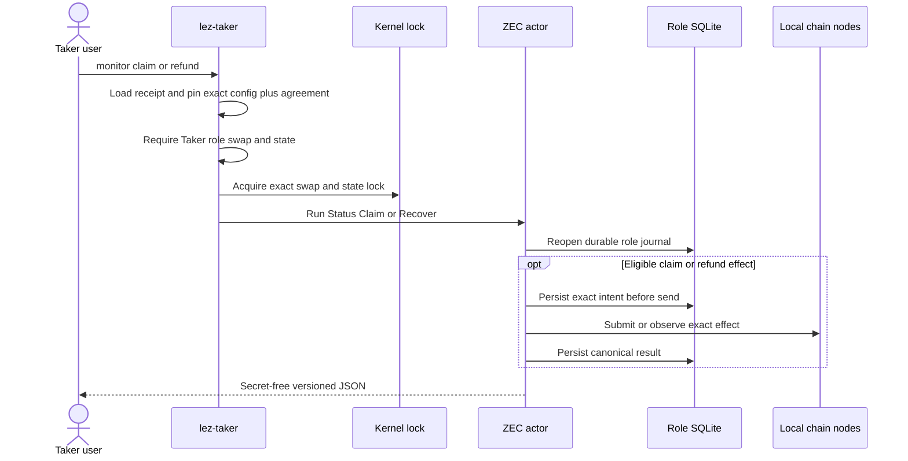

The command boundary is locally atomic with respect to competing processes
because one kernel lock covers the complete role-state invocation. There is no
atomic transaction across SQLite and two chains. Safety instead uses the signed
hashlock/refund agreement, persist-before-send journals, at-most-one attempt
authority, canonical observation before replay, and agreement-ordered claim and
refund admission. That preserves the underlying conditional atomicity without
pretending a distributed database transaction exists.

Reproduce the current process component evidence with:

```sh
cargo test --locked -p lez-maker-node --test taker_lifecycle_process -- --nocapture
cargo test --locked -p lez-maker-node --test zec_chat_process -- --nocapture
```

The seven focused cases use temporary mode-0700 roots, private files, SQLite, and
the real local binary only. They use no Docker service, chain RPC, faucet, DNS,
peer, public network, or public funds. A real claim or refund uses only the LEZ
sidecar and Zebra RPC already pinned in the accepted Taker config. In the local
PoC these are ephemeral literal-loopback devnet services with deterministic
genesis/Regtest funds; CPU or disk pressure, local finality cadence, or stopping
a node early can delay progress, but no external public service participates.

The process proof also runs the real acceptance command, verifies all seven
receipt fields and exact digests, preserves agreement/config/receipt bytes and
inodes on retry, removes Delivery during persisted completion replay, and runs
`monitor --receipt` after both application transports are absent. It also
forwards the real proposal through a mode-0600 Unix HTTP fault proxy, observes
the Maker's successful durable completion response upstream, and deliberately
drops it before the Taker receives a response. Expect that invocation to fail
with empty stdout, leave the role-only Taker bundle and agreement intact, leave
no receipt, and leave the Maker negotiation durably `Completed`; the immediate
direct retry must report proposal, completion, agreement, and provisioning
replay while publishing the first receipt, and the following retry must preserve
all three artifact inodes and bytes. Direct
`--actor-config` remains an expert component-debug/manual-recovery escape hatch;
the receipt is the normal accepted-swap path. The composed happy-path runner now
selects the acceptance-provisioned Taker
config and state, validates it against the queued Maker before effects, pins the
receipt around every receipt-based monitor or claim invocation, and routes the
eligible Zcash follow-up
through `claim --receipt`. Its focused contract and lint gates are GREEN; a
fresh isolated actual-node execution of that route and an actual-node refund
through the receipt remain required before this is the final M5 user journey.

## Flow 2: Zcash SDK, reconciliation, then actor claim/refund/fork


Build the two libraries, then reproduce the proven independent-actor claim
corridor directly:

```sh
cargo build --locked -p lez-zec-swap-sdk -p lez-swap-store
cargo test --locked -p lez-zec-swap-sdk --test sdk_lifecycle \
  independent_actors_complete_lez_then_zcash_claims_in_both_directions \
  -- --exact --nocapture
cargo test --locked -p lez-swap-store --test zec_sdk_recovery \
  schema_v9_claim_journal_completes_and_reopens_independent_actors_in_both_directions \
  -- --exact --nocapture
```

The expected result from each focused command is one passing test. Both cover
`TakerSellsForeign` and `TakerSellsLez`. The first claimant always submits the
LEZ reveal; only after both role-local actors observe its canonical evidence
does the other actor recover the preimage internally and submit the Zcash
follow-up. Both actors finish at revision 4 and a claim-capable restart returns
`Completed`.

The SQLite test creates independent temporary maker and taker database files.
It passes the same deterministic external test key ID and material to each
role's original open and reopen. A real caller must likewise provide the same
external key for a role across restart; losing or changing it fails closed.
The key is never persisted. Protected material and exact claim submissions are
XChaCha20-Poly1305 ciphertext under HKDF-derived, context-bound keys. The test
scans the database and WAL bytes before and after reopen and rejects plaintext
preimages or either exact secret-bearing claim transaction.

Run the broader agreement, lifecycle, and store regressions afterward:

```sh
cargo test --locked -p lez-zec-swap-sdk --test agreement_v1_cross_binding -- --nocapture
cargo test --locked -p lez-zec-swap-sdk --test sdk_lifecycle -- --nocapture
cargo test --locked -p lez-swap-store --test zec_sdk_recovery -- --nocapture
```

The first command runs 17 cases over the canonical agreement: bounded
exact wire decoding, both low-S signatures, every signed-field mutation, both
directions, deterministic-local execution terms, fail-closed public deployment,
actual LEZ/ZEC deadlines, role/digest binding, agreement-derived
fees/destinations/expiry/funding requests, exact native/token PDA/ATA accounts,
accepted-at resume, and redacted diagnostics. The second runs 30 integrated
cases in which independent maker and taker SDK instances with fixed roles
receive untrusted bytes, validate the concrete record, persist separate accepted
envelopes before activation, and resume the original wire after transcript
expiry. It also proves exact retry idempotence, changed same-key conflict,
wrong-role/revision/wire/swap-ID rejection, redacted active diagnostics, and
transport-free active types. Its primitive-record case rejects
future/substituted/corrupt recovery fields.
Package rustdoc additionally compile-fails any
attempt to obtain raw LEZ, Zcash, or recovery-store handles from an active swap.

The chain adapters are deterministic contract doubles; these commands require
no RPC, node, Docker, faucet, or external resource. They do not prove real
Logos Delivery/Chat, official-wire LEZ/Zebra lifecycle effects, or a
process-level maker/taker E2E. The claim-capable activation and schema-v14 store
atomically bind the direction-derived first claimant agreement to encrypted
material, retain exact claim submissions only in protected envelopes, and
separate owner and observer transition journals. The SDK first-lock cases
additionally prove exact
role/direction-bound bytes are staged before a node call, changed replay
conflicts, unstable observations submit nothing, restart observes before exact
rebroadcast, and LEZ initialization must be confirmed before its separately
durable fund transaction is submitted. Two projection cases prove invalid
evidence and a failed commit leave the coordinator `Offered`, an unknown
successful commit is accepted only after an exact predecessor-slot probe, and
restart replays the durable transition to `TakerLockConfirmed`. Maker-specific
cases prove that only the agreement-derived node port is queried, a primitive
forward Zcash assertion is rejected, complete canonical output evidence survives
record revalidation against the HTLC output binding, non-confirmed
outcomes write nothing, the maker never owns a taker intent, persisted adapter
assertions remain non-authorizing, and restart uses the maker-only store. The
same SDK suite then drives the maker happy path in both signed directions:
Zcash taker funding selects LEZ initialize/fund, while LEZ taker funding selects
Zcash fund. Every drive performs a fresh eligibility poll, the exact plan is
durable before submission, confirmed Maker evidence advances to
`BothLegsLocked`, and restart reconstructs that phase. A separate-role case then
has the taker observe the maker lock through the agreement-selected port;
distinct maker and taker stores both reach and replay `BothLegsLocked` in both
directions. The claim case continues from that exact actor boundary: LEZ reveal
precedes Zcash follow-up, the follower receives no caller-supplied secret, and
both independent journals replay `Completed` through `resume_claim_capable`.
The expected remote submission ID is adapter-asserted in this fixture, so a
production canonical adapter remains required. A stale second maker
instance catches up from the durable transition without another submission.
Projection fault injection leaves the maker intent open and in-memory phase
unchanged; an unknown successful commit is adopted only after exact probe.
Stable absence in either direction creates no maker intent and submits nothing.
Accept-then-fail fixtures cover LEZ initialize, LEZ fund, and Zcash fund: each
restart observes the accepted step before proceeding and submission counts do
not increase. A taker removal after LEZ initialization holds the maker in
`Offered`, submits no fund through stable absence, and resumes only after a
validated replacement.
The store command runs
16 production-adapter cases over real temporary
schema-v14 databases: exact replay/conflict, same-ID role isolation, retained
closed intent, taker and maker trigger-injected rollback,
future/malformed/torn/orphan/holey-state rejection, poison-append rejection,
exact and historical maker replay, stale-instance catch-up, and four-event
close/reopen resume. The maker actor flow is canonical observation at revision
1, atomic replacement at revision 2, same-inclusion depth update at revision 3,
and affirmative removal at revision 4. Replacement halves share one stable
tip; unchanged polls write nothing; changed inclusion without replacement and
stale removal of an old inclusion fail before append. A fresh eligibility call
after close/reopen replays and re-queries the exact Zcash or LEZ head, writes
no duplicate, returns the durable revision, and leaves `next_action` at
`Wait`; reverse replacement heads are eligible after restart, removed heads
are not, and local Pending is depth-eligible. The public Pending/Safe typed
awaiting-finality policy is unit-tested only because public agreement activation
remains fail-closed pending reviewed deployment. Stable absence and unstable polls return no
eligibility, write nothing, and preserve the revision. Its schema-v14 cases
prove both directions stage at revision 1, commit an intervening canonical
depth/finality update at revision 2 without another maker submission, then
close the intent and maker transition at revision 3 before reopen at
`BothLegsLocked`. A taker-local observed-maker transition independently replays
the taker from revision 1 to `BothLegsLocked` at revision 2 in both directions;
malformed and future payloads fail closed. The claim case adds protected
material, protected exact-payload intent, owned/observed transitions, unified
revision continuity, raw DB/WAL secret rejection, and independent close/reopen
at `Completed`. Production chain RPC claim adapters, actual-node
transport/reorg repetition, refunds, and independent actor processes are
remaining work.

Before starting Zebra, reproduce spend recognition independently from SDK
construction policy:

```sh
cargo test --locked -p lez-zec-swap-sdk --test zcash_spend_observations -- --nocapture
```

The eight cases enforce Zebra's exact P2SH/CLTV consensus flags, every defined
ZIP-244 sighash mode, consensus-valid high-S and nonminimal/semantic stack
forms, raw/script bounds, exact decoding, stable inclusion, and preservation of
outputs, lock time, expiry, sequence, role, and claim preimage. A separate
policy report flags any deviation from the SDK's canonical low-S, minimal,
`SIGHASH_ALL`, exact destination/fee/expiry shape without discarding the valid
claim. This command uses no RPC, node, Docker, faucet, or external resource.
It does not yet prove agreement-derived funding provenance, multi-input
non-`ANYONECANPAY` prevout context, or durable spend reorg tracking.

First reproduce the lightweight runtime/store user-role semantics without
Docker:

```sh
cargo test --locked -p lez-maker-node --test zec_runtime_reconciliation -- --nocapture
cargo test --locked -p lez-swap-store --test zec_event_journal -- --nocapture
```

The first suite must pass both ZEC-funded roles, restart replay, exact-head
validation, pre-dependent replacement, same-transaction re-mining,
post-dependent `ReplacementConflict`, and completed/refunded
`TerminalReorgDetected`. It also proves that missing legacy bindings, mismatched
profile confirmation policies, and a mismatched output envelope fail before any
revision or journal mutation. The second suite proves schema-v3 migration,
atomic swap+binding and event+aggregate rollback, immutable rebinding, lower
commit/probe enforcement, and restart-safe loading. These runtime/store tests do
not substitute for the actual-node command below.

Reproduce the owner-facing incident path through the real authenticated daemon
and CLI with:

```sh
cargo test --locked -p lez-maker-node --test operator_journey \
  owner_lists_and_acknowledges_durable_alert_across_daemon_restart \
  -- --exact --nocapture
```

That journey creates a genuine post-dependent Zcash replacement conflict through
the maker runtime, starts the daemon on an owner-only Unix socket, and uses the
owner CLI to verify the attention summary, list the durable alert, restart the
daemon, and acknowledge the same alert. A wrong socket cannot reach the daemon;
the mode-0700 runtime and mode-0600 socket are the authorization boundary. For
an equivalent already-running daemon, the owner commands are:

```sh
target/debug/lez-maker --socket "$MAKER_SOCKET" \
  status --id "$SWAP_ID"
target/debug/lez-maker --socket "$MAKER_SOCKET" \
  alerts --id "$SWAP_ID"
target/debug/lez-maker --socket "$MAKER_SOCKET" \
  acknowledge-alert --id "$SWAP_ID" --alert "$ALERT_SEQUENCE"
target/debug/lez-maker --socket "$MAKER_SOCKET" \
  alerts --id "$SWAP_ID" --all
```

Acknowledgment records operator receipt only: it neither changes the swap phase
nor makes an unsafe claim/refund eligible. There is intentionally no production
RPC that injects watcher events; the automated journey seeds the conflict through
the same typed maker runtime boundary used by the watcher.

Use a fresh run ID and let the repository runner own the complete Docker
lifecycle:

```sh
RUN_ID=manual-zebra-20260711-a ./scripts/run-zebra-e2e.sh
```

The runner builds a unique digest-pinned Zebra image, starts two disconnected
NU6.2 Regtest nodes with independent ephemeral state and host ports, and exports
their RPC URLs plus an absolute run-scoped maker database only to the ignored
Rust fixtures. It refuses a pre-existing manifest, database, WAL, or SHM before
Compose starts. The maker runtime fixture runs first and:

1. constructs and broadcasts canonical BIP-199 funding to the primary node;
2. commits its immutable binding, event, and aggregate revision to schema-v14
   SQLite, closes the store, reopens it, replays the journal, and proves an
   unchanged fresh RPC requery creates no duplicate;
3. mines a longer independent fork without the funding transaction, relays it
   to the primary, and validates affirmative changed-height removal evidence;
4. commits the removal back to `Offered`, closes/reopens again, and proves an
   exact unknown-outcome retry keeps one binding and exactly two journal rows.

The existing actor/consensus fixture then:

1. matures four transparent actor UTXOs and validates the fetched prevouts;
2. rejects a funding transaction whose actor signature was mutated;
3. funds and claims one exact BIP-199 P2SH output with the claimant key and
   preimage, while rejecting a mutated claimant signature; before spending,
   stable RPC queries bind Regtest genesis, NU6.2, raw bytes, canonical block,
   exact outpoint/value/scripts, and derived depth into typed source evidence;
4. funds a second output, rejects its refund before CLTV, then confirms the
   funder's refund at the required height;
5. funds two more outputs for concurrent claim/refund lifecycles; and
6. gives both nodes an identical prefix, mines a three-block claim branch on the
   primary and a conflicting four-block refund branch on the fork node, relays
   the higher-work branch, and verifies the old branch is detached and the
   replacement refund is canonical with at least four confirmations.

Success includes both test results and an actor evidence line containing the
actual transaction IDs and serialized-hex sizes:

```text
test canonical_funding_is_requeried_across_store_restart_and_real_removal ... ok
test real_actor_keys_fund_claim_and_refund_through_zebra_consensus ... ok
Zebra accepted actor claim ... and refund ...
```

The EXIT trap stops only `lez-atomic-swaps-${RUN_ID}`, removes its volumes and
the image created by that run, and leaves `.e2e/${RUN_ID}/run.env` as the
endpoint/project/database manifest and the SQLite evidence beside it. Reusing
that run ID is deliberately rejected. It never prunes unrelated resources.

## Flow 3: LEZ guest deployment and native/token actor lifecycles

This is the exact end-to-end local compatibility command. Use unique paths and
do not run it beside another heavy suite:

```sh
RUN_ID=manual-lez-20260711-a \
LEZ_E2E_TOOL_DIR=/tmp/lez-risc0-manual-lez-20260711-a \
LEZ_METHODS_TARGET_DIR=/tmp/lez-methods-manual-lez-20260711-a \
LEZ_STANDALONE_TARGET_DIR=/tmp/lez-standalone-manual-lez-20260711-a \
LEZ_COST_OUTPUT_DIR=/tmp/lez-costs-manual-lez-20260711-a \
./scripts/run-lez-standalone-e2e.sh
```

The runner checks the exact SPEL/LEZ commits and dependency-feature exposure,
builds the Risc0 3.0.5 guest, checks the ELF digest and ImageID, deploys it
through public RPC into a canonical standalone block, and exercises actual
funded genesis actors.

The native flow is `initialize → fund → claim` and an independent
`initialize → fund → refund` after canonical time. It rejects a wrong preimage,
a valid depositor key used in the claimant role, and an early permissionless
refund without changing the signer nonce or custody.

The token flow creates two official fungible definitions and the actors'
definition-bound associated token accounts (ATAs). Each escrow custody is the
official `ATA(metadata, definition)`. One definition is claimed and the other is
refunded. The suite rejects a wrong preimage, wrong actor role,
cross-definition claimant ATA, early refund, and cross-definition refund
destination, while checking exact holdings and total-supply conservation.

Success ends with all of the following evidence:

```text
proved LEZ cf3639d8252040d13b3d4e933feb19b42c76e14a deployment plus native and two-definition token actor lifecycles
LEZ standalone guest native/token lifecycle proof passed: elf_sha256=fe8ec1166ec886693d1fcd1d1ddc80090f81f6fab941851cce43b5bfb0c739f7 image_id=5421868ee00d213bf083c09f14ed09f303e8581b95b3a17bb9b79f6cb44add62
LEZ native/token recursive cost evidence passed: /tmp/lez-costs-manual-lez-20260711-a/generated.json
```

Reference run `m5-ruint-v012-final-20260731` passed six ordinary tests, two
actual deployment/native-plus-two-token lifecycle tests, and one recursive cost
case after exercising the reusable external-node process. Its private schema-v2
readiness binds the same checked ELF/ImageID to the exact deployment transaction
and containing canonical block, treats `getProgramIds` as a built-in-only map,
and verifies two funded deterministic actors through official account RPC.

Validate the generated JSON with the same stable policy required by CI:

```sh
./scripts/check-lez-cost-evidence.sh \
  docs/evidence/lez-v0.1.2-escrow-costs.json \
  /tmp/lez-costs-manual-lez-20260711-a/generated.json
```

The policy requires the exact artifact identity, operation order, recursive
session topology, segments, allocated totals, and per-operation user-cycle
budgets. It also proves each session's user, paging, and reserved cycles sum to
its total and each recursive user total remains within budget. Measurement date
and the internally consistent classification split may vary, so the complete
JSON is intentionally not required to be byte-identical. The historical
byte-diff made the otherwise successful reference run exit `1` at the final
comparison; it did not invalidate any functional, identity, topology, total, or
budget result.

The reference cleanup removed the approved `.e2e` run cache and reduced Docker
context transfer from 6.37 GB to about 64 KB. Do not treat that as durable: the
pinned Risc0 Dockerfile-specific ignore overrides the root `.dockerignore`, so
retaining new `.e2e` runs can grow the context again. Delete only run-owned data
after confirming no process uses it.

The sequencer uses an ephemeral port and temporary state and stops when the test
ends. The unique tool, build, and cost directories remain as reproducibility
caches/evidence. Remove only the directories belonging to this run, only after
no process is using them; never delete another run's shared cache.

### Direct reusable LEZ node handoff

The full runner above builds and tests the external
`lez-standalone-node` process. To keep that checked node alive for a manual
consumer after the runner has produced the exact guest, use a new run directory
and the same isolated standalone target directory:

```sh
RUN_DIR=/tmp/lez-node-manual-20260713-a
LEZ_NODE_TARGET_DIR=/tmp/lez-standalone-node-manual-20260713-a
umask 077
mkdir "$RUN_DIR"
CARGO_TARGET_DIR="$LEZ_NODE_TARGET_DIR" \
  cargo build --locked --manifest-path compat/lez-standalone-e2e/Cargo.toml \
    --bin lez-standalone-node
"$LEZ_NODE_TARGET_DIR/debug/lez-standalone-node" \
  --home "$RUN_DIR/node" \
  --guest-elf compat/spel-zec-escrow/methods/guest/target/riscv32im-risc0-zkvm-elf/docker/zec_escrow.bin \
  --artifact-manifest compat/spel-zec-escrow/methods/guest/artifact-manifest.toml \
  --readiness-manifest "$RUN_DIR/readiness.json"
```

The node prints only `ready` after the private manifest has been durably
published, then waits for stdin or Ctrl-C. In a second shell, check permissions
without printing the secret-bearing JSON:

```sh
RUN_DIR=/tmp/lez-node-manual-20260713-a
test "$(stat -c '%a' "$RUN_DIR/node")" = 700
test "$(stat -c '%a' "$RUN_DIR/readiness.json")" = 600
```

The schema-v2 JSON contains the dynamic `http://127.0.0.1:<port>` client
endpoint, exact channel and genesis identity, checked ELF
SHA-256/ImageID/ProgramId, canonical deployment transaction hash and containing
block ID/hash, the advertised authenticated-transfer built-in identity, and two
deterministic funded actor account IDs, balances, and private signing keys.
`getProgramIds` supplies only that static built-in identity; a consumer re-fetches
the exact deployment through `getTransaction` and `getBlock`, verifies its
variant/hash/block membership, and derives ProgramId from the contained ELF. The
readiness file is a run-local capability and must not be displayed, logged,
uploaded, or committed. The upstream server still binds its allocated port on `0.0.0.0` even
though the published client URL is literal loopback; use a network namespace or
container when host-wildcard exposure is unacceptable. Press Ctrl-C in the
first shell for graceful shutdown, then remove only this `$RUN_DIR` after all
consumers have stopped. The process does not use Docker, a public RPC, a faucet,
or public testnet funds; the only cold-run availability risks are the software
and artifact distribution resources already listed above. The corrected exact
full runner has passed with exit `0`; a direct launch is still only a local
v0.1.2 node handoff and must not be reported as a v0.2 public deployment or a
composed actor corridor.

## Flow 1L: repeat the BTC durable negotiation checkpoint

This is the current reproducible BTC application component boundary. It is not
yet the end-user BTC swap command and makes no Bitcoin or LEZ chain effect.

From the repository root, with the pinned Rust 1.96.0 toolchain already
installed, run:

```bash
cargo +1.96.0 test --locked --offline \
  -p lez-swap-store --test btc_maker_negotiation
```

Expected result is one passing
`btc_maker_negotiation_is_one_winner_restart_safe_and_completes_atomically`
test. The fixture constructs a real canonical BTC body, Maker-signed proposal,
and Taker-countersigned final agreement. It then proves one-winner staging,
changed-request conflict, competing-reservation rejection, SQLite reopen,
durable negotiation and offer-owner drift rejection, corrupted reservation-window rejection, signed offer-direction binding, accepted-before-reserved and expiry-boundary rejection, exact staged Maker-signature binding, trigger-forced rollback,
lost-response preflight, scheduler-time-insensitive replay, request conflict,
and completed-row tamper rejection.

For the complete package regression and lint boundary, run:

```bash
cargo +1.96.0 test --locked --offline -p lez-swap-store --all-targets
cargo +1.96.0 clippy --locked --offline \
  -p lez-swap-store --all-targets -- -D warnings
cargo +1.96.0 doc --locked --offline -p lez-swap-store --no-deps
```

External runtime resources used: none. There is no Docker project, Bitcoin
Core, LEZ process, RPC endpoint, faucet, DNS lookup, public network, or public
fund. The deterministic cryptographic keys and SQLite database live only in a
test-owned temporary directory. Accordingly, this flow has no chain-finality
flake source and does not prove node behavior. The forthcoming user-visible BTC
flow will use isolated Bitcoin Core Regtest and LEZ v0.2 endpoints selected by
configuration; switching to public routes will remain a configuration and
deployment change, not a different agreement or store format.

## Flow 1M: repeat role-fixed BTC actor provisioning

This component is the filesystem handoff between a completed BTC negotiation and
one independently operated Maker or Taker actor. It does not yet run either
role's end-user swap command or make a chain effect.

From the repository root, with the pinned Rust 1.96.0 toolchain already
installed, run:

```bash
cargo +1.96.0 test --locked --offline \
  -p btc-reference-actor --lib provision
```

Expected result is four passing provisioning tests. They prove symmetric
Maker/Taker role-only bundles, schema-6 reload, exact digest and swap binding,
byte- and inode-stable replay, cross-role rejection without output, and
no-clobber rejection that preserves an existing private marker. For the complete
actor package boundary, run:

```bash
cargo +1.96.0 test --locked --offline \
  -p btc-reference-actor --all-targets
```

Expected result is 100 passing tests: 89 library tests and 11 command tests.
External runtime resources used: none. The tests create deterministic
agreements, local SQLite signing material, and mode-0700 temporary role roots;
they do not start Docker, Bitcoin Core, LEZ, an RPC endpoint, a faucet, DNS, or
public networking, and they spend no public funds. This makes the component
repeatable and free of chain-finality flakiness, but it proves only
crash-consistent local actor publication. The forthcoming full BTC application
flow must separately prove the role processes against isolated Bitcoin Core
Regtest and LEZ v0.2.

## Flow 1N: repeat the BTC application process PoC

This is the first reproducible end-user-shaped BTC application handoff. It runs
the actual Maker CLI, maker daemon, and Taker CLI as separate processes, but
stops before either actor submits a chain effect.

From the repository root, with the pinned Rust 1.96.0 toolchain already
installed, run:

```bash
cargo +1.96.0 test --locked --offline \
  -p lez-maker-node --test btc_chat_process -- \
  --exact real_taker_and_daemon_handoff_exact_btc_agreement_to_role_fixed_actors \
  --nocapture
```

Expected result is one passing test in about one second; the recorded focused
run passed 1 of 1 in 0.87 seconds. The process roles emulate the real operator
boundary:

1. A Delivery-only maker daemon starts without Chat, agreement signing,
   provisioning, or actor authority, and the real Maker CLI publishes its
   signed bounded offer.
2. `lez-taker --plan-btc-offer` authenticates that exact envelope and prints the
   reservation ID, envelope commitment, derived swap ID, and quoted amounts with
   `private_material_disclosed: false`.
3. The daemon restarts with the selected BTC authority, while
   `btc-local-poc-provision export-draft` reparses the finalized fixture and
   creates the exact canonical unsigned body under mode 0700/0600 no-clobber
   storage.
4. The Taker CLI discovers that exact offer and asks the maker daemon for a BTC
   proposal through the taker-facing Chat socket.
5. The daemon authenticates the Delivery envelope and draft, contributes only
   the Maker Schnorr signature, and durably stages it before replying.
6. The Taker validates the proposal, contributes only the Taker Schnorr
   signature, and persists the final agreement before requesting completion.
7. Schema 19 atomically consumes the offer and commits the exact dual-signed
   wire, coordinator, Maker role actor, and replay result; the Taker provisions
   only its own role actor.
8. The Taker publishes its pair-pinned acceptance receipt only after durable
   Maker completion.
9. The test removes Delivery, repeats completion from the persisted final wire,
   verifies the agreement and actor-config inodes did not change, and monitors
   the accepted swap offline through the receipt.

The no-clobber role split and persist-before-completion ordering are the local
atomicity boundary: a crash can leave a retryable staged/final artifact, but
cannot expose a receipt before durable Maker acceptance or silently replace
either role's agreement or actor bundle. This is not a distributed atomic
commit with either chain.

External runtime resources used: none. The test starts no Bitcoin Core or LEZ
node, opens no chain RPC, starts no Docker project, contacts no faucet or DNS,
uses no network or public funds, and depends on no finality clock. Its signed
offers, keys, SQLite state, sockets, agreements, receipts, and actor roots are
deterministic or test-owned local fixtures. That makes this pre-effect process
gate fast and insensitive to node/faucet/network flakiness, but it does not
prove Bitcoin or LEZ behavior. The next BTC application gate must run these
role-fixed outputs against isolated Bitcoin Core 31.1 Regtest and LEZ v0.2
nodes; public endpoints remain a later configuration and deployment choice.

The opt-in composed runner is now available for the clean-pushed runtime gate:

```bash
RUN_ID="m5-btc-application-$(date -u +%Y%m%d%H%M%S)" \
  ./scripts/run-m5-btc-application-poc.sh
```

Exact pushed run `m5-btc-app-20260730-992b6d4-e` completed this command from
commit `992b6d4`: both actors reached revision 4 `completed`, exactly two
Bitcoin effects and three LEZ effects were retained, terminal replay submitted
nothing, and exact scoped cleanup passed. The secret-safe checked packet is
[`m5-btc-application-corridor-20260730.json`](evidence/m5-btc-application-corridor-20260730.json).
This closes the BTC application runtime gate, not the whole M5 milestone.

It requires a clean `HEAD` already equal to `origin/main`, Docker, the pinned
Rust toolchain and offline dependency cache, the pinned LEZ v0.2/Rapidsnark
inputs documented by the M3 flow, and enough local disk for run-scoped images
and `.e2e/$RUN_ID`. It creates uniquely named Bitcoin Core 31.1 Regtest and LEZ
v0.2 stacks with dynamic loopback ports. Test funds come only from deterministic
Regtest outputs and local LEZ genesis; no public RPC, faucet, peer, deployment,
DNS route, public funds, or evidence upload participates. The pinned Bedrock
component may attempt `pool.ntp.org:123/udp`, but certification does not depend
on that response. Local container startup, build-cache misses, and finalized
block production are the remaining flake/time sources. The runner records exact
container IDs, RPC facts, process identities, actor configs, effects, terminal
state, timing, and cleanup evidence and removes only resources bearing its own
run ID.

After success, verify the public packet without opening owner-private configs or
signer files:

```bash
EVIDENCE=".e2e/$RUN_ID/m3-actor-poc/evidence"
jq '{result,run_id,repository_commit,directions,replay_resubmission_count,services,external_resources,execution_provenance}' \
  "$EVIDENCE/m3-actor-local-poc.json"
jq . "$EVIDENCE/taker_sells_foreign-actual-submission-counts.json"
jq . "$EVIDENCE/taker_sells_foreign-maker-replay-drive.json"
jq . "$EVIDENCE/taker_sells_foreign-taker-replay-drive.json"
jq . "$EVIDENCE/cleanup-attestation.json"
```

## Flow 1O: repeat the XMR Stage-B atomic store checkpoint

This is a reproducible developer/component checkpoint, not yet an end-user XMR
swap flow. It proves the exact executable handoff that the forthcoming real
Maker daemon and Taker CLI flow will call.

From the repository root, with Rust 1.96.0 and the offline Cargo cache already
available, run:

```bash
cargo +1.96.0 test --locked --offline \
  -p lez-swap-store --test xmr_maker_negotiation \
  xmr_stage_b_completion_is_atomic_replay_safe_and_mints_one_actor -- --exact
```

Expected result is one passing test. The test performs deliberately expensive
cross-curve proof validation and can take roughly 80 to 110 seconds on this
development host.

The checkpoint proves:

1. dual-signed Stage A reserves the offer before its public advertisement TTL;
2. canonical countersigned Stage B derives the exact Monero coordinator;
3. Stage B may finish after the advertisement TTL but no later than the signed
   whole-second Maker funding cutoff;
4. one SQLite transaction creates the coordinator and one immutable Monero
   Maker actor, activates the XMR row, consumes the offer, and records replay;
5. forced final-write failure leaves Stage A reserved and creates no coordinator
   or actor;
6. reopen and exact replay return the original revision without duplicating the
   actor; changed acceptance or actor authority conflicts;
7. corruption of signed Stage A or the complete offer route fails closed.

External runtime resources used: none. The test starts no `monerod`, wallet RPC,
LEZ node, Docker project, faucet, DNS lookup, public network, or public funds.
It uses test-owned temporary SQLite state and deterministic cryptographic
fixtures. This removes node/finality flakiness but deliberately does not prove a
real user process, chain effect, or cross-chain outcome.

The next manual XMR application flow will use the actual Maker daemon and Taker
CLI with separate role roots, reuse the existing M4 Stage-A/Stage-B role
composer, and stop before effects for its first fast gate. The following gate
will splice those exact accepted role bundles into the isolated official Monero
0.18.5.1 Regtest plus LEZ v0.2 claim runner. Until those two gates are GREEN,
there is no supported claim that a user can repeat an M5 XMR application swap.

## Flow 1P: repeat the XMR role-process pre-effect checkpoint

Status: process-GREEN; the exact locked/offline black-box passed 1 of 1 in 307.71 seconds. This is an end-user-shaped application handoff through real Maker and Taker processes, but it deliberately stops before any chain effect. Do not report it as a completed XMR swap.

### Fast exact reproduction

From the repository root with the pinned toolchain and warm offline cache:

```bash
cargo +1.96.0 build --locked --offline \
  -p lez-maker-node --bins
cargo +1.96.0 build --locked --offline \
  -p xmr-reference-actor --features sessions --bin xmr-reference-actor
cargo +1.96.0 test --locked --offline \
  -p lez-maker-node --test xmr_chat_process \
  real_taker_and_daemon_activate_role_generated_xmr_agreement_atomically -- --exact --nocapture
```

The exact test owns one temporary mode-0700 root, two Unix sockets, one SQLite database, one signed Delivery directory, independent Maker/Taker role roots and journals, and one no-clobber Taker actor root and receipt. It executes the actual `lez-maker`, `lez-maker-daemon`, and `lez-taker` binaries. The role fixture calls the same `xmr-reference-actor` parsing, signing, session, Stage-B, and application-provisioning code used by the public role CLI.

The exact 307.71-second run proved: crossed reservation leaves revision 1 and zero application writes; Stage A alone returns revision 2 and creates no coordinator, actor, or public effect; the Maker application database has no public-effect table and both role journals remain byte-identical; Stage B returns revision 3 and atomically creates one coordinator, consumes the offer, registers exactly one Maker-only Monero actor, and records replay; the Taker publishes only its own role bundle and receipt; Delivery removal plus daemon reopen still exact-replays; and every captured Taker actor/receipt byte and inode remains unchanged.

### Manual process shape and authority registry

First use Flow 0 to create independent Maker/Taker private roots and public packets, canonical dual-signed Stage A, separate completed role journals, and canonical countersigned Stage B. Stage A must contain the exact swap ID derived by `lez-taker --plan-xmr-offer` from the authenticated Delivery commitment and chosen reservation. Do not hand-edit that ID or any principal.

Use absolute paths under one new owner-private root:

```bash
export XMR_APP_ROOT=/absolute/owner-private/m5-xmr-app
export MAKER_SOCKET="$XMR_APP_ROOT/runtime/maker.sock"
export CHAT_SOCKET="$XMR_APP_ROOT/runtime/chat.sock"
export MAKER_DB="$XMR_APP_ROOT/maker.sqlite3"
export DELIVERY_ROOT="$XMR_APP_ROOT/delivery"
export OFFER_ID=m5-xmr-offer-001
export RESERVATION_ID=m5-xmr-reservation-001
export FOREIGN_UNITS=1000000000000
install -d -m 0700 "$XMR_APP_ROOT" "$XMR_APP_ROOT/runtime"
install -m 0600 /absolute/delivery-signing.key "$XMR_APP_ROOT/delivery.key"
```

Start a Delivery-only daemon, configure the LEZ-first Monero route, and publish one offer. The example uses the required reduced ratio of 1 LEZ atomic unit per 1000000000 piconero, which quotes exactly 1000 LEZ atomic units for 1000000000000 piconero:

```bash
target/debug/lez-maker-daemon \
  --socket "$MAKER_SOCKET" \
  --database "$MAKER_DB" \
  --ready-file "$XMR_APP_ROOT/runtime/ready" \
  --delivery-directory "$DELIVERY_ROOT" \
  --delivery-signing-key-file "$XMR_APP_ROOT/delivery.key" &
export MAKER_PID=$!
for _ in $(seq 1 120); do
  test -s "$XMR_APP_ROOT/runtime/ready" && break
  kill -0 "$MAKER_PID"
  sleep 1
done
test -s "$XMR_APP_ROOT/runtime/ready"

target/debug/lez-maker --socket "$MAKER_SOCKET" configure-pair \
  --request-id xmr-route-create-001 --pair monero \
  --direction taker-sells-lez --enabled false --price-source local \
  --minimum-foreign-units "$FOREIGN_UNITS" \
  --maximum-foreign-units "$FOREIGN_UNITS" --offer-ttl-seconds 300
target/debug/lez-maker --socket "$MAKER_SOCKET" set-local-price \
  --request-id xmr-price-create-001 --pair monero \
  --direction taker-sells-lez --lez-units-per-lot 1 \
  --foreign-units-per-lot 1000000000
target/debug/lez-maker --socket "$MAKER_SOCKET" configure-pair \
  --request-id xmr-route-enable-001 --expected-revision 1 \
  --pair monero --direction taker-sells-lez --enabled true \
  --price-source local --minimum-foreign-units "$FOREIGN_UNITS" \
  --maximum-foreign-units "$FOREIGN_UNITS" --offer-ttl-seconds 300
target/debug/lez-maker --socket "$MAKER_SOCKET" publish-offer \
  --request-id xmr-publish-001 --offer-id "$OFFER_ID" \
  --pair monero --direction taker-sells-lez
```

Use the compressed Delivery public key from the configured signing key:

```bash
target/debug/lez-taker \
  --delivery-directory "$DELIVERY_ROOT" \
  --maker-public-key "$DELIVERY_PUBLIC_KEY_HEX" \
  --now-unix-seconds "$(date +%s)" \
  --pair monero --direction taker-sells-lez \
  --plan-xmr-offer "$OFFER_ID" \
  --reservation-id "$RESERVATION_ID" \
  --foreign-units "$FOREIGN_UNITS"
```

After Flow 0 has generated Stage A/B with that plan, provision the Maker application manifest and derive the daemon authority files. The input role journal remains the state authority; no secret journal is copied into a shared bundle:

```bash
target/debug/xmr-reference-actor provision-application maker \
  --private-root "$MAKER_PRIVATE_ROOT" \
  --own-public-packet "$MAKER_PUBLIC_PACKET" \
  --peer-public-packet "$TAKER_PUBLIC_PACKET" \
  --agreement-stage-a "$STAGE_A_FILE" \
  --activation-stage-b "$STAGE_B_FILE" \
  --role-journal "$MAKER_ROLE_JOURNAL" \
  --output-root "$XMR_APP_ROOT/maker-actor" \
  >"$XMR_APP_ROOT/maker-provision.json"

export XMR_CONFIG_PATH="$(jq -er .config_path "$XMR_APP_ROOT/maker-provision.json")"
export XMR_STATE_PATH="$(jq -er .state_database_path "$XMR_APP_ROOT/maker-provision.json")"
export XMR_SWAP_ID="$(jq -er .swap_id "$XMR_APP_ROOT/maker-provision.json")"
install -d -m 0700 "$XMR_APP_ROOT/bin"
install -m 0700 target/debug/xmr-maker-actor \
  "$XMR_APP_ROOT/bin/xmr-maker-actor"
export XMR_PROGRAM="$XMR_APP_ROOT/bin/xmr-maker-actor"
jq -er .agreement_public_key "$MAKER_PUBLIC_PACKET" | xxd -r -p \
  >"$XMR_APP_ROOT/maker-agreement.pub"
tr -d "\n" <"$MAKER_PRIVATE_ROOT/monero-view.key" | xxd -r -p \
  >"$XMR_APP_ROOT/maker-view.raw"
chmod 0600 "$XMR_APP_ROOT/maker-agreement.pub" "$XMR_APP_ROOT/maker-view.raw"

jq -n \
  --arg swap "$XMR_SWAP_ID" \
  --arg config "$XMR_CONFIG_PATH" \
  --arg config_sha "$(sha256sum "$XMR_CONFIG_PATH" | cut -d " " -f 1)" \
  --arg program "$XMR_PROGRAM" \
  --arg program_sha "$(sha256sum "$XMR_PROGRAM" | cut -d " " -f 1)" \
  --arg state "$XMR_STATE_PATH" \
  "{schema_version:1,actors:[{swap_id:\$swap,config_path:\$config,config_sha256:\$config_sha,program_path:\$program,program_sha256:\$program_sha,state_database_path:\$state}]}" \
  >"$XMR_APP_ROOT/maker-registry.json"
chmod 0600 "$XMR_APP_ROOT/maker-registry.json"
```

Stop the Delivery-only daemon and restart the same database with the disjoint Chat socket and complete XMR authority set. These three XMR flags are all-or-none. Startup rereads and digest-checks the registry, validates the canonical Maker-only provision manifest against the exact lowercase swap ID and role-journal path, and validates the installed owner-owned single-link executable and pinned digest before readiness:

```bash
kill -INT "$MAKER_PID"
wait "$MAKER_PID"

target/debug/lez-maker-daemon \
  --socket "$MAKER_SOCKET" --chat-socket "$CHAT_SOCKET" \
  --database "$MAKER_DB" \
  --ready-file "$XMR_APP_ROOT/runtime/ready" \
  --delivery-directory "$DELIVERY_ROOT" \
  --delivery-signing-key-file "$XMR_APP_ROOT/delivery.key" \
  --xmr-maker-agreement-public-key-file "$XMR_APP_ROOT/maker-agreement.pub" \
  --xmr-private-view-key-file "$XMR_APP_ROOT/maker-view.raw" \
  --xmr-actor-manifest-registry-file "$XMR_APP_ROOT/maker-registry.json" &
export MAKER_PID=$!
for _ in $(seq 1 120); do
  test -s "$XMR_APP_ROOT/runtime/ready" && break
  kill -0 "$MAKER_PID"
  sleep 1
done
test -s "$XMR_APP_ROOT/runtime/ready"
```

Run the real Taker with only Taker-owned role authority plus public Maker packet and Chat/Delivery inputs:

```bash
target/debug/lez-taker \
  --delivery-directory "$DELIVERY_ROOT" \
  --maker-public-key "$DELIVERY_PUBLIC_KEY_HEX" \
  --now-unix-seconds "$(date +%s)" \
  --pair monero --direction taker-sells-lez \
  --accept-xmr-offer "$OFFER_ID" --chat-socket "$CHAT_SOCKET" \
  --reservation-id "$RESERVATION_ID" --foreign-units "$FOREIGN_UNITS" \
  --xmr-stage-a-file "$STAGE_A_FILE" \
  --xmr-activation-file "$STAGE_B_FILE" \
  --xmr-source-taker-root "$TAKER_PRIVATE_ROOT" \
  --xmr-taker-public-packet "$TAKER_PUBLIC_PACKET" \
  --xmr-maker-public-packet "$MAKER_PUBLIC_PACKET" \
  --xmr-taker-role-journal "$TAKER_ROLE_JOURNAL" \
  --xmr-taker-actor-root "$XMR_APP_ROOT/taker-actor" \
  --xmr-acceptance-receipt "$XMR_APP_ROOT/taker-receipt.json"
```

The first successful output must report offer revision 3, Stage-A replay according to whether it was pre-staged, fresh activation, `private_material_disclosed:false`, Taker role, fresh provisioning, and fresh receipt. To test transport independence, stop the daemon, move only this run-owned Delivery directory aside, restart the same daemon and database with the same authority flags, and repeat the identical Taker command. The replay must report both stages replayed and both Taker publications replayed; byte and inode snapshots must remain identical.

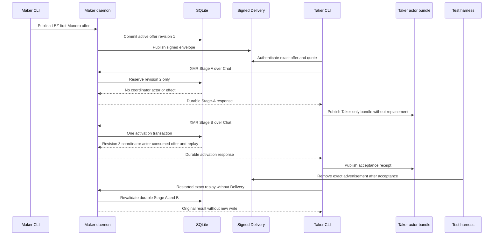

Why this checkpoint is locally atomic: Stage A cannot schedule an actor or create an effect; Stage B derives the coordinator from the canonical agreement and private-view-key validation, then commits negotiation activation, offer consumption, coordinator, one immutable Maker actor, and replay in one immediate SQLite transaction. A failed member rolls the transaction back to the Stage-A-only state. The Taker publishes its role bundle before Stage B as a crash latch and publishes the receipt only after the Maker commit. This is application atomicity, not cross-chain atomicity and not a distributed transaction.

External runtime resources: none. No `monerod`, wallet RPC, LEZ
sequencer/indexer/sidecar, Docker service, faucet, DNS, network, or funds
participate. The empty boundary removes chain and finality flakiness but cannot
prove chain semantics. This Flow 1P checkpoint still keeps
`--actor-supervisor` disabled; Flow 1Q exercises the now-GREEN semantic
pre-effect supervisor. The isolated official Monero 0.18.5.1 Regtest plus LEZ
v0.2 corridor remains the next chain-effect gate.

## Flow 1Q: repeat the XMR schema-v2 semantic-supervisor checkpoint

Status: process-GREEN; the exact real-process proof passed 1 of 1 in 79.22
seconds. This flow proves execution-time authority validation and scheduler
behavior only. It performs no LEZ or Monero effect and is not a completed swap.

From the repository root, use the pinned toolchain and offline cache:

```bash
cargo +1.96.0 test --locked --offline \
  -p lez-maker-node --test maker_actor_supervisor \
  xmr_pre_effect_cycle_validates_real_authority_and_never_invokes_an_effect \
  -- --exact --nocapture
```

The test builds the real `xmr-maker-actor`, installs a fresh single-link
mode-0700 copy beneath one mode-0700 owner root, hashes that installed program,
and registers it with the Maker actor manifest. The ordinary supervisor then
opens and seals the schema-v2 config as FD 196 and invokes only `status`.
Running the built binary directly with a named config file is intentionally not
equivalent: the production ABI requires the daemon-created fully sealed
descriptor.

Expected assertions:

1. pre-spawn validation binds the exact lowercase swap ID, Maker role, state
   database path, installed program digest, `xmr-maker-actor` identity, and
   `lez_maker_xmr_pre_effect_v1` ABI;
2. the child execution-time validator rehashes and semantically revalidates
   canonical Stage A/B, both public packets, the Maker private manifest and view
   key, and an immutable snapshot of the current external role journal;
3. the supervisor accepts only the exact nine-key status object with
   `chain_effect_executed:false`, `phase:"offered"`, revision 0, and
   `next_action:"xmr_chain_effects_not_yet_composed"`;
4. the durable result is typed `Blocked`, remains queued, records one successful
   authority observation rather than failure/backoff, leaves manual-action state
   absent, and is not due for another observation for at least 60 seconds; and
5. no activate, drive, claim, or refund command executes.

The focused fail-closed validator negatives can be repeated separately:

```bash
cargo +1.96.0 test --locked --offline \
  -p xmr-reference-actor --lib \
  application_provision::tests::sealed_config_pinned_digest_and_sidecar_boundaries_fail_closed \
  -- --exact --nocapture
```

They reject the wrong descriptor, incomplete seals, referenced-file digest
drift, and SQLite sidecars. The optimized complete authority replay measured
29.02 seconds on this development host versus 194.75 seconds before the narrow
development-profile optimization of four portable XMR cryptography kernels.
That optimization does not change debug assertions, validation, ordering, RPC,
finality, or effect semantics; timings on other hosts are informative only.

External runtime resources: none. Both commands use owner-private temporary
files, SQLite, and local child processes. They start no `monerod`, wallet RPC,
LEZ sequencer/indexer/sidecar, Docker service, faucet, DNS lookup, network, or
funds. This absence removes node/finality flakiness but also means the checkpoint
cannot prove chain behavior, cross-chain atomicity, or an XMR application swap.
The isolated official Monero 0.18.5.1 Regtest plus LEZ v0.2 corridor under this
accepted authority is clean-certified in Flow 1R. Fixed packaged-system-service control is GREEN in Flow 1D. Remaining PoC work is Taker XMR lifecycle,
accepted-application/actual-chain concurrency, and automatic unavailable-node
behavior. Explicit route control is GREEN in Flow 1S; bounded simultaneous
workers are GREEN in Flow 1H. The updated ETA is 8 to 18 focused hours for the
M5 PoC and 18 to 32 focused hours for the milestone tag.

## Flow 1R: run the XMR application-to-chain corridor

Status: **CRYPTOGRAPHIC, CHAIN, BINDING, AND CLEANUP GREEN; ROLE-CORRECT REPLAY PENDING.**

Evidence correction 2026-07-30: historical run H used the provisioner as funder, the Taker RPC as shared-wallet host, and the Maker as sweep destination. Keep its finalized effects, adaptor extraction, reconstructed spend, binding, and cleanup as evidence, but do not treat it as a role-correct user flow. The commands below are corrected to Maker funding and claim mining, neutral provisioner shared-wallet hosting, and Taker receipt. Use a fresh run ID and retain new exact-commit evidence before certification.

Four exact-commit attempts failed safely before
nodes. The first two exposed stale
sidecar and release-service locks. `m5-xmr-app-20260730-7b8ec43-c` built both
repaired graphs, then exposed a stale artifact-verifier hash for the intentional
M5 bootstrap mode. The first three created no node or chain resource or tag-13 latch
and passed scoped cleanup. The fourth also started no node or chain resource and
passed scoped cleanup after it passed all builds and the exact LEZ
artifact proof, then exposed a missing environment handoff from the pinned
`RISC0_SERVER_PATH` to the nested stack's `LEZ_V02_R0VM` input. The already
provisioned binary matches the required SHA-256 and version; the handoff is now
explicit and regression-pinned. The exact hash chain is refreshed, and artifact
source verification now precedes every heavy build. The fifth run,
`m5-xmr-app-20260730-58e1ee1-e`, reached real local LEZ deployment and Vault
Claims, official Monero Regtest, application planning, Stage A/B, role
installation, real acceptance, and typed `Blocked`. It stopped before tag 13
because the harness rejected intentional consumed-offer reconciliation. Scoped
cleanup passed with no tag-13 latch or swap-chain effect. The corrected path
authenticates and archives the retry advertisement before emulating an empty
Delivery outage and replay. Sixth run `m5-xmr-app-20260730-da9be26-f` completed
that application cutoff and the full local tag-13/tag-14/tag-15/extraction/sweep
tail. LEZ Claim finalized at tip 146 and the Monero sweep reached 10
confirmations at tip 130. The source returned zero, the cross-chain binding was
written, every exact resource is absent, and the foreign sentinel survived.
Cleanup nevertheless failed closed because one exact removal command returned
nonzero; cleanup schema v1 did not retain the failing operation. Do not convert
that final absence into a pass, and never reuse the tag-13-latched run ID. The
runner now emits cleanup schema v2 `failure_reasons` so the next fresh run is
diagnosable without weakening cleanup. Seventh run
`m5-xmr-app-20260730-9067ba3-g` repeated the full functional corridor with
source status zero: Claim finalized at LEZ height 140 and tip 143, and the
998191600000-piconero sweep reached 10 confirmations at Monero tip 130 after a
1808400000-piconero fee. Binding completed, every exact resource was absent,
and the foreign sentinel survived. Its schema-v2 cleanup packet reported
exactly three `ephemeral_path_boundary_failed` reasons, all nested directories
under the exact run-owned private namespace. The guard admitted the namespace
but not its children. Commit `fb4e279` now canonicalizes paths and admits only
descendants of that private root; the focused contract rejects traversal,
symlinks, and foreign paths. Eighth run
`m5-xmr-app-20260730-2c6aec1-h` clean-certified the exact pushed tree. Swap
`9d627d18...abfeb7c` crossed the application cutoff and completed tag 13/14/15,
extraction, sweep, and binding. Claim transaction `05cb9052...349fce` was in LEZ
block 139 and observed at finalized tip 142. Monero sweep transaction
`37930570...1603c8` received 998191600000 piconero after a 1808400000 fee and
reached 10 confirmations at tip 130. Cleanup schema v2 passed with source status
zero, exact resources/processes/ports absent, the foreign sentinel and no-retry
latch preserved, no foreign/broad cleanup, and an empty failure list. The
binding explicitly claims conditional successful-claim atomicity, not a
distributed transaction or future-reorg immunity. This closes the clean XMR
application-corridor gate, not the remaining literal M5 CLI, concurrency, or
unavailable-route outputs.

Reuse all prerequisites from
[Flow 0](#flow-0-m4-official-monero-regtest-topology): Docker, the pinned Rust
toolchain and offline Cargo cache, the verified RapidSnark v0.0.8 libraries,
the existing absolute Risc0 tool directory, and the checked
`logos-blockchain-circuits` directory. Start from the exact commit containing
this runner and a clean worktree. Choose a new run ID; the wrapper rejects any
existing M4, LEZ, or Monero child namespace.

```bash
test -z "$(git status --porcelain=v1 --untracked-files=normal)"

export RUN_ID=m5-xmr-app-20260730a
export M4_EXPECTED_COMMIT="$(git rev-parse --verify HEAD)"
export RAPIDSNARK_LIB_DIR=/absolute/path/to/verified/rapidsnark-v0.0.8-libraries
export BINDGEN_EXTRA_CLANG_ARGS=-I/usr/lib/gcc/x86_64-linux-gnu/13/include
export LEZ_M4_TOOL_DIR=/absolute/path/to/pinned/risc0-3.0.5-tools
export LOGOS_BLOCKCHAIN_CIRCUITS=/absolute/path/to/logos-blockchain-circuits-v0.4.2

scripts/run-m5-xmr-application-poc.sh contract | jq .
scripts/run-m5-xmr-application-poc.sh execute
```

The `contract` command must still report `execution_performed:false`,
`certification.status:"not_yet_executed"`, official Monero `0.18.5.1`
`isolated_regtest`, LEZ `0.2` `isolated_local_devnet`, and deterministic local
funds. `execute` validates the clean commit again, sets
`M5_XMR_APPLICATION_MODE=1`, and delegates to the existing actual-claim runner.
Do not set that implementation flag manually.

The expected Docker topology is:

- LEZ v0.2 Bedrock, indexer, and sequencer services. Their dynamically assigned
  literal-loopback endpoints are `BEDROCK_RPC_URL`, `LEZ_INDEXER_RPC_URL`, and
  `LEZ_SEQUENCER_RPC_URL` in `.e2e/$RUN_ID/lez-v02/run.env`.
- Official Monero 0.18.5.1 `monerod`, a deterministic funding wallet RPC, a
  Maker wallet RPC, and a Taker wallet RPC. Their literal-loopback endpoints are
  `MONERO_DAEMON_ENDPOINT`, `MONERO_FUNDING_WALLET_ENDPOINT`,
  `MONERO_MAKER_WALLET_ENDPOINT`, and `MONERO_TAKER_WALLET_ENDPOINT` in
  `.e2e/${RUN_ID}-xmr/monero/run.env`.
- The Maker daemon, Maker/Taker CLIs, `xmr-maker-actor`, and later LEZ role
  sidecars are run-scoped host processes or Unix-socket services; they do not
  add public listeners.

Economic-role invariant: the Maker wallet sends the exact Stage-A amount and supplies the local claim-confirmation mining address; the separate provisioner wallet RPC is only the view-only then reconstructed shared-wallet process; the Taker wallet is the sole successful-claim destination. All daemon and wallet RPC origins and credentials remain distinct. The refund branch reverses only the economic destination and miner: it sweeps to Maker and mines confirmations to the Taker address.

There are no public runtime resources: no public RPC, faucet, peer, public
funds, DNS dependency, or external finality service. LEZ funds come from the
deterministic local genesis and Monero funds from deterministic Regtest outputs.
These are real local node processes, not mocked RPC responses. Ephemeral
loopback ports prevent clashes with other work, but local Docker/containerd
contention, node readiness, block production/finality, and wallet scanning can
still affect wall time. Exact run `m5-xmr-app-20260730-da9be26-f` took about 50
minutes cold end to end; its application plan-to-cutoff segment took about two
minutes and its real-node segment about 24 minutes. A cold build can additionally depend on already pinned downloads,
archives, and caches being present; record any such pre-runtime fetch separately
and never describe it as a runtime chain dependency.

Before tag 13 the runner must prove this exact order:

1. publish the Delivery-only offer and authenticate the Taker plan;
2. carry the same swap ID through canonical Stage A/B and the agreement receipt;
3. provision Maker authority, run real Taker acceptance, and publish only the
   role-owned actor bundles and Taker receipt;
4. obtain the exact typed `Blocked` revision-0/no-effect supervisor result;
5. remove the original Delivery tree and restart the daemon, which intentionally
   republishes the consumed retryable offer for lost-response recovery;
6. authenticate the identical swap and terms with the real Taker, archive that
   retry mailbox, create an empty Delivery outage mailbox, replay without a
   Delivery argument, and preserve journal device/inode/size/digest plus actor
   and receipt bytes/inodes; and
7. synchronously reap the daemon process group and prove its PID, group, owner
   socket, Chat socket, readiness files, SQLite sidecars, and replacement offers
   absent immediately before the one-shot tag 13 path begins.

Only after that cutoff may tag 13 initialize/fund LEZ, Monero funding and
verification run, tag 14 authorize the claim, tag 15 claim, adaptor extraction
complete, and the Monero sweep and cross-chain binding be recorded. Application
atomicity comes from reserve-only Stage A plus the single Stage-B SQLite
transaction that activates the negotiation, consumes the offer, creates the
coordinator and one immutable Maker actor, and records replay. Cross-chain
atomicity comes from the existing adaptor-signature claim/sweep tail; the
pre-tag-13 cutoff prevents the application supervisor and legacy one-shot
authority from being live concurrently.

Inspect these run-owned paths even after a failed command:

```bash
export M5_XMR_EVIDENCE=".e2e/$RUN_ID/m4-actual-claim/evidence"
export M5_XMR_MANIFESTS=".e2e/$RUN_ID/m4-actual-claim/manifests"

jq . "$M5_XMR_EVIDENCE/m5-xmr-plan.json"
jq . "$M5_XMR_EVIDENCE/xmr-agreement-receipt.json"
jq . "$M5_XMR_EVIDENCE/m5-xmr-maker-provision.json"
jq . "$M5_XMR_EVIDENCE/m5-xmr-initial-acceptance.json"
jq . "$M5_XMR_EVIDENCE/m5-xmr-reconciled-delivery-plan.json"
jq . "$M5_XMR_EVIDENCE/m5-xmr-blocked-monitor.json"
jq . "$M5_XMR_EVIDENCE/m5-xmr-replay-acceptance.json"
jq . "$M5_XMR_EVIDENCE/m5-xmr-replay-monitor.json"
jq . "$M5_XMR_EVIDENCE/m5-xmr-application-cutoff.json"
jq . "$M5_XMR_EVIDENCE/cleanup.json"
```

The same directory retains `m5-xmr-journals-before.json`,
`m5-xmr-journals-after.json`, `m5-xmr-artifacts-before.tsv`,
`m5-xmr-artifacts-after.tsv`, the legacy claim-tail evidence, and
`phases.jsonl`. `manifests/resource-ledger.jsonl` records exact cleanup
ownership. Cleanup validates process PID/start time/binary identity and Docker
run labels, removes only ledgered run resources, preserves a foreign sentinel,
and forbids broad pruning. A label, identity, or removal failure remains a
failed cleanup even when the final absence probe is clean.

**Never rerun this `RUN_ID` if
`.e2e/$RUN_ID/m4-actual-claim/manifests/tag13-no-retry.latch` exists.** Tag 13
is a one-shot mutation boundary; retain the latch and evidence, diagnose the
run, and use a fresh run ID only after review. Do not delete the latch, repeat
the wrapper, or manually continue a partial tail.

## Flow 1S: disable one maker route without disabling another pair

This node-free owner journey exercises the real Maker CLI and daemon against an
owner-private temporary SQLite database and Unix socket:

```bash
cargo test -p lez-maker-node --test operator_journey \
  disabled_route_rejects_quote_and_publication_without_disabling_another_pair \
  -- --exact --nocapture
```

Expected result: one test passes. To repeat it manually against the daemon from
Flow 1, set `MAKER_SOCKET` to that daemon's readiness socket and use fresh
request IDs:

```bash
target/debug/lez-maker --socket "$MAKER_SOCKET" configure-pair \
  --request-id manual-zec-disable-001 --pair zcash \
  --direction taker-sells-lez --enabled false \
  --minimum-foreign-units 10 --maximum-foreign-units 10000 \
  --offer-ttl-seconds 300
target/debug/lez-maker --socket "$MAKER_SOCKET" set-local-price \
  --request-id manual-zec-price-001 --pair zcash \
  --direction taker-sells-lez --lez-units-per-lot 5 \
  --foreign-units-per-lot 2
target/debug/lez-maker --socket "$MAKER_SOCKET" quote \
  --pair zcash --direction taker-sells-lez
target/debug/lez-maker --socket "$MAKER_SOCKET" publish-offer \
  --request-id manual-zec-offer-001 --offer-id manual-zec-disabled \
  --pair zcash --direction taker-sells-lez
```

The last two commands must fail with JSON-RPC code `-32602` and message
`maker route is disabled`. Configure an independent Bitcoin route disabled,
set its local price, then enable it at expected revision 1:

```bash
target/debug/lez-maker --socket "$MAKER_SOCKET" configure-pair \
  --request-id manual-btc-create-001 --pair bitcoin \
  --direction taker-sells-lez --enabled false \
  --minimum-foreign-units 10 --maximum-foreign-units 10000 \
  --offer-ttl-seconds 300
target/debug/lez-maker --socket "$MAKER_SOCKET" set-local-price \
  --request-id manual-btc-price-001 --pair bitcoin \
  --direction taker-sells-lez --lez-units-per-lot 7 \
  --foreign-units-per-lot 3
target/debug/lez-maker --socket "$MAKER_SOCKET" configure-pair \
  --request-id manual-btc-enable-001 --expected-revision 1 \
  --pair bitcoin --direction taker-sells-lez --enabled true \
  --minimum-foreign-units 10 --maximum-foreign-units 10000 \
  --offer-ttl-seconds 300
target/debug/lez-maker --socket "$MAKER_SOCKET" quote \
  --pair bitcoin --direction taker-sells-lez
```

The Bitcoin quote must succeed before and after restarting the daemon on the
same database. The Zcash failures must also survive restart. Finally re-enable
Zcash with `--expected-revision 1`; its next quote must succeed. Do not reuse a
request ID with changed fields.

External resources: none. This flow opens no chain RPC, starts no local node or
Docker service, uses no faucet or funds, and performs no DNS or public-network
request. It proves explicit route isolation, not automatic health detection or
an actual swap on the unaffected pair.

## Flow 1T: monitor an accepted XMR application as the Taker

Status: monitor plus receipt-v2 Tag14 process invocation are GREEN and
deliberately pre-effect. This flow uses the real Taker CLI after the XMR
acceptance in Flow 1P or Flow 1R. Receipt v1
validates only the accepted application authority. Receipt v2 additionally
binds the schema-v3 projection, immutable effect-authority plan, initialized
workflow identity, and run under both owner locks. Neither variant queries a
chain or reports current or enduring chain progress.

Build the CLI from the repository root, then point it at the owner-private
acceptance receipt emitted by the accepted XMR application. The receipt and all
referenced authority paths must remain normalized absolute paths beneath their
original owner-private roots.

```bash
cargo +1.96.0 build --locked --offline \
  -p lez-maker-node --bin lez-taker

export XMR_TAKER_RECEIPT=/absolute/path/to/taker-receipt.json
target/debug/lez-taker monitor --receipt "$XMR_TAKER_RECEIPT"
```

The exact one-line JSON is:

```json
{"schema_version":1,"pair":"monero","role":"taker","state":"active","phase":"application_activated","claim_session":"presignature_verified","refund_session":"presignature_verified"}
```

This v1 output means only that the receipt still binds a semantically valid
Taker Stage-A/Stage-B application authority whose claim and refund sessions
both reached `presignature_verified`. It does not mean that LEZ was funded or
claimed, that Monero was funded or swept, that either chain is live, or that a
previously observed chain effect remains canonical. Use Flow 1R evidence and
the chain-specific operators for chain progress.

### Provision and monitor receipt v2

Use the same successful XMR acceptance/replay command from Flow 1P, but select
fresh, distinct absolute paths under one mode-0700 Taker effect root. The
effect-authority v1 JSON must already exist; the schema-v3 manifest, workflow
journal, and receipt-v2 destinations must not be occupied by different bytes.
Append exactly these arguments:

```bash
export XMR_EFFECT_ROOT=/absolute/owner-private/m5-xmr-taker-effect
export XMR_EFFECT_RUN=m5-xmr-taker-effect-run-1
install -d -m 0700 "$XMR_EFFECT_ROOT"

# The identical Flow 1P lez-taker acceptance arguments precede these flags.
target/debug/lez-taker \
  --delivery-directory "$DELIVERY_ROOT" \
  --maker-public-key "$DELIVERY_MAKER_PUBLIC_KEY" \
  --now-unix-seconds "$ACCEPTED_AT" \
  --pair monero \
  --direction taker-sells-lez \
  --accept-xmr-offer "$OFFER_ID" \
  --chat-socket "$CHAT_SOCKET" \
  --reservation-id "$RESERVATION_ID" \
  --foreign-units 1000000000000 \
  --xmr-stage-a-file "$XMR_STAGE_A" \
  --xmr-activation-file "$XMR_STAGE_B" \
  --xmr-source-taker-root "$XMR_TAKER_SOURCE_ROOT" \
  --xmr-taker-public-packet "$XMR_TAKER_PUBLIC_PACKET" \
  --xmr-maker-public-packet "$XMR_MAKER_PUBLIC_PACKET" \
  --xmr-taker-role-journal "$XMR_TAKER_ADAPTOR_JOURNAL" \
  --xmr-taker-actor-root "$XMR_TAKER_ACTOR_ROOT" \
  --xmr-acceptance-receipt "$XMR_EFFECT_ROOT/acceptance-receipt-v2.json" \
  --xmr-effect-authority-file "$XMR_EFFECT_ROOT/effect-authority-v1.json" \
  --xmr-effect-manifest-file "$XMR_EFFECT_ROOT/actor-effect-provision-v3.json" \
  --xmr-workflow-journal "$XMR_EFFECT_ROOT/workflow.sqlite3" \
  --xmr-run-id "$XMR_EFFECT_RUN"

target/debug/lez-taker monitor \
  --receipt "$XMR_EFFECT_ROOT/acceptance-receipt-v2.json"
```

The four new effect arguments are one all-or-none group. Do not mix a run ID,
authority, schema-v3 manifest, or workflow journal from another role or swap,
and do not overlap any of those paths with the actor state, adaptor journal, or
receipt. Exact replay may reuse the same bytes; publication never overwrites a
different existing artifact.

The private input/output set is the legacy actor manifest and state database,
canonical Stage A/B, Maker and Taker public packets, Taker private role
material and adaptor journal, plus effect-authority v1 JSON, schema-v3
manifest, workflow SQLite, and receipt v2. Keep the directory mode 0700 and
regular authority artifacts mode 0600. The receipt digest-pins the schema-v3
manifest and effect-authority bytes; schema v3 binds the workflow path and
initialized identity.

The exact receipt-v2 monitor output is:

```json
{"schema_version":2,"pair":"monero","role":"taker","state":"active","phase":"application_activated","run_id":"m5-xmr-taker-effect-run-1","effect_authority":"validated"}
```

This means only that the effect-shaped authority plan is canonical and bound
to the accepted application. It does not authorize or prove a chain effect.


The exact deterministic reproduction is the process test below. The manual
shell shape assumes the effect-authority JSON was produced for the same private
deployment and contains its real future tool/RPC commitments. Do not copy the
fixture's deterministic digest, path, credential, or endpoint placeholders
into an effect-capable deployment. Monitor does not read those inputs or invoke
a tool; the process proof instead supplies real private inputs and a
hash-pinned marker executable while leaving every endpoint listener-free.
Delivery, Chat, and the Maker daemon may all be stopped before this command.
The CLI strictly and boundedly decodes the receipt, pins the manifest bytes to
the receipt SHA-256, derives the swap/state lock identity, and then takes the
same per-swap kernel lock used by the actor worker. Only while holding that lock
does it fully validate the Taker manifest, Stage A/B, public packets, private
authority, and role journals, then compare the validated authority with every
receipt-bound field. The monitor is read-only. This prevents a live worker from
mutating the role state across semantic validation and output, so it cannot
create a second effect owner or partially commit monitor state. It is process
atomicity over one accepted authority, not cross-chain atomicity. Inherited ABA
hardening for paths reopened during semantic validation remains production
hardening; do not treat this checkpoint as a hostile same-UID filesystem proof.

Legacy receipt-v1 `claim` and `refund` remain intentionally unavailable:

```bash
target/debug/lez-taker claim --receipt "$XMR_TAKER_RECEIPT"
target/debug/lez-taker refund --receipt "$XMR_TAKER_RECEIPT"
```

Receipt v1 fails with empty stdout and
`XMR Taker claim and refund are not yet composed`. Before the process route
was composed, receipt v2 also failed closed; that is a historical checkpoint,
not the current behavior. Current stable public failures include `Taker acceptance receipt is unavailable or
ambiguous`, `XMR Taker actor is already running or unsafe`, `XMR Taker
workflow is already running or unsafe`, `XMR Taker effect authority is
unavailable or unsafe`, and `receipt-bound XMR Taker actor semantics changed`.
They disclose no authority path, digest, key, journal bytes, or child identity.
Do not weaken a failure by passing an actor config instead of the acceptance
receipt.

External runtime resources: none. The receipt-v2 fixture binds, but does not
contact, these literal-loopback endpoints:

- LEZ sidecar: `http://127.0.0.1:36972/`;
- Monero daemon: `http://127.0.0.1:36974/`;
- funding wallet: `http://127.0.0.1:36975/`;
- neutral shared wallet: `http://127.0.0.1:36976/`; and
- Taker role wallet: `http://127.0.0.1:36977/`.

Under the fixture's private `xmr-taker-effect` root, the LEZ files are
`lez-runtime.json` and `lez.capability`. The four RPC credential pairs are
`daemon.username`/`daemon.password`,
`funding.username`/`funding.password`,
`shared.username`/`shared.password`, and
`taker.username`/`taker.password`. The authority loader exposes these as
typed endpoint and credential-path roles. They need not exist for the
node-free monitor. Receipt-v2 claim requires them, pins their exact safe
contents, and passes sealed snapshots to the selected child without opening
any endpoint.

The typed Taker plan contains exactly these five program/hash/ABI slots:

| Fixture program | Fixed ABI |
|---|---|
| `tag14-authorize` | `lez_xmr_tag14_authorize_v1` |
| `finalized-classifier` | `lez_xmr_finalized_classifier_v1` |
| `monero-claim` | `lez_xmr_monero_claim_sweep_v2` |
| `monero-verify` | `lez_xmr_monero_verify_v2` |
| `tag16-refund` | `lez_xmr_tag16_refund_v1` |

The symmetric Maker plan has Monero fund
(`lez_xmr_monero_fund_v2`), LEZ tag-15 claim
(`lez_xmr_tag15_claim_v1`), finalized classifier
(`lez_xmr_finalized_classifier_v1`), Monero refund sweep
(`lez_xmr_monero_refund_sweep_v3`), and Monero verification
(`lez_xmr_monero_verify_v2`). Every slot retains its exact absolute program
path and decoded pinned SHA-256. Role crossing fails closed.

To repeat the typed-plan and sealed-executable developer checkpoint without
starting nodes, run:

```bash
cargo +1.96.0 test --locked -p xmr-reference-actor \
  --test effect_authority --test effect_authority_taker
```

The focused pair must pass 4 of 4 tests; the Taker binary alone passes 3 of 3.
Its use-time test creates an owner-private executable, securely opens it without
symlink traversal, revalidates its owner, mode, link, size, and named/opened
identity, verifies the authority SHA-256, and snapshots the bytes into an
immutable mode-0700 memfd. The command executes only that snapshot through FD
197. Replacing the named file after pinning cannot change the already-created
command; a fresh verification of changed bytes, a symlink replacement, or a
writable executable fails closed.

This began as a library-level execution primitive. The current receipt-v2
`lez-taker claim` route invokes it for Tag14; monitor and legacy receipt-v1
claim/refund still do not.

The workflow-v2 developer checkpoint defined all eight external effects before
any route was enabled. The current receipt-v2 route enables only the Tag14
process invocation:

| Scope | Fixed role and effect |
|---|---|
| Common | Taker Initialize LEZ tag 13 |
| Common | Taker Fund LEZ tag 13 |
| Common | Maker Fund Monero |
| Claim | Taker Authorize LEZ tag 14 |
| Claim | Maker Claim LEZ tag 15 |
| Claim | Taker Sweep Monero Claim |
| Refund | Taker Refund LEZ tag 16 |
| Refund | Maker Sweep Monero Refund |

Schema v2 rejects a schema-v1 journal. Role-local predecessor success gates
preparation, and all Common rows for the local role must exist before the
Claim/Refund branch CAS. Exactly one Prepared-to-Started winner receives
`InvokeOnce`; reopened Started or Unknown rows return `ObserveOnly`.
These gates are role-local and do not prove global or cross-role ordering; the
future route must bind finalized external evidence before satisfying a
counterparty-dependent transition. Success can be recorded only with nonzero
canonical effect-evidence and exact
tool-plan SHA-256 values plus a LEZ-finalized or Monero-wallet source. Exact
replay is accepted and any digest/source drift or legacy evidence-free
`mark_succeeded` is rejected.

The dual-lock command maps the already sealed program to FD 197, the exact
actor/adaptor-state lock to FD 198, and a distinct workflow lock to FD 199 in
one operation. It rejects descriptor collisions, aliased or crossed-swap lock
files, named/inode drift, and unsafe lock-root changes before spawn. The child
keeps both locks until it exits and is reaped.

Repeat this node-free checkpoint from the repository root:

```bash
cargo +1.96.0 test --locked -p lez-swap-store \
  --test maker_actor_process \
  --test xmr_effect_workflow_concurrency \
  --test xmr_effect_workflow_hardening \
  --test xmr_effect_workflow_journal \
  --test xmr_effect_workflow_v2
```

Expected results are maker process 17/17, concurrency 2/2, hardening 1/1,
restart/no-rearm regression 1/1, and workflow v2 3/3. The complete package check is:

```bash
cargo +1.96.0 test --locked -p lez-swap-store --all-targets
```

No LEZ or Monero node, chain RPC, Docker service, faucet, DNS, public network,
peer, or funds participates in these tests. They use private temporary files
and local child processes; contention or heavy host scheduling can extend them.

The follow-on schema-v3 input-custody checkpoint securely pins the previously
named-only runtime and credential inputs. Repeat it without nodes:

```bash
cargo +1.96.0 test --locked -p xmr-reference-actor \
  --test effect_authority_taker
```

Expected result: the complete focused target is GREEN, including mandatory
shared-wallet file-password validation and custody.

`pin_effect_inputs_at_use` requires every source below its exact mode-0700
owner-only parent to be a mode-0600 owner regular single-link file and opens it
with no symlink traversal. Parent identity and source inode/metadata must remain
stable across the bounded read; no two sources may alias the same inode. The
LEZ runtime is at most 16 KiB and must match its authority SHA-256. The LEZ
capability and these nine Monero secret files are at most 256 bytes each:

- daemon username/password;
- funding-wallet username/password;
- shared-wallet username/password;
- role-wallet username/password; and
- shared-wallet file password.

Each secret may contain one nonempty ASCII-graphic value raw, with one trailing
LF, or with one trailing CRLF, matching the actual runner. Empty, embedded or
multiple newline, stray CR, NUL, non-graphic, oversized, symlinked, hard-linked,
cross-aliased, or permission-unsafe sources fail closed.

The capability, eight RPC credentials, and shared-wallet file password become
ten distinct mode-0400 fully sealed memfds, duplicated to collision-free descriptors at or above 200.
Callers can see only each descriptor path, redacted length, and SHA-256; the
custody objects are non-Clone and Debug redacts values. Named replacement
cannot alter an existing snapshot, while a fresh pin rejects runtime digest or
storage drift. Runtime bytes are retained only as a bounded hash-checked
in-memory snapshot.

Effect authority must include a normalized absolute shared-wallet
file-password path distinct from every RPC credential path. Missing, relative,
unsafe, overlapping, and cross-source-aliased inputs fail closed.

The atomic exec-boundary checkpoint now adds a sealed runtime snapshot and
maps it with every secret, both locks, and the executable. Repeat its two exact
node-free tests:

```bash
cargo +1.96.0 test --locked -p lez-swap-store \
  --test maker_actor_process \
  pinned_child_fd_plan_rejects_reserved_duplicate_and_aliased_descriptors \
  -- --exact

cargo +1.96.0 test --locked -p xmr-reference-actor \
  --test effect_authority_taker \
  composed_effect_command_hands_off_exact_fds_and_locks \
  -- --exact
```

The generic non-Clone plan accepts 1 through 64 owned source descriptors,
rejects aliased sources, and requires unique child targets in 200 through 1023.
The negative test rejects empty, reserved/out-of-range, duplicate-target, and
aliased-source plans and proves Debug reveals only the descriptor count.

The XMR child ABI is fixed:

| FD | Child input |
|---|---|
| 197 | sealed executable |
| 198 | actor/adaptor-state lock |
| 199 | workflow lock |
| 200 | LEZ runtime |
| 201 | LEZ capability |
| 202/203 | daemon username/password |
| 204/205 | funding-wallet username/password |
| 206/207 | shared-wallet username/password |
| 208/209 | role-wallet username/password |
| 210 | shared-wallet file password |

All 14 descriptors are installed by one mapping call. No runtime, capability,
username, or password bytes enter argv or env. The process test replaces the
named program, runtime, and every secret before exec; the child still hashes
the original runtime and ten secret snapshots, observes FD 211 absent, and stays
alive after the parent Command and lock objects are dropped. Both competing lock acquisitions
remain blocked until child exit/reap, then succeed.

The validated Maker execution authority also retains the already validated
canonical Stage-A and Stage-B public paths and each exact wire SHA-256. These
public identities are available to the future route without re-deriving them
from unbound paths.

At this historical checkpoint the authority, at-use custody, and child
input-map gaps were closed, but it was still a developer boundary rather than
a lifecycle route. It opened no RPC or node and executed no claim or refund.
The then-remaining route had to select the tool,
enter workflow-v2 authority, spawn/reap this command, classify finalized
external evidence, and reconcile it. The tests use private temporary files and
local processes only; no Docker service, faucet, DNS, public network, peer, or
funds can make them flaky. Literal M5 remains 4 of 7; current ETA is 2.5 to 5.5
focused implementation hours.

Repeat the role-fixed invocation boundary with the genuine schema-v3 Taker
fixture:

```bash
cargo +1.96.0 test --locked -p xmr-reference-actor \
  --test effect_route \
  taker_tag14_effect_route_pins_before_authorizing_and_never_rearms \
  -- --exact
```

The execution loader retains the exact effect-authority digest and initialized
workflow identity. The preparation API admits only Maker Monero fund/tag
15/refund sweep and Taker tag 14/claim sweep/tag 16. Wrong-role and
classifier/verifier steps fail before workflow mutation.

For an admitted step, preparation performs this order:

1. select the fixed role/step tool and compute its stable plan digest;
2. hash-pin the program and pin runtime plus ten secrets;
3. validate the exact actor-state and workflow locks;
4. compose the complete FD 197 through 210 command; and only then
5. call workflow-v2 `authorize_once`.

A corrupt program therefore leaves Tag14 Prepared. The repaired first call
returns InvokeOnce with the Command and a nonzero domain-separated digest; the
child sees exact FDs 197 through 210 and the workflow remains Started. Reload
returns ObserveOnly with the same sending-plan digest and no sending Command.
The lifecycle route now pins and runs its role-fixed non-sending observer from
Started or Unknown. Finalized evidence reconciles Succeeded; the next
preparation returns Complete without sender or observer.

The stable plan hash binds the v1 tool-plan domain, role, step, ABI, pinned
program SHA-256, and exact effect-authority SHA-256. It does not expose or
pretend to immutably bind rotating credential contents.

These schema-v1 fixtures run a descriptor-checking sender and fixed
finalized-classifier marker only. They do not open an RPC or node, construct or
submit semantic tag 14, classify real chain finality, or move funds. The legacy
receipt-v2 lifecycle performs process invocation plus evidence-shaped durable
reconciliation. Schema-v2 semantic composition is documented separately under
ADR 0157; joined actual-chain observation remains open. Literal M5 remains 4
of 7.

### Invoke the receipt-v2 Taker Tag14 process checkpoint

After producing receipt v2 and stopping Delivery, Chat, and the Maker daemon,
run the user-facing command three times:

```bash
target/debug/lez-taker claim --receipt /absolute/private/acceptance-receipt-v2.json
target/debug/lez-taker claim --receipt /absolute/private/acceptance-receipt-v2.json
target/debug/lez-taker claim --receipt /absolute/private/acceptance-receipt-v2.json
```

The first marker invocation emits schema 3 `invoked_unreconciled`, a nonzero
plan digest, and `chain_effect_finalized:false`; the journal is Started. The
second claim invokes no sender. It pins the finalized classifier and all inputs,
requires the identical original sending-plan digest, and parses a bounded
step-exact result. The fixed classifier marker returns finalized evidence, so
the CLI reconciles Succeeded and emits `complete` with
`chain_effect_finalized:true`. The third claim emits the same Complete result
without invoking sender or observer. The send marker remains `invoked\n`
and the observer marker remains `observed\n`.

Observer eligibility is exactly Started or Unknown. Prepared and Succeeded
reject observer preparation. The result contains no source field; the selected
role and step derive `lez_finalized_event` locally. Observer spawn, wait,
30-second timeout, nonzero exit, oversized/malformed/wrong-step output, sending
plan drift, or invalid evidence returns an error without changing the journal.
Sending ambiguity still marks sticky Unknown and never rearms. Losing
receipt-v2 refund fails closed.

The sender and classifier receive sealed descriptor maps and write local
markers. The lower-level process proof validates exact FD contents. Neither
opens an RPC, constructs or submits a semantic Tag14 transaction, observes a
chain, or moves funds. Succeeded therefore proves the process reconciliation
contract only, not actual LEZ finality.

The monitor and marker route start no LEZ or Monero node, open no chain RPC,
and use no Docker service, faucet, funds, DNS, public network, peer, or
finality service, and do not need Delivery or Chat. The fixed endpoint strings require no listener,
so they do not contend for ports. Consequently this command has no
node/readiness/finality flakiness and cannot validate chain behavior. To repeat
the process proof that creates both genuine receipt versions and monitors them
after transport removal, run:

```bash
cargo +1.96.0 test --locked --offline \
  -p lez-maker-node --test xmr_chat_process \
  real_taker_and_daemon_activate_role_generated_xmr_agreement_atomically \
  -- --exact --nocapture
```

That exact Maker-daemon/Delivery/Chat black-box test is GREEN 1 of 1 in 133.16
seconds. It withdraws Delivery, stops Chat with the daemon, then drives the
first claim, restart/replay, and losing refund through the real `lez-taker`.
After the first expected journal and marker mutation, replay and losing-refund
attempts preserve the captured application and effect artifacts, including
bytes and inodes. It must reject receipt-v2 Stage
A/B digest drift, actor-state and workflow lock contention, a receipt with an
unknown field, and
wrong manifest or effect-authority binding while keeping failures secret-free.

The focused `xmr-reference-actor --test effect_route` suite is GREEN 5 of 5
and covers observer eligibility, role selection, sending-plan identity, wallet
versus LEZ source derivation, strict parser behavior, and no-mutation failures.
Strict Clippy and warning-fatal Rustdoc are GREEN.

Flakiness is local-process only: a cold Cargo build or uncached dependencies,
large debug-actor hashing, cryptographic validation, filesystem latency, lock
contention from another invocation using the same private paths, and heavy host
scheduling can extend the run. The current exact process fixture took 133.16
seconds and gives Maker-daemon readiness 30 seconds. It uses an isolated
temporary root and run-local Unix sockets; rerun only after the previous test
process exits, and never share the example authority paths across concurrent
runs. No public resource can make it flaky.

This closes the receipt-v2 Tag14 process observation/reconciliation sub-gap
only. Literal M5 remains 4 of 7; outputs 5/7 Maker lifecycle, 6/7 Taker
lifecycle, and 7/7 coordinator concurrency/restart/unavailable-XMR isolation
remain.

## Flow 1U: repeat the tag-16 one-attempt component checkpoint

Status: **COMPONENT-GREEN; NOT AN ACTUAL REFUND SWAP.** This developer-facing
reproduction exercises the same authenticated sidecar routes used by the future
Taker effect driver. It does not start LEZ or Monero nodes and must not be used
as evidence that the Maker recovered Monero.

From the repository root, use the pinned toolchain, offline Cargo cache, and the
verified RapidSnark libraries already required by Flow 0:

```bash
export RAPIDSNARK_LIB_DIR=/absolute/path/to/verified/rapidsnark-v0.0.8-libraries
export BINDGEN_EXTRA_CLANG_ARGS=-I/usr/lib/gcc/x86_64-linux-gnu/13/include

cargo +1.96.0 test --locked --offline \
  -p lez-bridge-protocol --test xmr_v3_contract

cargo +1.96.0 test --locked --offline \
  --manifest-path compat/lez-v0_2-sidecar/Cargo.toml \
  --test bridge_xmr_v3_routes

cargo +1.96.0 test --locked --offline \
  --manifest-path compat/lez-v0_2-sidecar/Cargo.toml \
  --test bridge_xmr_fund_classification
```

Expected results are 9 of 9 protocol cases, 9 of 9 authenticated route cases,
and 2 of 2 finalized-classifier cases. The route suite proves that only the
completed Taker tag-16 bytes under the transaction-derived request ID can be
submitted; exact accepted replay sends nothing; a deliberately ambiguous first
send remains unknown after sidecar restart with no second lookup or send; and
arbitrary request IDs fail before node access. The classifier suite proves the
Taker exact-owner view and Maker terms-discovery view agree on canonical bytes,
message hash, ordered accounts, refund signer and aggregate signature,
`Refunded` metadata, zero custody, and the half-open refund window: one
millisecond before `refund_at` and exactly at `punish_at` are rejected.

External runtime resources: none. These tests use authenticated in-process
sidecars, a controlled sequencer double, finalized-indexer fixtures, temporary
owner-only durable files, and deterministic keys. They open no Docker service,
chain RPC, faucet, DNS lookup, public network, peer, or funds. This removes node
and finality flakiness from the component checkpoint, but also means it cannot
prove the actual local-devnet refund tail. That next flow must ingest the
finalized signature as Maker, extract the Taker adaptor scalar, reconstruct the
exact Stage-A shared Monero spend key, sweep through the neutral shared-wallet
RPC to the Maker destination, mine confirmations through the Taker wallet, and
bind both chains. This paragraph records that historical component checkpoint; later run `m5xmrrefund45924caa` closes the Tag16 recovery tail and run `m7tag17a23a314a` separately closes actual-node Tag17. Joined abandonment economics remain open.

See ADR 0120 for the component, sequence, and conditional-atomicity diagrams.

## Flow 1V: repeat the role-correct XMR refund continuation checkpoint

Status: **COMPONENT-GREEN; NOT AN ACTUAL REFUND SWAP.** This flow exercises the
real Taker tag-16 process, Maker finalized-signature ingestion, and the
role-neutral claim/refund sweep selector. It intentionally stops before node
startup and therefore does not certify a Monero recovery transaction.

From the repository root:

```bash
export RAPIDSNARK_LIB_DIR=/absolute/path/to/verified/rapidsnark-v0.0.8-libraries
export BINDGEN_EXTRA_CLANG_ARGS=-I/usr/lib/gcc/x86_64-linux-gnu/13/include

cargo +1.96.0 test --locked --offline \
  -p xmr-reference-actor --features sessions --test tag16_process

cargo +1.96.0 test --locked --offline \
  -p xmr-reference-actor --features sessions --test effect_route

cargo +1.96.0 test --locked --offline \
  --manifest-path compat/lez-v0_2-sidecar/Cargo.toml \
  --all-features --bin lez-v02-xmr-regtest-sweep
```

Expected focused results are 6 of 6 Tag16 process cases and 7 of 7 effect-route
cases. The process proof verifies the canonical Stage-A refund hash,
cryptographic final signature, distinct prepare/complete identities, one
transaction-derived submission, and no retry. It now also starts the actual
no-argument effect child with sealed FDs, derives the final signature from the
live Stage-B-matching Taker journal plus FD 218, and rejects a changed durable
presignature before any sidecar call or evidence write. The route proof requires
FD 218 for Tag16 and the Monero sender but proves it absent from Tag14 and every
observer. A successful preflight calls only prepare and writes no evidence; a
rejected preflight calls neither complete nor submit and leaves the durable
one-attempt CAS available. Negative paths reject crossed
role/session/signature/request inputs before wire access.

The broader all-target command remains useful when validating Maker ingestion
and the Monero sweep selector:

```bash
cargo +1.96.0 test --locked --offline \
  -p xmr-reference-actor --all-features --all-targets
```

That broader suite keeps legacy claim evidence unchanged and requires refund to
use the Maker share plus extracted Taker scalar, Maker destination, Taker
confirmation wallet, and v3 refund evidence.

External runtime resources: none. The process test uses an authenticated
in-process loopback sidecar, sealed memfds, SQLite and deterministic role
material; the ingestion and sweep tests use temporary files and local value
selection. They start no Docker
service, LEZ node, Monero daemon, wallet RPC, DNS lookup, public RPC, faucet,
peer, or funds. This makes the component gate fast and deterministic but cannot
show finality, reconstructed-wallet acceptance, fees, confirmations, or
cross-chain binding. The actual runner must use a fresh isolated private Docker
engine, ephemeral loopback sequencer/indexer/monerod/wallet endpoints,
deterministic local genesis/Regtest funds, a neutral shared-wallet process, and
role-correct Maker/Taker wallets. See ADR 0121 for its component, sequence, and
conditional-atomicity diagrams, and ADR 0154 for the sealed-child component,
invocation sequence, and exact conditional-atomicity argument.

### Verify the sealed semantic Tag14 release path

This focused M7 check exercises the established release-only service through
the no-argument child ABI consumed by the schema-v2 receipt claim route. It
does not claim actual-chain finality or the subsequent Monero sweep.

```bash
cargo +1.96.0 clippy --locked --offline \
  --manifest-path compat/lez-v0_2-xmr-release-service/Cargo.toml \
  --all-targets --all-features --no-deps -- -D warnings

M4_RELEASE_PROCESS_OFFLINE=1 \
  ./scripts/test-m4-xmr-release-worker-process.sh
```

Expected result is 1 of 1. A group-writable legacy public configuration and an
unsealed FD 222 protection key must fail before any finalized-indexer or
sidecar request. A schema-v2 preflight reports `ready`, leaves the authenticated
journal `prepared`, and keeps all indexer and sidecar counters at zero. The
first fully sealed invoke process reports
`admitted_accepted`; a fresh restart reports `observe_only`; the sidecar
submission counter remains exactly one. Output must not contain the capability,
protection key, private root, or release material.

FD 220 contains the bounded schema-v2 mode and public invocation, FD 221 the
release-only capability, and FD 222 the lowercase protection key. These three
are owner-owned, mode `0400`, unlinked, and fully sealed against write, grow,
shrink, and further seal changes. FD 223 is an already-open owner-owned
mode-`0700` state directory; journal access remains relative to that retained
descriptor, so a pathname rename or replacement cannot redirect it.

External runtime resources: none. The proof uses authenticated in-process
sidecar and finalized-indexer doubles, temporary SQLite, sealed memfds, and
deterministic cryptographic fixtures. It starts no Docker service, LEZ node,
Monero daemon, wallet RPC, DNS, public endpoint, faucet, peer, or funds.
Cold compilation, filesystem sync, cryptographic work, and host scheduling are
the only expected variability. ADR 0155 contains the component and sequence
diagrams and explains why the release is conditional on finalized Fund plus the
confirmed Monero output and why ambiguous publication never rearms.

To verify the versioned authority, least-privilege route, and literal CLI
control flow, run:

```bash
cargo +1.96.0 test --locked --offline -p xmr-reference-actor \
  --test effect_authority_taker

cargo +1.96.0 test --locked --offline -p xmr-reference-actor \
  --test effect_route \
  semantic_tag14_preflight_is_least_privilege_and_does_not_consume_cas \
  -- --exact

cargo +1.96.0 test --locked --offline -p lez-maker-node \
  --test xmr_chat_process \
  real_taker_and_daemon_activate_role_generated_xmr_agreement_atomically \
  -- --exact
```

Expected results are authority 8 of 8, focused route 1 of 1, and literal CLI 1
of 1. Schema 1 remains marker-only. Schema 2 requires the
Taker release-worker v2 ABI, distinct release sidecar/capability/key/journal
authority, and either literal-loopback local indexer configuration or the exact
pinned Logos Testnet indexer. A deliberately rejected CLI preflight leaves the
workflow CAS available; the retry preflights once, invokes once, observes once,
then returns Complete without a process. The Tag14 child receives only program,
two lock descriptors, and FDs 220..223. These commands use temporary files and
local process/RPC doubles only; they make no Docker, external-node, public-RPC,
DNS, faucet, peer, or funding call. Cold compilation and the full role-generated
Stage A/B process flow dominate timing. ADRs 0156 and 0157 give the authority,
component, publication sequence, and conditional-atomicity arguments.

### Repeat or verify the actual Taker claim certificate

To repeat the complete local-node journey, start from a clean pushed commit and
the pinned prerequisites from Flow 1W, then select the semantic Claim mode:

```bash
export RUN_ID=m7claim-yyyymmdd-nonce
export M4_EXPECTED_COMMIT="$(git rev-parse HEAD)"
export M5_XMR_APPLICATION_MODE=1
export M5_XMR_JOURNEY=claim
export M7_XMR_SEMANTIC_CLAIM=1
export RAPIDSNARK_LIB_DIR=/absolute/path/to/verified/rapidsnark-v0.0.8-libraries
export BINDGEN_EXTRA_CLANG_ARGS=-I/usr/lib/gcc/x86_64-linux-gnu/13/include
export LEZ_M4_TOOL_DIR=/absolute/path/to/pinned/risc0-3.0.5-tools
export LOGOS_BLOCKCHAIN_CIRCUITS=/absolute/path/to/logos-blockchain-circuits-v0.4.2
./scripts/run-m4-actual-claim-poc.sh preflight
./scripts/run-m4-actual-claim-poc.sh execute
```

The full replay owns isolated LEZ v0.2 and official Monero 0.18.5.1 Regtest
services on ephemeral literal-loopback endpoints and deterministic local funds.
It uses no public RPC, peer, faucet, public funds, DNS dependency or public
deployment. Cold pinned builds, local finality, ten Monero confirmations and
host load affect duration. The runner removes only exact ledgered resources and
must preserve its foreign sentinel.

For a fast offline verification of the already retained secret-free packet:

```bash
./scripts/test-m7-taker-claim-actual-certificate.sh
```

This command validates evidence; it does not rerun nodes or move funds. The
conditional atomicity argument is in ADR 0189: finalized Tag14 releases only
the committed Taker claim partial, and finalized Tag15 exposes the adaptor
information needed to sweep the already funded Monero output. It claims
neither a distributed transaction nor immunity to future reorganization.


## Flow 1W: run the role-correct XMR application refund locally

Status: **CLOCK-LIVENESS REPAIR COMPONENT-GREEN; ACTUAL REPLAY PENDING.**
This is the intended operator path for the next evidence run. Do not treat this
section as a successful swap record until retained evidence and hashes are added
after a clean pushed-commit replay.

Use a private Docker daemon and a new lowercase run ID. From the repository
root:

```bash
export DOCKER_HOST=unix:///tmp/lez-m5-engine-d9c9c1e/docker.sock
export RUN_ID=m5-xmr-refund-$(date -u +%Y%m%d%H%M%S)
export M4_EXPECTED_COMMIT="$(git rev-parse HEAD)"
export RAPIDSNARK_LIB_DIR=/tmp/lez-tag16-rapidsnark/rapidsnark-linux-x86_64-pic-v0.0.8/lib
export BINDGEN_EXTRA_CLANG_ARGS=-I/usr/lib/gcc/x86_64-linux-gnu/13/include
export LEZ_M4_TOOL_DIR=/tmp/lez-v02-provisional-tools-m5btc-f9d0349-artifact
export LOGOS_BLOCKCHAIN_CIRCUITS=/tmp/lez-v02-provisional-tools-m5btc-f9d0349-artifact/logos-blockchain-circuits-v0.4.2
export M5_XMR_JOURNEY=refund

test -z "$(git status --porcelain)"
git fetch origin main
test "$(git rev-parse HEAD)" = "$(git rev-parse origin/main)"
scripts/run-m5-xmr-application-poc.sh execute
```

The default signed timing profile places `refund_at` 900000 milliseconds after
agreement composition and `punish_at` another 600000 milliseconds later.
`M5_XMR_REFUND_DELAY_MS` may be set only to 600000 through 3600000. Shortening
below ten minutes is intentionally rejected because application activation,
tag 13, Maker funding, and finality must finish before the fixed five-minute
funding cutoff margin. Funding-effect discovery uses the authenticated fixed-
window classifier; current finality uses authenticated
`observe_finalized_clock`, never wall time. Diagnostic run
`m5xmrrefund8c10cd7a` reached finalized tag 13 and verified Maker-funded Monero
output, then repeatedly classified the same fixed block 120. That classifier
correctly reports its requested window end rather than the current finalized
head. Later proof showed Bedrock was finalizing descendants, so the initial
empty-block diagnosis was wrong. Host time passed `punish_at` without becoming
authority. The stopped and cleaned run is RED evidence, not a completed swap.

The contract-GREEN local-only repair waits for two identical authenticated finalized
samples, then calls authenticated `prepare_current_profile_clock`, the existing
canonical `submit_transaction` with its transaction-derived request ID, and
read-only `verify_current_profile_clock`. The activated server-owned terms seal
one native unit from the Taker depositor to the Maker claimant, and the signer
stays inside the Taker sidecar. One durable reservation fixes the terms, cutoff,
nonce, bytes, and transaction ID. Server-owned terms remain optional for legacy
M2/M3 sidecars, but the local clock prepare and verify facility is unavailable
unless the server owns the activated terms; the existing canonical submit
method remains unchanged. After one canonical submission attempt, read-only
verification proves exact balance and nonce deltas plus byte-identical metadata
and custody. The driver then polls authenticated `observe_finalized_clock` with
fresh request IDs for at most 60 seconds until the official genesis-bound
finalized head covers the effect block. The runner classifies exactly that
one-block finalized window; only its timestamp inside
`[refund_at, punish_at)` permits tag 16. Any ambiguity, drift, lateness,
unchanged finality, or accounting failure stops without retry. Focused protocol,
client, live-runtime, driver, and runner tests are GREEN. The fresh corrected
actual-node replay remains the proof gate.

Pushed run `m5xmrrefund827a5d4a` is the next bounded RED: it passed both
devnets through finalized tag 13 and Maker-funded Monero verification, then
failed before clock preparation because `clock-prepare-` plus the full swap ID
exceeded the protocol request-ID bound. Zero clock effects were emitted and
scoped cleanup passed. The replacement prepare/verify IDs are distinct,
versioned SHA-256 derivations exactly 64 safe-grammar characters long; the new
regression, 215 sidecar tests, strict Clippy/Rustdoc, and runner contract pass.
Repeat with a fresh run ID; do not reuse this partial evidence.

Clean run `m5xmrrefund842610ca` admitted exactly one clock transaction, advanced
the sequencer from height 193 to 194, proved exact account deltas and unchanged
escrow state, and observed the configured ten Bedrock descendants within about
16 seconds. It then failed because the runner still classified block 120. The
current-finalized-tip API and runner fix are the TDD GREEN for that RED. Do not
reuse its partial evidence: repeat from a clean pushed commit and require the
new evidence fields `finalized_clock_before`, `finalized_clock_after`, bounded
observation attempts, and source `authenticated_genesis_bound_official_indexer`.

Expected order:

1. real Delivery plan, Stage A/B activation, role-only handoff, and synchronous
   application cutoff;
2. finalized tag 13 followed by confirmed Maker-funded Monero output;
3. one sealed Taker-to-Maker one-unit clock transaction, authenticated current-
   finalized-tip polling until its block is covered, then exact one-block
   classifier discovery inside the signed refund window;
4. Taker tag-16 adaptation and one-attempt submission, then Maker
   terms-discovery finality;
5. Maker ingestion and Taker-scalar extraction, Maker-directed reconstructed
   Monero sweep, and independent Maker-target/Taker-foreign receipt; and
6. owner-private cross-chain binding plus exact run-owned cleanup.

The binding must report schema
`lez_v02_m5_refund_cross_chain_binding_v1`, LEZ effect `refund`, Maker
sidecar/discovery, conditional refund atomicity, and false distributed-
transaction/future-reorg claims. The Monero sweep must report journey `refund`,
revealed role `taker_refund_signature`, sweeping role `maker`, confirmations at
least the agreement minimum, peer count zero, and no public RPC, faucet, or
automatic submission retry.

Runtime resources are actual local protocol services, not behavioral stubs:
the pinned LEZ v0.2 sequencer/indexer execute and finalize the generated
on-chain refund transaction, and official Monero 0.18.5.1 Regtest daemon plus
wallet RPC processes construct, admit, mine, and independently verify the
reconstructed-key sweep. Their endpoints are ephemeral loopback addresses;
funds come only from deterministic local genesis/Regtest outputs. No public
RPC, faucet, DNS lookup, peer, testnet, or public funds participate.

Local nodes can still expose real implementation and integration defects in
transaction construction, consensus admission, finality scanning, wallet-key
reconstruction, fee accounting, confirmations, RPC authentication, and
cleanup. They do not prove public-runtime parity, Internet transport,
third-party availability, public finality/reorg behavior, fee-market behavior,
different-host custody, or production isolation. Main flake risks are cold
build time, host CPU/disk pressure, local block/finality cadence, failure of the
one tick to become finalized within its bounded wait, and a missed signed
window; always use a fresh run ID and never reuse partial evidence. ADR 0122
contains the refund topology and atomicity argument; ADR 0123 adds the accepted
prepare, canonical submit, and read-only verify RPC sequence plus liveness and
escrow-preservation diagrams.

Clean reference result: exact pushed-commit run `m5xmrrefund45924caa` completed
this sequence on 2026-07-31. The single clock transaction
`647e3fb6...cf1d9` advanced canonical height 191 to 192 and finalized height
188 to 192; tag 16 `e5f4f77c...e14a03` finalized in block 198; Maker recovery
sweep `252b922e...d4caf` reached ten Monero Regtest confirmations at height 130.
The cross-chain binder reported conditional refund atomicity without claiming a
distributed transaction or future-reorg immunity, and cleanup schema v2 passed.
Compare a manual replay against
`docs/evidence/m5-xmr-application-refund-corridor-20260731.json`; never reuse the
reference run ID or any partial run state.

## Flow 1Z: configure and verify automatic Maker route health

Build and run the repository-owned process proof first:

```bash
cargo build --locked -p lez-maker-node --bins
cargo test --locked -p lez-maker-node --test route_health
```

The second test starts the real `lez-maker-daemon`, configures and publishes a
Zcash offer while its semantic command succeeds, removes that dependency, and
polls only `maker_offer_list`. The offer reaches `withdrawn` without calling
`maker_health`, proving the daemon timer initiated the transition. The component
test separately keeps a reserved Zcash negotiation and an active Bitcoin offer,
rejects only the unhealthy Zcash quote/publication, and returns the Bitcoin
quote.

For an operator deployment, create an owner-only JSON file. Add one entry for
every dependency required by each route; all entries for the route must exit
zero. A route omitted from a configured map is unavailable rather than silently
unprobed. This illustrative fragment uses the exact route wire spelling:

```json
{
  "schema_version": 1,
  "commands": [
    {
      "route": {"pair": "Bitcoin", "direction": "TakerSellsForeign"},
      "program": "/absolute/path/to/bitcoin-cli",
      "program_sha256": "64-lowercase-or-uppercase-hex-characters",
      "args": ["-rpcwait=0", "-rpccookiefile=/owner/path/.cookie", "getblockchaininfo"],
      "timeout_milliseconds": 1000
    }
  ]
}
```

Use the same exact node/profile configuration as the actor. A good semantic
command checks network/genesis, synchronization/readiness, and any index or
wallet capability the route needs, not merely whether a TCP port accepts a
connection. Pin the executable bytes with `sha256sum`, make both the executable
parent and configuration owner-controlled and non-writable, then start the
daemon with:

```bash
chmod 0600 /absolute/path/to/route-health.json
target/debug/lez-maker-daemon \
  --database /absolute/owner/path/maker.sqlite3 \
  --socket /absolute/owner/runtime/maker.sock \
  --route-health-config /absolute/path/to/route-health.json \
  --route-health-poll-milliseconds 1000
```

Run `lez-maker health` through the normal owner socket and inspect `routes`.
Stop one selected local node. Within the poll cadence plus that command's
timeout, its active offers must become `withdrawn`; a reserved offer must stay
`reserved`, and another route must still quote. Restore the node and publish a
new offer explicitly: withdrawal is durable and is never silently reversed.

The repository test uses no Docker, public RPC, DNS, faucet, peer, public funds,
or external endpoint. It creates one isolated owner-private temporary daemon,
SQLite database, Unix socket, deterministic executable, and marker, then removes
them through `tempfile`. A real manual rehearsal uses the already selected LEZ
and foreign-node RPCs. Their startup, synchronization, credentials, rate limits,
finality, and disk pressure can make health change or delay a sample. The probe
does not retry chain effects and holds no wallet/signing key. Missed timer ticks
are skipped and a slow sample cannot overlap another or block the async RPC
accept loop. ADR 0150 contains the component, sequence, and CAS atomicity
diagrams.

## Flow 1ZA: complete Zcash while the real local Bitcoin node is absent

This is the literal F1/R3 operator rehearsal. First prepare fresh identities,
one uniquely named LEZ v0.2 stack, one primary-only Zebra Regtest node at the
required maturity height, current deployment/finality/onboarding receipts, and
all application environment variables exactly as in [Flow 1B](#flow-1b-composed-m5-zec-application-poc).
Do not reuse a partial application root or either node run ID.

Choose a short unique application ID and run the composed harness:

```bash
export RUN_ID=m7outage-$(date -u +%Y%m%d%H%M%S)
./scripts/test-m7-route-health-contract.sh
./scripts/run-m7-unaffected-pair-outage-poc.sh
```

The harness additionally provisions a unique Bitcoin Core 31.1 Regtest service
through the existing pinned service runner. It verifies network, genesis,
height, no peers, and dynamic loopback publication; stops the exact labelled
container; proves its authenticated RPC is unavailable; and gives the Maker a
hash-pinned semantic map for that stopped Bitcoin route and the still-live
Zebra route. The literal Bitcoin quote must fail while Maker CLI, Taker CLI,
Delivery/Chat handoff, and the independent Zcash actors complete the surviving
swap. The same states must remain visible after a Maker restart.

On success the command prints an owner-private certificate path below
`/tmp/lez-m7-outage-$RUN_ID`. Inspect only secret-free projections:

```bash
jq . "/tmp/lez-m7-outage-$RUN_ID/result.json"
jq . "/tmp/lez-atomic-swaps-$RUN_ID/evidence/m7-route-health-before-swap.json"
jq . "/tmp/lez-atomic-swaps-$RUN_ID/evidence/m7-route-health-after-restart.json"
jq . "/tmp/lez-atomic-swaps-$RUN_ID/evidence/result.json"
```

Checked example `m7outage-2c63218-a` at commit `2c63218` completed both role
journals in 36.920 seconds after provisioning, with 69 bounded drive rounds,
zero same-run retries and three generated Zebra blocks. Its certificate is
[`m7-unaffected-pair-outage-2c63218-20260804.json`](evidence/m7-unaffected-pair-outage-2c63218-20260804.json).
The first cold LEZ compatibility-sidecar release build on this host took 18
minutes 54 seconds; retaining its verified Cargo target reduced the same warm
build in the certified run to 1.21 seconds. That cache changes setup time only:
the runner still revalidates source/artifact identities and executes fresh role
and chain state.

The wrapper always removes only its exact Bitcoin container, tmpfs volume,
private network, and run-tagged image. It deliberately does not stop the LEZ or
Zebra stacks supplied by the operator; use the exact cleanup commands printed
by those two launchers. It also retains its owner-private proof and application
roots for inspection; remove those paths only after copying the selected
secret-free certificate.

Runtime chain resources are three real local protocol services: LEZ v0.2,
Zebra Regtest, and Bitcoin Core 31.1 Regtest before its deliberate stop. There
is no public RPC, faucet, peer, public funds, or DNS dependency in the swap.
Funds are fresh local genesis/Regtest fixtures. Cold Bitcoin source/image,
Cargo, LEZ guest, or Zebra image acquisition can use their pinned upstreams and
is setup—not runtime—evidence. Host CPU/disk pressure, image builds, Zebra block
generation, LEZ finality cadence, and the deliberate three-second semantic
probe timeout can delay or fail a run; an ambiguous or partial run is discarded
and never resumed under the same ID.

## Flow 1ZB: repeat the actual-local Tag17 punishment PoC

This is the reproducible local F5 proof. It uses a fresh deployment of the
current checked Risc0 guest, independent Maker and Taker sidecars, the real
local LEZ v0.2 Bedrock/sequencer/indexer stack, and official Monero 0.18.5.1
Regtest processes. Monero supplies the Stage-A agreement identity only: this
flow intentionally creates no Monero funding or spend and therefore does not
claim the joined F3/F6 abandonment economics.

Use a unique private root and exact pushed commit. The tool and circuit paths
are the pinned prerequisites already used by the M4/M5 actual-local runner;
replace the example run ID on every attempt:

```bash
export RUN_ID=m7tag17-$(date -u +%Y%m%d%H%M%S)
export M4_RUN_ROOT="/tmp/lez-m7-runs/$RUN_ID"
export M4_EXPECTED_COMMIT="$(git rev-parse HEAD)"
export RAPIDSNARK_LIB_DIR=/tmp/lez-atomic-swaps-tools/rapidsnark-v0.0.8/d4133227
export BINDGEN_EXTRA_CLANG_ARGS=-I/usr/lib/gcc/x86_64-linux-gnu/13/include
export LEZ_M4_TOOL_DIR=/tmp/lez-v02-provisional-tools-m5btc-f9d0349-artifact
export LOGOS_BLOCKCHAIN_CIRCUITS="$LEZ_M4_TOOL_DIR/logos-blockchain-circuits-v0.4.2"
export M5_XMR_JOURNEY=punish
export M5_XMR_APPLICATION_MODE=0
export M7_XMR_PUNISH_DELAY_MS=180000

./scripts/test-m7-tag17-actual-poc-contract.sh
./scripts/run-m4-actual-claim-poc.sh preflight
./scripts/run-m4-actual-claim-poc.sh execute
```

The runner rejects dirty or mismatched source, pre-existing roots, reused IDs,
non-loopback RPCs, unsupported boundary delays, and application mode. It first
passes all five recursive guest cases and deploys that exact ELF/ImageID once.
It then onboards fresh roles, creates the local agreement and Tag13 prerequisite,
prepares Tag17 without submission, requires an `absent` or `uncertain`
observation below `punish_at`, waits outside the guest, and releases exactly
once under the transaction ID. Maker exact-owner and Taker terms-discovery must
produce byte-identical finalized facts with claimant-only signing, terminal
`Claimed` metadata and zero custody.

Inspect the owner-private evidence without copying private transaction bytes
into a public report:

```bash
jq ".outcome.status, .outcome.finalized_clock" "$M4_RUN_ROOT/evidence/tag17-preboundary.json"
jq ".submission, .resources" "$M4_RUN_ROOT/evidence/tag17-released.json"
jq "{status:.outcome.status, clock:.outcome.finalized_clock,
     block:.outcome.facts.containing_block,
     state:.outcome.facts.metadata.state,
     custody:.outcome.facts.custody.balance}" \
  "$M4_RUN_ROOT/evidence/tag17-maker-finalized.json"
cmp <(jq -cS ".outcome.facts" "$M4_RUN_ROOT/evidence/tag17-maker-finalized.json") \
    <(jq -cS ".outcome.facts" "$M4_RUN_ROOT/evidence/tag17-taker-finalized.json")
jq . "$M4_RUN_ROOT/evidence/cleanup.json"
```

Checked run `m7tag17a23a314a` at commit `a23a314` took 48 minutes 15
seconds including cold builds. Release-to-Maker finality took about 75 seconds,
then the independent Taker view took four seconds. Its certificate is
[`m7-actual-tag17-a23a314-20260804.json`](evidence/m7-actual-tag17-a23a314-20260804.json).
The classifier scans contiguous fully finalized eight-block pages; eight is
pagination, not confirmation depth. A page cannot be skipped and discovery
advances only after a typed full-coverage `uncertain` result.

All runtime endpoints are dynamic literal loopback: Bedrock, LEZ sequencer and
indexer, two sidecars, `monerod`, and three wallet RPCs. Funds are deterministic
local LEZ genesis outputs. No public RPC, faucet, public funds, public
deployment, peer or external finality service is used. Cold Cargo/Git, Docker,
Risc0, circuit and Monero acquisition may require their pinned upstreams during
setup. Bedrock can make a best-effort NTP attempt, but certification trusts only
the canonical finalized block identity and timestamp. CPU/disk pressure, cold
builds, local finality cadence and wall-clock scheduling can slow the run; an
ambiguous or partial run is discarded rather than resumed. The schema-v2
cleanup removes only the exact labelled run resources, proves sidecar ports
closed, preserves a foreign sentinel and refuses broad cleanup.

## Troubleshooting

- **`RUN_ID` is rejected or an active project already exists:** choose another
  lowercase unique ID. Do not take over the reported project; it can belong to
  another operator.
- **A Zebra RPC is not ready within 60 seconds:** the runner prints logs for
  only its two services before scoped cleanup. Check Docker memory/CPU
  availability and the emitted service log, then retry with a new run ID.
- **Docker reports a fixed-port conflict:** the checked Compose file publishes
  `127.0.0.1::18232` ephemerally. Run
  `./scripts/check-docker-isolation.sh`; do not edit in a fixed host port.
- **The LEZ runner cannot find `cargo-risczero` or `r0vm`:** keep its unique tool
  directory intact and rerun after restoring outbound access. The runner itself
  installs and version-checks both tools; a system-wide substitute is not
  accepted.
- **Guest ELF digest or ImageID drift:** stop. Do not update the expected value
  just to make the run green. Compare the lockfiles and
  [`artifact-manifest.toml`](../compat/spel-zec-escrow/methods/guest/artifact-manifest.toml)
  with the reviewed pins.
- **Cost evidence differs:** inspect the generated `cost.log` and
  `generated.json`. Setup transactions and mandatory Clock execution must not
  enter the measured operation list. Treat unexplained cycle or topology drift
  as a code/pin change requiring review.
- **The operator CLI cannot connect:** reread `maker.ready`, verify the daemon is
  running, and require mode 0700 on the runtime plus mode 0600 on the socket. Do
  not make either path group/world accessible.
- **The daemon refuses an existing socket/readiness path:** it never unlinks an
  unverified path. Confirm the recorded daemon process is absent and remove only
  that run's stale paths before restarting; never sweep `/run` or `/tmp`.

## Keeping this guide current

For any flow change, verify the command from a clean checkout or clean target,
update the status table and Mermaid flow, replace expected evidence only after a
passing run, and keep pending actor/public-testnet qualifications explicit.
Milestone evidence and tags remain governed by the
[living implementation plan](implementation-plan.md); this guide never turns a
partial fixture into a completed milestone by itself.


## M5 PoC closure-candidate reproduction

Status: **verified local-functional PoC 7/7, bound by `m5-poc-complete`.** These
commands reproduce the three newest control-plane checkpoints. They do not
start chain nodes and do not replace the retained M2/M3/M4 and M5 corridor
instructions that provide actual local-chain evidence.

Build the exact user binaries first:

```bash
cargo +1.96.0 build --locked --offline -p lez-maker-node --bins
```

Repeat the real Maker CLI/daemon all-pair lifecycle matrix:

```bash
cargo +1.96.0 test --locked --offline -p lez-maker-node --test maker_actor_lifecycle_matrix maker_actor_lifecycle_control_plane_is_pair_safe_replay_safe_and_restart_durable -- --exact --nocapture
```

Expected: GREEN 1/1; the measured closure run took 0.64 seconds. The test
creates one private temporary database, starts a real daemon twice, and invokes
the real user surface equivalent to:

```bash
target/debug/lez-maker --socket /run-local/maker.sock claim --id SWAP_ID --request-id REQUEST_ID --expected-generation 0
target/debug/lez-maker --socket /run-local/maker.sock refund --id SWAP_ID --request-id REQUEST_ID --expected-generation 0
target/debug/lez-maker --socket /run-local/maker.sock monitor --id SWAP_ID
```

Use the test-generated absolute socket, swap, and request IDs; the placeholders
above are explanatory and must not be pasted literally. The original Bitcoin
claim case failed RED with JSON-RPC `-32602`. The user command remains
`claim`; production translates that intent to the Bitcoin actor's semantic
`drive` command. Repeat the exact mapping unit with:

```bash
cargo +1.96.0 test --locked --offline -p lez-maker-node --lib actor_supervisor::runtime::tests::manual_actions_map_to_pair_semantic_commands -- --exact --nocapture
```

Repeat the receipt-v2 XMR Tag16 Taker refund journey:

```bash
cargo +1.96.0 test --locked --offline -p lez-maker-node --test xmr_chat_process receipt_v2_refund_invokes_observes_and_completes_exact_tag16_once -- --exact --nocapture
```

Expected: GREEN 1/1; the latest measured run took 106.26 seconds. The test
creates a real signed Delivery/Chat acceptance and receipt v2, prepares the
refund workflow, removes Delivery and stops Chat plus the Maker daemon, then
runs the user command three times and the losing command once:

```bash
target/debug/lez-taker refund --receipt /absolute/private/acceptance-receipt-v2.json
target/debug/lez-taker refund --receipt /absolute/private/acceptance-receipt-v2.json
target/debug/lez-taker refund --receipt /absolute/private/acceptance-receipt-v2.json
target/debug/lez-taker claim --receipt /absolute/private/acceptance-receipt-v2.json
```

The test first injects one rejected preflight and proves it produces no sender
marker; after removing that injection, the same receipt remains retryable. The
successful refund starts a sealed prepare-only Tag16 child while the workflow is
Prepared. Only after that succeeds does the parent repin inputs, consume the
one-attempt CAS, invoke Tag16 once, and leave Started. Preflight performs no
complete, submission, or evidence publication; a failure therefore remains
retryable without rearming. The second command skips preflight and invokes only
the role-fixed observer, verifies the exact sending-plan identity, and
reconciles Succeeded. The third returns Complete with neither process. The
losing claim fails closed and does not alter any captured artifact.

Repeat coordinator concurrency and failure isolation:

```bash
cargo +1.96.0 test --locked --offline -p lez-maker-node --test daemon_actor_supervisor_process daemon_runs_overlapping_actors_and_isolates_failing_peer_across_restart -- --exact --nocapture
```

Expected: GREEN 1/1; the measured closure run took 16.31 seconds. One real
daemon/database and a three-worker pool run pair-correct BTC, XMR, and ZEC rows.
The XMR marker remains live while BTC and ZEC become Terminal, then fails alone
to Backoff. Health remains responsive, the XMR child is reaped, all manifests
and state paths are disjoint, restart reproduces the exact three rows, and each
invocation log remains one line.

### Resources, isolation, and flakiness

These three commands use temporary owner-private directories, SQLite, Unix
sockets, local child processes, and already-built test binaries only. They use
no Docker project, LEZ/Bitcoin/Zebra/Monero node, RPC listener, faucet, DNS,
peer, public network, or funds. Run them serially in one checkout; each test
uses a fresh temporary root and dynamic Unix paths, but concurrent Cargo builds
still contend for the shared target directory.

Cold compilation, uncached dependencies, cryptographic XMR fixture generation,
filesystem sync latency, process scheduling, and host load can extend the
recorded 0.64, 106.26, and 16.31 second measurements. There is no public-service
flakiness. A timeout or failure is not chain evidence and must not be waived.

The Maker matrix, overlap actors, and receipt-v2 observer remain fixed process
fixtures. ADR 0154 separately proves the real sealed Tag16 sender against an
authenticated local sidecar double. These runs certify CLI/daemon/store/
scheduler authority, replay, and isolation, not a new chain transaction. To
repeat actual chain behavior, follow the retained M2 ZEC, M3 BTC, M4 XMR, and
M5 accepted-application corridor sections of this guide with their isolated
local nodes. A fresh simultaneous accepted-application actual-chain composite
and the remaining semantic receipt-v2 XMR workers are post-PoC hardening, not
part of this candidate claim.

## Flow 1X: review the M6 clickable Maker and Taker prototypes

Status: reproducible prototype review flow; owner sign-off was explicitly
granted on 2026-08-04 after the unchanged-input 6/6 replay.
Every displayed offer, balance, status, receipt, confirmation, request, and
outcome is deterministic sample state. No control in these pages can contact a
daemon, wallet, Delivery, Chat, or chain node.

### Prerequisite and launch

Use Node.js 24. No dependency install, package build, Docker image, chain data,
wallet, credential, or environment file is required. From the repository root:

```bash
node apps/m6-prototypes/server.mjs
```

The server asks the kernel for an ephemeral loopback port and prints a unique
URL in this form:

```text
M6 prototypes: http://127.0.0.1:EPHEMERAL_PORT/
Sample state only; no runtime network or chain effects.
```

Open the exact printed URL in a browser. Do not substitute the literal
`EPHEMERAL_PORT` placeholder. The landing page must show both **Maker operator**
and **Taker user** cards plus the always-visible sample-state boundary.

For an automated actor-level rehearsal, Docker users can instead run:

```bash
./scripts/run-m6-prototype-e2e-isolated.sh
```

The runner uses an exact official Puppeteer image digest, a unique container
name, no network namespace, a read-only repository mount, disposable tmpfs
state, bounded resources, and Chromium with its sandbox enabled. Expect six of
six role, Maker, Taker claim, Taker refund, pair-isolation, and narrow-viewport
tests to pass. If the image is not already local, Docker may contact GHCR once
to acquire it; that setup dependency is not part of the networkless test run.
No chain node, wallet, faucet, public RPC, Delivery, or Chat service is used.

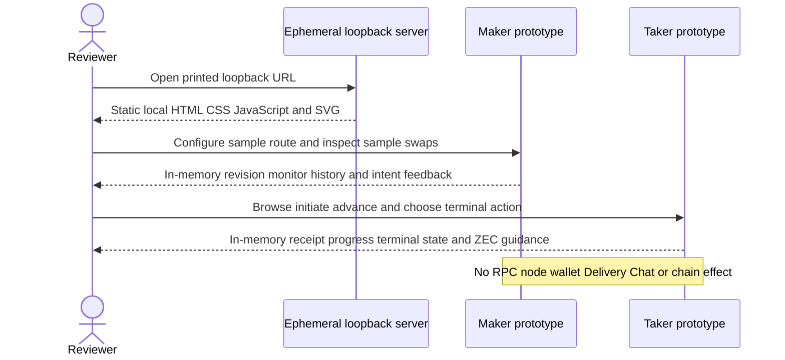

### Maker review

1. Choose **Open Maker prototype**, then verify the amber
   **Interactive prototype** banner says the data is sample-only and has no
   daemon, wallet, or chain effects.
2. Choose **Pair & price**. Select **LEZ / Zcash**, choose either explicit
   direction, retain **Local price**, and set foreign units to `2` and LEZ units
   to `1820`. Confirm the preview reads `2 ZEC = 1,820 LEZ`.
3. Select **Review configuration**. The dialog must repeat the selected pair,
   direction, and price and must say no daemon request is made. Select
   **Confirm sample**. Expect the toast
   `Sample route revision 9 confirmed in browser memory only.`
4. Repeat step 2 with **Logos module** selected. It remains a sample C-API
   projection; confirmation must have the same no-effect boundary.
5. Choose **Active swaps**. Select both `ZEC-7F2A` and `BTC-3BD1` and verify the
   detail projection changes pair, state, progress, amount, and next semantic
   action without exposing a path, key, or evidence payload.
6. Select **Advance sample state** once. The ZEC row deterministically changes
   from `1 / 2 confirmations` to `2 / 2 confirmations` and `Claim available`.
   Expect a toast that explicitly says no RPC was opened.
7. In either active-swap detail, select **Request sample claim** and then
   **Request sample refund**. Each must report an in-memory sample intent and no
   daemon call. These mutually illustrative buttons do not authorize or execute
   real competing actions.
8. Choose **History**. Search for `XMR`, clear the search, filter
   **Completed**, then filter **Refunded**. Verify the deterministic rows change
   accordingly. Select **Preview sample export** and require the message that no
   file was written.

### Taker claim and ZEC shield-after-swap review

1. Use **Switch to Taker prototype**, or return to the landing page and choose
   **Open Taker prototype**. Verify the banner says the offers are samples and
   that Delivery, Chat, wallet, and chain effects are absent.
2. In **Browse offers**, retain **Receive BTC / XMR / ZEC** and select
   **Review exact terms** on the ZEC offer showing `1,820 LEZ` sent and
   `2.00 ZEC` received.
3. Verify the review repeats the pair, direction, exact sample price, Maker
   identity, recovery window, and offer ID. Check
   **I reviewed this sample pair, direction, amount, and recovery window**;
   **Initiate sample swap** must become enabled.
4. Select **Initiate sample swap**, read the no-effect explanation, then select
   **Create sample progress**. Expect a browser-memory sample-receipt message;
   no negotiation or receipt file is created.
5. On **Swap progress**, select **Advance deterministic sample** twice. The
   timeline reaches **Terminal action available**, the confirmation display
   reaches `2 / 2 sample`, and each toast states that no chain or wallet was
   accessed.
6. Select **Claim sample funds**, read the mutually exclusive sample-action
   dialog, and select **Confirm sample claim**. Expect **Swap completed** and the
   explicit statement `No funds moved.`
7. In **Shield after the swap**, verify the warning says transparent-pool
   amounts, scripts, addresses, and linkage are public. The three steps must say
   to wait for wallet recognition, choose a controlled shielded address, and
   review fees and confirmations before a separate shielding transaction.
   Select **Mark guidance reviewed**. This records only in-page review state;
   shielding is separate guidance, not a privacy property or effect of the
   atomic swap.

### Refund and pair-selection checks

1. Select **Browse another sample offer**, repeat ZEC review and initiation,
   advance the sample twice, select **Refund sample**, and confirm
   **Confirm sample refund**. Expect **Swap refunded**, `No funds moved.`, and no
   shield-after-swap card because no ZEC was received through the claim path.
2. Return to **Browse offers**, enter `BTC` in **Filter sample offers**, open
   its terms, and verify `LEZ / BTC`, `0.005 BTC`, the sample Maker identity,
   and the exact BTC rate remain consistent.
3. Return and filter `XMR`; verify `LEZ / XMR`, `1.00 XMR`, its distinct
   Maker identity, and its exact XMR rate. No BTC or XMR selection may reuse the
   ZEC icon, pair, identity, amount, or shield-after-swap guidance.
4. Toggle **Receive LEZ** and verify the deterministic reverse ZEC offer appears
   with `10.00 ZEC` sent and `9,100 LEZ` received. This is a display-direction
   check only.

### Expected outcome and sign-off checklist

All state resets on page reload because the prototypes use no persistent browser
storage. A successful review has no new file, socket beyond the HTTP listener,
daemon request, offer, receipt, transaction, balance change, or chain evidence.

- [ ] Both role cards and every required screen are reachable by mouse and
  keyboard.
- [ ] The prototype/sample boundary remains visible throughout both roles.
- [ ] Maker pair/price, monitoring, history, and manual-intent journeys match
  the wording and deterministic outcomes above.
- [ ] Taker browse, initiation, progress, claim, refund, BTC/XMR selection, and
  ZEC shield-after-swap guidance match the wording above.
- [ ] Dialogs close with **Escape**, disabled initiation cannot be bypassed
  before the review checkbox, and focus indicators remain visible.
- [ ] Narrow and wide browser layouts remain readable without hiding an action
  or changing sample semantics.
- [ ] Reviewer comments and requested changes are recorded separately before
  anyone claims owner sign-off.

### External resources, isolation, and flakiness

Runtime external resources are `[]`. The only listener is the run-unique
ephemeral `127.0.0.1` HTTP server used to deliver checked-in static files to the
local browser. The pages make no fetch, WebSocket, RPC, DNS, peer, analytics,
font, CDN, faucet, node, wallet, public-network, or public-funds request. They
use no Bitcoin, Monero, Zcash, or LEZ service and create no protocol evidence.

There is no external-service flakiness. Possible local review failures are a
missing Node.js 24 runtime, browser JavaScript disabled, local CPU pressure, or
the browser being unable to connect to the printed ephemeral port. Restart the
server to obtain a new URL; never replace the ephemeral bind with a shared fixed
port during parallel work. Closing the server or browser discards all sample
state and cannot affect a swap.

### Reproduce the Basecamp packaging preflight

This historical tutorial rehearsal is a build/install proof, **not** the
Maker/Taker user flow. It was followed by a successful exact Basecamp runtime
build and then by the repository role-package product proof in Flow 1X2. Reserve
a separate disk budget and stop before the host falls below 20 GiB free. The
first full-root attempt reached the 14 GiB safety threshold and was deliberately
stopped; the later isolated replay completed after exact project cleanup.

Use official tutorial commit
`bfc34c451c08da9f78072dd825756a1e071a051d`, module-builder 0.2.0 commit
`92ef691ea72844134f6c68fb447d37f855fc9690`, package-manager 0.2.0 commit
`7a1f1cf35b22dc1a3407d6b5cafce333321be584`, and Nix image digest
`sha256:d78540374f6a886653cba47d5c3f61c5a41d42e2a8db2607b8d68cb226fd463e`.
Do not accept a floating scaffold input or an untrusted upstream extra cache.
After following the tutorial prerequisite to build `libcalc.so`, the relevant
commands inside a dedicated Nix store are:

```sh
nix build --no-update-lock-file .#default
nix build --no-update-lock-file .#lgx
nix build github:logos-co/logos-package-manager/7a1f1cf35b22dc1a3407d6b5cafce333321be584#cli
lgpm --modules-dir BASECAMP_DATA/modules --allow-unsigned install --file logos-calc_module-module-lib.lgx
lgpm --ui-plugins-dir BASECAMP_DATA/plugins --allow-unsigned install --file logos-calc_ui_cpp-module.lgx
lgpm --modules-dir BASECAMP_DATA/modules --ui-plugins-dir BASECAMP_DATA/plugins --json list
```

Expect core LGX SHA-256
`959126dcd54ded28be30a33c63a9c191febf119b7bd7f3c664ae89376e8d8f54`
and UI LGX SHA-256
`d184c0423dc7dc5bee98e74eb1cf51c4edc3e381ce017ab88a38caf857e13bd5`.
The JSON list must show `calc_ui_cpp` type `ui_qml` depending on
`calc_module`. `--allow-unsigned` is acceptable only for these official local
tutorial artifacts; a production candidate must require signatures. GitHub and
`cache.nixos.org` are cold-build dependencies and can cause setup flakiness. No
chain RPC, faucet, public funds, or public deployment is used. Remove the
dedicated store and temporary tree after capturing hashes. This tutorial alone
does not prove a repository package load; Flow 1X2 supplies that separate
evidence.

### Reproduce the atomic Maker backend prerequisite

This is a developer proof behind the future Maker UI, not prototype sign-off
and not an actor-real user flow. From the repository root with the locked Rust
toolchain and dependency cache available:

```sh
cargo test --locked -p lez-swap-store --test maker_application local_route
cargo test --locked -p lez-maker-node --test maker_local_route_rpc
```

The first command proves combined save, exact replay, restart durability, and
rollback when the price CAS is stale after the pair update was attempted. The
second calls `maker_local_route_save_v1` through the real typed RPC module,
then lists both durable rows and rejects an unknown path-shaped request field.

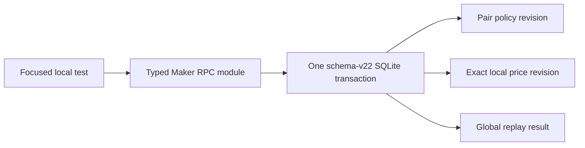
## Flow 1X2: build and use the Maker and Taker Basecamp packages

Status: reproducible local-functional product flow. It uses pinned Basecamp
0.2.0-RC3, separate role user directories, process-isolated QtRO backends, and
the real owner services. Runtime uses no public RPC, faucet, public funds, or
public deployment.

### Build the locked outputs

With Nix flakes enabled, run from `apps/basecamp`:

```sh
nix build --no-update-lock-file .#maker -o result-maker
nix build --no-update-lock-file .#taker -o result-taker
nix build --no-update-lock-file .#maker-lgx -o result-maker-lgx
nix build --no-update-lock-file .#taker-lgx -o result-taker-lgx
nix build --no-update-lock-file .#maker-install -o result-maker-install
nix build --no-update-lock-file .#taker-install -o result-taker-install
nix build --no-update-lock-file .#maker-integration-test
nix build --no-update-lock-file .#taker-integration-test
```

Expect both official integration outputs to build. The repository contract can
be repeated without Nix from the repository root:

```sh
npm run test:m6:basecamp:contract
```

It must report two `ui_qml` packages, thirteen typed slots, and one owner-local
transport. A cold build fetches immutable GitHub flake inputs and NARs from
`cache.nixos.org`; those setup services can be flaky. Do not replace the lock
with a floating tag. The product runtime is networkless after the closure is
available.

### Install each role separately

```sh
export M6_ROOT="${TMPDIR:-/tmp}/lez-m6-manual-$UID"
export M6_MAKER_USER="$M6_ROOT/basecamp-maker"
export M6_TAKER_USER="$M6_ROOT/basecamp-taker"
install -d -m 0700 "$M6_ROOT" "$M6_MAKER_USER" "$M6_TAKER_USER"
cp -a apps/basecamp/result-maker-install/. "$M6_MAKER_USER/"
cp -a apps/basecamp/result-taker-install/. "$M6_TAKER_USER/"
```

Build Basecamp tag `0.2.0` only after verifying its exact commit is
`48b26c0d33573b5dd3695ae5868b04328f79e5c6`; its internal version is
`0.2.0-RC3`. Set `M6_BASECAMP_BIN` to the resulting absolute
`bin/LogosBasecamp` path. The complete pinned checkout/build example is in
`apps/basecamp/README.md`.

### Repeat the Maker journey

Start `lez-maker-daemon` with its normal private configuration and a run-owned
absolute socket. The runtime directory must be owner mode 0700 and the socket
owner mode 0600. Use the same effective UID for Basecamp:

```sh
export LEZ_MAKER_RPC_SOCKET="$M6_ROOT/runtime-maker/maker.sock"
export M6_BASECAMP_USER_DIR="$M6_MAKER_USER"
scripts/m6-basecamp-launch-wrapper.sh
```

Open **LEZ Atomic Swap Maker**, confirm **Backend connected**, then:

1. select **Check service**;
2. select the pair and direction and enter exact atomic-unit limits and price;
3. select **Save route atomically**;
4. select **Refresh swap history**;
5. use monitor or a terminal control only for an existing role-owned swap and
   its current generation.

The route click is one `maker_local_route_save_v1` call. The daemon commits the
policy, price, and replay result in one SQLite transaction. No QML or QtRO
process receives the database path or chain credentials.

### Repeat the Taker journey

Follow Flow 1Y to create the strict owner-private configuration and start the
real `lez-taker-service`. Then launch the separate Taker role:

```sh
export LEZ_TAKER_RPC_SOCKET="$M6_ROOT/runtime-taker/taker.sock"
export M6_BASECAMP_USER_DIR="$M6_TAKER_USER"
scripts/m6-basecamp-launch-wrapper.sh
```

Open **LEZ Atomic Swap Taker**, confirm **Backend connected**, then:

1. select **Service health** and **Browse authenticated offers**;
2. copy the chosen offer ID, Maker compressed public identity,
   signed-envelope SHA-256, foreign atomic units, and expected LEZ atomic units
   into the exact review form;
3. select **Confirm and initiate** once and retain the returned swap ID;
4. repeat the unchanged request and require an exact replay result;
5. select **List my swaps**, enter the swap ID, and select **Monitor**;
6. select **Claim** or **Refund** only when monitor advertises that action at
   the displayed generation; shield received transparent ZEC separately after
   wallet recognition.

The retained automated product run drives those controls through the official
Logos MCP harness. It observes `was_replay: false`, then `was_replay: true`, and
proves request `taker-ui-initiate-001` maps to swap
`m6-process-zec-swap-001` in the actual registry. This proves UI/package/backend/
service composition through monitor. It does not claim that this particular UI
run emitted terminal chain transactions; the fresh Claim and Refund service
certificates are the separate actual-node layer.

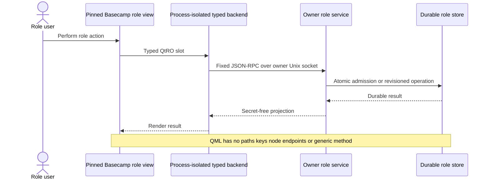

### Isolation, flakiness, and cleanup

Use separate user directories, runtime directories, socket paths, container
names, and a dedicated Nix volume. Product tests run with `--network none`; the
Qt inspector loopback exists only inside that container. Local CPU/disk pressure,
Nix cold-cache availability, Qt startup, and finite service deadlines can affect
timing. They never authorize a public fallback or reuse of stale evidence.

Stop only the processes started by this run and remove only `$M6_ROOT`, the six
role result links, and the exact dedicated container/volume/image reference after
verifying their names. Never globally prune Docker or Nix on a shared host.

## Flow 1Y: run the actual Taker owner service and prepared acceptance

Status: reproducible progressive flow. The spawned service proof covers
socket/configuration custody, authenticated reads, default-off admission, and
restart. The real acceptance proof uses the same RPC module with a real Maker
daemon, Delivery, and Chat and ends at durable actor provisioning before any
chain effect. It then removes Delivery and Chat and reproduces the accepted
swap through the receipt-bound list and monitor methods. The later Claim
subsection is actual-local and certified. The Refund subsection is an
executable fresh-node certificate candidate whose focused contract is GREEN;
successful two-leg evidence is now retained in Claim and Refund certificates.
Flow 1X2 composes this service through actor-real Basecamp without conflating
the UI product run with those separate terminal chain effects.

### Build and isolated empty configuration

From the repository root:

```bash
cargo build --locked -p lez-maker-node --bin lez-taker-service

RUN_ROOT="$(mktemp -d /tmp/lez-m6-taker-read.XXXXXX)"
chmod 700 "$RUN_ROOT"
CONFIG="$RUN_ROOT/taker-service.json"
SOCKET="$RUN_ROOT/taker.sock"

cat >"$CONFIG" <<'JSON'
{
  "schema_version": 1,
  "delivery_sources": [],
  "maximum_offers": 16
}
JSON
chmod 600 "$CONFIG"
```

The secure loader accepts an owner-owned single-link regular configuration file
with exact mode 0400 or 0600 and fails before socket bind on unknown or unsafe
fields. The top-level schema accepts version one, zero to 32 named pinned
Delivery sources, an optional absolute `chat_socket`, a result limit from 1
through 1024, and an optional `initiation` object.

Initiation selects one existing mode-0600 registry, an
`execute_prepared_zec` boolean that defaults false, and at most 256 prepared
ZEC `TakerSellsLez` entries. Each entry binds a named source, swap, offer,
reservation, exact amounts, signed envelope, unsigned draft, signing key,
source actor config, agreement output, actor root, and receipt output. All
paths are normalized absolute paths. Any nonempty prepared catalog currently
requires an owner-owned mode-0600 Chat socket even when execution is false.
Execution true uses that socket for bounded real Chat propose and complete.

### Start the empty service and call baseline methods

```bash
target/debug/lez-taker-service \
  --config "$CONFIG" \
  --socket "$SOCKET" \
  >"$RUN_ROOT/service.log" 2>&1 &
SERVICE_PID=$!

for _ in $(seq 1 100); do
  test -S "$SOCKET" && break
  kill -0 "$SERVICE_PID" 2>/dev/null
  sleep 0.05
done
test -S "$SOCKET"
test "$(stat -c %a "$SOCKET")" = 600

curl --silent --show-error \
  --unix-socket "$SOCKET" \
  --header 'content-type: application/json' \
  --data '{"jsonrpc":"2.0","id":1,"method":"taker_health","params":[{"schema_version":1}]}' \
  http://localhost/

curl --silent --show-error \
  --unix-socket "$SOCKET" \
  --header 'content-type: application/json' \
  --data '{"jsonrpc":"2.0","id":2,"method":"taker_offer_list_v1","params":[{"schema_version":1,"route":null}]}' \
  http://localhost/
```

Health is ready with Delivery and Chat disabled; the list is empty. Health
reports only `health` and `offer_list` as registered. Calling initiate,
swap list, monitor, claim, refund, a Maker method, or a generic dispatcher
returns JSON-RPC method-not-found.

Stop only the test-owned child and verify exact socket cleanup:

```bash
kill -TERM "$SERVICE_PID"
wait "$SERVICE_PID"
test ! -e "$SOCKET"
rm -rf -- "$RUN_ROOT"
```

Never reuse a fixed socket or remove another run's directory while parallel
work is active.

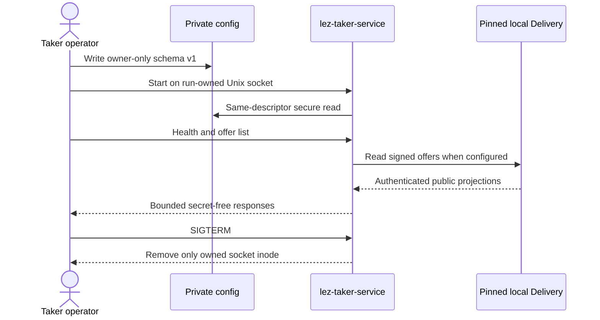

### Use real local Delivery and Chat

To browse real offers, configure absolute run-local Delivery directories and
their exact Maker public keys. Health probes Chat socket metadata. An enabled
prepared initiation uses the same separate Maker Chat socket for bounded
`zec_chat_propose_v1` and `zec_chat_complete_v1`; no Chat credentials or
Maker signing authority enter the response.

Fresh list or initiation fails closed on missing Delivery, expired offers,
wrong keys, unsafe Chat, result overflow, or conflicting immutable duplicates.
There is no public provider fallback.

### Reproduce default-off admission and process restart

```bash
cargo test --locked -p lez-maker-node \
  --test taker_initiate_rpc \
  -- --nocapture

cargo test --locked -p lez-maker-node \
  --test taker_service_process \
  configured_initiation_survives_process_restart_without_live_delivery \
  --exact --nocapture
```

These tests return `Initiating` generation zero, prove atomic registry commit,
concurrent exact replay and one-winner conflict, reject a same-byte signing-key
replacement with a new inode, and replay after the Delivery offer disappears.
They leave execution false and perform no Chat acceptance.

### Reproduce real ZEC acceptance and offline replay

```bash
cargo test --locked -p lez-maker-node \
  --test zec_chat_process \
  service_initiation_completes_real_chat_before_not_activated_response \
  -- --exact --nocapture --test-threads=1
```

The test creates one unique private root and starts the real Maker daemon with
separate owner RPC and Chat Unix sockets, signed local Delivery, Maker SQLite,
and a separate Taker registry. It loads `execute_prepared_zec: true`, invokes
the real Taker service RPC module, validates and countersigns the ZEC agreement,
completes Maker Chat, provisions the Taker actor, and publishes the receipt.
The spawned `lez-taker-service` binary is not used in this exact test; the
preceding process test independently covers its socket boundary.

The first response has `was_replay: false`, state `NotActivated`, generation
zero, no available action, and exact reviewed identities and amounts. Maker
negotiation is `Completed`, exactly one Maker actor is queued, and the
role-fixed Taker agreement, actor bundle, and mode-0600 receipt exist.

The test removes the Delivery offer, makes Chat unavailable, reloads the
service context, and retries the same request. The reply has
`was_replay: true` and the identical projection. It then verifies that health
reports exactly health, offer list, swap list, initiate, and monitor; list
returns exactly the admitted swap; and monitor returns `NotActivated`,
generation zero, no action, and no privacy guidance. An unknown swap and use
of the offer ID as a swap ID both return fixed code `-32014` with category
`swap_not_found`. Responses expose no private path, key, reservation, or raw
receipt material. Agreement, actor config, and receipt bytes and inodes remain
unchanged and no Maker actor is duplicated. The same exact test also replaces
the receipt with identical bytes on a new inode and holds the actor lock; both
monitor attempts fail with fixed redacted code `-32010`. Bound receipt
deletion, coherent receipt/config cross-tamper, and corrupt role-state storage
also make monitor and the whole list fail with `-32010`; restoring each exact
artifact restores the same view. Restoring the original
inode and releasing the lock restores the exact view without role-state,
journal, or chain effects.

The test owns one unique temporary root and every Unix socket, database, and
artifact below it; it does not reuse a fixed port or Docker container. The
registry, configured Delivery directory, prepared inputs, and private artifacts
must remain locally available to the restarted service, but Delivery offer
content and Chat availability are not monitor dependencies.

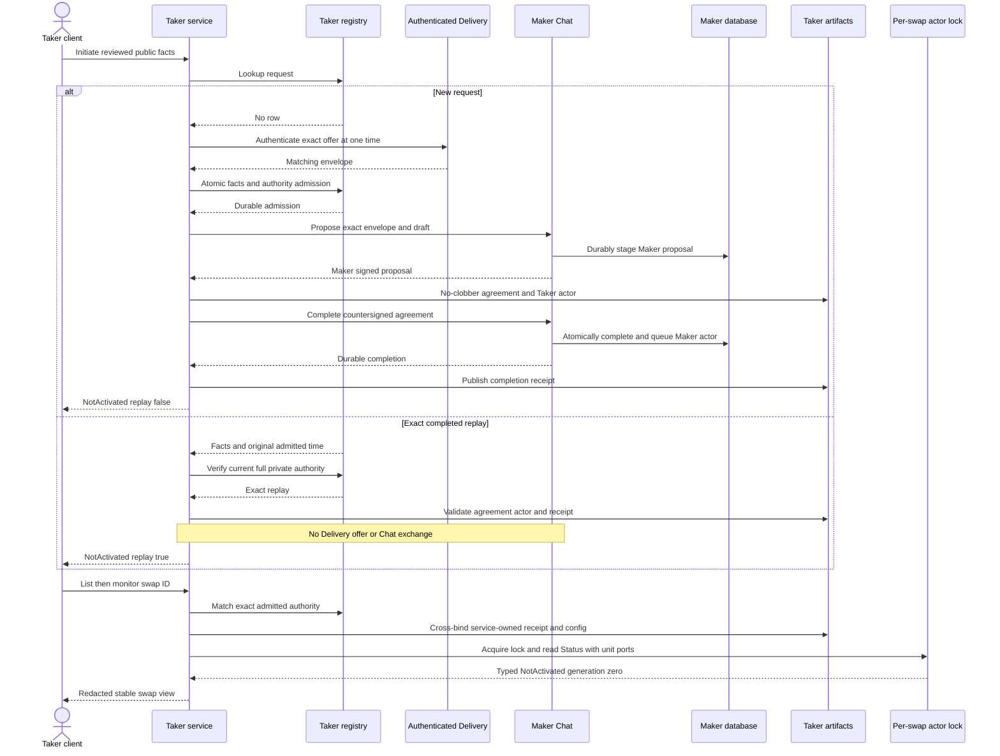

Atomicity is layered, not distributed. Admission is one Taker SQLite
transaction and occurs first. Maker proposal and completion commit before their
responses; completion atomically consumes the offer and queues one Maker actor.
Taker agreement, actor, and receipt use create-new or exact-replay publication,
and the receipt follows Maker completion. Crash windows converge through the
exact request instead of starting another swap.

Neither actor starts. No actor state database or LEZ bridge journal exists and
no Zebra, LEZ, wallet, faucet, public RPC, DNS, or fund effect occurs. This is
real off-chain acceptance and recoverability, not a completed atomic swap.
See ADR 0135 for acceptance atomicity and ADR 0136 for the locked-read
atomicity and race argument.

### Reproduce the standalone registry and prepared authority

```bash
cargo test --locked -p lez-swap-store --test taker_facade_registry

cargo test --locked -p lez-maker-node --test taker_initiation_config
```

The registry's 14 cases cover private exclusive creation/reopen, unsafe
ancestors and database drift, atomic admission, changed public/private
conflict, exact replay, corruption, redaction, and two-connection concurrency.
The five prepared-authority cases cover named Maker authentication, fixed ZEC
route and amounts, catalog bounds, same-descriptor file binding, real
secp256k1 key validation, required Chat, fixed errors, and redacted Debug.
Neither component command starts a node, wallet, faucet, or public request.

### Reproduce the service-driven ZEC Claim on actual local nodes

Start fresh, uniquely named LEZ v0.2 and primary-only Zebra Regtest stacks by
following [Flow 0B2](#flow-0b2-run-the-isolated-lez-v02-service-stack) and the
node/bootstrap part of [Flow 1B](#flow-1b-composed-m5-zec-application-poc).
Deploy the checked escrow and generate fresh role identities and canonical
deployment, finality, and onboarding evidence. Mine Zebra only to the documented
Regtest maturity prefix. Never copy an old endpoint, run ID, signer, or evidence
file.

Export the values from those fresh run manifests, then invoke the M6 wrapper:

```bash
export RUN_ID=m6claim-$(date -u +%Y%m%d%H%M%S)
export LEZ_SEQUENCER_URL=http://127.0.0.1:SEQUENCER_PORT
export LEZ_INDEXER_URL=http://127.0.0.1:INDEXER_PORT
export ZEBRA_RPC_URL=http://127.0.0.1:ZEBRA_PORT
export LEZ_CHAIN_ID=LOWERCASE_HEX32
export LEZ_GENESIS_HASH=LOWERCASE_HEX32
export ESCROW_PROGRAM_ID=LOWERCASE_HEX32
export AUTHENTICATED_TRANSFER_PROGRAM_HEX=LOWERCASE_HEX32
export AUTHENTICATED_TRANSFER_PROGRAM_BASE58=BASE58_PROGRAM_ID
export MAKER_ACCOUNT_BASE58=BASE58_MAKER_ACCOUNT
export TAKER_ACCOUNT_BASE58=BASE58_TAKER_ACCOUNT
export M5_LEZ_DEPLOYMENT_EVIDENCE_FILE=/absolute/current/deployment.json
export M5_LEZ_FINALITY_EVIDENCE_FILE=/absolute/current/finality.json
export M5_LEZ_ONBOARDING_EVIDENCE_FILE=/absolute/current/onboarding/summary.json
export M5_LEZ_MAKER_SIGNER_KEY_FILE=/absolute/private/maker/lez-signer.key
export M5_LEZ_TAKER_SIGNER_KEY_FILE=/absolute/private/taker/lez-signer.key

./scripts/run-m6-zec-taker-service-poc.sh
```

The wrapper fixes `M5_APPLICATION_MODE=1`, `M6_TAKER_SERVICE_MODE=1`, and
`POC_DIRECTION=taker_sells_lez`. The underlying runner refuses non-loopback
endpoints, reused or unsafe roots, and a concurrently owned endpoint tuple. It
keeps the Taker service, Maker daemon, actors, sockets, files, and evidence
below one run-private root and cleans up only processes it started. It does not
own the LEZ or Zebra stacks; stop only the exact containers and networks named
by their run manifests after inspection. Never use a broad prune while another
run exists.

Inspect the public evidence without printing private configuration or keys:

```bash
EVIDENCE=/tmp/lez-atomic-swaps-${RUN_ID}/evidence
jq . "$EVIDENCE/m6-taker-service-claim-first.json"
jq . "$EVIDENCE/m6-taker-service-claim-replay.json"
jq . "$EVIDENCE/m6-zebra-mempool-before-claim.json"
jq . "$EVIDENCE/m6-zebra-mempool-after-first-claim.json"
jq . "$EVIDENCE/m6-zebra-mempool-after-claim-replay.json"
jq . "$EVIDENCE/m6-taker-service-terminal.json"
jq . "$EVIDENCE/result.json"
```

Earlier certificate `m6cert20260803164006` predates reporting fix
`e5b4c32`, so its `result.json`
still labels `application_plane.taker_claim_authority` as `receipt_bound_cli`
and omits `m6_taker_service_mode`. Do not use that legacy summary field as
service proof. The dedicated Claim first/replay responses and Zebra mempool
snapshots above are authoritative; new runs emit `owner_taker_service` and the
explicit M6 mode.

A passing run must show replay false followed by replay true for the same Claim
and generation, plus mempool `[]`, then `[TXID]`, then the identical `[TXID]`.
The terminal view and both actor statuses must be completed. Fresh regression
`m6claim0ba41aba` used new LEZ run
`m6claimlez0ba41aba` at Bedrock/sequencer/indexer ports 32826/32827/32828
and new Zebra run `m6claimzec0ba41aba` at port 32825. Service replay kept
exact Zcash transaction `0da6b4c219dfea030e3790447f01f71cbf1779dab5d2531b4e6a2df829dd2abf`;
LEZ Claim `f865903ea97384169de670a14c3a438812eea72e67c4dffb464afeff7e14d0cc`
finalized in block 127; both roles completed in 33.330 seconds with zero drive
retries. See `docs/evidence/m6-zec-service-claim-regression-certificate-20260804.json`.
These identifiers are evidence, not inputs to a new run.

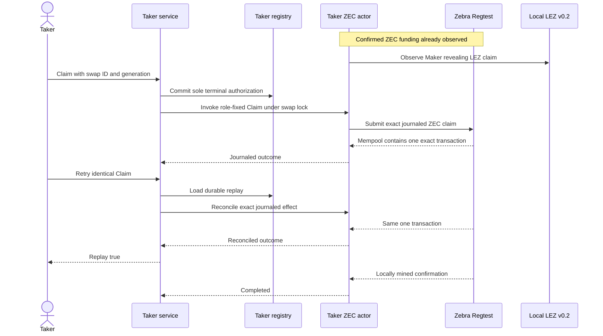

Atomicity is conditional rather than a distributed chain transaction. The
registry selects Claim or Refund before effects, the actor lock excludes a
concurrent worker, and the actor persists exact effect intent before send. An
identical request can only reconcile that intent; it cannot authorize the
opposite branch. ZEC is funded and confirmed before the LEZ revealing claim,
and only that revealed secret authorizes the final ZEC claim. Timelocks retain
the refund path if the happy sequence stops. See ADR 0137 for failure windows
and limitations.

### Reproduce the service-driven ZEC Refund certificate candidate

Use wholly fresh LEZ v0.2 deployment/onboarding, role identities, deterministic
funds, Zebra Regtest maturity, dynamic loopback ports, and a fresh run ID exactly
as in the Claim subsection. The Claim-only wrapper intentionally rejects this
journey; invoke the shared runner with all application/service/refund selectors
explicit:

```bash
export RUN_ID=m6refund-$(date -u +%Y%m%d%H%M%S)
export M5_APPLICATION_MODE=1
export M6_TAKER_SERVICE_MODE=1
export M6_ZEC_JOURNEY=refund
export POC_DIRECTION=taker_sells_lez

./scripts/run-m2-taker-sells-lez-poc.sh
```

Keep the same endpoint, chain, program, deployment, onboarding, account, and
private signer exports listed for Claim. Never use the quarantined
`m6refund7be4428a` identities, funds, node state, or evidence as inputs.

Inspect the additional owner-private Refund evidence:

```bash
EVIDENCE=/tmp/lez-atomic-swaps-${RUN_ID}/evidence
jq . "$EVIDENCE/m6-maker-lock-reconciliation.json"
jq . "$EVIDENCE/m6-taker-service-refund-commit.json"
jq . "$EVIDENCE/m6-taker-lez-refund-finality.json"
jq . "$EVIDENCE/m6-zebra-zcash-refund-inclusion.json"
jq . "$EVIDENCE/m6-taker-service-refund-terminal-no-effect.json"
jq . "$EVIDENCE/result.json"
```

A passing certificate must show one bounded observation-only Maker call with
normal Maker daemon authority absent, exact `maker_lock` projection to
`both_legs_locked`, unchanged Zebra height, and empty mempool before and after.
The service must then select only Refund, reject the opposite Claim, finalize
the Taker LEZ refund, and start parent-owned Maker recovery only after that
finality. The Zcash refund must appear exactly once in the canonical block named
by the evidence. Exact terminal replay must change neither the ordered
successful LEZ submission trace nor the Zebra tip or empty mempool.
`result.json.refund_path.maker_lock_reconciliation_sha256` must equal the
SHA-256 of the reconciliation evidence file.

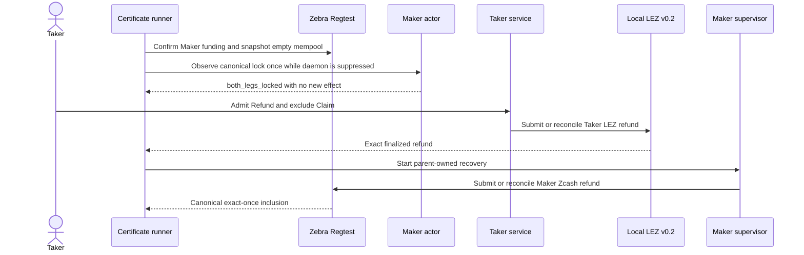

The atomicity argument and its limits are recorded in ADRs 0144 and 0145.
Fresh pushed-commit run `m6refund8f76d87a` followed this procedure on
new LEZ run `m6lez8f76d87a` and new Zebra run
`m6refundzec8f76d87b`. LEZ Refund `c43df1bb...dcf5ad` finalized
exactly once at block 129 before Maker Zcash Refund
`db066a94...5ab470` appeared exactly once in canonical block 110. All
three application views reached `refunded`, the opposite Claim conflicted,
and terminal replay changed neither chain. The run took 211.530 seconds. See
`docs/evidence/m6-zec-service-refund-certificate-20260804.json`.

Every new reproduction must exercise the same ADR 0145 boundary. After the LEZ
Refund is finalized and the parent restarts Maker recovery, the runner emits
the same parent handoff without invoking another Taker action RPC until the
Zcash refund is mined. The later terminal replay resumes Taker observation and
must reach `refunded`. Inspect the retained runner and actor configs:

```bash
rg -n 'M6_SERVICE_ACTION_TIMEOUT_MS|M6_REFUND_SUPERVISOR_ATTEMPT_TIMEOUT_MS' \
  scripts/run-m2-taker-sells-lez-poc.sh
jq '.bridge.request_timeout_millis' \
  "$EVIDENCE/../application/taker-actors/taker/actor-config.json"
jq '.bridge.request_timeout_millis' \
  "$EVIDENCE/../application/maker-actors/"*/maker/actor-config.json
```

The expected local hierarchy is a 60,000-millisecond actor bridge, a
75,000-millisecond refund-only Maker attempt, and a 90,000-millisecond service
action caller, all capped by the 300-second monotonic Refund corridor. Query
calls remain 15,000 milliseconds and ordinary pre-cutover Maker attempts remain
20,000 milliseconds. These are liveness bounds, not finality delays; successful
calls return immediately.

Logos LEZ v0.2 `getAccountAtBlock` currently reconstructs historical state
per account from genesis. At block 157, two retained diagnostic reads took
10.84 and 11.39 seconds. This can make runtime duration sensitive to chain
height and concurrent historical reads, but it cannot satisfy acceptance with
missing evidence. The certificate still fails closed unless both exact
finalized legs and terminal no-effect replay are present.

### External resources, isolation, and flakiness

The empty service and default-off admission use only run-local executables,
private files, Unix sockets, system time, signed deterministic offers, and
SQLite. The real acceptance proof adds the local Maker daemon and Chat socket.
Receipt-bound list and monitor use only the prepared catalog, Taker registry,
private receipt/actor files, role-state lock, and local status projection; they
do not read Delivery or Chat and use unit chain ports.
Those pre-effect flows need no Docker, chain node, wallet, faucet, peer, DNS,
public funds, or external finality service. Placeholder loopback endpoints in
read-only actor configs are never contacted. The certified Refund flow used
fresh run-isolated LEZ v0.2 Bedrock, sequencer, and indexer at dynamic loopback
ports 32821 through 32823 and fresh primary-only Zebra Regtest at 32824.
Deterministic genesis/Vault allocations and Regtest outputs supplied funds; no
public RPC, faucet, public funds, public deployment, or provider fallback was
used. The actual Claim flow separately uses a run-isolated LEZ v0.2 sequencer,
indexer, and Bedrock plus primary-only Zebra Regtest on dynamic
literal-loopback RPCs. New manual reproductions must use fresh uniquely named
stacks. Certificate `m6cert20260803164006` instead reused already isolated LEZ
run `m6lez20260803155817` and used fresh Zebra run `m6zec20260803164006`; a
separate fresh LEZ deployment/onboarding succeeded later but did not contribute
to that certificate. The swap uses deterministic local genesis/Regtest funds
and local mining only, with no public RPC, faucet, public funds, or automatic
provider fallback. The pinned Bedrock process may make best-effort UDP NTP
requests through `pool.ntp.org` during startup, so universal DNS/NTP silence is
not claimed. Cargo or Docker may access a registry only during cold setup,
never as swap runtime evidence.

Local sensitivities are the three-second offer TTL, system clock, 10-second
child readiness, five-second shutdown, Unix ownership/mode/inode behavior,
filesystem sync, SQLite contention, disk pressure, and CPU scheduling. Fresh
acceptance needs Delivery and Chat. Completed receipt replay needs neither the
offer nor a Chat exchange, but it still needs the configured Delivery directory
and retained local custody.

A pre-effect acceptance failure after registry admission returns a fixed
dependency error and leaves durable work for the exact request to retry. In the
actual Claim flow, a terminal authorization may precede a chain response; only
the exact request may re-enter the actor journal, and the opposite action stays
blocked. Host load can delay local finality, and stale manifests, partial Zebra
maturity, port contention, or disk pressure require discarding the fresh run
rather than reusing it. Remaining production hardening includes
durable receipt/state rollback-incarnation fencing across restart, direct
retained-byte draft/key handoff, exact use-time inode enforcement,
least-authority admission-only configuration, spawned-service real-Chat E2E,
and actor lifecycle, finality, and chaos coverage.

## Flow 1ZC: Repeat both supervised Maker recovery branches

This focused flow emulates the actual operator and daemon usage boundary. It
creates a real signed XMR Stage A and Stage B application, provisions schema-3
Maker effect authority, registers the real digest-pinned xmr-maker-actor in the
Maker store, queues Refund through the durable operator-action API, and runs two
normal supervisor cycles. It repeats that process with independent durable Punish and
Refund workflow branches while reusing the expensive signed application fixture.

From the repository root:

```bash
cargo test -p lez-maker-node --test maker_xmr_tag17_supervisor \
  real_maker_actor_executes_both_recovery_branches_once_then_reconciles \
  -- --exact --nocapture
```

The test is intentionally self-cleaning. A pass must prove all of the following:

- the status child accepts the sealed schema-3 manifest but performs no effect;
- the queued Refund is the only reason the supervisor invokes recover;
- the first recover cycle runs one non-sending preflight and one Tag17 sender,
  reports durable revision 1, leaves the action Queued, and requeues the process;
- the second recover cycle runs only the finalized observer, reports durable
  revision 2, completes the action, and terminalizes the process;
- the exact effect trace is preflight, invoke, observe with no second send;
- the nested sender and observer retain actor lock FD 198 and workflow lock FD
  199, receive sealed FDs 200 through 217, and reject private-share FD 218.
- the second independent workflow selects durable Refund, invokes the Monero
  refund route once with private-share FD 218, then observes without FD 218;
- the Refund trace is exactly invoke then observe, with no preflight and no
  restart send, and reaches the same terminal operator state.

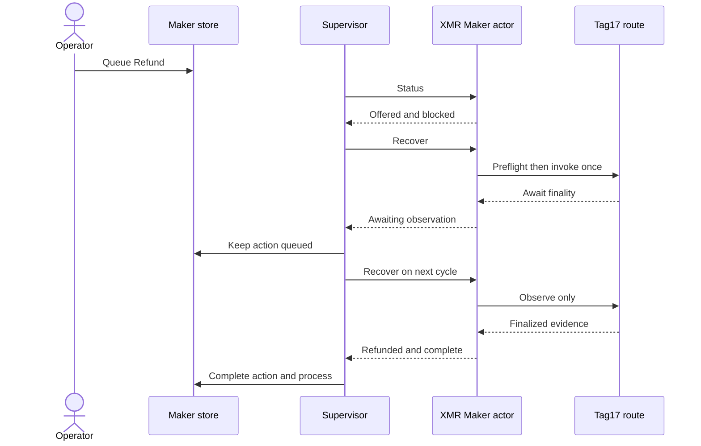

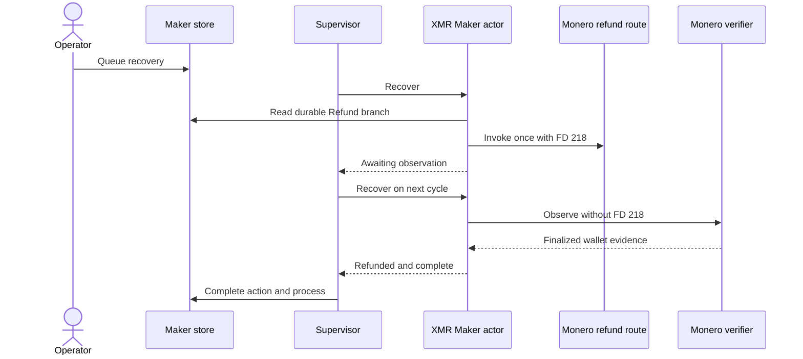

Refund is conditionally atomic at this boundary because durable branch
selection precedes its one-attempt CAS, Started and Unknown cannot invoke again,
and only the original plan verifier can reconcile success. Punish retains the
read-only-preflight, one-attempt-CAS and finalized-only argument shown above.
The exclusive branch row prevents one recovery request from authorizing both.

No Docker container, LEZ node, Monero node, wallet RPC, faucet, DNS, public
funds, peer, or public deployment participates in this checkpoint. The Tag17
sender and observer are strict local descriptor probes; they prove supervisor
composition and restart semantics, not chain behavior. Flow 1ZB and its checked
certificate separately prove actual local LEZ Tag17 submission and finality.
The remaining joined corridor must combine the supervisor path with fresh local
LEZ and Monero devnets and the recovery sweep.

Warm execution is dominated by deterministic DLEQ and adaptor fixture
construction plus repeated complete authority validation. Cold Cargo builds,
CPU contention, filesystem synchronization, entropy scheduling, antivirus or
indexer activity, and disk pressure can increase runtime. No network response
can make the test pass or fail. Use a fresh repository worktree and do not run
global Docker prune; this flow creates only temporary files and removes them on
success or failure.

## Flow 1ZD: Repeat the semantic Maker Monero refund sender

This focused flow runs the same no-argument binary selected by the durable
Maker Refund branch. It builds a deterministic signed Stage A/B application,
persists the real Maker adaptor transcript, seals finalized Tag16 on FD 219 and
the Maker share on FD 218, reconstructs the shared spend key in memory, reads a
Maker-owned destination, and submits one sweep through the independent shared
wallet RPC.

From the repository root:

```bash
cargo test -p xmr-reference-actor --test tag16_process \
  sealed_maker_refund_reconstructs_and_submits_once_without_mining_or_finality_wait \
  -- --exact --nocapture
cargo test -p xmr-reference-actor --test tag16_process \
  sealed_maker_refund_rejects_invalid_final_signature_before_any_rpc \
  -- --exact --nocapture
```

A pass proves the exact wallet call trace:

```text
Maker role wallet: get_address
Shared wallet: close_wallet, generate_from_keys, refresh, get_balance, sweep_all
Daemon authority: no calls
```

The submission evidence must report schema
`lez_v02_m7_monero_refund_submission_v1`, role `maker`, the exact Maker
destination, funded principal equal to received amount plus fee, one nonzero
transaction ID, `finality_observer_required=true`, and
`automatic_submission_retry=false`. The corrupted canonical Tag16 packet must
fail before every RPC and before evidence creation.

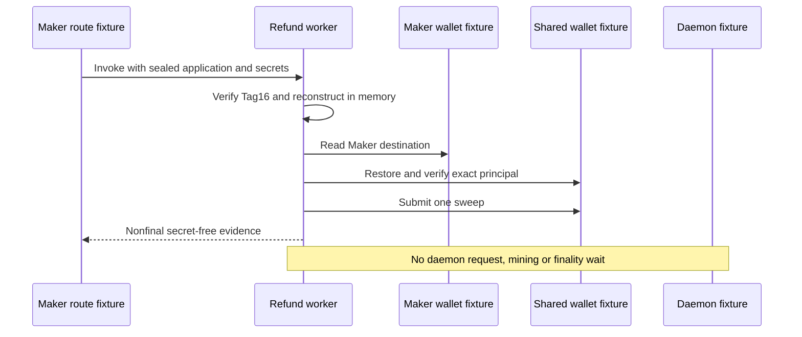

This reproduction needs a warm Cargo toolchain and only ephemeral
literal-loopback JSON-RPC fixtures plus temporary owner-private files and
SQLite. It starts no Docker container, `monerod`, wallet daemon, LEZ node,
faucet, DNS lookup, peer, public RPC, public funds, or public deployment. It can
vary with cold compilation, CPU, entropy, filesystem sync, SQLite contention,
or disk pressure, but not chain or Internet availability. It proves the
semantic sending boundary; the next joined flow must replace the fixtures with
fresh isolated LEZ and Monero nodes, run finality observation after restart,
and prove the losing branches remain impossible.

## Flow 1ZE: Repeat the semantic Maker Monero finality-observer boundary

This focused flow verifies the production observer selected when the durable
refund effect is already Started or Unknown. It checks that only known
non-final chain states map to Pending, that the observer rejects an inherited
spend share before all RPC, and that changed sender evidence cannot reach an
RPC or create final evidence.

From the repository root:

```bash
cargo test --locked -p xmr-reference-actor --bin xmr-reference-monero-verify -- --nocapture
cargo test --locked -p xmr-reference-actor --test tag16_process sealed_maker_refund_observer -- --nocapture
```

Expected result: four tests pass. The two process tests must leave stdout
empty on rejection, record zero daemon and Maker-wallet calls, and create no
`monero-refund-finalized.json`.

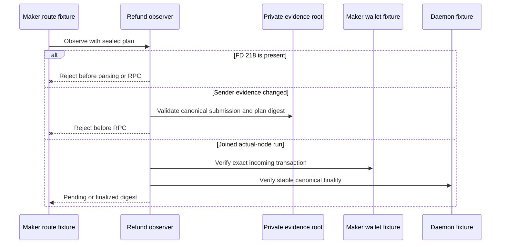

This focused boundary uses only deterministic temporary role material, SQLite
and ephemeral literal-loopback JSON-RPC fixtures. It starts no Docker
container, `monerod`, wallet daemon, LEZ node, faucet, peer, DNS request, public
RPC, public funds or deployment. Cold compilation, CPU/entropy scheduling,
filesystem synchronization, SQLite contention and disk pressure can vary the
runtime; Internet or chain availability cannot. The positive typed
wallet-plus-canonical-daemon finality path is exercised by the next fresh
joined official Monero Regtest flow rather than simulated here.


## Flow 1ZF: Repeat the joined supervised Maker refund

This opt-in flow joins fresh isolated LEZ v0.2 and official Monero 0.18.5.1
Regtest nodes to the real schema-3 Maker supervisor. It uses the finalized
Tag16 evidence to select Refund, admits the action through `lez-maker refund`
with the current durable generation, submits one Maker-directed Monero sweep,
mines ten local confirmation blocks outside both effect children, and lets the
read-only observer terminalize the swap.

First verify the runner contract and use a clean exact commit:

```bash
./scripts/test-m4-actual-claim-poc-contract.sh
export M4_EXPECTED_COMMIT="$(git rev-parse HEAD)"
export RUN_ID=m7refund-yyyymmdd-nonce
export M5_XMR_APPLICATION_MODE=1
export M5_XMR_JOURNEY=refund
export M5_XMR_REFUND_DELAY_MS=600000
export M7_XMR_SUPERVISED_REFUND=1
export RAPIDSNARK_LIB_DIR=/absolute/path/to/verified/rapidsnark-v0.0.8-libraries
export BINDGEN_EXTRA_CLANG_ARGS=-I/usr/lib/gcc/x86_64-linux-gnu/13/include
export LEZ_M4_TOOL_DIR=/absolute/path/to/pinned/risc0-3.0.5-tools
export LOGOS_BLOCKCHAIN_CIRCUITS=/absolute/path/to/logos-blockchain-circuits-v0.4.2
./scripts/run-m4-actual-claim-poc.sh preflight
./scripts/run-m4-actual-claim-poc.sh execute
```

The run ID must be unique and the worktree must remain clean. The minimum
ten-minute signed refund window is protocol time, not Monero finality time; the
local finalized-clock driver advances it deterministically. The M7 test-only
supervisor requeue is one second, while the default remains 3600 seconds.

In supervised schema-3 mode, the runner passes the canonical packet produced
during Tag16 preparation directly to the activation gate. It deliberately does
not reopen the byte-pinned adaptor SQLite journal through the legacy ingestion
helper. Activation checks that packet against finalized Tag16 facts and puts it
in create-new effect custody; the sealed sender later verifies it against the
durable presignature before the only wallet submission. The legacy non-M7
refund flow retains its original ingestion and explicit extraction steps.

After the semantic sender publishes its create-new submission receipt, the
runner validates the exact run, swap, no-retry and local-only fields before
the separate Regtest driver mines ten blocks. It does not wait for a transient
`queued` scheduler sample: queued, leased and backoff all preserve the same
durable Refund action, and the consumed attempt plus create-new receipt prevent
a second send. The read-only observer must still prove the exact transaction
and terminalize the supervisor.

The retained run must contain
`evidence/monero-refund-finalized.json` after cleanup. It is a byte-identical,
owner-private, single-link copy of the observer's canonical secret-free receipt;
the runner publishes it without replacement before deleting the private effect
tree. Absence of that retained file invalidates the certification packet even
when the terminal monitor is GREEN.

The reference replay is `m7refund-7cd3a9c-a` at exact pushed commit
`7cd3a9c16f716543cd130f4caab20be909e35cb0`. It passed with one refund send,
ten confirmation blocks, terminal revision 2, completed manual action, retained
mode-`0600` single-link receipt, and exact cleanup. Verify the checked packet
with `./scripts/test-m7-maker-refund-actual-certificate.sh`; its public summary
is `docs/evidence/m7-actual-maker-refund-7cd3a9c-20260805.json`. The replay does
not prove a daemon restart after submission.

The role journal is a mutable SQLite database. Its manifest SHA-256 records the
exact provisioning snapshot, while sender-to-observer restarts validate a
stable owner-only snapshot and its complete Stage-A/Stage-B session semantics.
A normal checkpoint or `VACUUM` may change page bytes without changing swap
authority; a session, transcript, partial-signature, presignature, role, path,
ownership, mode or sidecar mismatch still fails before any effect. This matters
when diagnosing `actor_exit_failed`: a representation-only digest change must
not be repaired by replacing the manifest or rearming the refund action.

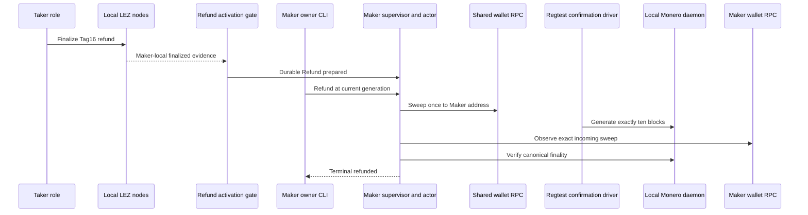

Atomicity is conditional across the two independent chains: confirmed Monero
funding precedes finalized Tag16; only that finalized LEZ effect exposes the
share needed for Maker recovery; the durable branch CAS excludes Claim and
Punish; the sender consumes one attempt before submission and never mines or
retries; and the observer has no spend authority. Crashes replay from durable
evidence without rearming the send. This is not a distributed transaction and
does not claim immunity from finality-model failure or future deep reorgs.

All chain endpoints are unique literal-loopback services owned by this run. No
public RPC, peer, faucet, public funds, DNS lookup, provider, or public
deployment participates. Test funds come from deterministic local genesis and
Regtest outputs. Flakiness can come from cold Cargo/Risc0 builds, CPU or disk
pressure, filesystem synchronization, Docker startup, local-node readiness, or
contention; Internet and faucet availability cannot affect the result. Cleanup
is exact-label and process-identity scoped and must preserve the foreign
sentinel. Never use a broad Docker prune as part of this flow.

## Flow 1ZG: Repeat the joined Tag17 abandonment PoC

This opt-in flow uses one fresh Stage-A agreement across isolated LEZ v0.2 and
official Monero 0.18.5.1 Regtest. Unlike the earlier Tag17 component run, it
funds the exact shared Monero output before punishment and re-observes that same
output after terminal Tag17. It demonstrates the disclosed COMIT penalty
fallback when the Taker abandons Tag16; it does not call that outcome literal
both-leg refund conformance.

First pass the fast contract and use a clean pushed commit:

```bash
./scripts/test-m4-actual-claim-poc-contract.sh
export M4_EXPECTED_COMMIT="$(git rev-parse HEAD)"
export RUN_ID=m7abandon-yyyymmdd-nonce
export M5_XMR_APPLICATION_MODE=0
export M5_XMR_JOURNEY=punish
export M7_XMR_JOINED_ABANDONMENT=1
export M7_XMR_PUNISH_DELAY_MS=600000
export RAPIDSNARK_LIB_DIR=/absolute/path/to/verified/rapidsnark-v0.0.8-libraries
export BINDGEN_EXTRA_CLANG_ARGS=-I/usr/lib/gcc/x86_64-linux-gnu/13/include
export LEZ_M4_TOOL_DIR=/absolute/path/to/pinned/risc0-3.0.5-tools
export LOGOS_BLOCKCHAIN_CIRCUITS=/absolute/path/to/logos-blockchain-circuits-v0.4.2
./scripts/run-m4-actual-claim-poc.sh preflight
./scripts/run-m4-actual-claim-poc.sh execute
```

Use a unique lowercase run ID. The ten-minute local punishment delay leaves
headroom for fresh Tag13 and ten-confirmation Monero funding; it is signed
protocol time, not a public-network confirmation estimate. The runner owns one
checkout lock and exact run-labelled Docker resources. It never removes an
unlabelled or foreign resource, and its foreign sentinel must survive cleanup.

```mermaid
sequenceDiagram
    actor User as Local operator
    participant Runner as Isolated runner
    participant LEZ as LEZ v0.2 nodes
    participant XMR as Monero Regtest nodes
    participant Binder as Evidence binder

    User->>Runner: Execute exact pushed commit
    Runner->>LEZ: Finalize Tag13 lock
    Runner->>XMR: Fund and verify exact Stage A output
    Runner->>LEZ: Prepare Tag17 before punish_at
    Runner->>LEZ: Release Tag17 after punish_at
    LEZ-->>Binder: Maker exact and Taker discovery finality
    Runner->>XMR: Re-observe the same Stage A output
    XMR-->>Binder: Same transaction, amount, destination, and block
    Binder-->>User: Owner-private joined-abandonment packet
```

Before cleanup, `evidence/m7-joined-abandonment.json` must report `passed`, the
`maker_penalty_after_taker_abandons_refund` branch, identical pre/post Stage-A
output identity, Tag17 `punish`, terminal `claimed`, custody `0`, and equal
Maker/Taker finalized facts. It must also report
`composite_key_image_unspent_authority_present=false`,
`literal_both_refund_claimed=false`, and no public resources. A view-only
wallet's reported availability is deliberately not promoted into independent
unspent authority.

Reference run `m7abandon-a742c9f-a` completed from exact pushed commit
`a742c9f`. Its checked secret-free result is
`docs/evidence/m7-actual-joined-abandonment-a742c9f-20260807.json`; verify it
with `./scripts/test-m7-joined-abandonment-actual-certificate.sh`. The cold
run took about 57 minutes. The largest non-build cost was about 13 minutes of
exhaustive finalized deployment-history validation, not the one-second local
slot time or public finality.

All RPCs are dynamically allocated literal-loopback endpoints. Funds are
deterministic local genesis/Regtest outputs. There is no public RPC, peer,
faucet, public money, DNS success dependency, or public deployment. Runtime can
vary with cold Rust/Risc0 builds, CPU, disk, entropy, Docker startup, SQLite
sync, and the bounded local finality loops. Losing Tag14/Tag16 injection,
process-kill, concurrency, fees, and reorgs remain the next QA/chaos phase.

## Flow 1ZH: Repeat late-Tag16 losing-branch exclusion

This hardening flow extends Flow 1ZG. It completes a valid Tag16 refund
signature before Tag17, finalizes Tag17, makes exactly one late Tag16 attempt,
then proves Refund absent across the complete attempt interval plus an
eight-block finalized tail and re-observes the unchanged exact Tag17 facts.

```bash
./scripts/test-m4-actual-claim-poc-contract.sh
export M4_EXPECTED_COMMIT="$(git rev-parse HEAD)"
export RUN_ID=m7lose16-yyyymmdd-nonce
export M5_XMR_APPLICATION_MODE=0
export M5_XMR_JOURNEY=punish
export M7_XMR_JOINED_ABANDONMENT=1
export M7_XMR_LOSING_TAG16_AFTER_TAG17=1
export M7_XMR_PUNISH_DELAY_MS=600000
export RAPIDSNARK_LIB_DIR=/absolute/path/to/verified/rapidsnark-v0.0.8-libraries
export BINDGEN_EXTRA_CLANG_ARGS=-I/usr/lib/gcc/x86_64-linux-gnu/13/include
export LEZ_M4_TOOL_DIR=/absolute/path/to/pinned/risc0-3.0.5-tools
export LOGOS_BLOCKCHAIN_CIRCUITS=/absolute/path/to/logos-blockchain-circuits-v0.4.2
./scripts/run-m4-actual-claim-poc.sh preflight
./scripts/run-m4-actual-claim-poc.sh execute
```

```mermaid
sequenceDiagram
    actor User as Local operator
    participant Runner as Isolated runner
    participant LEZ as LEZ v0.2 nodes
    participant XMR as Monero Regtest nodes

    User->>Runner: Execute exact pushed commit
    Runner->>XMR: Fund and verify Stage A output
    Runner->>Runner: Complete valid Tag16 signature
    Runner->>LEZ: Finalize prepared Tag17
    Runner->>LEZ: Record pre-attempt finalized anchor
    Runner->>LEZ: Attempt Tag16 once
    LEZ-->>Runner: Return accepted or local failure
    Runner->>LEZ: Record post-attempt finalized anchor
    Runner->>LEZ: Scan attempt interval plus eight-block tail
    LEZ-->>Runner: Refund absent and Tag17 unchanged
```

Before cleanup, `evidence/m7-losing-tag16-after-tag17.json` must report
`passed`, `tag17_wins_over_late_tag16`, ordered Tag16 completion before
Tag17 preparation, either exact `accepted` admission or admission `unknown`, no
automatic retry, an eight-block post-attempt tail with Refund absent, and equal
post-attempt Tag17 facts. Accepted admission has exit zero and binds the
prepare, complete, submission, transaction, and message-hash evidence. A
nonzero process exit has an empty reserved evidence file but does not prove
chain rejection: it remains `unknown`. Neither outcome is itself a finalized
Refund. Authenticated official-indexer clock results retain block hash, height,
timestamp, and raw-evidence hash on both sides of the attempt. The scan starts
at the pre-attempt tip plus one and reaches the post-attempt tip plus eight;
`Absent` additionally requires terminal `Claimed` metadata and zero custody at
the relevant candidate and window-end observations. The packet hashes both raw
Tag17 observations and equal canonical fact documents. The joined-abandonment
packet from Flow 1ZG must also pass.

All endpoints and funds have the same local-only provenance as Flow 1ZG.
Runtime flakiness sources are cold builds, CPU/disk pressure, Docker startup,
SQLite synchronization, and bounded local finality scans; Internet, public RPC,
faucet, and public-chain finality cannot affect the run. Use a unique run ID
and never replace exact cleanup with a broad Docker prune.

The exact pushed example `m7lose16-930e3b4-a` passed with checked public
evidence at
`docs/evidence/m7-actual-losing-tag16-930e3b4-20260807.json`. Verify it without
Docker or live nodes using
`./scripts/test-m7-losing-tag16-actual-certificate.sh`.

## Flow 1ZI: Repeat late-Tag17 losing-branch exclusion

This hardening flow proves the opposite ordering from Flow 1ZH. It prepares a
valid exact Tag17 before Tag16, finalizes the normal Tag16 refund, attempts
Tag17 exactly once after the punishment boundary, scans the actual attempt
interval plus eight finalized blocks for absence of a Punish effect, and
re-observes unchanged canonical Tag16 facts.

```bash
./scripts/test-m4-actual-claim-poc-contract.sh
export M4_EXPECTED_COMMIT="$(git rev-parse HEAD)"
export RUN_ID=m7lose17-yyyymmdd-nonce
export M5_XMR_APPLICATION_MODE=1
export M5_XMR_JOURNEY=refund
export M5_XMR_REFUND_DELAY_MS=600000
export M7_XMR_LOSING_TAG17_AFTER_TAG16=1
export RAPIDSNARK_LIB_DIR=/absolute/path/to/verified/rapidsnark-v0.0.8-libraries
export BINDGEN_EXTRA_CLANG_ARGS=-I/usr/lib/gcc/x86_64-linux-gnu/13/include
export LEZ_M4_TOOL_DIR=/absolute/path/to/pinned/risc0-3.0.5-tools
export LOGOS_BLOCKCHAIN_CIRCUITS=/absolute/path/to/logos-blockchain-circuits-v0.4.2
./scripts/run-m4-actual-claim-poc.sh preflight
./scripts/run-m4-actual-claim-poc.sh execute
```

```mermaid
sequenceDiagram
    actor User as Local operator
    participant Runner as Isolated runner
    participant LEZ as LEZ v0.2 nodes
    participant XMR as Monero Regtest nodes

    User->>Runner: Execute exact pushed commit
    Runner->>XMR: Fund and verify Stage A output
    Runner->>LEZ: Prepare exact Tag17
    Runner->>LEZ: Submit and finalize Tag16
    LEZ-->>Runner: Refunded state and zero custody
    Runner->>LEZ: Record pre attempt finalized tip
    Runner->>LEZ: Attempt exact Tag17 once after punish boundary
    LEZ-->>Runner: Accepted or admission unknown
    Runner->>LEZ: Record post attempt finalized tip
    Runner->>LEZ: Scan through post tip plus eight blocks
    LEZ-->>Runner: Punish absent and Tag16 unchanged
```

Before cleanup, evidence/m7-losing-tag17-after-tag16.json must report passed,
tag16_wins_over_late_tag17, Tag17 preparation before Tag16 submission,
finalized winning Tag16 bound to the submitted transaction ID, either exact
accepted admission or admission unknown, no automatic retry, Punish absent
from the pre-tip plus one through the post-tip plus eight, and equal canonical
Tag16 fact hashes. Accepted transport is not execution; nonzero process exit
is not chain rejection. Absent additionally requires terminal Refunded
metadata and zero custody at the relevant authenticated observations.

All endpoints are unique literal-loopback RPCs owned by the run. LEZ uses the
pinned local v0.2 stack and Monero uses official 0.18.5.1 Regtest with
deterministic local funds. There is no public RPC, faucet, public funds, DNS
success dependency, or public deployment. Expected variability is cold
Rust/Risc0 compilation, Docker startup, CPU/disk pressure, SQLite sync, the
intentional local timelock, and bounded finalized-tail polling. Use a unique
RUN_ID and exact run-owned cleanup; do not prune or address foreign Docker
projects.

The exact pushed example is `m7lose17-63a9496-b`: Tag17 was accepted once at
anchor 218, Punish was absent through height 226, and the bounded Tag16
reobservation succeeded on attempt two with equal fact hashes. Verify the
allowlisted packet offline with
`./scripts/test-m7-losing-tag17-actual-certificate.sh`; its checked path is
`docs/evidence/m7-actual-losing-tag17-63a9496-20260807.json`.

## Flow 1ZJ: Kill and restart the submitted Maker Monero refund

This opt-in hardening flow extends Flow 1ZF at the exact ambiguous response
boundary. The sealed sender first publishes one actual Monero Regtest refund
and its durable create-new receipt. A feature-gated real XMR Maker actor then
writes an owner-private marker and pauses before stdout. The runner kills the
exact Maker daemon process group first, kills the separately grouped actor
second, and restarts the same database, registry, actor artifact, and workflow.
Before Tag13, the application replay also waits for the restarted supervisor
to commit its second typed Blocked observation: queued schedule, lease
generation two, attempt two, and progress source generation two. A transient
leased monitor is normal and is never accepted as the cutoff evidence.

```bash
./scripts/test-m4-actual-claim-poc-contract.sh
export M4_EXPECTED_COMMIT="$(git rev-parse HEAD)"
export RUN_ID=m7refundkill-yyyymmdd-nonce
export M5_XMR_APPLICATION_MODE=1
export M5_XMR_JOURNEY=refund
export M5_XMR_REFUND_DELAY_MS=600000
export M7_XMR_SUPERVISED_REFUND=1
export M7_XMR_REFUND_PROCESS_KILL_AFTER_SUBMISSION=1
export RAPIDSNARK_LIB_DIR=/absolute/path/to/verified/rapidsnark-v0.0.8-libraries
export BINDGEN_EXTRA_CLANG_ARGS=-I/usr/lib/gcc/x86_64-linux-gnu/13/include
export LEZ_M4_TOOL_DIR=/absolute/path/to/pinned/risc0-3.0.5-tools
export LOGOS_BLOCKCHAIN_CIRCUITS=/absolute/path/to/logos-blockchain-circuits-v0.4.2
./scripts/run-m4-actual-claim-poc.sh preflight
./scripts/run-m4-actual-claim-poc.sh execute
```

```mermaid
sequenceDiagram
    actor User as Local operator
    participant D1 as Original Maker daemon
    participant A1 as Paused XMR Maker actor
    participant W as Durable workflow and submission
    participant XMR as Local Monero RPCs
    participant D2 as Restarted Maker daemon
    participant O as Read only observer

    User->>D1: Refund at current generation
    D1->>A1: Recover with sealed authority
    A1->>W: Persist Started
    A1->>XMR: Submit exact refund once
    A1->>W: Retain submission receipt
    A1-->>User: Private submitted-before-stdout marker
    User-xD1: SIGKILL exact daemon group
    User-xA1: SIGKILL exact actor group
    User->>D2: Restart same database and registry
    D2->>W: Transfer abandoned generation
    D2->>O: ObserveOnly
    O->>XMR: Pending read with no spend authority
    User->>XMR: Mine ten Regtest blocks
    O->>XMR: Observe exact finalized transaction
    D2-->>User: Terminal Refunded and action Completed
```

Before mining, `evidence/m7-refund-process-kill.json` must show
`daemon_then_actor`, absent old identities, a recovered generation greater
than the crashed generation, `observe_only_pending`, zero confirmations mined
before restart, no automatic retry, and unchanged filesystem identity,
SHA-256, and transaction ID for the submission receipt. The recovered monitor
must still show revision-one Maker recovery and the same admitted Refund. The
ordinary Flow 1ZF terminal and retained-finality assertions apply afterward.

The first restarted observation is intentionally a fast, non-authorizing
Pending result. It reads the pinned height-zero genesis and the exact account-0
wallet transaction. If the just-submitted transaction is not indexed yet, no
daemon transaction, available-output, containing-block, or stable-tip query is
needed. If the wallet already reports it in pool, the observer first validates
the exact transaction ID, incoming direction, destination, amount, and
double-spend flag. Only a confirmed candidate enters the complete finality
query graph. This distinction speeds the pre-mining handoff without weakening
the ten-confirmation finality predicate or granting submission authority.

The restarted daemon's binary SHA-256 is checked once. The recovery monitor
then admits only that PID and Linux start tick and stops at a real 180-second
deadline. A timeout is a failed run, not evidence of absence or recovery. This
avoids the earlier diagnostic behavior where hashing a large debug binary on
every nominal 50-millisecond poll stretched the loop beyond twenty minutes.
The runner stages the Maker CLI, daemon, Taker CLI, and XMR Maker actor from
Cargo release output; it retains the same owner-only staging, SHA-256, and
sealed-memfd checks. The measured crash-hook actor is 9,280,096 bytes rather
than the 184,025,168-byte debug artifact, reducing authenticated generation
startup without weakening process identity.

This crash seam is compile-time gated and is never enabled in default or
production builds. Both chains still run as unique peerless literal-loopback
devnets: pinned local LEZ v0.2 and official Monero 0.18.5.1 Regtest. Funds are
deterministic local genesis/Regtest outputs. No public RPC, faucet, public
funds, DNS, external finality service, or public deployment participates.
Expected flakiness is limited to local CPU/disk pressure, cold locked builds,
Docker/node readiness, process scheduling at the pause marker, SQLite/fsync,
and bounded local RPC polling. Cleanup is exact run-ID/process-identity scoped;
do not prune or stop foreign Docker projects.

The checked secret-free certificate for the successful pushed-source replay is
`docs/evidence/m7-actual-maker-refund-process-kill-f8bee63-20260808.json`.
Verify it offline with
`./scripts/test-m7-maker-refund-process-kill-actual-certificate.sh`.

Diagnostic run `m7refundkill-de29b72-a` reached the ordered kills and restarted
without another submission, but its observer never published Pending and its
work-count watchdog overran. The operator interrupted it through the normal
trap; cleanup passed with source status 130 and no foreign resource targeted.
It is not a certificate. The process regression and runner contract now cover
both fixes; the next clean pushed-commit replay remains the certification gate.

Diagnostic run `m7refundkill-e2702ef-b` then proved the corrected observer and
wall-clock runner through the same ordered-kill boundary, but revision one did
not arrive inside the 180-second recovery budget. Profiling also found repeated
debug-profile actor deployment was a large avoidable cost in that same path.
The run failed closed with source status one and exact cleanup. The
release-artifact contract above is GREEN; a fresh pushed-commit replay remains
mandatory before retaining a certificate.

Diagnostic run `m7refundkill-8399c00-c` used those release artifacts and again
passed every phase through the ordered kills. The restarted supervisor reclaimed
the abandoned lease through generation eleven but each effect exited before a
revision-one projection. The remaining wire mismatch was an incoming mempool
wallet transfer reported as `type:"pool"`; accepting only `type:"in"` rejected
it before the height-zero Pending branch. The adapter and sealed-process tests
now require exact `pool` identity validation followed by Pending, with only the
pinned-genesis and destination-wallet calls. At that diagnostic checkpoint,
exact replay remained mandatory.

Exact run `m7refundkill-f8bee63-d` at pushed commit `f8bee63` completed that
replay. It killed the daemon and actor after one durable Monero transaction and
before actor stdout, transferred lease generation four to generation six,
published `maker_recovery_available` revision one through ObserveOnly before
mining, then mined exactly ten Regtest blocks and reached terminal Refunded
revision two with the manual Refund action Completed. The submission hash and
transaction ID were unchanged, automatic retry remained false, and the
observer sent no transaction. Source status zero and exact scoped cleanup
passed; the foreign sentinel survived.

## Flow 1ZK: Recover an accepted ZEC application after process kill

This flow emulates the actual roles: a Maker operator publishes through the
daemon, a separate Taker accepts through `lez-taker`, the daemon supervisor
owns Maker effects, and the Taker claim stays bound to its acceptance receipt.
The injected fault occurs only after the real local Zebra node accepts Maker
funding and before the actor can return stdout.

First run the zero-effect contract:

```bash
./scripts/test-m7-zec-accepted-process-kill-contract.sh
```

Follow Flow 1B to generate fresh Maker and Taker LEZ identities, start a unique
retained LEZ v0.2 stack and primary-only Zebra Regtest node, create exactly 104
Zebra maturity blocks, deploy the pinned escrow, and finalize one Vault Claim
per role. Export the same literal-loopback endpoints, chain/program identities,
current deployment/finality/onboarding evidence, actor accounts, and private
signer-file paths described there. Do not reuse a partially affected Zebra
node after a failed effect-bearing attempt.

An optional project-private cache makes retries fast without touching shared
Cargo targets. It must be a canonical owner-owned mode-0700 directory:

```bash
export M7_ZEC_CRASH_BUILD_CACHE_ROOT=/tmp/lez-m7-zec-crash-cache-unique
install -d -m 0700 "$M7_ZEC_CRASH_BUILD_CACHE_ROOT"
export RUN_ID=m7-zec-kill-$(date -u +%Y%m%d%H%M%S)
./scripts/run-m7-zec-accepted-process-kill-poc.sh
```

The runner fixes application mode, `taker_sells_lez`, Claim, and the
compile-time-only fault seam. It refuses public or non-literal-loopback RPCs,
reused output roots, unsafe evidence/signer files, a nonprivate cache, or a
production/default actor build. Inspect only secret-safe outputs:

```bash
EVIDENCE=/tmp/lez-atomic-swaps-${RUN_ID}/evidence
jq '{run_id,result,zebra_tip,atomic_order_observed,application_plane}' \
  "$EVIDENCE/result.json"
jq '{crash_boundary,kill_order,exact_funding_transaction_id,
  confirmations_mined_before_restart,mempool_identity_preserved,tip_unchanged,
  abandoned_generation_transferred,old_process_identities_absent,
  automatic_resubmission_observed,
  production_binary_exposes_crash_hook,terminal}' \
  "$EVIDENCE/m7-zec-accepted-process-kill.json"
```

Required facts are `daemon_then_actor`, zero confirmations before restart, the
same singleton transaction and tip before/after restart, a recovered generation
greater than the crashed generation, both exact old PID/start-tick identities
absent, no observed automatic resend, no production crash hook, both roles
`completed`, terminal scheduler state, Zebra height 104 to 107, and the atomic
order funding-confirmed then LEZ reveal then ZEC claim-confirmed. A shell
`Killed` diagnostic for the old daemon is expected; the runner itself must exit
zero.

Runtime external resources are empty: pinned local LEZ v0.2 Bedrock,
sequencer, indexer and sidecar plus official Zebra Regtest use dynamic
literal-loopback RPCs and deterministic local genesis/Regtest funds. There is
no public peer, RPC, faucet, public fund, external finality source, or public
deployment. Pinned Bedrock may attempt non-gating NTP. Cold caches can require
the pinned Cargo/Git/Docker/Risc0/Logos artifacts; runtime flakiness is limited
to local CPU/disk pressure, node readiness/finality, process scheduling at the
marker, SQLite/fsync, and bounded local RPC polling.

Use only the exact cleanup commands printed by the LEZ and Zebra launchers.
They contain run-owned container, network, image and directory identities.
Never use broad Docker pruning while other projects are active. Exact
pushed-source run `m7zecpk820001ba` at `820001b` completed the flow and is
retained as the secret-safe checked certificate
`docs/evidence/m7-actual-zec-accepted-process-kill-820001b-20260811.json`.
Verify it offline with
`./scripts/test-m7-zec-accepted-process-kill-actual-certificate.sh`.
