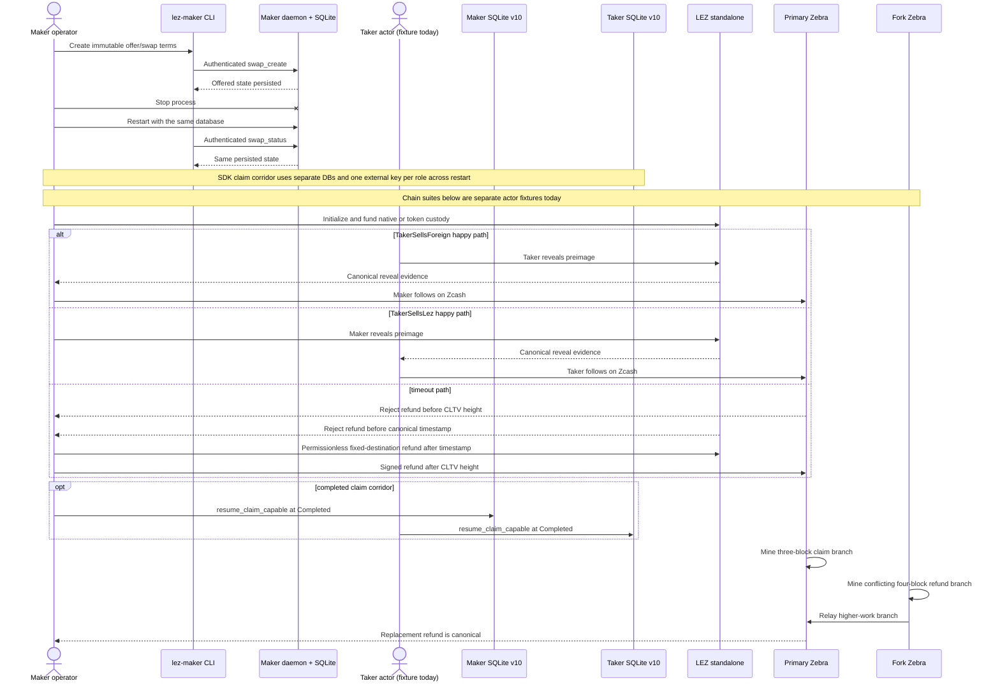

# Manual reproduction guide

Last verified: 2026-07-13

This is the living operator guide for the user-visible flows that the repository
currently proves. Update it in the same change whenever a runner, prerequisite,
actor boundary, expected result, or cleanup rule changes.

Public-testnet setup and funding prerequisites are maintained in the
[Zcash public-testnet guide](zcash-testnet-setup.md). That guide selects a
self-hosted Zebra route and Tatum's public-provider Testnet Zebrad route, but
explicitly leaves live execution pending the project-owned transparent signer,
HTTPS provider transport, and actor adapter.

## What this guide proves today

| Flow | Boundary exercised | Current limitation |
|---|---|---|
| ZEC SDK agreement/activation/locks/claims/refunds | Canonical bounded dual-signed terms, separate role stores, exact lock recovery, and direction-fixed effects reach `BothLegsLocked`; LEZ reveal then Zcash follow-up reaches `Completed`; or exact owner intents plus observer-only transitions drive LEZ then Zcash refunds to `Refunded` in both directions | These commands still use deterministic contract doubles and no RPC, node, Docker, faucet, or external resource. Claims and refunds replay through schema-v10 SQLite with atomic owner/observer journals. Main LEZ/Zebra validation adapters and official LEZ refund execution are GREEN; crash-safe context-owning SDK wiring and the composed actor/node flow remain pending, so this is not yet the manual actual-node flow |
| LEZ bridge and Zebra claim/refund contracts | The one-attempt authenticated loopback client and sidecar serve all eight bounded methods. The sidecar restores exact native, revealing-claim, and permissionless native-refund bytes and writes an unknown guard before submit. Official native escrow, claim, and refund observations decode exact-owner facts or bounded counterparty discovery; main escrow/claim/refund adapters independently validate the signed agreement, stable clock/tip, accounts, transactions, instructions, windows, deadlines, depth, and durable identity/bytes. Two real sidecar processes run concurrently with distinct maker/taker roles, keys, capabilities, stores, runtimes, and ephemeral listeners. Typed Zebra ports validate owner claims/refunds, discover counterparty spends, and discover agreement-bound funding in both directions through bounded canonical scans | These are isolated adapter and process contract tests, not yet a composed consensus proof. The runner's describe/authentication path uses no chain call; official observation uses an ephemeral loopback RPC mock returning pinned node types. Context-owning SDK wiring, actor processes, and the composed corridor remain pending. No Docker, faucet, public endpoint, or fixed port is used |
| Maker operator create/status/restart | Actual `lez-maker` process, authenticated loopback RPC, actual `lez-maker-daemon`, and persisted SQLite state | This creates negotiated swap state only; it does not run a taker or submit chain transactions |
| Zcash watcher/store reconciliation | Direction-derived maker runtime, immutable profile/output binding, schema-v10 SQLite journal/alerts plus the production role-fixed SDK recovery adapter, restart replay, both funded roles, removals, replacements, terminal outcomes, and exact replay; actual two-Zebra close/reopen/requery/removal passes | The daemon polling loop, LEZ SDK-port/refund composition, and independent maker/taker processes remain pending |
| Zcash fund/claim/refund/fork | Locally constructed NU6.2 transparent transactions submitted by fixed test actors to two actual pinned Zebra processes | The actors live in one Rust acceptance fixture; they are not yet independent maker/taker processes |
| LEZ native and token claim/refund | Real genesis actor keys submit public transactions to an in-process, ephemeral-port LEZ v0.1.2 standalone sequencer | This is a local compatibility proof, not the incompatible LEZ 0.2 public testnet |
| LEZ recursive execution costs | Exact checked guest replayed through production `V03State` transitions with nested authenticated-transfer and ATA/Token sessions | This measures deterministic local execution, not public-testnet fees or latency |
| Provisional LEZ v0.2 compatibility | Exact SPEL PR #238 and LEZ v0.2.0 compile the new standalone config, `LeeTransaction`, and a fixed `/LEE/` PDA vector | No sequencer starts; no guest/client, actor lifecycle, costs, deployment, or maintainer approval is proved |

The following are **not complete yet**: one composed LEZ↔ZEC run with
independent maker and taker processes, both ZEC trade directions through all
CLI/daemon/chain boundaries, Delivery/Chat-loss and restart at those boundaries,
recordings generated from that suite, and public-testnet deployment. Do not use
the local fixtures below as evidence for those pending M2 exit criteria.

## User and custody flow



## Fresh-checkout prerequisites

Run all commands from the repository root. A fresh checkout needs:

- Git and `rustup`, with Rust 1.96.0, `rustfmt`, and Clippy;
- Docker Engine and Docker Compose v2 for Zebra and the Risc0 guest builder;
- `curl`, `gcc`, `tar`, `sha256sum`, `awk`, `diff`, and `rg` for the LEZ runner;
- `unzip` and a working libclang C-header search path for the provisional LEZ
  v0.2 standalone dependency build;
- outbound access on the first LEZ run so the script can install pinned `rzup`
  0.5.1/Risc0 3.0.5 tools and download the checksum-verified circuits archive;
  and
- `cargo-deny` 0.19.9 and ShellCheck when reproducing all local quality gates.

Install and confirm the repository toolchain:

```sh
rustup toolchain install 1.96.0 --component rustfmt,clippy
rustc --version
cargo --version
docker version
docker compose version
```

The first two version commands must report 1.96.0. Build the workspace and run
the non-ignored acceptance tests before starting either heavy chain suite:

```sh
cargo build --locked --workspace --all-targets
cargo test --locked --workspace --all-targets
cargo fmt --all --check
cargo clippy --locked --workspace --all-targets --all-features -- -D warnings
cargo deny check advisories bans licenses sources
```

The lockfiles are part of the evidence. Do not omit `--locked` to work around a
dependency change.

## Flow 0: provisional LEZ v0.2 compile/PDA seam

Choose a fresh lowercase run ID and run:

```sh
RUN_ID=manual-lez-v02-20260712-a ./scripts/verify-lez-v02-provisional.sh
```

The runner rejects any `RUN_ID` outside
`^[a-z0-9][a-z0-9_-]*$`, fixes Cargo at two build jobs, and creates only unique
target/tool directories under `${TMPDIR:-/tmp}`. It does not invoke Docker,
create a network namespace, bind a port, start a service/sequencer, or issue a
global process/container cleanup command. The graph is large, so do not overlap
its cold build with another heavy local suite.

A fresh uncached run needs crates.io and the exact locked GitHub repositories,
including SPEL, LEZ, Logos Blockchain/circuits, Overwatch, Jellyfish, and
Risc0-related sources. It also needs `unzip` for the pinned rapidsnark archive
and functional libclang system headers for RocksDB bindgen. Cached sources and
build artifacts reduce availability risk but never relax the lockfile checks.

A pass proves all of the following and nothing broader:

- SPEL PR #238 exact head `df17acd98436be4f09c55877dae1fe2e73cbcdca`;
- official LEZ tag `v0.2.0` resolves only to
  `a58fbce2ff48c58b7bb5001b1a27e64b9596ee3a`, without a duplicate revision
  source/type identity;
- the v0.2 `SequencerConfig` and standalone entry point compile, without polling
  the future or starting the sequencer;
- the renamed `LeeTransaction` envelope compiles; and
- SPEL and LEZ derive the same fixed public `/LEE/` PDA vector; and
- the exact dependency-light SDK source produces the same metadata PDA, native
  `custody`/swap multi-seed PDA, and owner/definition ATA as pinned upstream
  `lee_core`, SPEL, and ATA-core types.

It does **not** rebuild the escrow guest, generated IDL/client, or checked ELF;
does not run maker/taker roles, custody, deadlines, costs, RPC, deployment, or
public-testnet traffic; and does not resolve upstream SPEL issues #242/#243.
PR #238 is open, unmerged, and has no submitted maintainer review. Therefore
this flow is provisional engineering evidence, not M2 completion and not final
release approval.

The exact graph also contains `hickory-proto 0.25.0-alpha.5`, affected by
`RUSTSEC-2026-0118` and `RUSTSEC-2026-0119`. Cargo-deny exceptions are confined
to this compile-only fixture: the verifier hash-locks the test, rejects DNSSEC
features, and rejects any test change that polls/starts the standalone future.
This graph is prohibited for runtime and testnet use. That next slice requires
a safe upstream graph or explicit security review and must rerun the full
advisory audit.

## External resources and flakiness

No currently executable user flow calls a public blockchain RPC or faucet. The
official LEZ v0.2 endpoint `https://testnet.lez.logos.co` is now selected and
its health/block/program methods were checked on 2026-07-12, but no flow below
submits a transaction to it yet.
The maker RPC is a locally created loopback endpoint and both Zebra RPCs use
ephemeral host-loopback mappings. The LEZ test client uses loopback, but pinned
upstream v0.1.2 binds its short-lived server to the host wildcard address on an
ephemeral port. Actor funds come from deterministic local genesis or Regtest
coinbase outputs. Therefore a public RPC outage, rate limit, faucet balance, or
testnet reorg cannot affect the flows in this guide today.

The SDK memory actor test and schema-v10 SQLite actor test in Flow 2 are the
most isolated claim lane: they start no service, make no network request, and
need no RPC, node, Docker image, faucet, or pre-funded chain account. The
SQLite case creates different temporary database paths for maker and taker.
Each role must receive the same external claim-key ID and key material again
when its database is reopened; the key is process input and is not stored in
SQLite. These tests can fail because of local build, CPU, filesystem, or disk
conditions, but not because a public endpoint is unavailable. Actual Zebra
and LEZ node claims are separate suites, and the composed actual-node corridor
remains an M2 deliverable.

Loopback is an isolation property, not a correctness claim. The chain evidence
comes from running the real pinned implementations and crossing their actual
transaction, validation, execution, and canonical-block boundaries:

- Zebra 5.2.0 validates canonical signed V5/BIP-199 bytes through its real
  mempool and consensus services, mines them into blocks, and selects a
  higher-work conflicting branch. Regtest controls mining and network
  activation; it does not simulate public peer propagation or fee pressure.
- The LEZ v0.1.2 standalone sequencer accepts the checked Risc0 guest and actor
  transactions through public RPC, executes production `V03State` transitions,
  persists canonical blocks, and exposes resulting nonce/custody/balance state.
  Standalone does not prove LEZ testnet 0.2 compatibility or public sequencing.

The required evidence ladder is exact local vectors, actual isolated consensus
nodes, a composed independent maker/taker local corridor, and then self-hosted
plus public-route testnet corridors with real funded accounts. Local on-chain
evidence cannot replace the latter two levels. Mainnet remains separately
disabled pending calibration and formal review.

Cold setup and CI do use external software-distribution services:

| Resource | Used by | Pin/integrity control | Availability/flakiness risk |
|---|---|---|---|
| Rust toolchain distribution selected by `rustup` | Fresh toolchain install and CI | Exact Rust `1.96.0`; CI toolchain action is commit-pinned | DNS/CDN/proxy outage can block cold setup; warm installed toolchains avoid it |
| crates.io index and crate downloads | Workspace build, `cargo install rzup`, cargo-deny installation | Cargo lockfiles, exact `rzup 0.5.1`, and crate checksums | Registry/CDN/rate-limit outage can block an uncached build; cached sources avoid most requests |
| GitHub Git endpoints for Logos LEZ, SPEL, Overwatch, Jellyfish, and other locked Git dependencies | First LEZ compatibility build | Cargo lockfiles resolve exact commits; source policy allowlists exact repositories | GitHub/DNS/proxy outage can block an uncached checkout; it cannot silently substitute another locked commit |
| `https://testnet.lez.logos.co` and its explorer | Future M2 v0.2 deployment/actor evidence; health audit only today | Official LEZ v0.2 endpoint; deployment must bind exact runtime, checked ELF, ProgramId, tx IDs, and blocks | Public service/rate-limit/reorg outage can make testnet evidence flaky; no SLA or self-hosted fallback is selected yet, so local standalone remains the deterministic lower lane |
| Self-host Zebra 6.0.0 on public Testnet | Selected future M2 node route; not called by current flows | Exact stable tag/release; cookie-authenticated loopback RPC; query current `consensus.next_block` | Initial sync, disk, DNS/P2P, organic reorg, and epoch activation can delay/fail a run |
| Tatum Testnet Zebrad JSON-RPC | Selected public-provider route; not called by current flows | `https://zcash-testnet-zebrad.gateway.tatum.io`; dedicated API key in sensitive `x-api-key`; require the exact actor method contract and chain/branch/genesis/stable-tip checks | Third-party authoritative node with account provisioning, quotas, outage, lag, method-policy, and provider-trust risk; HTTPS adapter and live rehearsal remain M2 work; no silent failover or submit retry |
| Community Zcash faucet or Discord support | Optional future TAZ funding | External operator; verify any returned txid independently through self-hosted Zebra | No SLA/current rate or amount; faucet may time out or be depleted and is never a required CI gate |
| Zallet v0.1.0-alpha.4 | Optional future funding wallet, never the HTLC signer | Exact alpha tag, loopback RPC, Zebra cookie; explicit transparent privacy policy | Alpha/epoch compatibility; cannot export derived transparent keys or sign arbitrary HTLC transactions |
| Docker Hub `zfnd/zebra` and `risczero/risc0-guest-builder` | Cold Zebra image build and Risc0 guest build | Zebra `5.2.0` source image and guest builder are digest-pinned | Registry outage, throttling, or authentication policy can block a cold pull; local images reduce but do not guarantee offline BuildKit resolution |
| Google Container Registry distroless image | Cold minimal Zebra image build | Exact `cc-debian13:nonroot` digest | Registry/DNS outage can block a cold pull; no moving tag is accepted |
| GitHub release asset for `logos-blockchain-circuits v0.4.2` | First LEZ run | Exact release URL plus required SHA-256 before extraction | Release/CDN outage can fail after retries; a verified run-specific cache avoids redownload |
| `rzup`-managed Risc0 release endpoint | First install of `r0vm`/`cargo-risczero` 3.0.5 | Runner checks exact tool versions and the final ELF digest/ImageID | Upstream release availability can block cold setup; keep the verified `LEZ_E2E_TOOL_DIR` cache |
| RustSec advisory database and Trivy vulnerability database | cargo-deny locally/CI; Trivy in CI | Scanner actions are commit-pinned; databases intentionally update | Network outage can prevent refresh, and a new advisory/CVE can make a previously green commit fail; this is a security signal, not a flaky test to bypass |

The local tests can still time out under severe CPU, memory, disk, or Docker
contention; this is why the heavy suites are serialized and resource-capped.
Retry only with a fresh run ID after checking the scoped logs. Do not weaken a
digest, checksum, vulnerability result, or consensus assertion to classify an
external outage as success.

Public-testnet corridor work has selected self-hosted Zebra 6.0.0 and Tatum's
documented Zebrad-powered Testnet gateway. No Zcash Foundation-operated public
Zebra JSON-RPC service exists in the reviewed primary sources. The project
transparent signer, provider HTTPS adapter, exact live method smoke, funded
LEZ/Zcash accounts, endpoint health, and clean-machine rehearsal remain. Before
that flow is called available, the guide and global README must retain
endpoint/faucet authentication, current limits, observed funding/confirmation
latency, fallback policy, health checks, and evidence retention. No public route
is required by the current local suites.

## Isolation and no-clash rules

Choose a new lowercase run ID for every attempt, for example
`manual-zebra-20260711-a`. It may contain only lowercase letters, numbers,
underscores, and hyphens.

- Never run the heavy Zebra and LEZ suites concurrently on the same host.
- Never run two LEZ suites from the same checkout concurrently: the checked
  guest ELF has a repository-relative target path. Use another checkout and
  distinct target/tool directories if parallel execution is unavoidable.
- The Zebra runner creates only `lez-atomic-swaps-${RUN_ID}`, uses ephemeral
  localhost RPC ports, and refuses to reuse an active project.
- Do not run a global Docker prune, stop, kill, or volume-removal command.
- For the strongest LEZ isolation, give every run unique
  `LEZ_E2E_TOOL_DIR`, `LEZ_METHODS_TARGET_DIR`,
  `LEZ_STANDALONE_TARGET_DIR`, and `LEZ_COST_OUTPUT_DIR` values as shown below.
  A shared completed tool cache is safe only when no other run is writing it.

### Isolated LEZ maker/taker sidecar processes

Build and run the exact locked compatibility executable contract without
Docker, a public endpoint, faucet funds, or a fixed port:

```sh
cd compat/lez-v0_1_2-sidecar
cargo build --offline --locked --bin lez-v0-1-2-sidecar
cargo test --offline --locked --test runner_process -- --nocapture
```

The test starts maker and taker binaries concurrently. Each child reads a
different 0600 signer file, capability file, runtime descriptor, and durable
state path, then publishes a distinct literal-loopback ephemeral endpoint.
Wrong capability, run ID, and role calls must fail; the correct actor can call
`lez_bridge.v1.describe_runtime`; graceful shutdown must leave a private
state file and no child process. The configured official node endpoint is an
unused loopback sentinel in this process-lifecycle test, so it does not claim
an on-chain observation. Official native observation behavior is covered
separately by the sidecar's `official_node_rpc` test against an ephemeral
loopback service returning the pinned generated RPC types.

From the repository root, reproduce the main-process agreement, claim, and
refund boundaries:

```sh
cargo test --offline --locked -p lez-bridge-adapter --test native_first_lock -- --nocapture
```

The adapter suite uses no socket, node, Docker, faucet, or public endpoint. It
must pass both signed directions, owner/observer separation, caller-owned
request IDs and windows, exact funding/preimage binding, account-state
eligibility, claim/refund prepare/exact/discovery/submit conversion, stable
clock and exact millisecond deadline checks, complete primitive mutation
rejection, and uncertain-submit handling. This proves fail-closed main-process
conversion only; it does not prove the composed SDK actor flow.

From `compat/lez-v0_1_2-sidecar`, reproduce the exact official native-refund
planner, node observation, authenticated server, and restart gates:

```sh
cargo test --offline --locked --all-targets -- --nocapture
```

All 33 tests must pass. This invokes no Docker, faucet, public endpoint, or fixed
port. The official-node tests use an ephemeral loopback mock that returns the
pinned generated LEZ RPC types; they prove source-correct conversion and
fail-closed scanning, not public-testnet consensus.

From the repository root, reproduce the agreement-bound Zebra funding/claim/
refund adapter boundary:

```sh
cargo test --offline --locked -p zebra-node-adapter --test first_lock -- --nocapture
```

The 15 integration checks, together with the crate's 37 unit checks in a full
crate test, cover both funding directions, stable-tip block/mempool discovery,
exact V5 bytes and output policy, absence/ambiguity/horizon behavior, prior
removal/replacement reconciliation, claims, and refunds. They use a bounded
ephemeral loopback RPC fixture rather than an actual Zebra process; the separate
isolated Zebra suite remains the consensus lane.

For a direct manual launch, create the parent directory for the state file and
supply the six required flags shown by the test fixture:
`--node-endpoint`, `--run-id`, `--runtime-file`,
`--capability-file`, `--signer-key-file`, and `--state-file`.
Secret files must be regular non-symlinks with no group/other permission bits;
the signer file is exactly 64 lowercase hexadecimal characters. Omit the
test-only `--shutdown-on-stdin` flag so the process waits for Ctrl-C.

## Flow 1: maker operator CLI and daemon restart

The executable acceptance fixture is the quickest exact reproduction:

```sh
cargo test --locked -p lez-maker-node --test operator_journey -- --nocapture
```

It starts the real daemon on an ephemeral loopback port, creates BTC, reverse
ZEC, and supported LEZ-first XMR swaps through the real CLI, rejects an
unsupported XMR direction and a wrong capability, kills the daemon, restarts it
on a new port with the same SQLite database, and reads the persisted swaps.

To repeat the operator steps manually, first build the two binaries:

```sh
cargo build --locked -p lez-maker-node --bins
```

In terminal 1, use an isolated directory and a capability of at least 24 bytes:

```sh
export RUN_ID=manual-operator-20260711-a
export RUN_DIR="${TMPDIR:-/tmp}/lez-atomic-swaps-${RUN_ID}"
export LEZ_MAKER_RPC_TOKEN=manual-maker-owner-capability-20260711-a
mkdir -p "$RUN_DIR"
target/debug/lez-maker-daemon \
  --listen 127.0.0.1:0 \
  --database "$RUN_DIR/maker.sqlite3" \
  --ready-file "$RUN_DIR/maker.ready"
```

After the ready file appears, use the same environment in terminal 2:

```sh
export RUN_ID=manual-operator-20260711-a
export RUN_DIR="${TMPDIR:-/tmp}/lez-atomic-swaps-${RUN_ID}"
export LEZ_MAKER_RPC_TOKEN=manual-maker-owner-capability-20260711-a
export MAKER_RPC_URL="$(cat "$RUN_DIR/maker.ready")"

target/debug/lez-maker --rpc-url "$MAKER_RPC_URL" create-swap \
  --id manual-zec-reverse-1 \
  --pair zcash \
  --direction taker-sells-lez \
  --confirmations 2 \
  --maker-refund-at 100 \
  --taker-refund-at 120 \
  --earlier-refund-latest 1000 \
  --later-refund-earliest 1200 \
  --required-margin 100

target/debug/lez-maker --rpc-url "$MAKER_RPC_URL" status \
  --id manual-zec-reverse-1
```

Each successful command prints one JSON object. It must contain
`"id":"manual-zec-reverse-1"`, `"pair":"Zcash"`,
`"direction":"TakerSellsLez"`, and `"phase":"Offered"`.

The other currently accepted operator constructions use these exact argument
shapes:

```sh
target/debug/lez-maker --rpc-url "$MAKER_RPC_URL" create-swap \
  --id manual-btc-forward-1 \
  --pair bitcoin \
  --direction taker-sells-foreign \
  --confirmations 2 \
  --maker-refund-at 100 \
  --taker-refund-at 120 \
  --earlier-refund-latest 1000 \
  --later-refund-earliest 1200 \
  --required-margin 100

target/debug/lez-maker --rpc-url "$MAKER_RPC_URL" create-swap \
  --id manual-xmr-lez-first-1 \
  --pair monero \
  --direction taker-sells-lez \
  --confirmations 2 \
  --taker-refund-at 120 \
  --xmr-refund-event-confirmations 2
```

Both print `"phase":"Offered"`. XMR in the opposite direction is deliberately
rejected, and XMR recovery is canonical-LEZ-refund-event-gated rather than
configured with a fabricated Monero deadline.

To prove restart persistence, stop terminal 1 with Ctrl-C and start the same
daemon command again with the same database and ready file. Refresh the URL and
query status again:

```sh
export MAKER_RPC_URL="$(cat "$RUN_DIR/maker.ready")"
target/debug/lez-maker --rpc-url "$MAKER_RPC_URL" status \
  --id manual-zec-reverse-1
```

The same JSON view must be returned after refreshing the daemon's ephemeral
endpoint. The database and readiness file are the run-specific manual-flow
artifacts; remove that specific `$RUN_DIR` only after the daemon has stopped
and the evidence is no longer needed.

## Flow 2: Zcash SDK, reconciliation, then actor claim/refund/fork

Build the two libraries, then reproduce the proven independent-actor claim
corridor directly:

```sh
cargo build --locked -p lez-zec-swap-sdk -p lez-swap-store
cargo test --locked -p lez-zec-swap-sdk --test sdk_lifecycle \
  independent_actors_complete_lez_then_zcash_claims_in_both_directions \
  -- --exact --nocapture
cargo test --locked -p lez-swap-store --test zec_sdk_recovery \
  schema_v9_claim_journal_completes_and_reopens_independent_actors_in_both_directions \
  -- --exact --nocapture
```

The expected result from each focused command is one passing test. Both cover
`TakerSellsForeign` and `TakerSellsLez`. The first claimant always submits the
LEZ reveal; only after both role-local actors observe its canonical evidence
does the other actor recover the preimage internally and submit the Zcash
follow-up. Both actors finish at revision 4 and a claim-capable restart returns
`Completed`.

The SQLite test creates independent temporary maker and taker database files.
It passes the same deterministic external test key ID and material to each
role's original open and reopen. A real caller must likewise provide the same
external key for a role across restart; losing or changing it fails closed.
The key is never persisted. Protected material and exact claim submissions are
XChaCha20-Poly1305 ciphertext under HKDF-derived, context-bound keys. The test
scans the database and WAL bytes before and after reopen and rejects plaintext
preimages or either exact secret-bearing claim transaction.

Run the broader agreement, lifecycle, and store regressions afterward:

```sh
cargo test --locked -p lez-zec-swap-sdk --test agreement_v1_cross_binding -- --nocapture
cargo test --locked -p lez-zec-swap-sdk --test sdk_lifecycle -- --nocapture
cargo test --locked -p lez-swap-store --test zec_sdk_recovery -- --nocapture
```

The first command runs 17 cases over the canonical agreement: bounded
exact wire decoding, both low-S signatures, every signed-field mutation, both
directions, deterministic-local execution terms, fail-closed public deployment,
actual LEZ/ZEC deadlines, role/digest binding, agreement-derived
fees/destinations/expiry/funding requests, exact native/token PDA/ATA accounts,
accepted-at resume, and redacted diagnostics. The second runs 30 integrated
cases in which independent maker and taker SDK instances with fixed roles
receive untrusted bytes, validate the concrete record, persist separate accepted
envelopes before activation, and resume the original wire after transcript
expiry. It also proves exact retry idempotence, changed same-key conflict,
wrong-role/revision/wire/swap-ID rejection, redacted active diagnostics, and
transport-free active types. Its primitive-record case rejects
future/substituted/corrupt recovery fields.
Package rustdoc additionally compile-fails any
attempt to obtain raw LEZ, Zcash, or recovery-store handles from an active swap.

The chain adapters are deterministic contract doubles; these commands require
no RPC, node, Docker, faucet, or external resource. They do not prove real
Logos Delivery/Chat, official-wire LEZ/Zebra lifecycle effects, or a
process-level maker/taker E2E. The claim-capable activation and schema-v10 store
atomically bind the direction-derived first claimant agreement to encrypted
material, retain exact claim submissions only in protected envelopes, and
separate owner and observer transition journals. The SDK first-lock cases
additionally prove exact
role/direction-bound bytes are staged before a node call, changed replay
conflicts, unstable observations submit nothing, restart observes before exact
rebroadcast, and LEZ initialization must be confirmed before its separately
durable fund transaction is submitted. Two projection cases prove invalid
evidence and a failed commit leave the coordinator `Offered`, an unknown
successful commit is accepted only after an exact predecessor-slot probe, and
restart replays the durable transition to `TakerLockConfirmed`. Maker-specific
cases prove that only the agreement-derived node port is queried, a primitive
forward Zcash assertion is rejected, complete canonical output evidence survives
record revalidation against the HTLC output binding, non-confirmed
outcomes write nothing, the maker never owns a taker intent, persisted adapter
assertions remain non-authorizing, and restart uses the maker-only store. The
same SDK suite then drives the maker happy path in both signed directions:
Zcash taker funding selects LEZ initialize/fund, while LEZ taker funding selects
Zcash fund. Every drive performs a fresh eligibility poll, the exact plan is
durable before submission, confirmed Maker evidence advances to
`BothLegsLocked`, and restart reconstructs that phase. A separate-role case then
has the taker observe the maker lock through the agreement-selected port;
distinct maker and taker stores both reach and replay `BothLegsLocked` in both
directions. The claim case continues from that exact actor boundary: LEZ reveal
precedes Zcash follow-up, the follower receives no caller-supplied secret, and
both independent journals replay `Completed` through `resume_claim_capable`.
The expected remote submission ID is adapter-asserted in this fixture, so a
production canonical adapter remains required. A stale second maker
instance catches up from the durable transition without another submission.
Projection fault injection leaves the maker intent open and in-memory phase
unchanged; an unknown successful commit is adopted only after exact probe.
Stable absence in either direction creates no maker intent and submits nothing.
Accept-then-fail fixtures cover LEZ initialize, LEZ fund, and Zcash fund: each
restart observes the accepted step before proceeding and submission counts do
not increase. A taker removal after LEZ initialization holds the maker in
`Offered`, submits no fund through stable absence, and resumes only after a
validated replacement.
The store command runs
16 production-adapter cases over real temporary
schema-v10 databases: exact replay/conflict, same-ID role isolation, retained
closed intent, taker and maker trigger-injected rollback,
future/malformed/torn/orphan/holey-state rejection, poison-append rejection,
exact and historical maker replay, stale-instance catch-up, and four-event
close/reopen resume. The maker actor flow is canonical observation at revision
1, atomic replacement at revision 2, same-inclusion depth update at revision 3,
and affirmative removal at revision 4. Replacement halves share one stable
tip; unchanged polls write nothing; changed inclusion without replacement and
stale removal of an old inclusion fail before append. A fresh eligibility call
after close/reopen replays and re-queries the exact Zcash or LEZ head, writes
no duplicate, returns the durable revision, and leaves `next_action` at
`Wait`; reverse replacement heads are eligible after restart, removed heads
are not, and local Pending is depth-eligible. The public Pending/Safe typed
awaiting-finality policy is unit-tested only because public agreement activation
remains fail-closed pending reviewed deployment. Stable absence and unstable polls return no
eligibility, write nothing, and preserve the revision. Its schema-v10 cases
prove both directions stage at revision 1, commit an intervening canonical
depth/finality update at revision 2 without another maker submission, then
close the intent and maker transition at revision 3 before reopen at
`BothLegsLocked`. A taker-local observed-maker transition independently replays
the taker from revision 1 to `BothLegsLocked` at revision 2 in both directions;
malformed and future payloads fail closed. The claim case adds protected
material, protected exact-payload intent, owned/observed transitions, unified
revision continuity, raw DB/WAL secret rejection, and independent close/reopen
at `Completed`. Production chain RPC claim adapters, actual-node
transport/reorg repetition, refunds, and independent actor processes are
remaining work.

Before starting Zebra, reproduce spend recognition independently from SDK
construction policy:

```sh
cargo test --locked -p lez-zec-swap-sdk --test zcash_spend_observations -- --nocapture
```

The eight cases enforce Zebra's exact P2SH/CLTV consensus flags, every defined
ZIP-244 sighash mode, consensus-valid high-S and nonminimal/semantic stack
forms, raw/script bounds, exact decoding, stable inclusion, and preservation of
outputs, lock time, expiry, sequence, role, and claim preimage. A separate
policy report flags any deviation from the SDK's canonical low-S, minimal,
`SIGHASH_ALL`, exact destination/fee/expiry shape without discarding the valid
claim. This command uses no RPC, node, Docker, faucet, or external resource.
It does not yet prove agreement-derived funding provenance, multi-input
non-`ANYONECANPAY` prevout context, or durable spend reorg tracking.

First reproduce the lightweight runtime/store user-role semantics without
Docker:

```sh
cargo test --locked -p lez-maker-node --test zec_runtime_reconciliation -- --nocapture
cargo test --locked -p lez-swap-store --test zec_event_journal -- --nocapture
```

The first suite must pass both ZEC-funded roles, restart replay, exact-head
validation, pre-dependent replacement, same-transaction re-mining,
post-dependent `ReplacementConflict`, and completed/refunded
`TerminalReorgDetected`. It also proves that missing legacy bindings, mismatched
profile confirmation policies, and a mismatched output envelope fail before any
revision or journal mutation. The second suite proves schema-v3 migration,
atomic swap+binding and event+aggregate rollback, immutable rebinding, lower
commit/probe enforcement, and restart-safe loading. These runtime/store tests do
not substitute for the actual-node command below.

Reproduce the owner-facing incident path through the real authenticated daemon
and CLI with:

```sh
cargo test --locked -p lez-maker-node --test operator_journey \
  owner_lists_and_acknowledges_durable_alert_across_daemon_restart \
  -- --exact --nocapture
```

That journey creates a genuine post-dependent Zcash replacement conflict through
the maker runtime, starts the daemon on an ephemeral loopback port, and uses the
owner CLI to verify the attention summary, list the durable alert, restart the
daemon, and acknowledge the same alert. A wrong bearer token must be rejected.
For an equivalent already-running daemon, the owner commands are:

```sh
target/debug/lez-maker --rpc-url "$RPC_URL" --rpc-token "$RPC_TOKEN" \
  status --id "$SWAP_ID"
target/debug/lez-maker --rpc-url "$RPC_URL" --rpc-token "$RPC_TOKEN" \
  alerts --id "$SWAP_ID"
target/debug/lez-maker --rpc-url "$RPC_URL" --rpc-token "$RPC_TOKEN" \
  acknowledge-alert --id "$SWAP_ID" --alert "$ALERT_SEQUENCE"
target/debug/lez-maker --rpc-url "$RPC_URL" --rpc-token "$RPC_TOKEN" \
  alerts --id "$SWAP_ID" --all
```

Acknowledgment records operator receipt only: it neither changes the swap phase
nor makes an unsafe claim/refund eligible. There is intentionally no production
RPC that injects watcher events; the automated journey seeds the conflict through
the same typed maker runtime boundary used by the watcher.

Use a fresh run ID and let the repository runner own the complete Docker
lifecycle:

```sh
RUN_ID=manual-zebra-20260711-a ./scripts/run-zebra-e2e.sh
```

The runner builds a unique digest-pinned Zebra image, starts two disconnected
NU6.2 Regtest nodes with independent ephemeral state and host ports, and exports
their RPC URLs plus an absolute run-scoped maker database only to the ignored
Rust fixtures. It refuses a pre-existing manifest, database, WAL, or SHM before
Compose starts. The maker runtime fixture runs first and:

1. constructs and broadcasts canonical BIP-199 funding to the primary node;
2. commits its immutable binding, event, and aggregate revision to schema-v10
   SQLite, closes the store, reopens it, replays the journal, and proves an
   unchanged fresh RPC requery creates no duplicate;
3. mines a longer independent fork without the funding transaction, relays it
   to the primary, and validates affirmative changed-height removal evidence;
4. commits the removal back to `Offered`, closes/reopens again, and proves an
   exact unknown-outcome retry keeps one binding and exactly two journal rows.

The existing actor/consensus fixture then:

1. matures four transparent actor UTXOs and validates the fetched prevouts;
2. rejects a funding transaction whose actor signature was mutated;
3. funds and claims one exact BIP-199 P2SH output with the claimant key and
   preimage, while rejecting a mutated claimant signature; before spending,
   stable RPC queries bind Regtest genesis, NU6.2, raw bytes, canonical block,
   exact outpoint/value/scripts, and derived depth into typed source evidence;
4. funds a second output, rejects its refund before CLTV, then confirms the
   funder's refund at the required height;
5. funds two more outputs for concurrent claim/refund lifecycles; and
6. gives both nodes an identical prefix, mines a three-block claim branch on the
   primary and a conflicting four-block refund branch on the fork node, relays
   the higher-work branch, and verifies the old branch is detached and the
   replacement refund is canonical with at least four confirmations.

Success includes both test results and an actor evidence line containing the
actual transaction IDs and serialized-hex sizes:

```text
test canonical_funding_is_requeried_across_store_restart_and_real_removal ... ok
test real_actor_keys_fund_claim_and_refund_through_zebra_consensus ... ok
Zebra accepted actor claim ... and refund ...
```

The EXIT trap stops only `lez-atomic-swaps-${RUN_ID}`, removes its volumes and
the image created by that run, and leaves `.e2e/${RUN_ID}/run.env` as the
endpoint/project/database manifest and the SQLite evidence beside it. Reusing
that run ID is deliberately rejected. It never prunes unrelated resources.

## Flow 3: LEZ guest deployment and native/token actor lifecycles

This is the exact end-to-end local compatibility command. Use unique paths and
do not run it beside another heavy suite:

```sh
RUN_ID=manual-lez-20260711-a \
LEZ_E2E_TOOL_DIR=/tmp/lez-risc0-manual-lez-20260711-a \
LEZ_METHODS_TARGET_DIR=/tmp/lez-methods-manual-lez-20260711-a \
LEZ_STANDALONE_TARGET_DIR=/tmp/lez-standalone-manual-lez-20260711-a \
LEZ_COST_OUTPUT_DIR=/tmp/lez-costs-manual-lez-20260711-a \
./scripts/run-lez-standalone-e2e.sh
```

The runner checks the exact SPEL/LEZ commits and dependency-feature exposure,
builds the Risc0 3.0.5 guest, checks the ELF digest and ImageID, deploys it
through public RPC into a canonical standalone block, and exercises actual
funded genesis actors.

The native flow is `initialize → fund → claim` and an independent
`initialize → fund → refund` after canonical time. It rejects a wrong preimage,
a valid depositor key used in the claimant role, and an early permissionless
refund without changing the signer nonce or custody.

The token flow creates two official fungible definitions and the actors'
definition-bound associated token accounts (ATAs). Each escrow custody is the
official `ATA(metadata, definition)`. One definition is claimed and the other is
refunded. The suite rejects a wrong preimage, wrong actor role,
cross-definition claimant ATA, early refund, and cross-definition refund
destination, while checking exact holdings and total-supply conservation.

Success ends with all of the following evidence:

```text
proved LEZ cf3639d8252040d13b3d4e933feb19b42c76e14a deployment plus native and two-definition token actor lifecycles
LEZ standalone guest native/token lifecycle proof passed: elf_sha256=a324355c6417f6ac7265ab8ba880287d0976e8c27a672917d293bddd80be7006 image_id=c14c978abbaedeffb54c71aa6a96275d1fdb66fcf79f7343bf6bf7aee04f4483
LEZ native/token recursive cost evidence passed: /tmp/lez-costs-manual-lez-20260711-a/generated.json
```

The generated JSON must be byte-identical to
[`docs/evidence/lez-v0.1.2-escrow-costs.json`](evidence/lez-v0.1.2-escrow-costs.json).
That comparison checks operation order, recursive session topology, segments,
cycle accounting, allocated totals, and per-operation user-cycle budgets.

The sequencer uses an ephemeral port and temporary state and stops when the test
ends. The unique tool, build, and cost directories remain as reproducibility
caches/evidence. Remove only the directories belonging to this run, only after
no process is using them; never delete another run's shared cache.

## Troubleshooting

- **`RUN_ID` is rejected or an active project already exists:** choose another
  lowercase unique ID. Do not take over the reported project; it can belong to
  another operator.
- **A Zebra RPC is not ready within 60 seconds:** the runner prints logs for
  only its two services before scoped cleanup. Check Docker memory/CPU
  availability and the emitted service log, then retry with a new run ID.
- **Docker reports a fixed-port conflict:** the checked Compose file publishes
  `127.0.0.1::18232` ephemerally. Run
  `./scripts/check-docker-isolation.sh`; do not edit in a fixed host port.
- **The LEZ runner cannot find `cargo-risczero` or `r0vm`:** keep its unique tool
  directory intact and rerun after restoring outbound access. The runner itself
  installs and version-checks both tools; a system-wide substitute is not
  accepted.
- **Guest ELF digest or ImageID drift:** stop. Do not update the expected value
  just to make the run green. Compare the lockfiles and
  [`artifact-manifest.toml`](../compat/spel-zec-escrow/methods/guest/artifact-manifest.toml)
  with the reviewed pins.
- **Cost evidence differs:** inspect the generated `cost.log` and
  `generated.json`. Setup transactions and mandatory Clock execution must not
  enter the measured operation list. Treat unexplained cycle or topology drift
  as a code/pin change requiring review.
- **The operator CLI receives HTTP 401:** terminal 1 and terminal 2 are not using
  the same `LEZ_MAKER_RPC_TOKEN`. Do not place a real credential in source,
  shell history, or committed files.
- **An old maker URL fails after restart:** reread `maker.ready`; the daemon
  intentionally binds a new ephemeral loopback port.

## Keeping this guide current

For any flow change, verify the command from a clean checkout or clean target,
update the status table and Mermaid flow, replace expected evidence only after a
passing run, and keep pending actor/public-testnet qualifications explicit.
Milestone evidence and tags remain governed by the
[living implementation plan](implementation-plan.md); this guide never turns a
partial fixture into a completed milestone by itself.
