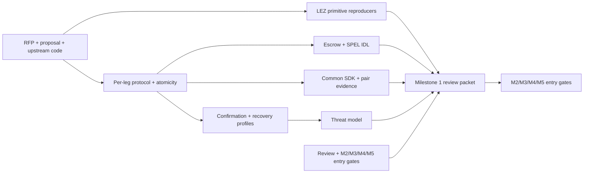

# Milestone 1 review packet

Status: review complete. The authoritative checklist and dates live in
[the implementation plan](../implementation-plan.md).

> Submission provenance: this packet and its support checks were imported from
> the accepted `m1-complete.1` checkpoint (`96b7b229557e5084857e05bc0c34c03f40c73b66`).
> The complete historical Rust workspace and CI remain at that checkpoint; this
> focused branch carries the review packet rather than a partial old workspace.

This directory holds the reviewable design artefacts:

- [threat model](threat-model.md);
- [per-leg protocol and atomicity design](protocol-design.md);
- [SDK trait surface](sdk-trait-surface.md);
- [LEZ escrow and SPEL IDL sketch](lez-escrow-design.md); and
- [confirmation and recovery parameter profiles](parameter-profiles.md);
- [Milestone 1 review and downstream entry gates](review.md); and
- [LEZ primitive verification](lez-primitive-verification.md).

An artefact marked draft does not satisfy its milestone exit gate. Decisions
that have been accepted are recorded separately in the
[ADR log](../architecture/README.md).

