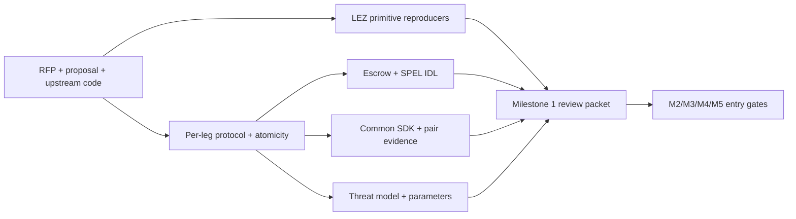

# Milestone 1 review packet

Status: in progress. The authoritative checklist and dates live in
[the implementation plan](../implementation-plan.md).

This directory holds the reviewable design artefacts:

- [threat model](threat-model.md);
- [SDK trait surface](sdk-trait-surface.md);
- [LEZ escrow and SPEL IDL sketch](lez-escrow-design.md); and
- [LEZ primitive verification](lez-primitive-verification.md).

An artefact marked draft does not satisfy its milestone exit gate. Decisions
that have been accepted are recorded separately in the
[ADR log](../architecture/README.md).

