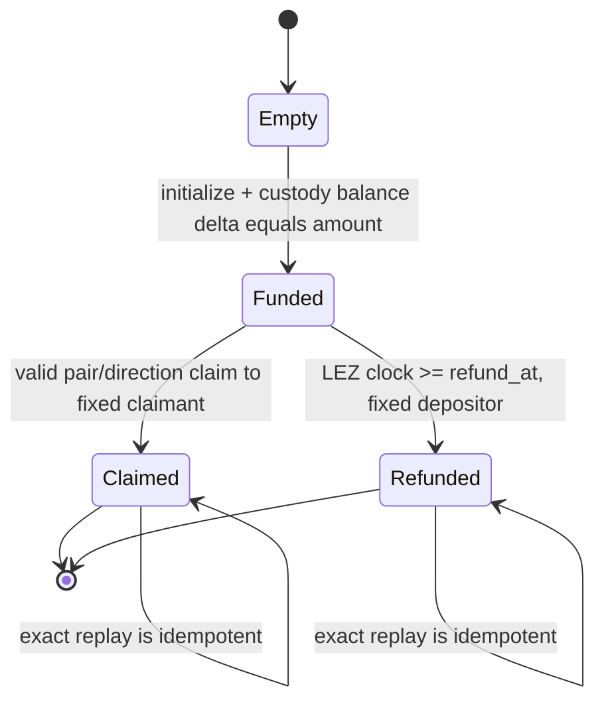

# LEZ escrow and SPEL IDL design

Status: review candidate; implementation and measured compute units are Milestone
2–4 gates — 2026-07-11


## Source-backed account model

The design targets `logos-blockchain/logos-execution-zone` commit
`cac4921581b37e85ae25e940f3a62412cd22308e`, not the older `nssa` paths in
current SPEL documentation.

Each swap has a public metadata PDA derived from
`SHA256("/LEZ/SwapEscrow/v1" || swap_id || terms_hash)`. The escrow program owns
this account and stores:

- schema/protocol version, swap ID and immutable signed-terms hash;
- pair, direction, LEZ asset kind, exact `u128` amount and network IDs;
- depositor and claimant destination account IDs;
- native-vault PDA or custom-token definition plus ATA address;
- claim mode and its SHA-256/adaptor-point commitment;
- per-swap witnessed-claim authority where the direction requires it;
- LEZ timestamp refund deadline and foreign-lock commitment digest; and
- `Empty | Funded | Claimed | Refunded`, plus terminal transaction hash.

Custody is separate because LEZ debits are controlled by the account's owning
program:

- native LEZ uses a public PDA derived under the escrow program but claimed by
  `authenticated_transfer`, with the escrow PDA seed delegated on chained
  release calls; and
- a custom fungible token uses the required associated token account derived as
  `ATA(metadata_pda, token_definition)`. The metadata PDA is the logical owner
  bound into ATA derivation and supplies delegated owner authorization, while the
  holding account's `program_owner` is the token program. The ATA program then
  delegates the ATA PDA spend to the token program. The definition and decoded
  `TokenHolding::Fungible` ID must match the signed terms.

Metadata never substitutes for the custody account, and one custody account can
never serve two swaps. NFTs, private custody accounts, arbitrary recipient
changes, partial claims, and fee deductions from principal are rejected in v1.

## State and atomic transitions



`initialize` creates/claims the metadata PDA and custody path in one LEZ state
transition, verifies the before/after custody delta is exactly `amount`, and
sets `Funded`. Claim/refund update metadata and transfer the full balance in the
same transition. Any failure rolls back both changes. Terminal instructions are
single-use; a byte-identical replay may report the existing terminal result but
cannot move funds again.

Refund is permissionless after the deadline and always pays the immutable
depositor destination. Requiring the depositor to remain online would violate
post-lock chain-only recovery. Claim is likewise pinned to its negotiated
destination.

## Claim encoding by pair and direction

| Pair/direction | LEZ claim condition | Evidence made available to the other leg |
|---|---|---|
| BTC, taker sells BTC | `claim_witnessed`, authorized by an isolated per-swap taker claim account | The taker's accepted LEZ BIP-340 authorization signature lets the maker extract `t` and claim BTC |
| BTC, taker sells LEZ | `claim_adaptor_secret(t)` and `xonly(tG) == adaptor_point` using the reviewed secp256k1 library | The taker's BTC key-path signature reveals `t`; maker supplies it to LEZ |
| XMR, taker sells LEZ only | `claim_witnessed`, authorized by an isolated per-swap maker claim account bound to the reviewed DLEQ transcript | The accepted LEZ signature reveals the share bound to the Monero spend-key recovery path |
| ZEC, either direction | `claim_hashlock(preimage)` and `SHA256(preimage) == digest`; the fixed LEZ recipient is the revealing claimant | The canonical LEZ claim reveals the preimage used by the ZEC recipient |

For witnessed claims, setup freezes the exact public transaction message and
account nonce before either lock, and the authority is never reused. The guest
checks the authority flag; LEZ state validation checks the BIP-340 signature;
the included public transaction retains the witness bytes used for extraction.
The pinned semantic verifier is a release gate for that final property.

The XMR cross-curve DLEQ is verified with the reference construction before
funding and its transcript hash is stored in metadata. The guest does not
reimplement DLEQ arithmetic. XMR-first remains unsupported.

## Instruction and IDL sketch

This is the compatibility target for generated SPEL IDL, not hand-maintained
wire JSON:

```text
Instruction =
  Initialize { terms: EscrowTerms }
  ClaimHashlock { swap_id: Bytes32, preimage: Bytes32 }
  ClaimAdaptorSecret { swap_id: Bytes32, secret: Scalar32 }
  ClaimWitnessed { swap_id: Bytes32 }
  Refund { swap_id: Bytes32 }

EscrowTerms = {
  version, swap_id, terms_hash, pair, direction,
  asset: Native | CustomFungible { definition_id },
  amount_u128, depositor, claimant, custody_account,
  claim: Hashlock { digest } |
         AdaptorSecret { xonly_point } |
         Witnessed { authority, transcript_hash },
  refund_at_timestamp, foreign_lock_digest
}

Accounts = {
  metadata_pda, custody, depositor_source_or_destination,
  claimant_destination, optional_token_definition, lez_clock
}
```

Generated IDL must expose `EscrowTerms`, `Asset`, `Pair`, `Direction`,
`ClaimMode`, `EscrowStatus`, all account mutability/authorization constraints,
and error codes. CI compares golden IDL, compiles a generated client, and runs
native/custom-token initialize/claim/refund boundary vectors.

## Validity windows and failure rules

LEZ refund uses the clock timestamp account and `clock >= refund_at`; transaction
validity windows are defense in depth, not the source of escrow entitlement.
Claim transactions end at the exclusive refund boundary. Refund transactions
start at that same inclusive boundary, matching pinned `[from,to)` semantics.
Both builders reserve sequencer-inclusion slack rather than submitting at the
last possible instant.

Initialization rejects an occupied metadata PDA, zero amount, unsupported
pair/direction/mode, unexpected program owner, wrong PDA/ATA derivation, wrong
token definition, wrong balance delta, unsafe deadline, mutable destination, or
terms-hash mismatch. Claim/refund reject wrong status, account substitution,
malformed/non-canonical evidence, arithmetic overflow, and any custody balance
other than the committed amount.

## Compatibility and implementation gates

SPEL v0.5 documentation and current LEZ paths are not yet a proven compatibility
set. Milestone 2 begins with a minimal generated program and golden IDL compiled
against the pinned LEZ commit. The first RED tests cover PDA/ATA substitution,
exact balance conservation, claim/refund boundary separation, terminal replay,
and both native/custom custody paths. Deployment does not proceed until those
tests run against a standalone sequencer and compute units are recorded against
the named LEZ testnet 0.2 release.
