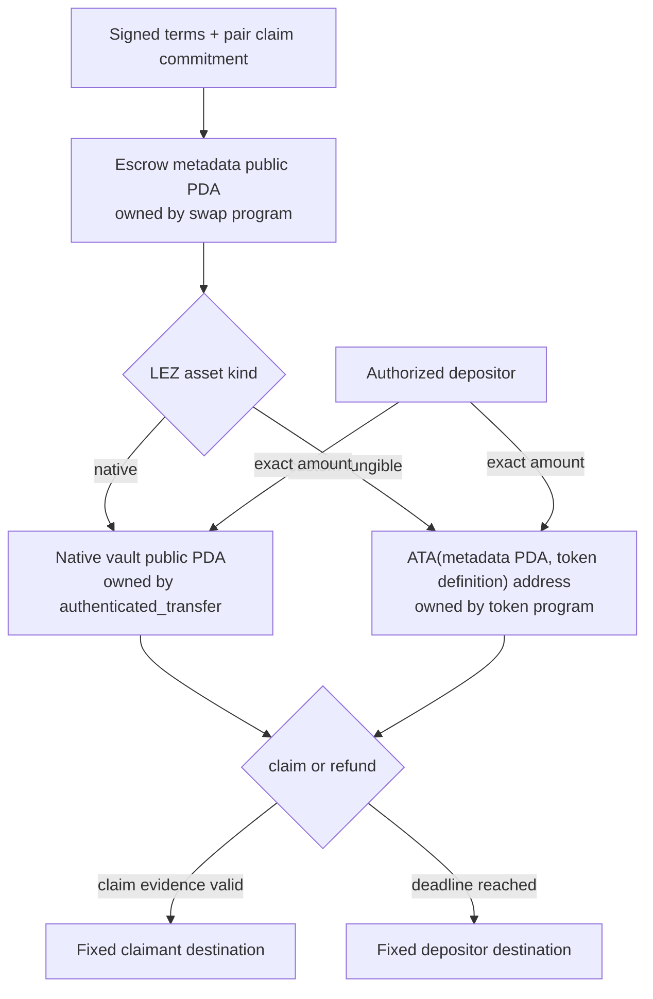
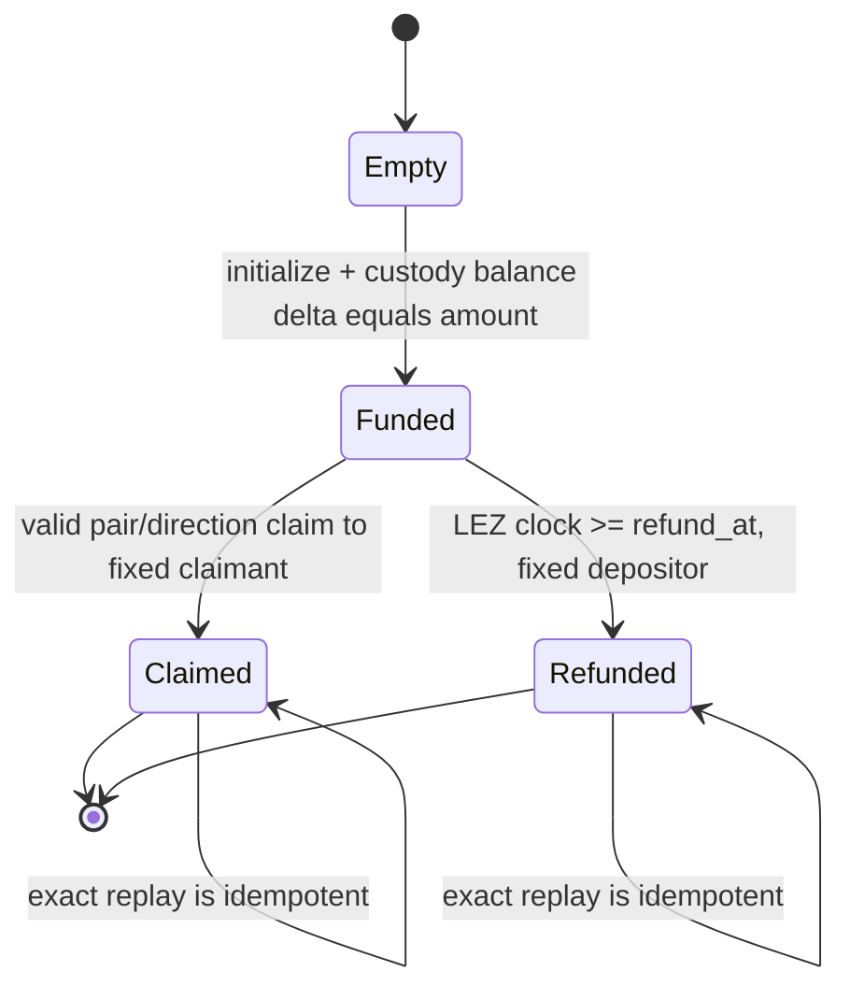

# LEZ escrow and SPEL IDL design

Status: M2 source-correct custody and local v0.2 deployment proven; BTC claim
authority superseded for M3 entry by ADR 0029 — 2026-07-14



## Source-backed account model

The historical source proof targeted
`logos-blockchain/logos-execution-zone` commit
`cac4921581b37e85ae25e940f3a62412cd22308e`, not the older `nssa` paths in
SPEL documentation. M2 then deployed the v0.2 target at
`a58fbce2ff48c58b7bb5001b1a27e64b9596ee3a`. Because BTC adaptor extraction
depends on exact accepted signature bytes, M3 must rerun the transaction-equality
and byte-preservation reproducer against that exact v0.2 target before funding.

Each swap has a public metadata PDA derived by the generated SPEL client from
the escrow program ID and the exact 32-byte `swap_id`. The checked guest declares
this as `pda = arg("swap_id")`; it stores `terms_hash` inside the metadata and
validates it on later instructions, but does not include `terms_hash` in the PDA
seed. This avoids a circular dependency when the canonical agreement itself
commits to the metadata account. The exact outer PDA domain is versioned by LEZ:
the proven v0.1.2 lane uses `/NSSA/`, while the required v0.2 port must derive
the same program/seed account under `/LEE/`. The escrow program owns this
account and stores:

- schema/protocol version, swap ID and immutable signed-terms hash;
- pair, direction, LEZ asset kind, exact `u128` amount and network IDs;
- depositor and claimant destination account IDs;
- native-vault PDA or custom-token definition plus ATA address;
- claim mode and its SHA-256/adaptor-point commitment;
- pair-specific witnessed-claim authority; BTC uses the distinct two-party
  aggregate authority and exact-message commitment defined by ADR 0029;
- LEZ timestamp refund deadline and foreign-lock commitment digest; and
- `Empty | Funded | Claimed | Refunded`, plus terminal transaction hash.

Custody is separate because LEZ debits are controlled by the account's owning
program:

- native LEZ uses the separate public `pda = ["custody", swap_id]` account
  derived under the escrow program and then claimed by
  `authenticated_transfer`, with the escrow PDA seed delegated on chained
  release calls; and
- a custom fungible token uses the required associated token account derived as
  `ATA(metadata_pda, token_definition)`. The metadata PDA is the logical owner
  bound into ATA derivation and supplies delegated owner authorization, while the
  holding account's `program_owner` is the token program. The ATA program then
  delegates the ATA PDA spend to the token program. The definition and decoded
  `TokenHolding::Fungible` ID must match the signed terms.

Metadata never substitutes for the custody account, and one custody account can
never serve two swaps. NFTs, private custody accounts, arbitrary recipient
changes, partial claims, and fee deductions from principal are rejected in v1.

## State and atomic transitions



`initialize` creates/claims the metadata PDA and custody path in one LEZ state
transition, verifies the before/after custody delta is exactly `amount`, and
sets `Funded`. Claim/refund update metadata and transfer the full balance in the
same transition. Any failure rolls back both changes. Terminal instructions are
single-use; a byte-identical replay may report the existing terminal result but
cannot move funds again.

Refund is permissionless after the deadline and always pays the immutable
depositor destination. Requiring the depositor to remain online would violate
post-lock chain-only recovery. Claim is likewise pinned to its negotiated
destination.

## Claim encoding by pair and direction

| Pair/direction | LEZ claim condition | Evidence made available to the other leg |
|---|---|---|
| BTC, taker sells BTC | `claim_witnessed`, authorized only by a distinct two-party aggregate key bound to the exact LEZ claim message and adaptor session | The taker adapts the aggregate LEZ pre-signature; its finalized BIP-340 signature lets the maker extract `t` and adapt the BTC key-path claim |
| BTC, taker sells LEZ | `claim_witnessed`, authorized only by a second distinct two-party aggregate key bound to the exact LEZ claim message and adaptor session | The taker's canonical BTC key-path signature reveals `t`; the maker uses it to adapt the already verified aggregate LEZ pre-signature |
| XMR, taker sells LEZ only | Version-3 `AuthorizeNativeXmrClaim` publishes the exact Taker partial after XMR confirmation, then `ClaimNativeXmr` requires the isolated claim aggregate account; `RefundNativeXmr` uses a distinct aggregate account and `PunishNativeXmr` is the later fallback | The accepted claim reveals Maker share `s_a`; the signed refund reveals Taker share `s_b`; publication is canonical LEZ data rather than a post-lock off-chain message |
| ZEC, either direction | `claim_hashlock(preimage)` and `SHA256(preimage) == digest`; the fixed LEZ recipient is the revealing claimant | The canonical LEZ claim reveals the preimage used by the ZEC recipient |

For BTC witnessed claims, setup freezes the exact public transaction message,
account nonce, distinct aggregate authority, adaptor point, nonce transcript,
and verified aggregate adaptor pre-signature before either lock. No actor owns a
standalone key accepted by that authority, and the guest exposes no direct
`claim_adaptor_secret` bypass. Each secret signing nonce is domain-separated,
reserved durably and used for one exact message. Before send, one atomic write
persists the exact partial-signature outbox bytes and its consumed tombstone;
the nonce is then zeroized and only those persisted bytes may be retransmitted.
The verified pre-signature, tombstone, and public transcript remain. The guest
checks the aggregate authority binding; LEZ state validation checks the BIP-340
signature; the included public transaction retains the exact witness bytes used
for extraction. The pinned v0.2 semantic reproducer is a release gate for that
final property.

The XMR cross-curve DLEQ is verified with the reference construction before
funding and both transcript hashes are stored in version-3 metadata. The same
metadata commits the hidden Taker claim partial, separate claim/refund aggregate
authorities, and `punish_at`. The guest rejects claim before exact Taker
publication and rejects its generic unsigned refund for XMR. It does not
reimplement DLEQ or adaptor arithmetic. XMR-first remains unsupported.

## Instruction and IDL sketch

This is the compatibility target for generated SPEL IDL, not hand-maintained
wire JSON:

```text
Instruction =
  Initialize { terms: EscrowTerms }
  ClaimHashlock { swap_id: Bytes32, preimage: Bytes32 }
  ClaimWitnessed { swap_id: Bytes32 }
  Refund { swap_id: Bytes32 }

EscrowTerms = {
  version, swap_id, terms_hash, pair, direction,
  asset: Native | CustomFungible { definition_id },
  amount_u128, depositor, claimant, custody_account,
  claim: Hashlock { digest } |
         Witnessed {
           aggregate_authority,
           transcript_hash,
           exact_message_commitment
         },
  refund_at_timestamp, foreign_lock_digest
}

Accounts = {
  metadata_pda, custody, depositor_source_or_destination,
  claimant_destination, optional_token_definition, lez_clock
}
```

Generated IDL must expose `EscrowTerms`, `Asset`, `Pair`, `Direction`,
`ClaimMode`, `EscrowStatus`, all account mutability/authorization constraints,
and error codes. CI compares golden IDL, compiles a generated client, and runs
native/custom-token initialize/claim/refund boundary vectors.

## Validity windows and failure rules

LEZ refund uses the clock timestamp account and `clock >= refund_at`; transaction
validity windows are defense in depth, not the source of escrow entitlement.
Claim transactions end at the exclusive refund boundary. Refund transactions
start at that same inclusive boundary, matching pinned `[from,to)` semantics.
Both builders reserve sequencer-inclusion slack rather than submitting at the
last possible instant.

Initialization rejects an occupied metadata PDA, zero amount, unsupported
pair/direction/mode, unexpected program owner, wrong PDA/ATA derivation, wrong
token definition, wrong balance delta, unsafe deadline, mutable destination, or
terms-hash mismatch. Claim/refund reject wrong status, account substitution,
malformed/non-canonical evidence, arithmetic overflow, and any custody balance
other than the committed amount.

## Compatibility and implementation gates

SPEL v0.5 documentation and current LEZ paths are not yet a proven compatibility
set. Milestone 2 begins with a minimal generated program and golden IDL compiled
against the pinned LEZ commit. The first RED tests cover PDA/ATA substitution,
exact balance conservation, claim/refund boundary separation, terminal replay,
and both native/custom custody paths. Deployment does not proceed until those
tests run against a standalone sequencer and compute units are recorded against
the named LEZ testnet 0.2 release.
