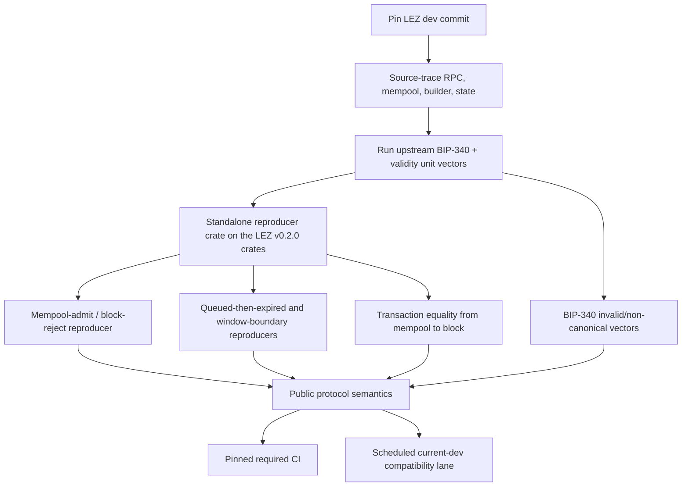

# LEZ primitive verification

Status: complete; pinned lightweight and native sequencer lanes pass —
2026-07-11 on the source-trace commit, 2026-09-09 on the LEZ v0.2.0 product pin
with the validity-window reproducers

## Pinned source

Repository: `logos-blockchain/logos-execution-zone`

Source trace (July 2026): `dev` /
`cac4921581b37e85ae25e940f3a62412cd22308e`.

Executable lanes: LEZ v0.2.0 /
`a58fbce2ff48c58b7bb5001b1a27e64b9596ee3a`, the same commit
`deploy/scripts/from-scratch.sh` builds the product from. The findings below
were re-checked on that commit; the acceptance path is unchanged.

## Findings

1. `ValidityWindow::is_valid_for` implements `from <= value < to`.
2. Both public and privacy-preserving state tests cover lower/upper boundaries.
3. Sequencer RPC authentication pushes user transactions into the mempool; it
   does not evaluate validity windows at admission.
4. Block construction validates against the new block height and timestamp and
   skips invalid transactions.
5. LEZ `Signature` contains the submitted 64-byte value. Verification parses
   those bytes as a BIP-340 `k256` signature. No normalization assignment was
   found between authenticated transaction decoding and block inclusion.

## Protocol answers

- Validity is lower-inclusive and upper-exclusive.
- Enforcement that determines inclusion occurs at block construction/validation,
  not initial RPC/mempool admission. Deadlines must include uncertain mempool
  residence and next-block timestamp/height.
- BIP-340 does not offer the ECDSA-style arbitrary `s -> -s` alternative assumed
  by the original question. The relevant invariant is exact accepted-byte
  preservation for extracting `t = s - s'`. The pinned sequencer test compares
  the complete submitted transaction, including its `[u8; 64]` signature, with
  the included transaction.

## Executable evidence

- `lee_core` guest-free tests exercise the shared validity type at its inclusive
  lower and exclusive upper bounds. The same type represents block-height and
  timestamp windows.
- `lee` public and privacy-preserving transaction tables exercise block-height
  and timestamp windows before, inside, and at both bounds. These remain in the
  optional guest-toolchain lane.
- the sequencer reproducers are a standalone crate,
  [`compat/lez-v0.2-sequencer-reproducers`](../../compat/lez-v0.2-sequencer-reproducers/README.md),
  pinned by Cargo to the LEZ v0.2.0 crates. Nothing is patched into upstream;
  the tests start the real `sequencer_core` with its mock block publisher,
  submit through the real mempool handle, and produce blocks with the real
  builder through upstream's public API.
- one reproducer enqueues two identical signed transactions and asserts that
  the block contains exactly one transaction equal to the original, plus the
  clock transaction. This proves block-time rejection and accepted-byte
  preservation on the real builder path.
- one reproducer enqueues a stateless-valid but balance-invalid signed
  transfer, observes successful mempool admission, produces a block, and
  asserts that only the clock transaction is included. This executes the
  admission/validation split rather than trusting the source-path string checks.
- a test-only `windowed_transfer` guest moves balance through a chained call to
  the built-in authenticated-transfer program and stamps caller-chosen block
  and timestamp validity windows on its output. Five reproducers deploy it
  through the mempool and drive otherwise-valid transfers through the real
  block builder:
  - queued while valid, expired before inclusion: with one user transaction per
    block, a transfer valid only for the next block is queued behind a filler,
    misses that block, is evaluated at the following height, and is dropped
    with no balance or nonce change and nothing surfacing in a later block;
  - block-window start is inclusive: dropped one block before the start, and
    the identical bytes are included exactly at the start;
  - block-window end is exclusive: included at the last block before the end,
    dropped exactly at the end;
  - a timestamp window that closes while the transfer waits in the mempool
    expires it, asserted against the timestamp the builder stamped on the block;
  - not-yet-open and already-closed timestamp windows are dropped from the same
    block that includes an open one.
  Block heights are exact because the tests control block production.
  Timestamps come from the builder's wall clock, so the timestamp cases use
  margins rather than exact millisecond bounds.
- the embedded official BIP-340 verification vectors include invalid field
  elements and an `s` scalar equal to the curve order; the pinned verifier rejects
  them rather than accepting or rewriting them.

The scheduled/manual workflow has two isolated lanes: the pinned commit runs the
sequencer reproducers with at most two Cargo build jobs; current `dev` runs the
lightweight semantic and source-drift checks. The verifier clones upstream into
a unique temporary directory for the lightweight checks only, and never starts
Docker or binds a port; the reproducers run in-process with the mock publisher.

The pinned native lane builds `rzup` from immutable RISC Zero commit
`8eb06ab020a92dc5b63ba6dd0836d432aba6d890` with its lockfile, then installs
`r0vm` 3.0.5, matching the pinned LEZ `risc0-zkvm` dependency, and the RISC
Zero Rust toolchain for the test guest, and executes in upstream's
`RISC0_DEV_MODE=1`. The lightweight lane does not install RISC Zero.

The executable runner is `scripts/verify-lez-primitives.sh`. Source checks are
early drift diagnostics; the tests, not those string matches, are the behavioral
evidence. The sequencer lane first checks that the reproducer crate pins the
commit the script verifies, asserts every exact test name occurs in Cargo's
test listing, and then runs each with `--exact`; a zero-test filtered command
cannot report a false green. Because the reproducers deploy a guest program,
the lane compiles it with the RISC Zero Rust toolchain (`rzup install rust`)
in addition to `r0vm`.

Observed from a clean, unique checkout at the pinned commit on 2026-07-11:

- all 14 guest-free validity-window cases passed;
- the complete embedded BIP-340 verification-vector test passed;
- Cargo listed both required native sequencer tests under the `mock` feature;
- the repository-owned mempool-admit/block-reject reproducer ran exactly once
  and passed; and
- upstream's transaction replay/equality test ran exactly once and passed.

Observed on 2026-09-09 from `scripts/verify-lez-primitives.sh` with
`LEZ_VERIFY_SEQUENCER=1` against LEZ v0.2.0 (`a58fbce2`), on macOS arm64 with
`r0vm` 3.0.5 and the RISC Zero Rust toolchain 1.97.0:

- all 14 guest-free validity-window cases and the BIP-340 vector test passed on
  a fresh upstream checkout;
- the reproducer crate's pinned `lez_commit` matched the verified commit;
- Cargo listed all seven reproducers by exact name; and
- each reproducer ran exactly once with `--exact` and passed.

The July native run used `r0vm` 3.0.5, `RISC0_DEV_MODE=1`,
`RISC0_SKIP_BUILD=1`, and at most two Cargo build jobs. Guest-backed validity
tests require the separate RISC Zero Rust toolchain; run them with
`LEZ_VERIFY_GUESTS=1` after `rzup install rust`. They are additional upstream
coverage, not an M1 exit dependency, and the project does not silently install
that prerequisite.
