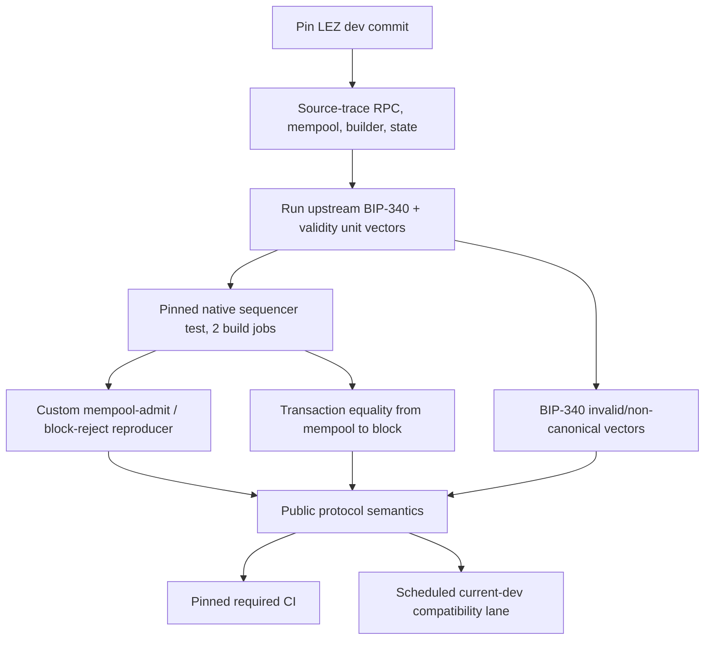

# LEZ primitive verification

Status: complete; pinned lightweight and native sequencer lanes pass —
2026-07-11

## Pinned source

Repository: `logos-blockchain/logos-execution-zone`

Branch/commit inspected: `dev` /
`cac4921581b37e85ae25e940f3a62412cd22308e`

## Findings

1. `ValidityWindow::is_valid_for` implements `from <= value < to`.
2. Both public and privacy-preserving state tests cover lower/upper boundaries.
3. Sequencer RPC authentication pushes user transactions into the mempool; it
   does not evaluate validity windows at admission.
4. Block construction validates against the new block height and timestamp and
   skips invalid transactions.
5. LEZ `Signature` contains the submitted 64-byte value. Verification parses
   those bytes as a BIP-340 `k256` signature. No normalization assignment was
   found between authenticated transaction decoding and block inclusion.

## Protocol answers

- Validity is lower-inclusive and upper-exclusive.
- Enforcement that determines inclusion occurs at block construction/validation,
  not initial RPC/mempool admission. Deadlines must include uncertain mempool
  residence and next-block timestamp/height.
- BIP-340 does not offer the ECDSA-style arbitrary `s -> -s` alternative assumed
  by the original question. The relevant invariant is exact accepted-byte
  preservation for extracting `t = s - s'`. The pinned sequencer test compares
  the complete submitted transaction, including its `[u8; 64]` signature, with
  the included transaction.

## Executable evidence

- `lee_core` guest-free tests exercise the shared validity type at its inclusive
  lower and exclusive upper bounds. The same type represents block-height and
  timestamp windows.
- `lee` public and privacy-preserving transaction tables exercise block-height
  and timestamp windows before, inside, and at both bounds. These remain in the
  optional guest-toolchain lane.
- the pinned sequencer test enqueues two identical signed transactions and
  asserts that the block contains exactly one transaction equal to the original,
  plus the clock transaction. This proves block-time rejection and accepted-byte
  preservation on the real builder path.
- a repository-owned patch adds a pinned sequencer test that enqueues a
  stateless-valid but balance-invalid signed transfer, observes successful
  mempool admission, produces a block, and asserts that only the clock
  transaction is included. This executes the admission/validation split rather
  than trusting the source-path string checks.
- the embedded official BIP-340 verification vectors include invalid field
  elements and an `s` scalar equal to the curve order; the pinned verifier rejects
  them rather than accepting or rewriting them.

The scheduled/manual workflow has two isolated lanes: the pinned commit runs the
native sequencer test with at most two Cargo build jobs; current `dev` runs the
lightweight semantic and source-drift checks. The verifier clones into a unique
temporary directory and never starts Docker or binds a port.

The pinned native lane builds `rzup` from immutable RISC Zero commit
`8eb06ab020a92dc5b63ba6dd0836d432aba6d890` with its lockfile, then installs
`r0vm` 3.0.5, matching the pinned LEZ `risc0-zkvm` dependency, and executes in
upstream's `RISC0_DEV_MODE=1`. The lightweight lane does not install RISC Zero.

The executable runner is `scripts/verify-lez-primitives.sh`. Source checks are
early drift diagnostics; the tests, not those string matches, are the behavioral
evidence. The native lane enables upstream's `mock` feature, asserts both exact
test names occur in Cargo's test listing, and then runs each with `--exact`; a
zero-test filtered command cannot report a false green.

Observed from a clean, unique checkout at the pinned commit on 2026-07-11:

- all 14 guest-free validity-window cases passed;
- the complete embedded BIP-340 verification-vector test passed;
- Cargo listed both required native sequencer tests under the `mock` feature;
- the repository-owned mempool-admit/block-reject reproducer ran exactly once
  and passed; and
- upstream's transaction replay/equality test ran exactly once and passed.

The native run used `r0vm` 3.0.5, `RISC0_DEV_MODE=1`,
`RISC0_SKIP_BUILD=1`, and at most two Cargo build jobs. Guest-backed validity
tests require the separate RISC Zero Rust toolchain; run them with
`LEZ_VERIFY_GUESTS=1` after `rzup install rust`. They are additional upstream
coverage, not an M1 exit dependency, and the project does not silently install
that prerequisite.
