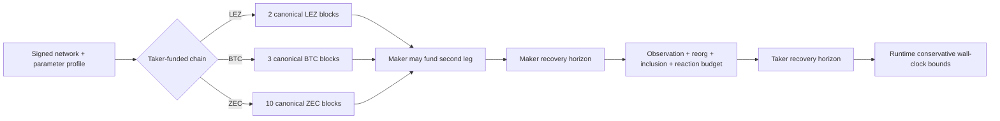

# Confirmation and recovery parameter profiles

Status: review candidate; public-testnet v1 defaults, not audited mainnet
parameters — 2026-07-11

## Scope and safety statement

These named profiles make Milestone 1 assumptions executable and reviewable.
`public-testnet-v1` targets LEZ testnet 0.2, Bitcoin testnet, Monero stagenet,
and Zcash testnet. It is deliberately conservative for integration and demos,
but is not a mainnet security recommendation. Mainnet profiles require measured
chain data, value-at-risk policy, fee-stress tests, and the Milestone 7 review.

No finite block count is a literal worst-case bound on a proof-of-work chain.
Atomicity therefore assumes eventual canonical progress and a configured upper
bound on observation/inclusion delay. If measured latency or reorg depth exceeds
the profile, new swaps stop; existing swaps retain their signed deadlines and
enter operator-alerted recovery. Software never silently shortens a negotiated
window.

## Canonicality policy

| Chain | `public-testnet-v1` claim-ready depth | Reason and response |
|---|---:|---|
| LEZ testnet 0.2 | 2 blocks | Detect a one-block regression before the maker funds; actual block cadence is measured at startup rather than assumed from the sequencer's 10-second fixture default |
| Bitcoin testnet | 3 blocks | More conservative than the pinned COMIT testnet's one-confirmation default while keeping public-testnet E2E practical |
| Monero stagenet | 10 blocks | Matches pinned COMIT `dc6ba84…` stagenet finality configuration; applies to the maker-funded Monero output before the LEZ claim |
| Zcash testnet | 10 blocks | About 12.5 target minutes at 75 seconds/block; zero-confirmation use is forbidden and reorg regression suspends dependent claims |

The relevant row is selected by the chain holding that leg, not by pair name.
For example, a BTC–LEZ swap whose taker funds LEZ waits two LEZ blocks before
the maker creates BTC, then waits three BTC blocks before the maker claims LEZ.
XMR-first is unsupported, so Monero is never the taker's first lock.

Every observation binds chain/network ID, block hash/height, transaction ID,
output/account ID, exact value/asset, script/program commitment, and depth. A
depth regression below policy revokes permission before maker funding and
suspends claims after maker funding; the exact committed transaction remains
pinned.

## Recovery horizons

Durations below are relative to canonical inclusion of the funded output. LEZ
uses its consensus clock timestamp. Bitcoin uses block-based BIP-68/CSV. Zcash
uses a BIP-199 CLTV height derived from the funding height. The runtime also
stores conservative Unix-time projections; raw cross-chain heights are never
compared.

| Pair/direction | Maker-funded leg recovery | Taker-funded leg recovery | Minimum target gap |
|---|---|---|---:|
| BTC, taker sells BTC | LEZ refund at +6 hours | BTC CSV at +72 blocks (~12 target hours) | 6 hours |
| BTC, taker sells LEZ | BTC CSV at +36 blocks (~6 target hours) | LEZ refund at +12 hours | 6 hours |
| ZEC, taker sells ZEC | LEZ refund at +2 hours | ZEC CLTV at +192 blocks (~4 target hours) | 2 hours |
| ZEC, taker sells LEZ | ZEC CLTV at +96 blocks (~2 target hours) | LEZ refund at +4 hours | 2 hours |
| XMR, taker sells LEZ | No Monero timelock: recover after the canonical LEZ refund reveals/completes the recovery share | LEZ refund at +12 hours | Event-gated; 2 LEZ confirmations after refund before Monero recovery |

The XMR row intentionally does not instantiate a fictional Monero deadline.
Its state model is `LEZ lock -> XMR fund -> LEZ claim/XMR spend` or `LEZ refund
-> maker key-share recovery/XMR spend`, following the reviewed COMIT direction.

## Margin budgets

The six-hour BTC gap reserves 30 minutes for chain observation and extraction,
30 minutes for LEZ inclusion/reconfirmation, three target Bitcoin blocks for a
fee-stressed claim/refund, and four hours of operator/transport slack. The
two-hour ZEC gap reserves 15 minutes for observation/extraction, 25 minutes for
20 target blocks of Zcash inclusion/reorg slack, 10 minutes for LEZ, and 70
minutes of reaction slack. These are acceptance budgets: fault tests inject each
component independently and at the combined limit.

For XMR, the 12-hour LEZ refund horizon follows the conservative scale of the
pinned COMIT mainnet cancel period (72 Bitcoin blocks) while avoiding any claim
that Monero itself enforces a timeout. Stagenet tests may use an accelerated
profile only when block production is controlled and the transcript names that
profile.

Runtime validates:

`taker_refund_earliest >= maker_recovery_latest + required_gap`

using a fastest-plausible clock for the taker leg and slowest-plausible clock
for the maker leg. Failure aborts before either lock. A profile is invalid when
its chain ID, basis, confirmation depth, fee policy, or projection epoch differs
from the signed terms.

## Zcash expiry and fee policy

`nExpiryHeight` is transaction liveness, not the HTLC refund condition. Per
[ZIP-203](https://zips.z.cash/zip-0203), expiry height `N` is valid through block
`N` and invalid at `N+1`; the post-Blossom default is 40 blocks. Claim/refund
builders set expiry from the current construction tip with a 40-block delta and
rebuild an expired unmined transaction with the same committed outpoint, script,
destination, branch, and CLTV terms. They never move the refund boundary.

Bitcoin BIP-68 block locks encode the first eligible relative height and are
tested at `N-1`, `N`, and after a reorg. Zcash CLTV and LEZ timestamp boundaries
receive the same before/at/after vectors. Fee policy uses node estimates bounded
by signed floors/ceilings and preserves CPFP/RBF anchors where the chain permits;
principal outputs never absorb an unnegotiated fee.

## Profiles used by tests

- `deterministic-local-v1`: ephemeral regtest/standalone networks, controlled
  block generation, one confirmation, and shortened deadlines expressed only
  in fixtures. It is rejected on public network IDs.
- `public-testnet-v1`: the values in this document; required for testnet smoke
  suites and recorded demos.
- `mainnet`: absent by design until calibration and formal review are complete.

The code representation must use named immutable profiles rather than scattered
numeric defaults. RED tests first cover direction-to-chain mapping, XMR's
event-gated recovery, every exact boundary, mixed-clock rejection, profile/network
mismatch, latency-budget exhaustion, and profile persistence across restart.

## Primary evidence

- [BIP-68](https://bips.dev/68/) defines consensus relative lock-time and
  block/time encodings; BIP-112 applies it through CSV.
- [ZIP-203](https://zips.z.cash/zip-0203) defines Zcash expiry and its 40-block
  post-Blossom default.
- pinned COMIT `xmr-btc-swap` commit `dc6ba84bbb1fe5ecc69581fec7dd8529567c4e32`
  configures 10 Monero confirmations and 72+72 Bitcoin blocks on mainnet,
  12+6 on testnet.
- pinned LEZ source uses configurable block creation and consensus-visible
  timestamp validity; its test fixture defaults to 10-second block creation,
  which is not treated as a public-testnet guarantee.
