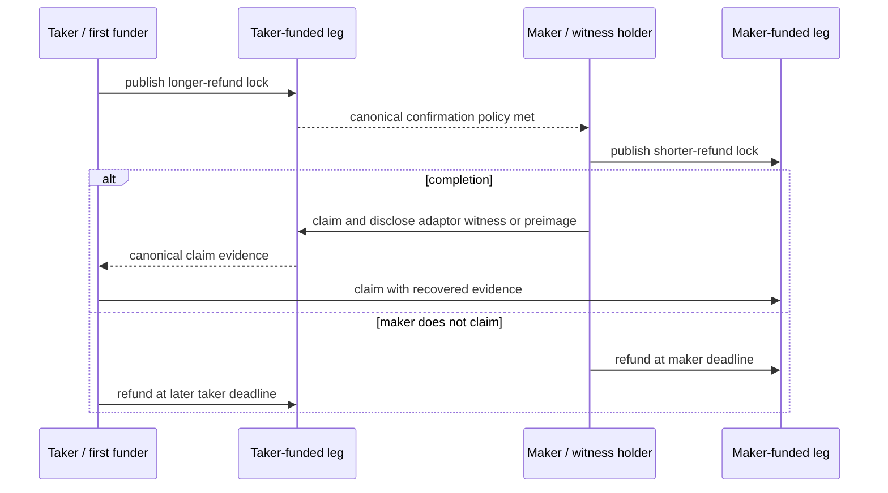

# Per-leg protocol design and atomicity argument

Status: review candidate; cryptographic vectors, calibrated parameters, and LEZ
sequencer reproducers remain executable entry gates — 2026-07-11

This design follows the live RFP-003 and accepted Gateway proposal #112. It uses
published constructions rather than inventing cryptography: BIP-340/BIP-341 and
DLC adaptor-signature vectors for BTC, the h4sh3d/COMIT construction for XMR,
and BIP-199 plus ZIP-203 for transparent ZEC.

## Common negotiated transcript

Before either lock, both parties sign and persist a transcript containing:

- protocol/version, swap ID, pair, supported direction, networks, amounts/assets;
- role keys, destinations, exact scripts/program commitments and expected outputs;
- adaptor point or SHA-256 digest, plus every proof needed before funding;
- confirmation/reorg policy, typed refund schedule and conservative safety bounds;
- fee/expiry policy and immutable transaction-template commitments; and
- transcript hash binding every later message and on-chain observation.

Discovery and Chat may transport this transcript but cannot alter it. The first
lock is not submitted until both parties have all recovery material required for
their current stage. The maker's second lock is forbidden until the first lock is
canonical at the negotiated policy.

## BTC–LEZ

The Bitcoin output is P2TR. Its cooperative claim uses a BIP-340 adaptor
signature and Taproot key path. ADR 0009 commits a CSV refund tapleaf for the
Bitcoin funder. The completed signature and adaptor pre-signature satisfy the DLC
witness-extraction relation; accepted signature bytes on LEZ remain protected by
the sequencer reproducer gate.

For `TakerSellsForeign`, the taker funds the longer Bitcoin output, then the maker
funds shorter LEZ escrow. The maker's Bitcoin key-path claim publishes the
completed signature; the taker extracts the witness and claims LEZ. For
`TakerSellsLez`, the taker funds longer LEZ escrow, the maker funds shorter BTC,
and the maker's LEZ claim publishes the completed witness-bearing signature so
the taker can complete the BTC key-path claim.

Security claims rely on the reviewed adaptor construction's aEUF-CMA security,
pre-signature adaptability, and witness extractability. A forged pre-signature,
wrong sighash/output, non-canonical scalar, changed signature bytes, or mismatched
Taproot commitment is terminal invalid evidence—not a retryable observation.

## XMR–LEZ

The supported direction is `TakerSellsLez`: LEZ, the scriptable/timelocked leg,
funds first. This matches the primary COMIT construction's scriptable-chain-first
constraint. `TakerSellsForeign` would put XMR first and is rejected until a new
construction and third-party review demonstrate its recovery path.

Participants form the Monero spend/view-key transcript and prove the required
secp256k1/Ed25519 discrete-log relationship with the published cross-curve DLEQ
construction. The taker locks longer LEZ escrow. After canonical confirmation,
the maker funds the agreed Monero address. The maker claims LEZ using the
adaptor-witness path; that canonical claim reveals the share/evidence from which
the taker reconstructs authority to spend the Monero output.

If the maker never claims LEZ, the taker refunds LEZ and the maker recovers XMR
using the pre-negotiated key-share recovery transcript. Every encrypted share,
DLEQ proof, view material, refund/cancel artefact, and transcript step is persisted
before the state that depends on it. Exact transaction/key-share encoding follows
the h4sh3d/COMIT vectors and is not represented by the generic 32-byte skeleton.

## Transparent ZEC–LEZ

The maker generates a 32-byte preimage and commits `SHA256(preimage)` in both
locks. The Zcash transparent output follows BIP-199 with `OP_SHA256` and a
consensus timelock refund branch; the LEZ escrow mirrors the hashlock. Either
direction is supported with the taker-funded leg carrying the longer deadline.

After both locks, the maker claims the taker-funded leg and reveals the preimage;
the taker observes it canonically and claims the maker-funded leg. If the maker
does not reveal it, the maker refunds the shorter leg first and the taker later
refunds the longer leg. `nExpiryHeight` is transaction-liveness policy, not the
HTLC refund condition: builders must leave enough inclusion room and recreate an
expired unmined transaction without changing the committed HTLC terms.

The transparent privacy posture is explicit: amounts, addresses, script branches,
and timing are public. Shield-after-swap is a separate user action, never an
atomicity property.

## Atomicity argument and failure partition

Assume canonical chain validation, unforgeable signatures/hashes, sound DLEQ,
durably available recovery material, and—on deadline-bearing paths—a safety
margin large enough for the taker to observe the maker claim and submit before
the maker refund.

1. Before the taker lock, neither party has funds at risk.
2. With only the taker lock, the maker cannot receive value without funding; the
   taker eventually uses its negotiated refund path.
3. With both locks, the maker receives the taker asset only by publishing the
   pair claim evidence. Witness extractability/hash preimage disclosure then
   gives the taker the exclusive missing input for the maker-funded claim.
4. For BTC/ZEC, if the maker does not claim, its shorter refund matures first;
   the taker's longer refund follows after the reaction margin. For XMR, the
   taker refunds LEZ; that canonical event completes the maker's persisted
   key-share recovery path for the maker-funded Monero output.
5. A confirmation regression suspends claims and pins the committed transaction;
   refunds remain available. A pre-maker removed lock may be explicitly replaced.

Thus every permitted terminal path is both claimed or both recovered. The period
after maker claim but before taker claim is safe only under the stated evidence
extraction, chain-observation, persistence, and calibrated-margin assumptions;
those are named test and audit gates rather than hidden guarantees.

## Primary references and executable gates

- [BIP-340](https://bips.dev/340/), [BIP-341](https://bips.dev/341/), and the
  DLC adaptor-signature specifications/vectors;
- [h4sh3d paper](https://eprint.iacr.org/2020/1126) and pinned
  [COMIT reference](https://github.com/comit-network/xmr-btc-swap/commit/dc6ba84bbb1fe5ecc69581fec7dd8529567c4e32);
- [BIP-199](https://bips.dev/199/) and
  [ZIP-203](https://zips.z.cash/zip-0203); and
- pinned LEZ source/standalone-sequencer validity and signature-byte reproducers.
