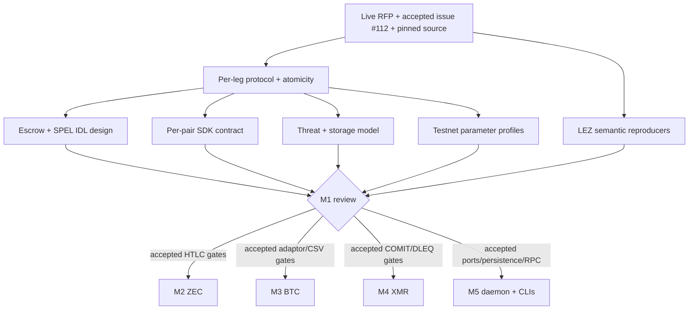

# Milestone 1 review and entry gates

Status: accepted; all Milestone 1 exit gates pass — 2026-07-11

## Scope review

The live RFP and accepted replacement proposal #112 agree on BTC, XMR, and
transparent ZEC against LEZ. ETH and shielded ZEC are excluded. Taker-first and
post-lock chain-only recovery are product invariants. Both directions are
supported for BTC/ZEC; the pinned COMIT implementation supports only LEZ-first
for XMR, so XMR-first is rejected in core and the real CLI/daemon.

The review used actual upstream source and executable behavior. Documentation
paths that still describe `nssa` or unverified SPEL compatibility are not
treated as platform truth.

## Deliverable review

| M1 deliverable | Review result | Remaining implementation evidence |
|---|---|---|
| Per-leg protocol and atomicity | Accepted design covers both BTC/ZEC directions, LEZ-first XMR, claim/recovery partitions, and named assumptions | Pair vectors and real-chain E2E in M2–M4 |
| LEZ escrow + SPEL IDL | Source-backed metadata PDA plus native vault/required ATA custody; direction-specific claim and permissionless fixed refund | Minimal SPEL compatibility build, generated client golden, standalone execution and CU measurement in M2 |
| Threat model | Covers witness extraction, byte stability, reorg/deadline races, XMR recovery, ZEC visibility, local RPC, encrypted persistence, concurrency, supply chain | Fault/fee/reorg matrices in M2–M5; formal review/remediation M7 |
| LEZ open questions | `[from,to)` boundaries and BIP-340 vectors pass; repository-owned mempool/block test and upstream transaction-equality test pass in a clean pinned checkout | Current-`dev` scheduled drift monitoring continues after M1 |
| SDK trait surface | Shared deterministic core plus three dedicated complete-lifecycle facades and typed evidence/errors | Compiling public APIs/examples and doc packets per implementation milestone |
| Persistence/node/RPC decisions | SQLite, Zebra/local construction, authenticated local RPC/core-daemon adapter recorded in accepted ADRs | Crash/outbox/encryption and transport hardening in M5 |
| Confirmation/recovery parameters | `public-testnet-v1` fixes depths and horizons; XMR is canonical-event/key-share gated | Telemetry/audit before any mainnet profile |

## Executable evidence

The repository gates currently provide:

- 21 Rust behavior/property/process tests across core, restart persistence, and
  the actual authenticated maker CLI/daemon boundary;
- 512 generated event sequences plus a permanent minimized reorg regression;
- explicit XMR wrong-direction, no-Monero-deadline, wrong-chain, confirmation
  regression, restart, and actual operator-command cases;
- formatting and strict all-target/all-feature Clippy;
- `cargo-deny` advisory, ban, license, and source checks (warnings are limited to
  permitted duplicate dependency versions and currently unused license allows);
- hard-requirement ID completeness; and
- a Mermaid presence/fence gate over every ADR and M1 design/review document.

The pinned lightweight LEZ run passes 14 validity-window cases and the complete
embedded BIP-340 verification vector test. In the clean native lane, Cargo first
listed both required exact test names; the repository-owned admission/block
reproducer then passed exactly once, and upstream's transaction-equality test
passed exactly once. The run was limited to two Cargo jobs and a unique
temporary checkout. It did not start Docker or bind a port.

The exact commit containing this accepted review receives the annotated
`m1-complete` tag only after the complete repository gate set passes against it.

## Entry gates after M1

### M2 — transparent ZEC

- Start RED with native/custom-token PDA/ATA substitution, exact balance,
  SHA-256 preimage, and claim/refund boundary vectors.
- Prove one SPEL-generated program/IDL/client against the pinned LEZ commit.
- Build Zebra plus local canonical Zcash construction in a uniquely named,
  ephemeral-port test harness; cover BIP-199 and ZIP-203 expiry recreation.
- Exit with role-realistic happy/refund/concurrent E2E and measured LEZ compute
  units on the named testnet 0.2 build.

### M3 — BTC

- Start RED from official DLC adaptor vectors and the exact BIP-340 witness
  relation used by the isolated LEZ claim authority.
- Exercise P2TR key-path claim plus CSV tapleaf refund at before/at/after heights,
  RBF/CPFP fee stress, reorg, and lost-key recovery against Bitcoin Core.
- Exit with both supported directions and real maker/taker role journeys.

### M4 — XMR

- Start RED from pinned COMIT/cross-curve-DLEQ vectors and exact typed key-share
  artefacts; do not retain the 32-byte placeholder evidence.
- Preserve LEZ-first-only capability and event-gated maker recovery through
  `monerod`/wallet RPC restart, scan lag, partial transcript loss, and reorg.
- Exit with stagenet happy/refund/concurrent role E2E.

### M5 — coordinator, daemon, and CLIs

- Replace prototype loopback HTTP capability with owner-restricted local
  transport/credential handling while preserving the Logos core-daemon adapter.
- Implement the single SQLite writer, atomic outbox/audit IDs, encrypted recovery
  envelopes, credential rotation, backup restore, and crash-at-every-transition
  matrix.
- Add actual taker CLI and Delivery/Chat loss E2E; internal protocol calls do not
  count as final user acceptance.

## Deliberate non-claims

M1 does not claim a deployed escrow, production cryptography, mainnet-safe
parameters, real-chain end-to-end completion, production RPC hardening, or an
audit. Those belong to later accepted milestones. No recorded demo may be
labelled end-to-end until it drives the same binaries, roles, credentials,
nodes, and recovery paths an actual user operates.
