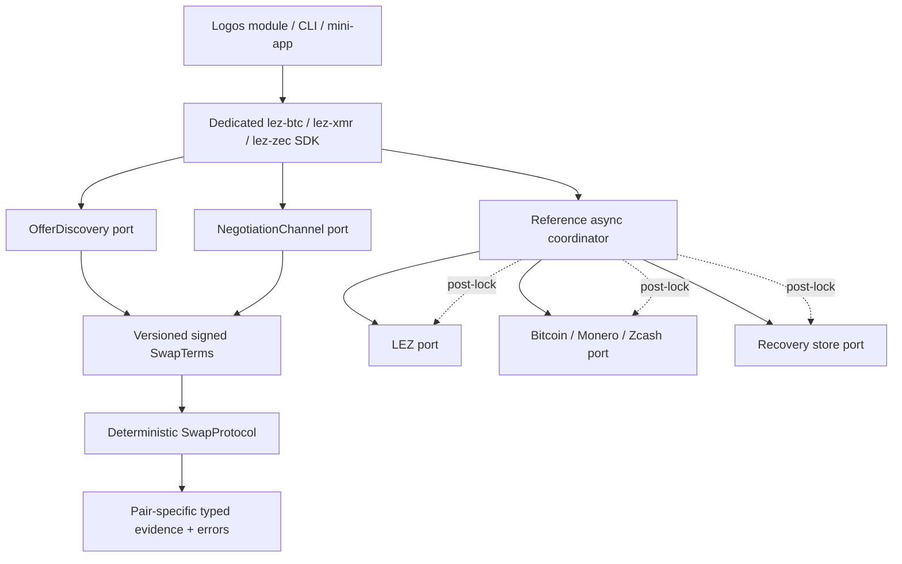
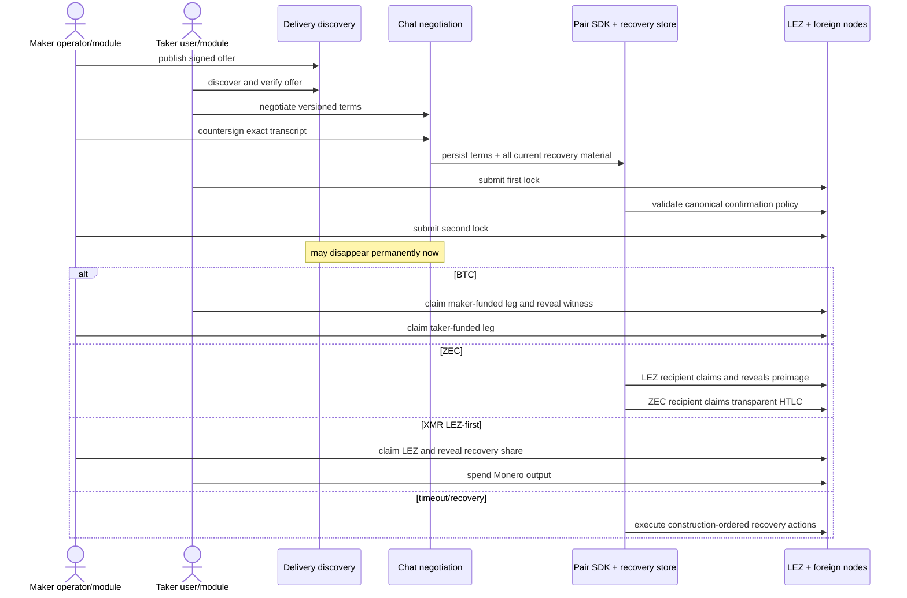

# Per-pair SDK trait surface

Status: review candidate for Logos — 2026-07-11



## Packaging decision

The deliverable is four Rust crates:

- `lez-swap-sdk-core`: versioned terms, role/direction types, deterministic
  lifecycle vocabulary, redacted secret wrappers, and common error taxonomy;
- `lez-btc-swap-sdk`, `lez-xmr-swap-sdk`, and `lez-zec-swap-sdk`: dedicated
  public entry points with pair-specific transactions, evidence, errors,
  examples, and doc packets.

Each pair crate exposes the complete user journey required by the RFP. The
discovery and negotiation ports remain separate from the deterministic protocol
engine so they cannot become accidental dependencies after the first lock. A
`PairSdk` facade composes them for applications; consumers that already have
Logos Delivery/Chat integration may use the protocol engine directly.

Async node/network traits are part of the optional reference coordinator, not
the deterministic compatibility core. This keeps replay/model tests synchronous
and lets Logos modules choose their runtime without hiding I/O behind protocol
validation.

## Lifecycle contract

The common shape below is illustrative Rust; associated types in each pair crate
remain concrete and documented.

```rust
pub trait SwapProtocol {
    type Terms;
    type Prepared;
    type FirstLockTemplate;
    type FirstLockEvidence;
    type SecondLockTemplate;
    type RevealingClaimEvidence;
    type FollowupClaimTemplate;
    type RecoveryAction;
    type Error: ProtocolError;

    fn validate_terms(&self, terms: &Self::Terms)
        -> Result<ValidatedTerms, Self::Error>;
    fn prepare(&self, terms: ValidatedTerms)
        -> Result<Self::Prepared, Self::Error>;
    fn build_first_lock(&self, prepared: &Self::Prepared)
        -> Result<Self::FirstLockTemplate, Self::Error>;
    fn validate_first_lock(&self, prepared: &Self::Prepared,
        evidence: &Self::FirstLockEvidence)
        -> Result<ConfirmedFirstLock, Self::Error>;
    fn build_second_lock(&self, prepared: &Self::Prepared,
        first: &ConfirmedFirstLock)
        -> Result<Self::SecondLockTemplate, Self::Error>;
    fn claim_order(&self, prepared: &Self::Prepared)
        -> ClaimOrder;
    fn validate_revealing_claim(&self, prepared: &Self::Prepared,
        evidence: &Self::RevealingClaimEvidence)
        -> Result<RecoveredClaimMaterial, Self::Error>;
    fn build_followup_claim(&self, prepared: &Self::Prepared,
        material: &RecoveredClaimMaterial)
        -> Result<Self::FollowupClaimTemplate, Self::Error>;
    fn recovery_action(&self, prepared: &Self::Prepared,
        state: &CanonicalChainState)
        -> Result<Self::RecoveryAction, Self::Error>;
}
```

`OfferDiscovery` yields authenticated, expiring offers. `NegotiationChannel`
produces a transcript signed by both roles. The resulting immutable `SwapTerms`
contains protocol/schema versions, pair and supported direction, chain/network
IDs, exact assets/amounts, fee policy, role keys/destinations, scripts/program
commitments, claim commitment, confirmation profile, typed recovery schedule,
and the hash of every pre-lock recovery artefact.

No public `advance()` accepts an untyped peer message. Only validated canonical
chain evidence or an explicit local command can cause a durable transition.

## Actor flow represented by every pair SDK



## Pair-specific evidence and recovery

| SDK | First/second lock evidence | Claim material | Recovery model |
|---|---|---|---|
| BTC–LEZ | exact P2TR outpoint/value/internal key/tapleaf/control block or LEZ escrow PDA/terms hash | adaptor pre-signature plus canonical completed BIP-340 signature, or scalar checked against adaptor point | Taproot CSV script-path refund on a BTC-funded leg; LEZ timestamp refund on a LEZ-funded leg |
| XMR–LEZ | LEZ-first escrow, DLEQ transcript, Monero address/amount/tx proof and 10-confirmation observation | canonical LEZ witnessed signature and typed Monero spend-key share | taker refunds LEZ; maker recovery of XMR is key-share/event-gated, not a Monero timelock |
| transparent ZEC–LEZ | exact transparent outpoint/value/BIP-199 redeem script/branch ID/expiry plus LEZ escrow | 32-byte SHA-256 preimage from the canonical LEZ claim, followed by the ZEC claim | LEZ timestamp refund first; ZEC CLTV refund later by the RFP-required margin |

XMR rejects `TakerSellsForeign` at term validation. BTC and ZEC support both
directions. Direction never changes taker-first funding. It can change which
participant is the LEZ recipient and therefore the first ZEC claimant; the
pair-specific `ClaimOrder` remains explicit rather than inferred from
maker/taker names.

## Ports and durability contract

Reference async ports are narrow capabilities: `LezChain`, `BitcoinChain`,
`MoneroChain`, `ZcashChain`, `OfferDiscovery`, `NegotiationChannel`, and
`RecoveryStore`. Chain ports expose typed observations and builders rather than
raw JSON-RPC values. `RecoveryStore::commit_transition` atomically writes the
validated event, new aggregate, secret-envelope changes, and pending outbox
commands before any externally visible follow-up action.

Every command has a stable request ID and is safe under at-least-once retry.
Adapters report chain identity and capability at startup, allowing one missing
chain to degrade independently. After the first lock, the coordinator type no
longer contains discovery or negotiation handles.

## Errors and secrets

The sealed `ProtocolError` taxonomy distinguishes:

- retryable observation lag, mempool residence, dependency outage, and reorg;
- terminal malformed/non-canonical evidence, wrong network/asset/value,
  transcript mismatch, and counterparty protocol violation;
- unsupported pair direction or adapter capability;
- unsafe confirmation/deadline/fee profile;
- persistence/encryption failure before a transition becomes durable; and
- operator intervention required without implying that funds are lost.

Pair errors retain their structured source values and map into this taxonomy;
string-only errors are not an SDK boundary.

Secrets use `secrecy` containers and `zeroize`/`Zeroizing`; they have redacted
`Debug`, no `Display`, and no default `Serialize`. Explicit encrypted recovery
envelopes are the only persistence representation. Cryptographic operations use
reviewed upstream crates and published vectors; the SDK does not expose custom
curve arithmetic.

## Compatibility and documentation policy

All public wire types carry a schema version. Minor releases may add optional
fields or error detail; changing transcript hashing, evidence meaning, or
on-chain encoding requires a new protocol version and migration guidance. The
workspace releases together until the first audited protocol version, avoiding
an untestable matrix of pair/core versions.

Each dedicated crate must have complete rustdoc and a compiling example for
offer discovery, negotiation, first lock, second lock, happy claim, timeout
recovery, crash resume, and post-lock Delivery/Chat loss. The examples use the
same role harness as black-box E2E tests, so documentation cannot demonstrate a
privileged internal API that real maker/taker users do not have.
