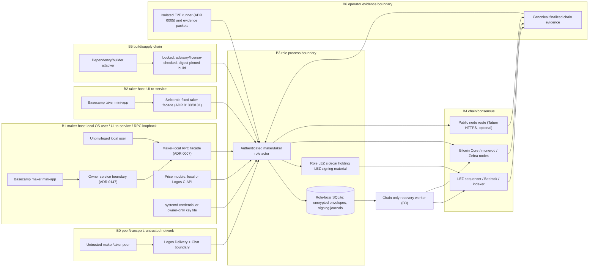

# Threat model

Status: re-baselined against the m3-plus branch — 2026-08-20. The
milestone-1 review candidate of 2026-07-11 is superseded by this revision,
which models the architecture actually built (role actors with LEZ sidecars,
owner services, maker-local RPC, Basecamp mini-apps, deploy tooling, and the
runner/evidence pipeline) instead of the M1 plan. Implementation evidence
remains milestone-gated; `Passing` claims live only in
[the traceability matrix](../requirements-traceability.md).

A same-day P0 revision completes the method: trust boundaries are drawn
explicitly on the DFD; the public node route, taker facade, credential
source, evidence packets, and runner are modeled as elements; TM-S-01 is
rated Critical; and TM-S-04/05, TM-T-10/11, TM-I-06, TM-D-06, and TM-E-04
enter the register.

Method: Shostack's four questions. What are we building — the DFD with
explicit trust boundaries B0–B6 plus the assets, actors, and personas below.
What can go wrong — STRIDE applied to every element and every cross-boundary
interaction, so coverage is systematic rather than brainstormed. What will we
do about it — each threat carries likelihood, impact, and an explicit
disposition with an owner and a closure condition. Did we do a good job — the
traceability matrix, milestone gates, and the M7 review scope regenerated from
this register's Critical/High rows close the loop; empty matrix cells are
justified below rather than left silent.

## Data flow diagram

Boundaries B0–B6 are drawn above. B0 is the untrusted peer/transport network;
B1 is the maker host (local OS user, mini-app to owner service to facade, RPC
loopback); B2 is the taker host UI-to-service boundary; B3 is the role process
boundary (actor, sidecar, store); B4 is chain/consensus, including any public
node route; B5 is the build/supply chain; B6 separates private run roots from
published evidence packets. Every edge that crosses a subgraph boundary
crosses a trust boundary, and each such interaction inherits the threats of
both endpoints.

## Assets and actors

Assets are maker/taker funds on LEZ and the foreign chain, adaptor secrets or
HTLC preimages, Monero spend-key shares, wallet and role keys, persisted
recovery state and signing journals, price configuration, daemon control
authority, the secret-bearing contents of private evidence run roots, and
counterparty/transaction privacy against metadata correlation.

Actors are the maker operator, taker user, potentially malicious counterparty,
chain miners/sequencers, Logos Delivery/Chat peers, local unprivileged users,
and a supply-chain attacker.

## Attacker personas

| Persona | Capability and objective |
|---|---|
| Rational counterparty | Fully protocol-aware; defects exactly when a profitable violation exists (stall after witness exposure, refuse second lock, present forged confirmations to induce a premature lock) |
| Vandal | Causes refunds/timeouts/delay for no profit; includes counterparty harassment post-reveal |
| Cheap-hashpower reorg attacker | Testnet/low-security hashpower to reorganize observed confirmations or finality windows |
| Compromised or faulty chain infra | LEZ sequencer/indexer equivocation, censorship, halt; fabricating consistent-but-false block/account facts (see LOGOS-004/016/017); a spoofed foreign node or public route feeding fabricated confirmations (TM-S-04) |
| Network adversary | Controls or jams Discovery/Chat delivery; replays, reorders, or mutates coordination messages |
| Surveillance analyst | Passively observes Delivery/Chat metadata, network timing, and public legs to link counterparties and amounts without violating protocol (TM-I-06) |
| Local unprivileged user | Same host, different UID; probes the RPC facade, files, process dumps, or argv |
| Supply-chain attacker | Compromises a dependency, builder image, or published artefact (TOOLCHAIN-001) |
| Operator insider or careless operator | Legitimate access misused; or leaks a private run root, key file, or recording bundle |

## Non-negotiable invariants

1. The maker never locks before the taker's foreign lock reaches pair-specific
   confirmation policy.
2. After the first lock, claim and refund need only persisted state and chain
   nodes.
3. No reachable terminal or intermediate state lets one party receive proceeds
   while preventing the other from claiming or eventually refunding.
4. LEZ refund becomes available before the foreign refund, with a margin that
   covers inclusion delay, reorgs, clock drift, and operator reaction.
5. Every swap has independent IDs, secrets, keys, transactions, deadlines, and
   database writes.
6. A crash may delay progress but cannot erase the data required to recover.
7. Refund safety depends on chain state and deadlines, never on which party's
   refund observation reaches the coordinator first.
8. Monero recovery is triggered by the canonical LEZ refund/key-share path; no
   component treats a Monero height as a native refund timelock.
9. Private run roots, signing journals, and demo recordings are secrets; only
   redacted, reviewed evidence packets are publishable (ADR 0052 discipline).

## STRIDE coverage matrix

Each DFD element is examined for every STRIDE category, and each
cross-boundary interaction inherits the threats of both endpoints; the
register below is complete with respect to this matrix. Empty cells are
dismissed explicitly below, not left silent.

| Element (boundary) | Spoofing | Tampering | Repudiation | Info disclosure | DoS | Elevation |
|---|---|---|---|---|---|---|
| Peer/Delivery/Chat (B0) | TM-S-01 | TM-T-02 | — | TM-I-06 | TM-D-01 | — |
| Maker-local RPC facade (B1) | TM-S-02 | — | TM-R-01 | TM-I-05 | TM-D-02 | TM-E-01 |
| Mini-app/owner service (B1) | TM-S-03 | — | TM-R-01 | TM-I-05 | TM-D-02 | TM-E-01/04 |
| Taker facade (B2) | TM-S-05 | — | TM-R-01 | — | TM-D-02 | TM-E-01 |
| Price module (B1) | — | — | — | — | TM-D-04 | — |
| Credential source (B1) | — | — | — | — | — | TM-E-01 |
| Role actor (B3) | TM-S-01 | TM-T-01/03/04/09/11 | TM-R-01 | TM-I-04/05 | TM-D-06 | — |
| LEZ sidecar (B3) | — | — | — | TM-I-01 | — | TM-E-01/03 |
| SQLite store (B3) | — | TM-T-05/06 | TM-R-01 | TM-I-02/03 | TM-D-05 | — |
| Chain nodes/sequencer (B4) | TM-S-04 | TM-T-03/08/10 | — | TM-I-04 | TM-D-03 | — |
| Public node route (B4) | TM-S-04 | — | — | TM-I-04 | TM-D-03 | — |
| Recovery worker (B3) | — | TM-T-07 | — | TM-I-03 | TM-D-03 | — |
| Build/supply chain (B5) | — | — | — | — | — | TM-E-02 |
| Runner/evidence pipeline (B6) | — | — | — | TM-I-03 | — | TM-E-01 |
| Evidence packets (B6) | — | — | TM-R-01 | TM-I-03 | — | — |

### Justified empties

- Spoofing on price, sidecar, store, recovery worker, credential, evidence,
  and build: these expose no forgeable remote identity; reaching them already
  requires crossing B1/B3/B5, which is elevation (TM-E-01/02/03).
- Tampering on facades and the public route: control commands are
  capability-authenticated and idempotent, and tampered observations are
  advisory, never authority (TM-S-02/03/04/05).
- Tampering on evidence packets: derived data; alteration requires private
  run-root access (TM-E-01) and meets the redaction checklist gate (TM-I-03).
- Repudiation on peer, chain, and price feed: accepted messages and chain
  effects are hash-bound into the signed transcript and journals (TM-R-01);
  chain state is public and consensus-timestamped; the feed issues no
  authoritative action.
- Info disclosure on the taker facade: it carries terms, capability tokens,
  and redacted fingerprints only (TM-I-05 discipline).
- DoS on sidecar, credential, build, runner, and evidence: halts fail closed
  into the safety partition (invariants 2 and 6) or are operational liveness
  accepted under TM-D-03 policy; a missing or wrong credential is a startup
  failure, not a fund event.
- Elevation on peer, actor, and store: the peer is untrusted by construction,
  the actor already holds full role authority, and the store has no execution
  surface — file access is host compromise (TM-E-01/02).

## Threat register

Likelihood and impact are coarse (Low/Medium/High; Critical = direct loss of
funds or keys). Disposition names the owning gate: an executable milestone
gate, an upstream-tracked blocker, an explicit acceptance, or policy/docs work.

| ID | Threat | L | I | Mitigation/evidence gate | Disposition |
|---|---|---|---|---|---|
| TM-T-01 | Maker locks on zero/insufficient confirmations | M | Critical | State transition rejects maker lock; adapters prove canonical confirmations | Gate: R1 adapter evidence M2–M4 |
| TM-T-02 | Discovery/Chat message tampering substitutes terms or observations | H | Critical | Signed transcript binds every later message and on-chain observation by hash; transport cannot alter it | Core passing; role E2E M5 |
| TM-T-03 | Rollback/reorg after observation | M | High | Regression/removal before maker lock revokes permission and permits explicit replacement; after maker lock the exact txid stays pinned, claims suspend, refunds remain; pair finality tests | Gate: reorg matrices M2–M4 |
| TM-T-04 | Deadline off-by-one or mixed clocks | M | Critical | Typed chain/basis positions reject cross-domain comparison; conservative bounds validate margin; LEZ `[from,to)` and pair boundaries are executable gates | Gate: R6 boundary tests |
| TM-T-05 | Missing/corrupt local state | M | Critical | SQLite FULL durability, encrypted secret handling, backups, restart/process-kill matrix | Gate: R4 kill-at-every-transition matrix M5 |
| TM-T-06 | Replay/duplicate chain event | M | High | Idempotency keys include pair, chain ID, txid, output index, swap ID | Core passing; chain replay tests M2–M4 |
| TM-T-07 | Concurrent swap cross-talk | M | High | Typed swap IDs, per-swap aggregates, DB primary keys, concurrent model/E2E tests; overlap run `m3overlap-20260717a` is initial evidence; arbitrary-N and same-direction LEZ nonce scheduling remain open | Gate: R5 M5 |
| TM-T-08 | Malicious/unsupported LEZ asset account | M | High | Metadata PDA, native vault PDA, ATA derivation, program owner, token definition, exact balance delta, fixed destinations are transcript-bound and guest-validated | Gate: F7 M2–M4 |
| TM-T-09 | Claim/refund race at LEZ boundary | L | Critical | Claim validity ends at the exclusive refund timestamp; refund entitlement starts inclusively; exact before/at/after standalone-sequencer tests | Gate: M2–M4 |
| TM-T-10 | LEZ escrow program authority compromise: the pinned guest program is upgraded or replaced to divert escrowed funds | L | Critical | Signed terms pin the canonical ProgramId/ELF and every escrow effect revalidates it before submission; upgrade-authority custody, quorum, and ceremony must be documented | Open: authority-custody documentation + M7 review; identity pinning gated by F5/F7 |
| TM-T-11 | Fee starvation inside the refund window: a fee storm strands a pre-signed BTC CSV / ZEC CLTV refund that cannot self-RBF | M | Critical | Refund constructions preserve CPFP/RBF anchors and signed fee floors/ceilings; fee policy never moves the refund boundary (parameter profiles); fault matrix injects fee storms at the margin limit | Gate: R6 fee-storm matrices M2–M3 (BTC) and M2–M4 (ZEC) |
| TM-S-01 | Counterparty impersonation via forged Delivery advertisement or session takeover | H | Critical | Role keys and the signed transcript bind identity before any lock; advertisement acceptance requires a possession proof of the advertised role key; reject unproven identities; rated Critical because a successful impersonation directly diverts taker funds | Open: possession-proof requirement + adversarial role E2E (M5); traceability F1 |
| TM-S-02 | Local RPC takeover | M | High | Current loopback adapter refuses remote bind and uses Bearer capability; production gate adds Unix peer permissions, credential file, least-privilege systemd unit, and audit log | Gate: hardening M5 (ADR 0007) |
| TM-S-03 | Mini-app or local client spoofing the owner service / facade | M | High | ADR 0147 isolates role packages over owner services; ADR 0130/0131 fix the taker facade; services require per-role capability tokens on the loopback boundary | Open: capability enforcement + Playwright adversarial cases (M6); U3/U5/U6 |
| TM-S-04 | Spoofed foreign node or public route (incl. the Tatum HTTPS lane) feeds fabricated confirmations or balances, defeating the TM-T-01/T-03 depth assumptions | M | Critical | Authority routes are self-hosted authenticated nodes (loopback, cookie where supported); public-route observations are advisory only and never authorize a lock; every observation binds chain/network ID, exact block/tx identity, and depth; second-source agreement for depth decisions is required | Open: route-authentication matrix + second-source policy (M5); depth-regression gates M2–M4 |
| TM-S-05 | Malicious maker displays false confirmations or balances to induce a premature taker lock | M | Critical | Taker lock authority consumes only the taker's own canonical observation over its own route; maker-supplied observations are transcript claims, never authority | Open: adversarial lying-maker taker E2E (M5); traceability F4/U4 |
| TM-R-01 | Operator or counterparty repudiates issued actions; disputes cannot be reconstructed | M | High | Signed negotiated transcript plus append-before-submit signing journals (ADR 0033) already persist order; gap is a hash-chained, tamper-evident audit log over control actions and chain effects, plus a documented dispute-evidence export format | Open: audit chain + export (M5 design, M7 review) |
| TM-I-01 | Key material exposed through upstream `Debug`/`Display`, cloning, and non-zeroized copies | M | Critical | Never format upstream `PrivateKey`; role-owned sidecar wrapper and capability boundary; prohibit secret-bearing diagnostics; retain leak tests | Upstream: LOGOS-008 (compensating control live; exit = upstream redaction/zeroize or HSM signer) |
| TM-I-02 | Plaintext wallet storage and argv key import | L | High | Fixture discipline only: `umask 077`, `0700` role homes, `0600` files, throwaway keys, argv boundary labelled in evidence, state deleted after collection | Upstream: LOGOS-018 (no public/long-lived key uses this path) |
| TM-I-03 | Private evidence run roots, journals, or demo bundles leak keys, signed transactions, or capabilities | M | High | Run roots stay owner-private and are never published; published packets are redacted secret-safe checkpoints; ADR 0052 binds recordings to actual node evidence; operator runbook states the redaction standard | Policy + gate: redaction checklist enforced at packet publication (M3+ now, M7 audit) |
| TM-I-04 | Swap linkability and address reuse across swaps or pairs | H | Medium | Fresh destination addresses/keys per swap per invariant 5; BTC cooperative claims are key-path (script invisible) while refund paths are inherently visible; ZEC transparent amounts/scripts/linkage are public by design and documented; XMR is private by construction | Policy/docs: linkability posture stated per pair (now); fresh-address enforcement test (M5) |
| TM-I-05 | Secrets exposed via core dumps, crash reports, swap space, or over-shared diagnostics | L | Critical | Disable/limit core dumps for daemon and sidecars; secrets in `secrecy`/`Zeroizing` containers; logs carry envelope IDs and redacted fingerprints only | Open: process hardening + dump policy in systemd unit (M5) |
| TM-I-06 | Coordination metadata surveillance: Delivery/Chat timing and participant linkage, IP exposure, cross-leg timing correlation | H | Medium | Metadata posture documented per component (what Delivery/Chat and each public leg reveal); fresh addresses/keys per swap (invariant 5); timing budgets stated; network-level protection is operator guidance, not a protocol claim | Policy/docs: posture statement now; correlation review M7 |
| TM-D-01 | Delivery/Chat outage or malicious withholding | H | Medium | Persist negotiated transcript before lock; post-lock API has no transport dependency (invariant 2); retries/buffering and user-visible degraded state | Partial (R2); outage matrix M5 |
| TM-D-02 | Taker-initiation flood or resource exhaustion of maker (disk, connections, CPU) | H | Medium | Admission control and rate limits on the taker facade and RPC; per-swap quotas; bounded mempool/scan windows already cap observation cost | Open: admission-control design + load tests (M5) |
| TM-D-03 | LEZ sequencer censorship, halt, or equivocation; foreign node outage | M | High | Safety partition: liveness-only threat — claims suspend, refunds remain per deadlines, no double-transition occurs; canonicality policy halts new swaps and operator-alerts on profile violation; authoritative-node trust compensations LOGOS-004/007/014/016/017 bound observation risk | Accepted for liveness (bounded halt policy in parameter profiles); R3 cross-pair isolation M5 |
| TM-D-04 | Price-feed compromise | M | Medium | Bounds/staleness policy, operator limits, explicit source health; never weakens atomicity (economically harmful but valid swap only) | Gate: F8 fake/stale feed tests M5 |
| TM-D-05 | Backup without decryption key, or key without database | L | High | Operator runbook backs up encrypted DB and master credential as two separately access-controlled artefacts and performs a restore drill before enabling non-demo value | Gate: M5 restore drill |
| TM-D-06 | Alert-path failure: monitoring/notification outage during the margin window leaves an operator-unaware refund deadline | M | High | Watchtower-style self-monitoring with a fallback alert channel distinct from the primary path; deadlines persist ahead of time so recovery needs no live operator decision; escalation drill exercises alert-path failure inside the budget | Open: fallback alert channel + escalation drill (M5); budgets already gated by R6 |
| TM-E-01 | Privilege escalation between actor, sidecar, mini-app services, or local user | M | High | Sidecar holds signing material behind a capability boundary with no unnecessary egress; least-privilege systemd units; ADR 0005 per-run isolated Compose projects/networks/ephemeral ports; ADR 0147 isolates Basecamp role packages over owner services | Open: hardened units + seccomp profile (M5); isolation live in E2E |
| TM-E-02 | Dependency or builder compromise (incl. CVE-laden builder image, LGPL archive obligations) | L | Critical | Lockfile, cargo-deny advisories/licenses/sources, minimal features, reviewed updates, digest-pinned builder with visible CI scans reproducing exact ELF/ProgramId | Upstream: TOOLCHAIN-001, LOGOS-002/009/010/012 (register + gates live) |
| TM-E-03 | LEZ sequencer binds `0.0.0.0` with no auth in compatibility lane | L | Medium | Run only inside a unique isolated Compose network with no host node port; loopback-only sidecar mapping | Upstream: LOGOS-006 (compatibility lane only, not production) |
| TM-E-04 | Mini-app distribution or Basecamp platform compromise substitutes a hostile UI or exfiltrates capability tokens | L | High | Consumer-locked builds (ADR 0146) pin exact artefacts; role packages isolated over owner services (ADR 0147); capability tokens are per-role, short-lived, and loopback-bound so a stolen token is not durable authority | Open: distribution pinning review + Playwright adversarial cases (M6); U5/U6 |

## Bitcoin-specific threats

- Adaptor pre-signature forgery or failed witness extraction: use a reviewed
  construction and DLC vectors; prove aEUF-CMA, witness extractability, and
  pre-signature adaptability assumptions.
- Refund fragility: ADR 0009 selects a consensus-enforced Taproot script-path CSV
  refund. Validate exact boundary, key backup, current-fee construction, RBF/CPFP,
  and reorg behavior against Bitcoin Core.
- Signature byte mutation: extraction depends on the accepted BIP-340 scalar.
  The pinned sequencer transaction-equality test is the byte-preservation gate;
  the claim authority is isolated per swap so its message and nonce are frozen.
- UTXO replacement/fee starvation: bind exact outpoint/script/value and maintain a
  fee-bump path that cannot alter adaptor commitments.

## Monero-specific threats

- Invalid cross-curve DLEQ or subgroup handling: use COMIT/h4sh3d construction and
  published vectors; reject non-canonical points/scalars.
- Spend-key-share loss or partial transcript loss: persist encrypted shares and
  every signed recovery artefact before advancing.
- View/spend key confusion and wallet scan lag: separate typed keys and require
  canonical wallet/node observations before transitions.
- Counterparty disappears after witness exposure: recovery instructions must be
  derivable from persisted state without Chat.
- The maker-funded Monero output has no script/timelock. If the maker does not
  claim LEZ, the taker refunds LEZ and the resulting recovery-share path lets
  the maker spend XMR. The coordinator must not expose maker recovery before
  canonical LEZ refund evidence and must retain it after restart.
- Unsupported XMR-first funding: the pinned COMIT construction requires the
  scriptable leg first, so core term validation and CLI/daemon reject XMR-first.

## Zcash-specific threats

- Transparent-pool privacy confusion: UI and docs state that amounts, scripts,
  addresses, and linkage are public (TM-I-04); shield-after-swap is guidance,
  not a property of the atomic swap.
- BIP-199 script branch or CLTV error: canonical script vectors, minimal script,
  exact transaction-version/branch-ID tests, and third-party review.
- `nExpiryHeight` or reorg interaction: expiry is distinct from refund CLTV;
  construction and fee policy must leave enough blocks for both claim and refund.
- Node transition risk: use Zebra, construct locally with canonical Zcash crates,
  and pin network-upgrade behavior.

## Secret storage and operator recovery decision

Secret material is persisted only as versioned per-swap envelopes encrypted
with RustCrypto `XChaCha20Poly1305`; keys are derived per swap and purpose with
HKDF-SHA256 from a random 256-bit master credential. Nonces come from the OS CSPRNG
and are never reused for a key. The implementation uses the maintained crates,
published algorithms, `secrecy`, and `zeroize`; it does not implement primitives.
Associated data binds schema version, swap ID, pair, direction, and terms hash.

The master credential is supplied through `systemd-creds` where available or an
owner-only file outside the database directory. It is never accepted through a
CLI argument or environment variable. Startup fails closed for encrypted swaps
when the credential is missing/wrong; read-only public history may remain
available. Rotation decrypts and re-encrypts each envelope transactionally,
leaving the old credential valid until the new database commit is durable.

Backups contain the SQLite database/WAL checkpoint and the credential as
separate artefacts. The operator flow requires a restore-and-recovery dry run;
logs and diagnostics contain only envelope IDs and redacted fingerprints.

## Upstream trust compensations

The register references but does not duplicate
[the upstream blocker register](../upstream-production-blockers.md). Its
authoritative-node and observation-trust items (LOGOS-004, LOGOS-007,
LOGOS-014, LOGOS-016, LOGOS-017) are the standing compensations for the
compromised/faulty-LEZ-infra persona: every observation is fail-closed,
bounded, and never treated as independent consensus proof until finality is
cross-checked. M7 production readiness must close or explicitly accept each
open item; that review's scope is derived from the Critical/High rows of this
register plus the upstream table.

## Parameter and implementation gates

The quantified `public-testnet-v1` depths, direction-specific horizons, margin
budgets, and XMR event-gated recovery are in
[the parameter profile](parameter-profiles.md). They are testnet acceptance
defaults, not audited mainnet settings.

The remaining work is evidence, not an unstated design choice:

- M2 compiles a minimal SPEL-generated program against the pinned LEZ commit,
  validates the metadata/native-vault/ATA model, and measures compute units;
- M2–M4 execute exact boundary, reorg, fee-stress, evidence-extraction, and
  chain-only recovery matrices per pair;
- M5 implements encrypted envelopes, credential rotation, backup restore,
  process-kill durability, local-RPC hardening, admission control, audit-chain
  and dump hardening, and concurrent isolation; and
- M7 reviews the escrow, scripts, cryptographic protocols, parameter assumptions,
  storage, daemon boundary, and this register's open dispositions, with
  critical/high remediation required.

## Maintenance

- Every new ADR records its threat-model delta or states that none applies; the
  architecture decision log enforces this at review.
- The register is re-validated at each milestone gate and whenever
  `system-architecture.md`, the upstream blocker register, or the deployment
  map changes materially.
- New dispositions follow the register vocabulary: gate, open, upstream,
  accepted, or policy — with an owner and a closure condition.
- The M7 third-party review scope (traceability S12/S13) is generated from the
  Critical/High rows of this register, not renegotiated ad hoc.
